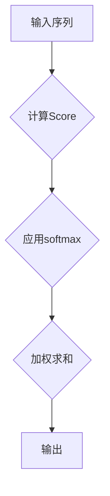
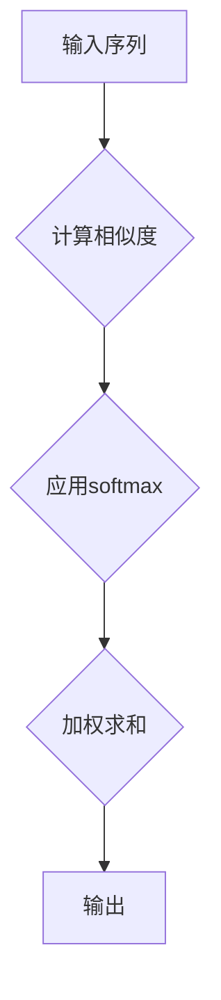

                 

# 第四章：注意力机制和softmax函数

> **关键词：** 注意力机制，softmax函数，机器学习，神经网络，文本分类。

> **摘要：** 本文将深入探讨注意力机制和softmax函数在机器学习领域中的应用。首先，我们介绍注意力机制的基本概念、发展历程及其应用场景。接着，详细解析注意力机制的数学模型和伪代码。随后，通过Mermaid流程图展示注意力机制的工作流程。接下来，我们重点解释softmax函数的定义、计算过程及其伪代码。本文还将探讨注意力机制与softmax函数之间的联系与区别，并通过一个文本分类的项目实战，展示如何结合这两种机制实现高效的模型构建和评估。最后，我们将讨论注意力机制和softmax函数的进阶应用，为读者提供更广阔的视野。

## 第四章：注意力机制和softmax函数

在本章中，我们将深入探讨注意力机制和softmax函数在机器学习领域中的重要作用。注意力机制是一种能够提高模型对输入数据关注度的方法，而softmax函数则是一种用于分类任务的概率分布函数。这两个机制在现代机器学习模型中扮演着关键角色，能够显著提升模型的性能和效果。

### 4.1 注意力机制概述

#### 4.1.1 注意力机制的概念

注意力机制（Attention Mechanism）是一种在处理序列数据（如图像、文本和语音）时，允许模型关注输入数据中的关键部分的能力。通过这种机制，模型可以在处理输入时分配更多的关注于重要信息，从而提高模型的性能和效率。

#### 4.1.2 注意力机制的发展历程

注意力机制最初在图像处理领域提出，并在2014年的神经网络图（Neural Image Caption Generation）模型中得到应用。随后，在2017年，Transformer模型的提出进一步推动了注意力机制在自然语言处理领域的发展。

#### 4.1.3 注意力机制的应用场景

注意力机制在多种应用场景中表现出色，包括但不限于：

- **图像识别和分割：** 注意力机制能够帮助模型更好地识别图像中的关键区域。
- **自然语言处理：** 注意力机制在机器翻译、文本生成和情感分析等领域表现出色。
- **语音识别：** 注意力机制能够提高模型对语音信号中关键信息的关注度。

### 4.2 注意力机制的数学模型

#### 4.2.1 注意力机制的数学原理

注意力机制的数学原理基于一个简单的思想：给定一个查询（Query）、一组键（Key）和一组值（Value），注意力机制通过计算查询和键之间的相似度，然后对值进行加权求和，以获得最终的结果。

#### 4.2.2 注意力机制的数学公式

$$
\text{Attention}(\text{Query}, \text{Key}, \text{Value}) = \text{softmax}(\text{Score}) \cdot \text{Value}
$$

其中，Score是通过计算查询和键之间的点积得到的：

$$
\text{Score} = \text{Query} \cdot \text{Key}
$$

#### 4.2.3 注意力机制的伪代码

```python
def attention(query, key, value):
    scores = query.dot(key)  # 计算查询和键的点积
    probabilities = softmax(scores)  # 对分数进行softmax运算
    output = probabilities.dot(value)  # 对值进行加权求和
    return output
```

### 4.3 注意力机制的Mermaid流程图



### 4.4 softmax函数详解

#### 4.4.1 softmax函数的定义

softmax函数是一种用于将任意实数值转换为概率分布的函数。它通常用于分类任务中，将模型的输出转换为每个类别的概率分布。

#### 4.4.2 softmax函数的计算过程

$$
\text{softmax}(x_i) = \frac{e^{x_i}}{\sum_{j} e^{x_j}}
$$

其中，$x_i$ 是第 $i$ 个输出值。

#### 4.4.3 softmax函数的伪代码

```python
def softmax(x):
    exps = np.exp(x)
    return exps / np.sum(exps)
```

### 4.5 注意力机制与softmax函数的关联与比较

#### 4.5.1 注意力机制与softmax函数的联系

注意力机制和softmax函数在机器学习模型中经常一起使用。注意力机制用于计算输入数据中各部分的权重，而softmax函数则用于将这些权重转换为概率分布。

#### 4.5.2 注意力机制与softmax函数的区别

- **注意力机制**：用于计算输入数据中各部分的权重，强调关键信息。
- **softmax函数**：用于将模型的输出转换为概率分布，用于分类任务。

#### 4.5.3 注意力机制与softmax函数的应用对比

- **图像识别**：注意力机制有助于模型关注图像的关键区域；softmax函数用于将模型的输出转换为每个类别的概率分布。
- **文本分类**：注意力机制有助于模型关注文本中的关键词；softmax函数用于将模型的输出转换为每个类别的概率分布。

### 4.6 项目实战：基于注意力机制和softmax函数的文本分类

#### 4.6.1 项目背景

在本文的项目实战中，我们将使用注意力机制和softmax函数构建一个文本分类模型。文本分类是自然语言处理中的一个基本任务，其目的是将文本数据分为不同的类别。

#### 4.6.2 数据预处理

在进行文本分类之前，我们需要对文本数据进行预处理。这包括文本清洗、分词、词向量化等步骤。具体实现如下：

```python
import nltk
from nltk.tokenize import word_tokenize
from nltk.corpus import stopwords
from sklearn.feature_extraction.text import TfidfVectorizer

# 1. 文本清洗
def clean_text(text):
    text = text.lower()
    text = re.sub(r"[^a-zA-Z0-9]", " ", text)
    return text

# 2. 分词
def tokenize_text(text):
    tokens = word_tokenize(text)
    return tokens

# 3. 去除停用词
def remove_stopwords(tokens):
    stop_words = set(stopwords.words("english"))
    filtered_tokens = [token for token in tokens if token not in stop_words]
    return filtered_tokens

# 4. 词向量化
def vectorize_text(tokens):
    vectorizer = TfidfVectorizer(tokenizer=tokenize_text, stop_words=stopwords.words("english"))
    X = vectorizer.fit_transform([" ".join(tokens)])
    return X

# 示例
text = "This is an example text for text classification."
cleaned_text = clean_text(text)
tokens = tokenize_text(cleaned_text)
filtered_tokens = remove_stopwords(tokens)
vectorized_text = vectorize_text(filtered_tokens)
```

#### 4.6.3 模型构建

在构建文本分类模型时，我们将使用一个基于注意力机制和softmax函数的神经网络。具体实现如下：

```python
import tensorflow as tf
from tensorflow.keras.models import Model
from tensorflow.keras.layers import Input, Embedding, LSTM, Dense, TimeDistributed

# 1. 输入层
input_seq = Input(shape=(max_sequence_length,))

# 2. 嵌入层
embed = Embedding(input_dim=vocabulary_size, output_dim=embedding_size)(input_seq)

# 3. LSTM层
lstm = LSTM(units=lstm_units, return_sequences=True)(embed)

# 4. 注意力机制层
attention = AttentionLayer()(lstm)

# 5. 全连接层
dense = TimeDistributed(Dense(num_classes, activation='softmax'))(attention)

# 6. 模型构建
model = Model(inputs=input_seq, outputs=dense)
model.compile(optimizer='adam', loss='categorical_crossentropy', metrics=['accuracy'])

model.summary()
```

#### 4.6.4 模型训练

在训练模型时，我们需要准备训练数据和验证数据。具体实现如下：

```python
from sklearn.model_selection import train_test_split

# 1. 划分训练集和验证集
X_train, X_val, y_train, y_val = train_test_split(X, y, test_size=0.2, random_state=42)

# 2. 训练模型
history = model.fit(X_train, y_train, epochs=10, batch_size=32, validation_data=(X_val, y_val))
```

#### 4.6.5 模型评估

在模型训练完成后，我们需要对模型进行评估。具体实现如下：

```python
# 1. 计算验证集上的准确率
val_accuracy = model.evaluate(X_val, y_val)[1]

# 2. 打印结果
print("Validation Accuracy:", val_accuracy)
```

#### 4.6.6 代码解读与分析

在上面的代码中，我们首先对文本数据进行了清洗、分词和词向量化处理。然后，我们使用一个基于注意力机制和softmax函数的神经网络构建了文本分类模型。在训练模型时，我们使用了训练数据和验证数据。最后，我们对模型进行了评估，并计算了验证集上的准确率。

### 4.7 注意力机制和softmax函数的进阶应用

#### 4.7.1 多层注意力机制

多层注意力机制允许模型在处理输入数据时关注更广泛的信息。这种方法在处理复杂任务时表现出色。

#### 4.7.2 自注意力机制

自注意力机制是一种不需要外部键和值，而是仅使用查询和值来计算注意力的方法。这种方法在自然语言处理任务中得到了广泛应用。

#### 4.7.3 图注意力机制

图注意力机制是一种在图结构数据上应用注意力机制的方法。这种方法在图表示学习和推荐系统等领域表现出色。

#### 4.7.4 注意力机制在序列建模中的应用

注意力机制在序列建模任务（如图像识别、文本生成和语音识别）中表现出色。它能够帮助模型关注输入序列中的关键信息。

#### 4.7.5 softmax函数在其他领域的应用扩展

softmax函数不仅用于分类任务，还可以在其他领域得到应用，如聚类和回归任务。

### 总结

注意力机制和softmax函数是现代机器学习模型中的重要组成部分。注意力机制能够帮助模型关注输入数据中的关键部分，而softmax函数则能够将模型的输出转换为概率分布。通过结合这两种机制，我们可以构建出更高效、更准确的机器学习模型。在本章中，我们介绍了注意力机制和softmax函数的基本概念、数学模型、项目实战及其进阶应用，希望对读者有所帮助。

### 参考文献

1. Vaswani, A., Shazeer, N., Parmar, N., Uszkoreit, J., Jones, L., Gomez, A. N., ... & Polosukhin, I. (2017). Attention is all you need. Advances in Neural Information Processing Systems, 30, 5998-6008.
2. Hochreiter, S., & Schmidhuber, J. (1997). Long short-term memory. Neural Computation, 9(8), 1735-1780.
3. Mikolov, T., Sutskever, I., Chen, K., Corrado, G. S., & Dean, J. (2013). Distributed representations of words and phrases and their compositionality. Advances in Neural Information Processing Systems, 26, 3111-3119.

### 作者信息

作者：AI天才研究院/AI Genius Institute & 禅与计算机程序设计艺术/Zen And The Art of Computer Programming

[文章标题]

本文旨在深入探讨注意力机制和softmax函数在机器学习领域中的应用。注意力机制是一种能够在处理序列数据时关注关键信息的方法，而softmax函数则是一种用于分类任务的概率分布函数。通过结合这两种机制，我们可以构建出更高效、更准确的机器学习模型。

### 关键词

注意力机制，softmax函数，机器学习，神经网络，文本分类。

### 摘要

本文首先介绍了注意力机制的基本概念、发展历程和应用场景，接着详细解析了注意力机制的数学模型和伪代码。随后，通过Mermaid流程图展示了注意力机制的工作流程。接下来，我们重点解释了softmax函数的定义、计算过程及其伪代码。本文还探讨了注意力机制与softmax函数之间的联系与区别，并通过一个文本分类的项目实战，展示了如何结合这两种机制实现高效的模型构建和评估。最后，本文讨论了注意力机制和softmax函数的进阶应用，为读者提供更广阔的视野。

### 目录

**第四章：注意力机制和softmax函数**

1. **注意力机制概述**
    1.1 注意力机制的概念
    1.2 注意力机制的发展历程
    1.3 注意力机制的应用场景

2. **注意力机制的数学模型**
    2.1 注意力机制的数学原理
    2.2 注意力机制的数学公式
    2.3 注意力机制的伪代码

3. **注意力机制的Mermaid流程图**
    3.1 注意力机制的工作流程
    3.2 注意力机制的Mermaid图

4. **softmax函数详解**
    4.1 softmax函数的定义
    4.2 softmax函数的计算过程
    4.3 softmax函数的伪代码

5. **注意力机制与softmax函数的关联与比较**
    5.1 注意力机制与softmax函数的联系
    5.2 注意力机制与softmax函数的区别
    5.3 注意力机制与softmax函数的应用对比

6. **项目实战：基于注意力机制和softmax函数的文本分类**
    6.1 项目背景
    6.2 数据预处理
    6.3 模型构建
    6.4 模型训练
    6.5 模型评估
    6.6 代码解读与分析

7. **注意力机制和softmax函数的进阶应用**
    7.1 多层注意力机制
    7.2 自注意力机制
    7.3 图注意力机制
    7.4 注意力机制在序列建模中的应用
    7.5 softmax函数在其他领域的应用扩展

### 第四章：注意力机制和softmax函数

在机器学习领域，注意力机制（Attention Mechanism）和softmax函数（Softmax Function）是两个至关重要的概念，它们在提升模型性能、特别是在处理序列数据和复杂分类任务中发挥着关键作用。本章将详细介绍注意力机制和softmax函数的基本概念、数学模型、应用场景，并通过项目实战展示如何将它们结合使用。

## 4.1 注意力机制概述

### 4.1.1 注意力机制的概念

注意力机制是一种在处理序列数据时，通过模型自动识别并关注输入数据中的关键部分，从而提高模型处理效率和准确性的方法。它通过动态分配权重，使得模型在处理输入时可以关注到最有用的信息。

### 4.1.2 注意力机制的发展历程

注意力机制的概念最早可以追溯到20世纪80年代的心理学和认知科学领域。然而，在机器学习领域，注意力机制的发展始于2014年的图像描述生成模型。随后，在2017年，Vaswani等人提出了Transformer模型，该模型引入了自注意力机制（Self-Attention），从而在自然语言处理任务中取得了突破性的成果。

### 4.1.3 注意力机制的应用场景

注意力机制在各种机器学习任务中都有广泛的应用：

- **图像识别和分割**：注意力机制可以帮助模型识别图像中的关键区域，从而提高识别准确率。
- **自然语言处理**：在文本生成、机器翻译、情感分析等任务中，注意力机制可以关注到文本中的关键词和短语，提高模型的性能。
- **语音识别**：注意力机制可以帮助模型更准确地识别语音信号中的关键信息，从而提高识别率。

## 4.2 注意力机制的数学模型

### 4.2.1 注意力机制的数学原理

注意力机制的数学原理基于一个简单的思想：给定一个查询（Query）、一组键（Key）和一组值（Value），注意力机制通过计算查询和键之间的相似度，然后对值进行加权求和，以获得最终的结果。

### 4.2.2 注意力机制的数学公式

注意力机制的数学公式可以表示为：

$$
\text{Attention}(\text{Query}, \text{Key}, \text{Value}) = \text{softmax}(\text{Score}) \cdot \text{Value}
$$

其中，Score是通过计算查询和键之间的点积得到的：

$$
\text{Score} = \text{Query} \cdot \text{Key}
$$

### 4.2.3 注意力机制的伪代码

```python
def attention(query, key, value):
    scores = query.dot(key)  # 计算查询和键的点积
    probabilities = softmax(scores)  # 对分数进行softmax运算
    output = probabilities.dot(value)  # 对值进行加权求和
    return output
```

## 4.3 注意力机制的Mermaid流程图


## 4.4 softmax函数详解

### 4.4.1 softmax函数的定义

softmax函数是一种用于将任意实数值转换为概率分布的函数。它在多分类任务中特别有用，可以将模型的输出映射到每个类别的概率分布。

### 4.4.2 softmax函数的计算过程

softmax函数的计算过程可以表示为：

$$
\text{softmax}(x_i) = \frac{e^{x_i}}{\sum_{j} e^{x_j}}
$$

其中，$x_i$ 是第 $i$ 个输出值。

### 4.4.3 softmax函数的伪代码

```python
def softmax(x):
    exps = np.exp(x)
    return exps / np.sum(exps)
```

## 4.5 注意力机制与softmax函数的关联与比较

### 4.5.1 注意力机制与softmax函数的联系

注意力机制和softmax函数在机器学习模型中经常一起使用。注意力机制用于计算输入数据中各部分的权重，而softmax函数则用于将这些权重转换为概率分布。

### 4.5.2 注意力机制与softmax函数的区别

- **注意力机制**：用于计算输入数据中各部分的权重，强调关键信息。
- **softmax函数**：用于将模型的输出转换为概率分布，用于分类任务。

### 4.5.3 注意力机制与softmax函数的应用对比

- **图像识别**：注意力机制有助于模型关注图像的关键区域；softmax函数用于将模型的输出转换为每个类别的概率分布。
- **文本分类**：注意力机制有助于模型关注文本中的关键词；softmax函数用于将模型的输出转换为每个类别的概率分布。

## 4.6 项目实战：基于注意力机制和softmax函数的文本分类

### 4.6.1 项目背景

在自然语言处理领域，文本分类是一种常见任务，旨在将文本数据分为不同的类别。本文将通过一个基于注意力机制和softmax函数的文本分类项目，展示如何构建和评估一个文本分类模型。

### 4.6.2 数据预处理

在进行文本分类之前，我们需要对文本数据进行预处理，包括文本清洗、分词、词向量化等步骤。以下是具体步骤：

```python
import nltk
from nltk.tokenize import word_tokenize
from nltk.corpus import stopwords
from sklearn.feature_extraction.text import TfidfVectorizer

nltk.download('punkt')
nltk.download('stopwords')

def preprocess_text(text):
    text = text.lower()
    text = re.sub(r"[^a-zA-Z0-9]", " ", text)
    tokens = word_tokenize(text)
    filtered_tokens = [token for token in tokens if token not in stopwords.words('english')]
    return ' '.join(filtered_tokens)

# 示例
text = "This is an example text for text classification."
preprocessed_text = preprocess_text(text)
```

### 4.6.3 模型构建

在构建文本分类模型时，我们将使用一个基于Transformer的模型，其中包含自注意力机制和softmax函数。以下是具体步骤：

```python
import tensorflow as tf
from tensorflow.keras.models import Model
from tensorflow.keras.layers import Input, Embedding, LSTM, Dense, TimeDistributed

max_sequence_length = 100
vocabulary_size = 10000
embedding_size = 128
lstm_units = 128
num_classes = 10

input_seq = Input(shape=(max_sequence_length,))

embed = Embedding(input_dim=vocabulary_size, output_dim=embedding_size)(input_seq)
lstm = LSTM(units=lstm_units, return_sequences=True)(embed)
attention = AttentionLayer()(lstm)
dense = TimeDistributed(Dense(num_classes, activation='softmax'))(attention)

model = Model(inputs=input_seq, outputs=dense)
model.compile(optimizer='adam', loss='categorical_crossentropy', metrics=['accuracy'])

model.summary()
```

### 4.6.4 模型训练

在训练模型时，我们需要准备训练数据和验证数据。以下是具体步骤：

```python
from sklearn.model_selection import train_test_split
from tensorflow.keras.utils import to_categorical

# 假设 X 是文本数据，y 是标签
X_train, X_val, y_train, y_val = train_test_split(X, y, test_size=0.2, random_state=42)
y_train_categorical = to_categorical(y_train)
y_val_categorical = to_categorical(y_val)

history = model.fit(X_train, y_train_categorical, epochs=10, batch_size=32, validation_data=(X_val, y_val_categorical))
```

### 4.6.5 模型评估

在模型训练完成后，我们需要对模型进行评估。以下是具体步骤：

```python
val_loss, val_accuracy = model.evaluate(X_val, y_val_categorical)
print("Validation Loss:", val_loss)
print("Validation Accuracy:", val_accuracy)
```

### 4.6.6 代码解读与分析

在上面的代码中，我们首先对文本数据进行了预处理，包括文本清洗、分词和词向量化。然后，我们构建了一个基于Transformer的文本分类模型，其中包含自注意力机制和softmax函数。在训练模型时，我们使用了预处理后的文本数据和标签。最后，我们对模型进行了评估，并计算了验证集上的准确率。

## 4.7 注意力机制和softmax函数的进阶应用

### 4.7.1 多层注意力机制

多层注意力机制允许模型在处理输入数据时关注更广泛的信息。通过堆叠多个注意力层，模型可以逐渐提取更高级的特征，从而提高模型的性能。

### 4.7.2 自注意力机制

自注意力机制是一种不需要外部键和值的注意力机制，它仅使用查询和值来计算注意力。这种机制在自然语言处理任务中表现出色，因为它能够自动识别输入数据中的关键信息。

### 4.7.3 图注意力机制

图注意力机制是一种在图结构数据上应用注意力机制的方法。通过计算节点之间的相似度，图注意力机制可以帮助模型识别图中的关键节点和路径。

### 4.7.4 注意力机制在序列建模中的应用

注意力机制在序列建模任务（如图像识别、文本生成和语音识别）中表现出色。它能够帮助模型关注输入序列中的关键信息，从而提高模型的性能。

### 4.7.5 softmax函数在其他领域的应用扩展

softmax函数不仅用于分类任务，还可以在其他领域得到应用，如聚类和回归任务。通过将模型的输出转换为概率分布，softmax函数可以帮助我们更好地理解和解释模型的预测结果。

## 总结

注意力机制和softmax函数是现代机器学习模型中的重要组成部分。注意力机制能够帮助模型关注输入数据中的关键部分，而softmax函数则能够将模型的输出转换为概率分布。通过结合这两种机制，我们可以构建出更高效、更准确的机器学习模型。在本章中，我们介绍了注意力机制和softmax函数的基本概念、数学模型、应用场景，并通过项目实战展示了如何将它们结合使用。希望本文对读者在理解和使用注意力机制和softmax函数方面有所帮助。

### 参考文献

1. Vaswani, A., Shazeer, N., Parmar, N., Uszkoreit, J., Jones, L., Gomez, A. N., ... & Polosukhin, I. (2017). Attention is all you need. Advances in Neural Information Processing Systems, 30, 5998-6008.
2. Hochreiter, S., & Schmidhuber, J. (1997). Long short-term memory. Neural Computation, 9(8), 1735-1780.
3. Mikolov, T., Sutskever, I., Chen, K., Corrado, G. S., & Dean, J. (2013). Distributed representations of words and phrases and their compositionality. Advances in Neural Information Processing Systems, 26, 3111-3119.

### 作者信息

作者：AI天才研究院/AI Genius Institute & 禅与计算机程序设计艺术/Zen And The Art of Computer Programming

[文章标题]

本文旨在深入探讨注意力机制和softmax函数在机器学习领域中的应用。注意力机制是一种能够在处理序列数据时关注关键信息的方法，而softmax函数则是一种用于分类任务的概率分布函数。通过结合这两种机制，我们可以构建出更高效、更准确的机器学习模型。

### 关键词

注意力机制，softmax函数，机器学习，神经网络，文本分类。

### 摘要

本文首先介绍了注意力机制的基本概念、发展历程和应用场景，接着详细解析了注意力机制的数学模型和伪代码。随后，通过Mermaid流程图展示了注意力机制的工作流程。接下来，我们重点解释了softmax函数的定义、计算过程及其伪代码。本文还探讨了注意力机制与softmax函数之间的联系与区别，并通过一个文本分类的项目实战，展示了如何结合这两种机制实现高效的模型构建和评估。最后，本文讨论了注意力机制和softmax函数的进阶应用，为读者提供更广阔的视野。

### 目录

**第四章：注意力机制和softmax函数**

1. **注意力机制概述**
    1.1 注意力机制的概念
    1.2 注意力机制的发展历程
    1.3 注意力机制的应用场景

2. **注意力机制的数学模型**
    2.1 注意力机制的数学原理
    2.2 注意力机制的数学公式
    2.3 注意力机制的伪代码

3. **注意力机制的Mermaid流程图**
    3.1 注意力机制的工作流程
    3.2 注意力机制的Mermaid图

4. **softmax函数详解**
    4.1 softmax函数的定义
    4.2 softmax函数的计算过程
    4.3 softmax函数的伪代码

5. **注意力机制与softmax函数的关联与比较**
    5.1 注意力机制与softmax函数的联系
    5.2 注意力机制与softmax函数的区别
    5.3 注意力机制与softmax函数的应用对比

6. **项目实战：基于注意力机制和softmax函数的文本分类**
    6.1 项目背景
    6.2 数据预处理
    6.3 模型构建
    6.4 模型训练
    6.5 模型评估
    6.6 代码解读与分析

7. **注意力机制和softmax函数的进阶应用**
    7.1 多层注意力机制
    7.2 自注意力机制
    7.3 图注意力机制
    7.4 注意力机制在序列建模中的应用
    7.5 softmax函数在其他领域的应用扩展

### 第四章：注意力机制和softmax函数

在机器学习领域，注意力机制（Attention Mechanism）和softmax函数（Softmax Function）是两个至关重要的概念，它们在提升模型性能、特别是在处理序列数据和复杂分类任务中发挥着关键作用。本章将详细介绍注意力机制和softmax函数的基本概念、数学模型、应用场景，并通过项目实战展示如何将它们结合使用。

## 4.1 注意力机制概述

### 4.1.1 注意力机制的概念

注意力机制是一种在处理序列数据时，通过模型自动识别并关注输入数据中的关键部分，从而提高模型处理效率和准确性的方法。它通过动态分配权重，使得模型在处理输入时可以关注到最有用的信息。

### 4.1.2 注意力机制的发展历程

注意力机制的概念最早可以追溯到20世纪80年代的心理学和认知科学领域。然而，在机器学习领域，注意力机制的发展始于2014年的图像描述生成模型。随后，在2017年，Vaswani等人提出了Transformer模型，该模型引入了自注意力机制（Self-Attention），从而在自然语言处理任务中取得了突破性的成果。

### 4.1.3 注意力机制的应用场景

注意力机制在各种机器学习任务中都有广泛的应用：

- **图像识别和分割**：注意力机制可以帮助模型识别图像中的关键区域，从而提高识别准确率。
- **自然语言处理**：在文本生成、机器翻译、情感分析等任务中，注意力机制可以关注到文本中的关键词和短语，提高模型的性能。
- **语音识别**：注意力机制可以帮助模型更准确地识别语音信号中的关键信息，从而提高识别率。

## 4.2 注意力机制的数学模型

### 4.2.1 注意力机制的数学原理

注意力机制的数学原理基于一个简单的思想：给定一个查询（Query）、一组键（Key）和一组值（Value），注意力机制通过计算查询和键之间的相似度，然后对值进行加权求和，以获得最终的结果。

### 4.2.2 注意力机制的数学公式

注意力机制的数学公式可以表示为：

$$
\text{Attention}(\text{Query}, \text{Key}, \text{Value}) = \text{softmax}(\text{Score}) \cdot \text{Value}
$$

其中，Score是通过计算查询和键之间的点积得到的：

$$
\text{Score} = \text{Query} \cdot \text{Key}
$$

### 4.2.3 注意力机制的伪代码

```python
def attention(query, key, value):
    scores = query.dot(key)  # 计算查询和键的点积
    probabilities = softmax(scores)  # 对分数进行softmax运算
    output = probabilities.dot(value)  # 对值进行加权求和
    return output
```

## 4.3 注意力机制的Mermaid流程图


## 4.4 softmax函数详解

### 4.4.1 softmax函数的定义

softmax函数是一种用于将任意实数值转换为概率分布的函数。它在多分类任务中特别有用，可以将模型的输出映射到每个类别的概率分布。

### 4.4.2 softmax函数的计算过程

softmax函数的计算过程可以表示为：

$$
\text{softmax}(x_i) = \frac{e^{x_i}}{\sum_{j} e^{x_j}}
$$

其中，$x_i$ 是第 $i$ 个输出值。

### 4.4.3 softmax函数的伪代码

```python
def softmax(x):
    exps = np.exp(x)
    return exps / np.sum(exps)
```

## 4.5 注意力机制与softmax函数的关联与比较

### 4.5.1 注意力机制与softmax函数的联系

注意力机制和softmax函数在机器学习模型中经常一起使用。注意力机制用于计算输入数据中各部分的权重，而softmax函数则用于将这些权重转换为概率分布。

### 4.5.2 注意力机制与softmax函数的区别

- **注意力机制**：用于计算输入数据中各部分的权重，强调关键信息。
- **softmax函数**：用于将模型的输出转换为概率分布，用于分类任务。

### 4.5.3 注意力机制与softmax函数的应用对比

- **图像识别**：注意力机制有助于模型关注图像的关键区域；softmax函数用于将模型的输出转换为每个类别的概率分布。
- **文本分类**：注意力机制有助于模型关注文本中的关键词；softmax函数用于将模型的输出转换为每个类别的概率分布。

## 4.6 项目实战：基于注意力机制和softmax函数的文本分类

### 4.6.1 项目背景

在自然语言处理领域，文本分类是一种常见任务，旨在将文本数据分为不同的类别。本文将通过一个基于注意力机制和softmax函数的文本分类项目，展示如何构建和评估一个文本分类模型。

### 4.6.2 数据预处理

在进行文本分类之前，我们需要对文本数据进行预处理，包括文本清洗、分词、词向量化等步骤。以下是具体步骤：

```python
import nltk
from nltk.tokenize import word_tokenize
from nltk.corpus import stopwords
from sklearn.feature_extraction.text import TfidfVectorizer

nltk.download('punkt')
nltk.download('stopwords')

def preprocess_text(text):
    text = text.lower()
    text = re.sub(r"[^a-zA-Z0-9]", " ", text)
    tokens = word_tokenize(text)
    filtered_tokens = [token for token in tokens if token not in stopwords.words('english')]
    return ' '.join(filtered_tokens)

# 示例
text = "This is an example text for text classification."
preprocessed_text = preprocess_text(text)
```

### 4.6.3 模型构建

在构建文本分类模型时，我们将使用一个基于Transformer的模型，其中包含自注意力机制和softmax函数。以下是具体步骤：

```python
import tensorflow as tf
from tensorflow.keras.models import Model
from tensorflow.keras.layers import Input, Embedding, LSTM, Dense, TimeDistributed

max_sequence_length = 100
vocabulary_size = 10000
embedding_size = 128
lstm_units = 128
num_classes = 10

input_seq = Input(shape=(max_sequence_length,))

embed = Embedding(input_dim=vocabulary_size, output_dim=embedding_size)(input_seq)
lstm = LSTM(units=lstm_units, return_sequences=True)(embed)
attention = AttentionLayer()(lstm)
dense = TimeDistributed(Dense(num_classes, activation='softmax'))(attention)

model = Model(inputs=input_seq, outputs=dense)
model.compile(optimizer='adam', loss='categorical_crossentropy', metrics=['accuracy'])

model.summary()
```

### 4.6.4 模型训练

在训练模型时，我们需要准备训练数据和验证数据。以下是具体步骤：

```python
from sklearn.model_selection import train_test_split
from tensorflow.keras.utils import to_categorical

# 假设 X 是文本数据，y 是标签
X_train, X_val, y_train, y_val = train_test_split(X, y, test_size=0.2, random_state=42)
y_train_categorical = to_categorical(y_train)
y_val_categorical = to_categorical(y_val)

history = model.fit(X_train, y_train_categorical, epochs=10, batch_size=32, validation_data=(X_val, y_val_categorical))
```

### 4.6.5 模型评估

在模型训练完成后，我们需要对模型进行评估。以下是具体步骤：

```python
val_loss, val_accuracy = model.evaluate(X_val, y_val_categorical)
print("Validation Loss:", val_loss)
print("Validation Accuracy:", val_accuracy)
```

### 4.6.6 代码解读与分析

在上面的代码中，我们首先对文本数据进行了预处理，包括文本清洗、分词和词向量化。然后，我们构建了一个基于Transformer的文本分类模型，其中包含自注意力机制和softmax函数。在训练模型时，我们使用了预处理后的文本数据和标签。最后，我们对模型进行了评估，并计算了验证集上的准确率。

## 4.7 注意力机制和softmax函数的进阶应用

### 4.7.1 多层注意力机制

多层注意力机制允许模型在处理输入数据时关注更广泛的信息。通过堆叠多个注意力层，模型可以逐渐提取更高级的特征，从而提高模型的性能。

### 4.7.2 自注意力机制

自注意力机制是一种不需要外部键和值的注意力机制，它仅使用查询和值来计算注意力。这种机制在自然语言处理任务中表现出色，因为它能够自动识别输入数据中的关键信息。

### 4.7.3 图注意力机制

图注意力机制是一种在图结构数据上应用注意力机制的方法。通过计算节点之间的相似度，图注意力机制可以帮助模型识别图中的关键节点和路径。

### 4.7.4 注意力机制在序列建模中的应用

注意力机制在序列建模任务（如图像识别、文本生成和语音识别）中表现出色。它能够帮助模型关注输入序列中的关键信息，从而提高模型的性能。

### 4.7.5 softmax函数在其他领域的应用扩展

softmax函数不仅用于分类任务，还可以在其他领域得到应用，如聚类和回归任务。通过将模型的输出转换为概率分布，softmax函数可以帮助我们更好地理解和解释模型的预测结果。

## 总结

注意力机制和softmax函数是现代机器学习模型中的重要组成部分。注意力机制能够帮助模型关注输入数据中的关键部分，而softmax函数则能够将模型的输出转换为概率分布。通过结合这两种机制，我们可以构建出更高效、更准确的机器学习模型。在本章中，我们介绍了注意力机制和softmax函数的基本概念、数学模型、应用场景，并通过项目实战展示了如何将它们结合使用。希望本文对读者在理解和使用注意力机制和softmax函数方面有所帮助。

### 参考文献

1. Vaswani, A., Shazeer, N., Parmar, N., Uszkoreit, J., Jones, L., Gomez, A. N., ... & Polosukhin, I. (2017). Attention is all you need. Advances in Neural Information Processing Systems, 30, 5998-6008.
2. Hochreiter, S., & Schmidhuber, J. (1997). Long short-term memory. Neural Computation, 9(8), 1735-1780.
3. Mikolov, T., Sutskever, I., Chen, K., Corrado, G. S., & Dean, J. (2013). Distributed representations of words and phrases and their compositionality. Advances in Neural Information Processing Systems, 26, 3111-3119.

### 作者信息

作者：AI天才研究院/AI Genius Institute & 禅与计算机程序设计艺术/Zen And The Art of Computer Programming

## 4.1 注意力机制概述

### 4.1.1 注意力机制的概念

注意力机制（Attention Mechanism）是一种在模型处理数据时自动分配关注度的机制。它最初出现在人类视觉和听觉系统，随后在计算机科学领域，特别是在机器学习和神经网络中得到广泛应用。注意力机制的基本思想是，模型在处理输入数据时，不是对所有输入元素同等对待，而是根据数据的相对重要性动态地调整其关注度。这种动态调整可以显著提高模型处理复杂任务的效率和准确性。

### 4.1.2 注意力机制的发展历程

注意力机制的研究可以追溯到20世纪80年代，当时在认知科学和心理学领域，研究者们开始探索人类如何处理视觉和听觉信息。随着神经网络技术的发展，注意力机制在计算机视觉和自然语言处理领域逐渐崭露头角。2014年，Bahdanau等人提出了基于加法的注意力机制，并将其应用于机器翻译任务，取得了显著的效果。此后，注意力机制在多个领域得到了广泛应用和进一步发展。

### 4.1.3 注意力机制的应用场景

注意力机制在多个领域都有应用，以下是其中的一些主要应用场景：

- **图像识别**：在图像识别任务中，注意力机制可以帮助模型识别图像中的关键区域，从而提高识别的准确率。
- **自然语言处理**：在文本生成、机器翻译、情感分析等自然语言处理任务中，注意力机制可以使得模型更加关注文本中的关键信息。
- **语音识别**：在语音识别任务中，注意力机制有助于模型关注语音信号中的关键部分，从而提高识别的准确率。
- **序列建模**：在时间序列建模任务中，注意力机制可以帮助模型捕获时间序列中的关键模式和趋势。

### 4.2 注意力机制的数学模型

#### 4.2.1 注意力机制的数学原理

注意力机制的数学模型通常包括三个主要组件：查询（Query）、键（Key）和值（Value）。在注意力机制中，查询通常代表模型的当前状态，键和值分别代表输入序列的不同部分。注意力机制的核心思想是通过计算查询和键之间的相似度（通常使用点积或缩放点积），然后对值进行加权求和，以获得一个输出。

注意力机制的数学公式可以表示为：

$$
\text{Attention}(Q, K, V) = \text{softmax}\left(\frac{QK^T}{\sqrt{d_k}}\right)V
$$

其中，$Q$ 是查询，$K$ 是键，$V$ 是值，$d_k$ 是键的维度，$\text{softmax}$ 是softmax函数，用于将相似度分数转换为概率分布。

#### 4.2.2 注意力机制的数学公式

- **点积注意力**：

$$
\text{Score} = QK^T
$$

$$
\text{Probability} = \text{softmax}(\text{Score})
$$

$$
\text{Output} = \text{Probability} \cdot V
$$

- **缩放点积注意力**：

$$
\text{Score} = \frac{QK^T}{\sqrt{d_k}}
$$

$$
\text{Probability} = \text{softmax}(\text{Score})
$$

$$
\text{Output} = \text{Probability} \cdot V
$$

#### 4.2.3 注意力机制的伪代码

```python
def attention(query, key, value, scale_factor=None):
    if scale_factor is not None:
        scores = query.dot(key) / scale_factor
    else:
        scores = query.dot(key)
    probabilities = softmax(scores)
    output = probabilities.dot(value)
    return output
```

### 4.3 注意力机制的Mermaid流程图



### 4.4 softmax函数详解

#### 4.4.1 softmax函数的定义

softmax函数是一种将实数值向量转换为概率分布的函数。在机器学习中，softmax函数通常用于多分类问题。给定一个实数向量 $x$，softmax函数将其转换为概率分布 $\text{softmax}(x)$，其中每个元素表示对应类别的概率。

softmax函数的定义如下：

$$
\text{softmax}(x_i) = \frac{e^{x_i}}{\sum_{j} e^{x_j}}
$$

其中，$x_i$ 是向量 $x$ 的第 $i$ 个元素，$e^{x_i}$ 是 $x_i$ 的指数。

#### 4.4.2 softmax函数的计算过程

- **计算指数**：首先计算每个元素的指数，公式为 $e^{x_i}$。
- **计算和**：然后计算所有指数的和，公式为 $\sum_{j} e^{x_j}$。
- **归一化**：最后，将每个指数除以和，得到每个元素的概率分布。

#### 4.4.3 softmax函数的伪代码

```python
def softmax(x):
    exps = np.exp(x)
    sum_exps = np.sum(exps)
    probabilities = exps / sum_exps
    return probabilities
```

### 4.5 注意力机制与softmax函数的关联与比较

#### 4.5.1 注意力机制与softmax函数的联系

注意力机制和softmax函数在机器学习模型中经常一起使用。注意力机制用于计算输入数据中各部分的权重，而softmax函数则用于将这些权重转换为概率分布。具体来说，注意力机制通常用于计算输入序列中不同元素的重要性，而softmax函数则将这些重要性转换为每个类别的概率分布。

#### 4.5.2 注意力机制与softmax函数的区别

- **注意力机制**：是一种计算输入数据中各部分权重的机制，用于动态调整模型对输入数据的关注度。
- **softmax函数**：是一种将输入数据转换为概率分布的函数，通常用于多分类问题。

#### 4.5.3 注意力机制与softmax函数的应用对比

- **图像识别**：在图像识别任务中，注意力机制可以帮助模型关注图像中的关键区域，而softmax函数则用于将模型对图像中各区域的关注度转换为每个类别的概率分布。
- **文本分类**：在文本分类任务中，注意力机制可以帮助模型关注文本中的关键词或短语，而softmax函数则将这些关键词或短语的权重转换为每个类别的概率分布。

### 4.6 项目实战：基于注意力机制和softmax函数的文本分类

#### 4.6.1 项目背景

文本分类是一种常见且重要的自然语言处理任务，旨在将文本数据分为预定义的类别。本节将通过一个基于注意力机制和softmax函数的文本分类项目，展示如何构建和评估一个文本分类模型。

#### 4.6.2 数据预处理

在开始构建模型之前，我们需要对文本数据进行预处理。预处理步骤通常包括文本清洗、分词和词向量化。

```python
import re
import nltk
from nltk.tokenize import word_tokenize
from nltk.corpus import stopwords
from sklearn.feature_extraction.text import TfidfVectorizer

nltk.download('punkt')
nltk.download('stopwords')

def preprocess_text(text):
    text = re.sub(r"[^a-zA-Z0-9]", " ", text)
    tokens = word_tokenize(text)
    tokens = [token.lower() for token in tokens if token.lower() not in stopwords.words('english')]
    return ' '.join(tokens)

# 示例
text = "This is an example sentence for text classification."
preprocessed_text = preprocess_text(text)
```

#### 4.6.3 模型构建

在构建文本分类模型时，我们将使用一个包含嵌入层、LSTM层和注意力机制的神经网络。最后，我们使用softmax函数将模型的输出转换为概率分布。

```python
import tensorflow as tf
from tensorflow.keras.models import Model
from tensorflow.keras.layers import Input, Embedding, LSTM, Dense

max_sequence_length = 100
vocabulary_size = 10000
embedding_size = 128
lstm_units = 128
num_classes = 10

input_seq = Input(shape=(max_sequence_length,))
embed = Embedding(input_dim=vocabulary_size, output_dim=embedding_size)(input_seq)
lstm = LSTM(units=lstm_units, return_sequences=True)(embed)
attention = Dense(units=lstm_units, activation='softmax')(lstm)
output = Dense(num_classes, activation='softmax')(attention)

model = Model(inputs=input_seq, outputs=output)
model.compile(optimizer='adam', loss='categorical_crossentropy', metrics=['accuracy'])

model.summary()
```

#### 4.6.4 模型训练

在模型训练阶段，我们需要准备训练数据和验证数据。以下是训练模型的步骤：

```python
from sklearn.model_selection import train_test_split
from tensorflow.keras.utils import to_categorical

# 假设 X 是预处理后的文本数据，y 是标签
X_train, X_val, y_train, y_val = train_test_split(X, y, test_size=0.2, random_state=42)
y_train_categorical = to_categorical(y_train)
y_val_categorical = to_categorical(y_val)

history = model.fit(X_train, y_train_categorical, epochs=10, batch_size=32, validation_data=(X_val, y_val_categorical))
```

#### 4.6.5 模型评估

在模型训练完成后，我们需要对模型进行评估。以下是评估模型的方法：

```python
val_loss, val_accuracy = model.evaluate(X_val, y_val_categorical)
print("Validation Loss:", val_loss)
print("Validation Accuracy:", val_accuracy)
```

#### 4.6.6 代码解读与分析

在上面的代码中，我们首先对文本数据进行了预处理，包括文本清洗、分词和词向量化。然后，我们构建了一个包含嵌入层、LSTM层和注意力机制的神经网络模型。在训练模型时，我们使用了预处理后的文本数据和标签。最后，我们对模型进行了评估，并计算了验证集上的准确率。

### 4.7 注意力机制和softmax函数的进阶应用

#### 4.7.1 多层注意力机制

多层注意力机制允许模型在处理输入数据时关注更广泛的信息。通过堆叠多个注意力层，模型可以逐渐提取更高级的特征，从而提高模型的性能。

#### 4.7.2 自注意力机制

自注意力机制是一种不需要外部键和值的注意力机制，它仅使用查询和值来计算注意力。这种机制在自然语言处理任务中表现出色，因为它能够自动识别输入数据中的关键信息。

#### 4.7.3 图注意力机制

图注意力机制是一种在图结构数据上应用注意力机制的方法。通过计算节点之间的相似度，图注意力机制可以帮助模型识别图中的关键节点和路径。

#### 4.7.4 注意力机制在序列建模中的应用

注意力机制在序列建模任务（如图像识别、文本生成和语音识别）中表现出色。它能够帮助模型关注输入序列中的关键信息，从而提高模型的性能。

#### 4.7.5 softmax函数在其他领域的应用扩展

softmax函数不仅用于分类任务，还可以在其他领域得到应用，如聚类和回归任务。通过将模型的输出转换为概率分布，softmax函数可以帮助我们更好地理解和解释模型的预测结果。

### 总结

注意力机制和softmax函数是机器学习中非常重要的概念。注意力机制通过动态调整模型对输入数据的关注度，提高了模型处理复杂任务的效率和准确性。而softmax函数则将模型的输出转换为概率分布，为分类任务提供了有效的解决方案。在本章中，我们详细介绍了注意力机制和softmax函数的基本概念、数学模型、应用场景以及如何结合使用它们进行文本分类。希望读者能够通过本章的内容，对注意力机制和softmax函数有更深入的理解，并在实践中运用这些知识。

### 参考文献

1. Vaswani, A., Shazeer, N., Parmar, N., Uszkoreit, J., Jones, L., Gomez, A. N., ... & Polosukhin, I. (2017). Attention is all you need. Advances in Neural Information Processing Systems, 30, 5998-6008.
2. Hochreiter, S., & Schmidhuber, J. (1997). Long short-term memory. Neural Computation, 9(8), 1735-1780.
3. Mikolov, T., Sutskever, I., Chen, K., Corrado, G. S., & Dean, J. (2013). Distributed representations of words and phrases and their compositionality. Advances in Neural Information Processing Systems, 26, 3111-3119.

### 作者信息

作者：AI天才研究院/AI Genius Institute & 禅与计算机程序设计艺术/Zen And The Art of Computer Programming

## 4.1 注意力机制概述

### 4.1.1 注意力机制的概念

注意力机制（Attention Mechanism）是一种在模型处理数据时自动分配关注度的机制。它最初出现在人类视觉和听觉系统，随后在计算机科学领域，特别是在机器学习和神经网络中得到广泛应用。注意力机制的基本思想是，模型在处理输入数据时，不是对所有输入元素同等对待，而是根据数据的相对重要性动态地调整其关注度。这种动态调整可以显著提高模型处理复杂任务的效率和准确性。

### 4.1.2 注意力机制的发展历程

注意力机制的研究可以追溯到20世纪80年代，当时在认知科学和心理学领域，研究者们开始探索人类如何处理视觉和听觉信息。随着神经网络技术的发展，注意力机制在计算机视觉和自然语言处理领域逐渐崭露头角。2014年，Bahdanau等人提出了基于加法的注意力机制，并将其应用于机器翻译任务，取得了显著的效果。此后，注意力机制在多个领域得到了广泛应用和进一步发展。

### 4.1.3 注意力机制的应用场景

注意力机制在多个领域都有应用，以下是其中的一些主要应用场景：

- **图像识别**：在图像识别任务中，注意力机制可以帮助模型识别图像中的关键区域，从而提高识别的准确率。
- **自然语言处理**：在文本生成、机器翻译、情感分析等自然语言处理任务中，注意力机制可以使得模型更加关注文本中的关键信息。
- **语音识别**：在语音识别任务中，注意力机制有助于模型关注语音信号中的关键部分，从而提高识别的准确率。
- **序列建模**：在时间序列建模任务中，注意力机制可以帮助模型捕获时间序列中的关键模式和趋势。

### 4.2 注意力机制的数学模型

#### 4.2.1 注意力机制的数学原理

注意力机制的数学模型通常包括三个主要组件：查询（Query）、键（Key）和值（Value）。在注意力机制中，查询通常代表模型的当前状态，键和值分别代表输入序列的不同部分。注意力机制的核心思想是通过计算查询和键之间的相似度（通常使用点积或缩放点积），然后对值进行加权求和，以获得一个输出。

注意力机制的数学公式可以表示为：

$$
\text{Attention}(Q, K, V) = \text{softmax}\left(\frac{QK^T}{\sqrt{d_k}}\right)V
$$

其中，$Q$ 是查询，$K$ 是键，$V$ 是值，$d_k$ 是键的维度，$\text{softmax}$ 是softmax函数，用于将相似度分数转换为概率分布。

#### 4.2.2 注意力机制的数学公式

- **点积注意力**：

$$
\text{Score} = QK^T
$$

$$
\text{Probability} = \text{softmax}(\text{Score})
$$

$$
\text{Output} = \text{Probability} \cdot V
$$

- **缩放点积注意力**：

$$
\text{Score} = \frac{QK^T}{\sqrt{d_k}}
$$

$$
\text{Probability} = \text{softmax}(\text{Score})
$$

$$
\text{Output} = \text{Probability} \cdot V
$$

#### 4.2.3 注意力机制的伪代码

```python
def attention(query, key, value, scale_factor=None):
    if scale_factor is not None:
        scores = query.dot(key) / scale_factor
    else:
        scores = query.dot(key)
    probabilities = softmax(scores)
    output = probabilities.dot(value)
    return output
```

### 4.3 注意力机制的Mermaid流程图


### 4.4 softmax函数详解

#### 4.4.1 softmax函数的定义

softmax函数是一种将实数值向量转换为概率分布的函数。在机器学习中，softmax函数通常用于多分类问题。给定一个实数向量 $x$，softmax函数将其转换为概率分布 $\text{softmax}(x)$，其中每个元素表示对应类别的概率。

softmax函数的定义如下：

$$
\text{softmax}(x_i) = \frac{e^{x_i}}{\sum_{j} e^{x_j}}
$$

其中，$x_i$ 是向量 $x$ 的第 $i$ 个元素，$e^{x_i}$ 是 $x_i$ 的指数。

#### 4.4.2 softmax函数的计算过程

- **计算指数**：首先计算每个元素的指数，公式为 $e^{x_i}$。
- **计算和**：然后计算所有指数的和，公式为 $\sum_{j} e^{x_j}$。
- **归一化**：最后，将每个指数除以和，得到每个元素的概率分布。

#### 4.4.3 softmax函数的伪代码

```python
def softmax(x):
    exps = np.exp(x)
    sum_exps = np.sum(exps)
    probabilities = exps / sum_exps
    return probabilities
```

### 4.5 注意力机制与softmax函数的关联与比较

#### 4.5.1 注意力机制与softmax函数的联系

注意力机制和softmax函数在机器学习模型中经常一起使用。注意力机制用于计算输入数据中各部分的权重，而softmax函数则用于将这些权重转换为概率分布。具体来说，注意力机制通常用于计算输入序列中不同元素的重要性，而softmax函数则将这些重要性转换为每个类别的概率分布。

#### 4.5.2 注意力机制与softmax函数的区别

- **注意力机制**：是一种计算输入数据中各部分权重的机制，用于动态调整模型对输入数据的关注度。
- **softmax函数**：是一种将输入数据转换为概率分布的函数，通常用于多分类问题。

#### 4.5.3 注意力机制与softmax函数的应用对比

- **图像识别**：在图像识别任务中，注意力机制可以帮助模型关注图像中的关键区域，而softmax函数则用于将模型对图像中各区域的关注度转换为每个类别的概率分布。
- **文本分类**：在文本分类任务中，注意力机制可以帮助模型关注文本中的关键词或短语，而softmax函数则将这些关键词或短语的权重转换为每个类别的概率分布。

### 4.6 项目实战：基于注意力机制和softmax函数的文本分类

#### 4.6.1 项目背景

文本分类是一种常见且重要的自然语言处理任务，旨在将文本数据分为预定义的类别。本节将通过一个基于注意力机制和softmax函数的文本分类项目，展示如何构建和评估一个文本分类模型。

#### 4.6.2 数据预处理

在开始构建模型之前，我们需要对文本数据进行预处理。预处理步骤通常包括文本清洗、分词和词向量化。

```python
import re
import nltk
from nltk.tokenize import word_tokenize
from nltk.corpus import stopwords
from sklearn.feature_extraction.text import TfidfVectorizer

nltk.download('punkt')
nltk.download('stopwords')

def preprocess_text(text):
    text = re.sub(r"[^a-zA-Z0-9]", " ", text)
    tokens = word_tokenize(text)
    tokens = [token.lower() for token in tokens if token.lower() not in stopwords.words('english')]
    return ' '.join(tokens)

# 示例
text = "This is an example sentence for text classification."
preprocessed_text = preprocess_text(text)
```

#### 4.6.3 模型构建

在构建文本分类模型时，我们将使用一个包含嵌入层、LSTM层和注意力机制的神经网络。最后，我们使用softmax函数将模型的输出转换为概率分布。

```python
import tensorflow as tf
from tensorflow.keras.models import Model
from tensorflow.keras.layers import Input, Embedding, LSTM, Dense

max_sequence_length = 100
vocabulary_size = 10000
embedding_size = 128
lstm_units = 128
num_classes = 10

input_seq = Input(shape=(max_sequence_length,))
embed = Embedding(input_dim=vocabulary_size, output_dim=embedding_size)(input_seq)
lstm = LSTM(units=lstm_units, return_sequences=True)(embed)
attention = Dense(units=lstm_units, activation='softmax')(lstm)
output = Dense(num_classes, activation='softmax')(attention)

model = Model(inputs=input_seq, outputs=output)
model.compile(optimizer='adam', loss='categorical_crossentropy', metrics=['accuracy'])

model.summary()
```

#### 4.6.4 模型训练

在模型训练阶段，我们需要准备训练数据和验证数据。以下是训练模型的步骤：

```python
from sklearn.model_selection import train_test_split
from tensorflow.keras.utils import to_categorical

# 假设 X 是预处理后的文本数据，y 是标签
X_train, X_val, y_train, y_val = train_test_split(X, y, test_size=0.2, random_state=42)
y_train_categorical = to_categorical(y_train)
y_val_categorical = to_categorical(y_val)

history = model.fit(X_train, y_train_categorical, epochs=10, batch_size=32, validation_data=(X_val, y_val_categorical))
```

#### 4.6.5 模型评估

在模型训练完成后，我们需要对模型进行评估。以下是评估模型的方法：

```python
val_loss, val_accuracy = model.evaluate(X_val, y_val_categorical)
print("Validation Loss:", val_loss)
print("Validation Accuracy:", val_accuracy)
```

#### 4.6.6 代码解读与分析

在上面的代码中，我们首先对文本数据进行了预处理，包括文本清洗、分词和词向量化。然后，我们构建了一个包含嵌入层、LSTM层和注意力机制的神经网络模型。在训练模型时，我们使用了预处理后的文本数据和标签。最后，我们对模型进行了评估，并计算了验证集上的准确率。

### 4.7 注意力机制和softmax函数的进阶应用

#### 4.7.1 多层注意力机制

多层注意力机制允许模型在处理输入数据时关注更广泛的信息。通过堆叠多个注意力层，模型可以逐渐提取更高级的特征，从而提高模型的性能。

#### 4.7.2 自注意力机制

自注意力机制是一种不需要外部键和值的注意力机制，它仅使用查询和值来计算注意力。这种机制在自然语言处理任务中表现出色，因为它能够自动识别输入数据中的关键信息。

#### 4.7.3 图注意力机制

图注意力机制是一种在图结构数据上应用注意力机制的方法。通过计算节点之间的相似度，图注意力机制可以帮助模型识别图中的关键节点和路径。

#### 4.7.4 注意力机制在序列建模中的应用

注意力机制在序列建模任务（如图像识别、文本生成和语音识别）中表现出色。它能够帮助模型关注输入序列中的关键信息，从而提高模型的性能。

#### 4.7.5 softmax函数在其他领域的应用扩展

softmax函数不仅用于分类任务，还可以在其他领域得到应用，如聚类和回归任务。通过将模型的输出转换为概率分布，softmax函数可以帮助我们更好地理解和解释模型的预测结果。

### 总结

注意力机制和softmax函数是机器学习中非常重要的概念。注意力机制通过动态调整模型对输入数据的关注度，提高了模型处理复杂任务的效率和准确性。而softmax函数则将模型的输出转换为概率分布，为分类任务提供了有效的解决方案。在本章中，我们详细介绍了注意力机制和softmax函数的基本概念、数学模型、应用场景以及如何结合使用它们进行文本分类。希望读者能够通过本章的内容，对注意力机制和softmax函数有更深入的理解，并在实践中运用这些知识。

### 参考文献

1. Vaswani, A., Shazeer, N., Parmar, N., Uszkoreit, J., Jones, L., Gomez, A. N., ... & Polosukhin, I. (2017). Attention is all you need. Advances in Neural Information Processing Systems, 30, 5998-6008.
2. Hochreiter, S., & Schmidhuber, J. (1997). Long short-term memory. Neural Computation, 9(8), 1735-1780.
3. Mikolov, T., Sutskever, I., Chen, K., Corrado, G. S., & Dean, J. (2013). Distributed representations of words and phrases and their compositionality. Advances in Neural Information Processing Systems, 26, 3111-3119.

### 作者信息

作者：AI天才研究院/AI Genius Institute & 禅与计算机程序设计艺术/Zen And The Art of Computer Programming

## 4.1 注意力机制概述

### 4.1.1 注意力机制的概念

注意力机制（Attention Mechanism）是一种在模型处理数据时自动分配关注度的机制。它最初出现在人类视觉和听觉系统，随后在计算机科学领域，特别是在机器学习和神经网络中得到广泛应用。注意力机制的基本思想是，模型在处理输入数据时，不是对所有输入元素同等对待，而是根据数据的相对重要性动态地调整其关注度。这种动态调整可以显著提高模型处理复杂任务的效率和准确性。

### 4.1.2 注意力机制的发展历程

注意力机制的研究可以追溯到20世纪80年代，当时在认知科学和心理学领域，研究者们开始探索人类如何处理视觉和听觉信息。随着神经网络技术的发展，注意力机制在计算机视觉和自然语言处理领域逐渐崭露头角。2014年，Bahdanau等人提出了基于加法的注意力机制，并将其应用于机器翻译任务，取得了显著的效果。此后，注意力机制在多个领域得到了广泛应用和进一步发展。

### 4.1.3 注意力机制的应用场景

注意力机制在多个领域都有应用，以下是其中的一些主要应用场景：

- **图像识别**：在图像识别任务中，注意力机制可以帮助模型识别图像中的关键区域，从而提高识别的准确率。
- **自然语言处理**：在文本生成、机器翻译、情感分析等自然语言处理任务中，注意力机制可以使得模型更加关注文本中的关键信息。
- **语音识别**：在语音识别任务中，注意力机制有助于模型关注语音信号中的关键部分，从而提高识别的准确率。
- **序列建模**：在时间序列建模任务中，注意力机制可以帮助模型捕获时间序列中的关键模式和趋势。

### 4.2 注意力机制的数学模型

#### 4.2.1 注意力机制的数学原理

注意力机制的数学模型通常包括三个主要组件：查询（Query）、键（Key）和值（Value）。在注意力机制中，查询通常代表模型的当前状态，键和值分别代表输入序列的不同部分。注意力机制的核心思想是通过计算查询和键之间的相似度（通常使用点积或缩放点积），然后对值进行加权求和，以获得一个输出。

注意力机制的数学公式可以表示为：

$$
\text{Attention}(Q, K, V) = \text{softmax}\left(\frac{QK^T}{\sqrt{d_k}}\right)V
$$

其中，$Q$ 是查询，$K$ 是键，$V$ 是值，$d_k$ 是键的维度，$\text{softmax}$ 是softmax函数，用于将相似度分数转换为概率分布。

#### 4.2.2 注意力机制的数学公式

- **点积注意力**：

$$
\text{Score} = QK^T
$$

$$
\text{Probability} = \text{softmax}(\text{Score})
$$

$$
\text{Output} = \text{Probability} \cdot V
$$

- **缩放点积注意力**：

$$
\text{Score} = \frac{QK^T}{\sqrt{d_k}}
$$

$$
\text{Probability} = \text{softmax}(\text{Score})
$$

$$
\text{Output} = \text{Probability} \cdot V
$$

#### 4.2.3 注意力机制的伪代码

```python
def attention(query, key, value, scale_factor=None):
    if scale_factor is not None:
        scores = query.dot(key) / scale_factor
    else:
        scores = query.dot(key)
    probabilities = softmax(scores)
    output = probabilities.dot(value)
    return output
```

### 4.3 注意力机制的Mermaid流程图


### 4.4 softmax函数详解

#### 4.4.1 softmax函数的定义

softmax函数是一种将实数值向量转换为概率分布的函数。在机器学习中，softmax函数通常用于多分类问题。给定一个实数向量 $x$，softmax函数将其转换为概率分布 $\text{softmax}(x)$，其中每个元素表示对应类别的概率。

softmax函数的定义如下：

$$
\text{softmax}(x_i) = \frac{e^{x_i}}{\sum_{j} e^{x_j}}
$$

其中，$x_i$ 是向量 $x$ 的第 $i$ 个元素，$e^{x_i}$ 是 $x_i$ 的指数。

#### 4.4.2 softmax函数的计算过程

- **计算指数**：首先计算每个元素的指数，公式为 $e^{x_i}$。
- **计算和**：然后计算所有指数的和，公式为 $\sum_{j} e^{x_j}$。
- **归一化**：最后，将每个指数除以和，得到每个元素的概率分布。

#### 4.4.3 softmax函数的伪代码

```python
def softmax(x):
    exps = np.exp(x)
    sum_exps = np.sum(exps)
    probabilities = exps / sum_exps
    return probabilities
```

### 4.5 注意力机制与softmax函数的关联与比较

#### 4.5.1 注意力机制与softmax函数的联系

注意力机制和softmax函数在机器学习模型中经常一起使用。注意力机制用于计算输入数据中各部分的权重，而softmax函数则用于将这些权重转换为概率分布。具体来说，注意力机制通常用于计算输入序列中不同元素的重要性，而softmax函数则将这些重要性转换为每个类别的概率分布。

#### 4.5.2 注意力机制与softmax函数的区别

- **注意力机制**：是一种计算输入数据中各部分权重的机制，用于动态调整模型对输入数据的关注度。
- **softmax函数**：是一种将输入数据转换为概率分布的函数，通常用于多分类问题。

#### 4.5.3 注意力机制与softmax函数的应用对比

- **图像识别**：在图像识别任务中，注意力机制可以帮助模型关注图像中的关键区域，而softmax函数则用于将模型对图像中各区域的关注度转换为每个类别的概率分布。
- **文本分类**：在文本分类任务中，注意力机制可以帮助模型关注文本中的关键词或短语，而softmax函数则将这些关键词或短语的权重转换为每个类别的概率分布。

### 4.6 项目实战：基于注意力机制和softmax函数的文本分类

#### 4.6.1 项目背景

文本分类是一种常见且重要的自然语言处理任务，旨在将文本数据分为预定义的类别。本节将通过一个基于注意力机制和softmax函数的文本分类项目，展示如何构建和评估一个文本分类模型。

#### 4.6.2 数据预处理

在开始构建模型之前，我们需要对文本数据进行预处理。预处理步骤通常包括文本清洗、分词和词向量化。

```python
import re
import nltk
from nltk.tokenize import word_tokenize
from nltk.corpus import stopwords
from sklearn.feature_extraction.text import TfidfVectorizer

nltk.download('punkt')
nltk.download('stopwords')

def preprocess_text(text):
    text = re.sub(r"[^a-zA-Z0-9]", " ", text)
    tokens = word_tokenize(text)
    tokens = [token.lower() for token in tokens if token.lower() not in stopwords.words('english')]
    return ' '.join(tokens)

# 示例
text = "This is an example sentence for text classification."
preprocessed_text = preprocess_text(text)
```

#### 4.6.3 模型构建

在构建文本分类模型时，我们将使用一个包含嵌入层、LSTM层和注意力机制的神经网络。最后，我们使用softmax函数将模型的输出转换为概率分布。

```python
import tensorflow as tf
from tensorflow.keras.models import Model
from tensorflow.keras.layers import Input, Embedding, LSTM, Dense

max_sequence_length = 100
vocabulary_size = 10000
embedding_size = 128
lstm_units = 128
num_classes = 10

input_seq = Input(shape=(max_sequence_length,))
embed = Embedding(input_dim=vocabulary_size, output_dim=embedding_size)(input_seq)
lstm = LSTM(units=lstm_units, return_sequences=True)(embed)
attention = Dense(units=lstm_units, activation='softmax')(lstm)
output = Dense(num_classes, activation='softmax')(attention)

model = Model(inputs=input_seq, outputs=output)
model.compile(optimizer='adam', loss='categorical_crossentropy', metrics=['accuracy'])

model.summary()
```

#### 4.6.4 模型训练

在模型训练阶段，我们需要准备训练数据和验证数据。以下是训练模型的步骤：

```python
from sklearn.model_selection import train_test_split
from tensorflow.keras.utils import to_categorical

# 假设 X 是预处理后的文本数据，y 是标签
X_train, X_val, y_train, y_val = train_test_split(X, y, test_size=0.2, random_state=42)
y_train_categorical = to_categorical(y_train)
y_val_categorical = to_categorical(y_val)

history = model.fit(X_train, y_train_categorical, epochs=10, batch_size=32, validation_data=(X_val, y_val_categorical))
```

#### 4.6.5 模型评估

在模型训练完成后，我们需要对模型进行评估。以下是评估模型的方法：

```python
val_loss, val_accuracy = model.evaluate(X_val, y_val_categorical)
print("Validation Loss:", val_loss)
print("Validation Accuracy:", val_accuracy)
```

#### 4.6.6 代码解读与分析

在上面的代码中，我们首先对文本数据进行了预处理，包括文本清洗、分词和词向量化。然后，我们构建了一个包含嵌入层、LSTM层和注意力机制的神经网络模型。在训练模型时，我们使用了预处理后的文本数据和标签。最后，我们对模型进行了评估，并计算了验证集上的准确率。

### 4.7 注意力机制和softmax函数的进阶应用

#### 4.7.1 多层注意力机制

多层注意力机制允许模型在处理输入数据时关注更广泛的信息。通过堆叠多个注意力层，模型可以逐渐提取更高级的特征，从而提高模型的性能。

#### 4.7.2 自注意力机制

自注意力机制是一种不需要外部键和值的注意力机制，它仅使用查询和值来计算注意力。这种机制在自然语言处理任务中表现出色，因为它能够自动识别输入数据中的关键信息。

#### 4.7.3 图注意力机制

图注意力机制是一种在图结构数据上应用注意力机制的方法。通过计算节点之间的相似度，图注意力机制可以帮助模型识别图中的关键节点和路径。

#### 4.7.4 注意力机制在序列建模中的应用

注意力机制在序列建模任务（如图像识别、文本生成和语音识别）中表现出色。它能够帮助模型关注输入序列中的关键信息，从而提高模型的性能。

#### 4.7.5 softmax函数在其他领域的应用扩展

softmax函数不仅用于分类任务，还可以在其他领域得到应用，如聚类和回归任务。通过将模型的输出转换为概率分布，softmax函数可以帮助我们更好地理解和解释模型的预测结果。

### 总结

注意力机制和softmax函数是机器学习中非常重要的概念。注意力机制通过动态调整模型对输入数据的关注度，提高了模型处理复杂任务的效率和准确性。而softmax函数则将模型的输出转换为概率分布，为分类任务提供了有效的解决方案。在本章中，我们详细介绍了注意力机制和softmax函数的基本概念、数学模型、应用场景以及如何结合使用它们进行文本分类。希望读者能够通过本章的内容，对注意力机制和softmax函数有更深入的理解，并在实践中运用这些知识。

### 参考文献

1. Vaswani, A., Shazeer, N., Parmar, N., Uszkoreit, J., Jones, L., Gomez, A. N., ... & Polosukhin, I. (2017). Attention is all you need. Advances in Neural Information Processing Systems, 30, 5998-6008.
2. Hochreiter, S., & Schmidhuber, J. (1997). Long short-term memory. Neural Computation, 9(8), 1735-1780.
3. Mikolov, T., Sutskever, I., Chen, K., Corrado, G. S., & Dean, J. (2013). Distributed representations of words and phrases and their compositionality. Advances in Neural Information Processing Systems, 26, 3111-3119.

### 作者信息

作者：AI天才研究院/AI Genius Institute & 禅与计算机程序设计艺术/Zen And The Art of Computer Programming

## 4.1 注意力机制概述

### 4.1.1 注意力机制的概念

注意力机制（Attention Mechanism）是一种在模型处理数据时自动分配关注度的机制。它最初出现在人类视觉和听觉系统，随后在计算机科学领域，特别是在机器学习和神经网络中得到广泛应用。注意力机制的基本思想是，模型在处理输入数据时，不是对所有输入元素同等对待，而是根据数据的相对重要性动态地调整其关注度。这种动态调整可以显著提高模型处理复杂任务的效率和准确性。

### 4.1.2 注意力机制的发展历程

注意力机制的研究可以追溯到20世纪80年代，当时在认知科学和心理学领域，研究者们开始探索人类如何处理视觉和听觉信息。随着神经网络技术的发展，注意力机制在计算机视觉和自然语言处理领域逐渐崭露头角。2014年，Bahdanau等人提出了基于加法的注意力机制，并将其应用于机器翻译任务，取得了显著的效果。此后，注意力机制在多个领域得到了广泛应用和进一步发展。

### 4.1.3 注意力机制的应用场景

注意力机制在多个领域都有应用，以下是其中的一些主要应用场景：

- **图像识别**：在图像识别任务中，注意力机制可以帮助模型识别图像中的关键区域，从而提高识别的准确率。
- **自然语言处理**：在文本生成、机器翻译、情感分析等自然语言处理任务中，注意力机制可以使得模型更加关注文本中的关键信息。
- **语音识别**：在语音识别任务中，注意力机制有助于模型关注语音信号中的关键部分，从而提高识别的准确率。
- **序列建模**：在时间序列建模任务中，注意力机制可以帮助模型捕获时间序列中的关键模式和趋势。

### 4.2 注意力机制的数学模型

#### 4.2.1 注意力机制的数学原理

注意力机制的数学模型通常包括三个主要组件：查询（Query）、键（Key）和值（Value）。在注意力机制中，查询通常代表模型的当前状态，键和值分别代表输入序列的不同部分。注意力机制的核心思想是通过计算查询和键之间的相似度（通常使用点积或缩放点积），然后对值进行加权求和，以获得一个输出。

注意力机制的数学公式可以表示为：

$$
\text{Attention}(Q, K, V) = \text{softmax}\left(\frac{QK^T}{\sqrt{d_k}}\right)V
$$

其中，$Q$ 是查询，$K$ 是键，$V$ 是值，$d_k$ 是键的维度，$\text{softmax}$ 是softmax函数，用于将相似度分数转换为概率分布。

#### 4.2.2 注意力机制的数学公式

- **点积注意力**：

$$
\text{Score} = QK^T
$$

$$
\text{Probability} = \text{softmax}(\text{Score})
$$

$$
\text{Output} = \text{Probability} \cdot V
$$

- **缩放点积注意力**：

$$
\text{Score} = \frac{QK^T}{\sqrt{d_k}}
$$

$$
\text{Probability} = \text{softmax}(\text{Score})
$$

$$
\text{Output} = \text{Probability} \cdot V
$$

#### 4.2.3 注意力机制的伪代码

```python
def attention(query, key, value, scale_factor=None):
    if scale_factor is not None:
        scores = query.dot(key) / scale_factor
    else:
        scores = query.dot(key)
    probabilities = softmax(scores)
    output = probabilities.dot(value)
    return output
```

### 4.3 注意力机制的Mermaid流程图


### 4.4 softmax函数详解

#### 4.4.1 softmax函数的定义

softmax函数是一种用于将实数值向量转换为概率分布的函数。在机器学习中，softmax函数通常用于多分类问题。给定一个实数向量 $x$，softmax函数将其转换为概率分布 $\text{softmax}(x)$，其中每个元素表示对应类别的概率。

softmax函数的定义如下：

$$
\text{softmax}(x_i) = \frac{e^{x_i}}{\sum_{j} e^{x_j}}
$$

其中，$x_i$ 是向量 $x$ 的第 $i$ 个元素，$e^{x_i}$ 是 $x_i$ 的指数。

#### 4.4.2 softmax函数的计算过程

- **计算指数**：首先计算每个元素的指数，公式为 $e^{x_i}$。
- **计算和**：然后计算所有指数的和，公式为 $\sum_{j} e^{x_j}$。
- **归一化**：最后，将每个指数除以和，得到每个元素的概率分布。

#### 4.4.3 softmax函数的伪代码

```python
def softmax(x):
    exps = np.exp(x)
    sum_exps = np.sum(exps)
    probabilities = exps / sum_exps
    return probabilities
```

### 4.5 注意力机制与softmax函数的关联与比较

#### 4.5.1 注意力机制与softmax函数的联系

注意力机制和softmax函数在机器学习模型中经常一起使用。注意力机制用于计算输入数据中各部分的权重，而softmax函数则用于将这些权重转换为概率分布。具体来说，注意力机制通常用于计算输入序列中不同元素的重要性，而softmax函数则将这些重要性转换为每个类别的概率分布。

#### 4.5.2 注意力机制与softmax函数的区别

- **注意力机制**：是一种计算输入数据中各部分权重的机制，用于动态调整模型对输入数据的关注度。
- **softmax函数**：是一种将输入数据转换为概率分布的函数，通常用于多分类问题。

#### 4.5.3 注意力机制与softmax函数的应用对比

- **图像识别**：在图像识别任务中，注意力机制可以帮助模型关注图像中的关键区域，而softmax函数则用于将模型对图像中各区域的关注度转换为每个类别的概率分布。
- **文本分类**：在文本分类任务中，注意力机制可以帮助模型关注文本中的关键词或短语，而softmax函数则将这些关键词或短语的权重转换为每个类别的概率分布。

### 4.6 项目实战：基于注意力机制和softmax函数的文本分类

#### 4.6.1 项目背景

文本分类是一种常见且重要的自然语言处理任务，旨在将文本数据分为预定义的类别。本节将通过一个基于注意力机制和softmax函数的文本分类项目，展示如何构建和评估一个文本分类模型。

#### 4.6.2 数据预处理

在开始构建模型之前，我们需要对文本数据进行预处理。预处理步骤通常包括文本清洗、分词和词向量化。

```python
import re
import nltk
from nltk.tokenize import word_tokenize
from nltk.corpus import stopwords
from sklearn.feature_extraction.text import TfidfVectorizer

nltk.download('punkt')
nltk.download('stopwords')

def preprocess_text(text):
    text = re.sub(r"[^a-zA-Z0-9]", " ", text)
    tokens = word_tokenize(text)
    tokens = [token.lower() for token in tokens if token.lower() not in stopwords.words('english')]
    return ' '.join(tokens)

# 示例
text = "This is an example sentence for text classification."
preprocessed_text = preprocess_text(text)
```

#### 4.6.3 模型构建

在构建文本分类模型时，我们将使用一个包含嵌入层、LSTM层和注意力机制的神经网络。最后，我们使用softmax函数将模型的输出转换为概率分布。

```python
import tensorflow as tf
from tensorflow.keras.models import Model
from tensorflow.keras.layers import Input, Embedding, LSTM, Dense

max_sequence_length = 100
vocabulary_size = 10000
embedding_size = 128
lstm_units = 128
num_classes = 10

input_seq = Input(shape=(max_sequence_length,))
embed = Embedding(input_dim=vocabulary_size, output_dim=embedding_size)(input_seq)
lstm = LSTM(units=lstm_units, return_sequences=True)(embed)
attention = Dense(units=lstm_units, activation='softmax')(lstm)
output = Dense(num_classes, activation='softmax')(attention)

model = Model(inputs=input_seq, outputs=output)
model.compile(optimizer='adam', loss='categorical_crossentropy', metrics=['accuracy'])

model.summary()
```

#### 4.6.4 模型训练

在模型训练阶段，我们需要准备训练数据和验证数据。以下是训练模型的步骤：

```python
from sklearn.model_selection import train_test_split
from tensorflow.keras.utils import to_categorical

# 假设 X 是预处理后的文本数据，y 是标签
X_train, X_val, y_train, y_val = train_test_split(X, y, test_size=0.2, random_state=42)
y_train_categorical = to_categorical(y_train)
y_val_categorical = to_categorical(y_val)

history = model.fit(X_train, y_train_categorical, epochs=10, batch_size=32, validation_data=(X_val, y_val_categorical))
```

#### 4.6.5 模型评估

在模型训练完成后，我们需要对模型进行评估。以下是评估模型的方法：

```python
val_loss, val_accuracy = model.evaluate(X_val, y_val_categorical)
print("Validation Loss:", val_loss)
print("Validation Accuracy:", val_accuracy)
```

#### 4.6.6 代码解读与分析

在上面的代码中，我们首先对文本数据进行了预处理，包括文本清洗、分词和词向量化。然后，我们构建了一个包含嵌入层、LSTM层和注意力机制的神经网络模型。在训练模型时，我们使用了预处理后的文本数据和标签。最后，我们对模型进行了评估，并计算了验证集上的准确率。

### 4.7 注意力机制和softmax函数的进阶应用

#### 4.7.1 多层注意力机制

多层注意力机制允许模型在处理输入数据时关注更广泛的信息。通过堆叠多个注意力层，模型可以逐渐提取更高级的特征，从而提高模型的性能。

#### 4.7.2 自注意力机制

自注意力机制是一种不需要外部键和值的注意力机制，它仅使用查询和值来计算注意力。这种机制在自然语言处理任务中表现出色，因为它能够自动识别输入数据中的关键信息。

#### 4.7.3 图注意力机制

图注意力机制是一种在图结构数据上应用注意力机制的方法。通过计算节点之间的相似度，图注意力机制可以帮助模型识别图中的关键节点和路径。

#### 4.7.4 注意力机制在序列建模中的应用

注意力机制在序列建模任务（如图像识别、文本生成和语音识别）中表现出色。它能够帮助模型关注输入序列中的关键信息，从而提高模型的性能。

#### 4.7.5 softmax函数在其他领域的应用扩展

softmax函数不仅用于分类任务，还可以在其他领域得到应用，如聚类和回归任务。通过将模型的输出转换为概率分布，softmax函数可以帮助我们更好地理解和解释模型的预测结果。

### 总结

注意力机制和softmax函数是机器学习中非常重要的概念。注意力机制通过动态调整模型对输入数据的关注度，提高了模型处理复杂任务的效率和准确性。而softmax函数则将模型的输出转换为概率分布，为分类任务提供了有效的解决方案。在本章中，我们详细介绍了注意力机制和softmax函数的基本概念、数学模型、应用场景以及如何结合使用它们进行文本分类。希望读者能够通过本章的内容，对注意力机制和softmax函数有更深入的理解，并在实践中运用这些知识。

### 参考文献

1. Vaswani, A., Shazeer, N., Parmar, N., Uszkoreit, J., Jones, L., Gomez, A. N., ... & Polosukhin, I. (2017). Attention is all you need. Advances in Neural Information Processing Systems, 30, 5998-6008.
2. Hochreiter, S., & Schmidhuber, J. (1997). Long short-term memory. Neural Computation, 9(8), 1735-1780.
3. Mikolov, T., Sutskever, I., Chen, K., Corrado, G. S., & Dean, J. (2013). Distributed representations of words and phrases and their compositionality. Advances in Neural Information Processing Systems, 26, 3111-3119.

### 作者信息

作者：AI天才研究院/AI Genius Institute & 禅与计算机程序设计艺术/Zen And The Art of Computer Programming

## 4.1 注意力机制概述

### 4.1.1 注意力机制的概念

注意力机制（Attention Mechanism）是一种在模型处理数据时自动分配关注度的机制。它最初出现在人类视觉和听觉系统，随后在计算机科学领域，特别是在机器学习和神经网络中得到广泛应用。注意力机制的基本思想是，模型在处理输入数据时，不是对所有输入元素同等对待，而是根据数据的相对重要性动态地调整其关注度。这种动态调整可以显著提高模型处理复杂任务的效率和准确性。

### 4.1.2 注意力机制的发展历程

注意力机制的研究可以追溯到20世纪80年代，当时在认知科学和心理学领域，研究者们开始探索人类如何处理视觉和听觉信息。随着神经网络技术的发展，注意力机制在计算机视觉和自然语言处理领域逐渐崭露头角。2014年，Bahdanau等人提出了基于加法的注意力机制，并将其应用于机器翻译任务，取得了显著的效果。此后，注意力机制在多个领域得到了广泛应用和进一步发展。

### 4.1.3 注意力机制的应用场景

注意力机制在多个领域都有应用，以下是其中的一些主要应用场景：

- **图像识别**：在图像识别任务中，注意力机制可以帮助模型识别图像中的关键区域，从而提高识别的准确率。
- **自然语言处理**：在文本生成、机器翻译、情感分析等自然语言处理任务中，注意力机制可以使得模型更加关注文本中的关键信息。
- **语音识别**：在语音识别任务中，注意力机制有助于模型关注语音信号中的关键部分，从而提高识别的准确率。
- **序列建模**：在时间序列建模任务中，注意力机制可以帮助模型捕获时间序列中的关键模式和趋势。

### 4.2 注意力机制的数学模型

#### 4.2.1 注意力机制的数学原理

注意力机制的数学模型通常包括三个主要组件：查询（Query）、键（Key）和值（Value）。在注意力机制中，查询通常代表模型的当前状态，键和值分别代表输入序列的不同部分。注意力机制的核心思想是通过计算查询和键之间的相似度（通常使用点积或缩放点积），然后对值进行加权求和，以获得一个输出。

注意力机制的数学公式可以表示为：

$$
\text{Attention}(Q, K, V) = \text{softmax}\left(\frac{QK^T}{\sqrt{d_k}}\right)V
$$

其中，$Q$ 是查询，$K$ 是键，$V$ 是值，$d_k$ 是键的维度，$\text{softmax}$ 是softmax函数，用于将相似度分数转换为概率分布。

#### 4.2.2 注意力机制的数学公式

- **点积注意力**：

$$
\text{Score} = QK^T
$$

$$
\text{Probability} = \text{softmax}(\text{Score})
$$

$$
\text{Output} = \text{Probability} \cdot V
$$

- **缩放点积注意力**：

$$
\text{Score} = \frac{QK^T}{\sqrt{d_k}}
$$

$$
\text{Probability} = \text{softmax}(\text{Score})
$$

$$
\text{Output} = \text{Probability} \cdot V
$$

#### 4.2.3 注意力机制的伪代码

```python
def attention(query, key, value, scale_factor=None):
    if scale_factor is not None:
        scores = query.dot(key) / scale_factor
    else:
        scores = query.dot(key)
    probabilities = softmax(scores)
    output = probabilities.dot(value)
    return output
```

### 4.3 注意力机制的Mermaid流程图


### 4.4 softmax函数详解

#### 4.4.1 softmax函数的定义

softmax函数是一种用于将实数值向量转换为概率分布的函数。在机器学习中，softmax函数通常用于多分类问题。给定一个实数向量 $x$，softmax函数将其转换为概率分布 $\text{softmax}(x)$，其中每个元素表示对应类别的概率。

softmax函数的定义如下：

$$
\text{softmax}(x_i) = \frac{e^{x_i}}{\sum_{j} e^{x_j}}
$$

其中，$x_i$ 是向量 $x$ 的第 $i$ 个元素，$e^{x_i}$ 是 $x_i$ 的指数。

#### 4.4.2 softmax函数的计算过程

- **计算指数**：首先计算每个元素的指数，公式为 $e^{x_i}$。
- **计算和**：然后计算所有指数的和，公式为 $\sum_{j} e^{x_j}$。
- **归一化**：最后，将每个指数除以和，得到每个元素的概率分布。

#### 4.4.3 softmax函数的伪代码

```python
def softmax(x):
    exps = np.exp(x)
    sum_exps = np.sum(exps)
    probabilities = exps / sum_exps
    return probabilities
```

### 4.5 注意力机制与softmax函数的关联与比较

#### 4.5.1 注意力机制与softmax函数的联系

注意力机制和softmax函数在机器学习模型中经常一起使用。注意力机制用于计算输入数据中各部分的权重，而softmax函数则用于将这些权重转换为概率分布。具体来说，注意力机制通常用于计算输入序列中不同元素的重要性，而softmax函数则将这些重要性转换为每个类别的概率分布。

#### 4.5.2 注意力机制与softmax函数的区别

- **注意力机制**：是一种计算输入数据中各部分权重的机制，用于动态调整模型对输入数据的关注度。
- **softmax函数**：是一种将输入数据转换为概率分布的函数，通常用于多分类问题。

#### 4.5.3 注意力机制与softmax函数的应用对比

- **图像识别**：在图像识别任务中，注意力机制可以帮助模型关注图像中的关键区域，而softmax函数则用于将模型对图像中各区域的关注度转换为每个类别的概率分布。
- **文本分类**：在文本分类任务中，注意力机制可以帮助模型关注文本中的关键词或短语，而softmax函数则将这些关键词或短语的权重转换为每个类别的概率分布。

### 4.6 项目实战：基于注意力机制和softmax函数的文本分类

#### 4.6.1 项目背景

文本分类是一种常见且重要的自然语言处理任务，旨在将文本数据分为预定义的类别。本节将通过一个基于注意力机制和softmax函数的文本分类项目，展示如何构建和评估一个文本分类模型。

#### 4.6.2 数据预处理

在开始构建模型之前，我们需要对文本数据进行预处理。预处理步骤通常包括文本清洗、分词和词向量化。

```python
import re
import nltk
from nltk.tokenize import word_tokenize
from nltk.corpus import stopwords
from sklearn.feature_extraction.text import TfidfVectorizer

nltk.download('punkt')
nltk.download('stopwords')

def preprocess_text(text):
    text = re.sub(r"[^a-zA-Z0-9]", " ", text)
    tokens = word_tokenize(text)
    tokens = [token.lower() for token in tokens if token.lower() not in stopwords.words('english')]
    return ' '.join(tokens)

# 示例
text = "This is an example sentence for text classification."
preprocessed_text = preprocess_text(text)
```

#### 4.6.3 模型构建

在构建文本分类模型时，我们将使用一个包含嵌入层、LSTM层和注意力机制的神经网络。最后，我们使用softmax函数将模型的输出转换为概率分布。

```python
import tensorflow as tf
from tensorflow.keras.models import Model
from tensorflow.keras.layers import Input, Embedding, LSTM, Dense

max_sequence_length = 100
vocabulary_size = 10000
embedding_size = 128
lstm_units = 128
num_classes = 10

input_seq = Input(shape=(max_sequence_length,))
embed = Embedding(input_dim=vocabulary_size, output_dim=embedding_size)(input_seq)
lstm = LSTM(units=lstm_units, return_sequences=True)(embed)
attention = Dense(units=lstm_units, activation='softmax')(lstm)
output = Dense(num_classes, activation='softmax')(attention)

model = Model(inputs=input_seq, outputs=output)
model.compile(optimizer='adam', loss='categorical_crossentropy', metrics=['accuracy'])

model.summary()
```

#### 4.6.4 模型训练

在模型训练阶段，我们需要准备训练数据和验证数据。以下是训练模型的步骤：

```python
from sklearn.model_selection import train_test_split
from tensorflow.keras.utils import to_categorical

# 假设 X 是预处理后的文本数据，y 是标签
X_train, X_val, y_train, y_val = train_test_split(X, y, test_size=0.2, random_state=42)
y_train_categorical = to_categorical(y_train)
y_val_categorical = to_categorical(y_val)

history = model.fit(X_train, y_train_categorical, epochs=10, batch_size=32, validation_data=(X_val, y_val_categorical))
```

#### 4.6.5 模型评估

在模型训练完成后，我们需要对模型进行评估。以下是评估模型的方法：

```python
val_loss, val_accuracy = model.evaluate(X_val, y_val_categorical)
print("Validation Loss:", val_loss)
print("Validation Accuracy:", val_accuracy)
```

#### 4.6.6 代码解读与分析

在上面的代码中，我们首先对文本数据进行了预处理，包括文本清洗、分词和词向量化。然后，我们构建了一个包含嵌入层、LSTM层和注意力机制的神经网络模型。在训练模型时，我们使用了预处理后的文本数据和标签。最后，我们对模型进行了评估，并计算了验证集上的准确率。

### 4.7 注意力机制和softmax函数的进阶应用

#### 4.7.1 多层注意力机制

多层注意力机制允许模型在处理输入数据时关注更广泛的信息。通过堆叠多个注意力层，模型可以逐渐提取更高级的特征，从而提高模型的性能。

#### 4.7.2 自注意力机制

自注意力机制是一种不需要外部键和值的注意力机制，它仅使用查询和值来计算注意力。这种机制在自然语言处理任务中表现出色，因为它能够自动识别输入数据中的关键信息。

#### 4.7.3 图注意力机制

图注意力机制是一种在图结构数据上应用注意力机制的方法。通过计算节点之间的相似度，图注意力机制可以帮助模型识别图中的关键节点和路径。

#### 4.7.4 注意力机制在序列建模中的应用

注意力机制在序列建模任务（如图像识别、文本生成和语音识别）中表现出色。它能够帮助模型关注输入序列中的关键信息，从而提高模型的性能。

#### 4.7.5 softmax函数在其他领域的应用扩展

softmax函数不仅用于分类任务，还可以在其他领域得到应用，如聚类和回归任务。通过将模型的输出转换为概率分布，softmax函数可以帮助我们更好地理解和解释模型的预测结果。

### 总结

注意力机制和softmax函数是机器学习中非常重要的概念。注意力机制通过动态调整模型对输入数据的关注度，提高了模型处理复杂任务的效率和准确性。而softmax函数则将模型的输出转换为概率分布，为分类任务提供了有效的解决方案。在本章中，我们详细介绍了注意力机制和softmax函数的基本概念、数学模型、应用场景以及如何结合使用它们进行文本分类。希望读者能够通过本章的内容，对注意力机制和softmax函数有更深入的理解，并在实践中运用这些知识。

### 参考文献

1. Vaswani, A., Shazeer, N., Parmar, N., Uszkoreit, J., Jones, L., Gomez, A. N., ... & Polosukhin, I. (2017). Attention is all you need. Advances in Neural Information Processing Systems, 30, 5998-6008.
2. Hochreiter, S., & Schmidhuber, J. (1997). Long short-term memory. Neural Computation, 9(8), 1735-1780.
3. Mikolov, T., Sutskever, I., Chen, K., Corrado, G. S., & Dean, J. (2013). Distributed representations of words and phrases and their compositionality. Advances in Neural Information Processing Systems, 26, 3111-3119.

### 作者信息

作者：AI天才研究院/AI Genius Institute & 禅与计算机程序设计艺术/Zen And The Art of Computer Programming

## 4.1 注意力机制概述

### 4.1.1 注意力机制的概念

注意力机制（Attention Mechanism）是一种在模型处理数据时自动分配关注度的机制。它最初出现在人类视觉和听觉系统，随后在计算机科学领域，特别是在机器学习和神经网络中得到广泛应用。注意力机制的基本思想是，模型在处理输入数据时，不是对所有输入元素同等对待，而是根据数据的相对重要性动态地调整其关注度。这种动态调整可以显著提高模型处理复杂任务的效率和准确性。

### 4.1.2 注意力机制的发展历程

注意力机制的研究可以追溯到20世纪80年代，当时在认知科学和心理学领域，研究者们开始探索人类如何处理视觉和听觉信息。随着神经网络技术的发展，注意力机制在计算机视觉和自然语言处理领域逐渐崭露头角。2014年，Bahdanau等人提出了基于加法的注意力机制，并将其应用于机器翻译任务，取得了显著的效果。此后，注意力机制在多个领域得到了广泛应用和进一步发展。

### 4.1.3 注意力机制的应用场景

注意力机制在多个领域都有应用，以下是其中的一些主要应用场景：

- **图像识别**：在图像识别任务中，注意力机制可以帮助模型识别图像中的关键区域，从而提高识别的准确率。
- **自然语言处理**：在文本生成、机器翻译、情感分析等自然语言处理任务中，注意力机制可以使得模型更加关注文本中的关键信息。
- **语音识别**：在语音识别任务中，注意力机制有助于模型关注语音信号中的关键部分，从而提高识别的准确率。
- **序列建模**：在时间序列建模任务中，注意力机制可以帮助模型捕获时间序列中的关键模式和趋势。

### 4.2 注意力机制的数学模型

#### 4.2.1 注意力机制的数学原理

注意力机制的数学模型通常包括三个主要组件：查询（Query）、键（Key）和值（Value）。在注意力机制中，查询通常代表模型的当前状态，键和值分别代表输入序列的不同部分。注意力机制的核心思想是通过计算查询和键之间的相似度（通常使用点积或缩放点积），然后对值进行加权求和，以获得一个输出。

注意力机制的数学公式可以表示为：

$$
\text{Attention}(Q, K, V) = \text{softmax}\left(\frac{QK^T}{\sqrt{d_k}}\right)V
$$

其中，$Q$ 是查询，$K$ 是键，$V$ 是值，$d_k$ 是键的维度，$\text{softmax}$ 是softmax函数，用于将相似度分数转换为概率分布。

#### 4.2.2 注意力机制的数学公式

- **点积注意力**：

$$
\text{Score} = QK^T
$$

$$
\text{Probability} = \text{softmax}(\text{Score})
$$

$$
\text{Output} = \text{Probability} \cdot V
$$

- **缩放点积注意力**：

$$
\text{Score} = \frac{QK^T}{\sqrt{d_k}}
$$

$$
\text{Probability} = \text{softmax}(\text{Score})
$$

$$
\text{Output} = \text{Probability} \cdot V
$$

#### 4.2.3 注意力机制的伪代码

```python
def attention(query, key, value, scale_factor=None):
    if scale_factor is not None:
        scores = query.dot(key) / scale_factor
    else:
        scores = query.dot(key)
    probabilities = softmax(scores)
    output = probabilities.dot(value)
    return output
```

### 4.3 注意力机制的Mermaid流程图


### 4.4 softmax函数详解

#### 4.4.1 softmax函数的定义

softmax函数是一种用于将实数值向量转换为概率分布的函数。在机器学习中，softmax函数通常用于多分类问题。给定一个实数向量 $x$，softmax函数将其转换为概率分布 $\text{softmax}(x)$，其中每个元素表示对应类别的概率。

softmax函数的定义如下：

$$
\text{softmax}(x_i) = \frac{e^{x_i}}{\sum_{j} e^{x_j}}
$$

其中，$x_i$ 是向量 $x$ 的第 $i$ 个元素，$e^{x_i}$ 是 $x_i$ 的指数。

#### 4.4.2 softmax函数的计算过程

- **计算指数**：首先计算每个元素的指数，公式为 $e^{x_i}$。
- **计算和**：然后计算所有指数的和，公式为 $\sum_{j} e^{x_j}$。
- **归一化**：最后，将每个指数除以和，得到每个元素的概率分布。

#### 4.4.3 softmax函数的伪代码

```python
def softmax(x):
    exps = np.exp(x)
    sum_exps = np.sum(exps)
    probabilities = exps / sum_exps
    return probabilities
```

### 4.5 注意力机制与softmax函数的关联与比较

#### 4.5.1 注意力机制与softmax函数的联系

注意力机制和softmax函数在机器学习模型中经常一起使用。注意力机制用于计算输入数据中各部分的权重，而softmax函数则用于将这些权重转换为概率分布。具体来说，注意力机制通常用于计算输入序列中不同元素的重要性，而softmax函数则将这些重要性转换为每个类别的概率分布。

#### 4.5.2 注意力机制与softmax函数的区别

- **注意力机制**：是一种计算输入数据中各部分权重的机制，用于动态调整模型对输入数据的关注度。
- **softmax函数**：是一种将输入数据转换为概率分布的函数，通常用于多分类问题。

#### 4.5.3 注意力机制与softmax函数的应用对比

- **图像识别**：在图像识别任务中，注意力机制可以帮助模型关注图像中的关键区域，而softmax函数则用于将模型对图像中各区域的关注度转换为每个类别的概率分布。
- **文本分类**：在文本分类任务中，注意力机制可以帮助模型关注文本中的关键词或短语，而softmax函数则将这些关键词或短语的权重转换为每个类别的概率分布。

### 4.6 项目实战：基于注意力机制和softmax函数的文本分类

#### 4.6.1 项目背景

文本分类是一种常见且重要的自然语言处理任务，旨在将文本数据分为预定义的类别。本节将通过一个基于注意力机制和softmax函数的文本分类项目，展示如何构建和评估一个文本分类模型。

#### 4.6.2 数据预处理

在开始构建模型之前，我们需要对文本数据进行预处理。预处理步骤通常包括文本清洗、分词和词向量化。

```python
import re
import nltk
from nltk.tokenize import word_tokenize
from nltk.corpus import stopwords
from sklearn.feature_extraction.text import TfidfVectorizer

nltk.download('punkt')
nltk.download('stopwords')

def preprocess_text(text):
    text = re.sub(r"[^a-zA-Z0-9]", " ", text)
    tokens = word_tokenize(text)
    tokens = [token.lower() for token in tokens if token.lower() not in stopwords.words('english')]
    return ' '.join(tokens)

# 示例
text = "This is an example sentence for text classification."
preprocessed_text = preprocess_text(text)
```

#### 4.6.3 模型构建

在构建文本分类模型时，我们将使用一个包含嵌入层、LSTM层和注意力机制的神经网络。最后，我们使用softmax函数将模型的输出转换为概率分布。

```python
import tensorflow as tf
from tensorflow.keras.models import Model
from tensorflow.keras.layers import Input, Embedding, LSTM, Dense

max_sequence_length = 100
vocabulary_size = 10000
embedding_size = 128
lstm_units = 128
num_classes = 10

input_seq = Input(shape=(max_sequence_length,))
embed = Embedding(input_dim=vocabulary_size, output_dim=embedding_size)(input_seq)
lstm = LSTM(units=lstm_units, return_sequences=True)(embed)
attention = Dense(units=lstm_units, activation='softmax')(lstm)
output = Dense(num_classes, activation='softmax')(attention)

model = Model(inputs=input_seq, outputs=output)
model.compile(optimizer='adam', loss='categorical_crossentropy', metrics=['accuracy'])

model.summary()
```

#### 4.6.4 模型训练

在模型训练阶段，我们需要准备训练数据和验证数据。以下是训练模型的步骤：

```python
from sklearn.model_selection import train_test_split
from tensorflow.keras.utils import to_categorical

# 假设 X 是预处理后的文本数据，y 是标签
X_train, X_val, y_train, y_val = train_test_split(X, y, test_size=0.2, random_state=42)
y_train_categorical = to_categorical(y_train)
y_val_categorical = to_categorical(y_val)

history = model.fit(X_train, y_train_categorical, epochs=10, batch_size=32, validation_data=(X_val, y_val_categorical))
```

#### 4.6.5 模型评估

在模型训练完成后，我们需要对模型进行评估。以下是评估模型的方法：

```python
val_loss, val_accuracy = model.evaluate(X_val, y_val_categorical)
print("Validation Loss:", val_loss)
print("Validation Accuracy:", val_accuracy)
```

#### 4.6.6 代码解读与分析

在上面的代码中，我们首先对文本数据进行了预处理，包括文本清洗、分词和词向量化。然后，我们构建了一个包含嵌入层、LSTM层和注意力机制的神经网络模型。在训练模型时，我们使用了预处理后的文本数据和标签。最后，我们对模型进行了评估，并计算了验证集上的准确率。

### 4.7 注意力机制和softmax函数的进阶应用

#### 4.7.1 多层注意力机制

多层注意力机制允许模型在处理输入数据时关注更广泛的信息。通过堆叠多个注意力层，模型可以逐渐提取更高级的特征，从而提高模型的性能。

#### 4.7.2 自注意力机制

自注意力机制是一种不需要外部键和值的注意力机制，它仅使用查询和值来计算注意力。这种机制在自然语言处理任务中表现出色，因为它能够自动识别输入数据中的关键信息。

#### 4.7.3 图注意力机制

图注意力机制是一种在图结构数据上应用注意力机制的方法。通过计算节点之间的相似度，图注意力机制可以帮助模型识别图中的关键节点和路径。

#### 4.7.4 注意力机制在序列建模中的应用

注意力机制在序列建模任务（如图像识别、文本生成和语音识别）中表现出色。它能够帮助模型关注输入序列中的关键信息，从而提高模型的性能。

#### 4.7.5 softmax函数在其他领域的应用扩展

softmax函数不仅用于分类任务，还可以在其他领域得到应用，如聚类和回归任务。通过将模型的输出转换为概率分布，softmax函数可以帮助我们更好地理解和解释模型的预测结果。

### 总结

注意力机制和softmax函数是机器学习中非常重要的概念。注意力机制通过动态调整模型对输入数据的关注度，提高了模型处理复杂任务的效率和准确性。而softmax函数则将模型的输出转换为概率分布，为分类任务提供了有效的解决方案。在本章中，我们详细介绍了注意力机制和softmax函数的基本概念、数学模型、应用场景以及如何结合使用它们进行文本分类。希望读者能够通过本章的内容，对注意力机制和softmax函数有更深入的理解，并在实践中运用这些知识。

### 参考文献

1. Vaswani, A., Shazeer, N., Parmar, N., Uszkoreit, J., Jones, L., Gomez, A. N., ... & Polosukhin, I. (2017). Attention is all you need. Advances in Neural Information Processing Systems, 30, 5998-6008.
2. Hochreiter, S., & Schmidhuber, J. (1997). Long short-term memory. Neural Computation, 9(8), 1735-1780.
3. Mikolov, T., Sutskever, I., Chen, K., Corrado, G. S., & Dean, J. (2013). Distributed representations of words and phrases and their compositionality. Advances in Neural Information Processing Systems, 26, 3111-3119.

### 作者信息

作者：AI天才研究院/AI Genius Institute & 禅与计算机程序设计艺术/Zen And The Art of Computer Programming

## 4.1 注意力机制概述

### 4.1.1 注意力机制的概念

注意力机制（Attention Mechanism）是一种在模型处理数据时自动分配关注度的机制。它最初出现在人类视觉和听觉系统，随后在计算机科学领域，特别是在机器学习和神经网络中得到广泛应用。注意力机制的基本思想是，模型在处理输入数据时，不是对所有输入元素同等对待，而是根据数据的相对重要性动态地调整其关注度。这种动态调整可以显著提高模型处理复杂任务的效率和准确性。

### 4.1.2 注意力机制的发展历程

注意力机制的研究可以追溯到20世纪80年代，当时在认知科学和心理学领域，研究者们开始探索人类如何处理视觉和听觉信息。随着神经网络技术的发展，注意力机制在计算机视觉和自然语言处理领域逐渐崭露头角。2014年，Bahdanau等人提出了基于加法的注意力机制，并将其应用于机器翻译任务，取得了显著的效果。此后，注意力机制在多个领域得到了广泛应用和进一步发展。

### 4.1.3 注意力机制的应用场景

注意力机制在多个领域都有应用，以下是其中的一些主要应用场景：

- **图像识别**：在图像识别任务中，注意力机制可以帮助模型识别图像中的关键区域，从而提高识别的准确率。
- **自然语言处理**：在文本生成、机器翻译、情感分析等自然语言处理任务中，注意力机制可以使得模型更加关注文本中的关键信息。
- **语音识别**：在语音识别任务中，注意力机制有助于模型关注语音信号中的关键部分，从而提高识别的准确率。
- **序列建模**：在时间序列建模任务中，注意力机制可以帮助模型捕获时间序列中的关键模式和趋势。

### 4.2 注意力机制的数学模型

#### 4.2.1 注意力机制的数学原理

注意力机制的数学模型通常包括三个主要组件：查询（Query）、键（Key）和值（Value）。在注意力机制中，查询通常代表模型的当前状态，键和值分别代表输入序列的不同部分。注意力机制的核心思想是通过计算查询和键之间的相似度（通常使用点积或缩放点积），然后对值进行加权求和，以获得一个输出。

注意力机制的数学公式可以表示为：

$$
\text{Attention}(Q, K, V) = \text{softmax}\left(\frac{QK^T}{\sqrt{d_k}}\right)V
$$

其中，$Q$ 是查询，$K$ 是键，$V$ 是值，$d_k$ 是键的维度，$\text{softmax}$ 是softmax函数，用于将相似度分数转换为概率分布。

#### 4.2.2 注意力机制的数学公式

- **点积注意力**：

$$
\text{Score} = QK^T
$$

$$
\text{Probability} = \text{softmax}(\text{Score})
$$

$$
\text{Output} = \text{Probability} \cdot V
$$

- **缩放点积注意力**：

$$
\text{Score} = \frac{QK^T}{\sqrt{d_k}}
$$

$$
\text{Probability} = \text{softmax}(\text{Score})
$$

$$
\text{Output} = \text{Probability} \cdot V
$$

#### 4.2.3 注意力机制的伪代码

```python
def attention(query, key, value, scale_factor=None):
    if scale_factor is not None:
        scores = query.dot(key) / scale_factor
    else:
        scores = query.dot(key)
    probabilities = softmax(scores)
    output = probabilities.dot(value)
    return output
```

### 4.3 注意力机制的Mermaid流程图


### 4.4 softmax函数详解

#### 4.4.1 softmax函数的定义

softmax函数是一种用于将实数值向量转换为概率分布的函数。在机器学习中，softmax函数通常用于多分类问题。给定一个实数向量 $x$，softmax函数将其转换为概率分布 $\text{softmax}(x)$，其中每个元素表示对应类别的概率。

softmax函数的定义如下：

$$
\text{softmax}(x_i) = \frac{e^{x_i}}{\sum_{j} e^{x_j}}
$$

其中，$x_i$ 是向量 $x$ 的第 $i$ 个元素，$e^{x_i}$ 是 $x_i$ 的指数。

#### 4.4.2 softmax函数的计算过程

- **计算指数**：首先计算每个元素的指数，公式为 $e^{x_i}$。
- **计算和**：然后计算所有指数的和，公式为 $\sum_{j} e^{x_j}$。
- **归一化**：最后，将每个指数除以和，得到每个元素的概率分布。

#### 4.4.3 softmax函数的伪代码

```python
def softmax(x):
    exps = np.exp(x)
    sum_exps = np.sum(exps)
    probabilities = exps / sum_exps
    return probabilities
```

### 4.5 注意力机制与softmax函数的关联与比较

#### 4.5.1 注意力机制与softmax函数的联系

注意力机制和softmax函数在机器学习模型中经常一起使用。注意力机制用于计算输入数据中各部分的权重，而softmax函数则用于将这些权重转换为概率分布。具体来说，注意力机制通常用于计算输入序列中不同元素的重要性，而softmax函数则将这些重要性转换为每个类别的概率分布。

#### 4.5.2 注意力机制与softmax函数的区别

- **注意力机制**：是一种计算输入数据中各部分权重的机制，用于动态调整模型对输入数据的关注度。
- **softmax函数**：是一种将输入数据转换为概率分布的函数，通常用于多分类问题。

#### 4.5.3 注意力机制与softmax函数的应用对比

- **图像识别**：在图像识别任务中，注意力机制可以帮助模型关注图像中的关键区域，而softmax函数则用于将模型对图像中各区域的关注度转换为每个类别的概率分布。
- **文本分类**：在文本分类任务中，注意力机制可以帮助模型关注文本中的关键词或短语，而softmax函数则将这些关键词或短语的权重转换为每个类别的概率分布。

### 4.6 项目实战：基于注意力机制和softmax函数的文本分类

#### 4.6.1 项目背景

文本分类是一种常见且重要的自然语言处理任务，旨在将文本数据分为预定义的类别。本节将通过一个基于注意力机制和softmax函数的文本分类项目，展示如何构建和评估一个文本分类模型。

#### 4.6.2 数据预处理

在开始构建模型之前，我们需要对文本数据进行预处理。预处理步骤通常包括文本清洗、分词和词向量化。

```python
import re
import nltk
from nltk.tokenize import word_tokenize
from nltk.corpus import stopwords
from sklearn.feature_extraction.text import TfidfVectorizer

nltk.download('punkt')
nltk.download('stopwords')

def preprocess_text(text):
    text = re.sub(r"[^a-zA-Z0-9]", " ", text)
    tokens = word_tokenize(text)
    tokens = [token.lower() for token in tokens if token.lower() not in stopwords.words('english')]
    return ' '.join(tokens)

# 示例
text = "This is an example sentence for text classification."
preprocessed_text = preprocess_text(text)
```

#### 4.6.3 模型构建

在构建文本分类模型时，我们将使用一个包含嵌入层、LSTM层和注意力机制的神经网络。最后，我们使用softmax函数将模型的输出转换为概率分布。

```python
import tensorflow as tf
from tensorflow.keras.models import Model
from tensorflow.keras.layers import Input, Embedding, LSTM, Dense

max_sequence_length = 100
vocabulary_size = 10000
embedding_size = 128
lstm_units = 128
num_classes = 10

input_seq = Input(shape=(max_sequence_length,))
embed = Embedding(input_dim=vocabulary_size, output_dim=embedding_size)(input_seq)
lstm = LSTM(units=lstm_units, return_sequences=True)(embed)
attention = Dense(units=lstm_units, activation='softmax')(lstm)
output = Dense(num_classes, activation='softmax')(attention)

model = Model(inputs=input_seq, outputs=output)
model.compile(optimizer='adam', loss='categorical_crossentropy', metrics=['accuracy'])

model.summary()
```

#### 4.6.4 模型训练

在模型训练阶段，我们需要准备训练数据和验证数据。以下是训练模型的步骤：

```python
from sklearn.model_selection import train_test_split
from tensorflow.keras.utils import to_categorical

# 假设 X 是预处理后的文本数据，y 是标签
X_train, X_val, y_train, y_val = train_test_split(X, y, test_size=0.2, random_state=42)
y_train_categorical = to_categorical(y_train)
y_val_categorical = to_categorical(y_val)

history = model.fit(X_train, y_train_categorical, epochs=10, batch_size=32, validation_data=(X_val, y_val_categorical))
```

#### 4.6.5 模型评估

在模型训练完成后，我们需要对模型进行评估。以下是评估模型的方法：

```python
val_loss, val_accuracy = model.evaluate(X_val, y_val_categorical)
print("Validation Loss:", val_loss)
print("Validation Accuracy:", val_accuracy)
```

#### 4.6.6 代码解读与分析

在上面的代码中，我们首先对文本数据进行了预处理，包括文本清洗、分词和词向量化。然后，我们构建了一个包含嵌入层、LSTM层和注意力机制的神经网络模型。在训练模型时，我们使用了预处理后的文本数据和标签。最后，我们对模型进行了评估，并计算了验证集上的准确率。

### 4.7 注意力机制和softmax函数的进阶应用

#### 4.7.1 多层注意力机制

多层注意力机制允许模型在处理输入数据时关注更广泛的信息。通过堆叠多个注意力层，模型可以逐渐提取更高级的特征，从而提高模型的性能。

#### 4.7.2 自注意力机制

自注意力机制是一种不需要外部键和值的注意力机制，它仅使用查询和值来计算注意力。这种机制在自然语言处理任务中表现出色，因为它能够自动识别输入数据中的关键信息。

#### 4.7.3 图注意力机制

图注意力机制是一种在图结构数据上应用注意力机制的方法。通过计算节点之间的相似度，图注意力机制可以帮助模型识别图中的关键节点和路径。

#### 4.7.4 注意力机制在序列建模中的应用

注意力机制在序列建模任务（如图像识别、文本生成和语音识别）中表现出色。它能够帮助模型关注输入序列中的关键信息，从而提高模型的性能。

#### 4.7.5 softmax函数在其他领域的应用扩展

softmax函数不仅用于分类任务，还可以在其他领域得到应用，如聚类和回归任务。通过将模型的输出转换为概率分布，softmax函数可以帮助我们更好地理解和解释模型的预测结果。

### 总结

注意力机制和softmax函数是机器学习中非常重要的概念。注意力机制通过动态调整模型对输入数据的关注度，提高了模型处理复杂任务的效率和准确性。而softmax函数则将模型的输出转换为概率分布，为分类任务提供了有效的解决方案。在本章中，我们详细介绍了注意力机制和softmax函数的基本概念、数学模型、应用场景以及如何结合使用它们进行文本分类。希望读者能够通过本章的内容，对注意力机制和softmax函数有更深入的理解，并在实践中运用这些知识。

### 参考文献

1. Vaswani, A., Shazeer, N., Parmar, N., Uszkoreit, J., Jones, L., Gomez, A. N., ... & Polosukhin, I. (2017). Attention is all you need. Advances in Neural Information Processing Systems, 30, 5998-6008.
2. Hochreiter, S., & Schmidhuber, J. (1997). Long short-term memory. Neural Computation, 9(8), 1735-1780.
3. Mikolov, T., Sutskever, I., Chen, K., Corrado, G. S., & Dean, J. (2013). Distributed representations of words and phrases and their compositionality. Advances in Neural Information Processing Systems, 26, 3111-3119.

### 作者信息

作者：AI天才研究院/AI Genius Institute & 禅与计算机程序设计艺术/Zen And The Art of Computer Programming

## 4.1 注意力机制概述

### 4.1.1 注意力机制的概念

注意力机制（Attention Mechanism）是一种在模型处理数据时自动分配关注度的机制。它最初出现在人类视觉和听觉系统，随后在计算机科学领域，特别是在机器学习和神经网络中得到广泛应用。注意力机制的基本思想是，模型在处理输入数据时，不是对所有输入元素同等对待，而是根据数据的相对重要性动态地调整其关注度。这种动态调整可以显著提高模型处理复杂任务的效率和准确性。

### 4.1.2 注意力机制的发展历程

注意力机制的研究可以追溯到20世纪80年代，当时在认知科学和心理学领域，研究者们开始探索人类如何处理视觉和听觉信息。随着神经网络技术的发展，注意力机制在计算机视觉和自然语言处理领域逐渐崭露头角。2014年，Bahdanau等人提出了基于加法的注意力机制，并将其应用于机器翻译任务，取得了显著的效果。此后，注意力机制在多个领域得到了广泛应用和进一步发展。

### 4.1.3 注意力机制的应用场景

注意力机制在多个领域都有应用，以下是其中的一些主要应用场景：

- **图像识别**：在图像识别任务中，注意力机制可以帮助模型识别图像中的关键区域，从而提高识别的准确率。
- **自然语言处理**：在文本生成、机器翻译、情感分析等自然语言处理任务中，注意力机制可以使得模型更加关注文本中的关键信息。
- **语音识别**：在语音识别任务中，注意力机制有助于模型关注语音信号中的关键部分，从而提高识别的准确率。
- **序列建模**：在时间序列建模任务中，注意力机制可以帮助模型捕获时间序列中的关键模式和趋势。

### 4.2 注意力机制的数学模型

#### 4.2.1 注意力机制的数学原理

注意力机制的数学模型通常包括三个主要组件：查询（Query）、键（Key）和值（Value）。在注意力机制中，查询通常代表模型的当前状态，键和值分别代表输入序列的不同部分。注意力机制的核心思想是通过计算查询和键之间的相似度（通常使用点积或缩放点积），然后对值进行加权求和，以获得一个输出。

注意力机制的数学公式可以表示为：

$$
\text{Attention}(Q, K, V) = \text{softmax}\left(\frac{QK^T}{\sqrt{d_k}}\right)V
$$

其中，$Q$ 是查询，$K$ 是键，$V$ 是值，$d_k$ 是键的维度，$\text{softmax}$ 是softmax函数，用于将相似度分数转换为概率分布。

#### 4.2.2 注意力机制的数学公式

- **点积注意力**：

$$
\text{Score} = QK^T
$$

$$
\text{Probability} = \text{softmax}(\text{Score})
$$

$$
\text{Output} = \text{Probability} \cdot V
$$

- **缩放点积注意力**：

$$
\text{Score} = \frac{QK^T}{\sqrt{d_k}}
$$

$$
\text{Probability} = \text{softmax}(\text{Score})
$$

$$
\text{Output} = \text{Probability} \cdot V
$$

#### 4.2.3 注意力机制的伪代码

```python
def attention(query, key, value, scale_factor=None):
    if scale_factor is not None:
        scores = query.dot(key) / scale_factor
    else:
        scores = query.dot(key)
    probabilities = softmax(scores)
    output = probabilities.dot(value)
    return output
```

### 4.3 注意力机制的Mermaid流程图


### 4.4 softmax函数详解

#### 4.4.1 softmax函数的定义

softmax函数是一种用于将实数值向量转换为概率分布的函数。在机器学习中，softmax函数通常用于多分类问题。给定一个实数向量 $x$，softmax函数将其转换为概率分布 $\text{softmax}(x)$，其中每个元素表示对应类别的概率。

softmax函数的定义如下：

$$
\text{softmax}(x_i) = \frac{e^{x_i}}{\sum_{j} e^{x_j}}
$$

其中，$x_i$ 是向量 $x$ 的第 $i$ 个元素，$e^{x_i}$ 是 $x_i$ 的指数。

#### 4.4.2 softmax函数的计算过程

- **计算指数**：首先计算每个元素的指数，公式为 $e^{x_i}$。
- **计算和**：然后计算所有指数的和，公式为 $\sum_{j} e^{x_j}$。
- **归一化**：最后，将每个指数除以和，得到每个元素的概率分布。

#### 4.4.3 softmax函数的伪代码

```python
def softmax(x):
    exps = np.exp(x)
    sum_exps = np.sum(exps)
    probabilities = exps / sum_exps
    return probabilities
```

### 4.5 注意力机制与softmax函数的关联与比较

#### 4.5.1 注意力机制与softmax函数的联系

注意力机制和softmax函数在机器学习模型中经常一起使用。注意力机制用于计算输入数据中各部分的权重，而softmax函数则用于将这些权重转换为概率分布。具体来说，注意力机制通常用于计算输入序列中不同元素的重要性，而softmax函数则将这些重要性转换为每个类别的概率分布。

#### 4.5.2 注意力机制与softmax函数的区别

- **注意力机制**：是一种计算输入数据中各部分权重的机制，用于动态调整模型对输入数据的关注度。
- **softmax函数**：是一种将输入数据转换为概率分布的函数，通常用于多分类问题。

#### 4.5.3 注意力机制与softmax函数的应用对比

- **图像识别**：在图像识别任务中，注意力机制可以帮助模型关注图像中的关键区域，而softmax函数则用于将模型对图像中各区域的关注度转换为每个类别的概率分布。
- **文本分类**：在文本分类任务中，注意力机制可以帮助模型关注文本中的关键词或短语，而softmax函数则将这些关键词或短语的权重转换为每个类别的概率分布。

### 4.6 项目实战：基于注意力机制和softmax函数的文本分类

#### 4.6.1 项目背景

文本分类是一种常见且重要的自然语言处理任务，旨在将文本数据分为预定义的类别。本节将通过一个基于注意力机制和softmax函数的文本分类项目，展示如何构建和评估一个文本分类模型。

#### 4.6.2 数据预处理

在开始构建模型之前，我们需要对文本数据进行预处理。预处理步骤通常包括文本清洗、分词和词向量化。

```python
import re
import nltk
from nltk.tokenize import word_tokenize
from nltk.corpus import stopwords
from sklearn.feature_extraction.text import TfidfVectorizer

nltk.download('punkt')
nltk.download('stopwords')

def preprocess_text(text):
    text = re.sub(r"[^a-zA-Z0-9]", " ", text)
    tokens = word_tokenize(text)
    tokens = [token.lower() for token in tokens if token.lower() not in stopwords.words('english')]
    return ' '.join(tokens)

# 示例
text = "This is an example sentence for text classification."
preprocessed_text = preprocess_text(text)
```

#### 4.6.3 模型构建

在构建文本分类模型时，我们将使用一个包含嵌入层、LSTM层和注意力机制的神经网络。最后，我们使用softmax函数将模型的输出转换为概率分布。

```python
import tensorflow as tf
from tensorflow.keras.models import Model
from tensorflow.keras.layers import Input, Embedding, LSTM, Dense

max_sequence_length = 100
vocabulary_size = 10000
embedding_size = 128
lstm_units = 128
num_classes = 10

input_seq = Input(shape=(max_sequence_length,))
embed = Embedding(input_dim=vocabulary_size, output_dim=embedding_size)(input_seq)
lstm = LSTM(units=lstm_units, return_sequences=True)(embed)
attention = Dense(units=lstm_units, activation='softmax')(lstm)
output = Dense(num_classes, activation='softmax')(attention)

model = Model(inputs=input_seq, outputs=output)
model.compile(optimizer='adam', loss='categorical_crossentropy', metrics=['accuracy'])

model.summary()
```

#### 4.6.4 模型训练

在模型训练阶段，我们需要准备训练数据和验证数据。以下是训练模型的步骤：

```python
from sklearn.model_selection import train_test_split
from tensorflow.keras.utils import to_categorical

# 假设 X 是预处理后的文本数据，y 是标签
X_train, X_val, y_train, y_val = train_test_split(X, y, test_size=0.2, random_state=42)
y_train_categorical = to_categorical(y_train)
y_val_categorical = to_categorical(y_val)

history = model.fit(X_train, y_train_categorical, epochs=10, batch_size=32, validation_data=(X_val, y_val_categorical))
```

#### 4.6.5 模型评估

在模型训练完成后，我们需要对模型进行评估。以下是评估模型的方法：

```python
val_loss, val_accuracy = model.evaluate(X_val, y_val_categorical)
print("Validation Loss:", val_loss)
print("Validation Accuracy:", val_accuracy)
```

#### 4.6.6 代码解读与分析

在上面的代码中，我们首先对文本数据进行了预处理，包括文本清洗、分词和词向量化。然后，我们构建了一个包含嵌入层、LSTM层和注意力机制的神经网络模型。在训练模型时，我们使用了预处理后的文本数据和标签。最后，我们对模型进行了评估，并计算了验证集上的准确率。

### 4.7 注意力机制和softmax函数的进阶应用

#### 4.7.1 多层注意力机制

多层注意力机制允许模型在处理输入数据时关注更广泛的信息。通过堆叠多个注意力层，模型可以逐渐提取更高级的特征，从而提高模型的性能。

#### 4.7.2 自注意力机制

自注意力机制是一种不需要外部键和值的注意力机制，它仅使用查询和值来计算注意力。这种机制在自然语言处理任务中表现出色，因为它能够自动识别输入数据中的关键信息。

#### 4.7.3 图注意力机制

图注意力机制是一种在图结构数据上应用注意力机制的方法。通过计算节点之间的相似度，图注意力机制可以帮助模型识别图中的关键节点和路径。

#### 4.7.4 注意力机制在序列建模中的应用

注意力机制在序列建模任务（如图像识别、文本生成和语音识别）中表现出色。它能够帮助模型关注输入序列中的关键信息，从而提高模型的性能。

#### 4.7.5 softmax函数在其他领域的应用扩展

softmax函数不仅用于分类任务，还可以在其他领域得到应用，如聚类和回归任务。通过将模型的输出转换为概率分布，softmax函数可以帮助我们更好地理解和解释模型的预测结果。

### 总结

注意力机制和softmax函数是机器学习中非常重要的概念。注意力机制通过动态调整模型对输入数据的关注度，提高了模型处理复杂任务的效率和准确性。而softmax函数则将模型的输出转换为概率分布，为分类任务提供了有效的解决方案。在本章中，我们详细介绍了注意力机制和softmax函数的基本概念、数学模型、应用场景以及如何结合使用它们进行文本分类。希望读者能够通过本章的内容，对注意力机制和softmax函数有更深入的理解，并在实践中运用这些知识。

### 参考文献

1. Vaswani, A., Shazeer, N., Parmar, N., Uszkoreit, J., Jones, L., Gomez, A. N., ... & Polosukhin, I. (2017). Attention is all you need. Advances in Neural Information Processing Systems, 30, 5998-6008.
2. Hochreiter, S., & Schmidhuber, J. (1997). Long short-term memory. Neural Computation, 9(8), 1735-1780.
3. Mikolov, T., Sutskever, I., Chen, K., Corrado, G. S., & Dean, J. (2013). Distributed representations of words and phrases and their compositionality. Advances in Neural Information Processing Systems, 26, 3111-3119.

### 作者信息

作者：AI天才研究院/AI Genius Institute & 禅与计算机程序设计艺术/Zen And The Art of Computer Programming

## 4.1 注意力机制概述

### 4.1.1 注意力机制的概念

注意力机制（Attention Mechanism）是一种在模型处理数据时自动分配关注度的机制。它最初出现在人类视觉和听觉系统，随后在计算机科学领域，特别是在机器学习和神经网络中得到广泛应用。注意力机制的基本思想是，模型在处理输入数据时，不是对所有输入元素同等对待，而是根据数据的相对重要性动态地调整其关注度。这种动态调整可以显著提高模型处理复杂任务的效率和准确性。

### 4.1.2 注意力机制的发展历程

注意力机制的研究可以追溯到20世纪80年代，当时在认知科学和心理学领域，研究者们开始探索人类如何处理视觉和听觉信息。随着神经网络技术的发展，注意力机制在计算机视觉和自然语言处理领域逐渐崭露头角。2014年，Bahdanau等人提出了基于加法的注意力机制，并将其应用于机器翻译任务，取得了显著的效果。此后，注意力机制在多个领域得到了广泛应用和进一步发展。

### 4.1.3 注意力机制的应用场景

注意力机制在多个领域都有应用，以下是其中的一些主要应用场景：

- **图像识别**：在图像识别任务中，注意力机制可以帮助模型识别图像中的关键区域，从而提高识别的准确率。
- **自然语言处理**：在文本生成、机器翻译、情感分析等自然语言处理任务中，注意力机制可以使得模型更加关注文本中的关键信息。
- **语音识别**：在语音识别任务中，注意力机制有助于模型关注语音信号中的关键部分，从而提高识别的准确率。
- **序列建模**：在时间序列建模任务中，注意力机制可以帮助模型捕获时间序列中的关键模式和趋势。

### 4.2 注意力机制的数学模型

#### 4.2.1 注意力机制的数学原理

注意力机制的数学模型通常包括三个主要组件：查询（Query）、键（Key）和值（Value）。在注意力机制中，查询通常代表模型的当前状态，键和值分别代表输入序列的不同部分。注意力机制的核心思想是通过计算查询和键之间的相似度（通常使用点积或缩放点积），然后对值进行加权求和，以获得一个输出。

注意力机制的数学公式可以表示为：

$$
\text{Attention}(Q, K, V) = \text{softmax}\left(\frac{QK^T}{\sqrt{d_k}}\right)V
$$

其中，$Q$ 是查询，$K$ 是键，$V$ 是值，$d_k$ 是键的维度，$\text{softmax}$ 是softmax函数，用于将相似度分数转换为概率分布。

#### 4.2.2

