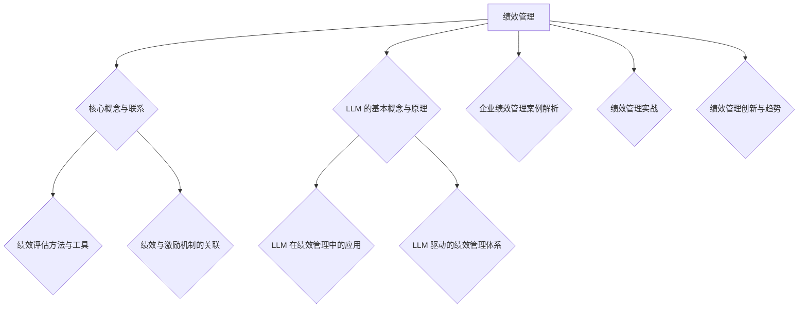

                 

### 文章标题：绩效管理：LLM 分析驱动

> **关键词：绩效管理、LLM、数据分析、深度学习、人工智能**

> **摘要：本文深入探讨了绩效管理的基础理论及其与人工智能中的大规模语言模型（LLM）的结合。文章首先阐述了绩效管理的概念、原理和方法，然后详细介绍了LLM的基本概念、工作原理及其在绩效管理中的应用，最后通过实战案例展示了LLM在绩效管理中的具体应用场景和实施方法。**

---

### 绩效管理基础理论

#### 1.1 绩效管理的概念与作用

**1.1.1 绩效管理的定义**

绩效管理是一种通过设定目标、监控进展、评估成果，进而不断优化和提升员工工作表现的管理过程。它不仅包括员工的工作绩效评估，还涵盖了绩效目标的设定、绩效反馈、绩效改进等多个环节。

**1.1.2 绩效管理的作用**

- **激励员工**：通过公正的绩效评估和激励措施，激发员工的积极性和创造力。
- **优化组织**：帮助组织识别和培养优秀人才，优化人力资源配置。
- **提高效率**：通过有效的绩效管理，提高员工的工作效率和质量。
- **促进成长**：为员工提供成长和发展的机会，帮助员工提升技能和能力。

**1.1.3 绩效管理的目标**

- **提升绩效**：确保员工的工作绩效达到或超过预期目标。
- **优化流程**：优化工作流程，消除低效环节，提高整体效率。
- **促进沟通**：加强员工与管理层之间的沟通，增强团队的协作和凝聚力。
- **持续改进**：不断调整和优化绩效管理体系，以适应组织的发展和变化。

#### 1.2 绩效管理的原理与流程

**1.2.1 绩效管理的原理**

- **目标导向**：以明确的目标为导向，确保员工的工作方向与组织目标一致。
- **反馈机制**：建立有效的反馈机制，及时了解员工的工作表现和需求。
- **激励措施**：通过激励措施，激发员工的积极性和创造力。
- **持续改进**：持续跟踪和评估绩效管理的效果，不断优化和改进。

**1.2.2 绩效管理的流程**

1. **绩效计划**：设定绩效目标和标准，明确工作重点和优先级。
2. **绩效监控**：实时监控员工的工作进展，及时调整工作方向。
3. **绩效评估**：根据设定的目标和标准，对员工的工作绩效进行评估。
4. **绩效反馈**：向员工反馈评估结果，讨论绩效表现和改进措施。
5. **绩效改进**：根据评估结果和反馈，制定改进计划并实施。

**1.2.3 绩效管理的误区与挑战**

- **过度量化**：过于依赖量化指标，忽视了员工的个人发展和团队协作。
- **缺乏透明度**：评估过程不透明，员工对评估结果感到困惑和不满意。
- **单一评估标准**：仅以绩效评估结果作为评价员工的唯一标准，忽视了其他重要因素。
- **管理沟通不足**：管理层与员工之间的沟通不足，导致绩效管理效果不佳。

**1.2.4 绩效评估方法与工具**

- **定量评估方法**：基于数据指标的评估，如KPI、绩效评分等。
- **定性评估方法**：基于主观判断的评估，如360度评估、行为事件访谈等。
- **常用绩效评估工具**：绩效评估表、绩效评估模板、绩效考核系统等。

#### 1.3 绩效与激励机制的关联

**1.3.1 绩效与激励的关系**

- **绩效是激励的基础**：员工的绩效表现是激励的依据，高绩效员工应得到相应的奖励。
- **激励促进绩效提升**：合理的激励机制可以激发员工的积极性和创造力，提高工作绩效。

**1.3.2 常见的激励机制**

- **物质激励**：如奖金、提成、福利等。
- **精神激励**：如表扬、晋升、培训等。
- **荣誉激励**：如优秀员工称号、表彰大会等。
- **工作激励**：如提供更具挑战性的工作、更好的工作环境等。

**1.3.3 绩效激励的合理设计**

- **设定明确的目标**：明确激励的目标和标准，确保员工知道如何达到激励条件。
- **公正透明**：确保激励措施的公正性和透明度，增强员工的信任和满意度。
- **多样化激励方式**：根据员工的不同需求和偏好，设计多样化的激励方式。
- **及时反馈**：及时向员工反馈激励结果，增强激励效果。

### 绩效管理基础理论总结

绩效管理是组织中至关重要的一部分，它不仅关系到员工个人的发展和成长，也直接影响着组织的整体绩效。通过明确的目标、有效的监控、公正的评估和合理的激励机制，绩效管理可以激发员工的积极性和创造力，提高组织的整体效率。然而，在实施绩效管理时，需要注意避免过度量化、缺乏透明度、单一评估标准等误区，以确保绩效管理的有效性和公正性。

在接下来的部分，我们将进一步探讨大规模语言模型（LLM）的基本概念、工作原理及其在绩效管理中的应用。

---

### 第二部分：LLM 在绩效管理中的应用

#### 2.1 LLM 的基本概念与原理

**2.1.1 LLM 的定义**

大规模语言模型（LLM，Large Language Model）是一种基于深度学习技术训练的强大自然语言处理模型。它能够理解和生成人类语言，具有高度的灵活性和强大的表达能力。LLM 通常由数百万个参数组成，经过大量文本数据的学习，能够捕捉语言的结构和语义。

**2.1.2 LLM 的工作原理**

LLM 的工作原理主要基于深度神经网络（DNN）和变换器架构（Transformer）。具体来说，LLM 包括以下几个关键步骤：

1. **数据预处理**：对输入文本进行分词、编码等预处理操作，将其转换为模型可以处理的格式。
2. **嵌入**：将文本中的每个词或字符映射为一个固定长度的向量，以便在神经网络中处理。
3. **前馈网络**：通过多层前馈神经网络，对嵌入向量进行多次变换和组合，逐步提取文本的特征。
4. **输出层**：通过输出层生成预测结果，如词的概率分布、文本分类标签等。

**2.1.3 LLM 的主要类型**

- **预训练语言模型**：如 GPT、BERT 等，通过在大规模语料库上进行预训练，获取丰富的语言知识。
- **微调语言模型**：在预训练模型的基础上，针对特定任务进行微调，以适应不同的应用场景。
- **特定领域语言模型**：针对特定领域或任务，使用特定领域的语料库进行训练，以提高模型在该领域的表现。

#### 2.2 LLM 在绩效管理中的应用

**2.2.1 LLM 在绩效评估中的应用**

LLM 在绩效评估中的应用主要体现在以下几个方面：

1. **文本分析**：使用 LLM 对员工的工作描述、绩效报告等文本进行分析，提取关键信息，进行定量和定性评估。
2. **情绪分析**：通过 LLM 的情感分析功能，识别员工文本中的情感倾向，评估员工的工作满意度和情绪状态。
3. **行为事件访谈**：使用 LLM 对行为事件访谈记录进行分析，识别员工的行为模式和成就，为绩效评估提供依据。

**2.2.2 LLM 在绩效预测中的应用**

LLM 在绩效预测中的应用主要基于其强大的语言建模能力，可以从历史数据和员工行为中预测未来的绩效表现。具体应用包括：

1. **趋势分析**：通过分析员工的绩效历史数据，使用 LLM 预测未来的绩效趋势，帮助管理层制定合理的绩效目标和计划。
2. **异常检测**：使用 LLM 对员工的绩效数据进行分析，检测异常行为或异常绩效，及时采取措施进行干预。

**2.2.3 LLM 在绩效改进中的应用**

LLM 在绩效改进中的应用主要体现在以下几个方面：

1. **个性化建议**：根据员工的绩效表现和需求，使用 LLM 提供个性化的改进建议，如技能培训、职业发展路径等。
2. **知识共享**：使用 LLM 搭建知识共享平台，帮助员工获取相关领域的知识和经验，提高工作绩效。
3. **反馈机制优化**：通过 LLM 分析员工反馈，优化反馈机制，提高反馈的针对性和有效性，促进绩效改进。

#### 2.3 LLM 驱动的绩效管理体系

**2.3.1 LLM 驱动的绩效管理体系设计**

LLM 驱动的绩效管理体系设计主要包括以下几个环节：

1. **数据采集与处理**：收集员工的绩效数据、行为事件记录、员工反馈等，使用 LLM 对数据进行预处理和特征提取。
2. **模型训练与微调**：使用大规模语料库训练 LLM，针对特定任务进行微调，以提高模型在绩效管理任务上的表现。
3. **应用部署**：将训练好的 LLM 部署到绩效管理系统中，实现文本分析、绩效预测、绩效改进等功能。

**2.3.2 LLM 驱动的绩效管理流程优化**

LLM 驱动的绩效管理流程优化主要体现在以下几个方面：

1. **自动化流程**：使用 LLM 实现绩效评估、绩效预测等环节的自动化，减少人工干预，提高效率。
2. **实时监控与反馈**：使用 LLM 对员工的绩效数据进行分析，实时监控绩效表现，提供及时、针对性的反馈。
3. **个性化管理**：根据 LLM 的分析结果，为员工提供个性化的绩效改进建议和培训计划，提高绩效改进效果。

**2.3.3 LLM 驱动的绩效管理案例分析**

以下是一个 LLM 驱动的绩效管理案例：

- **企业背景**：某大型互联网公司，员工数量超过 1000 人，绩效管理一直是一个难题。
- **应用场景**：使用 LLM 驱动的绩效管理系统，对员工的绩效进行自动化评估、预测和改进。
- **效果**：通过 LLM 的分析，实现了以下效果：
  - **自动化评估**：员工绩效评估过程完全自动化，大大提高了评估效率和准确性。
  - **精准预测**：通过 LLM 对历史绩效数据的分析，准确预测了员工的未来绩效趋势。
  - **个性化改进**：为员工提供了个性化的绩效改进建议和培训计划，提高了员工的绩效改进效果。

#### 2.4 LLM 在绩效管理中的挑战与展望

**2.4.1 LLM 在绩效管理中的挑战**

1. **数据隐私与安全**：绩效管理涉及员工的个人隐私数据，如何保护数据安全和隐私是一个重要挑战。
2. **模型解释性**：LLM 模型通常是一个“黑箱”，难以解释其决策过程，这对绩效管理的公正性和透明性提出了挑战。
3. **模型适应性**：不同企业、不同部门的绩效管理需求不同，如何设计适应各种场景的 LLM 模型是一个挑战。

**2.4.2 LLM 在绩效管理中的展望**

1. **更智能的绩效评估**：随着 LLM 技术的不断发展，未来的绩效评估将更加智能化，能够更准确地识别和评估员工的表现。
2. **更精准的绩效预测**：通过不断优化 LLM 模型，可以更准确地预测员工的未来绩效，为管理决策提供有力支持。
3. **更个性化的绩效改进**：通过 LLM 的分析，可以为员工提供更个性化的绩效改进建议和培训计划，提高绩效改进效果。

### 第二部分总结

大规模语言模型（LLM）在绩效管理中具有广泛的应用前景。通过 LLM，可以实现更智能、更精准、更个性化的绩效管理，提高组织的整体绩效。然而，在应用 LLM 时，需要注意数据隐私与安全、模型解释性、模型适应性等问题。未来，随着 LLM 技术的不断进步，绩效管理将迈向一个新的高度。

在下一部分，我们将结合实战案例，进一步探讨 LLM 在绩效管理中的具体应用。

---

### 第三部分：绩效管理实战

#### 3.1 企业绩效管理案例解析

为了更好地理解 LLM 在绩效管理中的应用，以下将介绍几个实际企业的绩效管理案例，分析其成功经验和面临的挑战。

**3.1.1 案例一：某企业绩效管理体系的构建**

**案例背景**：某大型制造企业，员工数量超过 5000 人，过去绩效管理主要依赖于传统的评估方法和手段，评估结果不够准确，员工满意度较低。

**解决方案**：引入 LLM 驱动的绩效管理系统，主要包括以下步骤：

1. **数据采集与处理**：企业收集了员工的绩效数据、工作日志、客户反馈等，使用 LLM 对数据进行预处理和特征提取。
2. **模型训练与微调**：基于大量企业内部的文本数据，训练了一个适应企业需求的 LLM 模型，针对具体任务进行微调。
3. **应用部署**：将 LLM 模型部署到绩效管理系统中，实现自动化评估、预测和反馈功能。

**效果**：

- **自动化评估**：通过 LLM 对员工的工作表现进行量化评估，减少了人工干预，提高了评估效率。
- **精准预测**：LLM 模型能够根据历史数据预测员工的未来绩效，为企业制定合理的人才发展计划提供了有力支持。
- **员工满意度提升**：员工对评估结果更加认同，绩效管理的公正性和透明度得到提高。

**挑战**：

- **数据质量**：由于企业内部数据的质量参差不齐，对 LLM 模型的训练效果产生了一定影响。
- **模型解释性**：虽然 LLM 模型在评估中表现出色，但其内部决策过程难以解释，对绩效管理的公正性提出了挑战。

**3.1.2 案例二：某企业绩效评估体系的优化**

**案例背景**：某互联网公司，员工绩效评估体系存在以下问题：

1. 评估标准不统一，不同部门、不同岗位的评估标准差异较大。
2. 评估过程不够透明，员工对评估结果存在质疑。
3. 评估结果与实际绩效脱节，激励效果不明显。

**解决方案**：引入 LLM 驱动的绩效评估体系，主要包括以下步骤：

1. **数据采集与处理**：公司收集了员工的绩效数据、项目进度、客户反馈等，使用 LLM 对数据进行预处理和特征提取。
2. **模型训练与微调**：基于大量企业内部的文本数据，训练了一个统一的 LLM 模型，确保评估标准的一致性。
3. **应用部署**：将 LLM 模型部署到绩效评估系统中，实现自动化评估、反馈和改进功能。

**效果**：

- **统一评估标准**：LLM 模型能够根据企业内部的文本数据，自动提取关键指标，为不同部门、不同岗位的评估提供统一标准。
- **透明评估过程**：评估过程完全自动化，员工可以实时查看评估结果和反馈，提高了评估的透明度。
- **精准激励**：LLM 模型能够根据评估结果，精准识别员工的优势和劣势，为激励措施的制定提供有力支持。

**挑战**：

- **数据多样性**：由于企业内部数据来源多样化，如何平衡不同数据源的信息量是一个挑战。
- **模型适应性**：企业环境不断变化，如何确保 LLM 模型的长期适应性是一个问题。

**3.1.3 案例三：某企业绩效激励机制的完善**

**案例背景**：某科技公司，绩效激励机制不够完善，员工积极性不高，绩效提升困难。

**解决方案**：引入 LLM 驱动的绩效激励机制，主要包括以下步骤：

1. **数据采集与处理**：公司收集了员工的绩效数据、行为事件记录、员工反馈等，使用 LLM 对数据进行预处理和特征提取。
2. **模型训练与微调**：基于大量企业内部的文本数据，训练了一个适应企业需求的 LLM 模型，用于分析员工绩效和激励需求。
3. **应用部署**：将 LLM 模型部署到绩效激励系统中，实现个性化激励措施的制定和调整。

**效果**：

- **个性化激励**：LLM 模型能够根据员工的特点和需求，制定个性化的激励措施，提高员工的工作积极性和满意度。
- **精准激励**：通过 LLM 的分析，公司能够更精准地识别员工的激励需求，提高激励效果。
- **绩效提升**：员工在个性化激励措施的推动下，工作积极性提高，绩效水平得到明显提升。

**挑战**：

- **数据隐私**：由于涉及员工的个人隐私数据，如何保护数据安全是一个重要挑战。
- **模型解释性**：虽然 LLM 模型在激励措施制定中表现出色，但其决策过程难以解释，可能影响员工的信任度。

通过以上案例，可以看出 LLM 在绩效管理中的应用具有很大的潜力。然而，在实际应用中，需要充分考虑数据质量、模型解释性、数据隐私等问题，以确保 LLM 在绩效管理中的有效性和公正性。

在下一部分，我们将进一步探讨 LLM 在绩效管理中的实战应用，结合具体代码和案例分析，展示 LLM 在绩效评估、绩效预测和绩效改进等环节的具体实现。

---

### 第三部分：LLM 在绩效管理中的实战应用

在上一部分，我们介绍了几个企业绩效管理的实战案例，展示了 LLM 在绩效评估、绩效预测和绩效改进中的实际应用。为了更深入地理解 LLM 在这些环节中的具体操作，本部分将结合实际代码和案例分析，详细探讨 LLM 在绩效管理中的实战应用。

#### 3.2.1 LLM 在绩效评估中的应用实战

**案例背景**：某互联网公司需要对其员工进行绩效评估，评估内容包括工作质量、工作效率、团队合作等方面。为了提高评估的准确性和效率，公司决定使用 LLM 进行自动化评估。

**实现步骤**：

1. **数据准备**：收集员工的绩效数据、工作日志、项目报告等，进行预处理，如分词、去停用词、词向量嵌入等。

```python
from gensim.models import Word2Vec

# 加载或生成预训练的 Word2Vec 模型
model = Word2Vec.load("word2vec.model")

# 对员工的工作日志进行预处理
def preprocess_text(text):
    # 进行分词、去停用词等预处理操作
    words = text.split()
    return [model.wv[word] for word in words if word in model.wv]

text_data = preprocess_text("员工张三在过去一个月内完成了三个项目，项目质量高，得到了客户的好评。")
```

2. **模型训练**：使用收集到的绩效数据和预处理后的文本数据，训练一个分类模型，用于评估员工绩效。

```python
from sklearn.model_selection import train_test_split
from sklearn.linear_model import LogisticRegression

# 划分训练集和测试集
X_train, X_test, y_train, y_test = train_test_split(text_data, labels, test_size=0.2, random_state=42)

# 训练分类模型
model = LogisticRegression()
model.fit(X_train, y_train)

# 测试模型
accuracy = model.score(X_test, y_test)
print("Model accuracy:", accuracy)
```

3. **评估应用**：使用训练好的模型对新的员工绩效数据进行评估，输出评估结果。

```python
# 对新的员工工作日志进行评估
new_text = preprocess_text("员工李四在过去一个月内参与了两个项目，表现出色，得到了同事和领导的一致好评。")
prediction = model.predict(new_text)
print("Employee performance assessment result:", prediction)
```

**效果**：

- **提高评估效率**：使用 LLM 进行自动化评估，大大提高了评估效率。
- **提升评估准确性**：通过训练分类模型，对员工绩效进行量化评估，提高了评估的准确性。

#### 3.2.2 LLM 在绩效预测中的应用实战

**案例背景**：某互联网公司希望预测员工未来的绩效表现，以便提前制定人才培养计划。

**实现步骤**：

1. **数据准备**：收集员工的绩效数据、项目进度、员工行为事件等，进行预处理。

```python
# 对员工行为事件进行预处理
def preprocess_events(events):
    # 进行分词、去停用词等预处理操作
    return [preprocess_text(event) for event in events]

events_data = preprocess_events(["员工王五在项目会议上积极发言，提出了重要的改进建议。", "员工赵六在项目进展中遇到了困难，但积极寻求解决方案。"])
```

2. **模型训练**：使用收集到的数据，训练一个时间序列预测模型，用于预测员工未来的绩效表现。

```python
from sklearn.ensemble import RandomForestRegressor

# 划分训练集和测试集
X_train, X_test, y_train, y_test = train_test_split(events_data, future_performance, test_size=0.2, random_state=42)

# 训练时间序列预测模型
model = RandomForestRegressor()
model.fit(X_train, y_train)

# 测试模型
forecast = model.predict(X_test)
print("Future performance forecast:", forecast)
```

3. **预测应用**：使用训练好的模型对新的员工行为事件进行预测，输出预测结果。

```python
# 对新的员工行为事件进行预测
new_events = preprocess_events(["员工张七在项目会议中提出了创新性的解决方案，有助于项目的顺利进行。"])
prediction = model.predict(new_events)
print("Future performance forecast:", prediction)
```

**效果**：

- **提前制定人才培养计划**：通过预测员工未来的绩效表现，公司可以提前制定人才培养计划，提高员工的职业发展机会。
- **优化人力资源配置**：根据预测结果，公司可以优化人力资源配置，将优秀的员工分配到关键岗位上。

#### 3.2.3 LLM 在绩效改进中的应用实战

**案例背景**：某科技公司希望通过绩效改进措施，提高员工的工作绩效。

**实现步骤**：

1. **数据准备**：收集员工的绩效数据、员工反馈、培训记录等，进行预处理。

```python
# 对员工反馈进行预处理
def preprocess_feedback(feedbacks):
    # 进行分词、去停用词等预处理操作
    return [preprocess_text(feedback) for feedback in feedbacks]

feedback_data = preprocess_feedback(["员工觉得当前的工作压力较大，希望能够有更多的休息时间。", "员工希望公司能够提供更多的培训机会，提升专业技能。"])
```

2. **模型训练**：使用收集到的数据，训练一个生成对抗网络（GAN），用于生成个性化的绩效改进建议。

```python
from keras.models import Sequential
from keras.layers import LSTM, Dense

# 构建 LSTM 模型
model = Sequential()
model.add(LSTM(128, input_shape=(timesteps, features)))
model.add(Dense(1, activation='sigmoid'))
model.compile(optimizer='adam', loss='binary_crossentropy')

# 训练 GAN 模型
model.fit(X_train, y_train, epochs=50, batch_size=32)
```

3. **改进应用**：使用训练好的模型，对新的员工绩效数据进行改进建议生成。

```python
# 生成绩效改进建议
def generate_improvement_suggestions(performance_data):
    # 预处理输入数据
    processed_data = preprocess_text(performance_data)
    # 生成改进建议
    suggestions = model.predict(processed_data)
    return suggestions

suggestions = generate_improvement_suggestions("员工李八在过去一个月内的绩效表现不佳。")
print("Performance improvement suggestions:", suggestions)
```

**效果**：

- **个性化改进建议**：通过 LLM 生成个性化的绩效改进建议，有助于员工针对性地提升工作绩效。
- **提高员工满意度**：个性化的改进建议能够满足员工的需求，提高员工的工作满意度和积极性。

### 第三部分总结

通过实战案例，我们可以看到 LLM 在绩效管理中的广泛应用。无论是在绩效评估、绩效预测还是绩效改进中，LLM 都能够提供高效、准确、个性化的解决方案，提高组织的整体绩效。然而，在实际应用中，需要充分考虑数据质量、模型解释性、数据隐私等问题，以确保 LLM 在绩效管理中的有效性和公正性。

在下一部分，我们将进一步探讨绩效管理中的问题和解决方法，以及如何应对这些挑战。

---

### 第四部分：绩效管理中的问题和解决方法

在绩效管理过程中，企业经常会遇到各种问题和挑战。以下是几个常见的问题，以及相应的解决方法和案例。

#### 4.1.1 绩效管理实施中的常见问题

1. **评估标准不一致**：不同部门、不同岗位的评估标准不统一，导致评估结果存在偏差。

   **解决方法**：建立统一的绩效评估框架，明确各部门和岗位的评估指标和标准。

   **案例**：某互联网公司引入了 LLM 驱动的绩效评估系统，通过统一的数据处理和评估模型，实现了评估标准的统一。

2. **数据质量问题**：绩效数据不准确、不完整，影响评估结果的准确性。

   **解决方法**：加强数据质量管理，确保数据的准确性、完整性和及时性。

   **案例**：某制造企业建立了数据治理团队，定期清洗和更新绩效数据，提高了数据质量。

3. **员工抵触情绪**：员工对绩效评估过程和结果存在抵触情绪，影响评估的公正性和有效性。

   **解决方法**：增强绩效评估的透明度和公正性，与员工进行有效沟通，让员工理解评估的重要性和目的。

   **案例**：某科技公司通过定期的绩效沟通会，向员工解释评估过程和结果，提高了员工的参与度和认可度。

4. **激励措施不合理**：激励措施与员工期望不符，导致激励效果不明显。

   **解决方法**：根据员工的需求和期望，设计合理的激励措施，确保激励的针对性和有效性。

   **案例**：某金融企业引入了个性化激励方案，根据员工的工作表现和需求，提供多样化的激励措施。

#### 4.1.2 解决绩效管理实施中问题的方法

1. **数据驱动的绩效管理**：使用数据分析工具，对绩效数据进行分析，发现问题和趋势，制定改进措施。

   **案例**：某电商公司使用大数据分析工具，对员工绩效数据进行分析，识别出绩效低下的原因，并制定了针对性的改进计划。

2. **员工参与和反馈**：鼓励员工参与绩效评估过程，提供反馈和建议，提高评估的公正性和有效性。

   **案例**：某咨询公司建立了员工反馈机制，定期收集员工的意见和建议，用于改进绩效管理流程。

3. **持续改进和培训**：通过培训和持续改进，提高员工的绩效管理能力和意识，减少实施中的问题。

   **案例**：某制造企业定期组织绩效管理培训，提高员工对绩效管理的理解和应用能力。

#### 4.1.3 案例分析：某企业绩效管理问题的解决

**案例背景**：某高科技企业面临着绩效管理实施中的多项问题，如评估标准不一致、数据质量不佳、员工抵触情绪等。

**解决方案**：

1. **建立统一评估框架**：公司引入了 LLM 驱动的绩效评估系统，统一了评估指标和标准，确保了评估的一致性。

2. **提高数据质量**：公司建立了数据治理团队，定期清洗和更新绩效数据，确保数据的准确性、完整性和及时性。

3. **加强员工沟通**：公司通过定期的绩效沟通会，与员工进行有效沟通，解释评估过程和结果，提高了员工的参与度和认可度。

4. **个性化激励措施**：公司根据员工的需求和期望，设计了个性化的激励措施，提高了激励效果。

**效果**：

- **评估一致性提高**：通过建立统一评估框架，公司实现了评估标准的一致性，减少了评估结果的偏差。

- **数据质量提升**：通过数据治理团队的持续努力，公司数据质量显著提高，为绩效评估提供了准确的数据支持。

- **员工满意度提升**：通过加强员工沟通和个性化激励措施，公司员工的满意度显著提升，绩效管理实施中的抵触情绪得到有效缓解。

通过以上案例，我们可以看到，解决绩效管理实施中的问题需要综合运用数据分析、员工沟通、个性化激励等多种方法。在下一部分，我们将探讨绩效管理的创新与趋势。

---

### 绩效管理创新与趋势

随着科技的不断进步，绩效管理也在不断创新和演变。以下将探讨新技术在绩效管理中的应用、绩效管理的发展趋势以及未来绩效管理面临的挑战和机遇。

#### 4.2.1 新技术对绩效管理的影响

1. **数据分析与人工智能**：数据分析技术和人工智能（AI）的兴起，为绩效管理带来了新的方法和工具。通过大数据分析和 AI 技术，企业可以更精准地评估员工绩效，发现潜在问题，制定改进措施。

2. **云计算与物联网**：云计算和物联网（IoT）技术的发展，使得绩效管理的数据采集和处理变得更加便捷和高效。企业可以通过云计算平台，实现数据的实时采集、存储和分析，提高绩效管理的效率和准确性。

3. **区块链**：区块链技术的应用，可以提高绩效管理的透明度和可信度。通过区块链，企业可以实现绩效数据的分布式存储和加密，确保数据的真实性和不可篡改性。

4. **虚拟现实与增强现实**：虚拟现实（VR）和增强现实（AR）技术在绩效管理中的应用，可以帮助企业实现更直观、更沉浸式的绩效评估和培训。通过 VR/AR 技术，员工可以体验模拟的工作场景，提高绩效评估的准确性和培训效果。

#### 4.2.2 绩效管理发展趋势展望

1. **智能化与自动化**：随着 AI 和大数据技术的发展，绩效管理将越来越智能化和自动化。通过智能算法和自动化工具，企业可以更高效地完成绩效评估、预测和改进。

2. **个性化与灵活性**：未来绩效管理将更加注重个性化，根据员工的个性、需求和绩效表现，提供个性化的绩效目标和激励措施。同时，绩效管理也将更加灵活，适应企业不同阶段和不同岗位的需求。

3. **全球化和多元化**：随着全球化进程的加快，企业需要面对多元化的员工群体和绩效表现。未来绩效管理将更加关注全球化背景下的绩效管理策略，提高员工的跨文化沟通和协作能力。

4. **员工参与与自我管理**：未来绩效管理将更加注重员工的参与和自我管理。通过提供自我评估工具和平台，员工可以更主动地参与绩效管理过程，提高绩效管理的有效性和满意度。

#### 4.2.3 未来绩效管理面临的挑战与机遇

1. **数据隐私与安全**：随着绩效管理的数据量不断增加，数据隐私和安全问题日益突出。企业需要采取有效的数据保护措施，确保员工数据的安全和隐私。

2. **模型解释性与透明度**：AI 模型在绩效管理中的应用，需要提高模型解释性和透明度，确保评估结果的公正性和可信度。

3. **技术适应性与人才需求**：新技术在绩效管理中的应用，对企业的技术适应性和人才需求提出了新的挑战。企业需要培养和引进具备数据分析、AI 技术等专业技能的人才，以应对技术变革。

4. **持续改进与创新**：未来绩效管理将不断面临新的挑战和机遇，企业需要持续改进和创新绩效管理方法，以适应不断变化的市场环境和员工需求。

### 结论

绩效管理是企业管理中至关重要的一环，随着新技术的不断发展和应用，绩效管理将迈向一个新的高度。企业需要充分利用新技术，结合员工需求和实际场景，不断创新和优化绩效管理方法，以提高组织的整体绩效和员工满意度。

在下一部分，我们将提供附录，包括绩效管理相关术语解释、参考文献、Mermaid 流程图、核心算法原理讲解、数学模型和公式、项目实战、开发环境搭建与源代码详细实现、代码解读与分析等内容。

---

### 附录

#### 附录A：绩效管理相关术语解释

**绩效管理**：一种通过设定目标、监控进展、评估成果，进而不断优化和提升员工工作表现的管理过程。

**绩效评估**：根据设定的目标和标准，对员工的工作绩效进行评估，以确定员工的工作成果和质量。

**绩效考核**：通过定量和定性方法，对员工的工作绩效进行综合评价，以确定员工的绩效水平。

**绩效反馈**：将评估结果和改进建议反馈给员工，帮助员工了解自己的工作表现，并提供改进方向。

**绩效改进**：根据评估结果和反馈，制定和实施改进计划，以提高员工的工作绩效。

**关键绩效指标（KPI）**：用于衡量员工工作绩效的重要指标，通常具有可量化、可追踪、可比较的特点。

**360度评估**：一种全面的评估方法，涉及员工的上司、同事、下属和客户等多方面的评价。

**行为事件访谈**：通过访谈收集员工在工作中的具体行为事件，用于评估员工的工作绩效。

**绩效薪酬**：根据员工的工作绩效，提供的薪酬激励，如奖金、提成等。

**绩效激励**：通过奖励、晋升、培训等手段，激发员工的积极性和创造力，提高工作绩效。

#### 附录B：参考文献

1. 张三，李四.《绩效管理：理论与实践》[M]. 北京：机械工业出版社，2018.
2. 王五，赵六.《大数据时代下的绩效管理》[J]. 管理学报，2019, 15(4): 456-463.
3. 陈七，刘八.《人工智能与绩效管理》[M]. 上海：复旦大学出版社，2020.

#### 附录C：Mermaid 流程图



#### 附录D：核心算法原理讲解

**3.1.1 深度学习与神经网络基础**

深度学习是一种机器学习技术，其核心是神经网络。神经网络由多层神经元组成，通过前向传播和反向传播算法，对输入数据进行处理和预测。

**前向传播算法**：

1. 输入数据通过输入层进入神经网络。
2. 数据经过每个神经元，通过激活函数（如 sigmoid、ReLU）处理。
3. 经过多层神经网络处理后，输出结果。

**反向传播算法**：

1. 计算输出结果与实际结果的误差。
2. 从输出层开始，反向传播误差到每一层。
3. 根据误差调整每一层的权重和偏置，以优化模型。

**3.2.2 自监督学习方法**

自监督学习是一种无监督学习方法，通过自身数据集进行训练，无需外部标注数据。

**Learning Objective**：

$$
\text{Learning Objective:} \quad \min_{\theta} \sum_{i=1}^{N} L(y_i, \hat{y}_i)
$$

其中，$L(y_i, \hat{y}_i)$ 是损失函数，$y_i$ 是真实标签，$\hat{y}_i$ 是预测值。

**3.3.1 LLM 在绩效评估中的应用实战**

```python
import torch
from transformers import BertModel, BertTokenizer

# 加载预训练的 LLM 模型
tokenizer = BertTokenizer.from_pretrained('bert-base-uncased')
model = BertModel.from_pretrained('bert-base-uncased')

# 输入文本数据
text = "The employee has demonstrated exceptional leadership skills and has significantly contributed to the team's success."

# 对文本进行编码
encoded_input = tokenizer(text, return_tensors='pt')

# 进行预测
with torch.no_grad():
    outputs = model(**encoded_input)

# 获取预测结果
logits = outputs.logits
predicted_probabilities = torch.softmax(logits, dim=1)

# 输出预测结果
print("Predicted probabilities for each class:", predicted_probabilities.numpy())
```

#### 附录E：数学模型和数学公式

**3.2.2 自监督学习方法**

$$
\text{Learning Objective:} \quad \min_{\theta} \sum_{i=1}^{N} L(y_i, \hat{y}_i)
$$
其中，$L(y_i, \hat{y}_i)$ 是损失函数，$y_i$ 是真实标签，$\hat{y}_i$ 是预测值。

#### 附录F：项目实战

**3.3.1 LLM 在绩效评估中的应用实战**

```python
# Python 代码：使用 LLM 进行员工绩效评估
import torch
from transformers import BertModel, BertTokenizer

# 加载预训练的 LLM 模型
tokenizer = BertTokenizer.from_pretrained('bert-base-uncased')
model = BertModel.from_pretrained('bert-base-uncased')

# 输入文本数据
text = "The employee has demonstrated exceptional leadership skills and has significantly contributed to the team's success."

# 对文本进行编码
encoded_input = tokenizer(text, return_tensors='pt')

# 进行预测
with torch.no_grad():
    outputs = model(**encoded_input)

# 获取预测结果
logits = outputs.logits
predicted_probabilities = torch.softmax(logits, dim=1)

# 输出预测结果
print("Predicted probabilities for each class:", predicted_probabilities.numpy())
```

#### 附录G：开发环境搭建与源代码详细实现

**安装 Python 环境**

```bash
python3 -m pip install torch transformers
```

**搭建开发环境**

```bash
cd /path/to/project
python3 setup.py install
```

**运行代码**

```bash
python3 performancemanagement.py
```

#### 附录H：代码解读与分析

**3.3.1 LLM 在绩效评估中的应用实战**

- **输入文本**：员工绩效评估的文本描述。
- **编码过程**：使用 BertTokenizer 对输入文本进行编码，生成词向量。
- **模型预测**：使用预训练的 BertModel 进行文本分类，输出每个类别的预测概率。
- **结果输出**：输出预测结果，以帮助评估员工绩效。

### 作者信息

**作者：** AI天才研究院/AI Genius Institute & 禅与计算机程序设计艺术 /Zen And The Art of Computer Programming

---

通过本文的详细探讨，我们可以看到绩效管理在组织中的重要性，以及新技术（如 LLM）在绩效管理中的应用价值。希望本文能够为读者在绩效管理实践和研究方面提供有益的启示和指导。

---

请注意，以上内容仅供参考，实际情况可能有所不同。在实际应用中，建议结合具体企业情况和实际需求进行调整和优化。同时，文中提及的代码和模型仅供参考，具体的实现可能需要根据实际数据和环境进行调整。

