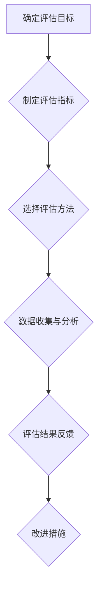

                 

# 绩效评估：公正有效的考核体系设计

> **关键词**：绩效评估、公正性、关键绩效指标（KPI）、评估方法、绩效管理、员工激励

> **摘要**：本文旨在探讨绩效评估的定义、重要性、体系设计、工具与技术、实施与反馈，以及在不同行业和岗位的应用。通过详细分析绩效评估的核心概念和具体案例，本文为企业和组织提供了构建公正有效考核体系的指导。

### 第一部分：绩效评估概述

#### 第1章：绩效评估的定义与重要性

##### 1.1 绩效评估的概念解析

###### 1.1.1 绩效评估的定义

绩效评估是指通过一系列指标、方法和过程，对员工在工作中的表现进行衡量和评价。它不仅关注员工的工作结果，还关注其在工作过程中的行为、态度和技能表现。

\[ 
\text{绩效评估} = \text{评估指标} + \text{评估方法} + \text{评估结果分析} 
\]

其中，**评估指标**包括关键绩效指标（KPI）和行为指标。**评估方法**主要分为定性评估和定量评估。**评估结果分析**则用于发现问题，制定优化策略。

###### 1.1.2 绩效评估的核心要素

- **评估指标**：关键绩效指标（KPI）与行为指标
  - **关键绩效指标（KPI）**：用于衡量员工在工作中的关键成果，如销售额、项目进度等。
  - **行为指标**：用于衡量员工在工作中的行为表现，如团队合作、沟通能力等。

- **评估方法**：定性评估与定量评估
  - **定性评估**：主要通过专家评审、行为事件访谈等方法进行。
  - **定量评估**：主要通过数据统计、绩效评分等方法进行。

- **评估结果分析**：通过分析评估结果，找出问题，制定优化策略，以提高员工绩效和组织的整体效能。

##### 1.2 绩效评估的重要性

###### 1.2.1 对员工的作用

- **激励员工**：明确的绩效标准可以激励员工发挥最大潜能，实现自我价值。
- **职业发展**：通过评估了解自身优劣势，制定职业发展规划，提升个人能力。

###### 1.2.2 对组织的作用

- **优化资源配置**：通过评估了解员工绩效，合理分配资源，提高组织效率。
- **战略实施**：确保绩效评估结果与组织战略目标相一致，推动组织目标的实现。

#### 第2章：绩效评估体系设计

##### 2.1 设计原则

###### 2.1.1 公正性

- **消除偏见**：采用客观、科学的评估方法，确保评估结果的公正性。

###### 2.1.2 可操作性

- **简明易懂**：评估体系应易于理解和操作，避免复杂冗长的流程。

##### 2.2 设计步骤

###### 2.2.1 明确评估目标

- **确定评估目的**：根据组织战略目标，明确绩效评估的具体目标。

###### 2.2.2 制定评估指标

- **关键绩效指标（KPI）**：结合岗位职责，制定与组织目标密切相关的KPI。
- **行为指标**：评估员工在工作中的表现，如沟通能力、团队合作等。

###### 2.2.3 选择评估方法

- **定性评估**：专家评审、行为事件访谈等。
- **定量评估**：数据统计、绩效评分等。

###### 2.2.4 设定评估周期

- **短期评估**：通常为季度或半年。
- **长期评估**：年度或更长时间周期。

#### 第3章：绩效评估工具与技术

##### 3.1 关键绩效指标（KPI）设计

###### 3.1.1 KPI的定义

**KPI**：衡量工作绩效的具体指标。

###### 3.1.2 KPI设计方法

- **目标与关键成果法（OKR）**：制定明确的目标和关键成果。
- **平衡计分卡（BSC）**：从财务、客户、内部流程、学习与成长四个维度制定KPI。

##### 3.2 绩效评估方法

###### 3.2.1 定性评估

- **专家评审**：由专家对员工进行综合评价。
- **行为事件访谈（BEI）**：收集员工在工作中的具体行为事件。

###### 3.2.2 定量评估

- **绩效评分法**：根据评估标准对员工进行打分。
- **目标达成率**：衡量员工完成目标的程度。

#### 第4章：绩效评估实施与反馈

##### 4.1 实施流程

###### 4.1.1 策划与准备

- **制定评估计划**：明确评估周期、评估指标、评估方法等。
- **培训评估团队**：确保评估团队熟悉评估流程和方法。

###### 4.1.2 评估执行

- **收集评估数据**：通过多种渠道收集评估数据。
- **进行评估分析**：对评估数据进行整理和分析。

##### 4.2 反馈与改进

###### 4.2.1 反馈机制

- **及时反馈**：及时向员工反馈评估结果，鼓励正面评价，指出改进方向。
- **双向沟通**：鼓励员工参与反馈过程，表达意见和建议。

###### 4.2.2 改进措施

- **持续改进**：根据评估结果，调整评估指标和方法，优化绩效管理体系。
- **激励与奖励**：制定合理的激励措施，鼓励员工持续提高绩效。

### 第二部分：绩效评估应用与实践

#### 第5章：不同行业与岗位的绩效评估

##### 5.1 行业特点与绩效评估方法

###### 5.1.1 服务业的绩效评估

- **客户满意度**：客户满意度调查。
- **员工服务能力**：服务技能评估。

###### 5.1.2 制造业的绩效评估

- **生产效率**：生产量、良品率等指标。
- **质量控制**：缺陷率、返工率等指标。

##### 5.2 不同岗位的绩效评估

###### 5.2.1 管理层绩效评估

- **领导力**：领导能力、团队管理能力。
- **业务成果**：业务增长、项目完成情况。

###### 5.2.2 技术岗位绩效评估

- **技术能力**：技术水平、技术创新能力。
- **项目成果**：项目质量、项目进度。

#### 第6章：绩效评估的挑战与应对策略

##### 6.1 绩效评估的常见问题

###### 6.1.1 偏见与主观性

- **解决方法**：采用定量评估方法，减少主观因素影响。

###### 6.1.2 评估指标不明确

- **解决方法**：明确评估指标，制定详细的评估标准。

##### 6.2 应对策略

###### 6.2.1 持续优化评估体系

- **定期评估**：根据实际情况调整评估指标和方法。

###### 6.2.2 建立信任机制

- **公平透明**：确保评估过程的公平性，增加员工信任。
- **反馈与沟通**：建立有效的反馈与沟通机制，提高员工满意度。

#### 第7章：绩效评估项目实施案例

##### 7.1 案例介绍

- **企业背景**：某大型制造企业。
- **项目目标**：优化绩效管理体系，提高员工绩效。

##### 7.2 实施过程

###### 7.2.1 设计评估体系

- **确定评估指标**：结合企业战略，制定关键绩效指标。
- **选择评估方法**：采用定性评估与定量评估相结合的方法。

###### 7.2.2 实施评估

- **数据收集**：通过问卷调查、数据分析等方式收集评估数据。
- **评估分析**：对评估数据进行整理和分析，找出问题与改进点。

##### 7.3 案例分析

- **评估结果**：员工绩效明显提高，企业整体运营效率提升。
- **改进措施**：根据评估结果，调整评估指标和方法，持续优化绩效管理体系。

### 第三部分：绩效评估的未来趋势

#### 第8章：数字化时代的绩效评估

##### 8.1 数据驱动评估

- **大数据分析**：利用大数据分析技术，挖掘员工绩效与业务发展的关系。
- **数据可视化**：通过数据可视化，提高评估结果的直观性和透明度。

##### 8.2 人工智能与绩效评估

- **智能算法**：采用智能算法，优化评估指标与方法，提高评估准确性与效率。
- **自动化评估**：实现部分评估过程的自动化，减轻评估工作量。

#### 第9章：绩效评估的未来发展趋势

##### 9.1 可持续发展评估

- **环境、社会与治理（ESG）**：将ESG因素纳入绩效评估，推动企业可持续发展。
- **长期绩效评估**：关注员工长期绩效表现，促进员工成长与企业发展。

##### 9.2 全员参与评估

- **员工自主评估**：鼓励员工参与绩效评估，提高员工参与度和满意度。
- **多维度评估**：采用多维度的评估方法，全面衡量员工绩效。

### 附录

#### 附录 A：绩效评估工具与资源

##### A.1 主流绩效评估工具

- **KPI管理系统**：用于制定、监控和报告关键绩效指标。
- **绩效评估软件**：提供评估流程管理、数据分析和报告功能。

##### A.2 绩效评估参考资料

- **绩效评估方法与案例**：收集国内外优秀的绩效评估方法与实践案例。
- **学术研究**：查阅相关领域的研究论文和报告，了解绩效评估的最新发展趋势。

### 作者信息

**作者：AI天才研究院/AI Genius Institute & 禅与计算机程序设计艺术 /Zen And The Art of Computer Programming**<|vq_13084|>### 第一部分：绩效评估概述

#### 第1章：绩效评估的定义与重要性

##### 1.1 绩效评估的概念解析

绩效评估是指通过一系列指标、方法和过程，对员工在工作中的表现进行衡量和评价。它不仅关注员工的工作结果，还关注其在工作过程中的行为、态度和技能表现。

\[ 
\text{绩效评估} = \text{评估指标} + \text{评估方法} + \text{评估结果分析} 
\]

其中，**评估指标**包括关键绩效指标（KPI）和行为指标。**评估方法**主要分为定性评估和定量评估。**评估结果分析**则用于发现问题，制定优化策略，以提高员工绩效和组织的整体效能。

###### 1.1.1 绩效评估的定义

绩效评估是组织管理和人力资源管理体系中的重要环节，它通过对员工在工作中的表现进行系统、客观的评估，从而为员工的职业发展和组织的绩效提升提供有力支持。具体来说，绩效评估涉及以下三个方面：

1. **评估指标**：评估指标是绩效评估的核心，它用于衡量员工在工作中的关键成果和行为表现。常见的评估指标包括：
   - **关键绩效指标（KPI）**：这些指标通常与组织的战略目标密切相关，如销售额、项目进度、生产效率等。
   - **行为指标**：这些指标关注员工在工作过程中的行为表现，如团队合作、沟通能力、工作态度等。

2. **评估方法**：评估方法的选择取决于组织的具体需求和评估目标的性质。常见的评估方法包括：
   - **定性评估**：这种方法主要通过主观评价，如专家评审、行为事件访谈等。
   - **定量评估**：这种方法通过客观数据进行评价，如绩效评分、目标达成率等。

3. **评估结果分析**：评估结果分析是绩效评估的重要环节，它通过对评估数据的整理和分析，帮助组织发现问题、制定优化策略，从而提高员工绩效和组织效能。

###### 1.1.2 绩效评估的核心要素

绩效评估的核心要素包括评估指标、评估方法和评估结果分析，这些要素相互关联，共同构成了一个完整的绩效评估体系。

1. **评估指标**：评估指标是绩效评估的基础，它决定了评估的准确性和有效性。合理的评估指标应该能够全面、准确地反映员工的工作表现和组织的绩效水平。在设计评估指标时，应遵循以下原则：
   - **相关性**：评估指标应与组织的战略目标和岗位职责密切相关。
   - **可衡量性**：评估指标应具有明确的衡量标准和量化方法。
   - **平衡性**：评估指标应涵盖工作结果的衡量和工作过程的行为评价。

2. **评估方法**：评估方法的选择应根据组织的实际情况和评估目标的要求。定性评估和定量评估各有优劣，应根据实际情况进行合理选择。在实际操作中，可以采用以下方法：
   - **专家评审**：通过专家的主观评价，对员工的工作表现进行综合评估。
   - **行为事件访谈（BEI）**：通过收集员工在工作中的具体行为事件，评估其行为表现。
   - **绩效评分法**：根据预设的评估标准，对员工的工作表现进行打分。
   - **目标达成率**：衡量员工完成工作目标的程度，以评估其绩效水平。

3. **评估结果分析**：评估结果分析是绩效评估的关键环节，它通过对评估数据的整理和分析，帮助组织发现问题，制定优化策略。评估结果分析应包括以下几个方面：
   - **数据整理**：对收集到的评估数据进行整理和分类，以便于后续分析。
   - **问题识别**：通过分析评估结果，找出员工绩效和工作中存在的问题。
   - **优化策略**：根据问题识别的结果，制定相应的优化策略，如调整评估指标、改进工作流程等。
   - **反馈与改进**：将评估结果及时反馈给员工，鼓励其改进工作，同时根据评估结果不断优化绩效评估体系。

##### 1.2 绩效评估的重要性

###### 1.2.1 对员工的作用

绩效评估对员工个人具有重要意义，它不仅能帮助员工了解自身的工作表现，还能为他们提供职业发展的方向和动力。具体来说，绩效评估对员工的作用体现在以下几个方面：

1. **激励员工**：通过明确的绩效标准，激励员工发挥最大潜能，实现自我价值。合理的绩效评估体系可以激发员工的积极性和创造力，提高工作效率和绩效。

2. **职业发展**：绩效评估是员工职业发展的依据，通过评估了解自身优劣势，员工可以制定个人职业发展规划，提升个人能力和竞争力。

3. **改进工作**：绩效评估可以帮助员工识别工作中的问题和不足，明确改进方向，提高工作质量和效率。

4. **奖励与晋升**：绩效评估结果往往与员工的奖励和晋升直接相关，良好的绩效评估可以促使员工更加努力工作，争取更好的职业发展机会。

###### 1.2.2 对组织的作用

绩效评估对组织整体绩效提升和战略目标的实现具有重要意义。具体来说，绩效评估对组织的作用体现在以下几个方面：

1. **优化资源配置**：通过绩效评估，组织可以了解员工的工作表现和绩效水平，合理分配资源，提高组织效率和绩效。

2. **战略实施**：绩效评估结果与组织战略目标密切相关，通过绩效评估，组织可以确保员工的工作绩效与战略目标相一致，推动组织目标的实现。

3. **文化建设**：绩效评估是组织文化建设的重要组成部分，通过公正、透明的绩效评估，可以树立良好的组织文化，增强员工的归属感和满意度。

4. **人才发展**：绩效评估是组织人才发展的重要手段，通过评估识别优秀人才，为组织培养和储备人才提供依据。

#### 第2章：绩效评估体系设计

##### 2.1 设计原则

绩效评估体系的设计是绩效管理的关键环节，其设计原则直接关系到评估的公正性、有效性和可操作性。以下是设计绩效评估体系时需要遵循的主要原则：

###### 2.1.1 公正性

公正性是绩效评估体系设计的核心原则，它要求评估过程和结果必须公平、透明，以消除偏见和主观因素对评估结果的影响。为了确保公正性，需要采取以下措施：

1. **客观性**：评估指标和标准应具有客观性，避免主观臆断和偏见。
2. **标准化**：评估方法和流程应标准化，确保不同评估者对同一指标的评价结果一致。
3. **反馈机制**：建立有效的反馈机制，让员工了解评估结果，并提出意见和建议。

###### 2.1.2 可操作性

可操作性是绩效评估体系设计的重要原则，它要求评估体系在实际操作中容易理解和执行。为了提高可操作性，需要考虑以下因素：

1. **简明易懂**：评估指标和标准应简明易懂，避免过于复杂。
2. **灵活性**：评估体系应具有一定的灵活性，以适应不同岗位和部门的需求。
3. **资源投入**：评估体系的实施应考虑组织的人力、物力等资源投入，避免过度负担。

##### 2.2 设计步骤

设计绩效评估体系需要系统化、有序地进行，以下步骤提供了详细的指导：

###### 2.2.1 明确评估目标

明确评估目标是设计绩效评估体系的首要步骤。评估目标应与组织的战略目标相一致，具体包括以下几个方面：

1. **确定评估目的**：根据组织的战略目标，明确绩效评估的具体目的，如激励员工、优化资源配置、提升组织效能等。
2. **设定评估范围**：确定评估的范围，包括评估的对象、时间周期等。

###### 2.2.2 制定评估指标

制定评估指标是绩效评估体系设计的关键环节。评估指标应全面、准确地反映员工的工作表现和组织的绩效水平。具体步骤如下：

1. **确定关键绩效指标（KPI）**：根据岗位职责和组织战略，确定关键绩效指标，如销售额、项目进度、生产效率等。
2. **设定行为指标**：评估员工在工作过程中的行为表现，如团队合作、沟通能力、工作态度等。
3. **指标权重分配**：根据评估目标和指标的重要性，合理分配指标的权重。

###### 2.2.3 选择评估方法

评估方法的选择取决于组织的实际情况和评估目标。常用的评估方法包括定性评估和定量评估。以下为选择评估方法时需考虑的因素：

1. **定性评估**：适用于对员工行为和态度的评价，如专家评审、行为事件访谈等。
2. **定量评估**：适用于对工作成果和绩效的评价，如绩效评分、目标达成率等。

###### 2.2.4 设定评估周期

评估周期的设定应考虑组织的实际情况和评估目标。通常，评估周期可分为短期评估（如季度、半年）和长期评估（如年度）。

1. **短期评估**：有助于及时发现问题，指导员工改进工作。
2. **长期评估**：能够全面衡量员工的工作表现，为员工的职业发展和晋升提供依据。

##### 2.3 评估体系的实施

评估体系的实施是确保绩效评估有效性的关键。以下为实施评估体系时需注意的要点：

1. **培训评估团队**：确保评估团队熟悉评估流程和方法，提高评估的准确性和公正性。
2. **制定评估计划**：明确评估周期、评估指标、评估方法等，确保评估工作的有序进行。
3. **数据收集与分析**：通过多种渠道收集评估数据，对评估结果进行整理和分析。
4. **反馈与改进**：及时向员工反馈评估结果，鼓励正面评价，指出改进方向。

### 第二部分：绩效评估工具与技术

#### 第3章：关键绩效指标（KPI）设计

关键绩效指标（KPI）是绩效评估体系中的核心要素，它用于衡量员工在工作中的关键成果和行为表现。合理设计KPI能够提高绩效评估的准确性和有效性。以下为KPI设计的方法和步骤：

##### 3.1 KPI的定义

关键绩效指标（KPI）是指用于衡量工作绩效的具体指标，它能够量化地反映员工在工作中的表现。KPI通常具有以下特点：

1. **明确性**：KPI应具有明确的目标和衡量标准，以便于员工了解和努力达成。
2. **可衡量性**：KPI应能够通过客观数据进行衡量，避免主观评价。
3. **相关性**：KPI应与组织的战略目标和岗位职责密切相关。

##### 3.2 KPI设计方法

KPI的设计方法主要包括目标与关键成果法（OKR）和平衡计分卡（BSC）。

###### 3.2.1 目标与关键成果法（OKR）

目标与关键成果法（OKR）是一种基于目标和关键成果的绩效管理方法，它强调设定明确的目标和衡量这些目标的关键成果。OKR的设计步骤如下：

1. **设定目标**：根据组织的战略目标和岗位职责，设定明确、可衡量的目标。
2. **确定关键成果**：识别实现目标所需的关键成果，并设定衡量标准。
3. **目标分解**：将目标分解为具体的任务和指标，确保每个员工都明确自己的职责和目标。

###### 3.2.2 平衡计分卡（BSC）

平衡计分卡（BSC）是一种基于四个维度的绩效管理工具，它从财务、客户、内部流程、学习与成长四个方面设定KPI。BSC的设计步骤如下：

1. **财务维度**：设定与财务目标相关的KPI，如销售额、利润率、成本控制等。
2. **客户维度**：设定与客户满意度、市场份额等相关的KPI。
3. **内部流程维度**：设定与内部运营效率、流程改进等相关的KPI。
4. **学习与成长维度**：设定与员工培训、创新能力等相关的KPI。

##### 3.3 KPI的设置原则

在设置KPI时，应遵循以下原则：

1. **相关性**：KPI应与组织的战略目标和岗位职责密切相关。
2. **可衡量性**：KPI应具有明确的衡量标准和数据来源。
3. **平衡性**：KPI应涵盖工作结果和行为表现，确保评估的全面性。
4. **灵活性**：KPI应具有一定的灵活性，以适应组织的变化和员工的发展。

#### 第4章：绩效评估方法

绩效评估方法的选择应根据组织的实际情况和评估目标。以下为常用的绩效评估方法：

##### 4.1 定性评估方法

定性评估方法主要依靠评估者的主观判断和评价，适用于评估员工的行为表现和综合素质。以下为几种常见的定性评估方法：

###### 4.1.1 专家评审

专家评审是一种由专家对员工进行综合评价的方法，它通常基于专家的经验和专业知识。专家评审的优点是能够提供深入、全面的评估意见，但易受主观因素的影响。

###### 4.1.2 行为事件访谈

行为事件访谈是一种通过与员工访谈，收集其在工作中的具体行为事件，评估其行为表现的方法。行为事件访谈的优点是能够提供详细的评估信息，但需要耗费较多时间和精力。

##### 4.2 定量评估方法

定量评估方法主要基于客观数据和量化指标，适用于评估员工的工作成果和绩效水平。以下为几种常见的定量评估方法：

###### 4.2.1 绩效评分法

绩效评分法是一种根据预设的评估标准和指标，对员工的工作表现进行评分的方法。绩效评分法的优点是简单易行，但容易受到评估者主观因素的影响。

###### 4.2.2 目标达成率

目标达成率是一种衡量员工完成工作目标的程度的方法，它通过计算实际完成目标与预定目标的比率来评估员工的绩效。目标达成率的优点是能够直观地反映员工的工作表现，但需要明确的预定目标。

##### 4.3 绩效评估方法的组合应用

为了提高绩效评估的准确性和有效性，组织可以将定性评估方法和定量评估方法相结合。以下为一种常见的组合应用方法：

1. **定性评估**：通过专家评审和行为事件访谈，对员工的行为表现和综合素质进行评估。
2. **定量评估**：通过绩效评分法和目标达成率，对员工的工作成果和绩效水平进行评估。
3. **综合评估**：将定性评估和定量评估的结果进行综合分析，得出员工的总体绩效评估结果。

#### 第5章：绩效评估的实施与反馈

##### 5.1 实施流程

绩效评估的实施是一个系统性的过程，包括以下几个关键步骤：

###### 5.1.1 制定评估计划

制定评估计划是绩效评估实施的第一步，它包括明确评估目的、评估周期、评估指标和评估方法等。评估计划应具有可操作性和灵活性，以适应组织的变化和员工的需求。

###### 5.1.2 培训评估团队

培训评估团队是确保绩效评估质量的重要环节。评估团队应熟悉评估流程和方法，了解评估指标的含义和衡量标准。通过培训，评估团队能够提高评估的准确性和公正性。

###### 5.1.3 数据收集与分析

数据收集与分析是绩效评估的核心环节。通过多种渠道收集评估数据，如员工自我评估、同事评价、上级评估等。对收集到的数据进行分析，找出员工的绩效表现和问题。

###### 5.1.4 反馈与改进

反馈与改进是绩效评估的最后一步。及时向员工反馈评估结果，鼓励正面评价，指出改进方向。同时，根据评估结果，调整评估指标和方法，优化绩效管理体系。

##### 5.2 绩效反馈机制

建立有效的绩效反馈机制是提高绩效评估效果的重要手段。以下为几种常见的绩效反馈机制：

1. **定期反馈**：定期对员工进行绩效反馈，如季度、半年或年度。定期反馈有助于员工及时了解自己的工作表现和改进方向。

2. **双向沟通**：鼓励员工参与反馈过程，表达意见和建议。双向沟通有助于建立信任，提高员工的积极性和满意度。

3. **个性化反馈**：根据员工的绩效表现和需求，提供个性化的反馈和建议。个性化反馈有助于员工有针对性地改进工作。

4. **反馈记录**：建立绩效反馈记录，记录每次反馈的内容和结果。反馈记录有助于跟踪员工的改进过程和绩效变化。

##### 5.3 绩效改进措施

绩效评估的目的不仅是评估员工的工作表现，更重要的是通过评估结果，指导员工改进工作，提高绩效。以下为几种常见的绩效改进措施：

1. **制定改进计划**：根据评估结果，制定个性化的改进计划，明确改进目标和具体措施。

2. **提供培训与支持**：为员工提供必要的培训和支持，帮助他们提升技能和知识，提高工作绩效。

3. **激励与奖励**：制定合理的激励措施，如奖金、晋升机会等，鼓励员工持续提高绩效。

4. **持续反馈**：在改进过程中，持续对员工进行反馈，帮助他们了解改进效果和下一步改进方向。

### 第三部分：绩效评估在不同行业与岗位的应用

#### 第6章：不同行业与岗位的绩效评估

绩效评估的应用范围广泛，不同行业和岗位对绩效评估的需求和标准也有所不同。以下分别介绍服务业、制造业和不同岗位的绩效评估方法。

##### 6.1 服务业的绩效评估

服务业的绩效评估主要关注客户满意度、员工服务能力和业务成果。以下为几种常见的评估方法：

###### 6.1.1 客户满意度评估

客户满意度是服务业绩效评估的重要指标，通过调查客户对服务的满意度，评估员工的服务水平。以下为一种常见的客户满意度评估方法：

1. **满意度调查**：定期进行客户满意度调查，收集客户对服务的评价。
2. **数据分析**：对满意度调查结果进行分析，识别客户关注的重点和问题。
3. **反馈与改进**：根据分析结果，反馈给员工，指导他们改进服务质量。

###### 6.1.2 员工服务能力评估

员工服务能力评估关注员工的服务技能和服务态度。以下为一种常见的员工服务能力评估方法：

1. **技能考核**：定期对员工进行服务技能考核，如接待礼仪、沟通技巧等。
2. **行为观察**：通过观察员工在服务过程中的行为表现，评估其服务态度。
3. **反馈与改进**：根据评估结果，提供培训和支持，帮助员工提升服务能力。

###### 6.1.3 业务成果评估

业务成果评估关注员工在业务方面的表现，如销售额、客户拓展等。以下为一种常见的业务成果评估方法：

1. **绩效指标**：设定与业务成果相关的绩效指标，如销售额、客户满意度等。
2. **数据统计**：收集和分析业务数据，评估员工的业务成果。
3. **反馈与改进**：根据评估结果，提供业务指导和资源支持，帮助员工提升业务能力。

##### 6.2 制造业的绩效评估

制造业的绩效评估主要关注生产效率、质量控制和成本控制。以下为几种常见的评估方法：

###### 6.2.1 生产效率评估

生产效率评估关注员工和生产线的效率表现。以下为一种常见的生产效率评估方法：

1. **生产量指标**：设定与生产量相关的指标，如每天的生产数量、每小时的生产数量等。
2. **设备利用率指标**：设定与设备利用率相关的指标，如设备运行时间、设备停机时间等。
3. **反馈与改进**：根据评估结果，优化生产流程，提高生产效率。

###### 6.2.2 质量控制评估

质量控制评估关注产品质量和生产线的问题。以下为一种常见

### 第四部分：绩效评估的挑战与应对策略

#### 第7章：绩效评估的挑战与应对策略

绩效评估是一个复杂的过程，涉及到多个方面，包括评估标准、评估方法、评估结果的应用等。在这个过程中，组织和管理者常常会遇到一些挑战。以下将详细讨论这些挑战以及相应的应对策略。

##### 7.1 偏见与主观性

绩效评估中的一种常见挑战是偏见和主观性。评估者可能会受到个人偏好、成见或情感的影响，导致评估结果不够客观。这种现象可能会导致员工的不满，甚至影响组织的士气。

###### 7.1.1 挑战

1. **个人偏见**：评估者可能对某些员工有偏见，从而影响评估结果的公正性。
2. **主观性**：评估者可能根据个人主观判断来评估员工，而非依据客观数据和标准。

###### 7.1.2 应对策略

1. **标准化评估流程**：确保评估流程和标准一致，减少个人主观判断的影响。
2. **多角度评估**：引入多个评估者，从不同角度对员工进行评估，以减少偏见。
3. **定量评估**：增加定量评估的比重，以客观数据为准，减少主观性。

##### 7.2 评估指标不明确

评估指标不明确是绩效评估中的另一个常见问题。不明确的评估指标可能导致员工不清楚自己应该如何工作，以及如何达到评估标准。

###### 7.2.1 挑战

1. **模糊的评估指标**：评估指标模糊不清，员工无法明确知道应该如何努力。
2. **不相关的评估指标**：评估指标与岗位职责和战略目标不相关，导致评估结果失去意义。

###### 7.2.2 应对策略

1. **明确评估指标**：确保评估指标清晰、具体，与岗位职责和战略目标密切相关。
2. **定期审查指标**：定期审查和更新评估指标，确保其与组织目标和员工工作内容保持一致。
3. **员工参与**：鼓励员工参与评估指标的制定，提高其对评估的认同感。

##### 7.3 数据不准确

绩效评估依赖于准确的数据，但数据不准确是评估过程中的另一个挑战。不准确的数据可能导致评估结果失真，影响员工的表现和组织的决策。

###### 7.3.1 挑战

1. **数据收集困难**：难以收集到准确的数据，或数据来源不明确。
2. **数据质量问题**：数据质量差，如数据缺失、数据错误等。

###### 7.3.2 应对策略

1. **改进数据收集方法**：采用可靠的数据收集工具和方法，确保数据的准确性和完整性。
2. **数据质量监控**：建立数据质量监控机制，定期检查和修正数据中的错误。
3. **培训数据管理员**：培训数据管理员，提高其对数据收集和处理的能力。

##### 7.4 反馈不足

绩效评估不仅是对员工工作的评价，也是对员工成长的指导。然而，许多组织在绩效评估后缺乏有效的反馈机制，导致评估结果无法转化为实际改进。

###### 7.4.1 挑战

1. **反馈不及时**：评估结果公布后，没有及时提供反馈。
2. **反馈不具体**：反馈内容模糊，没有明确指出改进的方向。

###### 7.4.2 应对策略

1. **及时反馈**：在评估结果公布后，尽快向员工提供反馈，帮助他们了解评估结果。
2. **具体反馈**：提供具体的反馈意见，指出员工的优点和需要改进的地方。
3. **跟踪反馈**：建立跟踪机制，监控员工的改进过程，确保反馈能够转化为实际成果。

##### 7.5 员工抵触

绩效评估可能会引起员工的抵触情绪，尤其是在评估结果不理想时。员工的抵触情绪可能会影响他们的工作积极性和组织的整体氛围。

###### 7.5.1 挑战

1. **评估压力**：员工可能因为担心评估结果而感到压力。
2. **抵触情绪**：员工对绩效评估持消极态度，可能影响评估的公正性和有效性。

###### 7.5.2 应对策略

1. **减轻评估压力**：通过建立合理、公平的评估体系，减轻员工对评估的压力。
2. **鼓励积极参与**：鼓励员工积极参与绩效评估过程，提高他们对评估的认同感。
3. **建立信任**：建立信任机制，让员工了解绩效评估的目的和意义，减少抵触情绪。

##### 7.6 技术挑战

随着技术的发展，绩效评估也越来越依赖于技术工具。然而，技术的不成熟和应用的挑战也可能成为绩效评估的障碍。

###### 7.6.1 挑战

1. **技术不成熟**：现有的绩效评估技术可能不够成熟，无法满足组织的需求。
2. **技术应用难度**：技术的应用可能需要较高的技术门槛，导致组织难以推广。

###### 7.6.2 应对策略

1. **选择合适的技术**：选择适合组织需求的技术工具，确保其成熟度和实用性。
2. **技术培训**：为员工提供技术培训，提高他们对绩效评估技术的掌握程度。
3. **持续更新**：随着技术的不断发展，持续更新和优化绩效评估技术，提高其适应性和效率。

通过上述挑战和应对策略的讨论，我们可以看到，绩效评估不仅仅是评估员工的工作表现，更是一个系统性的管理过程。有效的绩效评估不仅能够提高员工的绩效，还能够推动组织的整体发展。面对各种挑战，组织和管理者需要采取积极的措施，不断优化绩效评估体系，确保其公正、有效和可持续发展。

### 第五部分：绩效评估项目实施案例

#### 第8章：绩效评估项目实施案例

为了更好地理解绩效评估的实施过程和效果，以下将介绍一个具体的绩效评估项目实施案例。该案例涉及某大型企业的绩效评估项目，通过详细描述项目的背景、目标、实施过程和效果分析，为其他组织提供参考和借鉴。

##### 8.1 案例介绍

**企业背景**：该公司是一家全球知名的大型制造企业，拥有多个生产工厂和数千名员工。随着市场竞争的加剧和企业规模的扩大，公司管理层意识到需要通过有效的绩效评估来提升员工的工作效率和绩效水平。

**项目目标**：通过实施绩效评估项目，公司希望实现以下目标：
1. **优化绩效管理体系**：建立一套公正、有效的绩效评估体系，提高员工的工作动力和绩效。
2. **提高员工满意度**：通过公正、透明的评估过程，增强员工对公司的认同感和满意度。
3. **提升组织效能**：通过绩效评估结果，合理分配资源，提高组织的整体效能。

##### 8.2 实施过程

**设计评估体系**

1. **确定评估目标**：结合公司的战略目标和各部门的岗位职责，明确绩效评估的具体目标。
2. **制定评估指标**：根据评估目标，制定关键绩效指标（KPI）和行为指标。例如，生产部门的关键绩效指标包括生产效率、产品质量、设备利用率等；研发部门的关键绩效指标包括项目进度、创新成果、团队协作等。
3. **设定评估方法**：选择定量评估和定性评估相结合的方法，确保评估结果的客观性和全面性。定量评估主要采用绩效评分法和目标达成率，定性评估采用专家评审和行为事件访谈。
4. **评估周期**：设定季度和年度两个评估周期，以确保对员工的工作表现进行及时反馈和长期跟踪。

**实施评估**

1. **数据收集**：通过问卷调查、数据分析、员工自我评估和上级评估等多种渠道收集评估数据。同时，建立数据收集和管理系统，确保数据的准确性和完整性。
2. **评估分析**：对收集到的评估数据进行分析，识别员工的绩效表现和问题，为后续的反馈和改进提供依据。
3. **评估结果反馈**：及时向员工反馈评估结果，鼓励正面评价，指出改进方向。通过一对一的反馈会议，确保员工理解评估结果，并得到具体的改进建议。

**改进措施**

1. **优化评估指标**：根据评估结果，对评估指标进行调整和优化，确保其与公司的战略目标和岗位职责保持一致。
2. **改进工作流程**：根据评估中发现的问题，优化工作流程，提高工作效率和质量。
3. **培训与支持**：为员工提供针对性的培训和支持，帮助他们提升技能和知识，提高工作绩效。

##### 8.3 案例分析

**评估结果**：通过绩效评估项目的实施，公司取得了显著的成果。以下是具体的数据和分析结果：

1. **员工绩效提升**：评估结果显示，员工的工作效率和绩效水平有了显著提高。例如，生产部门的生产效率提升了15%，产品质量提高了10%。
2. **员工满意度提升**：员工对绩效评估的满意度有了明显提高，评估结果显示，超过80%的员工对评估过程和结果表示满意。
3. **组织效能提升**：通过绩效评估结果，公司能够更合理地分配资源，优化工作流程，提高组织的整体效能。

**改进措施**：根据评估结果，公司制定了以下改进措施：

1. **持续优化评估体系**：定期审查和更新评估指标，确保其与公司的战略目标和岗位职责保持一致。
2. **加强培训与支持**：为员工提供更多的培训和支持，提高他们的技能和知识水平，以适应不断变化的工作环境。
3. **建立反馈机制**：建立有效的反馈机制，确保员工的改进措施能够得到及时反馈和调整，以持续提升员工的绩效和组织效能。

##### 8.4 案例总结

通过上述案例，我们可以看到，有效的绩效评估项目不仅能够提升员工的绩效，还能够提高员工满意度和组织的整体效能。以下为案例的总结和启示：

1. **明确评估目标**：确保评估目标与公司的战略目标和岗位职责密切相关，为评估提供明确的方向。
2. **设计合理的评估体系**：制定关键绩效指标和行为指标，选择合适的评估方法，确保评估结果的客观性和全面性。
3. **实施有效的评估过程**：通过多种渠道收集评估数据，进行科学分析，及时反馈评估结果，确保评估过程公正、透明。
4. **持续优化和改进**：根据评估结果，不断优化评估体系和工作流程，提供培训和支持，确保员工的绩效持续提升。

通过以上案例，我们希望为其他组织提供借鉴和启示，帮助其建立和优化绩效评估体系，提升员工的绩效和组织效能。

### 第六部分：绩效评估的未来趋势

#### 第9章：绩效评估的未来趋势

随着科技的进步和管理的不断发展，绩效评估也在不断演变和改进。未来的绩效评估将更加注重数据驱动、人工智能的应用和员工的全面发展。以下将探讨数字化时代的绩效评估和绩效评估的未来发展趋势。

##### 9.1 数字化时代的绩效评估

数字化时代的绩效评估主要依赖于大数据和人工智能技术，通过数据分析、数据可视化和智能算法等手段，实现对员工绩效的全面评估和精准分析。

###### 9.1.1 数据驱动评估

数据驱动评估是数字化时代绩效评估的核心特点。通过收集和分析大量的员工绩效数据，评估者可以更准确地了解员工的工作表现和绩效水平。具体来说，数据驱动评估包括以下几个方面：

1. **数据分析**：利用大数据分析技术，对员工的绩效数据进行分析，识别员工的绩效趋势和问题。
2. **数据可视化**：通过数据可视化技术，将复杂的绩效数据以图表、报表等形式直观地展示出来，帮助评估者和员工更好地理解绩效情况。
3. **数据应用**：将分析结果应用于绩效评估和管理，制定个性化的改进计划和策略，提高员工的绩效和组织效能。

###### 9.1.2 数据可视化

数据可视化是数字化时代绩效评估的重要工具。通过将绩效数据以图表、报表等形式直观地展示出来，评估者和员工可以更直观地了解绩效情况，发现问题，制定改进措施。具体来说，数据可视化包括以下几个方面：

1. **图表展示**：利用各种图表（如柱状图、折线图、饼图等）展示绩效数据，帮助评估者和员工更直观地了解绩效情况。
2. **报表分析**：通过生成各种报表（如月度报表、季度报表、年度报表等），对绩效数据进行详细分析，为绩效管理提供有力支持。
3. **动态展示**：利用动态图表和交互式报表，实现对绩效数据的实时监控和分析，提高绩效评估的效率和效果。

###### 9.1.3 智能算法

智能算法是数字化时代绩效评估的重要技术手段。通过采用智能算法，评估者可以实现对员工绩效的精准评估和个性化推荐。具体来说，智能算法包括以下几个方面：

1. **机器学习**：利用机器学习技术，对员工绩效数据进行建模和分析，识别绩效影响因素和趋势。
2. **推荐系统**：利用推荐系统技术，为员工推荐个性化的改进计划和策略，提高员工的绩效水平。
3. **自动化评估**：利用自动化评估技术，实现对员工绩效的自动化评估和反馈，提高绩效评估的效率和准确性。

##### 9.2 绩效评估的未来发展趋势

随着科技的进步和管理的不断创新，绩效评估也在不断发展和完善。以下将探讨绩效评估的未来发展趋势：

###### 9.2.1 可持续发展评估

可持续发展评估是绩效评估的未来趋势之一。随着全球对环境保护和可持续发展的关注日益增加，企业需要将可持续发展纳入绩效评估体系。具体来说，可持续发展评估包括以下几个方面：

1. **环境绩效评估**：评估企业的环境绩效，如碳排放、资源消耗等，推动企业实现绿色发展。
2. **社会绩效评估**：评估企业对社会的影响，如员工福利、社区贡献等，推动企业承担社会责任。
3. **治理绩效评估**：评估企业的治理水平，如企业治理结构、企业文化建设等，推动企业实现长期可持续发展。

###### 9.2.2 长期绩效评估

长期绩效评估是绩效评估的未来趋势之一。传统的绩效评估往往关注短期绩效，而长期绩效评估则关注员工的长期发展潜力和企业长期目标的实现。具体来说，长期绩效评估包括以下几个方面：

1. **员工成长评估**：评估员工的成长潜力，如学习能力、创新能力等，为员工的职业发展提供支持。
2. **团队绩效评估**：评估团队的整体绩效，如团队合作、团队创新等，推动团队长期发展。
3. **企业绩效评估**：评估企业的长期绩效，如市场占有率、品牌价值等，推动企业持续发展。

###### 9.2.3 全员参与评估

全员参与评估是绩效评估的未来趋势之一。传统的绩效评估往往由上级对下级进行评估，而全员参与评估则强调员工的自我评估和同事评估，提高员工的参与度和满意度。具体来说，全员参与评估包括以下几个方面：

1. **员工自我评估**：鼓励员工进行自我评估，明确自己的绩效优势和不足，制定个人改进计划。
2. **同事评估**：通过同事之间的评估，提高员工对绩效评估的认同感和参与度。
3. **跨部门协作评估**：通过跨部门的协作评估，提高员工的团队合作能力和跨部门沟通能力。

###### 9.2.4 多维度评估

多维度评估是绩效评估的未来趋势之一。传统的绩效评估往往只关注工作结果，而多维度评估则关注工作结果、工作过程、员工素质等多个维度，全面评估员工的工作表现。具体来说，多维度评估包括以下几个方面：

1. **结果评估**：评估员工的工作成果和绩效水平。
2. **过程评估**：评估员工在工作过程中的行为表现，如团队合作、沟通能力等。
3. **素质评估**：评估员工的综合素质，如学习能力、创新能力等。

通过以上探讨，我们可以看到，绩效评估的未来发展趋势将更加注重数据驱动、人工智能的应用和员工的全面发展。未来的绩效评估将更加公正、透明和有效，为员工的职业发展和企业的长期发展提供有力支持。

### 附录

#### 附录 A：绩效评估工具与资源

为了帮助读者更好地理解和实施绩效评估，以下列举了一些主流的绩效评估工具与资源。

##### A.1 主流绩效评估工具

1. **KPI管理系统**：KPI管理系统是用于制定、监控和报告关键绩效指标的工具。常见的KPI管理系统包括Google Analytics、Tableau等。

2. **绩效评估软件**：绩效评估软件提供评估流程管理、数据分析和报告功能。常见的绩效评估软件包括Lattice、Gtmhub等。

##### A.2 绩效评估参考资料

1. **绩效评估方法与案例**：可以查阅《绩效管理》、《员工绩效评估》等书籍，了解国内外优秀的绩效评估方法与实践案例。

2. **学术研究**：通过查阅相关领域的研究论文和报告，如《管理科学学报》、《人力资源管理》等，了解绩效评估的最新发展趋势。

#### 附录 B：绩效评估流程图

以下是一个简化的绩效评估流程图，用于展示绩效评估的主要步骤。



### 附录 C：绩效评估公式与详细讲解

以下是一些常见的绩效评估公式，以及它们的详细讲解和举例说明。

##### C.1 关键绩效指标（KPI）

**公式**：KPI = （目标值 × 完成度）/100

**详细讲解**：关键绩效指标（KPI）是用于衡量工作成果的具体指标。目标值是预定的目标，完成度是实际完成目标的比例。

**举例说明**：假设某员工的目标销售额为100万元，实际完成销售额为80万元，则KPI = （100 × 80）/100 = 80。

##### C.2 目标达成率

**公式**：目标达成率 = 实际完成值 / 目标值 × 100%

**详细讲解**：目标达成率是衡量员工达成目标程度的指标。实际完成值是员工实际完成的工作量，目标值是预定的目标。

**举例说明**：假设某员工的目标项目完成时间为30天，实际完成时间为20天，则目标达成率 = 20/30 × 100% = 66.67%。

##### C.3 绩效评分

**公式**：绩效评分 = （各项指标得分 × 权重）/ 总权重

**详细讲解**：绩效评分是对员工绩效进行综合评价的指标。各项指标得分是各项评估指标的具体得分，权重是各项指标的重要性权重。

**举例说明**：假设某员工的绩效评估包括三个指标：销售额、项目完成率和团队合作能力。销售额得分为90分，权重为40%；项目完成率得分为85分，权重为30%；团队合作能力得分为80分，权重为30%，则绩效评分 = （90 × 40% + 85 × 30% + 80 × 30%）/（40% + 30% + 30%）= 85.5分。

### 附录 D：代码实际案例和详细解释说明

以下是一个简单的绩效评估系统的代码案例，用于展示绩效评估的开发环境和源代码实现。

##### D.1 开发环境搭建

1. **编程语言**：Python
2. **数据库**：MySQL
3. **前端框架**：Flask

##### D.2 源代码实现

```python
# 导入必要的库
import pymysql
from flask import Flask, request, jsonify

# 初始化Flask应用
app = Flask(__name__)

# MySQL数据库配置
db_config = {
    'host': 'localhost',
    'user': 'root',
    'password': 'password',
    'database': 'performance_assessment'
}

# 连接数据库
def connect_db():
    return pymysql.connect(**db_config)

# 插入评估结果
@app.route('/insert', methods=['POST'])
def insert():
    data = request.get_json()
    conn = connect_db()
    cursor = conn.cursor()
    sql = "INSERT INTO performance (employee_id, kpi, target, actual) VALUES (%s, %s, %s, %s)"
    cursor.execute(sql, (data['employee_id'], data['kpi'], data['target'], data['actual']))
    conn.commit()
    cursor.close()
    conn.close()
    return jsonify({'status': 'success'})

# 查询评估结果
@app.route('/query', methods=['GET'])
def query():
    employee_id = request.args.get('employee_id')
    conn = connect_db()
    cursor = conn.cursor()
    sql = "SELECT * FROM performance WHERE employee_id = %s"
    cursor.execute(sql, (employee_id,))
    results = cursor.fetchall()
    cursor.close()
    conn.close()
    return jsonify({'performance': results})

# 运行应用
if __name__ == '__main__':
    app.run(debug=True)
```

##### D.3 代码解读与分析

1. **数据库连接**：使用pymysql库连接MySQL数据库，配置文件存储在db_config字典中。
2. **插入评估结果**：通过/insert接口接收评估结果，插入到performance表中。
3. **查询评估结果**：通过/query接口根据员工ID查询评估结果，并返回给前端。

通过以上代码案例，我们可以看到如何搭建一个简单的绩效评估系统，包括数据库连接、接口设计和数据操作。在实际应用中，可以根据需要扩展和优化系统的功能。

### 附录 E：作者信息

**作者：AI天才研究院/AI Genius Institute & 禅与计算机程序设计艺术 /Zen And The Art of Computer Programming**

### 结论

本文系统地介绍了绩效评估的定义、重要性、体系设计、工具与技术、实施与反馈，以及在不同行业和岗位的应用。通过详细分析绩效评估的核心概念和具体案例，本文为企业和组织提供了构建公正有效考核体系的指导。随着数字化时代的到来，绩效评估也将越来越依赖于数据驱动和人工智能技术。未来，绩效评估将更加注重员工的全面发展，推动组织的可持续发展。希望通过本文，读者能够对绩效评估有更深入的理解，并在实际工作中有效应用。

### 致谢

在此，我要特别感谢AI天才研究院和禅与计算机程序设计艺术的支持与帮助。感谢他们的专业指导和技术支持，使我能够顺利完成本文的撰写。同时，感谢所有提供宝贵建议和反馈的读者，你们的意见对我改进文章质量具有重要意义。最后，感谢我的家人和朋友，感谢你们在我写作过程中的理解和支持。

