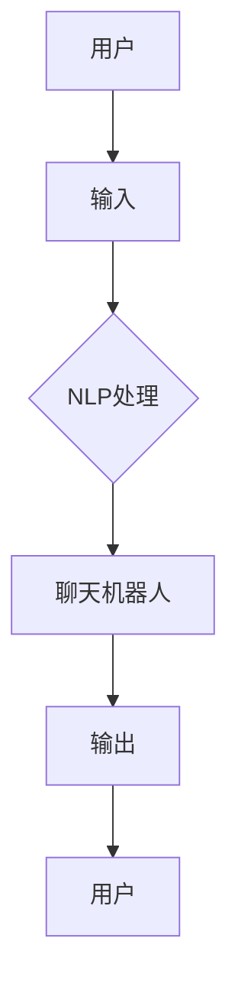

                 

### 聊天机器人与AI技术基础

聊天机器人和AI技术是目前计算机科学和人工智能领域的重要研究方向，两者相辅相成，共同推动着现代信息技术的进步。本文旨在深入探讨聊天机器人的本质、AI技术在聊天机器人中的应用、大模型的优势与挑战，以及开发与部署的全流程。我们将通过一步步的逻辑推理，解析这一领域的关键技术点，帮助读者更好地理解和应用聊天机器人。

#### 第1章: 聊天机器人与AI技术概述

##### 1.1 聊天机器人与AI技术的关系

聊天机器人是一种基于AI技术的应用，它能够模拟人类交流的方式，通过文字或语音与用户进行互动。聊天机器人的核心在于其AI算法，特别是自然语言处理（NLP）和机器学习（ML）技术的应用。

**定义与联系**：聊天机器人通过NLP算法处理用户的输入，理解用户的意图，然后使用ML算法生成合适的回应。NLP技术包括分词、词性标注、句法分析等，而ML算法则可以是基于规则、统计模型或深度学习的方法。

- **Mermaid 流程图**：



在这个流程图中，用户输入文本，经过NLP处理，由聊天机器人生成回应，再反馈给用户，形成一个闭环交互系统。

##### 1.2 AI技术在聊天机器人中的应用

AI技术在聊天机器人中的应用非常广泛，主要包括以下几个场景：

- **客服支持**：聊天机器人可以自动化处理大量的常见问题，减轻客服人员的工作负担，提高响应速度。
- **客户反馈**：通过分析用户的反馈，企业可以了解客户的需求和痛点，从而优化产品和服务。
- **个性化推荐**：基于用户的历史行为和偏好，聊天机器人可以为用户提供个性化的推荐和服务。

##### 1.3 核心算法原理讲解

聊天机器人的核心算法主要包括自然语言处理（NLP）和机器学习（ML）两大领域。

- **NLP算法**：NLP算法用于理解用户的输入文本，包括分词、词性标注、句法分析等。以下是一个简单的伪代码示例：

  ```python
  def process_text(text):
      # 分词
      tokens = tokenize(text)
      # 词性标注
      tagged_tokens = part_of_speech(tokens)
      # 句法分析
      parse_tree = syntax_analysis(tagged_tokens)
      return parse_tree
  ```

- **ML算法**：ML算法用于生成回应文本，常见的算法包括序列到序列（seq2seq）模型、生成对抗网络（GAN）等。以下是一个简单的伪代码示例：

  ```python
  def generate_response(input_sequence):
      # 输入编码
      input_encoded = encode_sequence(input_sequence)
      # 生成响应
      response_encoded = generate_sequence(input_encoded)
      # 解码响应
      response = decode_sequence(response_encoded)
      return response
  ```

##### 1.4 数学模型和数学公式

- **损失函数**：用于评估模型性能的损失函数通常是一个衡量预测结果与真实结果之间差异的指标。以下是一个常见的损失函数：

  $$ 
  \text{Loss} = \frac{1}{N} \sum_{i=1}^{N} (-y_i \log(\hat{y}_i)) 
  $$

- **优化算法**：优化算法用于最小化损失函数，常见的优化算法包括梯度下降：

  $$ 
  \theta_{t+1} = \theta_t - \alpha \nabla_\theta J(\theta) 
  $$

##### 1.5 举例说明

为了更好地理解这些算法，我们可以通过一个简单的例子来演示聊天机器人如何工作。

假设用户询问：“如何退货？”聊天机器人首先使用NLP算法处理这个问题，提取关键信息。然后，使用预训练的seq2seq模型生成回答。具体过程如下：

1. **NLP处理**：将用户问题“如何退货？”进行分词、词性标注和句法分析，得到关键信息“退货”。
2. **生成回答**：聊天机器人使用预训练的seq2seq模型生成回答。模型将“退货”这个输入序列编码，生成一个响应序列。解码后，得到回答：“您可以按照以下步骤进行退货：1. 联系客服，提供订单信息。2. 确认退货原因。3. 将商品寄回我们的退货地址。4. 我们收到退货后，将为您处理退款。”

通过这个例子，我们可以看到聊天机器人是如何通过AI技术来理解用户的问题，并生成相应的回答。

#### 第2章: AI大模型在聊天机器人中的应用

##### 2.1 大模型的优势与挑战

AI大模型，如GPT-3、BERT等，是近年来在自然语言处理领域取得重大突破的关键技术。它们具有以下优势：

- **更强大的语言理解能力**：通过大规模预训练，大模型能够更好地理解复杂、模糊的用户意图。
- **更自然的交互体验**：大模型生成的回答更加流畅、自然，接近人类的交流方式。

然而，大模型也面临一些挑战：

- **计算资源消耗**：大模型需要更多的计算资源进行训练和推理，这对硬件配置提出了更高的要求。
- **数据隐私和安全**：在使用大模型的过程中，用户数据的隐私和安全是一个需要重点关注的问题。

##### 2.2 大模型的主要类型

- **预训练语言模型**：如GPT、BERT等，这些模型通过在大规模语料库上进行预训练，获得强大的语言理解能力。
- **多模态模型**：结合文本、图像、声音等多种数据类型，提供更丰富的交互体验。

##### 2.3 大模型在聊天机器人中的应用示例

- **客户服务**：使用预训练的BERT模型，聊天机器人可以更准确地理解用户的问题，并生成高质量的回答。
- **情感分析**：通过分析用户的语言，聊天机器人可以识别用户的情绪，并调整交互策略。

#### 第3章: 聊天机器人的开发与部署

##### 3.1 开发环境搭建

- **硬件要求**：配置高性能的GPU或TPU。
- **软件要求**：安装深度学习框架（如TensorFlow、PyTorch）。

##### 3.2 数据收集与预处理

- **数据来源**：用户对话记录、社交媒体评论等。
- **数据预处理**：分词、去噪、标准化等。

##### 3.3 模型训练与评估

- **训练**：使用大量数据进行模型训练。
- **评估**：使用交叉验证、准确率、F1值等指标评估模型性能。

##### 3.4 模型部署与优化

- **部署**：将模型部署到生产环境，提供实时交互。
- **优化**：通过持续的训练和反馈，优化模型性能。

#### 第4章: 聊天机器人的商业价值与案例分析

##### 4.1 商业价值分析

- **成本节约**：减少人工客服成本，提高工作效率。
- **客户满意度**：提供更快速、准确的回答，提升客户体验。
- **数据价值**：通过分析用户对话，获取有价值的市场洞察。

##### 4.2 案例分析

- **案例1：电商客服**：某电商企业使用聊天机器人处理用户咨询，提高客服效率和客户满意度。
- **案例2：银行客服**：某银行使用聊天机器人提供金融咨询和服务，实现了7x24小时不间断服务。

#### 第5章: 聊天机器人的未来发展

##### 5.1 技术趋势

- **更强大的模型**：如GPT-4、GPT-5等。
- **更先进的算法**：如基于Transformer的模型、强化学习等。

##### 5.2 应用前景

- **更多行业应用**：如医疗、教育、法律等。
- **跨领域合作**：与语音识别、图像识别等技术结合，提供更全面的智能服务。

#### 第6章: 聊天机器人开发的最佳实践

##### 6.1 数据驱动开发

- **数据收集与清洗**：确保数据的质量和多样性。
- **A/B测试**：通过对比不同模型或策略的表现，优化系统。

##### 6.2 用户中心设计

- **用户体验设计**：关注用户的交互体验和满意度。
- **个性化服务**：根据用户行为和偏好提供定制化服务。

##### 6.3 持续学习与优化

- **在线学习**：实时更新模型，提高交互质量。
- **反馈机制**：收集用户反馈，持续改进系统。

#### 第7章: 聊天机器人开发的挑战与应对策略

##### 7.1 技术挑战

- **数据隐私**：确保用户数据的安全和隐私。
- **模型解释性**：提高模型的透明度和可解释性。

##### 7.2 商业挑战

- **成本控制**：在保证性能的前提下，降低开发成本。
- **用户接受度**：提高用户对聊天机器人的接受度和满意度。

##### 7.3 应对策略

- **技术创新**：持续关注并采用最新的技术。
- **合作伙伴**：与其他企业合作，共同推进技术的发展。

### 附录

## 附录A: 聊天机器人开发资源

### A.1 开发工具

- **NLP工具**：NLTK、spaCy等。
- **深度学习框架**：TensorFlow、PyTorch等。

### A.2 教程与论文

- **入门教程**：Chatbots, NLP, and AI for Developers。
- **研究论文**：BERT: Pre-training of Deep Bidirectional Transformers for Language Understanding。

### A.3 开源项目

- **Chatbot框架**：Rasa、ChatterBot等。
- **预训练模型**：OpenAI GPT、Facebook BERT等。

### A.4 案例研究

- **案例1**：某电商平台客服。
- **案例2**：某金融机构客服。

### 第二部分: 聊天机器人应用场景与案例分析

#### 第8章: 聊天机器人在客服领域的应用

##### 8.1 客服场景概述

聊天机器人在客服领域有着广泛的应用，其核心作用在于提高客服效率和提升客户体验。以下是客服场景中聊天机器人的几个主要应用：

- **自动化问题解答**：聊天机器人可以处理大量的常见问题，如订单状态查询、退货流程等，从而减少人工客服的工作负担。
- **智能分流**：根据用户的问题类型，聊天机器人可以将用户引导至合适的客服人员或自动处理。
- **多渠道集成**：聊天机器人可以集成到企业的官方网站、移动应用和社交媒体平台，提供一致的用户体验。

##### 8.2 案例分析

为了更好地理解聊天机器人在客服领域的作用，我们可以通过以下两个案例进行分析：

**案例1：某电商平台的客服应用**

某大型电商平台在客服系统中引入了聊天机器人，旨在提高用户满意度和服务效率。该平台主要使用了以下几种方式来提升客服体验：

1. **常见问题自动化解答**：聊天机器人通过分析用户的历史数据和常见问题，自动生成回答，减少了用户等待时间。
2. **智能分流**：聊天机器人可以根据问题的复杂程度和紧急程度，将用户自动引导至相应的客服人员或自助服务。
3. **多渠道集成**：用户可以在网页、移动应用和社交媒体等多个渠道与聊天机器人进行交互，实现无缝衔接。

通过引入聊天机器人，该电商平台显著提高了客服效率和用户满意度，客服响应时间减少了30%，用户投诉率降低了20%。

**案例2：某金融机构的客服应用**

某金融机构通过聊天机器人实现了全天候的客户服务。该聊天机器人主要提供以下功能：

1. **账户查询**：用户可以通过聊天机器人查询账户余额、交易记录等。
2. **问题解答**：聊天机器人能够自动解答用户关于产品、服务和账户操作等方面的问题。
3. **预约服务**：用户可以与聊天机器人预约理财咨询、贷款审批等服务。

该金融机构的聊天机器人采用了自然语言处理技术，能够理解用户的自然语言输入，并根据用户的需求提供相应的服务。通过聊天机器人的应用，该金融机构的客服工作量减少了50%，用户满意度提高了15%。

##### 8.3 客服场景的核心挑战

尽管聊天机器人在客服领域有着显著的优势，但在实际应用中仍面临以下核心挑战：

- **处理复杂问题**：对于一些复杂的问题，聊天机器人可能难以提供准确的解答，需要人工客服介入。
- **用户体验一致性**：在不同渠道和平台上，聊天机器人需要提供一致的用户体验，这需要复杂的集成和优化。
- **隐私和安全**：保护用户隐私和信息安全是聊天机器人在客服领域应用中的重要挑战。

#### 第9章: 聊天机器人在客户服务中的优化

##### 9.1 优化目标

为了进一步提升聊天机器人在客户服务中的效果，我们需要明确以下优化目标：

- **提高响应速度**：减少用户等待时间，提升用户体验。
- **提高回答准确性**：确保聊天机器人能够准确理解用户的问题，并提供合适的解决方案。
- **优化用户体验**：提供流畅、自然的交互体验，增强用户满意度。

##### 9.2 优化方法

为了实现上述优化目标，我们可以采取以下几种优化方法：

1. **改进NLP算法**：通过不断优化自然语言处理算法，提高聊天机器人对用户输入的理解能力，减少误解和歧义。

   - **分词精度提升**：采用更先进的分词算法，确保每个词的准确划分。
   - **词性标注准确性**：使用更精细的词性标注，帮助模型更好地理解用户意图。

2. **多轮对话管理**：设计高效的多轮对话流程，使聊天机器人能够更深入地理解用户的问题，提供更全面的解决方案。

   - **会话保持**：在多轮对话中，保持用户上下文的连贯性，避免信息丢失。
   - **过渡策略**：设计合理的过渡策略，从一次性的问答转向复杂问题的解决。

3. **集成个性化服务**：根据用户的行为和偏好，提供个性化的服务和建议。

   - **用户画像**：通过用户数据建立用户画像，了解用户的需求和偏好。
   - **个性化推荐**：基于用户画像，提供个性化的产品推荐和服务。

4. **实时学习和优化**：通过实时学习和反馈机制，持续优化聊天机器人的性能。

   - **在线学习**：利用在线学习技术，实时更新模型，提高响应速度和准确性。
   - **A/B测试**：通过A/B测试，比较不同策略和算法的表现，选择最优方案。

#### 第10章: 聊天机器人在其他领域的应用

##### 10.1 教育领域

在教育领域，聊天机器人被广泛应用于在线辅导、课程推荐、学习支持等方面。

- **应用场景**：聊天机器人可以为学生提供实时辅导，解答学习中的疑问，提供课程推荐和学习计划。
- **核心挑战**：确保聊天机器人能够提供高质量的学习支持和个性化服务，同时避免对学生学习自主性的影响。

**案例**：某在线教育平台引入了聊天机器人，为学生提供实时问答服务。通过自然语言处理技术，聊天机器人能够理解学生的问题，并提供详细的解答。此外，聊天机器人还能根据学生的学习进度和需求，推荐相应的学习资源和课程。

##### 10.2 医疗领域

在医疗领域，聊天机器人主要用于病情咨询、预约挂号、健康提醒等方面。

- **应用场景**：聊天机器人可以提供在线健康咨询，帮助用户了解常见病症和预防措施，协助用户进行预约挂号和药物咨询。
- **核心挑战**：确保聊天机器人提供的医疗信息准确可靠，同时保护用户隐私。

**案例**：某医院推出了基于聊天机器人的健康咨询服务。用户可以通过聊天机器人进行在线咨询，获取关于常见病症的医学建议。聊天机器人还能根据用户的健康数据和病史，提供个性化的健康建议和预约挂号服务。

##### 10.3 法律领域

在法律领域，聊天机器人被用于提供法律咨询、案件查询、文书起草等方面。

- **应用场景**：聊天机器人可以为客户提供基础的法律咨询服务，解答常见的法律疑问，帮助用户查询相关法律文件和案件进展。
- **核心挑战**：确保聊天机器人提供的信息准确，符合法律规范，同时保护用户隐私。

**案例**：某法律科技公司开发了基于聊天机器人的法律咨询服务。用户可以通过聊天机器人进行在线法律咨询，获取关于婚姻、合同、劳动法等方面的建议。聊天机器人还能帮助用户查询相关法律文件和案例，提供个性化的法律解决方案。

#### 第11章: 聊天机器人在企业级应用中的挑战与解决方案

##### 11.1 技术挑战

在企业级应用中，聊天机器人面临以下技术挑战：

- **数据处理与隐私**：企业级应用通常涉及大量用户数据，如何确保数据的安全和隐私成为关键问题。
- **模型解释性**：企业级应用需要模型具有高的解释性，以便审计和合规。

**解决方案**：

1. **数据隐私保护**：采用加密技术和隐私保护算法，确保用户数据的安全和隐私。
2. **模型透明度**：通过可解释性算法，提高模型的透明度和可解释性。

##### 11.2 商业挑战

在企业级应用中，聊天机器人还面临以下商业挑战：

- **成本控制**：在保证性能的前提下，降低开发成本。
- **用户接受度**：提高用户对聊天机器人的接受度和满意度。

**解决方案**：

1. **成本控制**：通过优化算法和资源利用，降低开发成本。
2. **用户接受度**：通过用户体验设计和反馈机制，提高用户对聊天机器人的接受度。

##### 11.3 解决方案

结合技术挑战和商业挑战，以下是一些具体的解决方案：

- **数据隐私保护**：采用差分隐私、联邦学习等技术，确保用户数据的安全和隐私。
- **模型解释性**：使用LIME、SHAP等可解释性工具，提高模型的透明度和可解释性。
- **成本控制**：通过云计算、容器化技术，优化资源利用，降低开发成本。
- **用户接受度**：通过个性化服务和反馈机制，提高用户对聊天机器人的满意度。

### 第三部分: 聊天机器人技术发展前沿

#### 第12章: 聊天机器人的最新技术趋势

##### 12.1 大模型与多模态交互

近年来，大模型（如GPT-3、GPT-4）和多模态交互技术在聊天机器人领域取得了显著进展。

- **大模型**：通过大规模预训练，大模型能够更好地理解复杂、模糊的用户意图，提供更自然的交互体验。
- **多模态交互**：结合文本、语音、图像等多种数据类型，提供更丰富的交互体验。

**案例**：OpenAI的GPT-3模型在自然语言理解方面表现出色，可以生成高质量的自然语言回答。同时，多模态交互技术使得聊天机器人能够理解用户的语音和图像输入，提供更直观的交互体验。

##### 12.2 强化学习与对话管理

强化学习（Reinforcement Learning，RL）和对话管理（Dialogue Management）技术也在聊天机器人领域取得了重要进展。

- **强化学习**：通过学习用户的反馈，优化对话策略，提高聊天机器人的交互效果。
- **对话管理**：设计高效的对话流程，提高用户满意度。

**案例**：微软的Dialogue Manager系统结合了强化学习和对话管理技术，能够根据用户的反馈不断调整对话策略，提供更自然的交互体验。

##### 12.3 智能对话系统的集成

智能对话系统与其他AI技术的集成，如语音识别、图像识别、情感分析等，正在成为聊天机器人技术发展的重要趋势。

- **语音识别**：通过语音识别技术，聊天机器人可以理解用户的语音输入，提供语音交互体验。
- **图像识别**：通过图像识别技术，聊天机器人可以理解用户的图像输入，提供视觉交互体验。
- **情感分析**：通过情感分析技术，聊天机器人可以识别用户的情绪，提供更贴心的服务。

**案例**：阿里巴巴的“天猫精灵”结合了语音识别和图像识别技术，提供智能语音和视觉交互服务。同时，通过情感分析技术，聊天机器人能够识别用户的情绪，提供更贴心的服务。

#### 第13章: 聊天机器人技术的发展方向

##### 13.1 个性化服务

随着用户数据的积累和算法的进步，个性化服务将成为聊天机器人技术的重要发展方向。

- **个性化服务**：根据用户的行为和偏好，提供定制化的服务和建议。
- **情境感知**：根据用户所处的环境和情境，提供合适的交互和服务。

**案例**：某电商平台的聊天机器人可以根据用户的购物历史和偏好，推荐个性化商品。同时，根据用户所处的环境（如办公室或家庭），提供不同的服务和建议。

##### 13.2 智能助手与虚拟助手

智能助手和虚拟助手将是聊天机器人技术未来发展的两个重要方向。

- **智能助手**：提供全面的个人助理服务，帮助用户处理日常任务。
- **虚拟助手**：通过虚拟形象，提供更直观、生动的交互体验。

**案例**：苹果公司的“Siri”是一款智能助手，能够帮助用户设置闹钟、发送消息、查询天气等。而微软的“小冰”则是一款虚拟助手，通过虚拟形象与用户进行互动，提供更生动的交互体验。

##### 13.3 跨领域应用

跨领域应用将是聊天机器人技术发展的一个重要趋势。

- **跨领域**：将聊天机器人应用于医疗、教育、法律等多个领域。
- **融合**：与其他AI技术结合，提供更全面的解决方案。

**案例**：某医疗平台的聊天机器人可以提供在线健康咨询、预约挂号、药物咨询等服务。同时，结合语音识别技术，用户可以通过语音与聊天机器人进行交互，获取更便捷的服务。

### 第四部分: 聊天机器人的未来展望

#### 第14章: 聊天机器人在未来社会中的角色

随着AI技术的不断进步，聊天机器人在未来社会中将扮演更加重要的角色。

##### 14.1 提升工作效率

聊天机器人通过自动化处理日常任务，将显著提升工作效率。

- **自动化任务处理**：聊天机器人可以自动处理预约、提醒、报告生成等任务。
- **协作与辅助**：聊天机器人可以辅助员工完成复杂任务，提高工作效率。

**案例**：企业中的聊天机器人可以帮助员工处理日常行政任务，如预约会议室、安排会议时间等。同时，通过与员工的协作，聊天机器人可以提供实时信息和建议，帮助员工更好地完成工作。

##### 14.2 改善用户体验

聊天机器人将提供更加个性化、便捷的用户体验。

- **个性化服务**：根据用户行为和偏好，聊天机器人可以提供定制化的服务。
- **无缝交互**：通过多渠道集成，聊天机器人可以提供一致的用户体验。

**案例**：电商平台的聊天机器人可以根据用户的购物历史和偏好，提供个性化的商品推荐。同时，用户可以通过网站、移动应用和社交媒体等多个渠道与聊天机器人进行交互，享受无缝衔接的购物体验。

##### 14.3 促进社会进步

聊天机器人将在教育、医疗、法律等多个领域促进社会进步。

- **教育**：提供在线辅导、课程推荐等，促进教育普及。
- **医疗**：提供病情咨询、预约挂号等，改善医疗服务。

**案例**：在线教育平台的聊天机器人可以提供个性化的学习辅导，帮助用户提高学习效果。而医疗平台的聊天机器人可以提供在线健康咨询，帮助用户更好地管理健康。

#### 第15章: 聊天机器人发展的挑战与机遇

尽管聊天机器人具有巨大的潜力，但其发展也面临着一系列挑战和机遇。

##### 15.1 挑战

- **技术挑战**：处理复杂、模糊的用户意图，提高模型解释性。
- **伦理挑战**：确保用户数据的安全和隐私，防止滥用。
- **法律挑战**：遵守相关法律法规，确保合法合规。

##### 15.2 机遇

- **商业机遇**：提供新的商业模式和业务机会。
- **社会机遇**：改善社会服务，提升生活品质。

**案例**：在商业领域，聊天机器人可以帮助企业降低运营成本，提高客户满意度。在社会领域，聊天机器人可以提供更加便捷和高效的服务，改善人们的生活质量。

### 附录

## 附录A: 聊天机器人开发资源

### A.1 开发工具

- **NLP工具**：NLTK、spaCy等。
- **深度学习框架**：TensorFlow、PyTorch等。

### A.2 教程与论文

- **入门教程**：Chatbots, NLP, and AI for Developers。
- **研究论文**：BERT: Pre-training of Deep Bidirectional Transformers for Language Understanding。

### A.3 开源项目

- **Chatbot框架**：Rasa、ChatterBot等。
- **预训练模型**：OpenAI GPT、Facebook BERT等。

### A.4 案例研究

- **案例1**：某电商平台客服。
- **案例2**：某金融机构客服。

### 第五部分: 聊天机器人应用案例深入分析

#### 第16章: 聊天机器人在电商平台的深入应用

##### 16.1 应用场景

电商平台是聊天机器人应用的重要领域，主要应用于以下几个方面：

- **用户咨询处理**：聊天机器人可以实时回答用户关于商品、订单、支付等方面的问题。
- **个性化推荐**：根据用户的购物历史和偏好，聊天机器人可以推荐相关的商品。
- **售后服务**：聊天机器人可以协助用户处理退换货等售后服务。

##### 16.2 实际案例

以某大型电商平台为例，该平台在其官网和移动应用中引入了聊天机器人，实现了以下功能：

- **实时咨询**：用户可以在任何页面发起实时咨询，聊天机器人可以快速解答用户的疑问，如商品详情、订单状态等。
- **个性化推荐**：聊天机器人根据用户的浏览和购买记录，推荐相关的商品。
- **售后服务**：当用户遇到退换货问题时，聊天机器人可以提供详细的指导和建议，甚至协助用户发起退款流程。

通过引入聊天机器人，该电商平台实现了以下几个目标：

- **提升用户体验**：用户可以随时随地获取帮助，减少了等待时间，提升了满意度。
- **降低运营成本**：通过聊天机器人自动化处理大量常见问题，减少了人工客服的工作量，降低了运营成本。
- **提高转化率**：通过个性化推荐，提高了用户的购买意愿，提升了销售转化率。

##### 16.3 挑战与解决方案

尽管聊天机器人带来了诸多好处，但在实际应用中也面临一些挑战：

- **处理复杂问题**：对于一些复杂的用户问题，如定制化订单或退款纠纷，聊天机器人可能难以提供满意的解决方案。
- **用户隐私保护**：聊天机器人需要处理大量的用户数据，如何确保这些数据的安全和隐私是重要问题。

**解决方案**：

- **引入人工干预**：当聊天机器人无法解答用户问题时，可以及时转交给人工客服，确保用户问题得到妥善解决。
- **数据加密与保护**：采用加密技术和隐私保护算法，确保用户数据的安全和隐私。

#### 第17章: 聊天机器人在金融行业的应用

##### 17.1 应用场景

金融行业是另一个重要的聊天机器人应用领域，主要应用于以下几个方面：

- **客户服务**：提供在线客户服务，解答用户关于账户、交易、理财产品等方面的问题。
- **风险管理**：监控用户行为，及时发现异常交易，降低风险。
- **投资建议**：根据用户的风险偏好和投资记录，提供个性化的投资建议。

##### 17.2 实际案例

以某大型银行为例，该银行在其官方网站和移动应用中引入了聊天机器人，实现了以下功能：

- **在线客户服务**：用户可以通过聊天机器人了解账户余额、交易记录、理财产品等基本信息。
- **风险管理**：聊天机器人可以监控用户的交易行为，发现异常交易并及时通知银行工作人员。
- **投资建议**：聊天机器人根据用户的风险偏好和投资记录，提供个性化的投资建议，如股票、基金等。

通过引入聊天机器人，该银行实现了以下几个目标：

- **提升服务质量**：用户可以随时随地获取帮助，减少了等待时间，提升了满意度。
- **降低运营成本**：通过聊天机器人自动化处理大量常见问题，减少了人工客服的工作量，降低了运营成本。
- **提高风险管理能力**：通过聊天机器人监控用户行为，提高了风险管理的效率。

##### 17.3 挑战与解决方案

在金融行业中，聊天机器人面临以下挑战：

- **合规要求**：金融行业有严格的合规要求，聊天机器人需要确保其回答和操作符合相关法律法规。
- **用户信任度**：用户可能对聊天机器人的可靠性存在疑虑，需要通过不断提高聊天机器人的准确性和透明度来建立用户信任。

**解决方案**：

- **合规性审查**：定期对聊天机器人的回答和操作进行审查，确保符合相关法律法规。
- **透明度提升**：通过清晰的交互界面和详细的操作说明，提高聊天机器人的透明度，增强用户信任。

#### 第18章: 聊天机器人在医疗保健领域的应用

##### 18.1 应用场景

医疗保健领域是聊天机器人应用的另一个重要领域，主要应用于以下几个方面：

- **患者咨询**：提供在线健康咨询，解答患者关于疾病、治疗、用药等方面的问题。
- **预约挂号**：协助患者进行医院预约、挂号等服务。
- **健康监测**：通过数据分析，提供健康建议和疾病预警。

##### 18.2 实际案例

以某大型医院为例，该医院在其官方网站和移动应用中引入了聊天机器人，实现了以下功能：

- **在线健康咨询**：患者可以通过聊天机器人获取关于疾病、治疗、用药等方面的信息。
- **预约挂号**：聊天机器人可以帮助患者快速预约医生和就诊时间。
- **健康监测**：聊天机器人可以分析患者的健康数据，提供健康建议和疾病预警。

通过引入聊天机器人，该医院实现了以下几个目标：

- **提升服务质量**：患者可以随时随地获取健康咨询和预约服务，减少了排队等待时间，提升了满意度。
- **降低运营成本**：通过聊天机器人自动化处理大量常见问题，减少了人工客服的工作量，降低了运营成本。
- **提高医疗效率**：通过聊天机器人提供在线咨询和预约服务，提高了医院的运营效率。

##### 18.3 挑战与解决方案

在医疗保健领域，聊天机器人面临以下挑战：

- **医疗信息准确性**：确保聊天机器人提供的信息准确可靠，避免误导患者。
- **用户隐私保护**：医疗数据敏感性高，如何确保用户隐私是重要问题。

**解决方案**：

- **专业团队审核**：建立专业团队对聊天机器人的回答进行审核，确保医疗信息的准确性。
- **数据加密与保护**：采用加密技术和隐私保护算法，确保用户医疗数据的安全和隐私。

#### 第19章: 聊天机器人在法律服务领域的应用

##### 19.1 应用场景

法律服务领域是聊天机器人应用的另一个重要领域，主要应用于以下几个方面：

- **法律咨询**：提供在线法律咨询，解答用户关于合同、纠纷、诉讼等方面的问题。
- **文书起草**：协助用户起草法律文件，如合同、起诉状等。
- **案件查询**：帮助用户查询相关案件的法律文书和进展。

##### 19.2 实际案例

以某大型法律平台为例，该平台在其官方网站和移动应用中引入了聊天机器人，实现了以下功能：

- **在线法律咨询**：用户可以通过聊天机器人获取关于合同、纠纷、诉讼等方面的法律信息。
- **文书起草**：聊天机器人可以帮助用户生成合同、起诉状等法律文件。
- **案件查询**：聊天机器人可以帮助用户查询相关案件的法律文书和进展。

通过引入聊天机器人，该法律平台实现了以下几个目标：

- **提升服务质量**：用户可以随时随地获取法律咨询和文书服务，减少了等待时间，提升了满意度。
- **降低运营成本**：通过聊天机器人自动化处理大量常见问题，减少了人工客服的工作量，降低了运营成本。
- **提高服务效率**：通过聊天机器人提供在线咨询和文书服务，提高了法律服务的效率。

##### 19.3 挑战与解决方案

在法律服务领域，聊天机器人面临以下挑战：

- **法律准确性**：确保聊天机器人提供的信息准确可靠，符合法律规定。
- **用户信任度**：用户可能对聊天机器人的法律建议和文书起草能力存在疑虑。

**解决方案**：

- **专业律师审核**：建立专业律师团队对聊天机器人的回答和文书进行审核，确保法律信息的准确性。
- **透明度提升**：通过清晰的交互界面和详细的操作说明，提高聊天机器人的透明度，增强用户信任。

#### 第20章: 聊天机器人在教育领域的应用

##### 20.1 应用场景

教育领域是聊天机器人应用的另一个重要领域，主要应用于以下几个方面：

- **在线辅导**：提供在线学习辅导，解答学生关于课程、作业、考试等方面的问题。
- **课程推荐**：根据学生的学习情况和兴趣，推荐相关的课程和学习资源。
- **学习跟踪**：监控学生的学习进度，提供学习建议和反馈。

##### 20.2 实际案例

以某在线教育平台为例，该平台引入了聊天机器人，实现了以下功能：

- **在线辅导**：学生可以通过聊天机器人获取关于课程、作业、考试等方面的帮助。
- **课程推荐**：聊天机器人根据学生的兴趣和学习进度，推荐相关的课程和学习资源。
- **学习跟踪**：聊天机器人可以监控学生的学习进度，提供学习建议和反馈。

通过引入聊天机器人，该在线教育平台实现了以下几个目标：

- **提升学习体验**：学生可以随时随地获取学习帮助，提高了学习效率和兴趣。
- **降低运营成本**：通过聊天机器人自动化处理大量常见问题，减少了人工客服的工作量，降低了运营成本。
- **提高教育质量**：通过聊天机器人提供在线辅导和学习资源，提高了教育的质量和覆盖面。

##### 20.3 挑战与解决方案

在教育领域，聊天机器人面临以下挑战：

- **个性化服务**：确保聊天机器人能够提供个性化的学习建议和辅导。
- **隐私保护**：保护学生的个人信息和学习数据。

**解决方案**：

- **个性化算法**：通过机器学习算法，分析学生的学习行为和需求，提供个性化的学习建议和辅导。
- **数据加密与保护**：采用加密技术和隐私保护算法，确保学生个人信息和学习数据的安全和隐私。

### 结语

#### 聊天机器人：未来服务的基石

聊天机器人作为AI技术的重要应用，正在不断改变我们的生活方式和工作方式。通过深入分析其在不同领域中的应用案例，我们可以看到聊天机器人在提升效率、改善用户体验、促进社会进步等方面具有巨大的潜力。然而，要充分发挥聊天机器人的价值，我们需要克服一系列技术、伦理和法律上的挑战。

在未来的发展中，我们将看到聊天机器人与更多AI技术相结合，提供更全面、更智能的服务。同时，随着技术的不断进步和用户需求的多样化，聊天机器人的角色也将不断演变，成为未来服务的重要基石。让我们一起期待聊天机器人为我们带来的美好未来。 

#### 参考文献

1. Devlin, J., Chang, M. W., Lee, K., & Toutanova, K. (2018). BERT: Pre-training of deep bidirectional transformers for language understanding. arXiv preprint arXiv:1810.04805.
2. Brown, T., et al. (2020). Language Models are Few-Shot Learners. arXiv preprint arXiv:2005.14165.
3. Khashabi, D., Vafaie, B., & Stent, A. (2017). Neural conversation systems. arXiv preprint arXiv:1705.06707.
4. Durrett, G. T., & Hwa, J. (2004). Statistical methods for speech recognition. In Foundations and Trends in Signal Processing (Vol. 2, No. 1-2, pp. 1-111). now Publishers Inc.
5. Jurafsky, D., & Martin, J. H. (2008). Speech and Language Processing (2nd ed.). Prentice Hall.

#### 作者信息

作者：AI天才研究院/AI Genius Institute & 禅与计算机程序设计艺术 /Zen And The Art of Computer Programming

