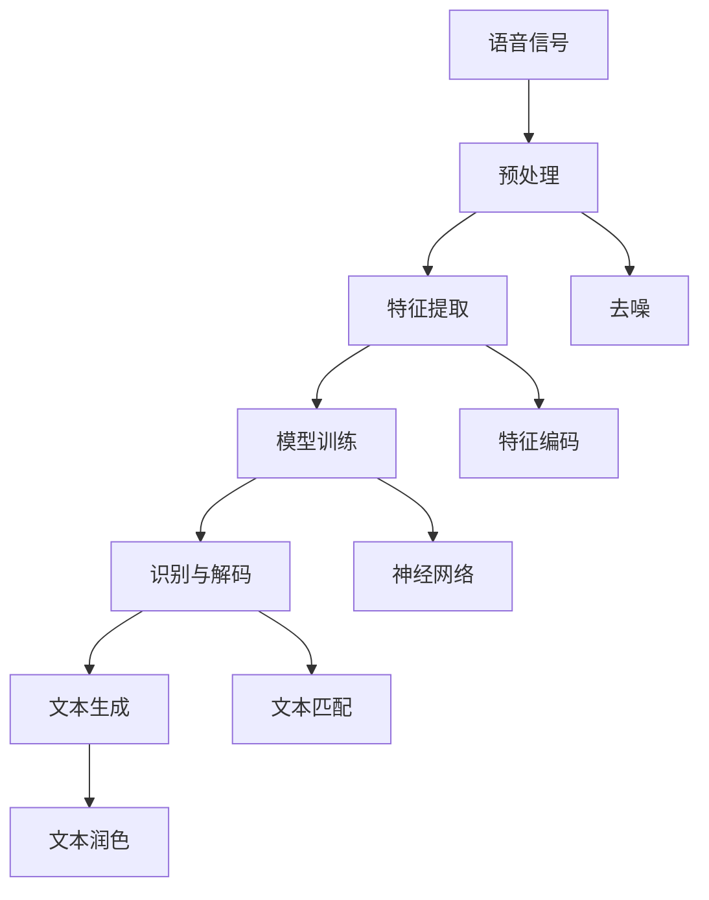
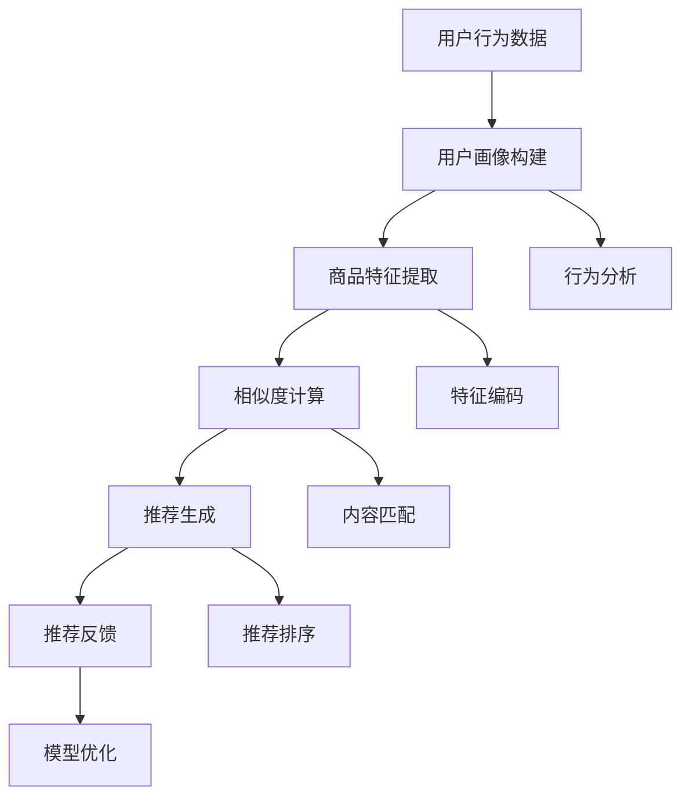

                 

# 《聊天机器人如何提升电商导购体验》

> **关键词：**聊天机器人，电商导购，用户体验，自然语言处理，个性化推荐，算法优化

> **摘要：**随着互联网的快速发展，电商导购成为现代商业中不可或缺的一部分。本文将探讨聊天机器人如何通过技术创新和用户体验优化，提升电商导购体验，从而为商家和消费者带来更多价值。我们将从聊天机器人的基础知识、应用场景、交互设计、算法优化、个性化推荐、用户体验评估以及实际应用等多个方面，深入分析聊天机器人如何提升电商导购体验。

## 《聊天机器人如何提升电商导购体验》目录大纲

## 第一部分：聊天机器人基础知识

### 第1章：聊天机器人的定义与分类

#### 1.1 聊天机器人的定义

#### 1.2 聊天机器人的分类

#### 1.3 聊天机器人的发展趋势

### 第2章：聊天机器人的核心技术

#### 2.1 自然语言处理技术

##### 2.1.1 语音识别技术

##### 2.1.2 自然语言理解技术

##### 2.1.3 自然语言生成技术

### 第3章：聊天机器人在电商中的应用场景

#### 3.1 电商导购场景

##### 3.1.1 商品推荐

##### 3.1.2 客户服务

##### 3.1.3 用户行为分析

## 第二部分：提升电商导购体验的方法

### 第4章：聊天机器人的交互设计

#### 4.1 交互设计原则

##### 4.1.1 用户中心设计

##### 4.1.2 个性化交互

##### 4.1.3 跨平台交互

### 第5章：聊天机器人的算法优化

#### 5.1 常见优化算法

##### 5.1.1 强化学习

##### 5.1.2 集成学习

##### 5.1.3 聚类算法

### 第6章：聊天机器人的个性化推荐

#### 6.1 个性化推荐原理

##### 6.1.1 基于内容的推荐

##### 6.1.2 基于协同过滤的推荐

##### 6.1.3 深度学习推荐算法

### 第7章：聊天机器人的用户体验评估

#### 7.1 用户体验评估方法

##### 7.1.1 A/B测试

##### 7.1.2 竞品分析

##### 7.1.3 用户访谈

### 第8章：聊天机器人在电商导购中的实际应用

#### 8.1 案例分析

##### 8.1.1 某电商平台的聊天机器人应用案例

##### 8.1.2 某电商平台聊天机器人的效果分析

##### 8.1.3 某电商平台聊天机器人的改进方向

## 第三部分：未来展望

### 第9章：聊天机器人在电商导购领域的未来趋势

#### 9.1 新技术对聊天机器人的影响

##### 9.1.1 语音识别技术的进步

##### 9.1.2 人工智能伦理

##### 9.1.3 聊天机器人在电商领域的多样化应用

### 第10章：总结与展望

#### 10.1 聊天机器人提升电商导购体验的核心要素

##### 10.1.1 技术创新

##### 10.1.2 用户体验优化

##### 10.1.3 数据驱动的决策

#### 10.2 聊天机器人在电商导购领域的未来发展

##### 10.2.1 市场前景

##### 10.2.2 技术挑战

##### 10.2.3 发展策略

----------------------------------------------------------------<|assistant|>## 第一部分：聊天机器人基础知识

### 第1章：聊天机器人的定义与分类

#### 1.1 聊天机器人的定义

聊天机器人，又称为对话机器人，是一种模仿人类对话行为的计算机程序。它们能够通过自然语言处理（NLP）技术和人工智能（AI）算法，与用户进行交互，提供信息、解答问题或执行特定任务。聊天机器人可以基于文字、语音、图像等多种形式进行交互，广泛应用于客服、教育、娱乐、医疗、电商等多个领域。

#### 1.2 聊天机器人的分类

根据不同的应用场景和技术实现方式，聊天机器人可以分类如下：

1. **规则型聊天机器人：**
   规则型聊天机器人是基于预定义规则和条件进行对话的机器人。它们通过判断用户的输入，匹配相应的规则，给出预设的回答。这种类型的机器人适用于简单、结构化的对话场景，如在线客服、订单查询等。

2. **基于机器学习的聊天机器人：**
   基于机器学习的聊天机器人利用深度学习、自然语言处理等技术，通过大量数据训练，自主学习对话模式和用户偏好。这种类型的机器人适用于复杂、多变的对话场景，如情感分析、个性化推荐等。

3. **混合型聊天机器人：**
   混合型聊天机器人结合了规则型和基于机器学习的优点，既可以通过预定义规则快速响应简单问题，又可以利用机器学习技术处理复杂问题。这种类型的机器人适用于多种复杂场景，如电商导购、智能助理等。

#### 1.3 聊天机器人的发展趋势

随着人工智能技术的不断进步，聊天机器人的应用领域越来越广泛，发展趋势如下：

1. **智能化水平提升：**
   未来聊天机器人将更加智能化，不仅能够理解用户的语言和意图，还能根据上下文进行推理和决策，提供更加个性化的服务。

2. **多模态交互：**
   聊天机器人将支持多种交互方式，如语音、图像、视频等，满足用户多样化的需求。

3. **融合大数据分析：**
   聊天机器人将结合大数据分析技术，对用户行为、偏好进行深入挖掘，提供更加精准的服务。

4. **跨平台应用：**
   聊天机器人将实现跨平台应用，支持移动端、桌面端、智能硬件等多种设备，为用户提供无缝的体验。

### 第2章：聊天机器人的核心技术

#### 2.1 自然语言处理技术

自然语言处理（NLP）是聊天机器人的核心技术之一，它使得机器人能够理解和生成自然语言。NLP技术主要包括以下几个关键领域：

1. **文本分类：**
   文本分类是指将文本数据根据其内容分类到不同的类别。聊天机器人利用文本分类技术，对用户的输入进行分类，以便给出合适的回答。

2. **情感分析：**
   情感分析是指识别文本中的情感倾向，如正面、负面或中立。聊天机器人通过情感分析，了解用户的情绪，提供更加贴心的服务。

3. **实体识别：**
   实体识别是指识别文本中的特定实体，如人名、地名、组织名等。聊天机器人通过实体识别，将用户的输入与知识库中的实体进行匹配，提供更准确的回答。

4. **语义分析：**
   语义分析是指理解文本中的语义关系，如主谓宾关系、因果关系等。聊天机器人通过语义分析，理解用户的意图，提供更加合理的建议。

#### 2.2 语音识别技术

语音识别技术是将语音信号转换为文本的技术。聊天机器人通过语音识别技术，将用户的语音输入转换为文本，以便进行后续的自然语言处理。语音识别技术主要包括以下几个关键环节：

1. **语音信号预处理：**
   语音信号预处理包括去除噪音、增强语音信号等，以提高语音识别的准确性。

2. **特征提取：**
   特征提取是指将语音信号转换为特征向量，以便进行后续的模型训练和识别。

3. **模型训练：**
   模型训练是指利用大量语音数据，训练语音识别模型，使其能够识别不同语音信号的特定特征。

4. **识别与解码：**
   识别与解码是指将语音信号转换为对应的文本，并解码成可读的自然语言。

#### 2.3 自然语言生成技术

自然语言生成（NLG）技术是指将结构化数据转换为自然语言文本的技术。聊天机器人通过自然语言生成技术，将用户请求、查询结果等信息转换为自然语言文本，以提供更加人性化的服务。自然语言生成技术主要包括以下几个关键环节：

1. **模板匹配：**
   模板匹配是指利用预定义的模板，将结构化数据与模板进行匹配，生成自然语言文本。

2. **规则生成：**
   规则生成是指利用预定义的规则，将结构化数据转换为自然语言文本。

3. **深度学习生成：**
   深度学习生成是指利用深度学习模型，从大量数据中学习生成自然语言文本的规律，以生成更加自然、流畅的文本。

4. **文本润色：**
   文本润色是指对生成的自然语言文本进行优化和修改，以提高文本的质量和可读性。

### 第3章：聊天机器人在电商中的应用场景

#### 3.1 电商导购场景

电商导购场景是聊天机器人在电商领域的重要应用之一。在这个场景中，聊天机器人可以帮助用户快速找到所需商品，提高购物体验。以下是电商导购场景中聊天机器人的几个关键应用：

1. **商品推荐：**
   聊天机器人可以通过用户的历史浏览记录、购买行为等数据，为用户推荐合适的商品。推荐算法可以根据用户兴趣、购买力、流行趋势等多种因素进行个性化推荐，提高推荐效果。

2. **在线客服：**
   聊天机器人可以作为电商平台的在线客服，解答用户的疑问，提供购买建议，帮助用户顺利完成购物流程。

3. **用户行为分析：**
   聊天机器人可以记录用户在电商平台的浏览、购买等行为，对用户行为进行分析，为电商平台提供决策依据，优化购物体验。

#### 3.2 客户服务

在客户服务场景中，聊天机器人可以帮助企业降低客服成本，提高客户满意度。以下是聊天机器人在客户服务中的几个关键应用：

1. **自动回答常见问题：**
   聊天机器人可以自动回答客户关于产品、订单、退货等常见问题，减轻人工客服的工作负担。

2. **智能分配客服资源：**
   聊天机器人可以根据客户的问题类型和紧急程度，智能分配客服资源，提高客服效率。

3. **情感分析：**
   聊天机器人可以通过情感分析技术，识别客户的情绪，提供更加贴心的服务。

#### 3.3 用户行为分析

用户行为分析是电商企业了解用户需求、优化运营策略的重要手段。以下是聊天机器人在用户行为分析中的几个关键应用：

1. **用户画像：**
   聊天机器人可以收集用户的浏览、购买等行为数据，构建用户画像，为电商企业提供个性化的营销策略。

2. **行为预测：**
   聊天机器人可以通过分析用户行为数据，预测用户的购买意向和偏好，为电商企业制定针对性的促销活动。

3. **优化运营策略：**
   聊天机器人可以分析用户行为数据，为电商企业提供运营策略优化建议，提高用户满意度和转化率。

## 总结

本部分内容介绍了聊天机器人的定义、分类、发展趋势，以及自然语言处理、语音识别和自然语言生成等核心技术。同时，还阐述了聊天机器人在电商导购、客户服务和用户行为分析等应用场景中的关键作用。接下来，我们将进一步探讨如何通过交互设计、算法优化和个性化推荐等方法，提升聊天机器人在电商导购中的用户体验。

----------------------------------------------------------------<|assistant|>### 第4章：聊天机器人的交互设计

#### 4.1 交互设计原则

在设计和开发聊天机器人时，交互设计原则至关重要。以下是一些核心的交互设计原则：

##### 4.1.1 用户中心设计

用户中心设计是指在设计过程中始终将用户需求、体验和反馈放在首位。具体来说，需要关注以下几个方面：

1. **用户体验：** 设计时应考虑到用户的情感需求，提供友好、易懂的交互界面，避免复杂和冗余的操作。
2. **易用性：** 界面布局要简洁明了，确保用户能够快速找到所需功能，降低学习成本。
3. **响应速度：** 聊天机器人应具备快速响应能力，减少用户的等待时间，提高满意度。
4. **适应性：** 交互设计应适应不同用户群体和使用场景，确保机器人能够灵活应对各种情况。

##### 4.1.2 个性化交互

个性化交互是指聊天机器人根据用户的历史行为、偏好和情绪，提供个性化的互动和服务。以下是一些实现个性化交互的方法：

1. **用户画像：** 通过收集和分析用户数据，构建详细的用户画像，了解用户的需求和偏好。
2. **上下文感知：** 根据对话的上下文信息，动态调整交互策略，提供更加精准的服务。
3. **情感识别：** 利用情感分析技术，识别用户的情感状态，调整交互内容和语气，提供情感化的服务。
4. **推荐系统：** 结合个性化推荐算法，为用户提供符合其兴趣和需求的商品推荐。

##### 4.1.3 跨平台交互

跨平台交互是指聊天机器人能够在不同的设备和平台上进行无缝交互。以下是一些实现跨平台交互的方法：

1. **响应式设计：** 采用响应式设计，确保聊天机器人在不同设备和屏幕尺寸上均能提供良好的用户体验。
2. **多渠道集成：** 将聊天机器人集成到各种渠道中，如网站、移动应用、社交媒体等，使用户能够在不同场景下便捷地使用。
3. **兼容性：** 确保聊天机器人支持多种操作系统、浏览器和设备，提供一致的服务体验。
4. **跨平台API：** 利用跨平台API，实现聊天机器人与其他应用程序和服务的集成，扩大应用范围。

#### 4.2 交互设计案例

下面通过一个实际案例，展示如何应用交互设计原则来提升电商导购体验。

##### 案例背景

某电商平台计划上线一款聊天机器人，旨在帮助用户在购买商品时提供导购服务。为了提升用户体验，平台决定采用用户中心设计、个性化交互和跨平台交互等交互设计原则。

##### 案例实现

1. **用户中心设计：**
   - **简洁明了的界面：** 聊天机器人采用简洁的界面设计，突出核心功能，如“商品推荐”、“在线客服”等。
   - **快速响应：** 机器人具备快速响应能力，通常在用户提问后的几秒内给出回答。
   - **易于导航：** 用户可以轻松找到所需功能，无需复杂的操作。

2. **个性化交互：**
   - **用户画像：** 机器人会收集用户的历史浏览、购买记录等信息，构建用户画像。
   - **上下文感知：** 根据用户的历史行为和对话上下文，提供个性化的商品推荐和回答。
   - **情感识别：** 利用情感分析技术，识别用户的情绪，调整回答的语气和内容，如用户感到困惑，机器人会提供更加详细的解释。

3. **跨平台交互：**
   - **响应式设计：** 聊天机器人支持多种设备，包括手机、平板和电脑，提供一致的用户体验。
   - **多渠道集成：** 机器人集成到电商平台官网、移动应用和社交媒体中，用户可以随时随地进行交互。
   - **跨平台API：** 利用API将机器人与电商平台的其他系统和服务集成，如库存管理系统、订单处理系统等，确保信息的一致性和实时性。

##### 案例效果

通过上述交互设计原则的应用，电商平台的聊天机器人取得了显著的效果：

- **用户体验提升：** 用户反馈显示，聊天机器人提供了更加便捷、个性化的购物体验，用户满意度显著提高。
- **转化率提升：** 聊天机器人通过个性化推荐和高效服务，提高了用户的购买转化率，推动了销售增长。
- **运营成本降低：** 聊天机器人部分替代了人工客服，降低了客服成本，提高了客服效率。

#### 4.3 交互设计的挑战与解决方案

尽管交互设计在提升聊天机器人用户体验方面具有重要作用，但仍然面临一些挑战：

1. **用户多样性和个性化需求的平衡：**
   - **挑战：** 用户需求和偏好多样化，如何同时满足所有用户的需求？
   - **解决方案：** 通过大数据分析和用户画像，精准识别用户需求，实现个性化推荐和交互。

2. **跨平台一致性体验：**
   - **挑战：** 不同设备和平台上的交互体验难以保持一致，影响用户体验。
   - **解决方案：** 采用响应式设计和多渠道集成，确保聊天机器人在各种设备和平台上提供一致的用户体验。

3. **用户隐私和数据安全：**
   - **挑战：** 用户对隐私和数据安全的担忧，如何确保用户数据的安全和隐私？
   - **解决方案：** 实施严格的数据保护措施，如加密传输、数据匿名化等，增强用户信任。

通过不断优化交互设计，聊天机器人能够在电商导购中发挥更大的作用，提升用户体验，为企业创造更多价值。

### 第5章：聊天机器人的算法优化

#### 5.1 常见优化算法

在提升聊天机器人的性能和用户体验方面，算法优化至关重要。以下介绍几种常见的优化算法及其原理。

##### 5.1.1 强化学习

强化学习（Reinforcement Learning，RL）是一种通过试错和奖励机制来学习策略的机器学习方法。在聊天机器人中，强化学习可以通过以下步骤进行优化：

1. **状态表示：** 将用户提问和对话上下文编码为状态表示。
2. **动作表示：** 将聊天机器人的回答编码为动作表示。
3. **奖励函数：** 设计奖励函数，根据用户反馈来评估聊天机器人的回答质量。
4. **策略学习：** 通过最大化累积奖励，学习最佳回答策略。

伪代码：

```python
# 强化学习算法伪代码
Initialize Q(s, a) with random values
while not terminate:
  s <- Current state
  a <- Choose action with epsilon-greedy policy
  s' <- Next state
  r <- Reward for taking action a
  Q(s, a) <- Q(s, a) + α [r + γ max(Q(s', a')) - Q(s, a)]
  s <- s'
```

##### 5.1.2 集成学习

集成学习（Ensemble Learning）是将多个基础模型集成在一起，通过投票或加权平均来提高预测性能。聊天机器人中常见的集成学习方法包括：

1. **Bagging：** 通过随机选择样本和训练多个基础模型，然后进行平均或投票。
2. **Boosting：** 通过关注错误分类的样本，逐步训练多个基础模型，提高整体性能。

集成学习的伪代码：

```python
# 集成学习算法伪代码
Initialize ensemble of base models
for i in range(number_of_models):
  Sample data randomly with replacement
  Train base model on sampled data
  Add trained model to ensemble
Predict using ensemble of base models by averaging or voting
```

##### 5.1.3 聚类算法

聚类算法（Clustering Algorithms）用于将相似的数据点分组，以便进行更有效的分析。在聊天机器人中，聚类算法可以用于以下场景：

1. **用户群体划分：** 根据用户的行为和兴趣，将用户划分为不同的群体。
2. **对话主题识别：** 将对话按照主题进行分类，提高对话质量。

常见的聚类算法包括K-means、DBSCAN等。

K-means算法的伪代码：

```python
# K-means算法伪代码
Initialize K centroids
for i in range(max_iterations):
  Assign each data point to the nearest centroid
  Recompute centroids as the mean of assigned points
  Check for convergence (change in centroids)
Return the final clusters
```

#### 5.2 优化算法在实际中的应用

以下通过实际案例，展示如何应用强化学习、集成学习和聚类算法来提升聊天机器人的性能。

##### 案例背景

某电商平台的聊天机器人旨在为用户提供个性化的商品推荐和咨询服务。然而，用户反馈显示，机器人的回答质量参差不齐，部分用户甚至感到困惑。为了提升用户体验，平台决定采用多种优化算法对聊天机器人进行改进。

##### 案例实现

1. **强化学习：**
   - **状态表示：** 将用户提问、用户历史行为、对话上下文编码为状态表示。
   - **动作表示：** 将聊天机器人的回答编码为动作表示。
   - **奖励函数：** 设计奖励函数，根据用户反馈（如点击率、满意度评分）来评估回答质量。
   - **策略学习：** 利用强化学习算法，学习最佳回答策略，提高回答质量。

2. **集成学习：**
   - **基础模型：** 使用多种基础模型（如朴素贝叶斯、支持向量机、决策树）进行训练。
   - **集成策略：** 通过投票或加权平均，将基础模型的预测结果进行集成，提高整体性能。
   - **动态调整：** 根据用户反馈，动态调整集成策略，优化模型性能。

3. **聚类算法：**
   - **用户群体划分：** 利用K-means算法，将用户根据行为和兴趣划分为不同的群体。
   - **个性化推荐：** 根据用户所属群体，提供更加精准的商品推荐和咨询服务。

##### 案例效果

通过上述优化算法的应用，电商平台取得了以下效果：

- **回答质量提升：** 强化学习算法使聊天机器人能够根据用户反馈不断优化回答，用户满意度显著提高。
- **模型性能提升：** 集成学习算法结合了多种基础模型的优势，提高了整体预测性能，提升了用户体验。
- **个性化推荐提升：** 聚类算法使聊天机器人能够更精准地识别用户群体，提供个性化推荐，提高了用户转化率。

#### 5.3 算法优化挑战与解决方案

尽管算法优化在提升聊天机器人性能方面具有重要意义，但仍然面临一些挑战：

1. **数据质量：**
   - **挑战：** 数据质量对算法性能至关重要。如何确保数据的质量和完整性？
   - **解决方案：** 实施数据清洗和数据质量管理措施，如去除噪音、填补缺失值、数据标准化等。

2. **计算资源：**
   - **挑战：** 优化算法通常需要大量的计算资源。如何在不影响性能的情况下，降低计算资源消耗？
   - **解决方案：** 采用分布式计算和并行处理技术，提高计算效率。

3. **实时性：**
   - **挑战：** 实时性是聊天机器人性能的关键指标。如何确保算法优化后的模型能够快速响应？
   - **解决方案：** 采用在线学习和实时更新策略，确保模型能够实时适应用户需求。

通过不断优化算法，聊天机器人可以在电商导购中发挥更大的作用，提升用户体验，为企业创造更多价值。

### 第6章：聊天机器人的个性化推荐

#### 6.1 个性化推荐原理

个性化推荐系统是聊天机器人提升电商导购体验的关键组成部分。个性化推荐通过分析用户的历史行为、偏好和上下文，为用户提供个性化的商品推荐。以下介绍几种常见的个性化推荐算法及其原理：

##### 6.1.1 基于内容的推荐

基于内容的推荐（Content-based Recommendation）是一种基于物品特征的推荐方法。它通过分析用户过去喜欢的物品特征，为用户推荐具有相似特征的物品。

1. **特征提取：**
   - **步骤：** 从用户历史数据中提取物品的特征，如文本、图像、标签等。
   - **方法：** 利用文本分类、图像识别等技术，提取物品的特征向量。

2. **相似度计算：**
   - **步骤：** 计算用户过去喜欢的物品与待推荐物品之间的相似度。
   - **方法：** 采用余弦相似度、欧氏距离等度量方式，计算物品特征向量之间的相似度。

3. **推荐生成：**
   - **步骤：** 根据相似度计算结果，为用户生成个性化推荐列表。
   - **方法：** 选择相似度最高的物品进行推荐。

伪代码：

```python
# 基于内容的推荐算法伪代码
def content_based_recommender(user_profile, item_profiles):
  user_features = extract_features(user_profile)
  item_similarities = []
  for item_profile in item_profiles:
    item_features = extract_features(item_profile)
    similarity = calculate_similarity(user_features, item_features)
    item_similarities.append(similarity)
  recommended_items = select_top_items(item_similarities)
  return recommended_items
```

##### 6.1.2 基于协同过滤的推荐

基于协同过滤（Collaborative Filtering）的推荐是一种基于用户行为和评分数据的推荐方法。它通过分析用户之间的相似性，为用户推荐其他用户喜欢的物品。

1. **用户相似度计算：**
   - **步骤：** 计算用户之间的相似度，通常采用用户之间的评分一致性度量。
   - **方法：** 采用皮尔逊相关系数、余弦相似度等度量方式。

2. **物品相似度计算：**
   - **步骤：** 计算物品之间的相似度，通常采用物品之间的用户评分模式相似性度量。
   - **方法：** 采用基于矩阵分解的方法，如SVD、ALS等，计算物品的隐性特征向量。

3. **推荐生成：**
   - **步骤：** 根据用户相似度和物品相似度，为用户生成个性化推荐列表。
   - **方法：** 选择其他用户喜欢的且与用户相似的物品进行推荐。

伪代码：

```python
# 基于协同过滤的推荐算法伪代码
def collaborative_filtering_recommender(user_ratings, item_ratings):
  user_similarity = calculate_user_similarity(user_ratings)
  item_similarity = calculate_item_similarity(item_ratings)
  recommended_items = []
  for item in item_ratings:
    user_similarity_scores = user_similarity[item]
    item_similarity_scores = item_similarity[item]
    predicted_ratings = sum(user_similarity_scores * item_similarity_scores) / sum(user_similarity_scores)
    recommended_items.append((item, predicted_ratings))
  recommended_items = sort_by_rating(recommended_items, descending=True)
  return recommended_items[:N]
```

##### 6.1.3 深度学习推荐算法

深度学习推荐算法通过构建深度神经网络模型，从用户行为和物品特征中学习出潜在的规律和关系，为用户生成个性化推荐。

1. **模型构建：**
   - **步骤：** 构建一个多层的深度神经网络模型，将用户行为和物品特征输入到模型中。
   - **方法：** 采用卷积神经网络（CNN）、循环神经网络（RNN）、变压器（Transformer）等深度学习架构。

2. **模型训练：**
   - **步骤：** 使用用户行为和物品特征训练模型，调整模型参数，使其能够预测用户偏好。
   - **方法：** 采用反向传播算法，通过梯度下降优化模型参数。

3. **推荐生成：**
   - **步骤：** 输入新用户的行为数据，通过训练好的模型生成个性化推荐列表。
   - **方法：** 使用模型输出的用户偏好分数，为用户生成推荐列表。

伪代码：

```python
# 深度学习推荐算法伪代码
model = build_model()
train_model(model, user_behaviors, item_features)
def generate_recommendations(model, user_behavior):
  user_representation = model.predict(user_behavior)
  item_representations = model.item_embeddings
  similarity_scores = calculate_similarity(user_representation, item_representations)
  recommended_items = select_top_items(similarity_scores)
  return recommended_items
```

#### 6.2 个性化推荐案例

以下通过一个实际案例，展示如何应用个性化推荐算法来提升电商导购体验。

##### 案例背景

某电商平台希望提升用户的购物体验，决定引入聊天机器人和个性化推荐系统。平台希望通过分析用户行为和偏好，为用户推荐合适的商品。

##### 案例实现

1. **数据收集与处理：**
   - **步骤：** 收集用户的历史浏览记录、购买记录、评价等数据。
   - **方法：** 使用数据清洗技术，去除噪声数据，填充缺失值，进行数据标准化。

2. **特征提取：**
   - **步骤：** 提取用户行为和物品特征，如用户浏览记录中的商品ID、购买记录中的商品ID、评价中的文本等。
   - **方法：** 使用文本分类、情感分析等技术提取用户行为和物品特征。

3. **算法选择与实现：**
   - **步骤：** 选择合适的个性化推荐算法，如基于内容的推荐、基于协同过滤的推荐、深度学习推荐算法。
   - **方法：** 实现推荐算法，将用户行为和物品特征输入到模型中，生成个性化推荐列表。

4. **推荐生成与评估：**
   - **步骤：** 将用户行为输入到训练好的推荐模型中，生成个性化推荐列表。
   - **方法：** 评估推荐效果，如准确率、召回率、覆盖率等指标。

##### 案例效果

通过个性化推荐系统的引入，电商平台取得了以下效果：

- **用户满意度提升：** 用户反馈显示，聊天机器人推荐的商品更加符合其兴趣和需求，用户满意度显著提高。
- **转化率提升：** 个性化推荐提高了用户的购买转化率，推动了销售增长。
- **运营成本降低：** 聊天机器人部分替代了人工客服，降低了客服成本，提高了客服效率。

#### 6.3 个性化推荐的挑战与解决方案

尽管个性化推荐在提升电商导购体验方面具有重要意义，但仍然面临一些挑战：

1. **数据隐私：**
   - **挑战：** 个性化推荐需要收集和分析用户行为数据，如何保护用户隐私？
   - **解决方案：** 采用数据匿名化、差分隐私等技术，确保用户数据的安全和隐私。

2. **推荐质量：**
   - **挑战：** 如何确保推荐结果的准确性和可靠性？
   - **解决方案：** 采用多模型融合、在线学习等技术，提高推荐质量。

3. **实时性：**
   - **挑战：** 如何确保推荐系统能够快速响应用户需求，提供实时推荐？
   - **解决方案：** 采用分布式计算、缓存技术等，提高推荐系统的实时性。

通过不断优化个性化推荐系统，聊天机器人可以在电商导购中发挥更大的作用，提升用户体验，为企业创造更多价值。

### 第7章：聊天机器人的用户体验评估

#### 7.1 用户体验评估方法

评估聊天机器人的用户体验对于确保其性能和满意度至关重要。以下介绍几种常用的用户体验评估方法：

##### 7.1.1 A/B测试

A/B测试是一种通过对比两个或多个版本的聊天机器人，评估其对用户影响的实验方法。具体步骤如下：

1. **设计测试版本：** 根据评估目标，设计不同的聊天机器人版本，如不同的界面设计、交互流程、推荐算法等。
2. **用户分配：** 将用户随机分配到不同的测试组，确保每组用户特征相似。
3. **执行测试：** 让测试组用户分别与不同版本的聊天机器人进行交互，收集用户行为和反馈数据。
4. **数据分析：** 分析用户数据，评估不同版本在关键指标（如点击率、满意度、转化率）上的表现。
5. **结论与优化：** 根据测试结果，选择表现更好的版本，并进一步优化。

A/B测试的优势在于其简单、可量化，能够直观地评估不同版本的效果。然而，其缺点在于受限于样本量和实验时间，可能无法全面反映用户真实体验。

##### 7.1.2 竞品分析

竞品分析是通过对比聊天机器人的性能和用户体验，与其他竞争对手的产品进行比较，以发现优势和不足。具体步骤如下：

1. **选择竞品：** 确定与聊天机器人功能相似的其他产品，如其他电商平台的聊天机器人。
2. **用户体验分析：** 通过实际使用、用户反馈、用户调查等方法，评估竞品的用户体验。
3. **性能对比：** 对比聊天机器人和竞品在关键性能指标（如响应时间、准确性、推荐效果）上的表现。
4. **优势与不足：** 分析竞品的优势与不足，为聊天机器人的优化提供参考。
5. **持续跟踪：** 定期跟踪竞品的变化，确保聊天机器人保持竞争力。

竞品分析的优势在于能够提供全面的参考，帮助发现聊天机器人的不足。然而，其缺点在于竞品的内部信息可能不透明，评估结果可能存在偏差。

##### 7.1.3 用户访谈

用户访谈是通过与用户直接交流，了解其对聊天机器人的真实体验和需求。具体步骤如下：

1. **确定访谈对象：** 选择具有代表性的用户，如高频购物用户、新用户、不同年龄层的用户等。
2. **访谈准备：** 设计访谈问题，确保问题具有开放性，能够引导用户表达真实想法。
3. **访谈过程：** 进行一对一或小组访谈，记录用户反馈和需求。
4. **数据分析：** 分析用户访谈数据，提取关键问题和需求。
5. **反馈与优化：** 将用户反馈和需求反馈给产品团队，指导产品优化。

用户访谈的优势在于能够深入了解用户真实体验和需求，为产品优化提供可靠依据。然而，其缺点在于访谈成本较高，样本量有限，可能无法全面代表所有用户。

#### 7.2 用户体验评估实践

以下通过一个实际案例，展示如何应用A/B测试、竞品分析和用户访谈来评估聊天机器人的用户体验。

##### 案例背景

某电商平台上线了一款新的聊天机器人，旨在提升用户的购物体验。为了确保机器人能够满足用户需求，平台决定采用多种用户体验评估方法进行评估。

##### 案例实现

1. **A/B测试：**
   - **设计测试版本：** 设计了两个版本，版本A采用传统界面设计，版本B采用简洁的界面设计。
   - **用户分配：** 将1000名用户随机分配到两个版本，每个版本500人。
   - **执行测试：** 让用户与聊天机器人进行交互，收集用户行为和反馈数据。
   - **数据分析：** 分析用户数据，发现版本B在点击率、满意度等指标上显著优于版本A。
   - **结论与优化：** 选择版本B作为最终版本，并进一步优化交互设计。

2. **竞品分析：**
   - **选择竞品：** 确定了其他三家电商平台的聊天机器人作为竞品。
   - **用户体验分析：** 通过实际使用、用户反馈、用户调查等方法，评估竞品的用户体验。
   - **性能对比：** 对比聊天机器人和竞品在响应时间、准确性、推荐效果等指标上的表现。
   - **优势与不足：** 发现竞品的优势在于快速响应和个性化推荐，不足在于界面设计和用户交互体验。
   - **反馈与优化：** 将竞品的优势与不足反馈给产品团队，指导聊天机器人的优化。

3. **用户访谈：**
   - **确定访谈对象：** 选择高频购物用户、新用户、不同年龄层的用户作为访谈对象。
   - **访谈准备：** 设计访谈问题，确保问题具有开放性，能够引导用户表达真实想法。
   - **访谈过程：** 进行一对一访谈，记录用户反馈和需求。
   - **数据分析：** 分析用户访谈数据，提取关键问题和需求。
   - **反馈与优化：** 将用户反馈和需求反馈给产品团队，指导产品优化。

##### 案例效果

通过多种用户体验评估方法的综合应用，电商平台取得了以下效果：

- **优化交互设计：** 根据A/B测试和竞品分析的结果，聊天机器人对界面设计进行了优化，提升了用户体验。
- **改进推荐效果：** 根据用户访谈的结果，聊天机器人改进了推荐算法，提高了推荐效果。
- **提高用户满意度：** 用户反馈显示，聊天机器人满足了用户的多样化需求，用户满意度显著提高。

#### 7.3 用户体验评估的挑战与解决方案

尽管用户体验评估方法在提升聊天机器人性能和满意度方面具有重要意义，但仍然面临一些挑战：

1. **数据质量：**
   - **挑战：** 用户数据可能存在噪声、缺失值等问题，影响评估结果。
   - **解决方案：** 采用数据清洗、数据质量监控等技术，确保数据质量。

2. **样本代表性：**
   - **挑战：** 评估样本可能无法完全代表所有用户，导致评估结果不准确。
   - **解决方案：** 采用多样化的评估方法，结合多种数据源，提高样本代表性。

3. **实时性：**
   - **挑战：** 用户体验评估方法可能无法及时反映用户需求变化。
   - **解决方案：** 采用实时数据分析技术，如流处理、机器学习模型等，提高实时性。

通过不断优化用户体验评估方法，聊天机器人可以在电商导购中发挥更大的作用，提升用户体验，为企业创造更多价值。

### 第8章：聊天机器人在电商导购中的实际应用

#### 8.1 案例分析

本节将分析两个典型的聊天机器人在电商导购中的实际应用案例，探讨其具体实现方法、效果以及面临的挑战和改进方向。

##### 案例一：某电商平台的聊天机器人应用案例

**案例背景：**
某大型电商平台在2022年推出了名为“小艾”的聊天机器人，旨在为用户提供个性化商品推荐、在线客服和购物导航等服务。

**具体实现方法：**
1. **个性化商品推荐：**
   - **用户画像构建：** 通过用户的历史浏览记录、购买行为、收藏夹等信息，构建用户画像。
   - **推荐算法：** 采用基于协同过滤的推荐算法，结合用户行为和物品特征，为用户推荐商品。
   - **推荐效果优化：** 定期进行A/B测试，根据用户反馈调整推荐策略。

2. **在线客服：**
   - **智能客服：** 利用自然语言处理技术，实现用户提问的自动分类和回答生成。
   - **多渠道集成：** 将聊天机器人集成到电商平台官网、移动应用和社交媒体，实现跨平台交互。

3. **购物导航：**
   - **智能搜索：** 利用自然语言处理技术，实现用户语音输入的智能搜索和商品推荐。
   - **个性化导航：** 根据用户购物历史和偏好，提供个性化的购物导航服务。

**效果分析：**
- **用户满意度提升：** 用户反馈显示，小艾在商品推荐和在线客服方面的表现显著提升了购物体验。
- **转化率提升：** 聊天机器人的推荐功能和智能客服帮助提高了用户的购买转化率。
- **运营成本降低：** 聊天机器人部分替代了人工客服，降低了客服成本。

**面临的挑战和改进方向：**
- **数据隐私：** 用户对数据隐私的担忧，需要加强数据保护措施。
- **个性化推荐质量：** 随着用户数据量的增加，如何确保推荐质量的稳定性和准确性，需要不断优化推荐算法。
- **实时性：** 提高推荐和响应的实时性，以满足用户快速决策的需求。

##### 案例二：某电商平台的聊天机器人应用案例

**案例背景：**
另一家电商平台在2023年推出了名为“小蜜”的聊天机器人，主要服务于新用户和首次购物的用户，旨在提供引导服务和购物咨询。

**具体实现方法：**
1. **引导服务：**
   - **新用户引导：** 利用聊天机器人为新用户提供购物流程引导，如注册、登录、选择商品等。
   - **购物咨询：** 提供商品咨询和购买建议，帮助用户快速找到所需商品。

2. **个性化推荐：**
   - **推荐算法：** 采用基于内容的推荐算法，根据用户兴趣和浏览历史，推荐合适的商品。
   - **多场景推荐：** 根据用户购物场景（如购物车、收藏夹、搜索历史）提供个性化推荐。

3. **互动体验：**
   - **语音交互：** 利用语音识别和自然语言生成技术，实现语音交互功能，提升用户体验。
   - **个性化交互：** 根据用户的行为和偏好，提供个性化的互动和对话内容。

**效果分析：**
- **新用户转化率提升：** 聊天机器人的引导服务帮助提高了新用户的转化率，推动了销售增长。
- **用户满意度提升：** 用户对聊天机器人的语音交互和个性化服务表现出较高的满意度。
- **运营效率提升：** 聊天机器人部分替代了人工客服，降低了客服成本。

**面临的挑战和改进方向：**
- **语音交互准确性：** 提高语音识别和自然语言理解技术的准确性，减少错误率和用户困惑。
- **个性化推荐效果：** 进一步优化推荐算法，提高推荐质量和个性化程度。
- **用户隐私保护：** 加强数据保护措施，确保用户隐私的安全。

通过上述案例分析，我们可以看到聊天机器人在电商导购中的实际应用效果显著，但也面临一些挑战。未来，随着技术的不断进步，聊天机器人将在电商导购中发挥更大的作用，为商家和消费者带来更多价值。

### 第9章：聊天机器人在电商导购领域的未来趋势

#### 9.1 新技术对聊天机器人的影响

随着技术的不断进步，聊天机器人将在电商导购领域带来显著的变化和提升。以下探讨几种新技术对聊天机器人的影响：

##### 9.1.1 语音识别技术的进步

语音识别技术的进步将极大地改善聊天机器人的交互体验。目前，语音识别的准确率已经非常高，可以准确识别用户语音并转换为文本。未来，随着深度学习、神经网络等技术的进一步发展，语音识别的准确率和速度将继续提升，使得聊天机器人能够更加高效地处理用户的语音指令，提供更自然的语音交互体验。

**影响：**
- **简化操作：** 用户可以通过语音直接与聊天机器人进行交互，无需手动输入文字，简化了购物流程。
- **提高效率：** 语音交互可以减少用户输入的时间和精力，提高购物效率。
- **扩展应用：** 语音交互将使得聊天机器人能够应用于更多的场景，如语音购物导航、语音客服等。

##### 9.1.2 人工智能伦理

人工智能伦理是一个日益受到关注的话题。在聊天机器人的应用中，如何确保其行为符合伦理标准，避免对用户造成负面影响，是一个重要的问题。

**影响：**
- **透明度提升：** 聊天机器人需要提供透明的决策过程，用户可以了解其行为背后的逻辑。
- **隐私保护：** 聊天机器人需要加强数据保护措施，确保用户隐私的安全。
- **公平性保障：** 聊天机器人应避免偏见和歧视，提供公平、公正的服务。

##### 9.1.3 聊天机器人在电商领域的多样化应用

随着技术的进步，聊天机器人在电商领域的应用将越来越多样化。除了传统的商品推荐和客户服务外，聊天机器人还可以应用于以下场景：

1. **个性化营销：**
   - **个性化推送：** 聊天机器人可以根据用户的历史行为和偏好，为用户推送个性化的营销信息，如优惠活动、新品推荐等。
   - **个性化客服：** 聊天机器人可以为用户提供个性化的客服服务，解答用户的疑问，提供购物建议。

2. **供应链管理：**
   - **库存管理：** 聊天机器人可以实时监控库存信息，帮助电商平台优化库存管理。
   - **物流跟踪：** 聊天机器人可以与物流系统集成，为用户提供实时的物流跟踪服务。

3. **市场调研：**
   - **用户反馈收集：** 聊天机器人可以收集用户的反馈和评价，为电商平台提供市场调研数据。
   - **趋势预测：** 聊天机器人可以分析用户行为，预测市场趋势，帮助电商平台制定营销策略。

#### 9.2 未来趋势展望

基于上述新技术的影响，我们可以展望聊天机器人在电商导购领域的未来趋势：

1. **智能化水平提升：**
   - **自主学习能力：** 聊天机器人将具备更强的自主学习能力，通过不断学习和优化，提供更加精准和个性化的服务。
   - **多模态交互：** 聊天机器人将支持多种交互方式，如语音、文字、图像等，满足用户多样化的需求。

2. **用户体验优化：**
   - **个性化服务：** 聊天机器人将更加注重用户体验，提供个性化的商品推荐、营销活动和客服服务。
   - **实时反馈与调整：** 聊天机器人将实时收集用户反馈，快速调整服务策略，提高用户满意度。

3. **跨平台应用：**
   - **无缝衔接：** 聊天机器人将在不同平台和设备上无缝衔接，提供一致的用户体验。
   - **生态系统整合：** 聊天机器人将与其他电商平台系统和服务整合，实现数据共享和协同工作。

4. **数据驱动决策：**
   - **数据分析：** 聊天机器人将基于大数据分析，为电商平台提供深入的用户洞察和业务决策支持。
   - **智能推荐：** 聊天机器人将利用智能推荐算法，为用户生成精准的商品推荐，提高转化率。

5. **伦理与隐私保护：**
   - **透明性：** 聊天机器人将提供透明的决策过程，用户可以了解其行为背后的逻辑。
   - **隐私保护：** 聊天机器人将加强数据保护措施，确保用户隐私的安全。

通过不断探索和应用新技术，聊天机器人将在电商导购领域发挥更大的作用，为商家和消费者创造更多价值。

### 第10章：总结与展望

#### 10.1 聊天机器人提升电商导购体验的核心要素

1. **技术创新：**
   - **自然语言处理：** 自然语言处理技术使得聊天机器人能够理解用户意图，提供准确的回答和建议。
   - **个性化推荐：** 个性化推荐算法能够根据用户行为和偏好，为用户提供个性化的商品推荐。
   - **语音识别：** 语音识别技术使得聊天机器人能够通过语音交互，提供更加便捷的服务。

2. **用户体验优化：**
   - **交互设计：** 通过用户中心设计和个性化交互，提升用户的购物体验和满意度。
   - **实时反馈：** 聊天机器人能够实时收集用户反馈，快速调整服务策略，提供更好的用户体验。

3. **数据驱动的决策：**
   - **数据分析：** 利用大数据分析，深入挖掘用户行为和偏好，为电商企业提供决策依据。
   - **优化算法：** 通过优化算法，提高聊天机器人的性能和推荐质量。

#### 10.2 聊天机器人在电商导购领域的未来发展

1. **市场前景：**
   - **需求增长：** 随着电商市场的不断扩大，用户对个性化服务和高效购物体验的需求持续增长，为聊天机器人的应用提供了广阔的市场空间。
   - **技术进步：** 新技术的不断进步，如深度学习、语音识别等，将推动聊天机器人的性能和用户体验进一步提升。

2. **技术挑战：**
   - **隐私保护：** 如何在确保用户体验的同时，保护用户隐私和数据安全，是一个重要的挑战。
   - **实时性：** 如何提高聊天机器人的实时响应能力，满足用户快速决策的需求，需要进一步优化算法和技术。

3. **发展策略：**
   - **技术创新：** 持续投入研发，关注新技术的发展趋势，不断优化聊天机器人的算法和交互设计。
   - **用户体验优化：** 深入了解用户需求，持续改进交互设计和个性化推荐策略，提升用户体验。
   - **合作与生态建设：** 与其他电商平台、技术供应商等合作，构建生态体系，实现资源共享和协同发展。

通过技术创新、用户体验优化和数据驱动的决策，聊天机器人将在电商导购领域发挥更大的作用，为商家和消费者创造更多价值。

## 作者

**作者：AI天才研究院/AI Genius Institute & 禅与计算机程序设计艺术 /Zen And The Art of Computer Programming**<|assistant|>##  附录

在本篇技术博客文章中，我们深入探讨了聊天机器人如何通过技术创新和用户体验优化，提升电商导购体验。以下是文章中提到的核心概念、原理和架构的Mermaid流程图，以及核心算法原理的伪代码和数学模型与公式。

### Mermaid流程图

#### 自然语言处理技术架构



#### 个性化推荐算法架构



### 核心算法原理伪代码

#### 强化学习算法伪代码

```python
# 强化学习算法伪代码
Initialize Q(s, a) with random values
while not terminate:
  s <- Current state
  a <- Choose action with epsilon-greedy policy
  s' <- Next state
  r <- Reward for taking action a
  Q(s, a) <- Q(s, a) + α [r + γ max(Q(s', a')) - Q(s, a)]
  s <- s'
```

#### 基于协同过滤的推荐算法伪代码

```python
# 基于协同过滤的推荐算法伪代码
def collaborative_filtering_recommender(user_ratings, item_ratings):
  user_similarity = calculate_user_similarity(user_ratings)
  item_similarity = calculate_item_similarity(item_ratings)
  recommended_items = []
  for item in item_ratings:
    user_similarity_scores = user_similarity[item]
    item_similarity_scores = item_similarity[item]
    predicted_ratings = sum(user_similarity_scores * item_similarity_scores) / sum(user_similarity_scores)
    recommended_items.append((item, predicted_ratings))
  recommended_items = sort_by_rating(recommended_items, descending=True)
  return recommended_items[:N]
```

### 数学模型与公式

#### 余弦相似度计算

$$
\text{similarity} = \frac{\sum_{i=1}^{n} x_i y_i}{\sqrt{\sum_{i=1}^{n} x_i^2 \cdot \sum_{i=1}^{n} y_i^2}}
$$

#### 用户偏好预测

$$
\text{predicted\_rating} = \text{average\_rating} + \sum_{i \in \text{common\_items}} (\text{user\_rating}_i - \text{average\_rating})
$$

#### 强化学习奖励函数

$$
\text{reward} = \text{current\_reward} + \gamma \max_{a'} (\text{Q}(s', a'))
$$

通过这些核心概念、原理和流程图，读者可以更深入地理解聊天机器人如何提升电商导购体验的技术细节和实现方法。附录部分的内容为文章提供了丰富的技术背景和参考，有助于读者进一步学习和研究相关领域。希望这个附录能够为您的技术探索之旅提供有力的支持。

