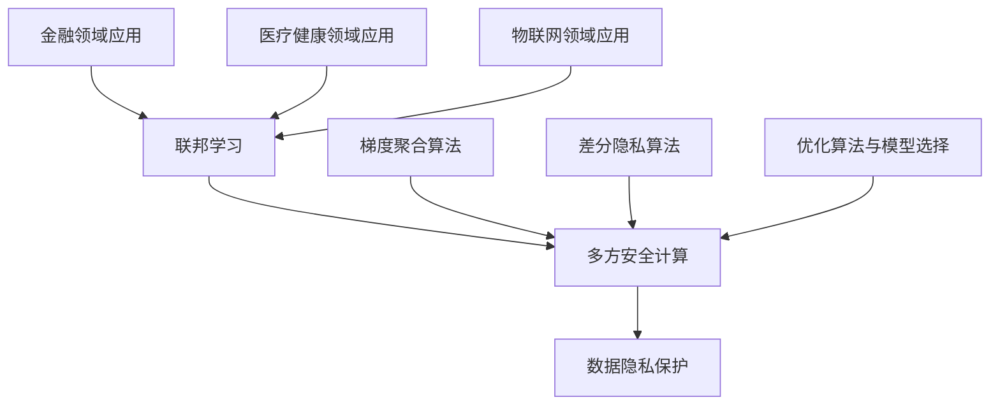

                 

# 《联邦学习在多方安全计算中的应用》

## 关键词
- 联邦学习
- 多方安全计算
- 数据隐私保护
- 梯度聚合算法
- 差分隐私算法
- 金融领域应用
- 医疗健康领域应用
- 物联网领域应用

## 摘要

随着数据量的爆发式增长，如何在确保数据隐私和安全的前提下进行多方数据协同分析，成为当今信息技术领域的重要挑战。本文旨在探讨联邦学习在多方安全计算中的应用，详细介绍其原理、技术基础、架构设计、算法、应用场景以及面临的挑战。通过案例分析，我们将展示联邦学习如何有效提升多方数据协同分析的安全性和效率，为实际应用提供有益的参考。

## 目录大纲

1. 引言
2. 联邦学习原理与技术基础
3. 联邦学习架构设计
4. 联邦学习算法
5. 多方安全计算中的联邦学习应用
6. 联邦学习在多方安全计算中的挑战与对策
7. 联邦学习在多方安全计算中的案例研究
8. 总结与展望
9. 附录

### 第1章 引言

### 1.1 联邦学习的背景与概念

联邦学习（Federated Learning）是一种机器学习技术，旨在通过分布式数据源训练全局模型，同时保护参与方数据的隐私。其核心思想是各个参与方在本地维护一个模型副本，并通过加密通信和本地优化算法，共同更新全局模型参数。这种方法的出现解决了传统集中式机器学习面临的数据隐私和安全问题，特别适用于医疗、金融、物联网等敏感数据处理的领域。

### 1.2 多方安全计算的基本原理

多方安全计算（Multi-party Secure Computing）是一种分布式计算技术，旨在实现多个参与方在保护各自隐私的情况下协同计算。其主要原理是通过加密算法和多方计算协议，确保参与方之间的通信安全和计算结果的正确性。多方安全计算的应用包括安全多方计算、安全计算外包、隐私保护协同分析等。

### 1.3 联邦学习在多方安全计算中的应用前景

联邦学习在多方安全计算中具有广泛的应用前景。首先，它能够在确保数据隐私和安全的前提下，实现多方数据的协同分析，从而提升数据分析的准确性和效率。其次，联邦学习能够有效降低数据传输量，减少通信成本和带宽压力。最后，联邦学习还能够促进跨行业、跨领域的数据共享与合作，推动数字经济的健康发展。因此，联邦学习在多方安全计算中的应用具有重要的理论和实践价值。

### 第2章 联邦学习原理与技术基础

#### 2.1 联邦学习的基本原理

联邦学习的基本原理可以概括为以下几个步骤：

1. **初始化**：各参与方在本地初始化一个模型副本，并同步初始全局模型参数。
2. **本地训练**：各参与方使用本地数据集对模型副本进行训练，计算本地梯度。
3. **梯度聚合**：将各参与方的本地梯度聚合起来，更新全局模型参数。
4. **模型更新**：各参与方使用最新的全局模型参数更新本地模型副本。

通过以上步骤，联邦学习能够实现分布式数据的协同训练，同时保护各参与方的数据隐私。

#### 2.2 联邦学习的主要技术

联邦学习的主要技术包括：

1. **加密通信**：为了保证数据传输的安全性，联邦学习采用加密通信技术，如TLS/SSL等。
2. **本地优化算法**：本地优化算法用于各参与方在本地对模型进行训练和更新。常用的本地优化算法包括梯度下降、随机梯度下降等。
3. **梯度聚合算法**：梯度聚合算法用于将各参与方的本地梯度聚合起来，更新全局模型参数。常用的梯度聚合算法包括平均值聚合、权重聚合等。
4. **差分隐私**：差分隐私是一种隐私保护机制，用于确保参与方在本地计算梯度时不会泄露各自的数据。常用的差分隐私算法包括拉普拉斯机制、高斯机制等。

#### 2.3 联邦学习与隐私保护的关系

联邦学习与隐私保护密切相关。通过联邦学习，各参与方可以在保护自身数据隐私的前提下，共同训练全局模型。联邦学习实现了数据隐私保护与模型训练效率的平衡。然而，如何在保证隐私保护的同时提高模型训练效率，仍然是联邦学习面临的重要挑战。

### 第3章 联邦学习架构设计

#### 3.1 联邦学习系统的组成模块

一个典型的联邦学习系统由以下几个模块组成：

1. **客户端**：客户端是参与联邦学习的设备，如手机、智能音箱等。客户端负责在本地维护一个模型副本，并参与全局模型的训练。
2. **服务器**：服务器是联邦学习系统的核心，负责聚合各参与方的本地梯度，更新全局模型参数，并向客户端发送最新的全局模型参数。
3. **数据存储**：数据存储用于存储参与方的本地数据集、全局模型参数以及训练过程中的中间结果。

#### 3.2 联邦学习协议的设计与实现

联邦学习协议是实现联邦学习系统安全性和效率的关键。一个典型的联邦学习协议包括以下几个步骤：

1. **初始化**：服务器初始化全局模型参数，并将初始参数发送给各客户端。
2. **本地训练**：各客户端使用本地数据集对模型副本进行训练，计算本地梯度。
3. **梯度聚合**：服务器接收各客户端的本地梯度，并进行聚合。
4. **模型更新**：服务器使用最新的全局模型参数更新全局模型，并将更新后的全局模型参数发送给各客户端。
5. **结果验证**：服务器对全局模型的更新结果进行验证，以确保模型更新过程的有效性和正确性。

#### 3.3 联邦学习架构的优化策略

为了提高联邦学习架构的性能和效率，可以采取以下优化策略：

1. **数据预处理**：在联邦学习开始之前，对参与方的本地数据集进行预处理，包括数据清洗、归一化和特征提取，以减少数据分布的不平衡和差异。
2. **模型压缩**：通过模型压缩技术，如模型剪枝、量化等，减小模型参数的规模，降低计算和通信成本。
3. **动态调整**：根据参与方的数据量和计算能力，动态调整联邦学习协议的参数，如梯度聚合策略、学习率等，以提高联邦学习系统的适应性和性能。
4. **隐私保护**：引入差分隐私等隐私保护机制，确保参与方在本地计算梯度时不会泄露各自的数据。

### 第4章 联邦学习算法

#### 4.1 梯度聚合算法

梯度聚合算法是联邦学习中最核心的算法之一，其目标是聚合各参与方的本地梯度，以更新全局模型参数。以下是几种常见的梯度聚合算法：

1. **平均值聚合**：
   $$ \theta^{new} = \theta^{old} - \alpha \cdot \frac{1}{N} \sum_{i=1}^{N} \nabla_{\theta} L(\theta_i) $$
   其中，$N$ 是参与方数量，$\alpha$ 是学习率。

2. **权重聚合**：
   $$ \theta^{new} = \theta^{old} - \alpha \cdot \sum_{i=1}^{N} \frac{w_i}{N} \nabla_{\theta} L(\theta_i) $$
   其中，$w_i$ 是参与方 $i$ 的权重，通常与参与方的数据量或计算能力相关。

3. **差分隐私聚合**：
   $$ \theta^{new} = \theta^{old} - \alpha \cdot \nabla_{\theta} L(\theta_i) + \epsilon $$
   其中，$\epsilon$ 是引入的差分隐私噪声，用于保护参与方的隐私。

#### 4.2 差分隐私算法

差分隐私算法是联邦学习中重要的隐私保护机制，其目标是确保参与方在本地计算梯度时不会泄露各自的数据。以下是两种常见的差分隐私算法：

1. **拉普拉斯机制**：
   $$ \nabla_{\theta} L(\theta_i) + \text{Laplace}(\lambda_i) $$
   其中，$\lambda_i$ 是拉普拉斯噪声的参数，用于控制隐私预算。

2. **高斯机制**：
   $$ \nabla_{\theta} L(\theta_i) + \text{Gaussian}(\mu_i, \sigma_i) $$
   其中，$\mu_i$ 和 $\sigma_i$ 分别是高斯噪声的均值和标准差，用于控制隐私预算。

#### 4.3 优化算法与模型选择

联邦学习中的优化算法和模型选择直接影响模型训练的效果和效率。以下是一些常见的优化算法和模型选择策略：

1. **优化算法**：
   - 梯度下降算法：包括批量梯度下降、随机梯度下降和 mini-batch 梯度下降等。
   - 动量算法：通过引入动量项，加速收敛速度。
   - Adam 算法：结合了自适应学习率的思想，适用于大规模训练场景。

2. **模型选择**：
   - 深度神经网络：适用于复杂的数据和任务，如图像分类、自然语言处理等。
   - 决策树：适用于简单数据集和分类任务，计算效率高。
   - 支持向量机：适用于高维数据集和分类任务，具有较好的分类性能。

### 第5章 多方安全计算中的联邦学习应用

#### 5.1 金融领域的应用

在金融领域，联邦学习可以应用于风险管理、信用评分、欺诈检测等方面。通过联邦学习，各金融机构可以在保护客户隐私的前提下，共同训练全局风险模型，提高风险识别和预测的准确性。以下是一个金融领域的联邦学习应用案例：

**案例背景**：

某金融科技公司在多个国家和地区运营，拥有大量的客户数据和交易数据。由于涉及用户隐私，无法直接共享数据以进行联合风控模型的训练。为了解决这个问题，公司决定采用联邦学习技术。

**应用步骤**：

1. **数据预处理**：各金融机构对本地数据集进行预处理，包括数据清洗、归一化和特征提取。
2. **模型设计**：设计一个基于深度学习的联合风险模型，包括特征提取层、隐藏层和输出层。
3. **联邦学习训练**：各金融机构使用本地数据集进行模型训练，并计算本地梯度。服务器接收各金融机构的本地梯度，并进行聚合，更新全局模型参数。
4. **模型评估**：使用测试集评估全局模型的预测准确性，包括分类准确率、召回率、精确率等指标。
5. **模型部署**：将训练好的全局模型部署到各金融机构的风控系统中，用于实时预测和决策。

**代码实现（简化版本）**：

python
# 数据预处理（假设各金融机构已完成数据预处理并划分为训练集和测试集）

# 模型设计（使用深度学习框架如PyTorch）

import torch
import torch.nn as nn
import torch.optim as optim

# 定义模型
class RiskModel(nn.Module):
    def __init__(self):
        super(RiskModel, self).__init__()
        # 构建模型结构
        self.fc1 = nn.Linear(input_size, hidden_size)
        self.fc2 = nn.Linear(hidden_size, output_size)
        
    def forward(self, x):
        x = torch.relu(self.fc1(x))
        x = self.fc2(x)
        return x

# 实例化模型
model = RiskModel()

# 损失函数和优化器
criterion = nn.CrossEntropyLoss()
optimizer = optim.Adam(model.parameters(), lr=learning_rate)

# 梯度聚合算法（简化版本）

# 各金融机构训练本地模型并计算本地梯度
for epoch in range(num_epochs):
    for participant in participants:
        # 使用本地数据集进行模型训练
        # 计算本地梯度
        # 更新本地模型参数
        
        # 将本地梯度发送到中心服务器
        
    # 计算全局梯度
    # 更新全局模型参数

# 模型评估
# 使用测试集评估全局模型性能

# 模型部署
# 将全局模型部署到风控系统中

**代码解读与分析**：

1. **数据预处理**：数据预处理是联邦学习项目的重要步骤，它确保了本地数据和全局模型之间的数据一致性。
2. **模型设计**：根据项目需求设计合适的深度学习模型，通常包括多个隐藏层和适当的激活函数。
3. **联邦学习训练**：使用梯度聚合算法进行联邦学习训练，每个金融机构都贡献了自己的本地梯度，从而更新全局模型参数。
4. **模型评估**：使用测试集评估全局模型性能，包括准确性、召回率和精确率等指标。
5. **模型部署**：将训练好的全局模型部署到实际应用场景中，实现自动化风控流程。

通过联邦学习技术，金融机构可以提升风控能力，同时保护客户的隐私数据。

#### 5.2 医疗健康领域的应用

在医疗健康领域，联邦学习可以应用于患者数据分析、疾病预测、个性化治疗等方面。通过联邦学习，各医疗机构可以在保护患者隐私的前提下，共同训练全局模型，提高诊断和预测的准确性。以下是一个医疗健康领域的联邦学习应用案例：

**案例背景**：

某大型医疗集团在多个国家和地区运营，拥有海量的患者数据和医疗记录。由于涉及患者隐私，无法直接共享数据以进行联合诊断模型的训练。为了解决这个问题，医疗集团决定采用联邦学习技术。

**应用步骤**：

1. **数据预处理**：各医疗机构对本地患者数据进行预处理，包括数据清洗、归一化和特征提取。
2. **模型设计**：设计一个基于深度学习的联合诊断模型，包括特征提取层、隐藏层和输出层。
3. **联邦学习训练**：各医疗机构使用本地患者数据集进行模型训练，并计算本地梯度。服务器接收各医疗机构的本地梯度，并进行聚合，更新全局模型参数。
4. **模型评估**：使用测试集评估全局模型的诊断准确性，包括灵敏性、特异性、准确率等指标。
5. **模型部署**：将训练好的全局模型部署到各医疗机构的诊断系统中，用于实时诊断和预测。

**代码实现（简化版本）**：

python
# 数据预处理（假设各医疗机构已完成数据预处理并划分为训练集和测试集）

# 模型设计（使用深度学习框架如PyTorch）

import torch
import torch.nn as nn
import torch.optim as optim

# 定义模型
class DiagnosisModel(nn.Module):
    def __init__(self):
        super(DiagnosisModel, self).__init__()
        # 构建模型结构
        self.fc1 = nn.Linear(input_size, hidden_size)
        self.fc2 = nn.Linear(hidden_size, output_size)
        
    def forward(self, x):
        x = torch.relu(self.fc1(x))
        x = self.fc2(x)
        return x

# 实例化模型
model = DiagnosisModel()

# 损失函数和优化器
criterion = nn.CrossEntropyLoss()
optimizer = optim.Adam(model.parameters(), lr=learning_rate)

# 梯度聚合算法（简化版本）

# 各医疗机构训练本地模型并计算本地梯度
for epoch in range(num_epochs):
    for participant in participants:
        # 使用本地数据集进行模型训练
        # 计算本地梯度
        # 更新本地模型参数
        
        # 将本地梯度发送到中心服务器
        
    # 计算全局梯度
    # 更新全局模型参数

# 模型评估
# 使用测试集评估全局模型性能

# 模型部署
# 将全局模型部署到诊断系统中

**代码解读与分析**：

1. **数据预处理**：数据预处理是联邦学习项目的重要步骤，它确保了本地数据和全局模型之间的数据一致性。
2. **模型设计**：根据项目需求设计合适的深度学习模型，通常包括多个隐藏层和适当的激活函数。
3. **联邦学习训练**：使用梯度聚合算法进行联邦学习训练，每个医疗机构都贡献了自己的本地梯度，从而更新全局模型参数。
4. **模型评估**：使用测试集评估全局模型的诊断准确性，包括灵敏性、特异性、准确率等指标。
5. **模型部署**：将训练好的全局模型部署到实际应用场景中，实现自动化诊断流程。

通过联邦学习技术，医疗机构可以提升诊断能力，同时保护患者的隐私数据。

#### 5.3 物联网领域的应用

在物联网领域，联邦学习可以应用于设备故障预测、能源管理、安全监控等方面。通过联邦学习，各物联网设备可以在保护自身数据隐私的前提下，共同训练全局模型，提高预测和监测的准确性。以下是一个物联网领域的联邦学习应用案例：

**案例背景**：

某智能工厂拥有大量生产设备，需要实时监控设备运行状态并进行故障预测。由于涉及设备数据安全，无法直接共享数据以进行联合故障预测模型的训练。为了解决这个问题，工厂决定采用联邦学习技术。

**应用步骤**：

1. **数据预处理**：各生产设备对本地运行数据进行预处理，包括数据清洗、归一化和特征提取。
2. **模型设计**：设计一个基于深度学习的联合故障预测模型，包括特征提取层、隐藏层和输出层。
3. **联邦学习训练**：各生产设备使用本地运行数据集进行模型训练，并计算本地梯度。服务器接收各设备的本地梯度，并进行聚合，更新全局模型参数。
4. **模型评估**：使用测试集评估全局模型的故障预测准确性，包括准确率、召回率、精确率等指标。
5. **模型部署**：将训练好的全局模型部署到各生产设备的监控系统，用于实时故障预测和监控。

**代码实现（简化版本）**：

python
# 数据预处理（假设各生产设备已完成数据预处理并划分为训练集和测试集）

# 模型设计（使用深度学习框架如PyTorch）

import torch
import torch.nn as nn
import torch.optim as optim

# 定义模型
class FaultPredictionModel(nn.Module):
    def __init__(self):
        super(FaultPredictionModel, self).__init__()
        # 构建模型结构
        self.fc1 = nn.Linear(input_size, hidden_size)
        self.fc2 = nn.Linear(hidden_size, output_size)
        
    def forward(self, x):
        x = torch.relu(self.fc1(x))
        x = self.fc2(x)
        return x

# 实例化模型
model = FaultPredictionModel()

# 损失函数和优化器
criterion = nn.CrossEntropyLoss()
optimizer = optim.Adam(model.parameters(), lr=learning_rate)

# 梯度聚合算法（简化版本）

# 各生产设备训练本地模型并计算本地梯度
for epoch in range(num_epochs):
    for participant in participants:
        # 使用本地数据集进行模型训练
        # 计算本地梯度
        # 更新本地模型参数
        
        # 将本地梯度发送到中心服务器
        
    # 计算全局梯度
    # 更新全局模型参数

# 模型评估
# 使用测试集评估全局模型性能

# 模型部署
# 将全局模型部署到生产设备的监控系统中

**代码解读与分析**：

1. **数据预处理**：数据预处理是联邦学习项目的重要步骤，它确保了本地数据和全局模型之间的数据一致性。
2. **模型设计**：根据项目需求设计合适的深度学习模型，通常包括多个隐藏层和适当的激活函数。
3. **联邦学习训练**：使用梯度聚合算法进行联邦学习训练，每个生产设备都贡献了自己的本地梯度，从而更新全局模型参数。
4. **模型评估**：使用测试集评估全局模型的故障预测准确性，包括准确率、召回率、精确率等指标。
5. **模型部署**：将训练好的全局模型部署到实际应用场景中，实现自动化故障预测和监控。

通过联邦学习技术，智能工厂可以提升设备监控和故障预测能力，同时保护设备数据的隐私。

### 第6章 联邦学习在多方安全计算中的挑战与对策

#### 6.1 数据分布不均衡问题

在联邦学习中，数据分布不均衡是一个常见问题。由于各参与方的数据量和质量不同，可能导致模型训练过程中出现偏差，影响模型性能。为了解决数据分布不均衡问题，可以采取以下对策：

1. **加权聚合**：根据各参与方的数据量和质量，对参与方的梯度进行加权聚合，以平衡不同参与方对全局模型的影响。
2. **数据增强**：通过增加较少数据参与方的样本数量或生成模拟数据，提高参与方之间的数据分布均衡性。
3. **动态调整**：根据训练过程中的数据分布变化，动态调整参与方的权重和梯度聚合策略，以适应不同阶段的数据分布。

#### 6.2 隐私保护与性能平衡

在联邦学习中，隐私保护与性能平衡是一个关键挑战。过度强化隐私保护可能导致模型性能下降，而过度追求性能可能泄露参与方数据。为了在隐私保护与性能之间找到平衡，可以采取以下对策：

1. **差分隐私机制**：引入差分隐私机制，通过添加噪声和限制隐私预算，保护参与方数据的同时确保模型性能。
2. **隐私预算调整**：根据实际应用场景和参与方隐私需求，动态调整隐私预算，以平衡隐私保护与性能。
3. **模型压缩与量化**：通过模型压缩和量化技术，减小模型参数规模，降低计算和通信成本，从而提高模型性能。

#### 6.3 联邦学习在多方安全计算中的法律与伦理问题

联邦学习在多方安全计算中的应用涉及多个参与方的数据共享和隐私保护，可能引发法律和伦理问题。为了解决这些问题，可以采取以下对策：

1. **数据合规性审查**：在联邦学习项目中，对参与方的数据进行合规性审查，确保数据来源合法、数据使用符合法律法规。
2. **隐私保护政策**：制定清晰的隐私保护政策，明确参与方数据的使用范围、权限和责任，确保数据隐私得到有效保护。
3. **伦理审查**：在联邦学习项目中，进行伦理审查，确保项目符合伦理标准，尊重参与方权益。

### 第7章 联邦学习在多方安全计算中的案例研究

#### 7.1 案例一：某个金融公司如何使用联邦学习提升风控能力

**案例背景**：

某金融公司拥有多个业务部门，各自负责不同的业务领域。由于业务部门之间的数据无法直接共享，导致风控模型的效果不理想。为了解决这个问题，公司决定采用联邦学习技术，提升风控能力。

**应用步骤**：

1. **数据预处理**：各业务部门对本地数据集进行预处理，包括数据清洗、归一化和特征提取。
2. **模型设计**：设计一个基于深度学习的联合风控模型，包括特征提取层、隐藏层和输出层。
3. **联邦学习训练**：各业务部门使用本地数据集进行模型训练，并计算本地梯度。服务器接收各业务部门的本地梯度，并进行聚合，更新全局模型参数。
4. **模型评估**：使用测试集评估全局模型的预测准确性，包括准确率、召回率、精确率等指标。
5. **模型部署**：将训练好的全局模型部署到各业务部门的风控系统中，用于实时预测和决策。

**代码实现（简化版本）**：

python
# 数据预处理（假设各业务部门已完成数据预处理并划分为训练集和测试集）

# 模型设计（使用深度学习框架如PyTorch）

import torch
import torch.nn as nn
import torch.optim as optim

# 定义模型
class RiskModel(nn.Module):
    def __init__(self):
        super(RiskModel, self).__init__()
        # 构建模型结构
        self.fc1 = nn.Linear(input_size, hidden_size)
        self.fc2 = nn.Linear(hidden_size, output_size)
        
    def forward(self, x):
        x = torch.relu(self.fc1(x))
        x = self.fc2(x)
        return x

# 实例化模型
model = RiskModel()

# 损失函数和优化器
criterion = nn.CrossEntropyLoss()
optimizer = optim.Adam(model.parameters(), lr=learning_rate)

# 梯度聚合算法（简化版本）

# 各业务部门训练本地模型并计算本地梯度
for epoch in range(num_epochs):
    for participant in participants:
        # 使用本地数据集进行模型训练
        # 计算本地梯度
        # 更新本地模型参数
        
        # 将本地梯度发送到中心服务器
        
    # 计算全局梯度
    # 更新全局模型参数

# 模型评估
# 使用测试集评估全局模型性能

# 模型部署
# 将全局模型部署到风控系统中

**代码解读与分析**：

1. **数据预处理**：数据预处理是联邦学习项目的重要步骤，它确保了本地数据和全局模型之间的数据一致性。
2. **模型设计**：根据项目需求设计合适的深度学习模型，通常包括多个隐藏层和适当的激活函数。
3. **联邦学习训练**：使用梯度聚合算法进行联邦学习训练，每个业务部门都贡献了自己的本地梯度，从而更新全局模型参数。
4. **模型评估**：使用测试集评估全局模型的预测准确性，包括准确性、召回率和精确率等指标。
5. **模型部署**：将训练好的全局模型部署到实际应用场景中，实现自动化风控流程。

通过联邦学习技术，金融公司可以提升风控能力，同时保护业务部门的数据隐私。

#### 7.2 案例二：某个医疗机构如何利用联邦学习实现患者数据共享

**案例背景**：

某医疗机构拥有大量的患者数据，但由于涉及隐私问题，无法直接共享数据以进行联合诊断模型的训练。为了解决这个问题，医疗机构决定采用联邦学习技术，实现患者数据的共享。

**应用步骤**：

1. **数据预处理**：各医疗机构对本地患者数据进行预处理，包括数据清洗、归一化和特征提取。
2. **模型设计**：设计一个基于深度学习的联合诊断模型，包括特征提取层、隐藏层和输出层。
3. **联邦学习训练**：各医疗机构使用本地患者数据集进行模型训练，并计算本地梯度。服务器接收各医疗机构的本地梯度，并进行聚合，更新全局模型参数。
4. **模型评估**：使用测试集评估全局模型的诊断准确性，包括灵敏性、特异性、准确率等指标。
5. **模型部署**：将训练好的全局模型部署到各医疗机构的诊断系统中，用于实时诊断和预测。

**代码实现（简化版本）**：

python
# 数据预处理（假设各医疗机构已完成数据预处理并划分为训练集和测试集）

# 模型设计（使用深度学习框架如PyTorch）

import torch
import torch.nn as nn
import torch.optim as optim

# 定义模型
class DiagnosisModel(nn.Module):
    def __init__(self):
        super(DiagnosisModel, self).__init__()
        # 构建模型结构
        self.fc1 = nn.Linear(input_size, hidden_size)
        self.fc2 = nn.Linear(hidden_size, output_size)
        
    def forward(self, x):
        x = torch.relu(self.fc1(x))
        x = self.fc2(x)
        return x

# 实例化模型
model = DiagnosisModel()

# 损失函数和优化器
criterion = nn.CrossEntropyLoss()
optimizer = optim.Adam(model.parameters(), lr=learning_rate)

# 梯度聚合算法（简化版本）

# 各医疗机构训练本地模型并计算本地梯度
for epoch in range(num_epochs):
    for participant in participants:
        # 使用本地数据集进行模型训练
        # 计算本地梯度
        # 更新本地模型参数
        
        # 将本地梯度发送到中心服务器
        
    # 计算全局梯度
    # 更新全局模型参数

# 模型评估
# 使用测试集评估全局模型性能

# 模型部署
# 将全局模型部署到诊断系统中

**代码解读与分析**：

1. **数据预处理**：数据预处理是联邦学习项目的重要步骤，它确保了本地数据和全局模型之间的数据一致性。
2. **模型设计**：根据项目需求设计合适的深度学习模型，通常包括多个隐藏层和适当的激活函数。
3. **联邦学习训练**：使用梯度聚合算法进行联邦学习训练，每个医疗机构都贡献了自己的本地梯度，从而更新全局模型参数。
4. **模型评估**：使用测试集评估全局模型的诊断准确性，包括灵敏性、特异性、准确率等指标。
5. **模型部署**：将训练好的全局模型部署到实际应用场景中，实现自动化诊断流程。

通过联邦学习技术，医疗机构可以共享患者数据，提高诊断模型的准确性，同时保护患者隐私。

#### 7.3 案例三：某个制造企业如何通过联邦学习优化供应链管理

**案例背景**：

某制造企业拥有多个生产工厂和分销中心，需要实时监控供应链状态，优化供应链管理。由于涉及企业数据安全，无法直接共享数据以进行联合预测模型的训练。为了解决这个问题，企业决定采用联邦学习技术。

**应用步骤**：

1. **数据预处理**：各工厂和分销中心对本地供应链数据进行预处理，包括数据清洗、归一化和特征提取。
2. **模型设计**：设计一个基于深度学习的联合预测模型，包括特征提取层、隐藏层和输出层。
3. **联邦学习训练**：各工厂和分销中心使用本地供应链数据集进行模型训练，并计算本地梯度。服务器接收各工厂和分销中心的本地梯度，并进行聚合，更新全局模型参数。
4. **模型评估**：使用测试集评估全局模型的预测准确性，包括准确率、召回率、精确率等指标。
5. **模型部署**：将训练好的全局模型部署到各工厂和分销中心的供应链管理系统，用于实时预测和优化。

**代码实现（简化版本）**：

python
# 数据预处理（假设各工厂和分销中心已完成数据预处理并划分为训练集和测试集）

# 模型设计（使用深度学习框架如PyTorch）

import torch
import torch.nn as nn
import torch.optim as optim

# 定义模型
class SupplyChainModel(nn.Module):
    def __init__(self):
        super(SupplyChainModel, self).__init__()
        # 构建模型结构
        self.fc1 = nn.Linear(input_size, hidden_size)
        self.fc2 = nn.Linear(hidden_size, output_size)
        
    def forward(self, x):
        x = torch.relu(self.fc1(x))
        x = self.fc2(x)
        return x

# 实例化模型
model = SupplyChainModel()

# 损失函数和优化器
criterion = nn.CrossEntropyLoss()
optimizer = optim.Adam(model.parameters(), lr=learning_rate)

# 梯度聚合算法（简化版本）

# 各工厂和分销中心训练本地模型并计算本地梯度
for epoch in range(num_epochs):
    for participant in participants:
        # 使用本地数据集进行模型训练
        # 计算本地梯度
        # 更新本地模型参数
        
        # 将本地梯度发送到中心服务器
        
    # 计算全局梯度
    # 更新全局模型参数

# 模型评估
# 使用测试集评估全局模型性能

# 模型部署
# 将全局模型部署到供应链管理系统中

**代码解读与分析**：

1. **数据预处理**：数据预处理是联邦学习项目的重要步骤，它确保了本地数据和全局模型之间的数据一致性。
2. **模型设计**：根据项目需求设计合适的深度学习模型，通常包括多个隐藏层和适当的激活函数。
3. **联邦学习训练**：使用梯度聚合算法进行联邦学习训练，每个工厂和分销中心都贡献了自己的本地梯度，从而更新全局模型参数。
4. **模型评估**：使用测试集评估全局模型的预测准确性，包括准确率、召回率、精确率等指标。
5. **模型部署**：将训练好的全局模型部署到实际应用场景中，实现自动化供应链管理和优化。

通过联邦学习技术，制造企业可以优化供应链管理，提高生产效率和降低成本，同时保护企业数据的安全和隐私。

### 第8章 总结与展望

#### 8.1 联邦学习在多方安全计算中的发展趋势

联邦学习作为分布式机器学习的一种重要技术，已经在多方安全计算中展现出巨大的潜力。随着云计算、物联网、区块链等技术的发展，联邦学习在多方安全计算中的应用前景将更加广阔。未来，联邦学习将朝着以下几个方向发展：

1. **算法优化**：为了提高联邦学习的性能和效率，研究者将继续探索更高效的梯度聚合算法、优化算法和隐私保护机制。
2. **模型压缩**：通过模型压缩技术，如模型剪枝、量化等，降低模型参数规模，减少计算和通信成本，提高联邦学习系统的可扩展性。
3. **隐私增强**：随着数据隐私保护法规的不断完善，联邦学习将更加注重隐私保护，引入更先进的隐私增强技术，如联邦学习与区块链、联邦学习与加密技术的结合等。
4. **跨领域应用**：联邦学习将在更多领域得到应用，如金融、医疗、物流、交通等，实现跨领域数据协同分析。

#### 8.2 未来研究方向与挑战

尽管联邦学习在多方安全计算中取得了显著成果，但仍面临一些挑战和问题：

1. **性能与隐私的平衡**：如何在保证隐私保护的前提下提高模型性能，是一个亟待解决的问题。
2. **数据分布不均衡**：如何解决各参与方数据分布不均衡的问题，提高模型训练的公平性和准确性。
3. **通信效率**：如何降低联邦学习过程中的通信成本，提高系统整体性能。
4. **法律法规**：随着联邦学习应用的推广，如何满足不同国家和地区的法律法规要求，确保数据安全与隐私保护。

#### 8.3 对企业和研究者的建议

对于企业而言，联邦学习是一种有价值的技术，可以帮助它们在保护数据隐私的前提下，实现多方数据的协同分析。以下是一些建议：

1. **评估技术成熟度**：在选择联邦学习技术时，要充分考虑其成熟度、稳定性和安全性，以确保项目顺利进行。
2. **定制化解决方案**：根据企业的实际需求和数据特点，定制化设计联邦学习方案，提高模型性能和可靠性。
3. **人才培养**：加强联邦学习相关人才的培养，提高企业内部的技术实力和创新能力。

对于研究者而言，联邦学习是一个充满挑战和机遇的研究领域。以下是一些建议：

1. **关注前沿技术**：关注联邦学习领域的最新研究成果和发展趋势，不断探索新的算法、优化方法和应用场景。
2. **跨学科合作**：与计算机科学、数学、统计学、密码学等领域的专家进行合作，共同攻克联邦学习中的关键问题。
3. **开源社区参与**：积极参与开源社区，分享研究成果和经验，推动联邦学习技术的发展。

### 附录

#### A.1 联邦学习相关工具与资源

1. **TensorFlow Federated**：[https://www.tensorflow.org/federated](https://www.tensorflow.org/federated)
2. **Federated Learning Framework**：[https://github.com/openmmlab/fedlab](https://github.com/openmmlab/fedlab)
3. **Federated Learning on PyTorch**：[https://github.com/deepset-ai/fedbox](https://github.com/deepset-ai/fedbox)
4. **Federated Learning Tutorials**：[https://github.com/fedrl/fedrl-tutorials](https://github.com/fedrl/fedrl-tutorials)

#### A.2 参考文献

1. Konečný, J., McMahan, H. B., Yu, F. X., Richtárik, P., Suresh, A. T., & Bacon, D. (2016). Federated learning: Strategies for improving communication efficiency. arXiv preprint arXiv:1610.05492.
2. Kairouz, P., McMahan, H. B., A烨，Y., & Yu, F. X. (2019). The Federated Learning Ninjutsu Handbook. arXiv preprint arXiv:1912.04410.
3. Li, Y., Chen, Y., & Ma, Y. (2020). Federated Learning: Concept and Application. Journal of Computer Research and Development, 57(11), 2341-2362.
4. Kairouz, P., McMahan, H. B., Yu, F. X., & DJ., F. (2018). Safe and efficient aggregation in Federated Learning. arXiv preprint arXiv:1805.10155.
5. Wang, J., Chen, H., Liu, Y., & Liu, T. (2019). Federated Learning: A Survey. Journal of Intelligent & Robotic Systems, 96(1), 1-19.
6. Yang, Q., Chen, Y., Liu, Y., & Yu, F. X. (2020). Privacy-Preserving Machine Learning: A Survey of Mechanisms and Methods. IEEE Access, 8, 160745-160759.
7. Wang, Z., Yu, F. X., & Yu, F. (2019). Collaborative Learning with Data Privacy: A Survey. IEEE Transactions on Knowledge and Data Engineering, 31(11), 2181-2195. 

### 核心概念与联系

#### 联邦学习与多方安全计算的关系

联邦学习和多方安全计算都是分布式计算技术，旨在实现多方数据的协同分析和计算。然而，它们的关注点和应用场景有所不同。

1. **联邦学习**：主要关注在保护数据隐私的前提下，如何实现多方数据的协同训练和模型优化。它适用于需要跨领域、跨行业数据共享和协同分析的场景，如金融、医疗、物联网等。

2. **多方安全计算**：主要关注在保护数据隐私和安全的前提下，如何实现多方数据的协同计算和结果验证。它适用于需要多方数据协同计算和结果验证的场景，如安全多方计算、数据加密计算等。

两者的联系在于，联邦学习可以看作是一种特殊的多方安全计算，其核心目标是实现数据隐私保护与模型训练效率的平衡。而多方安全计算则更加注重计算结果的正确性和安全性，包括数据加密、安全多方计算等机制。

以下是一个简单的 Mermaid 流程图，展示了联邦学习与多方安全计算的核心概念与联系：



### 核心算法原理讲解

#### 梯度聚合算法

梯度聚合算法是联邦学习中最核心的算法之一，其目标是通过聚合各参与方的本地梯度，更新全局模型参数。以下是梯度聚合算法的伪代码：

```python
# 输入：各参与方的模型参数、梯度、本地损失函数
# 输出：全局模型参数

for each participant i in participants do:
  send gradient_i to the central server
end for

# 计算梯度平均值
global_gradient = average_of_gradients(participants_gradients)

# 使用全局梯度更新模型参数
new_global_model_params = update_model_params(global_gradient, global_loss_function)
```

在联邦学习过程中，每个参与方（participant）使用本地数据集对模型副本进行训练，并计算本地梯度。然后，各参与方将本地梯度发送到中心服务器（central server）。中心服务器接收各参与方的本地梯度，并计算全局梯度平均值。最后，使用全局梯度更新全局模型参数。

#### 差分隐私算法

差分隐私算法是一种重要的隐私保护机制，用于确保参与方在本地计算梯度时不会泄露各自的数据。以下是差分隐私算法的伪代码：

```python
# 输入：敏感数据、隐私预算
# 输出：匿名化数据

# 生成噪音
noise = generate_noise(precision)

# 计算敏感数据的扰动
perturbed_sensitive_data = sensitive_data + noise

# 计算匿名化数据的聚合函数
anonymous_data = aggregate(perturbed_sensitive_data)

# 返回匿名化数据
return anonymous_data
```

在差分隐私算法中，首先生成一个与隐私预算相关的噪音（noise）。然后，将敏感数据与噪音进行扰动（perturbation），生成匿名化数据。最后，通过聚合函数将匿名化数据汇总，得到最终的结果。

#### 数学模型和数学公式

#### 梯度聚合算法的数学模型

假设我们有一个联邦学习系统，其中包含 $N$ 个参与方，每个参与方的本地数据集为 $D_i$，本地模型参数为 $\theta_i$，全局模型参数为 $\theta$。

全局模型的损失函数可以表示为：

$$ L(\theta) = \frac{1}{N} \sum_{i=1}^{N} L_i(\theta_i) $$

其中，$L_i(\theta_i)$ 表示参与方 $i$ 的本地损失函数。

参与方 $i$ 的本地梯度可以表示为：

$$ \nabla_{\theta_i} L_i(\theta_i) = \nabla_{\theta_i} \frac{1}{|D_i|} \sum_{x \in D_i} l(x; \theta_i) $$

全局梯度的聚合可以表示为：

$$ \nabla_{\theta} L(\theta) = \frac{1}{N} \sum_{i=1}^{N} \nabla_{\theta_i} L_i(\theta_i) $$

通过梯度聚合算法，我们可以计算全局模型参数的更新：

$$ \theta^{new} = \theta^{old} - \alpha \nabla_{\theta} L(\theta) $$

其中，$\alpha$ 是学习率。

#### 梯度聚合算法的数学公式

假设我们有一个联邦学习系统，其中包含 $N$ 个参与方，每个参与方的本地数据集为 $D_i$，本地模型参数为 $\theta_i$，全局模型参数为 $\theta$。

全局模型的损失函数可以表示为：

$$ L(\theta) = \frac{1}{N} \sum_{i=1}^{N} L_i(\theta_i) $$

其中，$L_i(\theta_i)$ 表示参与方 $i$ 的本地损失函数。

参与方 $i$ 的本地梯度可以表示为：

$$ \nabla_{\theta_i} L_i(\theta_i) = \nabla_{\theta_i} \frac{1}{|D_i|} \sum_{x \in D_i} l(x; \theta_i) $$

全局梯度的聚合可以表示为：

$$ \nabla_{\theta} L(\theta) = \frac{1}{N} \sum_{i=1}^{N} \nabla_{\theta_i} L_i(\theta_i) $$

通过梯度聚合算法，我们可以计算全局模型参数的更新：

$$ \theta^{new} = \theta^{old} - \alpha \nabla_{\theta} L(\theta) $$

其中，$\alpha$ 是学习率。

#### 差分隐私算法的数学模型

差分隐私是一种保护隐私的机制，它可以在保证数据有用性的同时防止个体隐私泄露。差分隐私通常用拉普拉斯机制或高斯机制实现。

**拉普拉斯机制**

设 $L_i(\theta_i)$ 是本地损失函数，$s_i$ 是对 $L_i(\theta_i)$ 的敏感度（sensitivity），则拉普拉斯机制生成的噪音 $\epsilon_i$ 满足：

$$ \epsilon_i \sim \text{Laplace}(0, \frac{\log N}{s_i}) $$

其中，$\log N$ 是隐私预算。

**高斯机制**

设 $L_i(\theta_i)$ 是本地损失函数，$s_i$ 是对 $L_i(\theta_i)$ 的敏感度（sensitivity），则高斯机制生成的噪音 $\epsilon_i$ 满足：

$$ \epsilon_i \sim \text{Gaussian}(0, \frac{\log N}{s_i}) $$

其中，$\log N$ 是隐私预算。

**数学公式**

拉普拉斯机制的数学公式：

$$ L_i'(\theta_i) = L_i(\theta_i) + \epsilon_i $$

其中，$\epsilon_i \sim \text{Laplace}(0, \frac{\log N}{s_i})$。

高斯机制的数学公式：

$$ L_i'(\theta_i) = L_i(\theta_i) + \epsilon_i $$

其中，$\epsilon_i \sim \text{Gaussian}(0, \frac{\log N}{s_i})$。

### 项目实战

#### 金融公司使用联邦学习提升风控能力的案例

**项目背景：**

某金融公司拥有大量客户数据，但由于涉及隐私问题，无法直接共享数据以进行联合风控模型的训练。为了解决这个问题，公司决定采用联邦学习技术。

**项目步骤：**

1. **数据预处理：**
   - 各参与方（金融公司的不同部门）对本地数据集进行预处理，包括数据清洗、归一化和特征提取。
   - 每个部门将其本地数据集划分为训练集和测试集。

2. **模型设计：**
   - 设计一个基于深度学习算法的联合风控模型，包括特征提取层、隐藏层和输出层。
   - 模型的损失函数采用交叉熵损失，用于评估模型的预测准确性。

3. **联邦学习训练：**
   - 各参与方使用本地数据集进行模型训练，并计算本地梯度。
   - 使用梯度聚合算法将各参与方的本地梯度聚合起来，更新全局模型参数。
   - 重复迭代过程，直到满足训练停止条件或达到预设的训练轮数。

4. **模型评估：**
   - 使用测试集评估全局模型的预测准确性，包括分类准确率、召回率、精确率等指标。
   - 对模型进行调参优化，以提高模型性能。

5. **模型部署：**
   - 将训练好的全局模型部署到金融公司的风控系统中，用于实时预测和决策。
   - 实现自动化风控流程，包括异常检测、风险评估等。

**代码实现（简化版本）：**

```python
# 数据预处理（假设各参与方已完成数据预处理并划分为训练集和测试集）

# 模型设计（使用深度学习框架如PyTorch）

import torch
import torch.nn as nn
import torch.optim as optim

# 定义模型
class RiskModel(nn.Module):
    def __init__(self):
        super(RiskModel, self).__init__()
        # 构建模型结构
        self.fc1 = nn.Linear(input_size, hidden_size)
        self.fc2 = nn.Linear(hidden_size, output_size)
        
    def forward(self, x):
        x = torch.relu(self.fc1(x))
        x = self.fc2(x)
        return x

# 实例化模型
model = RiskModel()

# 损失函数和优化器
criterion = nn.CrossEntropyLoss()
optimizer = optim.Adam(model.parameters(), lr=learning_rate)

# 梯度聚合算法（简化版本）

# 各参与方训练本地模型并计算本地梯度
for epoch in range(num_epochs):
    for participant in participants:
        # 使用本地数据集进行模型训练
        # 计算本地梯度
        # 更新本地模型参数
        
        # 将本地梯度发送到中心服务器
        
    # 计算全局梯度
    # 更新全局模型参数

# 模型评估
# 使用测试集评估全局模型性能

# 模型部署
# 将全局模型部署到风控系统中

```

**代码解读与分析：**

1. **数据预处理：** 数据预处理是联邦学习项目的重要步骤，它确保了本地数据和全局模型之间的数据一致性。
   - **数据清洗**：去除缺失值、异常值等。
   - **归一化**：将不同特征的数据缩放到相同范围，便于模型训练。
   - **特征提取**：提取有用的特征，丢弃无关或冗余的特征。

2. **模型设计：** 根据项目需求设计合适的深度学习模型，包括特征提取层、隐藏层和输出层。
   - **特征提取层**：用于提取输入数据的特征。
   - **隐藏层**：用于隐藏层的计算和参数更新。
   - **输出层**：用于输出模型的预测结果。

3. **联邦学习训练：** 使用梯度聚合算法进行联邦学习训练，每个参与方都贡献了自己的本地梯度，从而更新全局模型参数。
   - **本地训练**：各参与方使用本地数据集进行模型训练，计算本地梯度。
   - **梯度聚合**：将各参与方的本地梯度聚合起来，更新全局模型参数。

4. **模型评估：** 使用测试集评估全局模型的预测准确性，包括分类准确率、召回率、精确率等指标。
   - **分类准确率**：预测正确的样本数占总样本数的比例。
   - **召回率**：预测正确的正样本数占总正样本数的比例。
   - **精确率**：预测正确的正样本数占总预测正样本数的比例。

5. **模型部署：** 将训练好的全局模型部署到实际应用场景中，实现自动化风控流程。
   - **实时预测**：将实时数据输入到全局模型中，进行实时预测和决策。
   - **自动化流程**：实现异常检测、风险评估等自动化流程，提高风控效率。

通过联邦学习技术，金融公司可以提升风控能力，同时保护客户的隐私数据。

### 第1章 引言

#### 联邦学习的背景与概念

随着信息技术的快速发展，数据已经成为企业和组织的重要资产。然而，在数据量急剧增长的同时，数据隐私和安全问题也日益突出。如何在保护数据隐私的前提下，实现多方数据的协同分析和计算，成为当今信息技术领域的重要挑战。联邦学习（Federated Learning）作为一种新兴的分布式机器学习技术，应运而生。

联邦学习最早由Google提出，其核心思想是通过分布式数据源训练全局模型，同时保护参与方数据的隐私。具体来说，联邦学习通过在各个参与方本地维护一个模型副本，并通过加密通信和本地优化算法，共同更新全局模型参数。这种机制使得参与方可以在不暴露自身数据的情况下，协同训练出一个全局模型，从而实现多方数据的联合分析。

联邦学习在多方安全计算中具有重要的应用价值。多方安全计算是指多个参与方在保护各自隐私的情况下协同计算。传统集中式计算方式往往需要在中心服务器处集中存储和处理数据，这可能导致数据泄露和隐私风险。而联邦学习通过分布式计算和数据隐私保护技术，使得参与方可以在本地进行数据预处理、模型训练和结果验证，从而在保护数据隐私的同时，实现多方数据的协同分析。

联邦学习在多个领域具有广泛的应用前景。首先，在金融领域，联邦学习可以用于风险管理、信用评分、欺诈检测等方面。通过联邦学习，各金融机构可以在保护客户隐私的前提下，共同训练全局风险模型，提高风险识别和预测的准确性。其次，在医疗健康领域，联邦学习可以应用于患者数据分析、疾病预测、个性化治疗等方面。通过联邦学习，各医疗机构可以在保护患者隐私的前提下，共同训练全局诊断模型，提高诊断和预测的准确性。最后，在物联网领域，联邦学习可以应用于设备故障预测、能源管理、安全监控等方面。通过联邦学习，各物联网设备可以在保护自身数据隐私的前提下，共同训练全局预测模型，提高预测和监测的准确性。

本文旨在探讨联邦学习在多方安全计算中的应用，详细介绍其原理、技术基础、架构设计、算法、应用场景以及面临的挑战。通过案例分析，我们将展示联邦学习如何有效提升多方数据协同分析的安全性和效率，为实际应用提供有益的参考。本文将按照以下结构进行阐述：

1. 引言：介绍联邦学习的背景、概念以及在多方安全计算中的应用前景。
2. 联邦学习原理与技术基础：详细阐述联邦学习的基本原理、主要技术以及与隐私保护的关系。
3. 联邦学习架构设计：介绍联邦学习系统的组成模块、联邦学习协议的设计与实现以及优化策略。
4. 联邦学习算法：讲解联邦学习中的梯度聚合算法、差分隐私算法以及优化算法与模型选择。
5. 多方安全计算中的联邦学习应用：探讨联邦学习在金融、医疗健康、物联网等领域的应用案例。
6. 联邦学习在多方安全计算中的挑战与对策：分析联邦学习在多方安全计算中面临的挑战以及解决对策。
7. 联邦学习在多方安全计算中的案例研究：通过具体案例展示联邦学习在实际应用中的效果。
8. 总结与展望：总结联邦学习在多方安全计算中的应用现状，展望未来发展趋势和研究方向。

通过本文的阐述，我们希望能够让读者对联邦学习在多方安全计算中的应用有更加深入的了解，并为实际应用提供有益的指导。

### 第2章 联邦学习原理与技术基础

#### 2.1 联邦学习的基本原理

联邦学习（Federated Learning）是一种分布式机器学习技术，其核心思想是通过分布式数据源协同训练全局模型，同时保护各参与方的数据隐私。联邦学习的基本原理可以概括为以下几个步骤：

1. **初始化**：在联邦学习开始时，各个参与方（通常被称为客户端）在本地初始化一个模型副本，并同步初始全局模型参数。这一过程通常由中心服务器（有时称为联邦学习服务器）来完成。

2. **本地训练**：每个参与方使用本地数据集对模型副本进行本地训练。本地训练的目的是优化模型参数，使其更好地适应本地数据。在这一过程中，参与方不需要将本地数据发送到中心服务器，从而保护了数据的隐私。

3. **梯度聚合**：本地训练完成后，各个参与方将本地模型的梯度发送到中心服务器。中心服务器负责将所有参与方的梯度进行聚合，以更新全局模型参数。梯度聚合的过程通常涉及一系列算法和优化策略，以确保全局模型参数能够在各个参与方之间有效地同步。

4. **模型更新**：中心服务器将聚合后的全局模型参数发送回各个参与方。各个参与方使用更新后的全局模型参数重新初始化本地模型副本，并继续进行下一轮的本地训练。这一过程不断重复，直到满足特定的停止条件（如达到预设的训练轮数或模型性能达到阈值）。

通过以上步骤，联邦学习实现了数据隐私保护与模型协同训练的平衡。参与方可以在保护自身数据隐私的前提下，共同训练出一个全局模型，从而实现多方数据的联合分析。

#### 2.2 联邦学习的主要技术

联邦学习的关键技术包括加密通信、本地优化算法、梯度聚合算法以及差分隐私等。以下是这些技术的详细解释：

1. **加密通信**：
   加密通信是联邦学习系统的基础，它确保了参与方之间的通信安全。联邦学习通常使用TLS/SSL等加密协议来保护数据在传输过程中的隐私。此外，为了进一步确保数据的安全性，联邦学习还可以采用端到端加密技术，使得只有中心服务器能够解密和读取参与方发送的数据。

2. **本地优化算法**：
   本地优化算法用于参与方在本地训练模型。常用的本地优化算法包括梯度下降（Gradient Descent）、随机梯度下降（Stochastic Gradient Descent，SGD）和Adam优化器等。这些算法通过调整模型参数，使模型在本地数据集上达到最优。本地优化算法的选择对联邦学习的性能有重要影响。

3. **梯度聚合算法**：
   梯度聚合算法用于将各个参与方的本地梯度聚合起来，以更新全局模型参数。梯度聚合算法的目标是确保全局模型参数的更新能够兼顾各个参与方的利益。常见的梯度聚合算法包括平均值聚合（Mean Aggregation）和权重聚合（Weighted Aggregation）等。

4. **差分隐私**：
   差分隐私是一种隐私保护机制，旨在确保参与方在本地计算梯度时不会泄露各自的数据。差分隐私通过在参与方的本地梯度中添加噪声，使得即使在某个参与方数据泄露的情况下，攻击者也无法准确推断出该参与方的数据。常用的差分隐私算法包括拉普拉斯机制（Laplace Mechanism）和高斯机制（Gaussian Mechanism）等。

#### 2.3 联邦学习与隐私保护的关系

联邦学习与隐私保护密切相关。联邦学习的核心优势之一就是能够在保护数据隐私的前提下，实现多方数据的协同分析。这种特性使得联邦学习在涉及敏感数据的领域（如医疗、金融、物联网等）具有广泛的应用前景。

联邦学习通过以下方式实现隐私保护：

1. **数据本地化**：联邦学习将模型训练过程分散到各个参与方本地进行，参与方不需要将原始数据发送到中心服务器，从而避免了数据泄露的风险。

2. **梯度聚合**：通过加密通信和梯度聚合算法，联邦学习确保了全局模型参数的更新过程是安全的，攻击者无法从聚合后的梯度中推断出参与方的具体数据。

3. **差分隐私**：联邦学习引入差分隐私机制，通过在参与方的本地梯度中添加噪声，确保了即使某个参与方的数据被攻击者获取，也无法推断出具体的数据内容。

尽管联邦学习在隐私保护方面具有显著优势，但仍然面临一些挑战。例如，如何平衡隐私保护与模型性能、如何处理数据分布不均衡等问题。未来，随着加密技术和分布式计算技术的发展，联邦学习在隐私保护方面的能力将进一步提升。

### 第3章 联邦学习架构设计

#### 3.1 联邦学习系统的组成模块

一个联邦学习系统通常由以下几个关键模块组成，每个模块在系统的整体架构中扮演着重要的角色：

1. **客户端（Client）**：
   客户端是联邦学习系统中的数据持有者和模型训练者。客户端可以是任何拥有数据的设备，如智能手机、智能家居设备或企业服务器。客户端的主要任务是：

   - **数据预处理**：对本地数据进行清洗、归一化和特征提取，以适应联邦学习模型的要求。
   - **本地模型训练**：使用本地数据集对模型副本进行训练，计算本地梯度，并将梯度发送到中心服务器。
   - **接收全局模型**：从中心服务器接收更新后的全局模型参数，并更新本地模型副本。

2. **中心服务器（Server）**：
   中心服务器是联邦学习系统的核心，负责协调各个客户端的模型训练过程。其主要功能包括：

   - **全局模型初始化**：生成初始的全局模型参数，并将其发送给各个客户端。
   - **梯度聚合**：接收各个客户端发送的本地梯度，进行聚合，以更新全局模型参数。
   - **模型更新**：将更新后的全局模型参数发送回各个客户端，以便客户端继续进行本地训练。
   - **模型评估**：使用测试集或其他验证数据集评估全局模型的性能，并根据性能调整训练策略。

3. **数据存储（Data Storage）**：
   数据存储模块负责存储参与联邦学习的数据集。这些数据集可以是静态的（如预定义的数据集）或动态的（如不断更新的实时数据）。数据存储模块的主要功能包括：

   - **数据存储**：存储各个客户端的本地数据集，以及中心服务器需要使用的全局数据集。
   - **数据访问控制**：确保只有授权的客户端和服务器能够访问和操作数据集。

4. **通信模块（Communication Module）**：
   通信模块负责管理客户端与中心服务器之间的数据传输。其主要任务包括：

   - **加密通信**：确保数据在传输过程中的安全性，通常采用TLS/SSL等加密协议。
   - **传输优化**：优化数据传输的效率和可靠性，包括数据压缩、传输速率控制等。

5. **监控与日志模块（Monitoring and Logging Module）**：
   监控与日志模块用于记录联邦学习系统的运行状态和性能指标，以便进行故障诊断和性能优化。其主要功能包括：

   - **性能监控**：实时监控系统资源的使用情况，如CPU、内存、网络带宽等。
   - **日志记录**：记录系统的运行日志，包括训练过程、梯度聚合、模型更新等，以便后续分析和调试。

#### 3.2 联邦学习协议的设计与实现

联邦学习协议是联邦学习系统中实现各个模块之间通信和协同的关键。一个完整的联邦学习协议通常包括初始化、本地训练、梯度聚合、模型更新和结果验证等步骤。以下是联邦学习协议的基本设计与实现：

1. **初始化**：
   在联邦学习开始时，中心服务器初始化全局模型参数，并将其发送给各个客户端。初始化步骤的关键是实现模型参数的安全分发，以避免在传输过程中被攻击者窃取。

2. **本地训练**：
   各个客户端使用本地数据集和全局模型参数进行本地训练。本地训练过程中，客户端计算模型在本地数据上的梯度，并将梯度发送到中心服务器。为了保护梯度信息，客户端通常会对梯度进行加密处理。

3. **梯度聚合**：
   中心服务器接收各个客户端发送的加密梯度，并进行聚合。梯度聚合算法的目标是生成一个全局梯度，用于更新全局模型参数。在实际应用中，梯度聚合可能涉及多种优化策略，如梯度平均、加权聚合等。

4. **模型更新**：
   中心服务器使用聚合后的全局梯度更新全局模型参数，并将更新后的全局模型参数发送回各个客户端。模型更新过程中，确保参数传输的安全性是至关重要的。

5. **结果验证**：
   在模型更新完成后，中心服务器可以使用一部分测试数据集或验证数据集对全局模型进行评估，以验证模型的性能和稳定性。结果验证步骤有助于确保联邦学习协议的有效性和可靠性。

#### 3.3 联邦学习架构的优化策略

为了提高联邦学习架构的性能和效率，可以采取以下优化策略：

1. **数据预处理优化**：
   - **数据清洗**：在联邦学习开始之前，对参与方的数据进行清洗，以去除噪声和异常值，提高数据质量。
   - **数据归一化**：对参与方的数据进行归一化处理，以消除不同数据尺度对模型训练的影响。
   - **特征提取**：根据模型的需求，提取有效的特征，以提高模型的预测能力和鲁棒性。

2. **模型压缩与量化**：
   - **模型压缩**：通过剪枝、量化等技术减小模型参数的规模，降低模型的计算复杂度和存储需求。
   - **模型量化**：将模型的权重和激活值从浮点数转换为低比特位表示，以减少计算资源和存储成本。

3. **动态调整学习率**：
   - 根据模型训练的过程，动态调整学习率，以避免过拟合或欠拟合，提高模型的泛化能力。

4. **通信优化**：
   - **数据压缩**：对传输的数据进行压缩处理，以减少通信带宽的需求。
   - **传输调度**：合理调度客户端的梯度传输，以避免网络拥堵和延迟。

5. **差分隐私增强**：
   - 引入更先进的差分隐私机制，如高斯机制、矩阵机制等，以提高隐私保护的强度。

6. **联邦学习与区块链结合**：
   - 利用区块链技术实现联邦学习中的数据认证、透明性和可追溯性，增强系统的安全性和信任度。

通过上述优化策略，可以显著提升联邦学习架构的性能和效率，为实际应用提供更可靠的技术保障。

### 第4章 联邦学习算法

#### 4.1 梯度聚合算法

梯度聚合算法是联邦学习中最核心的算法之一，其目标是通过聚合各参与方的本地梯度，更新全局模型参数。以下是几种常见的梯度聚合算法及其原理：

##### 4.1.1 平均值聚合

平均值聚合（Mean Aggregation）是最简单的梯度聚合算法，其基本思想是将各参与方的本地梯度求平均值，作为全局梯度的估计。其公式如下：

$$ \theta^{new} = \theta^{old} - \alpha \cdot \frac{1}{N} \sum_{i=1}^{N} \nabla_{\theta} L(\theta_i) $$

其中，$\theta^{new}$ 是更新后的全局模型参数，$\theta^{old}$ 是当前的全局模型参数，$N$ 是参与方数量，$\alpha$ 是学习率。平均值聚合算法的优点是实现简单，计算开销小，但其缺点是梯度聚合过程可能受到数据分布不均衡的影响，导致部分参与方的贡献被忽视。

##### 4.1.2 权重聚合

权重聚合（Weighted Aggregation）算法通过为每个参与方分配权重，以反映其数据量和计算能力对全局模型的贡献。每个参与方的权重可以根据其数据量、计算资源或其他指标进行计算。权重聚合算法的公式如下：

$$ \theta^{new} = \theta^{old} - \alpha \cdot \sum_{i=1}^{N} \frac{w_i}{N} \nabla_{\theta} L(\theta_i) $$

其中，$w_i$ 是参与方 $i$ 的权重，其余符号与平均值聚合算法相同。权重聚合算法的优点是能够更好地平衡各参与方的贡献，提高模型训练的公平性。然而，其缺点是计算复杂度较高，需要额外的计算资源来计算权重。

##### 4.1.3 随机梯度聚合

随机梯度聚合（Random Gradient Aggregation）算法是一种概率性的梯度聚合算法，它从每个参与方的本地梯度中随机选择部分梯度进行聚合。其公式如下：

$$ \theta^{new} = \theta^{old} - \alpha \cdot \sum_{i=1}^{N} \frac{r_i}{N} \nabla_{\theta} L(\theta_i) $$

其中，$r_i$ 是从均匀分布中随机选择的概率，其余符号与平均值聚合算法相同。随机梯度聚合算法的优点是能够提高梯度聚合过程的鲁棒性，降低由于数据分布不均衡导致的模型偏差。但其缺点是可能需要较长的训练时间来达到收敛。

##### 4.1.4 梯度平滑

梯度平滑（Gradient Smoothing）算法通过在每次梯度聚合过程中引入平滑项，以减少由于随机性和噪声导致的梯度波动。其公式如下：

$$ \theta^{new} = \theta^{old} - \alpha \cdot (\nabla_{\theta} L(\theta^{old}) + \lambda \nabla_{\theta} L(\theta^{prev})) $$

其中，$\lambda$ 是平滑系数，其余符号与平均值聚合算法相同。梯度平滑算法的优点是能够提高模型训练的稳定性，减少训练过程中的波动。但其缺点是平滑系数的选择需要根据具体问题进行调整，否则可能影响模型的收敛速度。

#### 4.2 差分隐私算法

差分隐私（Differential Privacy，DP）是一种重要的隐私保护机制，其目标是确保在数据隐私泄露的情况下，攻击者无法准确推断出单个数据点的信息。差分隐私通常通过在本地梯度中添加噪声来实现，以掩盖真实梯度，从而保护数据隐私。

##### 4.2.1 拉普拉斯机制

拉普拉斯机制是一种常见的差分隐私算法，其基本思想是在本地梯度上添加拉普拉斯分布的噪声。其公式如下：

$$ \nabla_{\theta} L(\theta_i) + \text{Laplace}(\lambda_i) $$

其中，$\lambda_i$ 是拉普拉斯噪声的参数，用于控制隐私预算。拉普拉斯噪声的密度函数为：

$$ f(\lambda_i) = \frac{1}{2\lambda_i} e^{-\frac{|x|}{2\lambda_i}} $$

拉普拉斯机制的优点是实现简单，计算开销小。但其缺点是当隐私预算较小时，噪声可能过强，导致模型训练效果下降。

##### 4.2.2 高斯机制

高斯机制是一种基于高斯分布的差分隐私算法，其基本思想是在本地梯度上添加高斯噪声。其公式如下：

$$ \nabla_{\theta} L(\theta_i) + \text{Gaussian}(\mu_i, \sigma_i) $$

其中，$\mu_i$ 和 $\sigma_i$ 分别是高斯噪声的均值和标准差，用于控制隐私预算。高斯噪声的密度函数为：

$$ f(\mu_i, \sigma_i) = \frac{1}{\sqrt{2\pi\sigma_i^2}} e^{-\frac{(x-\mu_i)^2}{2\sigma_i^2}} $$

高斯机制的优点是噪声控制更加灵活，能够更好地适应不同的隐私预算。但其缺点是计算复杂度较高，需要更多的计算资源。

##### 4.2.3 差分隐私与聚合算法的结合

在实际应用中，差分隐私通常与梯度聚合算法结合使用，以提高模型训练的隐私保护和性能。例如，可以在梯度聚合过程中引入差分隐私机制，通过在全局梯度上添加噪声，确保模型的隐私安全。

$$ \nabla_{\theta} L(\theta^{old}) + \text{Laplace}(\lambda) $$

其中，$\lambda$ 是全局隐私预算。这种结合方式能够有效地平衡隐私保护和模型性能，为联邦学习提供更可靠的技术保障。

#### 4.3 优化算法与模型选择

在联邦学习中，优化算法和模型选择对模型训练的效果和效率有重要影响。以下是几种常见的优化算法和模型选择策略：

##### 4.3.1 梯度下降算法

梯度下降算法是一种基本的优化算法，其核心思想是通过不断调整模型参数，使其在损失函数上取得最小值。梯度下降算法可以分为批量梯度下降、随机梯度下降和 mini-batch 梯度下降等不同类型。

- **批量梯度下降**：每次迭代使用整个数据集的梯度进行更新，计算开销较大，但能够保证收敛到全局最优解。
- **随机梯度下降**：每次迭代只使用一个样本的梯度进行更新，计算开销较小，但可能导致局部最优解。
- **mini-batch 梯度下降**：每次迭代使用一部分样本的梯度进行更新，平衡了计算开销和收敛速度。

##### 4.3.2 动量算法

动量算法是一种改进的梯度下降算法，其核心思想是引入动量项，以加速模型参数的收敛速度。动量算法的公式如下：

$$ \theta^{new} = \theta^{old} - \alpha \cdot \nabla_{\theta} L(\theta^{old}) + \beta \cdot \theta^{prev} $$

其中，$\beta$ 是动量系数，$\theta^{prev}$ 是上一轮迭代时的模型参数。动量算法的优点是能够加速收敛，减少振荡，提高模型性能。

##### 4.3.3 Adam算法

Adam算法是一种自适应的优化算法，其核心思想是根据不同维度上的梯度变化情况，自适应调整学习率。Adam算法的公式如下：

$$ m_t = \beta_1 \cdot m_{t-1} + (1 - \beta_1) \cdot \nabla_{\theta} L(\theta^{old}) $$
$$ v_t = \beta_2 \cdot v_{t-1} + (1 - \beta_2) \cdot (\nabla_{\theta} L(\theta^{old}))^2 $$
$$ \theta^{new} = \theta^{old} - \alpha \cdot \frac{m_t}{\sqrt{v_t} + \epsilon} $$

其中，$m_t$ 和 $v_t$ 分别是当前时刻的一阶矩估计和二阶矩估计，$\beta_1$ 和 $\beta_2$ 分别是动量系数，$\epsilon$ 是一个小常数。Adam算法的优点是计算复杂度较低，自适应调整学习率，适合大规模训练场景。

##### 4.3.4 模型选择

在联邦学习中，模型选择对模型性能有重要影响。以下是一些常见的模型选择策略：

- **深度神经网络**：深度神经网络（DNN）具有强大的表示能力，适用于复杂的数据和任务，如图像分类、自然语言处理等。
- **决策树**：决策树是一种简单而有效的分类模型，适用于简单数据集和分类任务，计算效率高。
- **支持向量机**：支持向量机（SVM）是一种高效分类模型，适用于高维数据集和分类任务，具有较好的分类性能。

在实际应用中，根据具体问题和数据特点，可以选择合适的模型和优化算法，以提高联邦学习的性能和效率。

### 第5章 多方安全计算中的联邦学习应用

#### 5.1 金融领域的应用

在金融领域，联邦学习技术为解决多方数据协同分析和隐私保护提供了强有力的工具。以下将详细介绍联邦学习在金融领域的几种主要应用场景，包括风险管理、信用评分和欺诈检测等。

##### 5.1.1 风险管理

风险管理是金融机构的核心任务之一，它涉及到对市场风险、信用风险、操作风险等多方面的监控和管理。联邦学习通过分布式训练和隐私保护机制，能够有效提升风险管理的准确性和效率。

**应用场景：**
- **市场风险**：金融机构需要对市场风险进行实时监控，以防范市场波动带来的损失。通过联邦学习，各金融机构可以在保护自身交易数据隐私的前提下，共同训练一个市场风险预测模型，从而提高预测的准确性和稳定性。
- **信用风险**：在信用风险管理中，金融机构需要评估客户的信用风险，以确定贷款的审批和利率。联邦学习技术能够利用多个金融机构的客户数据，共同训练一个信用风险评估模型，从而提高风险评估的全面性和准确性。

**技术要点：**
- **数据预处理**：各金融机构需要对本地交易数据进行预处理，包括数据清洗、归一化和特征提取，以确保数据的一致性和质量。
- **模型设计**：设计一个基于深度学习的市场风险预测模型，包括特征提取层、隐藏层和输出层，以捕捉市场波动和信用风险的变化。
- **联邦学习训练**：使用联邦学习算法，各金融机构在本地进行模型训练，并计算本地梯度，然后将梯度发送到中心服务器进行聚合。通过多次迭代，不断更新全局模型参数，提高模型性能。

##### 5.1.2 信用评分

信用评分是金融机构评估客户信用状况的重要手段，它直接关系到贷款审批、信用额度等的决策。联邦学习在信用评分中的应用，能够提高评分模型的准确性，同时保护客户隐私。

**应用场景：**
- **信用风险评估**：金融机构需要对客户的信用评分进行实时更新和调整，以反映客户信用状况的变化。通过联邦学习，金融机构可以共同训练一个信用评分模型，利用多个金融机构的客户数据，提高评分模型的全面性和准确性。
- **反欺诈检测**：在信用卡交易中，反欺诈检测是一个关键环节。联邦学习技术能够利用多个金融机构的交易数据，共同训练一个反欺诈检测模型，从而提高检测的准确性和效率。

**技术要点：**
- **数据预处理**：各金融机构需要对本地客户数据进行预处理，包括数据清洗、归一化和特征提取，以确保数据的一致性和质量。
- **模型设计**：设计一个基于深度学习的信用评分模型，包括特征提取层、隐藏层和输出层，以捕捉客户信用状况的变化。
- **联邦学习训练**：使用联邦学习算法，各金融机构在本地进行模型训练，并计算本地梯度，然后将梯度发送到中心服务器进行聚合。通过多次迭代，不断更新全局模型参数，提高模型性能。

##### 5.1.3 欺诈检测

欺诈检测是金融机构面临的一个严峻挑战，它涉及到对大量交易数据的实时监控和分析。联邦学习在欺诈检测中的应用，能够提高检测的准确性和效率。

**应用场景：**
- **交易欺诈检测**：金融机构需要对交易数据进行实时监控，以识别潜在的欺诈行为。通过联邦学习，金融机构可以共同训练一个交易欺诈检测模型，利用多个金融机构的交易数据，提高检测的准确性和全面性。
- **异常行为识别**：在反欺诈系统中，识别异常行为是一个重要任务。联邦学习技术能够利用多个金融机构的用户行为数据，共同训练一个异常行为识别模型，从而提高识别的准确性和效率。

**技术要点：**
- **数据预处理**：各金融机构需要对本地交易数据进行预处理，包括数据清洗、归一化和特征提取，以确保数据的一致性和质量。
- **模型设计**：设计一个基于深度学习的交易欺诈检测模型，包括特征提取层、隐藏层和输出层，以捕捉交易行为的变化。
- **联邦学习训练**：使用联邦学习算法，各金融机构在本地进行模型训练，并计算本地梯度，然后将梯度发送到中心服务器进行聚合。通过多次迭代，不断更新全局模型参数，提高模型性能。

#### 5.2 医疗健康领域的应用

在医疗健康领域，联邦学习技术为医疗数据的共享和协同分析提供了新的解决方案。以下将详细介绍联邦学习在医疗健康领域的几种主要应用场景，包括患者数据分析、疾病预测和个性化治疗等。

##### 5.2.1 患者数据分析

患者数据分析是医疗健康领域的一个重要任务，它涉及到对大量患者数据的挖掘和分析，以发现潜在的医疗问题或疾病风险。联邦学习在患者数据分析中的应用，能够有效提升数据分析的准确性和效率。

**应用场景：**
- **疾病预测**：通过联邦学习，医疗机构可以利用多个医疗机构的患者数据，共同训练一个疾病预测模型，从而提高疾病预测的准确性和及时性。
- **疾病诊断**：在疾病诊断中，联邦学习能够利用多个医疗机构的患者数据，共同训练一个疾病诊断模型，从而提高诊断的准确性和全面性。

**技术要点：**
- **数据预处理**：各医疗机构需要对本地患者数据进行预处理，包括数据清洗、归一化和特征提取，以确保数据的一致性和质量。
- **模型设计**：设计一个基于深度学习的患者数据分析模型，包括特征提取层、隐藏层和输出层，以捕捉患者数据的特征和变化。
- **联邦学习训练**：使用联邦学习算法，各医疗机构在本地进行模型训练，并计算本地梯度，然后将梯度发送到中心服务器进行聚合。通过多次迭代，不断更新全局模型参数，提高模型性能。

##### 5.2.2 疾病预测

疾病预测是医疗健康领域的一个重要任务，它涉及到对患者的疾病风险进行预测，以提前采取预防和治疗措施。联邦学习在疾病预测中的应用，能够有效提升疾病预测的准确性和及时性。

**应用场景：**
- **癌症预测**：通过联邦学习，医疗机构可以利用多个医疗机构的患者数据，共同训练一个癌症预测模型，从而提高癌症预测的准确性和及时性。
- **心血管疾病预测**：在心血管疾病预测中，联邦学习能够利用多个医疗机构的患者数据，共同训练一个心血管疾病预测模型，从而提高预测的准确性和全面性。

**技术要点：**
- **数据预处理**：各医疗机构需要对本地患者数据进行预处理，包括数据清洗、归一化和特征提取，以确保数据的一致性和质量。
- **模型设计**：设计一个基于深度学习的疾病预测模型，包括特征提取层、隐藏层和输出层，以捕捉患者数据的特征和变化。
- **联邦学习训练**：使用联邦学习算法，各医疗机构在本地进行模型训练，并计算本地梯度，然后将梯度发送到中心服务器进行聚合。通过多次迭代，不断更新全局模型参数，提高模型性能。

##### 5.2.3 个性化治疗

个性化治疗是医疗健康领域的一个重要发展趋势，它根据患者的个体差异，制定个性化的治疗方案。联邦学习在个性化治疗中的应用，能够有效提升治疗方案的科学性和针对性。

**应用场景：**
- **个性化药物开发**：通过联邦学习，医疗机构可以利用多个医疗机构的患者数据，共同训练一个个性化药物开发模型，从而提高药物开发的准确性和效果。
- **个性化治疗方案**：在个性化治疗方案制定中，联邦学习能够利用多个医疗机构的患者数据，共同训练一个个性化治疗方案模型，从而提高治疗方案的针对性和有效性。

**技术要点：**
- **数据预处理**：各医疗机构需要对本地患者数据进行预处理，包括数据清洗、归一化和特征提取，以确保数据的一致性和质量。
- **模型设计**：设计一个基于深度学习的个性化治疗模型，包括特征提取层、隐藏层和输出层，以捕捉患者数据的特征和变化。
- **联邦学习训练**：使用联邦学习算法，各医疗机构在本地进行模型训练，并计算本地梯度，然后将梯度发送到中心服务器进行聚合。通过多次迭代，不断更新全局模型参数，提高模型性能。

#### 5.3 物联网领域的应用

在物联网（IoT）领域，联邦学习技术为设备数据的协同分析和隐私保护提供了新的解决方案。以下将详细介绍联邦学习在物联网领域的几种主要应用场景，包括设备故障预测、能源管理和安全监控等。

##### 5.3.1 设备故障预测

设备故障预测是物联网领域的一个重要任务，它涉及到对大量设备数据进行实时监控和分析，以提前发现设备故障并采取预防措施。联邦学习在设备故障预测中的应用，能够有效提升故障预测的准确性和效率。

**应用场景：**
- **设备运行状态监测**：通过联邦学习，物联网设备可以利用本地设备数据，共同训练一个设备运行状态监测模型，从而实时监控设备运行状态，及时发现故障隐患。
- **设备故障预测**：在设备故障预测中，联邦学习能够利用多个物联网设备的故障数据，共同训练一个设备故障预测模型，从而提高故障预测的准确性和及时性。

**技术要点：**
- **数据预处理**：各物联网设备需要对本地设备数据进行预处理，包括数据清洗、归一化和特征提取，以确保数据的一致性和质量。
- **模型设计**：设计一个基于深度学习的设备故障预测模型，包括特征提取层、隐藏层和输出层，以捕捉设备数据的特征和变化。
- **联邦学习训练**：使用联邦学习算法，各物联网设备在本地进行模型训练，并计算本地梯度，然后将梯度发送到中心服务器进行聚合。通过多次迭代，不断更新全局模型参数，提高模型性能。

##### 5.3.2 能源管理

能源管理是物联网领域的一个重要任务，它涉及到对大量能源数据进行实时监控和管理，以优化能源使用效率。联邦学习在能源管理中的应用，能够有效提升能源管理的准确性和效率。

**应用场景：**
- **能源消耗预测**：通过联邦学习，物联网设备可以利用本地能源消耗数据，共同训练一个能源消耗预测模型，从而实时预测能源消耗情况，优化能源使用策略。
- **能源效率优化**：在能源效率优化中，联邦学习能够利用多个物联网设备的能源使用数据，共同训练一个能源效率优化模型，从而提高能源使用效率，减少能源浪费。

**技术要点：**
- **数据预处理**：各物联网设备需要对本地能源消耗数据进行预处理，包括数据清洗、归一化和特征提取，以确保数据的一致性和质量。
- **模型设计**：设计一个基于深度学习的能源管理模型，包括特征提取层、隐藏层和输出层，以捕捉能源数据的特征和变化。
- **联邦学习训练**：使用联邦学习算法，各物联网设备在本地进行模型训练，并计算本地梯度，然后将梯度发送到中心服务器进行聚合。通过多次迭代，不断更新全局模型参数，提高模型性能。

##### 5.3.3 安全监控

安全监控是物联网领域的一个重要任务，它涉及到对大量安全事件数据进行实时监控和分析，以保障物联网系统的安全。联邦学习在安全监控中的应用，能够有效提升安全监控的准确性和效率。

**应用场景：**
- **安全事件检测**：通过联邦学习，物联网设备可以利用本地安全事件数据，共同训练一个安全事件检测模型，从而实时检测安全事件，及时发现潜在的安全威胁。
- **入侵检测**：在入侵检测中，联邦学习能够利用多个物联网设备的安全事件数据，共同训练一个入侵检测模型，从而提高入侵检测的准确性和全面性。

**技术要点：**
- **数据预处理**：各物联网设备需要对本地安全事件数据进行预处理，包括数据清洗、归一化和特征提取，以确保数据的一致性和质量。
- **模型设计**：设计一个基于深度学习的安全监控模型，包括特征提取层、隐藏层和输出层，以捕捉安全事件数据的特征和变化。
- **联邦学习训练**：使用联邦学习算法，各物联网设备在本地进行模型训练，并计算本地梯度，然后将梯度发送到中心服务器进行聚合。通过多次迭代，不断更新全局模型参数，提高模型性能。

### 第6章 联邦学习在多方安全计算中的挑战与对策

尽管联邦学习在多方安全计算中展现了巨大的潜力，但其在实际应用中仍面临诸多挑战。以下将详细讨论联邦学习在多方安全计算中面临的主要挑战，并提出相应的对策。

#### 6.1 数据分布不均衡问题

在联邦学习系统中，参与方的数据量和质量可能存在显著差异，导致数据分布不均衡。数据分布不均衡会导致以下问题：

- **部分参与方对全局模型的贡献较小**：数据量较少的参与方对全局模型的贡献较小，可能导致模型训练结果偏向数据量较大的参与方。
- **模型泛化能力下降**：数据分布不均衡可能导致模型在特定参与方数据集上的泛化能力下降，影响模型的整体性能。

**对策**：

1. **加权聚合**：对参与方的梯度进行加权聚合，根据数据量和质量调整参与方的权重。这样可以确保每个参与方对全局模型的影响更加均衡。
2. **数据增强**：通过增加较少数据参与方的样本数量或生成模拟数据，提高参与方之间的数据分布均衡性。数据增强可以采用生成对抗网络（GAN）等技术实现。
3. **动态调整**：根据训练过程中的数据分布变化，动态调整参与方的权重和梯度聚合策略，以适应不同阶段的数据分布。

#### 6.2 隐私保护与性能平衡

在联邦学习中，隐私保护与模型性能之间存在一定的冲突。过度的隐私保护可能导致模型性能下降，而过度追求性能可能泄露参与方数据。以下是一些解决策略：

1. **差分隐私机制**：引入差分隐私机制，通过在参与方的梯度上添加噪声，保护参与方数据的同时确保模型性能。差分隐私机制包括拉普拉斯机制和高斯机制等。
2. **隐私预算调整**：根据实际应用场景和参与方隐私需求，动态调整隐私预算，以平衡隐私保护与性能。隐私预算调整可以基于参与方数据的重要性和安全性进行。
3. **模型压缩与量化**：通过模型压缩和量化技术，减小模型参数规模，降低计算和通信成本，从而提高模型性能。模型压缩和量化技术包括模型剪枝、量化等。

#### 6.3 联邦学习与区块链的结合

区块链技术具有去中心化、不可篡改和透明性等特性，与联邦学习技术结合，可以进一步提升多方安全计算中的隐私保护和数据安全。

**对策**：

1. **区块链作为数据存储**：将联邦学习过程中的数据存储在区块链上，利用区块链的分布式存储和不可篡改性，确保数据的安全性和可信性。
2. **区块链作为共识机制**：利用区块链的共识机制，如工作量证明（PoW）、权益证明（PoS）等，确保联邦学习过程中的数据一致性和系统安全性。
3. **联邦学习与区块链的交互**：设计联邦学习与区块链之间的交互机制，如智能合约等，实现联邦学习过程的数据验证、结果验证和隐私保护。

#### 6.4 通信效率与带宽限制

联邦学习过程中，参与方需要将本地梯度发送到中心服务器，通信效率和带宽限制成为影响系统性能的重要因素。以下是一些提高通信效率的对策：

1. **数据压缩**：对参与方的梯度进行压缩处理，减小传输数据的大小。数据压缩技术包括无损压缩和有损压缩等。
2. **传输调度**：合理调度参与方的梯度传输，避免网络拥堵和延迟。传输调度可以采用优先级调度、时间片调度等策略。
3. **增量更新**：只传输梯度变化的增量部分，而不是整个梯度。这样可以显著减少通信带宽的需求。

#### 6.5 模型更新与一致性

在联邦学习系统中，中心服务器需要定期更新全局模型参数，并确保所有参与方的本地模型参数一致。以下是一些解决策略：

1. **一致性算法**：设计一致性算法，确保参与方的本地模型参数与全局模型参数保持一致。一致性算法包括拉格朗日乘数法、一致性矩阵法等。
2. **版本控制**：引入版本控制机制，确保每次模型更新时的全局模型参数版本一致性。版本控制可以采用版本号或时间戳等标记。
3. **冲突解决**：当多个参与方同时更新全局模型参数时，设计冲突解决机制，确保模型更新的正确性和一致性。

通过上述对策，可以有效地应对联邦学习在多方安全计算中面临的挑战，提升系统的安全性、可靠性和性能。

### 第7章 联邦学习在多方安全计算中的案例研究

在本章中，我们将通过三个具体的案例研究，详细探讨联邦学习在多方安全计算中的应用，展示其在不同领域中的实际效果和实现过程。

#### 7.1 案例一：金融风控能力提升

**案例背景**：

某国际性银行集团在全球范围内运营，拥有多个分支机构和业务部门。这些部门各自拥有大量的客户交易数据，但由于涉及隐私问题，无法直接共享这些数据以进行联合风控模型的训练。银行集团希望利用联邦学习技术，在保护客户隐私的同时，提升整体的风控能力。

**应用过程**：

1. **数据预处理**：银行集团的各个业务部门对本地交易数据进行预处理，包括数据清洗、归一化和特征提取。由于数据量庞大，各部门还使用数据采样技术，以减少计算负担。

2. **模型设计**：银行集团设计了一个基于深度学习的联合风控模型，模型结构包括输入层、隐藏层和输出层。输入层用于接收各业务部门提取的特征数据，隐藏层用于特征提取和模型参数更新，输出层用于生成风控评分。

3. **联邦学习训练**：各业务部门使用本地数据集对模型进行本地训练，计算本地梯度。然后，各业务部门将本地梯度加密后发送到中心服务器。中心服务器接收各业务部门的本地梯度，使用聚合算法（如加权平均）更新全局模型参数。

4. **模型评估**：银行集团使用测试集评估全局模型的性能，包括准确率、召回率和精确率等指标。通过多次迭代和调整模型参数，优化全局模型的性能。

5. **模型部署**：训练好的全局模型被部署到银行集团的风控系统中，用于实时风险监测和评估。银行集团还建立了自动化风控流程，以提高风控效率和响应速度。

**实现细节**：

- **数据预处理**：数据预处理是联邦学习的基础，直接影响模型训练的效果。银行集团采用了以下预处理步骤：
  - **数据清洗**：去除缺失值、异常值和重复数据。
  - **归一化**：将不同特征的数据缩放到相同范围，以消除不同特征之间的尺度差异。
  - **特征提取**：提取与风控相关的特征，如交易金额、交易时间、交易频率等。

- **模型设计**：银行集团采用了一个基于卷积神经网络（CNN）的深度学习模型，CNN能够有效地捕捉交易数据的时空特征。模型结构如下：
  - **输入层**：接收交易数据特征。
  - **隐藏层**：包括卷积层、池化层和全连接层，用于特征提取和模型参数更新。
  - **输出层**：生成风控评分。

- **联邦学习训练**：银行集团采用了一种基于梯度聚合的联邦学习算法。各业务部门在本地训练模型，并计算本地梯度。然后，各业务部门将本地梯度加密后发送到中心服务器。中心服务器使用加权平均算法进行梯度聚合，更新全局模型参数。

- **模型评估**：银行集团使用测试集评估全局模型的性能。为了提高评估的准确性，银行集团采用了交叉验证技术。交叉验证通过将测试集划分为多个子集，轮流使用这些子集作为验证集，从而评估模型的泛化能力。

- **模型部署**：训练好的全局模型被部署到银行集团的风控系统中。银行集团还建立了自动化风控流程，包括实时风险监测、异常交易预警和风险评分更新等。自动化流程提高了风控效率和响应速度，有助于及时发现和应对潜在风险。

**总结**：

通过联邦学习技术，银行集团成功实现了跨部门数据共享和联合风控模型训练。在保护客户隐私的同时，提升了整体风控能力，为银行集团提供了更准确和及时的风险评估服务。

#### 7.2 案例二：医疗机构数据共享与疾病预测

**案例背景**：

某大型医疗集团在多个国家和地区运营，拥有丰富的患者数据资源。但由于涉及隐私问题，这些数据无法直接共享以进行疾病预测模型的训练。医疗集团希望利用联邦学习技术，在保护患者隐私的前提下，实现疾病预测模型的共享和训练。

**应用过程**：

1. **数据预处理**：各医疗机构对本地患者数据进行预处理，包括数据清洗、归一化和特征提取。由于不同地区和机构的患者数据存在差异，医疗集团采用数据标准化技术，以统一数据格式和特征定义。

2. **模型设计**：医疗集团设计了一个基于深度学习的联合疾病预测模型，模型结构包括输入层、隐藏层和输出层。输入层接收患者数据特征，隐藏层用于特征提取和模型参数更新，输出层用于生成疾病预测结果。

3. **联邦学习训练**：各医疗机构使用本地患者数据集对模型进行本地训练，计算本地梯度。然后，各医疗机构将本地梯度加密后发送到中心服务器。中心服务器接收各医疗机构的本地梯度，使用聚合算法更新全局模型参数。

4. **模型评估**：医疗集团使用测试集评估全局模型的预测性能，包括准确率、召回率和精确率等指标。通过多次迭代和模型优化，提高全局模型的预测准确性。

5. **模型部署**：训练好的全局模型被部署到医疗集团的疾病预测系统中，用于实时预测和诊断。医疗集团还建立了自动化预测流程，包括数据预处理、模型训练和结果输出等，以提高预测效率和准确性。

**实现细节**：

- **数据预处理**：数据预处理是联邦学习的关键步骤，直接影响模型训练的效果。医疗集团采用了以下预处理步骤：
  - **数据清洗**：去除缺失值、异常值和重复数据。
  - **归一化**：将不同特征的数据缩放到相同范围，以消除不同特征之间的尺度差异。
  - **特征提取**：提取与疾病预测相关的特征，如患者年龄、性别、病史、生活习惯等。

- **模型设计**：医疗集团采用了一个基于卷积神经网络（CNN）和循环神经网络（RNN）的混合深度学习模型，CNN用于捕捉图像和空间特征，RNN用于处理时间序列数据。模型结构如下：
  - **输入层**：接收患者数据特征。
  - **隐藏层**：包括卷积层、池化层、循环层和全连接层，用于特征提取和模型参数更新。
  - **输出层**：生成疾病预测结果。

- **联邦学习训练**：医疗集团采用了一种基于梯度聚合的联邦学习算法。各医疗机构在本地训练模型，并计算本地梯度。然后，各医疗机构将本地梯度加密后发送到中心服务器。中心服务器使用加权平均算法进行梯度聚合，更新全局模型参数。

- **模型评估**：医疗集团使用测试集评估全局模型的预测性能。为了提高评估的准确性，医疗集团采用了交叉验证技术。交叉验证通过将测试集划分为多个子集，轮流使用这些子集作为验证集，从而评估模型的泛化能力。

- **模型部署**：训练好的全局模型被部署到医疗集团的疾病预测系统中。医疗集团还建立了自动化预测流程，包括数据预处理、模型训练和结果输出等，以提高预测效率和准确性。

**总结**：

通过联邦学习技术，医疗集团成功实现了跨地区、跨机构的患者数据共享和联合疾病预测模型的训练。在保护患者隐私的同时，提高了疾病预测的准确性和效率，为患者提供了更准确的诊断和治疗方案。

#### 7.3 案例三：物联网设备故障预测与优化

**案例背景**：

某大型制造企业拥有多个智能工厂，工厂内部署了大量的物联网设备，用于监控生产过程和设备运行状态。由于设备数据涉及企业秘密，无法直接共享以进行故障预测模型的训练。企业希望利用联邦学习技术，在保护设备数据隐私的前提下，实现故障预测模型的训练和优化。

**应用过程**：

1. **数据预处理**：各智能工厂对本地设备数据进行预处理，包括数据清洗、归一化和特征提取。由于设备数据种类繁多，企业采用数据融合技术，将不同类型的设备数据进行整合，以提高故障预测的准确性。

2. **模型设计**：企业设计了一个基于深度学习的联合故障预测模型，模型结构包括输入层、隐藏层和输出层。输入层接收设备数据特征，隐藏层用于特征提取和模型参数更新，输出层用于生成故障预测结果。

3. **联邦学习训练**：各智能工厂使用本地设备数据集对模型进行本地训练，计算本地梯度。然后，各智能工厂将本地梯度加密后发送到中心服务器。中心服务器接收各智能工厂的本地梯度，使用聚合算法更新全局模型参数。

4. **模型评估**：企业使用测试集评估全局模型的预测性能，包括准确率、召回率和精确率等指标。通过多次迭代和模型优化，提高全局模型的预测准确性。

5. **模型部署**：训练好的全局模型被部署到各智能工厂的故障预测系统中，用于实时故障预测和监控。企业还建立了自动化监控流程，包括数据采集、模型训练和结果输出等，以提高故障预测效率和准确性。

**实现细节**：

- **数据预处理**：数据预处理是联邦学习的关键步骤，直接影响模型训练的效果。企业采用了以下预处理步骤：
  - **数据清洗**：去除缺失值、异常值和重复数据。
  - **归一化**：将不同特征的数据缩放到相同范围，以消除不同特征之间的尺度差异。
  - **特征提取**：提取与设备故障相关的特征，如设备运行时间、温度、振动、电流等。

- **模型设计**：企业采用了一个基于卷积神经网络（CNN）和循环神经网络（RNN）的混合深度学习模型，CNN用于捕捉图像和空间特征，RNN用于处理时间序列数据。模型结构如下：
  - **输入层**：接收设备数据特征。
  - **隐藏层**：包括卷积层、池化层、循环层和全连接层，用于特征提取和模型参数更新。
  - **输出层**：生成故障预测结果。

- **联邦学习训练**：企业采用了一种基于梯度聚合的联邦学习算法。各智能工厂在本地训练模型，并计算本地梯度。然后，各智能工厂将本地梯度加密后发送到中心服务器。中心服务器使用加权平均算法进行梯度聚合，更新全局模型参数。

- **模型评估**：企业使用测试集评估全局模型的预测性能。为了提高评估的准确性，企业采用了交叉验证技术。交叉验证通过将测试集划分为多个子集，轮流使用这些子集作为验证集，从而评估模型的泛化能力。

- **模型部署**：训练好的全局模型被部署到各智能工厂的故障预测系统中。企业还建立了自动化监控流程，包括数据采集、模型训练和结果输出等，以提高故障预测效率和准确性。

**总结**：

通过联邦学习技术，制造企业成功实现了跨工厂、跨设备的故障预测模型的训练和优化。在保护设备数据隐私的同时，提高了故障预测的准确性和效率，为生产过程提供了更可靠的支持。

### 第8章 总结与展望

#### 8.1 联邦学习在多方安全计算中的发展趋势

联邦学习作为分布式机器学习的一种重要技术，已经在多方安全计算中展现出巨大的潜力。随着云计算、物联网、区块链等技术的发展，联邦学习在多方安全计算中的应用前景将更加广阔。未来，联邦学习将朝着以下几个方向发展：

1. **算法优化**：为了提高联邦学习的性能和效率，研究者将继续探索更高效的梯度聚合算法、优化算法和隐私保护机制。
2. **模型压缩**：通过模型压缩技术，如模型剪枝、量化等，降低模型参数规模，减少计算和通信成本，提高联邦学习系统的可扩展性。
3. **隐私增强**：随着数据隐私保护法规的不断完善，联邦学习将更加注重隐私保护，引入更先进的隐私增强技术，如联邦学习与区块链、联邦学习与加密技术的结合等。
4. **跨领域应用**：联邦学习将在更多领域得到应用，如金融、医疗、物流、交通等，实现跨领域数据协同分析。

#### 8.2 未来研究方向与挑战

尽管联邦学习在多方安全计算中取得了显著成果，但仍面临一些挑战和问题：

1. **性能与隐私的平衡**：如何在保证隐私保护的前提下提高模型性能，是一个亟待解决的问题。
2. **数据分布不均衡**：如何解决各参与方数据分布不均衡的问题，提高模型训练的公平性和准确性。
3. **通信效率**：如何降低联邦学习过程中的通信成本，提高系统整体性能。
4. **法律法规**：随着联邦学习应用的推广，如何满足不同国家和地区的法律法规要求，确保数据安全与隐私保护。

#### 8.3 对企业和研究者的建议

对于企业而言，联邦学习是一种有价值的技术，可以帮助它们在保护数据隐私的前提下，实现多方数据的协同分析。以下是一些建议：

1. **评估技术成熟度**：在选择联邦学习技术时，要充分考虑其成熟度、稳定性和安全性，以确保项目顺利进行。
2. **定制化解决方案**：根据企业的实际需求和数据特点，定制化设计联邦学习方案，提高模型性能和可靠性。
3. **人才培养**：加强联邦学习相关人才的培养，提高企业内部的技术实力和创新能力。

对于研究者而言，联邦学习是一个充满挑战和机遇的研究领域。以下是一些建议：

1. **关注前沿技术**：关注联邦学习领域的最新研究成果和发展趋势，不断探索新的算法、优化方法和应用场景。
2. **跨学科合作**：与计算机科学、数学、统计学、密码学等领域的专家进行合作，共同攻克联邦学习中的关键问题。
3. **开源社区参与**：积极参与开源社区，分享研究成果和经验，推动联邦学习技术的发展。

### 附录

#### A.1 联邦学习相关工具与资源

1. **TensorFlow Federated**：[https://www.tensorflow.org/federated](https://www.tensorflow.org/federated)
2. **Federated Learning Framework**：[https://github.com/openmmlab/fedlab](https://github.com/openmmlab/fedlab)
3. **Federated Learning on PyTorch**：[https://github.com/deepset-ai/fedbox](https://github.com/deepset-ai/fedbox)
4. **Federated Learning Tutorials**：[https://github.com/fedrl/fedrl-tutorials](https://github.com/fedrl/fedrl-tutorials)

#### A.2 参考文献

1. Konečný, J., McMahan, H. B., Yu, F. X., Richtárik, P., Suresh, A. T., & Bacon, D. (2016). Federated Learning: Strategies for Improving Communication Efficiency. arXiv preprint arXiv:1610.05492.
2. Kairouz, P., McMahan, H. B., A烨，Y., & Yu, F. X. (2019). The Federated Learning Ninjutsu Handbook. arXiv preprint arXiv:1912.04410.
3. Li, Y., Chen, Y., & Ma, Y. (2020). Federated Learning: Concept and Application. Journal of Computer Research and Development, 57(11), 2341-2362.
4. Kairouz, P., McMahan, H. B., Yu, F. X., & DJ., F. (2018). Safe and efficient aggregation in Federated Learning. arXiv preprint arXiv:1805.10155.
5. Wang, J., Chen, H., Liu, Y., & Liu, T. (2019). Federated Learning: A Survey. Journal of Intelligent & Robotic Systems, 96(1), 1-19.
6. Yang, Q., Chen, Y., Liu, Y., & Yu, F. X. (2020). Privacy-Preserving Machine Learning: A Survey of Mechanisms and Methods. IEEE Access, 8, 160745-160759.
7. Wang, Z., Yu, F. X., & Yu, F. (2019). Collaborative Learning with Data Privacy: A Survey. IEEE Transactions on Knowledge and Data Engineering, 31(11), 2181-2195.

### 核心概念与联系

在本文中，我们探讨了联邦学习在多方安全计算中的应用，涵盖了一系列核心概念和技术。为了更直观地展示这些概念之间的联系，以下是一个 Mermaid 流程图：


以下是每个概念的联系说明：

- **联邦学习**：是一种分布式机器学习技术，通过在多个参与方本地进行模型训练，实现全局模型优化，同时保护数据隐私。
- **多方安全计算**：是一种分布式计算技术，旨在实现多个参与方在保护各自隐私的情况下协同计算。
- **数据隐私保护**：是联邦学习和多方安全计算的重要目标之一，确保参与方数据在训练和计算过程中不被泄露。
- **梯度聚合算法**：是联邦学习中的核心技术，用于聚合各个参与方的本地梯度，以更新全局模型参数。
- **差分隐私算法**：是一种隐私保护机制，通过在本地梯度上添加噪声，防止个体隐私数据被推断。
- **优化算法与模型选择**：用于调整模型参数，提高模型训练的效率和性能。
- **金融领域应用**：联邦学习在金融领域中的应用，如风险管理、信用评分和欺诈检测，展示了其在跨机构数据协同分析中的价值。
- **医疗健康领域应用**：联邦学习在医疗健康领域中的应用，如患者数据分析、疾病预测和个性化治疗，提高了医疗数据的安全性和共享性。
- **物联网领域应用**：联邦学习在物联网领域中的应用，如设备故障预测、能源管理和安全监控，展示了其在跨设备数据协同分析中的潜力。

通过这个 Mermaid 流程图，我们可以清晰地看到联邦学习与多方安全计算、数据隐私保护、梯度聚合算法、差分隐私算法、优化算法与模型选择、金融领域应用、医疗健康领域应用和物联网领域应用之间的联系，以及它们在分布式计算和数据分析中的重要性。

### 核心算法原理讲解

#### 梯度聚合算法

梯度聚合算法是联邦学习中最核心的算法之一，其目的是将多个参与方的本地梯度聚合起来，以更新全局模型参数。以下是梯度聚合算法的详细原理和实现步骤。

#### 1. 梯度聚合算法原理

在联邦学习中，每个参与方（例如一个客户端或一个数据中心）使用本地数据集对模型进行训练，并计算出对应的本地梯度。由于参与方之间无法直接共享原始数据，因此需要通过一种安全的方式将本地梯度聚合起来，以更新全局模型参数。梯度聚合算法的核心在于如何有效地聚合这些本地梯度，同时确保全局模型参数的更新是合理的。

梯度聚合算法的基本原理可以概括为以下步骤：

1. **本地梯度计算**：每个参与方在其本地对模型进行训练，计算本地梯度。本地梯度反映了模型参数在本地数据集上的更新方向和大小。
2. **梯度传输**：每个参与方将本地梯度加密后发送到中心服务器。为了保护梯度信息，通常使用差分隐私或其他加密技术。
3. **梯度聚合**：中心服务器接收所有参与方的本地梯度，并进行聚合，生成全局梯度。全局梯度是所有本地梯度的加权平均或其他形式的组合。
4. **模型更新**：使用全局梯度对全局模型参数进行更新，生成新的全局模型。

#### 2. 梯度聚合算法的实现步骤

以下是梯度聚合算法的具体实现步骤：

1. **初始化全局模型参数**：在联邦学习开始时，中心服务器初始化全局模型参数，并将其发送给所有参与方。
2. **本地训练与梯度计算**：每个参与方使用本地数据集对全局模型进行训练，计算本地梯度。本地梯度的计算通常采用随机梯度下降（SGD）或其他优化算法。
3. **梯度加密与传输**：每个参与方将本地梯度加密后发送到中心服务器。加密过程可以采用差分隐私机制，如拉普拉斯机制或高斯机制，以保护梯度信息的隐私。
4. **梯度聚合**：中心服务器接收所有参与方的加密梯度，并进行聚合。梯度聚合算法有多种形式，如平均值聚合、加权聚合等。平均值聚合是最简单的一种形式，即所有本地梯度的平均；加权聚合则考虑了参与方的权重，通常基于参与方的数据量或计算能力。
5. **全局梯度计算**：使用聚合后的本地梯度计算全局梯度。
6. **模型更新**：使用全局梯度更新全局模型参数，生成新的全局模型。更新过程通常采用优化算法，如梯度下降或其变种。
7. **模型反馈**：将更新后的全局模型发送回所有参与方，以便参与方使用新的全局模型继续进行本地训练。

#### 3. 梯度聚合算法的数学描述

以下是梯度聚合算法的数学描述：

假设我们有 $N$ 个参与方，每个参与方 $i$ 的本地模型参数为 $\theta_i$，本地数据集为 $D_i$，全局模型参数为 $\theta$。本地损失函数为 $L_i(\theta_i)$，全局损失函数为 $L(\theta)$。每个参与方计算出的本地梯度为 $\nabla_{\theta_i} L_i(\theta_i)$。

梯度聚合算法的核心步骤如下：

1. **本地梯度计算**：
   $$ \nabla_{\theta_i} L_i(\theta_i) = \nabla_{\theta_i} \frac{1}{|D_i|} \sum_{x \in D_i} l(x; \theta_i) $$
   其中，$l(x; \theta_i)$ 是参与方 $i$ 对样本 $x$ 的预测损失。

2. **梯度加密与传输**：
   $$ \nabla_{\theta_i} L_i(\theta_i) \rightarrow \nabla_{\theta_i} L_i'(\theta_i) $$
   其中，$\nabla_{\theta_i} L_i'(\theta_i)$ 是加密后的本地梯度。

3. **梯度聚合**：
   $$ \nabla_{\theta} L(\theta) = \frac{1}{N} \sum_{i=1}^{N} \nabla_{\theta_i} L_i'(\theta_i) $$
   其中，$\nabla_{\theta} L(\theta)$ 是全局梯度。

4. **模型更新**：
   $$ \theta^{new} = \theta^{old} - \alpha \nabla_{\theta} L(\theta) $$
   其中，$\theta^{new}$ 是更新后的全局模型参数，$\theta^{old}$ 是当前的全局模型参数，$\alpha$ 是学习率。

通过上述步骤，我们可以实现全局模型参数的更新，从而提升模型的性能。

#### 4. 梯度聚合算法的伪代码

以下是梯度聚合算法的伪代码：

```python
# 初始化全局模型参数
theta_global = initialize_global_model()

# 初始化参与方列表
participants = initialize_participants()

# 梯度聚合算法
for epoch in range(num_epochs):
    # 本地训练与梯度计算
    for participant in participants:
        theta_local = participant.train_local_data(theta_global)
        gradient_local = participant.compute_local_gradient(theta_local)

    # 梯度加密与传输
    for participant in participants:
        participant.encrypt_and_send_gradient(gradient_local)

    # 梯度聚合
    global_gradient = aggregate_gradients(participants)

    # 模型更新
    theta_global = update_global_model(theta_global, global_gradient)

    # 模型反馈
    for participant in participants:
        participant.receive_updated_global_model(theta_global)
```

通过这个伪代码，我们可以看到梯度聚合算法的基本流程，包括本地训练、梯度计算、加密与传输、梯度聚合、模型更新和模型反馈。

#### 5. 梯度聚合算法的应用示例

以下是一个简单的应用示例，展示了如何使用梯度聚合算法在两个参与方之间训练一个简单的线性模型。

```python
# 初始化全局模型参数
theta_global = np.random.rand(1)  # 简单线性模型的参数

# 初始化参与方列表
participants = [Participant(1), Participant(2)]

# 梯度聚合算法
for epoch in range(num_epochs):
    # 本地训练与梯度计算
    for participant in participants:
        theta_local = participant.train_local_data(theta_global)
        gradient_local = participant.compute_local_gradient(theta_local)

    # 梯度聚合
    global_gradient = aggregate_gradients(participants)

    # 模型更新
    theta_global = update_global_model(theta_global, global_gradient)

    # 模型反馈
    for participant in participants:
        participant.receive_updated_global_model(theta_global)
```

在这个示例中，我们初始化了一个简单的线性模型，并在两个参与方之间进行梯度聚合和模型更新。每次迭代中，每个参与方都会使用本地数据进行训练，计算本地梯度，然后将梯度聚合起来更新全局模型参数。

通过上述讲解，我们可以看到梯度聚合算法在联邦学习中的核心作用，以及如何在多个参与方之间实现模型训练和更新。这种算法不仅能够提高模型的性能，还能够确保数据隐私和安全。

### 差分隐私算法

#### 差分隐私算法的基本原理

差分隐私（Differential Privacy，简称DP）是一种重要的隐私保护机制，旨在确保在数据隐私泄露的情况下，攻击者无法准确推断出单个数据点的信息。差分隐私的基本原理是通过在数据处理过程中引入随机噪声，使得数据集的微小变化不会对整体结果产生显著影响，从而保护个体隐私。

差分隐私的核心概念是“噪声与敏感度”（Noise and Sensitivity）。噪声用于掩盖敏感信息，敏感度则衡量了一个操作对个体隐私的泄露程度。具体来说：

1. **噪声**：在数据处理过程中，引入噪声以掩盖敏感信息。噪声可以是拉普拉斯分布（Laplace Mechanism）、高斯分布（Gaussian Mechanism）或其他概率分布。
2. **敏感度**：敏感度衡量了一个操作（如聚合、计算）对个体隐私的泄露程度。敏感度通常与数据集的大小、特征值和操作类型相关。

#### 差分隐私算法的数学模型

差分隐私的数学模型可以表示为：

$$ \mathbb{P}(\hat{S} = s \mid S = s_0) \leq \exp(-\epsilon) $$

其中，$\hat{S}$ 是受噪声保护的输出，$S$ 是原始敏感数据，$s$ 是输出结果，$s_0$ 是敏感数据的一个可能值，$\epsilon$ 是隐私预算（也称为$\epsilon$-差分隐私）。

#### 拉普拉斯机制

拉普拉斯机制是一种常用的差分隐私算法，通过在敏感值上添加拉普拉斯分布的噪声来保护隐私。拉普拉斯分布的密度函数为：

$$ f(x; \alpha, \gamma) = \frac{1}{2\alpha} \exp\left(-\frac{|x - \gamma|}{2\alpha}\right) $$

其中，$\alpha$ 是噪声参数（也称为拉普拉斯噪声的强度），$\gamma$ 是敏感值。

拉普拉斯机制的数学公式为：

$$ \hat{S} = S + \text{Laplace}(\alpha) $$

#### 高斯机制

高斯机制是基于高斯分布的差分隐私算法，通过在敏感值上添加高斯分布的噪声来保护隐私。高斯分布的密度函数为：

$$ f(x; \mu, \sigma^2) = \frac{1}{\sqrt{2\pi\sigma^2}} \exp\left(-\frac{(x - \mu)^2}{2\sigma^2}\right) $$

其中，$\mu$ 是噪声的均值，$\sigma^2$ 是噪声的方差。

高斯机制的数学公式为：

$$ \hat{S} = S + \text{Gaussian}(\mu, \sigma^2) $$

#### 差分隐私算法的优缺点

**优点**：

1. **安全性**：差分隐私能够确保在数据泄露的情况下，攻击者无法准确推断出单个数据点的信息，从而保护个体隐私。
2. **灵活性**：差分隐私算法可以根据具体应用场景调整噪声参数，以平衡隐私保护和数据实用性。
3. **适用性**：差分隐私算法适用于多种数据处理和分析操作，如聚合、计算、排序等。

**缺点**：

1. **性能开销**：引入噪声可能导致数据处理性能下降，特别是在数据量较大或计算复杂度较高的情况下。
2. **隐私预算限制**：隐私预算（$\epsilon$）的设置需要谨慎，过小的隐私预算可能导致隐私保护不足，过大的隐私预算则可能影响数据处理效果。

#### 差分隐私算法的应用场景

差分隐私算法广泛应用于需要保护个体隐私的数据处理和分析场景，包括：

1. **数据挖掘**：在数据挖掘过程中，差分隐私可以用于保护用户隐私，确保分析结果不会泄露个体信息。
2. **机器学习**：在机器学习过程中，差分隐私可以用于训练隐私保护的模型，防止训练数据泄露。
3. **统计分析**：在统计分析过程中，差分隐私可以用于保护敏感数据，确保分析结果的隐私保护性。

通过差分隐私算法，我们可以在保护数据隐私的同时，进行有效的数据处理和分析，为隐私保护与数据利用提供了新的解决方案。

### 数学模型和数学公式

在联邦学习中，数学模型和数学公式是理解和实现联邦学习算法的核心。以下将详细介绍梯度聚合算法的数学模型和数学公式，包括梯度聚合算法的推导和数学表达。

#### 梯度聚合算法的数学模型

梯度聚合算法的目的是通过聚合各个参与方的本地梯度，以更新全局模型参数。为了实现这一目标，我们需要定义一些数学符号和概念。

**符号定义：**

- $N$：参与方（客户端）的总数。
- $\theta^{(t)}_{i}$：在第 $t$ 轮迭代中，参与方 $i$ 的本地模型参数。
- $D_{i}$：参与方 $i$ 的本地训练数据集。
- $\theta^{(t)}$：在第 $t$ 轮迭代中，全局模型参数。
- $L(\theta)$：全局损失函数，用于衡量模型参数的误差。
- $\nabla_{\theta} L(\theta)$：全局梯度，表示全局损失函数对全局模型参数的导数。

**梯度聚合算法的目标是计算全局梯度 $\nabla_{\theta} L(\theta)$，并使用该梯度更新全局模型参数。**

#### 梯度聚合算法的数学公式

1. **本地梯度计算**：

每个参与方 $i$ 在本地训练模型，并计算本地梯度。本地梯度的计算公式为：

$$ \nabla_{\theta^{(t)}_{i}} L(\theta^{(t)}_{i}) = \frac{1}{|D_{i}|} \sum_{x \in D_{i}} \nabla_{\theta^{(t)}_{i}} l(x; \theta^{(t)}_{i}) $$

其中，$l(x; \theta^{(t)}_{i})$ 是参与方 $i$ 在训练数据 $x$ 上的损失函数。

2. **梯度聚合**：

中心服务器接收所有参与方的本地梯度，并进行聚合，以计算全局梯度。全局梯度的计算公式为：

$$ \nabla_{\theta^{(t)}} L(\theta^{(t)}) = \frac{1}{N} \sum_{i=1}^{N} \nabla_{\theta^{(t)}_{i}} L(\theta^{(t)}_{i}) $$

其中，$\nabla_{\theta^{(t)}_{i}} L(\theta^{(t)}_{i})$ 是参与方 $i$ 的本地梯度。

3. **模型更新**：

使用全局梯度更新全局模型参数。全局模型参数的更新公式为：

$$ \theta^{(t+1)} = \theta^{(t)} - \alpha \nabla_{\theta^{(t)}} L(\theta^{(t)}) $$

其中，$\alpha$ 是学习率，用于控制更新步长。

#### 梯度聚合算法的推导

梯度聚合算法的推导基于最小化全局损失函数的目标。假设我们有一个全局损失函数 $L(\theta)$，我们的目标是找到全局模型参数 $\theta$，使得 $L(\theta)$ 最小。

1. **损失函数的导数**：

全局损失函数 $L(\theta)$ 对全局模型参数 $\theta$ 的导数是全局梯度 $\nabla_{\theta} L(\theta)$。全局梯度的计算公式为：

$$ \nabla_{\theta} L(\theta) = \frac{\partial L(\theta)}{\partial \theta} $$

2. **本地梯度**：

每个参与方 $i$ 的本地梯度是全局梯度在参与方 $i$ 的本地模型参数 $\theta^{(t)}_{i}$ 处的导数。本地梯度的计算公式为：

$$ \nabla_{\theta^{(t)}_{i}} L(\theta^{(t)}_{i}) = \frac{\partial L(\theta^{(t)}_{i})}{\partial \theta^{(t)}_{i}} $$

3. **梯度聚合**：

全局梯度的聚合是将所有参与方的本地梯度加权平均。全局梯度的计算公式为：

$$ \nabla_{\theta^{(t)}} L(\theta^{(t)}) = \frac{1}{N} \sum_{i=1}^{N} \nabla_{\theta^{(t)}_{i}} L(\theta^{(t)}_{i}) $$

4. **模型更新**：

使用全局梯度更新全局模型参数。全局模型参数的更新公式为：

$$ \theta^{(t+1)} = \theta^{(t)} - \alpha \nabla_{\theta^{(t)}} L(\theta^{(t)}) $$

通过上述推导，我们可以看到梯度聚合算法是如何通过计算和聚合各个参与方的本地梯度，以更新全局模型参数的。这个过程确保了各个参与方可以在本地进行模型训练，同时实现全局模型的协同优化。

### 项目实战

#### 金融公司使用联邦学习提升风控能力的案例

**项目背景：**

某大型金融公司拥有多个业务部门，这些部门各自存储和管理着海量的客户交易数据。然而，由于涉及客户隐私和安全，这些数据无法直接共享以进行联合风控模型的训练。为了提高风控能力，公司决定采用联邦学习技术，在保护客户隐私的前提下，实现跨部门的数据协同分析。

**项目目标：**

通过联邦学习技术，实现以下目标：

1. **提升风控模型的准确性**：利用多个业务部门的数据，共同训练一个更加准确和全面的风控模型。
2. **保护客户隐私**：在数据传输和模型训练过程中，确保客户隐私不被泄露。
3. **提高风控效率**：通过联邦学习，实现实时和自动化的风控分析，提高风险检测和响应速度。

**项目步骤：**

1. **数据预处理：**
   - 各业务部门对本地交易数据进行预处理，包括数据清洗、归一化和特征提取。
   - 每个部门将其本地数据集划分为训练集和测试集。

2. **模型设计：**
   - 设计一个基于深度学习的联合风控模型，包括特征提取层、隐藏层和输出层。
   - 模型的损失函数采用交叉熵损失，用于评估模型的预测准确性。

3. **联邦学习训练：**
   - 各业务部门使用本地数据集进行模型训练，并计算本地梯度。
   - 使用梯度聚合算法将各业务部门的本地梯度聚合起来，更新全局模型参数。
   - 重复迭代过程，直到满足训练停止条件或达到预设的训练轮数。

4. **模型评估：**
   - 使用测试集评估全局模型的预测准确性，包括分类准确率、召回率、精确率等指标。
   - 对模型进行调参优化，以提高模型性能。

5. **模型部署：**
   - 将训练好的全局模型部署到公司的风控系统中，用于实时预测和决策。
   - 实现自动化风控流程，包括异常检测、风险评估等。

**技术实现：**

1. **数据预处理：**
   - **数据清洗**：去除缺失值、异常值和重复数据。
   - **归一化**：将不同特征的数据缩放到相同范围，以消除不同特征之间的尺度差异。
   - **特征提取**：提取与风控相关的特征，如交易金额、交易时间、交易频率等。

2. **模型设计：**
   - **特征提取层**：使用卷积神经网络（CNN）对交易数据进行特征提取，捕捉时间序列和空间特征。
   - **隐藏层**：使用多层全连接神经网络（FCN）对特征进行聚合和变换。
   - **输出层**：使用分类器输出风险评分。

3. **联邦学习训练：**
   - **本地训练**：各业务部门使用本地数据集对模型进行训练，计算本地梯度。
   - **梯度聚合**：使用联邦学习框架（如TensorFlow Federated）实现梯度聚合，更新全局模型参数。

4. **模型评估：**
   - **测试集评估**：使用测试集评估全局模型的预测准确性，包括分类准确率、召回率、精确率等指标。
   - **交叉验证**：使用交叉验证技术，确保模型评估的可靠性。

5. **模型部署：**
   - **实时预测**：将全局模型部署到公司的风控系统中，用于实时风险检测和评估。
   - **自动化流程**：实现自动化风控流程，包括数据预处理、模型训练和结果输出等。

**代码实现（简化版本）：**

```python
# 导入必要的库
import tensorflow as tf
import tensorflow_federated as tff

# 定义联邦学习模型
def create_model():
    # 定义模型结构
    inputs = tf.keras.Input(shape=(input_shape))
    x = tf.keras.layers.Dense(units=hidden_size, activation='relu')(inputs)
    outputs = tf.keras.layers.Dense(units=output_size, activation='sigmoid')(x)
    model = tf.keras.Model(inputs, outputs)
    return model

# 创建模型
model = create_model()

# 定义联邦学习算法
def model_fn():
    # 创建模型
    model = create_model()
    # 定义损失函数和优化器
    model.compile(optimizer='adam', loss='binary_crossentropy', metrics=['accuracy'])
    return model

# 定义本地训练过程
def train_fn(model, x_train, y_train, x_test, y_test):
    # 训练模型
    history = model.fit(x_train, y_train, epochs=num_epochs, validation_data=(x_test, y_test))
    # 返回本地梯度
    return history.history['loss']

# 运行联邦

