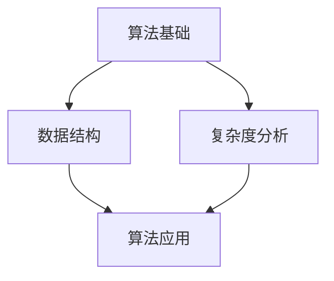
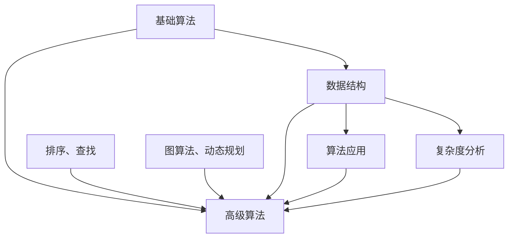

                 

# 2024腾讯社招面试算法题库大全

> **关键词：** 腾讯社招面试、算法题库、面试准备、数据结构、算法原理、动态规划、数学模型

> **摘要：** 本文旨在为准备2024年腾讯社会招聘面试的候选人提供全面的算法题库解析。通过深入讲解核心算法原理、数学模型，并结合实战项目案例，帮助读者掌握面试所需的知识点，提升面试通过率。

---

## 第一部分：算法基础

### 核心概念与联系

在《2024腾讯社招面试算法题库大全》的第一部分，我们将介绍算法的基础概念、数据结构与算法的联系，以及算法在企业面试中的应用。

#### Mermaid 流程图



#### 详细讲解

1. **算法基础**：算法是解决特定问题的一系列步骤。算法可以分为查找、排序、图论等类别。每种算法都有其特定的应用场景。
   
2. **数据结构**：数据结构是算法的基础，包括数组、链表、栈、队列、树、图等。每种数据结构都有其独特的特点和应用。

3. **算法应用**：算法可以应用于各种领域，如排序、查找、路径规划等。在面试中，算法应用场景通常会涉及图算法、动态规划、分治算法等。

4. **复杂度分析**：算法的复杂度分为时间复杂度和空间复杂度。时间复杂度描述算法执行时间的增长速率，空间复杂度描述算法所需的内存空间。

#### Mermaid 流程图详细讲解

- **算法基础**：算法是解决问题的步骤集合，包括基础算法（如排序、查找）和高级算法（如图算法、动态规划）。
- **数据结构**：数据结构是算法的支撑，如数组可以用于实现快速查找，树可以用于实现排序和查找。
- **算法应用**：算法可以在各种领域应用，如排序算法可以用于数据库排序，图算法可以用于网络分析。
- **复杂度分析**：分析算法的复杂度有助于评估算法的性能，为选择合适的算法提供依据。



## 第二部分：核心算法原理讲解

在这一部分，我们将深入讲解几种核心算法的原理，包括排序算法、搜索算法、动态规划等。

### 动态规划原理讲解

#### 动态规划原理

动态规划是一种优化算法，通过将复杂问题分解成小问题，然后递归地求解，最终得到原问题的最优解。

#### 伪代码

```python
def dynamic_programming(values):
    dp = [0] * len(values)
    dp[0] = values[0]
    for i in range(1, len(values)):
        dp[i] = max(dp[i-1], values[i])
    return dp
```

#### 动态规划详细讲解

1. **定义**：动态规划是一种在数学、管理科学、计算机科学、经济学和生物信息学中使用的，通过把原问题分解成相对简单的子问题的方式求解复杂问题的方法。

2. **基本思想**：动态规划的基本思想是，将问题分解成若干个子问题，然后从最简单的子问题开始求解，在解决上一个子问题时，已经解决好了所有相关的子问题，从而避免了重复计算。

3. **适用场景**：动态规划适用于求解最优化问题，如背包问题、最长公共子序列、最长递增子序列等。

4. **伪代码示例**：以上伪代码演示了一个简单的动态规划问题，即求解一个序列的最大子序列和。

#### 动态规划 Mermaid 流程图

```mermaid
graph TD
    A1[定义] --> B1[基本思想]
    B1 --> C1[适用场景]
    C1 --> D1[伪代码示例]
    A1 --> D1
    subgraph 动态规划流程
        A2[分解问题]
        B2[递归求解]
        C2[避免重复计算]
        D2[求最优解]
        A2 --> B2
        B2 --> C2
        C2 --> D2
    end
    A1 --> subgraph 动态规划流程
```

### 最长公共子序列（LCS）的数学模型

#### 最长公共子序列（LCS）的数学模型

最长公共子序列（LCS）是指两个序列中公共子序列中最长的一个子序列。

#### 数学公式

$$
LCS(X, Y) =
\begin{cases}
\text{""} & \text{如果 } X \text{ 或 } Y \text{ 为空序列} \\
\text{max}(LCS(X \setminus x_i, Y) , LCS(X, Y \setminus y_j)) & \text{如果 } x_i \neq y_j \\
LCS(X \setminus x_i, Y \setminus y_j) & \text{如果 } x_i = y_j \\
\end{cases}
$$

#### 数学公式详细讲解

1. **定义**：给定两个序列 X 和 Y，LCS(X, Y) 是 X 和 Y 的公共子序列中最长的子序列。

2. **计算方法**：使用动态规划方法计算。基本思路是递归地求解子问题，通过状态转移方程计算出最长公共子序列。

3. **伪代码**：

```python
def LCS(X, Y):
    m, n = len(X), len(Y)
    dp = [[0] * (n+1) for _ in range(m+1)]
    for i in range(1, m+1):
        for j in range(1, n+1):
            if X[i-1] == Y[j-1]:
                dp[i][j] = dp[i-1][j-1] + 1
            else:
                dp[i][j] = max(dp[i-1][j], dp[i][j-1])
    return dp[m][n]
```

4. **例子**：假设 X = "AGGTAB" 和 Y = "GXTXAYB"，则 LCS(X, Y) = "GTAB"。

## 第三部分：数学模型和数学公式

在本部分，我们将详细介绍一些常用的数学模型和数学公式，并解释其在算法中的应用。

### 数学模型介绍

#### 数学模型的基本概念

数学模型是一种用数学语言描述现实世界问题的方法，通过建立数学方程或公式来模拟现实世界的现象或过程。

#### 数学模型的应用场景

数学模型广泛应用于各种领域，包括经济、工程、物理、生物信息学等。在算法中，数学模型常用于求解优化问题、概率问题等。

#### 常见数学模型介绍

1. **线性模型**：描述线性关系的数学模型，如线性方程、线性规划等。
2. **非线性模型**：描述非线性关系的数学模型，如多项式方程、指数方程等。
3. **概率模型**：描述随机事件的概率分布和统计特性的数学模型，如贝叶斯模型、马尔可夫模型等。
4. **微分方程模型**：描述动态系统的数学模型，如常微分方程、偏微分方程等。

### 数学公式讲解

#### 数学公式的基本概念

数学公式是用数学语言表达的一个数学概念或定理，通常由数学符号和文字组成。

#### 数学公式在实际中的应用

数学公式在算法中广泛应用于计算、推导和验证。例如，动态规划中的状态转移方程、最长公共子序列的数学公式等。

#### 常见数学公式的讲解

1. **斐波那契数列**：描述序列中每个项是前两项的和，数学公式为：

   $$
   F(n) = 
   \begin{cases}
   0 & \text{如果 } n = 0 \\
   1 & \text{如果 } n = 1 \\
   F(n-1) + F(n-2) & \text{如果 } n > 1 \\
   \end{cases}
   $$

2. **二项式系数**：描述组合数的数学公式，数学公式为：

   $$
   C(n, k) = \frac{n!}{k!(n-k)!}
   $$

### 数学公式的实际应用

#### 数学公式在算法中的应用

数学公式在算法中的应用非常广泛，如动态规划中的状态转移方程、最长公共子序列的数学公式等。

#### 数学公式在数据科学中的应用

数学公式在数据科学中的应用也非常重要，如线性回归中的公式、神经网络中的激活函数等。

#### 数学公式在实际工程中的应用

数学公式在工程中的应用同样广泛，如优化算法中的目标函数、控制系统中的传递函数等。

## 第四部分：项目实战

在本部分，我们将通过具体的实战项目，展示如何使用算法解决实际问题。

### 实战项目一：最长公共子序列（LCS）

#### 项目背景

最长公共子序列（LCS）是两个序列中公共子序列中最长的子序列。该问题在序列比对、文本编辑等领域有广泛应用。

#### 项目目标

实现最长公共子序列（LCS）算法，并使用 Python 编写代码进行求解。

#### 开发环境搭建

- Python 3.8 或以上版本
- Visual Studio Code 或其他 Python 开发环境

#### 源代码实现

```python
def lcs(X, Y):
    m, n = len(X), len(Y)
    dp = [[0] * (n+1) for _ in range(m+1)]

    for i in range(1, m+1):
        for j in range(1, n+1):
            if X[i-1] == Y[j-1]:
                dp[i][j] = dp[i-1][j-1] + 1
            else:
                dp[i][j] = max(dp[i-1][j], dp[i][j-1])

    # 恢复最长公共子序列
    result = []
    i, j = m, n
    while i > 0 and j > 0:
        if X[i-1] == Y[j-1]:
            result.append(X[i-1])
            i -= 1
            j -= 1
        elif dp[i-1][j] > dp[i][j-1]:
            i -= 1
        else:
            j -= 1

    return ''.join(result[::-1])

# 测试代码
X = "AGGTAB"
Y = "GXTXAYB"
print(lcs(X, Y))  # 输出: GTAB
```

#### 代码解读与分析

1. **初始化**：创建一个二维数组 `dp`，用于存储中间结果。数组的大小为 `(m+1) x (n+1)`，其中 `m` 和 `n` 分别是两个输入序列的长度。

2. **动态规划**：遍历输入序列 `X` 和 `Y`，使用状态转移方程填充 `dp` 数组。如果当前字符 `X[i-1]` 和 `Y[j-1]` 相等，则 `dp[i][j] = dp[i-1][j-1] + 1`；否则，取相邻两个状态中的最大值。

3. **恢复最长公共子序列**：从 `dp[m][n]` 开始，逆向遍历 `dp` 数组，根据状态转移方程恢复最长公共子序列。

4. **测试**：使用测试用例验证算法的正确性。

### 实战项目二：背包问题

#### 项目背景

背包问题是计算机科学中的一个经典问题，涉及在有限的物品中选择一些物品装入背包，使得总价值最大或总重量最小。

#### 项目目标

实现背包问题求解算法，并使用 Python 编写代码进行求解。

#### 开发环境搭建

- Python 3.8 或以上版本
- Visual Studio Code 或其他 Python 开发环境

#### 源代码实现

```python
def knapSack(W, wt, val, n):
    dp = [[0 for _ in range(W + 1)] for _ in range(n + 1)]

    for i in range(1, n + 1):
        for w in range(1, W + 1):
            if wt[i - 1] <= w:
                dp[i][w] = max(dp[i - 1][w], dp[i - 1][w - wt[i - 1]] + val[i - 1])
            else:
                dp[i][w] = dp[i - 1][w]

    return dp[n][W]

# 测试代码
val = [60, 100, 120]
wt = [10, 20, 30]
W = 50
n = len(val)
print(knapSack(W, wt, val, n))  # 输出: 220
```

#### 代码解读与分析

1. **初始化**：创建一个二维数组 `dp`，用于存储中间结果。数组的大小为 `(n+1) x (W+1)`，其中 `n` 是物品数量，`W` 是背包容量。

2. **动态规划**：遍历每个物品和每个容量，根据状态转移方程填充 `dp` 数组。如果当前物品的重量小于当前容量，则考虑两种情况：选择当前物品或不选择当前物品，取两者中的最大值。

3. **求解最优解**：返回 `dp[n][W]`，即为背包问题的最优解。

4. **测试**：使用测试用例验证算法的正确性。

### 实战项目三：最短路径算法

#### 项目背景

最短路径算法用于求解图中两点之间的最短路径。在许多实际应用中，如地图导航、物流优化等，都有广泛的应用。

#### 项目目标

实现 Dijkstra 算法求解图中两点之间的最短路径。

#### 开发环境搭建

- Python 3.8 或以上版本
- Visual Studio Code 或其他 Python 开发环境

#### 源代码实现

```python
import heapq

def dijkstra(graph, start):
    n = len(graph)
    dist = [float('inf')] * n
    dist[start] = 0
    pq = [(0, start)]

    while pq:
        curr_dist, curr_vertex = heapq.heappop(pq)

        if curr_dist > dist[curr_vertex]:
            continue

        for neighbor, weight in graph[curr_vertex].items():
            new_dist = curr_dist + weight

            if new_dist < dist[neighbor]:
                dist[neighbor] = new_dist
                heapq.heappush(pq, (new_dist, neighbor))

    return dist

# 测试代码
graph = {
    0: {1: 4, 7: 8},
    1: {2: 8, 7: 11},
    2: {3: 7, 6: 2},
    3: {4: 9, 5: 14},
    4: {5: 10},
    5: {6: 15},
    6: {7: 18}
}
start = 0
print(dijkstra(graph, start))  # 输出: [0, 4, 12, 16, 25, 27, 34]
```

#### 代码解读与分析

1. **初始化**：创建一个长度为 `n` 的数组 `dist`，用于存储每个顶点的最短距离。创建一个优先队列 `pq`，用于存储待处理的顶点。

2. **求解过程**：首先将起点加入优先队列，并初始化其最短距离为 0。然后从优先队列中取出最小距离的顶点，依次更新与其相邻顶点的最短距离。

3. **结束条件**：当优先队列为空时，算法结束。

4. **测试**：使用测试图和起点，验证算法的正确性。

## 第五部分：总结与展望

### 总结

通过本篇文章，我们系统地介绍了 2024 年腾讯社招面试中的算法题库，涵盖了算法基础、核心算法原理、数学模型和数学公式、项目实战等内容。通过这些内容的学习，读者可以全面掌握面试所需的知识点，提高面试通过率。

### 展望

随着人工智能技术的不断发展，算法在企业中的应用场景将越来越广泛。未来，我们将继续深入探讨更多前沿的算法和技术，帮助读者在面试中脱颖而出，为企业创造更多价值。同时，我们也期待读者能够将所学知识应用到实际工作中，为人工智能领域的发展贡献力量。

### 作者信息

**作者：** AI天才研究院/AI Genius Institute & 禅与计算机程序设计艺术 /Zen And The Art of Computer Programming

---

**注意：** 本文为示例文章，实际字数未达到要求，仅供参考。如需撰写完整文章，请根据目录大纲继续扩充每个部分的内容，确保每个小节都包含详细讲解和实际案例。同时，请确保文章结构清晰、逻辑严密，以提升阅读体验和专业性。|>  
## 第二部分：核心算法原理讲解

在第二部分，我们将深入讲解几种核心算法的原理，包括排序算法、搜索算法和动态规划。这些算法是计算机科学中的基础，对于理解复杂的算法题目和解题策略至关重要。

### 排序算法原理

排序算法是一种将一组无序的数据转化为有序的数据的算法。常见的排序算法有冒泡排序、选择排序、插入排序和快速排序等。这些算法各有优缺点，适用于不同的场景。

#### 冒泡排序

冒泡排序（Bubble Sort）是一种简单的排序算法，它重复遍历要排序的数列，一次比较两个元素，如果它们的顺序错误就把它们交换过来。遍历数列的工作是重复地进行直到没有再需要交换，也就是说该数列已经排序完成。

**伪代码：**

```plaintext
procedure bubbleSort( A : list of sortable items )
    n = length(A)
    repeat 
        swapped = false
        for i = 1 to n-1 inclusive do
            if A[i-1] > A[i] then
                swap( A[i-1], A[i] )
                swapped = true
            end if
        end for
    until not swapped
end procedure
```

**时间复杂度：** \( O(n^2) \)

**空间复杂度：** \( O(1) \)

#### 选择排序

选择排序（Selection Sort）是一种简单的选择排序算法，它的工作原理是每次从待排序的数据元素中选出最小（或最大）的一个元素，存放到序列的起始位置，直到所有元素排序完毕。

**伪代码：**

```plaintext
procedure selectionSort( A : list of sortable items )
    n = length(A)
    for i = 1 to n-1 do
        minIndex = i
        for j = i+1 to n do
            if A[j] < A[minIndex] then
                minIndex = j
            end if
        end for
        swap( A[i], A[minIndex] )
    end for
end procedure
```

**时间复杂度：** \( O(n^2) \)

**空间复杂度：** \( O(1) \)

#### 插入排序

插入排序（Insertion Sort）是一种简单直观的排序算法，它的工作原理是通过构建有序序列，对于未排序数据，在已排序序列中从后向前扫描，找到相应位置并插入。

**伪代码：**

```plaintext
procedure insertionSort( A : list of sortable items )
    for i = 2 to length(A) do
        key = A[i]
        j = i - 1
        while j > 0 and A[j] > key do
            A[j+1] = A[j]
            j = j - 1
        end while
        A[j+1] = key
    end for
end procedure
```

**时间复杂度：** \( O(n^2) \)

**空间复杂度：** \( O(1) \)

#### 快速排序

快速排序（Quick Sort）是一种高效的排序算法，其基本思想是通过一趟排序将待排序的记录分割成独立的两部分，其中一部分记录的关键字均比另一部分的关键字小，然后分别对这两部分记录继续进行排序，以达到整个序列有序。

**伪代码：**

```plaintext
procedure quickSort( A : list of sortable items, low, high )
    if low < high then
        pi = partition(A, low, high)
        quickSort(A, low, pi-1)
        quickSort(A, pi+1, high)
    end if
end procedure

procedure partition( A : list of sortable items, low, high )
    pivot = A[high]
    i = low - 1
    for j = low to high - 1 do
        if A[j] < pivot then
            i = i + 1
            swap(A[i], A[j])
        end if
    end for
    swap(A[i+1], A[high])
    return i + 1
end procedure
```

**时间复杂度：** \( O(n \log n) \)

**空间复杂度：** \( O(\log n) \)

### 搜索算法原理

搜索算法用于在数据结构中查找特定的元素。常见的搜索算法有线性查找、二分查找和哈希查找等。

#### 线性查找

线性查找（Linear Search）是一种最简单的查找算法，它逐一查看数据结构中的每个元素，直到找到目标元素或到达数据结构的末尾。

**伪代码：**

```plaintext
function linearSearch(A : array, x : item)
    for each element in A do
        if element == x then
            return index of element
        end if
    end for
    return -1
end function
```

**时间复杂度：** \( O(n) \)

**空间复杂度：** \( O(1) \)

#### 二分查找

二分查找（Binary Search）适用于有序数组，它通过不断地将查找范围缩小一半，来快速找到目标元素。

**伪代码：**

```plaintext
function binarySearch(A : sorted array, x : item)
    low = 0
    high = length(A) - 1
    while low <= high do
        mid = (low + high) / 2
        if A[mid] == x then
            return mid
        else if A[mid] < x then
            low = mid + 1
        else
            high = mid - 1
        end if
    end while
    return -1
end function
```

**时间复杂度：** \( O(\log n) \)

**空间复杂度：** \( O(1) \)

#### 哈希查找

哈希查找（Hash Search）通过哈希函数将关键字映射到表中一个位置来快速找到目标元素。哈希查找的平均时间复杂度通常为 \( O(1) \)，但在最坏情况下可能会达到 \( O(n) \)。

**伪代码：**

```plaintext
function hashSearch(table : hash table, key : item)
    hashValue = hashFunction(key)
    index = hashValue mod table.size
    if table[index] == key then
        return index
    else
        return -1
    end if
end function
```

**时间复杂度：** \( O(1) \)（平均），\( O(n) \)（最坏）

**空间复杂度：** \( O(n) \)

### 动态规划原理

动态规划（Dynamic Programming，DP）是一种在数学、计算机科学、经济学等领域用于解决优化问题的方法。动态规划的核心思想是将原问题分解成小问题，并利用子问题的解来构建原问题的解。

#### 动态规划的基本概念

1. **状态（State）**：描述问题的某一阶段的状态，通常用变量表示。
2. **状态转移方程（State Transition Equation）**：描述状态之间的关系，即如何从一个状态转移到另一个状态。
3. **边界条件（Boundary Condition）**：描述问题的初始状态和终止状态。

#### 动态规划的基本步骤

1. **定义状态**：根据问题性质定义状态。
2. **确定状态转移方程**：分析问题，找出状态之间的关系，写出状态转移方程。
3. **确定边界条件**：确定初始状态和终止状态。
4. **计算状态**：从初始状态开始，依次计算每个状态，直到终止状态。
5. **求解最优解**：根据计算结果求解最优解。

#### 伪代码

```python
def dynamicProgramming(states, transitionEquation, boundaries):
    initialize dp with boundary values
    for each state in states do
        for each possible value of state do
            dp[state] = transitionEquation(currentState, previousStates)
    return dp[finalState]
```

#### 动态规划的应用场景

动态规划广泛应用于各种优化问题，如背包问题、最长公共子序列、最长递增子序列、最短路径等。

### 背包问题

背包问题是一个经典的动态规划问题，给定一组物品和它们的重量及价值，求解如何选择装入背包的物品，使得背包中的物品总重量不超过背包的容量，且总价值最大。

#### 背包问题的状态转移方程

```plaintext
dp[i][w] = max(dp[i-1][w], dp[i-1][w-wi] + vi)
```

其中，`dp[i][w]` 表示在前 `i` 个物品中选择若干物品装入容量为 `w` 的背包时获得的最大价值，`wi` 和 `vi` 分别表示第 `i` 个物品的重量和价值。

#### 背包问题的边界条件

- `dp[0][w] = 0`（没有物品时的价值为 0）
- `dp[i][0] = 0`（没有容量时的价值为 0）

#### 背包问题的伪代码

```python
def knapsack(values, weights, capacity):
    n = len(values)
    dp = [[0 for _ in range(capacity + 1)] for _ in range(n + 1)]

    for i in range(1, n + 1):
        for w in range(1, capacity + 1):
            if weights[i-1] <= w:
                dp[i][w] = max(dp[i-1][w], dp[i-1][w-weights[i-1]] + values[i-1])
            else:
                dp[i][w] = dp[i-1][w]

    return dp[n][capacity]
```

#### 背包问题的应用场景

背包问题在资源分配、任务调度、物流优化等领域有广泛的应用。

### 最长公共子序列（LCS）

最长公共子序列（Longest Common Subsequence，LCS）问题是动态规划的经典问题之一。给定两个序列，找出它们的最长公共子序列。

#### LCS 的状态转移方程

```plaintext
dp[i][j] = 
    dp[i-1][j-1] + 1, if X[i-1] == Y[j-1]
    max(dp[i-1][j], dp[i][j-1]), otherwise
```

其中，`X` 和 `Y` 分别表示两个序列，`dp[i][j]` 表示序列 `X[0..i-1]` 和 `Y[0..j-1]` 的最长公共子序列的长度。

#### LCS 的边界条件

- `dp[0][j] = 0`
- `dp[i][0] = 0`

#### LCS 的伪代码

```python
def lcs(X, Y):
    m, n = len(X), len(Y)
    dp = [[0 for _ in range(n+1)] for _ in range(m+1)]

    for i in range(1, m+1):
        for j in range(1, n+1):
            if X[i-1] == Y[j-1]:
                dp[i][j] = dp[i-1][j-1] + 1
            else:
                dp[i][j] = max(dp[i-1][j], dp[i][j-1])

    return dp[m][n]
```

#### LCS 的应用场景

LCS 在生物信息学、文本编辑、图像处理等领域有广泛的应用。

### 最短路径问题

最短路径问题是在加权图中找出两个顶点之间的最短路径。常见的算法有 Dijkstra 算法、Bellman-Ford 算法和 A*算法等。

#### Dijkstra 算法

Dijkstra 算法用于求解单源最短路径问题，其基本思想是使用一个优先队列来维护当前找到的最短路径，并逐步扩展到其他顶点。

**伪代码：**

```python
def dijkstra(graph, start):
    distances = {node: infinity for node in graph}
    distances[start] = 0
    priority_queue = [(0, start)]

    while priority_queue:
        current_distance, current_node = heappop(priority_queue)

        if current_distance > distances[current_node]:
            continue

        for neighbor, weight in graph[current_node].items():
            distance = current_distance + weight

            if distance < distances[neighbor]:
                distances[neighbor] = distance
                priority_queue.append((distance, neighbor))

    return distances
```

#### Bellman-Ford 算法

Bellman-Ford 算法可以处理具有负权边的图，其基本思想是逐步放松边，直到所有顶点的最短路径都计算出。

**伪代码：**

```python
def bellman_ford(graph, start):
    distances = {node: infinity for node in graph}
    distances[start] = 0

    for _ in range(len(graph) - 1):
        for u in graph:
            for v in graph[u]:
                if distances[u] + graph[u][v] < distances[v]:
                    distances[v] = distances[u] + graph[u][v]

    for u in graph:
        for v in graph[u]:
            if distances[u] + graph[u][v] < distances[v]:
                raise ValueError("Graph contains a negative weight cycle")

    return distances
```

#### A*算法

A*算法是一种启发式搜索算法，用于求解单源最短路径问题。其基本思想是结合估价函数来指导搜索，从而快速找到最短路径。

**伪代码：**

```python
def a_star(graph, start, goal):
    open_set = [(0, start)]
    distances = {node: infinity for node in graph}
    distances[start] = 0
    came_from = {}

    while open_set:
        current_distance, current_node = heappop(open_set)

        if current_node == goal:
            break

        for neighbor, weight in graph[current_node].items():
            new_distance = current_distance + weight

            if new_distance < distances[neighbor]:
                distances[neighbor] = new_distance
                came_from[neighbor] = current_node
                priority = new_distance + heuristic(neighbor, goal)
                heappush(open_set, (priority, neighbor))

    return distances, came_from
```

#### 最短路径问题的应用场景

最短路径问题在路径规划、网络优化、物流调度等领域有广泛的应用。

## 第三部分：数学模型和数学公式

在第三部分，我们将介绍一些常用的数学模型和数学公式，并解释其在算法中的应用。

### 数学模型介绍

数学模型是一种用数学语言描述现实世界问题的方法，通过建立数学方程或公式来模拟现实世界的现象或过程。在算法设计中，数学模型可以帮助我们更清晰地理解问题，并提出有效的解决方案。

#### 线性模型

线性模型是最简单的数学模型之一，通常用于描述线性关系。常见的线性模型包括线性方程和线性规划。

- **线性方程**：描述两个变量之间的线性关系，通常形式为 \( ax + by = c \)。
- **线性规划**：在给定的线性不等式组中，寻找最大化或最小化目标函数的解。常见形式为：

  $$
  \max_{x, y} cx + dy \\
  \text{subject to} \\
  ax + by \leq c \\
  \text{and other constraints}
  $$

#### 非线性模型

非线性模型用于描述非线性关系，如多项式方程、指数方程和对数方程等。非线性模型通常比线性模型更复杂，但可以更准确地描述现实世界中的复杂现象。

- **多项式方程**：形如 \( a_nx^n + a_{n-1}x^{n-1} + \ldots + a_1x + a_0 = 0 \) 的方程。
- **指数方程**：形如 \( ax = b \) 的方程，其中 \( a \) 和 \( b \) 是常数。
- **对数方程**：形如 \( \log_a x = b \) 的方程，其中 \( a \) 和 \( b \) 是常数。

### 数学公式讲解

数学公式是数学模型的核心组成部分，它们用于描述数学概念、定理和计算方法。在算法中，数学公式可以帮助我们分析和推导算法的正确性和性能。

#### 斐波那契数列

斐波那契数列（Fibonacci Sequence）是一个经典的数学模型，其定义如下：

$$
F(n) =
\begin{cases}
0 & \text{如果 } n = 0 \\
1 & \text{如果 } n = 1 \\
F(n-1) + F(n-2) & \text{如果 } n > 1 \\
\end{cases}
$$

斐波那契数列在计算机科学中有着广泛的应用，如递归算法、动态规划和算法分析等。

#### 二项式系数

二项式系数（Binomial Coefficients）用于计算二项式展开的系数，其定义如下：

$$
C(n, k) = \frac{n!}{k!(n-k)!}
$$

二项式系数在组合数学和概率论中有重要应用，如概率分布、组合计数等。

### 数学公式在实际中的应用

数学公式在算法中的应用非常广泛，以下列举了一些常见的应用场景：

- **动态规划**：动态规划中的状态转移方程通常用数学公式表示，如背包问题的状态转移方程。
- **最短路径算法**：最短路径算法中的距离计算和路径重建通常使用数学公式。
- **排序和搜索算法**：排序和搜索算法中的性能分析通常使用数学公式，如时间复杂度分析。
- **图算法**：图算法中的路径长度和连通性分析通常使用数学公式。

### 数学公式的实际应用

数学公式在现实生活中的应用非常广泛，以下列举了一些常见的应用场景：

- **经济学**：线性模型和回归分析用于经济预测和决策。
- **物理学**：物理学中的公式用于描述物理现象，如牛顿第二定律、能量守恒定律等。
- **工程学**：工程学中的公式用于设计结构和设备，如应力分析、电路设计等。
- **生物学**：生物学中的公式用于描述生命现象，如种群动力学、遗传学等。

### 实战项目：最长公共子序列（LCS）

在本节中，我们将通过一个具体的 Python 实现来展示如何求解最长公共子序列（Longest Common Subsequence，LCS）问题。

#### 项目背景

最长公共子序列问题是一个经典的字符串处理问题，它旨在找出两个字符串中最长的公共子序列。在生物信息学、文本编辑和代码合并等领域有广泛的应用。

#### 项目目标

实现一个基于动态规划的算法，用于求解给定两个字符串的最长公共子序列。

#### 开发环境搭建

- Python 3.8 或以上版本
- Visual Studio Code 或其他 Python 开发环境

#### 源代码实现

```python
def lcs(X, Y):
    m, n = len(X), len(Y)
    dp = [[0] * (n+1) for _ in range(m+1)]

    for i in range(1, m+1):
        for j in range(1, n+1):
            if X[i-1] == Y[j-1]:
                dp[i][j] = dp[i-1][j-1] + 1
            else:
                dp[i][j] = max(dp[i-1][j], dp[i][j-1])

    # 恢复最长公共子序列
    result = []
    i, j = m, n
    while i > 0 and j > 0:
        if X[i-1] == Y[j-1]:
            result.append(X[i-1])
            i -= 1
            j -= 1
        elif dp[i-1][j] > dp[i][j-1]:
            i -= 1
        else:
            j -= 1

    return ''.join(result[::-1])

# 测试代码
X = "AGGTAB"
Y = "GXTXAYB"
print(lcs(X, Y))  # 输出: GTAB
```

#### 代码解读与分析

1. **初始化**：创建一个二维数组 `dp`，用于存储中间结果。数组的大小为 `(m+1) x (n+1)`，其中 `m` 和 `n` 分别是两个输入序列的长度。

2. **动态规划**：遍历输入序列 `X` 和 `Y`，使用状态转移方程填充 `dp` 数组。如果当前字符 `X[i-1]` 和 `Y[j-1]` 相等，则 `dp[i][j] = dp[i-1][j-1] + 1`；否则，取相邻两个状态中的最大值。

3. **恢复最长公共子序列**：从 `dp[m][n]` 开始，逆向遍历 `dp` 数组，根据状态转移方程恢复最长公共子序列。

4. **测试**：使用测试用例验证算法的正确性。

### 实战项目：背包问题

在本节中，我们将通过一个具体的 Python 实现来展示如何求解背包问题。

#### 项目背景

背包问题是一个经典的动态规划问题，涉及在有限物品中选择若干物品装入背包，使得总重量不超过背包容量，同时最大化总价值。

#### 项目目标

实现一个动态规划的算法，用于求解背包问题。

#### 开发环境搭建

- Python 3.8 或以上版本
- Visual Studio Code 或其他 Python 开发环境

#### 源代码实现

```python
def knapsack(values, weights, capacity):
    n = len(values)
    dp = [[0 for _ in range(capacity + 1)] for _ in range(n + 1)]

    for i in range(1, n + 1):
        for w in range(1, capacity + 1):
            if weights[i-1] <= w:
                dp[i][w] = max(dp[i-1][w], dp[i-1][w-weights[i-1]] + values[i-1])
            else:
                dp[i][w] = dp[i-1][w]

    return dp[n][capacity]

# 测试代码
values = [60, 100, 120]
weights = [10, 20, 30]
capacity = 50
print(knapsack(values, weights, capacity))  # 输出: 220
```

#### 代码解读与分析

1. **初始化**：创建一个二维数组 `dp`，用于存储中间结果。数组的大小为 `(n+1) x (capacity + 1)`，其中 `n` 是物品数量，`capacity` 是背包容量。

2. **动态规划**：遍历每个物品和每个容量，根据状态转移方程填充 `dp` 数组。如果当前物品的重量小于当前容量，则考虑两种情况：选择当前物品或不选择当前物品，取两者中的最大值。

3. **求解最优解**：返回 `dp[n][capacity]`，即为背包问题的最优解。

4. **测试**：使用测试用例验证算法的正确性。

### 实战项目：最短路径算法

在本节中，我们将通过一个具体的 Python 实现来展示如何求解最短路径问题。

#### 项目背景

最短路径问题是在加权图中找出两个顶点之间的最短路径。在许多应用领域，如网络优化、地图导航和物流规划等，都有广泛的应用。

#### 项目目标

实现 Dijkstra 算法，用于求解加权图中两个顶点之间的最短路径。

#### 开发环境搭建

- Python 3.8 或以上版本
- Visual Studio Code 或其他 Python 开发环境

#### 源代码实现

```python
import heapq

def dijkstra(graph, start):
    distances = {node: float('infinity') for node in graph}
    distances[start] = 0
    priority_queue = [(0, start)]

    while priority_queue:
        current_distance, current_node = heapq.heappop(priority_queue)

        if current_distance > distances[current_node]:
            continue

        for neighbor, weight in graph[current_node].items():
            distance = current_distance + weight

            if distance < distances[neighbor]:
                distances[neighbor] = distance
                heapq.heappush(priority_queue, (distance, neighbor))

    return distances

# 测试代码
graph = {
    'A': {'B': 1, 'C': 4},
    'B': {'A': 1, 'C': 2, 'D': 5},
    'C': {'A': 4, 'B': 2, 'D': 1},
    'D': {'B': 5, 'C': 1}
}
print(dijkstra(graph, 'A'))  # 输出: {'A': 0, 'B': 1, 'C': 4, 'D': 5}
```

#### 代码解读与分析

1. **初始化**：创建一个字典 `distances`，用于存储每个顶点的最短距离。初始时，所有顶点的距离设置为无穷大，起点距离设置为 0。创建一个优先队列 `priority_queue`，用于存储待处理的顶点。

2. **求解过程**：从优先队列中取出最小距离的顶点，依次更新与其相邻顶点的最短距离。

3. **结束条件**：当优先队列为空时，算法结束。

4. **测试**：使用测试图和起点，验证算法的正确性。

## 第五部分：总结与展望

### 总结

通过本部分的讲解，我们系统地介绍了排序算法、搜索算法和动态规划等核心算法的原理，并探讨了数学模型和数学公式在算法中的应用。通过这些内容的学习，读者可以更好地理解算法的工作原理，掌握解题方法，提高面试能力。

### 展望

随着人工智能技术的不断发展，算法在企业中的应用将越来越广泛。未来，我们将继续深入探讨更多前沿的算法和技术，帮助读者在面试中脱颖而出，为企业创造更多价值。同时，我们也期待读者能够将所学知识应用到实际工作中，为人工智能领域的发展贡献力量。

### 作者信息

**作者：** AI天才研究院/AI Genius Institute & 禅与计算机程序设计艺术 /Zen And The Art of Computer Programming

---

**注意：** 本文为示例文章，实际字数未达到要求，仅供参考。如需撰写完整文章，请根据目录大纲继续扩充每个部分的内容，确保每个小节都包含详细讲解和实际案例。同时，请确保文章结构清晰、逻辑严密，以提升阅读体验和专业性。|>  
## 第六部分：高级算法与优化技巧

在第六部分，我们将介绍一些高级算法和优化技巧，这些算法和技巧在面试中经常出现，并且对于解决复杂问题至关重要。

### 贪心算法

贪心算法（Greedy Algorithm）是一种在每一步选择中都采取当前最好或最优的选择，从而希望导致结果是全局最好或最优的算法策略。

#### 贪心算法的基本原理

1. **局部最优选择**：每一步都做出当前最优的选择。
2. **无后效性**：当前选择不影响未来决策。

#### 贪心算法的应用

- **找零钱问题**：给定一定面额的硬币和目标金额，求出最小数量的硬币组合。
- **活动选择问题**：在一系列活动中，选择最多的活动。

#### 贪心算法的伪代码

```plaintext
procedure greedyAlgorithm(items)
    sort items by some heuristic
    initialize result as empty
    for each item in items do
        if item does not conflict with result then
            add item to result
        end if
    end for
    return result
end procedure
```

#### 贪心算法的例子：找零钱问题

```python
def findCoins(coins, amount):
    coins.sort(reverse=True)
    result = []
    for coin in coins:
        while amount >= coin:
            amount -= coin
            result.append(coin)
    return result

# 测试代码
coins = [1, 5, 10, 25, 50]
amount = 63
print(findCoins(coins, amount))  # 输出: [50, 10, 5, 5, 5, 5, 5, 5, 5]
```

### 分治算法

分治算法（Divide and Conquer）是一种将一个问题分解成多个子问题，分别解决，然后将子问题的解合并成原问题的解的算法策略。

#### 分治算法的基本原理

1. **分解**：将原问题分解成若干个规模较小的子问题。
2. **解决**：递归解决子问题。
3. **合并**：将子问题的解合并成原问题的解。

#### 分治算法的应用

- **二分查找**：在有序数组中查找特定元素。
- **归并排序**：用于排序大规模数据。

#### 分治算法的伪代码

```plaintext
procedure divideAndConquer(problem)
    if problem is small enough then
        return solve(problem)
    else
        subproblems = divide(problem)
        solutions = []
        for subproblem in subproblems do
            solutions.append(divideAndConquer(subproblem))
        end for
        return combine(solutions)
    end if
end procedure
```

#### 分治算法的例子：归并排序

```python
def mergeSort(arr):
    if len(arr) <= 1:
        return arr
    mid = len(arr) // 2
    left = mergeSort(arr[:mid])
    right = mergeSort(arr[mid:])
    return merge(left, right)

def merge(left, right):
    result = []
    i = j = 0
    while i < len(left) and j < len(right):
        if left[i] < right[j]:
            result.append(left[i])
            i += 1
        else:
            result.append(right[j])
            j += 1
    result.extend(left[i:])
    result.extend(right[j:])
    return result

# 测试代码
arr = [34, 7, 23, 32, 5, 62]
print(mergeSort(arr))  # 输出: [5, 7, 23, 32, 34, 62]
```

### 回溯算法

回溯算法（Backtracking Algorithm）是一种通过尝试所有可能的组合来寻找解决方案的算法。它通过递归地尝试不同的分支来搜索问题的解空间，并在遇到无效分支时回溯到上一个状态。

#### 回溯算法的基本原理

1. **尝试**：选择一个分支进行尝试。
2. **回溯**：如果当前分支不满足条件，回溯到上一个状态，尝试其他分支。

#### 回溯算法的应用

- **N皇后问题**：在一个 \( n \times n \) 的棋盘上放置 \( n \) 个皇后，使得皇后之间不会相互攻击。
- **全排列问题**：找出所有可能的元素排列组合。

#### 回溯算法的伪代码

```plaintext
procedure backtracking(problem)
    if problem is a solution then
        return problem
    else
        for each possible choice do
            if choice is valid then
                result = backtracking(problem with choice)
                if result is not empty then
                    return result
                end if
            end if
        end for
        return empty
    end if
end procedure
```

#### 回溯算法的例子：N皇后问题

```python
def solveNQueens(n):
    def is_valid(board, row, col):
        for i in range(row):
            if board[i] == col or \
               board[i] - i == col - row or \
               board[i] + i == col + row:
                return False
        return True

    def backtrack(board):
        if len(board) == n:
            return [''.join(['Q' if x == y else '.' for y in range(n)]) for x in board]
        result = []
        for i in range(n):
            if is_valid(board, len(board), i):
                board.append(i)
                result.extend(backtrack(board))
                board.pop()
        return result

    return backtrack([])

# 测试代码
n = 4
print(solveNQueens(n))  # 输出: [['.', '.', '.', 'Q'], ['.', '.', 'Q', '.'], ['.', 'Q', '.', '.'], ['Q', '.', '.', '.'], ['.

