```mermaid
graph TD
    A[用户参与度] --> B[用户行为数据]
    B --> C[数据收集与处理]
    C --> D[数据分析]
    D --> E[用户体验优化]
    E --> F[社区建设与用户互动]
    F --> G[用户行为预测与分析]
    G --> H[自动化技术与用户参与度提升]
    H --> I[持续改进与优化]
```
                 

### 第一部分: 自动化创业中的用户参与度提升策略概述

#### 第1章: 自动化创业背景与用户参与度的重要性

> **自动化创业**，指的是在创业过程中，广泛运用自动化技术如人工智能、机器学习、物联网等，以提高工作效率、降低成本、优化用户体验。近年来，随着技术的进步和创业环境的优化，自动化创业逐渐成为趋势，吸引了大量创业者和投资者的关注。

##### **1.1 自动化创业的概念与发展趋势**

- **自动化创业的定义**：自动化创业是指利用自动化技术，特别是人工智能和机器学习，来优化业务流程、降低人力成本、提高效率的创业活动。
- **自动化创业的发展历程**：
  - **初期**：创业公司多以传统方式运营，手动处理业务流程。
  - **中期**：随着互联网和电子商务的发展，创业公司开始采用自动化工具，如CRM系统和在线支付平台。
  - **近期**：人工智能和机器学习技术的成熟，使得创业公司能够实现高度自动化，从数据挖掘到决策支持，全面提升了业务效率和竞争力。
- **自动化创业的优势与挑战**：
  - **优势**：
    - **效率提升**：自动化技术可以大幅减少人工操作，提高工作效率。
    - **成本降低**：通过减少人力成本，降低运营成本。
    - **用户体验优化**：智能化的产品和服务可以提供更加个性化的用户体验。
    - **市场拓展**：自动化技术可以突破地理限制，拓展市场。
  - **挑战**：
    - **技术壁垒**：需要具备一定的技术能力和资源来开发和维护自动化系统。
    - **数据隐私**：自动化过程中涉及大量用户数据，需要确保数据的安全和隐私。
    - **人才短缺**：高素质的自动化技术人才供不应求，招聘和培养成本较高。

##### **1.2 用户参与度的定义与分类**

- **用户参与度的概念**：用户参与度是指用户在使用产品或服务过程中，主动参与的程度和积极性。它反映了用户对产品或服务的认同度、忠诚度和依赖度。
- **用户参与度的分类**：
  - **行为参与度**：通过用户的操作行为来衡量，如使用频率、使用时长、互动行为等。
  - **情感参与度**：通过用户的情感反应来衡量，如满意度、忠诚度、推荐意愿等。
  - **认知参与度**：通过用户对产品的理解程度和认知深度来衡量，如产品知识、用户体验反馈等。
- **用户参与度对创业成功的影响**：
  - **市场推广**：高用户参与度有助于产品的市场推广，提升品牌知名度。
  - **用户忠诚度**：积极参与的用户更可能成为忠诚用户，减少用户流失。
  - **产品优化**：通过用户反馈，快速优化产品，提升用户体验。
  - **创新动力**：用户参与度可以激发创业公司的创新动力，推动产品迭代。

#### 第2章: 提升用户参与度的策略与方法

##### **2.1 数据驱动的用户参与度分析**

- **用户行为数据的收集与处理**：通过日志、用户反馈、社交媒体等多种渠道收集用户行为数据，进行预处理，包括数据清洗、格式转换、缺失值处理等。
- **用户参与度的数据指标**：定义关键性能指标（KPI），如活跃用户数、日活跃用户数（DAU）、月活跃用户数（MAU）、用户留存率、用户转化率等。
- **数据分析工具与技术**：使用数据分析工具（如Python的Pandas、Scikit-learn等）和机器学习算法（如分类、聚类、时间序列分析等）对用户行为数据进行分析，提取有价值的信息。

##### **2.2 用户体验优化策略**

- **用户界面设计原则**：遵循简洁性、一致性、直观性原则，确保用户界面友好易用。
- **交互设计最佳实践**：通过用户研究（如用户访谈、可用性测试等），了解用户需求和偏好，优化交互设计。
- **个性化推荐系统**：利用机器学习算法，根据用户历史行为和偏好，提供个性化内容推荐，提升用户满意度。

##### **2.3 社区建设与用户互动**

- **社区建设的策略**：建立用户社区，提供交流、分享、反馈的平台，增强用户归属感和参与感。
- **用户互动的方式**：通过在线聊天、论坛、社交媒体等多种渠道，鼓励用户互动，收集用户反馈。
- **社区活跃度提升方法**：举办线上活动、发布有奖任务、鼓励用户创作内容等，提高社区活跃度。

#### 第3章: 自动化技术与用户参与度提升

##### **3.1 自动化技术在创业中的应用**

- **自动化流程设计**：通过自动化工具（如RPA、工作流管理系统等）设计业务流程，减少人工干预，提高效率。
- **自动化工具与平台**：选择合适的自动化工具和平台（如Apache Airflow、RabbitMQ等），实现自动化任务调度和数据流转。
- **自动化对用户体验的影响**：自动化技术的引入可以优化用户体验，提高系统的响应速度和可靠性，减少用户等待时间。

##### **3.2 用户行为预测与分析**

- **用户行为预测模型**：使用机器学习算法（如决策树、随机森林、神经网络等）建立用户行为预测模型，预测用户的行为趋势和偏好。
- **用户行为分析工具**：使用数据分析工具（如Google Analytics、Qualtrics等）对用户行为数据进行深入分析，提取有价值的信息。
- **行为数据在策略优化中的应用**：基于用户行为预测和分析，优化产品和服务，提升用户参与度和满意度。

#### 第4章: 用户参与度提升案例研究

##### **4.1 案例一：某某自动化创业公司**

- **公司背景**：某某自动化创业公司成立于2018年，专注于利用人工智能技术优化供应链管理。
- **用户参与度提升措施**：
  - **数据驱动的用户参与度分析**：通过收集和分析用户行为数据，了解用户需求和偏好。
  - **用户体验优化策略**：优化用户界面，提高系统响应速度和可靠性。
  - **社区建设与用户互动**：建立用户社区，鼓励用户参与产品优化和反馈。
- **成果与反思**：用户参与度显著提升，用户满意度增加，公司业务迅速增长。

##### **4.2 案例二：某某智能家居平台**

- **平台概述**：某某智能家居平台提供智能家居设备和集成服务，用户可以通过手机APP远程控制家中的智能设备。
- **用户参与度提升策略**：
  - **自动化技术在创业中的应用**：利用物联网技术实现智能家居设备的自动化控制，提高用户体验。
  - **用户行为预测与分析**：通过用户行为数据预测用户需求，提供个性化服务。
  - **社区建设与用户互动**：建立用户社区，提供技术支持和用户交流平台。
- **用户反馈与调整**：根据用户反馈，不断优化产品和服务，提高用户满意度。

#### 第5章: 用户参与度提升的挑战与应对策略

##### **5.1 用户参与度提升面临的挑战**

- **技术挑战**：自动化技术的高度复杂性和快速迭代，要求创业公司具备持续的技术创新能力。
- **业务挑战**：用户需求多变，创业公司需要快速响应市场变化，优化产品和服务。
- **用户行为变化的影响**：用户行为的多样性和变化性，对用户参与度分析和预测提出了更高的要求。

##### **5.2 应对策略与最佳实践**

- **风险评估与控制**：对自动化创业项目进行全面的风险评估，制定相应的风险控制措施。
- **持续改进机制**：建立用户反馈机制，持续收集用户意见和建议，不断优化产品和服务。
- **案例分析与实践总结**：通过案例分析和实践总结，提炼出用户参与度提升的最佳实践和方法。

#### 第6章: 未来趋势与展望

##### **6.1 自动化创业与用户参与度的未来发展**

- **新技术的影响**：随着5G、物联网、区块链等新技术的应用，自动化创业将迎来新的发展机遇。
- **行业发展趋势**：自动化创业将在更多行业得到应用，如医疗、教育、金融等，用户参与度将进一步提升。
- **创业机会与挑战**：创业公司需要抓住市场机遇，同时应对技术、数据、人才等方面的挑战。

#### 第7章: 结论与展望

##### **7.1 总结与反思**

- **书中内容的回顾**：回顾文章中的核心概念、策略、案例研究等内容。
- **主要观点的总结**：总结文章中的主要观点，强调用户参与度提升的重要性。
- **讨论与建议**：提出对创业者、从业者的建议，促进用户参与度提升的实践。

##### **7.2 未来研究展望**

- **未解决的问题**：讨论当前研究中尚未解决的问题，提出可能的解决思路。
- **研究方向与建议**：提出未来研究的发展方向和建议，为用户参与度提升提供新思路。
- **对创业者与从业者的启示**：分享对未来趋势的洞察，为创业者与从业者提供指导和启示。

### 附录

##### **附录 A: 相关术语解释**

- **自动化创业**：指利用自动化技术（如人工智能、机器学习、物联网等）进行创业的活动。
- **用户参与度**：指用户在使用产品或服务过程中，主动参与的程度和积极性。

##### **附录 B: 常用工具与资源**

- **数据分析工具**：Pandas、Scikit-learn、TensorFlow
- **自动化工具与平台**：Apache Airflow、RabbitMQ
- **用户研究工具**：Google Analytics、Qualtrics、SurveyMonkey

## 核心概念与联系

### 用户参与度的Mermaid流程图


### 用户行为预测模型的伪代码

```python
# 定义用户行为预测模型
def user_behavior_prediction_model(user_data, features):
    # 输入：user_data（用户数据），features（特征向量）
    # 输出：预测结果（参与度评分）

    # 初始化模型参数
    weights = initialize_weights(features.shape[1])

    # 训练模型
    for epoch in range(num_epochs):
        for user, data in user_data.items():
            # 提取用户特征
            user_features = extract_features(data, features)

            # 计算损失函数
            loss = compute_loss(user_features, weights)

            # 更新模型参数
            weights = update_weights(user_features, weights, loss)

    return weights

# 辅助函数定义
def extract_features(data, features):
    # 提取用户特征
    pass

def compute_loss(features, weights):
    # 计算损失函数
    pass

def update_weights(features, weights, loss):
    # 更新模型参数
    pass
```

### 用户参与度评分的数学模型

$$
\text{User Engagement Score} = \frac{\sum_{i=1}^{N} w_i \cdot x_i}{\sum_{i=1}^{N} w_i}
$$

其中，$N$ 为用户行为特征的总数，$w_i$ 为第 $i$ 个特征的权重，$x_i$ 为第 $i$ 个特征值。

### 损失函数

$$
\text{Loss} = \frac{1}{2} \sum_{i=1}^{N} (\text{predicted\_score} - \text{actual\_score})^2
$$

其中，$\text{predicted\_score}$ 为预测的参与度评分，$\text{actual\_score}$ 为实际的参与度评分。

## 项目实战

### 实际案例：某某智能家居平台的用户参与度提升

#### 开发环境搭建

- **Python 3.8**
- **TensorFlow 2.4.0**
- **Pandas 1.1.3**
- **Scikit-learn 0.22.2**

#### 源代码详细实现

```python
# 导入相关库
import pandas as pd
import numpy as np
from sklearn.model_selection import train_test_split
from sklearn.preprocessing import StandardScaler
import tensorflow as tf

# 读取数据
data = pd.read_csv('user_data.csv')

# 数据预处理
X = data.iloc[:, :-1].values
y = data.iloc[:, -1].values

# 分割数据集
X_train, X_test, y_train, y_test = train_test_split(X, y, test_size=0.2, random_state=42)

# 数据标准化
scaler = StandardScaler()
X_train = scaler.fit_transform(X_train)
X_test = scaler.transform(X_test)

# 定义模型
model = tf.keras.Sequential([
    tf.keras.layers.Dense(units=64, activation='relu', input_shape=(X_train.shape[1],)),
    tf.keras.layers.Dense(units=32, activation='relu'),
    tf.keras.layers.Dense(units=1, activation='sigmoid')
])

# 编译模型
model.compile(optimizer='adam', loss='binary_crossentropy', metrics=['accuracy'])

# 训练模型
model.fit(X_train, y_train, epochs=100, batch_size=32, validation_split=0.1)

# 评估模型
loss, accuracy = model.evaluate(X_test, y_test)
print(f'Loss: {loss}, Accuracy: {accuracy}')

# 预测
predictions = model.predict(X_test)
```

#### 代码解读与分析

- **数据预处理**：首先，读取用户数据，将数据分为特征矩阵 $X$ 和目标变量 $y$。然后，使用 `train_test_split` 方法将数据集划分为训练集和测试集。接着，使用 `StandardScaler` 对特征矩阵进行标准化处理，以消除特征之间的尺度差异。

- **模型定义**：使用 TensorFlow 的 Keras API 定义一个简单的全连接神经网络，包括两个隐藏层，每个隐藏层使用 ReLU 激活函数，输出层使用 sigmoid 激活函数，以预测用户参与度的二分类。

- **模型编译**：指定优化器为 Adam，损失函数为二进制交叉熵，评估指标为准确率。

- **模型训练**：使用训练数据训练模型 100 个周期，每次批量大小为 32，同时保留 10% 的数据用于验证。

- **模型评估**：在测试数据上评估模型的损失和准确率。

- **预测**：使用训练好的模型对测试数据进行预测，输出参与度评分。

## 附录

### 附录 A: 相关术语解释

- **自动化创业**：指利用自动化技术（如人工智能、机器学习、物联网等）进行创业的活动。
- **用户参与度**：指用户在使用产品或服务过程中，主动参与的程度和积极性。

### 附录 B: 常用工具与资源

- **数据分析工具**：Pandas、Scikit-learn、TensorFlow
- **自动化工具与平台**：Apache Airflow、RabbitMQ
- **用户研究工具**：Google Analytics、Qualtrics、SurveyMonkey

---

### 用户参与度的Mermaid流程图


### 用户行为预测模型的伪代码

```python
# 定义用户行为预测模型
def user_behavior_prediction_model(user_data, features):
    # 输入：user_data（用户数据），features（特征向量）
    # 输出：预测结果（参与度评分）

    # 初始化模型参数
    weights = initialize_weights(features.shape[1])

    # 训练模型
    for epoch in range(num_epochs):
        for user, data in user_data.items():
            # 提取用户特征
            user_features = extract_features(data, features)

            # 计算损失函数
            loss = compute_loss(user_features, weights)

            # 更新模型参数
            weights = update_weights(user_features, weights, loss)

    return weights

# 辅助函数定义
def extract_features(data, features):
    # 提取用户特征
    pass

def compute_loss(features, weights):
    # 计算损失函数
    pass

def update_weights(features, weights, loss):
    # 更新模型参数
    pass
```

### 用户参与度评分的数学模型

$$
\text{User Engagement Score} = \frac{\sum_{i=1}^{N} w_i \cdot x_i}{\sum_{i=1}^{N} w_i}
$$

其中，$N$ 为用户行为特征的总数，$w_i$ 为第 $i$ 个特征的权重，$x_i$ 为第 $i$ 个特征值。

### 损失函数

$$
\text{Loss} = \frac{1}{2} \sum_{i=1}^{N} (\text{predicted\_score} - \text{actual\_score})^2
$$

其中，$\text{predicted\_score}$ 为预测的参与度评分，$\text{actual\_score}$ 为实际的参与度评分。

## 项目实战

### 实际案例：某某智能家居平台的用户参与度提升

#### 开发环境搭建

- **Python 3.8**
- **TensorFlow 2.4.0**
- **Pandas 1.1.3**
- **Scikit-learn 0.22.2**

#### 源代码详细实现

```python
# 导入相关库
import pandas as pd
import numpy as np
from sklearn.model_selection import train_test_split
from sklearn.preprocessing import StandardScaler
import tensorflow as tf

# 读取数据
data = pd.read_csv('user_data.csv')

# 数据预处理
X = data.iloc[:, :-1].values
y = data.iloc[:, -1].values

# 分割数据集
X_train, X_test, y_train, y_test = train_test_split(X, y, test_size=0.2, random_state=42)

# 数据标准化
scaler = StandardScaler()
X_train = scaler.fit_transform(X_train)
X_test = scaler.transform(X_test)

# 定义模型
model = tf.keras.Sequential([
    tf.keras.layers.Dense(units=64, activation='relu', input_shape=(X_train.shape[1],)),
    tf.keras.layers.Dense(units=32, activation='relu'),
    tf.keras.layers.Dense(units=1, activation='sigmoid')
])

# 编译模型
model.compile(optimizer='adam', loss='binary_crossentropy', metrics=['accuracy'])

# 训练模型
model.fit(X_train, y_train, epochs=100, batch_size=32, validation_split=0.1)

# 评估模型
loss, accuracy = model.evaluate(X_test, y_test)
print(f'Loss: {loss}, Accuracy: {accuracy}')

# 预测
predictions = model.predict(X_test)
```

#### 代码解读与分析

- **数据预处理**：首先，读取用户数据，将数据分为特征矩阵 $X$ 和目标变量 $y$。然后，使用 `train_test_split` 方法将数据集划分为训练集和测试集。接着，使用 `StandardScaler` 对特征矩阵进行标准化处理，以消除特征之间的尺度差异。

- **模型定义**：使用 TensorFlow 的 Keras API 定义一个简单的全连接神经网络，包括两个隐藏层，每个隐藏层使用 ReLU 激活函数，输出层使用 sigmoid 激活函数，以预测用户参与度的二分类。

- **模型编译**：指定优化器为 Adam，损失函数为二进制交叉熵，评估指标为准确率。

- **模型训练**：使用训练数据训练模型 100 个周期，每次批量大小为 32，同时保留 10% 的数据用于验证。

- **模型评估**：在测试数据上评估模型的损失和准确率。

- **预测**：使用训练好的模型对测试数据进行预测，输出参与度评分。

## 附录

### 附录 A: 相关术语解释

- **自动化创业**：指利用自动化技术（如人工智能、机器学习、物联网等）进行创业的活动。
- **用户参与度**：指用户在使用产品或服务过程中，主动参与的程度和积极性。

### 附录 B: 常用工具与资源

- **数据分析工具**：Pandas、Scikit-learn、TensorFlow
- **自动化工具与平台**：Apache Airflow、RabbitMQ
- **用户研究工具**：Google Analytics、Qualtrics、SurveyMonkey

---

### 用户参与度的Mermaid流程图


### 用户行为预测模型的伪代码

```python
# 定义用户行为预测模型
def user_behavior_prediction_model(user_data, features):
    # 输入：user_data（用户数据），features（特征向量）
    # 输出：预测结果（参与度评分）

    # 初始化模型参数
    weights = initialize_weights(features.shape[1])

    # 训练模型
    for epoch in range(num_epochs):
        for user, data in user_data.items():
            # 提取用户特征
            user_features = extract_features(data, features)

            # 计算损失函数
            loss = compute_loss(user_features, weights)

            # 更新模型参数
            weights = update_weights(user_features, weights, loss)

    return weights

# 辅助函数定义
def extract_features(data, features):
    # 提取用户特征
    pass

def compute_loss(features, weights):
    # 计算损失函数
    pass

def update_weights(features, weights, loss):
    # 更新模型参数
    pass
```

### 用户参与度评分的数学模型

$$
\text{User Engagement Score} = \frac{\sum_{i=1}^{N} w_i \cdot x_i}{\sum_{i=1}^{N} w_i}
$$

其中，$N$ 为用户行为特征的总数，$w_i$ 为第 $i$ 个特征的权重，$x_i$ 为第 $i$ 个特征值。

### 损失函数

$$
\text{Loss} = \frac{1}{2} \sum_{i=1}^{N} (\text{predicted\_score} - \text{actual\_score})^2
$$

其中，$\text{predicted\_score}$ 为预测的参与度评分，$\text{actual\_score}$ 为实际的参与度评分。

## 项目实战

### 实际案例：某某智能家居平台的用户参与度提升

#### 开发环境搭建

- **Python 3.8**
- **TensorFlow 2.4.0**
- **Pandas 1.1.3**
- **Scikit-learn 0.22.2**

#### 源代码详细实现

```python
# 导入相关库
import pandas as pd
import numpy as np
from sklearn.model_selection import train_test_split
from sklearn.preprocessing import StandardScaler
import tensorflow as tf

# 读取数据
data = pd.read_csv('user_data.csv')

# 数据预处理
X = data.iloc[:, :-1].values
y = data.iloc[:, -1].values

# 分割数据集
X_train, X_test, y_train, y_test = train_test_split(X, y, test_size=0.2, random_state=42)

# 数据标准化
scaler = StandardScaler()
X_train = scaler.fit_transform(X_train)
X_test = scaler.transform(X_test)

# 定义模型
model = tf.keras.Sequential([
    tf.keras.layers.Dense(units=64, activation='relu', input_shape=(X_train.shape[1],)),
    tf.keras.layers.Dense(units=32, activation='relu'),
    tf.keras.layers.Dense(units=1, activation='sigmoid')
])

# 编译模型
model.compile(optimizer='adam', loss='binary_crossentropy', metrics=['accuracy'])

# 训练模型
model.fit(X_train, y_train, epochs=100, batch_size=32, validation_split=0.1)

# 评估模型
loss, accuracy = model.evaluate(X_test, y_test)
print(f'Loss: {loss}, Accuracy: {accuracy}')

# 预测
predictions = model.predict(X_test)
```

#### 代码解读与分析

- **数据预处理**：首先，读取用户数据，将数据分为特征矩阵 $X$ 和目标变量 $y$。然后，使用 `train_test_split` 方法将数据集划分为训练集和测试集。接着，使用 `StandardScaler` 对特征矩阵进行标准化处理，以消除特征之间的尺度差异。

- **模型定义**：使用 TensorFlow 的 Keras API 定义一个简单的全连接神经网络，包括两个隐藏层，每个隐藏层使用 ReLU 激活函数，输出层使用 sigmoid 激活函数，以预测用户参与度的二分类。

- **模型编译**：指定优化器为 Adam，损失函数为二进制交叉熵，评估指标为准确率。

- **模型训练**：使用训练数据训练模型 100 个周期，每次批量大小为 32，同时保留 10% 的数据用于验证。

- **模型评估**：在测试数据上评估模型的损失和准确率。

- **预测**：使用训练好的模型对测试数据进行预测，输出参与度评分。

## 附录

### 附录 A: 相关术语解释

- **自动化创业**：指利用自动化技术（如人工智能、机器学习、物联网等）进行创业的活动。
- **用户参与度**：指用户在使用产品或服务过程中，主动参与的程度和积极性。

### 附录 B: 常用工具与资源

- **数据分析工具**：Pandas、Scikit-learn、TensorFlow
- **自动化工具与平台**：Apache Airflow、RabbitMQ
- **用户研究工具**：Google Analytics、Qualtrics、SurveyMonkey

---

### 用户参与度的Mermaid流程图


### 用户行为预测模型的伪代码

```python
# 定义用户行为预测模型
def user_behavior_prediction_model(user_data, features):
    # 输入：user_data（用户数据），features（特征向量）
    # 输出：预测结果（参与度评分）

    # 初始化模型参数
    weights = initialize_weights(features.shape[1])

    # 训练模型
    for epoch in range(num_epochs):
        for user, data in user_data.items():
            # 提取用户特征
            user_features = extract_features(data, features)

            # 计算损失函数
            loss = compute_loss(user_features, weights)

            # 更新模型参数
            weights = update_weights(user_features, weights, loss)

    return weights

# 辅助函数定义
def extract_features(data, features):
    # 提取用户特征
    pass

def compute_loss(features, weights):
    # 计算损失函数
    pass

def update_weights(features, weights, loss):
    # 更新模型参数
    pass
```

### 用户参与度评分的数学模型

$$
\text{User Engagement Score} = \frac{\sum_{i=1}^{N} w_i \cdot x_i}{\sum_{i=1}^{N} w_i}
$$

其中，$N$ 为用户行为特征的总数，$w_i$ 为第 $i$ 个特征的权重，$x_i$ 为第 $i$ 个特征值。

### 损失函数

$$
\text{Loss} = \frac{1}{2} \sum_{i=1}^{N} (\text{predicted\_score} - \text{actual\_score})^2
$$

其中，$\text{predicted\_score}$ 为预测的参与度评分，$\text{actual\_score}$ 为实际的参与度评分。

## 项目实战

### 实际案例：某某智能家居平台的用户参与度提升

#### 开发环境搭建

- **Python 3.8**
- **TensorFlow 2.4.0**
- **Pandas 1.1.3**
- **Scikit-learn 0.22.2**

#### 源代码详细实现

```python
# 导入相关库
import pandas as pd
import numpy as np
from sklearn.model_selection import train_test_split
from sklearn.preprocessing import StandardScaler
import tensorflow as tf

# 读取数据
data = pd.read_csv('user_data.csv')

# 数据预处理
X = data.iloc[:, :-1].values
y = data.iloc[:, -1].values

# 分割数据集
X_train, X_test, y_train, y_test = train_test_split(X, y, test_size=0.2, random_state=42)

# 数据标准化
scaler = StandardScaler()
X_train = scaler.fit_transform(X_train)
X_test = scaler.transform(X_test)

# 定义模型
model = tf.keras.Sequential([
    tf.keras.layers.Dense(units=64, activation='relu', input_shape=(X_train.shape[1],)),
    tf.keras.layers.Dense(units=32, activation='relu'),
    tf.keras.layers.Dense(units=1, activation='sigmoid')
])

# 编译模型
model.compile(optimizer='adam', loss='binary_crossentropy', metrics=['accuracy'])

# 训练模型
model.fit(X_train, y_train, epochs=100, batch_size=32, validation_split=0.1)

# 评估模型
loss, accuracy = model.evaluate(X_test, y_test)
print(f'Loss: {loss}, Accuracy: {accuracy}')

# 预测
predictions = model.predict(X_test)
```

#### 代码解读与分析

- **数据预处理**：首先，读取用户数据，将数据分为特征矩阵 $X$ 和目标变量 $y$。然后，使用 `train_test_split` 方法将数据集划分为训练集和测试集。接着，使用 `StandardScaler` 对特征矩阵进行标准化处理，以消除特征之间的尺度差异。

- **模型定义**：使用 TensorFlow 的 Keras API 定义一个简单的全连接神经网络，包括两个隐藏层，每个隐藏层使用 ReLU 激活函数，输出层使用 sigmoid 激活函数，以预测用户参与度的二分类。

- **模型编译**：指定优化器为 Adam，损失函数为二进制交叉熵，评估指标为准确率。

- **模型训练**：使用训练数据训练模型 100 个周期，每次批量大小为 32，同时保留 10% 的数据用于验证。

- **模型评估**：在测试数据上评估模型的损失和准确率。

- **预测**：使用训练好的模型对测试数据进行预测，输出参与度评分。

## 附录

### 附录 A: 相关术语解释

- **自动化创业**：指利用自动化技术（如人工智能、机器学习、物联网等）进行创业的活动。
- **用户参与度**：指用户在使用产品或服务过程中，主动参与的程度和积极性。

### 附录 B: 常用工具与资源

- **数据分析工具**：Pandas、Scikit-learn、TensorFlow
- **自动化工具与平台**：Apache Airflow、RabbitMQ
- **用户研究工具**：Google Analytics、Qualtrics、SurveyMonkey

---

### 用户参与度的Mermaid流程图


### 用户行为预测模型的伪代码

```python
# 定义用户行为预测模型
def user_behavior_prediction_model(user_data, features):
    # 输入：user_data（用户数据），features（特征向量）
    # 输出：预测结果（参与度评分）

    # 初始化模型参数
    weights = initialize_weights(features.shape[1])

    # 训练模型
    for epoch in range(num_epochs):
        for user, data in user_data.items():
            # 提取用户特征
            user_features = extract_features(data, features)

            # 计算损失函数
            loss = compute_loss(user_features, weights)

            # 更新模型参数
            weights = update_weights(user_features, weights, loss)

    return weights

# 辅助函数定义
def extract_features(data, features):
    # 提取用户特征
    pass

def compute_loss(features, weights):
    # 计算损失函数
    pass

def update_weights(features, weights, loss):
    # 更新模型参数
    pass
```

### 用户参与度评分的数学模型

$$
\text{User Engagement Score} = \frac{\sum_{i=1}^{N} w_i \cdot x_i}{\sum_{i=1}^{N} w_i}
$$

其中，$N$ 为用户行为特征的总数，$w_i$ 为第 $i$ 个特征的权重，$x_i$ 为第 $i$ 个特征值。

### 损失函数

$$
\text{Loss} = \frac{1}{2} \sum_{i=1}^{N} (\text{predicted\_score} - \text{actual\_score})^2
$$

其中，$\text{predicted\_score}$ 为预测的参与度评分，$\text{actual\_score}$ 为实际的参与度评分。

## 项目实战

### 实际案例：某某智能家居平台的用户参与度提升

#### 开发环境搭建

- **Python 3.8**
- **TensorFlow 2.4.0**
- **Pandas 1.1.3**
- **Scikit-learn 0.22.2**

#### 源代码详细实现

```python
# 导入相关库
import pandas as pd
import numpy as np
from sklearn.model_selection import train_test_split
from sklearn.preprocessing import StandardScaler
import tensorflow as tf

# 读取数据
data = pd.read_csv('user_data.csv')

# 数据预处理
X = data.iloc[:, :-1].values
y = data.iloc[:, -1].values

# 分割数据集
X_train, X_test, y_train, y_test = train_test_split(X, y, test_size=0.2, random_state=42)

# 数据标准化
scaler = StandardScaler()
X_train = scaler.fit_transform(X_train)
X_test = scaler.transform(X_test)

# 定义模型
model = tf.keras.Sequential([
    tf.keras.layers.Dense(units=64, activation='relu', input_shape=(X_train.shape[1],)),
    tf.keras.layers.Dense(units=32, activation='relu'),
    tf.keras.layers.Dense(units=1, activation='sigmoid')
])

# 编译模型
model.compile(optimizer='adam', loss='binary_crossentropy', metrics=['accuracy'])

# 训练模型
model.fit(X_train, y_train, epochs=100, batch_size=32, validation_split=0.1)

# 评估模型
loss, accuracy = model.evaluate(X_test, y_test)
print(f'Loss: {loss}, Accuracy: {accuracy}')

# 预测
predictions = model.predict(X_test)
```

#### 代码解读与分析

- **数据预处理**：首先，读取用户数据，将数据分为特征矩阵 $X$ 和目标变量 $y$。然后，使用 `train_test_split` 方法将数据集划分为训练集和测试集。接着，使用 `StandardScaler` 对特征矩阵进行标准化处理，以消除特征之间的尺度差异。

- **模型定义**：使用 TensorFlow 的 Keras API 定义一个简单的全连接神经网络，包括两个隐藏层，每个隐藏层使用 ReLU 激活函数，输出层使用 sigmoid 激活函数，以预测用户参与度的二分类。

- **模型编译**：指定优化器为 Adam，损失函数为二进制交叉熵，评估指标为准确率。

- **模型训练**：使用训练数据训练模型 100 个周期，每次批量大小为 32，同时保留 10% 的数据用于验证。

- **模型评估**：在测试数据上评估模型的损失和准确率。

- **预测**：使用训练好的模型对测试数据进行预测，输出参与度评分。

## 附录

### 附录 A: 相关术语解释

- **自动化创业**：指利用自动化技术（如人工智能、机器学习、物联网等）进行创业的活动。
- **用户参与度**：指用户在使用产品或服务过程中，主动参与的程度和积极性。

### 附录 B: 常用工具与资源

- **数据分析工具**：Pandas、Scikit-learn、TensorFlow
- **自动化工具与平台**：Apache Airflow、RabbitMQ
- **用户研究工具**：Google Analytics、Qualtrics、SurveyMonkey

---

### 用户参与度的Mermaid流程图


### 用户行为预测模型的伪代码

```python
# 定义用户行为预测模型
def user_behavior_prediction_model(user_data, features):
    # 输入：user_data（用户数据），features（特征向量）
    # 输出：预测结果（参与度评分）

    # 初始化模型参数
    weights = initialize_weights(features.shape[1])

    # 训练模型
    for epoch in range(num_epochs):
        for user, data in user_data.items():
            # 提取用户特征
            user_features = extract_features(data, features)

            # 计算损失函数
            loss = compute_loss(user_features, weights)

            # 更新模型参数
            weights = update_weights(user_features, weights, loss)

    return weights

# 辅助函数定义
def extract_features(data, features):
    # 提取用户特征
    pass

def compute_loss(features, weights):
    # 计算损失函数
    pass

def update_weights(features, weights, loss):
    # 更新模型参数
    pass
```

### 用户参与度评分的数学模型

$$
\text{User Engagement Score} = \frac{\sum_{i=1}^{N} w_i \cdot x_i}{\sum_{i=1}^{N} w_i}
$$

其中，$N$ 为用户行为特征的总数，$w_i$ 为第 $i$ 个特征的权重，$x_i$ 为第 $i$ 个特征值。

### 损失函数

$$
\text{Loss} = \frac{1}{2} \sum_{i=1}^{N} (\text{predicted\_score} - \text{actual\_score})^2
$$

其中，$\text{predicted\_score}$ 为预测的参与度评分，$\text{actual\_score}$ 为实际的参与度评分。

## 项目实战

### 实际案例：某某智能家居平台的用户参与度提升

#### 开发环境搭建

- **Python 3.8**
- **TensorFlow 2.4.0**
- **Pandas 1.1.3**
- **Scikit-learn 0.22.2**

#### 源代码详细实现

```python
# 导入相关库
import pandas as pd
import numpy as np
from sklearn.model_selection import train_test_split
from sklearn.preprocessing import StandardScaler
import tensorflow as tf

# 读取数据
data = pd.read_csv('user_data.csv')

# 数据预处理
X = data.iloc[:, :-1].values
y = data.iloc[:, -1].values

# 分割数据集
X_train, X_test, y_train, y_test = train_test_split(X, y, test_size=0.2, random_state=42)

# 数据标准化
scaler = StandardScaler()
X_train = scaler.fit_transform(X_train)
X_test = scaler.transform(X_test)

# 定义模型
model = tf.keras.Sequential([
    tf.keras.layers.Dense(units=64, activation='relu', input_shape=(X_train.shape[1],)),
    tf.keras.layers.Dense(units=32, activation='relu'),
    tf.keras.layers.Dense(units=1, activation='sigmoid')
])

# 编译模型
model.compile(optimizer='adam', loss='binary_crossentropy', metrics=['accuracy'])

# 训练模型
model.fit(X_train, y_train, epochs=100, batch_size=32, validation_split=0.1)

# 评估模型
loss, accuracy = model.evaluate(X_test, y_test)
print(f'Loss: {loss}, Accuracy: {accuracy}')

# 预测
predictions = model.predict(X_test)
```

#### 代码解读与分析

- **数据预处理**：首先，读取用户数据，将数据分为特征矩阵 $X$ 和目标变量 $y$。然后，使用 `train_test_split` 方法将数据集划分为训练集和测试集。接着，使用 `StandardScaler` 对特征矩阵进行标准化处理，以消除特征之间的尺度差异。

- **模型定义**：使用 TensorFlow 的 Keras API 定义一个简单的全连接神经网络，包括两个隐藏层，每个隐藏层使用 ReLU 激活函数，输出层使用 sigmoid 激活函数，以预测用户参与度的二分类。

- **模型编译**：指定优化器为 Adam，损失函数为二进制交叉熵，评估指标为准确率。

- **模型训练**：使用训练数据训练模型 100 个周期，每次批量大小为 32，同时保留 10% 的数据用于验证。

- **模型评估**：在测试数据上评估模型的损失和准确率。

- **预测**：使用训练好的模型对测试数据进行预测，输出参与度评分。

## 附录

### 附录 A: 相关术语解释

- **自动化创业**：指利用自动化技术（如人工智能、机器学习、物联网等）进行创业的活动。
- **用户参与度**：指用户在使用产品或服务过程中，主动参与的程度和积极性。

### 附录 B: 常用工具与资源

- **数据分析工具**：Pandas、Scikit-learn、TensorFlow
- **自动化工具与平台**：Apache Airflow、RabbitMQ
- **用户研究工具**：Google Analytics、Qualtrics、SurveyMonkey

---

### 用户参与度的Mermaid流程图


### 用户行为预测模型的伪代码

```python
# 定义用户行为预测模型
def user_behavior_prediction_model(user_data, features):
    # 输入：user_data（用户数据），features（特征向量）
    # 输出：预测结果（参与度评分）

    # 初始化模型参数
    weights = initialize_weights(features.shape[1])

    # 训练模型
    for epoch in range(num_epochs):
        for user, data in user_data.items():
            # 提取用户特征
            user_features = extract_features(data, features)

            # 计算损失函数
            loss = compute_loss(user_features, weights)

            # 更新模型参数
            weights = update_weights(user_features, weights, loss)

    return weights

# 辅助函数定义
def extract_features(data, features):
    # 提取用户特征
    pass

def compute_loss(features, weights):
    # 计算损失函数
    pass

def update_weights(features, weights, loss):
    # 更新模型参数
    pass
```

### 用户参与度评分的数学模型

$$
\text{User Engagement Score} = \frac{\sum_{i=1}^{N} w_i \cdot x_i}{\sum_{i=1}^{N} w_i}
$$

其中，$N$ 为用户行为特征的总数，$w_i$ 为第 $i$ 个特征的权重，$x_i$ 为第 $i$ 个特征值。

### 损失函数

$$
\text{Loss} = \frac{1}{2} \sum_{i=1}^{N} (\text{predicted\_score} - \text{actual\_score})^2
$$

其中，$\text{predicted\_score}$ 为预测的参与度评分，$\text{actual\_score}$ 为实际的参与度评分。

## 项目实战

### 实际案例：某某智能家居平台的用户参与度提升

#### 开发环境搭建

- **Python 3.8**
- **TensorFlow 2.4.0**
- **Pandas 1.1.3**
- **Scikit-learn 0.22.2**

#### 源代码详细实现

```python
# 导入相关库
import pandas as pd
import numpy as np
from sklearn.model_selection import train_test_split
from sklearn.preprocessing import StandardScaler
import tensorflow as tf

# 读取数据
data = pd.read_csv('user_data.csv')

# 数据预处理
X = data.iloc[:, :-1].values
y = data.iloc[:, -1].values

# 分割数据集
X_train, X_test, y_train, y_test = train_test_split(X, y, test_size=0.2, random_state=42)

# 数据标准化
scaler = StandardScaler()
X_train = scaler.fit_transform(X_train)
X_test = scaler.transform(X_test)

# 定义模型
model = tf.keras.Sequential([
    tf.keras.layers.Dense(units=64, activation='relu', input_shape=(X_train.shape[1],)),
    tf.keras.layers.Dense(units=32, activation='relu'),
    tf.keras.layers.Dense(units=1, activation='sigmoid')
])

# 编译模型
model.compile(optimizer='adam', loss='binary_crossentropy', metrics=['accuracy'])

# 训练模型
model.fit(X_train, y_train, epochs=100, batch_size=32, validation_split=0.1)

# 评估模型
loss, accuracy = model.evaluate(X_test, y_test)
print(f'Loss: {loss}, Accuracy: {accuracy}')

# 预测
predictions = model.predict(X_test)
```

#### 代码解读与分析

- **数据预处理**：首先，读取用户数据，将数据分为特征矩阵 $X$ 和目标变量 $y$。然后，使用 `train_test_split` 方法将数据集划分为训练集和测试集。接着，使用 `StandardScaler` 对特征矩阵进行标准化处理，以消除特征之间的尺度差异。

- **模型定义**：使用 TensorFlow 的 Keras API 定义一个简单的全连接神经网络，包括两个隐藏层，每个隐藏层使用 ReLU 激活函数，输出层使用 sigmoid 激活函数，以预测用户参与度的二分类。

- **模型编译**：指定优化器为 Adam，损失函数为二进制交叉熵，评估指标为准确率。

- **模型训练**：使用训练数据训练模型 100 个周期，每次批量大小为 32，同时保留 10% 的数据用于验证。

- **模型评估**：在测试数据上评估模型的损失和准确率。

- **预测**：使用训练好的模型对测试数据进行预测，输出参与度评分。

## 附录

### 附录 A: 相关术语解释

- **自动化创业**：指利用自动化技术（如人工智能、机器学习、物联网等）进行创业的活动。
- **用户参与度**：指用户在使用产品或服务过程中，主动参与的程度和积极性。

### 附录 B: 常用工具与资源

- **数据分析工具**：Pandas、Scikit-learn、TensorFlow
- **自动化工具与平台**：Apache Airflow、RabbitMQ
- **用户研究工具**：Google Analytics、Qualtrics、SurveyMonkey

---

### 用户参与度的Mermaid流程图



### 用户行为预测模型的伪代码

```python
# 定义用户行为预测模型
def user_behavior_prediction_model(user_data, features):
    # 输入：user_data（用户数据），features（特征向量）
    # 输出：预测结果（参与度评分）

    # 初始化模型参数
    weights = initialize_weights(features.shape[1])

    # 训练模型
    for epoch in range(num_epochs):
        for user, data in user_data.items():
            # 提取用户特征
            user_features = extract_features(data, features)

            # 计算损失函数
            loss = compute_loss(user_features, weights)

            # 更新模型参数
            weights = update_weights(user_features, weights, loss)

    return weights

# 辅助函数定义
def extract_features(data, features):
    # 提取用户特征
    pass

def compute_loss(features, weights):
    # 计算损失函数
    pass

def update_weights(features, weights, loss):
    # 更新模型参数
    pass
```

### 用户参与度评分的数学模型

$$
\text{User Engagement Score} = \frac{\sum_{i=1}^{N} w_i \cdot x_i}{\sum_{i=1}^{N} w_i}
$$

其中，$N$ 为用户行为特征的总数，$w_i$ 为第 $i$ 个特征的权重，$x_i$ 为第 $i$ 个特征值。

### 损失函数

$$
\text{Loss} = \frac{1}{2} \sum_{i=1}^{N} (\text{predicted\_score} - \text{actual\_score})^2
$$

其中，$\text{predicted\_score}$ 为预测的参与度评分，$\text{actual\_score}$ 为实际的参与度评分。

## 项目实战

### 实际案例：某某智能家居平台的用户参与度提升

#### 开发环境搭建

- **Python 3.8**
- **TensorFlow 2.4.0**
- **Pandas 1.1.3**
- **Scikit-learn 0.22.2**

#### 源代码详细实现

```python
# 导入相关库
import pandas as pd
import numpy as np
from sklearn.model_selection import train_test_split
from sklearn.preprocessing import StandardScaler
import tensorflow as tf

# 读取数据
data = pd.read_csv('user_data.csv')

# 数据预处理
X = data.iloc[:, :-1].values
y = data.iloc[:, -1].values

# 分割数据集
X_train, X_test, y_train, y_test = train_test_split(X, y, test_size=0.2, random_state=42)

# 数据标准化
scaler = StandardScaler()
X_train = scaler.fit_transform(X_train)
X_test = scaler.transform(X_test)

# 定义模型
model = tf.keras.Sequential([
    tf.keras.layers.Dense(units=64, activation='relu', input_shape=(X_train.shape[1],)),
    tf.keras.layers.Dense(units=32, activation='relu'),
    tf.keras.layers.Dense(units=1, activation='sigmoid')
])

# 编译模型
model.compile(optimizer='adam', loss='binary_crossentropy', metrics=['accuracy'])

# 训练模型
model.fit(X_train, y_train, epochs=100, batch_size=32, validation_split=0.1)

# 评估模型
loss, accuracy = model.evaluate(X_test, y_test)
print(f'Loss: {loss}, Accuracy: {accuracy}')

# 预测
predictions = model.predict(X_test)
```

#### 代码解读与分析

- **数据预处理**：首先，读取用户数据，将数据分为特征矩阵 $X$ 和目标变量 $y$。然后，使用 `train_test_split` 方法将数据集划分为训练集和测试集。接着，使用 `StandardScaler` 对特征矩阵进行标准化处理，以消除特征之间的尺度差异。

- **模型定义**：使用 TensorFlow 的 Keras API 定义一个简单的全连接神经网络，包括两个隐藏层，每个隐藏层使用 ReLU 激活函数，输出层使用 sigmoid 激活函数，以预测用户参与度的二分类。

- **模型编译**：指定优化器为 Adam，损失函数为二进制交叉熵，评估指标为准确率。

- **模型训练**：使用训练数据训练模型 100 个周期，每次批量大小为 32，同时保留 10% 的数据用于验证。

- **模型评估**：在测试数据上评估模型的损失和准确率。

- **预测**：使用训练好的模型对测试数据进行预测，输出参与度评分。

## 附录

### 附录 A: 相关术语解释

- **自动化创业**：指利用自动化技术（如人工智能、机器学习、物联网等）进行创业的活动。
- **用户参与度**：指用户在使用产品或服务过程中，主动参与的程度和积极性。

### 附录 B: 常用工具与资源

- **数据分析工具**：Pandas、Scikit-learn、TensorFlow
- **自动化工具与平台**：Apache Airflow、RabbitMQ
- **用户研究工具**：Google Analytics、Qualtrics、SurveyMonkey

---

### 用户参与度的Mermaid流程图


### 用户行为预测模型的伪代码

```python
# 定义用户行为预测模型
def user_behavior_prediction_model(user_data, features):
    # 输入：user_data（用户数据），features（特征向量）
    # 输出：预测结果（参与度评分）

    # 初始化模型参数
    weights = initialize_weights(features.shape[1])

    # 训练模型
    for epoch in range(num_epochs):
        for user, data in user_data.items():
            # 提取用户特征
            user_features = extract_features(data, features)

            # 计算损失函数
            loss = compute_loss(user_features, weights)

            # 更新模型参数
            weights = update_weights(user_features, weights, loss)

    return weights

# 辅助函数定义
def extract_features(data, features):
    # 提取用户特征
    pass

def compute_loss(features, weights):
    # 计算损失函数
    pass

def update_weights(features, weights, loss):
    # 更新模型参数
    pass
```

### 用户参与度评分的数学模型

$$
\text{User Engagement Score} = \frac{\sum_{i=1}^{N} w_i \cdot x_i}{\sum_{i=1}^{N} w_i}
$$

其中，$N$ 为用户行为特征的总数，$w_i$ 为第 $i$ 个特征的权重，$x_i$ 为第 $i$ 个特征值。

### 损失函数

$$
\text{Loss} = \frac{1}{2} \sum_{i=1}^{N} (\text{predicted\_score} - \text{actual\_score})^2
$$

其中，$\text{predicted\_score}$ 为预测的参与度评分，$\text{actual\_score}$ 为实际的参与度评分。

## 项目实战

### 实际案例：某某智能家居平台的用户参与度提升

#### 开发环境搭建

- **Python 3.8**
- **TensorFlow 2.4.0**
- **Pandas 1.1.3**
- **Scikit-learn 0.22.2**

#### 源代码详细实现

```python
# 导入相关库
import pandas as pd
import numpy as np
from sklearn.model_selection import train_test_split
from sklearn.preprocessing import StandardScaler
import tensorflow as tf

# 读取数据
data = pd.read_csv('user_data.csv')

# 数据预处理
X = data.iloc[:, :-1].values
y = data.iloc[:, -1].values

# 分割数据集
X_train, X_test, y_train, y_test = train_test_split(X, y, test_size=0.2, random_state=42)

# 数据标准化
scaler = StandardScaler()
X_train = scaler.fit_transform(X_train)
X_test = scaler.transform(X_test)

# 定义模型
model = tf.keras.Sequential([
    tf.keras.layers.Dense(units=64, activation='relu', input_shape=(X_train.shape[1],)),
    tf.keras.layers.Dense(units=32, activation='relu'),
    tf.keras.layers.Dense(units=1, activation='sigmoid')
])

# 编译模型
model.compile(optimizer='adam', loss='binary_crossentropy', metrics=['accuracy'])

# 训练模型
model.fit(X_train, y_train, epochs=100, batch_size=32, validation_split=0.1)

# 评估模型
loss, accuracy = model.evaluate(X_test, y_test)
print(f'Loss: {loss}, Accuracy: {accuracy}')

# 预测
predictions = model.predict(X_test)
```

#### 代码解读与分析

- **数据预处理**：首先，读取用户数据，将数据分为特征矩阵 $X$ 和目标变量 $y$。然后，使用 `train_test_split` 方法将数据集划分为训练集和测试集。接着，使用 `StandardScaler` 对特征矩阵进行标准化处理，以消除特征之间的尺度差异。

- **模型定义**：使用 TensorFlow 的 Keras API 定义一个简单的全连接神经网络，包括两个隐藏层，每个隐藏层使用 ReLU 激活函数，输出层使用 sigmoid 激活函数，以预测用户参与度的二分类。

- **模型编译**：指定优化器为 Adam，损失函数为二进制交叉熵，评估指标为准确率。

- **模型训练**：使用训练数据训练模型 100 个周期，每次批量大小为 32，同时保留 10% 的数据用于验证。

- **模型评估**：在测试数据上评估模型的损失和准确率。

- **预测**：使用训练好的模型对测试数据进行预测，输出参与度评分。

## 附录

### 附录 A: 相关术语解释

- **自动化创业**：指利用自动化技术（如人工智能、机器学习、物联网等）进行创业的活动。
- **用户参与度**：指用户在使用产品或服务过程中，主动参与的程度和积极性。

### 附录 B: 常用工具与资源

- **数据分析工具**：Pandas、Scikit-learn、TensorFlow
- **自动化工具与平台**：Apache Airflow、RabbitMQ
- **用户研究工具**：Google Analytics、Qualtrics、SurveyMonkey

---

### 用户参与度的Mermaid流程图


### 用户行为预测模型的伪代码

```python
# 定义用户行为预测模型
def user_behavior_prediction_model(user_data, features):
    # 输入：user_data（用户数据），features（特征向量）
    # 输出：预测结果（参与度评分）

    # 初始化模型参数
    weights = initialize_weights(features.shape[1])

    # 训练模型
    for epoch in range(num_epochs):
        for user, data in user_data.items():
            # 提取用户特征
            user_features = extract_features(data, features)

            # 计算损失函数
            loss = compute_loss(user_features, weights)

            # 更新模型参数
            weights = update_weights(user_features, weights, loss)

    return weights

# 辅助函数定义
def extract_features(data, features):
    # 提取用户特征
    pass

def compute_loss(features, weights):
    # 计算损失函数
    pass

def update_weights(features, weights, loss):
    # 更新模型参数
    pass
```

### 用户参与度评分的数学模型

$$
\text{User Engagement Score} = \frac{\sum_{i=1}^{N} w_i \cdot x_i}{\sum_{i=1}^{N} w_i}
$$

其中，$N$ 为用户行为特征的总数，$w_i$ 为第 $i$ 个特征的权重，$x_i$ 为第 $i$ 个特征值。

### 损失函数

$$
\text{Loss} = \frac{1}{2} \sum_{i=1}^{N} (\text{predicted\_score} - \text{actual\_score})^2
$$

其中，$\text{predicted\_score}$ 为预测的参与度评分，$\text{actual\_score}$ 为实际的参与度评分。

## 项目实战

### 实际案例：某某智能家居平台的用户参与度提升

#### 开发环境搭建

- **Python 3.8**
- **TensorFlow 2.4.0**
- **Pandas 1.1.3**
- **Scikit-learn 0.22.2**

#### 源代码详细实现

```python
# 导入相关库
import pandas as pd
import numpy as np
from sklearn.model_selection import train_test_split
from sklearn.preprocessing import StandardScaler
import tensorflow as tf

# 读取数据
data = pd.read_csv('user_data.csv')

# 数据预处理
X = data.iloc[:, :-1].values
y = data.iloc[:, -1].values

# 分割数据集
X_train, X_test, y_train, y_test = train_test_split(X, y, test_size=0.2, random_state=42)

# 数据标准化
scaler = StandardScaler()
X_train = scaler.fit_transform(X_train)
X_test = scaler.transform(X_test)

# 定义模型
model = tf.keras.Sequential([
    tf.keras.layers.Dense(units=64, activation='relu', input_shape=(X_train.shape[1],)),
    tf.keras.layers.Dense(units=32, activation='relu'),
    tf.keras.layers.Dense(units=1, activation='sigmoid')
])

# 编译模型
model.compile(optimizer='adam', loss='binary_crossentropy', metrics=['accuracy'])

# 训练模型
model.fit(X_train, y_train, epochs=100, batch_size=32, validation_split=0.1)

# 评估模型
loss, accuracy = model.evaluate(X_test, y_test)
print(f'Loss: {loss}, Accuracy: {accuracy}')

# 预测
predictions = model.predict(X_test)
```

#### 代码解读与分析

- **数据预处理**：首先，读取用户数据，将数据分为特征矩阵 $X$ 和目标变量 $y$。然后，使用 `train_test_split` 方法将数据集划分为训练集和测试集。接着，使用 `StandardScaler` 对特征矩阵进行标准化处理，以消除特征之间的尺度差异。

- **模型定义**：使用 TensorFlow 的 Keras API 定义一个简单的全连接神经网络，包括两个隐藏层，每个隐藏层使用 ReLU 激活函数，输出层使用 sigmoid 激活函数，以预测用户参与度的二分类。

- **模型编译**：指定优化器为 Adam，损失函数为二进制交叉熵，评估指标为准确率。

- **模型训练**：使用训练数据训练模型 100 个周期，每次批量大小为 32，同时保留 10% 的数据用于验证。

- **模型评估**：在测试数据上评估模型的损失和准确率。

- **预测**：使用训练好的模型对测试数据进行预测，输出参与度评分。

## 附录

### 附录 A: 相关术语解释

- **自动化创业**：指利用自动化技术（如人工智能、机器学习、物联网等）进行创业的活动。
- **用户参与度**：指用户在使用产品或服务过程中，主动参与的程度和积极性。

### 附录 B: 常用工具与资源

- **数据分析工具**：Pandas、Scikit-learn、TensorFlow
- **自动化工具与平台**：Apache Airflow、RabbitMQ
- **用户研究工具**：Google Analytics、Qualtrics、SurveyMonkey

---

### 用户参与度的Mermaid流程图


### 用户行为预测模型的伪代码

```python
# 定义用户行为预测模型
def user_behavior_prediction_model(user_data, features):
    # 输入：user_data（用户数据），features（特征向量）
    # 输出：预测结果（参与度评分）

    # 初始化模型参数
    weights = initialize_weights(features.shape[1])

    # 训练模型
    for epoch in range(num_epochs):
        for user, data in user_data.items():
            # 提取用户特征
            user_features = extract_features(data, features)

            # 计算损失函数
            loss = compute_loss(user_features, weights)

            # 更新模型参数
            weights = update_weights(user_features, weights, loss)

    return weights

# 辅助函数定义
def extract_features(data, features):
    # 提取用户特征
    pass

def compute_loss(features, weights):
    # 计算损失函数
    pass

def update_weights(features, weights, loss):
    # 更新模型参数
    pass
```

### 用户参与度评分的数学模型

$$
\text{User Engagement Score} = \frac{\sum_{i=1}^{N} w_i \cdot x_i}{\sum_{i=1}^{N} w_i}
$$

其中，$N$ 为用户行为特征的总数，$w_i$ 为第 $i$ 个特征的权重，$x_i$ 为第 $i$ 个特征值。

### 损失函数

$$
\text{Loss} = \frac{1}{2} \sum_{i=1}^{N} (\text{predicted\_score} - \text{actual\_score})^2
$$

其中，$\text{predicted\_score}$ 为预测的参与度评分，$\text{actual\_score}$ 为实际的参与度评分。

## 项目实战

### 实际案例：某某智能家居平台的用户参与度提升

#### 开发环境搭建

- **Python 3.8**
- **TensorFlow 2.4.0**
- **Pandas 1.1.3**
- **Scikit-learn 0.22.2**

#### 源代码详细实现

```python
# 导入相关库
import pandas as pd
import numpy as np
from sklearn.model_selection import train_test_split
from sklearn.preprocessing import StandardScaler
import tensorflow as tf

# 读取数据
data = pd.read_csv('user_data.csv')

# 数据预处理
X = data.iloc[:, :-1].values
y = data.iloc[:, -1].values

# 分割数据集
X_train, X_test, y_train, y_test = train_test_split(X, y, test_size=0.2, random_state=42)

# 数据标准化
scaler = StandardScaler()
X_train = scaler.fit_transform(X_train)
X_test = scaler.transform(X_test)

# 定义模型
model = tf.keras.Sequential([
    tf.keras.layers.Dense(units=64, activation='relu', input_shape=(X_train.shape[1],)),
    tf.keras.layers.Dense(units=32, activation='relu'),
    tf.keras.layers.Dense(units=1, activation='sigmoid')
])

# 编译模型
model.compile(optimizer='adam', loss='binary_crossentropy', metrics=['accuracy'])

# 训练模型
model.fit(X_train, y_train, epochs=100, batch_size=32, validation_split=0.1)

# 评估模型
loss, accuracy = model.evaluate(X_test, y_test)
print(f'Loss: {loss}, Accuracy: {accuracy}')

# 预测
predictions = model.predict(X_test)
```

#### 代码解读与分析

- **数据预处理**：首先，读取用户数据，将数据分为特征矩阵 $X$ 和目标变量 $y$。然后，使用 `train_test_split` 方法将数据集划分为训练集和测试集。接着，使用 `StandardScaler` 对特征矩阵进行标准化处理，以消除特征之间的尺度差异。

- **模型定义**：使用 TensorFlow 的 Keras API 定义一个简单的全连接神经网络，包括两个隐藏层，每个隐藏层使用 ReLU 激活函数，输出层使用 sigmoid 激活函数，以预测用户参与度的二分类。

- **模型编译**：指定优化器为 Adam，损失函数为二进制交叉熵，评估指标为准确率。

- **模型训练**：使用训练数据训练模型 100 个周期，每次批量大小为 32，同时保留 10% 的数据用于验证。

- **模型评估**：在测试数据上评估模型的损失和准确率。

- **预测**：使用训练好的模型对测试数据进行预测，输出参与度评分。

## 附录

### 附录 A: 相关术语解释

- **自动化创业**：指利用自动化技术（如人工智能、机器学习、物联网等）进行创业的活动。
- **用户参与度**：指用户在使用产品或服务过程中，主动参与的程度和积极性。

### 附录 B: 常用工具与资源

- **数据分析工具**：Pandas、Scikit-learn、TensorFlow
- **自动化工具与平台**：Apache Airflow、RabbitMQ
- **用户研究工具**：Google Analytics、Qualtrics、SurveyMonkey

---

### 用户参与度的Mermaid流程图


### 用户行为预测模型的伪代码

```python
# 定义用户行为预测模型
def user_behavior_prediction_model(user_data, features):
    # 输入：user_data（用户数据），features（特征向量）
    # 输出：预测结果（参与度评分）

    # 初始化模型参数
    weights = initialize_weights(features.shape[1])

    # 训练模型
    for epoch in range(num_epochs):
        for user, data in user_data.items():
            # 提取用户特征
            user_features = extract_features(data, features)

            # 计算损失函数
            loss = compute_loss(user_features, weights)

            # 更新模型参数
            weights = update_weights(user_features, weights, loss)

    return weights

# 辅助函数定义
def extract_features(data, features):
    # 提取用户特征
    pass

def compute_loss(features, weights):
    # 计算损失函数
    pass

def update_weights(features, weights, loss):
    # 更新模型参数
    pass
```

### 用户参与度评分的数学模型

$$
\text{User Engagement Score} = \frac{\sum_{i=1}^{N} w_i \cdot x_i}{\sum_{i=1}^{N} w_i}
$$

其中，$N$ 为用户行为特征的总数，$w_i$ 为第 $i$ 个特征的权重，$x_i$ 为第 $i$ 个特征值。

### 损失函数

$$
\text{Loss} = \frac{1}{2} \sum_{i=1}^{N} (\text{predicted\_score} - \text{actual\_score})^2
$$

其中，$\text{predicted\_score}$ 为预测的参与度评分，$\text{actual\_score}$ 为实际的参与度评分。

## 项目实战

### 实际案例：某某智能家居平台的用户参与度提升

#### 开发环境搭建

- **Python 3.8**
- **TensorFlow 2.4.0**
- **Pandas 1.1.3**
- **Scikit-learn 0.22.2**

#### 源代码详细实现

```python
# 导入相关库
import pandas as pd
import numpy as np
from sklearn.model_selection import train_test_split
from sklearn.preprocessing import StandardScaler
import tensorflow as tf

# 读取数据
data = pd.read_csv('user_data.csv')

# 数据预处理
X = data.iloc[:, :-1].values
y = data.iloc[:, -1].values

# 分割数据集
X_train, X_test, y_train, y_test = train_test_split(X, y, test_size=0.2, random_state=42)

# 数据标准化
scaler = StandardScaler()
X_train = scaler.fit_transform(X_train)
X_test = scaler.transform(X_test)

# 定义模型
model = tf.keras.Sequential([
    tf.keras.layers.Dense(units=64, activation='relu', input_shape=(X_train.shape[1],)),
    tf.keras.layers.Dense(units=32, activation='relu'),
    tf.keras.layers.Dense(units=1, activation='sigmoid')
])

# 编译模型
model.compile(optimizer='adam', loss='binary_crossentropy', metrics=['accuracy'])

# 训练模型
model.fit(X_train, y_train, epochs=100, batch_size=32, validation_split=0.1)

# 评估模型
loss, accuracy = model.evaluate(X_test, y_test)
print(f'Loss: {loss}, Accuracy: {accuracy}')

# 预测
predictions = model.predict(X_test)
```

#### 代码解读与分析

- **数据预处理**：首先，读取用户数据，将数据分为特征矩阵 $X$ 和目标变量 $y$。然后，使用 `train_test_split` 方法将数据集划分为训练集和测试集。接着，使用 `StandardScaler` 对特征矩阵进行标准化处理，以消除特征之间的尺度差异。

- **模型定义**：使用 TensorFlow 的 Keras API 定义一个简单的全连接神经网络，包括两个隐藏层，每个隐藏层使用 ReLU 激活函数，输出层使用 sigmoid 激活函数，以预测用户参与度的二分类。

- **模型编译**：指定优化器为 Adam，损失函数为二进制交叉熵，评估指标为准确率。

- **模型训练**：使用训练数据训练模型 100 个周期，每次批量大小为 32，同时保留 10% 的数据用于验证。

- **模型评估**：在测试数据上评估模型的损失和准确率。

- **预测**：使用训练好的模型对测试数据进行预测，输出参与度评分。

## 附录

### 附录 A: 相关术语解释

- **自动化创业**：指利用自动化技术（如人工智能、机器学习、物联网等）进行创业的活动。
- **用户参与度**：指用户在使用产品或服务过程中，主动参与的程度和积极性。

### 附录 B: 常用工具与资源

- **数据分析工具**：Pandas、Scikit-learn、TensorFlow
- **自动化工具与平台**：Apache Airflow、RabbitMQ
- **用户研究工具**：Google Analytics、Qualtrics、SurveyMonkey

---

### 用户参与度的Mermaid流程图


### 用户行为预测模型的伪代码

```python
# 定义用户行为预测模型
def user_behavior_prediction_model(user_data, features):
    # 输入：user_data（用户数据），features（特征向量）
    # 输出：预测结果（参与度评分）

    # 初始化模型参数
    weights = initialize_weights(features.shape[1])

    # 训练模型
    for epoch in range(num_epochs):
        for user, data in user_data.items():
            # 提取用户特征
            user_features = extract_features(data, features)

            # 计算损失函数
            loss = compute_loss(user_features, weights)

            # 更新模型参数
            weights = update_weights(user_features, weights, loss)

    return weights

# 辅助函数定义
def extract_features(data, features):
    # 提取用户特征
    pass

def compute_loss(features, weights):
    # 计算损失函数
    pass

def update_weights(features, weights, loss):
    # 更新模型参数
    pass
```

### 用户参与度评分的数学模型

$$
\text{User Engagement Score} = \frac{\sum_{i=1}^{N} w_i \cdot x_i}{\sum_{i=1}^{N} w_i}
$$

其中，$N$ 为用户行为特征的总数，$w_i$ 为第 $i$ 个特征的权重，$x_i$ 为第 $i$ 个特征值。

### 损失函数

$$
\text{Loss} = \frac{1}{2} \sum_{i=1}^{N} (\text{predicted\_score} - \text{actual\_score})^2
$$

其中，$\text{predicted\_score}$ 为预测的参与度评分，$\text{actual\_score}$ 为实际的参与度评分。

## 项目实战

### 实际案例：某某智能家居平台的用户参与度提升

#### 开发环境搭建

- **Python 3.8**
- **TensorFlow 2.4.0**
- **Pandas 1.1.3**
- **Scikit-learn 0.22.2**

#### 源代码详细实现

```python
# 导入相关库
import pandas as pd
import numpy as np
from sklearn.model_selection import train_test_split
from sklearn.preprocessing import StandardScaler
import tensorflow as tf

# 读取数据
data = pd.read_csv('user_data.csv')

# 数据预处理
X = data.iloc[:, :-1].values
y = data.iloc[:, -1].values

# 分割数据集
X_train, X_test, y_train, y_test = train_test_split(X, y, test_size=0.2, random_state=42)

# 数据标准化
scaler = StandardScaler()
X_train = scaler.fit_transform(X_train)
X_test = scaler.transform(X_test)

# 定义模型
model = tf.keras.Sequential([
    tf.keras.layers.Dense(units=64, activation='relu', input_shape=(X_train.shape[1],)),
    tf.keras.layers.Dense(units=32, activation='relu'),
    tf.keras.layers.Dense(units=1, activation='sigmoid')
])

# 编译模型
model.compile(optimizer='adam', loss='binary_crossentropy', metrics=['accuracy'])

# 训练模型
model.fit(X_train, y_train, epochs=100, batch_size=32, validation_split=0.1)

# 评估模型
loss, accuracy = model.evaluate(X_test, y_test)
print(f'Loss: {loss}, Accuracy: {accuracy}')

# 预测
predictions = model.predict(X_test)
```

#### 代码解读与分析

- **数据预处理**：首先，读取用户数据，将数据分为特征矩阵 $X$ 和目标变量 $y$。然后，使用 `train_test_split` 方法将数据集划分为训练集和测试集。接着，使用 `StandardScaler` 对特征矩阵进行标准化处理，以消除特征之间的尺度差异。

- **模型定义**：使用 TensorFlow 的 Keras API 定义一个简单的全连接神经网络，包括两个隐藏层，每个隐藏层使用 ReLU 激活函数，输出层使用 sigmoid 激活函数，以预测用户参与度的二分类。

- **模型编译**：指定优化器为 Adam，损失函数为二进制交叉熵，评估指标为准确率。

- **模型训练**：使用训练数据训练模型 100 个周期，每次批量大小为 32，同时保留 10% 的数据用于验证。

- **模型评估**：在测试数据上评估模型的损失和准确率。

- **预测**：使用训练好的模型对测试数据进行预测，输出参与度评分。

## 附录

### 附录 A: 相关术语解释

- **自动化创业**：指利用自动化技术（如人工智能、机器学习、物联网等）进行创业的活动。
- **用户参与度**：指用户在使用产品或服务过程中，主动参与的程度和积极性。

### 附录 B: 常用工具与资源

- **数据分析工具**：Pandas、Scikit-learn、TensorFlow
- **自动化工具与平台**：Apache Airflow、RabbitMQ
- **用户研究工具**：Google Analytics、Qualtrics、SurveyMonkey

---

### 用户参与度的Mermaid流程图


### 用户行为预测模型的伪代码

```python
# 定义用户行为预测模型
def user_behavior_prediction_model(user_data, features):
    # 输入：user_data（用户数据），features（特征向量）
    # 输出：预测结果（参与度评分）

    # 初始化模型参数
    weights = initialize_weights(features.shape[1])

    # 训练模型
    for epoch in range(num_epochs):
        for user, data in user_data.items():
            # 提取用户特征
            user_features = extract_features(data, features)

            # 计算损失函数
            loss = compute_loss(user_features, weights)

            # 更新模型参数
            weights = update_weights(user_features, weights, loss)

    return weights

# 辅助函数定义
def extract_features(data, features):
    # 提取用户特征
    pass

def compute_loss(features, weights):
    # 计算损失函数
    pass

def update_weights(features, weights, loss):
    # 更新模型参数
    pass
```

### 用户参与度评分的数学模型

$$
\text{User Engagement Score} = \frac{\sum_{i=1}^{N} w_i \cdot x_i}{\sum_{i=1}^{N} w_i}
$$

其中，$N$ 为用户行为特征的总数，$w_i$ 为第 $i$ 个特征的权重，$x_i$ 为第 $i$ 个特征值。

### 损失函数

$$
\text{Loss} = \frac{1}{2} \sum_{i=1}^{N} (\text{predicted\_score} - \text{actual\_score})^2
$$

其中，$\text{predicted\_score}$ 为预测的参与度评分，$\text{actual\_score}$ 为实际的参与度评分。

## 项目实战

### 实际案例：某某智能家居平台的用户参与度提升

#### 开发环境搭建

- **Python 3.8**
- **TensorFlow 2.4.0**
- **Pandas 1.1.3**
- **Scikit-learn 0.22.2**

#### 源代码详细实现

```python
# 导入相关库
import pandas as pd
import numpy as np
from sklearn.model_selection import train_test_split
from sklearn.preprocessing import StandardScaler
import tensorflow as tf

# 读取数据
data = pd.read_csv('user_data.csv')

# 数据预处理
X = data.iloc[:, :-1].values
y = data.iloc[:, -1].values

# 分割数据集
X_train, X_test, y_train, y_test = train_test_split(X, y, test_size=0.2, random_state=42)

# 数据标准化
scaler = StandardScaler()
X_train = scaler.fit_transform(X_train)
X_test = scaler.transform(X_test)

# 定义模型
model = tf.keras.Sequential([
    tf.keras.layers.Dense(units=64, activation='relu', input_shape=(X_train.shape[1],)),
    tf.keras.layers.Dense(units=32, activation='relu'),
    tf.keras.layers.Dense(units=1, activation='sigmoid')
])

# 编译模型
model.compile(optimizer='adam', loss='binary_crossentropy', metrics=['accuracy'])

# 训练模型
model.fit(X_train, y_train, epochs=100, batch_size=32, validation_split=0.1)

# 评估模型
loss, accuracy = model.evaluate(X_test, y_test)
print(f'Loss: {loss}, Accuracy: {accuracy}')

# 预测
predictions = model.predict(X_test)
```

#### 代码解读与分析

- **数据预处理**：首先，读取用户数据，将数据分为特征矩阵 $X$ 和目标变量 $y$。然后，使用 `train_test_split` 方法将数据集划分为训练集和测试集。接着，使用 `StandardScaler` 对特征矩阵进行标准化处理，以消除特征之间的尺度差异。

- **模型定义**：使用 TensorFlow 的 Keras API 定义一个简单的全连接神经网络，包括两个隐藏层，每个隐藏层使用 ReLU 激活函数，输出层使用 sigmoid 激活函数，以预测用户参与度的二分类。

- **模型编译**：指定优化器为 Adam，损失函数为二进制交叉熵，评估指标为准确率。

- **模型训练**：使用训练数据训练模型 100 个周期，每次批量大小为 32，同时保留 10% 的数据用于验证。

- **模型评估**：在测试数据上评估模型的损失和准确率。

- **预测**：使用训练好的模型对测试数据进行预测，输出参与度评分。

## 附录

### 附录 A: 相关术语解释

- **自动化创业**：指利用自动化技术（如人工智能、机器学习、物联网等）进行创业的活动。
- **用户参与度**：指用户在使用产品或服务过程中，主动参与的程度和积极性。

### 附录 B: 常用工具与资源

- **数据分析工具**：Pandas、Scikit-learn、TensorFlow
- **自动化工具与平台**：Apache Airflow、RabbitMQ
- **用户研究工具**：Google Analytics、Qualtrics、SurveyMonkey

---

### 用户参与度的Mermaid流程图


### 用户行为预测模型的伪代码

```python
# 定义用户行为预测模型
def user_behavior_prediction_model(user_data, features):
    # 输入：user_data（用户数据），features（特征向量）
    # 输出：预测结果（参与度评分）

    # 初始化模型参数
    weights = initialize_weights(features.shape[1])

    # 训练模型
    for epoch in range(num_epochs):
        for user, data in user_data.items():
            # 提取用户特征
            user_features = extract_features(data, features)

            # 计算损失函数
            loss = compute_loss(user_features, weights)

            # 更新模型参数
            weights = update_weights(user_features, weights, loss)

    return weights

# 辅助函数定义
def extract_features(data, features):
    # 提取用户特征
    pass

def compute_loss(features, weights):
    # 计算损失函数
    pass

def update_weights(features, weights, loss):
    # 更新模型参数
    pass
```

### 用户参与度评分的数学模型

$$
\text{User Engagement Score} = \frac{\sum_{i=1}^{N} w_i \cdot x_i}{\sum_{i=1}^{N} w_i}
$$

其中，$N$ 为用户行为特征的总数，$w_i$ 为第 $i$ 个特征的权重，$x_i$ 为第 $i$ 个特征值。

### 损失函数

$$
\text{Loss} = \frac{1}{2} \sum_{i=1}^{N} (\text{predicted\_score} - \text{actual\_score})^2
$$

其中，$\text{predicted\_score}$ 为预测的参与度评分，$\text{actual\_score}$ 为实际的参与度评分。

## 项目实战

### 实际案例：某某智能家居平台的用户参与度提升

#### 开发环境搭建

- **Python 3.8**
- **TensorFlow 2.4.0**
- **Pandas 1.1.3**
- **Scikit-learn 0.22.2**

#### 源代码详细实现

```python
# 导入相关库
import pandas as pd
import numpy as np
from sklearn.model_selection import train_test_split
from sklearn.preprocessing import StandardScaler
import tensorflow as tf

# 读取数据
data = pd.read_csv('user_data.csv')

# 数据预处理
X = data.iloc[:, :-1].values
y = data.iloc[:, -1].values

# 分割数据集
X_train, X_test, y_train, y_test = train_test_split(X, y, test_size=0.2, random_state=42)

# 数据标准化
scaler = StandardScaler()
X_train = scaler.fit_transform(X_train)
X_test = scaler.transform(X_test)

# 定义模型
model = tf.keras.Sequential([
    tf.keras.layers.Dense(units=64, activation='relu', input_shape=(X_train.shape[1],)),
    tf.keras.layers.Dense(units=32, activation='relu'),
    tf.keras.layers.Dense(units=1, activation='sigmoid')
])

# 编译模型
model.compile(optimizer='adam', loss='binary_crossentropy', metrics=['accuracy'])

# 训练模型
model.fit(X_train, y_train, epochs=100, batch_size=32, validation_split=0.1)

# 评估模型
loss, accuracy = model.evaluate(X_test, y_test)
print(f'Loss: {loss}, Accuracy: {accuracy}')

# 预测
predictions = model.predict(X_test)
```

#### 代码解读与分析

- **数据预处理**：首先，读取用户数据，将数据分为特征矩阵 $X$ 和目标变量 $y$。然后，使用 `train_test_split` 方法将数据集划分为训练集和测试集。接着，使用 `StandardScaler` 对特征矩阵进行标准化处理，以消除特征之间的尺度差异。

- **模型定义**：使用 TensorFlow 的 Keras API 定义一个简单的全连接神经网络，包括两个隐藏层，每个隐藏层使用 ReLU 激活函数，输出层使用 sigmoid 激活函数，以预测用户参与度的二分类。

- **模型编译**：指定优化器为 Adam，损失函数为二进制交叉熵，评估指标为准确率。

- **模型训练**：使用训练数据训练模型 100 个周期，每次批量大小为 32，同时保留 10% 的数据用于验证。

- **模型评估**：在测试数据上评估模型的损失和准确率。

- **预测**：使用训练好的模型对测试数据进行预测，输出参与度评分。

## 附录

### 附录 A: 相关术语解释

- **自动化创业**：指利用自动化技术（如人工智能、机器学习、物联网等）进行创业的活动。
- **用户参与度**：指用户在使用产品或服务过程中，主动参与的程度和积极性。

### 附录 B: 常用工具与资源

- **数据分析工具**：Pandas、Scikit-learn、TensorFlow
- **自动化工具与平台**：Apache Airflow、RabbitMQ
- **用户研究工具**：Google Analytics、Qualtrics、SurveyMonkey

---

### 用户参与度的Mermaid流程图


### 用户行为预测模型的伪代码

```python
# 定义用户行为预测模型
def user_behavior_prediction_model(user_data, features):
    # 输入：user_data（用户数据），features（特征向量）
    # 输出：预测结果（参与度评分）

    # 初始化模型参数
    weights = initialize_weights(features.shape[1])

    # 训练模型
    for epoch in range(num_epochs):
        for user, data in user_data.items():
            # 提取用户特征
            user_features = extract_features(data, features)

            # 计算损失函数
            loss = compute_loss(user_features, weights)

            # 更新模型参数
            weights = update_weights(user_features, weights, loss)

    return weights

# 辅助函数定义
def extract_features(data, features):
    # 提取用户特征
    pass

def compute_loss(features, weights):
    # 计算损失函数
    pass

def update_weights(features, weights, loss):
    # 更新模型参数
    pass
```

### 用户参与度评分的数学模型

$$
\text{User Engagement Score} = \frac{\sum_{i=1}^{N} w_i \cdot x_i}{\sum_{i=1}^{N} w_i}
$$

其中，$N$ 为用户行为特征的总数，$w_i$ 为第 $i$ 个特征的权重，$x_i$ 为第 $i$ 个特征值。

### 损失函数

$$
\text{Loss} = \frac{1}{2} \sum_{i=1}^{N} (\text{predicted\_score} - \text{actual\_score})^2
$$

其中，$\text{predicted\_score}$ 为预测的参与度评分，$\text{actual\_score}$ 为实际的参与度评分。

## 项目实战

### 实际案例：某某智能家居平台的用户参与度提升

#### 开发环境搭建

- **Python 3.8**
- **TensorFlow 2.4.0**
- **Pandas 1.1.3**
- **Scikit-learn 0.22.2**

#### 源代码详细实现

```python
# 导入相关库
import pandas as pd
import numpy as np
from sklearn.model_selection import train_test_split
from sklearn.preprocessing import StandardScaler
import tensorflow as tf

# 读取数据
data = pd.read_csv('user_data.csv')

# 数据预处理
X = data.iloc[:, :-1].values
y = data.iloc[:, -1].values

# 分割数据集
X_train, X_test, y_train, y_test = train_test_split(X, y, test_size=0.2, random_state=42)

# 数据标准化
scaler = StandardScaler()
X_train = scaler.fit_transform(X_train)
X_test = scaler.transform(X_test)

# 定义模型
model = tf.keras.Sequential([
    tf.keras.layers.Dense(units=64, activation='relu', input_shape=(X_train.shape[1],)),
    tf.keras.layers.Dense(units=32, activation='relu'),
    tf.keras.layers.Dense(units=1, activation='sigmoid')
])

# 编译模型
model.compile(optimizer='adam', loss='binary_crossentropy', metrics=['accuracy'])

# 训练模型
model.fit(X_train, y_train, epochs=100, batch_size=32, validation_split=0.1)

# 评估模型
loss, accuracy = model.evaluate(X_test, y_test)
print(f'Loss: {loss}, Accuracy: {accuracy}')

# 预测
predictions = model.predict(X_test)
```

#### 代码解读与分析

- **数据预处理**：首先，读取用户数据，将数据分为特征矩阵 $X$ 和目标变量 $y$。然后，使用 `train_test_split` 方法将数据集划分为训练集和测试集。接着，使用 `StandardScaler` 对特征矩阵进行标准化处理，以消除特征之间的尺度差异。

- **模型定义**：使用 TensorFlow 的 Keras API 定义一个简单的全连接神经网络，包括两个隐藏层，每个隐藏层使用 ReLU 激活函数，输出层使用 sigmoid 激活函数，以预测用户参与度的二分类。

- **模型编译**：指定优化器为 Adam，损失函数为二进制交叉熵，评估指标为准确率。

- **模型训练**：使用训练数据训练模型 100 个周期，每次批量大小为 32，同时保留 10% 的数据用于验证。

- **模型评估**：在测试数据上评估模型的损失和准确率。

- **预测**：使用训练好的模型对测试数据进行预测，输出参与度评分。

## 附录

### 附录 A: 相关术语解释

- **自动化创业**：指利用自动化技术（如人工智能、机器学习、物联网等）进行创业的活动。
- **用户参与度**：指用户在使用产品或服务过程中，主动参与的程度和积极性。

### 附录 B: 常用工具与资源

- **数据分析工具**：Pandas、Scikit-learn、TensorFlow
- **自动化工具与平台**：Apache Airflow、RabbitMQ
- **用户研究工具**：Google Analytics、Qualtrics、SurveyMonkey

---

### 用户参与度的Mermaid流程图


### 用户行为预测模型的伪代码

```python
# 定义用户行为预测模型
def user_behavior_prediction_model(user_data, features):
    # 输入：user_data（用户数据），features（特征向量）
    # 输出：预测结果（参与度评分）

    # 初始化模型参数
    weights = initialize_weights(features.shape[1])

    # 训练模型
    for epoch in range(num_epochs):
        for user, data in user_data.items():
            # 提取用户特征
            user_features = extract_features(data, features)

            # 计算损失函数
            loss = compute_loss(user_features, weights)

            # 更新模型参数
            weights = update_weights(user_features, weights, loss)

    return weights

# 辅助函数定义
def extract_features(data, features):
    # 提取用户特征
    pass

def compute_loss(features, weights):
    # 计算损失函数
    pass

def update_weights(features, weights, loss):
    # 更新模型参数
    pass
```

### 用户参与度评分的数学模型

$$
\text{User Engagement Score} = \frac{\sum_{i=1}^{N} w_i \cdot x_i}{\sum_{i=1}^{N} w_i}
$$

其中，$N$ 为用户行为特征的总数，$w_i$ 为第 $i$ 个特征的权重，$x_i$ 为第 $i$ 个特征值。

### 损失函数

$$
\text{Loss} = \frac{1}{2} \sum_{i=1}^{N} (\text{predicted\_score} - \text{actual\_score})^2
$$

其中，$\text{predicted\_score}$ 为预测的参与度评分，$\text{actual\_score}$ 为实际的参与度评分。

## 项目实战

### 实际案例：某某智能家居平台的用户参与度提升

#### 开发环境搭建

- **Python 3.8**
- **TensorFlow 2.4.0**
- **Pandas 1.1.3**
- **Scikit-learn 0.22.2**

#### 源代码详细实现

```python
# 导入相关库
import pandas as pd
import numpy as np
from sklearn.model_selection import train_test_split
from sklearn.preprocessing import StandardScaler
import tensorflow as tf

# 读取数据
data = pd.read_csv('user_data.csv')

# 数据预处理
X = data.iloc[:, :-1].values
y = data.iloc[:, -1].values

# 分割数据集
X_train, X_test, y_train, y_test = train_test_split(X, y, test_size=0.2, random_state=42)

# 数据标准化
scaler = StandardScaler()
X_train = scaler.fit_transform(X_train)
X_test = scaler.transform(X_test)

# 定义模型
model = tf.keras.Sequential([
    tf.keras.layers.Dense(units=64, activation='relu', input_shape=(X_train.shape[1],)),
    tf.keras.layers.Dense(units=32, activation='relu'),
    tf.keras.layers.Dense(units=1, activation='sigmoid')
])

# 编译模型
model.compile(optimizer='adam', loss='binary_crossentropy', metrics=['accuracy'])

# 训练模型
model.fit(X_train, y_train, epochs=100, batch_size=32, validation_split=0.1)

# 评估模型
loss, accuracy = model.evaluate(X_test, y_test)
print(f'Loss: {loss}, Accuracy: {accuracy}')

# 预测
predictions = model.predict(X_test)
```

#### 代码解读与分析

- **数据预处理**：首先，读取用户数据，将数据分为特征矩阵 $X$ 和目标变量 $y$。然后，使用 `train_test_split` 方法将数据集划分为训练集和测试集。接着，使用 `StandardScaler` 对特征矩阵进行标准化处理，以消除特征之间的尺度差异。

- **模型定义**：使用 TensorFlow 的 Keras API 定义一个简单的全连接神经网络，包括两个隐藏层，每个隐藏层使用 ReLU 激活函数，输出层使用 sigmoid 激活函数，以预测用户参与度的二分类。

- **模型编译**：指定优化器为 Adam，损失函数为二进制交叉熵，评估指标为准确率。

- **模型训练**：使用训练数据训练模型 100 个周期，每次批量大小为 32，同时保留 10% 的数据用于验证。

- **模型评估**：在测试数据上评估模型的损失和准确率。

- **预测**：使用训练好的模型对测试数据进行预测，输出参与度评分。

## 附录

### 附录 A: 相关术语解释

- **自动化创业**：指利用自动化技术（如人工智能、机器学习、物联网等）进行创业的活动。
- **用户参与度**：指用户在使用产品或服务过程中，主动参与的程度和积极性。

### 附录 B: 常用工具与资源

- **数据分析工具**：Pandas、Scikit-learn、TensorFlow
- **自动化工具与平台**：Apache Airflow、RabbitMQ
- **用户研究工具**：Google Analytics、Qualtrics、SurveyMonkey

---

### 用户参与度的Mermaid流程图


### 用户行为预测模型的伪代码

```python
# 定义用户行为预测模型
def user_behavior_prediction_model(user_data, features):
    # 输入：user_data（用户数据），features（特征向量）
    # 输出：预测结果（参与度评分）

    # 初始化模型参数
    weights = initialize_weights(features.shape[1])

    # 训练模型
    for epoch in range(num_epochs):
        for user, data in user_data.items():
            # 提取用户特征
            user_features = extract_features(data, features)

            # 计算损失函数
            loss = compute_loss(user_features, weights)

            # 更新模型参数
            weights = update_weights(user_features, weights, loss)

    return weights

# 辅助函数定义
def extract_features(data, features):
    # 提取用户特征
    pass

def compute_loss(features, weights):
    # 计算损失函数
    pass

def update_weights(features, weights, loss):
    # 更新模型参数
    pass
```

### 用户参与度评分的数学模型

$$
\text{User Engagement Score} = \frac{\sum_{i=1}^{N} w_i \cdot x_i}{\sum_{i=1}^{N} w_i}
$$

其中，$N$ 为用户行为特征的总数，$w_i$ 为第 $i$ 个特征的权重，$x_i$ 为第 $i$ 个特征值。

### 损失函数

$$
\text{Loss} = \frac{1}{2} \sum_{i=1}^{N} (\text{predicted\_score} - \text{actual\_score})^2
$$

其中，$\text{predicted\_score}$ 为预测的参与度评分，$\text{actual\_score}$ 为实际的参与度评分。

## 项目实战

### 实际案例：某某智能家居平台的用户参与度提升

#### 开发环境搭建

- **Python 3.8**
- **TensorFlow 2.4.0**
- **Pandas 1.1.3**
- **Scikit-learn 0.22.2**

#### 源代码详细实现

```python
# 导入相关库
import pandas as pd
import numpy as np
from sklearn.model_selection import train_test_split
from sklearn.preprocessing import StandardScaler
import tensorflow as tf

# 读取数据
data = pd.read_csv('user_data.csv')

# 数据预处理
X = data.iloc[:, :-1].values
y = data.iloc[:, -1].values

# 分割数据集
X_train, X_test, y_train, y_test = train_test_split(X, y, test_size=0.2, random_state=42)

# 数据标准化
scaler = StandardScaler()
X_train = scaler.fit_transform(X_train)
X_test = scaler.transform(X_test)

# 定义模型
model = tf.keras.Sequential([
    tf.keras.layers.Dense(units=64, activation='relu', input_shape=(X_train.shape[1],)),
    tf.keras.layers.Dense(units=32, activation='relu'),
    tf.keras.layers.Dense(units=1, activation='sigmoid')
])

# 编译模型
model.compile(optimizer='adam', loss='binary_crossentropy', metrics=['accuracy'])

# 训练模型
model.fit(X_train, y_train, epochs=100, batch_size=32, validation_split=0.1)

# 评估模型
loss, accuracy = model.evaluate(X_test, y_test)
print(f'Loss: {loss}, Accuracy: {accuracy}')

# 预测
predictions = model.predict(X_test)
```

#### 代码解读与分析

- **数据预处理**：首先，读取用户数据，将数据分为特征矩阵 $X$ 和目标变量 $y$。然后，使用 `train_test_split` 方法将数据集划分为训练集和测试集。接着，使用 `StandardScaler` 对特征矩阵进行标准化处理，以消除特征之间的尺度差异。

- **模型定义**：使用 TensorFlow 的 Keras API 定义一个简单的全连接神经网络，包括两个隐藏层，每个隐藏层使用 ReLU 激活函数，输出层使用 sigmoid 激活函数，以预测用户参与度的二分类。

- **模型编译**：指定优化器为 Adam，损失函数为二进制交叉熵，评估指标为准确率。

- **模型训练**：使用训练数据训练模型 100 个周期，每次批量大小为 32，同时保留 10% 的数据用于验证。

- **模型评估**：在测试数据上评估模型的损失和准确率。

- **预测**：使用训练好的模型对测试数据进行预测，输出参与度评分。

## 附录

### 附录 A: 相关术语解释

- **自动化创业**：指利用自动化技术（如人工智能、机器学习、物联网等）进行创业的活动。
- **用户参与度**：指用户在使用产品或服务过程中，主动参与的程度和积极性。

### 附录 B: 常用工具与资源

- **数据分析工具**：Pandas、Scikit-learn、TensorFlow
- **自动化工具与平台**：Apache Airflow、RabbitMQ
- **用户研究工具**：Google Analytics、Qualtrics、SurveyMonkey

---

### 用户参与度的Mermaid流程图


### 用户行为预测模型的伪代码

```python
# 定义用户行为预测模型
def user_behavior_prediction_model(user_data, features):
    # 输入：user_data（用户数据），features（特征向量）
    # 输出：预测结果（参与度评分）

    # 初始化模型参数
    weights = initialize_weights(features.shape[1])

    # 训练模型
    for epoch in range(num_epochs):
        for user, data in user_data.items():
            # 提取用户特征
            user_features = extract_features(data, features)

            # 计算损失函数
            loss = compute_loss(user_features, weights)

            # 更新模型参数
            weights = update_weights(user_features, weights, loss)

    return weights

# 辅助函数定义
def extract_features(data, features):
    # 提取用户特征
    pass

def compute_loss(features, weights):
    # 计算损失函数
    pass

def update_weights(features, weights, loss):
    # 更新模型参数
    pass
```

### 用户参与度评分的数学模型

$$
\text{User Engagement Score} = \frac{\sum_{i=1}^{N} w_i \cdot x_i}{\sum_{i=1}^{N} w_i}
$$

其中，$N$ 为用户行为特征的总数，$w_i$ 为第 $i$ 个特征的权重，$x_i$ 为第 $i$ 个特征值。

### 损失函数

$$
\text{Loss} = \frac{1}{2} \sum_{i=1}^{N} (\text{predicted\_score} - \text{actual\_score})^2
$$

其中，$\text{predicted\_score}$ 为预测的参与度评分，$\text{actual\_score}$ 为实际的参与度评分。

## 项目实战

### 实际案例：某某智能家居平台的用户参与度提升

#### 开发环境搭建

- **Python 3.8**
- **TensorFlow 2.4.0**
- **Pandas 1.1.3**
- **Scikit-learn 0.22.2**

#### 源代码详细实现

```python
# 导入相关库
import pandas as pd
import numpy as np
from sklearn.model_selection import train_test_split
from sklearn.preprocessing import StandardScaler
import tensorflow as tf

# 读取数据
data = pd.read_csv('user_data.csv')

# 数据预处理
X = data.iloc[:, :-1].values
y = data.iloc[:, -1].values

# 分割数据集
X_train, X_test, y_train, y_test = train_test_split(X, y, test_size=0.2, random_state=42)

# 数据标准化
scaler = StandardScaler()
X_train = scaler.fit_transform(X_train)
X_test = scaler.transform(X_test)

# 定义模型
model = tf.keras.Sequential([
    tf.keras.layers.Dense(units=64, activation='relu', input_shape=(X_train.shape[1],)),
    tf.keras.layers.Dense(units=32, activation='relu'),
    tf.keras.layers.Dense(units=1, activation='sigmoid')
])

# 编译模型
model.compile(optimizer='adam', loss='binary_crossentropy', metrics=['accuracy'])

# 训练模型
model.fit(X_train, y_train, epochs=100, batch_size=32, validation_split=0.1)

# 评估模型
loss, accuracy = model.evaluate(X_test, y_test)
print(f'Loss: {loss}, Accuracy: {accuracy}')

# 预测
predictions = model.predict(X_test)
```

#### 代码解读与分析

- **数据预处理**：首先，读取用户数据，将数据分为特征矩阵 $X$ 和目标变量 $y$。然后，使用 `train_test_split` 方法将数据集划分为训练集和测试集。接着，使用 `StandardScaler` 对特征矩阵进行标准化处理，以消除特征之间的尺度差异。

- **模型定义**：使用 TensorFlow 的 Keras API 定义一个简单的全连接神经网络，包括两个隐藏层，每个隐藏层使用 ReLU 激活函数，输出层使用 sigmoid 激活函数，以预测用户参与度的二分类。

- **模型编译**：指定优化器为 Adam，损失函数为二进制交叉熵，评估指标为准确率。

- **模型训练**：使用训练数据训练模型 100 个周期，每次批量大小为 32，同时保留 10% 的数据用于验证。

- **模型评估**：在测试数据上评估模型的损失和准确率。

- **预测**：使用训练好的模型对测试数据进行预测，输出参与度评分。

## 附录

### 附录 A: 相关术语解释

- **自动化创业**：指利用自动化技术（如人工智能、机器学习、物联网等）进行创业的活动。
- **用户参与度**：指用户在使用产品或服务过程中，主动参与的程度和积极性。

### 附录 B: 常用工具与资源

- **数据分析工具**：Pandas、Scikit-learn、TensorFlow
- **自动化工具与平台**：Apache Airflow、RabbitMQ
- **用户研究工具**：Google Analytics、Qualtrics、SurveyMonkey

---

### 用户参与度的Mermaid流程图


### 用户行为预测模型的伪代码

```python
# 定义用户行为预测模型
def user_behavior_prediction_model(user_data, features):
    # 输入：user_data（用户数据），features（特征向量）
    # 输出：预测结果（参与度评分）

    # 初始化模型参数
    weights = initialize_weights(features.shape[1])

    # 训练模型
    for epoch in range(num_epochs):
        for user, data in user_data.items():
            # 提取用户特征
            user_features = extract_features(data, features)

            # 计算损失函数
            loss = compute_loss(user_features, weights)

            # 更新模型参数
            weights = update_weights(user_features, weights, loss)

    return weights

# 辅助函数定义
def extract_features(data, features):
    # 提取用户特征
    pass

def compute_loss(features, weights):
    # 计算损失函数
    pass

def update_weights(features, weights, loss):
    # 更新模型参数
    pass
```

### 用户参与度评分的数学模型

$$
\text{User Engagement Score} = \frac{\sum_{i=1}^{N} w_i \cdot x_i}{\sum_{i=1}^{N} w_i}
$$

其中，$N$ 为用户行为特征的总数，$w_i$ 为第 $i$ 个特征的权重，$x_i$ 为第 $i$ 个特征值。

### 损失函数

$$
\text{Loss} = \frac{1}{2} \sum_{i=1}^{N} (\text{predicted\_score} - \text{actual\_score})^2
$$

其中，$\text{predicted\_score}$ 为预测的参与度评分，$\text{actual\_score}$ 为实际的参与度评分。

## 项目实战

### 实际案例：某某智能家居平台的用户参与度提升

#### 开发环境搭建

- **Python 3.8**
- **TensorFlow 2.4.0**
- **Pandas 1.1.3**
- **Scikit-learn 0.22.2**

#### 源代码详细实现

```python
# 导入相关库
import pandas as pd
import numpy as np
from sklearn.model_selection import train_test_split
from sklearn.preprocessing import StandardScaler
import tensorflow as tf

# 读取数据
data = pd.read_csv('user_data.csv')

# 数据预处理
X = data.iloc[:, :-1].values
y = data.iloc[:, -1].values

# 分割数据集
X_train, X_test, y_train, y_test = train_test_split(X, y, test_size=0.2, random_state=42)

# 数据标准化
scaler = StandardScaler()
X_train = scaler.fit_transform(X_train)
X_test = scaler.transform(X_test)

# 定义模型
model = tf.keras.Sequential([
    tf.keras.layers.Dense(units=64, activation='relu', input_shape=(X_train.shape[1],)),
    tf.keras.layers.Dense(units=32, activation='relu'),
    tf.keras.layers.Dense(units=1, activation='sigmoid')
])

# 编译模型
model.compile(optimizer='adam', loss='binary_crossentropy', metrics=['accuracy'])

# 训练模型
model.fit(X_train, y_train, epochs=100, batch_size=32, validation_split=0.1)

# 评估模型
loss, accuracy = model.evaluate(X_test, y_test)
print(f'Loss: {loss}, Accuracy: {accuracy}')

# 预测
predictions = model.predict(X_test)
```

#### 代码解读与分析

- **数据预处理**：首先，读取用户数据，将数据分为特征矩阵 $X$ 和目标变量 $y$。然后，使用 `train_test_split` 方法将数据集划分为训练集和测试集。接着，使用 `StandardScaler` 对特征矩阵进行标准化处理，以消除特征之间的尺度差异。

- **模型定义**：使用 TensorFlow 的 Keras API 定义一个简单的全连接神经网络，包括两个隐藏层，每个隐藏层使用 ReLU 激活函数，输出层使用 sigmoid 激活函数，以预测用户参与度的二分类。

- **模型编译**：指定优化器为 Adam，损失函数为二进制交叉熵，评估指标为准确率。

- **模型训练**：使用训练数据训练模型 100 个周期，每次批量大小为 32，同时保留 10% 的数据用于验证。

- **模型评估**：在测试数据上评估模型的损失和准确率。

- **预测**：使用训练好的模型对测试数据进行预测，输出参与度评分。

## 附录

### 附录 A: 相关术语解释

- **自动化创业**：指利用自动化技术（如人工智能、机器学习、物联网等）进行创业的活动。
- **用户参与度**：指用户在使用产品或服务过程中，主动参与的程度和积极性。

### 附录 B: 常用工具与资源

- **数据分析工具**：Pandas、Scikit-learn、TensorFlow
- **自动化工具与平台**：Apache Airflow、RabbitMQ
- **用户研究工具**：Google Analytics、Qualtrics、SurveyMonkey

---

### 用户参与度的Mermaid流程图

```mermaid
graph TD
    A[用户参与度] --> B[用户行为数据]
    B --> C[数据收集与处理]
    C --> D[数据分析]
    D --> E[用户体验优化]
    E --> F[社区建设与用户互动]
    F --> G[用户行为预测与分析]
    G --> H[自动化技术与用户参与度提升]
    H --> I[持续改进与优化]
```

### 用户行为预测模型的伪代码

```python
# 定义用户行为预测模型
def user_behavior_prediction_model(user_data, features):
    # 输入：user_data（用户数据），features（特征向量）
    # 输出：预测结果（参与度评分）

    # 初始化模型参数
    weights = initialize_weights(features.shape[1])

    # 训练模型
    for epoch in range(num_epochs):
        for user, data in user_data.items():
            # 提取用户特征
            user_features = extract_features(data, features)

            # 计算损失函数
            loss = compute_loss(user_features, weights)

            # 更新模型参数
            weights = update_weights(user_features, weights, loss)

    return weights

# 辅助函数定义
def extract_features(data, features):
    # 提取用户特征
    pass

def compute_loss(features, weights):
    # 计算损失函数
    pass

def update_weights(features, weights, loss):
    # 更新模型参数
    pass
```

### 用户参与度评分的数学模型

$$
\text{User Engagement Score} = \frac{\sum_{i=1}^{N} w_i \cdot x_i}{\sum_{i=1}^{N} w_i}
$$

其中，$N$ 为用户行为特征的总数，$w_i$ 为第 $i$ 个特征的权重，$x_i$ 为第 $i$ 个特征值。

### 损失函数

$$
\text{Loss} = \frac{1}{2} \sum_{i=1}^{N} (\text{predicted\_score} - \text{actual\_score})^2
$$

其中，$\text{predicted\_score}$ 为预测的参与度评分，$\text{actual\_score}$ 为实际的参与度评分。

## 项目实战

### 实际案例：某某智能家居平台的用户参与度提升

#### 开发环境搭建

- **Python 3.8**
- **TensorFlow 2.4.0**
- **Pandas 1.1.3**
- **Scikit-learn 0.22.2**

#### 源代码详细实现

```python
# 导入相关库
import pandas as pd
import numpy as np
from sklearn.model_selection import train_test_split
from sklearn.preprocessing import StandardScaler
import tensorflow as tf

# 读取数据
data = pd.read_csv('user_data.csv')

# 数据预处理
X = data.iloc[:, :-1].values
y = data.iloc[:, -1].values

# 分割数据集
X_train, X_test, y_train, y_test = train_test_split(X, y, test_size=0.2, random_state=42)

# 数据标准化
scaler = StandardScaler()
X_train = scaler.fit_transform(X_train)
X_test = scaler.transform(X_test)

# 定义模型
model = tf.keras.Sequential([
    tf.keras.layers.Dense(units=64, activation='relu', input_shape=(X_train.shape[1],)),
    tf

