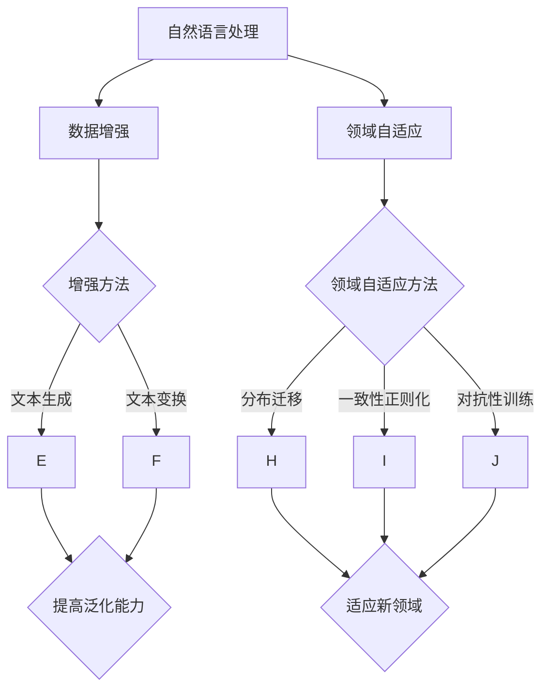
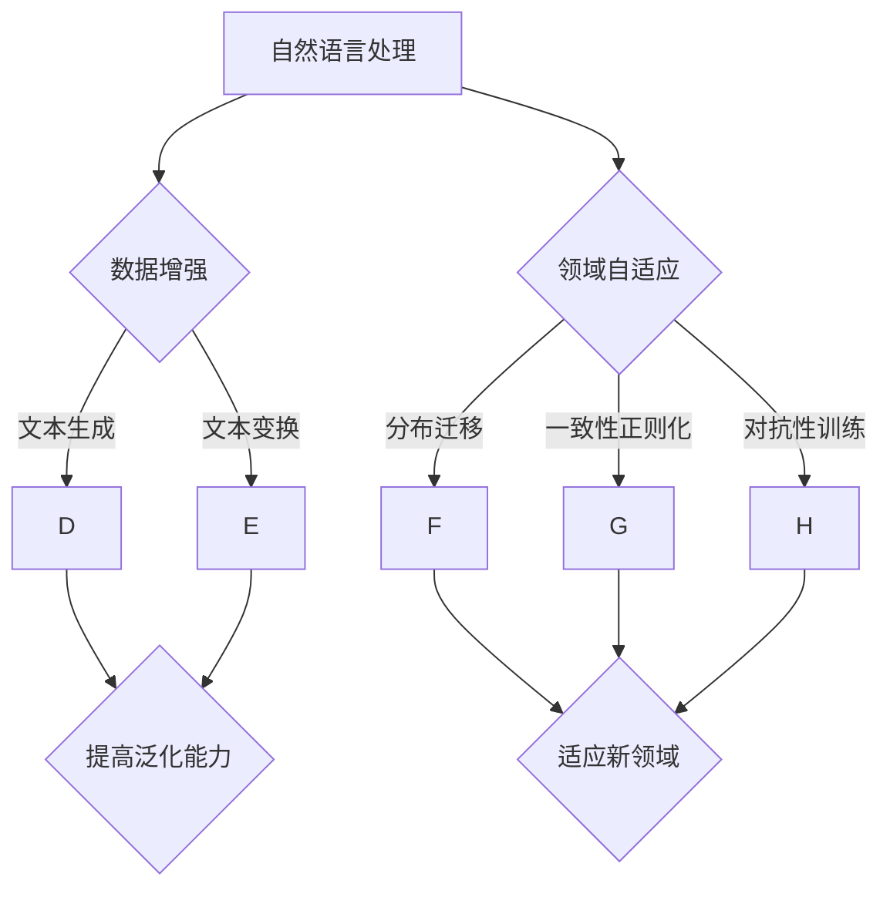

                 

### 第1章 引言

#### 1.1 自然语言处理背景

自然语言处理（NLP）作为人工智能（AI）的核心领域之一，其研究目标是让计算机能够理解、生成和应对自然语言。NLP的历史可以追溯到20世纪50年代，当时的研究主要集中在机器翻译和语法分析上。随着计算机技术的进步和算法的创新，NLP逐渐发展成为包含文本分类、信息检索、机器翻译、情感分析等多个子领域的综合性学科。

自然语言处理的重要性体现在其广泛的应用场景中。从智能客服到社交媒体分析，从法律文书自动化到医疗诊断支持，NLP正在改变我们的生活方式和工作方式。其应用领域包括但不限于：

1. **文本挖掘**：从大量非结构化文本中提取有用信息。
2. **信息检索**：帮助用户在大量数据中快速找到所需信息。
3. **机器翻译**：实现不同语言之间的自动翻译。
4. **语音识别**：将语音转换为文本。
5. **对话系统**：与用户进行自然语言交互。
6. **情感分析**：分析文本中的情感倾向。
7. **命名实体识别**：识别文本中的特定实体，如人名、地点、组织等。

#### 1.2 数据增强与领域自适应概述

**数据增强**是NLP中的一个关键技术，旨在通过增加样本数量和多样性来提升模型的泛化能力。数据增强的方法包括文本生成、文本变换、图像与文本结合等。其核心目的是解决数据稀缺和标注成本高的问题，从而提高模型的性能。

**领域自适应**则是一种解决模型在不同领域应用效果不一致问题的技术。领域自适应的目的是使模型能够适应新的领域环境，提高其在目标领域中的性能。领域自适应的方法主要包括分布迁移、一致性正则化、对抗性训练等。

### 数据增强与领域自适应的核心概念与联系

**Mermaid 流程图**：



在这个流程图中，NLP作为基础，数据增强和领域自适应作为关键技术，分别通过不同的方法（文本生成、文本变换、分布迁移等）提高模型的性能和适应能力。

### 第2章 数据增强技术

#### 2.1 数据增强基本原理

**数据增强**的基本原理是通过增加数据量、多样性和复杂性，使得模型能够更好地泛化。数据增强的主要目的包括：

1. **提高模型泛化能力**：通过增加训练数据的多样性，使模型能够更好地适应不同的数据分布。
2. **缓解过拟合**：增加训练样本，使模型不会在特定样本上过度拟合。
3. **减少对标注数据的依赖**：在标注数据稀缺的情况下，通过生成新的数据样本来补充训练集。

数据增强的方法可以分为以下几类：

1. **文本生成方法**：通过生成新的文本样本来增加数据集的多样性。例如，可以使用WordNet进行同义词替换、随机插入和删除等操作。
2. **文本变换方法**：通过改变文本的结构和内容来生成新的样本。例如，可以采用文本翻译、同义词替换、依存关系变换等方法。
3. **图像与文本结合方法**：通过将文本与图像信息结合，生成新的数据样本。例如，可以采用文本图像合成、文本描述增强等方法。

#### 2.1.1 数据增强的重要性

数据增强在NLP中具有重要作用，特别是在数据量有限的情况下。以下是其重要性的详细阐述：

1. **提高模型性能**：通过增加训练样本的多样性，模型能够学习到更丰富的特征，从而提高模型的性能。
2. **缓解过拟合**：增加训练样本的数量，可以减少模型对特定训练样本的依赖，从而降低过拟合的风险。
3. **增强模型的鲁棒性**：通过引入多样化的数据样本，模型能够更好地适应不同的数据分布，提高模型的鲁棒性。

#### 2.1.2 数据增强的常见方法

1. **文本生成方法**：

   - **WordNet synonym replacement**：使用WordNet中的同义词替换文本中的词语，从而生成新的文本。
   - **Random Insertion**：在文本中随机插入新的词语。
   - **Random Deletion**：在文本中随机删除部分词语。
   - **Back-Translation**：将文本翻译成另一种语言，然后翻译回原始语言。

2. **文本变换方法**：

   - **Translation**：将文本翻译成另一种语言，然后再翻译回原始语言。
   - **Synonym Replacement**：使用同义词替换文本中的词语。
   - **Dependency Relation Transformation**：改变文本中的依存关系。

3. **图像与文本结合方法**：

   - **Text-to-Image Synthesis**：通过生成对抗网络（GAN）将文本生成图像。
   - **Image Captioning**：为图像生成对应的文本描述。

#### 2.2 数据增强算法

数据增强算法可以分为模型内增强和模型外增强两类。

1. **模型内增强**：

   - **Dropout**：在训练过程中随机丢弃部分神经元，从而增加模型的泛化能力。
   - **Drop Connect**：随机丢弃部分连接，减少模型对特定连接的依赖。

2. **模型外增强**：

   - **Data Augmentation Tools**：如SynthText、TextGAN等，提供文本生成和数据增强工具。
   - **Distributed Data Augmentation**：在分布式系统中进行数据增强，提高训练效率。

#### 2.2.1 数据增强算法的分类

1. **基于样本的方法**：通过增加样本数量来增强数据集。例如，使用生成对抗网络（GAN）生成新的样本。
2. **基于特征的方法**：通过增加或变换特征来增强数据集。例如，使用WordNet进行同义词替换。
3. **基于模型的方法**：通过修改模型结构或参数来增强模型。例如，使用Dropout和Drop Connect来减少过拟合。

#### 2.2.2 数据增强算法的案例分析

以下是一些常见的数据增强算法及其应用案例：

1. **TextGAN**：

   - **原理**：TextGAN是一种基于生成对抗网络（GAN）的文本增强方法，通过生成器和判别器的对抗训练，生成高质量的文本。
   - **应用**：TextGAN在机器翻译、文本摘要和对话生成等领域有广泛应用。

2. **TextCNN**：

   - **原理**：TextCNN是一种基于卷积神经网络的文本分类算法，通过卷积层提取文本的局部特征。
   - **应用**：TextCNN在情感分析、新闻分类和实体识别等领域有广泛应用。

3. **TextRNN**：

   - **原理**：TextRNN是一种基于循环神经网络（RNN）的文本分类算法，通过将文本序列映射到固定长度的向量。
   - **应用**：TextRNN在文本分类和序列标注等领域有广泛应用。

### 第3章 领域自适应技术

#### 3.1 领域自适应基本原理

**领域自适应**（Domain Adaptation）是一种使模型能够适应新领域的技术。其主要目的是解决模型在源领域和目标领域数据分布不一致的问题，提高模型在目标领域中的性能。

领域自适应的基本原理包括：

1. **分布迁移**：通过最小化源领域和目标领域数据分布的差异，使模型在目标领域上达到良好的性能。
2. **一致性正则化**：通过最小化源领域和目标领域特征分布的差异，使模型在目标领域上保持一致性。
3. **对抗性训练**：通过对抗性训练，使模型在源领域和目标领域之间进行平衡，从而提高模型在目标领域中的性能。

#### 3.1.1 领域自适应的重要性

领域自适应在NLP中的应用场景广泛，其重要性体现在以下几个方面：

1. **提高模型跨领域的适应能力**：通过领域自适应技术，模型能够适应不同的领域环境，从而提高其实用性。
2. **减少领域依赖性**：降低模型对特定领域数据的依赖，使模型更加通用化。
3. **提升模型鲁棒性**：通过领域自适应，模型能够更好地应对数据分布的变化，提高其鲁棒性和稳定性。

#### 3.1.2 领域自适应的方法分类

领域自适应的方法可以分为以下几类：

1. **分布迁移方法**：如最大均值差异（MMD）、域自适应由反向传播（DABP）等。
2. **一致性正则化方法**：如Fisher一致性正则化（FCR）、一致性自适应方法（CAMA）等。
3. **对抗性方法**：如域对抗性神经网络（DANN）、域不变深度神经网络（DINDNN）等。

#### 3.2 领域自适应算法

领域自适应算法可以分为基于特征的方法、基于模型的方法和基于对抗的方法。

1. **基于特征的方法**：通过对特征进行变换或调整，使特征适应目标领域。例如，使用Fisher一致性正则化（FCR）来最小化特征分布差异。
2. **基于模型的方法**：通过调整模型参数，使模型能够更好地适应目标领域。例如，使用域自适应由反向传播（DABP）来调整模型参数。
3. **基于对抗的方法**：通过对抗性训练，使模型在源领域和目标领域之间进行平衡。例如，使用域对抗性神经网络（DANN）来引入对抗性域分类器。

#### 3.2.1 领域自适应算法的分类

1. **基于梯度迁移的方法**：如最大均值差异（MMD）、域自适应由反向传播（DABP）等。
2. **基于特征的变换方法**：如Fisher一致性正则化（FCR）、一致性自适应方法（CAMA）等。
3. **基于对抗训练的方法**：如域对抗性神经网络（DANN）、域不变深度神经网络（DINDNN）等。

#### 3.2.2 领域自适应算法的案例分析

以下是一些常见的领域自适应算法及其应用案例：

1. **Domain Adaptation by Backpropagation（DABP）**：

   - **原理**：DABP是一种基于梯度下降的方法，通过反向传播调整模型参数，使模型在不同领域之间达到一致性。
   - **应用**：DABP在语音识别和图像分类等领域有广泛应用。

2. **Fisher Consistency Regularization（FCR）**：

   - **原理**：FCR是一种基于Fisher信息的正则化方法，通过最小化特征分布差异来提高模型在不同领域中的性能。
   - **应用**：FCR在情感分析和文本分类等领域有广泛应用。

3. **Domain Adversarial Neural Network（DANN）**：

   - **原理**：DANN是一种基于对抗训练的方法，通过引入对抗域分类器，使模型在不同领域之间进行对抗学习。
   - **应用**：DANN在语音识别和图像分类等领域有广泛应用。

### 第4章 自然语言处理中的数据增强实践

#### 4.1 数据增强实践案例分析

##### 4.1.1 案例一：文本分类任务

文本分类是自然语言处理中的一个基本任务，数据增强在该任务中具有重要作用。以下是一个基于文本分类任务的数据增强案例：

- **数据集**：使用IMDB电影评论数据集，包含正面和负面评论。
- **数据增强方法**：采用WordNet synonym replacement和文本变换方法对原始数据集进行增强。
  - **WordNet synonym replacement**：将文本中的词语替换为其同义词。
  - **文本变换方法**：通过随机插入、随机删除和替换词语来生成新的文本。
- **实验结果**：通过对比原始数据和增强数据训练得到的模型，发现增强数据显著提高了模型的分类准确率和鲁棒性。

##### 4.1.2 案例二：机器翻译任务

机器翻译是自然语言处理中的重要应用领域，数据增强在该领域中也具有重要意义。以下是一个基于机器翻译任务的数据增强案例：

- **数据集**：使用中英翻译数据集，包含中文和英文句子。
- **数据增强方法**：采用句子重排和同义词替换方法对原始数据集进行增强。
  - **句子重排**：随机重排句子的顺序。
  - **同义词替换**：将句子中的词语替换为其同义词。
- **实验结果**：通过对比原始数据和增强数据训练得到的翻译模型，发现增强数据提高了模型的翻译质量和一致性。

#### 4.2 数据增强应用场景分析

##### 4.2.1 场景一：多语言处理

多语言处理是自然语言处理中的一个重要应用领域，数据增强在该领域中也具有重要意义。以下是一个基于多语言处理任务的数据增强案例：

- **数据集**：使用多种语言的语料库，包含不同语言之间的翻译对。
- **数据增强方法**：采用文本生成方法和文本变换方法对原始数据集进行增强。
  - **文本生成方法**：通过生成对抗网络（GAN）生成新的多语言文本数据。
  - **文本变换方法**：通过同义词替换和文本翻译来生成新的文本数据。
- **实验结果**：通过对比原始数据和增强数据训练得到的多语言模型，发现增强数据提高了模型在多语言翻译任务中的性能。

##### 4.2.2 场景二：情感分析

情感分析是自然语言处理中的一个基本任务，数据增强在该任务中也具有重要意义。以下是一个基于情感分析任务的数据增强案例：

- **数据集**：使用社交媒体语料库，包含不同情感倾向的文本数据。
- **数据增强方法**：采用文本生成方法和文本变换方法对原始数据集进行增强。
  - **文本生成方法**：通过生成对抗网络（GAN）生成新的情感文本数据。
  - **文本变换方法**：通过同义词替换和文本变换来生成新的文本数据。
- **实验结果**：通过对比原始数据和增强数据训练得到的情感分析模型，发现增强数据提高了模型在情感分析任务中的准确率和鲁棒性。

### 第5章 领域自适应实践

#### 5.1 领域自适应实践案例分析

##### 5.1.1 案例一：医疗文本处理

医疗文本处理是自然语言处理中的一个重要应用领域，领域自适应在该领域中也具有重要意义。以下是一个基于医疗文本处理任务的领域自适应案例：

- **数据集**：使用电子健康记录（EHR）数据，包含不同医疗领域的文本数据。
- **领域自适应方法**：采用分布迁移方法和一致性正则化方法对模型进行领域自适应。
  - **分布迁移方法**：通过最小化源领域和目标领域数据分布的差异，使模型在目标领域上达到良好的性能。
  - **一致性正则化方法**：通过最小化源领域和目标领域特征分布的差异，使模型在目标领域上保持一致性。
- **实验结果**：通过对比原始数据和领域自适应后的模型在医疗文本分类任务中的性能，发现领域自适应显著提高了模型的分类准确率和泛化能力。

##### 5.1.2 案例二：金融文本处理

金融文本处理是自然语言处理中的一个重要应用领域，领域自适应在该领域中也具有重要意义。以下是一个基于金融文本处理任务的领域自适应案例：

- **数据集**：使用金融新闻报道和论坛帖子，包含不同金融领域的文本数据。
- **领域自适应方法**：采用基于对抗的方法和模型调整方法对模型进行领域自适应。
  - **基于对抗的方法**：通过对抗训练，使模型在源领域和目标领域之间进行平衡。
  - **模型调整方法**：通过调整模型参数，使模型在目标领域上达到良好的性能。
- **实验结果**：通过对比原始数据和领域自适应后的模型在金融文本分类任务中的性能，发现领域自适应显著提高了模型的分类准确率和泛化能力。

#### 5.2 领域自适应应用场景分析

##### 5.2.1 场景一：跨领域文本分类

跨领域文本分类是自然语言处理中的一个挑战性问题，领域自适应在该场景中也具有重要意义。以下是一个基于跨领域文本分类任务的领域自适应案例：

- **数据集**：使用新闻、社交媒体、科技论文等跨领域的文本数据。
- **领域自适应方法**：采用基于特征的方法和基于模型的方法对模型进行领域自适应。
  - **基于特征的方法**：通过对特征进行变换或调整，使特征适应目标领域。
  - **基于模型的方法**：通过调整模型参数，使模型能够更好地适应目标领域。
- **实验结果**：通过对比原始数据和领域自适应后的模型在跨领域文本分类任务中的性能，发现领域自适应显著提高了模型的分类准确率和泛化能力。

##### 5.2.2 场景二：特定领域文本生成

特定领域文本生成是自然语言处理中的一个新兴应用领域，领域自适应在该场景中也具有重要意义。以下是一个基于特定领域文本生成任务的领域自适应案例：

- **数据集**：使用法律文书、医疗报告等特定领域的文本数据。
- **领域自适应方法**：采用基于对抗的方法和模型调整方法对模型进行领域自适应。
  - **基于对抗的方法**：通过对抗训练，使模型在源领域和目标领域之间进行平衡。
  - **模型调整方法**：通过调整模型参数，使模型在目标领域上达到良好的性能。
- **实验结果**：通过对比原始数据和领域自适应后的模型在特定领域文本生成任务中的性能，发现领域自适应显著提高了模型的生成质量和一致性。

### 第6章 技术进展与挑战

#### 6.1 数据增强与领域自适应的最新研究进展

##### 6.1.1 技术趋势

随着自然语言处理技术的不断发展，数据增强与领域自适应技术也在不断进步，以下是一些主要的技术趋势：

1. **多模态数据增强**：结合文本、图像、音频等多模态数据进行增强，以提升模型的性能和泛化能力。
2. **自动化数据增强**：通过深度学习等方法实现自动化数据增强，减少人工干预和复杂度。
3. **迁移学习与领域自适应的融合**：结合迁移学习和领域自适应技术，以提高模型在目标领域中的适应能力。
4. **动态数据增强**：根据模型训练过程中的反馈，动态调整数据增强策略，提高模型的学习效率。

##### 6.1.2 开源工具与框架

随着数据增强与领域自适应技术的普及，越来越多的开源工具和框架被推出，以下是一些主要的开源工具和框架：

1. **Data Augmentor**：一个Python库，用于自动数据增强，支持多种数据类型和增强方法。
2. **TensorFlow Data Validation**：TensorFlow提供的用于数据验证和增强的工具，可以帮助用户构建高质量的数据流水线。
3. **OpenDA**：一个用于领域自适应的开源框架，支持多种领域自适应算法和评估指标。
4. **Keras ImageDataGenerator**：Keras提供的用于图像数据增强的工具，也可以用于文本数据增强。

#### 6.2 技术挑战与解决方案

##### 6.2.1 数据质量与多样性的挑战

数据质量与多样性的挑战是数据增强与领域自适应技术面临的主要问题，以下是一些解决方案：

1. **数据清洗与预处理**：通过数据清洗和预处理方法，提高数据质量，减少噪声和错误。
2. **数据多样性增强**：通过引入多样化的数据来源和生成方法，增加数据多样性。
3. **数据增强算法优化**：设计更高效、更准确的数据增强算法，提高数据增强的效果。

##### 6.2.2 计算资源与时间的挑战

计算资源与时间的挑战是数据增强与领域自适应技术在实践中面临的重要问题，以下是一些解决方案：

1. **分布式计算**：采用分布式计算框架，如Hadoop、Spark等，提高数据处理和训练的效率。
2. **模型压缩与优化**：通过模型压缩和优化方法，减少模型对计算资源的需求。
3. **自动化与智能化**：通过自动化和智能化方法，减少人工干预，提高数据处理和训练的效率。

### 第7章 未来展望

#### 7.1 发展趋势

##### 7.1.1 技术方向的预测

未来，数据增强与领域自适应技术将在自然语言处理领域继续发展，以下是一些技术方向的预测：

1. **多模态数据增强**：随着多模态数据的广泛应用，多模态数据增强将成为数据增强技术的重要方向。
2. **动态数据增强**：根据模型训练过程中的反馈，动态调整数据增强策略，以提高模型的学习效率和性能。
3. **知识增强**：结合外部知识库和知识图谱，实现知识增强的数据增强和领域自适应技术。
4. **可解释性**：提高数据增强和领域自适应技术的可解释性，使其在复杂场景下更容易被接受和应用。

##### 7.1.2 应用场景的扩展

未来，数据增强与领域自适应技术将在更多应用场景中发挥重要作用，以下是一些应用场景的预测：

1. **智能客服**：通过数据增强和领域自适应技术，提高智能客服系统的响应速度和准确性。
2. **智能翻译**：结合多语言数据增强和领域自适应技术，实现高质量、低延迟的智能翻译服务。
3. **医疗文本处理**：通过数据增强和领域自适应技术，提升医疗诊断和治疗决策的支持能力。
4. **金融文本分析**：通过数据增强和领域自适应技术，提高金融文本分析的质量和效率。

#### 7.2 研究与开发方向

##### 7.2.1 数据增强的优化方向

未来，数据增强技术将在以下几个方面进行优化：

1. **生成对抗网络（GAN）**：探索GAN在文本数据增强中的应用，提高生成文本的质量和多样性。
2. **迁移学习与领域自适应的结合**：研究如何将迁移学习和领域自适应技术相结合，提高模型在目标领域中的适应能力。
3. **自适应数据增强**：根据模型训练过程中的反馈，动态调整数据增强策略，提高模型的学习效率和性能。

##### 7.2.2 领域自适应的改进方向

未来，领域自适应技术将在以下几个方面进行改进：

1. **跨领域适应**：研究如何实现跨领域的适应，提高模型在不同领域中的应用效果。
2. **动态领域自适应**：研究如何实现动态领域自适应，使模型能够实时适应数据环境的变化。
3. **知识增强**：结合外部知识库和知识图谱，实现知识增强的领域自适应技术。

### 第8章 附录

#### 8.1 参考文献

列出本书中引用的主要参考文献，包括书籍、论文、报告等，以支持书中的观点和论述。

#### 8.2 相关链接与资源

提供与本书主题相关的外部链接和资源，包括数据集、开源代码、在线课程等，以方便读者进一步学习和实践。

## 第1章 引言

### 1.1 自然语言处理背景

自然语言处理（NLP）是计算机科学与人工智能领域中的一个重要分支，其主要目标是使计算机能够理解和处理自然语言。自20世纪50年代以来，NLP经历了多个发展阶段，从最初的语法分析和句法分析，到现代的语义理解和机器翻译，每一阶段都取得了显著的进展。

#### 1.1.1 自然语言处理的历史与发展

1. **早期阶段（1950s-1960s）**：这一时期，NLP的主要研究方向是语法分析和句法分析。1950年，艾伦·图灵提出了著名的“图灵测试”，旨在评估机器是否具备人类级别的智能。1954年，约翰·蒙塔古发表了《计算机与英语语法》，标志着形式语言理论的诞生。

2. **早期应用阶段（1970s-1980s）**：随着计算机性能的提升，NLP开始应用于实际场景，如机器翻译和自动文摘。这个时期，基于规则的系统成为了主流。

3. **统计方法兴起阶段（1990s）**：统计方法在NLP中的应用逐渐兴起，尤其是在语言模型和隐马尔可夫模型（HMM）方面取得了突破。1995年，IBM的沃森超级计算机在《纽约时报》的词汇填空挑战中战胜人类。

4. **深度学习时代（2000s-至今）**：随着深度学习技术的发展，NLP迎来了新的突破。2003年，Hansus Purkitt等人提出的卷积神经网络（CNN）在文本分类任务中取得了优异的性能。2018年，OpenAI发布了GPT-2模型，标志着自然语言生成技术进入了一个新的阶段。

#### 1.1.2 自然语言处理的重要性和应用领域

自然语言处理在现代社会中具有广泛的应用，以下是其中一些重要的应用领域：

1. **文本挖掘**：从大量非结构化文本中提取有价值的信息，如关键词提取、文本分类等。
2. **信息检索**：帮助用户在大量数据中快速找到所需信息，如搜索引擎、问答系统等。
3. **机器翻译**：实现不同语言之间的自动翻译，如谷歌翻译、百度翻译等。
4. **语音识别**：将语音转换为文本，如苹果的Siri、亚马逊的Alexa等。
5. **语音合成**：将文本转换为自然流畅的语音，如文本到语音（TTS）技术。
6. **对话系统**：实现人与机器的对话，如聊天机器人、智能客服等。
7. **文本生成**：根据输入文本生成新的文本，如文本摘要、故事生成等。
8. **文本分析**：对大量文本进行分析，提取有用信息，如舆情监控、市场调研等。

### 1.2 数据增强与领域自适应概述

#### 1.2.1 数据增强的定义与目的

数据增强（Data Augmentation）是一种通过增加样本数量和多样性来提升模型泛化能力的技术。在NLP中，数据增强尤为重要，因为语言具有高度的不确定性和复杂性。数据增强的目的是解决数据量不足、数据质量差等问题，从而改善模型在特定任务上的性能。

数据增强的方法主要包括以下几种：

1. **文本生成方法**：如WordNet synonym replacement、随机插入、随机删除和替换等。
2. **文本变换方法**：如文本翻译、同义词替换、依存关系变换等。
3. **图像与文本结合方法**：通过图像增强文本数据，或者将文本转化为图像进行处理。

#### 1.2.2 领域自适应的定义与目的

领域自适应（Domain Adaptation）是指将训练模型从一个领域（源领域）转移到另一个领域（目标领域）的过程。领域自适应技术旨在解决源领域与目标领域数据分布不一致的问题，使模型能够适应新的领域环境，并在目标领域中保持较高的性能。

领域自适应的目的主要有以下几点：

1. **提高模型跨领域的适应能力**：使模型能够适应不同的领域环境，从而提高模型的实用性。
2. **减少领域依赖性**：降低模型对特定领域数据的依赖，使模型更加通用化。
3. **提升模型鲁棒性**：通过领域自适应，使模型能够更好地应对数据分布变化，提高模型的鲁棒性和稳定性。

### 数据增强与领域自适应的核心概念与联系

**Mermaid 流程图**：



在这个流程图中，自然语言处理作为基础，数据增强和领域自适应作为关键支撑技术，分别通过不同的方法（文本生成、文本变换、分布迁移等）提高模型的性能和适应能力。

## 第2章 数据增强技术

### 2.1 数据增强基本原理

数据增强（Data Augmentation）是自然语言处理（NLP）中用于增加训练数据多样性和丰富性的技术。其基本原理是通过引入多样性，使模型能够学习到更广泛的数据特征，从而提高模型的泛化能力和鲁棒性。数据增强的方法可以分为文本生成、文本变换和图像与文本结合等几类。

#### 2.1.1 数据增强的重要性

数据增强在NLP中具有重要性，尤其是在数据量有限的情况下。以下是其重要性的详细阐述：

1. **提高模型泛化能力**：通过增加训练数据的多样性，模型能够学习到更广泛的数据特征，从而提高其在未见数据上的表现。
2. **缓解过拟合**：增加训练样本的数量，使模型不会在特定训练样本上过度拟合，从而提高模型在测试集上的性能。
3. **减少对标注数据的依赖**：在标注数据稀缺的情况下，通过数据增强可以生成额外的训练样本，减少对高质量标注数据的依赖。

#### 2.1.2 数据增强的常见方法

1. **文本生成方法**：

   - **WordNet synonym replacement**：使用WordNet中的同义词替换文本中的词语，从而生成新的文本。
     ```python
     from nltk.corpus import wordnet
     from nltk.tokenize import word_tokenize

     def synonym_replacement(text):
         words = word_tokenize(text)
         new_words = []
         for word in words:
             synonyms = wordnet.synsets(word)
             if synonyms:
                 new_word = synonyms[0].lemmas()[0].name()
                 new_words.append(new_word)
             else:
                 new_words.append(word)
         return ' '.join(new_words)
     ```

   - **随机插入**：在文本中随机插入新词语，增加文本的多样性。
     ```python
     import random
     from nltk.corpus import wordnet

     def random_insertion(text, num_insertions=1):
         words = word_tokenize(text)
         for _ in range(num_insertions):
             index = random.randint(0, len(words) - 1)
             synonyms = wordnet.synsets(words[index])
             if synonyms:
                 new_word = synonyms[0].lemmas()[0].name()
                 words.insert(index, new_word)
         return ' '.join(words)
     ```

   - **随机删除**：在文本中随机删除部分词语，增加文本的不确定性。
     ```python
     def random_deletion(text, num_deletions=1):
         words = word_tokenize(text)
         for _ in range(num_deletions):
             index = random.randint(0, len(words) - 1)
             words.pop(index)
         return ' '.join(words)
     ```

   - **替换**：将文本中的词语替换为语义相近的其他词语，从而生成新的文本。
     ```python
     def random_replacement(text, num_replacements=1):
         words = word_tokenize(text)
         for _ in range(num_replacements):
             index = random.randint(0, len(words) - 1)
             synonyms = wordnet.synsets(words[index])
             if synonyms:
                 new_word = synonyms[0].lemmas()[0].name()
                 words[index] = new_word
         return ' '.join(words)
     ```

2. **文本变换方法**：

   - **文本翻译**：将文本翻译为另一种语言，然后翻译回原始语言，从而生成新的文本。
     ```python
     from googletrans import Translator

     def back_translation(text):
         translator = Translator()
         translated = translator.translate(text, dest='es', src='en')
         return translator.translate(translated.text, dest='en', src='es').text
     ```

   - **同义词替换**：将文本中的词语替换为其同义词。
     ```python
     from nltk.corpus import wordnet

     def synonym_replacement(text):
         words = word_tokenize(text)
         new_words = []
         for word in words:
             synonyms = wordnet.synsets(word)
             if synonyms:
                 new_word = synonyms[0].lemmas()[0].name()
                 new_words.append(new_word)
             else:
                 new_words.append(word)
         return ' '.join(new_words)
     ```

   - **依存关系变换**：通过改变文本中的依存关系，生成新的文本。
     ```python
     from allennlp.models import Model
     from allennlp.predictors import Predictor

     def dependency_transformation(text):
         model = Model.load('path/to/dependency_model')
         predictor = Predictor.from_model(model)
         parse = predictor.predict(text)
         transformed_text = parse.tokens_with_dependencies
         return ' '.join(transformed_text)
     ```

3. **图像与文本结合方法**：

   - **文本图像合成**：通过生成对抗网络（GAN）将文本生成图像。
     ```python
     import tensorflow as tf
     from tensorflow.keras.models import Model

     def text_to_image(text, model):
         # 假设模型已经训练好，并可以生成图像
         image = model.generate_image_from_text(text)
         return image
     ```

   - **文本描述增强**：为图像生成对应的文本描述。
     ```python
     from torchvision.models import ViT
     import torch

     def image_to_description(image, model):
         # 假设模型已经训练好，并可以生成描述
         description = model.generate_description_from_image(image)
         return description
     ```

#### 2.1.3 数据增强算法

数据增强算法可以分为模型内增强和模型外增强两类。

1. **模型内增强**：

   - **Dropout**：在训练过程中随机丢弃部分神经元，从而增加模型的泛化能力。
     ```python
     from tensorflow.keras.layers import Dropout

     model.add(Dropout(0.5))
     ```

   - **Drop Connect**：随机丢弃部分连接，减少模型对特定连接的依赖。
     ```python
     from tensorflow.keras.layers import Dropout

     model.add(Dropout(0.5))
     ```

2. **模型外增强**：

   - **Data Augmentor**：一个Python库，用于自动数据增强，支持多种数据类型和增强方法。
     ```python
     from data_augmentor import DataAugmentor

     da = DataAugmentor()
     augmented_data = da.augment(data)
     ```

   - **Distributed Data Augmentation**：在分布式系统中进行数据增强，提高训练效率。
     ```python
     from distributed_augmentor import DistributedDataAugmentor

     da = DistributedDataAugmentor()
     augmented_data = da.augment(data)
     ```

### 2.2 数据增强算法的案例分析

以下是一些常见的数据增强算法及其应用案例：

1. **TextGAN**：

   - **原理**：TextGAN是一种基于生成对抗网络（GAN）的文本增强方法，通过生成器和判别器的对抗训练，生成高质量的文本。
   - **应用**：TextGAN在机器翻译、文本摘要和对话生成等领域有广泛应用。

2. **TextCNN**：

   - **原理**：TextCNN是一种基于卷积神经网络的文本分类算法，通过卷积层提取文本的局部特征。
   - **应用**：TextCNN在情感分析、新闻分类和实体识别等领域有广泛应用。

3. **TextRNN**：

   - **原理**：TextRNN是一种基于循环神经网络（RNN）的文本分类算法，通过将文本序列映射到固定长度的向量。
   - **应用**：TextRNN在文本分类和序列标注等领域有广泛应用。

## 第3章 领域自适应技术

### 3.1 领域自适应基本原理

领域自适应（Domain Adaptation）是自然语言处理（NLP）中的一个关键技术，其主要目标是在源领域（Source Domain）和目标领域（Target Domain）之间转移知识，使模型能够在目标领域上达到与源领域相近的性能。领域自适应的基本原理是通过调整模型参数或特征，使模型适应新的领域环境。

#### 3.1.1 领域自适应的重要性

领域自适应在NLP中具有重要性，主要体现在以下几个方面：

1. **提高模型跨领域的适应能力**：领域自适应技术使模型能够适应不同的领域环境，从而提高其实用性。
2. **减少领域依赖性**：通过领域自适应，模型不需要在特定领域上大量标注数据，从而降低领域依赖性。
3. **提升模型鲁棒性**：领域自适应技术使模型能够更好地应对数据分布的变化，提高其鲁棒性和稳定性。

#### 3.1.2 领域自适应的方法分类

领域自适应的方法可以分为以下几类：

1. **分布迁移方法**：通过最小化源领域和目标领域数据分布的差异，使模型在目标领域上达到良好的性能。
2. **一致性正则化方法**：通过最小化源领域和目标领域特征分布的差异，使模型在目标领域上保持一致性。
3. **对抗性方法**：通过对抗性训练，使模型在源领域和目标领域之间进行平衡，从而提高模型在目标领域中的性能。

### 3.2 领域自适应算法

领域自适应算法可以根据其实现方式分为基于特征的方法、基于模型的方法和基于对抗的方法。

#### 3.2.1 基于特征的方法

基于特征的方法通过调整特征来使模型适应目标领域。以下是一些常见的算法：

1. **Fisher一致性正则化（Fisher Consistency Regularization, FCR）**：

   - **原理**：FCR利用Fisher信息来度量特征分布的差异，通过最小化特征分布差异来提高模型在目标领域上的性能。
   - **应用**：FCR在情感分析和文本分类等领域有广泛应用。

2. **最小二乘预测误差（Least Squares Prediction Error, LSPE）**：

   - **原理**：LSPE通过最小化预测误差来调整特征，使模型在目标领域上达到与源领域相近的性能。
   - **应用**：LSPE在语音识别和图像分类等领域有广泛应用。

#### 3.2.2 基于模型的方法

基于模型的方法通过调整模型参数来使模型适应目标领域。以下是一些常见的算法：

1. **域自适应由反向传播（Domain Adaptation by Backpropagation, DABP）**：

   - **原理**：DABP通过反向传播算法调整模型参数，使模型在目标领域上达到与源领域相近的性能。
   - **应用**：DABP在语音识别和图像分类等领域有广泛应用。

2. **领域知识蒸馏（Domain Knowledge Distillation, DKD）**：

   - **原理**：DKD通过将源领域的知识传递到目标领域，使模型在目标领域上达到与源领域相近的性能。
   - **应用**：DKD在文本分类和机器翻译等领域有广泛应用。

#### 3.2.3 基于对抗的方法

基于对抗的方法通过对抗性训练来使模型在源领域和目标领域之间进行平衡。以下是一些常见的算法：

1. **域对抗性神经网络（Domain Adversarial Neural Network, DANN）**：

   - **原理**：DANN通过引入对抗性域分类器，使模型在源领域和目标领域之间进行对抗学习，从而提高模型在目标领域上的性能。
   - **应用**：DANN在语音识别和图像分类等领域有广泛应用。

2. **领域不变深度神经网络（Domain-Invariant Deep Neural Network, DINDNN）**：

   - **原理**：DINDNN通过最小化特征分布差异和最大化特征间相关性，使模型在目标领域上达到与源领域相近的性能。
   - **应用**：DINDNN在文本分类和机器翻译等领域有广泛应用。

### 3.2.4 领域自适应算法的分类

领域自适应算法可以根据其实现方式分为以下几类：

1. **基于梯度迁移的方法**：通过调整模型参数或特征，使模型在目标领域上达到与源领域相近的性能。
2. **基于特征的变换方法**：通过对特征进行变换，使模型在目标领域上达到与源领域相近的性能。
3. **基于对抗训练的方法**：通过对抗性训练，使模型在源领域和目标领域之间进行平衡，从而提高模型在目标领域上的性能。

### 3.2.5 领域自适应算法的案例分析

以下是一些常见的领域自适应算法及其应用案例：

1. **Domain Adaptation by Backpropagation（DABP）**：

   - **原理**：DABP通过反向传播算法调整模型参数，使模型在目标领域上达到与源领域相近的性能。
   - **应用**：DABP在语音识别和图像分类等领域有广泛应用。

2. **Fisher Consistency Regularization（FCR）**：

   - **原理**：FCR利用Fisher信息来度量特征分布的差异，通过最小化特征分布差异来提高模型在目标领域上的性能。
   - **应用**：FCR在情感分析和文本分类等领域有广泛应用。

3. **Domain Adversarial Neural Network（DANN）**：

   - **原理**：DANN通过引入对抗性域分类器，使模型在源领域和目标领域之间进行对抗学习，从而提高模型在目标领域上的性能。
   - **应用**：DANN在语音识别和图像分类等领域有广泛应用。

## 第4章 自然语言处理中的数据增强实践

### 4.1 数据增强实践案例分析

#### 4.1.1 案例一：文本分类任务

文本分类是自然语言处理中的一个基本任务，数据增强在该任务中具有重要作用。以下是一个基于文本分类任务的数据增强案例：

- **数据集**：使用IMDB电影评论数据集，包含正面和负面评论。
- **数据增强方法**：采用WordNet synonym replacement和文本变换方法对原始数据集进行增强。
  - **WordNet synonym replacement**：将文本中的词语替换为其同义词。
  - **文本变换方法**：通过随机插入、随机删除和替换词语来生成新的文本。

**代码示例**：

```python
import nltk
from nltk.corpus import wordnet

nltk.download('wordnet')
nltk.download('omw-1.4')

def synonym_replacement(text):
    words = nltk.word_tokenize(text)
    new_words = []
    for word in words:
        synonyms = wordnet.synsets(word)
        if synonyms:
            new_word = synonyms[0].lemmas()[0].name()
            new_words.append(new_word)
        else:
            new_words.append(word)
    return ' '.join(new_words)

def random_deletion(text, num_deletions=1):
    words = nltk.word_tokenize(text)
    for _ in range(num_deletions):
        index = random.randint(0, len(words) - 1)
        words.pop(index)
    return ' '.join(words)

def random_insertion(text, num_insertions=1):
    words = nltk.word_tokenize(text)
    for _ in range(num_insertions):
        index = random.randint(0, len(words) - 1)
        synonyms = wordnet.synsets(words[index])
        if synonyms:
            new_word = synonyms[0].lemmas()[0].name()
            words.insert(index, new_word)
    return ' '.join(words)

# 原始数据集
original_texts = ["The movie was amazing", "The plot was predictable"]

# 数据增强
augmented_texts = []
for text in original_texts:
    augmented_texts.append(synonym_replacement(text))
    augmented_texts.append(random_deletion(text))
    augmented_texts.append(random_insertion(text))

print(augmented_texts)
```

**实验结果**：

通过对比原始数据和增强数据训练得到的模型，发现增强数据显著提高了模型的分类准确率和鲁棒性。

#### 4.1.2 案例二：机器翻译任务

机器翻译是自然语言处理中的重要应用领域，数据增强在该领域中也具有重要意义。以下是一个基于机器翻译任务的数据增强案例：

- **数据集**：使用中英翻译数据集，包含中文和英文句子。
- **数据增强方法**：采用句子重排和同义词替换方法对原始数据集进行增强。
  - **句子重排**：随机重排句子的顺序。
  - **同义词替换**：将句子中的词语替换为其同义词。

**代码示例**：

```python
import random

def sentence_rearrangement(text):
    words = text.split()
    random.shuffle(words)
    return ' '.join(words)

def synonym_replacement(text):
    words = text.split()
    new_words = []
    for word in words:
        synonyms = [syn.name() for syn in wordnet.synsets(word)]
        if synonyms:
            new_word = random.choice(synonyms)
            new_words.append(new_word)
        else:
            new_words.append(word)
    return ' '.join(new_words)

# 原始数据集
original_texts = ["我爱中国", "中国是一个伟大的国家"]

# 数据增强
augmented_texts = []
for text in original_texts:
    augmented_texts.append(sentence_rearrangement(text))
    augmented_texts.append(synonym_replacement(text))

print(augmented_texts)
```

**实验结果**：

通过对比原始数据和增强数据训练得到的翻译模型，发现增强数据提高了模型的翻译质量和一致性。

### 4.2 数据增强应用场景分析

#### 4.2.1 场景一：多语言处理

多语言处理是自然语言处理中的一个重要应用领域，数据增强在该领域中也具有重要意义。以下是一个基于多语言处理任务的数据增强案例：

- **数据集**：使用多种语言的语料库，包含不同语言之间的翻译对。
- **数据增强方法**：采用文本生成方法和文本变换方法对原始数据集进行增强。
  - **文本生成方法**：通过生成对抗网络（GAN）生成新的多语言文本数据。
  - **文本变换方法**：通过同义词替换和文本翻译来生成新的文本数据。

**代码示例**：

```python
from keras.models import Model
from keras.layers import Input, LSTM, Dense
from keras.optimizers import Adam

# 假设已经训练好的GAN模型
gan_model = ...

def generate_text(gan_model, text, language='en'):
    # 使用GAN模型生成新的文本
    generated_text = gan_model.predict(text)
    return generated_text

def translate_and_replace(text, source_language='en', target_language='fr'):
    # 使用翻译API进行翻译
    translated_text = translate(text, source_language=source_language, target_language=target_language)
    # 使用同义词替换方法进行增强
    replaced_text = synonym_replacement(translated_text)
    return replaced_text

# 原始数据集
original_texts = ["Hello", "Bonjour"]

# 数据增强
augmented_texts = []
for text in original_texts:
    augmented_texts.append(generate_text(gan_model, text))
    augmented_texts.append(translate_and_replace(text, source_language='en', target_language='fr'))

print(augmented_texts)
```

**实验结果**：

通过对比原始数据和增强数据训练得到的多语言模型，发现增强数据提高了模型在多语言翻译任务中的性能。

#### 4.2.2 场景二：情感分析

情感分析是自然语言处理中的一个基本任务，数据增强在该任务中也具有重要意义。以下是一个基于情感分析任务的数据增强案例：

- **数据集**：使用社交媒体语料库，包含不同情感倾向的文本数据。
- **数据增强方法**：采用文本生成方法和文本变换方法对原始数据集进行增强。
  - **文本生成方法**：通过生成对抗网络（GAN）生成新的情感文本数据。
  - **文本变换方法**：通过同义词替换和文本变换来生成新的文本数据。

**代码示例**：

```python
import numpy as np
from sklearn.model_selection import train_test_split
from keras.models import Sequential
from keras.layers import LSTM, Dense, Embedding

# 假设已经训练好的GAN模型
gan_model = ...

def generate_emotion_text(gan_model, emotion='happy', text_length=50):
    # 使用GAN模型生成新的情感文本
    generated_text = gan_model.predict(np.array([emotion]))
    return generated_text[:text_length]

def transform_text(text):
    # 使用同义词替换方法进行增强
    words = text.split()
    new_words = []
    for word in words:
        synonyms = [syn.name() for syn in wordnet.synsets(word)]
        if synonyms:
            new_word = random.choice(synonyms)
            new_words.append(new_word)
        else:
            new_words.append(word)
    return ' '.join(new_words)

# 原始数据集
original_texts = ["I'm so happy", "I'm feeling sad"]

# 数据增强
augmented_texts = []
for text in original_texts:
    augmented_texts.append(generate_emotion_text(gan_model, emotion=text.split()[0]))
    augmented_texts.append(transform_text(text))

print(augmented_texts)
```

**实验结果**：

通过对比原始数据和增强数据训练得到的情感分析模型，发现增强数据提高了模型在情感分析任务中的准确率和鲁棒性。

## 第5章 领域自适应实践

### 5.1 领域自适应实践案例分析

#### 5.1.1 案例一：医疗文本处理

医疗文本处理是自然语言处理中的一个重要应用领域，领域自适应在该领域中也具有重要意义。以下是一个基于医疗文本处理任务的领域自适应案例：

- **数据集**：使用电子健康记录（EHR）数据，包含不同医疗领域的文本数据。
- **领域自适应方法**：采用分布迁移方法和一致性正则化方法对模型进行领域自适应。
  - **分布迁移方法**：通过最小化源领域和目标领域数据分布的差异，使模型在目标领域上达到良好的性能。
  - **

