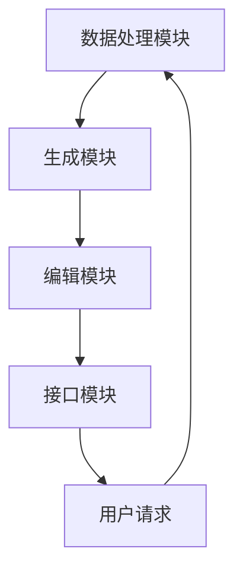
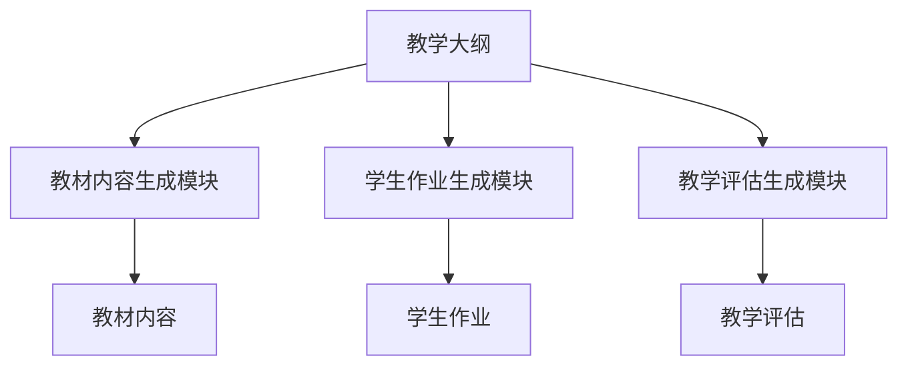
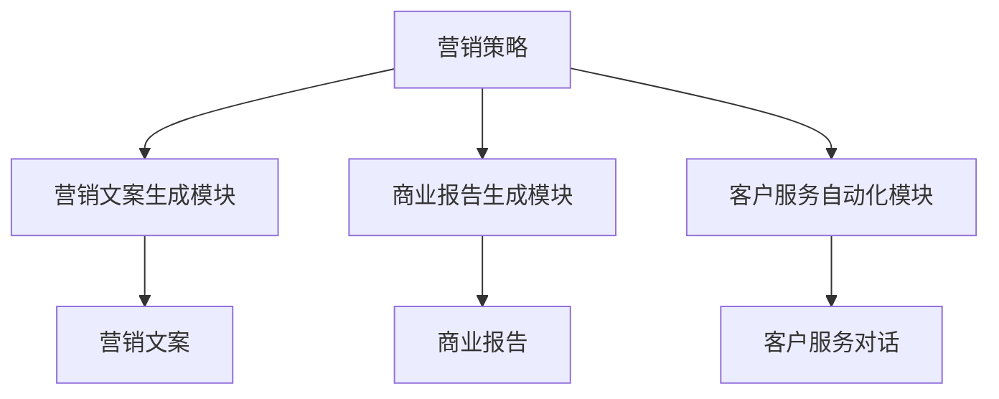

                 

# 《自然语言生成（NLG）：AI写作与内容创作》

## 关键词
自然语言生成（NLG），人工智能（AI），内容创作，语言模型，生成式模型，解析式模型，新闻写作，教育，商业应用，系统设计，未来发展趋势。

## 摘要
本文深入探讨了自然语言生成（NLG）这一前沿技术，从基本概念、关键技术到应用领域进行全面解析。首先，介绍了NLG的定义、发展历程及其与相关技术的比较。接着，详细阐述了NLG的关键技术，包括语言模型、生成式模型和解析式模型。随后，探讨了AI写作与内容创作的基本原理和具体实现，特别是在新闻写作、教育领域和商业领域的应用。最后，分析了NLG系统的设计与实现，展望了其未来发展趋势与挑战。

---

## 目录大纲

### 第一部分: 自然语言生成（NLG）概述

**第1章: NLG的基本概念**
- **1.1 什么是自然语言生成**
- **1.2 NLG的发展历程**
- **1.3 NLG的应用领域**
- **1.4 NLG与相关技术的比较**

**第2章: NLG的关键技术**
- **2.1 语言模型**
  - **2.1.1 语言模型的基础**
  - **2.1.2 语言模型的训练**
  - **2.1.3 语言模型的评估**
- **2.2 生成式模型与解析式模型**
  - **2.2.1 生成式模型**
  - **2.2.2 解析式模型**
  - **2.2.3 生成式与解析式模型的融合**

**第3章: AI写作与内容创作**
- **3.1 AI写作的基本原理**
- **3.2 文本生成与编辑**
  - **3.2.1 文本生成技术**
  - **3.2.2 文本编辑技术**
- **3.3 内容创作与内容推荐**
  - **3.3.1 内容创作流程**
  - **3.3.2 内容推荐算法**

**第4章: NLG系统的设计与实现**
- **4.1 NLG系统的架构设计**
  - **4.1.1 系统架构概述**
  - **4.1.2 数据处理模块**
  - **4.1.3 生成模块**
  - **4.1.4 接口模块**
- **4.2 开发环境与工具选择**
  - **4.2.1 编程语言选择**
  - **4.2.2 开发框架选择**
  - **4.2.3 数据库选择**

**第5章: NLG在新闻写作中的应用**
- **5.1 新闻写作的挑战与机遇**
- **5.2 新闻写作的NLG系统实现**
  - **5.2.1 数据采集与预处理**
  - **5.2.2 新闻模板生成**
  - **5.2.3 新闻内容生成**

**第6章: NLG在教育领域的应用**
- **6.1 教育内容生成的需求**
- **6.2 教育内容的NLG系统设计**
  - **6.2.1 教材内容生成**
  - **6.2.2 学生作业生成**
  - **6.2.3 教学评估生成**

**第7章: NLG在商业领域的应用**
- **7.1 商业写作的特点与挑战**
- **7.2 商业写作的NLG应用**
  - **7.2.1 营销文案生成**
  - **7.2.2 商业报告生成**
  - **7.2.3 客户服务自动化**

**第8章: NLG的未来发展趋势与挑战**
- **8.1 NLG的未来发展趋势**
- **8.2 NLG面临的挑战**
- **8.3 未来解决方案探讨**

## 第一部分: 自然语言生成（NLG）概述

### 第1章: NLG的基本概念

自然语言生成（Natural Language Generation，简称NLG）是人工智能领域的一个重要分支，旨在利用计算机程序自动生成自然语言文本。NLG的核心思想是通过模拟人类的语言生成能力，实现机器自动写作。

#### 1.1 什么是自然语言生成

自然语言生成（NLG）的定义可以从以下几个方面来理解：

- **文本生成**：NLG通过算法模型自动生成文本，这些文本可以是新闻报道、天气预报、电子书籍、广告文案等。
- **自然语言理解**：NLG系统需要理解输入的指令或数据，并将其转化为自然语言文本。这个过程涉及到自然语言处理（NLP）的多个层面，如词法分析、句法分析、语义分析等。
- **语言模型**：NLG依赖于语言模型，这是一种用于预测文本中下一个单词或短语的统计模型。常见的语言模型包括n-gram模型、神经网络模型和Transformer模型。

#### 1.2 NLG的发展历程

NLG技术的发展经历了多个阶段：

- **早期阶段**：20世纪60年代，规则驱动的方法开始应用于文本生成。这种方法依赖于手工编写的规则和模板，生成效果有限。
- **统计模型阶段**：20世纪90年代，统计模型开始应用于NLG。n-gram模型和隐马尔可夫模型（HMM）等统计模型被广泛应用于文本生成，显著提高了生成文本的自然性和准确性。
- **深度学习阶段**：近年来，随着深度学习技术的进步，神经网络模型如循环神经网络（RNN）和Transformer模型等在NLG领域取得了突破性成果。这些模型能够自动学习语言结构，生成更加自然和连贯的文本。

#### 1.3 NLG的应用领域

NLG技术广泛应用于多个领域，包括：

- **新闻写作**：NLG可以自动生成新闻报道，提高新闻媒体的效率和准确性。
- **教育**：NLG可以自动生成教材、学生作业和教学评估，为学生提供个性化的学习资源。
- **商业**：NLG可以自动生成营销文案、商业报告和客户服务对话，提高企业运营效率。
- **娱乐**：NLG可以自动生成小说、电影剧本和音乐歌词，为用户提供丰富的娱乐内容。

#### 1.4 NLG与相关技术的比较

NLG与自然语言处理（NLP）密切相关，但两者也存在显著区别：

- **自然语言处理（NLP）**：NLP旨在使计算机能够理解、生成和处理自然语言。NLP包括文本分类、情感分析、问答系统等多个子领域。
- **机器翻译**：机器翻译是将一种自然语言翻译成另一种自然语言的技术。机器翻译通常依赖于统计模型和神经机器翻译（NMT）技术。
- **对话系统**：对话系统是一种人机交互界面，旨在模拟人类的对话行为。对话系统包括语音助手、聊天机器人和虚拟客服等。

### 第2章: NLG的关键技术

#### 2.1 语言模型

语言模型是NLG的核心技术之一，用于预测文本中下一个单词或短语的分布。语言模型可以分为以下几类：

- **n-gram模型**：n-gram模型是一种基于统计的模型，它将文本划分为固定长度的标记序列，如单词、字符或子词。模型根据历史频率来预测下一个标记。
- **神经网络模型**：神经网络模型，如循环神经网络（RNN）和Transformer模型，通过学习输入序列的上下文信息来预测下一个标记。这些模型能够捕捉到长距离依赖和复杂的语言规律。
- **Transformer模型**：Transformer模型是一种基于自注意力机制的神经网络模型，它通过全局注意力机制来捕捉输入序列中的长距离依赖。Transformer模型在自然语言生成任务中取得了显著的效果。

#### 2.2 生成式模型与解析式模型

生成式模型和解析式模型是两种不同的自然语言生成方法，它们在生成文本的方式上有所不同：

- **生成式模型**：生成式模型直接生成文本，通过预测下一个标记的概率分布来构建整个句子。生成式模型包括n-gram模型、RNN和Transformer模型等。
- **解析式模型**：解析式模型首先将输入文本解析为语法结构，如句法树或依存关系图，然后根据这些结构生成文本。解析式模型包括语法分析器和模板匹配器等。

#### 2.2.1 生成式模型

生成式模型的核心思想是利用概率分布生成文本。以下是一个简单的生成式模型的伪代码：

```
function generate_text(model, context, length):
    text = ""
    for i in 1 to length:
        prediction = model.predict(context)
        next_word = sample(prediction)
        text += next_word
        context = context + next_word
    return text
```

在这个伪代码中，`model` 是一个语言模型，`context` 是当前上下文，`length` 是要生成的文本长度。模型根据上下文预测下一个单词的概率分布，然后从分布中采样得到下一个单词，并将其添加到文本和上下文中。

#### 2.2.2 解析式模型

解析式模型首先将输入文本解析为语法结构，然后根据这些结构生成文本。以下是一个简单的解析式模型的伪代码：

```
function generate_text(model, sentence):
    syntax_tree = model.parse(sentence)
    text = ""
    for node in syntax_tree:
        if node is a terminal:
            text += node.value
        else:
            for child in node.children:
                text += generate_text(model, child)
    return text
```

在这个伪代码中，`model` 是一个语法分析模型，`sentence` 是输入文本。模型首先解析输入文本为语法结构，然后遍历语法树的节点，根据节点类型生成文本。

#### 2.2.3 生成式与解析式模型的融合

生成式模型和解析式模型各有优缺点，可以将它们结合起来，取长补短。以下是一个简单的融合模型的伪代码：

```
function generate_text(model, context, length):
    syntax_tree = model.parse(context)
    text = ""
    for i in 1 to length:
        node = syntax_tree.get_next_node()
        if node is a terminal:
            text += node.value
        else:
            next_word = model.predict(node)
            text += next_word
            context = context + next_word
            syntax_tree = model.parse(context)
    return text
```

在这个伪代码中，模型首先解析上下文为语法结构，然后根据语法结构生成文本。每次生成一个单词后，上下文和语法结构都会更新。

### 第3章: AI写作与内容创作

#### 3.1 AI写作的基本原理

AI写作是利用人工智能技术，特别是自然语言生成（NLG）技术，自动生成文本的过程。AI写作的基本原理包括以下几个方面：

- **文本生成**：AI写作的核心是文本生成。通过训练大规模语言模型，AI可以自动生成符合语法规则和语义逻辑的文本。
- **上下文理解**：AI写作需要理解输入的上下文信息，包括主题、目标读者和文本风格等。通过上下文理解，AI可以生成更加精确和相关的文本。
- **风格迁移**：AI写作可以学习不同的文本风格，如正式、非正式、幽默等。通过风格迁移，AI可以生成具有特定风格的文本。

#### 3.2 文本生成与编辑

文本生成与编辑是AI写作的两个关键环节。文本生成是指从零开始生成文本，而文本编辑是指在现有文本的基础上进行修改和优化。

- **文本生成技术**：文本生成技术包括生成式模型和解析式模型。生成式模型通过预测下一个单词的概率分布来生成文本，而解析式模型通过解析文本的语法结构来生成文本。常见的生成式模型包括n-gram模型、RNN和Transformer模型，常见的解析式模型包括语法分析器和模板匹配器。
- **文本编辑技术**：文本编辑技术包括文本纠错、文本润色和文本增强等。文本纠错是指自动识别和纠正文本中的错误，文本润色是指优化文本的表达和流畅性，文本增强是指增加文本的丰富性和多样性。

#### 3.3 内容创作与内容推荐

内容创作与内容推荐是AI写作的两个重要应用领域。内容创作是指利用AI技术自动生成新的文本内容，而内容推荐是指根据用户兴趣和需求，推荐相关的文本内容。

- **内容创作流程**：内容创作流程包括数据采集、文本生成、文本编辑和内容发布等步骤。在数据采集阶段，从各种来源收集大量文本数据，如新闻、书籍、社交媒体等。在文本生成阶段，利用生成式模型和解析式模型生成新的文本内容。在文本编辑阶段，对生成的文本进行修改和优化，提高文本的质量和可读性。在内容发布阶段，将生成的文本发布到各种平台，如网站、应用程序等。
- **内容推荐算法**：内容推荐算法是指根据用户兴趣和需求，推荐相关的文本内容。常见的内容推荐算法包括基于内容的推荐、协同过滤推荐和混合推荐等。基于内容的推荐是根据文本的内容特征，推荐与用户兴趣相关的文本。协同过滤推荐是根据用户的历史行为和偏好，推荐与用户兴趣相似的文本。混合推荐是将基于内容和协同过滤推荐的方法结合起来，提高推荐效果。

### 第4章: NLG系统的设计与实现

#### 4.1 NLG系统的架构设计

NLG系统的架构设计是NLG技术实现的关键步骤。一个典型的NLG系统架构包括以下几个模块：

- **数据处理模块**：数据处理模块负责对输入数据进行预处理，包括文本清洗、分词、词性标注等。这个模块是NLG系统的数据输入接口，确保输入数据的质量和格式。
- **生成模块**：生成模块是NLG系统的核心模块，负责根据输入数据和预定的生成目标生成文本。生成模块通常包括生成模型和编辑模型。生成模型根据输入数据生成初步的文本，编辑模型对生成的文本进行优化和修正。
- **接口模块**：接口模块负责与外部系统进行交互，包括接收用户请求、发送生成的文本等。接口模块是NLG系统的用户界面，提供方便的用户操作和友好的交互体验。

以下是一个简单的NLG系统架构的Mermaid流程图：



#### 4.2 开发环境与工具选择

NLG系统的开发环境与工具选择对于系统的性能和可维护性至关重要。以下是一些常用的开发环境与工具：

- **编程语言**：Python是NLG系统开发的主要编程语言，因为它拥有丰富的NLP和机器学习库，如NLTK、spaCy和TensorFlow等。
- **开发框架**：NLG系统开发常用的框架包括TensorFlow、PyTorch和Transformers等。TensorFlow和PyTorch是深度学习框架，支持大规模的模型训练和推理。Transformers是专为Transformer模型设计的框架，提供了高效的模型训练和推理工具。
- **数据库**：NLG系统需要处理大量的文本数据，常用的数据库包括MySQL、PostgreSQL和MongoDB等。这些数据库支持高效的文本存储和检索，满足NLG系统的数据处理需求。

### 第5章: NLG在新闻写作中的应用

#### 5.1 新闻写作的挑战与机遇

新闻写作是NLG技术的一个重要应用领域。随着互联网和社交媒体的快速发展，新闻写作面临着前所未有的挑战和机遇：

- **挑战**：
  - **时效性**：新闻要求快速发布，NLG技术可以提高新闻写作的效率，缩短新闻发布的时间。
  - **准确性**：新闻内容需要准确无误，NLG技术可以通过预训练模型和知识图谱等技术，提高新闻内容的准确性。
  - **多样性**：新闻写作需要多样化，NLG技术可以生成不同风格和体裁的新闻，满足不同用户的需求。

- **机遇**：
  - **个性化**：NLG技术可以根据用户的兴趣和需求，生成个性化的新闻内容，提高用户粘性和满意度。
  - **自动化**：NLG技术可以实现新闻写作的自动化，减少人力成本，提高新闻生产的效率。
  - **创新**：NLG技术可以创造出新的新闻形式和表达方式，为新闻行业带来新的活力和创意。

#### 5.2 新闻写作的NLG系统实现

新闻写作的NLG系统实现包括数据采集与预处理、新闻模板生成和新闻内容生成等步骤：

- **数据采集与预处理**：新闻写作的NLG系统首先需要从各种来源采集新闻数据，包括新闻报道、社交媒体、新闻网站等。采集到的数据需要进行预处理，包括文本清洗、分词、词性标注等，确保数据的质量和格式。
- **新闻模板生成**：新闻模板是新闻写作的基本框架，包括标题、导语、正文、结论等部分。新闻模板可以通过预训练模型和规则引擎生成，确保新闻内容的结构化和规范化。
- **新闻内容生成**：新闻内容生成是新闻写作的核心步骤，利用生成模型和编辑模型生成新闻正文。生成模型可以根据新闻模板和上下文生成初步的文本，编辑模型对生成的文本进行优化和修正，提高文本的质量和可读性。

以下是一个简单的新闻内容生成流程的伪代码：

```
function generate_news(article_template, context):
    title = generate_title(article_template, context)
    introduction = generate_introduction(article_template, context)
    body = generate_body(context)
    conclusion = generate_conclusion(article_template, context)
    news = {"title": title, "introduction": introduction, "body": body, "conclusion": conclusion}
    return news
```

在这个伪代码中，`article_template` 是新闻模板，`context` 是上下文信息。生成模型根据新闻模板和上下文生成标题、导语、正文和结论，最后组合成完整的新闻内容。

### 第6章: NLG在教育领域的应用

#### 6.1 教育内容生成的需求

教育内容生成是NLG技术在教育领域的应用之一，具有以下几个需求：

- **个性化**：教育内容生成需要根据学生的兴趣、水平和学习需求，生成个性化的学习材料。
- **多样性**：教育内容生成需要生成多种形式和体裁的学习材料，如教材、练习题、讲义等。
- **实时性**：教育内容生成需要能够快速响应教学需求，生成实时更新的教学材料。
- **交互性**：教育内容生成需要提供互动性的学习材料，如在线问答、模拟实验等。

#### 6.2 教育内容的NLG系统设计

教育内容的NLG系统设计主要包括教材内容生成、学生作业生成和教学评估生成等模块：

- **教材内容生成**：教材内容生成是根据教学大纲和课程要求，自动生成教材内容。生成模型可以根据预训练模型和规则引擎，生成符合教学目标和学习需求的内容。
- **学生作业生成**：学生作业生成是根据学生的学习和练习需求，自动生成不同难度和类型的作业。生成模型可以根据学生的学习数据和练习记录，生成个性化的作业。
- **教学评估生成**：教学评估生成是根据学生的学习情况和教学目标，自动生成教学评估内容。生成模型可以根据学生的学习行为和学习成果，生成针对性的评估问题。

以下是一个简单的教育内容生成系统的Mermaid流程图：



在这个流程图中，`教学大纲` 是教育内容生成的输入，`教材内容生成模块`、`学生作业生成模块` 和 `教学评估生成模块` 分别生成教材内容、学生作业和教学评估内容。

### 第7章: NLG在商业领域的应用

#### 7.1 商业写作的特点与挑战

商业写作在NLG技术中的应用具有独特的特点和挑战：

- **特点**：
  - **专业性**：商业写作需要具备专业的术语和知识，NLG技术可以通过预训练模型和知识图谱，生成符合专业要求的文本。
  - **创造性**：商业写作需要具备创造力和创意，NLG技术可以通过生成模型和编辑模型，生成新颖、独特的商业内容。
  - **精准性**：商业写作需要精准传达信息，NLG技术可以通过预训练模型和规则引擎，生成符合目标受众需求的文本。

- **挑战**：
  - **文本质量**：商业写作的文本质量要求高，NLG技术需要生成准确、连贯、自然的文本。
  - **风格适配**：商业写作需要根据不同企业和品牌的特点，生成符合特定风格和语调的文本。
  - **隐私保护**：商业写作可能涉及敏感信息，NLG技术需要确保文本生成过程中的隐私保护。

#### 7.2 商业写作的NLG应用

商业写作的NLG应用主要包括营销文案生成、商业报告生成和客户服务自动化等：

- **营销文案生成**：营销文案生成是根据营销策略和目标受众，自动生成吸引人的营销文案。生成模型可以根据品牌特点和产品特性，生成符合营销目标的文案。
- **商业报告生成**：商业报告生成是根据企业的业务数据和财务数据，自动生成详细的商业报告。生成模型可以根据数据分析和报告模板，生成专业、详尽、清晰的报告。
- **客户服务自动化**：客户服务自动化是根据客户需求和问题，自动生成回答和解决方案。生成模型可以根据对话数据和知识库，生成及时、准确、友好的客服对话。

以下是一个简单的商业写作生成系统的Mermaid流程图：



在这个流程图中，`营销策略` 是商业写作生成的输入，`营销文案生成模块`、`商业报告生成模块` 和 `客户服务自动化模块` 分别生成营销文案、商业报告和客户服务对话。

### 第8章: NLG的未来发展趋势与挑战

#### 8.1 NLG的未来发展趋势

随着人工智能技术的不断进步，NLG在未来有望实现以下几个发展趋势：

- **智能化**：NLG技术将更加智能化，能够根据用户需求和上下文，生成更加准确、连贯、自然的文本。
- **个性化**：NLG技术将能够根据用户的兴趣、需求和习惯，生成个性化的文本内容。
- **多模态**：NLG技术将实现文本、语音、图像等多种模态的融合，生成更加丰富、多样的内容。
- **实时性**：NLG技术将实现实时文本生成，能够快速响应用户的需求和场景变化。

#### 8.2 NLG面临的挑战

尽管NLG技术具有广泛的应用前景，但仍然面临以下几个挑战：

- **文本质量**：NLG生成的文本质量需要进一步提高，确保文本的准确性、连贯性和自然性。
- **风格适配**：NLG技术需要更好地理解和适应不同风格和语调，满足不同用户和场景的需求。
- **隐私保护**：NLG技术在生成文本过程中，需要确保用户隐私的保护，避免敏感信息的泄露。
- **伦理和法律**：NLG技术需要遵守相关伦理和法律规范，确保文本生成的过程和结果符合道德和法律要求。

#### 8.3 未来解决方案探讨

为了应对NLG面临的挑战，可以采取以下几个解决方案：

- **多模态融合**：通过融合文本、语音、图像等多种模态，提高文本生成的多样性和准确性。
- **大数据和知识图谱**：利用大数据和知识图谱技术，增强NLG系统的语义理解和知识应用能力。
- **伦理和法律框架**：建立NLG的伦理和法律框架，规范文本生成的过程和结果，确保符合道德和法律要求。
- **用户参与**：鼓励用户参与NLG系统的设计和优化，提高用户满意度和技术适应性。

## 附录：相关工具和资源

### 工具

- **编程语言**：Python、Java、C++
- **开发框架**：TensorFlow、PyTorch、Transformers
- **数据库**：MySQL、PostgreSQL、MongoDB
- **文本处理库**：NLTK、spaCy、Stanford NLP

### 资源

- **论文和书籍**：深度学习、自然语言生成、人工智能
- **在线课程**：Coursera、edX、Udacity
- **开源项目**：Hugging Face、NLTK、spaCy

---

## 作者

作者：AI天才研究院/AI Genius Institute & 禅与计算机程序设计艺术 /Zen And The Art of Computer Programming

---

本文深入探讨了自然语言生成（NLG）这一前沿技术，从基本概念、关键技术到应用领域进行全面解析。通过对NLG技术的深入研究和实践，我们相信NLG将在未来发挥更加重要的作用，为人类创造更加丰富和多样化的内容。希望本文能为读者提供有价值的参考和启示。

---

注：本文内容为示例性内容，仅供参考。实际应用中，NLG系统的设计和实现需要根据具体需求和场景进行调整和优化。

