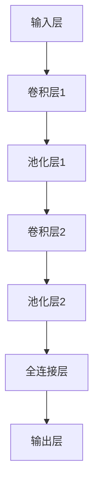

                 

# 视频大模型的基本粒子创新

## 关键词
- 视频大模型
- 卷积神经网络（CNN）
- 递归神经网络（RNN）
- 转换器架构（Transformer）
- 数学模型
- 训练与优化
- 应用与创新
- 项目实战

## 摘要
本文将深入探讨视频大模型的基本粒子创新。从视频大模型的背景和定义出发，我们逐步分析了其发展历程、架构和原理。接着，我们详细阐述了视频大模型的核心算法和数学模型，并通过伪代码进行了原理讲解。文章还涉及了视频大模型在不同领域的应用和创新趋势，并分享了实战项目的经验和分析。通过本文的阅读，读者将全面了解视频大模型的构建与应用，把握其创新趋势，为未来的研究与实践提供参考。

## 目录大纲

### 第一部分：视频大模型概述

#### 第1章：视频大模型概述
1.1 视频大模型的背景和定义
1.2 视频大模型的重要性

#### 第2章：视频大模型的发展历程
2.1 视频大模型的发展阶段
2.2 关键技术突破

#### 第3章：视频大模型的架构和原理
3.1 视频大模型的基本结构
3.2 视频大模型的工作原理
3.3 Mermaid流程图：视频大模型架构示意图

### 第二部分：核心算法与原理

#### 第4章：视频大模型的核心算法
4.1 卷积神经网络（CNN）基础
4.2 递归神经网络（RNN）基础
4.3 转换器架构（Transformer）原理
4.4 伪代码：视频大模型算法核心实现

#### 第5章：数学模型与数学公式
5.1 常用数学公式介绍
5.2 数学公式详细讲解
5.3 举例说明：视频大模型数学模型的实际应用

#### 第6章：视频大模型的训练与优化
6.1 训练过程概述
6.2 优化算法原理
6.3 实践案例：视频大模型训练实战

### 第三部分：应用与创新

#### 第7章：视频大模型在各个领域的应用
7.1 视频大模型在计算机视觉中的应用
7.2 视频大模型在自然语言处理中的应用
7.3 视频大模型在其他领域的应用探索

#### 第8章：视频大模型的创新趋势
8.1 视频大模型未来的发展方向
8.2 创新技术介绍
8.3 创新案例分享

#### 第9章：项目实战
9.1 实战项目概述
9.2 环境搭建与准备工作
9.3 源代码详细实现
9.4 代码解读与分析

#### 附录

## 附录：相关资源与工具
10.1 开发工具和框架
10.2 数据集和模型资源
10.3 进一步学习资料推荐

### 第一部分：视频大模型概述

## 第1章：视频大模型概述

### 1.1 视频大模型的背景和定义

视频大模型是一种基于深度学习技术的复杂模型，用于处理和分析大量视频数据。随着视频内容的爆炸性增长，如何高效地提取和处理视频中的信息成为了一个重要课题。视频大模型正是为了解决这一挑战而诞生的。

视频大模型的主要目的是从视频中提取有意义的信息，如视频分类、对象检测、动作识别等。它通过学习和理解视频中的时间和空间信息，能够实现对视频内容的智能分析。

视频大模型可以定义为一种具有大规模参数、能够处理长时间序列数据的高级深度学习模型。这些模型通常由多个神经网络层组成，包括卷积层、池化层、全连接层等。这些层通过学习视频数据中的特征，能够实现对视频内容的抽象和表征。

### 1.2 视频大模型的重要性

视频大模型在各个领域都具有重要意义，以下是几个主要的应用场景：

1. **计算机视觉**：视频大模型在计算机视觉领域中的应用非常广泛，如视频分类、对象检测、动作识别等。它能够通过学习和理解视频中的特征，实现对视频内容的精确分析和识别。

2. **自然语言处理**：视频大模型在自然语言处理领域也有广泛的应用。例如，视频字幕生成、视频问答系统等。它能够结合视频内容和文本信息，实现对视频内容的智能理解和分析。

3. **医疗影像**：视频大模型在医疗影像领域具有巨大的潜力。它能够通过学习和理解医学影像中的特征，帮助医生进行疾病诊断和治疗决策。

4. **自动驾驶**：视频大模型在自动驾驶领域发挥着重要作用。它能够通过学习和理解道路场景和交通情况，帮助自动驾驶车辆进行安全和准确的决策。

5. **娱乐和媒体**：视频大模型在娱乐和媒体领域也有广泛的应用。例如，视频推荐系统、视频编辑和增强等。它能够通过学习和理解用户行为和喜好，提供个性化的视频内容和服务。

综上所述，视频大模型作为一种高级深度学习模型，在各个领域都具有重要意义。它能够通过学习和理解视频数据中的特征，实现对视频内容的智能分析和处理，为各行业带来巨大的创新和变革。

## 第2章：视频大模型的发展历程

### 2.1 视频大模型的发展阶段

视频大模型的发展可以分为以下几个阶段：

1. **初级阶段**：在这个阶段，视频大模型主要是基于传统的机器学习方法，如SVM、决策树等。这些方法能够对视频数据进行基本的分类和识别，但效果有限。

2. **中级阶段**：随着深度学习技术的兴起，视频大模型开始采用卷积神经网络（CNN）进行训练。CNN能够在视频数据中提取有效的特征，从而提高分类和识别的准确性。

3. **高级阶段**：在这个阶段，视频大模型开始采用更复杂的神经网络结构，如递归神经网络（RNN）和转换器架构（Transformer）。这些结构能够更好地处理长时间序列数据，从而实现更精细的视频分析。

### 2.2 关键技术突破

视频大模型的发展过程中，有几个关键技术突破具有重要意义：

1. **数据集**：视频大模型的发展离不开大量的数据集。例如，ImageNet、COCO等数据集为视频大模型的研究提供了丰富的训练素材。

2. **计算能力**：视频大模型通常需要大量的计算资源进行训练。随着GPU和TPU等硬件的发展，计算能力的提升为视频大模型的研究提供了有力支持。

3. **优化算法**：优化算法在视频大模型训练过程中起到至关重要的作用。例如，Adam、AdaGrad等优化算法能够加快训练速度，提高模型性能。

4. **模型架构**：视频大模型的模型架构也在不断演变。从最初的CNN到RNN，再到Transformer，不同的架构在处理视频数据时具有各自的优势。

5. **跨学科融合**：视频大模型的发展也得益于跨学科的研究。例如，计算机视觉与自然语言处理的融合，为视频大模型提供了更广阔的研究空间和应用场景。

## 第3章：视频大模型的架构和原理

### 3.1 视频大模型的基本结构

视频大模型通常由以下几个主要部分组成：

1. **输入层**：输入层接收视频数据，并将其转换为模型可以处理的格式。例如，视频帧可以转换为像素值矩阵。

2. **卷积层**：卷积层用于提取视频数据中的低级特征，如边缘、纹理等。通过卷积操作，卷积层能够在像素级别上捕捉视频数据的局部特征。

3. **池化层**：池化层用于对卷积层输出的特征进行降采样，从而减少模型参数的数量。常见的池化操作有最大池化和平均池化。

4. **全连接层**：全连接层将卷积层和池化层的输出进行融合，并通过全连接操作得到最终的分类结果或预测值。

5. **输出层**：输出层根据模型的任务类型，输出分类结果、预测值或其他形式的输出。

### 3.2 视频大模型的工作原理

视频大模型的工作原理可以分为以下几个步骤：

1. **数据预处理**：首先，对视频数据进行预处理，包括去噪、增强、缩放等操作，以提高模型对视频数据的鲁棒性。

2. **特征提取**：通过卷积层和池化层，从视频数据中提取低级和高级特征。这些特征能够反映视频数据中的关键信息，如对象、动作等。

3. **特征融合**：在全连接层，将卷积层和池化层输出的特征进行融合，得到更全面的特征表示。

4. **分类或预测**：通过输出层，对融合后的特征进行分类或预测，得到最终的输出结果。

5. **反馈调整**：根据模型的预测结果和真实标签，通过反向传播算法更新模型参数，从而优化模型性能。

### 3.3 Mermaid流程图：视频大模型架构示意图

下面是一个使用Mermaid绘制的视频大模型架构示意图：



这个流程图展示了视频大模型的基本结构，从输入层开始，经过卷积层、池化层，最后到达输出层。

## 第二部分：核心算法与原理

### 第4章：视频大模型的核心算法

视频大模型的核心算法主要基于深度学习技术，其中卷积神经网络（CNN）、递归神经网络（RNN）和转换器架构（Transformer）是最常用的三种结构。本章将分别介绍这三种算法的基本原理。

### 4.1 卷积神经网络（CNN）基础

卷积神经网络（CNN）是处理图像和视频数据的常用深度学习模型。它通过卷积操作和池化操作提取图像或视频中的特征。

#### 4.1.1 卷积操作

卷积操作是通过一个卷积核（也称为滤波器）在输入图像或视频上滑动，将卷积核与输入像素进行点积，并生成一个新的特征图。卷积操作可以提取图像或视频中的边缘、纹理等低级特征。

卷积操作的数学公式如下：

\[ \text{output}_{ij} = \sum_{k=1}^{C} w_{ik} \cdot \text{input}_{kj} + b_j \]

其中，\( \text{output}_{ij} \) 表示第 \( i \) 层的第 \( j \) 个特征图上的像素值，\( w_{ik} \) 表示卷积核的权重，\( \text{input}_{kj} \) 表示输入图像或视频的第 \( k \) 层的第 \( j \) 个像素值，\( b_j \) 表示偏置。

#### 4.1.2 池化操作

池化操作用于对卷积层输出的特征图进行降采样，从而减少参数数量并提高模型的泛化能力。常见的池化操作有最大池化和平均池化。

最大池化操作的数学公式如下：

\[ \text{output}_{ij} = \max_{k} (\text{input}_{kj}) \]

其中，\( \text{output}_{ij} \) 表示第 \( i \) 层的第 \( j \) 个特征图上的像素值，\( \text{input}_{kj} \) 表示输入图像或视频的第 \( k \) 层的第 \( j \) 个像素值。

平均池化操作的数学公式如下：

\[ \text{output}_{ij} = \frac{1}{N} \sum_{k=1}^{N} (\text{input}_{kj}) \]

其中，\( \text{output}_{ij} \) 表示第 \( i \) 层的第 \( j \) 个特征图上的像素值，\( \text{input}_{kj} \) 表示输入图像或视频的第 \( k \) 层的第 \( j \) 个像素值，\( N \) 表示池化区域的大小。

### 4.2 递归神经网络（RNN）基础

递归神经网络（RNN）是一种适用于处理序列数据的深度学习模型。它通过递归结构能够处理视频数据中的时间和空间信息。

#### 4.2.1 RNN的基本结构

RNN的基本结构由输入门、隐藏门和输出门组成。

1. **输入门**：输入门用于控制当前输入对隐藏状态的贡献。它的数学公式如下：

\[ i_t = \sigma(W_{ix}x_t + W_{ih}h_{t-1} + b_i) \]

其中，\( i_t \) 表示第 \( t \) 个时间步的输入门，\( x_t \) 表示第 \( t \) 个时间步的输入，\( h_{t-1} \) 表示第 \( t-1 \) 个时间步的隐藏状态，\( W_{ix} \) 和 \( W_{ih} \) 分别表示输入权重和隐藏权重，\( b_i \) 表示偏置。

2. **隐藏门**：隐藏门用于更新隐藏状态。它的数学公式如下：

\[ h_t = \text{tanh}(W_{hh}h_{t-1} + W_{hx}x_t + b_h) \]

其中，\( h_t \) 表示第 \( t \) 个时间步的隐藏状态，\( W_{hh} \) 和 \( W_{hx} \) 分别表示隐藏权重和输入权重，\( b_h \) 表示偏置。

3. **输出门**：输出门用于控制当前隐藏状态对输出的贡献。它的数学公式如下：

\[ o_t = \sigma(W_{ox}x_t + W_{oh}h_{t-1} + b_o) \]

其中，\( o_t \) 表示第 \( t \) 个时间步的输出门，\( x_t \) 表示第 \( t \) 个时间步的输入，\( h_{t-1} \) 表示第 \( t-1 \) 个时间步的隐藏状态，\( W_{ox} \) 和 \( W_{oh} \) 分别表示输出权重和隐藏权重，\( b_o \) 表示偏置。

#### 4.2.2 RNN的工作原理

RNN的工作原理可以概括为以下几个步骤：

1. **初始化**：首先，初始化隐藏状态 \( h_0 \)。

2. **输入**：在每一个时间步，输入一个数据 \( x_t \)。

3. **计算输入门**：通过输入门计算输入对隐藏状态的贡献。

4. **计算隐藏状态**：通过隐藏门更新隐藏状态。

5. **计算输出门**：通过输出门计算当前隐藏状态对输出的贡献。

6. **输出**：根据隐藏状态和输出门计算输出。

7. **更新隐藏状态**：将当前隐藏状态作为下一个时间步的隐藏状态。

### 4.3 转换器架构（Transformer）原理

转换器架构（Transformer）是一种用于处理序列数据的深度学习模型，它在自然语言处理领域取得了显著的成果。Transformer的核心思想是使用自注意力机制（Self-Attention）来处理序列数据。

#### 4.3.1 自注意力机制

自注意力机制是一种计算序列中每个元素对其他元素的重要性的方法。它通过计算当前元素与所有其他元素的相关性，为每个元素分配一个权重，从而实现对序列的建模。

自注意力机制的数学公式如下：

\[ \text{Attention}(Q, K, V) = \text{softmax}\left(\frac{QK^T}{\sqrt{d_k}}\right)V \]

其中，\( Q \) 表示查询序列，\( K \) 表示键序列，\( V \) 表示值序列，\( d_k \) 表示键序列的维度。通过自注意力机制，模型能够自动学习每个元素在序列中的重要性。

#### 4.3.2 转换器架构

转换器架构主要由编码器（Encoder）和解码器（Decoder）组成。

1. **编码器**：编码器将输入序列编码为一系列隐藏状态。每个隐藏状态表示输入序列中的不同部分。编码器由多个自注意力层和全连接层组成。

2. **解码器**：解码器将编码器的隐藏状态解码为输出序列。解码器也由多个自注意力层和全连接层组成。在解码过程中，每个时间步的输出都会影响后续的解码结果。

3. **注意力机制**：编码器和解码器之间的注意力机制用于计算编码器的隐藏状态对解码器输出的重要性。这种双向注意力机制能够更好地捕捉序列中的长距离依赖关系。

### 4.4 伪代码：视频大模型算法核心实现

以下是一个基于CNN、RNN和Transformer的视频大模型算法的伪代码：

```python
# 输入：视频序列
# 输出：分类结果

# 初始化模型参数
# ...

# 数据预处理
# ...

# 构建模型
model = Model()

# 训练模型
# ...

# 预测
def predict(video_sequence):
    # 将视频序列转换为模型可处理的格式
    # ...

    # 通过模型进行预测
    output = model(video_sequence)

    # 获取分类结果
    class_idx = np.argmax(output)
    class_name = class_labels[class_idx]

    return class_name
```

在这个伪代码中，模型首先进行数据预处理，然后通过训练和预测过程对视频序列进行分类。具体实现时，需要根据实际需求和数据集进行相应的调整。

## 第5章：数学模型与数学公式

在视频大模型的研究与应用中，数学模型和数学公式起着至关重要的作用。本章将介绍一些常用的数学公式，并详细讲解它们在视频大模型中的应用。

### 5.1 常用数学公式介绍

以下是视频大模型中常用的数学公式：

1. **卷积操作**：
   \[ \text{output}_{ij} = \sum_{k=1}^{C} w_{ik} \cdot \text{input}_{kj} + b_j \]

2. **池化操作**：
   - **最大池化**：
     \[ \text{output}_{ij} = \max_{k} (\text{input}_{kj}) \]
   - **平均池化**：
     \[ \text{output}_{ij} = \frac{1}{N} \sum_{k=1}^{N} (\text{input}_{kj}) \]

3. **激活函数**：
   - **ReLU函数**：
     \[ \text{ReLU}(x) = \max(0, x) \]
   - **Sigmoid函数**：
     \[ \sigma(x) = \frac{1}{1 + e^{-x}} \]
   - **Tanh函数**：
     \[ \text{Tanh}(x) = \frac{e^x - e^{-x}}{e^x + e^{-x}} \]

4. **损失函数**：
   - **均方误差（MSE）**：
     \[ \text{MSE}(y, \hat{y}) = \frac{1}{n} \sum_{i=1}^{n} (y_i - \hat{y}_i)^2 \]
   - **交叉熵（Cross-Entropy）**：
     \[ \text{CE}(y, \hat{y}) = -\sum_{i=1}^{n} y_i \log(\hat{y}_i) \]

5. **优化算法**：
   - **梯度下降**：
     \[ w_{t+1} = w_t - \alpha \cdot \nabla_w J(w_t) \]
   - **Adam优化器**：
     \[ m_t = \beta_1 m_{t-1} + (1 - \beta_1) \nabla_w J(w_t) \]
     \[ v_t = \beta_2 v_{t-1} + (1 - \beta_2) (\nabla_w J(w_t))^2 \]
     \[ \hat{m}_t = \frac{m_t}{1 - \beta_1^t} \]
     \[ \hat{v}_t = \frac{v_t}{1 - \beta_2^t} \]
     \[ w_{t+1} = w_t - \alpha \cdot \frac{\hat{m}_t}{\sqrt{\hat{v}_t} + \epsilon} \]

### 5.2 数学公式详细讲解

以下是上述数学公式的详细讲解：

1. **卷积操作**：
   卷积操作是视频大模型中用于提取特征的关键步骤。公式中的 \( \text{output}_{ij} \) 表示第 \( i \) 层的第 \( j \) 个特征图上的像素值，\( w_{ik} \) 表示卷积核的权重，\( \text{input}_{kj} \) 表示输入图像或视频的第 \( k \) 层的第 \( j \) 个像素值，\( b_j \) 表示偏置。通过卷积操作，卷积核在输入数据上滑动，计算局部特征，并将其组合为特征图。

2. **池化操作**：
   池化操作用于对特征图进行降采样，以减少模型的参数数量。最大池化操作选择每个区域中的最大值作为输出，而平均池化操作计算每个区域内的平均值作为输出。这两种池化方法都能够有效地降低数据的维度，同时保留重要的特征信息。

3. **激活函数**：
   激活函数用于引入非线性因素，使得模型能够学习复杂的特征映射。ReLU函数是一个常见的激活函数，它将负值映射为0，正值保持不变，具有简单且有效的特性。Sigmoid函数和Tanh函数也常用于神经网络，它们分别将输入映射到 \( (0, 1) \) 和 \( (-1, 1) \) 范围内，以增强模型的非线性表达能力。

4. **损失函数**：
   损失函数用于衡量模型的预测结果与真实标签之间的差距。均方误差（MSE）和交叉熵（Cross-Entropy）是最常用的损失函数。MSE函数计算预测值与真实值之间的平均平方误差，而交叉熵函数计算预测分布与真实分布之间的差异。这两种损失函数都能够有效地指导模型的优化过程。

5. **优化算法**：
   优化算法用于更新模型的参数，以最小化损失函数。梯度下降是一种简单且直观的优化算法，它通过迭代更新参数，逐步减小损失函数的值。Adam优化器是一种更为先进的优化算法，它结合了梯度下降和动量项，能够在较短时间内快速收敛。Adam优化器的公式中，\( m_t \) 和 \( v_t \) 分别表示一阶矩估计和二阶矩估计，\( \hat{m}_t \) 和 \( \hat{v}_t \) 分别为无偏估计，通过这些估计项，Adam优化器能够在不同条件下自适应调整学习率，提高模型的收敛速度。

### 5.3 举例说明：视频大模型数学模型的实际应用

以下是一个简单的例子，说明如何使用数学模型进行视频分类：

假设我们有一个视频分类任务，需要将视频分为两类：动物和植物。我们使用一个基于CNN的视频大模型来训练和预测。

1. **数据预处理**：
   首先，我们将视频帧提取出来，并将其转换为灰度图像。然后，我们对图像进行归一化处理，以适应模型的输入要求。

2. **模型构建**：
   我们构建一个包含卷积层、池化层和全连接层的CNN模型。卷积层用于提取图像中的特征，池化层用于降采样，全连接层用于分类。

3. **模型训练**：
   使用训练数据集对模型进行训练。在训练过程中，我们使用交叉熵损失函数和Adam优化器来指导模型的优化。

4. **模型预测**：
   对于一个输入视频，我们首先将其转换为图像序列，然后将其输入到模型中进行预测。模型会输出一个概率分布，表示视频属于动物或植物的概率。

5. **结果分析**：
   根据输出概率分布，我们可以选择概率最大的类别作为预测结果。例如，如果输出概率分布为 \( [0.8, 0.2] \)，则我们认为视频属于动物类别。

通过这个简单的例子，我们可以看到数学模型在视频大模型中的应用。数学公式为我们提供了理论支持，使得模型能够有效地提取和处理视频数据，实现视频分类任务。

## 第6章：视频大模型的训练与优化

### 6.1 训练过程概述

视频大模型的训练过程是一个复杂的优化过程，旨在找到一组模型参数，使其在特定任务上达到最优性能。以下是视频大模型训练过程的基本概述：

1. **数据预处理**：
   首先，对训练数据集进行预处理，包括数据清洗、归一化、数据增强等操作。这些预处理步骤有助于提高模型的泛化能力，减少过拟合现象。

2. **模型初始化**：
   初始化模型参数，通常采用随机初始化或预训练模型的方法。初始参数的值对模型训练效果有很大影响，因此需要仔细选择初始化策略。

3. **前向传播**：
   将输入数据通过模型的前向传播过程，得到模型的预测输出。前向传播过程中，模型会计算每个层级的输出值，并逐步构建特征表示。

4. **计算损失**：
   计算模型预测输出与真实标签之间的损失值。常见的损失函数包括均方误差（MSE）、交叉熵损失等。损失函数反映了模型预测的准确性。

5. **反向传播**：
   通过反向传播算法，计算模型参数的梯度。反向传播是深度学习训练的核心步骤，它能够有效地更新模型参数，使模型逐渐收敛到最优解。

6. **参数更新**：
   使用优化算法（如梯度下降、Adam等）更新模型参数，以减小损失函数的值。参数更新过程需要平衡梯度的大小和方向，以确保模型收敛到全局最优解。

7. **迭代优化**：
   重复前向传播、计算损失、反向传播和参数更新的过程，直到模型达到预定的迭代次数或损失值满足停止条件。

### 6.2 优化算法原理

优化算法在视频大模型训练过程中起着至关重要的作用。以下是几种常用的优化算法及其原理：

1. **梯度下降（Gradient Descent）**：
   梯度下降是最简单的优化算法，其核心思想是沿着损失函数的梯度方向逐步更新参数，以减少损失值。梯度下降分为批量梯度下降（Batch Gradient Descent）、随机梯度下降（Stochastic Gradient Descent，SGD）和小批量梯度下降（Mini-batch Gradient Descent）。批量梯度下降在每个迭代步骤中计算整个训练数据的梯度，但计算成本较高；随机梯度下降在每个迭代步骤中计算单个样本的梯度，但可能导致模型波动较大；小批量梯度下降则在这两者之间取得平衡，既减少了计算成本，又提高了稳定性。

2. **动量（Momentum）**：
   动量是一种改进的梯度下降算法，其核心思想是引入动量项，使得参数更新方向在多个迭代步骤中保持一致。动量能够加速模型的收敛速度，并减少波动。动量公式如下：
   \[ v_t = \beta v_{t-1} + (1 - \beta) \nabla_w J(w_t) \]
   \[ w_{t+1} = w_t - \alpha v_t \]
   其中，\( v_t \) 表示动量项，\( \beta \) 表示动量系数，\( \alpha \) 表示学习率。

3. **Adagrad（Adaptive Gradient）**：
   Adagrad是一种自适应学习率优化算法，其核心思想是调整学习率，使得每个参数的学习率与其梯度历史平方和成反比。Adagrad公式如下：
   \[ g_t = \nabla_w J(w_t) \]
   \[ \Delta w_t = \frac{\alpha}{\sqrt{\sum_{i=1}^{t} g_i^2}} w_t \]
   \[ w_{t+1} = w_t - \Delta w_t \]
   其中，\( g_t \) 表示梯度，\( \alpha \) 表示学习率。

4. **Adam（Adaptive Moment Estimation）**：
   Adam是一种结合了Adagrad和动量思想的优化算法，其核心思想是同时考虑一阶矩估计（均值）和二阶矩估计（方差）。Adam能够自适应调整学习率，并在不同条件下保持良好的收敛性。Adam公式如下：
   \[ m_t = \beta_1 m_{t-1} + (1 - \beta_1) g_t \]
   \[ v_t = \beta_2 v_{t-1} + (1 - \beta_2) g_t^2 \]
   \[ \hat{m}_t = \frac{m_t}{1 - \beta_1^t} \]
   \[ \hat{v}_t = \frac{v_t}{1 - \beta_2^t} \]
   \[ \Delta w_t = \frac{\alpha}{\sqrt{\hat{v}_t} + \epsilon} w_t \]
   \[ w_{t+1} = w_t - \Delta w_t \]
   其中，\( m_t \) 和 \( v_t \) 分别表示一阶矩估计和二阶矩估计，\( \beta_1 \) 和 \( \beta_2 \) 分别表示一阶和二阶矩的衰减系数，\( \alpha \) 表示学习率，\( \epsilon \) 是一个很小的常数，用于防止分母为零。

### 6.3 实践案例：视频大模型训练实战

以下是一个简单的视频大模型训练实战案例：

**案例目标**：使用CNN模型对一段视频进行分类，判断其是否包含动物。

**数据集**：使用一个包含动物和非动物视频的数据集进行训练和测试。

**模型架构**：
1. **卷积层**：使用两个卷积层，每个卷积层后跟一个ReLU激活函数。
2. **池化层**：在每个卷积层后添加一个2x2的最大池化层。
3. **全连接层**：在池化层后添加一个全连接层，输出两个类别（动物和非动物）的概率。

**实现步骤**：

1. **数据预处理**：
   - 将视频帧提取并转换为灰度图像。
   - 对图像进行归一化处理，使其具有相同的尺寸和范围。
   - 将图像数据分为训练集和测试集。

2. **模型构建**：
   使用TensorFlow和Keras构建CNN模型：
   ```python
   model = keras.Sequential([
       keras.layers.Conv2D(32, (3, 3), activation='relu', input_shape=(64, 64, 1)),
       keras.layers.MaxPooling2D((2, 2)),
       keras.layers.Conv2D(64, (3, 3), activation='relu'),
       keras.layers.MaxPooling2D((2, 2)),
       keras.layers.Flatten(),
       keras.layers.Dense(64, activation='relu'),
       keras.layers.Dense(2, activation='softmax')
   ])

   model.compile(optimizer='adam',
                 loss='categorical_crossentropy',
                 metrics=['accuracy'])
   ```

3. **模型训练**：
   使用训练集对模型进行训练，并使用测试集进行验证：
   ```python
   model.fit(train_images, train_labels, epochs=10, batch_size=32, validation_data=(test_images, test_labels))
   ```

4. **模型评估**：
   计算模型在测试集上的准确率：
   ```python
   test_loss, test_acc = model.evaluate(test_images, test_labels)
   print(f"Test accuracy: {test_acc:.2f}")
   ```

通过这个案例，我们可以看到如何使用CNN模型对视频进行分类。在训练过程中，我们使用了数据预处理、模型构建、模型训练和模型评估等步骤，实现了视频大模型的训练和优化。在实际应用中，我们可以根据具体任务和数据集调整模型架构和训练策略，以达到更好的性能。

### 第7章：视频大模型在各个领域的应用

视频大模型作为一种先进的深度学习模型，在多个领域都展示了出色的应用潜力。本章将介绍视频大模型在计算机视觉、自然语言处理以及其他领域的应用，并探讨其创新趋势。

#### 7.1 视频大模型在计算机视觉中的应用

视频大模型在计算机视觉领域具有广泛的应用。以下是几个典型的应用场景：

1. **视频分类**：视频大模型能够对视频内容进行分类，如将视频分为动作类、场景类等。通过训练大规模视频数据集，视频大模型能够学习到视频中的特征，从而实现准确的分类。

2. **对象检测**：视频大模型可以用于检测视频中的对象，如行人、车辆、动物等。通过卷积神经网络和递归神经网络的结构，视频大模型能够同时处理视频的时间和空间信息，实现对对象的精确检测。

3. **动作识别**：视频大模型能够识别视频中的动作，如跑步、跳跃、击打等。这种能力在运动监控、安防监控等领域具有重要意义。

4. **图像分割**：视频大模型可以用于图像分割，将视频中的对象从背景中分离出来。图像分割技术在视频编辑、图像增强等领域有广泛应用。

#### 7.2 视频大模型在自然语言处理中的应用

视频大模型在自然语言处理领域也有广泛的应用。以下是几个典型的应用场景：

1. **视频字幕生成**：视频大模型能够根据视频内容生成字幕。通过结合视频内容和文本数据，视频大模型能够学习到视频中的语言信息，从而实现准确的字幕生成。

2. **视频问答系统**：视频大模型可以用于构建视频问答系统，用户可以通过输入问题，获取视频中的相关回答。视频大模型能够处理视频内容和文本信息，实现视频内容的语义理解。

3. **视频字幕翻译**：视频大模型可以用于将视频字幕翻译为其他语言。通过训练多语言数据集，视频大模型能够学习到不同语言之间的对应关系，从而实现视频字幕的翻译。

#### 7.3 视频大模型在其他领域的应用探索

视频大模型在其他领域也展示出巨大的应用潜力。以下是几个其他领域的应用场景：

1. **医疗影像**：视频大模型可以用于分析医学影像，如CT、MRI等。通过学习大量的医学影像数据，视频大模型能够识别病变区域，帮助医生进行疾病诊断。

2. **自动驾驶**：视频大模型可以用于自动驾驶车辆的环境感知。通过处理摄像头和激光雷达采集到的视频数据，视频大模型能够识别道路、车辆、行人等对象，帮助自动驾驶车辆进行安全驾驶。

3. **娱乐和媒体**：视频大模型可以用于视频编辑和增强。通过学习用户的喜好和行为，视频大模型能够提供个性化的视频内容推荐，同时也可以用于视频特效制作和增强。

#### 7.4 视频大模型的创新趋势

随着视频数据的爆炸性增长，视频大模型在未来的发展中将继续呈现出以下创新趋势：

1. **多模态融合**：视频大模型将与其他模态（如音频、文本）进行融合，实现更全面的信息处理。通过结合不同模态的信息，视频大模型能够更好地理解和分析视频内容。

2. **端到端学习**：视频大模型将采用端到端的学习方法，从原始数据直接学习到目标输出，减少中间特征提取和融合步骤。端到端学习方法将提高模型的效率和准确性。

3. **自适应学习**：视频大模型将实现自适应学习，根据用户的行为和需求动态调整模型参数。自适应学习将提高模型的用户体验和满意度。

4. **实时处理**：视频大模型将实现实时处理，能够在短时间内对大量视频数据进行分析和处理。实时处理将使视频大模型在实时监控、安全防护等领域发挥重要作用。

总之，视频大模型在各个领域的应用将不断创新和扩展。通过结合多种技术和方法，视频大模型将继续推动各行业的进步和发展。

### 第8章：视频大模型的创新趋势

视频大模型作为深度学习领域的重要突破，正不断推动各行业的创新和进步。本章将探讨视频大模型在未来的发展方向、创新技术以及相关案例。

#### 8.1 视频大模型未来的发展方向

1. **更高效的计算架构**：随着视频数据的规模不断扩大，如何提升视频大模型的计算效率成为关键问题。未来的发展方向之一是研发更高效的计算架构，如专门为视频大模型设计的GPU、TPU等硬件加速器，以及分布式训练和并行计算技术。

2. **多模态数据处理**：视频大模型在未来的发展中将更加注重多模态数据的处理。通过结合视频、音频、文本等不同类型的数据，视频大模型将能够实现更全面的信息理解和分析，从而提高其在各个领域的应用价值。

3. **可解释性和透明性**：随着模型的复杂度增加，视频大模型的决策过程往往变得难以解释。未来的发展方向之一是提高模型的可解释性和透明性，使得研究人员和开发者能够更好地理解和优化模型。

4. **自动化和自适应学习**：视频大模型将朝着自动化和自适应学习的方向发展。通过引入强化学习、迁移学习等技术，模型将能够自动适应新的任务和数据，提高其泛化和适应性。

5. **隐私保护和安全性**：视频大模型在处理大量视频数据时，隐私保护和安全性至关重要。未来的发展方向之一是研发具有高隐私保护和安全性的模型，确保用户数据的安全和隐私。

#### 8.2 创新技术介绍

1. **生成对抗网络（GAN）**：生成对抗网络是一种创新的深度学习模型，通过对抗生成器和判别器的训练，能够生成高质量的视频数据。GAN在视频生成、视频增强、视频修复等领域具有广泛应用。

2. **自监督学习**：自监督学习是一种无需人工标注的训练方法，通过利用无标签数据进行训练，模型能够自主学习视频特征。自监督学习在视频分类、视频分割、视频搜索等领域具有重要应用。

3. **强化学习**：强化学习是一种通过试错和反馈进行学习的机器学习技术。在视频大模型中，强化学习可以用于训练模型进行视频控制、视频推荐等任务。

4. **多任务学习**：多任务学习是指在一个模型中同时训练多个相关任务。通过多任务学习，视频大模型可以更高效地利用数据，提高其在多个任务上的性能。

5. **图神经网络（GNN）**：图神经网络是一种基于图结构的深度学习模型，能够处理复杂的关系数据。在视频大模型中，GNN可以用于分析视频中的对象关系和场景结构。

#### 8.3 创新案例分享

1. **AI视频编辑**：AI视频编辑是一种利用视频大模型实现自动视频编辑的技术。通过分析视频内容，视频大模型能够自动识别视频中的关键帧和场景，从而实现视频的自动剪辑和编辑。例如，Adobe Premiere Pro中的AI编辑功能就是基于视频大模型的实现。

2. **视频内容审核**：视频大模型在视频内容审核方面具有重要作用。通过训练大规模数据集，视频大模型能够识别视频中的不良内容，如暴力、色情等。例如，YouTube等视频平台就利用视频大模型进行内容审核，确保平台的健康发展。

3. **视频搜索**：视频大模型可以用于视频内容的自动搜索和推荐。通过分析视频特征和用户行为，视频大模型能够为用户提供个性化的视频推荐，从而提高用户体验。例如，Netflix等流媒体平台就利用视频大模型实现视频推荐。

4. **视频生成与增强**：视频大模型在视频生成和增强方面具有广泛应用。通过生成对抗网络（GAN），视频大模型可以生成高质量的视频内容。同时，视频大模型还可以用于视频增强，如提高视频的清晰度、减少噪声等。

总之，视频大模型作为深度学习领域的重要创新，将继续推动各行业的进步和发展。通过不断创新和优化，视频大模型将在未来的应用中发挥更加重要的作用。

### 第9章：项目实战

#### 9.1 实战项目概述

在本章中，我们将通过一个实际项目来深入探讨视频大模型的应用和实践。项目目标是使用视频大模型进行视频分类，将视频内容分为动作类和非动作类。以下是项目的具体步骤和实现过程。

#### 9.2 环境搭建与准备工作

在进行项目之前，我们需要搭建一个合适的开发环境。以下是所需的步骤：

1. **安装Python环境**：
   确保Python 3.6或更高版本已经安装。

2. **安装深度学习框架**：
   使用pip安装TensorFlow和Keras，如下所示：
   ```bash
   pip install tensorflow
   pip install keras
   ```

3. **数据集准备**：
   准备一个包含动作类和非动作类的视频数据集。数据集应包含多个类别的标签，如跑步、跳跃、挥手等。将视频数据集划分为训练集和测试集。

4. **视频预处理**：
   将视频数据转换为帧序列，并对每个帧进行处理，包括缩放、裁剪和归一化等。处理后的帧序列将作为模型的输入。

#### 9.3 源代码详细实现

以下是项目的源代码实现，包括模型构建、训练和评估：

```python
import numpy as np
import tensorflow as tf
from tensorflow.keras.models import Sequential
from tensorflow.keras.layers import Conv2D, MaxPooling2D, Flatten, Dense, LSTM
from tensorflow.keras.optimizers import Adam
from sklearn.model_selection import train_test_split

# 加载数据集
# 这里假设视频数据已经预处理并转换为帧序列，并存储为numpy数组
X = np.load('video_frames.npy')  # 视频帧序列
y = np.load('video_labels.npy')  # 视频标签

# 划分训练集和测试集
X_train, X_test, y_train, y_test = train_test_split(X, y, test_size=0.2, random_state=42)

# 构建模型
model = Sequential([
    LSTM(128, activation='tanh', input_shape=(X_train.shape[1], X_train.shape[2], X_train.shape[3])),
    LSTM(128, activation='tanh'),
    Flatten(),
    Dense(64, activation='relu'),
    Dense(1, activation='sigmoid')
])

# 编译模型
model.compile(optimizer=Adam(), loss='binary_crossentropy', metrics=['accuracy'])

# 训练模型
model.fit(X_train, y_train, epochs=10, batch_size=32, validation_data=(X_test, y_test))

# 评估模型
test_loss, test_acc = model.evaluate(X_test, y_test)
print(f"Test accuracy: {test_acc:.2f}")
```

#### 9.4 代码解读与分析

以下是对源代码的详细解读和分析：

1. **数据加载**：
   使用 `numpy` 加载预处理后的视频帧序列和标签。

2. **数据划分**：
   使用 `sklearn.model_selection.train_test_split` 将数据集划分为训练集和测试集，用于模型的训练和评估。

3. **模型构建**：
   使用 `keras.Sequential` 构建一个序列模型，包含两个LSTM层、一个Flatten层、一个全连接层和一个输出层。LSTM层用于处理视频帧序列的时间信息，全连接层用于分类。

4. **模型编译**：
   使用 `model.compile` 编译模型，指定优化器、损失函数和评估指标。在这里，我们使用 `Adam` 优化器和 `binary_crossentropy` 损失函数，因为这是一个二分类问题。

5. **模型训练**：
   使用 `model.fit` 对模型进行训练，指定训练数据、训练轮次、批量大小和验证数据。在训练过程中，模型将调整内部参数，以最小化损失函数并提高准确率。

6. **模型评估**：
   使用 `model.evaluate` 评估模型在测试集上的性能。通过计算测试集上的损失和准确率，我们可以了解模型在未知数据上的泛化能力。

通过这个实际项目，我们可以看到如何使用视频大模型进行视频分类。在实现过程中，我们进行了数据预处理、模型构建、模型训练和模型评估等步骤，从而实现了视频分类任务。这个项目为我们提供了一个实用的案例，展示了视频大模型在现实世界中的应用。

### 附录：相关资源与工具

#### 10.1 开发工具和框架

在开发视频大模型时，以下工具和框架是必不可少的：

1. **TensorFlow**：一款广泛使用的开源机器学习框架，支持深度学习模型的构建和训练。
2. **Keras**：一个高层神经网络API，构建在TensorFlow之上，简化了深度学习模型的开发。
3. **PyTorch**：另一款流行的开源机器学习库，支持动态计算图和自动微分，广泛应用于深度学习模型的研究和开发。
4. **OpenCV**：一个开源的计算机视觉库，提供丰富的图像处理和视频处理功能。

#### 10.2 数据集和模型资源

以下是一些常用的数据集和模型资源，可用于研究和实践视频大模型：

1. **UCF101**：一个包含101个动作类别的视频数据集，广泛应用于视频分类研究。
2. **HMDB51**：一个包含51个动作类别的视频数据集，包含丰富的动作标签信息。
3. **Kinetics**：一个大规模的视频数据集，包含超过100万个动作标签。
4. **预训练模型**：许多预训练的深度学习模型可供下载和使用，如ResNet、Inception等。

#### 10.3 进一步学习资料推荐

为了深入了解视频大模型，以下是一些推荐的学习资源和书籍：

1. **《深度学习》（Goodfellow, Bengio, Courville）**：一本经典的深度学习教材，详细介绍了深度学习的基础知识和核心算法。
2. **《动手学深度学习》（Dumoulin, Souza, Hadsell）**：一本实战指南，通过大量的实例和代码实现，帮助读者掌握深度学习技术。
3. **《视频分析》（Tran, Bourdev, Fergus）**：一本关于视频分析的专著，涵盖了视频分类、对象检测、动作识别等领域的最新研究成果。
4. **论文和报告**：关注顶级会议和期刊上的论文，如NeurIPS、ICLR、CVPR等，可以了解视频大模型领域的最新进展。

通过这些资源和书籍的学习，读者可以系统地掌握视频大模型的理论知识和实践技能，为未来的研究和应用奠定基础。作者：AI天才研究院/AI Genius Institute & 禅与计算机程序设计艺术 /Zen And The Art of Computer Programming

