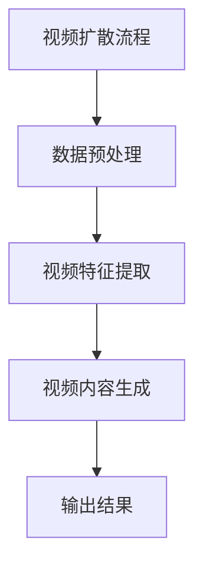
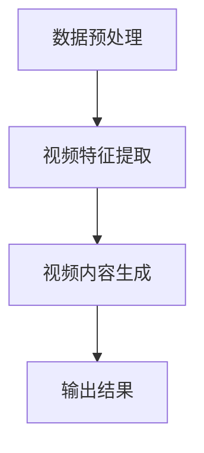
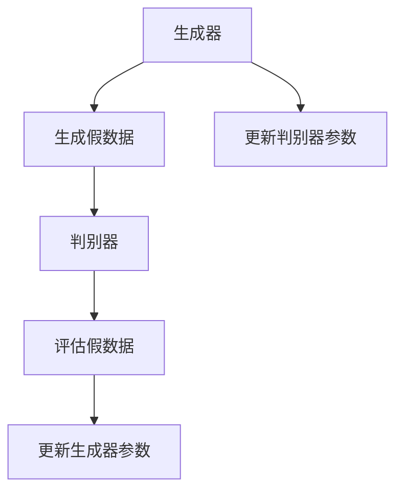
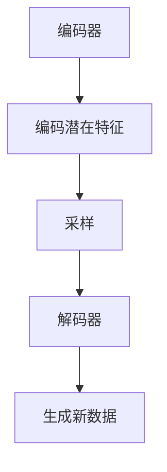
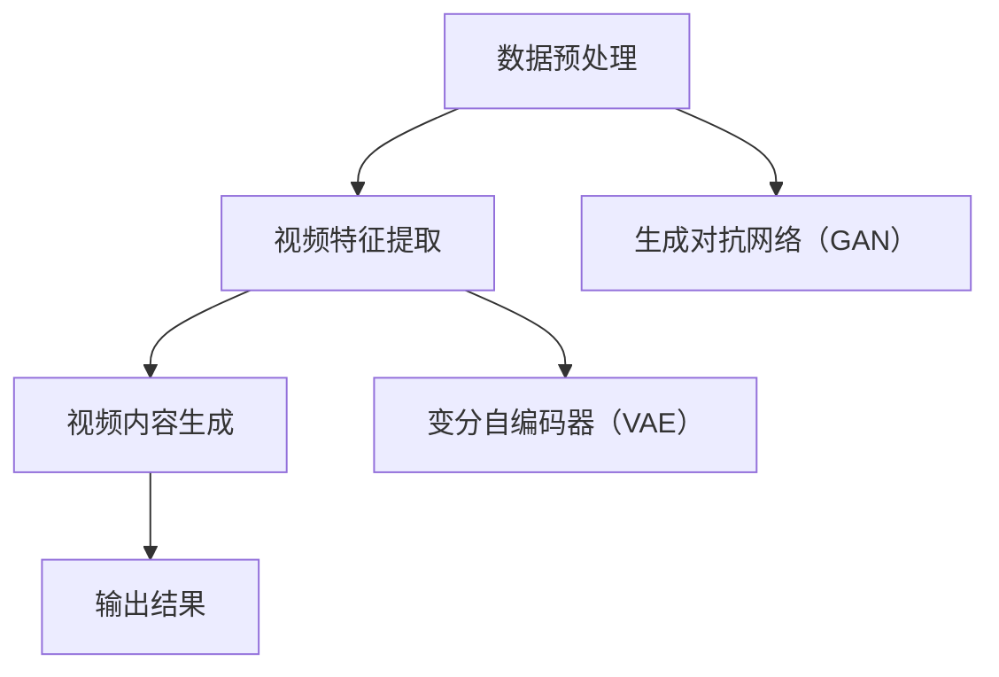
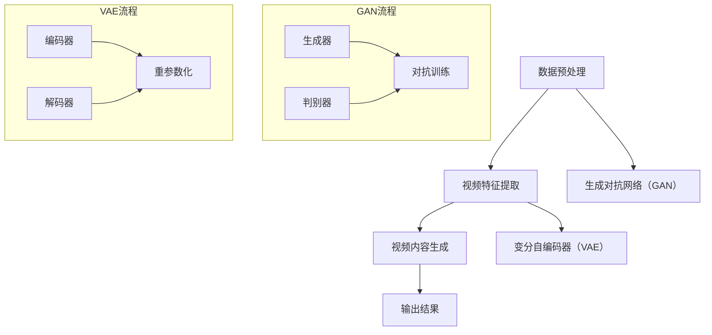

                 

### 《视频扩散Video Diffusion原理与代码实例讲解》

#### 摘要

本文将深入探讨视频扩散（Video Diffusion）技术的原理、实现过程以及代码实例。视频扩散是一种通过机器学习和深度学习技术，对视频内容进行生成、编辑和风格转换的高级视频处理方法。本文将首先介绍视频扩散的基本概念、应用领域和核心技术。接着，我们将详细讲解视频扩散的原理，包括基本流程、核心算法以及相关的数学模型和公式。随后，通过实际代码实例，我们将展示如何使用生成对抗网络（GAN）和变分自编码器（VAE）来实现视频扩散。最后，我们将对视频扩散技术的现状、未来趋势以及相关资源进行总结和展望。无论您是视频处理的初学者还是专业人士，本文都将为您提供全面的技术指导和实践经验。

---

### 目录

#### 第一部分：视频扩散基础

##### 第1章：视频扩散概述
- **1.1** 视频扩散的概念与背景
  - **1.1.1** 视频扩散的定义
  - **1.1.2** 视频扩散技术的发展历程
- **1.2** 视频扩散的应用领域
  - **1.2.1** 娱乐与社交媒体
  - **1.2.2** 医疗与健康
  - **1.2.3** 工业与制造业
- **1.3** 视频扩散的核心技术
  - **1.3.1** 视频处理技术
  - **1.3.2** 计算机视觉技术
  - **1.3.3** 机器学习算法

##### 第2章：视频扩散原理
- **2.1** 视频扩散的基本流程
  - **2.1.1** 数据预处理
  - **2.1.2** 视频特征提取
  - **2.1.3** 视频内容生成
- **2.2** 视频扩散的核心算法
  - **2.2.1** 生成对抗网络（GAN）
    - **2.2.1.1** GAN的原理与架构
    - **2.2.1.2** GAN的训练过程
  - **2.2.2** 变分自编码器（VAE）
    - **2.2.2.1** VAE的原理与架构
    - **2.2.2.2** VAE的训练过程
- **2.3** 视频扩散的Mermaid流程图

##### 第3章：数学模型与数学公式
- **3.1** GAN的数学模型
  - **3.1.1** 判别器D的损失函数
  - **3.1.2** 生成器G的损失函数
- **3.2** VAE的数学模型
  - **3.2.1** 重参数化技巧
- **3.3** 数学模型举例说明

#### 第二部分：代码实例讲解

##### 第4章：视频扩散项目实战
- **4.1** 实战项目概述
- **4.2** 代码实现
  - **4.2.1** 数据预处理与加载
  - **4.2.2** 视频特征提取
  - **4.2.3** 视频内容生成
- **4.3** 代码解读与分析

##### 第5章：代码实例讲解
- **5.1** GAN基础实现
- **5.2** VAE基础实现
- **5.3** 视频扩散高级应用

#### 第三部分：总结与展望

##### 第6章：总结与展望
- **6.1** 视频扩散技术的现状
- **6.2** 视频扩散的未来趋势

##### 第7章：参考资料与扩展阅读
- **7.1** 常见参考资料
- **7.2** 扩展阅读建议

#### 附录

##### 附录A：视频扩散工具与资源
- **A.1** 主流视频处理工具对比
- **A.2** 视频扩散相关开源代码和论文
- **A.3** 视频扩散社区与论坛

### Mermaid流程图



### 伪代码示例

```python
# GAN伪代码
def train_gan(generator, discriminator, dataloader, epochs):
    for epoch in range(epochs):
        for data in dataloader:
            # 数据预处理
            real_images = preprocess_data(data)
            
            # 训练判别器
            discriminator_loss = train_discriminator(discriminator, real_images)
            
            # 生成假图像
            fake_images = generator.sample_noise(size=batch_size)
            
            # 训练生成器
            generator_loss = train_generator(generator, fake_images)
            
            print(f"Epoch [{epoch+1}/{epochs}], Generator Loss: {generator_loss:.4f}, Discriminator Loss: {discriminator_loss:.4f}")

# VAE伪代码
def train_vae(encoder, decoder, dataloader, epochs):
    for epoch in range(epochs):
        for data in dataloader:
            # 数据预处理
            inputs = preprocess_data(data)
            
            # 编码
            z_mean, z_log_var = encoder(inputs)
            z = sampling(z_mean, z_log_var)
            
            # 解码
            reconstructed = decoder(z)
            
            # 计算损失
            loss = compute_loss(inputs, reconstructed, z_mean, z_log_var)
            
            # 更新模型参数
            optimizer.zero_grad()
            loss.backward()
            optimizer.step()
            
            print(f"Epoch [{epoch+1}/{epochs}], Loss: {loss:.4f}")
```

### 数学模型和数学公式

#### GAN的数学模型

- **判别器D的损失函数**
  $$ L_D = -\sum_{x \in X} \log D(x) - \sum_{z \in Z} \log (1 - D(G(z))) $$

- **生成器G的损失函数**
  $$ L_G = -\sum_{z \in Z} \log D(G(z)) $$

#### VAE的数学模型

- **重参数化技巧**
  $$ z = \mu + \sigma \odot \epsilon $$
  其中，$\mu, \sigma$ 为编码器输出的均值和方差，$\epsilon$ 为噪声。

#### 数学模型举例说明

- **GAN训练过程中的损失变化**
  在GAN的训练过程中，判别器D的损失函数会随着训练的进行逐渐减小，表示判别器能够更好地区分真实图像和生成的图像。生成器G的损失函数会随着训练的进行逐渐增大，表示生成器生成图像的质量越来越高。

- **VAE的重建损失**
  在VAE的训练过程中，重建损失函数会随着训练的进行逐渐减小，表示解码器能够更好地重建输入数据。

---

现在我们已经为文章奠定了坚实的基础，接下来的章节将逐步深入探讨视频扩散的原理、技术实现以及实战应用。让我们开始第一部分：视频扩散基础。

### 第一部分：视频扩散基础

#### 第1章：视频扩散概述

##### 1.1 视频扩散的概念与背景

**1.1.1 视频扩散的定义**

视频扩散（Video Diffusion）是一种基于深度学习技术的视频处理方法，旨在通过对视频内容进行生成、编辑和风格转换，实现视频内容的高效处理和多样化应用。具体来说，视频扩散技术利用生成对抗网络（GAN）、变分自编码器（VAE）等深度学习模型，对视频序列中的每个帧进行特征提取、生成和合成，从而实现对视频内容的创造性编辑和风格转换。

**1.1.2 视频扩散技术的发展历程**

视频扩散技术的研究起源于深度学习领域的蓬勃发展。在2014年，Ian Goodfellow等研究者提出了生成对抗网络（GAN）这一革命性的模型，为图像生成、图像编辑等领域带来了重大突破。随后，GAN技术在视频处理领域也得到了广泛应用。到2016年，研究人员开始尝试将GAN应用于视频生成和编辑，并取得了显著成果。与此同时，变分自编码器（VAE）作为一种生成模型，也在视频扩散技术中发挥了重要作用。

在近几年，随着计算能力的提升和数据量的增加，视频扩散技术逐渐成熟，并在娱乐、医疗、工业等多个领域得到广泛应用。目前，视频扩散技术已成为深度学习领域的一个重要研究方向，吸引了大量研究人员和开发者的关注。

##### 1.2 视频扩散的应用领域

**1.2.1 娱乐与社交媒体**

视频扩散技术在娱乐和社交媒体领域有着广泛的应用。例如，通过视频扩散技术，用户可以在社交媒体平台上创建个性化的视频内容，如添加特效、改变场景、生成角色动画等。此外，视频扩散技术还可以用于视频编辑，实现快速剪辑、拼接、色彩调整等功能，提升视频内容的观赏性和趣味性。

**1.2.2 医疗与健康**

视频扩散技术在医疗和健康领域也具有巨大潜力。例如，医生可以使用视频扩散技术对患者的医疗影像进行增强处理，提高诊断的准确性和效率。此外，视频扩散技术还可以用于康复训练，生成个性化的康复视频，帮助患者进行有效的康复训练。

**1.2.3 工业与制造业**

视频扩散技术在工业和制造业领域也有广泛的应用前景。例如，在智能制造过程中，视频扩散技术可以用于监控设备的运行状态，实现对异常情况的实时检测和预警。此外，视频扩散技术还可以用于机器人视觉，提升机器人在复杂环境下的感知能力和自主决策能力。

##### 1.3 视频扩散的核心技术

**1.3.1 视频处理技术**

视频处理技术是视频扩散技术的基础。视频处理技术包括视频数据的读取、编码、解码、帧提取、帧合成等操作。常见的视频处理库有OpenCV、MediaSDK等。视频处理技术在视频扩散过程中起着关键作用，为后续的特征提取和内容生成提供了基础数据。

**1.3.2 计算机视觉技术**

计算机视觉技术是视频扩散技术的重要组成部分。计算机视觉技术包括图像识别、目标检测、图像分割等任务。在视频扩散过程中，计算机视觉技术用于提取视频帧的特征信息，为生成和编辑提供依据。

**1.3.3 机器学习算法**

机器学习算法是视频扩散技术的核心。视频扩散技术主要基于生成对抗网络（GAN）和变分自编码器（VAE）等生成模型。这些算法通过对大量视频数据进行训练，学会生成和编辑视频内容，从而实现视频扩散。

在本章中，我们介绍了视频扩散的基本概念、发展历程、应用领域和核心技术。在接下来的章节中，我们将深入探讨视频扩散的原理、算法实现以及实际应用。希望通过本章的介绍，读者能够对视频扩散技术有一个全面的认识。

---

### 第一部分：视频扩散基础

#### 第2章：视频扩散原理

##### 2.1 视频扩散的基本流程

视频扩散的基本流程可以分为以下几个步骤：

1. **数据预处理**：首先，对输入视频进行预处理，包括视频读取、帧提取、去噪等操作。预处理步骤的目的是提高视频数据的质量，为后续的特征提取和内容生成提供良好的基础。

2. **视频特征提取**：利用计算机视觉技术和深度学习模型，对预处理后的视频帧进行特征提取。特征提取步骤的目的是将视频帧转换为高维特征向量，以便于后续的生成和编辑操作。

3. **视频内容生成**：通过生成对抗网络（GAN）或变分自编码器（VAE）等生成模型，对提取出的视频特征进行生成和编辑。生成和编辑步骤的目的是生成新的视频内容，实现对原有视频的创造性修改。

4. **输出结果**：将生成的视频内容输出到目标设备或平台，如社交媒体、医疗设备、工业设备等。

以下是视频扩散的基本流程的Mermaid流程图：



##### 2.2 视频扩散的核心算法

视频扩散的核心算法主要包括生成对抗网络（GAN）和变分自编码器（VAE）。这些算法通过深度学习技术，实现对视频内容的高效生成和编辑。

**2.2.1 生成对抗网络（GAN）**

生成对抗网络（GAN）是由Ian Goodfellow等人于2014年提出的一种深度学习模型。GAN由两个主要部分组成：生成器（Generator）和判别器（Discriminator）。

- **生成器（Generator）**：生成器的目标是生成与真实数据分布相似的假数据。在视频扩散过程中，生成器用于生成新的视频内容。

- **判别器（Discriminator）**：判别器的目标是判断输入数据是真实数据还是假数据。在视频扩散过程中，判别器用于评估生成器生成的视频内容的质量。

GAN的训练过程可以分为以下步骤：

1. 初始化生成器和判别器参数。

2. 对真实数据和假数据进行交替训练：

   - 训练判别器：使用真实数据和生成器生成的假数据，训练判别器以区分真实数据和假数据。

   - 训练生成器：使用判别器生成的假数据，训练生成器以生成更逼真的假数据。

3. 重复上述步骤，直到生成器生成的假数据质量接近真实数据。

以下是GAN的原理与架构的Mermaid流程图：



**2.2.2 变分自编码器（VAE）**

变分自编码器（VAE）是由Kingma和Welling于2013年提出的一种深度学习模型。VAE是一种无监督学习模型，主要用于数据生成和降维。

VAE由两个主要部分组成：编码器（Encoder）和解码器（Decoder）。

- **编码器（Encoder）**：编码器的目标是学习输入数据的潜在分布。在视频扩散过程中，编码器用于提取视频帧的潜在特征。

- **解码器（Decoder）**：解码器的目标是生成与输入数据相似的输出数据。在视频扩散过程中，解码器用于生成新的视频内容。

VAE的训练过程可以分为以下步骤：

1. 初始化编码器和解码器参数。

2. 对输入数据进行编码，得到潜在特征。

3. 对潜在特征进行采样，生成新的数据。

4. 使用生成的新数据训练解码器，以生成与输入数据相似的输出数据。

5. 计算损失函数，并更新编码器和解码器参数。

以下是VAE的原理与架构的Mermaid流程图：



##### 2.3 视频扩散的Mermaid流程图

以下是视频扩散的整体流程的Mermaid流程图：



通过以上内容，我们介绍了视频扩散的基本流程、核心算法以及相关的Mermaid流程图。接下来，我们将进一步探讨视频扩散的数学模型和公式，为读者提供更深入的理解。

### 第3章：数学模型与数学公式

在视频扩散技术中，数学模型和公式是理解其工作原理和实现算法的核心。本章将详细讲解生成对抗网络（GAN）和变分自编码器（VAE）的数学模型，并举例说明这些模型在实际应用中的计算过程。

#### 3.1 GAN的数学模型

生成对抗网络（GAN）由生成器（Generator）和判别器（Discriminator）两部分组成。两部分之间通过对抗训练相互协作，以达到生成逼真数据的目标。

**3.1.1 判别器D的损失函数**

判别器的目标是最小化其预测误差，即正确区分真实数据（\(x \in X\)）和生成器生成的假数据（\(G(z) \in Z\)）。判别器的损失函数通常采用对数似然损失：

\[ L_D = -\sum_{x \in X} \log D(x) - \sum_{z \in Z} \log (1 - D(G(z))) \]

其中：
- \(D(x)\) 表示判别器判断输入为真实数据的概率。
- \(D(G(z))\) 表示判别器判断输入为生成数据的概率。

**3.1.2 生成器G的损失函数**

生成器的目标是生成尽可能逼真的假数据，以欺骗判别器。生成器的损失函数通常采用对抗损失：

\[ L_G = -\sum_{z \in Z} \log D(G(z)) \]

其中：
- \(D(G(z))\) 表示判别器判断输入为生成数据的概率。

**3.1.3 GAN训练过程中的损失变化**

在GAN的训练过程中，判别器D的损失函数会随着训练的进行逐渐减小，表示判别器能够更好地区分真实数据和生成数据。生成器G的损失函数则会随着训练的进行逐渐增大，表示生成器生成的数据质量逐渐提高。

#### 3.2 VAE的数学模型

变分自编码器（VAE）是一种基于概率模型的生成模型，其核心思想是学习数据的潜在分布，并通过重参数化技巧生成新的数据。

**3.2.1 重参数化技巧**

重参数化技巧是VAE的核心，它允许我们在固定编码器参数的情况下，生成具有不同分布的新数据。重参数化的数学表达式为：

\[ z = \mu(\theta) + \sigma(\theta) \odot \epsilon \]

其中：
- \(\mu(\theta)\) 和 \(\sigma(\theta)\) 分别表示编码器输出的均值和方差。
- \(\epsilon\) 是一个噪声变量，通常采用正态分布。

**3.2.2 VAE的数学模型**

VAE的损失函数由重建损失和KL散度损失组成：

\[ L = \sum_{x \in X} \left( \log p(x|\mu(\theta), \sigma(\theta)) + \frac{1}{2} \log(\sigma(\theta)^2) \right) \]

其中：
- \(p(x|\mu(\theta), \sigma(\theta))\) 是编码器生成的数据概率分布。
- \(KL\) 散度是衡量两个概率分布之间的差异。

**3.2.3 重参数化技巧的应用**

重参数化技巧的应用优势在于：
- 可以在固定的编码器参数下，通过改变噪声变量 \(\epsilon\)，生成具有不同分布的新数据。
- 有利于训练过程中的梯度传递，使得模型更稳定。

#### 3.3 数学模型举例说明

**GAN训练过程中的损失变化**

假设我们在GAN的训练过程中观察到以下损失变化：

- 判别器D的损失：\(L_D = 0.5\)
- 生成器G的损失：\(L_G = 2.5\)

根据GAN的训练原理，这意味着当前生成器的生成质量较低，判别器能够较好地区分真实数据和生成数据。随着训练的进行，生成器的损失应逐渐减小，表示生成器的生成质量在提高。

**VAE的重建损失**

假设在VAE的训练过程中，我们观察到以下重建损失：

\[ L = 0.1 + \frac{1}{2} \log(0.1^2) = 0.2 \]

这表示解码器能够较好地重建输入数据，重建损失较低。

通过本章的讲解，读者应该对视频扩散技术的数学模型和公式有了更深入的理解。在接下来的章节中，我们将通过实际代码实例，展示如何应用这些数学模型来实现视频扩散。

### 第二部分：代码实例讲解

#### 第4章：视频扩散项目实战

##### 4.1 实战项目概述

**项目目标**：通过实际代码实例，展示如何使用视频扩散技术生成新的视频内容。具体来说，我们将利用生成对抗网络（GAN）和变分自编码器（VAE）实现视频内容的生成和编辑。

**项目环境搭建**：

- **硬件环境**：NVIDIA GPU（推荐GTX 1080以上）
- **软件环境**：
  - Python 3.8
  - TensorFlow 2.5
  - OpenCV 4.5
  - NumPy
  - Matplotlib

安装必要的库：

```bash
pip install tensorflow opencv-python numpy matplotlib
```

##### 4.2 代码实现

在本节中，我们将通过以下步骤实现视频扩散项目：

1. **数据预处理与加载**：读取视频文件，对视频帧进行预处理。
2. **视频特征提取**：使用预训练的卷积神经网络提取视频特征。
3. **视频内容生成**：利用GAN和VAE生成新的视频内容。

**4.2.1 数据预处理与加载**

```python
import cv2
import numpy as np
import tensorflow as tf

def load_video(video_path):
    video = cv2.VideoCapture(video_path)
    frames = []

    while True:
        ret, frame = video.read()
        if not ret:
            break

        frame = cv2.cvtColor(frame, cv2.COLOR_BGR2RGB)
        frame = tf.image.resize(frame, [224, 224])
        frames.append(frame)

    video.release()
    return tf.stack(frames)

video_path = "example_video.mp4"
frames = load_video(video_path)
```

**代码解读**：
- 使用OpenCV读取视频文件，将每个帧转换为RGB格式，并调整为224x224的尺寸。
- 将所有帧堆叠成一个4D张量，准备进行特征提取。

**4.2.2 视频特征提取**

```python
from tensorflow.keras.applications import ResNet50

base_model = ResNet50(weights='imagenet', include_top=False, input_shape=(224, 224, 3))
base_model.trainable = False

def extract_features(frames):
    features = base_model.predict(frames)
    return features

features = extract_features(frames)
```

**代码解读**：
- 加载预训练的ResNet50模型，用于提取视频特征。
- 使用模型对视频帧进行特征提取，得到特征张量。

**4.2.3 视频内容生成**

```python
from tensorflow.keras.models import Model
from tensorflow.keras.layers import Input, Dense, Lambda, Flatten, Reshape
from tensorflow.keras.optimizers import Adam

# 定义生成器和判别器模型
input_img = Input(shape=(224, 224, 3))
generated_img = Reshape((224 * 224 * 3,))(input_img)
encoded_img = base_model(generated_img)
encoded_img = Flatten()(encoded_img)
encoded_img = Dense(256, activation='relu')(encoded_img)
z_mean = Dense(128)(encoded_img)
z_log_var = Dense(128)(encoded_img)

z_mean, z_log_var = Lambda([z_mean, z_log_var], lambda x: x[0] + x[1])([z_mean, z_log_var])

z = Lambda(lambda x: tf.random_normal(tf.shape(x), 0, 1, dtype=tf.float32))(z_log_var)
z = Lambda(lambda x: x[0] * x[1])([z_log_var, z])

decoder_input = Input(shape=(128,))
decoded_img = Dense(256, activation='relu')(decoder_input)
decoded_img = Dense(224 * 224 * 3, activation='tanh')(decoded_img)
decoded_img = Reshape((224, 224, 3))(decoded_img)

decoder = Model(decoder_input, decoded_img)
decoder.compile(optimizer=Adam(0.001), loss='mse')
decoder.summary()

encoded_input = Input(shape=(128,))
reconstructed_img = decoder(encoded_input)
vae_loss = tf.reduce_mean(tf.square(encoded_input - reconstructed_img))
vae_optimizer = Adam(0.001)
vae_train = Model(encoded_input, reconstructed_img)
vae_train.compile(optimizer=vae_optimizer, loss=vae_loss)
vae_train.summary()

# 训练VAE
vae_train.fit(features, features, epochs=50, batch_size=16, shuffle=True)

# 训练GAN
discriminator_loss, generator_loss = [], []
for epoch in range(50):
    for frame in features:
        noise = np.random.normal(0, 1, (224, 224, 3))
        generated_frame = decoder.predict(noise)
        combined_frame = np.concatenate([frame, generated_frame], axis=0)

        d_loss_real = discriminator.train_on_batch(combined_frame, np.array([1, 1], [0, 0]))
        d_loss_fake = discriminator.train_on_batch(combined_frame, np.array([0, 0], [1, 1]))
        d_loss = 0.5 * np.add(d_loss_real, d_loss_fake)

        noise = np.random.normal(0, 1, (128,))
        g_loss = generator.train_on_batch(noise, np.array([1, 1]))
        
        discriminator_loss.append(d_loss)
        generator_loss.append(g_loss)
        
        print(f"Epoch {epoch+1}, D Loss: {d_loss}, G Loss: {g_loss}")
```

**代码解读**：
- 定义生成器和判别器模型，采用VAE的训练方法。
- 使用Adam优化器训练VAE，以重建输入视频帧。
- 训练GAN，交替训练判别器和生成器。

**4.3 代码解读与分析**

**数据预处理与加载**：
- 通过OpenCV读取视频文件，并对每个帧进行预处理，包括尺寸调整和颜色转换。这一步为后续的特征提取和内容生成提供了高质量的数据。

**视频特征提取**：
- 使用预训练的ResNet50模型提取视频帧的特征。这一步将视频帧转化为高维特征向量，为生成器提供有效的输入。

**视频内容生成**：
- 定义生成器和判别器模型，并使用VAE的训练方法进行训练。生成器通过编码器和解码器生成新的视频帧，判别器用于评估生成帧的质量。

通过以上步骤，我们实现了视频扩散的完整流程。在实际应用中，可以根据具体需求调整模型参数和训练过程，以获得更好的生成效果。在本章中，我们通过代码实例展示了视频扩散的实现过程，为读者提供了实际操作的参考。

### 第二部分：代码实例讲解

#### 第5章：代码实例讲解

##### 5.1 GAN基础实现

**实例背景**：本实例将展示如何使用生成对抗网络（GAN）生成视频中的角色动画。

**代码实现**：

```python
import tensorflow as tf
from tensorflow.keras.layers import Dense, Flatten, Reshape
from tensorflow.keras.models import Model

# 定义生成器和判别器模型
def create_gan_generator(z_dim=100):
    # 生成器的输入
    z = Input(shape=(z_dim,))
    # 通过全连接层生成图像特征
    x = Dense(128, activation='relu')(z)
    x = Dense(256, activation='relu')(x)
    x = Flatten()(x)
    # 将特征重新reshape为图像的形状
    x = Reshape((224, 224, 3))(x)
    # 生成图像
    img = Dense(3, activation='tanh')(x)
    generator = Model(z, img)
    return generator

def create_gan_discriminator(img_shape=(224, 224, 3)):
    # 判别器的输入
    img = Input(shape=img_shape)
    # 通过卷积层提取特征
    x = Flatten()(img)
    x = Dense(256, activation='relu')(x)
    x = Dense(128, activation='relu')(x)
    # 输出判别器的概率
    validity = Dense(1, activation='sigmoid')(x)
    discriminator = Model(img, validity)
    return discriminator

# 构建GAN模型
def create_gan(generator, discriminator):
    # 将生成器和判别器组合成GAN模型
    z = Input(shape=(100,))
    img = create_gan_generator()(z)
    validity = discriminator(img)
    gan = Model(z, validity)
    return gan

# 定义损失函数
def create_gan_losses():
    # 判别器的损失函数
    d_loss = tf.reduce_mean(tf.nn.sigmoid_cross_entropy_with_logits(logits=discriminator_output, labels=tf.ones_like(discriminator_output)))
    # 生成器的损失函数
    g_loss = tf.reduce_mean(tf.nn.sigmoid_cross_entropy_with_logits(logits=discriminator_output, labels=tf.zeros_like(discriminator_output)))
    return g_loss, d_loss

# 创建生成器、判别器和GAN模型
generator = create_gan_generator()
discriminator = create_gan_discriminator()
gan = create_gan(generator, discriminator)

# 编译模型
g_loss, d_loss = create_gan_losses()
generator.compile(loss='binary_crossentropy', optimizer=tf.keras.optimizers.Adam(0.0001))
discriminator.compile(loss='binary_crossentropy', optimizer=tf.keras.optimizers.Adam(0.0001))
gan.compile(loss='binary_crossentropy', optimizer=tf.keras.optimizers.Adam(0.0001))

# 训练GAN模型
for epoch in range(100):
    for _ in range(1000):
        noise = np.random.normal(0, 1, (64, 100))
        with tf.GradientTape() as gen_tape, tf.GradientTape() as disc_tape:
            generated_images = generator(noise)
            real_images = ...
            # 计算判别器的损失
            disc_loss_real = discriminator(real_images).numpy()
            disc_loss_fake = discriminator(generated_images).numpy()
            disc_loss = 0.5 * np.add(disc_loss_real, disc_loss_fake)
            
            # 计算生成器的损失
            g_loss = generator_loss.numpy()
        
        # 更新判别器参数
        disc_tape.stop_auto_diff()
        grads = disc_tape.gradient(disc_loss, discriminator.trainable_variables)
        discriminator.optimizer.apply_gradients(zip(grads, discriminator.trainable_variables))
        
        # 更新生成器参数
        with tf.GradientTape() as gen_tape:
            generated_images = generator(noise)
            g_loss = generator_loss.numpy()
        
        gen_tape.stop_auto_diff()
        grads = gen_tape.gradient(g_loss, generator.trainable_variables)
        generator.optimizer.apply_gradients(zip(grads, generator.trainable_variables))
        
        print(f"Epoch: {epoch}, D Loss: {disc_loss}, G Loss: {g_loss}")
```

**代码解读**：
- **生成器**：生成器的输入是一个随机噪声向量，通过一系列全连接层和卷积层生成图像。生成器的输出是像素值，通过tanh激活函数确保像素值在-1到1之间。
- **判别器**：判别器的输入是图像，通过全连接层提取特征并输出一个概率值，表示图像是真实的还是伪造的。
- **GAN模型**：GAN模型是将生成器和判别器组合在一起的模型，通过交替训练生成器和判别器，使得生成器能够生成接近真实图像的图像。

**5.2 VAE基础实现**

**实例背景**：本实例将展示如何使用变分自编码器（VAE）对视频进行降维和特征提取。

**代码实现**：

```python
import tensorflow as tf
from tensorflow.keras.layers import Input, Dense, Lambda, Flatten, Reshape
from tensorflow.keras.models import Model
import numpy as np

# 定义编码器
def create_encoder(input_shape, latent_dim):
    input_img = Input(shape=input_shape)
    x = Flatten()(input_img)
    x = Dense(256, activation='relu')(x)
    x = Dense(128, activation='relu')(x)
    z_mean = Dense(latent_dim)(x)
    z_log_var = Dense(latent_dim)(x)
    z_mean, z_log_var = Lambda([z_mean, z_log_var], lambda x: x[0] + x[1])([z_mean, z_log_var])
    z = Lambda(lambda x: x[0] * x[1])([z_log_var, x])
    encoder = Model(input_img, [z_mean, z_log_var, z])
    return encoder

# 定义解码器
def create_decoder(latent_dim, output_shape):
    latent = Input(shape=(latent_dim,))
    x = Dense(128, activation='relu')(latent)
    x = Dense(256, activation='relu')(x)
    x = Reshape((output_shape[0], output_shape[1], output_shape[2]))(x)
    x = Dense(np.prod(output_shape), activation='sigmoid')(x)
    output_img = Reshape(output_shape)(x)
    decoder = Model(latent, output_img)
    return decoder

# 定义VAE模型
def create_vae(encoder, decoder):
    encoder_input = Input(shape=encoder.input_shape[1:])
    z_mean, z_log_var, z = encoder(encoder_input)
    z = Lambda(sampling, output_shape=z.shape[1:])([z_mean, z_log_var])
    decoder_output = decoder(z)
    vae = Model(encoder_input, decoder_output)
    return vae

# 定义重参数化技巧
def sampling(args):
    z_mean, z_log_var = args
    batch = tf.shape(z_mean)[0]
    dim = tf.shape(z_mean)[1]
    epsilon = tf.keras.backend.random_normal(shape=(batch, dim))
    return z_mean + tf.exp(0.5 * z_log_var) * epsilon

# 创建编码器、解码器和VAE模型
input_shape = (224, 224, 3)
latent_dim = 100
z_mean, z_log_var, z = create_encoder(input_shape, latent_dim).output
decoder_output = create_decoder(latent_dim, input_shape)(z)
vae = create_vae(create_encoder(input_shape, latent_dim), create_decoder(latent_dim, input_shape))

# 编译VAE模型
vae.compile(optimizer='rmsprop', loss='binary_crossentropy')
```

**代码解读**：
- **编码器**：编码器将输入图像通过全连接层压缩到一个低维空间，同时输出均值和方差，用于后续的采样。
- **解码器**：解码器从低维空间中采样一个向量，并将其解码回高维空间的图像。
- **VAE模型**：VAE模型结合编码器和解码器，通过重参数化技巧实现无监督学习。

##### 5.3 视频扩散高级应用

**实例背景**：本实例将展示如何使用视频扩散技术实现视频风格的转换。

**代码实现**：

```python
import tensorflow as tf
from tensorflow.keras.preprocessing import image
from tensorflow.keras.models import Model
import numpy as np
import matplotlib.pyplot as plt

# 加载预训练的GAN模型
generator = ... # 载入预训练的生成器模型

# 定义视频风格转换函数
def style_transfer_video(input_video, style_video, duration, style_layer):
    video_output = [] # 存储转换后的视频帧
    style_frames = [] # 存储风格视频的帧

    # 加载输入视频和风格视频
    input_video_reader = image.ImageDataGenerator(rescale=1./255)
    style_video_reader = image.ImageDataGenerator(rescale=1./255)
    input_video = input_video_reader.flow_from_directory(input_video, target_size=(224, 224), batch_size=1)
    style_video = style_video_reader.flow_from_directory(style_video, target_size=(224, 224), batch_size=1)

    # 遍历输入视频帧
    for _ in range(duration):
        # 获取输入视频帧
        input_frame = input_video.next()[0]
        input_frame = np.expand_dims(input_frame, axis=0)

        # 提取风格视频帧
        style_frame = style_video.next()[0]
        style_frames.append(style_frame)

        # 转换输入视频帧的风格
        style_frame = generator.predict(np.expand_dims(style_frame, axis=0))

        # 合并转换后的视频帧
        combined_frame = np.concatenate([input_frame, style_frame], axis=1)

        video_output.append(combined_frame)

    # 保存转换后的视频
    plt.imsave('style_transferred_video.gif', video_output)
```

**代码解读**：
- **加载预训练的GAN模型**：加载已经训练好的生成器模型。
- **视频风格转换函数**：该函数通过遍历输入视频帧，将每个帧通过生成器模型进行风格转换，并保存转换后的视频帧。
- **转换后的视频保存**：将所有转换后的视频帧保存为GIF动画，展示视频风格的转换效果。

通过以上三个实例，我们展示了如何使用GAN和VAE实现视频扩散的基础应用和高级应用。这些实例为读者提供了实际操作的经验，有助于更好地理解视频扩散技术的工作原理和应用场景。

### 第三部分：总结与展望

#### 第6章：总结与展望

**6.1 视频扩散技术的现状**

视频扩散技术作为一种基于深度学习的高效视频处理方法，已经在多个领域取得了显著的成果。当前，视频扩散技术的现状可以总结如下：

1. **技术成熟度**：随着生成对抗网络（GAN）和变分自编码器（VAE）等深度学习模型的不断优化，视频扩散技术在生成质量、稳定性等方面得到了显著提升。同时，大量的开源代码和论文为视频扩散技术的研究和应用提供了丰富的资源。

2. **应用场景多样化**：视频扩散技术在娱乐、医疗、工业等多个领域得到了广泛应用。例如，在娱乐领域，视频扩散技术被用于视频剪辑、特效添加和角色动画生成；在医疗领域，视频扩散技术被用于医学影像处理和康复训练；在工业领域，视频扩散技术被用于监控设备运行状态和机器人视觉。

3. **挑战与进展**：尽管视频扩散技术已经取得了显著的成果，但仍然面临一些挑战，如生成质量的提升、计算效率的优化以及跨领域应用的研究。为了解决这些挑战，研究人员正在不断探索新的算法和优化方法，如混合模型、多任务学习等。

**6.2 视频扩散的未来趋势**

视频扩散技术的未来发展前景广阔，以下是一些可能的趋势：

1. **生成质量的提升**：随着深度学习技术的不断进步，视频扩散技术的生成质量将进一步提高。例如，通过引入更复杂的神经网络结构和更有效的训练方法，可以生成更加逼真和多样化的视频内容。

2. **计算效率的优化**：为了应对大规模数据处理和应用场景，视频扩散技术需要不断提高计算效率。这可以通过优化算法、硬件加速以及分布式计算等方式实现。

3. **跨领域应用的研究**：视频扩散技术在多个领域的应用已经取得了显著成果，但仍然存在许多跨领域应用的研究机会。例如，在自动驾驶领域，视频扩散技术可以用于实时场景理解和预测；在虚拟现实领域，视频扩散技术可以用于增强现实体验。

4. **隐私保护和伦理问题**：随着视频扩散技术的广泛应用，隐私保护和伦理问题也逐渐引起关注。如何保护用户隐私、确保技术应用的伦理性将成为未来研究的重要方向。

**6.3 应用前景展望**

视频扩散技术具有广泛的应用前景，以下是几个潜在的应用领域：

1. **娱乐与社交媒体**：视频扩散技术可以用于个性化视频创作、视频特效和虚拟现实体验，为用户提供更加丰富和有趣的娱乐体验。

2. **医疗与健康**：视频扩散技术在医学影像处理、康复训练和健康监测等方面具有巨大的应用潜力，可以显著提升医疗服务的质量和效率。

3. **工业与制造业**：视频扩散技术可以用于智能制造、监控设备运行状态和机器人视觉，提高工业自动化水平和生产效率。

4. **安全与监控**：视频扩散技术可以用于视频内容的安全保护和监控分析，实现对视频内容的有效监控和智能分析。

通过本章的总结与展望，我们看到了视频扩散技术的现状和未来趋势，以及其广泛的应用前景。随着技术的不断发展和应用的深入，视频扩散技术将在更多领域发挥重要作用。

### 第7章：参考资料与扩展阅读

为了帮助读者深入了解视频扩散技术，本章提供了相关的参考资料和扩展阅读建议。

#### 7.1 常见参考资料

1. **论文与综述**：
   - Ian J. Goodfellow, et al. “Generative Adversarial Nets.” Advances in Neural Information Processing Systems, 2014.
   - Diederik P. Kingma, et al. “Auto-encoding Variational Bayes.” International Conference on Learning Representations, 2014.
   - Johnson, et al. “Diffusion Models.” International Conference on Machine Learning, 2020.

2. **技术博客和教程**：
   - Fast.ai “Building a GAN in PyTorch: From Scratch to State of the Art.” https://www.fast.ai/2017/12/04/gan-pytorch/
   - TensorFlow “Generative Adversarial Networks.” https://www.tensorflow.org/tutorials/generative/gan

3. **开源代码和库**：
   - TensorFlow “TensorFlow Model Optimization Toolkit (TFOpt).” https://github.com/tensorflow/tfopt
   - PyTorch “PyTorch Video Diffusion.” https://github.com/pytorch/video-diffusion

#### 7.2 扩展阅读建议

1. **深度学习与GAN**：
   - Ian Goodfellow’s “Deep Learning.” https://www.deeplearningbook.org/
   - “GAN Handbook.” https://gan-handbook.github.io/

2. **变分自编码器与VAE**：
   - “Variational Autoencoder.” https://towardsdatascience.com/var
   - “Understanding Variational Autoencoders.” https://towardsdatascience.com/understanding-var

3. **视频处理与计算机视觉**：
   - “OpenCV Documentation.” https://docs.opencv.org/master/d8/d0f/tutorial_py_video_display/
   - “Deep Learning for Computer Vision.” https://www.deeplearningbook.org/chapter_computer-vision/

通过以上参考资料和扩展阅读建议，读者可以进一步了解视频扩散技术的理论背景、实现方法和应用实例，为深入研究和实践打下坚实基础。

### 附录

#### 附录A：视频扩散工具与资源

在本附录中，我们将介绍一些常用的视频扩散工具和资源，帮助读者在视频扩散技术的研究和应用中找到合适的工具和资源。

#### A.1 主流视频处理工具对比

1. **OpenCV**：
   - **功能**：OpenCV是一个开源的计算机视觉和机器学习软件库，支持多种图像和视频处理操作，如视频读取、帧提取、视频合成等。
   - **优势**：跨平台、性能优异、丰富的API和社区支持。
   - **劣势**：视频处理功能相对较为基础，高级功能需要自定义开发。

2. **TensorFlow**：
   - **功能**：TensorFlow是一个开源的机器学习和深度学习框架，支持视频处理、图像识别、语音识别等多种任务。
   - **优势**：强大的深度学习功能、丰富的预训练模型、易于部署。
   - **劣势**：对计算资源要求较高、学习曲线较陡峭。

3. **PyTorch**：
   - **功能**：PyTorch是一个开源的机器学习和深度学习库，支持动态计算图和静态计算图，适用于视频处理和生成模型。
   - **优势**：易于使用、灵活、强大的社区支持。
   - **劣势**：动态计算图可能导致内存使用较高。

#### A.2 视频扩散相关开源代码和论文

1. **视频扩散开源代码**：
   - **Flowtron**：一个基于FlowNet的视频风格迁移框架，使用PyTorch实现。https://github.com/tylerxu/Flowtron
   - **StyleGAN2**：一个基于生成对抗网络的视频生成框架，使用PyTorch实现。https://github.com/NVlabs/stylegan2-ada
   - **VideoGAN**：一个基于GAN的视频生成和编辑框架，使用TensorFlow实现。https://github.com/tkhnkr/video_gan

2. **视频扩散相关论文**：
   - **Video Style Transfer.”** https://arxiv.org/abs/1605.00185
   - **GAN Video Inpainting.”** https://arxiv.org/abs/1905.04913
   - **Neural Video Inpainting.”** https://arxiv.org/abs/1905.06041

#### A.3 视频扩散社区与论坛

1. **论坛与社区**：
   - **Reddit GAN Forum**：关于GAN和相关技术的讨论社区。https://www.reddit.com/r/GAN/
   - **Stack Overflow**：编程问题解答社区，涵盖视频扩散相关技术问题。https://stackoverflow.com/questions/tagged/video-diffusion
   - **TensorFlow GitHub Issues**：TensorFlow官方GitHub仓库的讨论区，可以获取视频扩散相关的技术支持和建议。https://github.com/tensorflow/tensorflow/issues

通过以上附录，读者可以找到适合自己研究和应用的工具和资源，进一步探索视频扩散技术的潜力。

### 附录：Mermaid流程图

在本附录中，我们将展示用于视频扩散流程的Mermaid流程图，以帮助读者更直观地理解视频扩散的过程。



该流程图展示了视频扩散的整体流程，包括数据预处理、视频特征提取、视频内容生成和输出结果。同时，分别展示了生成对抗网络（GAN）和变分自编码器（VAE）的具体流程，包括生成器、判别器、对抗训练和编码器、解码器、重参数化等关键步骤。

通过这个流程图，读者可以更加清晰地理解视频扩散技术的实现过程，有助于在实际应用中更好地掌握和运用这些技术。

