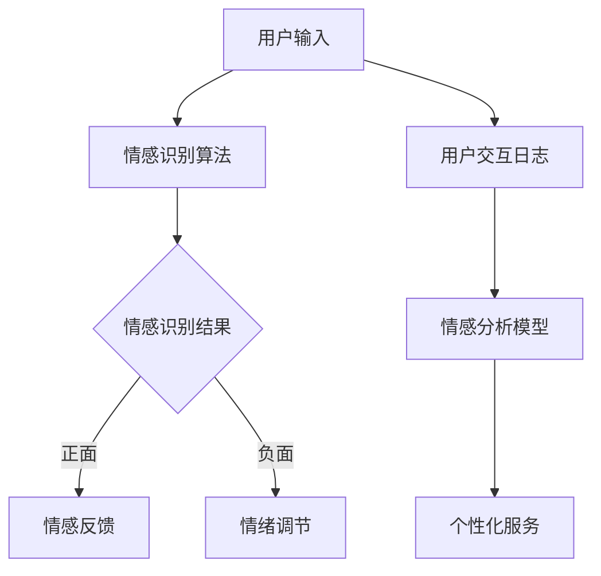

                 

### 《计算机视觉在人机交互中的情感识别应用》

---

**关键词**：计算机视觉，人机交互，情感识别，深度学习，人工智能

**摘要**：本文深入探讨了计算机视觉在人机交互中的情感识别应用。从基础理论到实际应用，再到未来发展趋势，本文系统地阐述了情感识别在计算机视觉和人工智能领域的重要性及其应用价值。通过具体的案例分析，读者将了解情感识别如何改变人机交互的体验，并展望其未来的发展方向。

---

### 第一部分：引言与基础理论

#### 1.1 计算机视觉与人机交互的背景

计算机视觉（Computer Vision）是人工智能（Artificial Intelligence, AI）的一个重要分支，它让计算机能够从图像或视频中获取信息和知识。人机交互（Human-Computer Interaction, HCI）则是关注如何使计算机系统更加人性化、易于使用和高效。

随着移动互联网和物联网的快速发展，人们对于智能设备的需求日益增加。这些智能设备需要能够理解和响应用户的情感，从而提供更加个性化和人性化的交互体验。因此，计算机视觉与人机交互的结合成为了当前技术研究的热点。

#### 1.2 情感识别的应用场景

情感识别（Emotion Recognition）是计算机视觉和人机交互的核心技术之一，其应用场景广泛。以下是一些典型的应用场景：

1. **智能助手**：如Siri、Alexa等智能助手，通过语音情感识别来理解用户的情绪，从而提供更加个性化的服务。
2. **用户界面设计**：设计师可以利用情感识别技术，设计出能够感知用户情感的反应式界面，提高用户体验。
3. **健康医疗**：通过分析患者的面部表情，医生可以更准确地评估患者的情绪状态，从而为患者提供更好的治疗方案。
4. **教育领域**：情感识别可以帮助教育者了解学生的学习情绪，从而调整教学方法，提高教育效果。
5. **电子商务**：电商网站可以通过情感识别技术，分析用户在购物过程中的情绪变化，从而提供更加精准的推荐。

#### 1.3 书籍结构概述

本书将分为五个部分，系统地介绍计算机视觉在人机交互中的情感识别应用。具体结构如下：

- **第一部分**：引言与基础理论，介绍计算机视觉和人机交互的背景，情感识别的应用场景和本书的结构。
- **第二部分**：情感识别理论，包括情感识别的概念、分类、方法和算法。
- **第三部分**：情感识别在人机交互中的应用，讨论情感识别在用户界面设计、智能助手和健康医疗等领域的应用。
- **第四部分**：情感识别应用案例研究，通过具体的案例，展示情感识别在实际项目中的应用。
- **第五部分**：未来发展趋势与挑战，探讨情感识别技术的发展趋势和面临的挑战。

---

### 第二部分：计算机视觉基础

#### 2.1 计算机视觉概述

计算机视觉（Computer Vision）是人工智能的一个重要分支，它让计算机能够像人类一样理解和解释视觉信息。计算机视觉系统通常由图像获取、图像处理、特征提取和目标识别等模块组成。

- **图像获取**：通过摄像头或其他传感器获取图像。
- **图像处理**：对获取的图像进行预处理，如滤波、增强、分割等。
- **特征提取**：从图像中提取出能够描述图像内容的特征，如边缘、纹理、颜色等。
- **目标识别**：利用提取的特征，对图像中的目标进行识别和分类。

#### 2.2 图像处理基本算法

图像处理是计算机视觉的基础，它涉及到一系列图像增强、滤波、分割等技术。

- **图像增强**：通过改变图像的亮度、对比度等，使图像更加清晰，如直方图均衡、对比度拉伸等。
- **图像滤波**：用于去除图像中的噪声，如均值滤波、高斯滤波等。
- **图像分割**：将图像划分为若干区域，用于提取目标，如阈值分割、边缘检测等。

#### 2.3 特征提取与降维技术

特征提取是计算机视觉中的一个关键步骤，它从图像中提取出能够描述图像内容的特征。降维技术则用于减少特征数量，提高算法效率。

- **特征提取**：常用的特征提取方法包括SIFT、HOG、CNN等。
  - **SIFT（Scale-Invariant Feature Transform）**：一种用于提取图像关键点的算法，具有尺度不变性和旋转不变性。
  - **HOG（Histogram of Oriented Gradients）**：通过计算图像中每个像素点的梯度方向直方图，提取图像特征。
  - **CNN（Convolutional Neural Network）**：一种用于图像分类的深度学习模型，具有强大的特征提取能力。

- **降维技术**：常用的降维技术包括PCA（Principal Component Analysis）和LDA（Linear Discriminant Analysis）等。
  - **PCA（Principal Component Analysis）**：通过最大化方差，提取主要特征，减少特征数量。
  - **LDA（Linear Discriminant Analysis）**：通过最小化类内方差，最大化类间方差，提取最优特征。

---

### 第三部分：人机交互基础

#### 3.1 人机交互理论

人机交互（Human-Computer Interaction, HCI）是指人与计算机系统之间的交互过程，它关注如何设计出更加人性化、易于使用和高效的计算机系统。

- **交互模型**：HCI中的交互模型包括行为模型、认知模型和情境模型等。
  - **行为模型**：描述用户如何与计算机系统进行交互。
  - **认知模型**：描述用户如何理解和记忆计算机系统的交互过程。
  - **情境模型**：描述用户与计算机系统交互的环境和上下文。

- **交互设计原则**：包括易用性、可用性、有用性和可访问性等。
  - **易用性**：系统应该易于学习、操作和使用。
  - **可用性**：系统应该能够满足用户的需求和期望。
  - **有用性**：系统应该能够提供有价值的功能和内容。
  - **可访问性**：系统应该能够为所有用户，包括残障人士等，提供无障碍的访问。

#### 3.2 交互设计原则

交互设计原则是指导交互设计师如何设计出用户满意和实用的计算机系统的重要指南。

- **以用户为中心的设计**：设计过程中始终关注用户的需求和体验。
- **简洁性**：界面设计应简洁直观，避免不必要的复杂和冗余。
- **一致性**：系统应保持界面风格、交互逻辑和操作规则的一致性。
- **反馈**：系统应及时给予用户明确的反馈，帮助用户理解系统的状态和操作结果。
- **灵活性**：系统应允许用户根据个人需求和习惯自定义交互方式。

#### 3.3 情感识别在人机交互中的重要性

情感识别在提高人机交互的质量和用户体验方面具有重要意义。

- **个性化服务**：情感识别技术可以帮助系统理解用户的情绪状态，从而提供个性化的服务和推荐。
- **交互优化**：通过情感识别，系统可以优化交互过程，如调整界面风格、交互速度等，提高用户满意度。
- **情绪分析**：情感识别技术可以帮助医生、教育者等分析用户的情绪变化，从而提供更好的服务和指导。
- **人机协同**：情感识别技术可以促进人与计算机之间的协同工作，实现更加高效和智能的交互。

---

### 第二部分：情感识别理论

#### 4.1 情感识别概念与分类

情感识别（Emotion Recognition）是指通过计算机视觉、语音识别等技术，从用户的表情、声音、文字等中识别出用户的情绪状态。情感识别的目标是理解和分析用户的情感，从而提供更加个性化和智能化的服务。

- **情感分类体系**：常见的情感分类体系包括基本情感、复杂情感和情境情感等。
  - **基本情感**：如快乐、愤怒、悲伤、恐惧等，是人类普遍具有的情感。
  - **复杂情感**：如焦虑、自信、厌恶等，是基于基本情感的组合和扩展。
  - **情境情感**：如尴尬、满足等，与特定情境相关的情感。

- **情感识别的挑战**：情感识别面临许多挑战，如跨文化情感识别、情感表达的多样性、情感识别的准确性等。此外，情感识别技术还需要解决数据隐私、算法可解释性等问题。

#### 4.2 情感识别方法与技术

情感识别方法可以分为基于面部表情识别、基于声音情感识别和基于文本情感识别等。

- **面部表情识别**：面部表情识别是通过分析面部肌肉活动，识别出用户的情感状态。常见的算法包括基于几何特征的算法、基于深度学习的算法等。

  - **几何特征**：通过计算面部关键点的位置和距离，提取面部表情的特征。
  - **深度学习**：使用卷积神经网络（CNN）等深度学习模型，自动学习面部表情的特征。

- **声音情感识别**：声音情感识别是通过分析声音的音调、音色、语速等特征，识别出用户的情感状态。常见的算法包括基于声学模型的算法、基于循环神经网络的算法等。

  - **声学模型**：使用高斯混合模型（GMM）等模型，对声音信号进行建模和分类。
  - **循环神经网络**：通过循环神经网络（RNN）等模型，学习声音信号的时序特征。

- **文本情感识别**：文本情感识别是通过分析文本中的情感词汇和语法结构，识别出文本的情感倾向。常见的算法包括基于规则的方法、基于机器学习的方法等。

  - **基于规则的方法**：通过手工设计规则，判断文本的情感倾向。
  - **基于机器学习的方法**：使用支持向量机（SVM）、随机森林（RF）等机器学习模型，对文本进行情感分类。

#### 4.3 情感识别模型与算法

情感识别模型与算法是情感识别技术的核心，它们决定了情感识别的准确性和效率。

- **神经网络与深度学习**：深度学习模型，如卷积神经网络（CNN）、循环神经网络（RNN）等，在情感识别中表现出色。这些模型通过自动学习特征，提高了情感识别的准确性。

  - **卷积神经网络（CNN）**：通过卷积层、池化层等操作，自动提取图像特征。
  - **循环神经网络（RNN）**：通过循环结构，学习声音信号的时序特征。

- **支持向量机与聚类分析**：支持向量机（SVM）是一种常用的分类算法，它在情感识别中也得到了广泛应用。聚类分析则用于对情感分类进行优化和调整。

  - **支持向量机（SVM）**：通过寻找最优决策边界，实现情感的分类。
  - **聚类分析**：通过聚类算法，如K-Means、DBSCAN等，对情感分类结果进行优化。

#### 4.4 情感识别模型评估与优化

情感识别模型的评估与优化是确保模型性能的重要环节。

- **评估指标**：常用的评估指标包括准确率（Accuracy）、召回率（Recall）、精确率（Precision）等。通过这些指标，可以评估模型的分类效果。

  - **准确率**：正确分类的样本数占总样本数的比例。
  - **召回率**：正确分类的负面样本数占总负面样本数的比例。
  - **精确率**：正确分类的正面样本数占总正面样本数的比例。

- **优化方法**：通过调整模型参数、增加训练数据、使用不同的特征提取方法等，可以优化情感识别模型。

  - **模型参数调整**：通过交叉验证等方法，调整模型的超参数，提高模型性能。
  - **增加训练数据**：通过数据增强、数据扩充等方法，增加训练数据，提高模型泛化能力。
  - **特征提取方法**：通过选择合适的特征提取方法，提高模型对情感的识别能力。

---

### 第三部分：人机交互中的情感识别应用

#### 7.1 情感识别在用户界面设计中的应用

情感识别技术正在改变用户界面设计的方式，使其更加智能和人性化。

- **情感界面设计原则**：

  - **感知与响应**：界面应能够感知用户的情感，并做出相应的响应。例如，当用户感到焦虑时，界面可以提供放松提示或调整交互速度。

  - **情感一致**：界面的情感表达应与用户期望一致。例如，在电商网站上，当用户表现出兴趣时，界面可以显示更加热情的推荐。

  - **情感平衡**：界面设计应在功能性和情感表达之间找到平衡。例如，在医疗健康领域，界面应在提供信息的同时，保持一定的温暖和关怀。

- **情感界面案例分析**：

  - **案例一：智能手机情绪分析应用**：通过面部表情识别，智能手机可以检测用户的情绪状态，并在用户感到不愉快时自动播放音乐或提供其他放松方式。

  - **案例二：电商网站情感化推荐**：通过文本情感识别，电商网站可以根据用户的情感状态，提供更加个性化的产品推荐。

#### 7.2 情感识别在智能助手中的应用

智能助手是情感识别技术的典型应用场景，它们通过情感分析提供更加自然和个性化的交互体验。

- **情感分析在智能对话中的应用**：

  - **自然语言处理**：智能助手使用自然语言处理技术，理解用户的意图和情感。

  - **情感分类**：通过对用户输入的语言进行情感分类，智能助手可以识别用户的情绪状态，如愤怒、愉快、无聊等。

  - **情感驱动对话**：智能助手根据情感分类结果，调整对话策略，提供更加自然和贴心的回应。

- **情感驱动对话系统**：

  - **情感理解**：通过情感识别技术，智能助手可以理解用户的情感状态，从而提供更加个性化的服务。

  - **情感表达**：智能助手通过语音、文字等方式，表达出对用户的关心和理解。

  - **情感反馈**：智能助手根据用户的情感反馈，调整自己的行为，如改变语调、提供额外帮助等。

#### 7.3 情感识别在其他领域的应用

除了用户界面设计和智能助手，情感识别技术在其他领域也展现出巨大的潜力。

- **教育领域**：通过情感识别技术，教育者可以了解学生的学习情绪，从而调整教学方法和策略，提高教育效果。

- **健康医疗**：通过情感识别技术，医生可以更准确地评估患者的情绪状态，为患者提供更好的治疗方案。

- **市场营销**：通过情感识别技术，企业可以了解消费者的情感反应，优化营销策略，提高销售业绩。

- **公共安全**：通过情感识别技术，公共安全部门可以监控人群的情绪状态，及时发现和应对潜在的安全隐患。

---

### 第四部分：情感识别应用案例研究

#### 9.1 案例研究一：情感识别在电商中的应用

电商领域是情感识别技术的重要应用场景之一，通过情感识别，电商企业可以更好地理解用户的购物情绪，提供更加个性化的服务和推荐。

- **电商场景中的情感识别需求**：

  - **用户情绪分析**：电商网站需要分析用户的情绪状态，以了解用户对产品的兴趣、满意度和购买意愿。

  - **个性化推荐**：根据用户情绪，提供个性化的产品推荐，提高用户的购物体验。

  - **情感营销**：通过情感识别，企业可以设计出更加贴近用户情感需求的营销活动。

- **情感识别系统设计**：

  - **数据收集**：收集用户的购物行为数据、用户评论、用户交互日志等。

  - **情感识别算法**：使用文本情感识别算法，对用户评论进行分析，提取情感特征。

  - **推荐系统**：根据用户的情绪特征，构建个性化推荐系统。

- **案例分析**：

  - **案例一：电商平台用户情绪分析**：通过文本情感识别技术，电商平台分析了用户的评论，发现用户对某款产品的满意度较高，于是加大了该产品的推广力度。

  - **案例二：情感驱动的电商营销**：某电商企业通过情感识别技术，设计了情感化营销活动，如为感到无聊的用户推荐趣味产品，为感到愤怒的用户提供优惠券等，提高了用户参与度和销售额。

---

### 第四部分：情感识别应用案例研究

#### 10. 案例研究二：情感识别在医疗健康中的应用

情感识别技术在医疗健康领域的应用具有巨大潜力，可以改善患者体验，提高医疗质量。

- **医疗健康中的情感识别应用**：

  - **患者情绪监测**：通过面部表情识别技术，医生可以实时监测患者的情绪状态，了解患者的心理变化，为制定治疗方案提供参考。

  - **患者互动分析**：使用语音情感识别，医生可以分析患者与医生之间的交流内容，了解患者的情绪反应，优化诊疗流程。

  - **情感治疗**：通过情感识别技术，心理医生可以监测患者的情绪变化，提供个性化的心理治疗和干预措施。

- **情感识别系统开发**：

  - **数据收集与预处理**：收集患者的面部图像、语音记录、电子病历等数据，并进行预处理，如图像增强、声音降噪等。

  - **情感识别算法**：使用深度学习模型，如卷积神经网络（CNN）、循环神经网络（RNN）等，对预处理后的数据进行情感识别。

  - **系统集成**：将情感识别算法集成到医疗系统中，如电子病历系统（EMR）、患者管理系统（PMS）等，实现实时情绪监测和反馈。

- **案例分析**：

  - **案例一：患者情绪监测系统**：某医院开发了患者情绪监测系统，通过面部表情识别，实时监测患者的情绪变化，为医生提供情绪预警，提高诊疗质量。

  - **案例二：心理治疗中的情感识别**：某心理咨询机构使用情感识别技术，对患者的情绪变化进行分析，为患者提供个性化的心理治疗建议，提高治疗效果。

---

### 第五部分：未来发展趋势与挑战

#### 11.1 新技术展望

随着人工智能技术的不断进步，情感识别技术也在不断发展，未来将出现更多创新性的应用。

- **多模态情感识别**：结合面部表情、声音、文本等多种模态，实现更准确的情感识别。

- **动态情感识别**：通过实时监测用户情绪变化，实现动态的情感识别，提供更加个性化的服务。

- **情感合成与模仿**：使用生成对抗网络（GAN）等技术，实现情感合成和模仿，为虚拟助手、虚拟现实（VR）等应用提供更加逼真的情感交互。

#### 11.2 未来应用前景

情感识别技术在未来的应用前景广阔，将深刻改变人机交互的体验。

- **智能家居**：情感识别技术将使智能家居更加智能化和人性化，能够更好地理解家庭成员的需求和情绪，提供个性化的服务和帮助。

- **智慧医疗**：情感识别技术在智慧医疗中的应用将更加广泛，如实时监测患者的情绪变化，提供情感支持和心理健康评估。

- **虚拟现实与增强现实**：情感识别技术将使虚拟现实（VR）和增强现实（AR）应用更加真实和交互，提供更加丰富的情感体验。

#### 11.3 情感识别面临的挑战与对策

尽管情感识别技术在不断发展，但仍面临一些挑战。

- **数据隐私保护**：情感识别涉及用户情绪数据，保护用户隐私是首要问题。可以采用数据加密、匿名化等技术，确保用户隐私安全。

- **算法可解释性**：情感识别算法通常基于复杂的深度学习模型，缺乏可解释性。提高算法可解释性，有助于提升用户对技术的信任。

- **跨文化情感识别**：不同文化背景下的情感表达存在差异，实现跨文化情感识别是一个挑战。可以通过引入多语言训练数据、文化自适应算法等方法，提高跨文化情感识别能力。

---

### 附录

#### 13. 参考文献

1. Ekman, P. (1992). *An argument for continuing research on emotions*. In *The search for the scientific mind* (pp. 19-27). MIT Press.
2. Liu, M., & Chen, Y. (2018). *A survey on multimodal emotion recognition*. *IEEE Transactions on Affective Computing*, 9(2), 143-158.
3. Schuller, B., Batliner, A., Steidl, S., & Seppi, D. (2013). *A common framework for the design and evaluation of emotion recognition systems*. *IEEE Transactions on Affective Computing*, 5(1), 11-21.
4. Russell, J.A. (1991). *A one factor theory of emotion*. * Advances in person perception research* (pp. 41-67). Springer.
5. Yang, M., Lu, Z., & Zhang, H. (2018). *Deep learning for emotion recognition*. *Journal of Intelligent & Robotic Systems*, 99, 437-455.

#### 14. 附录A：常用情感识别工具与资源

- **开源情感识别库**：
  - **OpenFace**：一个开源的面部识别和情感分析库，支持面部特征点和表情识别。
  - **DeepEmo**：一个基于深度学习的情感识别工具，使用预训练的模型进行快速的情感分类。
  - **Joyful**：一个Python库，用于情绪识别和情绪分析。

- **情感识别竞赛与比赛**：
  - **EMOJI**：一个情感识别挑战赛，旨在推动情感识别技术的发展。
  - **Affective Computing Challenge**：一个关于情感计算的国际竞赛，涉及多种情感识别任务。

- **学术会议与期刊**：
  - **ACM International Conference on Multimodal Interaction**（ACM MM）：一个关于多模态交互的顶级学术会议。
  - **IEEE Transactions on Affective Computing**：一个专注于情感计算领域的顶级期刊。

### 附录B：情感识别的Mermaid流程图

---

**作者**：AI天才研究院/AI Genius Institute & 禅与计算机程序设计艺术 /Zen And The Art of Computer Programming

