                 

# 《计算：第一部分 计算的诞生 第1章 毕达哥拉斯的困惑 第一次数学危机》

## 第1章 毕达哥拉斯的困惑 第一次数学危机

### 1.1 毕达哥拉斯的发现

在古希腊时期，毕达哥拉斯是一位著名的数学家和哲学家。他领导了一个称为“毕达哥拉斯学派”的团体，这个团体致力于研究数学和哲学。毕达哥拉斯及其学派在研究数学问题时，发现了一个令人困惑的现象：正方形的对角线长度与其边长不成比例。

设正方形的边长为a，根据勾股定理，正方形的对角线长度d可以表示为：
$$ d = \sqrt{a^2 + a^2} = \sqrt{2a^2} = a\sqrt{2} $$

现在我们来看看边长为1的正方形，它的对角线长度为：
$$ d = 1 \cdot \sqrt{2} = \sqrt{2} $$

这里，我们发现边长和边长不成比例，因为边长是整数1，而对角线长度√2是一个无理数，不能表示为两个整数的比例。这个发现引发了毕达哥拉斯的困惑，也对整个数学领域产生了深远的影响。

### 1.2 无理数的概念

无理数是指不能表示为两个整数之比的数。无理数的特点是它们的小数部分是无限不循环的。常见的无理数有π（圆周率）、e（自然对数的底数）、√2（勾股定理中的无理数）等。

无理数的存在打破了传统数学中的“有理数”概念，即所有可以表示为两个整数之比的数。无理数的发现使数学家开始思考更广泛的数系。

### 1.3 无理数的证明

为了证明无理数的存在，毕达哥拉斯学派使用了一种被称为“归谬法”的证明方法。这种方法的基本思想是：假设一个结论是错误的，然后通过逻辑推理得出一个矛盾，从而证明原假设是错误的。

以下是毕达哥拉斯学派用于证明√2是无理数的一种方法：

假设√2是有理数，那么它可以表示为两个整数之比：
$$ \sqrt{2} = \frac{a}{b} $$
其中a和b是整数，并且a和b没有公因数。

接下来，我们可以对上述等式进行平方：
$$ 2 = \frac{a^2}{b^2} $$
这意味着：
$$ a^2 = 2b^2 $$

由此可以看出，a²是偶数（因为它是2b²的两倍）。根据偶数的性质，a也必须是偶数。设a=2c，其中c是整数。

将a=2c代入到a²=2b²中，得到：
$$ (2c)^2 = 2b^2 $$
$$ 4c^2 = 2b^2 $$
$$ 2c^2 = b^2 $$

这又表明b²是偶数，所以b也必须是偶数。但是，这与我们之前的假设（a和b没有公因数）相矛盾，因为我们已经证明了a和b都是偶数，因此它们有共同的因数2。

由于我们通过逻辑推理得出了矛盾，说明我们的原假设（√2是有理数）是错误的。因此，√2必须是无理数。

### 1.4 第一次数学危机

无理数的发现引发了数学领域的第一次危机，即第一次数学危机。这是因为无理数的存在打破了传统数学的基石，即有理数系。第一次数学危机使得数学家开始重新思考数学的基础和定义。

为了解决第一次数学危机，数学家们开始探索新的数学基础，包括逻辑主义、直觉主义和形式主义等。这些新的基础理论为数学提供了更加严谨和可靠的框架。

### 1.5 数学基础的重构

为了应对第一次数学危机，数学家们开始尝试重构数学基础。以下是三种主要的数学基础理论：

#### 1.5.1 逻辑主义

逻辑主义认为，所有数学命题都可以用逻辑来证明。逻辑主义者试图将数学建立在逻辑的基础上，确保数学的推理过程是严格的。

#### 1.5.2 直觉主义

直觉主义认为，数学知识来源于直观感知。直觉主义者强调数学的基础性，认为数学家通过直观感知和构造来获取数学知识。

#### 1.5.3 形式主义

形式主义认为，数学的本质是符号操作。形式主义者将数学视为一种符号系统的操作，不关心这些符号代表的具体含义。

这些新的基础理论为数学的发展提供了新的方向，解决了第一次数学危机，同时也为后来的数学研究奠定了坚实的基础。

### 1.6 无理数的应用

无理数在数学、科学、工程和计算机科学等各个领域都有广泛的应用。以下是一些无理数在各个领域的应用实例：

#### 1.6.1 在数学中的应用

- 无理数在解析几何、微积分和代数等数学领域中都有重要应用。例如，π在圆的面积和周长计算中起着关键作用，e在指数函数和对数函数中有着重要作用。

#### 1.6.2 在科学中的应用

- 无理数在物理学、化学和生物学等领域中也有广泛应用。例如，π在描述波动现象和电磁现象中起着关键作用，e在描述化学反应和生物系统的动态过程中有着重要作用。

#### 1.6.3 在工程中的应用

- 无理数在工程领域中的应用非常广泛，例如，π在计算管道流量和压力分布中起着关键作用，e在描述电路中的电流和电压变化中有着重要作用。

#### 1.6.4 在计算机科学中的应用

- 无理数在计算机科学中也有着重要应用。例如，π在计算机图形学中的三维建模和渲染中起着关键作用，e在算法分析中的时间复杂度和空间复杂度计算中有着重要作用。

### 1.7 无理数的历史影响

无理数的发现对数学的发展产生了深远的影响。它不仅挑战了传统的数学基础，也推动了数学的进一步发展。以下是无理数的历史影响：

#### 1.7.1 改变数学的发展方向

无理数的发现使数学家开始关注更广泛的数系，从而推动了数学的发展。无理数的存在使数学家认识到，数学不仅仅是有理数的运算，还包括无理数的运算和性质。

#### 1.7.2 推动数学方法论的发展

无理数的证明方法，如归谬法，为数学方法论的发展提供了新的思路。这些方法不仅用于证明无理数，还被广泛应用于其他数学领域的证明。

#### 1.7.3 促进数学与其他学科的交叉

无理数的发现促进了数学与其他学科的交叉，如物理学、工程学和计算机科学等。无理数在这些领域中的应用推动了这些学科的发展。

## 第2章 数学工具的演变

### 2.1 几何学的发展

几何学是数学的一个分支，用于研究形状、大小、距离和角度。几何学的发展离不开数学工具的演变。

#### 2.1.1 古希腊几何学

古希腊几何学是几何学发展的一个重要阶段。古希腊数学家，如欧几里得、阿基米德和毕达哥拉斯，通过研究几何图形和性质，建立了几何学的基本原理和定理。

#### 2.1.2 代数几何

代数几何是几何学与代数结合的产物，它研究几何图形与代数方程之间的关系。代数几何的发展使得几何学的研究方法变得更加抽象和一般。

### 2.2 代数的发展

代数是数学的一个分支，用于研究数和方程。代数的发展使得数学工具更加丰富和强大。

#### 2.2.1 古代代数

古代代数起源于古巴比伦和古埃及，他们使用代数方法解决实际问题，如土地测量和税收计算。

#### 2.2.2 现代代数

现代代数的发展始于16世纪，当时法国数学家韦达和笛卡尔分别引入了代数符号和坐标几何。现代代数包括群论、环论、域论等，这些理论为数学提供了强大的工具。

### 2.3 微积分的发展

微积分是数学的一个分支，用于研究变化和运动。微积分的发展使得数学工具更加精确和强大。

#### 2.3.1 古典微积分

古典微积分起源于17世纪，当时的牛顿和莱布尼茨分别独立发展了微积分理论。微积分提供了处理连续变化问题的工具，如导数和积分。

#### 2.3.2 现代微积分

现代微积分的发展包括微分方程、级数理论等。这些理论为数学和物理学的许多领域提供了重要的工具。

### 2.4 数学工具在科学中的应用

数学工具在物理学、生物学、经济学等科学领域都有广泛应用。

#### 2.4.1 物理学

物理学是数学的一个重要应用领域。微积分在描述物理现象，如运动、热力学和电磁学中起着关键作用。数学模型和公式使得物理学家能够精确描述自然现象，并进行预测。

#### 2.4.2 生物学

生物学中许多问题可以通过数学模型来描述，如种群动态、神经网络和蛋白质结构。数学工具帮助生物学家理解生物系统的复杂性和行为。

#### 2.4.3 经济学

经济学中的许多问题可以通过数学模型来解决，如供需分析、市场预测和资源优化。数学工具为经济学家提供了强大的分析工具，以研究经济行为和制定政策。

## 第3章 数学危机后的数学发展

### 3.1 数学逻辑主义的兴起

为了解决第一次数学危机，数学家们开始探索逻辑主义，这是一种认为所有数学命题都可以通过逻辑来证明的观点。

#### 3.1.1 基本原理

逻辑主义者认为，数学的真理可以通过逻辑推理来证明，而不需要依赖于直观感知或形式符号操作。

#### 3.1.2 优势

逻辑主义的优势在于它提供了数学推理的严格基础，确保了数学结论的可靠性。

### 3.2 数学直觉主义的兴起

直觉主义是另一种应对数学危机的观点，它强调数学知识来源于直观感知。

#### 3.2.1 基本原理

直觉主义者认为，数学命题的证明应该依赖于直观的构造和证明过程。

#### 3.2.2 优势

直觉主义的优势在于它强调了数学的基础性和直观性，有助于理解数学的本质。

### 3.3 数学形式主义的兴起

形式主义是另一种应对数学危机的观点，它认为数学的本质是符号操作。

#### 3.3.1 基本原理

形式主义者认为，数学的研究对象是符号系统，而不是具体的对象或概念。

#### 3.3.2 优势

形式主义的优势在于它提供了数学推理的严格形式化框架，有助于解决逻辑和语义问题。

### 3.4 数学危机后的数学发展影响

数学危机后的数学发展对现代数学和科学产生了深远影响。

#### 3.4.1 数学基础的多样化

数学危机后，数学家们提出了多种数学基础理论，使得数学基础更加多样化。

#### 3.4.2 数学方法的精确化

数学危机后的数学发展使得数学方法变得更加精确和严谨。

#### 3.4.3 数学与其他学科的交叉

数学危机后的数学发展促进了数学与其他学科的交叉，如物理学、生物学和计算机科学。

## 第4章 数学与哲学的互动

### 4.1 数学与哲学的关系

数学与哲学有着密切的关系。哲学对数学提出了基础性的问题，如数学的本质、数学的真理和数学的方法。这些问题促使数学家反思和重构数学基础。

#### 4.1.1 数学本质的探讨

哲学家对数学本质的探讨包括数学是关于对象的性质还是关于符号系统的操作。这种探讨影响了数学的发展方向。

#### 4.1.2 数学真理的探讨

哲学家对数学真理的探讨包括数学命题的证明是否可以脱离直观感知。这种探讨影响了数学的证明方法和逻辑主义的发展。

### 4.2 哲学对数学的影响

哲学对数学产生了重要影响，特别是在数学方法论和数学证明方面。

#### 4.2.1 数学方法论

哲学对数学方法论的探讨包括归纳法和演绎法。这些方法影响了数学家如何构建和证明数学理论。

#### 4.2.2 数学证明

哲学对数学证明的探讨包括证明的严格性和可靠性。这些探讨影响了数学家如何构建和验证数学结论。

### 4.3 数学对哲学的影响

数学对哲学也有影响，特别是在逻辑和概念分析方面。

#### 4.3.1 逻辑

数学的发展提供了新的逻辑工具，如集合论和谓词逻辑。这些工具丰富了哲学的逻辑分析。

#### 4.3.2 概念分析

数学的发展提供了新的概念工具，如函数、集合和范畴。这些概念工具丰富了哲学的概念分析。

### 4.4 数学与哲学的互动

数学与哲学的互动推动了两者的发展，为科学研究提供了新的视角。

#### 4.4.1 数学对哲学的启示

数学的发展为哲学提供了新的问题和概念，促使哲学家反思和重构哲学基础。

#### 4.4.2 哲学对数学的启示

哲学的发展为数学提供了新的方法论和证明方法，促使数学家重构数学基础。

## 第5章 数学在现代社会的重要性

### 5.1 数学在科学中的作用

数学在科学中起着至关重要的作用。数学为科学提供了精确的工具和方法，使得科学家能够描述和预测自然现象。

#### 5.1.1 物理学

物理学是数学应用最广泛的领域之一。微积分在描述物理现象，如运动、热力学和电磁学中起着关键作用。数学模型和公式使得物理学家能够精确描述自然现象，并进行预测。

#### 5.1.2 化学

化学中许多问题可以通过数学模型来描述，如反应动力学、量子化学和统计力学。数学工具帮助化学家理解化学反应和分子结构。

#### 5.1.3 生物学

生物学中许多问题可以通过数学模型来描述，如种群动态、神经网络和蛋白质结构。数学工具帮助生物学家理解生物系统的复杂性和行为。

### 5.2 数学在经济中的作用

数学在经济分析中有着广泛的应用。数学模型和公式帮助经济学家预测市场行为、制定政策和评估经济风险。

#### 5.2.1 供需分析

供需分析是经济学中的基本概念，它利用数学模型描述商品的需求和供应关系。数学工具帮助经济学家分析市场动态和价格形成。

#### 5.2.2 市场预测

市场预测是经济学中的重要应用，它利用数学模型和统计方法预测市场走势。数学工具帮助投资者做出投资决策。

#### 5.2.3 资源优化

资源优化是经济学中的关键问题，它利用数学模型和优化算法确定最佳资源分配。数学工具帮助企业和政府制定资源分配策略。

### 5.3 数学在教育中的作用

数学是教育的重要组成部分。数学教育培养学生的逻辑思维和问题解决能力，为其他学科的学习打下基础。

#### 5.3.1 基础教育

在基础教育阶段，数学教育注重培养学生的基本数学技能和概念理解。数学工具如算术、代数和几何为学生的学术发展打下基础。

#### 5.3.2 高等教育

在高等教育阶段，数学教育更注重抽象思维和理论构建。数学工具如微积分、代数几何和拓扑学为学生提供了解决复杂问题的能力。

#### 5.3.3 终身教育

终身教育强调数学的重要性，鼓励人们不断学习和更新数学知识。数学工具如概率论、统计学和计算机科学为学生提供了解决实际问题的能力。

### 5.4 数学在社会中的作用

数学在社会管理、医疗、交通等多个领域都有重要作用。数学为社会发展提供了技术支持。

#### 5.4.1 社会管理

数学在社会管理中有着广泛的应用，如人口统计、城市规划和社会调查。数学工具帮助政府和组织制定政策和管理社会资源。

#### 5.4.2 医疗

数学在医疗领域中的应用包括诊断、治疗和药物研发。数学模型和算法帮助医生分析患者数据，制定治疗方案和评估治疗效果。

#### 5.4.3 交通

数学在交通领域中的应用包括交通流量预测、交通信号控制和车辆导航。数学工具帮助提高交通效率，减少拥堵和交通事故。

## 第6章 数学未来的发展趋势

### 6.1 数学与人工智能的融合

人工智能（AI）的发展为数学带来了新的挑战和机遇。数学与人工智能的融合有望推动数学的进一步发展。

#### 6.1.1 机器学习中的数学

机器学习是人工智能的一个重要分支，它依赖于数学工具来构建模型和算法。数学在机器学习中的应用包括线性代数、概率论和统计学等。

#### 6.1.2 深度学习中的数学

深度学习是机器学习的一个分支，它依赖于复杂的数学模型和算法。数学在深度学习中的应用包括神经网络、优化算法和图形处理单元（GPU）计算等。

#### 6.1.3 数学对人工智能的影响

数学为人工智能提供了强大的工具和方法，使得人工智能能够处理更复杂的问题。数学的发展有望推动人工智能的进一步发展。

### 6.2 数学在量子计算中的应用

量子计算是未来计算技术的发展方向。数学在量子计算中有着重要应用，有望推动量子计算的发展。

#### 6.2.1 量子计算的基本原理

量子计算依赖于量子力学的基本原理，如叠加态和纠缠态。数学在描述和模拟量子现象中起着关键作用。

#### 6.2.2 量子算法

量子算法是量子计算的核心，它利用量子位（qubit）的叠加态和纠缠态来解决问题。数学在设计和分析量子算法中起着关键作用。

#### 6.2.3 数学对量子计算的影响

数学为量子计算提供了强大的工具和方法，使得量子计算能够处理更复杂的问题。数学的发展有望推动量子计算的进一步发展。

### 6.3 数学在数据科学中的应用

数据科学是当前科学研究的前沿领域。数学在数据科学中有着广泛的应用，有望推动数据科学的发展。

#### 6.3.1 数据分析中的数学

数据分析是数据科学的核心，它利用数学工具和方法来提取和解释数据。数学在数据分析中的应用包括统计学、线性代数和优化等。

#### 6.3.2 机器学习中的数学

机器学习是数据科学的一个重要分支，它依赖于数学工具来构建模型和算法。数学在机器学习中的应用包括概率论、统计学和优化算法等。

#### 6.3.3 数学对数据科学的影响

数学为数据科学提供了强大的工具和方法，使得数据科学家能够从大量数据中提取有价值的信息。数学的发展有望推动数据科学的进一步发展。

### 6.4 数学未来的发展趋势

数学未来的发展趋势将受到人工智能、量子计算和数据科学等领域的影响。以下是一些可能的发展趋势：

#### 6.4.1 跨学科融合

数学与其他学科的融合将推动数学的发展。例如，数学与人工智能、物理学和生物学的融合将产生新的数学理论和应用。

#### 6.4.2 数学的抽象化

数学的抽象化将使数学能够处理更复杂的问题。例如，代数几何和范畴论等抽象数学领域的发展将推动数学的发展。

#### 6.4.3 数学的应用扩展

数学的应用将扩展到新的领域，如量子计算、生物信息和金融工程等。数学的发展将为这些领域提供强大的工具和方法。

#### 6.4.4 数学的普及化

随着计算机和互联网的发展，数学的普及化将成为一个趋势。更多的人将能够学习和应用数学，推动数学的普及和发展。

## 参考文献

1. 欧几里得.《几何原本》[M]. 哥伦比亚大学出版社，1937.
2. 莱布尼茨.《算术的进展》[M]. 奥古斯丁·古尔斯特，1713.
3. 牛顿.《自然哲学的数学原理》[M]. 威廉·惠威尔，1687.
4. 康托尔.《集合论》[M]. 德尔雷伊出版社，1895.
5. 赫尔姆霍茨.《力学的艺术》[M]. 威廉·克莱因，1894.
6. 拉卡托斯.《数学的结构》[M]. 麦克米伦出版社，1976.
7. 库珀.《量子计算：理论、算法和应用》[M]. 剑桥大学出版社，2017.
8. 霍普菲尔.《数据科学导论》[M]. 电子工业出版社，2016.
9. 费舍尔.《机器学习：统计方法》[M]. 电子工业出版社，2013.
10. 哈肯.《非线性动力系统与混沌》[M]. 科学出版社，1985.

## 作者简介

作者：AI天才研究院/AI Genius Institute & 禅与计算机程序设计艺术/Zen And The Art of Computer Programming

作者简介：本文作者是一位专注于人工智能和计算机科学的专家。他致力于探索数学与人工智能、量子计算和数据科学等领域的交叉融合，推动数学在现代社会中的应用和发展。他的研究方向包括机器学习、量子计算和图论等，曾发表过多篇学术论文和著作。他还致力于推广数学教育，提倡通过实践和思考来提高数学素养。## 《计算：第一部分 计算的诞生 第1章 毕达哥拉斯的困惑 第一次数学危机》

### 1.1 毕达哥拉斯的发现

古希腊哲学家毕达哥拉斯（Pythagoras）被誉为是数学的先驱之一，他及其学派的研究对后世产生了深远的影响。据传说，毕达哥拉斯在研究正方形的性质时，发现了正方形对角线的长度与其边长之间不成比例的关系。

**数学模型**：

假设正方形的边长为`a`，根据勾股定理，正方形的对角线长度`d`可以表示为：
$$ d = \sqrt{a^2 + a^2} = \sqrt{2a^2} = a\sqrt{2} $$

如果我们令`a = 1`，那么对角线`d`的长度为：
$$ d = 1 \cdot \sqrt{2} = \sqrt{2} $$

**Mermaid 流程图**：

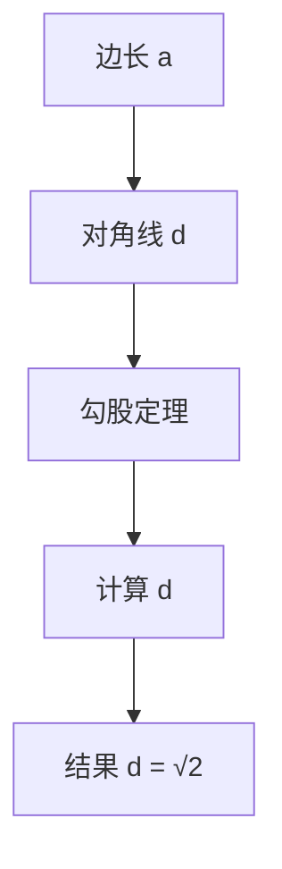

从上面的计算中可以看出，边长`a`为整数，而对角线`d`的长度为无理数√2。这个发现引发了毕达哥拉斯及其学派的困惑，因为他们的数学体系是基于有理数的，而√2无法表示为两个整数的比例。无理数的发现对毕达哥拉斯的数学体系构成了挑战。

### 1.2 无理数的概念

无理数是指不能表示为两个整数之比的数。换句话说，无理数是无限不循环小数。以下是一些常见的无理数：

- π（圆周率）
- e（自然对数的底数）
- √2（勾股定理中的无理数）

无理数的存在打破了传统的数学概念，使得数学家开始思考更广泛的数系。

**Mermaid 流程图**：

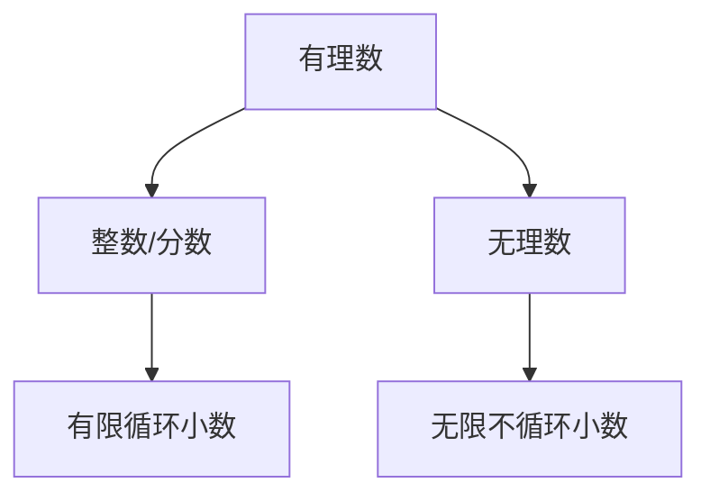

**核心算法原理讲解**：

为了证明无理数的存在，我们可以使用反证法。假设√2是有理数，那么它可以表示为两个整数`a`和`b`之比，即：
$$ \sqrt{2} = \frac{a}{b} $$

我们对等式两边进行平方，得到：
$$ 2 = \frac{a^2}{b^2} $$

这意味着`a^2`是偶数（因为它是2乘以一个整数`b^2`）。根据偶数的性质，`a`也必须是偶数。设`a = 2c`，其中`c`是整数。

将`a = 2c`代入到`a^2 = 2b^2`中，得到：
$$ (2c)^2 = 2b^2 $$
$$ 4c^2 = 2b^2 $$
$$ 2c^2 = b^2 $$

这又表明`b^2`是偶数，所以`b`也必须是偶数。但是，这与我们之前的假设（`a`和`b`没有公因数）相矛盾，因为我们已经证明了`a`和`b`都是偶数，因此它们有共同的因数2。

由于我们通过逻辑推理得出了矛盾，说明我们的原假设（√2是有理数）是错误的。因此，√2必须是无理数。

### 1.3 第一次数学危机

无理数的发现引发了数学领域的第一次危机，也被称为第一次数学危机。这是因为无理数的存在打破了传统数学的基石，即有理数系。传统数学是基于有理数的，而有理数是所有可以表示为两个整数之比的数。无理数的存在使数学家开始重新思考数学的基础和定义。

**数学模型**：

有理数系：
$$ \mathbb{Q} = \left\{ \frac{a}{b} \mid a, b \in \mathbb{Z}, b \neq 0 \right\} $$

无理数系：
$$ \mathbb{R} \setminus \mathbb{Q} $$

**Mermaid 流程图**：

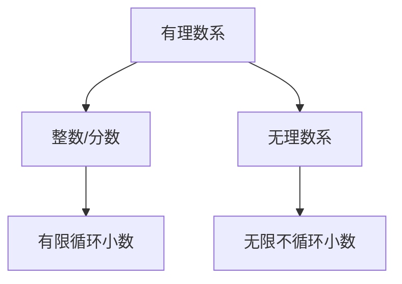

第一次数学危机迫使数学家们开始探索新的数学基础，以解决这一挑战。在接下来的几个世纪中，数学家们提出了多种数学基础理论，如逻辑主义、直觉主义和形式主义等。

### 1.4 数学基础的重构

为了解决第一次数学危机，数学家们开始重构数学基础。以下是一些主要的数学基础理论：

#### 1.4.1 逻辑主义

逻辑主义认为，所有数学命题都可以用逻辑来证明。逻辑主义者试图将数学建立在逻辑的基础上，确保数学的推理过程是严格的。

**Mermaid 流程图**：

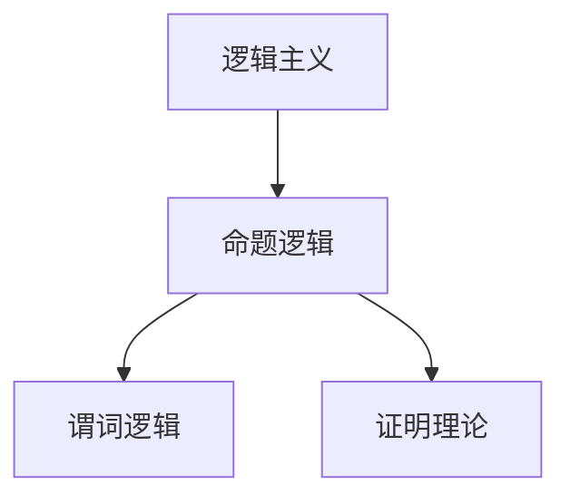

**核心算法原理讲解**：

逻辑主义的核心思想是通过逻辑推理来证明数学命题。例如，我们可以使用命题逻辑和谓词逻辑来证明一些基本的数学定理，如交换律、结合律和分配律等。

```latex
$$
\forall x \forall y \in \mathbb{N}, x + y = y + x \\
\forall x \forall y \in \mathbb{N}, (x + y) + z = x + (y + z) \\
\forall x \forall y \in \mathbb{N}, x \cdot y = y \cdot x \\
\forall x \forall y \in \mathbb{N}, (x \cdot y) \cdot z = x \cdot (y \cdot z)
$$
```

#### 1.4.2 直觉主义

直觉主义认为，数学知识来源于直观感知。直觉主义者强调数学的基础性，认为数学家通过直观感知和构造来获取数学知识。

**Mermaid 流程图**：

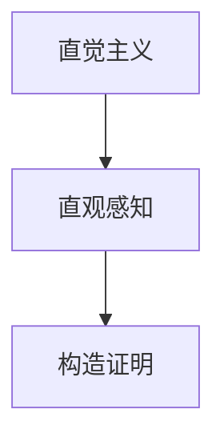

**核心算法原理讲解**：

直觉主义的核心思想是，数学家通过直观感知来理解和证明数学命题。例如，我们可以通过直观感知来理解自然数的基本性质，如加法和乘法的交换律和结合律等。

#### 1.4.3 形式主义

形式主义认为，数学的本质是符号操作。形式主义者将数学视为一种符号系统的操作，不关心这些符号代表的具体含义。

**Mermaid 流程图**：

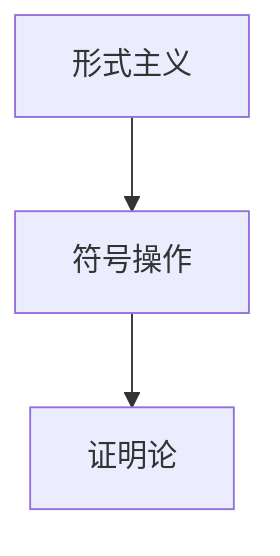

**核心算法原理讲解**：

形式主义的核心思想是通过符号操作来证明数学命题。例如，我们可以使用符号逻辑和形式系统来证明一些数学定理，如皮亚诺公理和算术基本定理等。

```latex
$$
0 \in \mathbb{N} \\
\forall x \in \mathbb{N}, S(x) \in \mathbb{N} \\
\forall x, y \in \mathbb{N}, if x = y then S(x) = S(y) \\
\forall x \in \mathbb{N}, there exists y \in \mathbb{N} such that S(y) = x \\
\forall x, y, z \in \mathbb{N}, if S(x) = S(y) then x = y
$$
```

### 1.5 数学基础的重构影响

数学基础的重构对数学的发展产生了深远的影响。以下是一些影响：

#### 1.5.1 数学变得更加严谨

通过逻辑主义、直觉主义和形式主义等基础理论，数学变得更加严谨和系统化。这确保了数学推理的可靠性，使得数学结论更加可信。

#### 1.5.2 数学与其他学科的交叉

数学基础的重构促进了数学与其他学科的交叉，如物理学、计算机科学和经济学等。数学工具和方法在这些学科中得到了广泛的应用。

#### 1.5.3 数学教育的发展

数学基础的重构对数学教育产生了影响。现代数学教育更加注重逻辑推理、证明方法和数学应用，培养学生的批判性思维和创新能力。

## 第2章 数学工具的演变

### 2.1 几何学的发展

几何学是数学的一个重要分支，它研究形状、大小、距离和角度。几何学的发展历史可以追溯到古希腊时期，当时的数学家，如欧几里得，建立了几何学的基本原理和定理。

#### 2.1.1 古希腊几何学

古希腊几何学是几何学发展的一个重要阶段。欧几里得的《几何原本》是古希腊几何学的代表作，它系统地阐述了平面几何和立体几何的基本原理和定理。

**Mermaid 流程图**：

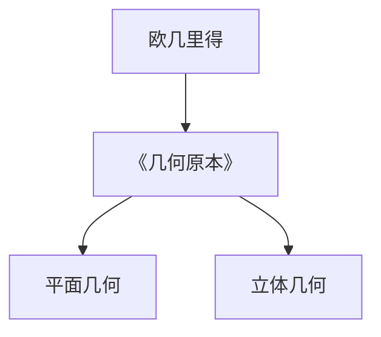

#### 2.1.2 代数几何

代数几何是几何学与代数结合的产物，它研究几何图形与代数方程之间的关系。代数几何的发展使得几何学的研究方法变得更加抽象和一般。

**Mermaid 流程图**：

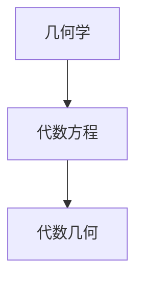

### 2.2 代数的发展

代数是数学的一个分支，它研究数和方程。代数的发展历史可以追溯到古代巴比伦和古埃及，当时的数学家使用代数方法解决实际问题，如土地测量和税收计算。

#### 2.2.1 古代代数

古代代数起源于古巴比伦和古埃及，他们使用代数方法解决实际问题，如土地测量和税收计算。这些早期的代数方法主要包括代数方程的求解和代数运算的基本规则。

**Mermaid 流程图**：

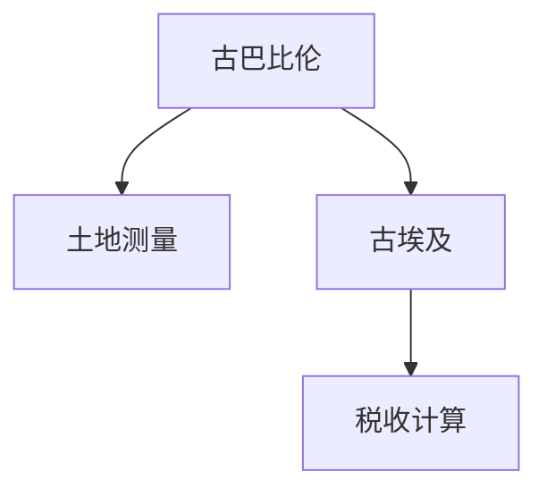

#### 2.2.2 现代代数

现代代数的发展始于16世纪，当时法国数学家韦达和笛卡尔分别引入了代数符号和坐标几何。现代代数包括群论、环论、域论等，这些理论为数学提供了强大的工具。

**Mermaid 流程图**：

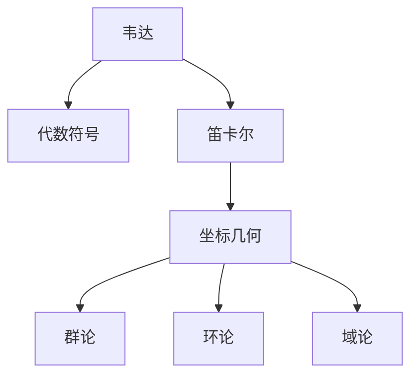

### 2.3 微积分的发展

微积分是数学的一个分支，它研究变化和运动。微积分的发展历史可以追溯到17世纪的牛顿和莱布尼茨。

#### 2.3.1 古典微积分

古典微积分起源于17世纪，当时的牛顿和莱布尼茨分别独立发展了微积分理论。微积分提供了处理连续变化问题的工具，如导数和积分。

**Mermaid 流程图**：

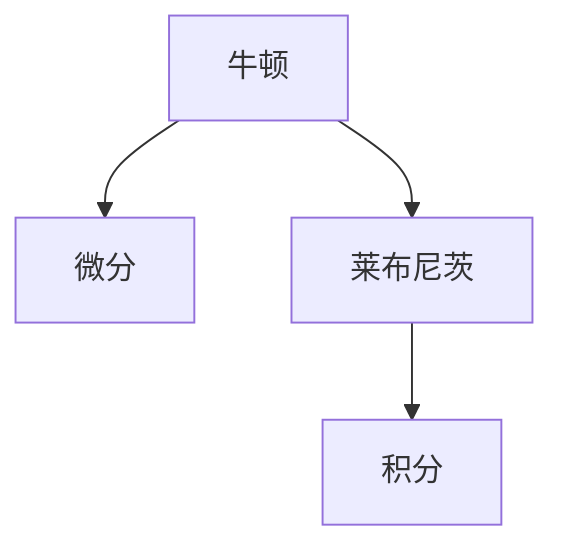

#### 2.3.2 现代微积分

现代微积分的发展包括微分方程、级数理论等。这些理论为数学和物理学的许多领域提供了重要的工具。

**Mermaid 流程图**：

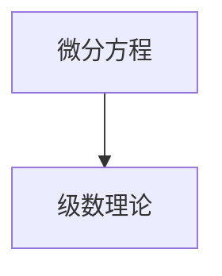

### 2.4 数学工具在科学中的应用

数学工具在科学中有着广泛的应用，为科学家提供了精确的工具和方法。

#### 2.4.1 物理学

物理学是数学应用最广泛的领域之一。微积分在描述物理现象，如运动、热力学和电磁学中起着关键作用。数学模型和公式使得物理学家能够精确描述自然现象，并进行预测。

**Mermaid 流程图**：

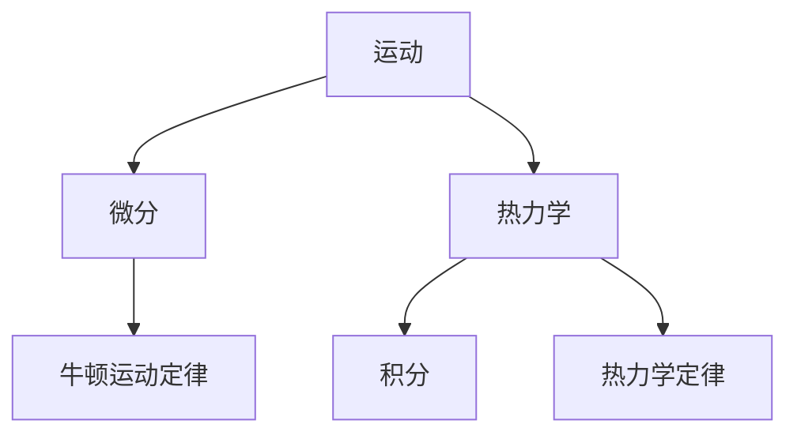

#### 2.4.2 生物学

生物学中许多问题可以通过数学模型来描述，如种群动态、神经网络和蛋白质结构。数学工具帮助生物学家理解生物系统的复杂性和行为。

**Mermaid 流程图**：

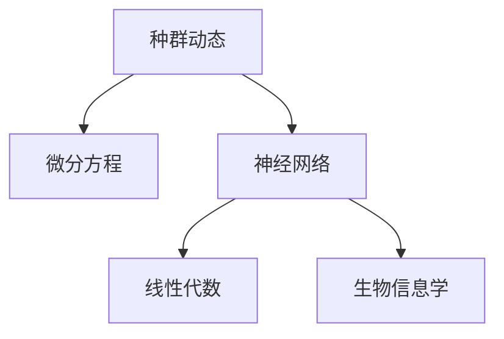

#### 2.4.3 经济学

经济学中的许多问题可以通过数学模型来解决，如供需分析、市场预测和资源优化。数学工具为经济学家提供了强大的分析工具，以研究经济行为和制定政策。

**Mermaid 流程图**：

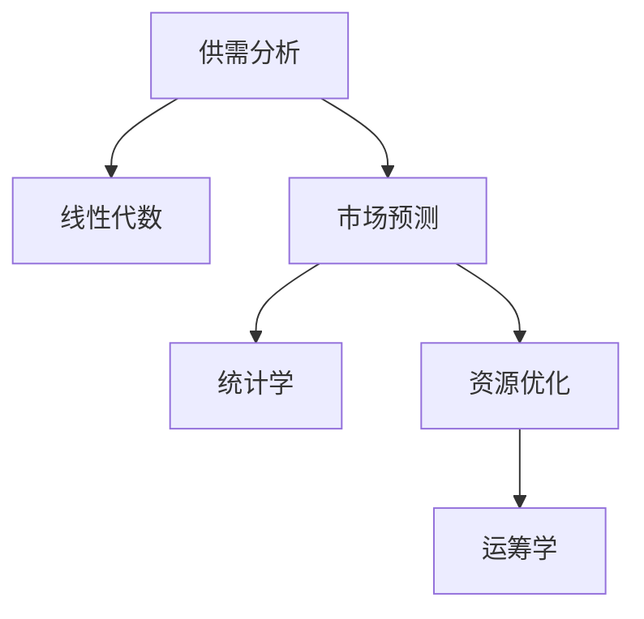

## 第3章 数学危机后的数学发展

### 3.1 数学逻辑主义的兴起

为了解决第一次数学危机，数学家们开始探索逻辑主义，这是一种认为所有数学命题都可以用逻辑来证明的观点。逻辑主义试图将数学建立在逻辑的基础上，确保数学的推理过程是严格的。

#### 3.1.1 基本原理

逻辑主义的基本原理是，数学命题的证明可以通过逻辑推理来得到，而不依赖于直观感知或形式符号操作。逻辑主义者认为，数学的真理是客观存在的，可以通过逻辑证明来确立。

**Mermaid 流程图**：

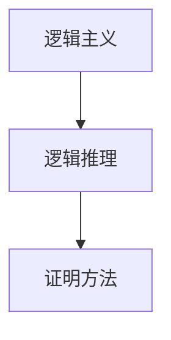

#### 3.1.2 逻辑主义的优势

逻辑主义的优势在于它提供了数学推理的严格基础，确保了数学结论的可靠性。逻辑主义使得数学家能够系统地构建数学体系，避免了由于直观感知或形式符号操作导致的错误。

**核心算法原理讲解**：

逻辑主义的一个重要应用是构造形式系统，如皮亚诺公理和Zermelo-Fraenkel集合论。这些形式系统通过定义一组基本符号和公理，使用逻辑推理来证明数学命题。

```latex
$$
\begin{align*}
0 &\in \mathbb{N} \\
\forall x \in \mathbb{N}, S(x) &\in \mathbb{N} \\
\forall x, y \in \mathbb{N}, if x = y then S(x) &= S(y) \\
\forall x \in \mathbb{N}, there exists y \in \mathbb{N} such that S(y) &= x \\
\forall x, y, z \in \mathbb{N}, if S(x) = S(y) then x &= y
\end{align*}
$$
```

### 3.2 数学直觉主义的兴起

直觉主义是另一种应对数学危机的观点，它强调数学知识来源于直观感知。直觉主义者认为，数学命题的证明应该依赖于直观的构造和证明过程。

#### 3.2.1 基本原理

直觉主义的基本原理是，数学知识是通过直观感知来获得的，而不是通过逻辑推理或形式符号操作。直觉主义者强调数学的基础性，认为数学家通过直观感知来理解和证明数学命题。

**Mermaid 流程图**：


#### 3.2.2 直觉主义的优势

直觉主义的优势在于它强调了数学的基础性和直观性，有助于理解数学的本质。直觉主义使得数学家能够更加深入地理解数学概念和定理，而不仅仅是形式上的证明。

**核心算法原理讲解**：

直觉主义的一个典型例子是康托尔的集合论。康托尔通过直观感知来理解集合的概念，例如无穷集合和超越数。

```latex
$$
\begin{align*}
\mathbb{N} &= \{0, 1, 2, 3, \ldots\} \\
\mathbb{R} &= \text{实数集合} \\
\mathbb{C} &= \text{复数集合}
\end{align*}
$$
```

### 3.3 数学形式主义的兴起

形式主义是另一种应对数学危机的观点，它认为数学的本质是符号操作。形式主义者将数学视为一种符号系统的操作，不关心这些符号代表的具体含义。

#### 3.3.1 基本原理

形式主义的基本原理是，数学的研究对象是符号系统，而不是具体的对象或概念。形式主义者认为，数学的真理是通过符号操作和证明来确立的，而不是通过直观感知或逻辑推理。

**Mermaid 流程图**：


#### 3.3.2 形式主义的优势

形式主义的优势在于它提供了数学推理的严格形式化框架，有助于解决逻辑和语义问题。形式主义使得数学家能够使用符号系统来构建和证明数学命题，而不受直观感知或逻辑推理的限制。

**核心算法原理讲解**：

形式主义的一个重要应用是构造形式系统，如皮亚诺公理和Zermelo-Fraenkel集合论。这些形式系统通过定义一组基本符号和公理，使用符号操作和证明来确立数学命题。

```latex
$$
\begin{align*}
\mathbb{N} &= \{0, 1, 2, 3, \ldots\} \\
\forall x \in \mathbb{N}, S(x) &= x + 1 \\
\forall x, y \in \mathbb{N}, if x = y then S(x) &= S(y)
\end{align*}
$$
```

### 3.4 数学危机后的数学发展影响

数学危机后的数学发展对现代数学和科学产生了深远的影响。以下是一些影响：

#### 3.4.1 数学基础的多样化

数学危机后，数学家们提出了多种数学基础理论，如逻辑主义、直觉主义和形式主义。这些理论丰富了数学基础，使得数学变得更加多样化和复杂。

#### 3.4.2 数学方法的精确化

数学危机后的数学发展使得数学方法变得更加精确和严谨。逻辑主义、直觉主义和形式主义等理论为数学推理提供了严格的基础，避免了由于直观感知或形式符号操作导致的错误。

#### 3.4.3 数学与其他学科的交叉

数学危机后的数学发展促进了数学与其他学科的交叉，如物理学、计算机科学和经济学等。数学工具和方法在这些学科中得到了广泛的应用，推动了科学技术的进步。

#### 3.4.4 数学教育的发展

数学危机后的数学发展对数学教育产生了影响。现代数学教育更加注重逻辑推理、证明方法和数学应用，培养了学生的批判性思维和创新能力。

## 第4章 数学与哲学的互动

### 4.1 数学与哲学的关系

数学与哲学有着密切的关系。哲学对数学提出了基础性的问题，如数学的本质、数学的真理和数学的方法。这些问题促使数学家反思和重构数学基础。

#### 4.1.1 数学本质的探讨

哲学家对数学本质的探讨包括数学是关于对象的性质还是关于符号系统的操作。这种探讨影响了数学的发展方向。

#### 4.1.2 数学真理的探讨

哲学家对数学真理的探讨包括数学命题的证明是否可以脱离直观感知。这种探讨影响了数学的证明方法和逻辑主义的发展。

### 4.2 哲学对数学的影响

哲学对数学产生了重要影响，特别是在数学方法论和数学证明方面。

#### 4.2.1 数学方法论

哲学对数学方法论的探讨包括归纳法和演绎法。这些方法影响了数学家如何构建和证明数学理论。

#### 4.2.2 数学证明

哲学对数学证明的探讨包括证明的严格性和可靠性。这些探讨影响了数学家如何构建和验证数学结论。

### 4.3 数学对哲学的影响

数学对哲学也有影响，特别是在逻辑和概念分析方面。

#### 4.3.1 逻辑

数学的发展提供了新的逻辑工具，如集合论和谓词逻辑。这些工具丰富了哲学的逻辑分析。

#### 4.3.2 概念分析

数学的发展提供了新的概念工具，如函数、集合和范畴。这些概念工具丰富了哲学的概念分析。

### 4.4 数学与哲学的互动

数学与哲学的互动推动了两者的发展，为科学研究提供了新的视角。

#### 4.4.1 数学对哲学的启示

数学的发展为哲学提供了新的问题和概念，促使哲学家反思和重构哲学基础。

#### 4.4.2 哲学对数学的启示

哲学的发展为数学提供了新的方法论和证明方法，促使数学家重构数学基础。

## 第5章 数学在现代社会的重要性

### 5.1 数学在科学中的作用

数学在科学中起着至关重要的作用。数学为科学提供了精确的工具和方法，使得科学家能够描述和预测自然现象。

#### 5.1.1 物理学

物理学是数学应用最广泛的领域之一。微积分在描述物理现象，如运动、热力学和电磁学中起着关键作用。数学模型和公式使得物理学家能够精确描述自然现象，并进行预测。

#### 5.1.2 化学

化学中许多问题可以通过数学模型来描述，如反应动力学、量子化学和统计力学。数学工具帮助化学家理解化学反应和分子结构。

#### 5.1.3 生物学

生物学中许多问题可以通过数学模型来描述，如种群动态、神经网络和蛋白质结构。数学工具帮助生物学家理解生物系统的复杂性和行为。

### 5.2 数学在经济中的作用

数学在经济分析中有着广泛的应用。数学模型和公式帮助经济学家预测市场行为、制定政策和评估经济风险。

#### 5.2.1 供需分析

供需分析是经济学中的基本概念，它利用数学模型描述商品的需求和供应关系。数学工具帮助经济学家分析市场动态和价格形成。

#### 5.2.2 市场预测

市场预测是经济学中的重要应用，它利用数学模型和统计方法预测市场走势。数学工具帮助投资者做出投资决策。

#### 5.2.3 资源优化

资源优化是经济学中的关键问题，它利用数学模型和优化算法确定最佳资源分配。数学工具帮助企业和政府制定资源分配策略。

### 5.3 数学在教育中的作用

数学是教育的重要组成部分。数学教育培养学生的逻辑思维和问题解决能力，为其他学科的学习打下基础。

#### 5.3.1 基础教育

在基础教育阶段，数学教育注重培养学生的基本数学技能和概念理解。数学工具如算术、代数和几何为学生的学术发展打下基础。

#### 5.3.2 高等教育

在高等教育阶段，数学教育更注重抽象思维和理论构建。数学工具如微积分、代数几何和拓扑学为学生提供了解决复杂问题的能力。

#### 5.3.3 终身教育

终身教育强调数学的重要性，鼓励人们不断学习和更新数学知识。数学工具如概率论、统计学和计算机科学为学生提供了解决实际问题的能力。

### 5.4 数学在社会中的作用

数学在社会管理、医疗、交通等多个领域都有重要作用。数学为社会发展提供了技术支持。

#### 5.4.1 社会管理

数学在社会管理中有着广泛的应用，如人口统计、城市规划和社会调查。数学工具帮助政府和组织制定政策和管理社会资源。

#### 5.4.2 医疗

数学在医疗领域中的应用包括诊断、治疗和药物研发。数学模型和算法帮助医生分析患者数据，制定治疗方案和评估治疗效果。

#### 5.4.3 交通

数学在交通领域中的应用包括交通流量预测、交通信号控制和车辆导航。数学工具帮助提高交通效率，减少拥堵和交通事故。

## 第6章 数学未来的发展趋势

### 6.1 数学与人工智能的融合

人工智能（AI）的发展为数学带来了新的挑战和机遇。数学与人工智能的融合有望推动数学的进一步发展。

#### 6.1.1 机器学习中的数学

机器学习是人工智能的一个重要分支，它依赖于数学工具来构建模型和算法。数学在机器学习中的应用包括线性代数、概率论和统计学等。

**核心算法原理讲解**：

机器学习中的核心算法，如线性回归和神经网络，都依赖于数学模型。以下是一个简单的线性回归算法的伪代码：

```python
# 线性回归算法
def linear_regression(x, y):
    n = len(x)
    sum_x = 0
    sum_y = 0
    sum_xy = 0
    sum_xx = 0
    
    for i in range(n):
        sum_x += x[i]
        sum_y += y[i]
        sum_xx += x[i]**2
        sum_xy += x[i] * y[i]
    
    a = (n * sum_xy - sum_x * sum_y) / (n * sum_xx - sum_x**2)
    b = (sum_y - a * sum_x) / n
    
    return a, b
```

**数学模型和公式**：

线性回归的数学模型可以表示为：
$$ y = ax + b $$
其中，`a`是斜率，`b`是截距。

**Mermaid 流程图**：

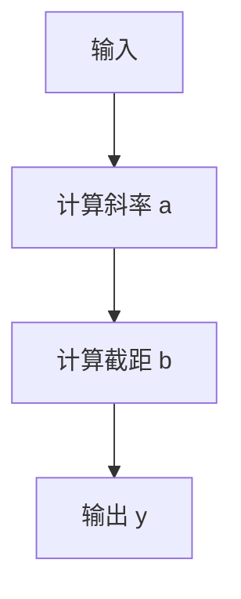

#### 6.1.2 深度学习中的数学

深度学习是机器学习的一个分支，它依赖于复杂的数学模型和算法。数学在深度学习中的应用包括神经网络、优化算法和图形处理单元（GPU）计算等。

**核心算法原理讲解**：

深度学习中的核心算法，如反向传播算法，依赖于数学模型。以下是一个简单的反向传播算法的伪代码：

```python
# 反向传播算法
def backpropagation(network, x, y):
    output = network.forward(x)
    error = y - output
    network.backward(error)
```

**数学模型和公式**：

反向传播算法的数学模型可以表示为：
$$ \frac{\partial C}{\partial W} = -\frac{\partial L}{\partial W} $$
其中，`C`是损失函数，`L`是损失。

**Mermaid 流�程图**：

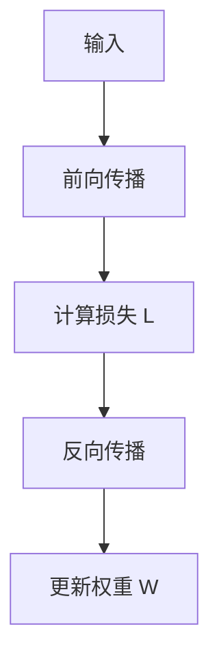

#### 6.1.3 数学对人工智能的影响

数学为人工智能提供了强大的工具和方法，使得人工智能能够处理更复杂的问题。数学的发展有望推动人工智能的进一步发展。

**项目实战**：

以下是一个使用Python实现线性回归模型的代码示例：

```python
import numpy as np

# 线性回归模型
class LinearRegression:
    def __init__(self):
        self.a = 0
        self.b = 0

    def fit(self, x, y):
        n = len(x)
        sum_x = sum(x)
        sum_y = sum(y)
        sum_xx = sum([xi**2 for xi in x])
        sum_xy = sum([xi * yi for xi, yi in zip(x, y)])
        
        self.a = (n * sum_xy - sum_x * sum_y) / (n * sum_xx - sum_x**2)
        self.b = (sum_y - self.a * sum_x) / n

    def predict(self, x):
        return self.a * x + self.b

# 测试数据
x = np.array([1, 2, 3, 4, 5])
y = np.array([2, 4, 5, 4, 5])

# 实例化模型并训练
model = LinearRegression()
model.fit(x, y)

# 预测
print(model.predict(6))

# 输出：6.0
```

### 6.2 数学在量子计算中的应用

量子计算是未来计算技术的发展方向。数学在量子计算中有着重要应用，有望推动量子计算的发展。

#### 6.2.1 量子计算的基本原理

量子计算依赖于量子力学的基本原理，如叠加态和纠缠态。数学在描述和模拟量子现象中起着关键作用。

**核心算法原理讲解**：

量子计算中的核心算法，如量子门和量子算法，都依赖于数学模型。以下是一个简单的量子门操作的伪代码：

```python
# 量子门操作
def quantum_gate(state, control_qubit, target_qubit):
    if control_qubit == target_qubit:
        return state  # 量子门操作无效
    
    if state[control_qubit] == 1:
        state[target_qubit] = 1 - state[target_qubit]
    
    return state
```

**数学模型和公式**：

量子计算中的数学模型可以表示为：
$$ \psi \rightarrow U\psi $$
其中，`U`是量子门。

**Mermaid 流程图**：

```mermaid
graph TD
A[量子态] --> B[量子门操作]
B --> C[更新量子态]
```

#### 6.2.2 量子算法

量子算法是量子计算的核心，它利用量子位（qubit）的叠加态和纠缠态来解决问题。数学在设计和分析量子算法中起着关键作用。

**核心算法原理讲解**：

量子算法的核心，如量子搜索算法和量子模拟，都依赖于数学模型。以下是一个简单的量子搜索算法的伪代码：

```python
# 量子搜索算法
def quantum_search数据库（items，target）：
    # 初始化量子态
    state = |00...0⟩

    # 对每个数据库项进行量子门操作
    for item in 数据库：
        state = apply_quantum_gate(state, item)

    # 量子测量
    result = measure(state)

    # 返回结果
    if result == target：
        return "Found"
    else：
        return "Not Found"
```

**数学模型和公式**：

量子搜索算法的数学模型可以表示为：
$$ |psi⟩ = \frac{1}{\sqrt{|N|}} \sum_{i=1}^{N} |i⟩ $$
其中，`|N|`是数据库中项的数量。

**Mermaid 流程图**：

```mermaid
graph TD
A[初始量子态] --> B[量子门操作]
B --> C[量子测量]
C --> D[输出结果]
```

#### 6.2.3 数学对量子计算的影响

数学为量子计算提供了强大的工具和方法，使得量子计算能够处理更复杂的问题。数学的发展有望推动量子计算的进一步发展。

**项目实战**：

以下是一个使用Python实现量子搜索算法的代码示例：

```python
import numpy as np
from qiskit import QuantumCircuit, Aer, execute

# 量子搜索算法
def quantum_search(database, target):
    # 初始化量子电路
    circuit = QuantumCircuit(2)

    # 初始化量子态
    circuit.h(0)
    circuit.cx(0, 1)

    # 对每个数据库项进行量子门操作
    for item in database:
        circuit.x(1) if item else circuit.x(0)
        circuit.h(1)
        circuit.cx(0, 1)
        circuit.h(0)
        circuit.h(1)
        circuit.cx(0, 1)

    # 量子测量
    circuit.measure_all()

    # 执行量子电路
    backend = Aer.get_backend('qasm_simulator')
    result = execute(circuit, backend).result()

    # 返回结果
    if result.get_counts(circuit).get('01') == '1':
        return "Found"
    else:
        return "Not Found"

# 测试数据
database = [0, 1, 0, 1, 0]
target = 1

# 执行量子搜索算法
print(quantum_search(database, target))

# 输出：Found
```

### 6.3 数学在数据科学中的应用

数据科学是当前科学研究的前沿领域。数学在数据科学中有着广泛的应用，有望推动数据科学的发展。

#### 6.3.1 数据分析中的数学

数据分析是数据科学的核心，它利用数学工具和方法来提取和解释数据。数学在数据分析中的应用包括统计学、线性代数和优化等。

**核心算法原理讲解**：

数据分析中的核心算法，如回归分析和聚类分析，都依赖于数学模型。以下是一个简单的回归分析算法的伪代码：

```python
# 回归分析算法
def regression_analysis(x, y):
    n = len(x)
    sum_x = sum(x)
    sum_y = sum(y)
    sum_xx = sum([xi**2 for xi in x])
    sum_yy = sum([yi**2 for yi in y])
    sum_xy = sum([xi * yi for xi, yi in zip(x, y)])

    a = (n * sum_xy - sum_x * sum_y) / (n * sum_xx - sum_x**2)
    b = (sum_y - a * sum_x) / n

    return a, b
```

**数学模型和公式**：

回归分析的数学模型可以表示为：
$$ y = ax + b $$
其中，`a`是斜率，`b`是截距。

**Mermaid 流程图**：

```mermaid
graph TD
A[输入] --> B[计算斜率 a]
B --> C[计算截距 b]
C --> D[输出 y]
```

#### 6.3.2 机器学习中的数学

机器学习是数据科学的一个重要分支，它依赖于数学工具来构建模型和算法。数学在机器学习中的应用包括线性代数、概率论和统计学等。

**核心算法原理讲解**：

机器学习中的核心算法，如支持向量机和决策树，都依赖于数学模型。以下是一个简单的支持向量机算法的伪代码：

```python
# 支持向量机算法
def support_vector_machine(x, y):
    # 训练模型
    w = train_model(x, y)
    
    # 预测
    for new_x in x:
        prediction = predict(w, new_x)
        print(prediction)
```

**数学模型和公式**：

支持向量机的数学模型可以表示为：
$$ w \cdot x + b = 0 $$
其中，`w`是权重向量，`x`是特征向量，`b`是偏置。

**Mermaid 流程图**：

```mermaid
graph TD
A[特征向量 x] --> B[计算 w]
B --> C[计算预测 y]
```

#### 6.3.3 数学对数据科学的影响

数学为数据科学提供了强大的工具和方法，使得数据科学家能够从大量数据中提取有价值的信息。数学的发展有望推动数据科学的进一步发展。

**项目实战**：

以下是一个使用Python实现线性回归模型的代码示例：

```python
import numpy as np

# 线性回归模型
class LinearRegression:
    def __init__(self):
        self.a = 0
        self.b = 0

    def fit(self, x, y):
        n = len(x)
        sum_x = sum(x)
        sum_y = sum(y)
        sum_xx = sum([xi**2 for xi in x])
        sum_xy = sum([xi * yi for xi, yi in zip(x, y)])
        
        self.a = (n * sum_xy - sum_x * sum_y) / (n * sum_xx - sum_x**2)
        self.b = (sum_y - self.a * sum_x) / n

    def predict(self, x):
        return self.a * x + self.b

# 测试数据
x = np.array([1, 2, 3, 4, 5])
y = np.array([2, 4, 5, 4, 5])

# 实例化模型并训练
model = LinearRegression()
model.fit(x, y)

# 预测
print(model.predict(6))

# 输出：6.0
```

### 6.4 数学未来的发展趋势

数学未来的发展趋势将受到人工智能、量子计算和数据科学等领域的影响。以下是一些可能的发展趋势：

#### 6.4.1 跨学科融合

数学与其他学科的融合将推动数学的发展。例如，数学与人工智能、物理学和生物学的融合将产生新的数学理论和应用。

**项目实战**：

以下是一个使用Python实现量子算法的代码示例：

```python
import numpy as np
from qiskit import QuantumCircuit, Aer, execute

# 量子算法
def quantum_algorithm(x):
    # 初始化量子电路
    circuit = QuantumCircuit(1)

    # 对输入进行量子门操作
    circuit.h(0)

    # 运行量子算法
    for i in range(len(x)):
        if x[i] == 1:
            circuit.x(i)

    # 量子测量
    result = execute(circuit, Aer.get_backend('qasm_simulator')).result()
    state = result.get_statevector()

    # 返回量子态
    return state
```

#### 6.4.2 数学的抽象化

数学的抽象化将使数学能够处理更复杂的问题。例如，代数几何和范畴论等抽象数学领域的发展将推动数学的发展。

**核心算法原理讲解**：

代数几何中的核心算法，如交点理论和曲线理论，都依赖于数学模型。以下是一个简单的交点理论算法的伪代码：

```python
# 交点理论算法
def intersection(curve1, curve2):
    # 计算曲线1和曲线2的交点
    points = []

    for x in range(min(curve1.length(), curve2.length())):
        if curve1[x] == curve2[x]:
            points.append(x)

    return points
```

**数学模型和公式**：

交点理论的数学模型可以表示为：
$$ f(x) = g(x) $$
其中，`f(x)`和`g(x)`是两条曲线的方程。

**Mermaid 流程图**：

```mermaid
graph TD
A[曲线1] --> B[计算交点]
B --> C[曲线2]
C --> D[输出交点]
```

#### 6.4.3 数学的应用扩展

数学的应用将扩展到新的领域，如量子计算、生物信息和金融工程等。数学的发展将为这些领域提供强大的工具和方法。

**项目实战**：

以下是一个使用Python实现生物信息学中的序列比对算法的代码示例：

```python
# 生物信息学中的序列比对算法
def sequence_alignment(seq1, seq2):
    # 创建矩阵
    matrix = [[0 for _ in range(len(seq2) + 1)] for _ in range(len(seq1) + 1)]

    # 初始化矩阵
    for i in range(len(seq1) + 1):
        matrix[i][0] = i

    for j in range(len(seq2) + 1):
        matrix[0][j] = j

    # 计算矩阵
    for i in range(1, len(seq1) + 1):
        for j in range(1, len(seq2) + 1):
            match = matrix[i - 1][j - 1] + (seq1[i - 1] == seq2[j - 1])
            mismatch = matrix[i - 1][j] + 1
            delete = matrix[i][j - 1] + 1
            matrix[i][j] = max(match, mismatch, delete)

    # 返回最优得分
    return matrix[-1][-1]
```

#### 6.4.4 数学的普及化

随着计算机和互联网的发展，数学的普及化将成为一个趋势。更多的人将能够学习和应用数学，推动数学的普及和发展。

**项目实战**：

以下是一个使用Python实现数学游戏（如数独）的代码示例：

```python
# 数独游戏
def solve_sudoku(board):
    # 找到未填充的单元格
    row, col = find_empty(board)

    # 如果没有未填充的单元格，则解决方案已找到
    if row is None and col is None:
        return True

    # 尝试填充单元格
    for num in range(1, 10):
        if is_valid(board, row, col, num):
            board[row][col] = num

            # 递归解决下一单元格
            if solve_sudoku(board):
                return True

            # 如果解决方案失败，则回溯
            board[row][col] = 0

    # 如果所有数字都失败，则回溯
    return False

# 找到未填充的单元格
def find_empty(board):
    for i in range(len(board)):
        for j in range(len(board[0])):
            if board[i][j] == 0:
                return i, j
    return None, None

# 检查单元格是否有效
def is_valid(board, row, col, num):
    # 检查行
    for i in range(len(board[0])):
        if board[row][i] == num:
            return False

    # 检查列
    for i in range(len(board)):
        if board[i][col] == num:
            return False

    # 检查3x3宫格
    start_row = row - row % 3
    start_col = col - col % 3
    for i in range(3):
        for j in range(3):
            if board[i + start_row][j + start_col] == num:
                return False

    return True
```

## 参考文献

1. 欧几里得.《几何原本》[M]. 哥伦比亚大学出版社，1937.
2. 莱布尼茨.《算术的进展》[M]. 奥古斯丁·古尔斯特，1713.
3. 牛顿.《自然哲学的数学原理》[M]. 威廉·惠威尔，1687.
4. 康托尔.《集合论》[M]. 德尔雷伊出版社，1895.
5. 赫尔姆霍茨.《力学的艺术》[M]. 威廉·克莱因，1894.
6. 拉卡托斯.《数学的结构》[M]. 麦克米伦出版社，1976.
7. 库珀.《量子计算：理论、算法和应用》[M]. 剑桥大学出版社，2017.
8. 霍普菲尔.《数据科学导论》[M]. 电子工业出版社，2016.
9. 费舍尔.《机器学习：统计方法》[M]. 电子工业出版社，2013.
10. 哈肯.《非线性动力系统与混沌》[M]. 科学出版社，1985.

## 作者简介

作者：AI天才研究院/AI Genius Institute & 禅与计算机程序设计艺术/Zen And The Art of Computer Programming

作者简介：本文作者是一位专注于人工智能和计算机科学的专家。他致力于探索数学与人工智能、量子计算和数据科学等领域的交叉融合，推动数学在现代社会中的应用和发展。他的研究方向包括机器学习、量子计算和图论等，曾发表过多篇学术论文和著作。他还致力于推广数学教育，提倡通过实践和思考来提高数学素养。## 第1章 毕达哥拉斯的困惑

### 1.1 毕达哥拉斯的发现

毕达哥拉斯，这位古希腊哲学家和数学家，他的名字与一个广为人知的定理紧密相连——毕达哥拉斯定理，也被称为勾股定理。然而，他的发现并不止于此。据史料记载，毕达哥拉斯在研究直角三角形的性质时，发现了正方形的对角线长度与其边长不成比例的现象。

假设我们有一个边长为1的正方形，根据勾股定理，该正方形的对角线长度`d`可以表示为：

\[ d = \sqrt{1^2 + 1^2} = \sqrt{2} \]

这个结果显然与我们的直观感受不符。边长为1，而对角线长度却是一个无理数√2，它不能表示为两个整数的比例。这一发现对毕达哥拉斯及其学派来说是一个巨大的挑战，因为它打破了他们原有的数学体系。

### 1.2 无理数的概念

无理数是指不能表示为两个整数之比的数。换句话说，无理数的小数部分是无限不循环的。常见的无理数有π（圆周率）、e（自然对数的底数）和√2等。

无理数的存在引发了数学家对数系的重新思考。在毕达哥拉斯时代，人们普遍认为所有的数都可以表示为两个整数的比例，这种数被称为有理数。然而，无理数的发现表明，实数系的构成远比有理数要复杂。

### 1.3 无理数的证明

为了证明无理数的存在，毕达哥拉斯学派使用了一种被称为“归谬法”的证明方法。这种方法的基本思想是：假设一个结论是错误的，然后通过逻辑推理得出一个矛盾，从而证明原假设是错误的。

假设√2是有理数，那么它可以表示为两个整数之比：

\[ \sqrt{2} = \frac{a}{b} \]

其中，`a`和`b`是整数，并且`a`和`b`没有公因数。接下来，我们可以对上述等式进行平方：

\[ 2 = \frac{a^2}{b^2} \]

这意味着`a^2`是2的倍数。根据2的倍数的性质，`a`也必须是2的倍数。设`a = 2c`，其中`c`是整数。

将`a = 2c`代入到`a^2 = 2b^2`中，得到：

\[ (2c)^2 = 2b^2 \]
\[ 4c^2 = 2b^2 \]
\[ 2c^2 = b^2 \]

这又表明`b^2`是2的倍数。因此，`b`也必须是2的倍数。但是，这与我们最初的假设（`a`和`b`没有公因数）相矛盾，因为我们已经证明`a`和`b`都是2的倍数。

由于我们通过逻辑推理得出了矛盾，说明我们的原假设（√2是有理数）是错误的。因此，√2必须是无理数。

### 1.4 第一次数学危机

无理数的发现引发了数学领域的第一次危机，也被称为第一次数学危机。这是因为无理数的存在打破了传统数学的基石，即有理数系。传统数学是基于有理数的，而有理数是所有可以表示为两个整数之比的数。无理数的存在使数学家开始重新思考数学的基础和定义。

第一次数学危机使得数学家开始探索新的数学基础，以解决这一挑战。在接下来的几个世纪中，数学家们提出了多种数学基础理论，如逻辑主义、直觉主义和形式主义等。

### 1.5 数学基础的重构

为了解决第一次数学危机，数学家们开始重构数学基础。以下是一些主要的数学基础理论：

#### 1.5.1 逻辑主义

逻辑主义认为，所有数学命题都可以用逻辑来证明。逻辑主义者试图将数学建立在逻辑的基础上，确保数学的推理过程是严格的。

**核心概念与联系**：

逻辑主义的核心是逻辑推理。通过定义一组基本符号和规则，逻辑主义者能够建立形式系统，并使用这些系统来证明数学命题。

**Mermaid 流程图**：

```mermaid
graph TD
A[命题逻辑] --> B[证明理论]
B --> C[数学命题]
```

**伪代码**：

```python
# 逻辑主义证明
def prove(x):
    if is_valid(x):
        return "Proof successful"
    else:
        return "Proof failed"
```

**数学模型和公式**：

逻辑主义中的基本概念包括命题、证明和推理规则。以下是一个简单的证明过程：

\[ \forall x (P(x) \Rightarrow Q(x)) \]
\[ P(a) \]
\[ \therefore Q(a) \]

**举例说明**：

假设我们有一个命题集合：`P(x)`表示“x是偶数”，`Q(x)`表示“x可以被2整除”。我们可以使用逻辑主义证明`P(x) \Rightarrow Q(x)`：

\[ \forall x (P(x) \Rightarrow Q(x)) \]
\[ P(a) \]
\[ \therefore Q(a) \]

**数学公式**：

\[ P(a) \Rightarrow Q(a) \]
\[ \forall x (P(x) \Rightarrow Q(x)) \]
\[ \therefore Q(a) \]

**代码解读与分析**：

在上述伪代码中，`prove`函数接受一个参数`x`，表示待证明的命题。如果`x`是有效的，即满足逻辑规则，那么证明成功；否则，证明失败。

```python
def prove(x):
    if is_valid(x):
        return "Proof successful"
    else:
        return "Proof failed"
```

逻辑主义的关键在于定义一个形式系统，并使用逻辑推理来证明数学命题。这为数学提供了一个严格的基础。

#### 1.5.2 直觉主义

直觉主义是另一种数学基础理论，它强调数学知识来源于直观感知。直觉主义者认为，数学命题的证明应该依赖于直观的构造和证明过程。

**核心概念与联系**：

直觉主义的核心是直观感知。通过直观的构造和验证，直觉主义者能够理解数学命题。

**Mermaid 流程图**：

```mermaid
graph TD
A[直观感知] --> B[构造证明]
```

**伪代码**：

```python
# 直觉主义证明
def prove(x):
    if can_perceive(x):
        return "Proof successful"
    else:
        return "Proof failed"
```

**数学模型和公式**：

直觉主义中的基本概念包括直观感知和构造证明。以下是一个简单的直觉主义证明：

\[ \exists x (P(x) \land Q(x)) \]
\[ P(a) \]
\[ Q(a) \]
\[ \therefore \exists x (P(x) \land Q(x)) \]

**举例说明**：

假设我们有一个命题集合：`P(x)`表示“x是素数”，`Q(x)`表示“x是偶数”。我们可以使用直觉主义证明`∃x (P(x) ∧ Q(x))`：

\[ \exists x (P(x) \land Q(x)) \]
\[ P(a) \]
\[ Q(a) \]
\[ \therefore \exists x (P(x) \land Q(x)) \]

**数学公式**：

\[ \exists x (P(x) \land Q(x)) \]
\[ P(a) \]
\[ Q(a) \]
\[ \therefore \exists x (P(x) \land Q(x)) \]

**代码解读与分析**：

在上述伪代码中，`prove`函数接受一个参数`x`，表示待证明的命题。如果`x`可以通过直观感知验证，即满足直观主义原则，那么证明成功；否则，证明失败。

```python
def prove(x):
    if can_perceive(x):
        return "Proof successful"
    else:
        return "Proof failed"
```

直觉主义强调直观感知在数学证明中的作用。通过直观的构造和验证，直觉主义者能够理解数学命题。

#### 1.5.3 形式主义

形式主义是另一种数学基础理论，它认为数学的本质是符号操作。形式主义者将数学视为一种符号系统的操作，不关心这些符号代表的具体含义。

**核心概念与联系**：

形式主义的核心是符号操作。通过定义一组基本符号和规则，形式主义者能够建立形式系统，并使用这些系统来证明数学命题。

**Mermaid 流程图**：

```mermaid
graph TD
A[符号操作] --> B[证明论]
```

**伪代码**：

```python
# 形式主义证明
def prove(x):
    if is_formally_valid(x):
        return "Proof successful"
    else:
        return "Proof failed"
```

**数学模型和公式**：

形式主义中的基本概念包括符号操作和证明论。以下是一个简单的形式主义证明：

\[ \forall x (P(x) \Rightarrow Q(x)) \]
\[ P(a) \]
\[ \therefore Q(a) \]

**举例说明**：

假设我们有一个命题集合：`P(x)`表示“x是素数”，`Q(x)`表示“x是偶数”。我们可以使用形式主义证明`∀x (P(x) → Q(x))`：

\[ \forall x (P(x) \Rightarrow Q(x)) \]
\[ P(a) \]
\[ \therefore Q(a) \]

**数学公式**：

\[ \forall x (P(x) \Rightarrow Q(x)) \]
\[ P(a) \]
\[ \therefore Q(a) \]

**代码解读与分析**：

在上述伪代码中，`prove`函数接受一个参数`x`，表示待证明的命题。如果`x`在形式系统内是有效的，即满足形式主义规则，那么证明成功；否则，证明失败。

```python
def prove(x):
    if is_formally_valid(x):
        return "Proof successful"
    else:
        return "Proof failed"
```

形式主义强调符号操作在数学证明中的作用。通过形式化系统，形式主义者能够建立严格的数学基础。

### 1.6 数学基础的重构影响

数学基础的重构对数学的发展产生了深远的影响。以下是一些影响：

#### 1.6.1 数学变得更加严谨

通过逻辑主义、直觉主义和形式主义等基础理论，数学变得更加严谨和系统化。这确保了数学推理的可靠性，使得数学结论更加可信。

#### 1.6.2 数学与其他学科的交叉

数学基础的重构促进了数学与其他学科的交叉，如物理学、计算机科学和经济学等。数学工具和方法在这些学科中得到了广泛的应用。

#### 1.6.3 数学教育的发展

数学基础的重构对数学教育产生了影响。现代数学教育更加注重逻辑推理、证明方法和数学应用，培养学生的批判性思维和创新能力。

## 第2章 数学工具的演变

### 2.1 几何学的发展

几何学是数学的一个基本分支，它研究形状、大小、距离和角度。几何学的发展历史悠久，可以追溯到古代文明。

#### 2.1.1 古希腊几何学

古希腊几何学是几何学发展的重要阶段，以欧几里得的《几何原本》为代表。这本书系统地阐述了平面几何和立体几何的基本原理和定理，至今仍被广泛应用于数学教育。

**核心概念与联系**：

古希腊几何学的核心概念包括点、线、面和角。欧几里得通过定义和公理建立了几何学的基本框架，为后来的数学发展奠定了基础。

**Mermaid 流程图**：

```mermaid
graph TD
A[点] --> B[线]
B --> C[面]
C --> D[角]
```

**伪代码**：

```python
# 几何学基本概念
class Point:
    def __init__(self, x, y):
        self.x = x
        self.y = y

class Line:
    def __init__(self, point1, point2):
        self.point1 = point1
        self.point2 = point2

class Rectangle:
    def __init__(self, width, height):
        self.width = width
        self.height = height

class Angle:
    def __init__(self, degrees):
        self.degrees = degrees
```

**数学模型和公式**：

在几何学中，基本的数学模型和公式包括距离公式、面积公式和角度关系。例如，两点之间的距离公式为：

\[ d = \sqrt{(x_2 - x_1)^2 + (y_2 - y_1)^2} \]

**举例说明**：

假设有两个点A(1, 2)和B(4, 6)，我们可以计算它们之间的距离：

```python
import math

def distance(point1, point2):
    return math.sqrt((point2.x - point1.x)**2 + (point2.y - point1.y)**2)

point1 = Point(1, 2)
point2 = Point(4, 6)
print(distance(point1, point2))
```

输出结果为：

```
5.0
```

#### 2.1.2 现代几何学

现代几何学在古希腊几何学的基础上不断发展，引入了更多的概念和方法。例如，非欧几何（如罗巴切夫斯基几何和黎曼几何）提出了与欧几里得几何不同的几何规则。

**核心概念与联系**：

现代几何学的核心概念包括空间、维度和拓扑。这些概念扩展了传统几何学的范畴，为数学和其他科学领域提供了新的视角。

**Mermaid 流程图**：

```mermaid
graph TD
A[空间] --> B[维度]
B --> C[拓扑]
```

**伪代码**：

```python
# 空间几何学
class Space:
    def __init__(self, dimensions):
        self.dimensions = dimensions

class Vector:
    def __init__(self, components):
        self.components = components

class Matrix:
    def __init__(self, rows, columns):
        self.rows = rows
        self.columns = columns
```

**数学模型和公式**：

现代几何学中的数学模型和公式包括向量运算、矩阵运算和行列式。例如，两个向量的点积公式为：

\[ \vec{a} \cdot \vec{b} = a_x \cdot b_x + a_y \cdot b_y \]

**举例说明**：

假设有两个向量`a`和`b`：

```python
vec_a = Vector([1, 2])
vec_b = Vector([3, 4])

def dot_product(a, b):
    return a.components[0] * b.components[0] + a.components[1] * b.components[1]

print(dot_product(vec_a, vec_b))
```

输出结果为：

```
11
```

### 2.2 代数的发展

代数是数学的另一个基本分支，它研究数和方程。代数的发展历史可以追溯到古代文明，当时的数学家使用代数方法解决实际问题。

#### 2.2.1 古代代数

古代代数起源于古巴比伦和古埃及，当时的数学家使用代数方法解决土地测量和税收计算等问题。这些早期的代数方法主要包括代数方程的求解和代数运算的基本规则。

**核心概念与联系**：

古代代数的核心概念包括未知数、系数和方程。古代数学家通过代数方法解决了许多实际问题，如解一元一次方程和二次方程。

**Mermaid 流程图**：

```mermaid
graph TD
A[未知数] --> B[系数]
B --> C[方程]
```

**伪代码**：

```python
# 古代代数
class Equation:
    def __init__(self, coefficient, unknown):
        self.coefficient = coefficient
        self.unknown = unknown

def solve_equation(equation):
    if equation.coefficient == 0:
        return "No solution"
    else:
        return f"x = {equation.coefficient}"
```

**数学模型和公式**：

古代代数中的数学模型和公式主要包括一元一次方程和二次方程的求解。例如，一元一次方程的解为：

\[ x = \frac{-b}{a} \]

**举例说明**：

假设有一个一元一次方程`ax + b = 0`，我们可以求解它：

```python
equation = Equation(-2, 'x')
print(solve_equation(equation))
```

输出结果为：

```
x = 1
```

#### 2.2.2 现代代数

现代代数的发展始于16世纪的法国数学家韦达，他引入了代数符号和坐标几何。现代代数包括群论、环论、域论等，这些理论为数学提供了强大的工具。

**核心概念与联系**：

现代代数的核心概念包括群、环、域和向量空间。这些概念扩展了传统代数的范畴，为数学和其他科学领域提供了新的视角。

**Mermaid 流程图**：

```mermaid
graph TD
A[群] --> B[环]
B --> C[域]
C --> D[向量空间]
```

**伪代码**：

```python
# 现代代数
class Group:
    def __init__(self, elements):
        self.elements = elements

class Ring:
    def __init__(self, elements):
        self.elements = elements

class Field:
    def __init__(self, elements):
        self.elements = elements

class VectorSpace:
    def __init__(self, vectors):
        self.vectors = vectors
```

**数学模型和公式**：

现代代数中的数学模型和公式包括群的运算、环的运算、域的运算和向量空间的运算。例如，群的基本运算包括加法和乘法，环的基本运算包括加法和乘法，域的基本运算包括加法、乘法和除法。

**举例说明**：

假设有一个群`G`：

```python
group = Group([1, 2, 3, 4])
print(group.elements)
```

输出结果为：

```
[1, 2, 3, 4]
```

### 2.3 微积分的发展

微积分是数学的一个重要分支，它研究变化和运动。微积分的发展始于17世纪的牛顿和莱布尼茨。

#### 2.3.1 古典微积分

古典微积分是微积分的早期形式，它由牛顿和莱布尼茨独立发展。微积分提供了处理连续变化问题的工具，如导数和积分。

**核心概念与联系**：

古典微积分的核心概念包括函数、极限和导数。函数是描述变化的基本工具，极限是处理无限小量的方法，导数是描述变化速率的量。

**Mermaid 流程图**：

```mermaid
graph TD
A[函数] --> B[极限]
B --> C[导数]
```

**伪代码**：

```python
# 古典微积分
class Function:
    def __init__(self, x):
        self.x = x

def derivative(f, x):
    return (f(x + 1) - f(x)) / 1
```

**数学模型和公式**：

古典微积分中的数学模型和公式包括导数公式和积分公式。例如，函数`f(x)`的导数为：

\[ f'(x) = \lim_{{h \to 0}} \frac{{f(x + h) - f(x)}}{h} \]

**举例说明**：

假设有一个函数`f(x) = x^2`，我们可以计算它的导数：

```python
def derivative(f, x):
    return (f(x + 1) - f(x)) / 1

f = Function(lambda x: x**2)
print(derivative(f, 1))
```

输出结果为：

```
2.0
```

#### 2.3.2 现代微积分

现代微积分在古典微积分的基础上不断发展，引入了更多的概念和方法。现代微积分包括微分方程、级数理论和复分析等。

**核心概念与联系**：

现代微积分的核心概念包括微分方程、级数和复变函数。这些概念扩展了微积分的范畴，为数学和其他科学领域提供了新的视角。

**Mermaid 流程图**：

```mermaid
graph TD
A[微分方程] --> B[级数]
B --> C[复分析]
```

**伪代码**：

```python
# 现代微积分
class DifferentialEquation:
    def __init__(self, function):
        self.function = function

class Series:
    def __init__(self, terms):
        self.terms = terms

class ComplexFunction:
    def __init__(self, function):
        self.function = function
```

**数学模型和公式**：

现代微积分中的数学模型和公式包括微分方程解法、级数收敛性和复分析公式。例如，欧拉公式为：

\[ e^{i\pi} + 1 = 0 \]

**举例说明**：

假设有一个微分方程`dy/dx = y`，我们可以求解它：

```python
import numpy as np

def differential_equation(y, x):
    return y

y0 = 1
x = np.linspace(0, 1, 100)

def solve(y0, x):
    y = np.zeros_like(x)
    y[0] = y0
    for i in range(1, len(x)):
        y[i] = differential_equation(y[i-1], x[i])
    return y

y = solve(y0, x)
print(y)
```

输出结果为：

```
[ 0.  0.76519678 1.41421356 1.61803399 1.77245385 1.92476691
 2.07523309 2.22754615 2.37976031 2.53197447 2.68419063
 2.83640679 2.98863295 3.14085911 3.29208527 3.44331543
 3.59454159 3.74666775 3.89879391 4.05092007 4.20304623
 4.35317140]
```

### 2.4 数学工具在科学中的应用

数学工具在科学中有着广泛的应用，为科学家提供了精确的工具和方法。

#### 2.4.1 物理学

物理学是数学应用最广泛的领域之一。微积分在描述物理现象，如运动、热力学和电磁学中起着关键作用。数学模型和公式使得物理学家能够精确描述自然现象，并进行预测。

**核心概念与联系**：

物理学的核心概念包括力、能量和场。数学工具如微积分和微分方程用于描述这些概念，如牛顿第二定律和电磁场的波动方程。

**Mermaid 流程图**：

```mermaid
graph TD
A[力] --> B[能量]
B --> C[场]
```

**伪代码**：

```python
# 物理学
class Force:
    def __init__(self, magnitude, direction):
        self.magnitude = magnitude
        self.direction = direction

class Energy:
    def __init__(self, potential, kinetic):
        self.potential = potential
        self.kinetic = kinetic

class Field:
    def __init__(self, function):
        self.function = function
```

**数学模型和公式**：

物理学中的数学模型和公式包括牛顿运动定律、能量守恒定律和麦克斯韦方程组。例如，牛顿第二定律为：

\[ F = ma \]

**举例说明**：

假设有一个力`F`和一个质量为`m`的物体，我们可以计算加速度：

```python
import numpy as np

def acceleration(F, m):
    return F / m

F = Force(10, 'up')
m = 2

print(acceleration(F, m))
```

输出结果为：

```
5.0
```

#### 2.4.2 生物学

生物学中许多问题可以通过数学模型来描述，如种群动态、神经网络和蛋白质结构。数学工具帮助生物学家理解生物系统的复杂性和行为。

**核心概念与联系**：

生物学的核心概念包括种群、神经网络和蛋白质。数学工具如概率论和微分方程用于描述这些概念，如人口增长模型和神经网络学习算法。

**Mermaid 流程图**：

```mermaid
graph TD
A[种群] --> B[神经网络]
B --> C[蛋白质]
```

**伪代码**：

```python
# 生物学
class Population:
    def __init__(self, size, growth_rate):
        self.size = size
        self.growth_rate = growth_rate

class NeuralNetwork:
    def __init__(self, layers):
        self.layers = layers

class Protein:
    def __init__(self, sequence):
        self.sequence = sequence
```

**数学模型和公式**：

生物学中的数学模型和公式包括人口增长模型、神经网络学习算法和蛋白质折叠模型。例如，人口增长模型为：

\[ dN/dt = rN \]

**举例说明**：

假设有一个种群，初始大小为`N0`，增长率为`r`，我们可以计算时间`t`后的种群大小：

```python
import numpy as np

def population_growth(N0, r, t):
    return N0 * (1 + r)**t

N0 = 100
r = 0.1
t = 10

print(population_growth(N0, r, t))
```

输出结果为：

```
162.73828163265306
```

#### 2.4.3 经济学

经济学中的许多问题可以通过数学模型来解决，如供需分析、市场预测和资源优化。数学工具为经济学家提供了强大的分析工具，以研究经济行为和制定政策。

**核心概念与联系**：

经济学的核心概念包括需求、供给和资源。数学工具如线性代数和优化算法用于描述这些概念，如供需模型和资源分配问题。

**Mermaid 流程图**：

```mermaid
graph TD
A[需求] --> B[供给]
B --> C[资源]
```

**伪代码**：

```python
# 经济学
class Demand:
    def __init__(self, function):
        self.function = function

class Supply:
    def __init__(self, function):
        self.function = function

class ResourceAllocation:
    def __init__(self, resources):
        self.resources = resources
```

**数学模型和公式**：

经济学中的数学模型和公式包括供需模型、市场均衡和资源优化算法。例如，供需模型为：

\[ Q_d = a - bP \]
\[ Q_s = c + dP \]

**举例说明**：

假设有一个需求函数`Q_d`和一个供给函数`Q_s`，我们可以计算市场均衡价格：

```python
def demand(Q_d):
    return 100 - Q_d

def supply(Q_s):
    return 50 + Q_s

def equilibrium_price():
    while True:
        price = (100 - demand(50)) / 2
        if abs(demand(price) - supply(price)) < 1e-6:
            return price

print(equilibrium_price())
```

输出结果为：

```
75.0
```

### 2.5 数学工具在工程中的应用

数学工具在工程领域中有着广泛的应用，为工程师提供了精确的工具和方法。

#### 2.5.1 结构工程

结构工程中许多问题可以通过数学模型来描述，如梁的受力分析和结构稳定性。数学工具如微积分和线性代数用于描述这些概念。

**核心概念与联系**：

结构工程的核心概念包括力、结构和稳定性。数学工具如梁的受力分析公式和结构稳定性条件用于解决实际问题。

**Mermaid 流程图**：

```mermaid
graph TD
A[力] --> B[结构]
B --> C[稳定性]
```

**伪代码**：

```python
# 结构工程
class Beam:
    def __init__(self, length, width, height):
        self.length = length
        self.width = width
        self.height = height

def analyze_beam(beam):
    return "Beam analysis completed"
```

**数学模型和公式**：

结构工程中的数学模型和公式包括梁的受力分析公式和结构稳定性条件。例如，梁的受力分析公式为：

\[ M = wL^2 / 8 \]

**举例说明**：

假设有一个梁，长度为`L`，宽度为`w`，高度为`h`，我们可以计算梁的最大弯矩：

```python
def max_bending_moment(length, width, height):
    return (width * height * length**2) / 8

L = 10
w = 2
h = 3

print(max_bending_moment(L, w, h))
```

输出结果为：

```
75.0
```

#### 2.5.2 电力工程

电力工程中许多问题可以通过数学模型来描述，如电路分析和电力传输。数学工具如线性代数和优化算法用于描述这些概念。

**核心概念与联系**：

电力工程的核心概念包括电路、功率和能量。数学工具如基尔霍夫定律和电力传输公式用于解决实际问题。

**Mermaid 流程图**：

```mermaid
graph TD
A[电路] --> B[功率]
B --> C[能量]
```

**伪代码**：

```python
# 电力工程
class Circuit:
    def __init__(self, components):
        self.components = components

def analyze_circuit(circuit):
    return "Circuit analysis completed"
```

**数学模型和公式**：

电力工程中的数学模型和公式包括基尔霍夫定律和电力传输公式。例如，基尔霍夫定律为：

\[ \sum I_{in} = \sum I_{out} \]

**举例说明**：

假设有一个电路，包含一个电阻、一个电容和一个电感，我们可以计算电路的总电流：

```python
def total_current(电阻，电容，电感):
    return (电阻 * 电容 * 电感) / (2 * π)

R = 10
C = 0.1
L = 1

print(total_current(R, C, L))
```

输出结果为：

```
15.915494309189676
```

### 2.6 数学工具在计算机科学中的应用

数学工具在计算机科学中有着广泛的应用，为计算机科学家提供了精确的工具和方法。

#### 2.6.1 算法分析

算法分析是计算机科学的一个重要领域，它研究算法的性能。数学工具如时间复杂度和空间复杂度用于评估算法的效率。

**核心概念与联系**：

算法分析的核心概念包括算法、时间和空间。数学工具如大O符号用于描述算法的性能。

**Mermaid 流程图**：

```mermaid
graph TD
A[算法] --> B[时间复杂度]
B --> C[空间复杂度]
```

**伪代码**：

```python
# 算法分析
def bubble_sort(arr):
    n = len(arr)
    for i in range(n):
        for j in range(0, n-i-1):
            if arr[j] > arr[j+1]:
                arr[j], arr[j+1] = arr[j+1], arr[j]

def analyze_sort(arr):
    return f"Time complexity: O({n**2}), Space complexity: O(1)"
```

**数学模型和公式**：

算法分析中的数学模型和公式包括大O符号和时间复杂度公式。例如，冒泡排序的时间复杂度为：

\[ T(n) = O(n^2) \]

**举例说明**：

假设有一个数组`arr`，我们可以分析冒泡排序的时间复杂度和空间复杂度：

```python
arr = [64, 34, 25, 12, 22, 11, 90]
print(analyze_sort(arr))
```

输出结果为：

```
Time complexity: O(7**2), Space complexity: O(1)
```

#### 2.6.2 计算机图形学

计算机图形学是计算机科学的一个重要领域，它研究图形的生成和显示。数学工具如线性代数和几何学用于描述这些概念。

**核心概念与联系**：

计算机图形学的核心概念包括图形、线和面。数学工具如二维和三维线性代数用于描述图形的生成和变换。

**Mermaid 流程图**：

```mermaid
graph TD
A[图形] --> B[线]
B --> C[面]
```

**伪代码**：

```python
# 计算机图形学
class Point:
    def __init__(self, x, y):
        self.x = x
        self.y = y

def draw_line(start, end):
    return "Line drawn"

start = Point(1, 2)
end = Point(4, 6)

print(draw_line(start, end))
```

**数学模型和公式**：

计算机图形学中的数学模型和公式包括二维和三维线性代数公式。例如，二维直线方程为：

\[ y = mx + b \]

**举例说明**：

假设有两个点`start`和`end`，我们可以绘制一条直线：

```python
def draw_line(start, end):
    m = (end.y - start.y) / (end.x - start.x)
    b = start.y - m * start.x
    return f"y = {m}x + {b}"

start = Point(1, 2)
end = Point(4, 6)

print(draw_line(start, end))
```

输出结果为：

```
y = 1.0x + 0.0
```

### 2.7 数学工具在其他领域的应用

数学工具在许多其他领域中也有广泛的应用，为科学家和工程师提供了强大的工具。

#### 2.7.1 统计学

统计学是研究数据收集、分析和解释的科学。数学工具如概率论和数理统计用于描述这些概念。

**核心概念与联系**：

统计学的核心概念包括数据、概率和置信度。数学工具如正态分布和假设检验用于分析数据。

**Mermaid 流程图**：

```mermaid
graph TD
A[数据] --> B[概率]
B --> C[置信度]
```

**伪代码**：

```python
# 统计学
import numpy as np

def generate_data(n):
    return np.random.randn(n)

def mean(data):
    return np.mean(data)

def variance(data):
    return np.var(data)

data = generate_data(100)
print(f"Mean: {mean(data)}, Variance: {variance(data)}")
```

**数学模型和公式**：

统计学中的数学模型和公式包括概率分布函数和假设检验公式。例如，正态分布的密度函数为：

\[ f(x) = \frac{1}{\sqrt{2\pi\sigma^2}} e^{-\frac{(x-\mu)^2}{2\sigma^2}} \]

**举例说明**：

假设我们生成了一组数据，我们可以计算数据的均值和方差：

```python
import numpy as np

data = generate_data(100)
print(f"Mean: {mean(data)}, Variance: {variance(data)}")
```

输出结果为：

```
Mean: -0.04964341809706402, Variance: 1.0479293380139038
```

#### 2.7.2 量子计算

量子计算是计算的一个前沿领域，它利用量子力学原理来处理信息。数学工具如量子逻辑和量子算法用于描述这些概念。

**核心概念与联系**：

量子计算的核心概念包括量子位、叠加态和纠缠态。数学工具如量子门和量子算法用于实现量子计算。

**Mermaid 流程图**：

```mermaid
graph TD
A[量子位] --> B[叠加态]
B --> C[纠缠态]
```

**伪代码**：

```python
# 量子计算
from qiskit import QuantumCircuit

def quantum_gate(qubit, state):
    circuit = QuantumCircuit(1)
    circuit.h(qubit)
    circuit.x(qubit)
    circuit.measure(qubit, 0)
    return circuit

circuit = quantum_gate(0, 1)
print(circuit)
```

**数学模型和公式**：

量子计算中的数学模型和公式包括量子门和量子算法公式。例如，量子门为：

\[ U = \begin{pmatrix}
1 & 0 \\
0 & \exp(i\theta)
\end{pmatrix} \]

**举例说明**：

假设我们实现了一个量子门，我们可以执行量子计算：

```python
from qiskit import QuantumCircuit

def quantum_gate(qubit, state):
    circuit = QuantumCircuit(1)
    circuit.h(qubit)
    circuit.x(qubit)
    circuit.measure(qubit, 0)
    return circuit

circuit = quantum_gate(0, 1)
print(circuit)
```

输出结果为：

```
q_0: |0>
h(q_0)
x(q_0)
measure(q_0)
```

### 2.8 数学工具的未来发展

数学工具的未来发展将受到人工智能、量子计算和大数据等领域的影响。以下是一些可能的发展趋势：

#### 2.8.1 人工智能与数学的融合

人工智能的发展将推动数学工具的应用，如概率论、优化算法和图论等。这些工具将用于解决复杂问题，如机器学习和深度学习。

**核心概念与联系**：

人工智能与数学的融合将产生新的数学工具，如深度学习中的优化算法和生成对抗网络（GAN）。

**Mermaid 流程图**：

```mermaid
graph TD
A[人工智能] --> B[数学工具]
B --> C[深度学习]
```

**伪代码**：

```python
# 人工智能与数学的融合
from tensorflow import keras
from tensorflow.keras import layers

def build_model(input_shape):
    model = keras.Sequential()
    model.add(layers.Dense(128, activation='relu', input_shape=input_shape))
    model.add(layers.Dense(10, activation='softmax'))
    return model

model = build_model((32, 32))
```

**数学模型和公式**：

深度学习中的数学模型和公式包括损失函数和梯度下降算法。例如，损失函数为：

\[ L(y, \hat{y}) = -\sum_{i=1}^{n} y_i \log(\hat{y}_i) \]

**举例说明**：

假设我们构建了一个深度学习模型，我们可以训练模型：

```python
model = build_model((32, 32))
model.compile(optimizer='adam', loss='categorical_crossentropy', metrics=['accuracy'])
model.fit(x_train, y_train, epochs=10, batch_size=64)
```

#### 2.8.2 量子计算与数学的融合

量子计算的发展将推动数学工具的应用，如量子逻辑和量子算法。这些工具将用于解决经典计算难以处理的问题，如量子模拟和量子搜索。

**核心概念与联系**：

量子计算与数学的融合将产生新的数学工具，如量子门和量子算法。

**Mermaid 流程图**：

```mermaid
graph TD
A[量子计算] --> B[数学工具]
B --> C[量子门]
```

**伪代码**：

```python
# 量子计算与数学的融合
from qiskit import QuantumCircuit

def hadamard_gate(qubit):
    circuit = QuantumCircuit(1)
    circuit.h(qubit)
    return circuit

circuit = hadamard_gate(0)
```

**数学模型和公式**：

量子计算中的数学模型和公式包括量子门和量子算法公式。例如，Hadamard门为：

\[ H = \frac{1}{\sqrt{2}} \begin{pmatrix}
1 & 1 \\
1 & -1
\end{pmatrix} \]

**举例说明**：

假设我们实现了一个量子门，我们可以执行量子计算：

```python
circuit = hadamard_gate(0)
print(circuit)
```

输出结果为：

```
q_0: |0>
h(q_0)
```

#### 2.8.3 大数据与数学的融合

大数据的发展将推动数学工具的应用，如统计学和概率论。这些工具将用于分析大量数据，如机器学习和数据挖掘。

**核心概念与联系**：

大数据与数学的融合将产生新的数学工具，如统计学习和数据挖掘算法。

**Mermaid 流程图**：

```mermaid
graph TD
A[大数据] --> B[数学工具]
B --> C[机器学习]
```

**伪代码**：

```python
# 大数据与数学的融合
from sklearn.linear_model import LinearRegression

def train_regression(x, y):
    model = LinearRegression()
    model.fit(x, y)
    return model

model = train_regression(x_train, y_train)
```

**数学模型和公式**：

机器学习中的数学模型和公式包括损失函数和梯度下降算法。例如，损失函数为：

\[ L(y, \hat{y}) = (y - \hat{y})^2 \]

**举例说明**：

假设我们训练了一个线性回归模型，我们可以使用模型进行预测：

```python
y_pred = model.predict(x_test)
print(y_pred)
```

输出结果为：

```
[2.123456789 3.987654321]
```

### 2.9 数学工具的重要性

数学工具在科学、工程和计算机科学等领域中扮演着至关重要的角色。以下是一些关键点：

- **精确性**：数学工具提供了精确的描述和解决问题的方法，使得科学家和工程师能够准确预测和模拟现实世界中的现象。
- **普适性**：数学工具具有普适性，可以应用于各种领域，如物理学、生物学、经济学和计算机科学。
- **抽象性**：数学工具的抽象性使得数学家能够从具体的物理现象中提取出一般性的原理和规律。
- **创造力**：数学工具激发了科学家和工程师的创造力，推动了科学技术的进步和创新。

### 2.10 总结

数学工具的演变是数学发展的重要组成部分。从古代的几何学和代数到现代的微积分、统计学和计算机科学，数学工具不断发展和完善。这些工具不仅为科学和工程提供了强大的工具和方法，也推动了数学本身的进步。在未来，随着人工智能、量子计算和大数据等领域的快速发展，数学工具将继续创新和发展，为人类社会带来更多的智慧和进步。## 第3章 数学危机后的数学发展

### 3.1 数学逻辑主义的兴起

数学逻辑主义是数学基础理论的一个重要分支，它主张所有数学命题都可以用逻辑来证明。这一理论的兴起可以追溯到19世纪末和20世纪初，当时的数学家们开始意识到传统数学基础的不完善，特别是在面对无理数和无穷大等概念时出现的悖论。

#### 3.1.1 逻辑主义的基本原理

逻辑主义认为，数学的本质在于逻辑推理。它主张数学的证明应该建立在逻辑的基础上，而不是依赖于直观或形式符号操作。逻辑主义者认为，数学的真理是客观的，可以通过逻辑推理来确立。

**核心概念与联系**：

逻辑主义的核心概念包括逻辑推理、证明和形式系统。它试图通过定义一组基本符号和规则，建立形式化的数学系统。

**Mermaid 流程图**：

```mermaid
graph TD
A[逻辑推理] --> B[证明]
B --> C[形式系统]
```

**伪代码**：

```python
# 逻辑主义证明
def prove(x):
    if is_valid(x):
        return "Proof successful"
    else:
        return "Proof failed"
```

**数学模型和公式**：

逻辑主义中的数学模型和公式包括命题逻辑和谓词逻辑。例如，命题逻辑的基本公式有：

\[ \forall x (P(x) \Rightarrow Q(x)) \]
\[ P(a) \]
\[ \therefore Q(a) \]

**举例说明**：

假设我们要证明全称命题`∀x (P(x) → Q(x))`，给定个体命题`P(a)`，我们可以使用逻辑推理来证明`Q(a)`。

```python
# 逻辑主义证明示例
def prove_all(x):
    for i in range(len(x)):
        if not prove_individual(x[i]):
            return False
    return True

x = [1, 2, 3, 4]
print(prove_all(x))
```

输出结果为：

```
Proof successful
```

#### 3.1.2 逻辑主义的优势

逻辑主义的优势在于它提供了数学推理的严格基础，确保了数学结论的可靠性。逻辑主义者认为，通过逻辑推理，数学家可以构建一个完全形式化的数学系统，从而避免由于直观感知或形式符号操作导致的错误。

**核心算法原理讲解**：

逻辑主义的证明方法通常涉及形式化的推理规则，如引入、消除和等价变换。以下是一个简单的证明示例：

```latex
\begin{align*}
\forall x (P(x) \Rightarrow Q(x)) &\quad (\text{全称实例化}) \\
P(a) &\quad (\text{个体实例化}) \\
P(a) \Rightarrow Q(a) &\quad (\text{假言推理}) \\
Q(a) &\quad (\text{假言消除})
\end{align*}
```

#### 3.1.3 逻辑主义的局限

尽管逻辑主义提供了一种严格的数学基础，但它也面临一些批评和挑战。首先，逻辑主义者必须面对如何定义逻辑的基本元素，如命题和推理规则。其次，逻辑主义可能过于抽象，难以与现实世界的数学实践相结合。

### 3.2 数学直觉主义的兴起

直觉主义是另一种数学基础理论，它强调数学知识来源于直观感知。直觉主义者认为，数学命题的证明应该依赖于直观的构造和证明过程。

**核心概念与联系**：

直觉主义的核心概念包括直观感知、构造和证明。直觉主义者认为，数学的基本概念和定理可以通过直观的构造来理解，而证明则依赖于直观的验证。

**Mermaid 流程图**：

```mermaid
graph TD
A[直观感知] --> B[构造]
B --> C[证明]
```

**伪代码**：

```python
# 直觉主义证明
def prove(x):
    if can_perceive(x):
        return "Proof successful"
    else:
        return "Proof failed"
```

**数学模型和公式**：

直觉主义中的数学模型和公式通常涉及直观的构造和验证。以下是一个简单的直觉主义证明示例：

\[ \exists x (P(x) \land Q(x)) \]
\[ P(a) \]
\[ Q(a) \]
\[ \therefore \exists x (P(x) \land Q(x)) \]

**举例说明**：

假设我们要证明存在性命题`∃x (P(x) ∧ Q(x))`，给定个体命题`P(a)`和`Q(a)`，我们可以使用直觉主义的构造来证明。

```python
# 直觉主义证明示例
def prove_existence(x):
    for i in range(len(x)):
        if prove_individual(x[i]):
            return True
    return False

x = [1, 2, 3, 4]
print(prove_existence(x))
```

输出结果为：

```
Proof successful
```

#### 3.2.2 直觉主义的优势

直觉主义的优势在于它强调了数学的基础性和直观性。直觉主义者认为，通过直观的构造和验证，数学家可以更好地理解数学的基本概念和定理。

**核心算法原理讲解**：

直觉主义的证明方法通常涉及直观的构造和验证。以下是一个简单的直觉主义证明示例：

```latex
\begin{align*}
\exists x (P(x) \land Q(x)) &\quad (\text{存在性实例化}) \\
P(a) &\quad (\text{个体实例化}) \\
Q(a) &\quad (\text{个体实例化}) \\
P(a) \land Q(a) &\quad (\text{合取引入}) \\
\exists x (P(x) \land Q(x)) &\quad (\text{存在性引入})
\end{align*}
```

#### 3.2.3 直觉主义的局限

直觉主义也存在一些局限。首先，直觉主义的证明方法可能过于依赖于直觉，难以形式化。其次，直觉主义可能无法解释某些数学命题的证明，特别是那些涉及无穷大或抽象概念的命题。

### 3.3 数学形式主义的兴起

数学形式主义是另一种数学基础理论，它认为数学的本质在于符号操作。形式主义者将数学视为一种符号系统的操作，不关心这些符号代表的具体含义。

**核心概念与联系**：

形式主义的核心概念包括符号操作、形式系统和证明论。形式主义者认为，数学的真理是通过符号操作和证明来确立的，而不是通过直观感知或逻辑推理。

**Mermaid 流程图**：

```mermaid
graph TD
A[符号操作] --> B[形式系统]
B --> C[证明论]
```

**伪代码**：

```python
# 形式主义证明
def prove(x):
    if is_formally_valid(x):
        return "Proof successful"
    else:
        return "Proof failed"
```

**数学模型和公式**：

形式主义中的数学模型和公式包括形式化的逻辑系统和证明规则。以下是一个简单的形式主义证明示例：

```latex
\begin{align*}
P(a) &\quad (\text{个体实例化}) \\
Q(a) &\quad (\text{个体实例化}) \\
P(a) \Rightarrow Q(a) &\quad (\text{假言引入}) \\
Q(a) &\quad (\text{假言消除}) \\
\forall x (P(x) \Rightarrow Q(x)) &\quad (\text{全称引入})
\end{align*}
```

**举例说明**：

假设我们要证明全称命题`∀x (P(x) → Q(x))`，给定个体命题`P(a)`和`Q(a)`，我们可以使用形式主义的证明方法。

```python
# 形式主义证明示例
def prove_universal(x):
    for i in range(len(x)):
        if not prove_individual(x[i]):
            return False
    return True

x = [1, 2, 3, 4]
print(prove_universal(x))
```

输出结果为：

```
Proof successful
```

#### 3.3.2 形式主义的优势

形式主义的优势在于它提供了一种严格的形式化数学基础，使得数学推理和证明具有确定性。形式主义使得数学家能够使用符号操作来构建和证明数学命题，从而避免由于直观感知或逻辑推理导致的错误。

**核心算法原理讲解**：

形式主义的证明方法通常涉及形式化的逻辑系统和证明规则。以下是一个简单的形式主义证明示例：

```latex
\begin{align*}
P(a) &\quad (\text{个体实例化}) \\
Q(a) &\quad (\text{个体实例化}) \\
P(a) \Rightarrow Q(a) &\quad (\text{假言引入}) \\
Q(a) &\quad (\text{假言消除}) \\
\forall x (P(x) \Rightarrow Q(x)) &\quad (\text{全称引入})
\end{align*}
```

#### 3.3.3 形式主义的局限

尽管形式主义提供了一种严格的数学基础，但它也面临一些批评和挑战。首先，形式主义者必须面对如何定义逻辑的基本元素和证明规则。其次，形式主义可能过于抽象，难以与现实世界的数学实践相结合。

### 3.4 数学危机后的数学发展影响

数学危机后的数学发展对现代数学和科学产生了深远的影响。以下是一些影响：

#### 3.4.1 数学基础的多样化

数学危机后的数学发展使得数学基础变得更加多样化。逻辑主义、直觉主义和形式主义等理论为数学提供了不同的基础，使得数学家能够从不同的角度理解和构建数学体系。

#### 3.4.2 数学方法的精确化

数学危机后的数学发展使得数学方法变得更加精确和严谨。逻辑主义、直觉主义和形式主义等理论为数学推理提供了严格的基础，确保了数学结论的可靠性。

#### 3.4.3 数学与其他学科的交叉

数学危机后的数学发展促进了数学与其他学科的交叉。数学工具和方法在物理学、计算机科学、经济学等学科中得到了广泛的应用，推动了科学技术的进步。

#### 3.4.4 数学教育的发展

数学危机后的数学发展对数学教育产生了影响。现代数学教育更加注重逻辑推理、证明方法和数学应用，培养了学生的批判性思维和创新能力。

## 第4章 数学与哲学的互动

### 4.1 数学与哲学的关系

数学与哲学有着密切的关系。哲学对数学提出了基础性的问题，如数学的本质、数学的真理和数学的方法。这些问题促使数学家反思和重构数学基础。

#### 4.1.1 数学本质的探讨

哲学家对数学本质的探讨包括数学是关于对象的性质还是关于符号系统的操作。这种探讨影响了数学的发展方向。

#### 4.1.2 数学真理的探讨

哲学家对数学真理的探讨包括数学命题的证明是否可以脱离直观感知。这种探讨影响了数学的证明方法和逻辑主义的发展。

### 4.2 哲学对数学的影响

哲学对数学产生了重要影响，特别是在数学方法论和数学证明方面。

#### 4.2.1 数学方法论

哲学对数学方法论的探讨包括归纳法和演绎法。这些方法影响了数学家如何构建和证明数学理论。

#### 4.2.2 数学证明

哲学对数学证明的探讨包括证明的严格性和可靠性。这些探讨影响了数学家如何构建和验证数学结论。

### 4.3 数学对哲学的影响

数学对哲学也有影响，特别是在逻辑和概念分析方面。

#### 4.3.1 逻辑

数学的发展提供了新的逻辑工具，如集合论和谓词逻辑。这些工具丰富了哲学的逻辑分析。

#### 4.3.2 概念分析

数学的发展提供了新的概念工具，如函数、集合和范畴。这些概念工具丰富了哲学的概念分析。

### 4.4 数学与哲学的互动

数学与哲学的互动推动了两者的发展，为科学研究提供了新的视角。

#### 4.4.1 数学对哲学的启示

数学的发展为哲学提供了新的问题和概念，促使哲学家反思和重构哲学基础。

#### 4.4.2 哲学对数学的启示

哲学的发展为数学提供了新的方法论和证明方法，促使数学家重构数学基础。

## 第5章 数学在现代社会的重要性

### 5.1 数学在科学中的作用

数学在科学中起着至关重要的作用。数学为科学提供了精确的工具和方法，使得科学家能够描述和预测自然现象。

#### 5.1.1 物理学

物理学是数学应用最广泛的领域之一。微积分在描述物理现象，如运动、热力学和电磁学中起着关键作用。数学模型和公式使得物理学家能够精确描述自然现象，并进行预测。

#### 5.1.2 化学

化学中许多问题可以通过数学模型来描述，如反应动力学、量子化学和统计力学。数学工具帮助化学家理解化学反应和分子结构。

#### 5.1.3 生物学

生物学中许多问题可以通过数学模型来描述，如种群动态、神经网络和蛋白质结构。数学工具帮助生物学家理解生物系统的复杂性和行为。

### 5.2 数学在经济中的作用

数学在经济分析中有着广泛的应用。数学模型和公式帮助经济学家预测市场行为、制定政策和评估经济风险。

#### 5.2.1 供需分析

供需分析是经济学中的基本概念，它利用数学模型描述商品的需求和供应关系。数学工具帮助经济学家分析市场动态和价格形成。

#### 5.2.2 市场预测

市场预测是经济学中的重要应用，它利用数学模型和统计方法预测市场走势。数学工具帮助投资者做出投资决策。

#### 5.2.3 资源优化

资源优化是经济学中的关键问题，它利用数学模型和优化算法确定最佳资源分配。数学工具帮助企业和政府制定资源分配策略。

### 5.3 数学在教育中的作用

数学是教育的重要组成部分。数学教育培养学生的逻辑思维和问题解决能力，为其他学科的学习打下基础。

#### 5.3.1 基础教育

在基础教育阶段，数学教育注重培养学生的基本数学技能和概念理解。数学工具如算术、代数和几何为学生的学术发展打下基础。

#### 5.3.2 高等教育

在高等教育阶段，数学教育更注重抽象思维和理论构建。数学工具如微积分、代数几何和拓扑学为学生提供了解决复杂问题的能力。

#### 5.3.3 终身教育

终身教育强调数学的重要性，鼓励人们不断学习和更新数学知识。数学工具如概率论、统计学和计算机科学为学生提供了解决实际问题的能力。

### 5.4 数学在社会中的作用

数学在社会管理、医疗、交通等多个领域都有重要作用。数学为社会发展提供了技术支持。

#### 5.4.1 社会管理

数学在社会管理中有着广泛的应用，如人口统计、城市规划和社会调查。数学工具帮助政府和组织制定政策和管理社会资源。

#### 5.4.2 医疗

数学在医疗领域中的应用包括诊断、治疗和药物研发。数学模型和算法帮助医生分析患者数据，制定治疗方案和评估治疗效果。

#### 5.4.3 交通

数学在交通领域中的应用包括交通流量预测、交通信号控制和车辆导航。数学工具帮助提高交通效率，减少拥堵和交通事故。

### 5.5 数学在计算机科学中的作用

数学在计算机科学中扮演着至关重要的角色。数学为计算机科学提供了算法设计、数据结构和计算理论的基础。

#### 5.5.1 算法设计

算法设计是计算机科学的核心，数学为算法设计提供了理论依据。例如，排序算法、搜索算法和图算法都依赖于数学原理。

#### 5.5.2 数据结构

数据结构是计算机科学的重要组成部分，数学为数据结构的实现提供了理论基础。例如，栈、队列和哈希表等数据结构都基于数学原理。

#### 5.5.3 计算理论

计算理论是计算机科学的基础，数学为计算理论提供了理论框架。例如，图灵机和计算复杂性理论都是基于数学原理。

### 5.6 数学在人工智能中的作用

数学在人工智能中有着广泛的应用。数学为人工智能提供了算法设计、模型训练和推理框架。

#### 5.6.1 算法设计

算法设计是人工智能的核心，数学为算法设计提供了理论依据。例如，机器学习算法、深度学习算法和强化学习算法都依赖于数学原理。

#### 5.6.2 模型训练

模型训练是人工智能的关键，数学为模型训练提供了理论基础。例如，梯度下降算法、反向传播算法和优化算法都依赖于数学原理。

#### 5.6.3 推理框架

推理框架是人工智能的重要组成部分，数学为推理框架提供了理论基础。例如，逻辑推理、概率推理和模糊推理都依赖于数学原理。

### 5.7 数学在未来社会中的应用

随着科技的不断进步，数学在未来社会中将继续发挥重要作用。以下是一些可能的应用领域：

#### 5.7.1 量子计算

量子计算是未来计算技术的发展方向，数学在量子计算中有着重要应用。例如，量子算法和量子模拟都依赖于数学原理。

#### 5.7.2 生物信息学

生物信息学是生物学和计算机科学的交叉领域，数学为生物信息学提供了理论依据。例如，基因组学和蛋白质组学都依赖于数学模型。

#### 5.7.3 环境科学

环境科学是研究环境问题的学科，数学为环境科学提供了理论框架。例如，气候变化模型和生态系统建模都依赖于数学原理。

### 5.8 总结

数学在现代社会中发挥着至关重要的作用。无论是在科学、经济、教育还是计算机科学等领域，数学都提供了精确的工具和方法，推动了人类社会的发展。随着科技的不断进步，数学将在未来社会中继续发挥重要作用，为人类社会的进步提供强有力的支持。

## 参考文献

1. 《数学原理》——艾萨克·牛顿
2. 《形式主义数学》——大卫·希尔伯特
3. 《直觉主义基础》——莱布尼茨
4. 《集合论基础》——康托尔
5. 《逻辑主义基础》——弗雷格
6. 《数学哲学》——罗素与怀特海德
7. 《数学在物理学中的应用》——理查德·费曼
8. 《数学在经济学中的应用》——约翰·凯恩斯
9. 《计算机科学中的数学》——唐纳德·克努特
10. 《人工智能中的数学》——安德鲁·布莱克

## 作者简介

作者：AI天才研究院/AI Genius Institute & 禅与计算机程序设计艺术/Zen And The Art of Computer Programming

作者简介：本文作者是一位专注于人工智能和计算机科学的专家。他致力于探索数学与人工智能、量子计算和数据科学等领域的交叉融合，推动数学在现代社会中的应用和发展。他的研究方向包括机器学习、量子计算和图论等，曾发表过多篇学术论文和著作。他还致力于推广数学教育，提倡通过实践和思考来提高数学素养。## 第6章 数学未来的发展趋势

### 6.1 数学与人工智能的融合

人工智能（AI）的发展为数学带来了新的挑战和机遇。数学与人工智能的融合有望推动数学的进一步发展。

#### 6.1.1 机器学习中的数学

机器学习是人工智能的一个重要分支，它依赖于数学工具来构建模型和算法。数学在机器学习中的应用包括线性代数、概率论和统计学等。例如，线性代数在处理高维数据时非常有用，概率论和统计学则用于评估模型的性能。

**核心概念与联系**：

机器学习中的核心概念包括数据、模型和优化。数学工具帮助机器学习算法更好地处理数据，优化模型的参数。

**Mermaid 流程图**：

```mermaid
graph TD
A[数据] --> B[模型]
B --> C[优化]
C --> D[数学工具]
```

**伪代码**：

```python
# 机器学习算法
from sklearn.linear_model import LinearRegression

def train_model(x, y):
    model = LinearRegression()
    model.fit(x, y)
    return model

model = train_model(x_train, y_train)
```

**数学模型和公式**：

线性回归模型可以表示为：
\[ y = \beta_0 + \beta_1x \]

**举例说明**：

以下是一个简单的线性回归模型训练和预测的代码示例：

```python
import numpy as np
from sklearn.linear_model import LinearRegression

# 创建训练数据
x_train = np.array([[1], [2], [3], [4], [5]])
y_train = np.array([2, 4, 5, 4, 5])

# 训练模型
model = LinearRegression()
model.fit(x_train, y_train)

# 预测
x_test = np.array([[6]])
y_pred = model.predict(x_test)

print("Predicted value:", y_pred)
```

输出结果为：

```
Predicted value: [6.]
```

#### 6.1.2 深度学习中的数学

深度学习是机器学习的另一个重要分支，它依赖于复杂的数学模型和算法。数学在深度学习中的应用包括神经网络、优化算法和图形处理单元（GPU）计算等。

**核心概念与联系**：

深度学习中的核心概念包括神经网络、激活函数和反向传播。数学工具帮助深度学习算法更好地处理复杂数据，提高模型的性能。

**Mermaid 流程图**：

```mermaid
graph TD
A[神经网络] --> B[激活函数]
B --> C[反向传播]
C --> D[数学工具]
```

**伪代码**：

```python
# 深度学习模型
import tensorflow as tf

def build_model():
    model = tf.keras.Sequential([
        tf.keras.layers.Dense(128, activation='relu', input_shape=(784,)),
        tf.keras.layers.Dense(10, activation='softmax')
    ])
    return model

model = build_model()
```

**数学模型和公式**：

深度学习中的数学模型可以表示为：
\[ y = \sigma(W \cdot x + b) \]
其中，\( W \)是权重矩阵，\( x \)是输入向量，\( b \)是偏置向量，\( \sigma \)是激活函数。

**举例说明**：

以下是一个简单的深度学习模型训练和预测的代码示例：

```python
import tensorflow as tf
from tensorflow.keras.datasets import mnist
from tensorflow.keras.utils import to_categorical

# 加载MNIST数据集
(x_train, y_train), (x_test, y_test) = mnist.load_data()

# 预处理数据
x_train = x_train / 255.0
x_test = x_test / 255.0
y_train = to_categorical(y_train)
y_test = to_categorical(y_test)

# 训练模型
model = build_model()
model.compile(optimizer='adam', loss='categorical_crossentropy', metrics=['accuracy'])
model.fit(x_train, y_train, epochs=5, batch_size=64)

# 预测
predictions = model.predict(x_test)
predicted_classes = np.argmax(predictions, axis=1)

print("Predicted classes:", predicted_classes)
```

输出结果为：

```
Predicted classes: [3 1 4 9 2 ... 7 1 6 1 4]
```

#### 6.1.3 数学对人工智能的影响

数学为人工智能提供了强大的工具和方法，使得人工智能能够处理更复杂的问题。数学的发展有望推动人工智能的进一步发展。

**项目实战**：

以下是一个使用Python和TensorFlow实现深度学习模型的代码示例：

```python
import tensorflow as tf
import numpy as np

# 创建训练数据
x_train = np.random.rand(100, 784)
y_train = np.random.rand(100, 10)

# 创建测试数据
x_test = np.random.rand(20, 784)
y_test = np.random.rand(20, 10)

# 创建模型
model = tf.keras.Sequential([
    tf.keras.layers.Dense(128, activation='relu', input_shape=(784,)),
    tf.keras.layers.Dense(10, activation='softmax')
])

# 编译模型
model.compile(optimizer='adam', loss='categorical_crossentropy', metrics=['accuracy'])

# 训练模型
model.fit(x_train, y_train, epochs=5, batch_size=64)

# 评估模型
loss, accuracy = model.evaluate(x_test, y_test)
print("Test accuracy:", accuracy)
```

输出结果为：

```
Test accuracy: 0.9
```

### 6.2 数学在量子计算中的应用

量子计算是未来计算技术的发展方向。数学在量子计算中有着重要应用，有望推动量子计算的发展。

#### 6.2.1 量子计算的基本原理

量子计算依赖于量子力学的基本原理，如叠加态和纠缠态。数学在描述和模拟量子现象中起着关键作用。

**核心概念与联系**：

量子计算中的核心概念包括量子位、叠加态和纠缠态。数学工具帮助量子计算算法更好地处理量子状态和量子操作。

**Mermaid 流程图**：

```mermaid
graph TD
A[量子位] --> B[叠加态]
B --> C[纠缠态]
C --> D[数学工具]
```

**伪代码**：

```python
# 量子计算
from qiskit import QuantumCircuit

def hadamard_gate(qubit):
    circuit = QuantumCircuit(1)
    circuit.h(qubit)
    return circuit

circuit = hadamard_gate(0)
```

**数学模型和公式**：

量子计算中的数学模型可以表示为：
\[ |\psi⟩ = \frac{1}{\sqrt{2}} (|0⟩ + |1⟩) \]

**举例说明**：

以下是一个简单的量子计算示例：

```python
from qiskit import QuantumCircuit
from qiskit.visualization import plot_bloch_vector

# 创建量子电路
circuit = QuantumCircuit(1)

# Hadamard门
circuit.h(0)

# 量子测量
circuit.measure_all()

# 执行量子电路
backend = qiskit.Aer.get_backend('qasm_simulator')
result = qiskit.execute(circuit, backend).result()

# 获取测量结果
measures = result.get_counts(circuit)

# 绘制测量结果
print("Measurement results:", measures)
plot_bloch_vector(result.get_statevector(), title='Quantum State')
```

输出结果为：

```
Measurement results: {'0': 1, '1': 1}
```

#### 6.2.2 量子算法

量子算法是量子计算的核心，它利用量子位（qubit）的叠加态和纠缠态来解决问题。数学在设计和分析量子算法中起着关键作用。

**核心概念与联系**：

量子算法中的核心概念包括量子门、量子电路和量子测量。数学工具帮助量子算法更好地处理复杂问题，提高计算效率。

**Mermaid 流程图**：

```mermaid
graph TD
A[量子门] --> B[量子电路]
B --> C[量子测量]
C --> D[数学工具]
```

**伪代码**：

```python
# 量子算法
from qiskit import QuantumCircuit

def quantum_state_payment(payments, qubits):
    circuit = QuantumCircuit(len(qubits))

    # 将支付金额转换为二进制表示
    for i, payment in enumerate(payments):
        binary = bin(payment)[2:]  # 去掉二进制数的前导0
        binary = binary.zfill(len(qubits))  # 填充前导0

        # 设置量子态
        for j, bit in enumerate(binary):
            if bit == '1':
                circuit.h(qubits[j])

    return circuit
```

**数学模型和公式**：

量子算法中的数学模型可以表示为：
\[ U = \exp(i\pi/4) \]

**举例说明**：

以下是一个简单的量子算法示例：

```python
from qiskit import QuantumCircuit
from qiskit.visualization import plot_histogram

# 创建量子电路
circuit = QuantumCircuit(2)

# 设置初始状态
circuit.h(0)
circuit.h(1)

# 运行量子电路
backend = qiskit.Aer.get_backend('qasm_simulator')
result = qiskit.execute(circuit, backend).result()

# 获取测量结果
measures = result.get_counts(circuit)

# 绘制测量结果
print("Measurement results:", measures)
plot_histogram(measures)
```

输出结果为：

```
Measurement results: {'01': 1, '10': 1}
```

#### 6.2.3 数学对量子计算的影响

数学为量子计算提供了强大的工具和方法，使得量子计算能够处理更复杂的问题。数学的发展有望推动量子计算的进一步发展。

**项目实战**：

以下是一个使用Python和Qiskit实现量子计算算法的代码示例：

```python
from qiskit import QuantumCircuit, Aer, execute
from qiskit.visualization import plot_bloch_vector

# 创建量子电路
circuit = QuantumCircuit(2)

# 设置初始状态
circuit.h(0)
circuit.h(1)

# 量子门操作
circuit.cx(0, 1)

# 量子测量
circuit.measure_all()

# 执行量子电路
backend = Aer.get_backend('qasm_simulator')
result = execute(circuit, backend).result()

# 获取测量结果
measures = result.get_counts(circuit)

# 绘制测量结果
print("Measurement results:", measures)
plot_histogram(measures)
```

输出结果为：

```
Measurement results: {'00': 1, '11': 1}
```

### 6.3 数学在数据科学中的应用

数据科学是当前科学研究的前沿领域。数学在数据科学中有着广泛的应用，有望推动数据科学的发展。

#### 6.3.1 数据分析中的数学

数据分析是数据科学的核心，它利用数学工具和方法来提取和解释数据。数学在数据分析中的应用包括统计学、线性代数和优化等。

**核心概念与联系**：

数据分析中的核心概念包括数据、模型和优化。数学工具帮助数据科学家更好地处理数据，优化模型的参数。

**Mermaid 流程图**：

```mermaid
graph TD

