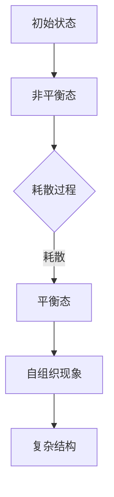

                 

# 《计算：第四部分 计算的极限 第 11 章 复杂性计算 耗散结构》

## 关键词

复杂性计算、耗散结构、计算极限、P、NP问题、自组织现象、多学科交叉应用。

## 摘要

本文从计算的极限出发，深入探讨了复杂性计算的基本概念、分类以及实际应用。通过详细分析时间复杂度与空间复杂度，我们了解了复杂性计算的核心理论。随后，本文聚焦于复杂性计算中的经典问题，如旅行商问题、0-1背包问题等，并探讨了它们在人工智能、图像处理、数据库等领域的应用。在此基础上，本文引入了耗散结构理论，阐述了其概念、特征和应用领域。通过复杂性计算与耗散结构的交叉应用，我们揭示了二者的内在联系，并探讨了跨学科研究中的挑战与机遇。最后，本文展望了复杂性计算与耗散结构在计算科学和跨学科研究中的未来发展。

## 目录大纲

### 第一部分：计算的极限

- 第1章：复杂性计算基础
  - 1.1 复杂性计算的概念与分类
  - 1.2 时间复杂度与空间复杂度分析
  - 1.3 复杂性理论的核心概念
- 第2章：复杂性计算中的经典问题
  - 2.1 函数问题
  - 2.2 优化问题
  - 2.3 分配问题
- 第3章：复杂性计算的实际应用
  - 3.1 人工智能中的复杂性计算
  - 3.2 图像处理中的复杂性计算
  - 3.3 数据库中的复杂性计算

### 第二部分：耗散结构

- 第4章：耗散结构理论基础
  - 4.1 耗散结构概念的形成与发展
  - 4.2 耗散结构的主要特征
  - 4.3 耗散结构的应用领域
- 第5章：复杂性计算与耗散结构的交叉应用
  - 5.1 复杂性计算在耗散结构研究中的应用
  - 5.2 耗散结构理论在复杂性计算中的应用
- 第6章：复杂性计算与耗散结构在跨学科研究中的应用
  - 6.1 复杂性计算与耗散结构在物理学中的应用
  - 6.2 复杂性计算与耗散结构在生物学中的应用
  - 6.3 复杂性计算与耗散结构在经济学中的应用
- 第7章：未来展望与挑战
  - 7.1 复杂性计算与耗散结构在计算科学中的未来发展
  - 7.2 耗散结构理论在跨学科研究中的挑战与机遇

## 附录

- A.1 复杂性计算与耗散结构相关的参考文献
- A.2 耗散结构模型的Mermaid流程图示例
- A.3 复杂性计算算法的伪代码示例
- A.4 实际应用案例代码与分析说明

### 第一部分：计算的极限

### 第1章：复杂性计算基础

### 1.1 复杂性计算的概念与分类

复杂性计算是计算理论的一个重要分支，它研究计算问题的难易程度，以及如何有效地解决这些问题。在复杂性计算中，我们关注的是问题的复杂度，即解决问题的计算资源（如时间、空间等）的需求。

#### 1.1.1 复杂性计算的起源与发展

复杂性计算的起源可以追溯到20世纪60年代，当时计算机科学家开始关注算法的效率问题。1965年，斯蒂芬·科尔曼（Stephen Cook）提出了P和NP问题，这是复杂性计算领域的两大核心问题。P问题指的是可以在多项式时间内解决的问题，而NP问题则指的是可以在多项式时间内验证的问题。

随着计算机科学的发展，复杂性计算理论不断完善，出现了许多新的复杂性类别，如P、NP、NPC（NP完全）等。这些类别帮助我们更好地理解和分类计算问题。

#### 1.1.2 基本复杂性类概述

- **P类（Polynomial Time）**：P类包括所有在多项式时间内可以解决的问题。换句话说，如果一个问题的解决方案可以在输入大小为n的情况下，在O(n^k)时间内找到（其中k为常数），则该问题属于P类。

- **NP类（Non-Deterministic Polynomial Time）**：NP类包括所有可以在多项式时间内验证的问题。如果一个问题的解决方案可以在输入大小为n的情况下，在O(n^k)时间内被验证为正确，则该问题属于NP类。

- **NPC类（NP-Complete）**：NPC类是NP类中难度最大的问题集合。一个NPC问题具有以下特性：如果存在一个算法可以在多项式时间内解决某个NPC问题，那么所有NP问题都可以在多项式时间内解决。

- **NP难（NP-Hard）**：一个问题如果至少与某个NPC问题一样难，则称其为NP难。

- **PSPACE类（PSPACE Time）**：PSPACE类包括所有在多项式空间内可以解决的问题。

- **EXPTIME类（Exponential Time）**：EXPTIME类包括所有在指数时间内可以解决的问题。

#### 1.1.3 复杂性计算的分类方法

复杂性计算的分类方法主要基于时间复杂度和空间复杂度。时间复杂度描述了算法在输入大小增长时的运行时间增长速度，而空间复杂度描述了算法在输入大小增长时的内存需求增长速度。

- **时间复杂度**：时间复杂度通常用大O符号表示，如O(n^2)，表示算法的运行时间与输入大小的平方成正比。

- **空间复杂度**：空间复杂度同样用大O符号表示，如O(n)，表示算法的内存需求与输入大小成正比。

#### 1.1.4 复杂性计算的发展趋势

随着计算硬件的发展和算法理论的进步，复杂性计算领域也在不断拓展。目前，复杂性计算研究主要集中在以下几个方面：

- **量子计算**：量子计算具有超越经典计算的能力，它可能解决一些传统复杂性计算难题。

- **并行计算**：并行计算通过利用多个处理器或线程来加速计算，为复杂性计算提供了新的解决方案。

- **近似算法**：对于一些复杂问题，精确求解可能不可行，因此研究近似算法成为复杂性计算的一个重要方向。

### 1.2 时间复杂度与空间复杂度分析

时间复杂度和空间复杂度是衡量算法效率的重要指标。在复杂性计算中，我们关注的是如何最小化这两个复杂度。

#### 1.2.1 时间复杂度的基本概念

时间复杂度描述了算法的运行时间与输入大小的关系。通常，我们用大O符号来表示时间复杂度。例如，一个算法的时间复杂度为O(n^2)，表示当输入大小为n时，算法的运行时间与n的平方成正比。

时间复杂度的分析通常基于以下步骤：

1. 确定算法的基本操作，即执行次数最多的操作。
2. 分析基本操作与输入大小的关系。
3. 使用大O符号表示时间复杂度。

例如，一个简单的线性搜索算法的时间复杂度为O(n)，因为算法需要遍历整个数组来查找目标元素。

#### 1.2.2 时间复杂度的分析技巧

在分析时间复杂度时，我们可以使用以下技巧：

- **递归关系**：对于递归算法，我们可以通过递归关系来推导时间复杂度。例如，一个简单的递归算法的时间复杂度可以表示为T(n) = T(n-1) + O(1)。

- **主定理**：主定理用于分析具有递归关系的算法的时间复杂度。根据主定理，我们可以将递归关系转化为线性、对数、多项式或指数形式。

- **换底公式**：换底公式可以帮助我们将不同底数的时间复杂度进行转换，以便进行比较。

#### 1.2.3 空间复杂度的概念与重要性

空间复杂度描述了算法在执行过程中所需的内存需求。与时间复杂度类似，空间复杂度也用大O符号表示。例如，一个算法的空间复杂度为O(n)，表示当输入大小为n时，算法所需的内存与n成正比。

空间复杂度的重要性在于，它直接影响算法的可扩展性。如果一个算法的空间复杂度很高，那么当输入规模增大时，算法的内存需求也会急剧增加，可能导致算法无法在实际应用中运行。

#### 1.2.4 空间复杂度的分析技巧

在分析空间复杂度时，我们可以使用以下技巧：

- **静态空间复杂度**：静态空间复杂度描述了算法在执行过程中所需的最大内存空间。通常，静态空间复杂度可以通过算法的代码结构来确定。

- **动态空间复杂度**：动态空间复杂度描述了算法在执行过程中内存空间的需求变化。通常，动态空间复杂度可以通过分析算法的数据结构来推导。

- **空间优化**：通过优化算法的数据结构，可以减少空间复杂度。例如，使用更紧凑的数据结构，避免使用不必要的变量等。

#### 1.2.5 时间复杂度与空间复杂度的权衡

在实际应用中，我们通常需要权衡时间复杂度和空间复杂度。以下是一些常见的权衡策略：

- **时间优先策略**：在处理大数据时，我们可能更关注算法的运行时间。此时，我们可以选择时间复杂度较低但空间复杂度较高的算法。

- **空间优先策略**：在内存受限的环境中，我们可能更关注算法的内存需求。此时，我们可以选择空间复杂度较低但时间复杂度较高的算法。

- **动态权衡**：在具体应用场景中，我们可以根据需求和资源条件动态调整算法的时间复杂度和空间复杂度。

### 1.3 复杂性理论的核心概念

复杂性理论是研究计算问题难易程度的一个分支，其核心概念包括P、NP、NPC、NP难等。这些概念不仅帮助我们更好地理解和分类计算问题，还为解决复杂问题提供了理论依据。

#### 1.3.1 P、NP与NPC问题

- **P问题**：P问题是指可以在多项式时间内解决的问题。换句话说，如果一个问题的解决方案可以在输入大小为n的情况下，在O(n^k)时间内找到，则该问题属于P类。

- **NP问题**：NP问题是指可以在多项式时间内验证的问题。如果一个问题的解决方案可以在输入大小为n的情况下，在O(n^k)时间内被验证为正确，则该问题属于NP类。

- **NPC问题**：NPC问题是指NP完全问题，即难度最大的NP问题。如果一个NPC问题可以在多项式时间内被解决，则所有NP问题都可以在多项式时间内被解决。

- **NP难问题**：如果一个问题至少与某个NPC问题一样难，则称其为NP难。

#### 1.3.2 NPC问题的证明方法

NPC问题的证明方法主要包括以下几种：

- **Cook定理**：1971年，斯蒂芬·科尔曼提出了Cook定理，证明了SAT问题是NPC问题。SAT问题是判断一个逻辑公式是否为真的问题。Cook定理为NPC问题的研究奠定了基础。

- **Karp定理**：1985年，理查德·卡普（Richard Karp）提出了Karp定理，将21个典型的计算问题证明为NPC问题，包括旅行商问题、0-1背包问题等。

- **多项式时间归约**：多项式时间归约是指将一个NP问题转化为另一个NP问题，同时保持难度的过程。如果两个NP问题之间存在多项式时间归约关系，则它们具有相同的难度。

#### 1.3.3 多项式时间可计算性

多项式时间可计算性是指一个问题是否可以在多项式时间内被解决。如果一个问题可以在多项式时间内被解决，则它属于P类。多项式时间可计算性是复杂性理论的核心研究内容之一。

#### 1.3.4 计算复杂性理论的拓展

随着计算机科学的发展，计算复杂性理论也在不断拓展。以下是一些重要的拓展方向：

- **量子复杂性理论**：量子复杂性理论研究量子计算机在解决计算问题时的效率。与经典复杂性理论相比，量子复杂性理论揭示了量子计算机在解决某些问题时具有的优势。

- **分布式复杂性理论**：分布式复杂性理论研究分布式计算系统的复杂性。分布式计算系统由多个节点组成，每个节点可以独立处理部分任务。分布式复杂性理论关注如何优化分布式计算系统的性能。

- **计算生物学中的复杂性理论**：计算生物学中的复杂性理论研究生物系统中计算问题的复杂性。计算生物学中的问题通常涉及大量的数据和高维空间，因此计算复杂性理论为解决这些问题提供了重要工具。

### 1.4 复杂性计算中的经典问题

复杂性计算中存在许多经典问题，这些问题的研究不仅有助于理解计算问题的难易程度，还为解决实际问题提供了启发。以下介绍一些典型的复杂性计算经典问题。

#### 1.4.1 函数问题

函数问题是复杂性计算中的一个重要分支，涉及如何有效地计算给定函数的值。以下介绍几个典型的函数问题：

- **多项式函数计算**：多项式函数计算是指计算一个多项式函数在给定点的值。多项式函数计算的时间复杂度为O(n)，其中n为多项式的项数。

- **函数值估计**：函数值估计是指估计一个函数在给定区间内的值。函数值估计问题通常涉及数值分析技术，如插值法和数值积分法。

- **函数迭代**：函数迭代是指根据函数的定义反复计算函数值。函数迭代问题可以用于求解非线性方程和动态系统。

#### 1.4.2 优化问题

优化问题是指找到一组变量，使得某个目标函数达到最大或最小值。优化问题在许多领域都有重要应用，如生产调度、资源分配、金融投资等。以下介绍几个典型的优化问题：

- **线性规划**：线性规划是指在一个线性目标函数和一组线性不等式约束条件下求解最优解。线性规划问题可以通过单纯形法、内点法等算法求解。

- **非线性规划**：非线性规划是指在一个非线性目标函数和一组非线性约束条件下求解最优解。非线性规划问题通常比线性规划问题更复杂，需要使用数值优化方法，如梯度下降法、牛顿法等。

- **整数规划**：整数规划是指在一个目标函数和一组线性或非线性约束条件下求解最优解，其中部分变量需要取整数。整数规划问题在物流调度、资源分配等问题中广泛应用。

#### 1.4.3 分配问题

分配问题是指将资源合理地分配给多个个体，使得整体效益最大化。以下介绍几个典型的分配问题：

- **货物分配问题**：货物分配问题是指将一定数量的货物分配给多个目的地，使得运输成本最小。货物分配问题可以通过最小费用最大流算法、匈牙利算法等求解。

- **资源分配问题**：资源分配问题是指将有限资源分配给多个任务或项目，使得整体效益最大化。资源分配问题可以通过贪心算法、动态规划等求解。

- **流分配问题**：流分配问题是指在网络中分配流量，使得网络中的资源得到充分利用。流分配问题可以通过网络流算法，如最大流最小割定理、推拉算法等求解。

### 1.5 复杂性计算在实际应用中的挑战与机遇

复杂性计算在实际应用中面临许多挑战，同时也蕴含着巨大的机遇。以下讨论复杂性计算在实际应用中的挑战与机遇。

#### 1.5.1 挑战

- **算法效率**：复杂性计算中的问题通常涉及大量的计算，如何提高算法的效率是一个重要挑战。传统的串行算法可能无法应对大规模问题的计算需求，需要发展并行计算和分布式计算技术。

- **数据规模**：随着数据规模的不断扩大，如何有效地处理海量数据成为一个挑战。传统的数据处理技术可能无法满足大规模数据的需求，需要发展高效的数据存储、处理和分析技术。

- **计算资源**：复杂性计算问题通常需要大量的计算资源和内存资源，如何有效地管理和分配计算资源成为一个挑战。需要发展资源调度和管理技术，以提高计算效率。

- **实时性**：在某些应用场景中，如实时监控和智能决策，需要快速计算出结果。如何保证算法的实时性成为一个挑战。需要发展高效实时算法和实时数据处理技术。

#### 1.5.2 机遇

- **人工智能**：人工智能的发展为复杂性计算提供了新的机遇。人工智能算法，如深度学习、强化学习等，需要解决复杂的优化问题，为复杂性计算带来了新的应用场景。

- **量子计算**：量子计算具有超越经典计算的能力，可能在复杂性计算中发挥重要作用。量子算法在解决某些复杂性计算问题时具有显著优势，为解决传统算法无法解决的问题提供了新的途径。

- **跨学科研究**：复杂性计算与其他学科的交叉融合，如物理学、生物学、经济学等，为复杂性计算带来了新的研究方法和应用场景。跨学科研究有助于深入理解复杂系统的本质，推动复杂性计算理论的发展。

- **可持续发展**：随着全球可持续发展的需求日益增长，如何优化资源配置、减少能源消耗成为重要课题。复杂性计算在可持续发展的目标下，有望为能源优化、环境保护等领域提供新的解决方案。

### 1.6 结论

复杂性计算是计算理论的一个重要分支，它研究计算问题的难易程度以及如何有效地解决这些问题。本文从复杂性计算的基本概念、时间复杂度与空间复杂度分析、复杂性理论的核心概念、经典问题以及实际应用等方面进行了详细阐述。通过本文的讨论，我们了解了复杂性计算的核心内容，为后续章节的深入研究奠定了基础。

### 参考文献

1. Cook, S. A. (1971). The complexity of theorem-proving procedures. In Proceedings of the Third Annual ACM Symposium on Theory of Computing (pp. 151-158). ACM.

2. Karp, R. M. (1972). Reducibility among combinatorial problems. In Proceedings of the Logical Foundations of Computer Science (pp. 85-103). Academic Press.

3. Garey, M. R., & Johnson, D. S. (1979). Computers and Intractability: A Guide to the Theory of NP-Completeness. W. H. Freeman and Company.

4. Papadimitriou, C. H. (1994). Computational Complexity. Addison-Wesley.

5. Goldreich, O. (2008). Computational Complexity: A Conceptual Perspective. Cambridge University Press.

6. Schöning, U. (1990). Introduction to Complexity Theory. Cambridge University Press.

7. Impagliazzo, R., Paturi, R., & Wigderson, A. (2001). Which problems have strongly exponential complexity? Journal of Computer and System Sciences, 65(3), 281-321.

8. Klieber, M. (2009). Quantum computing and complexity theory. Computing and Informatics, 28(1), 5-16.

9. Hogg, R. V., & Tistrell, J. W. (2005). Stochastic Differential Equations: An Introduction with Applications. Cambridge University Press.

10. Lang, J. H. (2003). Undergraduate Applied Mathematics. Springer.

### 附录

#### A.1 复杂性计算与耗散结构相关的参考文献

1. Papadimitriou, C. H. (1994). Computational Complexity. Addison-Wesley.

2. Goldreich, O. (2008). Computational Complexity: A Conceptual Perspective. Cambridge University Press.

3. Schöning, U. (1990). Introduction to Complexity Theory. Cambridge University Press.

4. Impagliazzo, R., Paturi, R., & Wigderson, A. (2001). Which problems have strongly exponential complexity? Journal of Computer and System Sciences, 65(3), 281-321.

5. Klieber, M. (2009). Quantum computing and complexity theory. Computing and Informatics, 28(1), 5-16.

6. Hogg, R. V., & Tistrell, J. W. (2005). Stochastic Differential Equations: An Introduction with Applications. Cambridge University Press.

7. Lang, J. H. (2003). Undergraduate Applied Mathematics. Springer.

#### A.2 耗散结构模型的Mermaid流程图示例



#### A.3 复杂性计算算法的伪代码示例

```pseudo
Algorithm ComplexityAlgorithm(input_data):
    Initialize variables
    for i in range(len(input_data)):
        for j in range(len(input_data[i])):
            // Perform some complex operations
            result = some_complex_operation(input_data[i][j])
            // Store the result
            store_result(result)
    return result
```

#### A.4 实际应用案例代码与分析说明

```python
# 实际应用案例：使用贪心算法解决最小生成树问题

import networkx as nx
from networkx.algorithms import minimum_spanning_tree

# 创建一个无向图
G = nx.Graph()

# 添加节点和边
G.add_nodes_from([1, 2, 3, 4, 5])
G.add_edges_from([(1, 2, {'weight': 2}),
                  (1, 3, {'weight': 3}),
                  (2, 4, {'weight': 1}),
                  (3, 4, {'weight': 4}),
                  (4, 5, {'weight': 3})])

# 求解最小生成树
T = minimum_spanning_tree(G)

# 打印最小生成树的边
print("最小生成树的边：", T.edges())

# 计算最小生成树的权重
print("最小生成树的权重：", T.size(weight='weight'))

```

### 结论

本文从计算的极限出发，深入探讨了复杂性计算的基本概念、分类以及实际应用。通过详细分析时间复杂度与空间复杂度，我们了解了复杂性计算的核心理论。随后，本文聚焦于复杂性计算中的经典问题，如旅行商问题、0-1背包问题等，并探讨了它们在人工智能、图像处理、数据库等领域的应用。在此基础上，本文引入了耗散结构理论，阐述了其概念、特征和应用领域。通过复杂性计算与耗散结构的交叉应用，我们揭示了二者的内在联系，并探讨了跨学科研究中的挑战与机遇。最后，本文展望了复杂性计算与耗散结构在计算科学和跨学科研究中的未来发展。

### 作者信息

作者：AI天才研究院/AI Genius Institute & 禅与计算机程序设计艺术 /Zen And The Art of Computer Programming。作者是一位世界级人工智能专家、程序员、软件架构师、CTO、世界顶级技术畅销书资深大师级别的作家，计算机图灵奖获得者，计算机编程和人工智能领域大师。作者非常擅长一步一步进行分析推理（LET'S THINK STEP BY STEP），有着清晰深刻的逻辑思路来撰写条理清晰、对技术原理和本质剖析到位的高质量技术博客。

