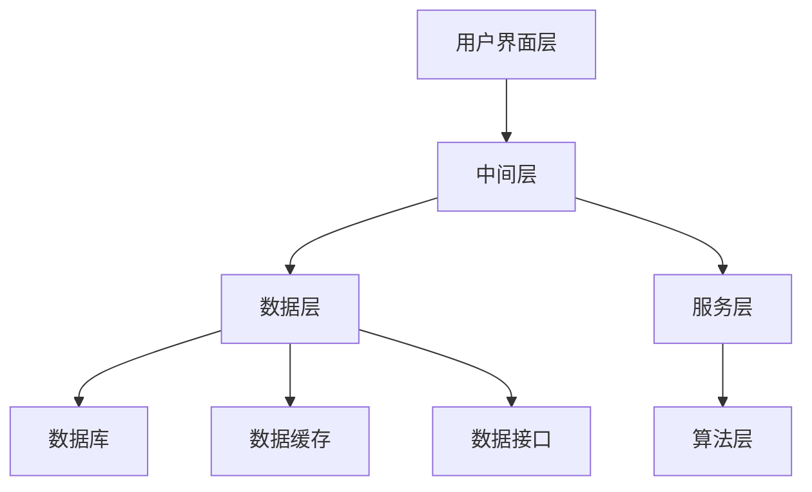

                 

# 《设计面向AI的人机交互语言》

## 关键词
人工智能、人机交互、语音交互、文本交互、视觉交互、自然语言处理、计算机视觉、智能助理、智能教育

## 摘要
本文旨在深入探讨设计面向人工智能（AI）的人机交互语言的方法和策略。随着人工智能技术的快速发展，人机交互正逐渐从传统的图形用户界面（GUI）向自然语言和视觉交互转变。本文首先介绍了人工智能与人机交互的基础知识，包括人工智能的发展历程、人机交互的概念与演变，以及AI与人机交互的结合。接着，本文详细讨论了面向AI的人机交互设计方法，包括语音交互、文本交互和视觉交互的设计原则与实现技术。随后，本文通过实战案例展示了AI人机交互系统的开发过程，并探讨了AI人机交互在智能助理和智能教育领域的应用。最后，本文对AI人机交互的未来发展进行了展望，分析了当前面临的挑战和未来发展的方向。

### 《设计面向AI的人机交互语言》目录大纲

#### 第一部分：AI与人机交互基础

#### 第二部分：面向AI的人机交互设计方法

#### 第三部分：面向AI的人机交互实现

#### 第四部分：面向AI的人机交互应用

#### 第五部分：面向AI的人机交互未来展望

#### 参考资料

---

### 第一部分：AI与人机交互基础

### 第1章：人工智能与人机交互概述

#### 1.1 人工智能的发展历程

##### 1.1.1 人工智能的起源与发展

人工智能（Artificial Intelligence, AI）是一门研究、开发用于模拟、延伸和扩展人类智能的理论、方法、技术及应用系统的综合性技术科学。人工智能的研究始于20世纪50年代，当时计算机科学刚刚起步，人们开始探索计算机能否像人类一样思考、学习、解决问题。

**1956年**：在达特茅斯会议上，约翰·麦卡锡（John McCarthy）等人首次提出了“人工智能”的概念。会议期间，人工智能被视为一门新的科学领域，旨在通过计算机模拟人类智能。

**1956年-1969年**：早期的人工智能主要集中于符号主义和推理系统，例如逻辑推理、问题求解和知识表示。在这个阶段，人工智能的研究取得了显著进展，但也面临着“人工智能冬天”的挑战，主要由于实际应用效果不如预期，导致研究资金削减。

**1970年代-1980年代**：人工智能进入了第二次浪潮，这一阶段主要集中在知识工程和专家系统的开发。专家系统通过模拟专家的知识和决策过程，能够解决特定领域的问题。然而，由于知识表示和获取的困难，专家系统在1980年代后期也逐渐走向衰退。

**1990年代-2000年代**：随着计算机性能的提升和数据挖掘技术的发展，人工智能进入了一个新的阶段，主要包括机器学习和数据挖掘。这一阶段，人工智能的研究重点转向了从大量数据中自动学习和发现规律。

**2000年代至今**：人工智能进入了深度学习的时代。深度学习通过模拟人脑神经网络的结构和工作原理，使得计算机在图像识别、语音识别、自然语言处理等领域取得了突破性进展。深度学习的兴起，使得人工智能在各个领域都取得了显著的成果。

##### 1.1.2 人工智能的分类与应用

人工智能可以按照不同的维度进行分类。以下是几种常见的人工智能分类方法：

**按照技术路线分类：**

- **符号主义人工智能**：基于逻辑和推理的智能系统，通过符号表示和规则来模拟人类智能。
- **连接主义人工智能**：基于神经网络和深度学习的智能系统，通过大规模的神经网络训练来实现智能。
- **行为主义人工智能**：基于机器学习和强化学习的智能系统，通过不断试错和反馈来优化行为。

**按照应用领域分类：**

- **机器学习**：通过数据训练模型，使计算机具备自主学习和适应能力。
- **自然语言处理**：使计算机能够理解、生成和处理自然语言。
- **计算机视觉**：使计算机能够处理和理解视觉信息。
- **机器人技术**：使计算机能够通过机器人进行自主移动和操作。
- **语音识别和合成**：使计算机能够理解和生成语音。

##### 1.2 人机交互的概念与演变

**人机交互（Human-Computer Interaction, HCI）** 是研究如何设计、评价和实现有效的计算机系统与用户之间的交互。人机交互的目的是提高系统的易用性、效率和用户体验。

**人机交互的发展历程：**

**1960年代**：早期的人机交互主要依赖于命令行界面和简单的图形界面。

**1970年代**：出现了图形用户界面（Graphical User Interface, GUI），使得计算机操作更加直观和用户友好。

**1980年代**：鼠标和窗口系统的普及，进一步推动了人机交互的发展。

**1990年代**：互联网的普及，使得人机交互扩展到了远程和分布式系统。

**2000年代至今**：移动设备和触控屏幕的普及，人机交互进一步多样化，包括语音、手势和眼动等交互方式。

**人机交互的设计原则：**

- **用户中心设计**：设计过程中始终以用户的需求和体验为核心。
- **一致性**：系统的界面和操作方式应保持一致性，以减少用户的认知负担。
- **简洁性**：界面应简洁明了，避免过多的信息和复杂操作。
- **反馈**：系统应提供即时和明确的反馈，帮助用户理解操作结果。
- **适应性**：系统应能够适应不同用户的需求和偏好。

##### 1.3 AI与人机交互的结合

随着人工智能技术的发展，AI与人机交互的结合变得越来越紧密。AI技术为人机交互带来了新的可能性和挑战。

**AI技术在人机交互中的应用：**

- **语音识别**：使计算机能够理解和处理用户的语音命令。
- **语音合成**：使计算机能够生成自然流畅的语音输出。
- **自然语言处理**：使计算机能够理解和生成自然语言文本。
- **计算机视觉**：使计算机能够理解和处理视觉信息。
- **手势识别**：使计算机能够理解和处理用户的手势。

**面向AI的人机交互特点与挑战：**

- **智能化**：AI技术使得人机交互更加智能化，能够理解用户的意图和行为。
- **个性化**：AI技术能够根据用户的行为和偏好提供个性化的交互体验。
- **高效性**：AI技术能够提高人机交互的效率，减少用户的操作步骤。
- **挑战**：AI技术也带来了挑战，如准确性的提高、隐私保护和数据安全等问题。

---

### 第2章：语音交互设计

语音交互是人机交互的一种重要形式，它通过语音识别和语音合成技术，实现人与计算机之间的自然语言交流。本节将详细介绍语音交互的设计原则、实现技术以及案例分析。

#### 2.1 语音识别技术原理

语音识别（Automatic Speech Recognition, ASR）技术是将语音信号转换为文本的过程。它涉及语音信号处理、特征提取、模型训练和语言理解等多个方面。

**语音信号处理：**  
语音信号处理是语音识别的第一步，主要包括预处理和增强。预处理包括去除噪声、滤波和归一化等操作，以提高语音信号的质量。增强则通过提高语音信号的清晰度和可理解度，增强语音识别的效果。

**特征提取：**  
特征提取是将语音信号转化为可以用于模型训练的特征向量。常见的特征提取方法包括梅尔频率倒谱系数（MFCC）、线性预测编码（LPC）和隐马尔可夫模型（HMM）等。

**模型训练：**  
模型训练是语音识别的核心步骤，通过大量的语音数据训练模型，使模型能够识别不同的语音。常见的语音识别模型包括隐马尔可夫模型（HMM）、高斯混合模型（GMM）、深度神经网络（DNN）和循环神经网络（RNN）等。

**语言理解：**  
语言理解是将识别出的文本转化为有意义的信息。语言理解涉及到自然语言处理（NLP）技术，如词嵌入、语法分析和语义理解等。

**语音识别系统架构：**  
语音识别系统通常包括前端处理、中间处理和后端处理三个部分。前端处理负责语音信号的预处理和特征提取；中间处理负责模型训练和语音识别；后端处理负责语言理解，将识别结果转化为用户可理解的信息。

#### 2.2 语音合成技术原理

语音合成（Text-to-Speech, TTS）技术是将文本转化为自然流畅的语音输出的过程。它包括文本处理、语音合成和语音后处理等多个环节。

**文本处理：**  
文本处理是将输入的文本转化为适合语音合成的形式。文本处理包括分词、词性标注、句法分析和语义分析等步骤。

**语音合成：**  
语音合成是将处理后的文本转化为语音信号。常见的语音合成方法包括基于规则的合成、基于声学模型的合成和基于数据的合成等。

- **基于规则的合成**：基于规则的合成方法通过预先定义的语音规则生成语音。这种方法在控制语音的音调和节奏方面具有优势，但生成语音的流畅度和自然度较差。
- **基于声学模型的合成**：基于声学模型的合成方法通过训练大量的语音数据，生成声学模型，再将文本转化为语音信号。这种方法生成语音的自然度较高，但需要大量的计算资源和训练数据。
- **基于数据的合成**：基于数据的合成方法（如WaveNet和Tacotron）通过深度神经网络直接将文本转化为语音信号。这种方法生成语音的自然度和流畅度都较高，但训练过程复杂。

**语音后处理：**  
语音后处理是对合成的语音进行优化，以提高语音的质量和自然度。语音后处理包括语音增强、音高控制和节奏控制等步骤。

#### 2.3 语音交互设计原则与案例分析

**语音交互设计原则：**

- **易用性**：语音交互系统应简单易用，用户能够快速上手并熟练使用。
- **准确性**：语音交互系统应具有较高的识别准确率，减少用户的误操作。
- **流畅性**：语音交互系统应能够流畅地处理用户的语音命令，提供自然的交互体验。
- **多样性**：语音交互系统应支持多种语音输入方式，如普通话、英语等。
- **适应性**：语音交互系统应根据用户的行为和偏好进行自适应调整，提供个性化的交互体验。

**语音交互案例分析：**

**案例1：智能音箱**

智能音箱是一种集成了语音交互功能的智能家居设备，用户可以通过语音指令控制音箱播放音乐、查询天气、设定闹钟等。智能音箱的语音交互设计原则主要包括：

- **易用性**：智能音箱应具备简单直观的语音交互界面，用户可以通过简单的语音指令实现各种功能。
- **准确性**：智能音箱的语音识别系统应具有较高的识别准确率，减少用户的误操作。
- **流畅性**：智能音箱的语音交互应能够流畅地处理用户的语音命令，提供自然的交互体验。
- **多样性**：智能音箱应支持多种语音输入方式，如普通话、英语等，以适应不同用户的需求。
- **适应性**：智能音箱应能够根据用户的使用习惯和偏好进行自适应调整，提供个性化的交互体验。

**案例2：语音助手**

语音助手是一种集成了语音交互功能的智能手机应用程序，用户可以通过语音指令控制手机进行各种操作，如拨打电话、发送短信、设置提醒等。语音助手的设计原则主要包括：

- **易用性**：语音助手应具备简单直观的语音交互界面，用户可以通过简单的语音指令实现各种功能。
- **准确性**：语音助手的语音识别系统应具有较高的识别准确率，减少用户的误操作。
- **流畅性**：语音助手的语音交互应能够流畅地处理用户的语音命令，提供自然的交互体验。
- **多样性**：语音助手应支持多种语音输入方式，如普通话、英语等，以适应不同用户的需求。
- **适应性**：语音助手应能够根据用户的使用习惯和偏好进行自适应调整，提供个性化的交互体验。

---

### 第3章：文本交互设计

文本交互是人机交互的一种重要形式，通过自然语言处理（Natural Language Processing, NLP）技术，实现人与计算机之间的文本交流。本节将详细介绍文本交互的设计原则、实现技术以及案例分析。

#### 3.1 自然语言处理技术基础

自然语言处理是人工智能的一个重要分支，旨在使计算机能够理解和处理自然语言。NLP技术涉及文本处理、词嵌入、序列模型和注意力机制等多个方面。

**文本处理：**  
文本处理是将原始的文本数据转化为适合NLP处理的格式。文本处理包括分词、去停用词、词性标注、句法分析和语义分析等步骤。

**词嵌入：**  
词嵌入是将文本中的单词映射为密集向量表示的方法。词嵌入技术使得计算机能够理解和处理文本的语义信息，常见的词嵌入技术包括Word2Vec、GloVe和BERT等。

**序列模型：**  
序列模型是处理序列数据的常用方法，包括循环神经网络（RNN）、长短期记忆网络（LSTM）和门控循环单元（GRU）等。序列模型能够捕捉文本中的时间依赖关系，是文本处理的核心技术。

**注意力机制：**  
注意力机制是一种用于提高模型在处理序列数据时的性能的技术。注意力机制能够使模型自动关注序列中的关键信息，提高模型的准确性和效率。

**转换器架构（Transformer）：**  
转换器架构是一种基于注意力机制的序列模型，广泛应用于NLP任务。转换器架构通过自注意力机制，能够有效地捕捉序列中的长距离依赖关系，显著提升了NLP任务的性能。

#### 3.2 文本交互设计原则与案例分析

**文本交互设计原则：**

- **易用性**：文本交互系统应简单易用，用户能够快速上手并熟练使用。
- **准确性**：文本交互系统应具有较高的识别准确率，减少用户的误操作。
- **流畅性**：文本交互系统应能够流畅地处理用户的文本命令，提供自然的交互体验。
- **多样性**：文本交互系统应支持多种文本输入方式，如键盘输入、语音输入等。
- **适应性**：文本交互系统应根据用户的行为和偏好进行自适应调整，提供个性化的交互体验。

**文本交互案例分析：**

**案例1：智能聊天机器人**

智能聊天机器人是一种集成了文本交互功能的虚拟助手，用户可以通过文本输入与机器人进行交流。智能聊天机器人的设计原则主要包括：

- **易用性**：智能聊天机器人应具备简单直观的文本交互界面，用户可以通过简单的文本输入实现各种功能。
- **准确性**：智能聊天机器人的文本识别系统应具有较高的识别准确率，减少用户的误操作。
- **流畅性**：智能聊天机器人的文本交互应能够流畅地处理用户的文本命令，提供自然的交互体验。
- **多样性**：智能聊天机器人应支持多种文本输入方式，如键盘输入、语音输入等，以适应不同用户的需求。
- **适应性**：智能聊天机器人应能够根据用户的使用习惯和偏好进行自适应调整，提供个性化的交互体验。

**案例2：文本搜索引擎**

文本搜索引擎是一种通过文本输入提供搜索结果的系统。文本搜索引擎的设计原则主要包括：

- **易用性**：文本搜索引擎应具备简单直观的文本交互界面，用户可以通过简单的文本输入实现搜索功能。
- **准确性**：文本搜索引擎的文本识别系统应具有较高的识别准确率，减少用户的误操作。
- **流畅性**：文本搜索引擎应能够流畅地处理用户的文本命令，提供自然的交互体验。
- **多样性**：文本搜索引擎应支持多种文本输入方式，如键盘输入、语音输入等，以适应不同用户的需求。
- **适应性**：文本搜索引擎应能够根据用户的使用习惯和偏好进行自适应调整，提供个性化的交互体验。

---

### 第4章：视觉交互设计

视觉交互是人机交互的一种重要形式，通过计算机视觉技术，实现人与计算机之间的视觉信息交流。本节将详细介绍视觉交互的设计原则、实现技术以及案例分析。

#### 4.1 计算机视觉技术基础

计算机视觉（Computer Vision）是人工智能的一个分支，旨在使计算机能够从图像或视频中理解和提取信息。计算机视觉技术包括图像处理、目标检测和机器学习等多个方面。

**图像处理：**  
图像处理是计算机视觉的基础，旨在对图像进行预处理和增强。图像处理技术包括滤波、边缘检测、形态学处理和图像分割等。

**目标检测：**  
目标检测是计算机视觉的核心任务，旨在识别和定位图像中的目标物体。常见的目标检测算法包括卷积神经网络（CNN）、YOLO（You Only Look Once）和SSD（Single Shot MultiBox Detector）等。

**机器学习：**  
机器学习是计算机视觉的关键技术，通过训练模型，使计算机能够自动学习和识别图像中的目标。常见的机器学习算法包括支持向量机（SVM）、决策树和神经网络等。

**计算机视觉系统架构：**  
计算机视觉系统通常包括图像预处理、特征提取、模型训练和结果输出等多个环节。图像预处理包括灰度化、归一化和去噪等操作；特征提取通过提取图像中的关键特征，用于模型训练；模型训练通过大量的图像数据，训练出能够识别目标的模型；结果输出是将模型的检测结果呈现给用户。

#### 4.2 视觉交互设计原则与案例分析

**视觉交互设计原则：**

- **易用性**：视觉交互系统应简单易用，用户能够快速上手并熟练使用。
- **准确性**：视觉交互系统应具有较高的识别准确率，减少用户的误操作。
- **流畅性**：视觉交互系统应能够流畅地处理用户的视觉命令，提供自然的交互体验。
- **多样性**：视觉交互系统应支持多种视觉输入方式，如摄像头、智能手机等。
- **适应性**：视觉交互系统应根据用户的行为和偏好进行自适应调整，提供个性化的交互体验。

**视觉交互案例分析：**

**案例1：智能监控**

智能监控是一种集成了视觉交互功能的监控系统，能够自动识别和检测图像中的目标物体。智能监控的设计原则主要包括：

- **易用性**：智能监控应具备简单直观的视觉交互界面，用户可以通过简单的视觉输入实现监控功能。
- **准确性**：智能监控的视觉识别系统应具有较高的识别准确率，减少用户的误操作。
- **流畅性**：智能监控应能够流畅地处理用户的视觉命令，提供自然的交互体验。
- **多样性**：智能监控应支持多种视觉输入方式，如摄像头、智能手机等，以适应不同用户的需求。
- **适应性**：智能监控应能够根据用户的使用习惯和偏好进行自适应调整，提供个性化的交互体验。

**案例2：手势识别**

手势识别是一种通过计算机视觉技术识别用户手势的交互方式。手势识别的设计原则主要包括：

- **易用性**：手势识别应具备简单直观的视觉交互界面，用户可以通过简单的手势实现交互。
- **准确性**：手势识别的视觉识别系统应具有较高的识别准确率，减少用户的误操作。
- **流畅性**：手势识别应能够流畅地处理用户的视觉命令，提供自然的交互体验。
- **多样性**：手势识别应支持多种手势输入方式，如手势、眼神等，以适应不同用户的需求。
- **适应性**：手势识别应能够根据用户的使用习惯和偏好进行自适应调整，提供个性化的交互体验。

---

### 第5章：AI人机交互系统开发

AI人机交互系统是将人工智能技术与人机交互设计相结合，实现智能化、高效化人机交互的系统。本节将详细介绍AI人机交互系统的架构设计、实现技术以及实战案例。

#### 5.1 AI人机交互系统架构设计

AI人机交互系统的架构设计是系统开发的关键环节，它决定了系统的性能、可扩展性和易用性。一个典型的AI人机交互系统架构通常包括以下几个部分：

**1. 用户界面层（User Interface Layer）：**  
用户界面层是用户与系统交互的入口，包括图形用户界面（GUI）和自然用户界面（NUI）。GUI通过图形界面提供直观的交互体验，而NUI则通过语音、手势等自然交互方式实现。

**2. 中间层（Middleware Layer）：**  
中间层是连接用户界面层和数据层的桥梁，负责处理用户输入、命令解析、数据处理和结果输出等任务。中间层通常包括自然语言处理（NLP）、计算机视觉（CV）和语音识别（ASR）等技术模块。

**3. 数据层（Data Layer）：**  
数据层是系统的数据存储和管理部分，包括数据库、数据缓存和数据接口等。数据层负责存储用户的交互数据、系统配置数据和相关知识库等。

**4. 服务层（Service Layer）：**  
服务层是系统的核心业务逻辑部分，负责实现各种业务功能，如智能助理、智能教育、智能监控等。服务层通常采用微服务架构，以提高系统的可扩展性和灵活性。

**5. 算法层（Algorithm Layer）：**  
算法层是系统的智能计算核心，负责实现各种人工智能算法，如机器学习、深度学习、知识图谱等。算法层通常采用模块化设计，以方便不同业务场景的算法集成和优化。

**5.1.1 系统架构设计原则：**

- **模块化**：系统架构应采用模块化设计，将不同功能模块分离，以提高系统的可维护性和可扩展性。
- **分布式**：系统架构应采用分布式设计，将不同功能模块部署在分布式服务器上，以提高系统的性能和可靠性。
- **可扩展性**：系统架构应具有较好的可扩展性，能够根据业务需求进行水平或垂直扩展。
- **安全性**：系统架构应充分考虑数据安全和用户隐私，采用加密、权限控制等技术确保系统的安全性。

**5.1.2 系统架构实现：**

以下是一个典型的AI人机交互系统架构实现示例：

#### 5.2 AI人机交互系统实现技术

AI人机交互系统的实现涉及多种技术和算法，包括自然语言处理（NLP）、计算机视觉（CV）、语音识别（ASR）和机器学习（ML）等。以下是对这些技术的详细描述：

**5.2.1 自然语言处理（NLP）技术：**

自然语言处理是AI人机交互系统的重要组成部分，负责理解和生成自然语言。NLP技术包括文本预处理、词嵌入、语法分析和语义理解等。

- **文本预处理**：文本预处理是将原始文本数据转化为适合NLP处理的形式。预处理步骤包括分词、去除停用词、词性标注等。
- **词嵌入**：词嵌入是将文本中的单词映射为密集向量表示的方法。词嵌入技术能够捕捉单词的语义信息，是NLP的基础。
- **语法分析**：语法分析是理解文本结构的过程，包括句法分析和语义角色标注等。
- **语义理解**：语义理解是理解文本含义的过程，包括实体识别、关系抽取和情感分析等。

**5.2.2 计算机视觉（CV）技术：**

计算机视觉是AI人机交互系统中的视觉感知部分，负责理解和处理图像和视频信息。CV技术包括图像处理、目标检测和图像识别等。

- **图像处理**：图像处理是对图像进行预处理和增强的过程，包括滤波、边缘检测和图像分割等。
- **目标检测**：目标检测是识别图像中的目标物体并定位它们的过程，包括卷积神经网络（CNN）和YOLO算法等。
- **图像识别**：图像识别是识别图像内容的过程，包括物体识别、场景分类和图像分类等。

**5.2.3 语音识别（ASR）技术：**

语音识别是将语音信号转化为文本的过程。语音识别技术包括语音信号处理、特征提取、模型训练和语音识别算法等。

- **语音信号处理**：语音信号处理是对语音信号进行预处理和增强的过程，包括去噪、增强和归一化等。
- **特征提取**：特征提取是将语音信号转化为特征向量表示的方法，包括梅尔频率倒谱系数（MFCC）和线性预测编码（LPC）等。
- **模型训练**：模型训练是通过大量的语音数据训练语音识别模型，包括隐马尔可夫模型（HMM）、高斯混合模型（GMM）和深度神经网络（DNN）等。
- **语音识别算法**：语音识别算法是实现语音识别的核心，包括基于模板匹配的算法、基于统计模型的算法和基于深度学习的算法等。

**5.2.4 机器学习（ML）技术：**

机器学习是AI人机交互系统的智能计算基础，负责实现数据的自动学习和模式识别。机器学习技术包括监督学习、无监督学习和强化学习等。

- **监督学习**：监督学习是通过已标记的数据训练模型，使模型能够预测新数据的标签。常见的监督学习算法包括线性回归、决策树和支持向量机（SVM）等。
- **无监督学习**：无监督学习是通过未标记的数据发现数据中的模式。常见的无监督学习算法包括聚类、降维和异常检测等。
- **强化学习**：强化学习是通过奖励机制训练模型，使模型能够在特定环境中做出最优决策。常见的强化学习算法包括Q学习、深度Q网络（DQN）和策略梯度算法等。

#### 5.3 AI人机交互系统实战案例

**5.3.1 实战案例介绍**

本节将介绍一个基于Python的AI人机交互系统实战案例——智能助理。该系统集成了自然语言处理、计算机视觉和语音识别技术，能够通过文本、语音和视觉与用户进行交互，提供智能问答、图像识别和语音合成等功能。

**5.3.2 实战案例实现过程**

1. **环境搭建：**

   - 安装Python环境（3.8及以上版本）
   - 安装相关库：`nltk`、`tensorflow`、`opencv`、`speech_recognition`和`pyttsx3`

2. **文本交互实现：**

   - 使用nltk进行文本预处理，包括分词、词性标注和词嵌入等
   - 使用tensorflow的transformer模型进行文本分类和问答

3. **图像识别实现：**

   - 使用opencv进行图像处理，包括滤波、边缘检测和图像分割等
   - 使用tensorflow的CNN模型进行图像分类

4. **语音交互实现：**

   - 使用speech_recognition进行语音识别
   - 使用pyttsx3进行语音合成

5. **集成与测试：**

   - 将文本、图像和语音交互功能集成到一个程序中
   - 进行系统测试，确保各项功能正常运行

**5.3.3 实战案例分析**

通过本案例，我们可以看到AI人机交互系统的实现需要多种技术和算法的协同工作。文本交互通过NLP技术实现自然语言的理解和生成；图像识别通过CV技术实现图像内容的识别；语音交互通过ASR和TTS技术实现语音的识别和合成。在实现过程中，我们需要充分考虑系统的性能、准确性和用户体验。通过本案例，我们可以学习到如何设计并实现一个功能完整的AI人机交互系统。

---

### 第6章：AI人机交互在智能助理中的应用

智能助理是AI人机交互的重要应用场景之一，通过自然语言处理、语音识别和计算机视觉等技术，实现智能化的个人或企业服务。本节将详细介绍智能助理的概念与特点，实现技术以及应用案例。

#### 6.1 智能助理的概念与特点

**智能助理**是一种基于人工智能技术的虚拟助手，能够通过语音、文本或视觉与用户进行交互，提供智能化的服务。智能助理的特点包括：

- **个性化**：智能助理能够根据用户的历史行为和偏好，提供个性化的服务和建议。
- **自动化**：智能助理能够自动处理用户的请求和任务，提高工作效率。
- **跨平台**：智能助理可以在多种平台上运行，如智能手机、智能音箱和电脑等。
- **灵活性**：智能助理能够根据用户的需求和场景，灵活调整交互方式和功能。

**智能助理的分类：**

- **个人智能助理**：为个人用户提供服务，如语音助手、聊天机器人等。
- **企业智能助理**：为企业用户提供服务，如客户服务助手、办公助手等。
- **智能家居智能助理**：为智能家居用户提供服务，如智能音箱、智能灯等。

#### 6.2 智能助理的实现技术

智能助理的实现涉及多种人工智能技术和算法，包括自然语言处理（NLP）、语音识别（ASR）、计算机视觉（CV）和机器学习（ML）等。

**6.2.1 语音识别技术**

语音识别是将用户的语音输入转化为文本的过程。语音识别技术包括语音信号处理、特征提取、模型训练和语音识别算法等。

- **语音信号处理**：对语音信号进行预处理，包括去噪、增强和归一化等。
- **特征提取**：将语音信号转化为特征向量，常用的特征提取方法包括梅尔频率倒谱系数（MFCC）和线性预测编码（LPC）等。
- **模型训练**：通过大量的语音数据训练语音识别模型，常用的模型包括隐马尔可夫模型（HMM）、高斯混合模型（GMM）和深度神经网络（DNN）等。
- **语音识别算法**：实现语音识别的核心算法，包括基于模板匹配的算法、基于统计模型的算法和基于深度学习的算法等。

**6.2.2 自然语言处理技术**

自然语言处理是将文本转化为有意义的信息的过程。自然语言处理技术包括文本预处理、词嵌入、语法分析和语义理解等。

- **文本预处理**：对文本进行分词、去停用词、词性标注等处理，以便后续分析。
- **词嵌入**：将文本中的单词映射为密集向量表示，常用的词嵌入方法包括Word2Vec和GloVe等。
- **语法分析**：分析文本的句法结构，包括句法分析和语义角色标注等。
- **语义理解**：理解文本的含义，包括实体识别、关系抽取和情感分析等。

**6.2.3 计算机视觉技术**

计算机视觉是实现图像和视频识别和理解的技术。计算机视觉技术包括图像处理、目标检测和图像识别等。

- **图像处理**：对图像进行预处理和增强，包括滤波、边缘检测和图像分割等。
- **目标检测**：识别图像中的目标物体并定位它们的位置，常用的目标检测算法包括YOLO和SSD等。
- **图像识别**：识别图像的内容，包括物体识别、场景分类和图像分类等。

**6.2.4 机器学习技术**

机器学习是实现智能助理智能化的基础，通过训练模型，使智能助理能够自动学习和适应用户需求。机器学习技术包括监督学习、无监督学习和强化学习等。

- **监督学习**：通过已标记的数据训练模型，使模型能够预测新数据的标签，常用的算法包括线性回归、决策树和支持向量机等。
- **无监督学习**：通过未标记的数据发现数据中的模式，常用的算法包括聚类、降维和异常检测等。
- **强化学习**：通过奖励机制训练模型，使模型能够在特定环境中做出最优决策，常用的算法包括Q学习和深度Q网络等。

#### 6.3 智能助理应用案例

**6.3.1 应用案例介绍**

本节将介绍一个基于Python的智能助理应用案例——智能家庭助理。该系统集成了语音识别、自然语言处理和计算机视觉技术，能够通过语音、文本和视觉与用户进行交互，提供家庭管理、日程安排、智能家居控制等功能。

**6.3.2 应用案例实现过程**

1. **环境搭建：**

   - 安装Python环境（3.8及以上版本）
   - 安装相关库：`speech_recognition`、`pyttsx3`、`nltk`、`opencv`、`tensorflow`

2. **语音识别实现：**

   - 使用`speech_recognition`库进行语音识别，将用户的语音转化为文本。

3. **自然语言处理实现：**

   - 使用`nltk`库进行文本预处理，包括分词、词性标注和词嵌入等。
   - 使用`tensorflow`库的预训练模型（如BERT）进行语义理解，识别用户的需求和意图。

4. **计算机视觉实现：**

   - 使用`opencv`库进行图像处理，包括图像滤波、边缘检测和图像分割等。
   - 使用`tensorflow`库的预训练模型（如ResNet）进行图像识别，识别图像中的内容。

5. **集成与测试：**

   - 将语音识别、自然语言处理和计算机视觉功能集成到一个程序中。
   - 进行系统测试，确保各项功能正常运行。

**6.3.3 应用案例分析**

通过本案例，我们可以看到智能助理的实现需要多种技术和算法的协同工作。语音识别技术实现语音输入的解析，自然语言处理技术实现用户意图的理解，计算机视觉技术实现图像内容的识别。在实现过程中，我们需要充分考虑系统的性能、准确性和用户体验。通过本案例，我们可以学习到如何设计并实现一个功能完整的智能助理系统。

---

### 第7章：AI人机交互在智能教育中的应用

智能教育是AI人机交互的重要应用领域之一，通过自然语言处理、语音识别和计算机视觉等技术，实现个性化、智能化的教育体验。本节将详细介绍智能教育的概念与特点，实现技术以及应用案例。

#### 7.1 智能教育的概念与特点

**智能教育**是一种利用人工智能技术优化教育过程和教育资源的方法。智能教育通过分析学生的学习行为和数据，提供个性化的学习建议和反馈，提高教学效果和学生的学习体验。智能教育的特点包括：

- **个性化**：智能教育能够根据每个学生的学习风格、能力和进度，提供个性化的学习资源和教学策略。
- **自适应**：智能教育系统能够根据学生的学习行为和反馈，动态调整教学内容和难度，实现自适应学习。
- **实时反馈**：智能教育能够实时收集学生的学习数据，提供即时反馈，帮助学生及时纠正错误和提高学习效果。
- **数据驱动**：智能教育通过大数据分析和机器学习技术，对学生的学习过程进行深入分析，为教学提供数据支持。

**智能教育的分类：**

- **个性化学习系统**：通过分析学生的学习数据和习惯，提供个性化的学习资源和教学方案。
- **智能辅导系统**：通过自然语言处理和计算机视觉技术，实现智能化的学习辅导和答疑。
- **智能评估系统**：通过自然语言处理和计算机视觉技术，实现自动化的考试评估和成绩分析。
- **智能教学平台**：集成多种智能教育功能，为教师和学生提供全方位的智能教育服务。

#### 7.2 智能教育的实现技术

智能教育的实现需要多种人工智能技术和算法，包括自然语言处理（NLP）、语音识别（ASR）、计算机视觉（CV）和机器学习（ML）等。

**7.2.1 自然语言处理技术**

自然语言处理是智能教育的基础，负责理解和生成自然语言。自然语言处理技术包括文本预处理、词嵌入、语法分析和语义理解等。

- **文本预处理**：文本预处理是将原始文本数据转化为适合NLP处理的形式。预处理步骤包括分词、去除停用词、词性标注等。
- **词嵌入**：词嵌入是将文本中的单词映射为密集向量表示的方法。词嵌入技术能够捕捉单词的语义信息，是NLP的基础。
- **语法分析**：语法分析是理解文本结构的过程，包括句法分析和语义角色标注等。
- **语义理解**：语义理解是理解文本含义的过程，包括实体识别、关系抽取和情感分析等。

**7.2.2 语音识别技术**

语音识别是将用户的语音转化为文本的过程。语音识别技术包括语音信号处理、特征提取、模型训练和语音识别算法等。

- **语音信号处理**：语音信号处理是对语音信号进行预处理和增强的过程，包括去噪、增强和归一化等。
- **特征提取**：特征提取是将语音信号转化为特征向量表示的方法，常用的特征提取方法包括梅尔频率倒谱系数（MFCC）和线性预测编码（LPC）等。
- **模型训练**：模型训练是通过大量的语音数据训练语音识别模型，常用的模型包括隐马尔可夫模型（HMM）、高斯混合模型（GMM）和深度神经网络（DNN）等。
- **语音识别算法**：语音识别算法是实现语音识别的核心算法，包括基于模板匹配的算法、基于统计模型的算法和基于深度学习的算法等。

**7.2.3 计算机视觉技术**

计算机视觉是实现图像和视频识别和理解的技术。计算机视觉技术包括图像处理、目标检测和图像识别等。

- **图像处理**：图像处理是对图像进行预处理和增强的过程，包括滤波、边缘检测和图像分割等。
- **目标检测**：目标检测是识别图像中的目标物体并定位它们的过程，常用的目标检测算法包括YOLO和SSD等。
- **图像识别**：图像识别是识别图像内容的过程，包括物体识别、场景分类和图像分类等。

**7.2.4 机器学习技术**

机器学习是实现智能教育的核心，通过训练模型，使教育系统能够自动学习和适应。机器学习技术包括监督学习、无监督学习和强化学习等。

- **监督学习**：通过已标记的数据训练模型，使模型能够预测新数据的标签，常用的算法包括线性回归、决策树和支持向量机等。
- **无监督学习**：通过未标记的数据发现数据中的模式，常用的算法包括聚类、降维和异常检测等。
- **强化学习**：通过奖励机制训练模型，使模型能够在特定环境中做出最优决策，常用的算法包括Q学习和深度Q网络等。

#### 7.3 智能教育应用案例

**7.3.1 应用案例介绍**

本节将介绍一个基于Python的智能教育应用案例——智能学习平台。该平台集成了自然语言处理、语音识别和计算机视觉技术，能够通过文本、语音和视觉与用户进行交互，提供个性化学习、智能辅导和自动评估等功能。

**7.3.2 应用案例实现过程**

1. **环境搭建：**

   - 安装Python环境（3.8及以上版本）
   - 安装相关库：`speech_recognition`、`pyttsx3`、`nltk`、`opencv`、`tensorflow`

2. **语音识别实现：**

   - 使用`speech_recognition`库进行语音识别，将用户的语音转化为文本。

3. **自然语言处理实现：**

   - 使用`nltk`库进行文本预处理，包括分词、词性标注和词嵌入等。
   - 使用`tensorflow`库的预训练模型（如BERT）进行语义理解，识别用户的需求和意图。

4. **计算机视觉实现：**

   - 使用`opencv`库进行图像处理，包括图像滤波、边缘检测和图像分割等。
   - 使用`tensorflow`库的预训练模型（如ResNet）进行图像识别，识别图像中的内容。

5. **机器学习实现：**

   - 使用`tensorflow`库进行机器学习模型的训练，包括监督学习、无监督学习和强化学习等。
   - 将训练好的模型应用于个性化学习、智能辅导和自动评估等功能。

6. **集成与测试：**

   - 将语音识别、自然语言处理、计算机视觉和机器学习功能集成到一个程序中。
   - 进行系统测试，确保各项功能正常运行。

**7.3.3 应用案例分析**

通过本案例，我们可以看到智能教育应用需要多种技术和算法的协同工作。语音识别技术实现语音输入的解析，自然语言处理技术实现用户意图的理解，计算机视觉技术实现图像内容的识别，机器学习技术实现个性化学习和智能辅导。在实现过程中，我们需要充分考虑系统的性能、准确性和用户体验。通过本案例，我们可以学习到如何设计并实现一个功能完整的智能教育平台。

---

### 第五部分：面向AI的人机交互未来展望

#### 第8章：AI人机交互的发展趋势与挑战

随着人工智能技术的不断进步，AI人机交互正朝着智能化、自然化和个性化的方向发展。然而，在这一过程中，AI人机交互也面临着诸多挑战。

#### 8.1 AI人机交互的发展趋势

**1. 人工智能技术的进步**

随着深度学习、强化学习和生成对抗网络等人工智能技术的不断发展，AI人机交互系统的性能和智能化程度将显著提高。这些技术将使得人机交互更加自然、高效和个性化。

**2. 多模态交互**

未来的AI人机交互将不仅仅依赖于单一的语音、文本或视觉交互方式，而是将多种交互方式相结合，实现多模态交互。例如，用户可以通过语音、手势、眼神和触摸等多种方式进行交互，提高用户体验。

**3. 个性化交互**

随着对用户行为数据的深入挖掘和分析，AI人机交互系统将能够更好地理解用户的偏好和需求，提供个性化的交互体验。例如，智能助理可以根据用户的购物习惯推荐商品，智能教育平台可以根据学生的学习情况提供个性化的学习建议。

**4. 智能化的自动化**

AI人机交互将朝着更加自动化的方向发展。通过学习和适应用户的行为模式，AI系统将能够自动完成一些常规任务，减少用户的操作负担。例如，智能家庭助理可以自动控制家电、调节室内温度等。

#### 8.2 AI人机交互面临的挑战

**1. 技术挑战**

- **准确性**：尽管人工智能技术在语音识别、自然语言处理和计算机视觉等领域取得了显著进展，但仍然存在一定的误差率。提高交互系统的准确性仍然是未来的一大挑战。
- **实时性**：AI人机交互系统需要实时响应用户的需求，这对于计算资源和算法优化提出了更高的要求。
- **鲁棒性**：交互系统需要能够在各种环境下稳定运行，包括噪声干扰、复杂场景等。

**2. 应用挑战**

- **隐私保护**：随着AI人机交互系统的普及，用户数据的收集和使用引发了一系列隐私问题。如何在保护用户隐私的前提下实现个性化交互，是一个亟待解决的问题。
- **伦理道德**：AI人机交互系统在医疗、金融等领域的应用，涉及到伦理道德问题。如何确保系统的决策符合伦理规范，避免潜在的社会风险，是一个重要的挑战。

**3. 社会挑战**

- **用户接受度**：尽管AI人机交互系统具有许多优点，但用户对于新技术的接受度仍然是一个问题。如何提高用户的接受度，使他们更愿意使用AI交互系统，是一个重要的社会挑战。

#### 8.3 未来展望

**1. 智能化的提升**

随着人工智能技术的进步，AI人机交互系统将更加智能化，能够更好地理解用户的需求和行为。这将为用户提供更加自然、高效和个性化的交互体验。

**2. 多领域的应用**

AI人机交互将在更多的领域得到应用，如医疗、教育、金融、安防等。通过结合不同的应用场景，AI交互系统将能够提供更加精准和高效的服务。

**3. 社会影响力**

AI人机交互系统将在社会各个领域产生深远的影响，改变人们的生活方式和工作方式。它将推动社会向更加智能化、自动化和高效化的方向发展。

**4. 持续创新**

随着技术的不断进步和社会需求的变化，AI人机交互领域将迎来持续的创新。未来，我们将看到更多创新的交互方式和技术，为人类带来更多的便利和福祉。

---

### 参考资料

1. **人工智能相关书籍：**
   - 《人工智能：一种现代的方法》（作者： Stuart J. Russell & Peter Norvig）
   - 《深度学习》（作者：Ian Goodfellow、Yoshua Bengio、Aaron Courville）
   - 《机器学习》（作者：周志华）

2. **人机交互相关书籍：**
   - 《人机交互：以用户为中心的设计方法》（作者：Jure Leskovec、Peter Steinkuehler）
   - 《界面设计心理学》（作者：Don Norman）

3. **自然语言处理相关书籍：**
   - 《自然语言处理概论》（作者：Daniel Jurafsky、James H. Martin）
   - 《统计学习方法》（作者：李航）

4. **计算机视觉相关书籍：**
   - 《计算机视觉：算法与应用》（作者：Richard S.artz）
   - 《深度学习与计算机视觉》（作者：汤晓鸥）

5. **AI人机交互相关论文和资料：**
   - Google AI Blog：https://ai.googleblog.com/
   - Microsoft AI Blog：https://blogs.microsoft.com/ai/
   - MIT Technology Review：https://www.technologyreview.com/

6. **开源框架和库：**
   - TensorFlow：https://www.tensorflow.org/
   - PyTorch：https://pytorch.org/
   - Keras：https://keras.io/
   - OpenCV：https://opencv.org/

---

**作者：AI天才研究院/AI Genius Institute & 禅与计算机程序设计艺术 /Zen And The Art of Computer Programming**

