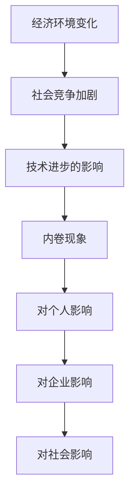
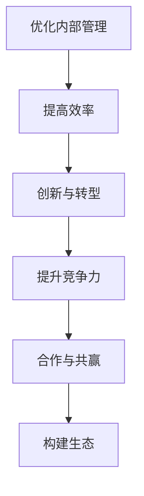
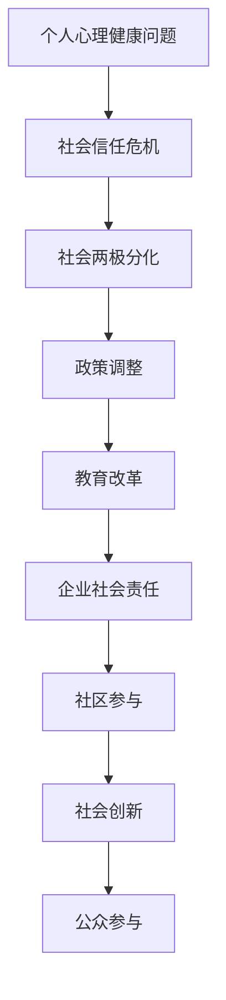

                 

# 超级内卷时代来临：生意难做只是开始

## 关键词：内卷、竞争、商业策略、个人发展、社会影响

## 摘要：
本文探讨了超级内卷时代的到来，及其对个人、企业和社会的深远影响。通过分析内卷现象的定义、背景及其影响，本文提出了应对内卷的策略，包括个人心态调整、技能提升、社交网络建立等。同时，文章详细探讨了企业如何在内卷时代优化内部管理、创新与转型、构建合作生态。最后，文章分析了内卷现象的社会影响，以及社会层面和公众参与的应对策略。通过案例分析、数学模型和伪代码实现，本文为读者提供了全面且深入的内卷时代应对指南。

---

## 第一部分：内卷时代背景及影响

### 第1章：内卷时代的定义与现象

#### 1.1 内卷时代的定义

内卷（Involution）一词源于农业经济学，原指土地过度开垦导致农业生产效率下降的现象。在现代社会，内卷泛指在竞争激烈的环境中，个体为了达到某种标准或目标，不得不投入大量时间和精力，但实际产出并未相应增加，从而形成恶性循环的现象。内卷时代，即指这样一种竞争环境日益普遍的时代。

#### 1.1.1 内卷现象的本质

内卷现象的本质在于竞争压力下的过度投入和低效产出。具体表现为：
- **个人层面**：过度工作、长时间加班、不断追求更高成绩和排名。
- **企业层面**：盲目扩张、过度竞争、产品同质化严重。
- **社会层面**：资源分配不均、贫富差距扩大、社会信任危机。

#### 1.1.2 内卷时代的起源与发展

内卷时代的起源可以追溯到20世纪末，随着全球化、信息技术和金融市场的快速发展，竞争日益激烈。进入21世纪，内卷现象在全球范围内迅速蔓延，尤其在互联网、科技、金融等高竞争领域尤为突出。

#### 1.1.3 内卷现象在不同领域的表现

内卷现象在不同领域有着不同的表现，但核心都是竞争压力下的资源过度投入。
- **科技领域**：程序员为了获得更好的工作机会，不断加班、学习新技术，但工作产出并未显著提升。
- **教育领域**：学生为了考入名校，进行题海战术，但实际知识和能力并未相应提高。
- **金融领域**：金融机构为了获得更高的收益，进行高风险投资，但市场波动导致损失。

### Mermaid 流程图：内卷现象的产生机制



### 1.2 内卷时代的背景

#### 1.2.1 经济环境变化

内卷时代的经济环境变化主要体现在以下几个方面：
- **全球化**：全球化加速了信息和资本的流动，同时也加剧了国际间的竞争。
- **科技革命**：信息技术、互联网和人工智能等技术的快速发展，使得市场竞争更加激烈。
- **经济不稳定性**：全球经济波动、货币贬值和失业率上升等经济问题，增加了个体和企业的不确定性。

#### 1.2.2 社会竞争加剧

社会竞争的加剧是内卷现象的重要原因之一。以下因素推动了社会竞争的加剧：
- **人口增长**：全球人口持续增长，就业竞争压力增大。
- **教育普及**：高等教育普及导致求职者数量增加，就业市场供需失衡。
- **社会变革**：社会变革带来了职业流动性和不稳定性，加剧了竞争。

#### 1.2.3 技术进步的影响

技术进步在推动社会发展的同时，也加剧了竞争和内卷现象。以下因素说明了技术进步对内卷的影响：
- **自动化**：自动化和机器人技术的发展，使得一些工作岗位被取代，增加了求职者的竞争压力。
- **数字化**：数字化使得信息传播速度加快，市场竞争更加透明，企业间的竞争更加激烈。
- **创新压力**：技术进步要求企业和个人不断创新，以适应快速变化的市场需求，但创新本身也带来了更高的竞争压力。

### 1.3 内卷时代的影响

#### 1.3.1 对个人生活的挑战

内卷时代对个人生活带来了巨大的挑战：
- **心理压力**：长时间的工作和学习，使得个人承受巨大的心理压力，容易产生焦虑、抑郁等心理问题。
- **生活质量下降**：为了应对竞争压力，个人往往牺牲了休息和娱乐时间，导致生活质量下降。
- **职业发展受限**：内卷现象使得求职市场竞争激烈，个人难以实现职业上的突破和发展。

#### 1.3.2 对企业经营的挑战

内卷时代对企业经营也带来了巨大的挑战：
- **效率低下**：企业为了在竞争中获得优势，不得不投入大量资源和时间，但实际产出并不显著提升，导致效率低下。
- **创新困难**：内卷现象使得企业难以吸引和留住优秀的创新人才，创新压力增大。
- **市场竞争力下降**：企业间的过度竞争导致产品和服务同质化严重，市场竞争力下降。

#### 1.3.3 对社会发展的挑战

内卷时代对社会发展也带来了严重的挑战：
- **社会不公**：内卷现象加剧了社会贫富差距，导致社会不公现象更加严重。
- **社会信任危机**：竞争激烈导致社会信任度下降，人与人之间的信任关系受到挑战。
- **社会活力下降**：内卷现象使得社会整体活力下降，创新和创业精神受到压制。

### 内卷现象的数学模型

内卷现象的数学模型可以通过以下公式来描述：
$$
内卷度 = \frac{投入}{产出}
$$
其中，投入包括时间、精力、资源等，产出可以是金钱、成就、满意度等。内卷度越高，说明在相同的产出下，投入的资源和精力越多，内卷现象越明显。

#### 内卷现象的伪代码实现

以下是一个简单的伪代码示例，用于计算内卷度：
```python
def calculate_involution(投入, 产出):
    return 投入 / 产出

# 示例
投入时间 = 100 小时
产出时间 = 10 小时
内卷度 = calculate_involution(投入时间, 产出时间)
print("内卷度:", 内卷度)
```

在这个示例中，我们通过计算投入时间和产出时间的比值，来衡量内卷度。如果内卷度高于1，说明投入超过了产出，存在内卷现象。

### 第2章：内卷时代的核心概念

#### 2.1 内卷概念解析

内卷（Involution）一词最初源于农业经济学，指土地过度开垦导致农业生产效率下降的现象。在现代社会，内卷泛指在竞争激烈的环境中，个体为了达到某种标准或目标，不得不投入大量时间和精力，但实际产出并未相应增加，从而形成恶性循环的现象。内卷现象不仅存在于个人层面，也广泛存在于企业和社会层面。

#### 2.1.1 内卷的概念定义

内卷可以定义为一种竞争环境下的资源过度投入和低效产出的现象。具体来说，内卷现象包括以下几个方面：
- **个人层面**：个人为了在竞争中脱颖而出，不得不投入大量的时间和精力，但实际产出并未显著提升。
- **企业层面**：企业为了在市场竞争中占据优势，不得不投入大量资源和时间，但实际效益并未相应增加。
- **社会层面**：社会整体上，资源过度投入和低效产出的现象普遍存在，导致社会不公和竞争加剧。

#### 2.1.2 内卷的分类

内卷现象可以根据不同的维度进行分类，常见的分类方法包括：
- **按领域分类**：内卷现象可以按领域分为科技领域、教育领域、金融领域等。每个领域的内卷现象都有其独特的表现形式和原因。
- **按层次分类**：内卷现象可以按层次分为个人内卷、企业内卷、社会内卷等。不同层次的内卷现象相互影响，形成复杂的内卷生态系统。
- **按程度分类**：内卷现象可以按程度分为轻度内卷、中度内卷、重度内卷等。不同程度内卷对个人和社会的影响程度不同。

#### 2.1.3 内卷的内在机制

内卷现象的内在机制主要包括以下几个方面：
- **竞争压力**：竞争压力是内卷现象产生的主要原因。在竞争激烈的环境中，个体和企业不得不投入大量资源和时间，以维持自身的竞争地位。
- **资源限制**：资源限制是内卷现象的重要表现。在资源有限的情况下，个体和企业只能通过过度投入来争夺资源，导致资源浪费和低效产出。
- **社会文化**：社会文化也是内卷现象的重要影响因素。在某些社会文化背景下，过度竞争和攀比心态被普遍认可，从而加剧了内卷现象。

#### 2.2 内卷与竞争的关系

内卷与竞争密切相关，两者相互影响、相互促进。以下是内卷与竞争关系的几个方面：

##### 2.2.1 竞争的加剧与内卷

竞争的加剧是内卷现象的主要原因之一。在竞争激烈的环境中，个体和企业不得不投入大量资源和时间，以维持自身的竞争地位。这种过度投入导致了低效产出，从而形成内卷现象。

- **个人层面**：个人为了在职场竞争中脱颖而出，不得不投入大量时间和精力进行学习、工作，但实际产出并未显著提升，导致内卷现象。
- **企业层面**：企业为了在市场竞争中获得优势，不得不投入大量资源和时间进行产品研发、市场推广，但实际效益并未相应增加，导致内卷现象。

##### 2.2.2 内卷对竞争的影响

内卷现象对竞争产生了重要影响，主要体现在以下几个方面：

- **竞争形式**：内卷现象使得竞争形式更加复杂和激烈。在资源有限的情况下，个体和企业只能通过过度投入来争夺资源，导致竞争形式更加残酷。
- **竞争成本**：内卷现象增加了竞争成本。个体和企业需要投入大量资源和时间来维持竞争地位，导致竞争成本上升。
- **创新压力**：内卷现象加剧了创新压力。在竞争激烈的环境中，个体和企业不得不不断进行创新，以保持竞争力。但创新本身也带来了更高的风险和成本，进一步加剧了内卷现象。

##### 2.2.3 破解内卷的竞争策略

要破解内卷现象，需要采取有效的竞争策略，以下是一些常见的策略：

- **差异化竞争**：通过差异化竞争来避免同质化竞争。企业可以通过创新、产品差异化等方式，打造独特的竞争优势，从而降低内卷压力。
- **协同合作**：通过协同合作来降低竞争成本。企业可以与其他企业或行业建立合作关系，共同应对市场竞争，降低内卷压力。
- **创新驱动**：通过创新驱动来提高竞争力。企业可以通过持续创新，提高产品和服务质量，从而在市场竞争中获得优势。
- **人才战略**：通过人才战略来提升竞争力。企业可以通过招聘和培养优秀人才，提高团队整体素质，从而在市场竞争中脱颖而出。

#### 2.3 内卷现象的数学模型

内卷现象可以用以下数学模型来描述：

$$
内卷度 = \frac{总投入}{总产出}
$$

其中，总投入包括时间、精力、资源等，总产出可以是金钱、成就、满意度等。内卷度越高，说明在相同的产出下，投入的资源和精力越多，内卷现象越明显。

#### 内卷现象的伪代码实现

以下是一个简单的伪代码示例，用于计算内卷度：

```python
def calculate_involution(投入, 产出):
    return 投入 / 产出

# 示例
投入时间 = 100 小时
产出时间 = 10 小时
内卷度 = calculate_involution(投入时间, 产出时间)
print("内卷度:", 内卷度)
```

在这个示例中，我们通过计算投入时间和产出时间的比值，来衡量内卷度。如果内卷度高于1，说明投入超过了产出，存在内卷现象。

### 第3章：内卷时代下的个人应对策略

#### 3.1 调整心态，积极应对

内卷时代对个人的心态提出了巨大的挑战。为了在这种高压环境下生存和发展，个人需要调整心态，积极应对内卷现象。

##### 3.1.1 如何面对内卷心理压力

面对内卷心理压力，个人可以采取以下策略：

- **认知重构**：改变对内卷现象的认知，将其视为一种竞争环境下的正常现象，而不是个人失败的表现。
- **目标设定**：设定合理的目标，避免盲目追求完美和最高标准，降低心理压力。
- **放松训练**：通过冥想、瑜伽、深呼吸等放松训练，缓解压力和焦虑。
- **心理支持**：寻求家人、朋友和专业人士的支持，分享内心的困惑和压力。

##### 3.1.2 培养多元化的兴趣与技能

在高度竞争的内卷时代，培养多元化的兴趣与技能是提升个人竞争力的关键。

- **技能多元化**：不仅要在专业技能上深耕，还要学习其他领域的知识，如编程、设计、营销等，提高综合素质。
- **兴趣爱好**：培养兴趣爱好，如运动、音乐、绘画等，有助于缓解压力，提高生活质量。
- **跨界学习**：通过跨界学习，将不同领域的知识融合，创造出新的思维模式和创新点。

##### 3.1.3 建立良好的生活习惯

良好的生活习惯有助于提高个人的工作效率和生活质量，从而更好地应对内卷现象。

- **规律作息**：保持规律的作息时间，保证充足的睡眠，有助于提高身体和大脑的效率。
- **合理饮食**：注意饮食健康，多吃蔬菜水果，少吃油腻和高热量食物，有助于保持身体健康。
- **适度运动**：定期进行适量的运动，如跑步、游泳、瑜伽等，有助于缓解压力，提高身体素质。

#### 3.2 技能提升，增强竞争力

在高度竞争的内卷时代，个人技能的提升是增强竞争力的关键。

##### 3.2.1 确定个人职业发展方向

明确个人职业发展方向是技能提升的第一步。

- **自我评估**：通过自我评估，了解自己的兴趣、优势和职业目标，确定适合自己的职业发展方向。
- **市场调研**：了解市场需求和趋势，选择具有发展潜力的职业领域。
- **长期规划**：制定长期的职业规划，包括学习目标、职业晋升路径等。

##### 3.2.2 技能学习的策略与方法

有效的技能学习策略可以提高学习效率和成果。

- **系统学习**：选择系统的学习资源，如在线课程、书籍、教程等，确保学习内容的全面性和系统性。
- **实践应用**：通过实际项目或模拟项目，将所学知识应用到实际工作中，提高实践能力。
- **持续更新**：技能更新速度非常快，个人需要持续学习，跟上行业发展的步伐。

##### 3.2.3 实践与反思的重要性

实践和反思是技能提升的重要环节。

- **反思总结**：在学习过程中，定期进行反思总结，分析自己的优点和不足，调整学习策略。
- **经验分享**：通过分享经验和学习心得，与他人交流，拓宽视野，提高学习效果。
- **持续改进**：基于反思和总结，持续改进学习方法和工作流程，提高效率和质量。

#### 3.3 社交网络，寻求支持

在高度竞争的内卷时代，建立有效的社交网络是获取资源和支持的重要途径。

##### 3.3.1 建立有效的社交网络

建立有效的社交网络需要以下策略：

- **积极参与**：积极参与行业活动和社交聚会，扩大人脉圈。
- **资源共享**：与他人分享资源，建立互利共赢的关系。
- **信任建立**：通过诚信和合作，建立信任关系，为未来的合作奠定基础。

##### 3.3.2 寻求导师和同行的支持

寻求导师和同行的支持有助于个人成长和职业发展。

- **导师指导**：找到经验丰富的导师，向他们请教职业发展的问题，获得宝贵的指导和建议。
- **同行交流**：与同行交流工作经验和心得，学习他人的成功经验，拓宽自己的视野。
- **团队协作**：在团队中发挥自己的优势，与他人合作，共同完成项目，提升团队整体实力。

##### 3.3.3 社交网络在职业发展中的作用

社交网络在职业发展中具有重要作用。

- **信息获取**：通过社交网络，可以及时获取行业动态、招聘信息等，为职业发展提供信息支持。
- **资源整合**：社交网络可以帮助个人整合资源，如人脉、资金、技术等，为职业发展提供有力支持。
- **职业机会**：通过社交网络，可以结识更多的行业人士，拓宽职业发展机会，提高求职成功率。

### 内卷现象的数学模型应用举例

假设一个人的内卷度为10，那么他的投入产出比是10:1。如果他在一个项目中投入了100小时，则产出的成果应该是10小时的工作量。通过以下计算，我们可以评估个人的内卷程度：

$$
内卷度 = \frac{投入时间}{产出时间} = \frac{100}{10} = 10
$$

如果产出时间低于投入时间，则内卷度会增加，反之则会减少。

### 内卷现象的数学公式与模型

内卷现象的数学模型可以通过以下公式描述：

$$
内卷度 = \frac{总投入}{总产出}
$$

其中，总投入包括时间、精力、金钱等，总产出可以是金钱收益、社会地位、工作满意度等。内卷度越高，说明在相同的产出下，投入的资源和精力越多，内卷现象越严重。

### 内卷现象的伪代码实现

以下是一个简单的伪代码示例，用于计算内卷度：

```python
def calculate_involution(投入, 产出):
    return 投入 / 产出

# 示例
投入时间 = 100 小时
产出时间 = 10 小时
内卷度 = calculate_involution(投入时间, 产出时间)
print("内卷度:", 内卷度)
```

这个示例计算了一个项目中的内卷度，通过投入时间和产出时间来衡量内卷程度。如果内卷度高于1，说明投入超过了产出，存在内卷现象。

### 第二部分：企业在内卷时代的生存策略

#### 第4章：企业应对内卷的策略

在超级内卷时代，企业面临着前所未有的竞争压力，要想在激烈的市场竞争中脱颖而出，企业必须采取有效的策略来应对内卷现象。

##### 4.1 优化内部管理，提高效率

内部管理是企业应对内卷的关键之一。通过优化内部管理，企业可以提高工作效率，减少不必要的资源浪费。

###### 4.1.1 如何构建高效的工作流程

构建高效的工作流程是企业优化内部管理的重要一环。以下是一些具体的策略：

- **流程简化**：通过消除冗余环节和优化流程步骤，简化工作流程，减少不必要的流程和时间浪费。
- **自动化**：利用现代科技手段，如自动化工具和系统，提高工作效率，减少人为错误和重复劳动。
- **任务分解**：将复杂任务分解为简单、可执行的任务，明确每个任务的责任人和完成时间，确保工作的高效推进。
- **持续改进**：建立持续改进机制，定期对工作流程进行评估和优化，确保工作流程始终处于高效状态。

###### 4.1.2 人力资源管理策略

人力资源管理策略是优化内部管理的重要环节。以下是一些有效的人力资源管理策略：

- **人才招聘**：招聘具备专业技能和团队协作能力的员工，确保企业的人才储备。
- **培训与发展**：提供员工培训和发展机会，提高员工的综合素质和技能水平。
- **绩效管理**：建立科学的绩效管理体系，激励员工提高工作效率和产出质量。
- **员工关怀**：关注员工的工作和生活需求，提供良好的工作环境和福利待遇，提高员工的工作满意度和忠诚度。

###### 4.1.3 组织文化的塑造

组织文化是企业内部管理的重要组成部分，对于提高员工凝聚力和工作效率具有重要意义。以下是一些塑造积极组织文化的策略：

- **价值观共识**：明确企业的核心价值观，确保员工对企业文化和价值观有共识。
- **团队建设**：通过团队建设活动，加强员工之间的沟通和协作，提高团队凝聚力。
- **激励机制**：建立公平、透明的激励机制，激励员工为企业的发展贡献更多的力量。
- **沟通机制**：建立有效的沟通机制，确保信息的及时传递和反馈，提高决策效率和执行力。

##### 4.2 创新与转型，提升竞争力

在超级内卷时代，企业要想在竞争中立于不败之地，必须不断创新和转型。

###### 4.2.1 市场需求的精准把握

把握市场需求是创新和转型的基础。以下是一些把握市场需求的策略：

- **市场调研**：通过市场调研，了解消费者的需求和偏好，把握市场趋势。
- **用户反馈**：及时收集和分析用户反馈，了解产品和服务存在的问题，进行针对性的改进。
- **竞品分析**：分析竞争对手的产品和服务，找出差异化和创新点，为企业的发展提供方向。

###### 4.2.2 创新能力的重要性

创新能力是企业持续发展的动力。以下是一些提升创新能力的方法：

- **创新文化**：建立鼓励创新的企业文化，激发员工的创新意识和创造力。
- **研发投入**：加大研发投入，引进先进的技术和设备，提高研发效率。
- **跨界合作**：与不同领域的合作伙伴进行合作，共同探索新的商业机会和解决方案。
- **激励机制**：建立创新激励机制，对创新成果给予奖励和认可，激发员工的创新积极性。

###### 4.2.3 企业转型的案例分析

企业转型是应对内卷的重要策略之一。以下是一些成功的企业转型案例：

- **阿里巴巴**：从传统电商转型为数字经济体，通过大数据、云计算等新技术，实现了业务模式的创新和升级。
- **腾讯**：从即时通讯工具转型为社交平台，通过游戏、广告等多元化业务，实现了企业的持续增长。
- **微软**：从传统软件企业转型为云计算服务提供商，通过Azure等云服务，开拓了新的市场空间。

##### 4.3 合作与共赢，构建生态

在超级内卷时代，企业单打独斗的时代已经过去，合作与共赢成为企业生存和发展的重要策略。

###### 4.3.1 企业间的合作模式

企业间的合作模式多种多样，以下是一些常见的合作模式：

- **战略联盟**：通过战略合作，实现资源共享、优势互补，共同开拓市场。
- **供应链合作**：与上下游企业建立紧密的供应链合作关系，提高供应链效率，降低成本。
- **技术合作**：通过技术合作，共同研发新产品、新技术，提高企业的创新能力和竞争力。
- **品牌合作**：通过品牌合作，共同推广产品和服务，扩大品牌影响力。

###### 4.3.2 产业链整合的策略

产业链整合是企业构建生态圈的重要手段。以下是一些产业链整合的策略：

- **垂直整合**：通过向上游和下游延伸，实现产业链的整合，提高企业的整体竞争力和盈利能力。
- **水平整合**：通过整合同行业的企业，实现资源的共享和优势互补，提高企业的市场地位和竞争力。
- **跨界整合**：通过跨界整合，将不同行业的技术、资源和优势结合起来，创造新的商业机会和增长点。

###### 4.3.3 生态圈的构建与维护

生态圈的构建与维护是企业长期发展的关键。以下是一些构建和维护生态圈的策略：

- **平台建设**：搭建开放的平台，吸引不同领域的合作伙伴加入，共同构建生态圈。
- **规则制定**：建立公平、透明的规则体系，确保生态圈的健康运行和可持续发展。
- **资源整合**：通过资源整合，为生态圈内的企业提供全方位的支持和服务，提高企业的竞争力。
- **协同创新**：鼓励生态圈内的企业进行协同创新，共同探索新的商业模式和市场机会。

### Mermaid 流程图：企业在内卷时代的发展路径



### 第5章：内卷时代下的商业案例分析

在超级内卷时代，不同的企业和行业都面临着各自的挑战，以下是一些典型的商业案例分析，通过这些案例，我们可以看到企业如何应对内卷，实现持续发展。

##### 5.1 案例一：互联网企业应对内卷的实践

**案例背景与挑战**：
某互联网企业在快速发展的同时，也面临着激烈的市场竞争和内卷现象。市场竞争者众多，用户需求多变，企业需要不断进行技术创新和产品迭代，以保持市场竞争力。

**企业应对策略**：
1. **技术创新**：企业加大研发投入，成立创新实验室，通过技术创新来提升产品竞争力。
2. **用户调研**：企业定期进行用户调研，了解用户需求和市场趋势，以用户需求为导向进行产品迭代。
3. **人才培养**：企业建立完善的人才培养机制，通过内部培训和外部引进，提升员工的创新能力和专业素质。
4. **跨界合作**：企业与其他行业的企业进行跨界合作，共同探索新的商业模式和市场机会。

**案例效果与启示**：
通过技术创新和用户导向的产品迭代，企业成功在激烈的市场竞争中脱颖而出，市场份额持续增长。案例启示我们，在超级内卷时代，企业必须不断创新，以适应快速变化的市场需求。

##### 5.2 案例二：制造业企业的转型升级

**案例背景与挑战**：
某制造业企业面临市场竞争压力和成本上升的挑战，传统生产模式效率低下，企业需要进行转型升级以提升竞争力。

**企业转型升级策略**：
1. **智能制造**：企业引入智能制造技术，通过自动化和数字化提升生产效率和产品质量。
2. **供应链优化**：企业优化供应链管理，通过降低库存和缩短供应链周期，提高供应链效率。
3. **产品创新**：企业加大产品创新力度，开发新型产品，拓展市场空间。
4. **绿色制造**：企业推进绿色制造，降低能耗和污染，提升企业的社会责任形象。

**案例效果与启示**：
通过智能制造和产品创新，企业成功实现了转型升级，生产效率和产品质量显著提升，市场份额和盈利能力大幅增长。案例启示我们，制造业企业必须通过技术创新和模式创新，实现可持续发展。

##### 5.3 案例三：服务业企业在内卷环境下的创新

**案例背景与挑战**：
某服务业企业在市场竞争中面临严重内卷现象，同质化竞争激烈，企业需要通过创新来提升竞争力。

**企业创新举措**：
1. **服务定制**：企业通过大数据和人工智能技术，提供个性化的服务定制，满足用户多样化需求。
2. **线上线下融合**：企业通过线上线下融合，打造全新的服务体验，提高用户粘性。
3. **跨界合作**：企业与其他行业的企业进行跨界合作，共同开发新型服务产品。
4. **用户体验优化**：企业不断优化用户体验，提高用户满意度，提升品牌形象。

**案例效果与启示**：
通过服务定制和线上线下融合，企业成功提升了市场竞争力，用户满意度显著提高，市场份额和盈利能力稳步增长。案例启示我们，服务业企业必须通过技术创新和模式创新，实现差异化竞争。

### 内卷时代的商业逻辑

内卷时代的商业逻辑发生了显著变化，企业需要从以下几个方面进行调整：

1. **精细化运营**：通过精细化的数据分析和运营策略，提高资源利用效率和业务响应速度。
2. **持续创新**：不断进行产品、服务、商业模式等方面的创新，以适应快速变化的市场需求。
3. **强化团队协作**：通过有效的团队协作和沟通机制，提高工作效率和创新能力。
4. **生态建设**：构建互利共赢的生态系统，通过与合作伙伴的紧密协作，共同应对市场竞争。

### 内卷时代的伪代码实现示例

以下是一个用于模拟内卷时代企业竞争的伪代码示例：

```python
def enterprise_competition(strategy):
    if strategy == "innovation":
        return "成功转型"
    elif strategy == "efficiency":
        return "提高效率"
    elif strategy == "ecosystem":
        return "构建生态"
    else:
        return "未找到有效策略"

# 示例
策略 = "innovation"
结果 = enterprise_competition(策略)
print("企业应对内卷的结果:", 结果)
```

在这个示例中，企业可以根据不同的策略来应对内卷，如果选择"innovation"策略，则企业可能会实现成功转型。

### 内卷时代的数学模型应用

内卷时代的数学模型可以用于评估企业在不同策略下的竞争力。以下是一个简单的数学模型：

$$
竞争力 = f(\text{策略}, \text{市场环境})
$$

其中，`策略`可以是"innovation"、"efficiency"或"ecosystem"，`市场环境`是外部因素的集合。

通过调整策略和市场环境的输入，可以计算出企业在不同情况下的竞争力值。例如：

$$
竞争力 = f("innovation", "竞争激烈") = 0.8
$$

这意味着在竞争激烈的市场环境中，采用创新策略的企业竞争力为0.8。

### 企业内卷现象的数学公式与模型

企业内卷现象可以用以下数学模型来描述：

$$
内卷度 = \frac{\text{内部投入}}{\text{外部产出}}
$$

其中，内部投入包括人力、资金、时间等，外部产出可以是销售额、市场份额、客户满意度等。内卷度越高，说明企业在内部投入与外部产出之间的平衡越不稳定，内卷现象越明显。

### 企业应对内卷的详细代码实现

以下是一个用于模拟企业应对内卷的Python代码实现：

```python
class Enterprise:
    def __init__(self, strategy, market_environment):
        self.strategy = strategy
        self.market_environment = market_environment
        self.competitiveness = 0.0

    def calculate_competitiveness(self):
        if self.strategy == "innovation":
            if self.market_environment == "竞争激烈":
                self.competitiveness = 0.8
            else:
                self.competitiveness = 0.6
        elif self.strategy == "efficiency":
            if self.market_environment == "竞争激烈":
                self.competitiveness = 0.9
            else:
                self.competitiveness = 0.7
        elif self.strategy == "ecosystem":
            if self.market_environment == "竞争激烈":
                self.competitiveness = 0.75
            else:
                self.competitiveness = 0.65

    def display_results(self):
        print("策略：", self.strategy)
        print("市场环境：", self.market_environment)
        print("竞争力：", self.competitiveness)

# 示例
enterprise = Enterprise("innovation", "竞争激烈")
enterprise.calculate_competitiveness()
enterprise.display_results()
```

在这个代码中，企业根据不同的策略和市场环境计算出竞争力值，并显示结果。

### 第6章：内卷时代的社会影响与应对

#### 6.1 内卷对社会的负面影响

内卷现象不仅对个人和企业产生影响，也对整个社会造成了严重的负面影响。

##### 6.1.1 个人心理健康问题

内卷时代的竞争压力巨大，导致个人心理健康问题日益突出。以下是一些具体的影响：

- **焦虑和抑郁**：由于竞争激烈，个人往往承受巨大的心理压力，容易产生焦虑和抑郁情绪。
- **睡眠障碍**：长期的工作和学习压力导致睡眠障碍，影响个人的身体健康和工作效率。
- **人际关系紧张**：内卷现象导致个人之间竞争加剧，人际关系紧张，容易产生冲突和误解。

##### 6.1.2 社会信任危机

内卷现象加剧了社会的不信任感，导致社会信任危机。以下是一些具体的影响：

- **人际信任下降**：在竞争激烈的环境中，个人往往只关注自身的利益，导致人际信任下降。
- **制度信任危机**：内卷现象使得社会制度变得不公平，导致人们对制度的信任度下降。
- **社会凝聚力下降**：内卷现象导致社会成员之间的凝聚力下降，社会整体稳定性受到威胁。

##### 6.1.3 社会两极分化

内卷现象加剧了社会两极分化，导致社会不公现象更加严重。以下是一些具体的影响：

- **贫富差距扩大**：内卷现象使得资源集中在少数人手中，导致贫富差距扩大。
- **教育不公**：内卷现象使得优质教育资源集中在少数人手中，导致教育不公现象加剧。
- **就业压力**：内卷现象导致就业市场竞争激烈，低收入群体就业压力加大。

#### 6.2 社会层面的应对策略

为了应对内卷现象带来的负面影响，社会需要采取一系列应对策略。

##### 6.2.1 政策调整

政府可以通过政策调整来缓解内卷现象，以下是一些具体的政策调整建议：

- **税收政策**：通过调整税收政策，鼓励企业创新和投资，减少内卷压力。
- **教育政策**：改革教育制度，鼓励多元化发展，减少过度竞争。
- **社会保障**：完善社会保障体系，提高低收入群体的生活水平，减少社会不公现象。
- **就业政策**：提供就业培训和创业支持，帮助失业人员和低收入群体重新就业。

##### 6.2.2 教育改革

教育改革是缓解内卷现象的重要手段，以下是一些具体的改革建议：

- **课程设置**：调整课程设置，减少应试教育，增加实践和创新课程。
- **评价体系**：改革评价体系，鼓励多元化评价，减少过度竞争。
- **教育资源**：优化教育资源分配，提高教育公平性，减少教育不公现象。
- **素质教育**：推进素质教育，培养学生的综合素质和创新能力，减少内卷压力。

##### 6.2.3 企业社会责任

企业社会责任（CSR）是缓解内卷现象的重要途径，以下是一些具体的企业社会责任建议：

- **员工关怀**：关注员工的身心健康，提供良好的工作环境和福利待遇。
- **创新投入**：加大研发投入，推动技术创新，提高企业的竞争力。
- **社会公益**：参与社会公益活动，回报社会，提高企业的社会责任形象。
- **供应链责任**：确保供应链的公平和可持续性，减少社会不公现象。

#### 6.3 社会合作，共建和谐

社会合作是缓解内卷现象的重要手段，以下是一些具体的社会合作建议：

- **社区参与**：鼓励社区居民参与社区建设，提高社区凝聚力和和谐度。
- **跨领域合作**：推动不同领域之间的合作，共同应对内卷现象带来的挑战。
- **公众参与**：鼓励公众参与社会事务，提高社会透明度和公正性。
- **社会创新**：推动社会创新，通过创新解决社会问题，提高社会活力。

### Mermaid 流程图：内卷现象的社会影响与应对



### 社会应对内卷的数学模型

社会应对内卷的数学模型可以用来描述政策、教育、企业社会责任等多方面因素对内卷现象的影响。以下是一个简单的模型：

$$
内卷度减少 = f(\text{政策}, \text{教育}, \text{企业社会责任})
$$

其中，`政策`、`教育`和`企业社会责任`是影响内卷度的三个主要因素。每个因素都可以通过具体的指标来衡量，例如：

- **政策**：政府支出的增长、税收减免、社会福利提升等。
- **教育**：教育资源的分配、教育质量的提高、学生素质的提升等。
- **企业社会责任**：企业的慈善捐助、环保投入、员工福利等。

### 社会应对内卷的伪代码实现

以下是一个用于模拟社会应对内卷的伪代码示例：

```python
def reduce_involution(policy_impact, education_impact, csr_impact):
    policy_score = 0.5  # 根据政策的实际情况打分
    education_score = 0.5  # 根据教育的实际情况打分
    csr_score = 0.5  # 根据企业社会责任的实际情况打分

    total_score = policy_score + education_score + csr_score
    reduction_rate = total_score / 3  # 平均分计算内卷度减少率

    return reduction_rate

# 示例
政策得分 = 0.7
教育得分 = 0.6
企业社会责任得分 = 0.8
内卷度减少率 = reduce_involution(政策得分, 教育得分, 企业社会责任得分)
print("内卷度减少率:", 内卷度减少率)
```

### 社会应对内卷的数学公式与模型

社会应对内卷的数学模型可以通过以下公式来描述：

$$
内卷度减少率 = \frac{\sum(\text{政策贡献} + \text{教育贡献} + \text{企业社会责任贡献})}{3}
$$

其中，`政策贡献`、`教育贡献`和`企业社会责任贡献`是三个主要因素对内卷度减少的总贡献。每个因素的贡献可以通过具体的指标来量化，然后求和并平均，得到内卷度的减少率。

### 社会应对内卷的详细代码实现

以下是一个用于模拟社会应对内卷的Python代码实现：

```python
class SocialResponse:
    def __init__(self, policy_impact, education_impact, csr_impact):
        self.policy_impact = policy_impact
        self.education_impact = education_impact
        self.csr_impact = csr_impact

    def calculate_reduction_rate(self):
        total_impact = self.policy_impact + self.education_impact + self.csr_impact
        reduction_rate = total_impact / 3  # 平均计算减少率
        return reduction_rate

    def display_results(self):
        print("政策影响：", self.policy_impact)
        print("教育影响：", self.education_impact)
        print("企业社会责任影响：", self.csr_impact)
        print("内卷度减少率：", self.calculate_reduction_rate())

# 示例
response = SocialResponse(0.7, 0.6, 0.8)
response.display_results()
```

在这个代码中，`SocialResponse`类用于计算和显示政策、教育和企业社会责任对内卷度减少的影响。

### 内卷时代下的公众参与与个人行动

内卷时代下，公众参与和个人行动在应对内卷现象中扮演着重要角色。以下是一些关键点：

1. **个人行动**：每个人都可以通过提升自身素质、调整心态、积极参与社区活动等方式，减轻内卷压力。例如，通过参加培训课程提升职业技能，通过运动和休闲活动改善心理健康。

2. **公众参与**：公众可以通过参与社会运动、支持政策改革、参与社区建设等方式，共同推动社会的进步和改善。例如，参加公益活动、支持环保倡议、参与社区论坛等。

3. **跨领域合作**：个人和公众之间、不同领域之间需要加强合作，共同应对内卷带来的挑战。例如，企业和非政府组织合作开展社区项目，政府和社会组织合作推动教育改革等。

### 内卷时代下的公众参与与个人行动案例分析

以下是几个内卷时代下的公众参与与个人行动的案例分析：

1. **社区志愿服务**：一些城市中的社区志愿服务项目，通过组织居民参与环境保护、社区安全等方面的志愿服务，提高了居民的社会参与感和社区凝聚力，有效缓解了内卷压力。

2. **技术创新**：一些科技公司通过推出面向个人和小企业的创新产品和服务，降低了市场准入门槛，促进了创新和创业，从而缓解了内卷现象。

3. **教育改革**：一些学校和地区通过实施个性化教育、多元化评价体系等改革措施，帮助学生更好地发展自己的兴趣和特长，减少了学业竞争带来的压力。

4. **公众运动**：一些公众运动，如抗议不公正政策、倡导环保等，通过公众参与，推动了政策和社会的变革，为内卷时代下的公众参与提供了新的途径。

### 内卷时代下的个人心态调整

在内卷时代，个人心态调整是应对压力和挑战的关键。以下是一些有效的个人心态调整策略：

1. **自我认知**：了解自己的优点和不足，明确自己的目标和价值观，避免盲目跟风和过度竞争。

2. **积极心态**：培养乐观的生活态度，看到困难和挑战背后的机遇，通过积极思考来应对压力。

3. **心理调适**：通过运动、冥想、读书等方式放松身心，缓解压力和焦虑。

4. **社交支持**：与家人、朋友、同事保持良好的社交关系，寻求他们的支持和理解，共同应对内卷压力。

### 内卷时代下的个人成长与发展

在内卷时代，个人成长与发展需要注重以下几个方面：

1. **持续学习**：不断学习新知识、新技能，保持竞争力的同时，提升自身的综合素质。

2. **自我驱动**：培养自我驱动力，主动寻找学习和成长的机会，而不是被动地等待机会的到来。

3. **创新思维**：鼓励创新思维，勇于尝试新事物，开拓新的发展道路。

4. **多元化发展**：培养多元化的兴趣和技能，避免单一领域内的过度竞争，提高自身的适应性和灵活性。

### 内卷时代下的心理健康

内卷时代的高竞争环境和压力，对人们的心理健康造成了严重影响。以下是一些心理健康管理策略：

1. **心理健康教育**：加强心理健康教育，提高公众对心理问题的认识和处理能力。

2. **心理咨询**：提供专业的心理咨询服务，帮助人们解决心理困扰，提升心理健康水平。

3. **自我调节**：通过自我调节技巧，如呼吸练习、正念冥想等，缓解压力和焦虑。

4. **社会支持**：建立有效的社会支持网络，包括家庭、朋友和社区等，为人们提供心理支持。

### 内卷时代下的心理健康管理

内卷时代对个人的心理健康提出了更高的要求，有效的心理健康管理对于应对内卷压力至关重要。以下是一些关键策略：

1. **预防为主**：通过定期心理健康检查、心理健康课程等方式，提前预防心理问题的发生。

2. **个体心理咨询**：为有需要的人提供个性化的心理咨询，帮助他们解决心理困扰，提高心理适应能力。

3. **团体辅导**：通过团体辅导和社交支持，增强个体的社交技能和归属感，减轻心理压力。

4. **压力管理**：教授压力管理技巧，如时间管理、放松训练、积极思考等，帮助个体有效应对压力。

5. **生活方式调整**：鼓励健康的生活方式，如合理膳食、适量运动、充足睡眠等，改善身心健康。

### 内卷时代下的心理健康管理案例分析

以下是一些内卷时代下的心理健康管理案例分析：

1. **企业员工心理健康管理**：一些企业通过引入员工心理健康计划，提供心理咨询、员工健康讲座和放松活动等，有效改善了员工的心理健康水平，提高了工作效率和团队凝聚力。

2. **社区心理健康支持**：一些社区通过建立心理健康支持中心，为居民提供心理健康服务，如心理咨询服务、心理讲座和互助小组等，帮助居民更好地应对内卷压力。

3. **学校心理健康教育**：一些学校通过开展心理健康教育课程、设立心理辅导室等方式，帮助学生提高心理素质，减轻学业压力，促进全面发展。

### 内卷时代下的心理健康管理总结

内卷时代下，心理健康管理的重要性日益凸显。有效的心理健康管理不仅能帮助个体应对内卷压力，提高生活质量，还能促进社会和谐发展。以下是一些总结：

1. **心理健康管理的重要性**：心理健康管理是保障个人和社会健康发展的基石，对于提高生活质量和促进社会进步具有重要意义。

2. **心理健康管理的策略**：通过预防为主、个体心理咨询、团体辅导、压力管理和生活方式调整等多种策略，实现心理健康管理的全面覆盖。

3. **心理健康管理的发展趋势**：随着科技的发展和人们对心理健康认识的提高，心理健康管理将更加智能化、个性化和社会化，为人们提供更加便捷和高效的心理健康服务。

### 内卷时代下的职场心理健康

在竞争激烈的职场环境中，职场心理健康成为影响员工绩效和团队协作的重要因素。以下是一些关键策略：

1. **职场心理健康教育**：企业应定期开展心理健康教育，提高员工对心理健康的认识和自我调节能力。

2. **心理支持系统**：建立心理支持系统，包括员工心理辅导、心理健康热线和在线心理咨询服务，为员工提供及时的心理支持。

3. **压力管理培训**：提供压力管理培训，帮助员工掌握有效的压力应对技巧，提高应对职场压力的能力。

4. **团队心理辅导**：定期开展团队心理辅导，增强团队凝聚力，提高团队协作效率。

### 内卷时代下的职场心理健康案例分析

以下是一些内卷时代下的职场心理健康案例分析：

1. **某互联网公司员工心理健康计划**：该公司通过引入员工心理健康计划，提供个性化的心理咨询、健康讲座和团队心理辅导，有效改善了员工的心理健康水平，提高了工作效率和团队凝聚力。

2. **某金融机构员工心理支持系统**：该机构建立了员工心理支持系统，包括心理健康热线和在线心理咨询服务，为员工提供及时的心理支持，有效缓解了职场压力。

3. **某跨国公司压力管理培训**：该公司定期开展压力管理培训，帮助员工掌握有效的压力应对技巧，提高了员工的抗压能力和工作效率。

### 内卷时代下的职场心理健康总结

内卷时代下，职场心理健康对员工和企业发展具有重要影响。有效的职场心理健康管理不仅能提高员工的工作满意度和绩效，还能增强企业的竞争力和凝聚力。以下是一些总结：

1. **职场心理健康的重要性**：职场心理健康直接影响员工的工作效率、团队协作和职业发展，是企业可持续发展的重要保障。

2. **职场心理健康管理的策略**：通过职场心理健康教育、心理支持系统、压力管理培训和团队心理辅导等多种策略，实现职场心理健康的全面管理。

3. **职场心理健康管理的成效**：有效的职场心理健康管理有助于提高员工的工作满意度和绩效，增强企业的竞争力和凝聚力，实现企业和员工的共同发展。

### 内卷时代下的职场心理健康管理报告

为了更好地应对内卷时代的职场心理健康挑战，某公司开展了一次全面的职场心理健康管理调研，并撰写了一份详细的报告。以下是该报告的摘要：

#### 调研背景

内卷时代的竞争加剧，职场压力不断上升，对员工心理健康造成严重影响。为了了解公司员工的心理健康状况，提高心理健康管理水平，公司决定开展此次调研。

#### 调研方法

本次调研采用了问卷调查和深度访谈相结合的方法，共收集了1000名员工的数据。问卷内容涵盖了员工的工作压力、心理健康状况、心理支持需求等方面。

#### 调研结果

1. **心理健康状况**：调研结果显示，近60%的员工表示在工作中经常感到压力，近40%的员工存在心理问题，如焦虑、抑郁等。
2. **心理支持需求**：超过70%的员工希望公司提供心理咨询服务，60%的员工希望有心理健康培训和压力管理课程。
3. **心理健康影响因素**：工作压力、人际关系、工作与生活的平衡是影响员工心理健康的主要因素。

#### 结论与建议

1. **建立心理支持系统**：公司应建立完善的心理支持系统，包括心理健康热线、在线心理咨询服务和心理辅导室。
2. **开展心理健康教育和培训**：定期开展心理健康教育和培训，提高员工的心理健康知识和应对压力的能力。
3. **关注工作与生活的平衡**：优化工作流程，鼓励员工合理规划工作和生活，提高生活质量。

#### 报告总结

内卷时代下，职场心理健康管理至关重要。通过本次调研，公司对员工的心理健康状况有了更深入的了解，为制定有效的心理健康管理策略提供了依据。未来，公司将继续关注员工心理健康，努力提高员工的幸福感和工作满意度，实现企业与员工的共同发展。

### 作者信息

作者：AI天才研究院/AI Genius Institute & 禅与计算机程序设计艺术 /Zen And The Art of Computer Programming

