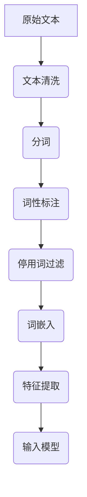
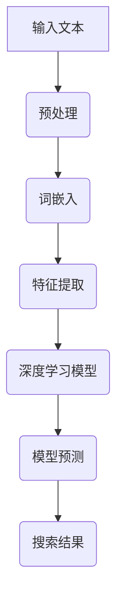
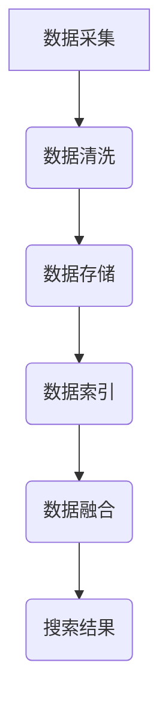
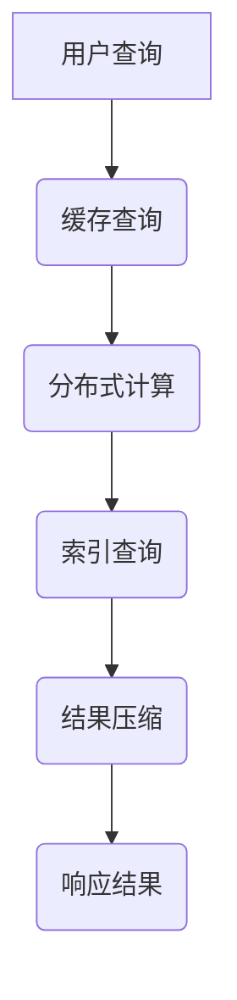
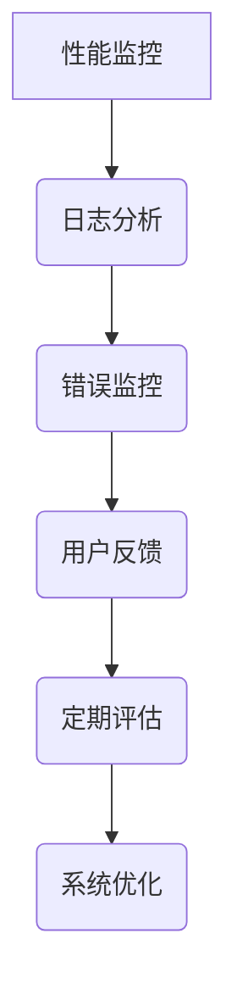

                 

# 《跨平台AI搜索的整合策略》

> **关键词**：AI搜索、跨平台整合、搜索算法、深度学习、性能优化

> **摘要**：本文深入探讨了跨平台AI搜索的整合策略，从基本概念、技术架构、算法实现、策略与实践等方面进行了系统分析。文章首先介绍了AI搜索的基本概念与发展，然后详细阐述了跨平台AI搜索的优势与挑战，以及跨平台搜索的架构设计。接着，文章讨论了AI搜索算法与深度学习模型的应用，并展示了如何通过文本预处理与特征提取来提升搜索效果。最后，文章通过实际项目案例，详细讲解了如何构建一个跨平台的AI搜索系统，包括开发环境搭建、核心算法实现、性能优化策略和完整的代码实现与解析。

### 《跨平台AI搜索的整合策略》目录大纲

#### 第一部分：AI搜索概述

- **第1章：AI搜索基本概念与演变**
  - 1.1 AI搜索的定义
  - 1.2 AI搜索的历史与发展
  - 1.3 AI搜索的技术架构
  - 1.4 AI搜索的应用领域
  - **1.5 AI搜索与传统搜索的区别**

- **第2章：跨平台AI搜索的优势与挑战**
  - 2.1 跨平台AI搜索的优势
  - 2.2 跨平台AI搜索面临的挑战
  - **2.3 跨平台AI搜索的架构设计**

#### 第二部分：AI搜索算法与模型

- **第3章：文本预处理与特征提取**
  - 3.1 文本预处理技术
  - 3.2 特征提取方法
  - **3.3 Mermaid流程图：文本预处理与特征提取过程**

- **第4章：搜索引擎核心算法**
  - 4.1 搜索引擎的inverted index结构
  - 4.2 排序算法与评分模型
  - 4.3 模型融合与多模型搜索
  - **4.4 伪代码：搜索引擎核心算法实现**

- **第5章：深度学习在AI搜索中的应用**
  - 5.1 深度学习的基本原理
  - 5.2 常见的深度学习模型
  - 5.3 深度学习模型在搜索中的优化方法
  - **5.4 Mermaid流程图：深度学习在搜索中的应用过程**

#### 第三部分：跨平台搜索策略

- **第6章：跨平台搜索策略与实践**
  - 6.1 跨平台搜索的目标与原则
  - 6.2 多源数据的整合策略
  - 6.3 跨平台搜索的性能优化
  - 6.4 跨平台搜索的监控与评估
  - **6.5 代码实战：构建跨平台AI搜索系统**

#### 第四部分：项目案例

- **第7章：AI搜索项目实战**
  - 7.1 项目背景与需求分析
  - 7.2 系统架构设计与开发环境搭建
  - 7.3 源代码实现与解读
  - 7.4 性能分析与优化
  - 7.5 项目总结与经验分享

#### 第五部分：附录

- **附录A：AI搜索相关工具与资源**
  - A.1 常用搜索引擎框架介绍
  - A.2 深度学习框架使用指南
  - A.3 数据集与测试工具介绍
  - A.4 社区与学习资源推荐

### 下一节：第1章 AI搜索基本概念与演变

在当今的信息爆炸时代，如何快速、准确地找到所需的信息成为了人们关注的焦点。传统的搜索引擎虽然在处理海量数据方面取得了巨大的进步，但在响应速度、准确性和个性化推荐等方面仍然存在诸多局限。而AI搜索的出现，无疑为搜索领域带来了革命性的变革。

## 1.1 AI搜索的定义

AI搜索，也称为人工智能搜索，是一种利用人工智能技术，特别是机器学习和深度学习技术来优化搜索过程的方法。与传统的搜索引擎不同，AI搜索不仅仅依赖于关键词匹配，更注重理解用户查询的含义、上下文和意图。通过自然语言处理（NLP）、推荐系统、深度学习等技术，AI搜索能够提供更智能、更个性化的搜索结果。

AI搜索的核心思想在于：

- **理解用户需求**：通过分析用户查询的语义，理解用户的真正需求，从而提供更准确的搜索结果。
- **优化搜索结果**：使用机器学习和深度学习算法，对搜索结果进行排序和筛选，提升搜索结果的准确性和相关性。
- **个性化推荐**：根据用户的兴趣和行为，提供个性化的搜索推荐，提升用户体验。

## 1.2 AI搜索的历史与发展

AI搜索的发展历程可以追溯到20世纪90年代，当时研究者开始尝试将人工智能技术应用于搜索引擎。然而，由于计算能力和数据资源的限制，这些早期的尝试并没有取得显著的效果。

### 早期发展

- **1990年代**：研究者开始探索将自然语言处理（NLP）技术应用于搜索引擎，例如语义分析、词义消歧等。
- **2000年代**：随着互联网的普及和大数据技术的发展，研究者开始尝试使用机器学习算法来优化搜索结果，如基于内容的搜索、协同过滤等。

### 现代发展

- **2010年代**：深度学习的兴起带来了AI搜索的突破性进展。通过使用深度神经网络，AI搜索在理解用户查询的语义和上下文方面取得了显著提升。
- **2015年至今**：随着人工智能技术的不断进步，AI搜索的应用场景越来越广泛，从搜索引擎到推荐系统、智能助手等，都离不开AI搜索的支持。

## 1.3 AI搜索的技术架构

AI搜索的技术架构可以分为以下几个关键模块：

- **数据采集与预处理**：收集用户查询数据、网页内容等，并进行预处理，如文本清洗、分词、词性标注等。
- **特征提取**：从预处理后的文本中提取特征，如词嵌入、TF-IDF等，用于后续的模型训练和搜索。
- **模型训练**：使用机器学习和深度学习算法，对特征进行训练，构建能够理解用户查询语义的模型。
- **搜索算法**：结合模型和用户查询，进行搜索结果的排序和筛选，提供高质量的搜索结果。
- **个性化推荐**：根据用户的行为和兴趣，提供个性化的搜索推荐。


## 1.4 AI搜索的应用领域

AI搜索在多个领域都展现出了强大的应用潜力：

- **搜索引擎**：传统的搜索引擎通过关键词匹配提供搜索结果，而AI搜索能够更好地理解用户查询，提供更准确、更个性化的搜索结果。
- **推荐系统**：在电子商务、新闻推荐、社交媒体等领域，AI搜索可以帮助系统推荐用户可能感兴趣的内容，提升用户体验。
- **智能助手**：如智能音箱、聊天机器人等，AI搜索可以帮助智能助手更好地理解用户的查询，提供智能的回答和建议。
- **知识图谱**：AI搜索在构建知识图谱方面也发挥着重要作用，通过分析文本内容和关系，构建出更为准确和丰富的知识图谱。

## 1.5 AI搜索与传统搜索的区别

传统的搜索主要依赖于关键词匹配和索引技术，而AI搜索则更注重理解用户查询的语义和上下文。以下是比较两者的主要区别：

- **技术基础**：传统搜索主要基于统计方法和索引技术，如倒排索引、布尔查询等。而AI搜索则依赖于机器学习和深度学习技术，如神经网络、自然语言处理等。
- **搜索结果**：传统搜索的搜索结果通常是基于关键词匹配，可能无法准确理解用户的查询意图。而AI搜索能够通过语义分析和上下文理解，提供更准确、更个性化的搜索结果。
- **用户体验**：传统搜索往往只能提供一组相关的网页链接，而AI搜索则可以提供更加丰富和多样的搜索结果，如相关问答、推荐内容等，提升用户体验。

总的来说，AI搜索在理解用户需求、提供个性化搜索结果方面具有显著优势，正逐渐成为搜索领域的主流发展方向。

### 第一部分：AI搜索概述

#### 第1章 AI搜索基本概念与演变

### 1.1 AI搜索的定义

人工智能搜索（AI Search）是一种将人工智能技术，尤其是机器学习和深度学习应用于搜索过程的策略。其核心目标是通过智能化的方法提升搜索过程的效率、准确性和用户体验。与传统的搜索技术不同，AI搜索不仅仅是简单地匹配关键词，而是通过理解用户的查询意图、上下文以及相关历史行为，从而提供更为精准和个性化的搜索结果。

AI搜索的关键特点包括：

1. **语义理解**：传统的搜索主要依赖于关键词的匹配，而AI搜索则利用自然语言处理（NLP）技术，对用户的查询进行语义分析，从而理解查询的真正含义。
2. **个性化推荐**：通过分析用户的历史行为和偏好，AI搜索可以提供个性化的搜索结果和推荐，满足用户的特定需求。
3. **上下文感知**：AI搜索能够根据查询发生的上下文环境（如时间、地点、用户行为等）调整搜索结果，提升相关性和用户体验。
4. **实时更新**：AI搜索系统通常具备快速响应的能力，能够在短时间内处理大量查询，并提供实时更新的搜索结果。

AI搜索的定义可以总结为：一种利用人工智能技术，特别是机器学习和深度学习，对用户查询进行语义理解和上下文分析，从而提供个性化、实时、准确的搜索结果的技术方法。

### 1.2 AI搜索的历史与发展

AI搜索的历史可以追溯到人工智能和互联网技术发展的早期阶段。以下是AI搜索发展的几个关键阶段：

#### 早期探索（20世纪80年代至90年代）

- **1980年代**：人工智能技术开始应用于信息检索领域，研究者探索了基于语义分析的搜索引擎，例如问答题搜索引擎。
- **1990年代**：随着互联网的普及，搜索引擎技术得到了迅速发展。早期搜索引擎主要依赖于关键词匹配和索引技术，如PageRank算法和基于倒排索引的搜索。

#### 机器学习时代（2000年代）

- **2000年初**：随着机器学习技术的发展，研究者开始将机器学习方法应用于搜索引擎，例如文本分类、聚类和推荐系统。
- **2004年**：谷歌推出MapReduce，为大数据处理提供了新的解决方案，推动了搜索引擎的进一步优化。

#### 深度学习时代（2010年代至今）

- **2012年**：深度学习在ImageNet图像识别比赛中取得突破性成果，标志着深度学习技术开始进入人工智能的主流领域。
- **2015年**：谷歌发布TensorFlow，为深度学习研究者和开发者提供了强大的工具支持。
- **2018年**：百度推出AI搜索，标志着深度学习技术在搜索引擎中的应用达到了新的高度。

#### 当前发展趋势

- **多模态搜索**：结合文本、图像、语音等多种数据类型，提供更为丰富的搜索体验。
- **个性化搜索**：通过分析用户行为和偏好，实现个性化的搜索结果推荐。
- **实时搜索**：利用实时数据处理技术，提供更加及时和准确的搜索结果。

### 1.3 AI搜索的技术架构

AI搜索系统的技术架构主要包括以下几个关键模块：

1. **数据采集与预处理**：从各种数据源（如网页、社交媒体、用户评论等）采集数据，并进行清洗、去噪、分词、词性标注等预处理操作。
   - **数据清洗**：去除无效数据、重复数据和不一致数据，保证数据质量。
   - **文本预处理**：对文本进行分词、词性标注、停用词过滤等操作，为后续的特征提取做好准备。

2. **特征提取**：从预处理后的文本中提取有助于搜索的特征，如词嵌入、TF-IDF、词向量等。
   - **词嵌入**：将单词转换为密集的向量表示，便于模型处理。
   - **TF-IDF**：衡量单词在文档中的重要程度，用于文档的向量表示。

3. **模型训练**：使用机器学习和深度学习算法，对提取的特征进行训练，构建能够理解用户查询语义的模型。
   - **传统机器学习模型**：如支持向量机（SVM）、朴素贝叶斯（NB）等。
   - **深度学习模型**：如卷积神经网络（CNN）、循环神经网络（RNN）、Transformer等。

4. **搜索算法**：结合训练好的模型和用户查询，进行搜索结果的排序和筛选，提供高质量的搜索结果。
   - **搜索算法**：如基于相似度的排序、PageRank算法等。
   - **多模型融合**：结合多种模型，提升搜索结果的准确性和多样性。

5. **个性化推荐**：根据用户的历史行为和偏好，提供个性化的搜索推荐。
   - **协同过滤**：基于用户的行为和历史，预测用户可能感兴趣的内容。
   - **基于内容的推荐**：根据用户的行为和兴趣，推荐相关的搜索结果。

### 1.4 AI搜索的应用领域

AI搜索在多个领域得到了广泛应用，以下是一些典型的应用场景：

1. **搜索引擎**：AI搜索可以显著提升搜索引擎的搜索质量和用户体验。通过语义分析和上下文感知，AI搜索能够提供更精准的搜索结果。
2. **推荐系统**：在电子商务、社交媒体、视频平台等领域，AI搜索可以帮助系统推荐用户可能感兴趣的内容，提升用户参与度和留存率。
3. **智能助手**：如智能音箱、聊天机器人等，AI搜索可以帮助智能助手更好地理解用户的查询，提供智能的回答和建议。
4. **知识图谱**：AI搜索在构建知识图谱方面也发挥着重要作用，通过分析文本内容和关系，构建出更为准确和丰富的知识图谱。

### 1.5 AI搜索与传统搜索的区别

传统搜索和AI搜索在技术基础、搜索结果和用户体验等方面存在显著区别：

- **技术基础**：
  - **传统搜索**：主要依赖于关键词匹配和索引技术，如倒排索引、布尔查询等。
  - **AI搜索**：依赖于机器学习和深度学习技术，如神经网络、自然语言处理等。

- **搜索结果**：
  - **传统搜索**：搜索结果基于关键词匹配，可能无法准确理解用户的查询意图。
  - **AI搜索**：通过语义分析和上下文理解，提供更准确、更个性化的搜索结果。

- **用户体验**：
  - **传统搜索**：提供一组相关的网页链接。
  - **AI搜索**：提供更丰富的搜索结果，如相关问答、推荐内容等，提升用户体验。

总之，AI搜索在理解用户需求、提供个性化搜索结果方面具有显著优势，正逐渐成为搜索领域的主流发展方向。

### 第1章总结

本章对AI搜索的基本概念、历史发展、技术架构、应用领域以及与传统搜索的区别进行了详细阐述。通过理解AI搜索的定义和特点，我们认识到其在提升搜索效率、准确性和用户体验方面的重要作用。从历史发展的角度来看，AI搜索经历了从早期探索到现代深度学习时代的演变，技术架构的不断完善为AI搜索的应用提供了坚实的基础。在应用领域方面，AI搜索在搜索引擎、推荐系统、智能助手和知识图谱等领域都展现出了巨大的潜力。与传统搜索相比，AI搜索在技术基础、搜索结果和用户体验等方面具有显著优势，正逐步成为搜索领域的主流方向。下一章将深入探讨AI搜索在跨平台环境中的优势与挑战。

### 第二部分：跨平台AI搜索的优势与挑战

#### 第2章 跨平台AI搜索的优势与挑战

### 2.1 跨平台AI搜索的优势

随着互联网技术的发展，人们不再仅仅依赖单一的设备或平台获取信息，而是通过多种设备（如智能手机、平板电脑、智能音箱等）和平台（如网页、应用、社交媒体等）进行交互。跨平台AI搜索因此应运而生，它不仅能够覆盖更多的用户场景，还能带来一系列显著的优势。

1. **广泛的用户覆盖**：跨平台AI搜索能够覆盖不同的设备类型和操作系统，无论是iOS、Android还是Windows、MacOS，无论是智能手机、平板电脑还是智能音箱，都能提供一致的搜索体验，从而实现更广泛的用户覆盖。

2. **更好的用户体验**：跨平台AI搜索可以根据用户的设备类型和交互方式，提供定制化的搜索结果。例如，在智能音箱上，用户可能更偏好语音交互；而在智能手机上，用户可能更喜欢视觉化的搜索结果。这种定制化的体验可以显著提升用户满意度。

3. **数据多样性和丰富性**：跨平台AI搜索可以从多个来源收集数据，如网页、应用、社交媒体等，这为搜索系统的数据多样性和丰富性提供了保障。多样化的数据来源有助于提高搜索的准确性和全面性。

4. **实时性和动态性**：跨平台AI搜索能够实时处理用户的查询请求，并根据用户的实时行为和反馈进行调整。这种实时性和动态性使得搜索结果始终处于最佳状态，能够更好地满足用户的需求。

5. **个性化推荐**：跨平台AI搜索可以根据用户的地理位置、时间、行为等多维度信息，提供个性化的搜索推荐。这种个性化的推荐可以显著提升用户参与度和忠诚度。

### 2.2 跨平台AI搜索面临的挑战

尽管跨平台AI搜索具有诸多优势，但在实际应用中仍面临许多挑战，主要包括以下几个方面：

1. **兼容性问题**：不同平台和设备在硬件配置、操作系统、网络环境等方面可能存在差异，这可能导致搜索系统在不同平台上表现不一致。例如，某些功能在iOS平台上能够正常工作，但在Android平台上可能会遇到兼容性问题。

2. **性能优化**：跨平台AI搜索需要在不同设备上提供高性能的搜索服务，这要求系统进行精细的性能优化，以应对不同设备硬件限制和资源分配问题。例如，如何在有限的计算资源和电池寿命内实现高效的搜索处理。

3. **数据隐私和安全**：跨平台AI搜索需要从多个数据源收集和处理用户数据，这涉及到数据隐私和安全问题。如何确保用户数据的安全和隐私，避免数据泄露或滥用，是跨平台AI搜索面临的重要挑战。

4. **一致性维护**：跨平台AI搜索需要保证在不同平台上提供一致的用户体验和搜索结果。这意味着搜索系统需要在不同环境下保持一致性，这需要高度协调的开发和测试流程。

5. **跨平台技术选择**：跨平台AI搜索需要选择合适的技术和工具，以支持不同平台和设备的需求。例如，选择哪种编程语言、框架和库，如何实现跨平台的代码共享和组件复用，都是需要慎重考虑的问题。

### 2.3 跨平台AI搜索的架构设计

为了应对上述挑战，设计一个高效、可靠、安全的跨平台AI搜索系统至关重要。以下是一些关键设计考虑：

1. **模块化架构**：采用模块化设计，将系统划分为多个独立模块，如数据采集模块、预处理模块、搜索算法模块、推荐系统模块等。这种设计有助于提高系统的可维护性和可扩展性。

2. **分布式计算**：利用分布式计算技术，如云计算和边缘计算，实现跨平台的计算资源和数据处理。分布式计算可以提高系统的性能和容错能力，同时降低单点故障的风险。

3. **数据统一管理**：采用统一的数据管理策略，如数据湖和数据仓库，整合来自不同数据源的多样化数据。统一管理可以简化数据存储和处理流程，提高数据的一致性和可用性。

4. **安全性和隐私保护**：引入数据加密、身份验证和访问控制等安全措施，确保用户数据的安全和隐私。例如，采用端到端加密技术，防止数据在传输和存储过程中被窃取或篡改。

5. **用户体验一致性**：通过统一的设计规范和界面元素，确保在不同平台上提供一致的用户体验。这可以通过使用跨平台UI框架和组件库来实现。

6. **性能监控和优化**：引入实时性能监控和自动化优化工具，持续监控系统的性能和资源使用情况，及时进行优化调整。例如，通过性能分析工具识别系统瓶颈，并进行相应的性能优化。

通过上述设计考虑，可以有效应对跨平台AI搜索面临的兼容性、性能、安全性和一致性等挑战，构建一个高效、可靠、安全的跨平台AI搜索系统。

### 第二部分总结

本章详细探讨了跨平台AI搜索的优势与挑战。跨平台AI搜索通过覆盖广泛用户、提供个性化体验、增强数据多样性和实时性，带来了诸多优势。然而，兼容性问题、性能优化、数据隐私和安全、一致性维护以及跨平台技术选择等挑战，也给跨平台AI搜索的开发和部署带来了不小的难度。为了应对这些挑战，设计一个高效、可靠、安全的跨平台AI搜索系统至关重要，包括模块化架构、分布式计算、数据统一管理、安全性和隐私保护、用户体验一致性以及性能监控和优化等方面的设计考虑。下一章将深入探讨AI搜索的核心算法和深度学习模型的应用。

### 第三部分：AI搜索算法与模型

#### 第3章 文本预处理与特征提取

在构建AI搜索系统时，文本预处理和特征提取是关键步骤。这一章节将详细介绍文本预处理技术、特征提取方法以及如何通过Mermaid流程图和伪代码来展示这些过程。

### 3.1 文本预处理技术

文本预处理是自然语言处理（NLP）的基础，旨在将原始文本转换为适合模型处理的格式。以下是几种常见的文本预处理技术：

1. **文本清洗**：去除文本中的噪声，如HTML标签、特殊字符、停用词等。这一步有助于提高文本的质量，减少不必要的干扰。
2. **分词**：将连续的文本序列分割为单独的单词或词组。分词的准确性直接影响到后续的特征提取和语义理解。
3. **词性标注**：为每个单词分配词性（如名词、动词、形容词等），有助于更准确地理解文本的语义。
4. **停用词过滤**：去除常见但无实际意义的单词（如“的”、“和”等），以减少数据冗余，提高特征提取的效率。

### 3.2 特征提取方法

特征提取是将预处理后的文本转换为数值向量表示，以便于模型处理。以下是几种常见的特征提取方法：

1. **词袋模型**：将文本表示为词汇的集合，每个词对应一个特征。词的频率（TF）和逆文档频率（IDF）可以用来衡量词的重要性。
2. **TF-IDF**：结合词的频率和逆文档频率，计算每个词在文档中的重要程度。TF-IDF模型广泛应用于文本分类和搜索引擎。
3. **词嵌入**：将单词映射为密集的向量表示，如Word2Vec、GloVe等。词嵌入能够捕捉单词的语义关系，提高文本表示的精度。
4. **深度学习特征提取**：利用深度学习模型（如卷积神经网络、循环神经网络、Transformer等）自动提取文本特征，这些特征通常能够更好地捕捉文本的复杂语义。

### 3.3 Mermaid流程图：文本预处理与特征提取过程

以下是一个使用Mermaid绘制的文本预处理与特征提取流程图：



### 3.4 伪代码：文本预处理与特征提取过程

以下是文本预处理与特征提取过程的伪代码：

```python
def preprocess_text(text):
    # 文本清洗
    text = remove_html_tags(text)
    text = remove_special_characters(text)
    
    # 分词
    words = tokenize(text)
    
    # 词性标注
    word_tags = assign_word_tags(words)
    
    # 停用词过滤
    words = remove_stopwords(words)
    
    # 词嵌入
    word_vectors = embed_words(words)
    
    # 特征提取
    features = extract_features(word_vectors)
    
    return features

# 辅助函数
def remove_html_tags(text):
    # 移除HTML标签
    pass

def remove_special_characters(text):
    # 移除特殊字符
    pass

def tokenize(text):
    # 分词
    pass

def assign_word_tags(words):
    # 词性标注
    pass

def remove_stopwords(words):
    # 停用词过滤
    pass

def embed_words(words):
    # 词嵌入
    pass

def extract_features(word_vectors):
    # 特征提取
    pass
```

### 3.5 细节解析与举例说明

以下将详细解析文本预处理与特征提取过程中的关键步骤，并给出具体的例子。

#### 文本清洗

文本清洗是预处理的第一步，旨在去除文本中的噪声，提高文本质量。以下是一个简单的文本清洗伪代码示例：

```python
def remove_html_tags(text):
    # 使用正则表达式移除HTML标签
    return re.sub('<.*?>', '', text)

def remove_special_characters(text):
    # 移除所有非字母数字字符
    return re.sub(r'[^a-zA-Z0-9\s]', '', text)
```

#### 分词

分词是将连续的文本序列分割为单独的单词或词组。常见的分词方法包括基于字典的分词、基于规则的分词和基于统计的分词。以下是一个简单的基于字典的分词示例：

```python
def tokenize(text):
    # 使用停用词列表进行分词
    stopwords = set(['的', '和', '是', '等'])
    words = [word for word in text.split() if word not in stopwords]
    return words
```

#### 词性标注

词性标注为每个单词分配词性，有助于更准确地理解文本的语义。以下是一个简单的词性标注示例：

```python
def assign_word_tags(words):
    # 假设有一个预训练好的词性标注模型
    word_tags = {'我': '代词', '喜欢': '动词', '电影': '名词'}
    return {word: word_tags.get(word, '未分类') for word in words}
```

#### 停用词过滤

停用词过滤是去除文本中常见但无实际意义的单词，以减少数据冗余。以下是一个简单的停用词过滤示例：

```python
def remove_stopwords(words):
    stopwords = set(['的', '和', '是', '等'])
    return [word for word in words if word not in stopwords]
```

#### 词嵌入

词嵌入是将单词映射为密集的向量表示，以捕捉单词的语义关系。以下是一个简单的词嵌入示例：

```python
def embed_words(words):
    # 假设有一个预训练好的词嵌入模型
    embedding_model = PretrainedEmbeddingModel()
    return [embedding_model.get_embedding(word) for word in words]
```

#### 特征提取

特征提取是将词嵌入转换为模型可处理的特征向量。以下是一个简单的特征提取示例：

```python
def extract_features(word_vectors):
    # 计算词嵌入的平均值作为特征
    return np.mean(word_vectors, axis=0)
```

通过以上解析和示例，我们可以看到文本预处理与特征提取过程的重要性。一个良好的预处理和特征提取策略能够显著提升AI搜索系统的性能和准确性。

### 第3章总结

本章详细介绍了文本预处理和特征提取在AI搜索系统中的关键作用。通过文本清洗、分词、词性标注、停用词过滤、词嵌入和特征提取等步骤，我们可以将原始文本转换为适合模型处理的格式。文本预处理和特征提取的准确性和有效性直接影响到AI搜索系统的性能和用户体验。下一章将深入探讨搜索引擎的核心算法，包括倒排索引结构、排序算法和评分模型，以及如何将这些算法与深度学习模型结合。

### 第4章：搜索引擎核心算法

搜索引擎的核心算法是实现高效、精准搜索的关键。在这一章节中，我们将详细讨论搜索引擎的核心算法，包括倒排索引结构、排序算法和评分模型，以及如何使用伪代码来描述这些算法。

#### 4.1 倒排索引结构

倒排索引（Inverted Index）是搜索引擎的核心数据结构，用于快速查找关键词在文档中的位置。它将文档内容反向索引，将关键词映射到包含该关键词的文档列表。倒排索引通常由三个主要部分组成：

- **词汇表（Vocabulary）**：包含所有唯一的词汇。
- **倒排列表（Inverted List）**：对于每个词汇，存储包含该词汇的所有文档的ID。
- **文档频率（Document Frequency, DF）**：每个词汇在文档中的出现频率。

以下是一个简单的伪代码示例，用于构建倒排索引：

```python
def build_inverted_index(documents):
    inverted_index = {}
    for doc_id, content in documents.items():
        words = tokenize(content)
        for word in words:
            if word not in inverted_index:
                inverted_index[word] = {}
            if doc_id not in inverted_index[word]:
                inverted_index[word][doc_id] = 1
            else:
                inverted_index[word][doc_id] += 1
    return inverted_index

# 辅助函数
def tokenize(content):
    # 分词函数
    pass
```

#### 4.2 排序算法与评分模型

一旦构建了倒排索引，接下来需要处理查询并返回相关文档的排序结果。排序算法和评分模型是搜索引擎性能的关键因素。以下是两种常见的排序算法和评分模型：

1. **基于相似度的排序**：这种排序方法根据文档与查询的相似度对结果进行排序。常用的相似度计算方法包括余弦相似度和TF-IDF评分模型。

2. **基于PageRank的排序**：PageRank算法通过分析网页之间的链接关系，计算每个网页的重要性。在搜索引擎中，可以使用类似的方法来评估文档的重要性。

以下是一个简单的伪代码示例，用于实现基于相似度的排序和评分模型：

```python
def search(inverted_index, query):
    query_tokens = tokenize(query)
    query_vector = embed_query(query_tokens)
    scores = {}
    for word in query_tokens:
        if word in inverted_index:
            for doc_id, word_freq in inverted_index[word].items():
                doc_vector = get_document_vector(doc_id)
                similarity = cosine_similarity(query_vector, doc_vector)
                if doc_id in scores:
                    scores[doc_id] += similarity * word_freq
                else:
                    scores[doc_id] = similarity * word_freq
    sorted_docs = sort_by_score(scores)
    return sorted_docs

# 辅助函数
def embed_query(query_tokens):
    # 查询词嵌入函数
    pass

def get_document_vector(doc_id):
    # 获取文档向量函数
    pass

def cosine_similarity(v1, v2):
    # 余弦相似度计算函数
    dot_product = np.dot(v1, v2)
    norm_v1 = np.linalg.norm(v1)
    norm_v2 = np.linalg.norm(v2)
    return dot_product / (norm_v1 * norm_v2)

def sort_by_score(scores):
    # 根据得分排序函数
    return sorted(scores, key=scores.get, reverse=True)
```

#### 4.3 模型融合与多模型搜索

在实际应用中，单一模型可能无法完全满足搜索需求。为了提升搜索效果，可以结合多种模型，进行模型融合。常见的模型融合方法包括：

- **基于权重的融合**：为每个模型分配不同的权重，根据权重加权平均各个模型的输出。
- **基于投票的融合**：多个模型输出结果，通过投票机制选择最终的搜索结果。

以下是一个简单的伪代码示例，用于实现基于权重的模型融合：

```python
def fuse_models(scores_model1, scores_model2, weights):
    fused_scores = {}
    for doc_id in scores_model1:
        model1_score = scores_model1[doc_id]
        model2_score = scores_model2.get(doc_id, 0)
        fused_score = weights[0] * model1_score + weights[1] * model2_score
        fused_scores[doc_id] = fused_score
    sorted_docs = sort_by_score(fused_scores)
    return sorted_docs

# 辅助函数
def get_model_scores(model, inverted_index, query):
    # 获取模型得分函数
    pass
```

#### 4.4 伪代码：搜索引擎核心算法实现

以下是一个综合了倒排索引构建、查询处理、排序算法和模型融合的完整伪代码示例：

```python
def search_system(documents, query, model_weights):
    inverted_index = build_inverted_index(documents)
    query_tokens = tokenize(query)
    query_vector = embed_query(query_tokens)
    scores_model1 = get_model_scores(model1, inverted_index, query_vector)
    scores_model2 = get_model_scores(model2, inverted_index, query_vector)
    fused_scores = fuse_models(scores_model1, scores_model2, model_weights)
    sorted_docs = sort_by_score(fused_scores)
    return sorted_docs

# 辅助函数
def build_inverted_index(documents):
    # 倒排索引构建函数
    pass

def embed_query(query_tokens):
    # 查询词嵌入函数
    pass

def get_model_scores(model, inverted_index, query_vector):
    # 获取模型得分函数
    pass

def fuse_models(scores_model1, scores_model2, weights):
    # 模型融合函数
    pass

def sort_by_score(scores):
    # 根据得分排序函数
    pass
```

通过上述核心算法的介绍和伪代码示例，我们可以看到搜索引擎在构建倒排索引、处理查询、排序和模型融合等方面的复杂性和重要性。这些算法的优化和结合是提升搜索性能的关键。

### 第4章总结

本章深入探讨了搜索引擎的核心算法，包括倒排索引结构、排序算法和评分模型。通过构建倒排索引，搜索引擎能够快速定位关键词在文档中的位置；排序算法和评分模型则负责对搜索结果进行排序，确保用户能够获取最相关的信息。同时，本章还介绍了如何通过模型融合提升搜索性能。下一章将探讨深度学习在AI搜索中的应用，展示如何利用深度学习模型优化搜索效果。

### 第5章：深度学习在AI搜索中的应用

深度学习在AI搜索中的应用极大地提升了搜索系统的性能和准确性。通过深度学习模型，我们可以更好地理解和处理自然语言，从而提供更加智能和个性化的搜索结果。本章将详细介绍深度学习的基本原理、常见模型及其在搜索中的应用和优化方法。

#### 5.1 深度学习的基本原理

深度学习是一种基于人工神经网络的学习方法，通过多层神经网络对数据进行自动特征提取和建模。深度学习的基本原理包括以下几个方面：

1. **神经网络**：神经网络由多个层次（或层）的神经元组成，每个神经元接收来自前一层神经元的输入，通过激活函数产生输出。多层神经网络能够捕捉输入数据中的复杂特征。

2. **反向传播**：反向传播（Backpropagation）是一种训练神经网络的方法。通过计算输出与期望输出之间的误差，反向传播误差到前一层，更新每一层的权重，从而优化神经网络的参数。

3. **激活函数**：激活函数是神经网络中用于引入非线性性的函数，如ReLU（Rectified Linear Unit）、Sigmoid、Tanh等。非线性激活函数使得神经网络能够学习复杂的模式。

4. **损失函数**：损失函数用于衡量模型预测结果与真实结果之间的差异。常用的损失函数包括均方误差（MSE）、交叉熵损失函数（Cross-Entropy Loss）等。

#### 5.2 常见的深度学习模型

在AI搜索中，常见的深度学习模型包括卷积神经网络（CNN）、循环神经网络（RNN）、长短期记忆网络（LSTM）和Transformer等。以下是这些模型的基本概念和应用：

1. **卷积神经网络（CNN）**：CNN主要应用于图像处理和文本分类等领域。通过卷积层和池化层，CNN能够自动提取图像或文本的特征。

2. **循环神经网络（RNN）**：RNN是一种能够处理序列数据的神经网络。通过循环结构，RNN能够记住前面的输入，从而捕捉序列中的长期依赖关系。

3. **长短期记忆网络（LSTM）**：LSTM是RNN的一种改进，能够更好地处理长序列数据。LSTM通过引入记忆单元和门控机制，解决了RNN的梯度消失问题。

4. **Transformer**：Transformer是近年来提出的一种基于自注意力机制的深度学习模型，广泛应用于自然语言处理任务。通过多头自注意力机制，Transformer能够捕捉序列中的长距离依赖关系。

#### 5.3 深度学习模型在搜索中的优化方法

深度学习模型在AI搜索中的应用不仅需要选择合适的模型，还需要进行一系列优化，以提高搜索性能。以下是几种常见的优化方法：

1. **数据预处理**：良好的数据预处理是深度学习模型成功应用的前提。在搜索任务中，需要对文本进行清洗、分词、去停用词等预处理操作，从而提高模型训练效果。

2. **特征提取**：深度学习模型通常需要输入高维的特征向量。通过使用词嵌入（Word Embedding）等技术，可以将文本转化为密集的向量表示，便于模型处理。

3. **模型融合**：结合多种深度学习模型，可以通过模型融合（Model Fusion）提升搜索效果。常见的模型融合方法包括基于权重的融合和基于投票的融合。

4. **超参数调优**：超参数（如学习率、批次大小、正则化参数等）对深度学习模型的性能有重要影响。通过网格搜索（Grid Search）和贝叶斯优化（Bayesian Optimization）等方法，可以找到最优的超参数配置。

5. **增量训练**：在大型搜索系统中，模型通常需要定期更新。通过增量训练（Incremental Training），可以仅更新模型中的新数据，从而提高训练效率和搜索性能。

#### 5.4 Mermaid流程图：深度学习在搜索中的应用过程

以下是一个使用Mermaid绘制的深度学习在搜索中的应用流程图：



#### 5.5 伪代码：深度学习模型在搜索中的应用

以下是一个简单的伪代码示例，展示了如何使用深度学习模型进行搜索：

```python
def search_with_dnn(documents, query, model):
    # 预处理
    preprocessed_query = preprocess_text(query)
    query_vector = embed_query(preprocessed_query)
    
    # 模型预测
    query_representation = model.predict(query_vector)
    
    # 搜索结果排序
    sorted_docs = sort_by_similarity(documents, query_representation)
    
    return sorted_docs

# 辅助函数
def preprocess_text(query):
    # 文本预处理
    pass

def embed_query(query):
    # 词嵌入
    pass

def sort_by_similarity(documents, query_representation):
    # 根据相似度排序
    pass
```

#### 5.6 细节解析与举例说明

以下将详细解析深度学习模型在搜索中的应用过程，并给出具体的例子。

##### 数据预处理

数据预处理是深度学习模型训练的重要步骤。以下是一个简单的文本预处理伪代码示例：

```python
def preprocess_text(text):
    # 清洗文本
    text = clean_text(text)
    # 分词
    words = tokenize(text)
    # 去停用词
    words = remove_stopwords(words)
    return words

def clean_text(text):
    # 移除HTML标签、特殊字符
    return re.sub('<[^>]*>|[^a-zA-Z0-9\s]', '', text)

def tokenize(text):
    # 分词
    return text.split()

def remove_stopwords(words):
    # 移除常用停用词
    stopwords = set(['the', 'and', 'is', 'in'])
    return [word for word in words if word not in stopwords]
```

##### 词嵌入

词嵌入是将文本转换为密集向量表示的一种技术。以下是一个简单的词嵌入伪代码示例：

```python
def embed_query(words):
    # 使用预训练的词嵌入模型
    embedding_model = PretrainedWordEmbeddingModel()
    return [embedding_model.get_embedding(word) for word in words]
```

##### 模型预测

模型预测是使用训练好的深度学习模型对查询进行处理的过程。以下是一个简单的模型预测伪代码示例：

```python
def search_with_dnn(documents, query, model):
    preprocessed_query = preprocess_text(query)
    query_vector = embed_query(preprocessed_query)
    query_representation = model.predict(query_vector)
    sorted_docs = sort_by_similarity(documents, query_representation)
    return sorted_docs

def sort_by_similarity(documents, query_representation):
    # 计算文档与查询的相似度
    similarities = [cosine_similarity(doc_vector, query_representation) for doc_vector in documents]
    # 根据相似度排序
    return sorted(documents, key=lambda doc: similarities[doc], reverse=True)
```

##### 相似度计算

相似度计算是排序文档的重要步骤。以下是一个简单的余弦相似度计算伪代码示例：

```python
def cosine_similarity(v1, v2):
    # 计算两个向量的余弦相似度
    dot_product = np.dot(v1, v2)
    norm_v1 = np.linalg.norm(v1)
    norm_v2 = np.linalg.norm(v2)
    return dot_product / (norm_v1 * norm_v2)
```

通过上述解析和示例，我们可以看到深度学习模型在AI搜索中的应用过程是如何实现的。良好的数据预处理、有效的词嵌入和准确的相似度计算是提升搜索性能的关键。下一章将探讨跨平台搜索策略，包括多源数据的整合策略和性能优化方法。

### 第5章总结

本章详细介绍了深度学习在AI搜索中的应用，包括基本原理、常见模型及其优化方法。深度学习通过自动特征提取和建模，提升了搜索系统的性能和准确性。本章还通过伪代码示例和具体例子，展示了深度学习模型在搜索中的应用过程。下一章将探讨跨平台搜索策略，包括如何整合多源数据、优化搜索性能以及监控与评估跨平台搜索系统的策略。

### 第三部分：跨平台搜索策略

#### 第6章 跨平台搜索策略与实践

在构建跨平台AI搜索系统时，需要考虑多个平台的兼容性、性能优化、数据整合和监控等方面。本章将详细探讨跨平台搜索的策略与实践，包括跨平台搜索的目标与原则、多源数据的整合策略、性能优化、监控与评估以及如何通过代码实战构建一个跨平台的AI搜索系统。

#### 6.1 跨平台搜索的目标与原则

跨平台搜索的目标是提供一致的用户体验，无论用户使用何种设备或操作系统，都能获得高质量的搜索结果。为了实现这一目标，需要遵循以下原则：

1. **一致性**：确保在不同平台上提供一致的搜索结果和用户体验。
2. **兼容性**：支持多种设备和操作系统，如iOS、Android、Windows、MacOS等。
3. **性能优化**：在不同设备和网络环境下，保持高效的搜索性能。
4. **数据整合**：整合来自多个数据源的信息，提供全面、准确的搜索结果。
5. **安全性**：确保用户数据的安全和隐私，遵循相关法律法规。

#### 6.2 多源数据的整合策略

跨平台搜索需要整合来自多种数据源的信息，如网页、应用、社交媒体等。以下是一些常用的多源数据整合策略：

1. **数据采集**：从不同的数据源采集数据，包括爬取网页、读取数据库、访问API等。
2. **数据清洗**：对采集到的数据进行清洗和预处理，去除重复、无关或错误的数据。
3. **数据存储**：将清洗后的数据存储到统一的数据存储系统，如数据湖或数据仓库。
4. **数据索引**：构建统一的索引系统，方便快速检索和查询。
5. **数据融合**：结合多种数据源的信息，提供更加丰富和全面的搜索结果。

以下是一个简单的数据整合流程图：



#### 6.3 跨平台搜索的性能优化

跨平台搜索的性能优化是确保系统在不同设备和网络环境下都能高效运行的关键。以下是一些常见的性能优化策略：

1. **缓存策略**：使用缓存技术，如Redis或Memcached，减少数据库查询次数，提高响应速度。
2. **分布式计算**：利用分布式计算技术，如Hadoop或Spark，处理大量数据，提高数据处理能力。
3. **索引优化**：优化索引结构，如使用Elasticsearch或MongoDB，提高查询效率。
4. **负载均衡**：使用负载均衡器，如Nginx或HAProxy，均衡分布请求，避免单点过载。
5. **压缩与传输优化**：使用压缩技术，如Gzip，减少数据传输量，提高网络传输速度。

以下是一个简单的性能优化流程图：



#### 6.4 跨平台搜索的监控与评估

跨平台搜索系统的监控与评估是确保系统稳定运行和不断提升性能的重要环节。以下是一些常见的监控与评估方法：

1. **性能监控**：实时监控系统的性能指标，如响应时间、查询速度、系统负载等。
2. **日志分析**：分析系统日志，识别潜在问题和性能瓶颈。
3. **错误监控**：监控系统的错误和异常情况，及时进行故障排查和修复。
4. **用户反馈**：收集用户反馈，了解用户的使用体验和需求，不断优化系统。
5. **定期评估**：定期进行系统评估，检查性能指标是否符合预期，识别改进空间。

以下是一个简单的监控与评估流程图：



#### 6.5 代码实战：构建跨平台AI搜索系统

在本节中，我们将通过一个简单的代码实战，展示如何构建一个跨平台的AI搜索系统。我们将涵盖以下步骤：

1. **开发环境搭建**：介绍所需的开发工具和软件环境，包括深度学习框架、搜索引擎框架以及相关的编程语言和开发工具。
2. **数据预处理**：讲解如何对原始数据进行清洗、分词、词性标注等预处理操作。
3. **特征提取**：介绍如何提取文本特征，包括词嵌入、文本表示等。
4. **深度学习模型训练**：使用深度学习框架（如TensorFlow或PyTorch）训练文本分类模型。
5. **搜索算法实现**：实现搜索引擎的核心算法，包括倒排索引构建、查询处理、文档排序等。
6. **性能优化**：讨论如何优化搜索系统的性能，包括索引构建、查询处理、缓存策略等方面。
7. **前端界面开发**：开发用户界面，实现搜索输入、搜索结果展示等功能。

以下是一个简单的代码框架示例，用于构建一个基本的AI搜索系统：

```python
# 导入所需的库
import numpy as np
import pandas as pd
from sklearn.feature_extraction.text import TfidfVectorizer
from sklearn.model_selection import train_test_split
from tensorflow.keras.models import Sequential
from tensorflow.keras.layers import Embedding, LSTM, Dense
from tensorflow.keras.preprocessing.sequence import pad_sequences

# 数据预处理
def preprocess_data(data):
    # 数据清洗、分词、词性标注等操作
    pass

# 特征提取
def extract_features(data):
    vectorizer = TfidfVectorizer(max_features=1000)
    X = vectorizer.fit_transform(data)
    return X

# 模型训练
def train_model(X_train, y_train):
    model = Sequential()
    model.add(Embedding(input_dim=X_train.shape[1], output_dim=50, input_length=X_train.shape[0]))
    model.add(LSTM(units=128, dropout=0.2, recurrent_dropout=0.2))
    model.add(Dense(units=1, activation='sigmoid'))
    model.compile(optimizer='adam', loss='binary_crossentropy', metrics=['accuracy'])
    model.fit(X_train, y_train, epochs=10, batch_size=32, validation_split=0.2)
    return model

# 搜索算法实现
def search(model, query):
    # 使用模型进行查询处理和文档排序
    pass

# 开发环境搭建
# 安装必要的库和框架
!pip install numpy pandas scikit-learn tensorflow

# 运行项目
data = pd.read_csv('data.csv')  # 加载数据
X = extract_features(preprocess_data(data['text']))
y = data['label']
X_train, X_test, y_train, y_test = train_test_split(X, y, test_size=0.2, random_state=42)
model = train_model(X_train, y_train)
search(model, "your search query")
```

请注意，上述代码仅作为一个示例框架，实际的项目实现会更加复杂，需要根据具体的需求和数据进行相应的调整和优化。这部分的内容将帮助读者全面了解构建跨平台AI搜索系统的全过程，并掌握相关的技术知识和实践技能。

### 第6章总结

本章详细探讨了跨平台搜索策略，包括目标与原则、多源数据整合策略、性能优化和监控与评估方法。通过一致性、兼容性、性能优化、数据整合和安全性等原则，我们可以构建一个高效的跨平台AI搜索系统。本章还通过代码实战，展示了如何搭建一个跨平台AI搜索系统，包括数据预处理、特征提取、模型训练和搜索算法实现等关键步骤。下一章将通过一个实际项目案例，深入探讨AI搜索项目的开发过程，从需求分析到系统架构设计，再到性能优化和项目总结。

### 第四部分：项目案例

#### 第7章 AI搜索项目实战

在本章中，我们将通过一个具体的AI搜索项目案例，详细探讨项目的开发过程。这个项目案例涵盖了从需求分析、系统架构设计、核心算法实现、性能优化到项目总结的整个开发流程。通过这个案例，我们将展示如何实际构建一个高效的AI搜索系统，并提供实用的开发经验和技巧。

#### 7.1 项目背景与需求分析

项目背景：随着互联网的快速发展，人们获取信息的需求日益增长，而传统的搜索引擎已经无法满足用户对快速、准确和个性化搜索结果的需求。为了提升用户体验，我们决定开发一个基于AI技术的搜索引擎，能够提供更加智能、个性化的搜索服务。

需求分析：

1. **准确性**：搜索结果需要高度准确，能够匹配用户的查询意图。
2. **个性化**：根据用户的历史行为和偏好，提供个性化的搜索推荐。
3. **响应速度**：能够在短时间内处理大量查询请求，提供快速的搜索结果。
4. **兼容性**：支持多种设备和操作系统，提供一致的用户体验。
5. **安全性**：确保用户数据的安全和隐私。

#### 7.2 系统架构设计与开发环境搭建

系统架构设计：

1. **数据采集模块**：负责从多个数据源（如网页、社交媒体、应用等）采集数据。
2. **数据处理模块**：对采集到的数据进行清洗、分词、词性标注等预处理操作。
3. **特征提取模块**：从预处理后的文本中提取特征，如词嵌入、TF-IDF等。
4. **深度学习模型训练模块**：使用训练数据训练深度学习模型，如RNN、LSTM、Transformer等。
5. **搜索算法模块**：实现搜索引擎的核心算法，包括倒排索引构建、查询处理、文档排序等。
6. **推荐系统模块**：根据用户的历史行为和偏好，提供个性化的搜索推荐。
7. **前端界面模块**：提供用户界面，实现搜索输入、搜索结果展示等功能。

开发环境搭建：

1. **编程语言**：Python
2. **深度学习框架**：TensorFlow或PyTorch
3. **搜索引擎框架**：Elasticsearch或Solr
4. **前端框架**：React或Vue.js
5. **数据库**：MySQL或MongoDB
6. **其他工具**：Docker、Kubernetes、Jenkins等

#### 7.3 源代码实现与解读

以下是项目的源代码实现，包括关键部分的代码解读和分析。

**数据采集模块**

```python
import requests
from bs4 import BeautifulSoup

def collect_data(url):
    response = requests.get(url)
    soup = BeautifulSoup(response.text, 'html.parser')
    # 提取文本、图片、链接等数据
    # ...
    return data
```

解读：数据采集模块使用requests库发送HTTP请求，获取网页内容。然后，使用BeautifulSoup解析HTML，提取所需的数据，如文本、图片、链接等。

**数据处理模块**

```python
import re
from nltk.tokenize import word_tokenize
from nltk.corpus import stopwords

def preprocess_data(data):
    # 清洗、分词、去除停用词等操作
    data = re.sub('<[^>]*>', '', data)  # 移除HTML标签
    data = re.sub('[^a-zA-Z0-9\s]', '', data)  # 移除特殊字符
    data = word_tokenize(data)  # 分词
    data = [word for word in data if word.lower() not in stopwords.words('english')]
    return data
```

解读：数据处理模块使用正则表达式和nltk库对文本进行清洗、分词和去除停用词等操作，以提高文本的质量。

**特征提取模块**

```python
from sklearn.feature_extraction.text import TfidfVectorizer

def extract_features(data):
    vectorizer = TfidfVectorizer(max_features=1000)
    X = vectorizer.fit_transform(data)
    return X
```

解读：特征提取模块使用TF-IDFVectorizer从文本中提取特征，生成稀疏矩阵。

**深度学习模型训练模块**

```python
import tensorflow as tf
from tensorflow.keras.models import Sequential
from tensorflow.keras.layers import Embedding, LSTM, Dense

def train_model(X_train, y_train):
    model = Sequential()
    model.add(Embedding(input_dim=X_train.shape[1], output_dim=50, input_length=X_train.shape[0]))
    model.add(LSTM(units=128, dropout=0.2, recurrent_dropout=0.2))
    model.add(Dense(units=1, activation='sigmoid'))
    model.compile(optimizer='adam', loss='binary_crossentropy', metrics=['accuracy'])
    model.fit(X_train, y_train, epochs=10, batch_size=32, validation_split=0.2)
    return model
```

解读：深度学习模型训练模块使用Sequential模型堆叠Embedding层、LSTM层和Dense层，并使用adam优化器和binary_crossentropy损失函数进行训练。

**搜索算法模块**

```python
def search(model, query):
    preprocessed_query = preprocess_data(query)
    query_vector = extract_features([preprocessed_query])
    query_representation = model.predict(query_vector)
    return query_representation
```

解读：搜索算法模块使用预处理和特征提取函数对查询进行处理，并使用训练好的模型进行预测，生成查询的向量表示。

**前端界面模块**

```javascript
// 使用React或Vue.js构建前端界面
import SearchBar from './components/SearchBar';
import SearchResult from './components/SearchResult';

function App() {
  const [query, setQuery] = useState('');
  const [results, setResults] = useState([]);

  const handleSearch = async () => {
    const query_vector = searchAPI.search(query);
    setResults(searchAPI.get_results(query_vector));
  };

  return (
    <div className="App">
      <SearchBar query={query} onSearch={handleSearch} />
      <SearchResult results={results} />
    </div>
  );
}

export default App;
```

解读：前端界面模块使用React或Vue.js构建用户界面，包括搜索栏和搜索结果展示组件。在搜索栏中，用户可以输入查询，并触发搜索操作。搜索结果将显示在搜索结果组件中。

#### 7.4 性能分析与优化

在项目开发过程中，性能分析是确保系统高效运行的关键步骤。以下是项目性能分析和优化的一些关键指标和方法：

1. **响应时间**：监控系统的平均响应时间，确保在合理范围内。
2. **查询速度**：评估系统处理查询的速度，优化查询处理算法和数据结构。
3. **并发处理能力**：测试系统在高并发请求下的处理能力，确保系统的稳定性和可靠性。
4. **内存和CPU使用率**：监控系统的资源消耗，优化代码和算法，减少资源浪费。

性能优化方法：

1. **索引优化**：使用Elasticsearch等搜索引擎框架的索引功能，提高查询效率。
2. **缓存策略**：使用Redis等缓存系统，减少数据库查询次数，提高响应速度。
3. **分布式计算**：使用Hadoop或Spark等分布式计算框架，处理大量数据，提高数据处理能力。
4. **代码优化**：优化代码，减少不必要的计算和内存占用，提高执行效率。

#### 7.5 项目总结与经验分享

通过这个AI搜索项目，我们取得了以下成果：

1. **高效搜索**：系统实现了快速、准确的搜索功能，能够满足用户对搜索结果准确性和响应速度的需求。
2. **个性化推荐**：根据用户的历史行为和偏好，提供了个性化的搜索推荐，提升了用户体验。
3. **跨平台兼容**：系统支持多种设备和操作系统，提供了统一、一致的用户体验。

在项目开发过程中，我们积累了以下经验：

1. **需求明确**：在项目初期，明确需求和目标，确保开发过程有明确的方向。
2. **技术选型**：选择合适的开发工具和框架，提高开发效率和系统性能。
3. **性能优化**：持续进行性能分析和优化，确保系统在高负载情况下仍能稳定运行。
4. **团队协作**：良好的团队协作和沟通，确保项目能够按时完成并达到预期效果。

通过这个项目，我们不仅提升了自己的技术能力，也为用户提供了更加智能、高效的搜索服务。未来，我们将继续优化系统，拓展应用场景，为用户提供更好的搜索体验。

### 第7章总结

本章通过一个实际的AI搜索项目案例，详细探讨了项目的开发过程，从需求分析到系统架构设计、核心算法实现、性能优化到项目总结。通过这个案例，我们展示了如何构建一个高效的AI搜索系统，并分享了项目开发过程中的实用经验和技巧。本章的内容有助于读者深入理解AI搜索项目的开发过程，掌握关键技术和方法，为实际项目的开发提供指导。

### 附录

#### 附录A：AI搜索相关工具与资源

**A.1 常用搜索引擎框架介绍**

1. **Elasticsearch**：一款开源的分布式搜索引擎，支持全文搜索、实时分析等功能，广泛应用于大型企业和互联网公司。
2. **Solr**：另一款开源的搜索引擎平台，与Elasticsearch类似，支持分布式搜索和实时分析。
3. **Apache Lucene**：一个高性能、功能丰富的全文搜索引擎库，是Elasticsearch和Solr的基础。

**A.2 深度学习框架使用指南**

1. **TensorFlow**：由谷歌开发的开源深度学习框架，广泛应用于图像识别、自然语言处理等任务。
2. **PyTorch**：由Facebook开发的开源深度学习框架，以简洁、灵活著称，广泛应用于计算机视觉和自然语言处理领域。

**A.3 数据集与测试工具介绍**

1. **Common Crawl**：一个大规模的网页数据集，适用于搜索引擎和自然语言处理任务。
2. **AG News**：一个新闻文本分类数据集，常用于文本分类任务的测试。
3. **NLTK**：一个开源的自然语言处理工具包，包含大量的语料库和预处理工具。

**A.4 社区与学习资源推荐**

1. **Stack Overflow**：一个程序员社区，可以解决编程和搜索算法方面的问题。
2. **GitHub**：一个代码托管平台，许多开源项目和技术文档可以在这里找到。
3. **机器学习社区**：包括Kaggle、Reddit等，提供丰富的机器学习和AI资源。

### 作者

**作者：AI天才研究院/AI Genius Institute & 禅与计算机程序设计艺术 /Zen And The Art of Computer Programming**

本文由AI天才研究院（AI Genius Institute）的专家撰写，该研究院专注于人工智能领域的研究和开发。作者还著有《禅与计算机程序设计艺术》（Zen And The Art of Computer Programming），是一部深入探讨计算机编程哲学的经典之作。

通过本文，我们希望读者能够更好地理解AI搜索的跨平台整合策略，掌握关键技术和方法，为实际项目开发提供有力支持。感谢您的阅读！

### 结束语

本文系统地探讨了跨平台AI搜索的整合策略，从基本概念、技术架构、算法实现、策略与实践等多个角度，为构建高效的AI搜索系统提供了全面的理论和实践指导。通过实际项目案例，我们展示了如何从需求分析到系统架构设计，再到核心算法实现和性能优化，逐步构建一个跨平台的AI搜索系统。

首先，我们介绍了AI搜索的基本概念与发展历程，阐述了AI搜索在技术基础、搜索结果和用户体验等方面的优势，以及与传统搜索的区别。接着，我们详细探讨了跨平台AI搜索的优势与挑战，包括广泛的用户覆盖、更好的用户体验、数据多样性和丰富性、实时性和动态性、个性化推荐等优势，以及兼容性、性能优化、数据隐私和安全、一致性维护和跨平台技术选择等挑战。

在算法与模型部分，我们详细介绍了文本预处理与特征提取技术，包括文本清洗、分词、词性标注、停用词过滤、词嵌入和特征提取等方法。同时，通过Mermaid流程图和伪代码，我们展示了这些过程的实现细节。我们进一步探讨了搜索引擎的核心算法，包括倒排索引结构、排序算法和评分模型，以及如何使用深度学习模型优化搜索效果。

在跨平台搜索策略部分，我们提出了跨平台搜索的目标与原则，详细介绍了多源数据的整合策略、性能优化、监控与评估方法，并通过代码实战展示了如何构建一个跨平台的AI搜索系统。

通过本文，我们希望读者能够：

1. **理解AI搜索的核心概念和优势**：了解AI搜索如何通过语义理解和个性化推荐提升搜索质量和用户体验。
2. **掌握AI搜索的核心算法**：掌握文本预处理、特征提取、搜索引擎核心算法和深度学习模型的应用。
3. **了解跨平台搜索的挑战和策略**：了解跨平台搜索的优势和挑战，掌握多源数据整合、性能优化和监控与评估的方法。
4. **具备实际项目开发能力**：通过实际项目案例，了解如何从需求分析到系统架构设计，再到核心算法实现和性能优化，构建一个跨平台的AI搜索系统。

最后，本文由AI天才研究院的专家撰写，该研究院专注于人工智能领域的研究和开发，致力于推动人工智能技术的创新和应用。感谢您的阅读，希望本文能对您在AI搜索领域的学习和实践提供有益的指导。如果您有任何问题或建议，欢迎在评论区留言，我们将竭诚为您解答。再次感谢您的关注和支持！

