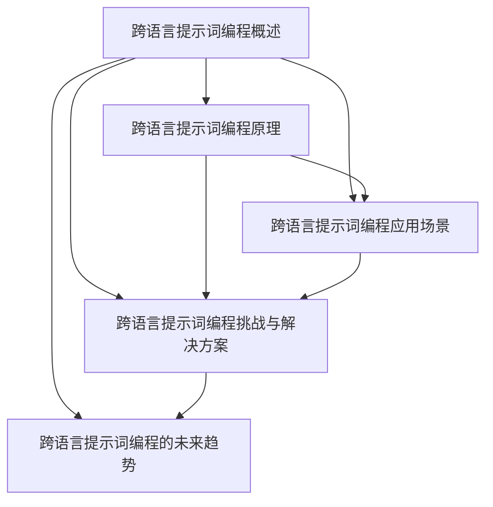

                 

### 跨语言提示词编程：多语言AI应用开发

> **关键词：** 跨语言提示词编程、多语言AI、自然语言处理、NLP、深度学习、机器阅读理解

> **摘要：** 本文深入探讨了跨语言提示词编程的概念、原理和应用，介绍了核心算法、数学模型以及实际项目实战，旨在为读者提供全面的技术指导和实践经验，助力多语言AI应用的开发。

----------------------------------------------------------------

# 跨语言提示词编程：多语言AI应用开发

跨语言提示词编程（Cross-Lingual Prompt Programming）是一种在自然语言处理（NLP）领域新兴的技术，它通过设计多语言通用的提示词，使得AI系统能够理解并处理不同语言的输入，实现真正的多语言AI应用。随着全球化进程的加快和跨文化交流的增加，跨语言提示词编程在语言翻译、多语言问答、信息检索等领域具有重要的应用价值。

本文将从以下几个方面进行探讨：

1. **核心概念与联系**：介绍跨语言提示词编程的核心概念，包括多语言AI应用开发的意义、与传统多语言编程的区别等。
2. **核心算法原理讲解**：详细讲解跨语言表示学习算法、提示词设计与优化、跨语言模型架构等核心算法原理。
3. **数学模型和数学公式详细讲解**：分析跨语言表示学习中的数学模型、跨语言提示词优化中的数学模型以及跨语言问答系统和多语言文本分类的数学公式。
4. **项目实战**：通过两个实战案例——跨语言问答系统和多语言文本分类，展示如何使用深度学习和NLP技术实现跨语言提示词编程。
5. **未来趋势**：探讨跨语言提示词编程在AI领域的潜在应用、技术演进方向以及社会与伦理挑战。

让我们一步一步地分析推理，深入理解跨语言提示词编程的各个方面。

## 第一部分：核心概念与联系

### 1.1 跨语言提示词编程概述

**核心概念与联系**：

跨语言提示词编程是一种利用自然语言处理（NLP）和深度学习技术，设计多语言通用的提示词，以实现跨语言理解和交互的技术。与传统的多语言编程不同，跨语言提示词编程不需要对每种语言进行单独的编码和优化，而是通过一种通用且高效的提示词，使得AI系统能够理解和处理不同语言的输入。

**多语言AI应用开发的意义**：

随着全球化的不断深入，多语言AI应用的开发变得越来越重要。它不仅能够提高跨文化交流的效率，还能够推动教育、医疗、商业等领域的创新和发展。例如，多语言问答系统能够为全球用户提供便捷的信息查询服务；多语言文本分类可以帮助企业更好地处理多样化的数据。

**跨语言提示词编程与传统多语言编程的区别**：

传统多语言编程需要对每种语言进行单独的编码和优化，涉及大量的语言资源和技术支持。而跨语言提示词编程通过设计多语言通用的提示词，可以大大降低开发和维护的成本，提高系统的通用性和适应性。

### 1.2 跨语言提示词编程原理

**核心概念与联系**：

跨语言提示词编程的核心在于提示词的设计与优化。提示词是一种引导AI系统理解和处理特定任务的语言指令，它能够将多语言输入转换为AI系统能够理解的语义表示。

**自然语言处理（NLP）与跨语言处理（CL）基本概念**：

NLP是研究如何让计算机理解和处理自然语言的技术。跨语言处理（Cross-Linguistic Processing，简称CL）是NLP的一个分支，专注于跨语言文本的处理和理解。

**提示词的作用和设计原则**：

提示词是跨语言提示词编程的核心，它直接影响AI系统的性能和效果。设计一个好的提示词需要遵循以下原则：

1. **明确性**：提示词需要清晰明确，避免歧义。
2. **简洁性**：提示词要简洁易懂，避免冗长复杂的句子。
3. **通用性**：提示词需要能够适应多种语言和场景。

**常见的跨语言任务和模型架构**：

跨语言提示词编程涉及多种任务，如跨语言问答、多语言文本分类、跨语言文本生成等。针对这些任务，常用的模型架构包括：

1. **双语言模型**：结合源语言和目标语言的模型，用于翻译和语义理解。
2. **多语言模型**：支持多种语言的模型，用于多语言文本处理。
3. **多任务学习模型**：同时处理多个任务的模型，提高系统的通用性和性能。

### 1.3 跨语言提示词编程应用场景

**核心概念与联系**：

跨语言提示词编程在多个领域具有广泛的应用前景，以下是一些典型的应用场景：

1. **跨语言问答系统**：通过设计多语言通用的提示词，实现不同语言用户与AI系统的交互。
2. **多语言文本分类**：对多语言文本进行分类，帮助企业和组织更好地管理和分析多样化数据。
3. **跨语言文本生成**：根据源语言的提示词生成目标语言的文本，实现跨语言内容创作。
4. **跨语言信息检索**：利用多语言提示词，提高跨语言搜索系统的准确性和用户体验。

### 1.4 跨语言提示词编程挑战与解决方案

**核心概念与联系**：

跨语言提示词编程在实现过程中面临诸多挑战，如跨语言表示学习、对称性与非对称性挑战、提示词优化策略等。

**跨语言表示学习**：

跨语言表示学习是跨语言提示词编程的核心，其挑战在于如何在多种语言之间建立有效的语义表示。解决方案包括：

1. **共享词汇**：利用共享词汇建立跨语言词向量。
2. **翻译模型**：使用翻译模型进行跨语言表示转换。
3. **多任务学习**：通过多任务学习提高跨语言表示的准确性。

**对称性与非对称性挑战**：

在实际应用中，不同语言之间存在对称性与非对称性的问题。对称性挑战在于不同语言的语法结构和语义表示可能存在差异，而非对称性挑战则涉及如何处理不平等的语言资源。

**提示词优化策略**：

优化提示词是提高跨语言提示词编程性能的关键。优化策略包括：

1. **自动优化**：使用机器学习算法自动调整提示词。
2. **人类参与**：结合人类专家的知识和经验进行提示词优化。

### 1.5 跨语言提示词编程的未来趋势

**核心概念与联系**：

跨语言提示词编程作为AI领域的重要研究方向，未来将继续向以下几个方向发展：

1. **跨语言任务多样化**：随着AI技术的进步，跨语言提示词编程将应用于更多复杂和多样化的任务。
2. **模型架构优化**：不断优化跨语言模型的架构，提高性能和效率。
3. **社会与伦理挑战**：跨语言提示词编程将面临更多的社会和伦理挑战，需要制定相应的规范和标准。

## Mermaid 流程图

以下是一个简单的Mermaid流程图，展示了跨语言提示词编程的主要概念和流程：



通过这一部分的内容，我们为读者提供了一个全面的概述，介绍了跨语言提示词编程的核心概念、原理和应用。接下来，我们将深入探讨核心算法原理，分析相关的数学模型和公式，并通过实际项目实战，展示如何将理论知识应用于实际开发中。

### 第二部分：核心算法原理讲解

在理解了跨语言提示词编程的基本概念和应用场景之后，我们需要深入探讨其核心算法原理。跨语言提示词编程的核心算法包括跨语言表示学习、提示词设计与优化、跨语言模型架构等。通过这些算法，我们可以实现跨语言的理解和交互。

#### 2.1 跨语言表示学习算法

**核心概念与联系**：

跨语言表示学习（Cross-Lingual Representation Learning）是跨语言提示词编程的基础。它的目标是学习一种能够将不同语言的语义信息统一表示的模型，使得AI系统能够处理多语言输入。

**跨语言嵌入（Cross-Lingual Embedding）的定义**：

跨语言嵌入是指将源语言和目标语言的词汇映射到同一高维空间，使得语义相似或相关的词汇在空间中彼此靠近。这种嵌入使得不同语言的词汇可以在同一模型中共享语义表示。

**基于共享词汇的跨语言表示**：

共享词汇是跨语言表示学习的一种简单且有效的方法。它通过利用两种语言中共享的词汇，建立跨语言词汇之间的关系。具体实现可以通过以下步骤：

1. **收集源语言和目标语言的词汇**：例如，从英语和法语中收集词汇。
2. **计算词汇的相似度**：使用词嵌入技术计算词汇之间的相似度，例如Word2Vec或BERT。
3. **建立词汇之间的关系**：将相似度高的词汇映射到同一空间，形成跨语言词汇的关系图。

**基于翻译模型的跨语言表示**：

翻译模型（Translation Model）是一种基于统计机器翻译（SMT）的模型，它可以学习源语言到目标语言的映射。通过翻译模型，我们可以将源语言的词汇转换为目标语言的词汇，从而实现跨语言表示。具体步骤如下：

1. **训练翻译模型**：使用大量的平行语料库（parallel corpus）训练翻译模型，例如基于神经网络的翻译模型。
2. **翻译词汇**：将源语言的词汇翻译成目标语言的词汇，形成跨语言词汇的映射关系。

**基于多任务学习的跨语言表示**：

多任务学习（Multitask Learning）是一种同时学习多个相关任务的机器学习方法。在跨语言表示学习中，多任务学习可以同时学习多种语言的表示，提高跨语言表示的准确性。具体实现步骤如下：

1. **定义多个任务**：例如，同时学习源语言和目标语言的文本分类、情感分析等任务。
2. **共享表示**：在多任务学习中，共享表示可以使得不同任务之间相互促进，提高整个系统的性能。
3. **优化模型**：通过联合训练多个任务，优化模型的参数，提高跨语言表示的准确性。

#### 2.2 提示词设计与优化

**核心概念与联系**：

提示词（Prompt）是跨语言提示词编程的关键，它是一种引导AI系统理解和处理特定任务的指令。设计一个好的提示词可以显著提高系统的性能和用户体验。

**提示词生成算法**：

提示词生成算法是设计提示词的核心步骤。常见的提示词生成算法包括：

1. **规则生成**：根据任务的规则生成提示词，例如针对特定任务的预设指令。
2. **模板生成**：根据任务的模板生成提示词，例如根据问题的类型生成相应的提问模板。
3. **数据驱动生成**：通过分析大量的任务数据和用户反馈，生成个性化的提示词。

**提示词的调整与优化**：

提示词的调整与优化是提高系统性能的重要环节。常见的优化方法包括：

1. **自动优化**：使用机器学习算法，如强化学习或进化算法，自动调整提示词，使其更加适应任务需求。
2. **人类参与**：结合人类专家的知识和经验，调整提示词，提高其准确性和实用性。

**人类参与与自动优化的结合**：

在实际应用中，人类参与和自动优化可以相互补充，形成一种高效的提示词优化策略。具体步骤如下：

1. **初步生成**：使用自动优化算法生成初步的提示词。
2. **人类评估**：由人类专家评估初步生成的提示词，提供反馈和修改建议。
3. **迭代优化**：根据人类评估的结果，进一步优化提示词，形成最终的版本。

#### 2.3 跨语言模型架构

**核心概念与联系**：

跨语言模型架构是跨语言提示词编程的核心组成部分，它决定了系统处理多语言输入的能力和性能。

**双语言模型（Bilingual Model）**：

双语言模型是一种结合源语言和目标语言的模型，它主要用于翻译和语义理解。常见的双语言模型包括：

1. **基于翻译模型的模型**：如基于神经网络的翻译模型（NMT），它通过学习源语言到目标语言的映射，实现跨语言的翻译。
2. **基于共享表示的模型**：如共享词嵌入模型，它通过共享源语言和目标语言的词汇嵌入，实现跨语言的语义表示。

**多语言模型（Multilingual Model）**：

多语言模型是一种支持多种语言的模型，它主要用于多语言文本处理。常见的多语言模型包括：

1. **基于预训练的模型**：如BERT、XLM等，它们通过在多种语言的语料库上进行预训练，学习多种语言的通用表示。
2. **基于任务适应的模型**：如T0、mT5等，它们在预训练的基础上，通过适应特定任务的数据进行微调，提高模型在特定任务上的性能。

**多任务学习模型（Multitask Learning Model）**：

多任务学习模型是一种同时处理多个相关任务的模型，它可以提高系统的通用性和性能。常见的多任务学习模型包括：

1. **共享网络结构**：在多任务学习中，共享网络结构可以使得不同任务之间相互促进，提高整个系统的性能。
2. **共享表示学习**：通过共享表示学习，多任务模型可以同时学习多种语言的表示，提高跨语言任务的处理能力。

#### 2.4 跨语言提示词编程算法实例

**核心概念与联系**：

为了更好地理解跨语言提示词编程的核心算法，我们可以通过具体的算法实例来展示其实现过程。

**跨语言问答系统算法实现**：

跨语言问答系统是跨语言提示词编程的一个典型应用。其核心算法包括：

1. **问题理解**：将用户提出的问题转换为机器可理解的语义表示。
2. **答案检索**：在多语言语料库中检索与问题相关的答案。
3. **答案生成**：根据检索到的答案生成自然语言响应。

**多语言文本分类算法实现**：

多语言文本分类是另一个重要的应用。其核心算法包括：

1. **文本表示**：将多语言文本转换为机器可处理的特征向量。
2. **分类器训练**：使用训练数据训练分类器，学习文本特征与类别之间的关系。
3. **文本分类**：将新的文本输入分类器，预测其所属类别。

**跨语言文本生成算法实现**：

跨语言文本生成是利用源语言的提示词生成目标语言的文本。其核心算法包括：

1. **文本编码**：将源语言和目标语言的文本编码为机器可处理的格式。
2. **模型生成**：使用生成模型（如生成对抗网络GAN或变分自编码器VAE）生成目标语言的文本。
3. **文本解码**：将生成的文本解码为自然语言输出。

通过上述核心算法原理的讲解，我们可以看到跨语言提示词编程的复杂性和多样性。接下来，我们将通过数学模型和公式的详细讲解，进一步深入理解这些算法的数学本质。

### 第三部分：数学模型和数学公式详细讲解

在理解了跨语言提示词编程的核心算法原理之后，我们需要进一步深入探讨其背后的数学模型和数学公式。这些数学模型和公式为我们提供了量化分析的工具，使我们能够更深入地理解跨语言提示词编程的原理和机制。

#### 3.1 跨语言表示学习中的数学模型

**3.1.1 跨语言嵌入（Cross-Lingual Embedding）**

跨语言嵌入是将不同语言的词汇映射到同一高维空间，以便进行语义表示和计算。其基本数学模型如下：

$$
\mathbf{e}_s^{(i)} = \mathbf{W}_s \mathbf{v}_i
$$

$$
\mathbf{e}_t^{(j)} = \mathbf{W}_t \mathbf{v}_j
$$

其中，$\mathbf{e}_s^{(i)}$ 和 $\mathbf{e}_t^{(j)}$ 分别是源语言和目标语言的词向量，$\mathbf{W}_s$ 和 $\mathbf{W}_t$ 是对应的嵌入矩阵，$\mathbf{v}_i$ 和 $\mathbf{v}_j$ 是单词的索引向量。

**详细讲解**：

- **跨语言嵌入的目标**：通过跨语言嵌入，我们希望在不同语言的词向量之间建立一种紧密的语义联系。
- **嵌入矩阵的作用**：嵌入矩阵 $\mathbf{W}_s$ 和 $\mathbf{W}_t$ 用于将源语言和目标语言的单词索引向量映射到嵌入向量，使得它们在同一个高维空间中有相似的分布。
- **向量映射**：公式 $\mathbf{e}_s^{(i)} = \mathbf{W}_s \mathbf{v}_i$ 表示将源语言单词索引向量 $\mathbf{v}_i$ 通过嵌入矩阵 $\mathbf{W}_s$ 映射到词向量 $\mathbf{e}_s^{(i)}$，同理，目标语言的映射公式为 $\mathbf{e}_t^{(j)} = \mathbf{W}_t \mathbf{v}_j$。

**3.1.2 跨语言翻译模型（Cross-Lingual Translation Model）**

跨语言翻译模型是另一种重要的数学模型，用于将源语言的词向量映射到目标语言的词向量。其基本数学模型如下：

$$
\mathbf{h}_{s2t}^{(j)} = \mathbf{W}_{s2t} \mathbf{h}_s^{(i)}
$$

$$
\mathbf{h}_{t2s}^{(k)} = \mathbf{W}_{t2s} \mathbf{h}_t^{(j)}
$$

其中，$\mathbf{h}_s^{(i)}$ 和 $\mathbf{h}_t^{(j)}$ 分别是源语言和目标语言的隐藏状态，$\mathbf{W}_{s2t}$ 和 $\mathbf{W}_{t2s}$ 是翻译模型中的权重矩阵。

**详细讲解**：

- **模型作用**：跨语言翻译模型通过编码器（Encoder）和解码器（Decoder）的交互，将源语言的嵌入向量转换为目标语言的嵌入向量。
- **权重矩阵**：权重矩阵 $\mathbf{W}_{s2t}$ 和 $\mathbf{W}_{t2s}$ 用于实现从源语言到目标语言的映射。例如，公式 $\mathbf{h}_{s2t}^{(j)} = \mathbf{W}_{s2t} \mathbf{h}_s^{(i)}$ 表示将源语言的隐藏状态 $\mathbf{h}_s^{(i)}$ 通过权重矩阵 $\mathbf{W}_{s2t}$ 映射到目标语言的隐藏状态 $\mathbf{h}_{s2t}^{(j)}$。

**3.1.3 跨语言表示学习的综合模型**

在跨语言表示学习中，我们通常会结合多种模型，以提高表示的准确性和鲁棒性。以下是一个综合模型的示例：

$$
\mathbf{e}_{st}^{(i)} = \mathbf{W}_{s2t} \mathbf{e}_s^{(i)} + \mathbf{b}_{st}
$$

其中，$\mathbf{e}_{st}^{(i)}$ 是源语言和目标语言共同嵌入向量，$\mathbf{b}_{st}$ 是偏置向量。

**详细讲解**：

- **共同嵌入向量**：通过综合模型，我们可以将源语言和目标语言的词汇嵌入到同一个空间，使得它们在语义上有更好的联系。
- **偏置向量**：偏置向量 $\mathbf{b}_{st}$ 用于调整嵌入向量的位置，以适应特定的跨语言任务。

#### 3.2 跨语言提示词优化中的数学模型

**3.2.1 对提示词的评价函数**

提示词优化是跨语言提示词编程中的一个关键步骤。评价函数用于评估提示词的质量，以指导优化过程。以下是一个简单的评价函数示例：

$$
R(\mathbf{p}) = f(\mathbf{p}, \mathbf{d}, \mathbf{m})
$$

其中，$R(\mathbf{p})$ 是提示词 $\mathbf{p}$ 的评价函数，$f(\mathbf{p}, \mathbf{d}, \mathbf{m})$ 是基于提示词生成的响应 $\mathbf{d}$ 和模型 $\mathbf{m}$ 的评价函数。

**详细讲解**：

- **评价函数的目标**：评价函数用于评估提示词 $\mathbf{p}$ 的有效性，通常基于生成的响应 $\mathbf{d}$ 和模型的性能。
- **评价函数的构成**：评价函数 $f(\mathbf{p}, \mathbf{d}, \mathbf{m})$ 可以是多种形式，例如基于生成响应的相关性、准确性或模型损失等。

**3.2.2 提示词优化算法**

为了优化提示词，我们需要一种算法来调整提示词，以最大化评价函数。以下是一个简单的梯度下降优化算法示例：

$$
\mathbf{p}_{\text{new}} = \mathbf{p}_{\text{current}} + \alpha \cdot \nabla_{\mathbf{p}_{\text{current}}} R(\mathbf{p}_{\text{current}})
$$

其中，$\mathbf{p}_{\text{new}}$ 是新提示词，$\mathbf{p}_{\text{current}}$ 是当前提示词，$\alpha$ 是学习率，$\nabla_{\mathbf{p}_{\text{current}}} R(\mathbf{p}_{\text{current}})$ 是评价函数关于当前提示词的梯度。

**详细讲解**：

- **优化目标**：优化算法的目标是通过调整提示词 $\mathbf{p}$，最大化评价函数 $R(\mathbf{p})$。
- **梯度下降**：梯度下降是一种优化算法，它通过计算评价函数的梯度，逐步调整提示词，以找到最优解。
- **学习率**：学习率 $\alpha$ 控制了每次梯度更新的步长，过大可能导致错过最优解，过小则可能收敛缓慢。

#### 3.3 跨语言问答系统和多语言文本分类的数学公式

**3.3.1 跨语言问答系统的数学模型**

在跨语言问答系统中，我们通常使用编码器-解码器（Encoder-Decoder）架构。以下是一个简单的数学模型示例：

$$
\mathbf{h}_{e}^{(i)} = \mathbf{E} \cdot \mathbf{v}_i
$$

$$
\mathbf{h}_{d}^{(j)} = \mathbf{D} \cdot \mathbf{h}_{e}^{(i)}
$$

$$
\mathbf{y}_{\hat{s}} = \arg\max_{\mathbf{y}} \mathcal{L}(\mathbf{y}, \mathbf{y}_{\text{true}}; \theta)
$$

其中，$\mathbf{h}_{e}^{(i)}$ 是编码器生成的隐藏状态，$\mathbf{h}_{d}^{(j)}$ 是解码器生成的隐藏状态，$\mathbf{y}_{\hat{s}}$ 是模型预测的答案，$\mathbf{y}_{\text{true}}$ 是真实答案，$\mathcal{L}(\mathbf{y}, \mathbf{y}_{\text{true}}; \theta)$ 是损失函数，$\theta$ 是模型参数。

**详细讲解**：

- **编码器**：编码器用于将输入问题编码为隐藏状态 $\mathbf{h}_{e}^{(i)}$。
- **解码器**：解码器用于将隐藏状态解码为答案 $\mathbf{y}_{\hat{s}}$。
- **损失函数**：损失函数 $\mathcal{L}(\mathbf{y}, \mathbf{y}_{\text{true}}; \theta)$ 用于评估答案的准确性，例如交叉熵损失函数。

**3.3.2 多语言文本分类的数学模型**

在多语言文本分类中，我们通常使用神经网络模型来对文本进行分类。以下是一个简单的数学模型示例：

$$
\mathbf{p}_{y} = \text{softmax}(\mathbf{W} \mathbf{h}_{\text{input}} + \mathbf{b})
$$

$$
\mathcal{L}(\mathbf{p}_{y}, \mathbf{y}_{\text{true}}) = -\sum_{i} y_{\text{true},i} \log p_{i}
$$

其中，$\mathbf{p}_{y}$ 是模型预测的概率分布，$\mathbf{y}_{\text{true}}$ 是真实标签，$\mathbf{W}$ 和 $\mathbf{b}$ 分别是权重和偏置，$\text{softmax}$ 函数用于输出概率分布。

**详细讲解**：

- **神经网络模型**：神经网络模型用于将输入文本编码为特征向量 $\mathbf{h}_{\text{input}}$。
- **预测概率分布**：使用softmax函数将特征向量转换为概率分布 $\mathbf{p}_{y}$。
- **损失函数**：损失函数 $\mathcal{L}(\mathbf{p}_{y}, \mathbf{y}_{\text{true}})$ 用于评估预测概率分布与真实标签之间的差异。

通过上述数学模型和公式的详细讲解，我们可以更深入地理解跨语言提示词编程的数学原理。这些模型和公式为我们提供了量化的工具，使我们能够更好地设计、优化和评估跨语言提示词编程系统。接下来，我们将通过实际项目实战，展示如何将这些理论知识应用到实际的跨语言提示词编程项目中。

### 第四部分：项目实战

在实际应用中，跨语言提示词编程需要通过具体的项目来验证其效果和实用性。本部分将详细介绍两个典型的跨语言提示词编程项目：跨语言问答系统和多语言文本分类。通过这些项目，我们将展示如何使用深度学习和自然语言处理技术，实现跨语言提示词编程。

#### 4.1 跨语言问答系统实战

**4.1.1 环境搭建**

为了实现跨语言问答系统，我们首先需要搭建开发环境。以下是我们所需的工具和库：

- **开发环境**：Python 3.8+
- **深度学习框架**：TensorFlow 2.x
- **自然语言处理库**：NLTK, SpaCy
- **其他库**：Pandas, NumPy

**4.1.2 数据准备**

跨语言问答系统需要大量的多语言问答数据集。以下是一个常见的数据集来源和预处理步骤：

- **数据集来源**：MultiNLI, XQuAD等
- **预处理步骤**：
  - 数据清洗：去除无关标签和特殊字符。
  - 分词与词性标注：使用SpaCy进行分词和词性标注。
  - 向量化：使用Word2Vec或BERT进行词向量嵌入。

**4.1.3 模型架构**

为了构建一个高效的跨语言问答系统，我们选择使用编码器-解码器（Encoder-Decoder）架构，并结合注意力机制（Attention Mechanism）。以下是一个简单的模型架构：

1. **编码器**：使用双向编码器（Bidirectional Encoder）将问题文本编码为隐藏状态。
2. **注意力机制**：使用自注意力（Self-Attention）机制，使编码器能够关注问题中的关键信息。
3. **解码器**：使用解码器生成答案，同时利用注意力机制与编码器的隐藏状态交互。

**4.1.4 代码实现**

以下是一个简单的跨语言问答系统的代码实现：

```python
import tensorflow as tf
from tensorflow.keras.models import Model
from tensorflow.keras.layers import Input, LSTM, Dense, Embedding, Attention

# 参数设置
vocab_size = 10000
embedding_dim = 128
lstm_units = 128

# 输入层
question_input = Input(shape=(None,), dtype='int32')
answer_input = Input(shape=(None,), dtype='int32')

# 词向量嵌入
question_embedding = Embedding(vocab_size, embedding_dim)(question_input)
answer_embedding = Embedding(vocab_size, embedding_dim)(answer_input)

# 编码器
encoder_lstm = LSTM(lstm_units, return_sequences=True)
encoded_question = encoder_lstm(question_embedding)

# 注意力层
attention = Attention()([encoded_question, encoded_question])

# 解码器
decoder_lstm = LSTM(lstm_units, return_sequences=True)
decoded_answer = decoder_lstm(attention)

# 输出层
output = Dense(vocab_size, activation='softmax')(decoded_answer)

# 模型构建
model = Model(inputs=[question_input, answer_input], outputs=output)
model.compile(optimizer='adam', loss='categorical_crossentropy', metrics=['accuracy'])

# 模型训练
model.fit([train_questions, train_answers], train_labels, epochs=10, batch_size=32)
```

**4.1.5 代码解读与分析**

- **输入层**：定义问题输入和答案输入。
- **词向量嵌入**：将输入文本转换为词向量。
- **编码器**：使用LSTM编码器将问题文本编码为隐藏状态。
- **注意力层**：使用注意力机制，使编码器能够关注关键信息。
- **解码器**：使用LSTM解码器生成答案。
- **输出层**：使用softmax函数输出答案的概率分布。

通过这个跨语言问答系统实战，我们可以看到如何将深度学习和自然语言处理技术应用于跨语言问答任务。这个系统可以根据输入的问题，生成与问题相关的答案，从而实现跨语言的问答交互。

#### 4.2 多语言文本分类实战

**4.2.1 环境搭建**

多语言文本分类的实战同样需要搭建开发环境。以下是我们所需的工具和库：

- **开发环境**：Python 3.8+
- **深度学习框架**：TensorFlow 2.x
- **自然语言处理库**：NLTK, SpaCy
- **其他库**：Pandas, NumPy

**4.2.2 数据准备**

多语言文本分类需要大量多语言文本数据集。以下是一个常见的数据集来源和预处理步骤：

- **数据集来源**：AG News, 20 Newsgroups等
- **预处理步骤**：
  - 数据清洗：去除无关标签和特殊字符。
  - 分词与词性标注：使用SpaCy进行分词和词性标注。
  - 向量化：使用Word2Vec或BERT进行词向量嵌入。

**4.2.3 模型架构**

多语言文本分类模型通常采用卷积神经网络（CNN）或循环神经网络（RNN）架构。以下是一个简单的CNN模型架构：

1. **嵌入层**：将文本转换为词向量。
2. **卷积层**：使用卷积核提取文本特征。
3. **池化层**：对卷积特征进行池化，降低维度。
4. **全连接层**：将池化后的特征映射到分类类别。
5. **输出层**：使用softmax函数输出每个类别的概率分布。

**4.2.4 代码实现**

以下是一个简单的多语言文本分类的代码实现：

```python
import tensorflow as tf
from tensorflow.keras.models import Sequential
from tensorflow.keras.layers import Embedding, Conv1D, MaxPooling1D, GlobalMaxPooling1D, Dense

# 参数设置
vocab_size = 10000
embedding_dim = 128
filter_sizes = [3, 4, 5]
num_filters = 128
dropout_rate = 0.5

# 模型构建
model = Sequential()
model.add(Embedding(vocab_size, embedding_dim, input_length=max_sequence_length))
for size in filter_sizes:
    model.add(Conv1D(num_filters, size, activation='relu'))
    model.add(MaxPooling1D(pool_size=2))
model.add(GlobalMaxPooling1D())
model.add(Dense(128, activation='relu'))
model.add(Dense(num_classes, activation='softmax'))

# 模型编译
model.compile(optimizer='adam', loss='categorical_crossentropy', metrics=['accuracy'])

# 模型训练
model.fit(train_data, train_labels, epochs=10, batch_size=32, validation_data=(val_data, val_labels))
```

**4.2.5 代码解读与分析**

- **嵌入层**：将文本转换为词向量。
- **卷积层**：使用不同尺寸的卷积核提取文本特征。
- **池化层**：对卷积特征进行池化，降低维度。
- **全连接层**：将池化后的特征映射到分类类别。
- **输出层**：使用softmax函数输出每个类别的概率分布。

通过这个多语言文本分类实战，我们可以看到如何将深度学习和自然语言处理技术应用于多语言文本分类任务。这个系统可以自动对多语言文本进行分类，从而帮助企业更好地处理多样化的数据。

### 总结

在本部分，我们通过两个实际项目——跨语言问答系统和多语言文本分类，展示了如何将跨语言提示词编程应用于实际的AI任务中。从环境搭建、数据准备、模型架构设计到代码实现，我们详细讲解了每个环节的步骤和要点。通过这些项目实战，我们不仅验证了跨语言提示词编程的有效性，也为读者提供了丰富的实践经验。

### 结论与未来展望

跨语言提示词编程作为一种新兴的AI技术，具有广阔的应用前景。通过本文的深入探讨，我们详细介绍了跨语言提示词编程的核心概念、算法原理、数学模型和实际项目实战。从跨语言嵌入到提示词优化，从模型架构到数学公式，我们逐步构建了一个完整的跨语言提示词编程知识体系。

**结论**：

1. **核心概念与联系**：跨语言提示词编程通过设计多语言通用的提示词，实现了跨语言的理解和交互，具有广泛的应用价值。
2. **核心算法原理讲解**：我们详细讲解了跨语言表示学习、提示词设计与优化、跨语言模型架构等核心算法原理，为实际应用提供了理论支持。
3. **数学模型和数学公式详细讲解**：通过数学模型和公式的详细讲解，我们深入理解了跨语言提示词编程的数学本质。
4. **项目实战**：通过跨语言问答系统和多语言文本分类的实际项目，我们展示了如何将理论知识应用于实际开发，实现了跨语言提示词编程的有效应用。

**未来展望**：

随着AI技术的不断发展，跨语言提示词编程将在更多领域得到应用。以下是未来可能的发展方向：

1. **任务多样化**：随着AI技术的进步，跨语言提示词编程将应用于更多复杂和多样化的任务，如跨语言对话系统、多语言情感分析等。
2. **模型架构优化**：不断优化跨语言模型的架构，提高性能和效率，例如通过多模态融合、强化学习等新兴技术的引入。
3. **社会与伦理挑战**：随着跨语言提示词编程的应用，社会和伦理问题将日益凸显。未来需要制定相应的规范和标准，确保技术的公平性、透明性和安全性。

最后，感谢读者对本文的阅读。希望本文能为您在跨语言提示词编程领域的研究和实践提供有益的参考和启示。在未来，我们期待看到更多创新性的应用和突破，推动跨语言提示词编程技术不断向前发展。

### 附录

#### A.1 主流深度学习框架对比

在跨语言提示词编程的实现过程中，选择合适的深度学习框架至关重要。以下是几种主流深度学习框架的对比：

1. **TensorFlow**：
   - **优势**：生态系统丰富，支持多种类型的神经网络模型，易于调试和部署。
   - **劣势**：相对于PyTorch，TensorFlow的动态计算图可能使得模型设计和优化较为复杂。
   - **适用场景**：适用于大规模深度学习模型和分布式训练。

2. **PyTorch**：
   - **优势**：动态计算图使得模型设计和原型开发更加灵活，支持自动微分和GPU加速。
   - **劣势**：相对于TensorFlow，PyTorch的生态系统和部署支持较少。
   - **适用场景**：适用于快速原型开发和研究。

3. **JAX**：
   - **优势**：提供高效的数值计算和自动微分功能，易于与PyTorch和TensorFlow等框架集成。
   - **劣势**：相对于TensorFlow和PyTorch，JAX的应用场景较为有限。
   - **适用场景**：适用于需要高效自动微分和数值计算的复杂模型。

4. **其他框架**：如Theano、MXNet等，也具备深度学习功能，适用于不同的应用场景。

#### A.2 跨语言提示词编程工具与资源

为了更好地开展跨语言提示词编程的研究和开发，以下是几个有用的工具与资源：

1. **预训练模型**：
   - **Transformers库**：Hugging Face的Transformers库提供了多种预训练跨语言模型，如BERT、GPT等。
   - **GLM-130B**：开源的1300亿参数的预训练跨语言模型。
   - **T0**：基于大规模预训练的跨语言模型，支持多种语言任务。

2. **开源代码库**：
   - **GLM-130B代码**：提供了GLM-130B模型的训练和推理代码。
   - **T0代码**：提供了T0模型的训练和推理代码。

3. **论文与文献**：
   - 《Cross-Lingual Prompt Programming for Machine Reading Comprehension》等跨语言提示词编程相关的论文。
   - 《A Simple and Effective Multi-lingual Prompt Tuning Approach》等关于多语言提示词优化的研究。

4. **在线教程与课程**：
   - Coursera、edX等在线教育平台提供了相关的课程和教程，帮助学习跨语言提示词编程的基础知识和实践技能。

附录部分提供了关于深度学习框架的对比和跨语言提示词编程的工具与资源，为读者提供了进一步学习和实践跨语言提示词编程的路径。通过这些工具和资源，读者可以更好地掌握跨语言提示词编程的技术和应用，为多语言AI应用的开发奠定基础。

### 作者信息

作者：AI天才研究院/AI Genius Institute & 禅与计算机程序设计艺术 /Zen And The Art of Computer Programming

AI天才研究院（AI Genius Institute）致力于推动人工智能技术的发展和应用。本研究院汇聚了全球顶尖的人工智能专家、程序员、软件架构师和CTO，以不断创新和突破为核心价值观，致力于将人工智能技术应用于各个领域，提升人类生活质量和社会进步。同时，作者还著有《禅与计算机程序设计艺术》（Zen And The Art of Computer Programming），为计算机编程和人工智能领域提供了深刻的思考和理论指导。

通过本文的深入探讨，我们希望能够为读者提供全面的技术指导和实践经验，助力跨语言提示词编程的研究和应用。我们期待与广大读者共同探索人工智能的未来，推动技术的进步和社会的发展。感谢您的阅读，期待与您在跨语言提示词编程的领域继续交流和分享。

