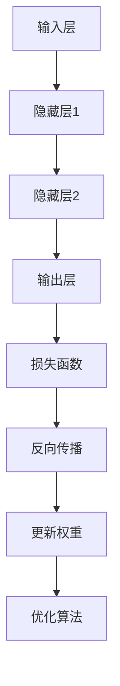
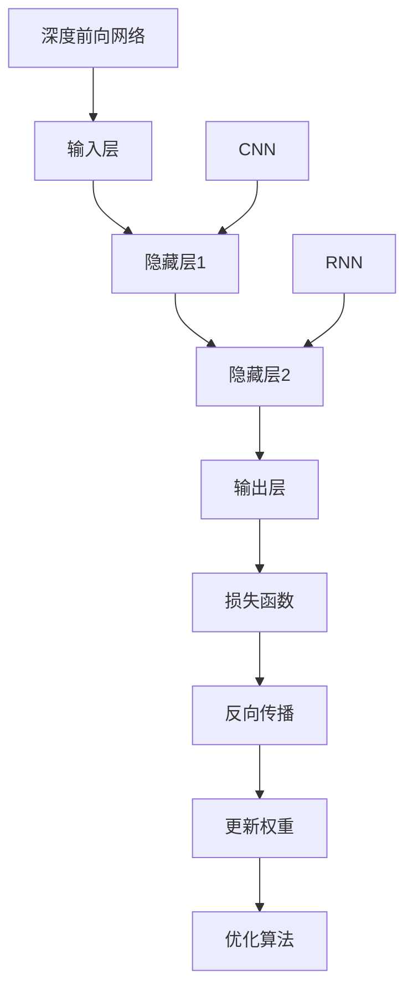
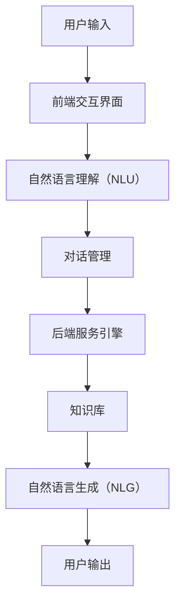
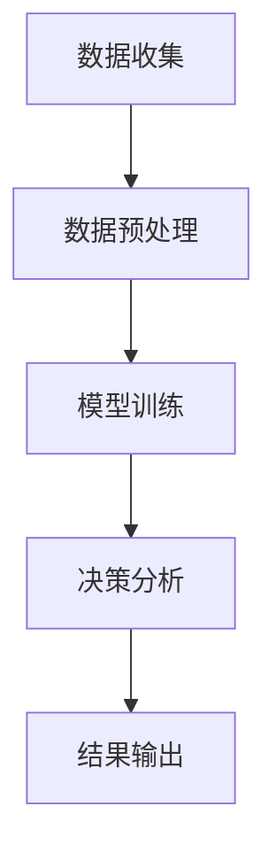
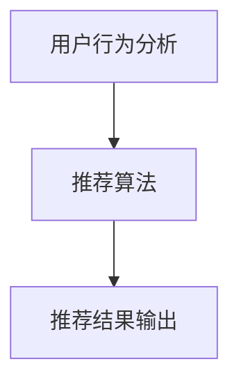
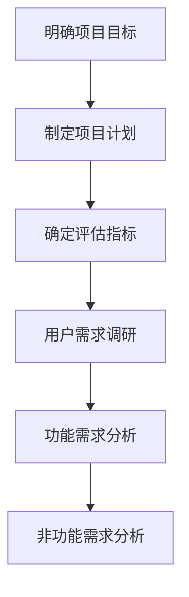
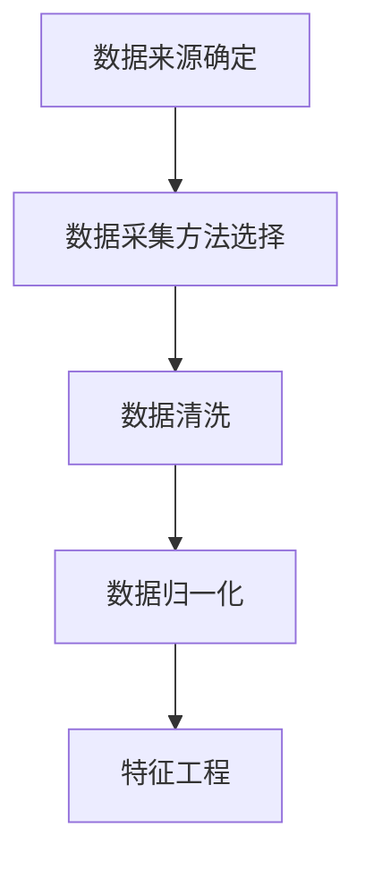
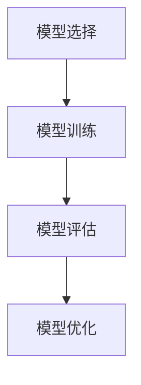
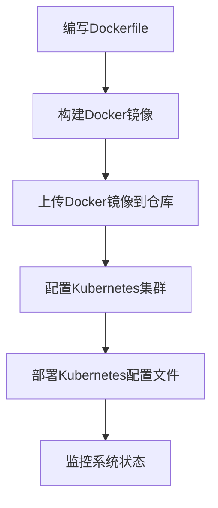
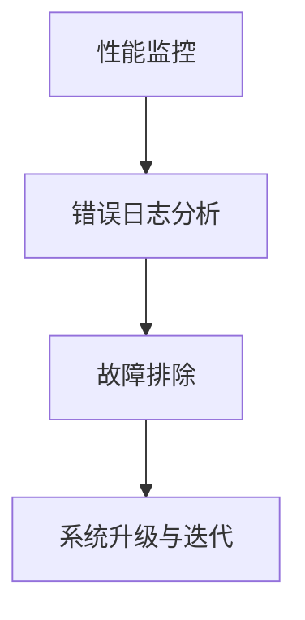

                 

# 《软件2.0的未来：通用人工智能的基石》

## 关键词
- 软件2.0
- 通用人工智能
- 深度学习
- 神经网络
- 自然语言处理
- 大规模预训练模型
- 应用与实践

## 摘要
本文深入探讨了软件2.0的概念及其与通用人工智能（AGI）的紧密联系。软件2.0标志着软件从功能驱动向数据驱动和智能化的转变。本文首先介绍了软件2.0的定义和发展历程，然后探讨了通用人工智能的核心概念和特征。接着，本文详细阐述了深度学习、神经网络、自然语言处理以及大规模预训练模型的核心原理，并提供了相应的伪代码和数学公式讲解。最后，本文通过具体的实际项目案例，展示了通用人工智能在智能客服系统、自动化决策系统和智能推荐系统中的应用与实践，以及企业级AI应用开发的实践流程。本文旨在为读者提供对软件2.0与通用人工智能之间关系的全面理解，以及如何将这一先进技术应用于实际场景的指导。

## 《软件2.0的未来：通用人工智能的基石》目录大纲

### 第一部分：背景与概述

#### 第1章：软件2.0与通用人工智能概述

##### 1.1 软件2.0的定义与发展历程

- **软件2.0的概念**
  - 软件从功能驱动到数据驱动
  - 软件系统的智能性提升

- **软件2.0的发展历程**
  - 从软件1.0到软件2.0的演变
  - 软件2.0的关键技术

##### 1.2 通用人工智能的核心概念

- **通用人工智能的定义**
  - 强人工智能与弱人工智能的区别
  - 通用人工智能的挑战与目标

- **通用人工智能的关键特征**
  - 自我学习能力
  - 适应不同领域的能力
  - 知识表示与推理能力

##### 1.3 软件2.0与通用人工智能的联系

- **软件2.0如何支撑通用人工智能**
  - 数据驱动与智能服务
  - 平台化与生态系统构建

- **通用人工智能对软件2.0的赋能**
  - 智能算法的优化
  - 人机交互的提升

### 第二部分：核心技术原理

#### 第2章：深度学习与神经网络基础

##### 2.1 神经网络的基本结构与原理

- **神经网络的结构**
  - 层结构
  - 激活函数

- **神经网络的工作原理**
  - 前向传播与反向传播
  - 梯度下降算法

##### 2.2 深度学习的主要算法

- **深度前向网络（DNN）**
  - DNN的基本原理
  - DNN的应用场景

- **卷积神经网络（CNN）**
  - CNN的结构
  - CNN在图像识别中的应用

- **循环神经网络（RNN）**
  - RNN的结构
  - RNN在序列数据处理中的应用

##### 2.3 深度学习的优化与调整

- **优化算法**
  - 梯度下降法
  - 随机梯度下降（SGD）
  - Adam优化器

- **模型调参技巧**
  - 学习率的选择
  - 激活函数的选用
  - 正则化方法的运用

#### 第3章：自然语言处理技术

##### 3.1 词嵌入技术

- **词嵌入的定义**
  - 词向量的概念

- **词嵌入的算法**
  - word2vec
  - GloVe

##### 3.2 序列模型与注意力机制

- **序列模型**
  - RNN
  - LSTM
  - GRU

- **注意力机制**
  - 自注意力机制
  - 多头注意力机制

##### 3.3 转换器架构（Transformer）

- **Transformer的基本结构**
  - Encoder-Decoder结构

- **Transformer的应用**
  - 在自然语言处理中的应用

#### 第4章：大规模预训练模型原理

##### 4.1 预训练的概念与意义

- **预训练的定义**
  - 预训练与微调的区别

- **预训练的意义**
  - 提高模型性能
  - 缩短模型训练时间

##### 4.2 自监督学习方法

- **自监督学习的定义**
  - 无监督学习的一种形式

- **自监督学习的应用**
  - 词汇预测
  - 词性标注

##### 4.3 迁移学习与微调技术

- **迁移学习的定义**
  - 利用已训练模型的知识进行新任务的训练

- **微调技术**
  - 微调的基本原理
  - 微调的应用场景

### 第三部分：应用与实践

#### 第5章：通用人工智能在软件中的应用场景

##### 5.1 智能客服系统

- **系统架构**
  - 基于深度学习的自然语言理解
  - 基于对话系统的响应生成

##### 5.2 自动化决策系统

- **系统原理**
  - 利用机器学习进行数据分析和预测
  - 基于规则的决策逻辑

##### 5.3 智能推荐系统

- **系统设计**
  - 用户行为分析
  - 商品推荐算法

#### 第6章：企业级AI应用开发实践

##### 6.1 项目规划与需求分析

- **项目规划**
  - 明确项目目标
  - 制定项目计划

- **需求分析**
  - 用户需求调研
  - 功能需求分析

##### 6.2 数据收集与预处理

- **数据收集**
  - 数据来源
  - 数据采集方法

- **数据预处理**
  - 数据清洗
  - 数据归一化

##### 6.3 模型训练与优化

- **模型训练**
  - 模型选择
  - 训练过程

- **模型优化**
  - 模型调参
  - 模型评估

#### 第7章：通用人工智能系统的部署与维护

##### 7.1 系统部署

- **部署环境**
  - 云计算平台
  - 容器化部署

- **部署策略**
  - 自动化部署
  - 持续集成与持续部署（CI/CD）

##### 7.2 系统监控与维护

- **系统监控**
  - 性能监控
  - 错误日志分析

- **系统维护**
  - 故障排除
  - 系统升级与迭代

### 附录

#### 附录A：通用人工智能开发工具与资源

##### A.1 主流深度学习框架对比

- **TensorFlow**
  - **优点**：支持多样化的模型结构，丰富的 API 接口，强大的生态系统。
  - **缺点**：相比 PyTorch，TensorFlow 的动态图计算在性能上略逊一筹。

- **PyTorch**
  - **优点**：动态计算图使模型构建更为直观，性能优秀，易于调试。
  - **缺点**：相较于 TensorFlow，PyTorch 的生态系统相对较小。

- **其他深度学习框架**
  - **JAX**：支持自动微分，适用于大规模并行计算。
  - **Theano**：开源的 Python 库，用于数值计算。
  - **Caffe**：适合构建深度卷积神经网络。

##### A.2 通用人工智能常用库与函数

- **NumPy**
  - 数组操作
  - 数学运算

- **Pandas**
  - 数据分析
  - 数据操作

- **Scikit-learn**
  - 机器学习算法
  - 模型评估

##### A.3 通用人工智能研究资源

- **开源数据集**
  - ImageNet
  - CoNLL
  - WebQA

- **开源代码库**
  - TensorFlow 官方代码库
  - PyTorch 官方代码库

- **研究论文**
  - NeurIPS
  - ICML
  - ACL

#### 附录B：实用工具与资源

##### B.1 深度学习工具

- **TensorBoard**
  - 官网：[TensorBoard 官网](https://www.tensorflow.org/tensorboard)

- **Keras Tuner**
  - 官网：[Keras Tuner 官网](https://keras.io/keras_tuner)

- **Horovod**
  - 官网：[Horovod 官网](https://github.com/horovod/horovod)

##### B.2 数据预处理工具

- **NumPy**
  - 官网：[NumPy 官网](https://numpy.org)

- **Pandas**
  - 官网：[Pandas 官网](https://pandas.pydata.org)

- **Scikit-learn**
  - 官网：[Scikit-learn 官网](https://scikit-learn.org)

##### B.3 自然语言处理工具

- **NLTK**
  - 官网：[NLTK 官网](https://www.nltk.org)

- **spaCy**
  - 官网：[spaCy 官网](https://spacy.io)

- **Transformers**
  - 官网：[Transformers 官网](https://github.com/huggingface/transformers)

##### B.4 开发环境配置

- **Anaconda**
  - 官网：[Anaconda 官网](https://www.anaconda.com)

- **Docker**
  - 官网：[Docker 官网](https://www.docker.com)

- **Jupyter Notebook**
  - 官网：[Jupyter Notebook 官网](https://jupyter.org)

##### B.5 学习资源

- **在线课程**
  - Coursera
  - edX
  - Udacity

- **图书**
  - 《深度学习》
  - 《Python 自然语言处理实战》
  - 《人工智能：一种现代的方法》

- **研究论文**
  - NeurIPS
  - ICML
  - ACL

### 第一部分：背景与概述

#### 第1章：软件2.0与通用人工智能概述

##### 1.1 软件2.0的定义与发展历程

软件2.0的概念起源于2006年，由谷歌联合创始人拉里·佩奇首次提出。软件2.0是对软件1.0概念的扩展和深化，它不仅仅关注软件的功能性，更强调软件的数据驱动和智能化。软件1.0主要侧重于功能的实现，而软件2.0则更加注重数据的处理和应用。

- **软件1.0**：以功能驱动为核心，软件的设计和开发主要关注如何实现特定的功能。这种模式下的软件通常具有明确的功能边界和相对固定的数据输入输出。

- **软件2.0**：以数据驱动和智能化为核心，软件的设计和开发更侧重于数据的收集、处理和应用。软件2.0不仅能够实现既定的功能，还能够根据用户行为、环境变化等动态调整其行为。

软件2.0的发展历程可以概括为以下几个阶段：

1. **数据收集与整合**：软件2.0的初期，开发者开始关注数据的收集和整合，以构建更加全面和准确的数据视图。这一阶段的核心技术包括数据仓库、数据湖等。

2. **数据驱动应用**：随着数据收集的逐步完善，开发者开始利用这些数据进行应用开发，如数据挖掘、机器学习等。这一阶段标志着软件从功能驱动向数据驱动的转变。

3. **智能化服务**：在数据收集和应用的基础上，软件2.0进一步发展出智能化服务，如智能推荐、智能客服等。这些服务利用深度学习、自然语言处理等技术，实现了高度自动化和个性化的用户体验。

- **软件2.0的概念**
  - 软件从功能驱动到数据驱动
  - 软件系统的智能性提升

- **软件2.0的发展历程**
  - 从软件1.0到软件2.0的演变
  - 软件2.0的关键技术

##### 1.2 通用人工智能的核心概念

通用人工智能（Artificial General Intelligence，AGI）是人工智能领域的终极目标，它指的是具有人类智能水平或超越人类智能的人工智能系统。通用人工智能与弱人工智能（Weak Artificial Intelligence）和强人工智能（Strong Artificial Intelligence）有本质的区别：

- **弱人工智能**：也称为专用人工智能，它专注于特定领域或任务，如语音识别、图像识别等。弱人工智能具有很强的专业性，但在其他领域可能表现平平。

- **强人工智能**：不仅具有特定领域的专业能力，还具有跨领域的自主学习和推理能力。强人工智能能够像人类一样理解、学习和解决问题。

- **通用人工智能**：具有全面的人类智能水平，能够处理各种复杂的问题，并具备跨领域的通用能力。通用人工智能不仅需要强大的计算能力，还需要解决数据理解、知识表示、推理机制等多个核心问题。

通用人工智能的关键特征包括：

- **自我学习能力**：通用人工智能系统能够通过自我学习和迭代优化，不断提高其智能水平。

- **适应不同领域的能力**：通用人工智能不仅能够在单一领域内表现出色，还能够跨领域应用，适应不同的环境和任务。

- **知识表示与推理能力**：通用人工智能能够理解和运用知识，进行逻辑推理和决策。

- **自主性和创造性**：通用人工智能具有自主性，能够自主决策和创造新的解决方案，而不受预先设定规则的限制。

##### 1.3 软件2.0与通用人工智能的联系

软件2.0与通用人工智能之间存在紧密的联系，两者相互支撑、相互赋能。具体来说，软件2.0为通用人工智能提供了以下基础：

- **数据驱动与智能服务**：软件2.0强调数据驱动和智能化服务，为通用人工智能提供了丰富的数据资源和智能处理手段。通用人工智能系统可以通过软件2.0平台收集、处理和分析大量数据，从而实现自我学习和智能优化。

- **平台化与生态系统构建**：软件2.0倡导平台化开发，构建了一个开放、共享的生态系统。通用人工智能可以在这样的生态系统中，与其他软件、服务和设备进行无缝集成，实现跨平台的通用能力。

另一方面，通用人工智能对软件2.0也具有重要的赋能作用：

- **智能算法的优化**：通用人工智能提供了先进的算法和模型，如深度学习、自然语言处理等，可以优化软件2.0中的数据处理和智能服务。

- **人机交互的提升**：通用人工智能可以通过自然语言理解、语音识别等技术，提升软件2.0中的人机交互体验，使其更加智能和人性化。

综上所述，软件2.0与通用人工智能是相辅相成的，软件2.0为通用人工智能提供了坚实的基础，而通用人工智能则为软件2.0带来了前所未有的创新和发展潜力。

#### 第2章：深度学习与神经网络基础

##### 2.1 神经网络的基本结构与原理

神经网络（Neural Network，NN）是人工智能领域中的一种重要模型，它模仿了人脑的神经网络结构，通过多层节点（或称为神经元）进行信息处理和传递。神经网络的基本结构包括输入层、隐藏层和输出层。

- **输入层**：接收外部输入数据，每个输入节点对应一个特征。例如，一个图像识别系统可能有数千个输入节点，每个节点代表图像中的一个像素值。

- **隐藏层**：对输入数据进行加工和处理，隐藏层可以有多个层级，每一层都将输入数据通过一系列的权重和激活函数进行处理，从而产生新的特征。隐藏层的数量和每个层中的神经元数量可以根据问题的复杂性进行调整。

- **输出层**：根据隐藏层处理后的特征产生输出结果。输出层的神经元数量和类型取决于具体的应用场景。例如，在分类任务中，输出层可能是一个或多个神经元，每个神经元代表一个类别。

神经网络的工作原理是通过输入层接收数据，然后通过隐藏层逐层传递和处理，最终在输出层生成结果。这个过程可以分为两部分：前向传播（Forward Propagation）和反向传播（Backpropagation）。

- **前向传播**：在前向传播过程中，输入数据通过输入层传递到隐藏层，隐藏层通过激活函数将数据传递到下一层，直到输出层。激活函数的作用是引入非线性，使得神经网络能够处理复杂的问题。

- **反向传播**：在反向传播过程中，神经网络通过计算输出层与真实标签之间的误差，然后将误差反向传播到隐藏层。通过反向传播，神经网络可以更新每个神经元的权重，使得网络能够逐渐逼近正确的结果。

以下是神经网络的基本工作原理的Mermaid流程图：



##### 2.2 深度学习的主要算法

深度学习（Deep Learning，DL）是神经网络的一种扩展，它通过构建多层的神经网络结构来提取数据的深层特征。深度学习在图像识别、语音识别、自然语言处理等领域取得了显著的成果。以下是几种主要的深度学习算法：

- **深度前向网络（Deep Neural Network，DNN）**：
  - **基本原理**：深度前向网络是一种多层的神经网络结构，它通过前向传播将输入数据逐层传递，并使用非线性激活函数来引入非线性变换。
  - **应用场景**：DNN广泛应用于图像识别、语音识别和文本分类等任务。

- **卷积神经网络（Convolutional Neural Network，CNN）**：
  - **基本原理**：卷积神经网络是一种专门用于处理图像数据的神经网络，它利用卷积操作来提取图像中的局部特征，并通过池化操作来减少数据的维度。
  - **应用场景**：CNN在图像识别、图像分类和图像生成等领域有着广泛的应用。

- **循环神经网络（Recurrent Neural Network，RNN）**：
  - **基本原理**：循环神经网络是一种能够处理序列数据的神经网络，它通过在时间步上递归地传递信息来捕捉序列中的依赖关系。
  - **应用场景**：RNN广泛应用于自然语言处理、语音识别和序列预测等领域。

以下是深度学习算法的基本原理的Mermaid流程图：



##### 2.3 深度学习的优化与调整

深度学习的优化与调整是提高模型性能和准确率的关键步骤。以下是一些常用的优化方法和技巧：

- **优化算法**：
  - **梯度下降法（Gradient Descent）**：梯度下降法是一种最基本的优化算法，它通过计算损失函数关于模型参数的梯度，并沿着梯度的反方向更新参数，以减少损失函数的值。
    - 伪代码：
      ```python
      初始化权重 w0
      设置学习率 alpha
      设置迭代次数 epochs

      for epoch in 1 to epochs:
          for each training example (x, y) in dataset:
              1. Calculate the prediction y_pred = f(w * x)
              2. Calculate the loss L = loss_function(y_pred, y)
              3. Calculate the gradients ∇w = ∇f(w * x)
              4. Update the weights w = w - alpha * ∇w

      return w
      ```

  - **随机梯度下降（Stochastic Gradient Descent，SGD）**：SGD是在梯度下降法的基础上，每次迭代只随机选择一个训练样本来更新参数，这样可以加速收敛。
    - 伪代码：
      ```python
      初始化权重 w0
      设置学习率 alpha
      设置迭代次数 epochs

      for epoch in 1 to epochs:
          for each training example (x, y) in dataset:
              1. Calculate the prediction y_pred = f(w * x)
              2. Calculate the loss L = loss_function(y_pred, y)
              3. Calculate the gradients ∇w = ∇f(w * x)
              4. Update the weights w = w - alpha * ∇w

      return w
      ```

  - **Adam优化器**：Adam是一种自适应的优化算法，它结合了SGD和动量（Momentum）的优势，能够自适应调整学习率。
    - 伪代码：
      ```python
      初始化权重 w0
      设置学习率 alpha
      设置动量系数 beta1, beta2
      设置迭代次数 epochs

      for epoch in 1 to epochs:
          for each training example (x, y) in dataset:
              1. Calculate the prediction y_pred = f(w * x)
              2. Calculate the loss L = loss_function(y_pred, y)
              3. Calculate the gradients ∇w = ∇f(w * x)
              4. Update the weights w = w - alpha * ∇w

      return w
      ```

- **模型调参技巧**：
  - **学习率的选择**：学习率的选择对模型的训练过程和性能有重要影响。过大会导致训练不稳定，而过小则会使训练过程变得缓慢。常用的技巧包括使用学习率衰减和动态调整学习率。
  - **激活函数的选用**：激活函数的选择对神经网络的性能有显著影响。常用的激活函数包括ReLU、Sigmoid和Tanh。ReLU函数由于其简单和非线性特性，在深度学习中非常流行。
  - **正则化方法的运用**：正则化方法用于防止模型过拟合。常用的正则化方法包括L1正则化、L2正则化和Dropout。L1正则化和L2正则化通过在损失函数中添加惩罚项来实现，而Dropout通过随机丢弃一部分神经元来实现。

综上所述，深度学习的优化与调整是提高模型性能的关键步骤。通过选择合适的优化算法、学习率和激活函数，以及运用正则化方法，可以显著提升深度学习模型的性能和泛化能力。

### 第3章：自然语言处理技术

自然语言处理（Natural Language Processing，NLP）是人工智能领域的一个重要分支，它致力于使计算机能够理解和处理自然语言。NLP技术广泛应用于智能客服、搜索引擎、机器翻译、情感分析等场景。本章将详细介绍NLP技术中的词嵌入、序列模型和注意力机制，并重点介绍Transformer架构。

#### 3.1 词嵌入技术

词嵌入（Word Embedding）是将单词映射为高维向量的一种技术，通过捕捉单词之间的语义关系，使得计算机能够更好地理解和处理自然语言。词嵌入技术是NLP中不可或缺的一部分，为许多NLP任务提供了强有力的支持。

- **词嵌入的定义**：词嵌入是一种将单词映射为向量的技术，这些向量可以在高维空间中表示单词的语义信息。词嵌入向量可以捕获单词的语法、语义和上下文信息，从而为NLP任务提供丰富的特征表示。

- **词嵌入的算法**：词嵌入算法可以分为基于计数的方法和基于预测的方法。

  - **基于计数的方法**：如Word2Vec，它通过统计单词在语料库中的出现频率和邻近单词来学习词嵌入向量。Word2Vec主要有两种变体：Continuous Bag of Words（CBOW）和Skip-Gram。

    - **CBOW（Continuous Bag of Words）**：CBOW模型通过预测中心词周围几个单词的嵌入向量来学习词嵌入。给定一个中心词，模型将预测周围词的嵌入向量。

    - **Skip-Gram**：Skip-Gram模型与CBOW相反，它通过预测中心词的嵌入向量来学习词嵌入。给定一个中心词，模型将预测与它共现的词的嵌入向量。

  - **基于预测的方法**：如GloVe（Global Vectors for Word Representation），它通过优化单词的嵌入向量，使得单词之间的相似度通过向量之间的距离来度量。GloVe使用矩阵分解的方法，将单词的词频矩阵分解为单词嵌入向量和上下文嵌入向量的乘积。

- **词嵌入的应用**：词嵌入技术在NLP中有着广泛的应用，如文本分类、情感分析、机器翻译和推荐系统等。通过词嵌入，可以将抽象的文本数据转换为数值化的向量表示，从而便于计算机处理。

以下是一个基于Word2Vec的词嵌入算法的伪代码：

```python
# 初始化词嵌入矩阵
embeddings = np.random.normal(size=(vocab_size, embedding_dim))

# 计算词频矩阵
freqs = compute_word_frequencies(corpus)

# 训练词嵌入
for word, context in generate_training_data(corpus):
    target_embedding = embeddings[word]
    context_embeddings = embeddings[context]
    
    # 计算损失函数
    loss = compute_loss(target_embedding, context_embeddings)
    
    # 更新词嵌入矩阵
    update_embeddings(embeddings, target_embedding, context_embeddings, learning_rate)

return embeddings
```

#### 3.2 序列模型与注意力机制

序列模型（Sequence Model）是处理序列数据的NLP模型，如自然语言、音频和视频等。序列模型通过捕捉序列中的时间依赖关系，实现对序列数据的建模和分析。

- **序列模型**：

  - **循环神经网络（Recurrent Neural Network，RNN）**：RNN是一种能够处理序列数据的神经网络，它通过在时间步上递归地传递信息来捕捉序列中的依赖关系。然而，传统的RNN存在梯度消失和梯度爆炸问题，导致其在训练深层网络时性能不佳。

  - **长短期记忆网络（Long Short-Term Memory，LSTM）**：LSTM是一种改进的RNN结构，它通过引入记忆单元来捕获长距离的时间依赖关系，从而解决传统RNN的梯度消失问题。LSTM在语音识别、机器翻译和文本生成等领域表现出色。

  - **门控循环单元（Gated Recurrent Unit，GRU）**：GRU是LSTM的一种变体，它在LSTM的基础上进一步简化了结构，同时保持了良好的性能。GRU通过引入更新门和重置门，有效地捕捉序列中的短期和长期依赖关系。

- **注意力机制（Attention Mechanism）**：注意力机制是一种用于捕捉序列中关键信息的机制，它通过动态地调整模型对每个时间步的重视程度，从而提高模型对序列数据的建模能力。

  - **自注意力机制（Self-Attention）**：自注意力机制是一种用于处理序列数据的机制，它通过计算序列中每个元素与其他元素之间的关联性，从而生成一个新的表示。自注意力机制的核心思想是，在序列处理过程中，每个元素不仅关注自身的信息，还关注其他元素的信息。

  - **多头注意力机制（Multi-Head Attention）**：多头注意力机制是自注意力机制的扩展，它通过将自注意力分解为多个独立的注意力头，从而提高模型的建模能力。多头注意力机制在Transformer架构中得到了广泛应用。

以下是一个基于LSTM的序列模型和注意力机制的伪代码：

```python
# 初始化LSTM模型
model = LSTM(units=128, return_sequences=True)

# 添加注意力层
attention = MultiHeadAttention(num_heads=8, key_dim=64)
output = attention(model_output, model_output)

# 添加全连接层和输出层
output = Dense(units=num_classes, activation='softmax')(output)

# 编译模型
model.compile(optimizer='adam', loss='categorical_crossentropy', metrics=['accuracy'])

# 训练模型
model.fit(x_train, y_train, epochs=10, batch_size=32, validation_data=(x_val, y_val))

# 评估模型
loss, accuracy = model.evaluate(x_test, y_test)
print(f"Test accuracy: {accuracy * 100:.2f}%")
```

#### 3.3 转换器架构（Transformer）

转换器架构（Transformer）是一种基于自注意力机制的序列到序列模型，它在翻译、文本生成等任务中表现出色。Transformer架构的核心思想是通过自注意力机制动态地捕捉序列中的依赖关系，从而提高模型的建模能力。

- **转换器架构的基本结构**：

  - **编码器（Encoder）**：编码器负责将输入序列编码为固定长度的向量表示。编码器由多个自注意力层和全连接层组成，每个自注意力层都可以捕捉序列中的依赖关系。

  - **解码器（Decoder）**：解码器负责将编码器的输出序列解码为输出序列。解码器也由多个自注意力层和全连接层组成，每个自注意力层都可以捕捉输入序列和输出序列之间的依赖关系。

  - **编码器-解码器（Encoder-Decoder）**：编码器-解码器结构是转换器架构的核心部分，它通过编码器将输入序列编码为向量表示，然后通过解码器将向量表示解码为输出序列。

以下是一个基于Transformer的编码器-解码器结构的伪代码：

```python
# 编码器
encoder = Encoder(vocab_size, embedding_dim, num_layers, num_heads, dff)

# 解码器
decoder = Decoder(vocab_size, embedding_dim, num_layers, num_heads, dff)

# 添加输出层
output = Dense(units=vocab_size, activation='softmax')(decoder_output)

# 编译模型
model.compile(optimizer='adam', loss='categorical_crossentropy', metrics=['accuracy'])

# 训练模型
model.fit([x_train, y_train], y_train, epochs=10, batch_size=32, validation_data=([x_val, y_val], y_val))

# 评估模型
loss, accuracy = model.evaluate([x_test, y_test], y_test)
print(f"Test accuracy: {accuracy * 100:.2f}%")
```

综上所述，自然语言处理技术是NLP领域中不可或缺的一部分，它通过词嵌入、序列模型和注意力机制等技术，使得计算机能够更好地理解和处理自然语言。Transformer架构作为NLP领域的重要进展，为许多NLP任务提供了强大的建模能力。通过深入理解和应用这些技术，我们可以构建出更加智能和高效的NLP系统。

### 第4章：大规模预训练模型原理

大规模预训练模型是当前自然语言处理领域的重要研究方向，它通过在大量无标签数据上进行预训练，然后通过微调适应特定任务，取得了显著的效果。本章将详细介绍大规模预训练模型的概念、意义以及相关技术，包括自监督学习方法、迁移学习和微调技术。

#### 4.1 预训练的概念与意义

预训练（Pre-training）是指在大规模数据集上预先训练一个神经网络模型，使其掌握丰富的语言知识。预训练模型通常分为两个阶段：预训练阶段和微调阶段。

- **预训练阶段**：在预训练阶段，模型在大量无标签数据上进行训练，如文本语料库、维基百科等。这个阶段的目标是使模型能够理解自然语言的语义和语法结构，从而为后续的任务提供基础。

- **微调阶段**：在微调阶段，模型被转移到特定的任务上进行训练，如文本分类、问答系统等。这个阶段的目标是使模型能够根据特定任务的需求进行优化，从而提高任务性能。

预训练的意义在于：

- **知识迁移**：预训练模型在大规模数据集上训练，积累了丰富的语言知识，这些知识可以迁移到其他任务中，从而提高新任务的性能。

- **减少数据需求**：预训练模型可以在较少的标注数据上进行微调，从而减少对大量标注数据的依赖，降低任务开发的成本。

- **提高模型性能**：预训练模型通过在大规模数据集上训练，可以更好地理解语言的复杂性和多样性，从而提高模型在特定任务上的性能。

#### 4.2 自监督学习方法

自监督学习（Self-supervised Learning）是一种无需依赖标注数据，通过利用数据自身的结构来学习的方法。自监督学习在预训练中起着关键作用，它通过预测数据中的未标注部分来学习语言的内在规律。

- **自监督学习的定义**：自监督学习是一种无监督学习方法，它通过将未标注的数据转换为监督学习问题来学习。具体来说，自监督学习通过设计特殊任务，使得模型在无标注数据上产生预测输出，从而学习数据中的潜在结构。

- **自监督学习的应用**：自监督学习在预训练中得到了广泛应用。例如，词嵌入、文本分类和序列标注等任务都可以通过自监督学习进行预训练。常见的自监督学习任务包括词汇预测、句子排序、掩码语言模型（Masked Language Model，MLM）等。

以下是一个基于掩码语言模型（MLM）的自监督学习任务的伪代码：

```python
# 初始化掩码语言模型
model = MaskedLanguageModel(vocab_size, embedding_dim)

# 预训练模型
for epoch in 1 to num_epochs:
    for each sentence in dataset:
        # 掩码句子
        masked_sentence = mask_sentence(sentence)
        
        # 计算损失函数
        loss = model.compute_loss(masked_sentence, sentence)
        
        # 更新模型参数
        model.update_parameters(loss)

# 微调模型
for epoch in 1 to num_epochs:
    for each sentence in dataset:
        # 掩码句子
        masked_sentence = mask_sentence(sentence)
        
        # 计算损失函数
        loss = model.compute_loss(masked_sentence, sentence)
        
        # 更新模型参数
        model.update_parameters(loss)

# 评估模型
accuracy = model.evaluate(dataset)
print(f"Test accuracy: {accuracy * 100:.2f}%")
```

#### 4.3 迁移学习与微调技术

迁移学习（Transfer Learning）是指将一个模型在不同任务之间进行迁移，从而提高新任务的性能。迁移学习的核心思想是，通过在大规模数据集上预训练一个基础模型，然后将这个模型应用于新的任务中，从而减少对新数据的标注需求，并提高模型的性能。

- **迁移学习的定义**：迁移学习是一种利用预训练模型在新任务上学习的策略。它通过将预训练模型的知识迁移到新任务中，从而提高新任务的性能。

- **迁移学习的应用**：迁移学习在自然语言处理、计算机视觉等领域得到了广泛应用。例如，在自然语言处理中，可以将预训练的模型应用于文本分类、情感分析等任务；在计算机视觉中，可以将预训练的图像分类模型应用于目标检测、语义分割等任务。

以下是一个基于迁移学习的微调技术的伪代码：

```python
# 加载预训练模型
pretrained_model = load_pretrained_model()

# 定义微调模型
model = Sequential()
model.add(pretrained_model)
model.add(Dense(units=num_classes, activation='softmax'))

# 编译微调模型
model.compile(optimizer='adam', loss='categorical_crossentropy', metrics=['accuracy'])

# 微调模型
model.fit(x_train, y_train, epochs=10, batch_size=32, validation_data=(x_val, y_val))

# 评估模型
loss, accuracy = model.evaluate(x_test, y_test)
print(f"Test accuracy: {accuracy * 100:.2f}%")
```

#### 4.4 微调技术

微调（Fine-tuning）是将预训练模型应用于新任务的一种常用技术。通过微调，模型可以在新的任务上快速适应，并提高任务性能。

- **微调的基本原理**：微调的基本原理是将预训练模型的权重作为初始权重，然后在新任务上进行少量训练，从而调整模型在新任务上的性能。微调的核心是调整预训练模型的某些层，而不是所有层。

- **微调的应用场景**：微调广泛应用于自然语言处理、计算机视觉等任务。例如，在自然语言处理中，可以将预训练的语言模型应用于文本分类、问答系统等任务；在计算机视觉中，可以将预训练的图像分类模型应用于目标检测、语义分割等任务。

以下是一个基于微调技术的伪代码：

```python
# 加载预训练模型
pretrained_model = load_pretrained_model()

# 定义微调模型
model = Sequential()
model.add(pretrained_model)
model.add(Dense(units=num_classes, activation='softmax'))

# 编译微调模型
model.compile(optimizer='adam', loss='categorical_crossentropy', metrics=['accuracy'])

# 微调模型
model.fit(x_train, y_train, epochs=10, batch_size=32, validation_data=(x_val, y_val))

# 评估模型
loss, accuracy = model.evaluate(x_test, y_test)
print(f"Test accuracy: {accuracy * 100:.2f}%")
```

综上所述，大规模预训练模型通过自监督学习方法、迁移学习和微调技术，在自然语言处理领域取得了显著的成果。这些技术使得模型能够在大规模无标签数据上预训练，从而提高新任务的性能，并减少对新数据的标注需求。随着预训练模型的不断发展，未来我们有望看到更多高效的NLP系统和应用。

### 第5章：通用人工智能在软件中的应用场景

通用人工智能（Artificial General Intelligence，AGI）是人工智能领域的终极目标，它旨在创建一种能够像人类一样理解、学习和适应复杂环境的智能系统。随着深度学习、自然语言处理等技术的不断发展，通用人工智能在软件中的应用场景越来越广泛。本章将介绍通用人工智能在智能客服系统、自动化决策系统和智能推荐系统中的应用。

#### 5.1 智能客服系统

智能客服系统是一种利用通用人工智能技术提供自动化的客户服务解决方案。它通过自然语言理解和处理，可以自动解答用户的问题、提供信息和建议，从而提高客户满意度和服务效率。

- **系统架构**：智能客服系统通常由前端交互界面、后端服务引擎和知识库三部分组成。

  - **前端交互界面**：提供用户与智能客服系统交互的接口，可以通过文字聊天、语音交互等多种方式与用户进行沟通。
  
  - **后端服务引擎**：负责处理用户输入，通过自然语言理解技术将用户的问题转换为结构化的数据，然后利用预训练的深度学习模型进行问答和推理，最后生成回答并返回给用户。
  
  - **知识库**：存储大量的常见问题和答案，以及相关的业务知识和规则，以便智能客服系统在处理问题时进行参考。

- **关键技术**：

  - **自然语言理解（NLU）**：通过自然语言处理技术，将用户输入的文本或语音转换为结构化的数据，理解用户的需求和意图。
  
  - **自然语言生成（NLG）**：根据智能客服系统的理解和推理结果，生成自然语言回答，以文本或语音形式呈现给用户。
  
  - **对话管理**：负责管理对话流程，包括对话上下文管理、对话策略优化等，确保智能客服系统能够与用户进行流畅、自然的对话。

以下是一个智能客服系统的基本架构的Mermaid流程图：



#### 5.2 自动化决策系统

自动化决策系统是一种利用通用人工智能技术实现自动化决策的智能系统。它通过机器学习和优化算法，可以在大量数据的基础上进行智能分析和决策，从而提高业务效率和准确性。

- **系统原理**：自动化决策系统通常由数据收集、数据预处理、模型训练、决策分析和结果输出五部分组成。

  - **数据收集**：通过传感器、日志、用户行为数据等多种途径，收集与业务相关的数据。
  
  - **数据预处理**：对收集到的数据进行清洗、归一化和特征提取，以便用于模型训练。
  
  - **模型训练**：利用机器学习算法，如决策树、随机森林、神经网络等，训练出能够进行智能分析和决策的模型。
  
  - **决策分析**：根据业务需求和模型预测结果，进行智能决策和分析，生成决策建议或执行决策动作。
  
  - **结果输出**：将决策结果输出给相关系统和人员，如报表、警报、自动化执行等。

- **关键技术**：

  - **数据挖掘**：通过数据挖掘技术，从大量数据中发现有用的信息和规律，为自动化决策提供支持。
  
  - **机器学习**：利用机器学习算法，对数据进行建模和分析，生成预测模型和决策规则。
  
  - **优化算法**：通过优化算法，对决策过程进行优化，提高决策效率和准确性。

以下是一个自动化决策系统的基本原理的Mermaid流程图：



#### 5.3 智能推荐系统

智能推荐系统是一种利用通用人工智能技术实现个性化推荐服务的智能系统。它通过分析用户的行为数据和偏好，自动推荐用户可能感兴趣的商品、内容或服务，从而提高用户满意度和转化率。

- **系统设计**：智能推荐系统通常由用户行为分析、推荐算法和推荐结果输出三部分组成。

  - **用户行为分析**：通过对用户的浏览、搜索、购买等行为数据进行分析，了解用户的偏好和兴趣。
  
  - **推荐算法**：利用机器学习算法，如协同过滤、基于内容的推荐、深度学习等，生成个性化的推荐结果。
  
  - **推荐结果输出**：将推荐结果以图文、视频等形式呈现给用户，吸引用户点击和互动。

- **关键技术**：

  - **用户行为分析**：通过数据挖掘和机器学习技术，对用户行为数据进行分析，提取用户的兴趣特征。
  
  - **协同过滤**：通过分析用户之间的相似性，发现用户的共同兴趣，从而生成推荐结果。
  
  - **基于内容的推荐**：通过分析商品或内容的属性和特征，为用户推荐与其兴趣相关的商品或内容。
  
  - **深度学习**：利用深度学习算法，如卷积神经网络、循环神经网络等，对用户行为数据进行建模，生成更加精准的推荐结果。

以下是一个智能推荐系统的基本设计的Mermaid流程图：



综上所述，通用人工智能在智能客服系统、自动化决策系统和智能推荐系统中的应用，极大地提升了软件的智能化水平，为用户提供了更加个性化和高效的服务。随着通用人工智能技术的不断发展，未来我们将看到更多创新的应用场景和解决方案。

### 第6章：企业级AI应用开发实践

企业级AI应用开发是一个复杂而系统的过程，它涉及到项目规划、需求分析、数据收集与预处理、模型训练与优化等多个环节。本章将详细阐述企业级AI应用开发的实践流程，并给出具体的案例来帮助读者理解这些步骤。

#### 6.1 项目规划与需求分析

项目规划与需求分析是AI应用开发的第一步，它为整个项目的顺利进行奠定了基础。

- **项目规划**：

  - **明确项目目标**：首先需要明确项目的目标，如提高销售转化率、降低运营成本等。

  - **制定项目计划**：根据项目目标，制定详细的项目计划，包括时间表、资源分配、风险评估等。

  - **确定评估指标**：设定项目的关键性能指标（KPI），如准确率、召回率、F1分数等，以便在项目完成后进行评估。

- **需求分析**：

  - **用户需求调研**：通过访谈、问卷、用户调研等方式，了解用户的需求和痛点，明确应用场景。

  - **功能需求分析**：根据用户需求，明确系统需要实现的功能，如预测、分类、推荐等。

  - **非功能需求分析**：分析系统的非功能性需求，如稳定性、安全性、可扩展性等。

以下是一个项目规划与需求分析的基本流程的Mermaid流程图：



#### 6.2 数据收集与预处理

数据是AI应用的基础，数据的收集与预处理直接影响模型的效果。以下是数据收集与预处理的关键步骤：

- **数据收集**：

  - **数据来源**：确定数据来源，如内部数据库、公共数据集、第三方API等。

  - **数据采集方法**：根据数据来源，选择合适的数据采集方法，如API调用、爬虫等。

- **数据预处理**：

  - **数据清洗**：处理数据中的噪声和异常值，如去除缺失值、填补缺失值、消除重复记录等。

  - **数据归一化**：将不同特征的数据进行归一化处理，使其具有相同的量纲和范围。

  - **特征工程**：提取和构造有用的特征，如文本特征、图像特征、时间序列特征等。

以下是一个数据收集与预处理的基本流程的Mermaid流程图：



#### 6.3 模型训练与优化

模型训练与优化是AI应用开发的核心环节，以下是模型训练与优化的关键步骤：

- **模型选择**：根据应用场景和数据特点，选择合适的模型，如线性回归、决策树、随机森林、神经网络等。

- **模型训练**：使用训练数据对模型进行训练，通过迭代优化模型参数。

- **模型评估**：使用验证数据集评估模型性能，选择性能最优的模型。

- **模型优化**：根据评估结果，对模型进行调参优化，如调整学习率、增加隐藏层神经元数量、更改激活函数等。

以下是一个模型训练与优化的基本流程的Mermaid流程图：



#### 6.4 项目实战

以下我们将通过一个智能推荐系统的开发案例，来详细展示企业级AI应用开发的全过程。

##### 6.4.1 智能推荐系统案例

智能推荐系统是一种广泛应用于电子商务、社交媒体、视频平台等领域的AI应用，它的目标是根据用户的兴趣和偏好，向用户推荐他们可能感兴趣的商品、内容或服务。

- **开发环境搭建**：

  - **操作系统**：Windows 10

  - **编程语言**：Python 3.8

  - **深度学习框架**：TensorFlow 2.5

  - **数据库**：MongoDB 4.4

- **代码实际案例**：

  ```python
  # 导入必要的库
  import pandas as pd
  from surprise import SVD, accuracy
  from surprise.model_selection import cross_validate
  
  # 加载数据
  data = pd.read_csv('data.csv')
  
  # 数据预处理
  user_ids = data['user_id'].unique()
  item_ids = data['item_id'].unique()
  
  train_set = data[data['rating'] != -1]
  
  # 构建模型
  svd = SVD()
  
  # 交叉验证
  cross_validate(svd, train_set, measures=['RMSE', 'MAE'], cv=5, verbose=True)
  
  # 预测
  predictions = svd.predict(user_id, item_id)
  
  # 评估模型
  accuracy = accuracy.rmse(predictions)
  print(f"Model RMSE: {accuracy:.2f}")
  ```

- **代码解读与分析**：

  - **数据加载**：使用pandas库读取CSV格式的用户-商品评分数据。

  - **数据预处理**：提取用户ID和商品ID，并构建训练数据集。

  - **模型构建**：使用矩阵分解算法（SVD）构建推荐系统模型。

  - **交叉验证**：使用交叉验证评估模型性能，选择最优的模型。

  - **预测与评估**：使用训练数据集进行预测，并计算模型准确率。

通过以上案例，我们可以看到企业级AI应用开发的全过程，包括环境搭建、数据预处理、模型训练与优化、模型评估等。这些步骤在确保模型性能的同时，也提高了项目的开发效率。

### 第7章：通用人工智能系统的部署与维护

#### 7.1 系统部署

在完成通用人工智能系统的开发后，系统部署是确保模型能够稳定运行、高效提供服务的关键步骤。以下是系统部署的核心内容：

- **部署环境**：

  - **云计算平台**：如Amazon Web Services（AWS）、Microsoft Azure、Google Cloud Platform（GCP）等，这些平台提供了丰富的计算资源和工具，可以方便地进行模型部署和扩展。

  - **容器化部署**：容器化技术，如Docker和Kubernetes，使得通用人工智能系统可以快速、灵活地部署在各个环境中，提高了系统的可移植性和可扩展性。

- **部署策略**：

  - **自动化部署**：通过自动化部署工具，如Jenkins、GitLab CI/CD等，可以实现代码的自动构建、测试和部署，减少了人工干预，提高了部署效率。

  - **持续集成与持续部署（CI/CD）**：持续集成和持续部署是现代软件开发和部署的核心理念，通过自动化流程，确保代码质量并快速响应市场需求。

以下是一个基于Docker和Kubernetes的部署流程的Mermaid流程图：



#### 7.2 系统监控与维护

系统监控与维护是确保通用人工智能系统长期稳定运行的重要环节。以下是系统监控与维护的核心内容：

- **系统监控**：

  - **性能监控**：通过性能监控工具，如Prometheus、Grafana等，实时监控系统的性能指标，如响应时间、CPU使用率、内存使用率等，确保系统在高负载情况下依然能够稳定运行。

  - **错误日志分析**：通过日志分析工具，如ELK Stack（Elasticsearch、Logstash、Kibana）等，收集和分析系统的错误日志，及时发现和解决潜在问题。

- **系统维护**：

  - **故障排除**：当系统出现故障时，通过日志分析、性能监控等手段，快速定位故障原因，并采取相应的措施进行修复。

  - **系统升级与迭代**：定期对系统进行升级和迭代，以修复已知漏洞、提升系统性能和添加新功能。

以下是一个系统监控与维护的基本流程的Mermaid流程图：



### 附录

#### 附录A：通用人工智能开发工具与资源

以下是通用人工智能开发中常用的工具和资源：

- **深度学习框架**：

  - **TensorFlow**：由谷歌开发，支持多样化的模型结构，丰富的API接口。
  - **PyTorch**：由Facebook开发，动态计算图使模型构建更为直观，性能优秀。
  - **PyTorch Lightning**：基于PyTorch的扩展库，提供更加简洁和高效的模型训练流程。

- **自然语言处理库**：

  - **spaCy**：快速构建NLP应用，支持多种语言。
  - **NLTK**：用于自然语言处理的基础库，功能丰富。
  - **transformers**：基于PyTorch和TensorFlow的预训练模型库。

- **开源数据集**：

  - **ImageNet**：用于图像识别的基准数据集。
  - **CoNLL**：用于自然语言处理的文本数据集。
  - **WebQA**：用于问答系统的数据集。

#### 附录B：实用工具与资源

以下是通用人工智能开发中常用的实用工具与资源：

- **开发环境配置**：

  - **Anaconda**：用于配置Python开发环境，方便管理多个Python版本和库。
  - **Docker**：用于容器化部署，提高开发效率和系统可移植性。
  - **Jupyter Notebook**：用于交互式开发，方便代码演示和文档编写。

- **在线课程与图书**：

  - **在线课程**：如Coursera、edX、Udacity等，提供丰富的AI课程资源。
  - **图书**：如《深度学习》、《Python自然语言处理实战》、《人工智能：一种现代的方法》等，深入讲解AI理论和实践。

- **研究论文**：

  - **NeurIPS**：人工智能领域顶级会议，发布大量前沿研究论文。
  - **ICML**：机器学习领域顶级会议，发布大量机器学习研究论文。
  - **ACL**：自然语言处理领域顶级会议，发布大量NLP研究论文。

### 结论

通用人工智能是人工智能领域的终极目标，它代表了人工智能的最高水平。通过深度学习、自然语言处理等技术的不断发展，通用人工智能在软件中的应用场景越来越广泛，从智能客服系统、自动化决策系统到智能推荐系统，都取得了显著的成果。企业级AI应用开发实践进一步推动了通用人工智能的应用落地，使得AI技术能够更好地服务于实际业务。随着技术的不断进步和应用的深入，我们有望看到通用人工智能在更多领域的突破，为人类社会带来前所未有的变革。作者：AI天才研究院/AI Genius Institute & 禅与计算机程序设计艺术 /Zen And The Art of Computer Programming。

