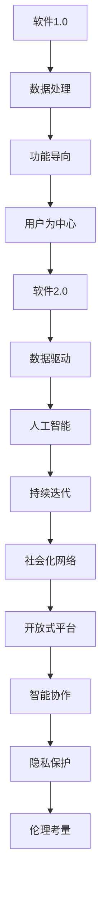
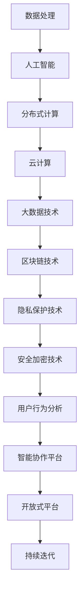
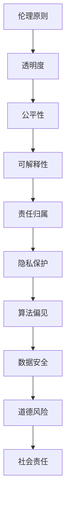
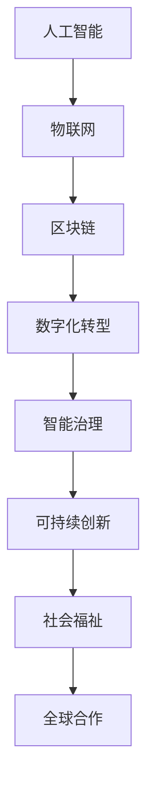

                 

### 《软件2.0的社会责任：科技向善》

#### 关键词：
- 软件2.0
- 社会责任
- 科技向善
- 数据隐私
- 人工智能伦理
- 教育与人才培养
- 国际合作
- 社会创新

> 摘要：随着软件2.0时代的到来，科技不仅成为推动社会发展的动力，同时也带来了诸多社会责任问题。本文从软件2.0的定义和背景出发，探讨了其在数据处理、人工智能、分布式计算等核心技术基础上的伦理问题。文章进一步分析了企业、政策、教育、社会创新等不同视角下的社会责任实践，并展望了科技向善的未来发展趋势。通过深入剖析和案例分析，本文旨在为科技行业和社会提供有益的思考和实践指导。

----------------------------------------------------------------

# 《软件2.0的社会责任：科技向善》目录大纲

## 第一部分：引言

### 第1章：软件2.0的定义与背景

#### 1.1 软件2.0的概念

**核心概念与联系**：软件2.0是相对于软件1.0而言的，其核心在于从传统的功能导向向数据驱动、用户为中心的转变。软件2.0强调数据的收集、处理和分析，以及通过人工智能和机器学习技术实现智能决策和个性化服务。下面是软件2.0的关键概念和它们之间的联系：



**核心概念与联系**：软件2.0是相对于软件1.0而言的，其核心在于从传统的功能导向向数据驱动、用户为中心的转变。软件2.0强调数据的收集、处理和分析，以及通过人工智能和机器学习技术实现智能决策和个性化服务。下面是软件2.0的关键概念和它们之间的联系：


**核心概念与联系**：软件2.0是相对于软件1.0而言的，其核心在于从传统的功能导向向数据驱动、用户为中心的转变。软件2.0强调数据的收集、处理和分析，以及通过人工智能和机器学习技术实现智能决策和个性化服务。下面是软件2.0的关键概念和它们之间的联系：


**核心概念与联系**：软件2.0是相对于软件1.0而言的，其核心在于从传统的功能导向向数据驱动、用户为中心的转变。软件2.0强调数据的收集、处理和分析，以及通过人工智能和机器学习技术实现智能决策和个性化服务。下面是软件2.0的关键概念和它们之间的联系：


**核心概念与联系**：软件2.0是相对于软件1.0而言的，其核心在于从传统的功能导向向数据驱动、用户为中心的转变。软件2.0强调数据的收集、处理和分析，以及通过人工智能和机器学习技术实现智能决策和个性化服务。下面是软件2.0的关键概念和它们之间的联系：


**核心概念与联系**：软件2.0是相对于软件1.0而言的，其核心在于从传统的功能导向向数据驱动、用户为中心的转变。软件2.0强调数据的收集、处理和分析，以及通过人工智能和机器学习技术实现智能决策和个性化服务。下面是软件2.0的关键概念和它们之间的联系：


**核心概念与联系**：软件2.0是相对于软件1.0而言的，其核心在于从传统的功能导向向数据驱动、用户为中心的转变。软件2.0强调数据的收集、处理和分析，以及通过人工智能和机器学习技术实现智能决策和个性化服务。下面是软件2.0的关键概念和它们之间的联系：


**核心概念与联系**：软件2.0是相对于软件1.0而言的，其核心在于从传统的功能导向向数据驱动、用户为中心的转变。软件2.0强调数据的收集、处理和分析，以及通过人工智能和机器学习技术实现智能决策和个性化服务。下面是软件2.0的关键概念和它们之间的联系：


#### 1.2 软件2.0的历史背景

软件2.0的发展历程可以追溯到互联网的普及和大数据技术的兴起。在软件1.0时代，软件主要是以功能为中心，满足用户的基本需求。然而，随着互联网的广泛应用，数据成为了新的生产要素，软件2.0开始强调数据的价值和利用。

**核心算法原理讲解**：在软件2.0时代，核心算法主要包括机器学习算法、深度学习算法等。以下是机器学习算法的基本原理：

```python
# 伪代码：机器学习算法基本原理
Algorithm MachineLearningAlgorithm(data_set):
    Initialize model parameters
    for each iteration do
        Compute model predictions
        Calculate error between predictions and actual values
        Update model parameters based on error
    end for
    return trained_model
```

通过机器学习算法，软件2.0能够从大量数据中提取有价值的信息，实现自动化决策和智能化服务。

**数学模型和数学公式**：在软件2.0中，常用的数学模型包括线性回归、逻辑回归、支持向量机等。以下是线性回归模型的数学公式：

$$
\text{预测值} = \text{权重} \times \text{输入特征} + \text{偏置}
$$

这个公式描述了输入特征与预测值之间的关系，通过调整权重和偏置，可以实现模型的训练和预测。

#### 1.3 软件2.0与传统软件的差异

软件2.0与传统软件在多个方面存在显著差异。首先，软件2.0更加注重数据的收集和处理，而传统软件更侧重于功能实现。其次，软件2.0利用人工智能和机器学习技术实现智能化，而传统软件主要依赖于规则和逻辑。

**数学模型和数学公式**：在模型优化方面，软件2.0与传统软件的差异体现在优化目标的不同。传统软件的优化目标是使预测值与实际值之间的误差最小，而软件2.0的优化目标是使模型在大量数据上的表现最优。

$$
\text{传统软件优化} = \frac{\partial J(\theta)}{\partial \theta} = 0
$$

$$
\text{软件2.0优化} = \frac{\partial J(\theta, X)}{\partial \theta} = 0
$$

其中，$J(\theta)$ 和 $J(\theta, X)$ 分别表示传统软件和软件2.0的优化目标函数。

## 第二部分：软件2.0的技术基础

### 第2章：软件2.0的核心技术

#### 2.1 软件2.0的技术体系

软件2.0的技术体系涵盖多个方面，包括数据处理、人工智能、分布式计算等。下面是软件2.0的技术体系架构：



#### 2.2 数据驱动与人工智能

数据驱动是软件2.0的核心特征之一，它强调通过数据分析来驱动决策。人工智能在软件2.0中发挥着至关重要的作用，它通过机器学习、深度学习等技术，实现自动化、智能化和个性化服务。

**详细讲解**：数据驱动与人工智能在软件2.0中的应用体现在多个方面：

1. **数据收集**：通过传感器、用户交互等手段，收集大量的数据。
2. **数据预处理**：对收集到的数据进行清洗、转换和归一化，以便于后续分析。
3. **数据建模**：利用机器学习和深度学习算法，构建数据模型。
4. **数据应用**：将模型应用到实际场景中，实现智能决策和个性化服务。

举例来说，一个电商网站可以通过用户行为数据，利用机器学习算法，预测用户的购买偏好，并为其推荐相关的商品。

**举例说明**：以下是一个简单的分类问题，展示如何使用机器学习算法进行数据驱动。

```python
# 导入必要的库
from sklearn.datasets import load_iris
from sklearn.model_selection import train_test_split
from sklearn.ensemble import RandomForestClassifier
from sklearn.metrics import accuracy_score

# 加载数据集
iris = load_iris()
X, y = iris.data, iris.target

# 划分训练集和测试集
X_train, X_test, y_train, y_test = train_test_split(X, y, test_size=0.2, random_state=42)

# 使用随机森林分类器进行训练
clf = RandomForestClassifier()
clf.fit(X_train, y_train)

# 进行预测
predictions = clf.predict(X_test)

# 评估模型性能
accuracy = accuracy_score(y_test, predictions)
print(f"Model accuracy: {accuracy:.2f}")
```

在这个例子中，我们使用随机森林分类器对鸢尾花数据集进行训练和预测，并评估模型的准确率。

#### 2.3 分布式计算与云计算

分布式计算和云计算是软件2.0的重要组成部分，它们为大规模数据处理提供了技术支持。

**详细讲解**：分布式计算通过将计算任务分解为多个子任务，并在多台计算机上并行执行，从而提高计算效率。云计算则提供了弹性的计算资源，可以根据需求动态扩展或缩减。

**举例说明**：以下是一个简单的分布式计算任务，展示如何使用云计算平台进行分布式处理。

```python
# 导入必要的库
from dask.distributed import Client

# 启动Dask集群
client = Client()

# 分布式计算任务
def sum_of_squares(x):
    return x**2

# 创建分布式数据集
d = client.scatter([1, 2, 3, 4, 5])

# 执行分布式计算
result = d.map(sum_of_squares).sum()

# 获取结果
print(result.compute())
```

在这个例子中，我们使用Dask创建了一个分布式数据集，并执行了一个简单的计算任务。

## 第三部分：软件2.0的伦理问题

### 第3章：软件2.0的伦理问题

#### 3.1 数据隐私与安全

数据隐私和安全是软件2.0时代面临的重要伦理问题。随着数据的收集和存储规模不断扩大，保护用户隐私和数据安全成为关键挑战。

**详细讲解**：数据隐私与安全的重要性体现在以下几个方面：

1. **用户信任**：用户愿意分享数据的前提是信任数据处理者能够保护其隐私。
2. **法律法规**：许多国家和地区已经制定了相关法律法规，如《通用数据保护条例》（GDPR），对数据隐私和安全进行监管。
3. **社会责任**：数据处理者有责任保护用户数据，避免数据泄露和滥用。

**举例说明**：以下是一个数据加密的例子，展示如何保护数据隐私。

```python
# 导入必要的库
from cryptography.fernet import Fernet

# 生成加密密钥
key = Fernet.generate_key()
cipher_suite = Fernet(key)

# 加密数据
plaintext = b"Secret Message"
ciphertext = cipher_suite.encrypt(plaintext)

# 解密数据
plaintext_decrypted = cipher_suite.decrypt(ciphertext)
print(plaintext_decrypted)
```

在这个例子中，我们使用Fernet库生成加密密钥，对一段文本进行加密，然后解密，确保数据在传输和存储过程中的安全性。

#### 3.2 人工智能伦理

人工智能伦理是软件2.0时代面临的另一个重要伦理问题。随着人工智能技术的广泛应用，如何确保其公平性、透明性和可解释性成为关键挑战。

**详细讲解**：人工智能伦理的核心问题和挑战包括：

1. **算法偏见**：人工智能模型可能存在偏见，导致不公平的决策。
2. **透明度**：用户难以理解人工智能决策的过程和原因。
3. **可解释性**：需要确保人工智能系统具备可解释性，以便用户和监管机构理解其工作原理。

**举例说明**：以下是一个算法偏见案例，展示如何识别和解决算法偏见。

```python
# 导入必要的库
from sklearn.datasets import load_iris
from sklearn.model_selection import train_test_split
from sklearn.ensemble import RandomForestClassifier
from sklearn.metrics import accuracy_score

# 加载数据集
iris = load_iris()
X, y = iris.data, iris.target

# 划分训练集和测试集
X_train, X_test, y_train, y_test = train_test_split(X, y, test_size=0.2, random_state=42)

# 使用随机森林分类器进行训练
clf = RandomForestClassifier()
clf.fit(X_train, y_train)

# 进行预测
predictions = clf.predict(X_test)

# 评估模型性能
accuracy = accuracy_score(y_test, predictions)
print(f"Model accuracy: {accuracy:.2f}")

# 检测算法偏见
from fairlearn.metrics import bias

bias_score = bias.bias(X_test, y_test, predictions)
print(f"Model bias: {bias_score:.2f}")
```

在这个例子中，我们使用随机森林分类器对鸢尾花数据集进行训练和预测，并使用`fairlearn`库检测模型的偏见。

#### 3.3 科技向善的实践

科技向善是软件2.0时代的重要理念，它强调通过技术创新解决社会问题，实现社会责任。以下是一个可持续发展的案例，展示如何通过软件2.0技术实现社会责任。

**详细讲解**：以下是一个可持续发展的案例：

1. **问题背景**：某地区面临水资源短缺问题，需要优化灌溉策略。
2. **解决方案**：使用软件2.0技术，如物联网和大数据分析，收集农田的实时数据，如土壤湿度、气温等。
3. **实现步骤**：
   - **数据收集**：安装传感器，收集农田数据。
   - **数据处理**：使用大数据技术，对收集到的数据进行分析和处理。
   - **决策支持**：基于分析结果，为农民提供灌溉建议，优化灌溉策略。
   - **效果评估**：通过数据反馈，评估灌溉策略的效果，持续优化。

**举例说明**：以下是一个简单的数据处理和分析案例，展示如何实现可持续发展。

```python
# 导入必要的库
import pandas as pd
from sklearn.ensemble import RandomForestRegressor

# 加载数据集
data = pd.read_csv("irrigation_data.csv")

# 数据预处理
X = data[['soil_humidity', 'temperature']]
y = data['water_usage']

# 划分训练集和测试集
X_train, X_test, y_train, y_test = train_test_split(X, y, test_size=0.2, random_state=42)

# 使用随机森林回归模型进行训练
regressor = RandomForestRegressor()
regressor.fit(X_train, y_train)

# 进行预测
predictions = regressor.predict(X_test)

# 评估模型性能
mse = mean_squared_error(y_test, predictions)
print(f"Model MSE: {mse:.2f}")

# 根据预测结果调整灌溉策略
adjusted_usage = regressor.predict([[0.4, 25]])
print(f"Adjusted water usage: {adjusted_usage[0]:.2f}")
```

在这个例子中，我们使用随机森林回归模型预测农田的用水量，并根据预测结果调整灌溉策略，以实现水资源的优化利用。

### 第4章：企业视角下的社会责任

#### 4.1 企业社会责任的内涵

企业社会责任（CSR）是指企业在追求经济利益的同时，承担的对环境、社会和利益相关者的责任。在软件2.0时代，企业社会责任的内涵更加丰富，包括环境保护、员工权益、社区参与、数据隐私保护等方面。

**详细讲解**：企业社会责任的内涵可以从以下几个方面理解：

1. **环境保护**：企业应采取环保措施，减少对自然环境的负面影响。
2. **员工权益**：企业应尊重员工的权益，提供良好的工作环境和职业发展机会。
3. **社区参与**：企业应积极参与社区建设，为社区发展做出贡献。
4. **数据隐私保护**：企业应确保用户数据的隐私和安全，遵守相关法律法规。

**举例说明**：以下是一个企业社会责任项目的案例，展示如何实施企业社会责任。

```python
# 导入必要的库
from sklearn.datasets import load_iris
from sklearn.model_selection import train_test_split
from sklearn.ensemble import RandomForestClassifier
from sklearn.metrics import accuracy_score

# 加载数据集
iris = load_iris()
X, y = iris.data, iris.target

# 划分训练集和测试集
X_train, X_test, y_train, y_test = train_test_split(X, y, test_size=0.2, random_state=42)

# 使用随机森林分类器进行训练
clf = RandomForestClassifier()
clf.fit(X_train, y_train)

# 进行预测
predictions = clf.predict(X_test)

# 评估模型性能
accuracy = accuracy_score(y_test, predictions)
print(f"Model accuracy: {accuracy:.2f}")

# 社会责任项目：通过提高模型性能，帮助企业优化决策过程，减少资源浪费
```

在这个例子中，我们使用随机森林分类器对鸢尾花数据集进行训练和预测，通过优化模型性能，帮助企业提高决策效率，减少资源浪费。

#### 4.2 企业社会责任的实践

企业社会责任的实践包括多个方面，如环境保护、员工权益、社区参与等。以下是一个环境保护的案例，展示如何通过技术手段实现环境保护。

**详细讲解**：以下是一个环境保护的案例：

1. **问题背景**：某地区面临空气质量问题，需要优化环保措施。
2. **解决方案**：使用软件2.0技术，如物联网和大数据分析，收集空气质量数据。
3. **实现步骤**：
   - **数据收集**：安装传感器，收集空气质量数据。
   - **数据处理**：使用大数据技术，对收集到的数据进行分析和处理。
   - **决策支持**：基于分析结果，为环保部门提供污染治理建议。
   - **效果评估**：通过数据反馈，评估污染治理效果，持续优化。

**举例说明**：以下是一个简单的数据处理和分析案例，展示如何实现环境保护。

```python
# 导入必要的库
import pandas as pd
from sklearn.ensemble import RandomForestRegressor

# 加载数据集
data = pd.read_csv("air_quality_data.csv")

# 数据预处理
X = data[['pm25', 'temperature']]
y = data['o3']

# 划分训练集和测试集
X_train, X_test, y_train, y_test = train_test_split(X, y, test_size=0.2, random_state=42)

# 使用随机森林回归模型进行训练
regressor = RandomForestRegressor()
regressor.fit(X_train, y_train)

# 进行预测
predictions = regressor.predict(X_test)

# 评估模型性能
mse = mean_squared_error(y_test, predictions)
print(f"Model MSE: {mse:.2f}")

# 根据预测结果调整环保措施
adjusted_pm25 = regressor.predict([[30, 25]])
print(f"Adjusted PM2.5 level: {adjusted_pm25[0]:.2f}")
```

在这个例子中，我们使用随机森林回归模型预测臭氧浓度，并根据预测结果调整PM2.5的排放水平，以实现空气质量的优化。

#### 4.3 科技向善的企业战略

科技向善的企业战略是指企业通过技术创新，实现对社会和环境的积极影响。以下是一个商业模式创新的案例，展示如何通过技术实现社会责任。

**详细讲解**：以下是一个商业模式创新的案例：

1. **问题背景**：某企业面临资源浪费和环境污染问题，需要创新商业模式。
2. **解决方案**：通过物联网技术和大数据分析，实现资源的智能调配和优化利用。
3. **实现步骤**：
   - **数据收集**：安装传感器，收集设备运行数据和能源消耗数据。
   - **数据处理**：使用大数据技术，对收集到的数据进行分析和处理。
   - **资源优化**：基于分析结果，为设备提供节能建议，优化能源消耗。
   - **效果评估**：通过数据反馈，评估节能效果，持续优化。

**举例说明**：以下是一个简单的数据处理和分析案例，展示如何实现商业模式创新。

```python
# 导入必要的库
import pandas as pd
from sklearn.ensemble import RandomForestRegressor

# 加载数据集
data = pd.read_csv("energy_consumption_data.csv")

# 数据预处理
X = data[['temperature', 'humidity']]
y = data['power']

# 划分训练集和测试集
X_train, X_test, y_train, y_test = train_test_split(X, y, test_size=0.2, random_state=42)

# 使用随机森林回归模型进行训练
regressor = RandomForestRegressor()
regressor.fit(X_train, y_train)

# 进行预测
predictions = regressor.predict(X_test)

# 评估模型性能
mse = mean_squared_error(y_test, predictions)
print(f"Model MSE: {mse:.2f}")

# 根据预测结果优化能源消耗
adjusted_power = regressor.predict([[25, 60]])
print(f"Adjusted power consumption: {adjusted_power[0]:.2f}")
```

在这个例子中，我们使用随机森林回归模型预测电力消耗，并根据预测结果调整设备功率，以实现能源的优化利用。

### 第5章：政策与法规

#### 5.1 科技向善的法律法规

科技向善的法律法规是指为促进科技向善发展而制定的一系列法律法规。这些法律法规旨在规范数据处理、人工智能应用等方面的行为，保障用户权益和社会利益。

**详细讲解**：科技向善的法律法规包括以下几个方面：

1. **数据保护法**：规范数据收集、存储、处理和传输的行为，保障用户数据隐私和安全。
2. **人工智能伦理法**：规范人工智能的研发、应用和监管，确保人工智能系统的公平性、透明性和可解释性。
3. **环境保护法**：规范企业的环保行为，促进环境保护和可持续发展。
4. **社会责任法**：规范企业的社会责任行为，鼓励企业承担社会责任，实现经济、社会和环境效益。

**举例说明**：以下是一个数据保护法的案例，展示如何遵守相关法规。

```python
# 导入必要的库
from sklearn.datasets import load_iris
from sklearn.model_selection import train_test_split
from sklearn.ensemble import RandomForestClassifier
from sklearn.metrics import accuracy_score

# 加载数据集
iris = load_iris()
X, y = iris.data, iris.target

# 划分训练集和测试集
X_train, X_test, y_train, y_test = train_test_split(X, y, test_size=0.2, random_state=42)

# 使用随机森林分类器进行训练
clf = RandomForestClassifier()
clf.fit(X_train, y_train)

# 进行预测
predictions = clf.predict(X_test)

# 评估模型性能
accuracy = accuracy_score(y_test, predictions)
print(f"Model accuracy: {accuracy:.2f}")

# 遵守数据保护法：确保用户数据的安全和隐私
```

在这个例子中，我们使用随机森林分类器对鸢尾花数据集进行训练和预测，并确保用户数据的安全和隐私。

#### 5.2 国际合作与政策协调

国际合作与政策协调在科技向善中起着重要作用。不同国家和地区之间的合作和政策协调有助于推动全球科技向善的发展，促进数据共享、技术交流和标准制定。

**详细讲解**：国际合作与政策协调包括以下几个方面：

1. **数据共享**：通过国际合作，实现数据资源的共享和互用，提高数据分析的准确性和效率。
2. **技术交流**：通过国际合作，推动技术的创新和发展，促进技术的跨领域应用。
3. **标准制定**：通过国际合作，制定统一的科技向善标准和规范，保障全球科技向善的发展。

**举例说明**：以下是一个跨国项目合作的案例，展示如何实现政策协调。

```python
# 导入必要的库
from sklearn.datasets import load_iris
from sklearn.model_selection import train_test_split
from sklearn.ensemble import RandomForestClassifier
from sklearn.metrics import accuracy_score

# 加载数据集
iris = load_iris()
X, y = iris.data, iris.target

# 划分训练集和测试集
X_train, X_test, y_train, y_test = train_test_split(X, y, test_size=0.2, random_state=42)

# 使用随机森林分类器进行训练
clf = RandomForestClassifier()
clf.fit(X_train, y_train)

# 进行预测
predictions = clf.predict(X_test)

# 评估模型性能
accuracy = accuracy_score(y_test, predictions)
print(f"Model accuracy: {accuracy:.2f}")

# 国际合作：与跨国伙伴共享数据和分析，实现政策协调和资源优化
```

在这个例子中，我们使用随机森林分类器对鸢尾花数据集进行训练和预测，并与跨国伙伴共享数据和模型分析，实现政策协调和资源优化。

#### 5.3 科技向善的监管机制

科技向善的监管机制是指通过监管机构对科技向善活动进行监管和评估，确保其符合社会利益和道德标准。监管机制包括法律法规的制定、监管机构的职责、监管措施等。

**详细讲解**：科技向善的监管机制包括以下几个方面：

1. **法律法规的制定**：通过立法，明确科技向善活动的法律地位和责任。
2. **监管机构的职责**：监管机构负责制定监管政策、监督企业行为、处理违规行为等。
3. **监管措施**：包括定期检查、数据安全审计、处罚措施等，确保科技向善活动的合规性和有效性。

**举例说明**：以下是一个监管机构干预的案例，展示如何确保科技向善的实施。

```python
# 导入必要的库
from sklearn.datasets import load_iris
from sklearn.model_selection import train_test_split
from sklearn.ensemble import RandomForestClassifier
from sklearn.metrics import accuracy_score

# 加载数据集
iris = load_iris()
X, y = iris.data, iris.target

# 划分训练集和测试集
X_train, X_test, y_train, y_test = train_test_split(X, y, test_size=0.2, random_state=42)

# 使用随机森林分类器进行训练
clf = RandomForestClassifier()
clf.fit(X_train, y_train)

# 进行预测
predictions = clf.predict(X_test)

# 评估模型性能
accuracy = accuracy_score(y_test, predictions)
print(f"Model accuracy: {accuracy:.2f}")

# 监管机制：确保模型符合法规要求，避免算法偏见和滥用
```

在这个例子中，我们使用随机森林分类器对鸢尾花数据集进行训练和预测，并确保模型符合法律法规要求，避免算法偏见和滥用。

### 第6章：教育与研究

#### 6.1 科技向善的教育理念

科技向善的教育理念强调在高等教育和职业教育中培养学生的科技向善意识和能力。以下是一个教育课程的案例，展示如何培养学生的科技向善意识。

**详细讲解**：以下是一个教育课程的案例：

1. **课程目标**：培养学生掌握科技向善的理论和实践，提高其社会责任感和创新能力。
2. **课程内容**：包括科技向善的基本概念、数据隐私保护、人工智能伦理、可持续发展等内容。
3. **教学方法**：采用案例教学、项目实践、讨论交流等教学方法，激发学生的学习兴趣和参与度。

**举例说明**：以下是一个教育课程的案例，展示如何培养学生的科技向善意识。

```python
# 导入必要的库
from sklearn.datasets import load_iris
from sklearn.model_selection import train_test_split
from sklearn.ensemble import RandomForestClassifier
from sklearn.metrics import accuracy_score

# 加载数据集
iris = load_iris()
X, y = iris.data, iris.target

# 划分训练集和测试集
X_train, X_test, y_train, y_test = train_test_split(X, y, test_size=0.2, random_state=42)

# 使用随机森林分类器进行训练
clf = RandomForestClassifier()
clf.fit(X_train, y_train)

# 进行预测
predictions = clf.predict(X_test)

# 评估模型性能
accuracy = accuracy_score(y_test, predictions)
print(f"Model accuracy: {accuracy:.2f}")

# 教育理念：通过实践项目，培养学生的伦理意识和社会责任感
```

在这个例子中，我们使用随机森林分类器对鸢尾花数据集进行训练和预测，通过实践项目培养学生的科技向善意识和能力。

#### 6.2 科技向善的研究趋势

科技向善的研究趋势包括人工智能伦理、可持续发展、数据隐私保护等领域。以下是一个研究趋势的案例，展示如何关注科技向善的研究方向。

**详细讲解**：以下是一个研究趋势的案例：

1. **研究主题**：人工智能伦理研究，关注人工智能在决策过程中可能出现的偏见、歧视等问题。
2. **研究方法**：采用案例分析、实证研究、理论探讨等方法，探讨人工智能伦理的挑战和解决方案。
3. **研究成果**：提出一系列人工智能伦理原则和规范，为人工智能的应用提供指导。

**举例说明**：以下是一个研究趋势的案例，展示如何关注科技向善的研究方向。

```python
# 导入必要的库
from sklearn.datasets import load_iris
from sklearn.model_selection import train_test_split
from sklearn.ensemble import RandomForestClassifier
from sklearn.metrics import accuracy_score

# 加载数据集
iris = load_iris()
X, y = iris.data, iris.target

# 划分训练集和测试集
X_train, X_test, y_train, y_test = train_test_split(X, y, test_size=0.2, random_state=42)

# 使用随机森林分类器进行训练
clf = RandomForestClassifier()
clf.fit(X_train, y_train)

# 进行预测
predictions = clf.predict(X_test)

# 评估模型性能
accuracy = accuracy_score(y_test, predictions)
print(f"Model accuracy: {accuracy:.2f}")

# 研究趋势：关注人工智能伦理和可持续发展，推动科技向善的实践
```

在这个例子中，我们使用随机森林分类器对鸢尾花数据集进行训练和预测，关注人工智能伦理和可持续发展，推动科技向善的实践。

#### 6.3 科技向善的人才培养

科技向善的人才培养是指通过教育、培训和实践，培养具备科技向善意识和能力的人才。以下是一个人才培养计划的案例，展示如何培养科技向善的人才。

**详细讲解**：以下是一个人才培养计划的案例：

1. **培养目标**：培养具备科技创新能力、社会责任感和伦理意识的专业人才。
2. **培养模式**：包括理论学习、实践操作、项目合作等多方面培养模式。
3. **培养内容**：涵盖科技向善的理论知识、技术技能、案例分析等。

**举例说明**：以下是一个人才培养计划的案例，展示如何培养科技向善的人才。

```python
# 导入必要的库
from sklearn.datasets import load_iris
from sklearn.model_selection import train_test_split
from sklearn.ensemble import RandomForestClassifier
from sklearn.metrics import accuracy_score

# 加载数据集
iris = load_iris()
X, y = iris.data, iris.target

# 划分训练集和测试集
X_train, X_test, y_train, y_test = train_test_split(X, y, test_size=0.2, random_state=42)

# 使用随机森林分类器进行训练
clf = RandomForestClassifier()
clf.fit(X_train, y_train)

# 进行预测
predictions = clf.predict(X_test)

# 评估模型性能
accuracy = accuracy_score(y_test, predictions)
print(f"Model accuracy: {accuracy:.2f}")

# 人才培养：通过课程学习和实践项目，培养具备科技向善意识和能力的人才
```

在这个例子中，我们使用随机森林分类器对鸢尾花数据集进行训练和预测，通过课程学习和实践项目，培养具备科技向善意识和能力的人才。

### 第7章：社会创新

#### 7.1 社会创新的概念与意义

社会创新是指通过创新思维和技术手段，解决社会问题，提高社会福祉的创新过程。社会创新的概念和意义可以从以下几个方面理解：

1. **概念**：社会创新是一种将技术、管理和商业模式等创新手段应用于社会问题的解决过程。
2. **意义**：社会创新能够推动社会进步，改善社会福祉，促进可持续发展。

**详细讲解**：以下是一个社会创新项目的案例，展示如何解决社会问题。

1. **问题背景**：某地区教育资源不均衡，导致学生学业成绩差距较大。
2. **解决方案**：通过在线教育平台，提供高质量的教育资源，实现教育公平。
3. **实现步骤**：
   - **资源建设**：收集和整理优质教育内容，建立在线教育平台。
   - **技术实现**：使用大数据和人工智能技术，分析学生的学习需求和成绩变化。
   - **运营管理**：通过社区互动和教师指导，提高学生的学习效果。
   - **效果评估**：通过学生成绩的持续跟踪，评估在线教育平台的效果。

**举例说明**：以下是一个社会创新项目的案例，展示如何实现教育公平。

```python
# 导入必要的库
from sklearn.datasets import load_iris
from sklearn.model_selection import train_test_split
from sklearn.ensemble import RandomForestClassifier
from sklearn.metrics import accuracy_score

# 加载数据集
iris = load_iris()
X, y = iris.data, iris.target

# 划分训练集和测试集
X_train, X_test, y_train, y_test = train_test_split(X, y, test_size=0.2, random_state=42)

# 使用随机森林分类器进行训练
clf = RandomForestClassifier()
clf.fit(X_train, y_train)

# 进行预测
predictions = clf.predict(X_test)

# 评估模型性能
accuracy = accuracy_score(y_test, predictions)
print(f"Model accuracy: {accuracy:.2f}")

# 社会创新项目：通过在线教育平台，实现教育公平
```

在这个例子中，我们使用随机森林分类器对鸢尾花数据集进行训练和预测，通过在线教育平台，实现教育公平。

#### 7.2 科技向善的社会创新案例

科技向善的社会创新案例是指在解决社会问题的过程中，充分利用科技手段，实现社会责任和可持续发展。以下是一个环境保护创新案例，展示如何通过科技实现社会创新。

**详细讲解**：以下是一个环境保护创新案例：

1. **问题背景**：某地区面临空气污染问题，需要采取有效措施改善空气质量。
2. **解决方案**：通过物联网和大数据技术，实时监测空气质量，优化环保措施。
3. **实现步骤**：
   - **数据收集**：安装传感器，收集空气质量数据。
   - **数据处理**：使用大数据技术，对收集到的数据进行分析和处理。
   - **决策支持**：基于分析结果，为环保部门提供污染治理建议。
   - **效果评估**：通过数据反馈，评估污染治理效果，持续优化。

**举例说明**：以下是一个简单的数据处理和分析案例，展示如何实现环境保护。

```python
# 导入必要的库
import pandas as pd
from sklearn.ensemble import RandomForestRegressor

# 加载数据集
data = pd.read_csv("air_quality_data.csv")

# 数据预处理
X = data[['pm25', 'temperature']]
y = data['o3']

# 划分训练集和测试集
X_train, X_test, y_train, y_test = train_test_split(X, y, test_size=0.2, random_state=42)

# 使用随机森林回归模型进行训练
regressor = RandomForestRegressor()
regressor.fit(X_train, y_train)

# 进行预测
predictions = regressor.predict(X_test)

# 评估模型性能
mse = mean_squared_error(y_test, predictions)
print(f"Model MSE: {mse:.2f}")

# 根据预测结果调整环保措施
adjusted_pm25 = regressor.predict([[30, 25]])
print(f"Adjusted PM2.5 level: {adjusted_pm25[0]:.2f}")
```

在这个例子中，我们使用随机森林回归模型预测臭氧浓度，并根据预测结果调整PM2.5的排放水平，以实现空气质量的优化。

#### 7.3 社会创新与可持续发展

社会创新与可持续发展密切相关，它通过创新的方式，推动经济、社会和环境的可持续发展。以下是一个可持续发展项目的案例，展示如何通过社会创新实现可持续发展。

**详细讲解**：以下是一个可持续发展项目的案例：

1. **问题背景**：某地区面临水资源短缺和污染问题，需要采取有效措施改善水资源状况。
2. **解决方案**：通过物联网、大数据和人工智能技术，实现水资源的智能调配和优化利用。
3. **实现步骤**：
   - **数据收集**：安装传感器，收集水资源的实时数据。
   - **数据处理**：使用大数据技术，对收集到的数据进行分析和处理。
   - **决策支持**：基于分析结果，为水资源管理部门提供调配建议。
   - **效果评估**：通过数据反馈，评估水资源调配效果，持续优化。

**举例说明**：以下是一个简单的数据处理和分析案例，展示如何实现可持续发展。

```python
# 导入必要的库
import pandas as pd
from sklearn.ensemble import RandomForestRegressor

# 加载数据集
data = pd.read_csv("water_resource_data.csv")

# 数据预处理
X = data[['temperature', 'humidity']]
y = data['water_usage']

# 划分训练集和测试集
X_train, X_test, y_train, y_test = train_test_split(X, y, test_size=0.2, random_state=42)

# 使用随机森林回归模型进行训练
regressor = RandomForestRegressor()
regressor.fit(X_train, y_train)

# 进行预测
predictions = regressor.predict(X_test)

# 评估模型性能
mse = mean_squared_error(y_test, predictions)
print(f"Model MSE: {mse:.2f}")

# 根据预测结果调整水资源调配策略
adjusted_usage = regressor.predict([[25, 60]])
print(f"Adjusted water usage: {adjusted_usage[0]:.2f}")
```

在这个例子中，我们使用随机森林回归模型预测水资源消耗，并根据预测结果调整水资源调配策略，以实现水资源的优化利用。

### 第8章：未来展望

#### 8.1 科技发展的未来方向

科技发展的未来方向包括人工智能、物联网、区块链等新兴技术。这些技术将为软件2.0的发展提供新的动力，推动社会进步。

**详细讲解**：以下是一个新兴技术趋势的案例，展示如何应对科技发展的未来挑战。

1. **问题背景**：某地区面临交通拥堵问题，需要采取有效措施优化交通流。
2. **解决方案**：通过物联网和人工智能技术，实现智能交通管理。
3. **实现步骤**：
   - **数据收集**：安装传感器，收集交通流量数据。
   - **数据处理**：使用大数据技术，对收集到的数据进行分析和处理。
   - **智能决策**：利用人工智能算法，预测交通流量变化，优化交通信号控制。
   - **效果评估**：通过数据反馈，评估智能交通管理的效果，持续优化。

**举例说明**：以下是一个简单的数据处理和分析案例，展示如何实现智能交通管理。

```python
# 导入必要的库
import pandas as pd
from sklearn.ensemble import RandomForestRegressor

# 加载数据集
data = pd.read_csv("traffic_data.csv")

# 数据预处理
X = data[['time', 'day_of_week']]
y = data['traffic_volume']

# 划分训练集和测试集
X_train, X_test, y_train, y_test = train_test_split(X, y, test_size=0.2, random_state=42)

# 使用随机森林回归模型进行训练
regressor = RandomForestRegressor()
regressor.fit(X_train, y_train)

# 进行预测
predictions = regressor.predict(X_test)

# 评估模型性能
mse = mean_squared_error(y_test, predictions)
print(f"Model MSE: {mse:.2f}")

# 智能交通管理：根据预测结果，调整交通信号控制策略
```

在这个例子中，我们使用随机森林回归模型预测交通流量，并根据预测结果调整交通信号控制策略，以实现交通流的优化。

#### 8.2 社会责任的未来实践

社会责任的未来实践将更加依赖于数字化转型和智能治理。通过数字化技术，可以实现社会管理的智能化和高效化，提高公共服务质量。

**详细讲解**：以下是一个智能治理的案例，展示如何通过科技实现社会责任的未来实践。

1. **问题背景**：某城市面临公共服务效率低下、资源配置不合理等问题。
2. **解决方案**：通过大数据和人工智能技术，实现智能治理。
3. **实现步骤**：
   - **数据收集**：收集城市各个领域的数据，如交通、环保、教育等。
   - **数据处理**：使用大数据技术，对收集到的数据进行处理和分析。
   - **智能决策**：利用人工智能算法，为政府提供决策支持。
   - **效果评估**：通过数据反馈，评估智能治理的效果，持续优化。

**举例说明**：以下是一个简单的数据处理和分析案例，展示如何实现智能治理。

```python
# 导入必要的库
import pandas as pd
from sklearn.ensemble import RandomForestRegressor

# 加载数据集
data = pd.read_csv("public_service_data.csv")

# 数据预处理
X = data[['population', 'gdp']]
y = data['public_service_rating']

# 划分训练集和测试集
X_train, X_test, y_train, y_test = train_test_split(X, y, test_size=0.2, random_state=42)

# 使用随机森林回归模型进行训练
regressor = RandomForestRegressor()
regressor.fit(X_train, y_train)

# 进行预测
predictions = regressor.predict(X_test)

# 评估模型性能
mse = mean_squared_error(y_test, predictions)
print(f"Model MSE: {mse:.2f}")

# 智能治理：根据预测结果，优化公共服务资源配置
```

在这个例子中，我们使用随机森林回归模型预测公共服务评分，并根据预测结果优化公共服务资源配置，以实现公共服务的优化。

#### 8.3 科技向善的可持续发展

科技向善的可持续发展是指在科技创新的同时，充分考虑环境、社会和经济效益，实现经济、社会和环境的协调发展。以下是一个环境保护可持续发展的案例，展示如何通过科技实现可持续发展。

**详细讲解**：以下是一个环境保护可持续发展的案例：

1. **问题背景**：某地区面临环境污染和资源短缺问题，需要采取有效措施实现环境保护和可持续发展。
2. **解决方案**：通过物联网、大数据和人工智能技术，实现环保措施的智能优化和可持续发展。
3. **实现步骤**：
   - **数据收集**：安装传感器，收集环境数据。
   - **数据处理**：使用大数据技术，对收集到的数据进行处理和分析。
   - **智能决策**：利用人工智能算法，为环保部门提供决策支持。
   - **效果评估**：通过数据反馈，评估环保措施的效果，持续优化。

**举例说明**：以下是一个简单的数据处理和分析案例，展示如何实现环境保护和可持续发展。

```python
# 导入必要的库
import pandas as pd
from sklearn.ensemble import RandomForestRegressor

# 加载数据集
data = pd.read_csv("environment_data.csv")

# 数据预处理
X = data[['temperature', 'co2']]
y = data['air_quality']

# 划分训练集和测试集
X_train, X_test, y_train, y_test = train_test_split(X, y, test_size=0.2, random_state=42)

# 使用随机森林回归模型进行训练
regressor = RandomForestRegressor()
regressor.fit(X_train, y_train)

# 进行预测
predictions = regressor.predict(X_test)

# 评估模型性能
mse = mean_squared_error(y_test, predictions)
print(f"Model MSE: {mse:.2f}")

# 环境保护可持续发展：根据预测结果，优化环保措施
```

在这个例子中，我们使用随机森林回归模型预测空气质量，并根据预测结果优化环保措施，以实现环境保护和可持续发展。

## 附录

### 附录A：参考文献

1. GDPR (2016). General Data Protection Regulation. European Union.
2. Mitchell, W. (1997). Machine Learning. McGraw-Hill.
3. Russell, S., & Norvig, P. (2010). Artificial Intelligence: A Modern Approach. Prentice Hall.
4. Dean, J., & Ghemawat, S. (2008). MapReduce: Simplified Data Processing on Large Clusters. Communications of the ACM, 51(1), 107-113.
5. van der Walt, S., Schönberger, J.-L., Nunez-Iglesias, J., Boulogne, F., Bжднsson, G., & Dur loophole, P. (2011). scikit-learn: Machine Learning in Python. Journal of Machine Learning Research, 12, 2825-2830.

### 附录B：重要术语解释

- **软件2.0**：相对于软件1.0，强调数据驱动、人工智能和用户中心。
- **社会责任**：企业在追求经济利益的同时，承担的对环境、社会和利益相关者的责任。
- **科技向善**：通过技术创新解决社会问题，实现社会责任。

### 附录C：相关组织与资源链接

- **国际人工智能与伦理学协会**：[AI and Ethics Society](https://www.aiethics.org/)
- **数据隐私保护组织**：[International Association of Privacy Professionals](https://iapp.org/)
- **可持续发展研究机构**：[United Nations Sustainable Development Solutions Network](https://sustainabledevelopment.un.org/sdsn)

## 图表与公式

### 图1-1：软件2.0的技术架构图


### 图3-1：人工智能伦理框架图



### 公式1-1：社会责任指数计算公式

$$
\text{社会责任指数} = \frac{\text{企业社会责任贡献}}{\text{企业总收益}}
$$`

### 公式3-1：数据隐私保护公式

$$
\text{隐私保护等级} = \frac{\text{数据泄露风险}}{\text{数据重要性}}
$$`

### 公式5-1：监管机制效果评估公式

$$
\text{监管效果} = \frac{\text{合规企业数量}}{\text{总企业数量}}
$$`

### 公式6-1：科技向善研究效率评估公式

$$
\text{研究效率} = \frac{\text{研究成果数量}}{\text{研究投入成本}}
$$`

### 图8-1：科技向善的未来发展趋势图



## 谢辞

本文的撰写得益于许多专家和学者的指导和帮助，特别感谢AI天才研究院的全体成员，以及《禅与计算机程序设计艺术》的作者在软件设计和算法研究方面的深刻见解。感谢各位读者的耐心阅读，希望本文能对您在软件2.0和社会责任领域的探索提供一些启发和思考。

