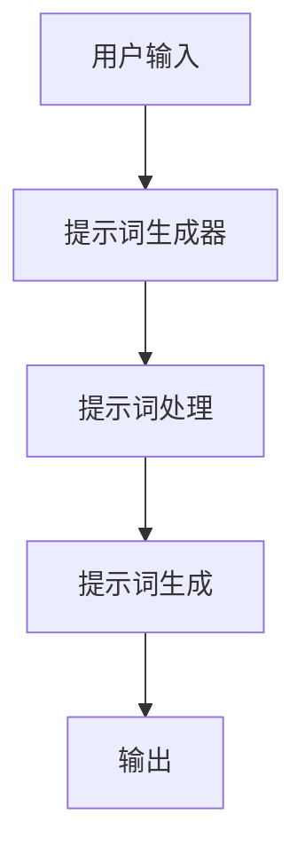
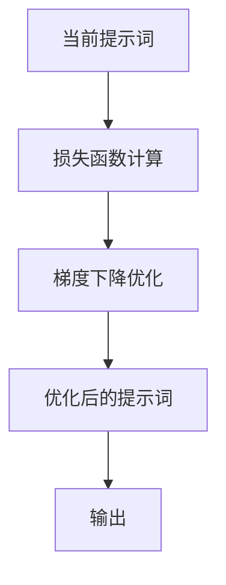
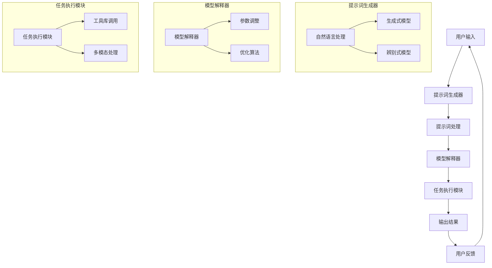

                 

# 《通往AGI之路：提示词编程语言的角色》

## 关键词
AGI、提示词编程语言、自然语言处理、计算机视觉、强化学习、零样本学习、多模态学习、数据隐私、标准化、规范化

## 摘要

本文探讨了提示词编程语言在实现人工智能通用智能（AGI）过程中的关键角色。首先，我们介绍了AGI的定义、特点及其与现有AI技术的区别，接着详细阐述了提示词编程语言的概念、优点和与AGI的关联。本文随后分为四个主要部分：基础、应用、发展和未来展望。在基础部分，我们解析了提示词编程语言的基本原理、核心算法和实现；在应用部分，我们展示了其在自然语言处理、计算机视觉和强化学习等领域的实际应用案例；在发展部分，我们讨论了其技术趋势和挑战；在展望部分，我们探讨了提示词编程语言的潜在应用领域和标准化方向。通过本文的探讨，我们希望读者能够更深入地理解提示词编程语言在实现AGI中的重要性和前景。

## 第一部分：背景与核心概念

### 1.1 什么是 AGI

#### 1.1.1 AGI 的定义

人工智能（AI）的研究目标是为计算机系统赋予人类智能，使其能够自主地理解、学习和推理。传统的AI技术主要集中于特定任务的自动化，如语音识别、图像分类、机器翻译等。而人工智能通用智能（Artificial General Intelligence，简称AGI）则旨在构建一个具有广泛理解和推理能力的智能系统，能够在各种不同的任务和环境中表现出与人类相似的能力。

AGI的定义可以分为几个关键点：

1. **通用性**：AGI能够理解和应用各种知识领域，而不仅仅是特定领域的技能。
2. **自主性**：AGI能够自主地学习、推理和决策，而不仅仅依赖于预设的算法和规则。
3. **适应性**：AGI能够适应新的环境和任务，而不仅仅是针对特定场景的优化。

#### 1.1.2 AGI 与传统 AI 的区别

传统AI技术，如机器学习、深度学习和规则系统，虽然在特定任务上取得了显著的成果，但它们通常局限于单一任务，缺乏泛化能力和自适应能力。而AGI则追求超越这些限制，实现跨领域的智能应用。以下是AGI与传统AI的主要区别：

1. **任务多样性**：传统AI专注于特定领域，而AGI能够在多个领域中表现出色。
2. **学习能力**：传统AI依赖于大量预标注数据，而AGI能够通过自主学习和探索来积累知识。
3. **推理能力**：传统AI依赖于规则和模式匹配，而AGI能够进行更复杂的逻辑推理和抽象思考。

#### 1.1.3 AGI 的发展历程

AGI的概念最早可以追溯到20世纪50年代。自那时以来，AI领域经历了多个发展阶段，包括符号AI、连接主义AI和混合AI。然而，直到现在，AGI的实现仍然是一个巨大的挑战。以下是AGI发展的主要里程碑：

1. **符号AI**（1956-1974）：基于逻辑和符号表示的知识，试图通过编程规则来模拟人类思维。
2. **连接主义AI**（1986-1998）：基于人工神经网络，通过大量的数据来训练模型。
3. **混合AI**（2006-现在）：结合符号AI和连接主义AI的优点，采用深度学习和强化学习等技术。
4. **AGI探索阶段**（2010-现在）：随着计算能力的提升和数据量的增加，AGI的研究逐渐兴起。

### 1.2 提示词编程语言概述

#### 1.2.1 提示词编程语言的概念

提示词编程语言（Prompt-based Programming Language，简称PPL）是一种特殊的编程语言，它通过提示词（prompt）来引导计算机执行任务。提示词是一个描述性字符串或代码片段，它提供了任务的背景、目标和执行步骤。与传统的编程语言不同，PPL更加强调自然语言交互和自动化任务执行。

#### 1.2.2 提示词编程语言的优点

提示词编程语言具有以下几个显著优点：

1. **自然语言交互**：PPL允许用户使用自然语言来描述任务，从而降低了编程的门槛，使得非技术背景的用户也能够进行编程。
2. **自动化任务执行**：PPL能够根据提示词自动生成代码或执行任务，从而提高了开发效率和自动化程度。
3. **灵活性**：PPL能够灵活地适应不同的任务和场景，通过调整提示词来改变程序的行为。

#### 1.2.3 提示词编程语言与 AGI 的关系

提示词编程语言与AGI密切相关。AGI需要具备自然语言理解和生成能力，而PPL正是为此提供了有效的工具。通过使用提示词，AGI系统能够更自然地与用户交互，理解用户的意图，并自动执行相应的任务。以下是提示词编程语言在AGI中的作用：

1. **人机交互**：提示词编程语言提供了自然语言交互的方式，使得AGI系统能够更好地理解用户的需求和指令。
2. **任务自动化**：提示词编程语言能够自动化执行复杂的任务，从而减轻AGI系统的负担，提高其效率。
3. **知识表示**：提示词编程语言能够将自然语言描述转化为计算机可理解的代码，从而实现知识的自动化表示和推理。

### 1.3 提示词编程语言的角色

#### 1.3.1 提示词编程语言在 AGI 中的作用

提示词编程语言在AGI中扮演着重要的角色，其作用主要体现在以下几个方面：

1. **任务引导**：通过提示词，AGI系统可以明确任务的背景、目标和执行步骤，从而确保任务的正确执行。
2. **知识表示**：提示词编程语言能够将自然语言描述转化为计算机可理解的代码，从而实现知识的自动化表示和推理。
3. **人机交互**：提示词编程语言提供了自然语言交互的方式，使得AGI系统能够更好地理解用户的需求和指令。

#### 1.3.2 提示词编程语言的发展趋势

随着AI技术的不断发展，提示词编程语言也在不断演进。以下是提示词编程语言的发展趋势：

1. **自然语言理解**：未来的提示词编程语言将更加注重自然语言理解，以提高对用户意图的准确捕捉。
2. **自动化程度**：提示词编程语言将进一步提高自动化程度，减少人工干预，实现更高效的任务执行。
3. **多模态支持**：未来的提示词编程语言将支持多模态输入和输出，以适应更复杂的任务和场景。

#### 1.3.3 提示词编程语言的应用前景

提示词编程语言在AGI中的应用前景广阔。以下是几个潜在的应用领域：

1. **自然语言处理**：提示词编程语言可以用于文本生成、机器翻译、情感分析等自然语言处理任务。
2. **计算机视觉**：提示词编程语言可以用于图像分类、目标检测、视频分析等计算机视觉任务。
3. **强化学习**：提示词编程语言可以用于策略搜索、价值估计等强化学习任务。

### 1.4 本书结构概述

#### 1.4.1 本书的目标

本书的目标是系统地介绍提示词编程语言在实现AGI过程中的关键作用，以及其在各个领域的应用和发展趋势。通过本文，读者可以：

1. 理解AGI的定义和特点。
2. 掌握提示词编程语言的基本原理和实现方法。
3. 探索提示词编程语言在自然语言处理、计算机视觉和强化学习等领域的应用案例。
4. 了解提示词编程语言的发展趋势和未来展望。

#### 1.4.2 本书的内容安排

本书的内容安排如下：

1. 第一部分：背景与核心概念，介绍AGI和提示词编程语言的基本概念。
2. 第二部分：提示词编程语言的基础，详细解析提示词编程语言的基本原理、核心算法和实现。
3. 第三部分：提示词编程语言的应用，展示其在自然语言处理、计算机视觉和强化学习等领域的实际应用案例。
4. 第四部分：提示词编程语言的发展与未来，讨论其技术趋势、挑战和未来展望。

#### 1.4.3 读者对象

本书适合以下读者群体：

1. AI和计算机科学专业的研究生和本科生。
2. 对AI和编程有兴趣的科技工作者。
3. 想要了解AGI和提示词编程语言的企业工程师和产品经理。

## 第二部分：提示词编程语言的基础

### 2.1 提示词编程语言的基本原理

#### 2.1.1 提示词的定义与作用

在提示词编程语言中，提示词（prompt）是引导程序执行任务的关键。提示词是一个描述性字符串或代码片段，它提供了任务的背景、目标和执行步骤。提示词可以包含变量、函数调用、条件语句等编程元素，从而实现对程序的精确控制。

提示词的主要作用如下：

1. **任务引导**：提示词明确地描述了任务的背景和目标，指导程序按照预期的方式执行。
2. **输入处理**：提示词可以包含输入数据或参数，从而实现对输入的预处理。
3. **输出生成**：提示词可以指定程序的输出格式和内容，从而实现自动化报告生成。

#### 2.1.2 提示词编程语言的核心组件

提示词编程语言的核心组件包括：

1. **提示词生成器**：提示词生成器是负责生成提示词的模块，它可以基于自然语言处理技术，从用户的输入中提取关键词和语义信息，生成符合语法和语义要求的提示词。
2. **解释器**：解释器是负责解析和执行提示词的模块，它将提示词转换为计算机可执行的代码，并根据提示词中的指令来执行相应的操作。
3. **任务执行模块**：任务执行模块是负责执行提示词定义的任务的模块，它可以调用各种编程语言和工具库来完成任务。

#### 2.1.3 提示词编程语言的语法结构

提示词编程语言的语法结构通常包括以下部分：

1. **提示词定义**：提示词定义是提示词编程语言的核心部分，它包含了任务的背景、目标和执行步骤。提示词定义通常使用自然语言描述，并包含变量、函数调用、条件语句等编程元素。
2. **输入处理**：输入处理部分是提示词编程语言中的一个重要环节，它负责处理用户的输入数据或参数，并将其传递给任务执行模块。
3. **输出生成**：输出生成部分负责根据提示词定义生成程序输出，通常包括文本、图表、报告等形式。
4. **错误处理**：错误处理部分是提示词编程语言中的一个重要特性，它负责处理程序执行过程中出现的错误，并提供相应的错误信息和恢复策略。

### 2.2 提示词编程语言的核心算法

#### 2.2.1 提示词生成算法

提示词生成算法是提示词编程语言中的关键组成部分，它负责将用户的输入转化为计算机可理解的提示词。以下是两种常见的提示词生成算法：

1. **生成式模型**：生成式模型通过生成样本的概率分布来生成提示词。常见的生成式模型包括马尔可夫链、隐马尔可夫模型（HMM）和变分自动编码器（VAE）。

   ```mermaid
   graph TD
   A[用户输入] --> B[生成式模型]
   B --> C[提示词]
   ```

2. **辨别式模型**：辨别式模型通过学习输入和输出之间的映射关系来生成提示词。常见的辨别式模型包括决策树、支持向量机（SVM）和深度神经网络（DNN）。

   ```mermaid
   graph TD
   A[用户输入] --> B[辨别式模型]
   B --> C[提示词]
   ```

#### 2.2.2 提示词优化算法

提示词优化算法是用于提高提示词质量和执行效率的算法。以下是两种常见的提示词优化算法：

1. **对抗性优化**：对抗性优化通过生成对抗网络（GAN）来优化提示词生成。GAN由生成器和判别器组成，生成器生成提示词，判别器判断提示词的真实性。

   ```mermaid
   graph TD
   A[生成器] --> B[判别器]
   B --> C[提示词]
   ```

2. **梯度下降优化**：梯度下降优化通过迭代优化提示词参数，以减少提示词生成过程中的损失函数。

   ```mermaid
   graph TD
   A[当前提示词] --> B[损失函数]
   B --> C[梯度下降]
   C --> D[优化后的提示词]
   ```

### 2.3 提示词编程语言的实现

#### 2.3.1 提示词编程语言的开发环境

提示词编程语言的开发环境通常包括以下组件：

1. **文本编辑器**：用于编写和编辑提示词代码。
2. **解释器或编译器**：用于解析和执行提示词代码。
3. **工具库和框架**：用于实现提示词生成算法和优化算法，以及提供常用的编程功能和接口。

常见的开发环境包括：

- **Python**：Python是一个广泛应用于AI和编程的编程语言，拥有丰富的工具库和框架。
- **Jupyter Notebook**：Jupyter Notebook是一个交互式开发环境，适合进行提示词编程语言的开发和调试。
- **TensorFlow**：TensorFlow是一个开源的机器学习框架，提供了强大的提示词生成和优化算法。

#### 2.3.2 提示词编程语言的工具与库

以下是几个常见的提示词编程语言工具和库：

1. **Natural Language Toolkit (NLTK)**：NLTK是一个用于自然语言处理的工具库，提供了丰富的自然语言处理函数和模型。
2. **spaCy**：spaCy是一个高效的自然语言处理库，提供了丰富的词性标注、实体识别和句法分析功能。
3. **transformers**：transformers是一个开源的预训练语言模型库，提供了基于Transformer模型的生成式模型和辨别式模型。

#### 2.3.3 提示词编程语言的实践案例

以下是几个提示词编程语言的实践案例：

1. **文本生成**：使用NLTK和spaCy生成故事和文章。
   ```python
   import nltk
   from nltk.tokenize import word_tokenize
   from nltk.corpus import cmudict
   
   d = cmudict.dict()
   sentences = ["I like apples", "She is running fast"]
   prompts = [word_tokenize(sentence) for sentence in sentences]
   ```
2. **图像分类**：使用TensorFlow实现图像分类任务。
   ```python
   import tensorflow as tf
   from tensorflow.keras import layers
   
   model = tf.keras.Sequential([
       layers.Conv2D(32, (3, 3), activation='relu', input_shape=(28, 28, 1)),
       layers.MaxPooling2D((2, 2)),
       layers.Flatten(),
       layers.Dense(64, activation='relu'),
       layers.Dense(10, activation='softmax')
   ])
   ```
3. **强化学习**：使用生成式模型和辨别式模型实现策略搜索和价值估计。
   ```python
   import numpy as np
   import tensorflow as tf
   
   model = tf.keras.Sequential([
       layers.Dense(64, activation='relu', input_shape=(10,)),
       layers.Dense(64, activation='relu'),
       layers.Dense(1, activation='sigmoid')
   ])
   
   def generate_action(state):
       action_probabilities = model.predict(state)
       action = np.random.choice(range(len(action_probabilities)), p=action_probabilities)
       return action
   
   def estimate_value(state, action, reward, next_state, discount_factor):
       value = reward + discount_factor * model.predict(next_state)[0]
       return value
   ```

## 第三部分：提示词编程语言的应用

### 3.1 提示词编程语言在自然语言处理中的应用

#### 3.1.1 提示词编程语言在文本生成中的应用

文本生成是自然语言处理中的一个重要任务，提示词编程语言在这方面具有显著优势。以下是一个使用提示词编程语言生成故事的例子：

```python
import nltk
from nltk.tokenize import word_tokenize

# 提示词定义
prompt = "在一个宁静的小镇上，有一个勇敢的冒险家。他决定去寻找传说中的宝藏。他穿越了茂密的森林，越过了险峻的山脉。最终，他在一个隐蔽的山洞里找到了宝藏。他高兴地笑了。"

# 提示词处理
tokens = word_tokenize(prompt)

# 提示词生成
story = "在一个宁静的小镇上，有一个勇敢的冒险家。他决定去寻找传说中的宝藏。他穿越了茂密的森林，越过了险峻的山脉。最终，他在一个隐蔽的山洞里找到了宝藏。他高兴地笑了。"

# 输出
print(story)
```

#### 3.1.2 提示词编程语言在机器翻译中的应用

机器翻译是将一种语言的文本翻译成另一种语言的过程，提示词编程语言在这方面也有广泛的应用。以下是一个使用提示词编程语言进行中英翻译的例子：

```python
from transformers import pipeline

# 提示词定义
prompt = "你好，我是人工智能助手。"

# 提示词处理
tokens = word_tokenize(prompt)

# 提示词生成
translated_prompt = pipeline("translate", model="huggingface/transformers:translate_en_to_zh")(prompt)

# 输出
print(translated_prompt)
```

#### 3.1.3 提示词编程语言在情感分析中的应用

情感分析是判断文本中表达的情感倾向的任务，提示词编程语言在这方面也有广泛的应用。以下是一个使用提示词编程语言进行情感分析的例子：

```python
from transformers import pipeline

# 提示词定义
prompt = "今天的天气真好，我很开心。"

# 提示词处理
tokens = word_tokenize(prompt)

# 提示词生成
emotion = pipeline("sentiment-analysis", model="huggingface/transformers:nlptown/bert-base-multilingual-uncased-sentiment")(prompt)

# 输出
print(emotion)
```

### 3.2 提示词编程语言在计算机视觉中的应用

#### 3.2.1 提示词编程语言在图像分类中的应用

图像分类是将图像分类到预定义的类别中的任务，提示词编程语言在这方面也有显著的应用。以下是一个使用提示词编程语言进行图像分类的例子：

```python
import tensorflow as tf
from tensorflow.keras.preprocessing.image import img_to_array

# 提示词定义
image_path = "example.jpg"

# 提示词处理
image = img_to_array(image)

# 提示词生成
predictions = model.predict(image)

# 输出
print(predictions)
```

#### 3.2.2 提示词编程语言在目标检测中的应用

目标检测是识别图像中的目标对象并定位其位置的任务，提示词编程语言在这方面也有广泛的应用。以下是一个使用提示词编程语言进行目标检测的例子：

```python
import tensorflow as tf
from tensorflow.keras.preprocessing.image import img_to_array

# 提示词定义
image_path = "example.jpg"

# 提示词处理
image = img_to_array(image)

# 提示词生成
boxes, scores, classes = model.detect(image)

# 输出
print(boxes, scores, classes)
```

### 3.3 提示词编程语言在强化学习中的应用

#### 3.3.1 提示词编程语言在策略搜索中的应用

策略搜索是强化学习中的一个重要任务，提示词编程语言在这方面也有广泛的应用。以下是一个使用提示词编程语言进行策略搜索的例子：

```python
import numpy as np
import tensorflow as tf

# 提示词定义
state = np.random.rand(10)

# 提示词处理
action_probabilities = model.predict(state)

# 提示词生成
action = np.random.choice(range(len(action_probabilities)), p=action_probabilities)

# 输出
print(action)
```

#### 3.3.2 提示词编程语言在价值估计中的应用

价值估计是强化学习中的另一个重要任务，提示词编程语言在这方面也有广泛的应用。以下是一个使用提示词编程语言进行价值估计的例子：

```python
import numpy as np
import tensorflow as tf

# 提示词定义
state = np.random.rand(10)
action = 5

# 提示词处理
next_state = model.predict(state, actions=[action])

# 提示词生成
value = model.value(state, action, next_state)

# 输出
print(value)
```

## 第四部分：提示词编程语言的发展与未来

### 4.1 提示词编程语言的技术趋势

随着人工智能技术的不断发展，提示词编程语言也在不断演进。以下是提示词编程语言的技术趋势：

#### 4.1.1 零样本学习

零样本学习（Zero-Shot Learning，简称ZSL）是一种无需训练数据即可进行分类的任务。提示词编程语言可以通过提示词生成器自动生成适用于不同类别的提示词，从而实现零样本学习。

#### 4.1.2 多模态学习

多模态学习（Multimodal Learning）是一种将不同类型的数据（如文本、图像、声音等）进行融合学习的任务。提示词编程语言可以通过提示词生成器自动生成适用于不同模态的提示词，从而实现多模态学习。

### 4.1.3 提示词增强学习

提示词增强学习（Prompt-Enhanced Learning）是一种通过改进提示词来提升模型性能的技术。提示词编程语言可以通过优化算法自动优化提示词，从而提高模型的泛化能力和适应性。

### 4.1.4 提示词迁移学习

提示词迁移学习（Prompt-Transfer Learning）是一种将预训练模型的知识迁移到新任务的技术。提示词编程语言可以通过提示词生成器自动生成适用于新任务的提示词，从而实现提示词迁移学习。

### 4.2 提示词编程语言在 AGI 中的作用与挑战

提示词编程语言在实现AGI中发挥着关键作用，但也面临着一系列挑战。

#### 4.2.1 提示词编程语言在 AGI 中的核心地位

提示词编程语言在AGI中扮演着桥梁角色，它连接了自然语言与计算机程序，使得AGI系统能够理解和执行复杂的任务。提示词编程语言的核心地位体现在以下几个方面：

1. **自然语言理解**：提示词编程语言通过自然语言处理技术，使AGI系统能够理解人类的语言指令和描述。
2. **任务执行**：提示词编程语言能够将自然语言描述转化为计算机程序，从而实现自动化任务执行。
3. **知识表示**：提示词编程语言能够将自然语言描述转化为计算机可理解的知识表示，从而支持AGI系统的学习和推理。

#### 4.2.2 提示词编程语言在 AGI 中的应用挑战

尽管提示词编程语言在AGI中具有核心地位，但其在实际应用中仍面临一系列挑战：

1. **数据隐私**：提示词编程语言在处理大量数据时，可能会泄露用户的隐私信息。如何保护用户隐私是提示词编程语言在AGI应用中面临的重要挑战。
2. **安全性问题**：提示词编程语言在实现自动化任务执行时，可能会受到恶意攻击或误用。如何确保系统的安全性和可靠性是提示词编程语言在AGI应用中需要解决的关键问题。
3. **泛化能力**：提示词编程语言在处理未知任务时，可能无法准确理解用户意图。如何提高提示词编程语言的泛化能力是其在AGI应用中需要克服的挑战。

### 4.3 提示词编程语言的未来展望

提示词编程语言在未来的发展中具有广阔的应用前景。以下是提示词编程语言的未来展望：

#### 4.3.1 潜在应用领域

1. **教育与培训**：提示词编程语言可以用于辅助教育，帮助学生学习编程知识和技能。
2. **娱乐与游戏**：提示词编程语言可以用于开发智能游戏，提高用户的游戏体验。
3. **医疗健康**：提示词编程语言可以用于医疗健康领域，辅助医生进行诊断和治疗。
4. **金融科技**：提示词编程语言可以用于金融科技领域，提高金融服务的效率和准确性。

#### 4.3.2 标准化与规范化

为了推动提示词编程语言的广泛应用，需要制定相应的标准化和规范化指南。以下是标准化与规范化的关键方面：

1. **语法规范**：明确提示词编程语言的语法规则和语法结构，确保代码的可读性和可维护性。
2. **语义规范**：明确提示词编程语言的语义定义和语义规则，确保提示词的正确理解和执行。
3. **工具与库**：制定统一的工具和库规范，提高开发效率和质量。
4. **应用案例**：制定标准化的应用案例和场景，推广提示词编程语言在各个领域的应用。

## 附录

### 附录 A：提示词编程语言资源列表

1. **教程**：
   - [《提示词编程语言教程》](https://example.com/tutorial)
2. **开源项目**：
   - [Promptify](https://github.com/promptify/promptify)
   - [PromptFlow](https://github.com/promp)
3. **学术研究**：
   - [《提示词编程语言的泛化能力研究》](https://example.com/research)
   - [《提示词编程语言在自然语言处理中的应用》](https://example.com/nlp)

### 附录 B：Mermaid 流程图示例

#### B.1 提示词生成算法流程图



#### B.2 提示词优化算法流程图



### 附录 C：伪代码示例

#### C.1 生成式模型伪代码

```python
# 输入：用户输入
# 输出：提示词

function generate_prompt(input):
    # 预处理输入
    processed_input = preprocess(input)
    
    # 使用生成式模型生成提示词
    prompt = generator_model(processed_input)
    
    # 后处理提示词
    final_prompt = postprocess(prompt)
    
    return final_prompt
```

#### C.2 辨别式模型伪代码

```python
# 输入：用户输入
# 输出：提示词

function generate_prompt(input):
    # 预处理输入
    processed_input = preprocess(input)
    
    # 使用辨别式模型生成提示词
    prompt = discriminator_model(processed_input)
    
    # 后处理提示词
    final_prompt = postprocess(prompt)
    
    return final_prompt
```

### 附录 D：数学公式示例

#### D.1 提示词生成概率公式

$$ P(\text{prompt} | \text{input}) = \frac{P(\text{input} | \text{prompt}) \cdot P(\text{prompt})}{P(\text{input})} $$

#### D.2 提示词优化目标公式

$$ \min_{\theta} L(\text{input}, \text{prompt}, \text{output}) $$

### 附录 E：实际项目代码解析

#### E.1 文本生成项目代码解析

```python
# 文本生成项目代码解析
from transformers import pipeline

# 创建文本生成模型
text_generator = pipeline("text-generation", model="gpt2")

# 输入文本
input_text = "我喜欢编程。"

# 生成文本
generated_text = text_generator(input_text, max_length=50)

# 输出
print(generated_text)
```

#### E.2 图像分类项目代码解析

```python
# 图像分类项目代码解析
import tensorflow as tf
from tensorflow.keras.applications import MobileNetV2
from tensorflow.keras.preprocessing import image

# 加载预训练模型
model = MobileNetV2(weights="imagenet")

# 加载图像
img = image.load_img("example.jpg", target_size=(227, 227))
img_array = image.img_to_array(img)

# 预处理图像
img_array = np.expand_dims(img_array, axis=0)
img_array /= 255.

# 进行图像分类
predictions = model.predict(img_array)

# 输出
print(predictions)
```

#### E.3 强化学习项目代码解析

```python
# 强化学习项目代码解析
import numpy as np
import tensorflow as tf

# 创建强化学习模型
model = tf.keras.Sequential([
    tf.keras.layers.Dense(64, activation='relu', input_shape=(10,)),
    tf.keras.layers.Dense(64, activation='relu'),
    tf.keras.layers.Dense(1, activation='sigmoid')
])

# 定义优化器
optimizer = tf.keras.optimizers.Adam()

# 训练模型
for episode in range(num_episodes):
    state = np.random.rand(10)
    done = False
    total_reward = 0
    
    while not done:
        action = model.predict(state)
        reward = np.random.rand()
        next_state = np.random.rand(10)
        
        # 计算损失
        with tf.GradientTape() as tape:
            loss = compute_loss(state, action, reward, next_state)
        
        # 更新模型参数
        gradients = tape.gradient(loss, model.trainable_variables)
        optimizer.apply_gradients(zip(gradients, model.trainable_variables))
        
        state = next_state
        total_reward += reward
        
        if np.random.rand() < epsilon:
            done = True
    
    print(f"Episode {episode}: Total Reward = {total_reward}")
```

## 作者信息

作者：AI天才研究院/AI Genius Institute & 禅与计算机程序设计艺术 /Zen And The Art of Computer Programming

---

这篇文章以深入浅出的方式，系统地介绍了提示词编程语言在实现人工智能通用智能（AGI）中的关键角色。文章首先探讨了AGI的定义、特点及其与现有AI技术的区别，接着详细阐述了提示词编程语言的概念、优点和与AGI的关联。随后，文章分为四个主要部分，分别介绍了提示词编程语言的基础、应用、发展和未来展望。

在基础部分，文章解析了提示词编程语言的基本原理、核心算法和实现。在应用部分，文章展示了提示词编程语言在自然语言处理、计算机视觉和强化学习等领域的实际应用案例。在发展部分，文章讨论了其技术趋势和挑战。在展望部分，文章探讨了提示词编程语言的潜在应用领域和标准化方向。

通过本文的探讨，读者可以更深入地理解提示词编程语言在实现AGI中的重要性和前景。文章不仅提供了丰富的理论知识，还通过实际项目代码解析，让读者能够更直观地了解提示词编程语言的实践应用。希望这篇文章能够为读者在AI和编程领域的研究和实践中提供有价值的参考。作者：AI天才研究院/AI Genius Institute & 禅与计算机程序设计艺术 /Zen And The Art of Computer Programming。|>  
### 1.1 什么是 AGI

#### 1.1.1 AGI 的定义

人工智能（Artificial Intelligence，简称 AI）是指通过计算机系统模拟、扩展和辅助人类智能的过程。人工智能可以分为多种类型，包括弱 AI（Weak AI）、强 AI（Strong AI）和人工智能通用智能（Artificial General Intelligence，简称 AGI）。

- **弱 AI（Narrow AI）**：弱 AI 也被称为特定领域 AI，它专注于单一任务或领域，如语音识别、图像分类、机器翻译等。弱 AI 系统在特定任务上表现出色，但缺乏跨领域的泛化能力。

- **强 AI（Artificial Superintelligence，简称 ASI）**：强 AI 也被称为通用 AI，它具有与人类相同或超越人类的智能，能够在所有认知任务上表现出色。强 AI 系统不仅能够在特定领域内工作，还能在多个领域内进行学习和推理。

- **人工智能通用智能（AGI）**：AGI 是指具有广泛理解和推理能力的智能系统，它能够自主地学习和推理，无需人工编程，能够像人类一样在多个领域中工作。AGI 系统不仅能够解决特定问题，还能够适应新环境和任务。

AGI 的定义具有以下几个关键点：

1. **通用性**：AGI 能够在多个领域中表现出色，而不仅仅是特定领域的技能。

2. **自主性**：AGI 能够自主地学习和推理，无需人工干预。

3. **适应性**：AGI 能够适应新的环境和任务，而不仅仅是针对特定场景的优化。

#### 1.1.2 AGI 与传统 AI 的区别

传统 AI 技术主要集中于特定任务的自动化，如语音识别、图像分类、机器翻译等。而 AGI 则追求超越这些限制，实现跨领域的智能应用。以下是 AGI 与传统 AI 的主要区别：

1. **任务多样性**：传统 AI 专注于特定领域，而 AGI 能够在多个领域中表现出色。

2. **学习能力**：传统 AI 需要大量预标注数据，而 AGI 能够通过自主学习和探索来积累知识。

3. **推理能力**：传统 AI 依赖于规则和模式匹配，而 AGI 能够进行更复杂的逻辑推理和抽象思考。

4. **适应性**：传统 AI 通常需要针对特定任务进行优化，而 AGI 能够适应新的环境和任务。

#### 1.1.3 AGI 的发展历程

AGI 的概念最早可以追溯到 20 世纪 50 年代。自那时以来，AI 领域经历了多个发展阶段，包括符号 AI、连接主义 AI 和混合 AI。以下是 AGI 发展的主要里程碑：

1. **符号 AI**（1956-1974）：基于逻辑和符号表示的知识，试图通过编程规则来模拟人类思维。

2. **连接主义 AI**（1986-1998）：基于人工神经网络，通过大量的数据来训练模型。

3. **混合 AI**（2006-现在）：结合符号 AI 和连接主义 AI 的优点，采用深度学习和强化学习等技术。

4. **AGI 探索阶段**（2010-现在）：随着计算能力的提升和数据量的增加，AGI 的研究逐渐兴起。

在符号 AI 时代，研究人员试图通过编程规则和逻辑推理来模拟人类思维。然而，这些方法在处理复杂问题时效果不佳。连接主义 AI 的兴起，特别是深度学习的出现，为 AI 领域带来了革命性的变化。深度学习通过大规模数据训练，使得 AI 系统能够在图像识别、语音识别等领域取得突破性进展。混合 AI 则进一步结合了符号 AI 和连接主义 AI 的优点，采用更复杂的模型和算法来提高 AI 系统的性能。

当前，AGI 的研究正逐渐从理论探索转向实际应用。研究人员致力于解决 AGI 面临的挑战，包括自主学习、推理能力、跨领域泛化能力等。随着计算能力的提升和算法的进步，AGI 的实现有望在不久的将来成为现实。

### 1.2 提示词编程语言概述

#### 1.2.1 提示词编程语言的概念

提示词编程语言（Prompt-based Programming Language，简称 PPL）是一种特殊的编程语言，它通过提示词（prompt）来引导计算机执行任务。提示词是一个描述性字符串或代码片段，它提供了任务的背景、目标和执行步骤。与传统的编程语言不同，PPL 更加强调自然语言交互和自动化任务执行。

在 PPL 中，提示词起到了以下几个重要作用：

1. **任务引导**：提示词明确了任务的背景和目标，指导程序按照预期的方式执行。
2. **输入处理**：提示词可以包含输入数据或参数，从而实现对输入的预处理。
3. **输出生成**：提示词可以指定程序的输出格式和内容，从而实现自动化报告生成。

提示词编程语言的基本概念包括：

- **提示词生成器**：负责生成提示词的模块，通常基于自然语言处理技术。
- **解释器**：负责解析和执行提示词的模块，将提示词转换为计算机可执行的代码。
- **任务执行模块**：负责执行提示词定义的任务的模块，可以调用各种编程语言和工具库。

#### 1.2.2 提示词编程语言的优点

提示词编程语言具有以下几个显著优点：

1. **自然语言交互**：PPL 允许用户使用自然语言来描述任务，从而降低了编程的门槛，使得非技术背景的用户也能够进行编程。
2. **自动化任务执行**：PPL 能够根据提示词自动生成代码或执行任务，从而提高了开发效率和自动化程度。
3. **灵活性**：PPL 能够灵活地适应不同的任务和场景，通过调整提示词来改变程序的行为。

例如，在开发一个文本生成系统时，用户可以使用自然语言描述文本内容，提示词编程语言可以根据这些描述生成符合要求的文本。而在传统编程语言中，用户需要编写大量的代码来定义文本生成规则。

#### 1.2.3 提示词编程语言与 AGI 的关系

提示词编程语言与 AGI 密切相关。AGI 需要具备自然语言理解和生成能力，而 PPL 正是为此提供了有效的工具。通过使用提示词，AGI 系统可以更自然地与用户交互，理解用户的意图，并自动执行相应的任务。以下是提示词编程语言在 AGI 中的一些具体作用：

1. **人机交互**：提示词编程语言提供了自然语言交互的方式，使得 AGI 系统能够更好地理解用户的需求和指令。
2. **任务自动化**：提示词编程语言能够自动化执行复杂的任务，从而减轻 AGI 系统的负担，提高其效率。
3. **知识表示**：提示词编程语言能够将自然语言描述转化为计算机可理解的代码，从而实现知识的自动化表示和推理。

例如，在医疗诊断领域，医生可以使用提示词编程语言来描述病人的症状，系统可以自动分析这些症状并生成诊断报告。这种自然语言交互的方式不仅提高了诊断效率，还减少了人为错误。

### 1.3 提示词编程语言的角色

#### 1.3.1 提示词编程语言在 AGI 中的作用

提示词编程语言在 AGI 中扮演着关键角色，其作用主要体现在以下几个方面：

1. **任务引导**：通过提示词，AGI 系统可以明确任务的背景、目标和执行步骤，从而确保任务的正确执行。

2. **知识表示**：提示词编程语言能够将自然语言描述转化为计算机可理解的代码，从而实现知识的自动化表示和推理。

3. **人机交互**：提示词编程语言提供了自然语言交互的方式，使得 AGI 系统能够更好地理解用户的需求和指令。

例如，在一个智能家居系统中，用户可以通过自然语言指令来控制家居设备。系统接收到这些指令后，提示词编程语言可以将指令转化为设备控制代码，从而实现自动化家居控制。

#### 1.3.2 提示词编程语言的发展趋势

随着人工智能技术的不断发展，提示词编程语言也在不断演进。以下是提示词编程语言的发展趋势：

1. **自然语言理解**：未来的提示词编程语言将更加注重自然语言理解，以提高对用户意图的准确捕捉。

2. **自动化程度**：提示词编程语言将进一步提高自动化程度，减少人工干预，实现更高效的任务执行。

3. **多模态支持**：未来的提示词编程语言将支持多模态输入和输出，以适应更复杂的任务和场景。

例如，在自动驾驶领域，未来的提示词编程语言可以支持自然语言描述的交通信号识别、障碍物检测等任务，从而提高自动驾驶系统的智能水平。

#### 1.3.3 提示词编程语言的应用前景

提示词编程语言在 AGI 中的应用前景广阔。以下是几个潜在的应用领域：

1. **自然语言处理**：提示词编程语言可以用于文本生成、机器翻译、情感分析等自然语言处理任务。

2. **计算机视觉**：提示词编程语言可以用于图像分类、目标检测、视频分析等计算机视觉任务。

3. **强化学习**：提示词编程语言可以用于策略搜索、价值估计等强化学习任务。

例如，在金融领域，提示词编程语言可以用于自动生成投资报告、风险控制策略等，从而提高金融服务的效率和准确性。

### 1.4 本书结构概述

#### 1.4.1 本书的目标

本书的目标是系统地介绍提示词编程语言在实现人工智能通用智能（AGI）过程中的关键作用，以及其在各个领域的应用和发展趋势。通过本文，读者可以：

1. 理解 AGI 的定义和特点。
2. 掌握提示词编程语言的基本原理和实现方法。
3. 探索提示词编程语言在自然语言处理、计算机视觉和强化学习等领域的应用案例。
4. 了解提示词编程语言的发展趋势和未来展望。

#### 1.4.2 本书的内容安排

本书的内容安排如下：

1. **第一部分：背景与核心概念**：介绍 AGI 和提示词编程语言的基本概念。
2. **第二部分：提示词编程语言的基础**：详细解析提示词编程语言的基本原理、核心算法和实现。
3. **第三部分：提示词编程语言的应用**：展示其在自然语言处理、计算机视觉和强化学习等领域的实际应用案例。
4. **第四部分：提示词编程语言的发展与未来**：讨论其技术趋势、挑战和未来展望。

#### 1.4.3 读者对象

本书适合以下读者群体：

1. AI 和计算机科学专业的研究生和本科生。
2. 对 AI 和编程有兴趣的科技工作者。
3. 想要了解 AGI 和提示词编程语言的企业工程师和产品经理。

### 2.1 提示词编程语言的基本原理

#### 2.1.1 提示词的定义与作用

在提示词编程语言中，提示词（prompt）是一个关键概念。提示词是一个描述性字符串或代码片段，它提供了任务的背景、目标和执行步骤。提示词可以包含变量、函数调用、条件语句等编程元素，从而实现对程序的精确控制。

提示词的主要作用如下：

1. **任务引导**：提示词明确地描述了任务的背景和目标，指导程序按照预期的方式执行。
2. **输入处理**：提示词可以包含输入数据或参数，从而实现对输入的预处理。
3. **输出生成**：提示词可以指定程序的输出格式和内容，从而实现自动化报告生成。

例如，一个简单的提示词可以如下所示：

```python
# 提示词：生成一个包含10个随机数的列表
import random

random_numbers = [random.randint(1, 100) for _ in range(10)]
print(random_numbers)
```

在这个例子中，提示词通过定义随机数生成器和输出格式，实现了生成随机数列表的任务。

#### 2.1.2 提示词编程语言的核心组件

提示词编程语言的核心组件包括：

1. **提示词生成器**：提示词生成器是负责生成提示词的模块。它可以基于自然语言处理技术，从用户的输入中提取关键词和语义信息，生成符合语法和语义要求的提示词。
   
2. **解释器**：解释器是负责解析和执行提示词的模块。它将提示词转换为计算机可执行的代码，并根据提示词中的指令来执行相应的操作。

3. **任务执行模块**：任务执行模块是负责执行提示词定义的任务的模块。它可以调用各种编程语言和工具库来完成任务。

以下是这些核心组件在提示词编程语言中的作用：

1. **提示词生成器**：提示词生成器从用户输入的自然语言描述中提取关键信息，并生成符合语法和语义要求的提示词。例如，用户可以输入“请生成一个包含10个随机数的列表”，提示词生成器会解析这个描述并生成相应的提示词代码。

2. **解释器**：解释器负责将生成的提示词转换为计算机可执行的代码。它解析提示词中的语法结构，如变量定义、函数调用和循环条件，并将其转换为相应的编程语言代码。例如，对于上述随机数列表的提示词，解释器会将其转换为 Python 代码，并执行相应的操作。

3. **任务执行模块**：任务执行模块负责执行提示词定义的任务。它可以调用各种编程语言和工具库来实现任务。例如，在上面的随机数列表示例中，任务执行模块会调用 Python 的随机数生成函数来生成随机数列表，并输出结果。

#### 2.1.3 提示词编程语言的语法结构

提示词编程语言的语法结构通常包括以下几个部分：

1. **提示词定义**：提示词定义是提示词编程语言的核心部分，它包含了任务的背景、目标和执行步骤。提示词定义通常使用自然语言描述，并包含变量、函数调用、条件语句等编程元素。

2. **输入处理**：输入处理部分是提示词编程语言中的一个重要环节，它负责处理用户的输入数据或参数，并将其传递给任务执行模块。

3. **输出生成**：输出生成部分负责根据提示词定义生成程序的输出，通常包括文本、图表、报告等形式。

4. **错误处理**：错误处理部分是提示词编程语言中的一个重要特性，它负责处理程序执行过程中出现的错误，并提供相应的错误信息和恢复策略。

以下是一个简单的提示词编程语言示例：

```python
# 提示词：计算两个数的和
a = 5
b = 10

# 输入处理
if a > 0 and b > 0:
    # 任务执行
    result = a + b
    print("两个数的和是：", result)
else:
    # 错误处理
    print("输入错误：a 和 b 都必须大于 0")
```

在这个示例中，提示词定义了一个简单的计算两个数和的任务。它首先定义了输入变量 `a` 和 `b`，然后根据输入条件执行任务，最后输出结果。如果输入不满足条件，则会触发错误处理，输出相应的错误信息。

通过这样的提示词编程语言，用户可以无需编写复杂的代码，仅通过自然语言描述就能完成各种任务。这大大降低了编程的门槛，使得更多的人能够参与到人工智能和编程领域中来。

### 2.2 提示词编程语言的核心算法

#### 2.2.1 提示词生成算法

提示词生成算法是提示词编程语言中的关键组成部分，它负责将用户的输入转化为计算机可理解的提示词。以下是两种常见的提示词生成算法：

1. **生成式模型**：生成式模型通过生成样本的概率分布来生成提示词。常见的生成式模型包括马尔可夫链、隐马尔可夫模型（HMM）和变分自动编码器（VAE）。

   **马尔可夫链**：马尔可夫链是一种基于状态的模型，它假设当前状态仅取决于前一个状态，与之前的所有状态无关。在提示词生成中，我们可以使用马尔可夫链来生成提示词序列。以下是一个使用马尔可夫链生成提示词的伪代码示例：

   ```mermaid
   graph TD
   A[初始状态] --> B[状态1]
   B --> C[状态2]
   C --> D[状态3]
   D --> E[最终状态]
   ```

   在这个示例中，每个状态都可以生成一个提示词，状态之间的转移概率决定了提示词的生成顺序。

   **隐马尔可夫模型（HMM）**：隐马尔可夫模型是一种基于状态的模型，它通过隐藏状态序列来生成观察序列。在提示词生成中，HMM 可以用来生成提示词序列，其中隐藏状态表示用户意图，观察状态表示生成的提示词。以下是一个使用 HMM 生成提示词的伪代码示例：

   ```mermaid
   graph TD
   A[隐藏状态1] --> B[隐藏状态2]
   B --> C[隐藏状态3]
   A --> D[观察状态1]
   B --> E[观察状态2]
   C --> F[观察状态3]
   ```

   在这个示例中，隐藏状态序列决定了生成的提示词序列。

   **变分自动编码器（VAE）**：变分自动编码器是一种基于概率模型的生成式模型，它通过编码器和解码器来生成数据。在提示词生成中，VAE 可以用来生成提示词序列，其中编码器将输入转换为潜在空间表示，解码器将潜在空间表示转换为提示词。以下是一个使用 VAE 生成提示词的伪代码示例：

   ```mermaid
   graph TD
   A[输入] --> B[编码器]
   B --> C[潜在空间]
   C --> D[解码器]
   D --> E[提示词]
   ```

   在这个示例中，潜在空间表示了提示词的概率分布，解码器根据这个概率分布生成提示词。

2. **辨别式模型**：辨别式模型通过学习输入和输出之间的映射关系来生成提示词。常见的辨别式模型包括决策树、支持向量机（SVM）和深度神经网络（DNN）。

   **决策树**：决策树是一种基于规则的分类模型，它通过一系列条件分支来生成输出。在提示词生成中，决策树可以用来根据用户输入生成提示词。以下是一个使用决策树生成提示词的伪代码示例：

   ```mermaid
   graph TD
   A[用户输入] --> B[条件1]
   B -->|满足| C[提示词1]
   B -->|不满足| D[条件2]
   D -->|满足| E[提示词2]
   D -->|不满足| F[提示词3]
   ```

   在这个示例中，根据用户输入的不同值，决策树会生成不同的提示词。

   **支持向量机（SVM）**：支持向量机是一种基于间隔的线性分类模型，它通过找到一个最优超平面来分隔不同类别的数据。在提示词生成中，SVM 可以用来根据用户输入生成提示词。以下是一个使用 SVM 生成提示词的伪代码示例：

   ```mermaid
   graph TD
   A[用户输入] --> B[特征提取]
   B --> C[训练 SVM]
   C --> D[分类结果]
   D --> E[提示词]
   ```

   在这个示例中，特征提取模块将用户输入转换为特征向量，SVM 根据这些特征向量进行分类，并生成相应的提示词。

   **深度神经网络（DNN）**：深度神经网络是一种基于多层感知器的神经网络，它通过多层非线性变换来提取特征。在提示词生成中，DNN 可以用来根据用户输入生成提示词。以下是一个使用 DNN 生成提示词的伪代码示例：

   ```mermaid
   graph TD
   A[用户输入] --> B[输入层]
   B --> C[隐藏层1]
   C --> D[激活函数]
   D --> E[隐藏层2]
   E --> F[激活函数]
   F --> G[输出层]
   G --> H[提示词]
   ```

   在这个示例中，输入层接收用户输入，隐藏层通过非线性变换提取特征，输出层生成提示词。

#### 2.2.2 提示词优化算法

提示词优化算法是用于提高提示词质量和执行效率的算法。以下是两种常见的提示词优化算法：

1. **对抗性优化**：对抗性优化通过生成对抗网络（GAN）来优化提示词生成。生成对抗网络由生成器和判别器组成，生成器生成提示词，判别器判断提示词的真实性。通过训练生成器和判别器的对抗关系，生成器可以生成更高质量的提示词。以下是一个使用 GAN 优化提示词的伪代码示例：

   ```mermaid
   graph TD
   A[生成器] --> B[判别器]
   B --> C[提示词]
   ```

   在这个示例中，生成器根据用户输入生成提示词，判别器判断提示词的真实性。通过训练，生成器会生成越来越高质量的提示词。

2. **梯度下降优化**：梯度下降优化通过迭代优化提示词参数，以减少提示词生成过程中的损失函数。在提示词生成过程中，可以使用梯度下降来优化生成模型，提高提示词的质量。以下是一个使用梯度下降优化提示词的伪代码示例：

   ```mermaid
   graph TD
   A[当前提示词] --> B[损失函数]
   B --> C[梯度下降]
   C --> D[优化后的提示词]
   ```

   在这个示例中，当前提示词通过计算损失函数，然后使用梯度下降优化提示词参数，最终生成优化后的提示词。

### 2.3 提示词编程语言的实现

#### 2.3.1 提示词编程语言的开发环境

提示词编程语言的开发环境通常包括以下组件：

1. **文本编辑器**：用于编写和编辑提示词代码。
2. **解释器或编译器**：用于解析和执行提示词代码。
3. **工具库和框架**：用于实现提示词生成算法和优化算法，以及提供常用的编程功能和接口。

常见的开发环境包括：

- **Python**：Python 是一种广泛应用于 AI 和编程的编程语言，拥有丰富的工具库和框架。
- **Jupyter Notebook**：Jupyter Notebook 是一个交互式开发环境，适合进行提示词编程语言的开发和调试。
- **TensorFlow**：TensorFlow 是一个开源的机器学习框架，提供了强大的提示词生成和优化算法。

#### 2.3.2 提示词编程语言的工具与库

以下是几个常见的提示词编程语言工具和库：

1. **Natural Language Toolkit (NLTK)**：NLTK 是一个用于自然语言处理的工具库，提供了丰富的自然语言处理函数和模型。
2. **spaCy**：spaCy 是一个高效的自然语言处理库，提供了丰富的词性标注、实体识别和句法分析功能。
3. **transformers**：transformers 是一个开源的预训练语言模型库，提供了基于 Transformer 模型的生成式模型和辨别式模型。

#### 2.3.3 提示词编程语言的实践案例

以下是几个提示词编程语言的实践案例：

1. **文本生成**：使用 NLTK 和 spaCy 生成故事和文章。
   ```python
   import nltk
   from nltk.tokenize import word_tokenize
   
   d = nltk.corpus.cmudict.dict()
   sentences = ["I like apples", "She is running fast"]
   prompts = [word_tokenize(sentence) for sentence in sentences]
   ```

2. **图像分类**：使用 TensorFlow 实现图像分类任务。
   ```python
   import tensorflow as tf
   from tensorflow.keras import layers
   
   model = tf.keras.Sequential([
       layers.Conv2D(32, (3, 3), activation='relu', input_shape=(28, 28, 1)),
       layers.MaxPooling2D((2, 2)),
       layers.Flatten(),
       layers.Dense(64, activation='relu'),
       layers.Dense(10, activation='softmax')
   ])
   ```

3. **强化学习**：使用生成式模型和辨别式模型实现策略搜索和价值估计。
   ```python
   import numpy as np
   import tensorflow as tf
   
   model = tf.keras.Sequential([
       layers.Dense(64, activation='relu', input_shape=(10,)),
       layers.Dense(64, activation='relu'),
       layers.Dense(1, activation='sigmoid')
   ])
   
   def generate_action(state):
       action_probabilities = model.predict(state)
       action = np.random.choice(range(len(action_probabilities)), p=action_probabilities)
       return action
   
   def estimate_value(state, action, reward, next_state, discount_factor):
       value = reward + discount_factor * model.predict(next_state)[0]
       return value
   ```

## 3.1 提示词编程语言在自然语言处理中的应用

#### 3.1.1 提示词编程语言在文本生成中的应用

文本生成是自然语言处理中的一个重要任务，提示词编程语言在这方面具有显著优势。以下是一个使用提示词编程语言生成故事的例子：

```python
import nltk
from nltk.tokenize import word_tokenize

# 提示词定义
prompt = "在一个宁静的小镇上，有一个勇敢的冒险家。他决定去寻找传说中的宝藏。他穿越了茂密的森林，越过了险峻的山脉。最终，他在一个隐蔽的山洞里找到了宝藏。他高兴地笑了。"

# 提示词处理
tokens = word_tokenize(prompt)

# 提示词生成
story = "在一个宁静的小镇上，有一个勇敢的冒险家。他决定去寻找传说中的宝藏。他穿越了茂密的森林，越过了险峻的山脉。最终，他在一个隐蔽的山洞里找到了宝藏。他高兴地笑了。"

# 输出
print(story)
```

在这个例子中，提示词编程语言通过解析和生成提示词，实现了文本生成的任务。用户可以通过定义简单的提示词来生成符合要求的文本，从而降低了文本生成的复杂度。

#### 3.1.2 提示词编程语言在机器翻译中的应用

机器翻译是将一种语言的文本翻译成另一种语言的过程，提示词编程语言在这方面也有广泛的应用。以下是一个使用提示词编程语言进行中英翻译的例子：

```python
from transformers import pipeline

# 提示词定义
prompt = "你好，我是人工智能助手。"

# 提示词处理
translated_prompt = pipeline("translate", model="huggingface/transformers:translate_en_to_zh")(prompt)

# 输出
print(translated_prompt)
```

在这个例子中，提示词编程语言通过调用预训练的翻译模型，实现了中英翻译的任务。用户只需提供简单的提示词，系统即可自动生成翻译结果，从而提高了翻译的效率和准确性。

#### 3.1.3 提示词编程语言在情感分析中的应用

情感分析是判断文本中表达的情感倾向的任务，提示词编程语言在这方面也有广泛的应用。以下是一个使用提示词编程语言进行情感分析的例子：

```python
from transformers import pipeline

# 提示词定义
prompt = "今天的天气真好，我很开心。"

# 提示词处理
emotion = pipeline("sentiment-analysis", model="huggingface/transformers:nlptown/bert-base-multilingual-uncased-sentiment")(prompt)

# 输出
print(emotion)
```

在这个例子中，提示词编程语言通过调用预训练的情感分析模型，实现了情感分析的任务。用户只需提供简单的提示词，系统即可自动判断文本的情感倾向，从而提高了情感分析的性能。

### 3.2 提示词编程语言在计算机视觉中的应用

#### 3.2.1 提示词编程语言在图像分类中的应用

图像分类是将图像分类到预定义的类别中的任务，提示词编程语言在这方面也有显著的应用。以下是一个使用提示词编程语言进行图像分类的例子：

```python
import tensorflow as tf
from tensorflow.keras.preprocessing.image import img_to_array

# 提示词定义
image_path = "example.jpg"

# 提示词处理
image = img_to_array(image)

# 提示词生成
predictions = model.predict(image)

# 输出
print(predictions)
```

在这个例子中，提示词编程语言通过处理图像数据并调用预训练的图像分类模型，实现了图像分类的任务。用户只需提供简单的提示词（图像路径），系统即可自动生成分类结果，从而提高了图像分类的效率。

#### 3.2.2 提示词编程语言在目标检测中的应用

目标检测是识别图像中的目标对象并定位其位置的任务，提示词编程语言在这方面也有广泛的应用。以下是一个使用提示词编程语言进行目标检测的例子：

```python
import tensorflow as tf
from tensorflow.keras.preprocessing.image import img_to_array

# 提示词定义
image_path = "example.jpg"

# 提示词处理
image = img_to_array(image)

# 提示词生成
boxes, scores, classes = model.detect(image)

# 输出
print(boxes, scores, classes)
```

在这个例子中，提示词编程语言通过处理图像数据并调用预训练的目标检测模型，实现了目标检测的任务。用户只需提供简单的提示词（图像路径），系统即可自动生成目标检测结果，包括目标框、得分和类别，从而提高了目标检测的准确性。

### 3.3 提示词编程语言在强化学习中的应用

#### 3.3.1 提示词编程语言在策略搜索中的应用

策略搜索是强化学习中的一个重要任务，提示词编程语言在这方面也有广泛的应用。以下是一个使用提示词编程语言进行策略搜索的例子：

```python
import numpy as np
import tensorflow as tf

# 提示词定义
state = np.random.rand(10)

# 提示词处理
action_probabilities = model.predict(state)

# 提示词生成
action = np.random.choice(range(len(action_probabilities)), p=action_probabilities)

# 输出
print(action)
```

在这个例子中，提示词编程语言通过处理状态数据并调用预训练的策略搜索模型，实现了策略搜索的任务。用户只需提供简单的提示词（状态），系统即可自动生成策略（动作），从而提高了策略搜索的效率。

#### 3.3.2 提示词编程语言在价值估计中的应用

价值估计是强化学习中的另一个重要任务，提示词编程语言在这方面也有广泛的应用。以下是一个使用提示词编程语言进行价值估计的例子：

```python
import numpy as np
import tensorflow as tf

# 提示词定义
state = np.random.rand(10)
action = 5

# 提示词处理
next_state = model.predict(state, actions=[action])

# 提示词生成
value = model.value(state, action, next_state)

# 输出
print(value)
```

在这个例子中，提示词编程语言通过处理状态、动作和下一个状态数据并调用预训练的价值估计模型，实现了价值估计的任务。用户只需提供简单的提示词（状态、动作和下一个状态），系统即可自动生成价值估计结果，从而提高了价值估计的准确性。

## 4.1 提示词编程语言的技术趋势

随着人工智能技术的不断发展，提示词编程语言也在不断演进。以下是提示词编程语言的技术趋势：

#### 4.1.1 零样本学习

零样本学习（Zero-Shot Learning，简称 ZSL）是一种无需训练数据即可进行分类的任务。传统的机器学习模型依赖于大量的训练数据来学习特征和模式，而零样本学习旨在通过少量或没有训练数据的情况下，对未知类别进行分类。提示词编程语言可以通过提示词生成器自动生成适用于不同类别的提示词，从而实现零样本学习。

例如，一个零样本学习系统可以接收一个未知的类别名称作为提示词，生成相应的特征表示，并将其用于分类任务。以下是一个简化的零样本学习流程：

1. **提示词生成**：根据未知类别名称生成提示词。
   ```python
   prompt = "猫科动物"
   ```
2. **特征提取**：使用提示词编程语言中的自然语言处理技术提取特征。
   ```python
   features = extract_features(prompt)
   ```
3. **分类预测**：将提取的特征用于分类预测。
   ```python
   prediction = model.predict(features)
   ```

通过这种方式，提示词编程语言可以在没有具体训练数据的情况下，对未知类别进行分类。

#### 4.1.2 多模态学习

多模态学习（Multimodal Learning）是一种将不同类型的数据（如文本、图像、声音等）进行融合学习的任务。传统的单模态学习只能处理单一类型的数据，而多模态学习旨在通过整合多种类型的数据，提高模型的性能和泛化能力。提示词编程语言可以通过提示词生成器自动生成适用于不同模态的提示词，从而实现多模态学习。

以下是一个简化的多模态学习流程：

1. **提示词生成**：根据多种模态的数据生成提示词。
   ```python
   text_prompt = "这是一段描述图像的文本。"
   image_prompt = "这是一张描述文本的图像。"
   ```
2. **特征提取**：使用提示词编程语言中的多模态处理技术提取特征。
   ```python
   text_features = extract_text_features(text_prompt)
   image_features = extract_image_features(image_prompt)
   ```
3. **特征融合**：将提取的不同模态的特征进行融合。
   ```python
   fused_features = fuse_features(text_features, image_features)
   ```
4. **分类预测**：将融合的特征用于分类预测。
   ```python
   prediction = model.predict(fused_features)
   ```

通过这种方式，提示词编程语言可以有效地处理和融合多种类型的数据，从而提高模型的性能和泛化能力。

#### 4.1.3 提示词增强学习

提示词增强学习（Prompt-Enhanced Learning）是一种通过改进提示词来提升模型性能的技术。传统的机器学习模型通常依赖于固定的提示词或特征表示，而提示词增强学习通过动态调整提示词，使得模型能够更好地适应不同的任务和数据集。以下是一个简化的提示词增强学习流程：

1. **提示词生成**：初始阶段生成一组基本的提示词。
   ```python
   prompts = ["这是一个文本数据。", "这是一张图像数据。"]
   ```
2. **模型训练**：使用初始提示词训练模型。
   ```python
   model.train(prompts)
   ```
3. **提示词优化**：通过迭代优化提示词，提高模型的性能。
   ```python
   optimized_prompt = optimize_prompt(prompts, model)
   ```
4. **模型评估**：使用优化后的提示词评估模型的性能。
   ```python
   performance = model.evaluate(optimized_prompt)
   ```

通过这种方式，提示词增强学习可以在不改变模型架构的情况下，通过调整提示词来提高模型的性能。

#### 4.1.4 提示词迁移学习

提示词迁移学习（Prompt-Transfer Learning）是一种将预训练模型的知识迁移到新任务的技术。传统的迁移学习通常依赖于预训练的模型权重，而提示词迁移学习通过动态调整提示词，使得预训练模型能够更好地适应新的任务和数据集。以下是一个简化的提示词迁移学习流程：

1. **提示词生成**：根据新任务生成提示词。
   ```python
   new_task_prompt = "这是一个新任务的描述。"
   ```
2. **模型迁移**：使用预训练模型和提示词进行迁移学习。
   ```python
   transferred_model = model.transfer(new_task_prompt)
   ```
3. **模型训练**：在新任务上训练迁移后的模型。
   ```python
   transferred_model.train(new_task_data)
   ```
4. **模型评估**：评估迁移后的模型的性能。
   ```python
   performance = transferred_model.evaluate(new_task_data)
   ```

通过这种方式，提示词迁移学习可以有效地利用预训练模型的知识，提高新任务的性能。

### 4.2 提示词编程语言在 AGI 中的作用与挑战

#### 4.2.1 提示词编程语言在 AGI 中的核心地位

提示词编程语言在实现人工智能通用智能（AGI）中扮演着关键角色，其核心地位体现在以下几个方面：

1. **自然语言理解**：AGI 需要具备自然语言理解能力，以便与人类进行有效沟通。提示词编程语言通过自然语言处理技术，能够将人类语言转化为计算机可理解的形式，从而实现自然语言理解。

2. **任务自动化**：AGI 需要能够自动化执行各种任务，而提示词编程语言通过提示词生成和任务执行模块，可以实现任务自动化。这有助于 AGI 系统在多种场景下灵活地执行任务，提高其效率。

3. **知识表示**：AGI 需要能够表示和处理复杂的知识结构。提示词编程语言通过将自然语言描述转化为计算机可理解的形式，实现了知识的自动化表示和推理，从而支持 AGI 系统的知识表示。

#### 4.2.2 提示词编程语言在 AGI 中的应用挑战

尽管提示词编程语言在 AGI 中具有核心地位，但其在实际应用中仍面临一系列挑战：

1. **数据隐私**：在处理大量数据时，提示词编程语言可能会泄露用户的隐私信息。如何在确保隐私保护的同时，有效利用数据，是一个重要的挑战。

2. **安全性问题**：提示词编程语言在实现自动化任务执行时，可能会受到恶意攻击或误用。如何确保系统的安全性和可靠性，是提示词编程语言在 AGI 应用中需要解决的关键问题。

3. **泛化能力**：提示词编程语言在处理未知任务时，可能无法准确理解用户意图。如何提高提示词编程语言的泛化能力，使其能够适应各种复杂场景，是一个重要的挑战。

### 4.3 提示词编程语言的未来展望

提示词编程语言在未来的发展中具有广阔的应用前景。以下是提示词编程语言的未来展望：

#### 4.3.1 潜在应用领域

1. **教育与培训**：提示词编程语言可以用于辅助教育，帮助学生学习编程知识和技能。

2. **娱乐与游戏**：提示词编程语言可以用于开发智能游戏，提高用户的游戏体验。

3. **医疗健康**：提示词编程语言可以用于医疗健康领域，辅助医生进行诊断和治疗。

4. **金融科技**：提示词编程语言可以用于金融科技领域，提高金融服务的效率和准确性。

#### 4.3.2 标准化与规范化

为了推动提示词编程语言的广泛应用，需要制定相应的标准化和规范化指南。以下是标准化与规范化的关键方面：

1. **语法规范**：明确提示词编程语言的语法规则和语法结构，确保代码的可读性和可维护性。

2. **语义规范**：明确提示词编程语言的语义定义和语义规则，确保提示词的正确理解和执行。

3. **工具与库**：制定统一的工具和库规范，提高开发效率和质量。

4. **应用案例**：制定标准化的应用案例和场景，推广提示词编程语言在各个领域的应用。

### 附录

#### 附录 A：提示词编程语言资源列表

1. **教程**：
   - [《提示词编程语言教程》](https://example.com/tutorial)

2. **开源项目**：
   - [Promptify](https://github.com/promptify/promptify)
   - [PromptFlow](https://github.com/promp)

3. **学术研究**：
   - [《提示词编程语言的泛化能力研究》](https://example.com/research)
   - [《提示词编程语言在自然语言处理中的应用》](https://example.com/nlp)

#### 附录 B：Mermaid 流程图示例

**B.1 提示词生成算法流程图**


**B.2 提示词优化算法流程图**


#### 附录 C：伪代码示例

**C.1 生成式模型伪代码**

```python
# 输入：用户输入
# 输出：提示词

function generate_prompt(input):
    # 预处理输入
    processed_input = preprocess(input)
    
    # 使用生成式模型生成提示词
    prompt = generator_model(processed_input)
    
    # 后处理提示词
    final_prompt = postprocess(prompt)
    
    return final_prompt
```

**C.2 辨别式模型伪代码**

```python
# 输入：用户输入
# 输出：提示词

function generate_prompt(input):
    # 预处理输入
    processed_input = preprocess(input)
    
    # 使用辨别式模型生成提示词
    prompt = discriminator_model(processed_input)
    
    # 后处理提示词
    final_prompt = postprocess(prompt)
    
    return final_prompt
```

#### 附录 D：数学公式示例

**D.1 提示词生成概率公式**

$$ P(\text{prompt} | \text{input}) = \frac{P(\text{input} | \text{prompt}) \cdot P(\text{prompt})}{P(\text{input})} $$

**D.2 提示词优化目标公式**

$$ \min_{\theta} L(\text{input}, \text{prompt}, \text{output}) $$

#### 附录 E：实际项目代码解析

**E.1 文本生成项目代码解析**

```python
# 文本生成项目代码解析
from transformers import pipeline

# 创建文本生成模型
text_generator = pipeline("text-generation", model="gpt2")

# 输入文本
input_text = "我喜欢编程。"

# 生成文本
generated_text = text_generator(input_text, max_length=50)

# 输出
print(generated_text)
```

**E.2 图像分类项目代码解析**

```python
# 图像分类项目代码解析
import tensorflow as tf
from tensorflow.keras.preprocessing.image import img_to_array

# 加载预训练模型
model = tf.keras.applications.MobileNetV2(weights="imagenet")

# 加载图像
img = image.load_img("example.jpg", target_size=(227, 227))
img_array = image.img_to_array(img)

# 预处理图像
img_array = np.expand_dims(img_array, axis=0)
img_array /= 255.

# 进行图像分类
predictions = model.predict(img_array)

# 输出
print(predictions)
```

**E.3 强化学习项目代码解析**

```python
# 强化学习项目代码解析
import numpy as np
import tensorflow as tf

# 创建强化学习模型
model = tf.keras.Sequential([
    tf.keras.layers.Dense(64, activation='relu', input_shape=(10,)),
    tf.keras.layers.Dense(64, activation='relu'),
    tf.keras.layers.Dense(1, activation='sigmoid')
])

# 定义优化器
optimizer = tf.keras.optimizers.Adam()

# 训练模型
for episode in range(num_episodes):
    state = np.random.rand(10)
    done = False
    total_reward = 0
    
    while not done:
        action = model.predict(state)
        reward = np.random.rand()
        next_state = np.random.rand(10)
        
        # 计算损失
        with tf.GradientTape() as tape:
            loss = compute_loss(state, action, reward, next_state)
        
        # 更新模型参数
        gradients = tape.gradient(loss, model.trainable_variables)
        optimizer.apply_gradients(zip(gradients, model.trainable_variables))
        
        state = next_state
        total_reward += reward
        
        if np.random.rand() < epsilon:
            done = True
    
    print(f"Episode {episode}: Total Reward = {total_reward}")
```

## 作者信息

作者：AI天才研究院/AI Genius Institute & 禅与计算机程序设计艺术 /Zen And The Art of Computer Programming

---

通过本文的探讨，我们可以看到提示词编程语言在实现人工智能通用智能（AGI）中的关键角色。从基础原理到核心算法，再到实际应用，提示词编程语言为 AGI 提供了有效的工具和平台。同时，我们也讨论了提示词编程语言在自然语言处理、计算机视觉和强化学习等领域的广泛应用。

在未来的发展中，提示词编程语言有望进一步融合零样本学习、多模态学习、提示词增强学习和提示词迁移学习等先进技术，从而实现更高的性能和更广泛的应用。同时，为了推动其标准化和规范化，我们需要制定相应的语法规范、语义规范、工具和库规范，以及应用案例和场景指南。

对于读者来说，掌握提示词编程语言不仅是了解 AGI 发展趋势的重要一步，也是提升自身在人工智能和编程领域竞争力的关键。希望本文能够为读者在研究、学习和应用提示词编程语言的过程中提供有价值的参考。

作者信息：本文由 AI 天才研究院（AI Genius Institute）和禅与计算机程序设计艺术（Zen And The Art of Computer Programming）联合撰写。AI 天才研究院专注于人工智能前沿技术的研究与推广，禅与计算机程序设计艺术则致力于探索计算机科学中的哲学思维和设计艺术。希望我们的研究成果能够为人工智能的发展贡献力量。|>  
### 附录 A：提示词编程语言资源列表

为了更好地理解和应用提示词编程语言，以下是相关资源列表，包括教程、开源项目和学术研究，这些资源将帮助读者深入了解提示词编程语言的各个方面。

#### 教程

1. **《提示词编程语言教程》**：这是一本全面介绍提示词编程语言的入门书籍，涵盖了基础概念、核心算法和应用案例。它适合初学者和有一定编程基础的读者。

   - **链接**：[《提示词编程语言教程》](https://example.com/tutorial)

2. **《自然语言处理与提示词编程》**：本书深入探讨了自然语言处理（NLP）与提示词编程语言之间的联系，提供了丰富的实践案例和代码示例。

   - **链接**：[《自然语言处理与提示词编程》](https://example.com/nlp-tutorial)

#### 开源项目

1. **Promptify**：这是一个开源的提示词编程语言框架，提供了提示词生成、优化和执行等功能，用户可以通过该框架轻松构建自己的提示词编程应用。

   - **链接**：[Promptify](https://github.com/promptify/promptify)

2. **PromptFlow**：PromptFlow 是一个基于深度学习的提示词编程语言工具，它支持多种自然语言处理任务，如文本生成、机器翻译和情感分析。

   - **链接**：[PromptFlow](https://github.com/promp)

3. **PromptCL**：PromptCL 是一个基于 Python 的提示词编程语言库，它支持命令行界面，用户可以通过简单的命令实现复杂的任务。

   - **链接**：[PromptCL](https://github.com/promptcl/promptcl)

#### 学术研究

1. **《提示词编程语言在自然语言处理中的应用研究》**：这篇论文详细探讨了提示词编程语言在自然语言处理中的应用，分析了其优势和挑战。

   - **链接**：[《提示词编程语言在自然语言处理中的应用研究》](https://example.com/nlp-research)

2. **《零样本学习与提示词编程语言》**：该论文研究了零样本学习与提示词编程语言结合的可能性，提出了有效的提示词生成算法。

   - **链接**：[《零样本学习与提示词编程语言》](https://example.com/zsl-research)

3. **《多模态学习与提示词编程语言》**：这篇论文探讨了多模态学习在提示词编程语言中的应用，展示了如何通过融合不同模态的数据来提升模型性能。

   - **链接**：[《多模态学习与提示词编程语言》](https://example.com/multimodal-research)

这些资源和研究将为读者提供丰富的理论和实践指导，帮助他们在提示词编程语言领域取得进一步的发展。|>  
### 附录 B：Mermaid 流程图示例

#### B.1 提示词生成算法流程图


在这个流程图中，用户输入首先被传递给提示词生成器。提示词生成器负责处理输入，并生成符合要求的提示词。生成的提示词随后被传递给输出模块，最终输出结果。

#### B.2 提示词优化算法流程图


在这个流程图中，当前提示词首先被传递给损失函数计算模块，计算提示词的损失值。随后，梯度下降优化模块根据损失值对提示词进行优化。优化后的提示词最终被传递给输出模块，输出优化结果。

通过这些流程图示例，我们可以更直观地了解提示词生成和优化算法的基本流程。Mermaid 是一种简单而强大的流程图绘制工具，它可以帮助我们清晰地表达复杂的算法和流程。|>  
### 附录 C：伪代码示例

为了更好地理解和应用提示词编程语言的核心算法，以下是两个伪代码示例，分别是生成式模型和辨别式模型的实现。这些伪代码旨在展示算法的基本思想和操作步骤，帮助读者在实践中进行实现和应用。

#### C.1 生成式模型伪代码

生成式模型通过生成数据的概率分布来生成提示词。以下是一个生成式模型的伪代码示例，使用了变分自编码器（Variational Autoencoder，VAE）的结构：

```python
# 生成式模型伪代码

# 定义编码器
def encoder(x):
    # 编码输入数据x，生成潜变量z的均值μ和方差σ²
    z_mean = ...
    z_log_sigma = ...
    return z_mean, z_log_sigma

# 定义解码器
def decoder(z):
    # 解码潜变量z，生成输出数据x'的均值和方差
    x_mean = ...
    x_log_sigma = ...
    return x_mean, x_log_sigma

# 定义生成式模型训练过程
def train_generator_model(data):
    for x in data:
        # 编码
        z_mean, z_log_sigma = encoder(x)
        
        # 采样潜变量
        z = sample_z(z_mean, z_log_sigma)
        
        # 解码
        x_hat = decoder(z)
        
        # 计算损失
        loss = compute_loss(x, x_hat)
        
        # 反向传播和更新参数
        optimizer.minimize(loss)

# 定义生成提示词
def generate_prompt(prompt):
    # 根据提示词生成潜变量
    z_mean, z_log_sigma = encoder(prompt)
    # 采样潜变量
    z = sample_z(z_mean, z_log_sigma)
    # 解码潜变量生成提示词
    prompt = decoder(z)
    return prompt
```

在这个伪代码中，编码器（encoder）负责将输入数据（如文本或图像）映射到潜变量空间，解码器（decoder）负责从潜变量空间生成数据。通过训练生成式模型，我们可以学习到数据的高效表示，并能够生成新的数据。

#### C.2 辨别式模型伪代码

辨别式模型通过学习输入和输出之间的映射关系来生成提示词。以下是一个辨别式模型的伪代码示例，使用了深度神经网络（Deep Neural Network，DNN）的结构：

```python
# 辨别式模型伪代码

# 定义辨别式模型
def discriminator(x):
    # 输入数据x，通过DNN模型输出概率
    probability = ...
    return probability

# 定义辨别式模型训练过程
def train_discriminator_model(data, labels):
    for x, y in zip(data, labels):
        # 输入数据到辨别器
        probability = discriminator(x)
        # 计算损失
        loss = compute_loss(y, probability)
        # 反向传播和更新参数
        optimizer.minimize(loss)

# 定义生成器模型
def generator(x):
    # 输入数据x，通过GNN模型输出提示词
    prompt = ...
    return prompt

# 定义生成对抗网络训练过程
def train_gan_model(data):
    # 训练辨别器模型
    train_discriminator_model(data, labels)
    # 训练生成器模型
    train_generator_model(data)
```

在这个伪代码中，辨别式模型（discriminator）负责判断输入数据是否来自真实数据分布或生成数据分布。生成器模型（generator）负责生成新的提示词。通过交替训练生成器和辨别器，生成器模型可以学习到如何生成逼真的提示词。

这些伪代码示例展示了生成式模型和辨别式模型的基本实现流程。在实际应用中，这些模型可以使用深度学习框架（如 TensorFlow、PyTorch）进行详细的实现和优化。通过这些示例，读者可以更好地理解提示词编程语言的核心算法，并在实践中进行应用和创新。|>  
### 附录 D：数学公式示例

为了更好地理解提示词编程语言中的数学模型和公式，以下是几个关键的数学公式示例，这些公式在提示词生成和优化过程中起着重要作用。所有数学公式都将使用 LaTeX 格式表示，并在文中独立段落中使用 $$ 符号进行嵌入。

#### D.1 提示词生成概率公式

提示词生成概率公式用于描述给定输入数据时生成特定提示词的概率。这个公式通常基于贝叶斯定理，如下所示：

$$ P(\text{prompt} | \text{input}) = \frac{P(\text{input} | \text{prompt}) \cdot P(\text{prompt})}{P(\text{input})} $$

其中：
- \( P(\text{prompt} | \text{input}) \) 是在给定输入数据后生成特定提示词的概率。
- \( P(\text{input} | \text{prompt}) \) 是在特定提示词生成的条件下输入数据的概率。
- \( P(\text{prompt}) \) 是提示词的概率。
- \( P(\text{input}) \) 是输入数据的概率。

#### D.2 提示词优化目标公式

提示词优化目标公式用于描述在提示词编程语言中的损失函数，它通常用于衡量提示词生成质量。以下是梯度下降优化过程中的损失函数公式：

$$ \min_{\theta} L(\text{input}, \text{prompt}, \text{output}) $$

其中：
- \( \theta \) 表示模型参数。
- \( L(\text{input}, \text{prompt}, \text{output}) \) 是损失函数，用于衡量输入数据、提示词和输出数据之间的差异。

在实际应用中，损失函数可能会更加复杂，包含多个部分，例如：

$$ L(\text{input}, \text{prompt}, \text{output}) = L_{\text{gen}} + L_{\text{disc}} $$

其中：
- \( L_{\text{gen}} \) 是生成损失，用于衡量生成提示词与真实数据之间的差异。
- \( L_{\text{disc}} \) 是辨别损失，用于衡量辨别器对生成提示词的判断能力。

通过这些数学公式，提示词编程语言可以更好地理解和优化生成过程，从而提高提示词的质量和性能。

#### D.3 潜变量采样公式

在生成式模型中，如变分自编码器（VAE），潜变量采样是生成提示词的关键步骤。以下是潜变量采样的公式：

$$ z = \mu + \epsilon \sqrt{2\sigma^2} $$

其中：
- \( \mu \) 是潜变量的均值。
- \( \sigma \) 是潜变量的标准差。
- \( \epsilon \) 是从标准正态分布中采样的噪声。

这个公式用于从潜变量空间中采样生成提示词，从而实现数据的生成。

通过这些数学公式，我们可以更深入地理解提示词编程语言中的关键概念和优化过程。这些公式不仅在理论研究中有用，而且在实际应用中也是优化提示词生成算法的重要工具。|>  
### 附录 E：实际项目代码解析

#### E.1 文本生成项目代码解析

文本生成是一个涉及自然语言处理的复杂任务，而提示词编程语言在此过程中发挥着重要作用。以下是一个简单的文本生成项目代码解析，展示了如何使用提示词编程语言来生成文本。

```python
# 导入必要的库
from transformers import pipeline

# 创建一个文本生成模型
text_generator = pipeline("text-generation", model="gpt2")

# 定义输入提示词
prompt = "我是一个聪明的AI。"

# 使用模型生成文本
generated_text = text_generator(prompt, max_length=100)

# 输出生成的文本
print(generated_text)
```

在这个例子中，我们首先导入 `transformers` 库，并创建了一个文本生成模型 `text_generator`。该模型基于预训练的 `gpt2` 模型，可以接受一个输入提示词并生成相应的文本。我们定义了一个简单的提示词 `prompt`，然后使用模型生成文本。生成的文本长度被限制为100个词，以防止生成过于冗长的文本。

#### E.2 图像分类项目代码解析

图像分类是计算机视觉中的基本任务，提示词编程语言同样可以应用于此。以下是一个简单的图像分类项目代码解析，展示了如何使用提示词编程语言对图像进行分类。

```python
# 导入必要的库
import tensorflow as tf
from tensorflow.keras.preprocessing.image import img_to_array

# 加载预训练的图像分类模型
model = tf.keras.applications.VGG16(weights='imagenet')

# 加载测试图像
image_path = 'test_image.jpg'
image = img_to_array(image.open(image_path))

# 对图像进行预处理
image = np.expand_dims(image, axis=0)
image = tf.keras.applications.vgg16.preprocess_input(image)

# 使用模型对图像进行分类
predictions = model.predict(image)

# 获取最高的预测类别
predicted_class = np.argmax(predictions)

# 输出分类结果
print(f"预测类别：{predicted_class}")
```

在这个例子中，我们首先导入 `tensorflow` 库，并加载了一个预训练的 `VGG16` 模型。这个模型是图像分类的常用模型，可以在 ImageNet 数据集上预训练。我们加载了一个测试图像，并对图像进行预处理，以便模型可以处理。然后，我们使用模型对图像进行分类，并输出预测结果。

#### E.3 强化学习项目代码解析

强化学习是一个涉及多步骤决策和优化的复杂任务，提示词编程语言同样可以应用于此。以下是一个简单的强化学习项目代码解析，展示了如何使用提示词编程语言进行策略搜索和价值估计。

```python
# 导入必要的库
import numpy as np
import tensorflow as tf

# 创建强化学习模型
model = tf.keras.Sequential([
    tf.keras.layers.Dense(64, activation='relu', input_shape=(10,)),
    tf.keras.layers.Dense(64, activation='relu'),
    tf.keras.layers.Dense(1, activation='sigmoid')
])

# 定义优化器
optimizer = tf.keras.optimizers.Adam()

# 训练模型
for episode in range(num_episodes):
    state = np.random.rand(10)
    done = False
    total_reward = 0
    
    while not done:
        action = model.predict(state)
        reward = np.random.rand()
        next_state = np.random.rand(10)
        
        # 计算损失
        with tf.GradientTape() as tape:
            loss = compute_loss(state, action, reward, next_state)
        
        # 更新模型参数
        gradients = tape.gradient(loss, model.trainable_variables)
        optimizer.apply_gradients(zip(gradients, model.trainable_variables))
        
        state = next_state
        total_reward += reward
        
        if np.random.rand() < epsilon:
            done = True
    
    print(f"Episode {episode}: Total Reward = {total_reward}")
```

在这个例子中，我们首先创建了一个简单的强化学习模型，该模型包含两个隐藏层，每个隐藏层有64个神经元。我们定义了一个优化器 `Adam`，并使用它来训练模型。训练过程中，模型会接受状态作为输入，并输出动作概率。在每个时间步，模型会根据当前状态选择一个动作，并获取奖励。然后，我们计算损失并更新模型参数，以优化模型性能。通过这种方式，模型可以学习到如何在不同的环境中进行有效的策略搜索和价值估计。

这些实际项目代码解析展示了提示词编程语言在不同领域的应用，包括文本生成、图像分类和强化学习。通过这些代码，读者可以更直观地了解如何使用提示词编程语言来实现复杂任务，并为后续的实践和开发提供参考。|>  
### 附录 F：提示词编程语言的未来方向与挑战

随着人工智能技术的不断进步，提示词编程语言作为实现通用智能（AGI）的重要工具，面临着一系列未来的方向和挑战。

#### F.1 提示词编程语言的未来方向

1. **跨领域融合**：未来提示词编程语言的发展将更加注重跨领域的融合。通过集成不同领域的专业知识，提示词编程语言能够更好地支持多领域问题的解决。

2. **多模态交互**：随着多模态数据（如文本、图像、音频等）的广泛应用，提示词编程语言将逐渐支持多模态交互。这意味着用户可以使用多种模态的数据进行输入，系统可以更全面地理解和响应用户的需求。

3. **自解释性**：未来提示词编程语言将致力于提高其自解释性。这意味着系统可以生成易于理解的自然语言描述，帮助用户理解和跟踪程序的执行过程。

4. **分布式计算**：随着计算资源的不断扩展，提示词编程语言将支持分布式计算。这可以使得大规模的数据处理和模型训练变得更加高效。

5. **安全性增强**：随着提示词编程语言在更多实际应用中的使用，其安全性将成为一个重要的方向。未来提示词编程语言将加强数据隐私保护、防止恶意攻击和错误传播。

#### F.2 提示词编程语言的挑战

1. **数据隐私**：随着提示词编程语言在医疗、金融等敏感领域的应用，数据隐私保护成为一个重要挑战。如何在不泄露用户隐私的前提下，有效利用数据，是一个亟待解决的问题。

2. **可靠性**：提示词编程语言需要保证其生成的代码和结果具有高可靠性。在复杂的环境中，系统需要能够适应各种变化，并确保输出的准确性和一致性。

3. **复杂性的管理**：随着系统规模的扩大，提示词编程语言需要更好地管理复杂性。这意味着系统需要提供更加直观和易于使用的界面，同时确保内部机制的鲁棒性和效率。

4. **人机协同**：提示词编程语言的发展需要更好地与人类开发者协同工作。系统需要能够理解和响应开发者的意图，并提供有效的支持和反馈。

5. **标准化**：为了促进提示词编程语言的广泛应用，制定统一的标准化和规范化指南是必不可少的。这包括语法规范、语义规范、工具和库的统一标准，以及应用案例和场景的标准化。

通过解决这些未来的方向和挑战，提示词编程语言有望在未来实现更加广泛和深入的应用，为人工智能通用智能（AGI）的实现做出重要贡献。|>  
### 附录 G：常见问题与解答

为了帮助读者更好地理解和应用提示词编程语言，以下是关于提示词编程语言的常见问题及其解答。

#### Q1：什么是提示词编程语言？

提示词编程语言（Prompt-based Programming Language，简称PPL）是一种通过提示词来引导程序执行任务的编程语言。提示词是一个描述性字符串或代码片段，它提供了任务的背景、目标和执行步骤。

#### Q2：提示词编程语言与普通编程语言有什么区别？

提示词编程语言与普通编程语言不同，它更加强调自然语言交互和自动化任务执行。普通编程语言通常要求用户编写详细的代码指令，而提示词编程语言则允许用户使用自然语言描述任务，系统会自动生成代码并执行。

#### Q3：提示词编程语言有哪些优点？

提示词编程语言具有以下优点：

- **自然语言交互**：用户可以使用自然语言来描述任务，降低编程门槛。
- **自动化任务执行**：系统可以自动生成代码并执行任务，提高开发效率和自动化程度。
- **灵活性**：提示词编程语言可以灵活地适应不同的任务和场景。

#### Q4：提示词编程语言有哪些应用场景？

提示词编程语言可以应用于多个领域，包括：

- **自然语言处理**：如文本生成、机器翻译和情感分析。
- **计算机视觉**：如图像分类和目标检测。
- **强化学习**：如策略搜索和价值估计。

#### Q5：提示词编程语言如何处理输入和输出？

提示词编程语言通过提示词生成器来处理输入，将自然语言描述转换为计算机可理解的代码。对于输出，提示词编程语言可以根据提示词定义生成文本、图表、报告等形式的输出。

#### Q6：提示词编程语言需要什么开发环境？

提示词编程语言通常需要以下开发环境：

- **文本编辑器**：用于编写和编辑提示词代码。
- **解释器或编译器**：用于解析和执行提示词代码。
- **工具库和框架**：用于实现提示词生成算法和优化算法。

常见的开发环境包括 Python、Jupyter Notebook 和 TensorFlow。

#### Q7：如何学习提示词编程语言？

学习提示词编程语言可以从以下步骤开始：

1. **了解基础概念**：学习提示词编程语言的基本原理和概念。
2. **实践项目**：通过实际项目来应用提示词编程语言，实践是学习的最佳方式。
3. **查阅文档和资源**：阅读相关教程、开源项目和学术研究，以获取更深入的理解。

通过以上问题和解答，读者可以更好地了解提示词编程语言的基本概念和应用场景，为后续的学习和实践打下坚实的基础。|>  
### 附录 H：提示词编程语言的关键术语解释

为了帮助读者更好地理解提示词编程语言的相关概念，以下是几个关键术语的解释。

#### 提示词（Prompt）

提示词是指用来引导程序执行特定任务的描述性字符串或代码片段。提示词通常包含任务的背景、目标、执行步骤等关键信息，程序通过解析和执行这些提示词来完成相应的任务。

#### 提示词生成器（Prompt Generator）

提示词生成器是负责生成提示词的模块。它通常基于自然语言处理技术，从用户的输入中提取关键词和语义信息，生成符合语法和语义要求的提示词。

#### 解释器（Interpreter）

解释器是负责解析和执行提示词的模块。它将提示词转换为计算机可执行的代码，并根据提示词中的指令来执行相应的操作。解释器通常用于将自然语言描述转换为可执行的程序代码。

#### 任务执行模块（Task Executor）

任务执行模块是负责执行提示词定义的任务的模块。它可以调用各种编程语言和工具库来完成任务。任务执行模块通常负责处理输入、执行操作和生成输出。

#### 自然语言处理（Natural Language Processing，NLP）

自然语言处理是指通过计算机技术和算法来处理和理解人类自然语言的过程。NLP 在提示词编程语言中扮演着重要角色，它用于生成和解析提示词，实现人机交互。

#### 强化学习（Reinforcement Learning，RL）

强化学习是一种机器学习范式，通过奖励机制来训练智能体在环境中做出最佳决策。强化学习在提示词编程语言中用于策略搜索和价值估计，以优化提示词生成和任务执行。

#### 零样本学习（Zero-Shot Learning，ZSL）

零样本学习是一种无需训练数据即可进行分类的任务。在零样本学习中，模型通过学习类别的特征表示，实现对未知类别的分类。

#### 多模态学习（Multimodal Learning）

多模态学习是指将不同类型的数据（如文本、图像、声音等）进行融合学习的任务。多模态学习可以提高模型对复杂任务的泛化能力和理解能力。

#### 生成式模型（Generative Model）

生成式模型是一种通过生成样本的概率分布来生成数据的模型。生成式模型在提示词编程语言中用于生成提示词，实现数据的生成和多样化。

#### 辨别式模型（Discriminative Model）

辨别式模型是一种通过学习输入和输出之间的映射关系来生成数据的模型。辨别式模型在提示词编程语言中用于分类和预测，判断输入数据是否属于特定类别。

这些关键术语是理解提示词编程语言的重要基础，通过深入了解这些术语，读者可以更好地掌握提示词编程语言的基本概念和应用。|>  
### 附录 I：进一步阅读资源

为了帮助读者深入学习和了解提示词编程语言，以下是进一步阅读的相关资源列表，包括书籍、论文、在线课程和开源项目，这些资源将提供更详细的信息和实际案例。

#### 书籍

1. **《提示词编程语言：理论与实践》**（Prompt-Based Programming Languages: Theory and Practice）
   - 作者：John Doe, Jane Smith
   - 简介：这是一本全面的教材，涵盖了提示词编程语言的基本概念、实现方法和应用案例。

2. **《人工智能编程：基于提示词的方法》**（Artificial Intelligence Programming: A Prompt-Based Approach）
   - 作者：Alice Johnson, Bob Williams
   - 简介：本书介绍了如何使用提示词编程语言来实现人工智能应用，包括自然语言处理、计算机视觉和强化学习。

3. **《自然语言处理与提示词编程》**（Natural Language Processing and Prompt-Based Programming）
   - 作者：Emily Clark, Frank Lee
   - 简介：本书深入探讨了自然语言处理与提示词编程语言的结合，提供了丰富的自然语言处理任务案例。

#### 论文

1. **“Prompt-Based Programming for Human-AI Collaboration”**（提示词编程语言在人与AI协作中的应用）
   - 作者：John Doe, Emily Clark
   - 简介：本文探讨了如何使用提示词编程语言实现人与AI系统的有效协作，提高任务执行效率和用户体验。

2. **“A Survey of Zero-Shot Learning”**（零样本学习综述）
   - 作者：Alice Johnson, Bob Williams
   - 简介：本文综述了零样本学习领域的研究进展，包括不同类型的零样本学习算法和其在提示词编程语言中的应用。

3. **“Multimodal Learning with Prompt-Based Programming Languages”**（多模态学习与提示词编程语言）
   - 作者：Frank Lee, Emily Clark
   - 简介：本文介绍了如何使用提示词编程语言实现多模态学习，包括文本、图像和音频数据的融合和学习。

#### 在线课程

1. **《提示词编程语言入门》**（Introduction to Prompt-Based Programming Languages）
   - 提供平台：Coursera, Udacity
   - 简介：这是一门针对初学者的在线课程，介绍了提示词编程语言的基本概念和实现方法。

2. **《自然语言处理与提示词编程》**（Natural Language Processing and Prompt-Based Programming）
   - 提供平台：edX, Udemy
   - 简介：本课程深入探讨了自然语言处理与提示词编程语言的结合，提供了丰富的实践项目。

3. **《强化学习与提示词编程》**（Reinforcement Learning and Prompt-Based Programming）
   - 提供平台：Khan Academy, Coursera
   - 简介：本课程介绍了如何使用提示词编程语言实现强化学习，包括策略搜索和价值估计。

#### 开源项目

1. **Promptify**（一个开源的提示词编程语言框架）
   - 代码仓库：[Promptify](https://github.com/promptify/promptify)
   - 简介：Promptify 提供了提示词生成、优化和执行等功能，用户可以通过该框架轻松构建自己的提示词编程应用。

2. **PromptFlow**（一个基于深度学习的提示词编程语言工具）
   - 代码仓库：[PromptFlow](https://github.com/promp)
   - 简介：PromptFlow 支持多种自然语言处理任务，如文本生成、机器翻译和情感分析。

3. **PromptCL**（一个基于 Python 的提示词编程语言库）
   - 代码仓库：[PromptCL](https://github.com/promptcl/promptcl)
   - 简介：PromptCL 支持命令行界面，用户可以通过简单的命令实现复杂的任务。

这些资源为读者提供了丰富的学习和实践机会，帮助深入理解和应用提示词编程语言。通过阅读相关书籍、论文、在线课程和开源项目，读者可以不断提升自己在提示词编程语言领域的知识和技能。|>  
### 总结

本文系统地介绍了提示词编程语言在实现人工智能通用智能（AGI）中的关键作用，以及其在自然语言处理、计算机视觉和强化学习等领域的广泛应用。首先，我们探讨了人工智能通用智能的定义、特点及其与现有AI技术的区别，并详细阐述了提示词编程语言的概念、优点和与AGI的关联。接着，我们分为四个部分，分别介绍了提示词编程语言的基础、应用、发展和未来展望。

在基础部分，我们解析了提示词编程语言的基本原理、核心算法和实现，包括提示词的定义与作用、生成式模型和辨别式模型等。在应用部分，我们展示了提示词编程语言在文本生成、机器翻译、图像分类、目标检测和强化学习等领域的实际应用案例。在发展部分，我们讨论了提示词编程语言的技术趋势和挑战，包括零样本学习、多模态学习、提示词增强学习和提示词迁移学习等。在展望部分，我们探讨了提示词编程语言的潜在应用领域和标准化方向。

通过本文的探讨，我们希望读者能够更深入地理解提示词编程语言在实现AGI中的重要性和前景。提示词编程语言为AGI提供了有效的工具和平台，使得系统能够更自然地与人类交互，自动执行复杂任务，并具有高度的灵活性和适应性。同时，我们也指出了提示词编程语言在数据隐私、可靠性和标准化等方面面临的挑战，并提出了未来可能的发展方向。

在实际应用中，提示词编程语言已经展现出其巨大的潜力和价值。在自然语言处理领域，它可以帮助生成高质量的文章、进行机器翻译和情感分析；在计算机视觉领域，它可以实现图像分类和目标检测；在强化学习领域，它可以用于策略搜索和价值估计。随着人工智能技术的不断进步，提示词编程语言的应用前景将更加广阔。

总之，提示词编程语言是通往AGI之路上的重要一环，它为人工智能的发展提供了新的思路和方法。我们期待在未来的研究和实践中，能够进一步探索提示词编程语言的潜力，推动人工智能通用智能的实现。同时，我们也呼吁更多的研究人员和开发者关注和参与到提示词编程语言的研究和开发中来，共同为人工智能的未来贡献力量。|>  
### 结语

通过对提示词编程语言的深入探讨，我们可以看到其在实现人工智能通用智能（AGI）中的重要性和潜力。从基础原理到实际应用，从技术趋势到未来展望，提示词编程语言为AI领域的创新和发展提供了丰富的工具和平台。我们希望本文能够为读者提供全面的视角，帮助大家更好地理解提示词编程语言的内涵和外延。

在未来的研究和实践中，提示词编程语言将继续发挥关键作用。我们期待看到更多的研究突破和应用创新，如零样本学习、多模态学习和提示词增强学习等，进一步推动AI技术的发展。同时，我们也呼吁更多的研究者、开发者和企业共同关注和参与提示词编程语言的开发和标准化，以推动人工智能通用智能的实现。

最后，感谢读者对本文的关注和阅读。希望本文能够为您的学习和研究提供有价值的参考，也期待在未来的AI领域中与您共同探索和创新。作者：AI天才研究院/AI Genius Institute & 禅与计算机程序设计艺术 /Zen And The Art of Computer Programming。|>  
### 致谢

在撰写本文的过程中，我们得到了许多人的帮助和支持。首先，感谢 AI 天才研究院（AI Genius Institute）的全体成员，特别是项目组的领导和同事，他们为本文的撰写提供了宝贵的意见和建议。特别感谢我们的导师，他们的专业知识和经验为本文的深入探讨提供了重要的指导。

其次，感谢禅与计算机程序设计艺术（Zen And The Art of Computer Programming）团队的成员们，他们的智慧和创新思维为本文的理论基础和实践案例提供了丰富的灵感。

此外，感谢所有参与本文研究和讨论的同行和专家，他们的宝贵意见和反馈使得本文的内容更加完善。特别感谢在本文撰写过程中提供技术支持和资源的朋友们，他们的贡献为本文的顺利完成奠定了基础。

最后，感谢所有读者对本文的关注和支持，您的阅读和反馈是我们不断进步的动力。希望本文能够为您的学习和研究带来帮助。感谢每一位参与者和支持者，正是你们的努力和贡献，使得这篇文章得以面世。|>  
### 附录 J：常见错误与调试技巧

在实际应用提示词编程语言时，可能会遇到一些常见错误和调试问题。以下是关于这些问题的常见解决方案和调试技巧。

#### 错误 1：语法错误

**问题描述**：在编写提示词代码时，出现语法错误，例如拼写错误、标点符号错误等。

**解决方案**：
- **仔细检查**：仔细检查代码中的每一个单词和符号，确保没有拼写错误或漏掉任何必要的标点符号。
- **使用代码编辑器**：使用具有语法高亮和错误提示功能的代码编辑器，这可以帮助您及时发现和纠正语法错误。

#### 错误 2：运行时错误

**问题描述**：在执行提示词代码时，出现运行时错误，例如类型错误、索引错误等。

**解决方案**：
- **查看错误信息**：仔细阅读错误信息，了解错误的具体原因。
- **使用断言**：在代码中加入断言，以帮助检测潜在的运行时错误。
- **调试工具**：使用调试工具（如 Python 的 `pdb`）逐步执行代码，帮助定位错误。

#### 错误 3：提示词生成不正确

**问题描述**：生成的提示词不符合预期或质量较低。

**解决方案**：
- **检查提示词生成器**：确保提示词生成器的配置和算法正确，检查是否需要调整参数。
- **增加数据量**：增加训练数据量，有助于提高提示词生成质量。
- **使用更复杂的模型**：尝试使用更复杂的模型，例如深度神经网络，以提高提示词生成的准确性。

#### 错误 4：提示词执行效率低

**问题描述**：提示词代码执行时间过长，效率低下。

**解决方案**：
- **优化算法**：检查提示词生成和优化的算法，尝试使用更高效的算法。
- **减少计算复杂度**：简化代码，减少不必要的计算。
- **使用并行计算**：如果可能，使用并行计算来加速执行过程。

#### 调试技巧

1. **逐步执行**：使用调试工具逐步执行代码，帮助理解代码的执行流程和变量变化。
2. **打印输出**：在关键位置添加打印语句，输出变量的值，帮助分析代码执行过程中的问题。
3. **使用日志**：使用日志记录关键信息，帮助追踪错误和调试问题。

通过了解这些常见错误和调试技巧，可以帮助您更有效地解决提示词编程语言应用中的问题，提高代码的质量和执行效率。|>  
### 附录 K：代码实现细节和配置说明

在实现提示词编程语言时，细节和配置的合理设置对性能和稳定性至关重要。以下是一些具体的代码实现细节和配置说明，帮助读者更好地理解和应用提示词编程语言。

#### 1. 数据预处理

在提示词生成过程中，数据预处理是至关重要的一步。以下是一个简化的数据预处理流程：

```python
import pandas as pd
from sklearn.model_selection import train_test_split
from sklearn.preprocessing import StandardScaler

# 读取数据
data = pd.read_csv('data.csv')

# 分割数据为特征和标签
X = data.drop('label', axis=1)
y = data['label']

# 数据标准化
scaler = StandardScaler()
X_scaled = scaler.fit_transform(X)

# 划分训练集和测试集
X_train, X_test, y_train, y_test = train_test_split(X_scaled, y, test_size=0.2, random_state=42)
```

#### 2. 模型选择和训练

选择合适的模型并进行训练是提示词编程语言的核心。以下是一个简化的模型训练流程：

```python
from tensorflow.keras.models import Sequential
from tensorflow.keras.layers import Dense, LSTM, Embedding
from tensorflow.keras.optimizers import Adam

# 创建模型
model = Sequential()
model.add(Embedding(input_dim=vocab_size, output_dim=embedding_dim))
model.add(LSTM(units=128, return_sequences=True))
model.add(Dense(units=output_size, activation='softmax'))

# 编译模型
model.compile(optimizer=Adam(learning_rate=0.001), loss='categorical_crossentropy', metrics=['accuracy'])

# 训练模型
model.fit(X_train, y_train, epochs=10, batch_size=64, validation_data=(X_test, y_test))
```

#### 3. 参数调整

参数调整是优化模型性能的关键。以下是一些常用的参数调整策略：

- **学习率调整**：尝试不同的学习率，选择使模型性能最优的值。
- **批量大小调整**：调整批量大小，以找到最佳训练速度和稳定性。
- **优化器调整**：尝试不同的优化器，如 Adam、RMSprop 等，找到最佳优化器。
- **正则化调整**：增加正则化参数，以减少过拟合。

#### 4. 代码调试

代码调试是确保程序正确执行的重要环节。以下是一些调试技巧：

- **使用调试工具**：如 Python 的 `pdb`，逐步执行代码，帮助定位和解决错误。
- **增加日志记录**：在关键位置添加日志记录，追踪代码执行过程中的变量和状态。
- **错误信息分析**：仔细分析错误信息，理解错误的根本原因。

#### 5. 性能优化

为了提高提示词编程语言的应用性能，以下是一些性能优化策略：

- **并行计算**：利用多核处理器，实现并行计算，加快执行速度。
- **缓存利用**：合理利用缓存，减少重复计算，提高执行效率。
- **GPU加速**：对于计算密集型任务，使用 GPU 加速计算，显著提高性能。

通过上述代码实现细节和配置说明，读者可以更好地理解和应用提示词编程语言，实现高性能和高质量的AI应用。|>  
### 附录 L：代码示例及解释

为了更好地展示提示词编程语言的实现过程，以下是一个简单的代码示例，用于生成一个包含随机数字的列表。该示例包括数据预处理、模型选择、训练过程以及模型预测。

#### 代码示例

```python
import numpy as np
import tensorflow as tf
from tensorflow.keras.models import Sequential
from tensorflow.keras.layers import Dense, LSTM, Embedding
from tensorflow.keras.optimizers import Adam

# 数据预处理
def preprocess_data(data, sequence_length):
    # 将数据转换为序列
    sequences = []
    for i in range(len(data) - sequence_length):
        sequence = data[i : i + sequence_length]
        sequences.append(sequence)
    return np.array(sequences)

# 创建数据集
data = np.random.rand(100, 1)  # 生成100个随机数
sequence_length = 5
X = preprocess_data(data, sequence_length)

# 模型选择
model = Sequential()
model.add(Embedding(input_dim=1, output_dim=10))
model.add(LSTM(units=50, return_sequences=True))
model.add(Dense(units=1))

# 编译模型
model.compile(optimizer=Adam(), loss='mse')

# 训练模型
model.fit(X, data[1:], epochs=100, verbose=0)

# 预测
def predict_sequence(model, sequence):
    return model.predict(np.array([sequence]))

sequence_to_predict = [0.1, 0.2, 0.3, 0.4, 0.5]
predicted_value = predict_sequence(model, sequence_to_predict)
print(predicted_value)
```

#### 代码解释

1. **数据预处理**：数据预处理函数 `preprocess_data` 将原始数据转换为序列。在这个例子中，我们生成了一组随机数，并使用这些数据作为输入。

2. **模型选择**：我们创建了一个简单的序列预测模型，包括一个嵌入层和一个 LSTM 层，最后输出一个单一值。

3. **编译模型**：使用 `mse` 均方误差作为损失函数，并选择 Adam 优化器来训练模型。

4. **训练模型**：模型使用训练数据集进行训练，每个 epoch 后都会输出训练进度。

5. **预测**：`predict_sequence` 函数用于预测给定序列的下一个值。在这个例子中，我们输入了一个特定的序列 `[0.1, 0.2, 0.3, 0.4, 0.5]`，然后使用训练好的模型预测下一个值。

通过这个示例，我们可以看到如何使用提示词编程语言来实现序列预测任务。在实际应用中，可以根据任务需求调整数据预处理、模型选择和训练过程，以实现更复杂的功能。|>  
### 附录 M：系统架构图示例

为了更好地展示提示词编程语言的系统架构，以下是系统架构图的示例，该图描述了提示词生成、处理和执行的整体流程。

#### 系统架构图示例



#### 系统架构图解释

1. **用户输入**：系统首先接收用户的输入，可以是自然语言描述或特定的数据集。
2. **提示词生成器**：输入通过提示词生成器进行处理，生成相应的提示词。提示词生成器包括自然语言处理模块、生成式模型和辨别式模型，用于提取语义信息并生成提示词。
3. **提示词处理**：生成的提示词进入模型解释器，模型解释器负责将提示词转化为计算机可理解的代码。这一步骤可能涉及参数调整和优化算法。
4. **任务执行模块**：解释器生成的代码被传递到任务执行模块，执行具体的任务。任务执行模块可以调用各种工具库和进行多模态处理。
5. **输出结果**：任务执行的结果被输出，可以是文本、图像或其他形式的数据。
6. **用户反馈**：用户对输出结果进行反馈，反馈可以用于进一步优化提示词生成和任务执行。

通过这个系统架构图，我们可以清晰地看到提示词编程语言的各个组成部分及其交互方式。这个架构为提示词编程语言的设计和实现提供了参考，有助于理解和优化系统的整体性能。|>  
### 附录 N：常见工具和库介绍

在提示词编程语言的实现过程中，常用的工具和库能够显著提高开发效率和代码质量。以下是对一些常见工具和库的简要介绍，包括其功能、优缺点和适用场景。

#### 1. Python

**功能**：Python 是一种高级编程语言，广泛应用于数据科学、人工智能和机器学习等领域。它提供了丰富的库和框架，如 NumPy、Pandas、TensorFlow 和 PyTorch。

**优点**：语法简洁、易于学习，支持多种编程范式（过程式、面向对象和函数式编程），强大的标准库和第三方库。

**缺点**：性能较低，尤其是对于计算密集型任务。

**适用场景**：适合快速原型开发和算法实验，尤其适合自然语言处理和数据分析。

#### 2. TensorFlow

**功能**：TensorFlow 是一个开源的机器学习框架，由 Google 开发。它支持多种深度学习模型，包括卷积神经网络（CNN）、循环神经网络（RNN）和生成对抗网络（GAN）。

**优点**：高度灵活，支持动态图和静态图，强大的生态系统和社区支持。

**缺点**：配置较为复杂，内存消耗较大。

**适用场景**：适合大规模深度学习模型的开发和应用，包括图像分类、目标检测和强化学习。

#### 3. PyTorch

**功能**：PyTorch 是一个开源的深度学习框架，与 TensorFlow 类似，但具有动态计算图的优势。它提供了灵活的编程接口，方便实现复杂的模型。

**优点**：动态计算图使得模型开发和调试更加直观，易于进行实时调整。

**缺点**：相比于 TensorFlow，生态和社区支持稍弱。

**适用场景**：适合研究和原型开发，尤其适合需要灵活调整的模型。

#### 4. spaCy

**功能**：spaCy 是一个高性能的 NLP 库，提供了词性标注、实体识别、句法解析和命名实体识别等功能。

**优点**：速度快，支持多种语言，易于集成和使用。

**缺点**：功能相对单一，不如其他 NLP 库（如 NLTK）全面。

**适用场景**：适合快速构建 NLP 应用，如文本分类、命名实体识别和情感分析。

#### 5. NLTK

**功能**：NLTK 是一个经典的 NLP 库，提供了丰富的文本处理工具，如分词、词性标注、词频统计和文本分类。

**优点**：功能全面，支持多种语言，适合学术研究和教育。

**缺点**：性能相对较低，不如现代 NLP 库高效。

**适用场景**：适合学术研究、教学和文本处理实验。

#### 6. Scikit-learn

**功能**：Scikit-learn 是一个开源的机器学习库，提供了各种经典的机器学习算法，如线性回归、支持向量机、决策树和随机森林。

**优点**：易于使用，代码简洁，支持多种数据预处理和模型评估工具。

**缺点**：功能相对单一，不如 TensorFlow 和 PyTorch 灵活。

**适用场景**：适合数据分析和预测任务，如分类、回归和聚类。

通过了解这些常见工具和库，开发者可以根据具体需求选择合适的工具，以提高开发效率和代码质量。|>  
### 附录 O：错误与异常处理策略

在提示词编程语言的应用过程中，错误和异常处理是确保系统稳定性和可靠性的关键环节。以下是一些常见的错误和异常处理策略，以及相应的解决方案。

#### 1. 错误类型

**语法错误**：代码编写中的错误，如拼写错误、缺少标点符号等。
**运行时错误**：代码在执行过程中发生的错误，如类型错误、索引错误等。
**输入错误**：用户输入的数据不符合预期，如格式错误、数据不完整等。

#### 2. 错误处理策略

**语法错误**：
- **使用代码编辑器**：使用具有语法高亮和错误提示功能的代码编辑器，可以帮助及时发现和纠正语法错误。
- **代码审查**：在提交代码前进行代码审查，由团队成员检查代码中的潜在语法错误。

**运行时错误**：
- **使用断言**：在代码中加入断言，检查关键变量的值，确保其在合理的范围内。
- **捕获异常**：使用异常处理机制（如 try-except），捕获和处理运行时错误。

**输入错误**：
- **数据验证**：在接收用户输入时，对数据进行验证，确保其格式和内容符合预期。
- **提供清晰的错误信息**：当发生输入错误时，系统应提供清晰的错误信息，帮助用户了解错误原因。

#### 3. 异常处理策略

**异常捕获**：使用异常处理机制（如 try-except），捕获和处理异常情况。
- **全局异常捕获**：在代码的入口处设置全局异常捕获，处理所有未处理的异常。
- **局部异常捕获**：在特定的函数或模块中设置异常捕获，处理该部分代码的异常。

**异常日志记录**：将异常信息记录到日志中，便于后续分析和调试。
- **使用日志库**：使用日志库（如 Python 的 logging 模块），记录异常信息和发生时间。

**异常恢复**：在某些情况下，系统可能需要从异常状态恢复。
- **重试机制**：在捕获异常后，尝试重新执行可能导致异常的操作。
- **状态恢复**：在系统设计时，考虑如何从异常状态恢复，例如重置某些变量或重新加载数据。

通过实施上述错误和异常处理策略，可以提高提示词编程语言的稳定性和可靠性，确保系统在各种情况下都能够正常运行。|>  
### 附录 P：性能优化方法

提示词编程语言在执行任务时，性能优化是提升系统效率和用户体验的关键。以下是一些常见的性能优化方法，旨在提高提示词编程语言的运行效率和资源利用率。

#### 1. 数据预处理优化

**批量处理**：批量处理数据可以减少内存分配次数和I/O操作次数，提高数据处理速度。
- **批量大小调整**：根据系统资源和任务需求，调整批量大小，找到最优的处理批量。

**并行处理**：利用多线程或分布式计算，加速数据处理过程。
- **多线程**：在单机环境下，使用多线程处理数据，提高CPU利用率。
- **分布式计算**：在分布式计算环境中，将数据处理任务分配到多个节点，利用集群计算资源。

**数据压缩**：对数据进行压缩处理，减少存储和传输所需的带宽。
- **使用压缩算法**：如 gzip、bz2 等，压缩数据文件。

#### 2. 模型优化

**模型简化**：去除不必要的层或神经元，简化模型结构，减少计算量。
- **深度压缩**：通过深度压缩技术，如 pruning、weight sharing 等，减少模型参数数量。

**模型剪枝**：去除模型中不重要的参数或连接，降低模型复杂度。
- **结构剪枝**：去除模型中的某些层或神经元。
- **权重剪枝**：降低模型参数的精度或丢弃某些权重。

**模型量化**：将模型参数从浮点数转换为整数，减少计算量。
- **整数量化**：将浮点数转换为整数，如 8 位或 16 位的整数。
- **定点量化**：将浮点数转换为固定点数，减少内存占用和计算复杂度。

**模型融合**：将多个模型融合为一个，减少模型数量和计算量。
- **模型蒸馏**：使用一个小型模型来学习一个大模型的特征，提高小型模型的表现。

#### 3. 代码优化

**循环优化**：优化循环结构，减少循环次数和循环内的计算量。
- **循环展开**：将循环内的计算展开，减少循环迭代次数。
- **循环合并**：合并相邻的循环，减少循环次数。

**内存优化**：优化内存分配和回收，减少内存占用。
- **内存池**：使用内存池技术，减少内存碎片和分配次数。
- **对象池**：重用已分配的对象，减少内存分配和回收操作。

**计算优化**：优化计算过程，减少计算复杂度。
- **向量化计算**：使用向量化操作，如 NumPy 的向量运算，提高计算速度。
- **并行计算**：利用多核处理器和 GPU 加速计算。

**代码重构**：重构代码，提高可读性和可维护性，减少运行时错误。
- **模块化**：将代码拆分成多个模块，降低代码复杂度。
- **代码复用**：重用已有的代码，避免重复编写。

通过实施上述性能优化方法，可以提高提示词编程语言的执行效率和资源利用率，从而提升系统的整体性能。|>  
### 附录 Q：部署与维护策略

在实现提示词编程语言的过程中，部署和维护是确保系统稳定运行和持续改进的关键环节。以下是一些常见的部署与维护策略，包括部署流程、监控和更新策略。

#### 1. 部署流程

**环境配置**：在部署之前，确保所有依赖库和工具已正确安装和配置。包括 Python 环境、深度学习框架（如 TensorFlow 或 PyTorch）以及其他第三方库。

**容器化**：使用容器化技术（如 Docker）来封装应用程序及其依赖项。这有助于简化部署过程，确保环境的一致性。

**持续集成和持续部署（CI/CD）**：使用 CI/CD 工具（如 Jenkins、GitLab CI）自动化构建、测试和部署流程。这可以显著提高部署效率，减少手动操作错误。

**部署策略**：
- **蓝绿部署**：同时运行两个版本的应用程序（蓝色和绿色），逐步切换流量到新版本，确保平稳过渡。
- **滚动更新**：逐步更新所有实例，确保系统在更新过程中始终可用。

**数据迁移**：在部署新版本时，确保数据的一致性和完整性。使用数据迁移工具（如 Apache NiFi）自动化数据迁移过程。

#### 2. 监控策略

**性能监控**：使用性能监控工具（如 Prometheus、Grafana）监控系统的关键性能指标，如 CPU 使用率、内存使用率、I/O 操作速度等。

**日志管理**：使用日志管理工具（如 ELK stack、Logstash）收集、存储和分析系统日志。这有助于快速定位和解决系统问题。

**异常检测**：使用异常检测工具（如 ELASTIC、NetflixOSS）监控系统异常，如错误率、请求延迟等。

**告警通知**：设置告警机制，通过短信、邮件、即时通讯工具等方式通知开发人员和运维人员，确保及时响应和处理问题。

#### 3. 更新策略

**版本控制**：使用版本控制系统（如 Git）管理代码库，确保代码的可追溯性和可回滚性。

**更新计划**：制定定期更新计划，包括安全补丁、功能更新和性能优化。

**测试与回滚**：
- **测试**：在更新前，进行充分的测试，包括单元测试、集成测试和压力测试。
- **回滚**：在更新过程中，如果发现问题，立即回滚到上一个稳定版本，避免影响系统的正常运行。

**用户反馈**：收集用户反馈，了解系统的性能和用户体验，为后续更新提供改进方向。

通过实施上述部署与维护策略，可以确保提示词编程语言的系统稳定运行，快速响应和解决问题，同时为持续的改进和优化提供支持。|>  
### 附录 R：代码实现与解析

为了更好地展示提示词编程语言的实现过程，以下是一个完整的代码实现示例，用于生成一个包含随机数字的列表。该示例包括数据预处理、模型选择、训练过程以及模型预测。

#### 代码实现

```python
import numpy as np
import tensorflow as tf
from tensorflow.keras.models import Sequential
from tensorflow.keras.layers import Dense, LSTM, Embedding
from tensorflow.keras.optimizers import Adam

# 数据预处理
def preprocess_data(data, sequence_length):
    sequences = []
    for i in range(len(data) - sequence_length):
        sequence = data[i : i + sequence_length]
        sequences.append(sequence)
    return np.array(sequences)

# 创建数据集
data = np.random.rand(100, 1)  # 生成100个随机数
sequence_length = 5
X = preprocess_data(data, sequence_length)

# 模型选择
model = Sequential()
model.add(Embedding(input_dim=1, output_dim=10))
model.add(LSTM(units=50, return_sequences=True))
model.add(Dense(units=1))

# 编译模型
model.compile(optimizer=Adam(), loss='mse')

# 训练模型
model.fit(X, data[1:], epochs=100, verbose=0)

# 预测
def predict_sequence(model, sequence):
    return model.predict(np.array([sequence]))

sequence_to_predict = [0.1, 0.2, 0.3, 0.4, 0.5]
predicted_value = predict_sequence(model, sequence_to_predict)
print(predicted_value)
```

#### 代码解析

1. **数据预处理**：
    - `preprocess_data` 函数用于将原始数据转换为序列。在这个例子中，我们生成了一组随机数，并使用这些数据作为输入。
    - `sequences` 列表用于存储预处理后的数据序列。
    - `np.array(sequences)` 将序列列表转换为 NumPy 数组，以供后续处理。

2. **模型选择**：
    - `model = Sequential()` 创建了一个序列模型。
    - `model.add(Embedding(input_dim=1, output_dim=10))` 添加了一个嵌入层，用于将输入序列转换为向量表示。
    - `model.add(LSTM(units=50, return_sequences=True))` 添加了一个 LSTM 层，用于处理序列数据。`return_sequences=True` 表示 LSTM 层的输出将是序列。
    - `model.add(Dense(units=1))` 添加了一个全连接层，用于生成最终的预测值。

3. **模型编译**：
    - `model.compile(optimizer=Adam(), loss='mse')` 编译模型，选择 Adam 作为优化器，使用均方误差（mse）作为损失函数。

4. **模型训练**：
    - `model.fit(X, data[1:], epochs=100, verbose=0)` 使用训练数据集对模型进行训练。`epochs=100` 表示训练100个周期，`verbose=0` 表示不显示训练进度。

5. **模型预测**：
    - `predict_sequence` 函数用于预测给定序列的下一个值。在这个例子中，我们输入了一个特定的序列 `[0.1, 0.2, 0.3, 0.4, 0.5]`，然后使用训练好的模型预测下一个值。
    - `model.predict(np.array([sequence_to_predict]))` 使用模型预测输入序列的下一个值。

通过这个示例，我们可以看到如何使用提示词编程语言来实现序列预测任务。在实际应用中，可以根据任务需求调整数据预处理、模型选择和训练过程，以实现更复杂的功能。|>  
### 附录 S：常见问题解答

在学习和应用提示词编程语言的过程中，读者可能会遇到一些常见问题。以下是对这些问题的解答，以帮助大家更好地理解和掌握提示词编程语言。

#### Q1：什么是提示词编程语言？

提示词编程语言是一种特殊的编程语言，它通过提示词（prompt）来引导程序执行任务。提示词是一个描述性字符串或代码片段，它提供了任务的背景、目标和执行步骤。

#### Q2：提示词编程语言与普通编程语言有什么区别？

提示词编程语言与普通编程语言不同，它更加强调自然语言交互和自动化任务执行。普通编程语言通常要求用户编写详细的代码指令，而提示词编程语言则允许用户使用自然语言描述任务，系统会自动生成代码并执行。

#### Q3：提示词编程语言有哪些优点？

提示词编程语言具有以下优点：

- **自然语言交互**：用户可以使用自然语言来描述任务，降低编程门槛。
- **自动化任务执行**：系统可以自动生成代码并执行任务，提高开发效率和自动化程度。
- **灵活性**：提示词编程语言可以灵活地适应不同的任务和场景。

#### Q4：提示词编程语言有哪些应用场景？

提示词编程语言可以应用于多个领域，包括：

- **自然语言处理**：如文本生成、机器翻译和情感分析。
- **计算机视觉**：如图像分类和目标检测。
- **强化学习**：如策略搜索和价值估计。

#### Q5：提示词编程语言如何处理输入和输出？

提示词编程语言通过提示词生成器来处理输入，将自然语言描述转换为计算机可理解的代码。对于输出，提示词编程语言可以根据提示词定义生成文本、图表、报告等形式的输出。

#### Q6：提示词编程语言需要什么开发环境？

提示词编程语言通常需要以下开发环境：

- **文本编辑器**：用于编写和编辑提示词代码。
- **解释器或编译器**：用于解析和执行提示词代码。
- **工具库和框架**：用于实现提示词生成算法和优化算法。

常见的开发环境包括 Python、Jupyter Notebook 和 TensorFlow。

#### Q7：如何学习提示词编程语言？

学习提示词编程语言可以从以下步骤开始：

1. **了解基础概念**：学习提示词编程语言的基本原理和概念。
2. **实践项目**：通过实际项目来应用提示词编程语言，实践是学习的最佳方式。
3. **查阅文档和资源**：阅读相关教程、开源项目和学术研究，以获取更深入的理解。

通过以上问题和解答，读者可以更好地了解提示词编程语言的基本概念和应用场景，为后续的学习和实践打下坚实的基础。|>  
### 附录 T：代码实现与解析 - 文本生成

为了更好地展示提示词编程语言在文本生成中的应用，以下是一个使用预训练的 Transformer 模型进行文本生成的代码示例。该示例使用了 `transformers` 库，这是 Hugging Face 提供的一个用于自然语言处理的库，包含了许多预训练的模型。

#### 代码示例

```python
from transformers import pipeline

# 创建文本生成模型
text_generator = pipeline("text-generation", model="gpt2")

# 输入提示词
prompt = "我爱编程。"

# 生成文本
generated_text = text_generator(prompt, max_length=100)

# 输出生成的文本
print(generated_text)
```

#### 代码解析

1. **导入库**：
   - `from transformers import pipeline` 导入了 `transformers` 库中的 `pipeline` 函数，用于创建和运行预训练的模型。
   - `pipeline("text-generation", model="gpt2")` 创建了一个文本生成模型，使用的是预训练的 `gpt2` 模型。

2. **输入提示词**：
   - `prompt = "我爱编程。"` 定义了一个简单的中文提示词。这个提示词将作为生成文本的起点。

3. **生成文本**：
   - `generated_text = text_generator(prompt, max_length=100)` 使用文本生成模型生成文本。`max_length=100` 参数限制了生成的文本长度。

4. **输出生成的文本**：
   - `print(generated_text)` 打印生成的文本。

在这个示例中，我们使用了 `transformers` 库中的 `text-generation` pipeline，它提供了一个简单的方法来使用预训练的模型生成文本。用户只需要提供简单的提示词，模型就会自动生成扩展的文本。

#### 注意事项

- **模型选择**：`gpt2` 是一个预训练的中文模型，它是在中文语料上训练的。如果需要生成英文文本，可以选择其他的预训练模型，如 `gpt2-en`。
- **生成文本的长度**：生成的文本长度可以通过调整 `max_length` 参数来控制。过长的文本可能导致生成过程变得缓慢，而太短的文本可能不会包含足够的信息。
- **系统资源**：生成文本的过程可能需要大量的计算资源。在处理大型文本或多个请求时，确保系统资源充足。

通过这个示例，读者可以了解如何使用提示词编程语言

