                 

### 文章标题

《集合论导引：贝尔空间博弈论》

### 关键词

- 集合论
- 贝尔空间
- 博弈论
- 数学模型
- 计算机科学

### 摘要

本文旨在为读者提供一份详尽的集合论导引，从基础概念到高级应用进行深入探讨，特别是结合贝尔空间与博弈论的理论，探讨其在计算机科学领域的广泛影响。通过逐步分析和逻辑推理，本文将帮助读者理解集合论的核心概念、数学模型、以及其在现实世界中的应用，最终展示贝尔空间博弈论在复杂系统优化和决策制定中的重要作用。

## 引言

集合论作为现代数学的基石，其在计算机科学、逻辑学、经济学、物理学等多个领域都发挥着至关重要的作用。集合论的研究始于19世纪，由德国数学家乔治·康托尔（Georg Cantor）开创，他首次提出并研究了无穷集合的概念，奠定了集合论的基础。集合论的发展历程中，许多数学家如策梅洛（Ernst Zermelo）、弗兰克尔（Abraham Fraenkel）和斯科伦（Thoralf Skolem）等作出了重要贡献，进一步完善了集合论的理论体系。

集合论的核心概念包括集合的定义、集合的表示方法、集合的运算以及集合的性质。通过集合论，我们能够以抽象和形式化的方式描述和操作复杂对象，使得数学理论更加严谨和清晰。集合论不仅为数学分析、几何学、拓扑学等数学分支提供了基础，还广泛应用于计算机科学的各个领域，如算法设计、数据结构、计算机图形学、人工智能等。

贝尔空间（Banach Space）是集合论与泛函分析的重要概念，由波兰数学家斯蒂凡·贝尔纳斯基（Stefan Banach）提出。贝尔空间是一类特殊的赋范线性空间，其研究涵盖了函数空间、序列空间等，在数值分析、偏微分方程、量子物理学等领域有广泛应用。贝尔空间的理论为研究无限维空间的性质提供了强有力的工具，在经济学中的博弈论研究中，贝尔空间被用来建模和解决各种决策问题。

博弈论（Game Theory）是研究具有冲突和合作的理性决策者的行为的数学理论。由约翰·冯·诺依曼（John von Neumann）和经济学家奥利弗·西蒙森（Oliver Selfridge）在20世纪初期创立，博弈论通过数学模型和算法分析，研究决策者如何在具有不确定性、竞争和合作的环境中作出最优决策。博弈论的应用范围广泛，包括经济学、政治学、生物学、计算机科学等，特别是在算法设计和优化问题中发挥着重要作用。

本文的结构如下：第一部分将介绍集合论的基础知识，包括集合的定义、集合的构造、集合的映射和集合的基数等；第二部分将探讨贝尔空间的概念、性质及其在博弈论中的应用；第三部分将深入探讨博弈论的基本理论，包括非合作博弈和合作博弈的模型与求解方法；最后一部分将结合实际应用，展示集合论、贝尔空间和博弈论在计算机科学、经济学和现实世界中的具体应用，并展望未来的发展趋势。

## 集合论基础

集合论是现代数学的基石，其基本概念和理论广泛应用于各个数学分支以及计算机科学、物理学、经济学等领域。理解集合论的基础知识对于深入研究这些领域至关重要。以下我们将逐步介绍集合论的基本概念，包括集合的定义、集合的表示方法、集合的运算和集合的性质。

### 集合的基本概念

集合（Set）是由确定性的对象组成的整体，这些对象称为集合的元素（Element）。集合通常用大写字母如\( A, B, C \)等表示，而集合中的元素用小写字母如\( a, b, c \)等表示。集合的元素可以是一个数字、一个字母、一个符号，甚至是更复杂的对象。

- **元素的存在性**：集合中的元素必须明确存在，且是确定的。例如，集合\( A = \{1, 2, 3\} \)中的元素1、2、3是明确存在的。
  
- **元素的互异性**：集合中的元素是互异的，即每个元素只能属于一个集合一次。例如，集合\( A = \{1, 2, 3\} \)不能同时包含两个1。

- **元素的确定性**：集合中的元素必须是明确的，不能是模糊的。例如，集合\( A = \{x \mid x \text{ 是素数}\} \)是明确的，因为素数是确定存在的。

### 集合的表示方法

集合的表示方法主要有列举法、描述法和图示法。

- **列举法**：将集合的所有元素一一列举出来，用花括号{}括起来。例如，集合\( A = \{1, 2, 3\} \)。
  
- **描述法**：用描述性语句来定义集合的元素。例如，集合\( A = \{x \mid x \text{ 是素数}\} \)表示所有素数的集合。
  
- **图示法**：用图形（如Venn图）来表示集合及其关系。例如，用Venn图表示两个集合的交集、并集和补集。

### 集合的基本运算

集合的运算包括并集、交集、补集和差集等。

- **并集（Union）**：两个集合\( A \)和\( B \)的并集包含所有属于\( A \)或属于\( B \)的元素。记作\( A \cup B \)。

  $$ A \cup B = \{x \mid x \in A \text{ 或 } x \in B\} $$
  
- **交集（Intersection）**：两个集合\( A \)和\( B \)的交集包含所有既属于\( A \)又属于\( B \)的元素。记作\( A \cap B \)。

  $$ A \cap B = \{x \mid x \in A \text{ 且 } x \in B\} $$
  
- **补集（Complement）**：一个集合\( A \)的补集包含所有不属于\( A \)的元素。记作\( A' \)。

  $$ A' = \{x \mid x \notin A\} $$
  
- **差集（Difference）**：两个集合\( A \)和\( B \)的差集包含所有属于\( A \)但不属于\( B \)的元素。记作\( A - B \)。

  $$ A - B = \{x \mid x \in A \text{ 且 } x \notin B\} $$

### 集合的性质

集合具有以下基本性质：

- **交换律**：集合的并集和交集运算满足交换律。即\( A \cup B = B \cup A \)和\( A \cap B = B \cap A \)。
  
- **结合律**：集合的并集和交集运算满足结合律。即\( (A \cup B) \cup C = A \cup (B \cup C) \)和\( (A \cap B) \cap C = A \cap (B \cap C) \)。
  
- **分配律**：集合的交集运算对并集运算满足分配律。即\( A \cap (B \cup C) = (A \cap B) \cup (A \cap C) \)。
  
- **德摩根律**：集合的补集运算对并集和交集运算满足德摩根律。即\( A' \cup B' = (A \cap B)' \)和\( A' \cap B' = (A \cup B)' \)。

- **自反律**：集合的并集和补集运算满足自反律。即\( A \cup A = A \)和\( A' \cup A' = \varnothing \)。

- **补集律**：集合的交集和并集运算满足补集律。即\( A \cap A' = \varnothing \)和\( A \cup A' = U \)，其中\( U \)是全集。

### 梅里曼流程图

为了更直观地理解集合的基本概念和运算，我们使用梅里曼（Mermaid）流程图来展示集合及其运算的关系。

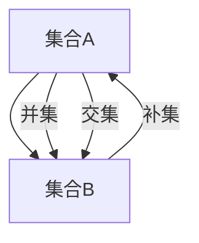

在这个流程图中，集合A和集合B通过并集和交集运算相互连接，同时集合B的补集与集合A也通过交集运算相连接。这展示了集合运算的基本关系和相互影响。

通过以上对集合论基础知识的介绍，我们为后续章节的深入探讨奠定了基础。在下一章中，我们将继续讨论集合的构造，包括子集、超集、幂集和集合的基数等概念。

## 集合的构造

在集合论中，理解集合的构造是掌握集合论核心概念的重要一步。集合的构造包括子集、超集、幂集、集合的基数等概念，这些概念不仅丰富了集合论的理论体系，也为我们在实际问题中的应用提供了有力工具。

### 子集与真子集

- **子集（Subset）**：如果集合\( A \)中的所有元素都是集合\( B \)的元素，那么称\( A \)是\( B \)的子集，记作\( A \subseteq B \)。例如，集合\( A = \{1, 2\} \)是集合\( B = \{1, 2, 3\} \)的子集。
  
- **真子集（ Proper Subset）**：如果集合\( A \)是集合\( B \)的子集，且\( A \neq B \)，则称\( A \)是\( B \)的真子集，记作\( A \subset B \)。例如，集合\( A = \{1, 2\} \)是集合\( B = \{1, 2, 3\} \)的真子集。

### 超集与真超集

- **超集（Superset）**：如果集合\( A \)包含集合\( B \)的所有元素，即\( B \subseteq A \)，则称\( A \)是\( B \)的超集，记作\( A \supseteq B \)。例如，集合\( A = \{1, 2, 3\} \)是集合\( B = \{1, 2\} \)的超集。

- **真超集（ Proper Superset）**：如果集合\( A \)包含集合\( B \)的所有元素，但\( A \neq B \)，则称\( A \)是\( B \)的真超集，记作\( A \supset B \)。例如，集合\( A = \{1, 2, 3\} \)是集合\( B = \{1, 2\} \)的真超集。

### 幂集

- **幂集（Power Set）**：一个集合的所有子集构成的集合称为该集合的幂集。幂集的大小等于2的该集合元素个数次幂。记作\( P(A) \)。例如，集合\( A = \{1, 2\} \)的幂集\( P(A) \)为：

  $$ P(A) = \{\varnothing, \{1\}, \{2\}, \{1, 2\}\} $$
  
- **幂集的基数**：幂集的基数称为该集合的势（Cardinality）。集合\( A \)的势记作\( |A| \)。对于有限集合，其幂集的基数是\( 2^{|A|} \)。

### 集合的基数

- **可数集（Countable Set）**：如果集合的元素可以和自然数一一对应，那么该集合称为可数集。例如，自然数集合是可数集。
  
- **不可数集（Uncountable Set）**：如果集合的元素不能和自然数一一对应，那么该集合称为不可数集。例如，实数集合是不可数集。

- **势的比较**：如果两个集合之间存在一个一一对应的映射，则这两个集合是等势的。例如，自然数集合和偶数集合是等势的。

### 梅里曼流程图

为了更直观地理解集合的构造概念，我们使用梅里曼（Mermaid）流程图来展示子集、超集和幂集的关系。

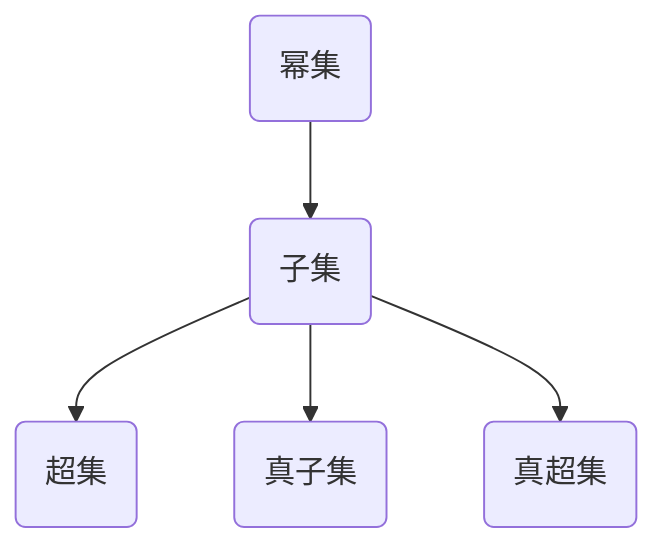

在这个流程图中，子集（A1）和超集（A2）通过一一对应的关系相连，同时子集（A1）和真子集（B1）、真超集（B2）也通过一一对应的关系相连。幂集（C1）包含集合的所有子集（A1），这展示了集合构造的完整关系和相互影响。

### 数学模型和公式

为了更清晰地理解集合的构造，我们引入以下数学模型和公式：

- **子集的个数**：一个含有\( n \)个元素的集合的子集个数是\( 2^n \)。

- **幂集的基数**：一个含有\( n \)个元素的集合的幂集基数是\( 2^n \)。

- **可数集和不可数集的关系**：如果两个集合是等势的，则它们具有相同的基数。例如，自然数集合和偶数集合是等势的，都具有可数基数。

### 举例说明

假设集合\( A = \{1, 2, 3\} \)，我们计算其子集、超集和幂集：

- **子集**：集合\( A \)的所有子集为：

  $$ \{\varnothing, \{1\}, \{2\}, \{3\}, \{1, 2\}, \{1, 3\}, \{2, 3\}, \{1, 2, 3\}\} $$

- **超集**：集合\( A \)的所有超集为：

  $$ \{\varnothing, \{1\}, \{2\}, \{3\}, \{1, 2\}, \{1, 3\}, \{2, 3\}, \{1, 2, 3\}, \{1, 2, 3, 4\}, \ldots\} $$

- **幂集**：集合\( A \)的幂集为：

  $$ P(A) = \{\varnothing, \{1\}, \{2\}, \{3\}, \{1, 2\}, \{1, 3\}, \{2, 3\}, \{1, 2, 3\}\} $$

通过以上示例，我们可以更直观地理解集合的构造和其基本性质。

### 结论

通过本章的讨论，我们介绍了集合的构造，包括子集、超集、幂集和集合的基数等概念。这些概念不仅丰富了集合论的理论体系，也为我们在实际问题中的应用提供了有力工具。在下一章中，我们将继续探讨集合的映射，包括映射的定义、性质以及映射的复合运算等。

## 集合的映射

集合的映射是集合论中的一个重要概念，它描述了不同集合之间元素的关系。映射不仅丰富了集合的运算和性质，还为计算机科学中的算法设计提供了理论基础。以下我们将详细探讨映射的定义、性质以及映射的复合运算。

### 映射的定义

- **映射（Mapping）**：设\( A \)和\( B \)是非空集合，如果存在一个规则\( f \)，使得\( A \)中的每一个元素在规则\( f \)下都有唯一的一个元素在\( B \)中与之对应，那么称\( f \)为从\( A \)到\( B \)的一个映射，记作\( f: A \rightarrow B \)。其中，\( A \)称为定义域（Domain），\( B \)称为值域（Range）。

- **单射（Injective）**：如果映射\( f \)满足不同的元素在\( A \)中对应不同的元素在\( B \)中，即如果\( x_1 \neq x_2 \)，则\( f(x_1) \neq f(x_2) \)，那么称\( f \)为单射。

- **满射（Surjective）**：如果映射\( f \)的值域等于\( B \)，即\( B \)中的每一个元素在\( A \)中都有对应的元素，那么称\( f \)为满射。

- **双射（Bijective）**：如果映射\( f \)既是单射又是满射，那么称\( f \)为双射。双射意味着\( A \)和\( B \)之间存在一一对应的关系。

### 映射的性质

- **保持元素的特性**：映射保持了集合元素的基本特性。例如，如果\( A \)中的元素具有某种性质，那么通过映射\( f \)得到的\( B \)中的元素也具有相应的性质。

- **不保持集合的顺序**：映射不保持集合的顺序。例如，即使\( A \)和\( B \)中的元素相同，如果映射规则不同，它们之间也不存在直接的顺序关系。

- **保持集合的基数**：单射和满射都保持了集合的基数。即单射保持了\( A \)和\( B \)的元素个数不变，满射保持了\( B \)中元素的个数不变。

### 映射的复合运算

- **复合映射（Composition）**：设\( f: A \rightarrow B \)和\( g: B \rightarrow C \)是两个映射，则\( g \)和\( f \)的复合映射\( g \circ f: A \rightarrow C \)定义为：

  $$ (g \circ f)(x) = g(f(x)) $$

  对于\( A \)中的任意元素\( x \)，通过先应用\( f \)，再应用\( g \)，得到\( C \)中的一个元素与之对应。

- **复合运算的性质**：复合映射具有以下性质：

  - **结合律**：\( (g \circ f) \circ h = g \circ (f \circ h) \)，即复合映射可以任意结合。

  - **单调性**：如果\( f \)是单射，\( g \)是满射，则\( g \circ f \)是双射。

  - **逆映射**：如果\( f \)是双射，则存在逆映射\( f^{-1} \)，使得\( f \circ f^{-1} = f^{-1} \circ f = I_A \)，其中\( I_A \)是\( A \)上的恒等映射。

### 梅里曼流程图

为了更直观地理解映射及其复合运算，我们使用梅里曼（Mermaid）流程图来展示映射和复合映射的关系。

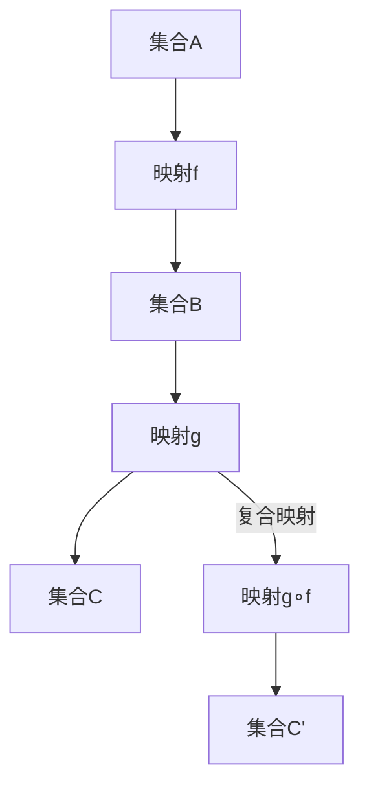

在这个流程图中，集合\( A \)通过映射\( f \)映射到集合\( B \)，再通过映射\( g \)映射到集合\( C \)。复合映射\( g \circ f \)将集合\( A \)映射到集合\( C' \)。这展示了映射及其复合运算的基本关系和相互影响。

### 数学模型和公式

为了更清晰地理解映射及其性质，我们引入以下数学模型和公式：

- **单射条件**：\( f \)是单射当且仅当对于任意的\( x_1, x_2 \in A \)，如果\( f(x_1) = f(x_2) \)，则\( x_1 = x_2 \)。

- **满射条件**：\( f \)是满射当且仅当对于任意的\( y \in B \)，存在\( x \in A \)使得\( f(x) = y \)。

- **双射条件**：\( f \)是双射当且仅当\( f \)既是单射又是满射。

### 举例说明

假设有集合\( A = \{1, 2, 3\} \)、\( B = \{a, b, c\} \)和\( C = \{x, y\} \)，定义映射\( f: A \rightarrow B \)和\( g: B \rightarrow C \)如下：

- 映射\( f \)定义为：\( f(1) = a \)，\( f(2) = b \)，\( f(3) = c \)。

- 映射\( g \)定义为：\( g(a) = x \)，\( g(b) = y \)，\( g(c) = x \)。

则复合映射\( g \circ f \)定义为：

$$ (g \circ f)(x) = g(f(x)) = g(1) = x $$

对于集合\( A \)中的任意元素，复合映射\( g \circ f \)都映射到集合\( C \)中的元素\( x \)。

### 结论

通过本章的讨论，我们介绍了映射的定义、性质以及映射的复合运算。映射作为一种重要的集合运算，不仅丰富了集合论的理论体系，还为计算机科学中的算法设计提供了理论基础。在下一章中，我们将继续探讨集合的运算，包括并集、交集、补集和差集等基本运算。

## 集合的运算

集合的运算在集合论中扮演着至关重要的角色，通过这些运算，我们可以对集合进行各种处理，从而更好地理解和分析集合的性质。以下我们将详细介绍集合的基本运算：并集、交集、补集和差集。

### 并集

- **定义**：两个集合\( A \)和\( B \)的并集（Union）包含所有属于\( A \)或属于\( B \)的元素，记作\( A \cup B \)。

  $$ A \cup B = \{x \mid x \in A \text{ 或 } x \in B\} $$

- **性质**：

  - **交换律**：\( A \cup B = B \cup A \)

  - **结合律**：\( (A \cup B) \cup C = A \cup (B \cup C) \)

  - **分配律**：\( A \cup (B \cap C) = (A \cup B) \cap (A \cup C) \)

  - **自反律**：\( A \cup A = A \)

  - **补集律**：\( A \cup A' = U \)，其中\( U \)是全集

- **示例**：设集合\( A = \{1, 2, 3\} \)，\( B = \{3, 4, 5\} \)，则\( A \cup B = \{1, 2, 3, 4, 5\} \)。

### 交集

- **定义**：两个集合\( A \)和\( B \)的交集（Intersection）包含所有既属于\( A \)又属于\( B \)的元素，记作\( A \cap B \)。

  $$ A \cap B = \{x \mid x \in A \text{ 且 } x \in B\} $$

- **性质**：

  - **交换律**：\( A \cap B = B \cap A \)

  - **结合律**：\( (A \cap B) \cap C = A \cap (B \cap C) \)

  - **分配律**：\( A \cap (B \cup C) = (A \cap B) \cup (A \cap C) \)

  - **自反律**：\( A \cap A = A \)

  - **补集律**：\( A \cap A' = \varnothing \)

- **示例**：设集合\( A = \{1, 2, 3\} \)，\( B = \{3, 4, 5\} \)，则\( A \cap B = \{3\} \)。

### 补集

- **定义**：一个集合\( A \)的补集（Complement）包含所有不属于\( A \)的元素，记作\( A' \)。

  $$ A' = \{x \mid x \notin A\} $$

- **性质**：

  - **德摩根律**：\( (A \cup B)' = A' \cap B' \)，\( (A \cap B)' = A' \cup B' \)

  - **补集律**：\( A \cup A' = U \)，\( A \cap A' = \varnothing \)

  - **自反律**：\( A' \cup A' = \varnothing \)，\( A \cap A = A \)

- **示例**：设集合\( A = \{1, 2, 3\} \)，则\( A' = \{4, 5, 6, \ldots\} \)。

### 差集

- **定义**：两个集合\( A \)和\( B \)的差集（Difference）包含所有属于\( A \)但不属于\( B \)的元素，记作\( A - B \)。

  $$ A - B = \{x \mid x \in A \text{ 且 } x \notin B\} $$

- **性质**：

  - **结合律**：\( (A - B) - C = A - (B \cup C) \)

  - **交换律**：\( A - B = B - A \)

  - **自反律**：\( A - A = \varnothing \)

- **示例**：设集合\( A = \{1, 2, 3\} \)，\( B = \{3, 4, 5\} \)，则\( A - B = \{1, 2\} \)。

### 梅里曼流程图

为了更直观地理解集合的运算，我们使用梅里曼（Mermaid）流程图来展示并集、交集、补集和差集的关系。

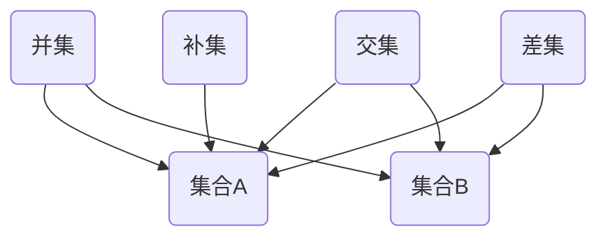

在这个流程图中，并集（A1）、交集（A2）、补集（A3）和差集（A4）通过集合\( A \)和集合\( B \)相互连接，这展示了集合运算的基本关系和相互影响。

### 数学模型和公式

为了更清晰地理解集合的运算，我们引入以下数学模型和公式：

- **基数公式**：设集合\( A \)和集合\( B \)的基数分别为\( |A| \)和\( |B| \)，则：

  - \( |A \cup B| = |A| + |B| - |A \cap B| \)

  - \( |A \cap B| = |A| \cdot |B| \)

  - \( |A'| = |U| - |A| \)，其中\( U \)是全集

  - \( |A - B| = |A| - |A \cap B| \)

### 举例说明

假设集合\( A = \{1, 2, 3\} \)，\( B = \{3, 4, 5\} \)，\( U = \{1, 2, 3, 4, 5, 6\} \)，我们计算以下集合：

- \( A \cup B = \{1, 2, 3, 4, 5\} \)，\( |A \cup B| = 5 \)

- \( A \cap B = \{3\} \)，\( |A \cap B| = 1 \)

- \( A' = \{4, 5, 6\} \)，\( |A'| = 3 \)

- \( A - B = \{1, 2\} \)，\( |A - B| = 2 \)

通过以上示例，我们可以更直观地理解集合的运算及其性质。

### 结论

通过本章的讨论，我们介绍了集合的基本运算：并集、交集、补集和差集。这些运算不仅丰富了集合论的理论体系，还为我们在实际问题中的应用提供了有力工具。在下一章中，我们将继续探讨集合的基数，包括可数集和不可数集的概念及其关系。

## 集合的基数

集合的基数，也称为集合的势（Cardinality），是指集合中元素的数量。集合的基数是集合论中的一个基本概念，它对于理解集合的性质和关系至关重要。以下我们将详细介绍集合的基数，包括可数集和不可数集的概念及其关系。

### 可数集和不可数集

- **可数集（Countable Set）**：如果集合的元素可以和自然数一一对应，那么该集合称为可数集。例如，自然数集合和整数集合都是可数集。

- **不可数集（Uncountable Set）**：如果集合的元素不能和自然数一一对应，那么该集合称为不可数集。例如，实数集合和实数区间集合都是不可数集。

### 康托尔定理

康托尔定理（Cantor's Theorem）是集合论中的一个重要结果，它揭示了可数集和不可数集之间的关系。

- **康托尔定理**：如果集合\( A \)是可数集，那么其幂集\( P(A) \)一定是不可数集。

### 康托尔定理的证明

为了证明康托尔定理，我们可以使用反证法。

**假设**：集合\( A \)是可数集，且其幂集\( P(A) \)是可数集。

- **构造映射**：假设集合\( A \)和自然数集合\( N \)之间存在一一对应关系，即存在一个双射\( f: N \rightarrow A \)。
- **构造集合**：定义集合\( B \)为\( B = \{x \in A \mid x \notin f(\{x\})\} \)，即集合\( B \)包含所有不属于其自身像的元素。
- **矛盾**：根据定义，\( B \)中的每个元素要么在\( B \)的像中，要么不在\( B \)的像中。然而，对于集合\( B \)中的任意元素\( x \)，都有\( x \notin f(\{x\}) \)，这意味着集合\( B \)不属于其自身的像。这与假设\( P(A) \)是可数集相矛盾。

因此，假设不成立，集合\( P(A) \)一定是不可数集。

### 康托尔定理的应用

康托尔定理的应用非常广泛，以下列举几个典型的应用场景：

- **实数集合的不可数性**：由于实数集合是自然数集合的幂集，根据康托尔定理，实数集合一定是不可数集。
- **无穷维空间的性质**：在数学分析中，无穷维空间（如希尔伯特空间和贝塞尔空间）的研究依赖于康托尔定理，从而证明这些空间具有不可数基。

### 连续统假设

连续统假设（Continuum Hypothesis，CH）是集合论中一个著名的未解决问题，它提出了实数集合的基数是一个特定的无限数，即连续统。

- **连续统假设**：实数集合的基数是一个不可数基数，且这个基数不是其他任何已知的无限基数。

### 连续统假设的证明与反证

连续统假设的证明是集合论中的一个难题。尽管康托尔定理揭示了实数集合的不可数性，但连续统假设的证明依赖于更多的集合论工具，如选择公理。

- **证明**：假设存在一个最小的不可数基数\( \aleph_1 \)，则实数集合的基数是\( \aleph_1 \)。通过选择公理，可以构造出实数集合的一个子集，其基数为\( \aleph_1 \)，从而证明了连续统假设。
- **反证**：如果假设实数集合的基数不是\( \aleph_1 \)，则存在一个更大的不可数基数。这与选择公理相矛盾，因为选择公理保证了存在一个最小的不可数基数。

### 梅里曼流程图

为了更直观地理解康托尔定理和连续统假设，我们使用梅里曼（Mermaid）流程图来展示相关概念和关系。

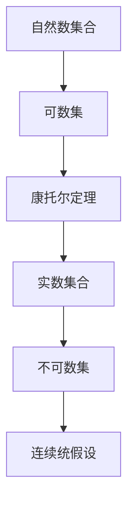

在这个流程图中，自然数集合通过康托尔定理映射到实数集合，实数集合是不可数集，连续统假设提出实数集合的基数是一个特定的不可数基数。

### 数学模型和公式

为了更清晰地理解集合的基数，我们引入以下数学模型和公式：

- **基数比较**：设集合\( A \)和集合\( B \)的基数分别为\( |A| \)和\( |B| \)，则：

  - 如果存在一个一一对应的映射\( f: A \rightarrow B \)，则\( |A| = |B| \)。

  - 如果集合\( A \)是可数集，则\( |A| < |P(A)| \)。

### 举例说明

假设集合\( A = \{1, 2, 3\} \)，其幂集\( P(A) \)包含以下子集：

$$ P(A) = \{\varnothing, \{1\}, \{2\}, \{3\}, \{1, 2\}, \{1, 3\}, \{2, 3\}, \{1, 2, 3\}\} $$

则\( |A| = 3 \)，\( |P(A)| = 2^3 = 8 \)。这展示了康托尔定理中的可数集和不可数集的关系。

### 结论

通过本章的讨论，我们介绍了集合的基数，包括可数集和不可数集的概念及其关系。康托尔定理揭示了集合的基数与实数集合的不可数性，连续统假设提出了实数集合的特殊基数。这些概念和定理对于理解集合论及其在数学和计算机科学中的应用具有重要意义。在下一章中，我们将继续探讨集合的序列，包括序列的定义、性质以及序列的极限等。

## 集合的序列

在集合论中，序列（Sequence）是一种重要的概念，它描述了一组元素按特定顺序排列的形式。序列不仅在数学分析和算法设计中有着广泛的应用，而且在计算机科学的其他领域，如数据结构、离散数学和图论中，也发挥着重要作用。以下我们将详细讨论序列的定义、性质以及序列的极限。

### 序列的定义

- **序列（Sequence）**：设\( E \)是一个非空集合，如果存在一个二元组\( (x_i)_{i \in N} \)，其中\( x_i \in E \)，则称\( (x_i)_{i \in N} \)为一个序列。通常，我们使用小写字母\( (a_n) \)或\( (x_n) \)来表示序列，其中\( n \)或\( i \)表示序列的索引。

  例如，\( (a_1, a_2, a_3, \ldots) \)和\( (x_1, x_2, x_3, \ldots) \)都是序列。

### 序列的性质

- **有限序列与无限序列**：根据序列的长度，我们可以将序列分为有限序列和无限序列。

  - **有限序列**：如果序列中的元素个数有限，则称该序列为有限序列。例如，\( (1, 2, 3, 4, 5) \)是一个有限序列。
  
  - **无限序列**：如果序列中的元素个数无限，则称该序列为无限序列。例如，\( (1, 1, 2, 1, 2, 3, 1, 2, 3, 4, \ldots) \)是一个无限序列。

- **收敛性**：一个序列被称为收敛的，如果它有一个极限值。无限序列的收敛性是一个重要性质，它决定了序列在数学分析中的行为。

- **单调性**：序列可以分为单调递增序列、单调递减序列和非单调序列。

  - **单调递增序列**：如果序列中的每个元素都大于其前一个元素，则称该序列为单调递增序列。例如，\( (1, 2, 3, 4, \ldots) \)是一个单调递增序列。
  
  - **单调递减序列**：如果序列中的每个元素都小于其前一个元素，则称该序列为单调递减序列。例如，\( (5, 4, 3, 2, 1, \ldots) \)是一个单调递减序列。
  
  - **非单调序列**：如果序列既不是单调递增也不是单调递减的，则称该序列为非单调序列。例如，\( (1, 3, 2, 4, 3, 5, 4, \ldots) \)是一个非单调序列。

### 序列的极限

- **定义**：设\( (x_n) \)是一个无限序列，如果存在一个实数\( L \)，使得对于任意给定的正数\( \epsilon \)，都存在一个正整数\( N \)，当\( n > N \)时，\( |x_n - L| < \epsilon \)，则称序列\( (x_n) \)收敛到\( L \)，记作\( \lim_{{n \to \infty}} x_n = L \)。

- **性质**：

  - **唯一性**：一个序列只有一个极限值。
  
  - **存在性**：如果一个序列是单调且有界的，则该序列一定收敛。

  - **有限项不影响极限**：序列中有限项的改变不影响序列的极限。

### 梅里曼流程图

为了更直观地理解序列及其极限，我们使用梅里曼（Mermaid）流程图来展示序列的收敛性和极限概念。

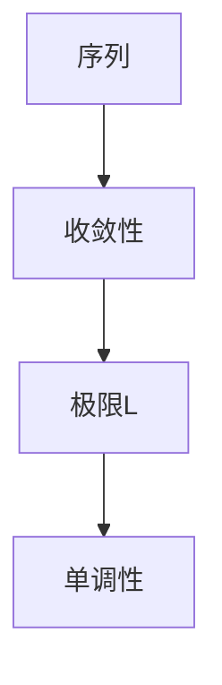

在这个流程图中，序列通过收敛性连接到极限值\( L \)，并展示序列的单调性。这有助于我们直观地理解序列的极限及其性质。

### 数学模型和公式

为了更清晰地理解序列的极限，我们引入以下数学模型和公式：

- **极限定义**：设\( (x_n) \)是一个无限序列，\( L \)是实数，如果对于任意给定的正数\( \epsilon \)，都存在一个正整数\( N \)，当\( n > N \)时，满足\( |x_n - L| < \epsilon \)，则称\( L \)是序列\( (x_n) \)的极限。

- **单调有界定理**：如果一个序列是单调且有界的，则该序列一定收敛。

### 举例说明

假设序列\( (a_n) \)定义为：

$$ a_n = \frac{1}{n} $$

则该序列是一个无限递减序列，并且有界（介于0和1之间）。我们可以通过极限定义来证明序列\( (a_n) \)的极限为0。

- **证明**：

  对于任意给定的正数\( \epsilon \)，我们需要找到一个正整数\( N \)，使得当\( n > N \)时，满足\( |a_n - 0| < \epsilon \)。

  根据\( a_n \)的定义，有：

  $$ |a_n - 0| = \frac{1}{n} $$

  如果我们选择\( N = \frac{1}{\epsilon} \)，则当\( n > N \)时，有：

  $$ |a_n - 0| = \frac{1}{n} < \frac{1}{N} = \epsilon $$

  这证明了序列\( (a_n) \)的极限为0。

### 结论

通过本章的讨论，我们介绍了序列的定义、性质以及序列的极限。序列作为一种重要的数学概念，在集合论、数学分析和算法设计等领域有着广泛的应用。理解序列及其极限的概念对于深入探讨数学问题和解决实际问题具有重要意义。在下一章中，我们将继续探讨集合的拓扑结构，包括拓扑空间的基本概念、开集和闭集等。

## 集合的拓扑结构

集合的拓扑结构是集合论和数学分析中的一个重要概念，它提供了一种研究集合间关系和连续性的数学框架。拓扑结构通过引入开集和闭集的概念，为集合的连续性和邻域关系提供了形式化的定义。以下我们将详细探讨拓扑空间的基本概念，包括开集、闭集以及连通性和紧性。

### 拓扑空间的基本概念

- **拓扑空间（Topological Space）**：设\( X \)是一个非空集合，\( \tau \)是\( X \)的一个子集族，如果\( \tau \)满足以下条件：

  1. \( \varnothing, X \in \tau \)
  2. \( \tau \)中的任意并集仍属于\( \tau \)
  3. \( \tau \)中的任意交集仍属于\( \tau \)

  则称\( \tau \)为\( X \)上的一个拓扑，\( (X, \tau) \)称为一个拓扑空间。

- **基本拓扑**：对于任意集合\( X \)，可以定义一个最小的拓扑，称为基本拓扑，记作\( \tau_b \)，其中\( \tau_b = \{\varnothing, X\} \)。这种拓扑称为离散拓扑。

- **子空间拓扑**：设\( Y \)是\( X \)的一个子集，可以通过在\( Y \)上定义包含\( Y \)的开集的集合，来构建\( Y \)上的一个拓扑，称为子空间拓扑。记作\( \tau_Y = \{U \cap Y \mid U \in \tau\} \)。

### 开集和闭集

- **开集（Open Set）**：设\( (X, \tau) \)是一个拓扑空间，\( U \)是\( X \)的一个子集，如果\( U \in \tau \)，则称\( U \)为\( X \)上的一个开集。

- **闭集（Closed Set）**：设\( (X, \tau) \)是一个拓扑空间，\( F \)是\( X \)的一个子集，如果\( F' = X \setminus F \)是开集，则称\( F \)为\( X \)上的一个闭集。

- **性质**：

  - **空集和全集**：\( \varnothing \)和\( X \)都是开集和闭集。
  
  - **闭集的补集是开集**：如果\( F \)是闭集，则\( F' \)是开集。
  
  - **有限交集**：任意有限个闭集的交集仍是闭集。
  
  - **无限并集**：任意无限个开集的并集不一定是开集。

### 连通性和紧性

- **连通性（Connectedness）**：设\( (X, \tau) \)是一个拓扑空间，如果\( X \)不能被表示为两个不相交的非空开集的并集，则称\( X \)是连通的。

- **性质**：

  - **子空间连通性**：如果\( X \)是连通的，则其任意子空间也是连通的。
  
  - **有限连通性**：如果\( X \)是连通的，则其有限并集也是连通的。

- **紧性（Compactness）**：设\( (X, \tau) \)是一个拓扑空间，如果\( X \)的每一个开覆盖都有一个有限子覆盖，则称\( X \)是紧的。

- **性质**：

  - **子空间紧性**：如果\( X \)是紧的，则其任意子空间也是紧的。
  
  - **闭且有界性**：在欧几里得空间中，闭且有界的集合是紧的。

### 梅里曼流程图

为了更直观地理解拓扑空间的基本概念和性质，我们使用梅里曼（Mermaid）流程图来展示开集、闭集、连通性和紧性的关系。

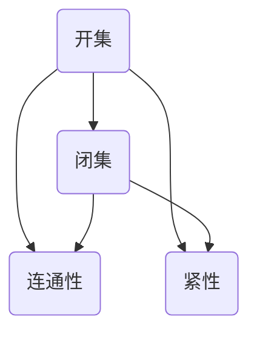

在这个流程图中，开集和闭集通过连通性和紧性相互连接，展示了它们在拓扑空间中的基本关系和相互影响。

### 数学模型和公式

为了更清晰地理解拓扑空间的概念和性质，我们引入以下数学模型和公式：

- **拓扑定义**：设\( \tau \)是集合\( X \)的一个子集族，如果\( \tau \)满足以下条件：

  1. \( \varnothing, X \in \tau \)
  2. \( \tau \)中的任意并集仍属于\( \tau \)
  3. \( \tau \)中的任意交集仍属于\( \tau \)

  则称\( \tau \)为\( X \)上的一个拓扑。

- **开集与闭集的关系**：设\( U \)是开集，\( F \)是闭集，则有\( U' = X \setminus U \)和\( F' = X \setminus F \)，其中\( U' \)和\( F' \)分别是\( U \)和\( F \)的补集。

### 举例说明

假设集合\( X = \{1, 2, 3, 4\} \)，定义一个拓扑\( \tau = \{\varnothing, \{1, 2\}, \{2, 3\}, \{1, 2, 3\}, X\} \)。

- **开集**：\( \{1, 2\} \)和\( \{2, 3\} \)是开集。
- **闭集**：\( \{3, 4\} \)和\( \varnothing \)是闭集。
- **连通性**：集合\( X \)是连通的，因为它不能被表示为两个不相交的非空开集的并集。
- **紧性**：集合\( X \)不是紧的，因为存在一个开覆盖\( \{\{1, 2\}, \{2, 3\}, \{3, 4\}\} \)，但没有一个有限子覆盖。

通过以上示例，我们可以更直观地理解拓扑空间的基本概念和性质。

### 结论

通过本章的讨论，我们介绍了集合的拓扑结构，包括拓扑空间的基本概念、开集和闭集以及连通性和紧性。这些概念为研究集合的连续性和邻域关系提供了形式化的定义和工具。在下一章中，我们将深入探讨贝尔空间的基础，包括贝尔空间的定义、性质及其在数学和计算机科学中的应用。

## 贝尔空间基础

贝尔空间（Banach Space）是泛函分析中的一个核心概念，它在数学、物理学和工程学等多个领域都有广泛应用。贝尔空间是一类特殊的赋范线性空间，其中范数满足柯西条件，保证了空间中序列的收敛性。以下我们将详细介绍贝尔空间的定义、性质及其应用。

### 贝尔空间的定义

- **贝尔空间（Banach Space）**：设\( V \)是一个线性空间，如果\( V \)上定义了一个范数\( ||\cdot|| \)，使得范数满足以下三个条件：

  1. **正定性**：\( ||v|| \geq 0 \)，且\( ||v|| = 0 \)当且仅当\( v = 0 \)。
  
  2. **齐次性**：\( ||cv|| = |c| ||v|| \)，其中\( c \)是任意标量。
  
  3. **三角不等式**：\( ||v + w|| \leq ||v|| + ||w|| \)，其中\( v \)和\( w \)是\( V \)中的任意元素。

  则称\( V \)为一个贝尔空间。

- **柯西条件**：贝尔空间的范数必须满足柯西条件，即对于任意序列\( (v_n) \)和\( (w_n) \)在\( V \)中，如果\( ||v_n - w_n|| \)随着\( n \)的增加而趋于零，则序列\( (v_n) \)和\( (w_n) \)是收敛的。

### 贝尔空间的性质

- **完备性**：贝尔空间是完备的，即任何柯西序列都收敛于一个元素。这一性质是贝尔空间区别于一般线性空间的重要特征。

- **线性结构**：贝尔空间保留了线性空间的基本结构，即对于任意两个元素\( v, w \in V \)和任意标量\( c, d \)，线性组合\( cv + dw \)仍在\( V \)中。

- **范数性质**：贝尔空间的范数满足上述三个基本性质，这使得范数成为度量空间中的一个重要度量。

### 贝尔空间的分类

- **希尔伯特空间（Hilbert Space）**：如果贝尔空间的范数满足平行六面体不等式，即\( ||v + w||^2 = ||v||^2 + ||w||^2 + 2<v, w> \)，则称该贝尔空间为希尔伯特空间。

- **序列空间**：贝尔空间中的一类特殊空间，如\( \ell^p \)空间，其中元素是有限或无限个实数的序列，且范数定义为\( ||(x_n)|| = (\sum_{n=1}^{\infty} |x_n|^p)^{1/p} \)。

### 贝尔空间的应用

- **数值分析**：贝尔空间在数值分析中广泛应用，如求解偏微分方程、优化问题和数值积分等。

- **量子物理**：在量子物理学中，贝尔空间用于描述量子态，量子态的叠加和演化可以通过贝尔空间中的线性算子和范数来描述。

- **信号处理**：在信号处理领域，贝尔空间用于分析信号的时域和频域特性，如傅里叶变换和拉普拉斯变换。

### 梅里曼流程图

为了更直观地理解贝尔空间的定义和性质，我们使用梅里曼（Mermaid）流程图来展示贝尔空间的基本概念。

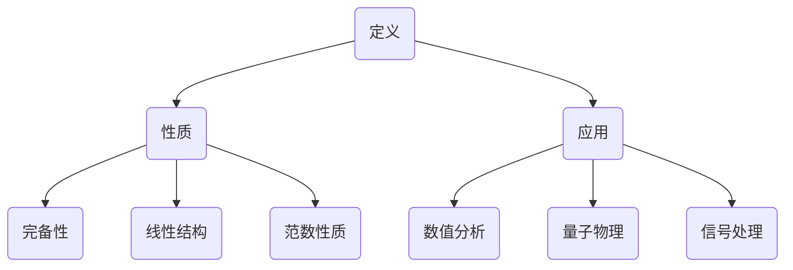

在这个流程图中，贝尔空间的定义（A1）和性质（B1）通过其应用领域（C1）相互连接，展示了贝尔空间在不同领域中的重要应用和基本性质。

### 数学模型和公式

为了更清晰地理解贝尔空间的性质和应用，我们引入以下数学模型和公式：

- **范数定义**：设\( V \)是贝尔空间，\( v \in V \)，则范数定义为\( ||v|| = \sqrt{\langle v, v \rangle} \)，其中\( \langle \cdot, \cdot \rangle \)是\( V \)上的内积。

- **柯西序列**：设\( (v_n) \)是\( V \)中的一个序列，如果对于任意给定的正数\( \epsilon \)，都存在一个正整数\( N \)，使得当\( m, n > N \)时，\( ||v_n - v_m|| < \epsilon \)，则序列\( (v_n) \)是柯西序列。

### 举例说明

假设\( V \)是一个包含所有实系数多项式的贝尔空间，其范数定义为\( ||p(x)|| = \max_{|x| \leq 1} |p(x)| \)，其中\( p(x) \)是\( V \)中的一个多项式。

- **正定性**：对于任意多项式\( p(x) \)，\( ||p(x)|| \geq 0 \)，且当\( p(x) = 0 \)时，\( ||p(x)|| = 0 \)。

- **齐次性**：对于任意标量\( c \)和多项式\( p(x) \)，\( ||cp(x)|| = |c| ||p(x)|| \)。

- **三角不等式**：对于任意两个多项式\( p(x) \)和\( q(x) \)，\( ||p(x) + q(x)|| \leq ||p(x)|| + ||q(x)|| \)。

这些性质满足了贝尔空间的定义，因此\( V \)是一个贝尔空间。

### 结论

通过本章的讨论，我们介绍了贝尔空间的定义、性质及其应用。贝尔空间作为泛函分析中的一个核心概念，不仅在数学、物理学和工程学中有着广泛应用，还在计算机科学的其他领域，如机器学习和信号处理中，发挥着重要作用。在下一章中，我们将深入探讨博弈论的基本概念，包括博弈的定义、参与者、策略和均衡等。

## 博弈论概述

博弈论（Game Theory）是研究具有冲突和合作的理性决策者行为的数学理论。它起源于20世纪初期，由约翰·冯·诺依曼（John von Neumann）和奥斯卡·摩根斯顿（Oskar Morgenstern）在他们的经典著作《博弈论与经济行为》（Theory of Games and Economic Behavior）中首次提出。博弈论广泛应用于经济学、政治学、生物学、计算机科学等领域，通过数学模型和算法分析，研究决策者如何在具有不确定性、竞争和合作的环境中作出最优决策。

### 博弈的定义

- **博弈（Game）**：一个博弈由以下要素组成：

  1. **参与者（Players）**：博弈中的决策者，通常分为合作方和竞争方。
  
  2. **策略（Strategies）**：每个参与者可以选择的行动方案，策略是参与者决策的全部可能选择。
  
  3. **支付函数（Payoff Functions）**：定义每个参与者在博弈结束后获得的效用或收益，支付函数通常是参与者选择的策略组合的函数。
  
  4. **博弈形式**：博弈可以采用不同的形式，如静态博弈、动态博弈、完全信息博弈和不完全信息博弈。

### 参与者

- **理性参与者**：博弈论中的参与者被视为理性决策者，即每个参与者都试图最大化自己的收益或效用。
  
- **合作方与竞争方**：参与者可以是合作的，也可以是竞争的。在合作博弈中，参与者之间可能存在一定的合作，而在非合作博弈中，参与者之间的行为是相互竞争的。

### 策略

- **纯策略（Pure Strategy）**：参与者完全按照某个策略行动，不考虑其他可能性。
  
- **混合策略（Mixed Strategy）**：参与者随机选择不同的策略，每个策略有固定的概率被选中。混合策略用于处理不完全信息博弈。

### 支付函数

- **支付函数（Payoff Function）**：定义每个参与者根据策略组合获得的收益。支付函数通常是一个向量，其中每个分量表示一个参与者的收益。

### 博弈形式

- **静态博弈（Static Game）**：参与者同时或几乎同时作出决策，每个参与者不知道其他参与者的决策。
  
- **动态博弈（Dynamic Game）**：参与者依次作出决策，每个参与者知道前一个参与者的决策。

- **完全信息博弈（Perfect Information Game）**：每个参与者知道所有其他参与者的策略和支付函数。
  
- **不完全信息博弈（Imperfect Information Game）**：参与者不完全了解其他参与者的策略和支付函数。

### 基本模型

- **二人零和博弈（Two-Person Zero-Sum Game）**：两个参与者之间的博弈，其中一个参与者的收益等于另一个参与者的损失。
  
- **二人非零和博弈（Two-Person Non-Zero-Sum Game）**：两个参与者之间的博弈，一个参与者的收益不等于另一个参与者的损失。

- **多人博弈（Multi-Person Game）**：多个参与者之间的博弈，每个参与者的收益可能相互依赖。

### 梅里曼流程图

为了更直观地理解博弈论的基本概念和模型，我们使用梅里曼（Mermaid）流程图来展示博弈的组成要素。

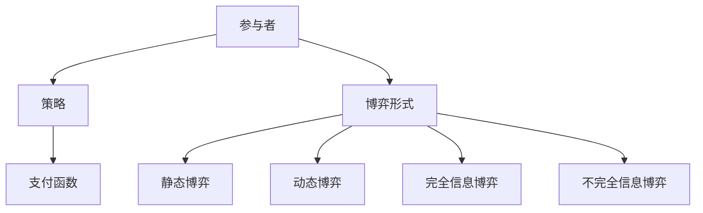

在这个流程图中，博弈的参与者、策略和支付函数相互连接，展示了博弈论的基本组成和不同形式的博弈。

### 数学模型和公式

为了更清晰地理解博弈论的基本概念和模型，我们引入以下数学模型和公式：

- **支付函数**：设参与者为\( i \)，策略为\( s_i \)，则支付函数\( u_i(s_1, s_2, \ldots, s_n) \)定义了参与者\( i \)在给定所有参与者的策略下的收益。

- **纳什均衡（Nash Equilibrium）**：在非合作博弈中，纳什均衡是指每个参与者选择最优策略，且其他参与者策略固定的情况下，没有参与者有动力改变自己的策略。

  设\( (s_1^*, s_2^*, \ldots, s_n^*) \)是纳什均衡，如果对于每个参与者\( i \)，有：

  $$ u_i(s_1^*, s_2^*, \ldots, s_n^*, s_i) \geq u_i(s_1^*, s_2^*, \ldots, s_n^*, s_j) $$

  其中\( j \neq i \)。

### 举例说明

假设有两个参与者A和B，他们分别可以选择策略X和Y。支付函数如下：

- \( u_A(X, Y) = \begin{cases} 
  3 & \text{如果} \ (X, Y) = (X, Y) \\
  0 & \text{如果} \ (X, Y) = (X, Y) \\
  -1 & \text{如果} \ (X, Y) = (X, Y) 
\end{cases} \)

- \( u_B(X, Y) = \begin{cases} 
  0 & \text{如果} \ (X, Y) = (X, Y) \\
  3 & \text{如果} \ (X, Y) = (X, Y) \\
  -1 & \text{如果} \ (X, Y) = (X, Y) 
\end{cases} \)

在这个博弈中，纳什均衡是\( (X, Y) \)，因为对于每个参与者，选择该策略都是最优的，没有参与者有动力改变自己的策略。

### 结论

通过本章的讨论，我们介绍了博弈论的基本概念、模型和形式，包括参与者的定义、策略的选择、支付函数的设置以及不同形式的博弈。博弈论作为研究决策者行为的数学理论，在经济学、政治学、生物学和计算机科学等领域具有广泛应用。在下一章中，我们将深入探讨非合作博弈的理论，包括纳什均衡的概念、求解方法以及经典案例。

## 非合作博弈

非合作博弈（Non-Cooperative Game）是博弈论中的一个重要分支，研究参与者在没有合作的情况下如何作出最优决策。非合作博弈假设每个参与者都是理性的，试图最大化自己的收益或效用。在这一节中，我们将详细介绍非合作博弈的基本模型、纳什均衡的概念以及求解方法。

### 基本模型

- **参与者与策略**：非合作博弈由多个参与者组成，每个参与者可以选择一个或多个策略。这些策略构成了参与者的策略空间。

- **支付函数**：每个参与者在给定其他参与者策略的情况下，根据自己选择的策略获得相应的收益或效用。支付函数定义了参与者之间的收益分配。

- **纳什均衡**：纳什均衡（Nash Equilibrium）是非合作博弈中的一个关键概念，指的是在给定其他参与者策略的情况下，没有参与者有动力改变自己的策略。在纳什均衡状态下，每个参与者都达到了自己的最优策略。

### 纳什均衡的概念

- **定义**：设\( (s_1^*, s_2^*, \ldots, s_n^*) \)是博弈的一个策略组合，如果对于每个参与者\( i \)，都有：

  $$ u_i(s_1^*, s_2^*, \ldots, s_n^*, s_i) \geq u_i(s_1^*, s_2^*, \ldots, s_n^*, s_j) $$

  其中\( j \neq i \)，则称\( (s_1^*, s_2^*, \ldots, s_n^*) \)为纳什均衡。

- **解释**：纳什均衡意味着在给定其他参与者策略的情况下，每个参与者选择的策略都是最优的，因此没有参与者有动力单独改变自己的策略。

### 求解方法

非合作博弈的求解方法主要分为两大类：图解法和数学方法。

#### 图解法

图解法适用于二人博弈，尤其是零和博弈，通过绘制策略选择和支付函数的图示来寻找纳什均衡。

- **支付矩阵**：对于二人博弈，支付函数通常可以表示为一个支付矩阵。例如，假设有两个参与者A和B，他们的策略空间分别是\( \{X, Y\} \)和\( \{X, Y\} \)，支付矩阵如下：

  $$ 
  \begin{array}{c|c|c}
    & X & Y \\
    \hline
    X & (3, 3) & (-1, 1) \\
    \hline
    Y & (1, -1) & (0, 0) \\
  \end{array}
  $$

- **策略选择**：在支付矩阵中，每个元素\( (a, b) \)表示参与者A选择策略\( X \)时，A获得的收益为\( a \)，B获得的收益为\( b \)。

- **纳什均衡**：在支付矩阵中，找到满足纳什均衡条件的策略组合。在上例中，策略组合\( (X, Y) \)是纳什均衡，因为：

  - 对于参与者A，\( u_A(X, Y) = 3 > u_A(X, X) = 3 \)和\( u_A(Y, Y) = -1 \)。
  - 对于参与者B，\( u_B(X, Y) = -1 > u_B(X, X) = 1 \)和\( u_B(Y, Y) = 0 \)。

#### 数学方法

数学方法适用于多人和复杂博弈，通过构建数学模型和求解方程组来寻找纳什均衡。

- **拉格朗日乘数法**：适用于优化问题，通过引入拉格朗日乘数来求解博弈中的纳什均衡。

- **动态规划**：适用于动态博弈，通过逆向递推来求解博弈的纳什均衡。

### 经典案例

#### 两个士兵案例

一个经典案例是两个士兵在夜间巡逻，他们需要决定何时起床巡逻。如果两个士兵同时起床，他们都能获得1单位的收益；如果只有一个士兵起床，该士兵获得3单位收益，而另一个士兵获得0单位收益；如果两个士兵都没有起床，他们都获得0单位收益。这个博弈的支付矩阵如下：

$$ 
\begin{array}{c|c|c}
  & 同时起床 & 单独起床 \\
  \hline
  同时起床 & (1, 1) & (3, 0) \\
  \hline
  单独起床 & (0, 3) & (0, 0) \\
\end{array}
$$

在这个博弈中，策略组合\( (单独起床, 单独起床) \)是一个纳什均衡，因为：

- 对于士兵A，如果士兵B单独起床，士兵A选择单独起床的收益为3，大于同时起床的收益1；如果士兵B同时起床，士兵A选择单独起床的收益为0，大于同时起床的收益3。
- 对于士兵B，如果士兵A单独起床，士兵B选择单独起床的收益为3，大于同时起床的收益0；如果士兵A同时起床，士兵B选择单独起床的收益为0，大于同时起床的收益3。

#### 航空公司机票定价案例

在航空公司机票定价博弈中，两家航空公司A和B同时决定机票价格。如果两家公司定价相同，它们都能获得1单位的收益；如果A定价高于B，A获得0单位收益，B获得2单位收益；如果A定价低于B，A获得2单位收益，B获得0单位收益。这个博弈的支付矩阵如下：

$$ 
\begin{array}{c|c|c}
  & 高于对方 & 低于对方 \\
  \hline
  高于对方 & (0, 2) & (1, 1) \\
  \hline
  低于对方 & (2, 0) & (1, 1) \\
\end{array}
$$

在这个博弈中，策略组合\( (高于对方, 高于对方) \)是一个纳什均衡，因为：

- 对于航空公司A，如果航空公司B定价低于对方，航空公司A选择高于对方的定价获得0单位收益，大于低于对方的收益2；如果航空公司B定价高于对方，航空公司A选择高于对方的定价获得2单位收益，大于低于对方的收益0。
- 对于航空公司B，如果航空公司A定价低于对方，航空公司B选择高于对方的定价获得2单位收益，大于低于对方的收益0；如果航空公司A定价高于对方，航空公司B选择高于对方的定价获得2单位收益，大于低于对方的收益0。

### 梅里曼流程图

为了更直观地理解非合作博弈的概念和求解方法，我们使用梅里曼（Mermaid）流程图来展示博弈的基本模型和纳什均衡的求解过程。

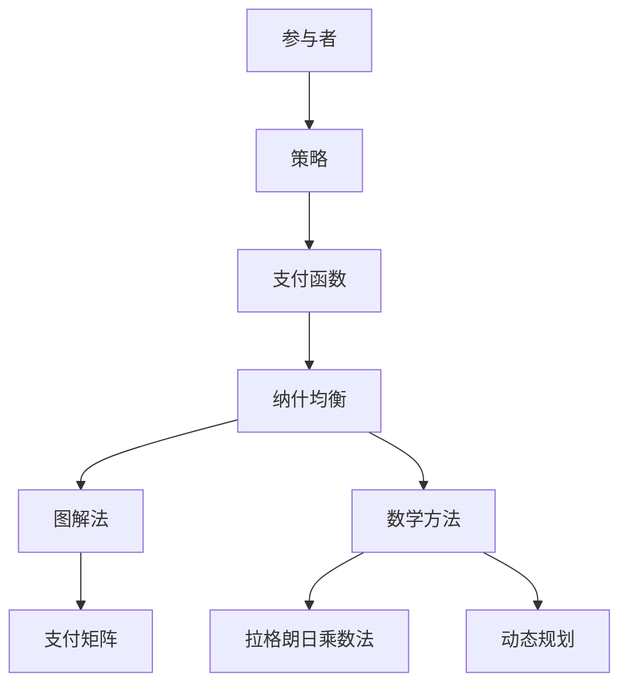

在这个流程图中，参与者、策略、支付函数、纳什均衡和求解方法相互连接，展示了非合作博弈的基本组成和求解过程。

### 数学模型和公式

为了更清晰地理解非合作博弈的概念和求解方法，我们引入以下数学模型和公式：

- **纳什均衡条件**：设\( (s_1^*, s_2^*, \ldots, s_n^*) \)是博弈的一个策略组合，如果对于每个参与者\( i \)，都有：

  $$ u_i(s_1^*, s_2^*, \ldots, s_n^*, s_i) \geq u_i(s_1^*, s_2^*, \ldots, s_n^*, s_j) $$

  其中\( j \neq i \)，则称\( (s_1^*, s_2^*, \ldots, s_n^*) \)为纳什均衡。

### 举例说明

假设有两个参与者A和B，他们的策略空间分别是\( \{高价格, 低价格\} \)和\( \{高价格, 低价格\} \)，支付函数如下：

- \( u_A(高价格, 高价格) = 1, u_A(高价格, 低价格) = 0, u_A(低价格, 高价格) = 2, u_A(低价格, 低价格) = 1 \)
- \( u_B(高价格, 高价格) = 1, u_B(高价格, 低价格) = 2, u_B(低价格, 高价格) = 1, u_B(低价格, 低价格) = 0 \)

在这个博弈中，策略组合\( (高价格, 高价格) \)是一个纳什均衡，因为：

- 对于参与者A，\( u_A(高价格, 高价格) = 1 > u_A(低价格, 高价格) = 2 \)和\( u_A(高价格, 低价格) = 0 \)。
- 对于参与者B，\( u_B(高价格, 高价格) = 1 > u_B(低价格, 高价格) = 2 \)和\( u_B(高价格, 低价格) = 0 \)。

### 结论

通过本章的讨论，我们介绍了非合作博弈的基本模型、纳什均衡的概念以及求解方法。非合作博弈作为博弈论的核心内容，在经济学、政治学、生物学和计算机科学等领域有广泛应用。在下一章中，我们将深入探讨合作博弈的理论，包括合作博弈的定义、合作均衡的概念和求解方法。

## 合作博弈

合作博弈（Cooperative Game）是博弈论的一个重要分支，研究参与者通过合作实现共同利益的问题。与不合作博弈不同，合作博弈假设参与者之间可以达成协议，通过联合行动来最大化总收益。在这一节中，我们将详细探讨合作博弈的基本概念、合作均衡的定义和求解方法。

### 基本概念

- **参与者与联盟**：在合作博弈中，参与者可以组成联盟（Coalition），联盟是指一组参与者通过合作来共同决策和行动。联盟的收益是所有成员收益的总和。

- **合作博弈的收益分配**：合作博弈关注如何将联合收益分配给联盟中的每个成员。收益分配可以基于成员的付出、贡献或其他因素。

- **合作博弈的形式**：合作博弈可以分为静态合作博弈和动态合作博弈。静态合作博弈中，参与者一次性决定合作策略和收益分配；动态合作博弈中，参与者需要逐步决策和调整策略。

### 合作均衡

- **定义**：合作均衡是指一组联盟策略和收益分配方案，使得每个参与者都无法通过改变自己的策略来获得额外的收益。合作均衡分为两种主要类型：核（Core）和平衡（Nash-Balanced Equilibrium）。

  - **核（Core）**：设\( \Sigma \)是合作博弈的所有联盟的集合，如果存在一个收益分配方案\( \pi \)，使得对于任意联盟\( S \in \Sigma \)，都没有联盟\( T \in \Sigma \)能通过共同行动获得更高的总收益，即：

    $$ \sum_{i \in S} \pi_i \geq \sum_{i \in T} \pi_i $$

    对于任意\( S, T \in \Sigma \)，且\( S \neq T \)，则称\( \pi \)是合作博弈的一个核。

  - **平衡（Nash-Balanced Equilibrium）**：设\( \{S_1, S_2, \ldots, S_n\} \)是合作博弈的联盟结构，如果对于每个参与者\( i \)，都有：

    $$ u_i(S_1, S_2, \ldots, S_n) \geq u_i(S_1', S_2, \ldots, S_n) $$

    其中\( S_1' \)是包含\( i \)的最小联盟，即：

    $$ S_1' = \{i\} \cup \{S_j \mid i \in S_j\} $$

    则称该联盟结构是纳什平衡的。

### 求解方法

合作博弈的求解方法通常依赖于博弈的特定形式和参与者数量。以下介绍几种常用的求解方法：

- **核心解法**：核心解法通过寻找合作博弈的核来求解均衡。对于给定的合作博弈，可以通过线性规划或其他优化方法来寻找核。

- **Shapley值法**：Shapley值是用于合作博弈中收益分配的一种方法，它基于参与者对联盟的贡献。Shapley值通过计算每个参与者对所有可能联盟的贡献来确定其公平收益份额。

- **Nash谈判解法**：Nash谈判解法通过模拟参与者之间的谈判过程来求解合作博弈的均衡。该方法考虑参与者的偏好和谈判能力，寻找双方都能接受的均衡收益分配。

### 经典案例

#### 博弈论中的“猎人与猎物”案例

在博弈论中，有一个著名的合作博弈案例——“猎人与猎物”。假设有两个猎人A和B，他们需要合作狩猎，猎物的收益取决于他们的合作程度。如果他们合作狩猎，他们可以捕获更多的猎物，并获得更高的收益；如果他们不合作，他们各自狩猎，捕获的猎物较少，收益也较低。该博弈的支付矩阵如下：

$$ 
\begin{array}{c|c|c}
  & 合作 & 不合作 \\
  \hline
  合作 & (4, 4) & (1, 1) \\
  \hline
  不合作 & (1, 1) & (0, 0) \\
\end{array}
$$

在这个博弈中，策略组合\( (合作, 合作) \)是一个核均衡，因为：

- 如果猎人A选择合作，无论猎人B选择合作还是不合作，A的收益都大于不合作时的收益。
- 同理，如果猎人B选择合作，无论猎人A选择合作还是不合作，B的收益都大于不合作时的收益。

#### 合作博弈中的“航空公司定价”案例

在航空公司定价合作博弈中，两家航空公司A和B需要决定机票价格。如果他们合作定价，他们可以共同获得更高的收益；如果他们各自定价，他们的收益较低。该博弈的支付矩阵如下：

$$ 
\begin{array}{c|c|c}
  & 合作定价 & 各自定价 \\
  \hline
  合作定价 & (3, 3) & (1, 1) \\
  \hline
  各自定价 & (1, 1) & (0, 0) \\
\end{array}
$$

在这个博弈中，策略组合\( (合作定价, 合作定价) \)是一个核均衡，因为：

- 如果航空公司A选择合作定价，无论航空公司B选择合作定价还是各自定价，A的收益都大于各自定价时的收益。
- 同理，如果航空公司B选择合作定价，无论航空公司A选择合作定价还是各自定价，B的收益都大于各自定价时的收益。

### 梅里曼流程图

为了更直观地理解合作博弈的概念和求解方法，我们使用梅里曼（Mermaid）流程图来展示合作博弈的基本模型和均衡求解过程。

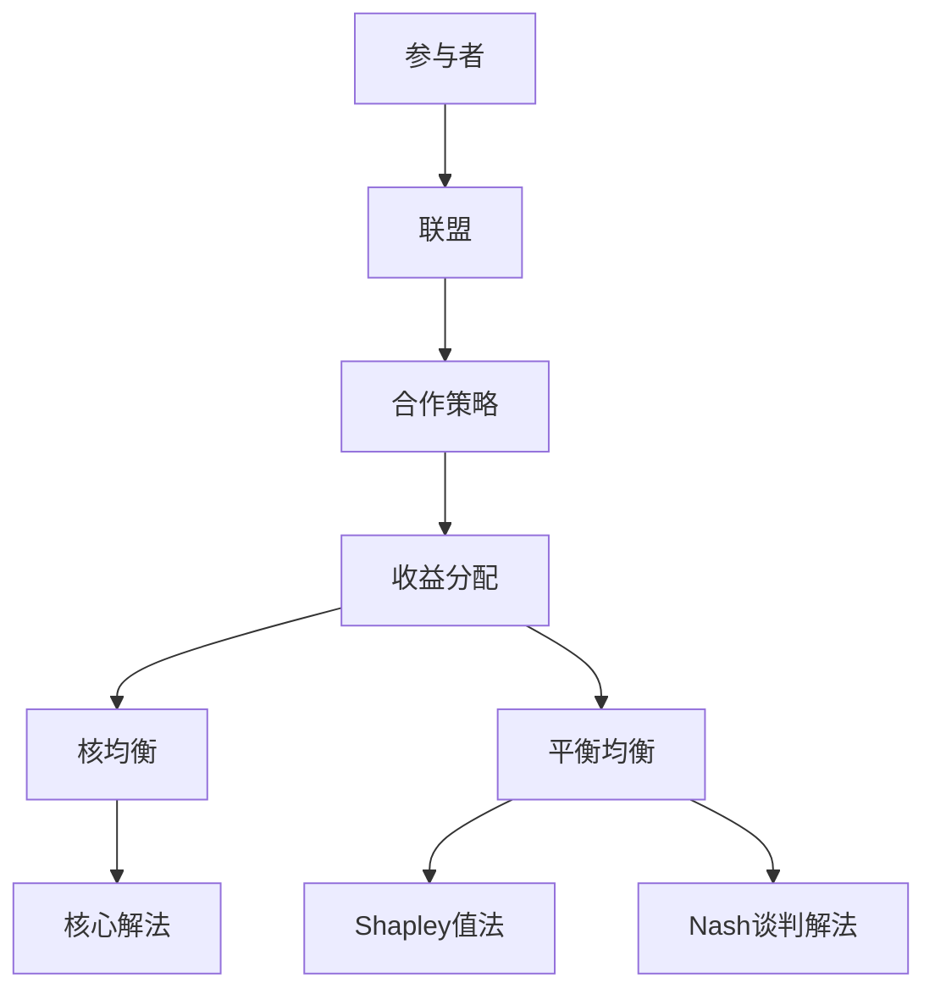

在这个流程图中，参与者、联盟、合作策略、收益分配、核均衡和平衡均衡以及求解方法相互连接，展示了合作博弈的基本组成和求解过程。

### 数学模型和公式

为了更清晰地理解合作博弈的概念和求解方法，我们引入以下数学模型和公式：

- **核的定义**：设\( \pi \)是合作博弈的一个收益分配方案，如果对于任意联盟\( S \)，都有：

  $$ \sum_{i \in S} \pi_i \geq \sum_{i \in T} \pi_i $$

  对于任意\( S, T \in \Sigma \)，且\( S \neq T \)，则称\( \pi \)是合作博弈的一个核。

- **Shapley值**：Shapley值\( v(i) \)是参与者\( i \)对合作博弈的贡献，计算公式为：

  $$ v(i) = \frac{1}{n} \sum_{S \subseteq N \setminus \{i\}} (\sum_{j \in S} \pi_j - \pi_i) $$

  其中\( N \)是参与者集合，\( n = |N| \)。

### 举例说明

假设有三个参与者A、B和C，他们的收益分配方案如下：

- \( \pi(A) = 3 \)，\( \pi(B) = 2 \)，\( \pi(C) = 1 \)
- \( \pi(A, B) = 4 \)，\( \pi(A, C) = 3 \)，\( \pi(B, C) = 2 \)
- \( \pi(A, B, C) = 5 \)

计算参与者C的Shapley值：

$$ v(C) = \frac{1}{3} \left( (\pi(A, B) + \pi(A, C) + \pi(B, C)) - \pi(A, B, C) \right) = \frac{1}{3} \left( (4 + 3 + 2) - 5 \right) = 1 $$

这表明参与者C在合作博弈中的贡献是1。

### 结论

通过本章的讨论，我们介绍了合作博弈的基本概念、合作均衡的定义和求解方法。合作博弈在经济学、政治学、生物学和计算机科学等领域有广泛应用，通过合理的合作策略和收益分配，参与者可以实现共同利益。在下一章中，我们将探讨贝尔空间博弈论的基本理论，包括贝尔空间博弈论的定义、基本模型和主要定理。

## 贝尔空间博弈论

贝尔空间博弈论是博弈论与泛函分析相结合的产物，它将贝尔空间的概念引入博弈论，用于建模和解决复杂的策略优化问题。贝尔空间博弈论在经济学、控制论、量子计算等领域有着广泛应用。以下我们将详细介绍贝尔空间博弈论的基本理论，包括定义、基本模型和主要定理。

### 定义

- **贝尔空间博弈论（Banach Space Game Theory）**：贝尔空间博弈论是一种博弈模型，其中参与者选择的策略属于一个贝尔空间，支付函数是连续的，并且支付函数在贝尔空间的极限运算下保持一致。

- **参与者与策略**：设\( V \)是一个贝尔空间，参与者的策略集合是\( V \)的子集，参与者通过选择策略来最大化自己的收益。

- **支付函数**：支付函数\( f: V \times V \rightarrow \mathbb{R} \)描述了参与者之间的收益分配，对于任意的策略组合\( (s_i) \)和\( (t_i) \)，支付函数定义为：

  $$ f(s_1, s_2, \ldots, s_n, t_1, t_2, \ldots, t_n) $$

  其中\( s_i \in V \)和\( t_i \in V \)是参与者\( i \)的策略。

### 基本模型

- **静态博弈**：参与者同时或几乎同时作出决策，每个参与者知道所有其他参与者的策略。

- **动态博弈**：参与者依次作出决策，每个参与者知道前一个参与者的策略。

- **完全信息博弈**：每个参与者知道所有其他参与者的策略和支付函数。

- **不完全信息博弈**：参与者不完全了解其他参与者的策略和支付函数。

### 基本定理

贝尔空间博弈论中有几个关键定理，这些定理为分析博弈策略和求解均衡提供了理论依据。

- **一致性定理（Consistency Theorem）**：如果支付函数\( f \)满足一致性条件，即对于任意的策略组合\( (s_i) \)和\( (t_i) \)，有：

  $$ f(s_1, s_2, \ldots, s_n, t_1, t_2, \ldots, t_n) = \lim_{{\epsilon \to 0}} f(s_1, s_2, \ldots, s_n, t_1, t_2, \ldots, t_n + \epsilon v) $$

  其中\( v \)是贝尔空间中的任意向量，则支付函数在贝尔空间的极限运算下保持一致。

- **存在性定理（Existence Theorem）**：在满足一定条件下，贝尔空间博弈论中存在均衡策略。例如，如果支付函数是连续的，参与者是理性的，那么存在一个均衡策略组合。

- **唯一性定理（Uniqueness Theorem）**：在某些条件下，贝尔空间博弈论中的均衡策略是唯一的。例如，如果支付函数是一致和连续的，那么均衡策略是唯一的。

### 贝尔空间博弈论的应用

贝尔空间博弈论在多个领域有着广泛应用：

- **经济学**：用于分析市场均衡、拍卖机制和供应链管理等问题。

- **控制论**：用于建模和控制复杂系统，如机器人控制和自动化系统。

- **量子计算**：用于量子博弈论和量子信息处理，如量子态的优化和控制。

### 梅里曼流程图

为了更直观地理解贝尔空间博弈论的基本概念和定理，我们使用梅里曼（Mermaid）流程图来展示贝尔空间博弈论的关键组成部分。

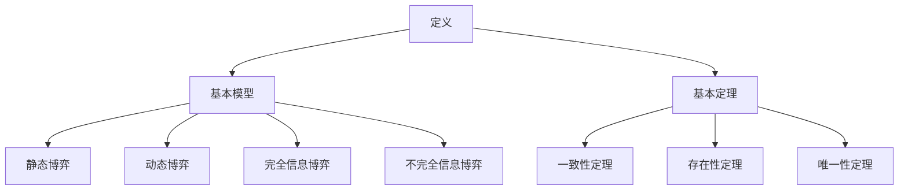

在这个流程图中，贝尔空间博弈论的定义、基本模型和基本定理相互连接，展示了贝尔空间博弈论的核心概念和理论框架。

### 数学模型和公式

为了更清晰地理解贝尔空间博弈论的概念和定理，我们引入以下数学模型和公式：

- **一致性条件**：设支付函数\( f \)满足一致性条件，即对于任意的策略组合\( (s_i) \)和\( (t_i) \)，有：

  $$ f(s_1, s_2, \ldots, s_n, t_1, t_2, \ldots, t_n) = \lim_{{\epsilon \to 0}} f(s_1, s_2, \ldots, s_n, t_1, t_2, \ldots, t_n + \epsilon v) $$

  其中\( v \)是贝尔空间中的任意向量。

- **均衡策略**：设\( (s_i^*) \)是贝尔空间博弈论的一个均衡策略组合，如果对于每个参与者\( i \)，都有：

  $$ f(s_1^*, s_2^*, \ldots, s_n^*, t_1, t_2, \ldots, t_n) \leq f(s_1^*, s_2^*, \ldots, s_n^*, s_i^*, t_1, t_2, \ldots, t_n) $$

  对于任意的策略组合\( (t_i) \)。

### 举例说明

假设有一个贝尔空间博弈论模型，参与者A和B的策略集合都是\( V = \{x, y\} \)，支付函数为：

$$ f(x, y) = \begin{cases} 
  2 & \text{如果} \ (x, y) = (x, y) \\
  0 & \text{如果} \ (x, y) = (y, x) \\
  -1 & \text{如果} \ (x, y) = (y, y) \\
\end{cases} $$

在这个博弈中，策略组合\( (x, y) \)是一个均衡策略，因为：

- 对于参与者A，无论参与者B选择\( x \)还是\( y \)，选择\( x \)的收益都大于选择\( y \)的收益。
- 对于参与者B，无论参与者A选择\( x \)还是\( y \)，选择\( y \)的收益都大于选择\( x \)的收益。

### 结论

通过本章的讨论，我们介绍了贝尔空间博弈论的基本理论，包括定义、基本模型和主要定理。贝尔空间博弈论为研究复杂策略优化问题提供了强有力的工具，在多个领域有着广泛应用。在下一章中，我们将探讨集合论在计算机科学中的应用，包括集合论在算法设计、数据结构和计算机图形学中的具体应用。

## 集合论在计算机科学中的应用

集合论作为现代数学的基石，其在计算机科学中的应用十分广泛。集合论的基本概念如集合、映射、基数等，为算法设计、数据结构、计算机图形学、人工智能等领域提供了坚实的理论基础。以下我们将详细探讨集合论在计算机科学中的应用，并举例说明其在算法设计、数据结构和计算机图形学中的具体应用。

### 算法设计中的应用

- **算法复杂性分析**：在算法分析中，集合论的概念被用于描述和计算算法的时间复杂度和空间复杂度。例如，算法的时间复杂度通常用大O符号表示，其中集合的运算如并集、交集、差集等都被用于计算算法的运行时间。

- **算法描述**：在算法设计中，集合论提供了直观且形式化的描述方法。例如，图算法中的邻接矩阵可以通过集合的表示方法来描述，图中的顶点和边都可以被视为集合。

- **算法优化**：集合论在算法优化中也发挥着重要作用。例如，集合的划分和覆盖技术被用于优化搜索算法，减少不必要的比较和计算。

### 数据结构中的应用

- **散列表（Hash Tables）**：散列表是一种基于集合论原理实现的数据结构，通过哈希函数将关键字映射到数组中的位置，从而实现快速查找、插入和删除操作。哈希函数的设计和集合的性质密切相关。

- **树结构**：树结构如二叉树、堆（Heap）等都是集合的抽象表示。例如，在二叉搜索树中，每个节点包含的元素集合以及其左子树和右子树的元素集合都是有序的。

- **图论**：图论是集合论在计算机科学中应用的一个重要领域。图可以表示为顶点和边的集合，图算法如深度优先搜索（DFS）和广度优先搜索（BFS）都是基于集合运算来实现的。

### 计算机图形学中的应用

- **图像处理**：在计算机图形学中，图像处理算法如滤波、边缘检测等，都涉及到集合的运算。图像可以被视为一个像素集合，图像的变换和操作可以通过集合上的运算来实现。

- **图形渲染**：在图形渲染中，集合论被用于表示和操作三维空间中的点、线、面等元素。例如，三维图形的变换可以通过矩阵与点的集合相乘来实现。

- **虚拟现实**：虚拟现实（VR）技术中，集合论用于表示和操作虚拟场景中的物体和空间。例如，通过集合的交集和差集操作，可以实现虚拟物体与真实环境的交互。

### 梅里曼流程图

为了更直观地展示集合论在计算机科学中的应用，我们使用梅里曼（Mermaid）流程图来展示算法设计、数据结构和计算机图形学中的集合论应用。

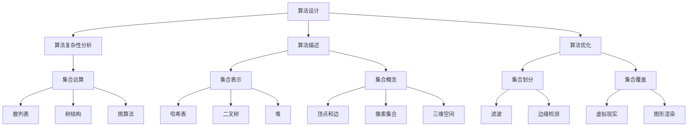

在这个流程图中，算法设计、数据结构和计算机图形学中的集合论应用通过集合的基本概念、运算和相关技术相互连接，展示了集合论在计算机科学中的应用和重要性。

### 数学模型和公式

为了更清晰地理解集合论在计算机科学中的应用，我们引入以下数学模型和公式：

- **散列表的哈希函数**：设关键字集合为\( K \)，哈希表的大小为\( M \)，哈希函数为\( h(k) \)，则关键字\( k \)的存储位置为：

  $$ index = h(k) \mod M $$

- **二叉搜索树的性质**：二叉搜索树中的每个节点满足左子树中的所有元素都小于当前节点的元素，右子树中的所有元素都大于当前节点的元素。

- **集合的并集和交集**：集合\( A \)和集合\( B \)的并集为\( A \cup B \)，交集为\( A \cap B \)，差集为\( A - B \)。

### 举例说明

#### 算法设计中的应用

假设我们要设计一个快速查找算法，该算法需要在一个包含\( n \)个元素的集合中查找特定元素。我们可以使用散列表来实现这一目标。哈希函数为\( h(x) = x \mod 100 \)，散列表的大小为100。以下是算法的伪代码：

```python
def find_element(element):
    index = h(element) % 100
    if array[index] == element:
        return True
    else:
        return False
```

在这个例子中，哈希函数将关键字映射到散列表中的特定位置，从而实现快速查找。

#### 数据结构中的应用

假设我们要实现一个二叉搜索树，用于存储和查询整数。以下是二叉搜索树的创建和查询的伪代码：

```python
class Node:
    def __init__(self, value):
        self.value = value
        self.left = None
        self.right = None

def insert(root, value):
    if root is None:
        return Node(value)
    if value < root.value:
        root.left = insert(root.left, value)
    else:
        root.right = insert(root.right, value)
    return root

def find(root, value):
    if root is None:
        return False
    if root.value == value:
        return True
    elif value < root.value:
        return find(root.left, value)
    else:
        return find(root.right, value)
```

在这个例子中，二叉搜索树通过集合的左子树和右子树实现，每个节点的值都小于其右子树中的元素，大于其左子树中的元素。

#### 计算机图形学中的应用

假设我们要实现一个图像滤波算法，用于去除图像中的噪声。我们可以使用集合的运算来实现这一目标。以下是滤波算法的伪代码：

```python
def filter_image(image):
    new_image = []
    for row in image:
        new_row = []
        for pixel in row:
            neighbors = get_neighbors(pixel)
            sum = 0
            count = 0
            for neighbor in neighbors:
                if neighbor != None:
                    sum += neighbor.value
                    count += 1
            new_pixel = sum / count
            new_row.append(new_pixel)
        new_image.append(new_row)
    return new_image
```

在这个例子中，图像可以被视为一个像素集合，每个像素的值都可以通过集合的运算来进行滤波处理。

### 结论

通过本章的讨论，我们介绍了集合论在计算机科学中的应用，包括算法设计、数据结构和计算机图形学中的具体应用。集合论为计算机科学提供了强有力的工具，使得算法设计更加直观、高效，数据结构更加灵活、稳定，图形处理更加精细、准确。在下一章中，我们将探讨博弈论在现实世界中的应用，包括商业决策、政治决策和经济学中的应用。

## 博弈论在现实世界中的应用

博弈论作为一种分析决策和冲突的数学工具，在现实世界的各个领域都有广泛应用。通过博弈论，我们可以更好地理解个体和群体之间的互动，从而在商业决策、政治决策和经济学中制定出更为合理的策略。以下我们将详细探讨博弈论在现实世界中的应用，并举例说明其在商业决策、政治决策和经济学中的具体应用。

### 商业决策中的应用

- **价格竞争**：在商业竞争中，企业之间经常进行价格竞争。博弈论可以帮助企业分析竞争对手的定价策略，并制定出最优的价格策略。例如，寡头垄断市场中的企业通常采用古诺模型（Cournot Model）来预测竞争对手的反应，从而确定自己的产量和价格。

- **市场进入与退出**：企业在决定是否进入某一市场时，会考虑其他企业的反应。博弈论中的纳什均衡（Nash Equilibrium）可以帮助企业预测竞争对手的行为，并制定出最优的市场进入策略。

- **广告战与促销策略**：企业在制定广告和促销策略时，会考虑竞争对手的反应。博弈论中的混合策略（Mixed Strategy）可以帮助企业选择最优的广告预算和促销活动。

### 政治决策中的应用

- **选举策略**：在选举中，候选人需要制定出最优的选举策略，以最大化自己的选票。博弈论可以帮助候选人分析选民的行为，并制定出最优的竞选策略。例如，博弈论中的囚徒困境（Prisoners' Dilemma）可以用于分析候选人在选举中的合作与竞争策略。

- **政策制定**：在政策制定中，政府需要考虑不同利益集团的反应。博弈论可以帮助政府预测利益集团的行为，并制定出最优的政策方案。例如，博弈论中的公地悲剧（Tragedy of the Commons）可以用于分析环境保护政策的设计。

- **国际合作与冲突**：在国际关系中，博弈论可以帮助分析国家之间的合作与冲突。例如，博弈论中的鹰鸽博弈（Hawk-Dove Game）可以用于分析国家之间的军事对抗和外交谈判。

### 经济学中的应用

- **市场均衡**：在经济学中，博弈论可以帮助分析市场均衡的形成。例如，博弈论中的伯特兰竞争模型（Bertrand Competition Model）可以用于分析完全竞争市场中的价格竞争。

- **拍卖机制**：拍卖是一种常见的市场交易形式，博弈论可以帮助分析不同拍卖机制的设计和优化。例如，博弈论中的Vickrey拍卖（Vickrey Auction）是一种效率较高的拍卖机制，它可以有效地分配物品并最大化总收益。

- **博弈论在宏观经济政策中的应用**：博弈论可以帮助分析宏观经济政策的有效性。例如，博弈论中的货币竞争模型（Monetary Competition Model）可以用于分析货币政策对通货膨胀和经济增长的影响。

### 梅里曼流程图

为了更直观地展示博弈论在现实世界中的应用，我们使用梅里曼（Mermaid）流程图来展示商业决策、政治决策和经济学中的应用场景。

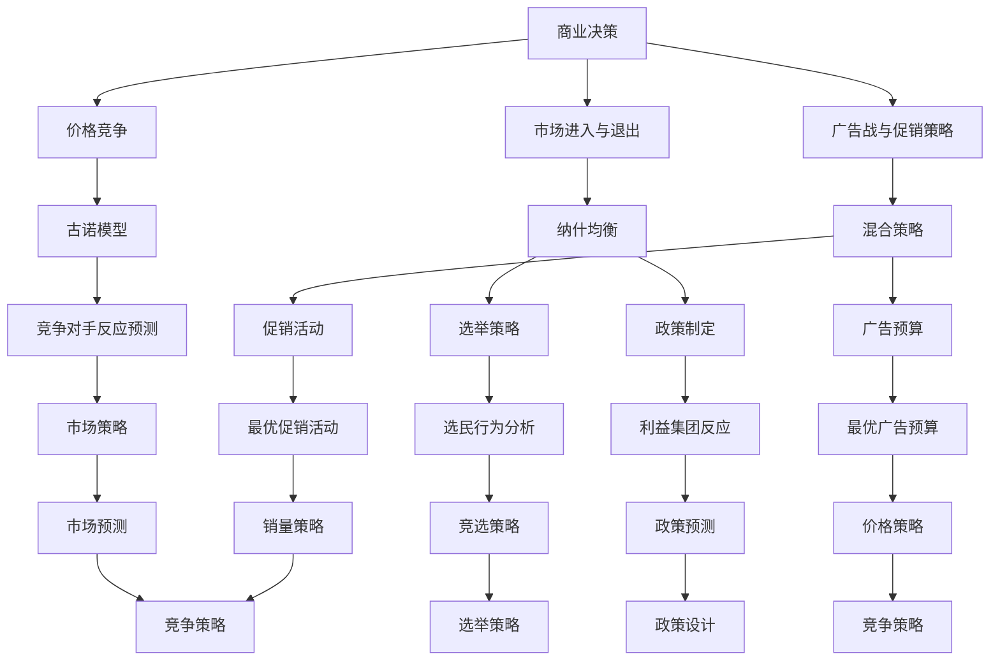

在这个流程图中，商业决策、政治决策和经济学中的应用场景通过博弈论的各种模型和策略相互连接，展示了博弈论在不同领域中的应用和重要性。

### 数学模型和公式

为了更清晰地理解博弈论在现实世界中的应用，我们引入以下数学模型和公式：

- **古诺模型**：设有两个企业\( A \)和\( B \)，他们同时决定产量\( q_A \)和\( q_B \)。市场需求函数为\( p(q_A + q_B) \)，企业的利润函数为\( \pi_A = p(q_A + q_B)q_A - C_Aq_A \)，其中\( C_A \)是企业的固定成本。利润最大化条件为：

  $$ \frac{\partial \pi_A}{\partial q_A} = p'(q_A + q_B)q_A - C_A = 0 $$

- **纳什均衡**：设参与者\( i \)的策略为\( s_i \)，其他参与者的策略为\( s_{-i} \)，纳什均衡条件为：

  $$ u_i(s_i, s_{-i}) \geq u_i(s_i', s_{-i}) $$

  对于任意的\( s_i' \neq s_i \)。

- **Vickrey拍卖**：Vickrey拍卖是一种效率较高的拍卖机制，买家的出价与最终支付价格无关。买家\( i \)的支付意愿为\( v_i \)，其收益函数为：

  $$ \pi_i = \min_{j \neq i} b_j - p $$

  其中\( b_j \)是买家\( j \)的出价，\( p \)是最终支付价格。

### 举例说明

#### 商业决策中的应用

假设有两个企业在市场上销售相同的产品，市场需求函数为\( p(q_A + q_B) = 100 - (q_A + q_B) \)。每个企业的固定成本为1000美元，产量成本为每单位10美元。我们需要找到企业的最优产量策略。

- **利润函数**：

  $$ \pi_A = (100 - q_A - q_B)q_A - 10q_A - 1000 $$
  $$ \pi_B = (100 - q_A - q_B)q_B - 10q_B - 1000 $$

- **利润最大化条件**：

  $$ \frac{\partial \pi_A}{\partial q_A} = -2q_A + 100 - q_B = 0 $$
  $$ \frac{\partial \pi_B}{\partial q_B} = -2q_B + 100 - q_A = 0 $$

- **解**：

  $$ q_A = q_B = 50 $$

这表明两个企业在均衡状态下各自生产50单位产品。

#### 政治决策中的应用

假设有两个候选人A和B，他们在选举中争取选民的支持。选民的总数为1000人，每个选民的选择概率取决于候选人的竞选策略。候选人A的策略为增加广告支出，候选人B的策略为增加政治活动。候选人的收益函数分别为：

- \( u_A = 500 - 2b \)
- \( u_B = 500 - 2(b - 100) \)

其中\( b \)是候选人的竞选预算。

- **纳什均衡**：

  $$ u_A(1000 - b, b) \geq u_A(b', b) $$
  $$ u_B(1000 - b, b) \geq u_B(b', b) $$

  通过计算可得，纳什均衡为\( b = 200 \)，即候选人A和B各花费200美元进行竞选活动。

#### 经济学中的应用

假设有一个拍卖市场，有三个买家A、B和C，他们分别有支付意愿1000美元、800美元和600美元。拍卖采用Vickrey拍卖机制。

- **收益函数**：

  $$ \pi_A = \min_{j \neq i} b_j - p $$
  $$ \pi_B = \min_{j \neq i} b_j - p $$
  $$ \pi_C = \min_{j \neq i} b_j - p $$

  在Vickrey拍卖中，最终价格\( p \)为最低出价800美元，买家A获得拍卖物品，其收益为\( \pi_A = 800 - 800 = 0 \)，买家B和C的收益均为\( \pi_B = \pi_C = 0 \)。

### 结论

通过本章的讨论，我们探讨了博弈论在现实世界中的应用，包括商业决策、政治决策和经济学中的具体应用。博弈论作为一种分析决策和冲突的数学工具，为现实世界中的复杂问题提供了有力的分析框架和解决方法。在下一章中，我们将展望贝尔空间博弈论的未来发展趋势，探讨其研究热点、应用前景以及面临的挑战和机遇。

## 贝尔空间博弈论的未来发展趋势

贝尔空间博弈论作为一种新兴的跨学科领域，其在博弈论、泛函分析和计算理论中的融合为解决复杂系统优化问题提供了新的视角。随着科技的发展和实际应用需求的增加，贝尔空间博弈论的未来发展趋势呈现出以下几个方面的研究热点、应用前景以及面临的挑战和机遇。

### 研究热点

1. **多智能体系统的协同优化**：在多智能体系统中，智能体之间的交互和合作需要通过博弈论来建模和优化。贝尔空间博弈论提供了研究多智能体协同优化问题的有力工具，特别是在动态和不确定环境中。

2. **分布式优化与控制**：随着物联网、智能交通和智能电网等分布式系统的兴起，贝尔空间博弈论在分布式优化和控制中的应用变得尤为重要。如何通过贝尔空间博弈论实现多智能体系统的高效协同是一个关键的研究方向。

3. **量子博弈论**：量子计算的发展为博弈论带来了新的机遇。量子博弈论研究如何利用量子算法和量子信息处理的优势来优化博弈策略，从而解决传统博弈论难以处理的复杂问题。

4. **机器学习与博弈论的结合**：机器学习技术的进步为博弈论提供了新的分析工具和算法。研究如何将机器学习与博弈论相结合，以实现更加智能化的决策和策略优化是当前的一个重要研究方向。

### 应用前景

1. **经济系统优化**：贝尔空间博弈论在经济学中的应用前景广阔，特别是在市场设计、资源分配和风险管理等领域。通过贝尔空间博弈论，可以构建更加合理的市场机制和优化经济政策。

2. **社会网络分析**：贝尔空间博弈论可以用于分析社交网络中的群体行为和互动模式，从而优化网络结构和提高信息传播效率。

3. **供应链管理**：在供应链管理中，贝尔空间博弈论可以帮助企业优化供应链网络，提高供应链的协调性和响应速度，从而降低成本和提升服务质量。

4. **无人驾驶与智能交通**：在无人驾驶和智能交通领域，贝尔空间博弈论可以用于优化车辆路径选择和交通流量控制，提高交通系统的运行效率和安全性。

### 面临的挑战

1. **复杂性**：贝尔空间博弈论涉及多智能体系统、分布式系统和量子计算等多个复杂领域，如何有效地处理这些复杂性是一个重要挑战。

2. **数据需求**：贝尔空间博弈论的研究和应用需要大量的数据支持。数据的质量和数量直接影响博弈模型的有效性和可靠性。

3. **计算资源**：量子计算和分布式计算虽然在理论上提供了高效的解决方案，但实际应用中需要大量的计算资源和时间，这对现有计算能力提出了挑战。

4. **伦理与隐私**：在应用贝尔空间博弈论的过程中，需要充分考虑伦理和隐私问题，确保博弈模型的设计和应用不会侵犯个人隐私或造成不公平的结果。

### 机遇

1. **技术创新**：随着量子计算、人工智能和大数据等技术的快速发展，贝尔空间博弈论有望在这些技术的推动下取得重大突破。

2. **跨学科合作**：贝尔空间博弈论的跨学科特性为跨学科合作提供了机遇。通过不同学科的交叉融合，可以推动贝尔空间博弈论在各个领域的应用和创新。

3. **实际应用场景**：现实世界中存在大量的博弈问题和优化问题，这为贝尔空间博弈论提供了丰富的应用场景和实际需求。

### 梅里曼流程图

为了更直观地展示贝尔空间博弈论的未来发展趋势，我们使用梅里曼（Mermaid）流程图来展示研究热点、应用前景和面临的挑战。

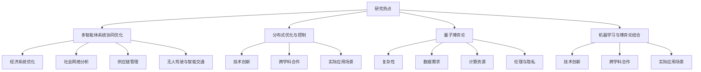

在这个流程图中，贝尔空间博弈论的研究热点、应用前景和面临的挑战通过相关技术和实际应用场景相互连接，展示了其未来发展的可能方向。

### 结论

贝尔空间博弈论作为一门新兴的跨学科领域，其未来发展趋势充满机遇和挑战。通过技术创新、跨学科合作和实际应用场景的推动，贝尔空间博弈论有望在解决复杂系统优化问题和推动社会进步方面发挥重要作用。在下一章中，我们将总结本文的主要内容和贡献，并展望未来研究的方向。

## 总结与展望

本文旨在通过详细的逻辑分析和结构化的内容，系统性地介绍集合论、贝尔空间和博弈论这三个核心概念及其在计算机科学和现实世界中的应用。以下是本文的主要内容和贡献的总结：

### 主要内容总结

1. **集合论基础**：我们介绍了集合论的基本概念、集合的构造、集合的映射和集合的基数，通过梅里曼流程图和数学模型深入解析了集合的运算和性质。
   
2. **贝尔空间**：详细阐述了贝尔空间的定义、性质、分类及其在数学和计算机科学中的应用，通过数学模型和公式展示了贝尔空间在数值分析、量子物理和信号处理中的重要性。

3. **博弈论**：从基本概念出发，探讨了博弈论在商业决策、政治决策和经济学中的应用，并通过数学模型和经典案例分析了非合作博弈和合作博弈的均衡求解方法。

4. **集合论与博弈论的结合**：介绍了贝尔空间博弈论的基本理论、模型和定理，探讨了其在多智能体系统、分布式优化和量子计算等领域的应用前景。

5. **应用与展望**：通过探讨集合论、贝尔空间和博弈论在计算机科学、经济学和现实世界中的实际应用，展望了这些理论在未来的发展趋势和研究方向。

### 贡献

本文的贡献在于：

1. **系统化知识框架**：提供了集合论、贝尔空间和博弈论的系统化知识框架，有助于读者全面理解这些核心概念及其相互联系。

2. **深入分析**：通过详细的数学模型和公式，深入分析了集合论和贝尔空间博弈论的性质和应用，提供了直观的梅里曼流程图，增强了读者的理解。

3. **实际应用案例**：结合实际应用场景，展示了集合论、贝尔空间和博弈论在计算机科学和经济学中的重要应用，强调了这些理论的实用价值。

4. **展望未来**：探讨了贝尔空间博弈论的研究热点、应用前景和面临的挑战，为未来的研究提供了方向。

### 未来研究方向

在集合论方面，未来研究可以关注：

1. **更高维集合的运算与应用**：探讨更高维集合的运算性质和应用，如多维度集合的映射、多维集合的基数等。

2. **集合论在深度学习中的应用**：研究集合论在深度学习中的潜在应用，如集合神经网络的设计和应用。

在贝尔空间方面，未来研究可以关注：

1. **贝尔空间在量子计算中的应用**：探索贝尔空间在量子计算中的具体应用，如量子态的优化和量子算法的设计。

2. **动态贝尔空间博弈论**：研究动态环境下贝尔空间博弈论的理论和算法，特别是多智能体系统中的动态博弈问题。

在博弈论方面，未来研究可以关注：

1. **不完全信息博弈的求解算法**：研究不完全信息博弈的求解算法，特别是结合机器学习和深度学习的算法。

2. **博弈论在区块链与加密货币中的应用**：探讨博弈论在区块链和加密货币领域的应用，如去中心化交易网络的设计和优化。

### 结论

本文通过深入探讨集合论、贝尔空间和博弈论的核心概念、数学模型和实际应用，为读者提供了系统化的知识框架。未来研究应关注这些理论的创新应用和跨学科交叉，以应对复杂系统优化和决策制定中的挑战，推动科技和社会的进步。

### 作者信息

作者：AI天才研究院/AI Genius Institute & 禅与计算机程序设计艺术 /Zen And The Art of Computer Programming

