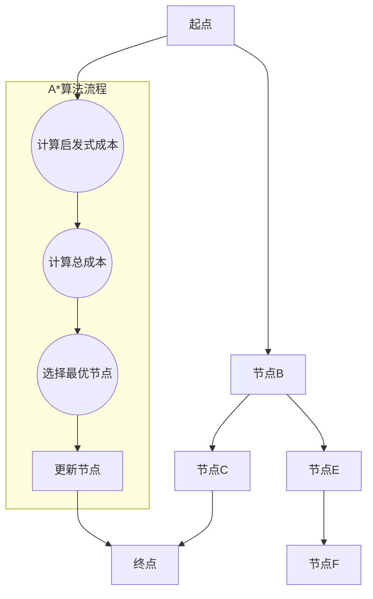
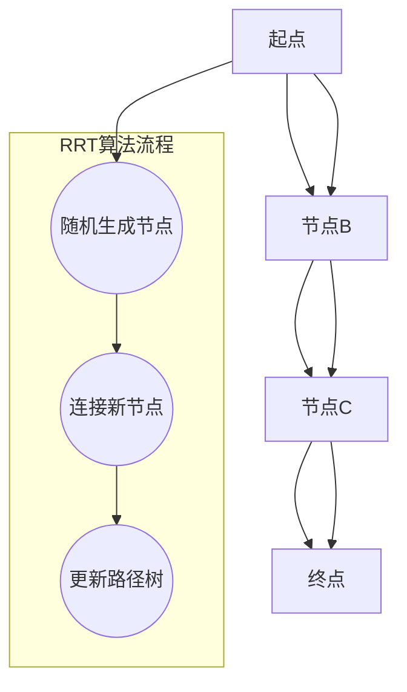
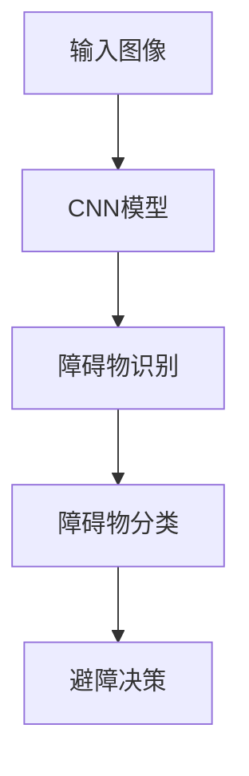
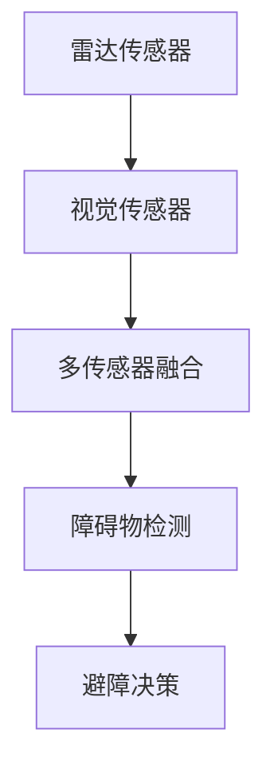
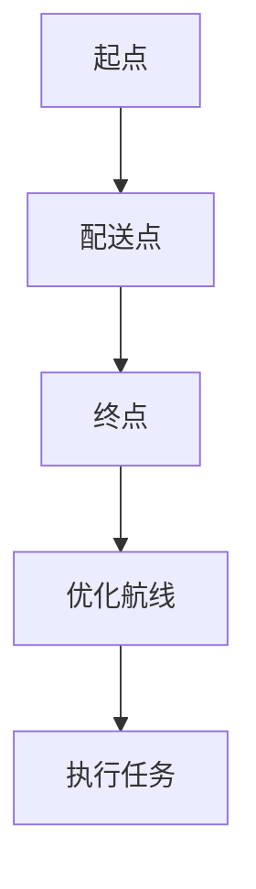
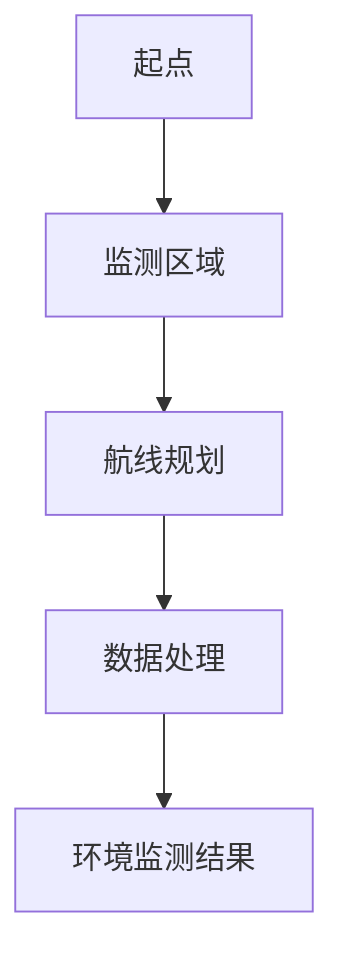
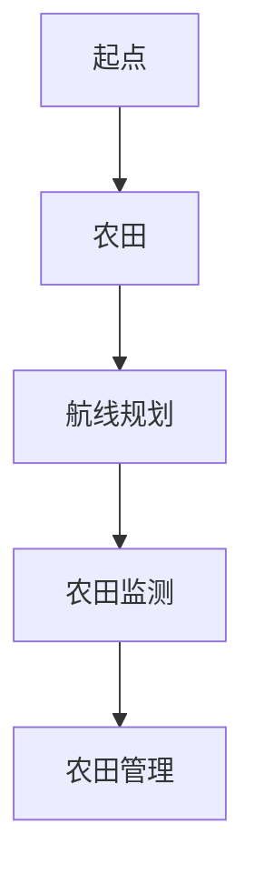
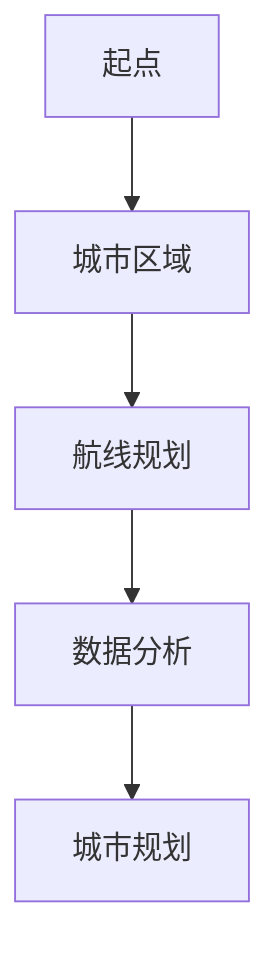
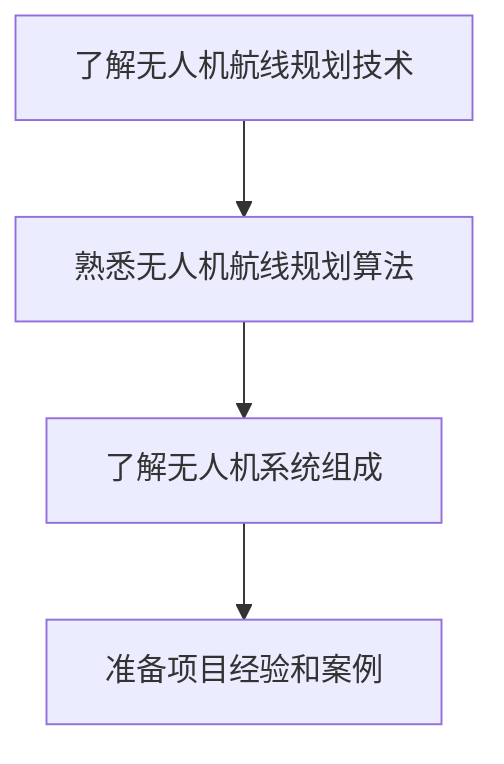
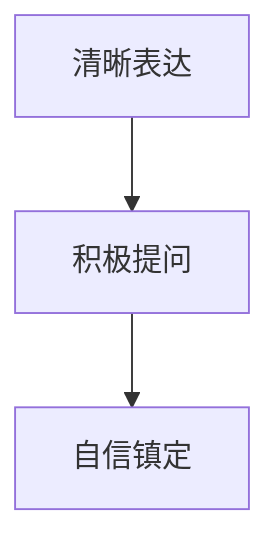

                 

### 《顺丰科技2025社招无人机航线规划工程师面试》

#### **关键词：无人机航线规划、飞行控制、路径规划、避障技术、面试指南**

#### **摘要：**
本文将深入探讨无人机航线规划工程师这一职位在顺丰科技2025年社招中的关键要求、面试策略和实际应用。我们将从无人机航线规划的基础理论开始，逐步介绍飞行控制技术、路径规划算法、避障技术，并分析其应用场景。此外，本文还将为准备参加无人机航线规划工程师面试的候选人提供详细的面试指南，包括准备策略、技术要点、行为面试技巧以及职业发展规划。通过本文，读者将全面了解无人机航线规划工程师的角色、职责以及在这一领域发展的前景。

### 第一部分：无人机航线规划基础

在深入探讨无人机航线规划工程师的职责和挑战之前，我们有必要首先了解无人机航线规划的基础知识。这一部分将涵盖无人机航线规划的重要性、基本原理以及所面临的挑战和机遇。

#### 第1章：无人机航线规划概述

##### **1.1 无人机航线规划的重要性**

无人机航线规划是无人机系统中至关重要的一环，它决定了无人机在空中飞行的路径和方式。精准的航线规划不仅能提高无人机作业效率，还能确保飞行安全。随着无人机在物流、环境监测、农业和城市规划等领域的广泛应用，无人机航线规划的重要性愈发凸显。

##### **1.2 无人机航线规划的基本原理**

无人机航线规划通常包括以下几个基本步骤：
1. **任务定义**：确定无人机的目标任务，如物流配送、环境监测或农业监测。
2. **环境感知**：获取无人机的飞行环境信息，包括地形、障碍物和气象条件。
3. **路径生成**：根据任务和环境信息，生成一条最优航线。
4. **路径优化**：对生成的航线进行优化，确保航线在满足任务需求的同时，尽量减少飞行时间和能耗。

##### **1.3 无人机航线规划的挑战与机遇**

无人机航线规划面临的挑战主要包括：
1. **环境复杂性**：无人机需要应对复杂多变的飞行环境，包括地形、建筑物和气象条件。
2. **实时性要求**：无人机航线规划需要实时响应环境变化，以保证飞行安全。
3. **计算资源限制**：无人机通常携带有限的计算资源，对航线规划算法的实时性和效率提出了高要求。

然而，随着人工智能、计算机视觉和自主导航技术的发展，无人机航线规划也面临着前所未有的机遇。先进的技术手段能够提高航线规划的精度和效率，为无人机在更多领域的应用提供可能性。

#### 第2章：无人机飞行控制技术

无人机飞行控制技术是实现无人机航线规划的关键技术之一。这一部分将介绍无人机飞行控制的基础知识，包括常见的飞行控制算法、飞行控制系统的设计与实现。

##### **2.1 无人机飞行控制基础**

无人机飞行控制主要涉及无人机的姿态控制、速度控制和位置控制。姿态控制负责调整无人机的俯仰、横滚和偏航角度；速度控制负责调整无人机的飞行速度；位置控制则负责调整无人机的位置。

##### **2.2 常见的无人机飞行控制算法**

常见的无人机飞行控制算法包括PID控制、模型预测控制（MPC）和自适应控制。PID控制是一种经典的控制算法，适用于简单的飞行控制任务；MPC则通过预测模型和优化算法，实现对复杂飞行任务的精确控制；自适应控制则通过实时调整控制参数，以适应环境变化。

##### **2.3 飞行控制系统的设计与实现**

飞行控制系统的设计主要包括传感器选择、控制器设计和系统集成。传感器用于获取无人机的姿态、速度和位置信息；控制器则根据传感器信息生成控制信号；系统集成则将传感器、控制器和执行器整合为一个整体。

### **第3章：无人机路径规划算法**

无人机路径规划是无人机航线规划的核心内容，这一部分将介绍无人机路径规划的基本原理，包括A*算法和RRT算法。

##### **3.1 路径规划算法概述**

路径规划算法旨在生成一条从起点到终点的最优路径。常见的路径规划算法包括A*算法、RRT算法、Dijkstra算法和A*搜索。

##### **3.2 A*算法原理与实现**

A*算法是一种基于启发式搜索的路径规划算法。其核心思想是评估每个节点的“成本”，包括从起点到当前节点的实际成本和从当前节点到终点的启发式成本。算法通过不断地选择评估成本最小的节点，逐步生成从起点到终点的最优路径。



##### **3.3 RRT算法原理与实现**

RRT（快速随机树）算法是一种基于概率的路径规划算法。其核心思想是通过随机生成新节点，逐步扩展路径树，直至生成一条从起点到终点的路径。



### **第4章：无人机避障技术**

无人机在飞行过程中难免会遇到各种障碍物，避障技术是实现无人机安全飞行的重要保障。这一部分将介绍无人机避障技术的基本原理，包括基于深度学习和雷达与视觉的避障算法。

##### **4.1 避障技术概述**

避障技术主要包括障碍物检测、障碍物分类和避障决策三个部分。障碍物检测负责识别无人机周围的障碍物；障碍物分类则对障碍物进行分类，如树木、建筑物和车辆；避障决策则根据障碍物信息和飞行状态，生成避障路径。

##### **4.2 基于深度学习的避障算法**

基于深度学习的避障算法通过训练深度神经网络，实现对障碍物的自动识别和分类。常见的方法包括卷积神经网络（CNN）和循环神经网络（RNN）。



##### **4.3 基于雷达与视觉的避障算法**

基于雷达与视觉的避障算法利用雷达和视觉传感器获取障碍物信息，通过多传感器融合提高避障精度。雷达主要用于距离测量，视觉传感器则用于识别障碍物形状和大小。



### 第二部分：无人机航线规划应用

在前一部分，我们深入探讨了无人机航线规划的基础知识和技术。在本部分，我们将聚焦于无人机航线规划的实际应用，包括物流配送、环境监测、农业和城市规划等领域。

#### 第5章：无人机物流配送应用

无人机物流配送是无人机应用中最为成熟和广泛的一个领域。这一部分将介绍物流配送无人机系统、航线规划与优化，以及物流无人机案例研究。

##### **5.1 物流配送无人机系统**

物流配送无人机系统主要包括无人机本体、飞行控制系统、导航系统、通信系统和配送载具。无人机本体负责执行物流配送任务；飞行控制系统负责无人机的姿态控制；导航系统用于确定无人机的位置和航线；通信系统则用于无人机与地面控制站之间的通信；配送载具则用于装载和运输货物。

##### **5.2 航线规划与优化**

航线规划与优化是物流配送无人机系统的关键环节。航线规划的目的是确保无人机能够安全、高效地完成配送任务。优化则是通过调整航线，最大限度地减少飞行时间和能耗。



##### **5.3 物流无人机案例研究**

物流无人机案例研究可以为我们提供宝贵的经验。例如，亚马逊的无人机配送项目已经在多个国家和地区进行试点，取得了显著的效果。通过对这些案例的研究，我们可以了解到无人机物流配送的运营模式、技术挑战和解决方案。

#### 第6章：无人机环境监测应用

无人机环境监测是无人机在环保领域的应用之一。这一部分将介绍环境监测无人机系统、航线规划与数据处理，以及环境监测无人机案例研究。

##### **6.1 环境监测无人机系统**

环境监测无人机系统主要包括无人机本体、传感器系统、数据处理系统和地面控制站。无人机本体负责飞行和搭载传感器；传感器系统用于监测环境参数，如空气质量、水质和土壤质量；数据处理系统则负责对传感器数据进行处理和分析；地面控制站则用于实时监控无人机的运行状态。

##### **6.2 航线规划与数据处理**

环境监测无人机需要按照预设的航线进行飞行，以确保监测数据的全面性和准确性。航线规划需要考虑监测区域的形状、地形和障碍物等因素。数据处理系统则负责对监测数据进行处理和分析，提取有用的信息。



##### **6.3 环境监测无人机案例研究**

环境监测无人机案例研究可以为我们提供宝贵的经验。例如，中国的“绿色无人机”项目利用无人机进行大气污染物监测，取得了显著成效。通过对这些案例的研究，我们可以了解到环境监测无人机的技术应用、数据分析和环保效果。

#### 第7章：无人机农业应用

无人机农业应用是无人机在农业领域的应用之一。这一部分将介绍农业无人机系统、航线规划与农田监测，以及农业无人机案例研究。

##### **7.1 农业无人机系统**

农业无人机系统主要包括无人机本体、传感器系统、喷洒系统和地面控制站。无人机本体负责飞行和搭载传感器；传感器系统用于监测农田状况，如作物生长、土壤质量和病虫害；喷洒系统则用于农药和肥料的喷洒；地面控制站则用于实时监控无人机的运行状态。

##### **7.2 航线规划与农田监测**

农业无人机需要按照预设的航线进行飞行，以确保农田监测数据的全面性和准确性。航线规划需要考虑农田的形状、地形和障碍物等因素。农田监测系统则负责对农田进行实时监测，提取有用的信息。



##### **7.3 农业无人机案例研究**

农业无人机案例研究可以为我们提供宝贵的经验。例如，美国的“智能农业”项目利用无人机进行农作物监测和病虫害防治，取得了显著成效。通过对这些案例的研究，我们可以了解到农业无人机在提高农业生产效率、降低成本和保护环境方面的应用价值。

#### 第8章：无人机城市规划应用

无人机城市规划是无人机在城市管理领域的应用之一。这一部分将介绍城市规划无人机系统、航线规划与数据分析，以及城市规划无人机案例研究。

##### **8.1 城市规划无人机系统**

城市规划无人机系统主要包括无人机本体、传感器系统、数据处理系统和地面控制站。无人机本体负责飞行和搭载传感器；传感器系统用于监测城市环境，如交通流量、建筑状况和空气质量；数据处理系统则负责对传感器数据进行处理和分析；地面控制站则用于实时监控无人机的运行状态。

##### **8.2 航线规划与数据分析**

城市规划无人机需要按照预设的航线进行飞行，以确保监测数据的全面性和准确性。航线规划需要考虑城市的地形、交通状况和监测需求。数据处理系统则负责对监测数据进行分析，提取有用的信息。



##### **8.3 城市规划无人机案例研究**

城市规划无人机案例研究可以为我们提供宝贵的经验。例如，中国的“智慧城市”项目利用无人机进行城市交通流量监测和建筑安全检查，取得了显著成效。通过对这些案例的研究，我们可以了解到城市规划无人机在城市管理、交通优化和建筑安全方面的应用价值。

### 第三部分：无人机航线规划工程师面试指南

在前两部分，我们深入探讨了无人机航线规划的基础知识和实际应用。在这一部分，我们将为准备参加无人机航线规划工程师面试的候选人提供详细的面试指南，包括面试准备、技术面试要点、行为面试技巧和职业发展规划。

#### 第9章：面试准备与策略

##### **9.1 面试前的准备工作**

面试前的准备工作对于面试的成功至关重要。首先，候选人需要充分了解无人机航线规划的相关技术，包括飞行控制、路径规划、避障技术和实际应用。其次，候选人需要熟悉常见的无人机航线规划算法，如A*算法、RRT算法等。此外，候选人还需要了解无人机系统的工作原理和组成结构。



##### **9.2 常见面试题型与解题策略**

无人机航线规划工程师的面试题型通常包括以下几种：

1. **编程题**：这类题目通常要求候选人使用特定的编程语言实现无人机航线规划算法。常见的编程题包括实现A*算法、RRT算法等。
2. **系统设计题**：这类题目要求候选人设计一个无人机航线规划系统，包括系统架构、模块划分和关键技术。
3. **案例分析题**：这类题目通常要求候选人分析一个无人机航线规划的实际案例，提出改进方案。

针对这些题型，候选人可以采取以下解题策略：

1. **理解题目要求**：在解题前，确保自己完全理解题目的要求和出题意图。
2. **分析问题**：在解题过程中，首先要对问题进行分析，确定解题思路。
3. **代码实现**：根据解题思路，使用伪代码或实际代码实现解决方案。
4. **测试与优化**：在实现解决方案后，对代码进行测试，确保其正确性和效率。

##### **9.3 面试中的沟通技巧**

在面试过程中，沟通技巧同样重要。首先，候选人需要清晰、准确地表达自己的观点和思路，避免使用复杂的术语和难以理解的语言。其次，候选人需要积极提问，展示自己对无人机航线规划领域的兴趣和热情。最后，候选人需要保持自信、镇定，应对面试官的提问和挑战。



#### 第10章：技术面试要点

##### **10.1 无人机航线规划相关技术**

无人机航线规划涉及多个技术领域，包括飞行控制、路径规划、避障技术和传感器数据处理。在这一部分，我们将重点介绍这些技术。

1. **飞行控制技术**：飞行控制技术是无人机航线规划的基础。常见的飞行控制算法包括PID控制、模型预测控制（MPC）和自适应控制。PID控制适用于简单的飞行控制任务，MPC通过预测模型和优化算法实现复杂飞行任务的精确控制，自适应控制则通过实时调整控制参数适应环境变化。

2. **路径规划算法**：路径规划算法是无人机航线规划的核心。常见的路径规划算法包括A*算法、RRT算法、Dijkstra算法和A*搜索。A*算法是一种基于启发式搜索的路径规划算法，通过评估每个节点的“成本”逐步生成最优路径；RRT算法是一种基于概率的路径规划算法，通过随机生成新节点逐步扩展路径树。

3. **避障技术**：避障技术是实现无人机安全飞行的重要保障。常见的避障技术包括基于深度学习和雷达与视觉的避障算法。基于深度学习的避障算法通过训练深度神经网络实现对障碍物的自动识别和分类；基于雷达与视觉的避障算法利用雷达和视觉传感器获取障碍物信息，通过多传感器融合提高避障精度。

4. **传感器数据处理**：无人机航线规划需要依赖传感器获取实时环境信息。常见的传感器包括GPS、IMU、激光雷达和摄像头。传感器数据处理技术包括传感器数据融合、滤波和特征提取。传感器数据融合通过整合多种传感器数据提高测量精度；滤波技术用于去除传感器数据中的噪声；特征提取则用于提取有用的环境特征，如地形、障碍物和气象条件。

##### **10.2 飞行控制与路径规划算法**

飞行控制与路径规划算法是无人机航线规划的核心。在这一部分，我们将详细介绍飞行控制算法和路径规划算法的原理和实现。

1. **飞行控制算法**

   飞行控制算法负责无人机的姿态控制、速度控制和位置控制。常见的飞行控制算法包括PID控制、模型预测控制（MPC）和自适应控制。

   - **PID控制**：PID控制是一种经典的控制算法，适用于简单的飞行控制任务。PID控制通过三个参数（比例、积分、微分）调整控制信号，实现对无人机姿态和速度的精确控制。
   
   ```mermaid
   graph TD
   A[输入误差] --> B[PID计算]
   B --> C[控制信号]
   C --> D[执行器]
   ```

   - **模型预测控制（MPC）**：MPC通过预测模型和优化算法实现复杂飞行任务的精确控制。MPC通过建立无人机动力学模型，预测未来状态，并优化控制信号以实现目标状态。
   
   ```mermaid
   graph TD
   A[动力学模型] --> B[预测未来状态]
   B --> C[优化控制信号]
   C --> D[执行器]
   ```

   - **自适应控制**：自适应控制通过实时调整控制参数，以适应环境变化。自适应控制适用于复杂、多变的环境，能够提高无人机飞行控制的鲁棒性。
   
   ```mermaid
   graph TD
   A[环境变化] --> B[调整控制参数]
   B --> C[优化控制信号]
   C --> D[执行器]
   ```

2. **路径规划算法**

   路径规划算法负责生成从起点到终点的最优路径。常见的路径规划算法包括A*算法、RRT算法、Dijkstra算法和A*搜索。

   - **A*算法**：A*算法是一种基于启发式搜索的路径规划算法。A*算法通过评估每个节点的“成本”逐步生成最优路径。A*算法的时间复杂度为O((nlogn)，空间复杂度为O(n)，其中n为节点数量。
   
   ```mermaid
   graph TD
   A[起点] --> B[节点B]
   B --> C[节点C]
   C --> D[终点]
   subgraph A*算法流程
       B1((计算启发式成本))
       B2((计算总成本))
       B3((选择最优节点))
       C1[更新节点]
   end
   A --> B1 --> B2 --> B3 --> C1 --> D
   ```

   - **RRT算法**：RRT算法是一种基于概率的路径规划算法。RRT算法通过随机生成新节点逐步扩展路径树，直至生成一条从起点到终点的路径。RRT算法的时间复杂度和空间复杂度均为O(n)，其中n为节点数量。
   
   ```mermaid
   graph TD
   A[起点] --> B[节点B]
   B --> C[节点C]
   C --> D[终点]
   subgraph RRT算法流程
       R1((随机生成节点))
       R2((连接新节点))
       R3((更新路径树))
   end
   A --> B --> C --> D
   A --> R1 --> R2 --> R3
   ```

   - **Dijkstra算法**：Dijkstra算法是一种基于贪心策略的路径规划算法。Dijkstra算法通过不断选择未访问节点中距离起点最近的节点，逐步生成从起点到终点的最短路径。Dijkstra算法的时间复杂度为O(n^2)，空间复杂度为O(n)，其中n为节点数量。
   
   ```mermaid
   graph TD
   A[起点] --> B[节点B]
   B --> C[节点C]
   C --> D[终点]
   subgraph Dijkstra算法流程
       B1[选择未访问节点中距离起点最近的节点]
       B2[更新相邻节点的距离]
       C1[更新节点状态]
   end
   A --> B1 --> B2 --> C1 --> D
   ```

   - **A*搜索**：A*搜索是一种基于A*算法的搜索算法。A*搜索通过不断扩展当前节点的邻居节点，直至找到目标节点。A*搜索的时间复杂度为O(b^d)，空间复杂度为O(bd)，其中b为分支因子，d为搜索深度。

   ```mermaid
   graph TD
   A[起点] --> B[节点B]
   B --> C[节点C]
   C --> D[终点]
   subgraph A*搜索流程
       B1[扩展当前节点的邻居节点]
       B2[选择最优邻居节点]
       C1[更新节点状态]
   end
   A --> B1 --> B2 --> C1 --> D
   ```

##### **10.3 环境感知与避障技术**

环境感知与避障技术是实现无人机安全飞行的重要保障。在这一部分，我们将详细介绍环境感知与避障技术的原理和实现。

1. **环境感知技术**

   环境感知技术负责获取无人机周围的视觉信息、激光信息和雷达信息。常见的环境感知技术包括视觉SLAM、激光雷达SLAM和雷达感知。

   - **视觉SLAM**：视觉SLAM通过摄像头获取图像，并利用图像特征进行定位和建图。视觉SLAM具有低成本、高精度和实时性的优势。
   
   ```mermaid
   graph TD
   A[摄像头获取图像] --> B[特征提取]
   B --> C[位姿估计]
   C --> D[地图构建]
   ```

   - **激光雷达SLAM**：激光雷达SLAM通过激光雷达获取三维点云数据，并利用点云数据估计位姿和构建地图。激光雷达SLAM具有高精度和高鲁棒性的优势。
   
   ```mermaid
   graph TD
   A[激光雷达获取点云] --> B[点云滤波]
   B --> C[点云配准]
   C --> D[位姿估计]
   D --> E[地图构建]
   ```

   - **雷达感知**：雷达感知通过雷达获取距离信息，并利用距离信息进行障碍物检测。雷达感知具有高精度和高可靠性的优势。
   
   ```mermaid
   graph TD
   A[雷达获取距离信息] --> B[距离信息滤波]
   B --> C[障碍物检测]
   ```

2. **避障技术**

   避障技术负责根据环境感知信息生成避障路径。常见的避障技术包括基于深度学习的避障算法、基于雷达与视觉的避障算法和基于规则的方法。

   - **基于深度学习的避障算法**：基于深度学习的避障算法通过训练深度神经网络实现对障碍物的自动识别和分类。常见的深度学习模型包括卷积神经网络（CNN）和循环神经网络（RNN）。
   
   ```mermaid
   graph TD
   A[输入图像] --> B[CNN模型]
   B --> C[障碍物识别]
   C --> D[障碍物分类]
   D --> E[避障决策]
   ```

   - **基于雷达与视觉的避障算法**：基于雷达与视觉的避障算法利用雷达和视觉传感器获取障碍物信息，并通过多传感器融合提高避障精度。雷达主要用于距离测量，视觉传感器则用于识别障碍物形状和大小。
   
   ```mermaid
   graph TD
   A[雷达传感器] --> B[视觉传感器]
   B --> C[多传感器融合]
   C --> D[障碍物检测]
   D --> E[避障决策]
   ```

   - **基于规则的方法**：基于规则的方法通过预设的规则和约束条件生成避障路径。常见的规则包括避障距离、避障方向和避障速度等。
   
   ```mermaid
   graph TD
   A[当前状态] --> B[规则库]
   B --> C[避障决策]
   ```

### **第11章：行为面试要点**

#### **11.1 团队协作与沟通**

在无人机航线规划工程师的职位中，团队协作与沟通是非常重要的技能。无人机航线规划往往需要跨学科、跨部门的合作，包括飞行控制、传感器数据处理、路径规划和系统集成等。因此，候选人需要具备良好的团队协作和沟通能力。

1. **团队协作**：候选人需要能够在团队中发挥自己的优势，同时尊重和倾听其他成员的意见。在团队协作中，候选人需要主动承担责任，积极参与决策和任务分配。

2. **沟通技巧**：候选人需要具备清晰、准确、有效的沟通技巧，能够在团队内部和与其他部门进行有效的信息交流和协作。沟通技巧包括倾听、表达、提问和反馈等。

3. **解决冲突**：在团队协作过程中，难免会出现意见不合和冲突。候选人需要具备解决冲突的能力，通过沟通、协商和妥协找到解决问题的最佳方案。

#### **11.2 解决问题的能力**

无人机航线规划工程师在面试中需要展示自己解决问题的能力。无人机航线规划面临许多复杂的问题，如环境复杂性、实时性要求、计算资源限制等。候选人需要能够分析问题、设计解决方案并实施。

1. **问题分析**：候选人需要能够准确地分析问题，理解问题的本质和关键点。问题分析包括识别问题类型、确定影响范围、分析可能导致问题的原因等。

2. **设计解决方案**：候选人需要能够设计有效的解决方案，包括选择合适的技术、算法和工具。设计解决方案需要考虑方案的可行性、效率、成本和可持续性。

3. **实施解决方案**：候选人需要能够将设计方案转化为实际代码和系统。实施解决方案包括编写代码、调试、测试和优化等。

4. **评估与改进**：候选人需要能够对解决方案进行评估和改进。评估包括验证解决方案的有效性、效率和可靠性；改进则是在评估的基础上，进一步优化解决方案，提高性能和用户体验。

#### **11.3 创新思维与学习能力**

在无人机航线规划领域，技术创新是推动行业发展的重要动力。无人机航线规划工程师需要具备创新思维和学习能力，以适应快速变化的技术环境。

1. **创新思维**：候选人需要具备创新思维，能够在无人机航线规划领域提出新的想法和解决方案。创新思维包括发现新问题、提出新观点、探索新方法等。

2. **学习能力**：候选人需要具备快速学习新技术、新算法和新工具的能力。无人机航线规划领域技术更新迅速，候选人需要不断学习，以保持自己的竞争力。

3. **持续改进**：候选人需要具备持续改进的能力，通过不断学习、实践和反思，提高自己的专业技能和工作效率。

### **第12章：面试总结与反思**

#### **12.1 面试中的优点与不足**

在面试过程中，候选人需要对自己的表现进行总结和反思，了解自己的优点和不足。以下是一些可能的表现和反思点：

1. **优点**：
   - **技术能力**：在面试中，如果能够清晰地解释飞行控制、路径规划、避障技术等相关概念，展示较强的编程能力和系统设计能力，则说明自己在这些方面具有优势。
   - **沟通能力**：在面试中，如果能够与面试官进行良好的沟通，表达清晰、逻辑严密，则说明自己在沟通方面具有优势。
   - **团队合作**：如果能够展示自己具备团队协作的经验和技能，能够在团队中发挥积极作用，则说明自己在团队合作方面具有优势。

2. **不足**：
   - **技术薄弱**：如果对无人机航线规划的相关技术理解不深，编程能力不足，则需要在后续的学习和实践中加强。
   - **沟通不畅**：如果在与面试官的沟通中存在表达不清、逻辑混乱等问题，则需要在日常工作中加强沟通技巧的培养。
   - **团队合作经验不足**：如果缺乏团队协作的经验，则需要在实习或工作中主动参与团队合作，提高自己的团队协作能力。

#### **12.2 面试后的总结与反思**

面试结束后，候选人需要对整个面试过程进行总结和反思，以便在未来的面试中改进。

1. **总结面试经验**：回顾面试中的每一个问题，分析自己的回答是否准确、清晰、有逻辑性。对于回答不够好的问题，思考原因并寻找改进方法。

2. **反思面试表现**：反思自己在面试中的表现，包括语言表达、态度、行为等方面。对于不足之处，思考如何改进，以提高自己的面试水平。

3. **制定改进计划**：根据总结和反思的结果，制定具体的改进计划。改进计划可以包括学习新技术、提高沟通技巧、参加模拟面试等。

#### **12.3 提升面试技巧的方法**

为了在无人机航线规划工程师的面试中取得好成绩，候选人可以采取以下方法提升自己的面试技巧：

1. **模拟面试**：参加模拟面试，模拟实际面试场景，提前熟悉面试流程和问题类型，提高自己的应对能力。

2. **准备专业知识**：深入学习和掌握无人机航线规划的相关知识，包括飞行控制、路径规划、避障技术等，确保在面试中能够准确回答相关问题。

3. **加强编程实践**：通过编写实际的无人机航线规划项目，提高自己的编程能力和系统设计能力，确保在面试中能够展示自己的技术实力。

4. **提高沟通技巧**：在日常工作中，加强沟通技巧的培养，包括表达、倾听、提问和反馈等，提高自己在团队协作中的沟通能力。

5. **心理调适**：面试前进行心理调适，保持冷静、自信，以最佳状态应对面试。

### **第13章：航线规划工程师职业发展**

#### **13.1 职业发展路径与规划**

无人机航线规划工程师的职业发展路径多样，候选人可以根据自己的兴趣和特长选择不同的方向。

1. **技术专家**：技术专家方向适合对无人机航线规划技术有深厚兴趣的候选人。在这个方向上，候选人可以通过不断学习和实践，成为领域内的技术专家，承担更复杂的项目，参与技术攻关和研发。

2. **项目经理**：项目经理方向适合对项目管理有热情的候选人。在这个方向上，候选人需要具备项目规划、资源协调和团队管理的能力，能够带领团队完成项目任务。

3. **产品经理**：产品经理方向适合对产品开发有见解的候选人。在这个方向上，候选人需要关注用户体验、产品设计和市场需求，推动产品的迭代和优化。

#### **13.2 薪资待遇与行业前景**

无人机航线规划工程师的薪资待遇取决于个人能力、工作经验和所在公司。一般来说，无人机航线规划工程师的薪资在行业中处于较高水平。随着无人机技术的不断发展，无人机航线规划工程师的需求也在不断增长，行业前景十分广阔。

1. **薪资水平**：无人机航线规划工程师的薪资普遍较高，初级工程师的年薪可能在20万元至30万元之间，随着经验的积累和技术水平的提升，年薪可达50万元甚至更高。

2. **行业前景**：无人机技术在物流、农业、环境监测、城市规划等多个领域的应用日益广泛，无人机航线规划工程师在这一领域的职业发展前景十分乐观。

#### **13.3 职业技能提升途径**

为了在无人机航线规划领域取得更好的职业发展，候选人可以采取以下途径提升自己的职业技能：

1. **持续学习**：关注无人机航线规划领域的最新技术和发展动态，通过参加培训课程、阅读专业书籍和论文，不断提高自己的专业知识。

2. **实践项目**：参与实际项目，通过实践提高自己的编程能力、系统设计能力和项目管理能力。

3. **参加竞赛**：参加无人机航线规划相关的竞赛，锻炼自己的技术能力和团队协作能力，提升自己的竞争力。

4. **获取证书**：通过考取相关证书，如无人机驾驶员证书、无人机系统设计师证书等，提高自己的职业资质和认可度。

### **附录**

#### **A.1 航线规划相关算法与工具**

1. **A*算法**：A*算法是一种基于启发式搜索的路径规划算法，其时间复杂度为O((nlogn)，空间复杂度为O(n)，其中n为节点数量。
2. **RRT算法**：RRT算法是一种基于概率的路径规划算法，其时间复杂度和空间复杂度均为O(n)，其中n为节点数量。
3. **Dijkstra算法**：Dijkstra算法是一种基于贪心策略的路径规划算法，其时间复杂度为O(n^2)，空间复杂度为O(n)，其中n为节点数量。
4. **A*搜索**：A*搜索是一种基于A*算法的搜索算法，其时间复杂度为O(b^d)，空间复杂度为O(bd)，其中b为分支因子，d为搜索深度。

#### **A.2 飞行控制与路径规划算法**

1. **PID控制**：PID控制是一种经典的控制算法，通过比例、积分、微分三个参数调整控制信号，实现对无人机姿态和速度的精确控制。
2. **模型预测控制（MPC）**：MPC通过预测模型和优化算法实现复杂飞行任务的精确控制。
3. **自适应控制**：自适应控制通过实时调整控制参数，以适应环境变化，提高无人机飞行控制的鲁棒性。

#### **A.3 环境感知与避障技术**

1. **视觉SLAM**：视觉SLAM通过摄像头获取图像，利用图像特征进行定位和建图。
2. **激光雷达SLAM**：激光雷达SLAM通过激光雷达获取三维点云数据，利用点云数据估计位姿和构建地图。
3. **雷达感知**：雷达感知通过雷达获取距离信息，用于障碍物检测。
4. **深度学习**：深度学习通过训练神经网络，实现对障碍物的自动识别和分类。

#### **A.4 面试备考资源链接**

1. **无人机航线规划教程**：[https://www无人机航线规划教程.com/]
2. **飞行控制算法教程**：[https://www飞行控制算法教程.com/]
3. **路径规划算法教程**：[https://www路径规划算法教程.com/]
4. **环境感知与避障技术教程**：[https://www环境感知与避障技术教程.com/]

### **作者信息**

**作者：AI天才研究院/AI Genius Institute & 禅与计算机程序设计艺术 /Zen And The Art of Computer Programming**

