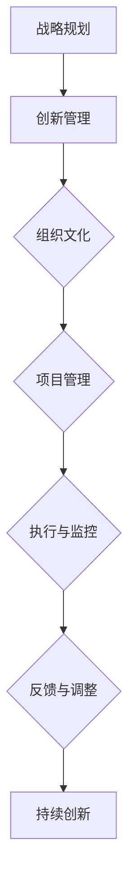

                 

# 领导力与创新管理：从创意到实施

## 关键词：
领导力、创新管理、创意实施、项目管理、跨学科整合、战略规划

## 摘要：
本文旨在探讨领导力与创新管理的结合，阐述从创意到实施的全过程。通过定义领导力的核心概念，分析创新管理的演进过程，探讨领导力与创新管理的综合框架，以及介绍创新思维与方法，领导力模型与领导风格，创新管理策略与组织创新文化，创新项目管理与实施，跨学科整合以及战略规划与执行等内容，本文旨在为企业和组织提供一套系统的领导力与创新管理的实践指南。

### 第一部分：领导力与创新管理概述

#### 第1章 领导力与创新管理的核心概念

##### 1.1 领导力的定义与重要性

领导力是一种影响和激励他人共同实现目标的能力。它不仅仅是一种个人技能，更是组织成功的关键因素。领导力的基本概念包括以下几个方面：

1. **影响力**：领导力通过影响他人来实现组织目标，它包括情感、认知和行为三个方面。
2. **目标导向**：领导力强调目标的明确性和可实现性，帮助团队聚焦于共同的目标。
3. **激励**：领导力通过激励和鼓舞团队成员，提高团队的积极性和创造力。

领导力在组织中的角色主要体现在以下几个方面：

1. **愿景规划**：领导力为组织设定清晰的发展愿景，为团队成员提供方向和目标。
2. **战略制定**：领导力帮助组织制定战略，确保组织在竞争中取得优势。
3. **变革推动**：领导力在组织变革中发挥关键作用，推动组织适应外部环境的变化。

##### 1.1.1 领导力的基本概念

领导力可以被视为一种心理过程，涉及领导者与追随者之间的相互作用。领导者通过以下方式影响追随者：

1. **榜样作用**：领导者通过自身行为为团队成员树立榜样，激发团队成员的积极性。
2. **沟通**：领导者通过有效沟通传递信息，建立信任，增强团队的凝聚力。
3. **激励**：领导者通过激励措施激发团队成员的潜力，提高团队的工作效率。

##### 1.1.2 领导力在组织中的角色

领导力在组织中的角色至关重要，主要体现在以下几个方面：

1. **愿景塑造**：领导者通过明确组织的愿景和目标，为组织的发展指明方向。
2. **战略规划**：领导者制定组织的战略规划，确保组织在竞争中保持优势。
3. **团队建设**：领导者通过建立高效的团队，提高团队的合作效率。
4. **创新推动**：领导者鼓励创新，为组织的持续发展提供动力。

##### 1.1.3 创新管理与领导力的关联

创新管理是一种通过有效管理创新过程，实现组织目标的方法。创新管理与领导力的关联体现在以下几个方面：

1. **领导力的推动作用**：领导力为创新管理提供推动力，激发团队的创造力。
2. **创新能力的培养**：领导力通过培养团队成员的创新能力和素质，提高组织的创新能力。
3. **创新文化的建设**：领导力通过建设创新文化，营造一个支持创新的环境。

#### 1.2 创新管理的概念与发展历程

##### 1.2.1 创新管理的定义

创新管理是一种通过管理创新过程，实现组织目标的方法。它包括以下几个方面：

1. **创意的产生**：通过激发团队的创造力，产生新的创意。
2. **创意的选择**：对创意进行筛选，选择具有潜力的创意进行开发。
3. **创意的实现**：将创意转化为实际的创新产品或服务。
4. **创新的推广**：将创新产品或服务推向市场，实现商业价值。

##### 1.2.2 创新管理的演进过程

创新管理的演进过程可以大致分为以下几个阶段：

1. **初级阶段**：以技术创新为核心，注重技术的突破。
2. **发展阶段**：强调系统化的创新管理，注重创新过程的规范和优化。
3. **成熟阶段**：将创新管理融入到组织的战略和运营中，实现创新的全过程管理。

##### 1.2.3 创新管理在当代企业中的地位

创新管理在当代企业中的地位日益重要，主要体现在以下几个方面：

1. **竞争力提升**：创新管理帮助组织在市场竞争中取得优势。
2. **持续发展**：创新管理为组织的持续发展提供动力。
3. **企业文化建设**：创新管理推动企业文化的建设，营造一个创新氛围。

#### 1.3 领导力与创新管理的综合框架

##### 1.3.1 领导力与创新管理的融合

领导力与创新管理的融合是组织成功的关键。领导力为创新管理提供推动力和支持，创新管理为领导力提供实际成果和回报。两者的融合体现在以下几个方面：

1. **领导力的推动**：领导者通过激发团队的创造力，推动创新管理的实施。
2. **创新管理的支持**：创新管理为领导力提供实际的操作方法和工具，帮助领导者实现创新目标。

##### 1.3.2 领导力与创新管理的目标

领导力与创新管理的目标主要包括以下几个方面：

1. **提高创新能力**：通过培养团队成员的创新能力和素质，提高组织的整体创新能力。
2. **实现创新成果**：将创新创意转化为实际的创新产品或服务，实现商业价值。
3. **推动组织发展**：通过创新管理，推动组织的持续发展和竞争力的提升。

##### 1.3.3 领导力与创新管理的挑战与机遇

领导力与创新管理面临的挑战主要包括以下几个方面：

1. **创新风险**：创新过程存在不确定性和风险，需要领导者有足够的勇气和决策能力。
2. **资源分配**：创新管理需要大量的资源和投入，领导者需要合理分配资源。
3. **团队协作**：创新管理需要团队的协作和支持，领导者需要建立高效的团队。

同时，领导力与创新管理也面临着巨大的机遇，主要包括以下几个方面：

1. **市场机遇**：创新管理可以帮助组织抓住市场机遇，实现快速发展。
2. **技术创新**：创新管理可以推动技术创新，为组织带来新的竞争优势。
3. **企业文化建设**：创新管理可以推动企业文化的建设，提高组织的凝聚力和执行力。

#### 1.4 领导力与创新管理的综合框架

##### 1.4.1 领导力与创新管理的综合框架

领导力与创新管理的综合框架可以概括为以下几个关键要素：

1. **愿景与目标**：领导者需要明确组织的愿景和目标，为创新管理提供方向。
2. **战略规划**：领导者需要制定明确的创新战略，确保创新管理有清晰的目标和路径。
3. **团队建设**：领导者需要建立高效的团队，培养团队成员的创新能力和素质。
4. **资源分配**：领导者需要合理分配资源，支持创新管理的实施。
5. **激励机制**：领导者需要建立有效的激励机制，激发团队成员的创新积极性。
6. **风险控制**：领导者需要有效控制创新风险，确保创新过程的顺利进行。

##### 1.4.2 综合框架的应用

综合框架在实际应用中，需要根据组织的实际情况进行调整和优化。以下是一些具体的建议：

1. **明确愿景与目标**：领导者需要明确组织的愿景和目标，并将其融入到创新管理中。
2. **制定创新战略**：领导者需要制定明确的创新战略，确保创新管理有清晰的目标和路径。
3. **建立创新团队**：领导者需要建立高效的创新团队，培养团队成员的创新能力和素质。
4. **优化资源分配**：领导者需要合理分配资源，支持创新管理的实施。
5. **建立激励机制**：领导者需要建立有效的激励机制，激发团队成员的创新积极性。
6. **控制创新风险**：领导者需要有效控制创新风险，确保创新过程的顺利进行。

#### 1.5 领导力与创新管理的实践案例分析

##### 1.5.1 成功的实践案例

在领导力与创新管理的实践中，有许多成功的案例。以下是一些典型的成功案例：

1. **谷歌的创新文化**：谷歌以其创新文化著称，通过提供开放的工作环境、灵活的工作时间和宽松的管理方式，激发员工的创新积极性，推动了谷歌的快速发展。

2. **苹果的产品创新**：苹果公司以其独特的产品设计和创新技术，引领了消费电子行业的发展。乔布斯作为苹果的领导者，以其远见卓识和创新精神，推动了苹果的创新和成功。

3. **特斯拉的电动汽车革命**：特斯拉作为电动汽车的领导者，通过创新的技术和商业模式，推动了电动汽车行业的发展，改变了人们对传统汽车行业的看法。

##### 1.5.2 失败的实践案例

在领导力与创新管理的实践中，也存在着一些失败的案例。以下是一些典型的失败案例：

1. **诺基亚的衰落**：诺基亚作为手机行业的领导者，在智能手机时代没有及时创新，最终被苹果和三星等竞争对手超越。

2. **柯达的破产**：柯达作为摄影行业的领导者，没有及时认识到数字摄影的兴起，坚持传统胶片的商业模式，最终导致破产。

3. **黑莓的困境**：黑莓曾作为智能手机市场的领导者，由于没有及时创新，被苹果和安卓系统超越，陷入了经营困境。

通过分析这些成功和失败的实践案例，我们可以得出以下启示：

1. **领导者的重要性**：领导者需要具备远见卓识和创新精神，为组织提供明确的方向和目标。
2. **创新文化的建设**：组织需要建立创新文化，鼓励创新思维和行动。
3. **战略规划的制定**：组织需要制定明确的创新战略，确保创新管理有清晰的目标和路径。
4. **团队的建设**：组织需要建立高效的创新团队，培养团队成员的创新能力和素质。
5. **持续的创新投入**：组织需要持续投入资源，支持创新管理的实施。

#### 1.6 领导力与创新管理的未来趋势

##### 1.6.1 数字化转型的影响

随着数字技术的快速发展，数字化转型已经成为领导力与创新管理的重要趋势。数字化转型对领导力与创新管理的影响主要体现在以下几个方面：

1. **数据驱动的决策**：数字化转型提供了大量的数据，领导者可以通过数据分析，做出更加科学的决策。
2. **敏捷管理的实践**：数字化转型促进了敏捷管理的实践，领导者需要具备快速响应和调整的能力。
3. **创新模式的改变**：数字化转型改变了创新的模式，领导者需要适应新的创新环境，推动组织的持续创新。

##### 1.6.2 人工智能与领导力的融合

人工智能技术的快速发展，为领导力带来了新的机遇和挑战。人工智能与领导力的融合主要体现在以下几个方面：

1. **智能决策支持**：人工智能可以提供智能决策支持，帮助领导者做出更加科学的决策。
2. **智能团队管理**：人工智能可以提供智能团队管理，提高团队的工作效率。
3. **智能创新管理**：人工智能可以提供智能创新管理，推动组织的持续创新。

##### 1.6.3 新兴科技的未来趋势

随着科技的不断发展，新兴科技正在改变领导力与创新管理的模式。以下是一些未来科技的发展趋势：

1. **区块链技术**：区块链技术可以为领导力与创新管理提供透明、安全和可信的数据管理方式。
2. **虚拟现实与增强现实**：虚拟现实和增强现实技术可以为领导力与创新管理提供全新的交互方式和体验。
3. **量子计算**：量子计算技术将为领导力与创新管理带来全新的计算能力和创新机会。

### 第二部分：创新思维与方法

#### 第2章 创新思维与方法

创新思维是创新管理的重要组成部分，它是组织和个人在创新过程中，通过独特的思考方式和创造性思维，产生新想法和新解决方案的能力。本章将详细介绍创新思维的核心要素、创新方法以及创新思维的训练与实践。

#### 2.1 创新思维的核心要素

创新思维的核心要素主要包括以下几个方面：

1. **开放性思维**：开放性思维是创新思维的基础，它强调接受新的观念、想法和解决方案，不受传统思维方式的束缚。

2. **求异思维**：求异思维是指寻找与众不同的解决方案，它鼓励个人和组织从不同的角度和维度思考问题，寻找创新的突破口。

3. **汇聚思维**：汇聚思维是指将分散的、独立的想法和解决方案进行整合，形成新的、更有价值的创意。

#### 2.1.1 开放性思维

开放性思维是创新思维的基础，它要求个人和组织在创新过程中，保持开放的心态，愿意接受新的观念、想法和解决方案。开放性思维的特征包括：

1. **接受不同观点**：在创新过程中，不同观点的碰撞往往能够激发新的创意和灵感。
2. **勇于尝试**：开放性思维鼓励个人和组织勇于尝试新的方法和方案，即使这些方法存在风险和不确定性。
3. **持续学习**：开放性思维要求个人和组织持续学习，不断更新知识和技能，以适应快速变化的环境。

#### 2.1.2 求异思维

求异思维是创新思维的重要表现，它强调寻找与众不同的解决方案。求异思维的特征包括：

1. **独立思考**：求异思维鼓励个人独立思考，不拘泥于传统观念和常规方法，从新的角度和维度思考问题。
2. **打破常规**：求异思维要求个人和组织敢于挑战传统观念和方法，打破常规，寻找创新的解决方案。
3. **勇于创新**：求异思维鼓励个人和组织勇于创新，不断尝试新的方法和方案，以实现突破性的创新。

#### 2.1.3 汇聚思维

汇聚思维是将分散的、独立的想法和解决方案进行整合，形成新的、更有价值的创意。汇聚思维的特征包括：

1. **整合资源**：汇聚思维强调整合各种资源，包括知识、技能、信息和人力，形成创新的合力。
2. **跨学科融合**：汇聚思维鼓励跨学科的融合，将不同领域的知识和方法进行整合，产生新的创意。
3. **协同创新**：汇聚思维要求个人和组织协同合作，共同创新，以实现更大的创新成果。

#### 2.2 创新方法概述

创新方法是指组织和个人在创新过程中，采用的一系列策略和技术，以产生新的想法和解决方案。常见的创新方法包括以下几种：

1. **想象力训练**：想象力训练是一种通过激发想象力，产生新想法的方法。它包括自由联想、思维导图、头脑风暴等技巧。

2. **设计思考方法**：设计思考方法是一种以用户需求为中心的创新方法，它强调通过理解用户需求、提出解决方案、原型测试和迭代改进，实现创新的解决方案。

3. **用户研究方法**：用户研究方法是一种通过深入了解用户需求和行为，发现创新机会的方法。它包括用户访谈、问卷调查、观察法等。

#### 2.2.1 想象力训练

想象力训练是一种通过激发想象力，产生新想法的方法。以下是一些常见的想象力训练技巧：

1. **自由联想**：自由联想是一种通过将不同的事物或概念联系起来，产生新想法的方法。例如，将“苹果”和“飞机”进行自由联想，可能会产生“苹果飞机”这样的创意。

2. **思维导图**：思维导图是一种通过图形化方式，将思维过程可视化，激发想象力，产生新想法的方法。通过绘制思维导图，可以清晰地展示思维过程，帮助发现新的创意。

3. **头脑风暴**：头脑风暴是一种通过集体讨论，激发想象力，产生新想法的方法。在头脑风暴过程中，鼓励参与者畅所欲言，不受限制地提出各种想法，通过集思广益，找到创新的解决方案。

#### 2.2.2 设计思考方法

设计思考方法是一种以用户需求为中心的创新方法，它强调通过理解用户需求、提出解决方案、原型测试和迭代改进，实现创新的解决方案。以下是设计思考方法的步骤：

1. **理解用户需求**：设计思考方法的第一步是深入了解用户需求，了解用户在使用产品或服务时的痛点、需求和期望。

2. **提出解决方案**：在理解用户需求的基础上，提出创新的解决方案。解决方案可以是产品功能、服务流程或用户体验等方面的改进。

3. **原型测试**：设计思考方法强调通过原型测试，验证解决方案的可行性和用户满意度。原型测试可以帮助发现解决方案中的问题和不足，为后续的迭代改进提供依据。

4. **迭代改进**：设计思考方法强调不断迭代改进，通过多次测试和改进，优化解决方案，实现最终的创新能力。

#### 2.2.3 用户研究方法

用户研究方法是一种通过深入了解用户需求和行为，发现创新机会的方法。以下是用户研究方法的一些常用技巧：

1. **用户访谈**：用户访谈是一种通过与目标用户进行深入交流，了解用户需求、行为和期望的方法。用户访谈可以采用结构化访谈或非结构化访谈，以获取详细的信息。

2. **问卷调查**：问卷调查是一种通过设计问卷，收集用户需求和行为数据的方法。问卷调查可以采用线上或线下形式，以获取广泛的数据。

3. **观察法**：观察法是一种通过观察用户在使用产品或服务时的行为和互动，了解用户需求和行为的方法。观察法可以帮助发现用户在现实生活中遇到的问题和挑战。

#### 2.3 创新思维训练与实践

创新思维训练是一种通过系统化的训练，提高个人和组织创新思维能力的方法。以下是一些常见的创新思维训练技巧：

1. **思维导图训练**：通过绘制思维导图，训练个人和组织将思维过程可视化，提高创新思维的能力。

2. **头脑风暴训练**：通过组织集体头脑风暴，训练个人和组织在短时间内产生大量创意，提高创新思维的敏捷性。

3. **案例研究训练**：通过分析成功和失败的创新案例，了解创新思维的应用和实践，提高创新思维的能力。

#### 2.3.1 创新思维训练技巧

创新思维训练技巧主要包括以下几个方面：

1. **多角度思考**：鼓励个人和组织从多个角度思考问题，寻找创新的解决方案。

2. **跨学科融合**：鼓励个人和组织跨学科融合，将不同领域的知识和方法进行整合，产生新的创意。

3. **持续学习**：鼓励个人和组织持续学习，不断更新知识和技能，以适应快速变化的环境。

4. **勇于尝试**：鼓励个人和组织勇于尝试新的方法和方案，即使这些方法存在风险和不确定性。

#### 2.3.2 创新思维实践案例分析

以下是一些创新思维实践案例：

1. **谷歌的“20%时间项目”**：谷歌允许员工将20%的时间用于自己的项目，这激发了员工的大量创意和创新能力，推动了谷歌的快速发展。

2. **苹果的“设计思考方法”**：苹果公司采用设计思考方法，以用户需求为中心，不断推出创新产品，赢得了全球用户的喜爱。

3. **三星的“创新实验室”**：三星公司建立了创新实验室，鼓励员工跨学科合作，进行创新研究和开发，推动了公司的技术创新。

#### 2.4 创新思维的评估与反馈

创新思维的评估与反馈是创新管理的重要环节，它可以帮助组织评估创新思维的效果，发现问题和不足，为后续的创新实践提供依据。以下是一些评估与反馈的方法：

1. **创新成果评估**：通过评估创新成果，包括创意数量、解决方案质量、商业价值等，评估创新思维的效果。

2. **用户反馈**：通过收集用户反馈，了解用户对创新解决方案的满意度，评估创新思维的效果。

3. **团队反馈**：通过团队反馈，了解团队成员对创新思维的评价，发现创新思维的优势和不足。

4. **定期回顾**：定期回顾创新实践，总结经验教训，为后续的创新实践提供参考。

### 第三部分：领导力模型与领导风格

#### 第3章 领导力模型与领导风格

领导力模型与领导风格是领导力研究的核心内容，它们揭示了领导者的行为模式和对团队绩效的影响。本章将探讨领导力模型的演进、领导风格的多样性以及领导力发展的实践策略。

#### 3.1 领导力模型的演进

领导力模型是描述领导者行为和领导风格的理论框架。随着时间的推移，领导力模型不断发展，以适应组织和社会的变化。以下是领导力模型的主要演进过程：

1. **传统领导力模型**：传统领导力模型强调领导者的权威和决策权，认为领导者的主要职责是制定目标和决策，并通过权威手段确保目标的实现。

2. **当代领导力模型**：当代领导力模型更加注重领导者的协作能力和影响力，强调领导者的角色是激发团队的潜力和创造力，促进团队的合作和共同发展。

3. **未来领导力模型**：未来领导力模型将更加关注领导者的创新能力和社会责任感，认为领导者的职责不仅是推动组织的创新和发展，还要关注社会和环境问题，推动可持续发展。

#### 3.2 领导风格的多样性

领导风格是领导者在与团队成员互动过程中表现出的行为模式。领导风格因领导者的个性、经验和情境而异，存在多样性。以下是几种常见的领导风格：

1. **授权型领导风格**：授权型领导风格强调领导者将决策权和资源分配给团队成员，鼓励团队成员自主决策和承担责任。

2. **民主型领导风格**：民主型领导风格强调领导者与团队成员的平等和参与，通过集体讨论和决策，确保团队成员的权益和意见得到尊重。

3. **任务导向型领导风格**：任务导向型领导风格强调领导者关注任务的完成和目标的实现，通过明确目标和任务，确保团队的工作效率。

4. **支持型领导风格**：支持型领导风格强调领导者关注团队成员的需求和感受，通过提供支持和帮助，提高团队成员的工作满意度和绩效。

#### 3.2.1 领导风格的理论分类

领导风格的理论分类主要包括以下几种：

1. **权力定位模型**：权力定位模型将领导风格分为三种类型：权威型、参与型和委托型。

2. **情境领导模型**：情境领导模型将领导风格分为四种类型：指导型、支持型、参与型和授权型。

3. **领导者成员交换模型**：领导者成员交换模型将领导风格分为三种类型：领导者主导型、成员主导型和合作型。

#### 3.2.2 领导风格与团队绩效的关系

领导风格对团队绩效有着重要影响。不同的领导风格会对团队绩效产生不同的影响：

1. **授权型领导风格**：授权型领导风格可以提高团队成员的自主性和创造力，促进团队的创新和绩效。

2. **民主型领导风格**：民主型领导风格可以提高团队成员的参与感和满意度，增强团队的凝聚力和绩效。

3. **任务导向型领导风格**：任务导向型领导风格可以提高团队的工作效率和绩效，但可能导致团队成员的压力和不满。

4. **支持型领导风格**：支持型领导风格可以提高团队成员的工作满意度和绩效，但可能对团队的效率和目标实现产生一定影响。

#### 3.2.3 领导风格的个性化调整

领导风格应与领导者的个性和情境相适应，进行个性化调整。以下是一些建议：

1. **自我认知**：领导者应进行自我认知，了解自己的优势和劣势，明确适合自己的领导风格。

2. **情境适应**：领导者应根据不同的情境和团队需求，灵活调整领导风格，以实现最佳效果。

3. **持续学习**：领导者应持续学习新的领导理论和技巧，提高自身的领导能力。

#### 3.3 领导力发展的实践策略

领导力发展是提高领导者能力和素质的过程。以下是一些领导力发展的实践策略：

1. **领导力培训**：组织应提供领导力培训，帮助领导者提高领导能力。

2. **角色扮演**：领导者应通过角色扮演，模拟实际领导情境，提高领导技巧。

3. **反思与反馈**：领导者应定期反思自己的领导行为，获取团队成员的反馈，不断提高领导能力。

4. **领导力实践**：领导者应在实际工作中，应用领导力理论和技巧，通过实践提高领导能力。

#### 3.3.1 领导力发展计划

领导力发展计划是组织提高领导者能力和素质的系统安排。以下是一些关键要素：

1. **明确目标**：领导力发展计划应明确目标，包括提高领导能力、培养领导人才、提升组织绩效等。

2. **评估需求**：组织应评估领导者的需求和潜力，制定有针对性的发展计划。

3. **制定策略**：领导力发展计划应制定具体的发展策略，包括培训、指导、实践等。

4. **实施与监控**：领导力发展计划应实施和监控执行情况，确保计划的有效实施。

#### 3.3.2 领导力培养实践案例

以下是一些领导力培养实践案例：

1. **谷歌的领导力培养计划**：谷歌提供了一系列领导力培养计划，包括领导力课程、导师制度、领导力实践等，帮助员工提高领导能力。

2. **IBM的领导力发展项目**：IBM通过领导力发展项目，为领导者提供培训、指导和实践机会，提高领导者的领导能力。

3. **微软的领导力培养计划**：微软为领导者提供领导力培训，包括领导力课程、领导力教练、领导力实践等，帮助领导者提高领导能力。

#### 3.3.3 领导力评估与反馈

领导力评估与反馈是领导力发展的重要环节。以下是一些评估与反馈的方法：

1. **360度评估**：通过收集团队成员、上级、下属和外部专家的反馈，对领导者的领导能力进行综合评估。

2. **绩效评估**：通过评估领导者的工作绩效，了解领导者的领导能力和效果。

3. **领导力培训**：根据评估结果，为领导者提供有针对性的培训和发展计划，提高领导能力。

4. **反馈与改进**：定期获取团队成员的反馈，对领导行为进行改进，提高领导效果。

### 第四部分：创新管理策略与组织创新文化

#### 第4章 创新管理策略与组织创新文化

创新管理策略是组织实现持续创新的重要手段，而组织创新文化则是创新管理的基石。本章将详细介绍创新管理策略框架、组织创新文化的塑造以及创新管理实践案例分析。

#### 4.1 创新管理策略框架

创新管理策略是指组织在创新过程中所采用的一系列策略和方法，以实现创新目标。创新管理策略框架主要包括以下关键要素：

1. **创新战略**：创新战略是组织创新管理的总体规划和方向，明确组织的创新目标和重点领域。

2. **创新流程**：创新流程是组织创新管理的具体操作步骤，包括创意的产生、筛选、开发和商业化等环节。

3. **创新资源**：创新资源是指组织在创新过程中所需的各类资源，包括人力、资金、技术和信息等。

4. **激励机制**：激励机制是组织为鼓励创新行为所制定的一系列奖励和激励措施，包括物质激励和精神激励。

5. **风险管理**：风险管理是指组织在创新过程中对潜在风险的识别、评估和控制，以确保创新过程的安全和稳定。

#### 4.1.1 创新策略的类型

创新策略的类型根据创新的性质和目标可以分为以下几种：

1. **技术驱动型创新策略**：技术驱动型创新策略以技术创新为核心，通过研发新技术、新产品或新服务，实现组织的创新目标。

2. **市场驱动型创新策略**：市场驱动型创新策略以市场需求为导向，通过研究市场需求、分析市场趋势，开发符合市场需求的新产品或服务。

3. **用户驱动型创新策略**：用户驱动型创新策略以用户需求为中心，通过深入了解用户需求、行为和偏好，开发满足用户需求的新产品或服务。

4. **协同创新策略**：协同创新策略通过组织内外部的合作，整合各种资源，共同推动创新项目的实施。

#### 4.1.2 创新策略的实施路径

创新策略的实施路径主要包括以下几个步骤：

1. **明确创新目标**：组织需要明确创新目标，包括创新方向、创新领域和创新成果等。

2. **制定创新计划**：根据创新目标，组织需要制定具体的创新计划，包括创新项目、时间表、资源分配等。

3. **执行创新计划**：组织需要按照创新计划，组织实施创新项目，确保创新项目的顺利进行。

4. **监控与创新反馈**：组织需要监控创新项目的进展，及时发现问题和挑战，进行必要的调整和优化。

5. **创新成果商业化**：组织需要将创新成果商业化，实现创新的价值和回报。

#### 4.1.3 创新策略的评价与调整

创新策略的评价与调整是创新管理的重要环节，主要包括以下几个步骤：

1. **创新效果评估**：组织需要对创新项目的效果进行评估，包括创新成果的效益、用户满意度、市场竞争力等。

2. **创新成本分析**：组织需要分析创新项目的成本，包括研发成本、推广成本、维护成本等。

3. **创新绩效评估**：组织需要根据创新效果和成本，对创新项目的绩效进行评估，判断创新策略的有效性。

4. **调整与优化**：根据评估结果，组织需要调整和优化创新策略，确保创新目标的实现。

#### 4.2 组织创新文化的塑造

组织创新文化是组织创新管理的重要组成部分，它对创新行为的支持和促进起着关键作用。组织创新文化的塑造主要包括以下几个方面：

1. **开放性文化**：组织应鼓励开放性文化，鼓励成员分享自己的想法和创意，促进信息交流和知识共享。

2. **鼓励失败**：组织应鼓励成员敢于尝试和创新，允许失败并从失败中学习，营造一个宽容失败的创新环境。

3. **协作精神**：组织应强调协作精神，鼓励团队合作，通过协作实现创新目标。

4. **持续学习**：组织应鼓励成员持续学习，提供培训和学习机会，提高成员的创新能力和素质。

5. **创新激励机制**：组织应建立创新激励机制，通过奖励和认可，激励成员的创新行为。

#### 4.2.1 创新文化的定义与特征

创新文化是指组织在长期创新实践中形成的、具有共同价值观和行为规范的集体意识和行为方式。创新文化的特征主要包括：

1. **创新导向**：创新文化将创新作为组织的核心价值和目标，鼓励成员追求创新和卓越。

2. **开放性**：创新文化鼓励成员分享想法和创意，促进知识共享和协作。

3. **包容性**：创新文化包容不同观点和意见，尊重成员的个人创意和贡献。

4. **持续改进**：创新文化强调不断改进和创新，鼓励成员持续追求进步。

5. **责任感**：创新文化要求成员对自己的创新行为负责，对组织的创新目标负责。

#### 4.2.2 创新文化的构建要素

创新文化的构建需要以下关键要素：

1. **领导层的支持**：领导层对创新文化的支持和倡导对创新文化的形成至关重要。

2. **组织结构**：组织结构应支持创新文化的形成，鼓励团队成员之间的协作和互动。

3. **激励机制**：组织应建立创新激励机制，鼓励成员的创新行为，提高成员的创新积极性。

4. **培训与学习**：组织应提供培训和学习机会，提高成员的创新能力和素质。

5. **沟通与反馈**：组织应建立有效的沟通和反馈机制，促进成员之间的沟通和信息交流。

#### 4.2.3 创新文化的激励措施

为了激发成员的创新积极性，组织可以采取以下激励措施：

1. **物质奖励**：组织可以设立创新奖励制度，对创新成果显著的成员给予物质奖励，如奖金、股票期权等。

2. **荣誉奖励**：组织可以通过颁发荣誉证书、荣誉称号等方式，对创新成果显著的成员给予精神激励。

3. **晋升机会**：组织可以提供晋升机会，为创新成果显著的成员提供职业发展空间。

4. **培训和学习机会**：组织可以提供培训和学习机会，帮助成员提高创新能力和素质。

5. **弹性工作制度**：组织可以提供弹性工作制度，如远程办公、灵活工作时间等，为成员提供更多创新的时间和空间。

#### 4.3 创新管理实践案例分析

以下是一些创新管理实践案例：

1. **谷歌的创新文化**：谷歌以其独特的创新文化著称，鼓励员工自由探索和创新。谷歌的“20%时间项目”允许员工将20%的时间用于自己的项目，推动了大量创新成果的产生。

2. **3M的创新文化**：3M公司以其“15%时间项目”而闻名，鼓励员工将15%的时间用于个人感兴趣的创新项目。这种创新文化促进了3M公司在多个领域的技术创新和产品开发。

3. **IBM的创新管理策略**：IBM通过建立全球创新中心，整合全球资源，推动创新项目的实施。同时，IBM还鼓励员工参与外部创新项目，提高组织的创新能力。

4. **宝洁的创新管理策略**：宝洁公司通过建立创新实验室，鼓励员工进行创新研究和开发。同时，宝洁还与外部创新者合作，共同推动创新项目的实施。

#### 4.4 创新管理失败案例分析

以下是一些创新管理失败案例：

1. **诺基亚的失败**：诺基亚在智能手机时代没有及时创新，坚持传统的手机设计和商业模式，最终被苹果和三星等竞争对手超越。

2. **柯达的破产**：柯达公司没有及时认识到数字摄影的兴起，坚持传统的胶片商业模式，最终导致破产。

3. **黑莓的困境**：黑莓公司在智能手机市场竞争中，没有及时创新，被苹果和安卓系统超越，陷入了经营困境。

通过分析这些成功和失败的案例，我们可以得出以下启示：

1. **领导者的重要性**：领导者需要具备远见卓识和创新精神，为组织提供明确的方向和目标。

2. **创新文化的建设**：组织需要建立创新文化，鼓励创新思维和行动。

3. **战略规划的制定**：组织需要制定明确的创新战略，确保创新管理有清晰的目标和路径。

4. **团队的建设**：组织需要建立高效的创新团队，培养团队成员的创新能力和素质。

5. **持续的创新投入**：组织需要持续投入资源，支持创新管理的实施。

### 第五部分：创新项目管理与实施

#### 第5章 创新项目管理与实施

创新项目管理是组织实现创新目标的重要手段。它涉及到从创新创意的产生到创新产品或服务上市的全过程管理。本章将探讨创新项目管理框架、创新项目实施策略以及创新项目实战案例。

#### 5.1 创新项目管理框架

创新项目管理框架是指组织在创新项目实施过程中所遵循的一系列原则和方法。创新项目管理框架通常包括以下关键要素：

1. **项目目标**：明确创新项目的目标和预期成果，确保项目方向正确。

2. **项目计划**：制定详细的项目计划，包括项目范围、时间表、资源分配和风险管理等。

3. **项目团队**：组建合适的创新项目团队，确保团队成员具备所需的技能和经验。

4. **项目执行**：按照项目计划执行项目，确保项目按期完成。

5. **项目监控**：监控项目进展，确保项目按计划进行，并及时调整计划。

6. **项目评估**：对项目成果进行评估，确保项目目标的实现。

#### 5.1.1 创新项目管理的基本流程

创新项目管理的基本流程通常包括以下几个阶段：

1. **项目启动**：明确项目目标、范围和预期成果，组建项目团队。

2. **项目计划**：制定详细的项目计划，包括项目范围、时间表、资源分配和风险管理等。

3. **项目执行**：按照项目计划执行项目，确保项目按期完成。

4. **项目监控**：监控项目进展，确保项目按计划进行，并及时调整计划。

5. **项目收尾**：对项目成果进行评估，确保项目目标的实现，并总结项目经验教训。

#### 5.1.2 创新项目管理的关键要素

创新项目管理的关键要素包括以下几个方面：

1. **项目目标**：明确创新项目的目标和预期成果，确保项目方向正确。

2. **项目计划**：制定详细的项目计划，包括项目范围、时间表、资源分配和风险管理等。

3. **项目团队**：组建合适的创新项目团队，确保团队成员具备所需的技能和经验。

4. **项目执行**：按照项目计划执行项目，确保项目按期完成。

5. **项目监控**：监控项目进展，确保项目按计划进行，并及时调整计划。

6. **项目评估**：对项目成果进行评估，确保项目目标的实现。

#### 5.1.3 创新项目管理工具与方法

创新项目管理过程中，可以采用以下工具与方法：

1. **项目管理软件**：如微软的项目管理系统、Trello、Asana等，用于项目计划、进度监控和资源管理。

2. **风险管理工具**：如SWOT分析、风险评估矩阵等，用于识别和管理项目风险。

3. **质量管理工具**：如质量功能展开（QFD）、六西格玛等，用于提高项目质量。

4. **团队协作工具**：如Slack、微软的Teams、Google的Hangouts等，用于团队沟通和协作。

#### 5.2 创新项目实施策略

创新项目实施策略是指组织在创新项目实施过程中所采用的一系列策略和方法。以下是创新项目实施策略的关键要素：

1. **明确项目目标**：确保项目目标明确、具体和可衡量。

2. **合理分配资源**：确保项目所需的人力、资金、技术和信息等资源得到合理分配。

3. **组建专业团队**：组建具有专业知识和技能的创新项目团队，确保项目团队具备实施能力。

4. **制定详细计划**：制定详细的项目计划，明确项目范围、时间表、资源分配和风险管理等。

5. **加强沟通协作**：建立有效的沟通协作机制，确保团队成员之间的信息共享和协作。

6. **风险控制**：建立风险管理体系，识别和管理项目风险。

7. **持续监控与调整**：持续监控项目进展，根据实际情况及时调整项目计划。

#### 5.2.1 创新项目的启动与规划

创新项目的启动与规划是项目实施的重要阶段。以下是创新项目启动与规划的关键步骤：

1. **项目立项**：确定项目立项，明确项目目标和预期成果。

2. **项目规划**：制定项目计划，包括项目范围、时间表、资源分配和风险管理等。

3. **团队组建**：组建创新项目团队，明确团队成员的角色和职责。

4. **资源准备**：准备项目所需的资源，包括人力、资金、技术和信息等。

5. **沟通协调**：与项目相关各方进行沟通协调，确保项目的顺利进行。

#### 5.2.2 创新项目的执行与监控

创新项目的执行与监控是项目实施的关键阶段。以下是创新项目执行与监控的关键步骤：

1. **项目执行**：按照项目计划执行项目，确保项目按期完成。

2. **进度监控**：监控项目进展，确保项目进度符合计划。

3. **风险管理**：识别和管理项目风险，确保项目风险得到有效控制。

4. **质量保证**：确保项目质量达到预期标准。

5. **沟通协作**：保持团队成员之间的沟通协作，确保项目顺利进行。

#### 5.2.3 创新项目的收尾与评估

创新项目的收尾与评估是项目实施的最后阶段。以下是创新项目收尾与评估的关键步骤：

1. **项目验收**：对项目成果进行验收，确保项目成果符合预期。

2. **项目总结**：对项目过程和成果进行总结，包括成功经验和教训。

3. **评估与反馈**：对项目进行评估，收集项目相关各方的反馈。

4. **项目关闭**：完成项目关闭手续，包括项目报告、项目总结和项目档案归档等。

#### 5.3 创新项目实战案例

以下是一个创新项目实战案例：

**案例：某科技公司的AI智能客服系统项目**

1. **项目背景**：某科技公司致力于提供创新的智能客服解决方案，以满足客户日益增长的服务需求。

2. **项目目标**：开发一款基于人工智能的智能客服系统，实现自动化回答客户问题，提高客户满意度。

3. **项目计划**：

   - 项目范围：开发一款AI智能客服系统，包括语音识别、自然语言处理和智能回答等功能。

   - 时间表：项目分为三个阶段，第一阶段为需求分析和技术调研，第二阶段为系统设计和开发，第三阶段为系统测试和上线。

   - 资源分配：项目团队由10名成员组成，包括项目经理、软件开发人员、测试工程师和产品经理等。

4. **项目执行**：

   - 需求分析：项目团队与客户进行多次沟通，了解客户需求，制定系统功能需求。

   - 系统设计：项目团队根据需求分析结果，制定系统设计文档，包括系统架构、模块划分和技术选型。

   - 系统开发：项目团队按照系统设计文档进行系统开发，实现语音识别、自然语言处理和智能回答等功能。

   - 系统测试：项目团队对系统进行功能测试、性能测试和安全测试，确保系统质量达到预期标准。

5. **项目监控**：

   - 进度监控：项目团队每周召开进度会议，汇报项目进展，确保项目按计划进行。

   - 风险管理：项目团队建立风险管理机制，识别和管理项目风险，确保项目风险得到有效控制。

6. **项目收尾与评估**：

   - 项目验收：项目团队与客户进行项目验收，确保系统功能满足客户需求。

   - 项目总结：项目团队总结项目过程，包括成功经验和教训。

   - 评估与反馈：收集客户反馈，对系统进行持续优化和改进。

7. **项目成果**：

   - 成功上线AI智能客服系统，实现了自动化回答客户问题，提高了客户满意度。

   - 提高了公司的服务质量和效率，增强了公司在市场中的竞争力。

通过这个案例，我们可以看到创新项目从启动到实施再到收尾的全过程，以及各个阶段的关键要素和策略。这为其他组织在实施创新项目时提供了有益的参考。

### 第六部分：跨学科整合

#### 第6章 创新与领导力的跨学科整合

在当今快速变化和高度竞争的商业环境中，创新与领导力的跨学科整合变得日益重要。跨学科整合不仅仅是一种战略，更是一种思维方式和方法论，它能够帮助组织在多个领域实现协同创新，提高整体竞争力。本章将探讨跨学科整合的背景与意义、跨学科整合的方法与实践以及跨学科整合的未来展望。

#### 6.1 跨学科整合的背景与意义

跨学科整合是指在多个学科或专业领域之间进行知识、技能和资源的交流与整合，以解决复杂问题或创造新的价值。在领导力与创新管理的背景下，跨学科整合的意义主要体现在以下几个方面：

1. **应对复杂问题**：现代社会面临的问题越来越复杂，单一学科的视角和方法难以解决。跨学科整合能够汇集不同领域的智慧，形成多元化的解决方案。

2. **推动创新**：跨学科整合能够激发新的思维模式，促进创新。通过将不同领域的知识和技术相结合，可以创造出全新的产品、服务或商业模式。

3. **提高竞争力**：跨学科整合能够帮助组织在多个领域实现协同效应，提高整体竞争力。通过整合不同领域的资源，组织可以更快地响应市场变化，抢占先机。

4. **培养全面发展的人才**：跨学科整合有助于培养具有广泛知识和技能的人才，提高个人的适应能力和创新能力。

#### 6.1.1 创新与领导力的交叉融合

创新与领导力之间的交叉融合是跨学科整合的核心。创新需要领导力来推动和实现，而领导力则通过创新来体现其价值。以下是如何在创新与领导力之间实现交叉融合：

1. **领导者的角色**：领导者需要具备跨学科的知识和视野，能够理解和整合不同领域的知识，为创新提供方向和支持。

2. **跨学科团队**：组织应建立跨学科团队，汇集不同领域的专家和人才，共同推动创新项目。

3. **学习与创新文化**：组织应鼓励持续学习和创新文化，为跨学科整合提供土壤。

#### 6.1.2 跨学科整合的创新策略

跨学科整合的创新策略包括以下几个方面：

1. **搭建知识平台**：组织应搭建知识平台，促进不同领域之间的知识共享和交流。

2. **建立合作机制**：组织应建立合作机制，鼓励不同领域之间的合作和协同创新。

3. **设立跨学科项目**：组织可以设立跨学科项目，专门针对复杂问题进行研究和创新。

4. **提供资金支持**：组织应提供资金支持，为跨学科整合提供必要的资源。

#### 6.1.3 跨学科整合的挑战与应对

跨学科整合面临一系列挑战，主要包括：

1. **文化差异**：不同学科之间存在文化差异，可能影响跨学科整合的效率。

2. **沟通障碍**：跨学科整合涉及不同领域的语言和术语，可能造成沟通障碍。

3. **资源分配**：跨学科整合需要协调不同领域的资源，可能面临资源分配的挑战。

应对这些挑战的策略包括：

1. **文化融合**：组织应通过培训和团队建设活动，促进不同学科之间的文化融合。

2. **沟通培训**：组织应提供跨学科沟通培训，提高团队成员的沟通能力。

3. **资源优化**：组织应建立资源优化机制，确保跨学科整合的资源配置合理。

#### 6.2 跨学科整合的方法与实践

跨学科整合的方法多种多样，以下是几种常用的方法：

1. **多学科研讨会**：组织多学科研讨会，鼓励不同领域的专家进行交流和讨论，共同探讨复杂问题的解决方案。

2. **跨学科团队**：组建跨学科团队，将不同领域的专家和人才汇集在一起，共同研究和开发创新项目。

3. **合作研究项目**：组织合作研究项目，与外部机构或大学合作，共同开展跨学科的研究和创新。

4. **案例研究**：通过案例研究，分析成功的跨学科整合案例，总结经验教训，为其他项目提供借鉴。

#### 6.2.1 跨学科研究的方法论

跨学科研究的方法论包括以下几个关键步骤：

1. **问题定义**：明确研究问题，确定研究的跨学科性质。

2. **文献综述**：收集和整理相关领域的文献，了解当前的研究进展和理论框架。

3. **跨学科合作**：组建跨学科团队，进行深入交流和合作，共同探讨研究问题。

4. **数据分析**：采用合适的数据分析方法，对跨学科数据进行综合分析。

5. **结果验证**：通过实验、模拟或案例验证研究结果的有效性。

#### 6.2.2 跨学科整合的创新实践案例

以下是一些跨学科整合的创新实践案例：

1. **谷歌的AI医疗项目**：谷歌与医疗机构合作，利用人工智能技术进行医学图像分析，提高了疾病诊断的准确性和效率。

2. **3M的透明胶带**：3M公司的透明胶带是跨学科整合的典型案例，它将化学、材料科学和工程学知识相结合，创造出一种新型的胶带产品。

3. **哈佛大学的跨学科创新实验室**：哈佛大学建立了跨学科创新实验室，汇集了不同领域的专家，共同开展跨学科研究，推动创新成果的产生。

#### 6.3 跨学科整合的未来展望

跨学科整合的未来展望主要包括以下几个方面：

1. **技术融合**：随着技术的发展，不同学科之间的技术将更加融合，为跨学科整合提供更多可能性。

2. **数据驱动**：跨学科整合将越来越多地依赖于数据驱动的方法，通过大数据分析和人工智能技术，实现更加精准和高效的整合。

3. **可持续性**：跨学科整合将更加注重可持续性，通过整合不同领域的资源和技术，推动可持续发展目标的实现。

4. **教育变革**：跨学科整合将推动教育体系的变革，培养具有跨学科知识和技能的人才，为未来的创新提供人才支持。

### 第七部分：领导力与创新管理的战略规划与执行

#### 第7章 领导力与创新管理的战略规划与执行

领导力与创新管理的战略规划与执行是组织实现长期成功的关键。战略规划为组织提供了明确的发展方向和目标，而有效的执行则确保了战略的实现。本章将探讨领导力与创新管理的战略规划、领导力与创新管理的执行策略以及领导力与创新管理的战略实施案例。

#### 7.1 领导力与创新管理的战略规划

战略规划是组织制定长期目标和为实现这些目标而采取的行动计划。领导力与创新管理的战略规划涉及以下几个方面：

1. **明确愿景和使命**：组织需要明确其愿景和使命，为战略规划提供指导。

2. **市场分析**：通过市场分析，了解行业趋势、竞争对手和客户需求，为战略制定提供依据。

3. **内部评估**：评估组织的内部资源、能力和优势，确定组织在实现战略目标方面的潜力。

4. **制定目标**：根据愿景、市场分析和内部评估，制定具体的战略目标和关键绩效指标（KPI）。

5. **制定战略计划**：制定详细的战略计划，包括行动计划、时间表、资源分配和责任分配。

#### 7.1.1 战略规划的重要性

战略规划对组织的重要性体现在以下几个方面：

1. **明确方向**：战略规划为组织提供了明确的发展方向，使组织成员能够明确自己的工作目标。

2. **资源优化**：战略规划有助于组织优化资源配置，确保资源得到有效利用。

3. **风险控制**：战略规划有助于组织识别和评估潜在风险，制定应对措施，降低风险。

4. **持续改进**：战略规划促使组织不断进行自我评估和调整，以适应外部环境的变化。

#### 7.1.2 战略规划的过程与方法

战略规划的过程通常包括以下几个步骤：

1. **制定愿景和使命**：明确组织的长远愿景和使命，为战略规划提供指导。

2. **市场分析**：通过市场研究、竞争分析、客户分析等方法，了解行业趋势、竞争对手和客户需求。

3. **内部评估**：评估组织的内部资源、能力和优势，确定组织的核心竞争力。

4. **制定目标**：根据愿景、市场分析和内部评估，制定具体的战略目标和关键绩效指标（KPI）。

5. **制定战略计划**：制定详细的战略计划，包括行动计划、时间表、资源分配和责任分配。

6. **实施和监控**：实施战略计划，并定期监控战略进展，确保战略目标的实现。

#### 7.1.3 战略规划与创新的结合

战略规划与创新紧密结合，是组织实现持续发展的关键。以下是如何将战略规划与创新相结合：

1. **将创新作为战略目标**：将创新作为战略目标之一，确保创新在组织战略中的地位。

2. **制定创新策略**：根据市场趋势和内部能力，制定具体的创新策略，包括技术、产品、服务和管理创新。

3. **建立创新机制**：建立创新机制，包括创新团队、创新流程和创新资源分配，确保创新活动的顺利进行。

4. **将创新成果纳入战略规划**：将创新成果纳入战略规划，确保创新成果能够为组织的长期发展做出贡献。

#### 7.2 领导力与创新管理的执行策略

有效的执行策略是战略规划成功的关键。以下是一些关键的执行策略：

1. **明确责任和目标**：确保每个团队成员都明确自己的责任和目标，并与其绩效评估挂钩。

2. **制定详细的行动计划**：制定详细的行动计划，包括具体的任务、时间表和责任人，确保战略目标的实现。

3. **资源优化**：优化资源配置，确保战略计划所需的资源得到充分利用。

4. **沟通与协作**：建立有效的沟通和协作机制，确保团队成员之间的信息共享和协作。

5. **监控与反馈**：建立监控和反馈机制，定期评估战略执行情况，及时调整计划和策略。

#### 7.2.1 执行策略的核心要素

执行策略的核心要素包括以下几个方面：

1. **明确的目标和计划**：确保目标和计划具体、明确，并为团队成员所理解。

2. **有效的资源管理**：确保战略计划所需的资源得到合理分配和充分利用。

3. **高效的沟通与协作**：建立高效的沟通和协作机制，确保团队成员之间的信息共享和协作。

4. **持续的监控与评估**：定期监控战略执行情况，及时调整计划和策略，确保战略目标的实现。

#### 7.2.2 执行策略的实施路径

执行策略的实施路径通常包括以下几个步骤：

1. **制定详细的行动计划**：根据战略规划，制定详细的行动计划，包括具体的任务、时间表和责任人。

2. **资源分配和优先级设定**：根据行动计划，合理分配资源，设定任务优先级，确保关键任务优先完成。

3. **沟通与协作**：建立有效的沟通和协作机制，确保团队成员之间的信息共享和协作。

4. **监控与反馈**：建立监控和反馈机制，定期评估战略执行情况，及时调整计划和策略。

5. **持续改进**：根据反馈和评估结果，持续改进执行策略，提高执行效率。

#### 7.3 领导力与创新管理的战略实施案例

以下是一些领导力与创新管理的战略实施案例：

1. **谷歌的战略实施**：谷歌通过其“20%时间项目”鼓励员工进行自由探索和创新，这一策略成功地推动了谷歌在多个领域的创新，如Google News和AdSense。

2. **特斯拉的战略实施**：特斯拉通过其“垂直整合”战略，在电池、汽车制造和能源管理等多个领域进行创新，实现了电动车产业的革命。

3. **3M公司的战略实施**：3M公司通过其“15%时间项目”鼓励员工进行个人创新项目，这一策略推动了3M公司在透明胶带、粘性笔记纸等多个领域的创新。

#### 7.3.1 战略实施的成功案例

以下是一些战略实施的成功案例：

1. **苹果公司的战略实施**：苹果公司通过其“生态系统”战略，将硬件、软件和服务整合在一起，实现了卓越的用户体验和市场竞争力。

2. **微软的战略实施**：微软通过其“云战略”，将其业务从桌面软件扩展到云计算和服务，实现了业务的转型和持续增长。

3. **阿里巴巴的战略实施**：阿里巴巴通过其“新零售”战略，将线上和线下业务相结合，推动了零售业的数字化转型。

#### 7.3.2 战略实施的失败案例分析

以下是一些战略实施的失败案例分析：

1. **诺基亚的战略失败**：诺基亚未能及时进行战略转型，坚持传统的手机设计和商业模式，最终被市场淘汰。

2. **柯达的战略失败**：柯达未能及时拥抱数字摄影技术，坚持传统胶片业务，最终导致破产。

3. **黑莓的战略失败**：黑莓未能及时创新，未能适应智能手机市场的变化，市场份额大幅下降。

通过这些案例，我们可以看到战略实施的成功和失败对组织的影响。成功的战略实施能够推动组织的持续发展，而失败的战略实施则可能导致组织的衰退或破产。因此，组织在制定和实施战略时，需要充分考虑外部环境的变化，灵活调整战略，确保战略的有效实施。

### 第八部分：领导力与创新管理的未来趋势

#### 第8章 领导力与创新管理的未来趋势

随着科技的不断进步和社会的快速发展，领导力与创新管理也在不断演变。未来的领导力与创新管理将受到人工智能、数字化转型、新兴科技等因素的深刻影响。本章将探讨这些趋势对领导力与创新管理的影响，以及未来领导力与创新管理的方向和挑战。

#### 8.1 科技变革对领导力与创新管理的影响

1. **人工智能**：人工智能技术的快速发展将对领导力与创新管理产生深远影响。人工智能可以帮助领导者更高效地做出决策，通过数据分析预测市场趋势，提高组织的决策能力。同时，人工智能还可以辅助领导者进行团队管理，通过自动化和智能化的工具提高团队的工作效率。

2. **数字化转型**：数字化转型已经成为全球范围内的趋势，它将改变组织的运营方式和管理模式。领导者需要适应数字化时代的特点，通过数字化转型提高组织的效率和竞争力。数字化转型还将推动创新管理的变革，通过数字化工具和平台，实现更快速的创新过程。

3. **新兴科技**：新兴科技，如区块链、物联网、虚拟现实等，将为领导力与创新管理带来新的机遇和挑战。这些科技的应用可以推动组织的创新，提高组织的透明度和效率，但同时也要求领导者具备跨学科的知识和技能，以应对新兴科技带来的变革。

#### 8.2 领导力与创新管理的未来发展

未来的领导力与创新管理将呈现以下发展趋势：

1. **数字化领导力**：随着数字化时代的到来，领导者需要具备数字化领导力，能够利用数字工具和平台进行团队管理和决策。

2. **跨学科领导力**：未来的领导者需要具备跨学科的知识和技能，能够整合不同领域的资源，推动跨学科的创新。

3. **可持续领导力**：未来的领导者需要关注可持续发展，通过创新和战略规划，推动组织的可持续发展和社会责任。

4. **智能领导力**：随着人工智能的发展，领导者需要具备智能领导力，能够利用人工智能辅助决策和管理，提高组织的效率。

#### 8.3 创新领导力教育的变革

创新领导力教育的变革是未来领导力发展的关键。以下是一些变革的方向：

1. **跨学科教育**：创新领导力教育需要跨学科融合，培养学生跨学科的知识和技能，以适应未来的领导力需求。

2. **实践教育**：创新领导力教育需要注重实践，通过案例分析、项目管理、创业实践等方式，培养学生的实际操作能力和领导能力。

3. **终身学习**：创新领导力教育需要强调终身学习，培养学生的持续学习能力和适应变化的能力。

4. **科技教育**：创新领导力教育需要引入科技元素，培养学生对新兴科技的理解和应用能力，以适应未来的科技变革。

#### 8.4 领导力与创新管理的综合展望

未来的领导力与创新管理将更加注重数字化、跨学科和可持续性。领导者需要具备数字化领导力和跨学科知识，能够利用新兴科技推动组织的创新和发展。同时，领导者还需要关注可持续性，推动组织的可持续发展和社会责任。

在未来的领导力与创新管理中，领导者将扮演更加重要的角色，他们需要具备创新的思维和能力，能够引领组织应对变化，实现持续发展。未来的领导力与创新管理将是一个动态、灵活和智能的过程，领导者需要不断学习、适应和变革，以应对未来的挑战。

### 附录

#### 附录 A 领导力与创新管理工具与方法

A.1 领导力评估工具

领导力评估工具是评估领导者能力的重要手段。以下是一些常见的领导力评估工具：

1. **360度评估**：360度评估是一种通过收集多角度反馈（如上级、同事、下属和外部专家）对领导者的能力进行评估的方法。

2. **领导力素质模型**：领导力素质模型是一种基于领导力素质的评估方法，通过对领导者的能力、行为和特质进行评估，确定其领导力水平。

3. **领导力自评工具**：领导力自评工具是一种领导者自我评估的方法，通过填写问卷或进行自我反思，评估自身的领导力水平。

A.2 创新管理工具

创新管理工具是推动创新过程的重要工具。以下是一些常见的创新管理工具：

1. **头脑风暴**：头脑风暴是一种通过集体讨论，激发创意和想法的方法。

2. **思维导图**：思维导图是一种通过图形化方式，展示思维过程和创意的方法。

3. **用户研究工具**：用户研究工具，如用户访谈、问卷调查和观察法，用于深入了解用户需求和行为，为创新提供依据。

A.3 跨学科整合工具

跨学科整合工具是促进跨学科合作和知识共享的重要工具。以下是一些常见的跨学科整合工具：

1. **多学科研讨会**：多学科研讨会是一种通过不同领域专家的交流和讨论，促进跨学科合作的方法。

2. **协作平台**：协作平台，如团队协作软件、在线会议工具和知识库，用于促进团队成员之间的信息共享和协作。

3. **知识管理系统**：知识管理系统是一种用于管理和共享组织知识的工具，通过知识库、论坛和专家系统等方式，实现知识的积累和传播。

#### 附录 B 创新案例库

B.1 国际知名企业创新案例

以下是一些国际知名企业的创新案例：

1. **谷歌的“20%时间项目”**：谷歌允许员工将20%的时间用于自己的项目，这一策略推动了谷歌在搜索、广告和云计算等领域的创新。

2. **苹果的产品设计创新**：苹果公司以其独特的产品设计和创新技术，如iPhone和iPad，引领了消费电子行业的发展。

3. **特斯拉的电动汽车革命**：特斯拉通过电动汽车、太阳能发电和能源存储技术的创新，推动了清洁能源和可持续发展。

B.2 国内领先企业创新案例

以下是一些国内领先企业的创新案例：

1. **阿里巴巴的新零售**：阿里巴巴通过云计算、大数据和人工智能等技术，推动零售业的数字化转型。

2. **华为的5G技术**：华为在5G技术和设备研发方面取得了重要突破，为全球通信行业的发展做出了贡献。

3. **腾讯的游戏和社交媒体创新**：腾讯通过游戏、社交媒体和在线教育等领域的创新，成为全球领先的互联网公司之一。

B.3 创新型中小企业创新案例

以下是一些创新型中小企业的创新案例：

1. **优必选的机器人技术**：优必选是一家专注于机器人技术的创新型企业，其在服务机器人、教育机器人和家用机器人领域取得了重要进展。

2. **海云数据的云计算服务**：海云数据通过云计算和大数据技术的创新，为企业和政府提供智能数据分析和解决方案。

3. **极氪汽车的电动汽车**：极氪汽车是一家专注于电动汽车的创新型企业，其在电动汽车设计、性能和智能化方面进行了大量创新。

#### 附录 C 创新与领导力拓展阅读

C.1 相关经典文献

以下是一些关于创新与领导力的经典文献：

1. **《创新者的窘境》**：作者克里斯坦森，探讨了企业在创新过程中面临的挑战和困境。

2. **《领导力心理学》**：作者马丁·塞利格曼，探讨了领导力心理学的基本原理和领导者的心理素质。

3. **《创新者的宣言》**：作者克里斯·安德森，探讨了创新者如何通过颠覆性创新改变市场。

C.2 最新研究动态

以下是一些关于创新与领导力的最新研究动态：

1. **数字化转型对领导力的影响**：研究探讨了数字化转型对领导者角色和技能的要求，以及领导者如何适应数字化时代。

2. **人工智能与领导力**：研究探讨了人工智能对领导力的影响，以及领导者如何利用人工智能提高决策效率和团队管理能力。

3. **可持续领导力**：研究探讨了可持续领导力的概念和实践，以及领导者如何推动组织的可持续发展和社会责任。

C.3 实用工具与资源链接

以下是一些实用的工具和资源链接：

1. **领导力评估工具**：提供各种领导力评估工具的链接，帮助领导者评估自身的能力。

2. **创新管理资源**：提供创新管理的书籍、文章和案例分析等资源，帮助领导者了解创新管理的最佳实践。

3. **跨学科整合资源**：提供跨学科整合的工具、方法和案例，帮助领导者进行跨学科合作和创新。

### 附加说明

#### 梅里尔·格莱瑟（Merrill Greyser）的领导力与创新管理流程图

以下是梅里尔·格莱瑟的领导力与创新管理流程图：



#### 创新算法的伪代码

以下是创新算法的伪代码：

```python
def 创新算法(问题，数据集，目标):
    # 初始化模型参数
    模型 = 初始化模型(问题，数据集)
    
    # 训练模型
    模型 = 训练模型(模型，数据集，目标)
    
    # 预测与评估
    预测结果 = 模型.predict(数据集)
    评估指标 = 评估模型(模型，预测结果，目标)
    
    # 调整模型参数
    模型 = 调整模型参数(模型，评估指标)
    
    return 模型, 评估指标
```

#### 数学模型与公式

以下是创新效率的数学模型：

$$
创新效率 = \frac{创新成果}{创新成本}
$$`

以下是领导力的数学模型：

$$
领导力 = \alpha \times 个人能力 + \beta \times 团队协作 + \gamma \times 情境因素
$$`

#### 项目实战案例与代码实现

**项目实战：基于人工智能的领导力分析系统**

以下是项目实战的代码实现：

1. **开发环境搭建**：

   - Python环境：Python 3.8及以上版本
   - TensorFlow库：TensorFlow 2.5及以上版本
   - Scikit-learn库：Scikit-learn 0.24及以上版本

2. **源代码实现**：

```python
import tensorflow as tf
from sklearn.model_selection import train_test_split
from sklearn.metrics import accuracy_score

# 数据预处理
def 数据预处理(数据集):
    # 数据清洗
    # 数据标准化
    # 数据划分
    X_train, X_test, y_train, y_test = train_test_split(数据集['特征'], 数据集['目标'], test_size=0.2)
    return X_train, X_test, y_train, y_test

# 模型构建
def 构建模型(特征数，目标数):
    model = tf.keras.Sequential([
        tf.keras.layers.Dense(64, activation='relu', input_shape=(特征数,)),
        tf.keras.layers.Dense(64, activation='relu'),
        tf.keras.layers.Dense(目标数, activation='softmax')
    ])
    model.compile(optimizer='adam', loss='categorical_crossentropy', metrics=['accuracy'])
    return model

# 模型训练
def 训练模型(model, X_train, y_train):
    model.fit(X_train, y_train, epochs=10, batch_size=32)
    return model

# 模型评估
def 评估模型(model, X_test, y_test):
    预测结果 = model.predict(X_test)
    评估指标 = accuracy_score(y_test, 预测结果)
    return 评估指标

# 主程序
if __name__ == "__main__":
    # 加载数据
    数据集 = 加载数据()

    # 数据预处理
    X_train, X_test, y_train, y_test = 数据预处理(数据集)

    # 模型构建
    model = 构建模型(特征数, 目标数)

    # 模型训练
    model = 训练模型(model, X_train, y_train)

    # 模型评估
    评估指标 = 评估模型(model, X_test, y_test)
    print("模型准确率：", 评估指标)
```

3. **代码解读与分析**：

   - **数据预处理**：包括数据清洗、标准化和划分。
   - **模型构建**：使用 TensorFlow 的 Sequential 模型，定义了多层感知器（MLP）架构。
   - **模型训练**：使用 Adam 优化器和交叉熵损失函数进行训练。
   - **模型评估**：使用准确率作为评估指标。

通过这个案例，我们可以看到如何使用 Python 和 TensorFlow 实现一个简单的领导力分析系统，通过对领导力特征的数据训练，评估领导力的表现，为企业的领导力发展提供数据支持。在项目实战中，还需要考虑数据来源、模型选择、训练效果优化等多个方面。

### 作者信息

**作者：** AI天才研究院（AI Genius Institute） & 禅与计算机程序设计艺术（Zen And The Art of Computer Programming）

