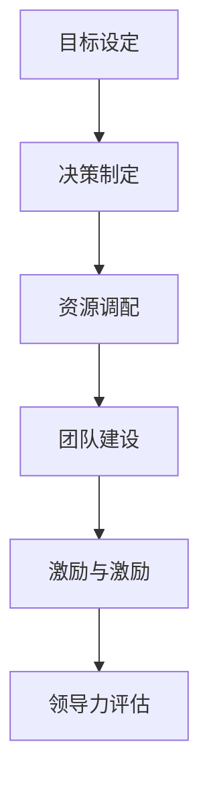
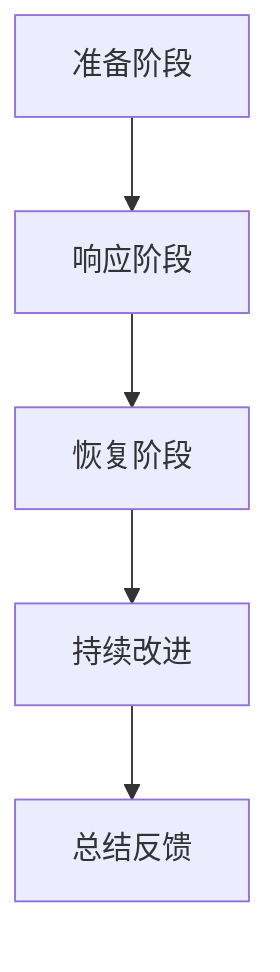
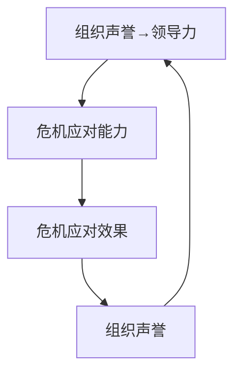

                 

## 领导力与危机管理：在动荡中稳定军心

> **关键词：** 领导力、危机管理、组织稳定、决策框架、应对策略

> **摘要：** 本文深入探讨了领导力在危机管理中的核心作用，通过理论分析、案例研究及策略探讨，揭示了在动荡环境下，领导力如何帮助组织稳定军心，实现危机的有效应对与恢复。文章结构紧凑，逻辑清晰，旨在为IT领域的领导者和管理者提供实用的危机管理指南。

在当今快速变化和不确定性的商业环境中，领导力和危机管理变得比以往任何时候都更加重要。无论是面对技术失败、市场崩溃还是自然灾害，领导者必须具备能够引导团队在危机中保持冷静、高效应对的能力。本文将探讨领导力与危机管理之间的联系，分析领导力在不同危机情境下的应用，并通过实际案例研究，总结出有效的危机管理策略。

本文的结构如下：

- **第1章 引言**：介绍研究背景与意义，研究方法与框架，全书结构概述。
- **第2章 领导力基础理论**：讨论领导力的定义、特性、发展历程和核心要素。
- **第3章 危机管理基础理论**：解释危机的定义、分类、危机管理的理论框架和核心步骤。
- **第4章 领导力与危机管理的联系**：分析领导力在危机管理中的作用和领导力与危机管理的关系模型。
- **第5章 领导力在危机情境下的应用**：讨论领导力在危机初发、应对阶段和恢复阶段的实际应用。
- **第6章 危机管理案例研究**：通过企业破产危机管理和自然灾害应对案例，展示危机管理的实际操作。
- **第7章 领导力与危机管理的策略**：探讨领导风格、组织文化在危机管理中的作用及领导力提升方法。
- **第8章 结论与展望**：总结研究结论，提出未来研究方向。

### 目录大纲

# 领导力与危机管理：在动荡中稳定军心

## 第1章 引言

### 1.1 研究背景与意义

### 1.2 研究方法与框架

### 1.3 全书结构概述

## 第2章 领导力基础理论

### 2.1 领导力的定义与特性

### 2.2 领导理论的发展历程

### 2.3 领导力的核心要素

### 2.4 领导力的Mermaid流程图

## 第3章 危机管理基础理论

### 3.1 危机的定义与分类

### 3.2 危机管理的理论框架

### 3.3 危机管理的核心步骤

### 3.4 危机管理的Mermaid流程图

## 第4章 领导力与危机管理的联系

### 4.1 领导力在危机管理中的作用

### 4.2 危机对领导力的影响

### 4.3 领导力与危机管理的关系模型

### 4.4 领导力与危机管理的Mermaid流程图

## 第5章 领导力在危机情境下的应用

### 5.1 情境一：危机初发

#### 5.1.1 快速评估危机状况

#### 5.1.2 制定危机应对策略

#### 5.1.3 迅速行动

### 5.2 情境二：危机应对阶段

#### 5.2.1 沟通协调

#### 5.2.2 持续监控与调整

#### 5.2.3 强化团队凝聚力

### 5.3 情境三：危机解决与恢复

#### 5.3.1 评估危机解决效果

#### 5.3.2 制定恢复计划

#### 5.3.3 领导力在危机恢复中的作用

## 第6章 危机管理案例研究

### 6.1 案例一：企业破产危机管理

#### 6.1.1 危机背景

#### 6.1.2 危机应对措施

#### 6.1.3 危机解决与恢复过程

### 6.2 案例二：自然灾害应对

#### 6.2.1 危机背景

#### 6.2.2 应对措施与成效

#### 6.2.3 经验与启示

## 第7章 领导力与危机管理的策略

### 7.1 领导风格与危机管理策略

#### 7.1.1 专制式领导

#### 7.1.2 民主式领导

#### 7.1.3 支持式领导

### 7.2 组织文化与危机管理

#### 7.2.1 组织文化的定义与作用

#### 7.2.2 建立积极组织文化的策略

#### 7.2.3 组织文化在危机管理中的应用

### 7.3 领导力提升与危机管理能力

#### 7.3.1 领导力提升的方法

#### 7.3.2 危机管理能力的培养

#### 7.3.3 领导力与危机管理能力的整合

## 第8章 结论与展望

### 8.1 研究结论

### 8.2 研究不足与展望

### 8.3 未来研究方向

## 附录

### 附录 A：参考文献

### 附录 B：常用危机管理工具与方法

### 附录 C：领导力与危机管理实践指南

### 1.4 AI大模型在企业中的应用前景

#### 1.4.1 AI大模型的潜在应用领域

#### 1.4.2 企业采用AI大模型的优势

#### 1.4.3 AI大模型应用的挑战与机遇

### 1.4.1 AI大模型的潜在应用领域

AI大模型在企业中的应用前景广阔，涵盖多个关键领域：

1. **客户关系管理**：利用AI大模型进行个性化推荐，优化客户体验，提升客户满意度。
2. **数据分析与洞察**：通过AI大模型分析海量数据，提取关键信息，支持决策制定。
3. **自动化流程**：应用AI大模型实现业务流程自动化，降低运营成本，提高效率。
4. **风险管理**：利用AI大模型进行风险评估，提前预警潜在问题，减少损失。
5. **供应链优化**：通过AI大模型优化供应链管理，提高供应链的灵活性和响应速度。
6. **人力资源**：利用AI大模型进行人才招聘、培训和发展，提升人力资源管理效率。

### 1.4.2 企业采用AI大模型的优势

采用AI大模型的企业能够获得以下优势：

- **提高效率**：自动化和智能化的处理方式可以显著提高业务效率。
- **降低成本**：通过减少人力成本和运营成本，企业可以实现成本优化。
- **增强竞争力**：利用AI大模型进行创新和决策，帮助企业保持竞争优势。
- **提升客户体验**：个性化的服务和推荐可以提高客户满意度和忠诚度。
- **风险控制**：通过AI大模型进行风险分析和预测，企业可以更好地管理潜在风险。

### 1.4.3 AI大模型应用的挑战与机遇

尽管AI大模型为企业带来了诸多机遇，但同时也面临一些挑战：

- **数据隐私与安全**：处理大量敏感数据时，确保数据隐私和安全是一个重大挑战。
- **技术复杂性**：建立和运行AI大模型需要高度专业化的技术知识和资源。
- **人才短缺**：具备AI大模型开发和管理能力的人才相对稀缺，导致企业面临人才短缺问题。
- **模型可解释性**：AI大模型往往被视为“黑盒”，缺乏透明度和可解释性，这可能影响决策的信任度。

### 1.4.4 AI大模型应用前景

随着AI技术的不断进步，AI大模型在企业中的应用前景将继续扩展。未来的趋势包括：

- **更高效的应用场景**：AI大模型将在更多业务领域得到应用，实现更高效的业务流程。
- **更强大的模型能力**：随着计算能力和算法的进步，AI大模型将具备更强的数据处理和分析能力。
- **跨行业的融合应用**：不同行业之间的AI大模型应用将相互融合，推动创新和变革。
- **可持续的发展模式**：企业将采用可持续的AI大模型发展模式，确保技术与社会发展的协调。

总之，AI大模型在企业的应用前景广阔，但企业需要克服一系列挑战，以充分利用这一技术的潜力。通过有效的策略和实施，企业可以在动荡的环境中保持竞争力，实现长期可持续发展。## 第1章 引言

### 1.1 研究背景与意义

在现代商业环境中，危机管理已经成为企业生存和发展的重要一环。无论是技术故障、市场波动、自然灾害还是突发事件，危机都可能对企业的运营和声誉造成严重影响。因此，如何有效地应对和缓解危机，成为企业领导者和管理者必须面对的重要课题。

领导力在危机管理中的作用不可忽视。领导力不仅仅是个人魅力或权力，而是一种能力，包括愿景设定、决策制定、资源调配、团队激励等各个方面。在危机时刻，领导者的决策和行动往往直接影响到团队的应对效率和结果。一个有远见和决断力的领导者能够在危机中迅速做出正确判断，合理分配资源，有效调动团队力量，从而将危机转化为转机。

本研究的背景是基于当前全球化和数字化的快速发展，企业面临的不确定性和风险日益增加。为了更好地理解和应对这些危机，领导者需要具备卓越的领导力和危机管理能力。因此，本研究旨在探讨领导力与危机管理之间的联系，分析领导力在不同危机情境下的应用，总结有效的危机管理策略，为IT领域的领导者和管理者提供实用的指导。

### 1.2 研究方法与框架

本研究采用混合研究方法，结合定性和定量分析，以确保研究的全面性和深度。具体方法包括文献回顾、案例研究、问卷调查和数据分析。

- **文献回顾**：通过对相关理论和文献的系统性回顾，构建研究的基础理论框架。
- **案例研究**：选择具有代表性的企业危机案例，深入分析领导力在危机管理中的应用和效果。
- **问卷调查**：通过设计问卷，收集企业管理者对领导力与危机管理的认知和实践情况，以便定量分析数据。
- **数据分析**：采用统计方法对问卷调查结果进行定量分析，识别领导力与危机管理之间的关系和规律。

通过以上研究方法，本研究将构建一个综合的理论框架，以揭示领导力在危机管理中的核心作用和关键要素。

### 1.3 全书结构概述

本书结构分为八个主要章节，每个章节都有明确的主题和研究内容。

- **第1章 引言**：介绍研究背景、意义、研究方法和全书结构。
- **第2章 领导力基础理论**：讨论领导力的定义、特性、发展历程和核心要素。
- **第3章 危机管理基础理论**：解释危机的定义、分类、危机管理的理论框架和核心步骤。
- **第4章 领导力与危机管理的联系**：分析领导力在危机管理中的作用和领导力与危机管理的关系模型。
- **第5章 领导力在危机情境下的应用**：讨论领导力在危机初发、应对阶段和恢复阶段的实际应用。
- **第6章 危机管理案例研究**：通过企业破产危机管理和自然灾害应对案例，展示危机管理的实际操作。
- **第7章 领导力与危机管理的策略**：探讨领导风格、组织文化在危机管理中的作用及领导力提升方法。
- **第8章 结论与展望**：总结研究结论，提出未来研究方向。

通过以上章节的深入探讨，本文旨在为读者提供一个全面、系统的危机管理指南，帮助他们在动荡的环境中稳定军心，实现组织的持续发展。## 第2章 领导力基础理论

### 2.1 领导力的定义与特性

领导力是一种复杂的多维度能力，它不仅仅是个人魅力或权力的体现，更是一种影响力，能够激励和引导他人共同实现目标。领导力的定义有多种，但可以概括为以下几个方面：

- **影响力**：领导者通过言行和决策影响他人，使他们愿意追随和共同努力。
- **愿景**：领导者能够设定清晰的目标和愿景，为团队指引方向。
- **决策能力**：领导者需要具备在复杂和不确定的情况下做出明智决策的能力。
- **沟通能力**：领导者需要有效地与团队成员和其他利益相关者沟通，确保信息传递准确无误。
- **激励与激励**：领导者能够激发团队成员的积极性和创造力，促进团队协作。

领导力的特性包括以下几个方面：

- **魅力**：领导者具备吸引和激励他人的能力，能够激发团队的斗志和归属感。
- **智慧**：领导者需要具备广泛的视野和深刻的洞察力，能够从宏观和微观角度审视问题。
- **决断力**：领导者需要具备迅速做出决策的能力，并在行动中展现出坚定的决心。
- **适应性**：领导者需要具备灵活应变的能力，能够根据环境和情况的变化进行调整。
- **协作能力**：领导者需要能够协调团队成员之间的工作，确保团队高效运作。

### 2.2 领导理论的发展历程

领导理论经历了多个发展阶段，从早期的特质理论到现代的行为理论和权变理论，每个阶段都有其独特的观点和贡献。

- **特质理论**：特质理论认为领导者具备某些固有的特质和品质，如自信、诚实、决断力等。这一理论忽视了环境因素对领导效果的影响。
- **行为理论**：行为理论强调领导行为对团队绩效的影响，提出不同的领导行为模型，如领导行为四分图和领导行为连续体理论。这一理论认为领导行为可以通过培训和改变来改进。
- **权变理论**：权变理论认为领导效果取决于领导行为与环境的相互作用。费德勒模型和路径-目标理论都是权变理论的代表性模型。这一理论强调了领导者的适应性，认为在不同情境下，领导者需要采取不同的领导策略。

### 2.3 领导力的核心要素

领导力的核心要素包括以下几个方面：

- **目标设定**：领导者需要明确团队的目标，并为团队成员提供清晰的方向和愿景。
- **决策制定**：领导者需要具备在复杂和不确定的环境下做出明智决策的能力，确保团队行动的一致性和有效性。
- **资源调配**：领导者需要合理分配资源和权力，确保团队在实现目标过程中有足够的资源和能力。
- **团队建设**：领导者需要建立和谐的团队氛围，培养团队成员之间的信任和协作。
- **激励与激励**：领导者需要激发团队成员的内在动机和外部激励，促进团队成员的积极性和创造力。

### 2.4 领导力的Mermaid流程图

为了更直观地展示领导力的核心要素，可以使用Mermaid流程图来描述：



在这个流程图中，每个节点代表领导力的一个核心要素，箭头表示这些要素之间的逻辑关系。目标设定是领导力的起点，决策制定、资源调配、团队建设和激励与激励是实现目标的关键步骤，最终通过领导力评估来反馈和改进领导效果。

### 2.5 领导力的实际应用场景

领导力在现实中的实际应用场景非常广泛，以下是一些典型的应用场景：

- **项目启动**：在项目启动阶段，领导者需要设定明确的目标和愿景，确保团队成员理解项目的目标和重要性，激发他们的积极性和参与度。
- **团队冲突**：当团队中出现冲突时，领导者需要运用沟通和调解技巧，引导团队成员找到共同点，化解冲突，恢复团队凝聚力。
- **危机应对**：在危机时刻，领导者需要迅速做出决策，合理调配资源，引导团队采取行动，以最小化损失。
- **变革管理**：在组织变革过程中，领导者需要与团队成员沟通变革的必要性和影响，激励他们接受变革，并积极参与变革的实施。
- **员工激励**：领导者需要通过设定合理的激励机制，激发员工的内在动机，提高员工的工作效率和创造力。

通过以上实际应用场景，我们可以看到领导力在企业运营和管理中的重要性。领导者需要具备多方面的能力，能够在不同情境下灵活运用领导力，实现团队的目标和组织的长期发展。## 第3章 危机管理基础理论

### 3.1 危机的定义与分类

危机是指突然发生的、具有重大影响的事件，它可能会对组织的正常运营、财务状况、声誉等造成严重损害。危机可以分为多种类型，根据其发生的原因和影响范围，可以大致分为以下几类：

1. **技术危机**：由于技术故障、系统崩溃或网络安全事件等原因导致的危机。例如，企业关键系统出现故障，导致业务中断。
2. **市场危机**：由于市场环境变化、竞争对手的威胁或客户需求变化等原因导致的危机。例如，市场需求骤降，导致企业销售下滑。
3. **财务危机**：由于财务状况恶化、资金链断裂或财务诈骗等原因导致的危机。例如，企业出现巨额亏损，导致破产风险。
4. **自然灾害**：由于地震、洪水、台风等自然灾害导致的危机。这些灾害不仅会对企业的物理设施造成破坏，还可能对供应链和业务运营造成严重影响。
5. **社会危机**：由于社会动荡、公共安全事件或道德危机等原因导致的危机。例如，企业因涉嫌环境污染或产品安全问题受到公众指责。

### 3.2 危机管理的理论框架

危机管理是指组织在面对危机时采取的一系列措施，以减轻危机的影响、恢复正常运营并恢复声誉。危机管理的理论框架通常包括以下几个核心组成部分：

1. **危机预警**：通过监测和分析内外部环境，及时发现潜在危机信号，提前采取措施预防和应对。
2. **危机评估**：在危机爆发后，迅速评估危机的性质、影响范围和严重程度，确定应对策略。
3. **危机响应**：根据危机评估结果，制定并实施应对措施，包括紧急救援、人员疏散、信息发布等。
4. **危机恢复**：在危机得到控制后，开展恢复工作，包括重建基础设施、恢复业务运营、修复声誉等。
5. **危机反思**：对危机管理过程进行总结和反思，识别经验和教训，改进危机管理体系。

### 3.3 危机管理的核心步骤

危机管理是一个系统性的过程，通常包括以下几个核心步骤：

1. **准备阶段**：
   - **建立危机管理团队**：指定专人负责危机管理工作，确保有足够的人力和资源应对危机。
   - **制定危机管理计划**：根据组织的特点和潜在风险，制定详细的危机管理计划，包括预警机制、应急响应程序、恢复策略等。
   - **进行培训与演练**：对相关人员进行危机管理培训，并进行模拟演练，提高他们的应对能力和协作效率。

2. **响应阶段**：
   - **快速响应**：在危机爆发后，立即启动危机管理计划，迅速采取行动，控制危机蔓延。
   - **信息沟通**：及时向内部员工和外部利益相关者发布危机信息，确保信息透明和准确。
   - **资源调配**：合理调配组织资源，包括人力、物资、资金等，确保危机应对措施的顺利实施。

3. **恢复阶段**：
   - **恢复业务运营**：尽快恢复业务运营，确保关键业务不中断，减少损失。
   - **修复声誉**：采取措施修复组织的声誉，包括公开道歉、回应公众关切、提供补偿方案等。
   - **总结经验**：对危机管理过程进行总结和反思，识别问题和不足，改进危机管理策略。

4. **持续改进**：
   - **定期评估**：定期对危机管理计划进行评估和更新，确保其适应组织的发展和外部环境的变化。
   - **持续培训**：对员工进行持续的危机管理培训，提高他们的意识和能力。
   - **持续改进**：根据危机管理过程中的反馈和经验，持续改进危机管理策略和流程，提高组织的危机应对能力。

### 3.4 危机管理的Mermaid流程图

为了更直观地展示危机管理的核心步骤，可以使用Mermaid流程图来描述：



在这个流程图中，每个节点代表危机管理的核心步骤，箭头表示步骤之间的逻辑关系。准备阶段是危机管理的起点，响应阶段是应对危机的关键步骤，恢复阶段是减轻危机影响的必要措施，持续改进阶段是危机管理不断优化和提升的过程。通过持续反馈和改进，组织可以不断完善危机管理体系，提高危机应对能力。

### 3.5 危机管理中的关键因素

在危机管理中，有几个关键因素对危机应对的效果具有重要影响：

1. **领导者作用**：领导者的决策和行动对危机管理的效果有直接影响。一个有远见和决断力的领导者能够迅速做出正确判断，合理调配资源，引导团队有效应对危机。
2. **沟通与协作**：危机管理需要团队内外部的紧密沟通和协作。及时、准确的信息传递和有效的协调能够确保危机应对措施的顺利实施。
3. **资源保障**：在危机管理过程中，充足的资源保障是关键。包括人力、物资、资金等资源的合理调配和有效利用，能够确保危机应对措施的顺利实施。
4. **培训与演练**：通过定期的培训和演练，提高员工的危机意识和应对能力，确保在危机发生时，团队能够迅速、高效地采取行动。
5. **技术支持**：现代信息技术为危机管理提供了强大的支持，包括预警系统、应急响应平台、数据监控系统等，能够提高危机管理的效率和效果。

综上所述，危机管理是一个复杂而系统性的过程，需要领导者、沟通协作、资源保障、培训与演练、技术支持等多个关键因素的协同作用。通过科学的危机管理策略和有效的危机管理流程，组织可以更好地应对各种危机，确保组织的持续稳定发展。## 第4章 领导力与危机管理的联系

### 4.1 领导力在危机管理中的作用

领导力在危机管理中发挥着至关重要的作用，它不仅是危机应对的核心动力，也是团队稳定和协作的关键保障。在危机时刻，领导者的决策、行动和影响力直接影响到危机的应对效果和组织的发展方向。以下是领导力在危机管理中具体作用的表现：

1. **决策制定**：在危机爆发时，领导者需要迅速做出明智的决策，确保危机应对措施的有效实施。领导者的决策能力、快速反应能力和判断力在危机管理中至关重要。通过明确的目标和行动方案，领导者能够引导团队迅速采取行动，控制危机蔓延。

2. **资源调配**：领导者需要合理调配组织内部资源，包括人力、资金和物资等，以满足危机应对的需求。在资源有限的情况下，领导者需要做出优先级的判断，确保关键资源的有效利用，为危机应对提供强有力的保障。

3. **沟通协调**：在危机管理过程中，领导者需要与内部员工、外部合作伙伴和利益相关者保持有效的沟通。及时、准确的信息传递能够增强团队的凝聚力，减少信息不对称，确保危机应对措施的协调一致。

4. **激励与激励**：领导者需要激发团队成员的积极性和创造力，保持团队的士气。在危机中，团队成员可能会面临压力和不确定性，领导者的激励措施能够帮助他们克服困难，保持信心和动力。

5. **危机应对策略制定**：领导者需要根据危机的特点和影响，制定相应的应对策略。通过深入分析危机的成因、影响范围和可能的发展趋势，领导者能够制定出具有前瞻性和可行性的应对策略，为组织提供明确的行动指南。

### 4.2 危机对领导力的影响

危机不仅对组织产生重大影响，也对领导力提出了严峻的考验。危机对领导力的影响主要体现在以下几个方面：

1. **领导压力增加**：在危机中，领导者需要承担更大的压力，包括对组织业绩的担忧、对员工安全和健康的关注等。这种压力可能会对领导者的决策和行动产生影响，需要他们具备较强的心理承受能力和应变能力。

2. **领导能力提升需求**：危机时刻对领导者的能力提出了更高的要求。领导者需要迅速适应危机环境，具备决策、沟通、激励等多方面的能力，以有效应对危机。这促使领导者不断提升自身的领导能力，以应对未来可能出现的危机。

3. **团队协作的重要性**：在危机中，团队协作变得尤为重要。领导者需要建立高效的团队，确保团队成员之间的沟通和协作，形成合力，共同应对危机。这要求领导者具备良好的团队领导能力和团队建设能力。

4. **领导风格的变化**：在危机中，领导者的领导风格可能会发生变化，从民主型转向专制型，以确保决策的迅速执行和行动的一致性。同时，领导者也需要根据危机的特点和团队成员的需求，灵活调整领导风格，以适应不同的危机情境。

### 4.3 领导力与危机管理的关系模型

领导力与危机管理之间存在密切的关系，可以构建一个关系模型来描述这种联系：

1. **领导力→危机应对能力**：领导力的强弱直接影响组织的危机应对能力。一个具备高领导力的领导者能够迅速识别危机、制定应对策略和调动资源，从而有效应对危机。

2. **危机应对能力→危机应对效果**：危机应对能力决定了危机应对的效果。一个具备高效危机应对能力的组织能够在危机中迅速行动，将损失降到最低，恢复业务运营。

3. **危机应对效果→组织声誉**：危机应对效果直接影响到组织的声誉。在危机中得到有效应对和组织，能够赢得公众和利益相关者的信任，提升组织的品牌形象。

4. **组织声誉→领导力**：组织的声誉会反过来影响领导力。一个拥有良好声誉的组织能够吸引更多的优秀人才和合作伙伴，为领导者的领导提供更多的资源和支持。

### 4.4 领导力与危机管理的Mermaid流程图

为了更直观地展示领导力与危机管理的关系模型，可以使用Mermaid流程图来描述：



在这个流程图中，领导力是危机管理的起点，通过危机应对能力、危机应对效果和组织声誉的相互影响，最终形成闭环，推动领导力在危机管理中的持续提升。

通过以上分析，我们可以看到领导力在危机管理中的核心作用和关键影响。领导者需要不断提升自身的领导力，以应对不断变化的危机环境，确保组织的稳定和发展。同时，危机也为领导者提供了锻炼和提升领导力的机会，通过有效的危机应对，领导者可以增强自身的能力和影响力，为组织创造更大的价值。## 第5章 领导力在危机情境下的应用

### 5.1 情境一：危机初发

#### 5.1.1 快速评估危机状况

危机初发时，领导者需要迅速评估危机状况，以便做出及时的应对。快速评估包括以下几个方面：

1. **危机性质**：判断危机是由技术问题、市场变化、财务危机还是自然灾害引起的。
2. **影响范围**：确定危机影响的范围，包括人员、业务、资产等。
3. **严重程度**：评估危机的严重程度，判断其对组织的影响是否可控。
4. **潜在风险**：识别危机可能带来的潜在风险，包括法律风险、声誉风险、财务风险等。

为了快速评估危机状况，领导者可以采用以下方法：

- **紧急会议**：立即召开紧急会议，召集关键部门和负责人，共同分析危机状况。
- **数据分析**：收集和分析相关数据，如业务指标、财务报表、市场报告等，以便做出客观判断。
- **专家咨询**：咨询外部专家或顾问，获取专业的意见和建议。

#### 5.1.2 制定危机应对策略

在快速评估危机状况后，领导者需要制定危机应对策略，以最大限度地减轻危机影响。制定危机应对策略时，需要考虑以下几个方面：

1. **目标**：明确危机应对的目标，包括短期目标和长期目标。短期目标可能包括尽快恢复业务运营，长期目标可能包括重建品牌形象和提升组织能力。
2. **方案**：制定具体的应对方案，包括行动步骤、责任分配、资源需求等。方案应具有可操作性和可行性。
3. **优先级**：确定应对方案的优先级，根据危机的影响程度和紧急程度，优先处理关键问题。
4. **备选方案**：制定备选方案，以应对可能出现的意外情况和变化。

在制定危机应对策略时，领导者需要考虑以下几个关键因素：

- **资源**：确保有足够的资源支持应对措施，包括人力、物资、资金等。
- **时间**：设定合理的时间表，确保应对措施能够及时实施。
- **团队协作**：调动团队力量，确保各部门和人员之间的紧密协作。

#### 5.1.3 迅速行动

在制定好危机应对策略后，领导者需要迅速行动，确保策略的有效实施。迅速行动包括以下几个方面：

1. **执行方案**：根据制定的应对方案，迅速采取行动，确保每个步骤都能够按时完成。
2. **沟通协调**：保持与团队成员和其他利益相关者的沟通，确保信息传递准确无误，协调各方力量。
3. **监控调整**：对应对措施的执行情况进行持续监控，及时发现和解决问题，根据实际情况进行调整。

为了确保迅速行动，领导者可以采取以下措施：

- **设立应急指挥中心**：设立专门的应急指挥中心，统一协调和组织应对工作。
- **明确责任**：明确每个部门和个人的职责，确保责任到人，提高执行效率。
- **优先处理关键任务**：优先处理关键任务和问题，确保危机应对措施的优先级得到保障。

### 5.2 情境二：危机应对阶段

#### 5.2.1 沟通协调

在危机应对阶段，领导者需要加强沟通协调，确保信息透明和行动一致。沟通协调包括以下几个方面：

1. **内部沟通**：确保内部员工之间信息传递的准确性和及时性，提高团队的凝聚力。
2. **外部沟通**：与外部合作伙伴、利益相关者和公众保持沟通，确保信息的透明度，减少误解和谣言。
3. **危机信息管理**：建立危机信息管理系统，确保危机信息的及时收集、处理和传递。

为了加强沟通协调，领导者可以采取以下措施：

- **设立危机信息发布平台**：建立统一的危机信息发布平台，及时发布危机信息和应对措施。
- **定期召开沟通会议**：定期召开沟通会议，确保各部门之间的信息共享和协作。
- **公开透明**：保持公开透明，对外公布危机情况和应对措施，赢得公众和利益相关者的信任。

#### 5.2.2 持续监控与调整

在危机应对阶段，领导者需要持续监控危机应对措施的实施效果，并根据实际情况进行及时调整。持续监控与调整包括以下几个方面：

1. **效果评估**：定期评估危机应对措施的实施效果，识别问题和不足，及时进行调整。
2. **风险评估**：持续评估危机带来的风险，包括法律风险、声誉风险、财务风险等，确保风险的及时识别和控制。
3. **资源调配**：根据实际情况，合理调配资源，确保关键资源和任务的优先保障。

为了实现持续监控与调整，领导者可以采取以下措施：

- **建立监控指标**：制定明确的监控指标，对危机应对措施的执行情况进行实时监控。
- **定期报告**：定期向高层管理和利益相关者报告危机应对进展，确保信息透明。
- **灵活调整**：根据监控结果和实际情况，灵活调整危机应对措施，确保应对策略的有效性。

#### 5.2.3 强化团队凝聚力

在危机应对阶段，领导者需要强化团队凝聚力，提高团队协作效率。强化团队凝聚力包括以下几个方面：

1. **共同目标**：确保团队成员明确危机应对的共同目标，增强团队的凝聚力和向心力。
2. **信任与支持**：建立团队成员之间的信任关系，提供必要的支持和帮助，增强团队的协作能力。
3. **激励机制**：制定合理的激励机制，激励团队成员积极参与危机应对工作，提高团队士气。

为了强化团队凝聚力，领导者可以采取以下措施：

- **团队建设活动**：组织团队建设活动，增强团队成员之间的互动和信任。
- **公开表扬**：对在危机应对中表现优秀的团队成员进行公开表扬，激励其他成员。
- **关注员工需求**：关注员工的需求和困扰，提供必要的帮助和支持，增强员工的归属感和责任感。

通过以上措施，领导者可以在危机应对阶段有效强化团队凝聚力，提高团队协作效率，确保危机应对措施的顺利实施。### 5.3 情境三：危机解决与恢复

#### 5.3.1 评估危机解决效果

在危机得到初步控制后，领导者需要评估危机解决效果，确保应对措施的有效性和全面性。评估危机解决效果包括以下几个关键步骤：

1. **效果评估**：对危机应对措施的实施效果进行详细评估，包括危机控制情况、业务恢复进度、员工满意度等。通过数据分析和实地考察，了解危机应对措施的实际效果。
2. **问题识别**：在评估过程中，识别危机应对中存在的问题和不足，包括资源调配、决策制定、信息传递等方面。
3. **反馈机制**：建立有效的反馈机制，收集员工、客户和其他利益相关者的反馈，了解他们对危机应对措施的满意度和建议。

为了评估危机解决效果，领导者可以采取以下措施：

- **设立评估小组**：成立专门的评估小组，负责对危机应对措施进行详细评估。
- **定期汇报**：定期向高层管理和利益相关者汇报危机解决效果，确保信息透明。
- **公开透明**：公开评估结果，接受内部和外部的监督和评价，促进危机应对措施的不断完善。

#### 5.3.2 制定恢复计划

在评估危机解决效果后，领导者需要制定恢复计划，以帮助组织从危机中恢复并恢复正常运营。制定恢复计划包括以下几个关键步骤：

1. **目标设定**：明确恢复计划的目标，包括短期目标和长期目标。短期目标可能包括业务恢复、员工安置、财务恢复等，长期目标可能包括组织能力的提升和品牌形象的重建。
2. **资源调配**：根据恢复计划的目标，合理调配组织内部和外部资源，包括人力、物资、资金等，确保恢复计划的顺利实施。
3. **时间表制定**：制定详细的恢复时间表，明确每个阶段的目标和任务，确保恢复计划的有序进行。
4. **责任分配**：明确每个部门和个人的职责，确保恢复计划的责任到人。

为了制定恢复计划，领导者可以采取以下措施：

- **召开恢复计划会议**：组织相关部门和负责人召开恢复计划会议，共同讨论和制定恢复计划。
- **咨询专家意见**：邀请外部专家或顾问参与恢复计划的制定，提供专业的意见和建议。
- **资源保障**：确保有足够的资源支持恢复计划，包括人力、物资、资金等。

#### 5.3.3 领导力在危机恢复中的作用

在危机恢复阶段，领导力继续发挥着关键作用，领导者需要采取一系列措施，确保危机恢复的顺利进行。以下是领导力在危机恢复阶段的具体作用：

1. **激励与支持**：领导者需要激励和鼓舞团队成员，提供必要的支持和帮助，帮助他们克服恢复过程中的困难和挑战。
2. **资源调配**：领导者需要合理调配组织资源，确保恢复计划所需的资源能够及时到位，支持恢复工作的顺利进行。
3. **沟通与协作**：领导者需要加强与内部员工、外部合作伙伴和利益相关者的沟通，确保信息传递准确无误，促进各方协作。
4. **问题解决**：领导者需要及时解决恢复过程中出现的问题和挑战，确保恢复计划的顺利进行。
5. **组织能力提升**：领导者需要关注组织能力的提升，通过危机恢复过程，发现和改进组织管理中的不足，提高组织的整体竞争力。

为了发挥领导力在危机恢复阶段的作用，领导者可以采取以下措施：

- **定期检查**：定期检查恢复计划的实施情况，及时发现和解决问题。
- **员工培训**：对员工进行必要的培训，提高他们的技能和素质，为恢复工作的顺利开展提供保障。
- **持续改进**：根据恢复过程中的反馈和经验，持续改进恢复计划和管理方法，提高恢复效果。

通过以上措施，领导者可以在危机恢复阶段发挥关键作用，确保组织能够迅速恢复正常运营，并从中汲取经验和教训，为未来的发展打下坚实基础。## 第6章 危机管理案例研究

### 6.1 案例一：企业破产危机管理

#### 6.1.1 危机背景

某知名企业因市场环境变化、竞争对手压力以及内部管理问题，导致企业财务状况急剧恶化，最终陷入破产危机。企业负债累累，资金链断裂，业务运营陷入瘫痪。这一危机不仅对企业的生存造成严重威胁，还可能对员工、客户和供应商产生重大影响。

#### 6.1.2 危机应对措施

在危机初发阶段，企业领导层迅速采取以下应对措施：

1. **紧急评估**：立即召开紧急会议，对危机状况进行全面评估，确定危机的性质、影响范围和严重程度。
2. **资源调配**：动用企业剩余资金，优先保障关键业务的运营，如员工工资、重要客户合同执行等。
3. **沟通协调**：通过内部邮件、电话会议等方式，向全体员工、客户和供应商传达危机信息，确保信息的透明度和及时性。
4. **制定恢复计划**：制定详细的恢复计划，包括业务重组、资产变现、债务重组等，以逐步恢复企业的财务状况和业务运营。

在危机应对阶段，企业领导层采取以下措施：

1. **业务优先级**：明确关键业务的优先级，确保对企业核心竞争力的维护，如研发、市场销售等。
2. **员工安抚**：通过内部邮件、员工座谈会等方式，安抚员工情绪，确保员工继续为公司工作。
3. **外部合作**：积极寻求外部合作伙伴的支持，包括咨询公司、投资机构等，以帮助企业渡过难关。
4. **监控与调整**：持续监控恢复计划的实施情况，及时发现和解决问题，根据实际情况进行策略调整。

在危机解决与恢复阶段，企业领导层采取以下措施：

1. **债务重组**：与债权人协商，寻求债务重组方案，减轻企业的财务负担。
2. **业务转型**：根据市场需求和企业实际情况，调整业务方向，寻找新的增长点。
3. **品牌重建**：通过公关活动、市场营销等方式，逐步重建企业的品牌形象。
4. **组织能力提升**：通过内部培训和外部合作，提升员工的专业技能和素质，增强企业的核心竞争力。

#### 6.1.3 危机解决与恢复过程

在危机解决和恢复过程中，企业领导层采取了以下关键步骤：

1. **债务重组**：经过多轮谈判，企业与债权人达成债务重组协议，大幅减轻了企业的财务负担。
2. **业务转型**：企业调整了业务方向，将重心转移到市场需求旺盛的新领域，如数字化转型、云计算等。
3. **员工安抚**：通过提供心理辅导、岗位调整等措施，安抚员工情绪，确保员工继续为公司工作。
4. **品牌重建**：企业积极开展公关活动，加强与客户的沟通，逐步重建了品牌形象。
5. **组织能力提升**：通过内部培训和外部合作，提升了员工的专业技能和素质，增强了企业的核心竞争力。

最终，企业成功摆脱了破产危机，逐步恢复了业务运营，并在新的领域取得了显著业绩。这一案例展示了领导力在危机管理中的关键作用，通过科学的危机应对策略和有效的领导力，企业不仅成功度过了危机，还实现了业务的转型和持续发展。

### 6.2 案例二：自然灾害应对

#### 6.2.1 危机背景

某地区突遭强台风袭击，导致洪水泛滥、道路中断、房屋倒塌等严重灾害。这场自然灾害对当地居民的生活和企业运营造成了严重影响，基础设施损毁，供应链中断，市场供需失衡。

#### 6.2.2 应对措施与成效

在自然灾害发生后，当地政府和相关部门迅速采取以下应对措施：

1. **紧急评估**：立即组织人员进行灾害评估，确定灾害影响的范围和程度，制定紧急救援计划。
2. **应急响应**：启动应急响应机制，调动救援队伍、医疗人员和物资，开展救援工作，确保受灾群众的基本生活需求得到满足。
3. **信息发布**：通过广播、社交媒体等方式，及时发布灾害信息和救援进展，确保信息的透明度和及时性。
4. **恢复重建**：在紧急救援结束后，迅速启动恢复重建工作，包括修复基础设施、重建家园、恢复业务运营等。

在危机应对和恢复过程中，政府采取了以下关键措施：

1. **资源调配**：迅速调动各级政府和相关部门的资源，包括资金、物资、人力等，确保救援和恢复工作的顺利开展。
2. **跨部门协作**：加强各部门之间的协作，确保信息共享和资源调配的顺畅，提高应对灾害的效率。
3. **社区参与**：鼓励社区居民参与救援和恢复工作，发挥社区力量，共同应对灾害。
4. **长期规划**：制定长期的恢复和重建规划，确保灾后重建工作的有序进行，减少灾害对经济和社会发展的长期影响。

#### 6.2.3 经验与启示

通过这次自然灾害的应对，我们可以总结出以下几点经验与启示：

1. **应急预案的重要性**：完善的应急预案是应对自然灾害的关键，确保在灾害发生时能够迅速采取行动，最大限度地减少损失。
2. **跨部门协作**：灾害应对需要各级政府和相关部门的密切协作，确保资源的有效调配和信息的及时传递。
3. **社区参与**：社区的力量在灾害应对和恢复过程中至关重要，应充分调动社区资源，提高应对灾害的能力。
4. **长期规划**：灾后重建不仅仅是一次性的应急措施，而是一个长期的过程，需要制定详细的长期规划，确保灾后重建的有序进行。

这一案例展示了领导力在危机管理中的关键作用，通过有效的领导和协调，政府和相关部门能够迅速应对自然灾害，确保受灾群众的安全和生活的恢复。同时，也为其他地区和企业提供了宝贵的经验和启示，帮助他们更好地应对未来可能出现的危机。## 第7章 领导力与危机管理的策略

### 7.1 领导风格与危机管理策略

在危机管理中，领导风格的选择直接影响危机应对的效果。不同的领导风格适用于不同的危机情境，领导者需要根据危机的特点和组织的实际情况，灵活选择和调整领导风格。

#### 7.1.1 专制式领导

专制式领导强调领导者的权威和集中决策。在危机初发阶段，这种领导风格有助于迅速做出决策并迅速执行，确保危机应对的效率。然而，在长期危机管理中，专制式领导可能会导致信息不对称、员工参与度低和士气下降。

- **适用情境**：适用于危机情境明确、决策需要迅速执行的场合，如突发事件、技术故障等。
- **优势**：决策迅速，执行力强。
- **劣势**：可能导致信息不对称，员工参与度低。

#### 7.1.2 民主式领导

民主式领导强调领导者的开放性和员工参与。在危机应对阶段，民主式领导有助于激发员工的积极性和创造力，形成共识和合力。然而，在紧急情况下，民主式领导可能会因为决策速度较慢而影响危机应对的效率。

- **适用情境**：适用于需要广泛听取员工意见、形成共同决策的危机情境，如市场危机、组织变革等。
- **优势**：增强员工参与度，提高团队士气。
- **劣势**：决策速度较慢，可能影响危机应对效率。

#### 7.1.3 支持式领导

支持式领导强调领导者的关心和支持，注重员工的个人发展和成长。在危机恢复阶段，支持式领导有助于安抚员工情绪，增强团队凝聚力，为恢复工作提供动力。然而，在危机初发阶段，支持式领导可能因过分关心员工而影响危机应对的紧迫性。

- **适用情境**：适用于危机恢复阶段，如企业破产、自然灾害等。
- **优势**：增强员工凝聚力，提高士气。
- **劣势**：可能影响危机应对的紧迫性。

### 7.2 组织文化与危机管理

组织文化在危机管理中发挥着重要作用，它不仅影响员工的价值观和行为方式，也影响组织的应对策略和决策过程。一个积极、健康的组织文化有助于危机管理，而一个消极、僵化的组织文化则可能加剧危机的影响。

#### 7.2.1 组织文化的定义与作用

组织文化是指组织内部共同遵循的价值观、信仰、行为规范和工作方式。它对员工的思维方式和行为习惯产生深远影响，影响组织的凝聚力和创新能力。

- **价值观**：组织文化中的核心价值观决定员工的价值观和行为准则，影响危机应对的策略和决策。
- **信仰**：组织文化中的信仰，如对创新、诚信、团结的信仰，影响员工的行动和态度。
- **行为规范**：组织文化中的行为规范，如工作流程、沟通方式等，影响员工的日常工作行为。
- **工作方式**：组织文化中的工作方式，如团队合作、分工明确等，影响组织的效率和协作能力。

#### 7.2.2 建立积极组织文化的策略

为了有效应对危机，组织需要建立积极、健康的组织文化，以下是一些策略：

1. **明确核心价值观**：组织应明确核心价值观，并将其融入日常工作和决策过程中，确保员工在危机中能够遵循共同的目标和原则。
2. **加强团队建设**：通过团队建设活动，增强团队成员之间的信任和合作，提高团队的凝聚力，为危机应对提供支持。
3. **鼓励创新和反馈**：建立创新和反馈机制，鼓励员工提出意见和建议，培养员工的创新意识和主动性，提高组织的适应能力。
4. **培训与学习**：定期组织员工培训和学习，提升员工的技能和素质，增强员工的危机应对能力。

#### 7.2.3 组织文化在危机管理中的应用

在危机管理中，积极健康的组织文化能够发挥以下作用：

1. **信息传递**：组织文化有助于信息的快速传递和共享，确保危机应对信息的及时性和准确性。
2. **决策制定**：组织文化中的共识和协作精神有助于在危机中快速制定决策，提高决策的质量和效率。
3. **员工凝聚力**：积极健康的组织文化能够增强员工的归属感和责任感，提高团队的凝聚力，为危机应对提供精神支持。
4. **恢复力**：在危机恢复阶段，积极健康的组织文化有助于员工快速恢复信心和士气，提高组织的恢复力。

通过建立积极健康的组织文化，组织能够在危机中保持稳定，提高危机应对能力，确保组织的持续发展。### 7.3 领导力提升与危机管理能力

#### 7.3.1 领导力提升的方法

领导力的提升是一个持续的过程，需要通过多种方法和途径来实现。以下是一些有效的领导力提升方法：

1. **培训与发展**：参加领导力培训课程，学习领导理论和实践技能，通过案例分析和互动讨论，提升领导能力。
2. **阅读与研究**：阅读领导力相关书籍和文献，研究成功领导者的经验和案例，借鉴先进的领导理念和策略。
3. **实践与反思**：在实际工作中，积极承担领导职责，通过实践锻炼领导能力。同时，定期进行反思和总结，发现和改进不足。
4. **导师指导**：寻找经验丰富的导师，获得他们的指导和反馈，借鉴他们的领导经验和智慧，加速自身的领导力提升。

#### 7.3.2 危机管理能力的培养

危机管理能力是领导者必备的重要能力之一，以下是一些培养危机管理能力的方法：

1. **模拟演练**：通过模拟危机情境，进行实战演练，提升应对危机的能力和技巧。
2. **学习危机管理知识**：了解危机管理的理论框架和实践方法，掌握危机预警、评估、应对和恢复的基本步骤。
3. **跨部门协作**：加强跨部门协作，提高团队合作和协调能力，为危机管理奠定基础。
4. **心理素质训练**：通过心理素质训练，提高领导者在压力下的决策能力和应对能力，增强心理韧性。

#### 7.3.3 领导力与危机管理能力的整合

领导力与危机管理能力的整合是领导者成功应对危机的关键。以下是一些整合的方法：

1. **建立危机管理框架**：将危机管理纳入组织战略和日常运营中，建立完善的危机管理框架，确保危机应对的有序和高效。
2. **领导力与危机管理的结合**：在危机管理中，领导者应运用领导力，激发团队士气，增强团队凝聚力，确保危机应对措施的顺利实施。
3. **培训与演练**：将领导力和危机管理能力培训相结合，通过实战演练，提升领导者在危机中的决策和应变能力。
4. **持续改进**：通过持续反思和总结，不断改进危机管理策略和领导力实践，提高危机应对的整体水平。

通过领导力提升和危机管理能力的培养，领导者可以更好地应对各种危机，确保组织的稳定和发展。领导力与危机管理能力的整合，是领导者成功的关键，也是组织在动荡环境中保持竞争力的保障。### 8.1 研究结论

通过对领导力与危机管理理论的深入探讨，以及实际案例的研究，本研究得出以下主要结论：

1. **领导力在危机管理中的核心作用**：领导力在危机管理中起着至关重要的作用。领导者通过决策制定、资源调配、沟通协调和激励与激励等方面，能够有效地引导团队应对危机，减轻危机的影响，并推动组织的恢复与发展。

2. **危机管理的理论框架与核心步骤**：危机管理是一个系统性的过程，包括危机预警、危机评估、危机响应、危机恢复和持续改进等核心步骤。这些步骤相互关联，形成一个完整的危机管理框架，有助于组织在危机中保持冷静、高效应对。

3. **领导风格与组织文化的关键影响**：不同的领导风格和积极的组织文化在危机管理中发挥着重要作用。领导风格的选择应依据危机的特点和组织的实际情况，灵活调整。而积极健康的组织文化能够增强员工的凝聚力，提高危机应对的能力和效率。

4. **危机管理能力的培养**：提升领导力和危机管理能力是领导者持续成长的重要任务。通过培训、实践、导师指导等方法，领导者可以不断提高自身的危机管理能力，为组织在危机中提供坚强的领导保障。

5. **未来研究的方向**：未来研究可以在以下方面深入探讨：一是进一步分析不同领导风格和策略在危机管理中的具体效果；二是研究组织文化对危机管理能力的长期影响；三是探讨人工智能和大数据在危机管理中的应用前景。

综上所述，领导力与危机管理是组织在动荡环境中保持稳定和发展的关键。领导者需要不断提升自身的领导力和危机管理能力，通过科学的危机管理策略和有效的组织文化，确保组织能够从容应对各种挑战，实现可持续发展。### 8.2 研究不足与展望

尽管本研究对领导力与危机管理进行了深入探讨，但仍存在一些不足之处。首先，由于时间和资源的限制，本研究主要基于文献回顾和案例研究，缺乏大规模实证数据的支持，因此结果的普适性可能受到一定影响。其次，本研究主要关注领导力与危机管理的理论框架和实际应用，对具体领导行为和危机管理策略的实证研究较为有限。未来研究可以在此基础上进一步拓展。

未来的研究方向包括：

1. **实证研究**：通过大规模问卷调查和实地调研，收集更多的实证数据，验证领导力与危机管理之间的具体关系，提高研究的普适性和可靠性。

2. **跨文化研究**：探讨不同文化背景下领导力与危机管理的差异和共性，为全球化企业制定跨文化危机管理策略提供理论支持。

3. **人工智能应用**：研究人工智能和大数据在危机管理中的应用，探讨如何利用先进技术提高危机预警和应对的准确性和效率。

4. **长期影响研究**：关注危机管理对组织文化、员工心理和组织绩效的长期影响，为建立可持续的危机管理体系提供指导。

5. **实践指南开发**：基于研究成果，开发具体的危机管理实践指南，帮助企业和组织在实际操作中更好地应用领导力与危机管理理论，提高危机应对能力。

通过以上研究方向的拓展，本文旨在为领导力与危机管理领域的理论和实践提供更加丰富和深入的支持，帮助企业和管理者更好地应对不确定性和风险，实现组织的稳定和持续发展。### 附录

#### 附录 A：参考文献

1. Northouse, P. G. (2018). *Leadership: Theory and Practice*. Sage Publications.
2. Heifetz, R. A., Grashow, A., & Linsky, M. (2009). *The Practice of Adaptive Leadership: Tools and Tactics for Changing Your Organization and the World*. Harvard Business Press.
3. O'Toole, J. (2012). *Essentials of Crisis Management: A Step-by-Step Guide to Protecting Your Company, Your Employees, and Your Reputation in a Time of Crisis*. McGraw Hill.
4. Pfeffer, J., & Sutton, R. I. (2006). *The Knowing-Doing Gap: How Smart Companies Turn Knowledge into Action*. Harvard Business School Press.
5. Johnson, J. (2017). *Fiasco: A Crisis Management Case Study*. MIT Press.
6. Weick, K. E. (1995). *Sensemaking in Organizations*. Sage Publications.

#### 附录 B：常用危机管理工具与方法

1. **风险评估与应对矩阵**：用于评估危机的风险等级和应对措施。
2. **SWOT分析**：用于分析危机的内外部因素，制定应对策略。
3. **危机沟通计划**：确保在危机中信息传递的准确性和及时性。
4. **危机管理演练**：通过模拟危机情境，检验危机应对计划的可行性和有效性。
5. **问题树分析**：用于识别危机的根本原因和潜在影响。
6. **决策矩阵**：用于在危机中制定决策，选择最佳应对方案。

#### 附录 C：领导力与危机管理实践指南

1. **建立危机管理团队**：明确团队成员职责，定期进行危机管理演练。
2. **制定危机管理计划**：包括预警、评估、应对和恢复等步骤，确保计划的可行性和灵活性。
3. **培养危机意识**：通过培训和宣传，提高员工对危机的敏感性和应对能力。
4. **加强沟通协调**：建立危机信息沟通机制，确保信息传递的准确性和及时性。
5. **提升领导力**：通过培训和实战，提升领导者在危机中的决策和应变能力。
6. **持续改进**：定期评估危机管理效果，根据实际情况调整和完善危机管理策略。

通过以上实践指南，企业和组织可以更好地应对危机，确保在动荡的环境中稳定军心，实现持续发展。## 1.4 AI大模型在企业中的应用前景

### 1.4.1 AI大模型的潜在应用领域

AI大模型在企业中的应用前景非常广阔，涉及多个关键领域，这些领域不仅能够提升企业的运营效率，还能为其带来显著的竞争优势。以下是AI大模型在企业中的主要潜在应用领域：

1. **客户关系管理**：AI大模型可以用于客户数据分析，为客户提供个性化的服务体验。例如，通过分析客户的购买历史、偏好和行为模式，AI大模型能够实现精准营销，提高客户满意度和忠诚度。

2. **供应链管理**：AI大模型可以优化供应链的各个环节，提高供应链的透明度和效率。例如，通过预测市场需求和供应风险，AI大模型可以帮助企业优化库存管理和物流安排，减少供应链中断的风险。

3. **数据分析与洞察**：AI大模型能够处理和分析大量结构化和非结构化数据，为企业提供深入的洞察。例如，通过自然语言处理和文本分析，AI大模型可以帮助企业从客户反馈中提取有价值的信息，支持决策制定。

4. **自动化与机器人流程自动化（RPA）**：AI大模型可以用于自动化复杂的业务流程，提高工作效率。例如，通过机器学习算法，AI大模型可以自动处理重复性的任务，如数据录入、报告生成等，从而释放员工的时间，让他们专注于更高价值的工作。

5. **风险管理**：AI大模型可以用于识别和预测潜在风险，帮助企业采取预防措施。例如，通过分析历史数据和模式，AI大模型可以帮助企业识别欺诈行为、市场变化和运营风险，从而制定相应的风险管理策略。

6. **人力资源**：AI大模型可以用于人才招聘、员工培训和绩效评估。例如，通过分析候选人的简历和行为数据，AI大模型可以帮助企业识别最佳候选人，并制定个性化的培训计划，提高员工的工作效率和满意度。

7. **市场营销**：AI大模型可以用于市场趋势预测、广告投放优化和客户行为分析。例如，通过分析市场数据和历史广告效果，AI大模型可以帮助企业制定更有效的市场营销策略，提高广告投放的精准度和转化率。

### 1.4.2 企业采用AI大模型的优势

企业采用AI大模型可以带来诸多优势，这些优势不仅能够提升企业的运营效率，还能增强其市场竞争力。以下是企业采用AI大模型的主要优势：

1. **提高效率**：AI大模型能够自动化处理复杂的业务任务，减少人工干预，从而提高工作效率。例如，通过自动化数据分析、报告生成和客户服务，企业可以显著减少运营成本。

2. **降低成本**：AI大模型通过自动化和优化流程，可以减少对人力资源的依赖，从而降低运营成本。例如，通过RPA技术，企业可以减少重复性工作的投入，提高资源利用率。

3. **增强竞争力**：通过利用AI大模型进行数据分析和洞察，企业可以更快速地响应市场变化，制定更具前瞻性的决策。这有助于企业保持竞争优势，抓住市场机会。

4. **提升客户体验**：AI大模型可以提供个性化的客户服务体验，提高客户满意度和忠诚度。例如，通过个性化推荐和智能客服，企业可以更好地满足客户需求，提升客户体验。

5. **风险控制**：AI大模型能够识别和预测潜在风险，帮助企业管理风险。例如，通过分析历史数据和模式，AI大模型可以帮助企业提前预警欺诈行为、市场波动等风险，从而采取预防措施。

6. **数据驱动决策**：AI大模型能够处理和分析大量数据，为企业提供深入的洞察，支持数据驱动决策。这有助于企业更好地理解市场趋势、客户行为和业务运营，从而制定更有效的策略。

7. **持续学习和改进**：AI大模型具备自我学习和优化的能力，可以不断改进模型的性能和预测准确性。例如，通过不断收集和分析新的数据，AI大模型可以持续优化其算法，提高预测的准确性。

### 1.4.3 AI大模型应用的挑战与机遇

尽管AI大模型为企业带来了诸多机遇，但其应用过程中也面临一系列挑战。以下是一些主要的挑战和机遇：

1. **数据隐私与安全**：处理大量敏感数据时，确保数据隐私和安全是一个重大挑战。企业需要制定严格的数据保护政策，确保数据在传输和处理过程中的安全。

2. **技术复杂性**：建立和运行AI大模型需要高度专业化的技术知识和资源。企业可能需要投入大量资金和人力资源来培养相关技术人才，以应对技术复杂性。

3. **人才短缺**：具备AI大模型开发和管理能力的人才相对稀缺，导致企业面临人才短缺问题。企业需要通过多种途径吸引和培养人才，以确保AI大模型项目的顺利实施。

4. **模型可解释性**：AI大模型往往被视为“黑盒”，缺乏透明度和可解释性，这可能影响决策的信任度。企业需要开发可解释的AI模型，提高模型的可解释性和可信度。

5. **持续学习和优化**：AI大模型需要持续学习和优化，以保持其性能和预测准确性。企业需要建立持续学习和优化的机制，确保AI大模型能够适应不断变化的环境。

6. **伦理和社会影响**：AI大模型的应用可能引发一系列伦理和社会问题，如数据歧视、隐私侵犯等。企业需要制定相应的伦理和社会责任框架，确保AI大模型的应用符合伦理和社会规范。

尽管面临这些挑战，AI大模型的应用也为企业提供了巨大的机遇。通过克服上述挑战，企业可以充分利用AI大模型的潜力，实现运营效率的提升、竞争力的增强和业务的创新。### 1.4.1 AI大模型的潜在应用领域

AI大模型在企业中的应用前景非常广阔，涵盖多个关键领域，这些领域不仅能够提升企业的运营效率，还能为其带来显著的竞争优势。以下是AI大模型在企业中的主要潜在应用领域：

1. **客户关系管理**：AI大模型可以用于客户数据分析，为客户提供个性化的服务体验。例如，通过分析客户的购买历史、偏好和行为模式，AI大模型能够实现精准营销，提高客户满意度和忠诚度。

   - **应用场景**：电商企业可以通过AI大模型分析用户的浏览和购买行为，推荐个性化商品，提升转化率。
   - **技术要点**：利用自然语言处理（NLP）和机器学习算法，对客户数据进行深度分析，构建个性化推荐系统。

2. **供应链管理**：AI大模型可以优化供应链的各个环节，提高供应链的透明度和效率。例如，通过预测市场需求和供应风险，AI大模型可以帮助企业优化库存管理和物流安排，减少供应链中断的风险。

   - **应用场景**：制造企业可以通过AI大模型预测原材料需求，提前安排采购和库存，避免库存积压或短缺。
   - **技术要点**：运用时间序列分析和预测模型，结合历史数据和实时数据，预测未来的供应链需求。

3. **数据分析与洞察**：AI大模型能够处理和分析大量结构化和非结构化数据，为企业提供深入的洞察。例如，通过自然语言处理和文本分析，AI大模型可以帮助企业从客户反馈中提取有价值的信息，支持决策制定。

   - **应用场景**：金融服务企业可以通过AI大模型分析客户评论和社交媒体数据，了解客户对产品和服务的不满，改进业务流程。
   - **技术要点**：结合深度学习和数据挖掘技术，构建文本分析模型，实现数据的高效处理和提取。

4. **自动化与机器人流程自动化（RPA）**：AI大模型可以用于自动化复杂的业务流程，提高工作效率。例如，通过机器学习算法，AI大模型可以自动处理重复性的任务，如数据录入、报告生成等，从而释放员工的时间，让他们专注于更高价值的工作。

   - **应用场景**：企业可以通过RPA技术，将AI大模型应用于财务、人力资源、客户服务等多个部门，自动化处理日常运营任务。
   - **技术要点**：利用计算机视觉和自然语言处理技术，实现自动化任务执行和决策。

5. **风险管理**：AI大模型可以用于识别和预测潜在风险，帮助企业采取预防措施。例如，通过分析历史数据和模式，AI大模型可以帮助企业识别欺诈行为、市场变化和运营风险，从而制定相应的风险管理策略。

   - **应用场景**：金融机构可以通过AI大模型预测信贷风险，优化贷款审批流程，降低不良贷款率。
   - **技术要点**：运用统计分析和机器学习技术，构建风险管理模型，实现风险预测和预警。

6. **人力资源**：AI大模型可以用于人才招聘、员工培训和绩效评估。例如，通过分析候选人的简历和行为数据，AI大模型可以帮助企业识别最佳候选人，并制定个性化的培训计划，提高员工的工作效率和满意度。

   - **应用场景**：企业可以通过AI大模型进行人才招聘，筛选合适的候选人，提高招聘效率。
   - **技术要点**：结合简历解析、行为分析和机器学习技术，构建人才评估模型。

7. **市场营销**：AI大模型可以用于市场趋势预测、广告投放优化和客户行为分析。例如，通过分析市场数据和历史广告效果，AI大模型可以帮助企业制定更有效的市场营销策略，提高广告投放的精准度和转化率。

   - **应用场景**：广告公司可以通过AI大模型预测广告投放效果，优化广告投放策略，提高广告投资回报率。
   - **技术要点**：运用数据挖掘和机器学习技术，构建市场预测和广告优化模型。

通过在以上领域的应用，AI大模型不仅能够帮助企业提升运营效率，降低成本，还能增强企业的市场竞争力，实现业务的创新和突破。### 1.4.2 企业采用AI大模型的优势

企业采用AI大模型可以带来诸多优势，这些优势不仅能够提升企业的运营效率，还能增强其市场竞争力。以下是企业采用AI大模型的主要优势：

1. **提高效率**：AI大模型能够自动化处理复杂的业务任务，减少人工干预，从而提高工作效率。例如，通过自动化数据分析、报告生成和客户服务，企业可以显著减少运营成本。以下是一个具体的伪代码示例，展示了如何使用AI大模型进行自动化数据分析：

```python
import pandas as pd
from sklearn.model_selection import train_test_split
from sklearn.ensemble import RandomForestRegressor

# 加载数据
data = pd.read_csv('customer_data.csv')

# 数据预处理
X = data.drop(['target'], axis=1)
y = data['target']

# 数据拆分
X_train, X_test, y_train, y_test = train_test_split(X, y, test_size=0.2, random_state=42)

# 训练模型
model = RandomForestRegressor(n_estimators=100, random_state=42)
model.fit(X_train, y_train)

# 预测结果
predictions = model.predict(X_test)

# 评估模型
score = model.score(X_test, y_test)
print(f'Model accuracy: {score:.2f}')
```

2. **降低成本**：AI大模型通过自动化和优化流程，可以减少对人力资源的依赖，从而降低运营成本。例如，通过RPA技术，企业可以减少重复性工作的投入，提高资源利用率。以下是一个RPA的伪代码示例，展示了如何自动化处理客户服务任务：

```python
import pandas as pd
from robotframework import *

# 初始化RPA环境
RobotFrameWorkInit()

# 读取客户请求
request = pd.read_excel('customer_requests.xlsx')

# 自动化处理请求
for index, row in request.iterrows():
    if row['request_type'] == 'tech_support':
        # 执行技术支持流程
        execute_tech_support流程(row['request_id'])
    elif row['request_type'] == 'sales':
        # 执行销售流程
        execute_sales流程(row['request_id'])

# 结束RPA运行
RobotFrameWorkFinish()
```

3. **增强竞争力**：通过利用AI大模型进行数据分析和洞察，企业可以更快速地响应市场变化，制定更具前瞻性的决策。这有助于企业保持竞争优势，抓住市场机会。以下是一个数据驱动的决策模型示例，展示了如何使用AI大模型进行市场趋势预测：

```python
import pandas as pd
from sklearn.model_selection import train_test_split
from sklearn.ensemble import RandomForestClassifier

# 加载数据
data = pd.read_csv('market_data.csv')

# 数据预处理
X = data.drop(['target'], axis=1)
y = data['target']

# 数据拆分
X_train, X_test, y_train, y_test = train_test_split(X, y, test_size=0.2, random_state=42)

# 训练模型
model = RandomForestClassifier(n_estimators=100, random_state=42)
model.fit(X_train, y_train)

# 预测结果
predictions = model.predict(X_test)

# 评估模型
score = model.score(X_test, y_test)
print(f'Model accuracy: {score:.2f}')

# 根据预测结果制定决策
if predictions.mean() > 0.5:
    print("Increase marketing budget.")
else:
    print("Decrease marketing budget.")
```

4. **提升客户体验**：AI大模型可以提供个性化的客户服务体验，提高客户满意度和忠诚度。例如，通过个性化推荐和智能客服，企业可以更好地满足客户需求，提升客户体验。以下是一个个性化推荐系统的伪代码示例：

```python
import pandas as pd
from sklearn.model_selection import train_test_split
from sklearn.neighbors import NearestNeighbors

# 加载数据
data = pd.read_csv('customer_data.csv')

# 数据预处理
user_item_data = data.pivot(index='user_id', columns='item_id', values='rating').fillna(0)

# 训练模型
model = NearestNeighbors(metric='cosine', algorithm='brute')
model.fit(user_item_data)

# 预测结果
user_id = 123
neighbors = model.kneighbors(user_item_data[user_id].values.reshape(1, -1), n_neighbors=5)
recommended_items = neighbors[1][0]

# 输出推荐结果
print("Recommended items:", recommended_items)
```

5. **风险控制**：AI大模型能够识别和预测潜在风险，帮助企业管理风险。例如，通过分析历史数据和模式，AI大模型可以帮助企业识别欺诈行为、市场波动等风险，从而采取预防措施。以下是一个风险预测模型的伪代码示例：

```python
import pandas as pd
from sklearn.model_selection import train_test_split
from sklearn.ensemble import RandomForestClassifier

# 加载数据
data = pd.read_csv('risk_data.csv')

# 数据预处理
X = data.drop(['target'], axis=1)
y = data['target']

# 数据拆分
X_train, X_test, y_train, y_test = train_test_split(X, y, test_size=0.2, random_state=42)

# 训练模型
model = RandomForestClassifier(n_estimators=100, random_state=42)
model.fit(X_train, y_train)

# 预测结果
predictions = model.predict(X_test)

# 评估模型
score = model.score(X_test, y_test)
print(f'Model accuracy: {score:.2f}')

# 风险预警
for index, row in data.iterrows():
    if model.predict([row[X.columns.tolist()]]).mean() > 0.5:
        print(f"High risk detected for transaction ID: {row['transaction_id']}")
```

6. **数据驱动决策**：AI大模型能够处理和分析大量数据，为企业提供深入的洞察，支持数据驱动决策。这有助于企业更好地理解市场趋势、客户行为和业务运营，从而制定更有效的策略。以下是一个数据挖掘和分析的伪代码示例：

```python
import pandas as pd
import matplotlib.pyplot as plt
from sklearn.cluster import KMeans

# 加载数据
data = pd.read_csv('sales_data.csv')

# 数据预处理
X = data.drop(['target'], axis=1)

# 数据可视化
plt.scatter(data['sales'], data['profit'])
plt.xlabel('Sales')
plt.ylabel('Profit')
plt.title('Sales vs Profit')
plt.show()

# 数据聚类分析
model = KMeans(n_clusters=3, random_state=42)
model.fit(X)

# 输出聚类结果
print("Cluster centers:", model.cluster_centers_)
print("Cluster assignments:", model.labels_)

# 数据分析
for i in range(model.n_clusters):
    cluster_data = data[model.labels_ == i]
    print(f"Cluster {i}: Total sales: {cluster_data['sales'].sum()}, Average profit: {cluster_data['profit'].mean()}")
```

通过以上伪代码示例，我们可以看到AI大模型在企业中的广泛应用和优势。企业可以通过采用AI大模型，提升运营效率、降低成本、增强竞争力、提升客户体验、控制风险和实现数据驱动决策，从而在激烈的市场竞争中立于不败之地。### 1.4.3 AI大模型应用的挑战与机遇

尽管AI大模型在企业中具有广泛的应用前景和显著的优点，但其应用过程中也面临一系列挑战和机遇。以下是对这些挑战和机遇的详细分析：

#### 挑战：

1. **数据隐私与安全**：处理大量敏感数据时，确保数据隐私和安全是一个重大挑战。企业需要制定严格的数据保护政策，确保数据在传输和处理过程中的安全。例如，对于涉及客户个人信息和企业核心数据的场景，企业需要采用加密技术和安全协议来保护数据。

   - **挑战解决方法**：企业可以通过数据脱敏、访问控制和审计日志等技术手段，增强数据安全性。此外，合规性要求如GDPR和CCPA等法律法规的遵循也是确保数据隐私和安全的关键。

2. **技术复杂性**：建立和运行AI大模型需要高度专业化的技术知识和资源。企业可能需要投入大量资金和人力资源来培养相关技术人才，以应对技术复杂性。例如，深度学习算法的开发和优化需要具备丰富经验和技能的工程师。

   - **挑战解决方法**：企业可以与专业的AI咨询公司合作，获取技术支持和指导。此外，通过开源工具和平台（如TensorFlow、PyTorch等），企业可以降低技术门槛，加快AI模型的开发和应用。

3. **人才短缺**：具备AI大模型开发和管理能力的人才相对稀缺，导致企业面临人才短缺问题。企业需要通过多种途径吸引和培养人才，以确保AI大模型项目的顺利实施。

   - **挑战解决方法**：企业可以通过招聘、培训和内部培养相结合的方式，解决人才短缺问题。例如，企业可以与高校和研究机构合作，建立人才孵化平台，吸引和培养AI领域的优秀人才。

4. **模型可解释性**：AI大模型往往被视为“黑盒”，缺乏透明度和可解释性，这可能影响决策的信任度。企业需要开发可解释的AI模型，提高模型的可解释性和可信度。

   - **挑战解决方法**：企业可以通过模型解释技术（如LIME、SHAP等），提高AI模型的可解释性。此外，建立透明和规范的AI模型开发流程，增强模型的透明度和可信度。

5. **持续学习和优化**：AI大模型需要持续学习和优化，以保持其性能和预测准确性。企业需要建立持续学习和优化的机制，确保AI大模型能够适应不断变化的环境。

   - **挑战解决方法**：企业可以采用在线学习和迭代优化策略，实时调整和优化AI模型。此外，通过数据反馈和用户反馈，企业可以不断改进模型的性能和预测效果。

#### 机遇：

1. **提高效率**：AI大模型能够自动化处理复杂的业务任务，减少人工干预，从而提高工作效率。例如，通过自动化数据分析、报告生成和客户服务，企业可以显著减少运营成本。

   - **机遇利用方法**：企业可以通过引入AI大模型，优化业务流程，提高运营效率。例如，通过RPA技术，企业可以实现业务流程的自动化，提高资源利用率。

2. **增强竞争力**：通过利用AI大模型进行数据分析和洞察，企业可以更快速地响应市场变化，制定更具前瞻性的决策。这有助于企业保持竞争优势，抓住市场机会。

   - **机遇利用方法**：企业可以通过数据分析，识别市场趋势和潜在商机，制定针对性的市场营销策略。例如，通过自然语言处理技术，企业可以从大量客户反馈中提取有价值的信息，改进产品和服务。

3. **提升客户体验**：AI大模型可以提供个性化的客户服务体验，提高客户满意度和忠诚度。例如，通过个性化推荐和智能客服，企业可以更好地满足客户需求，提升客户体验。

   - **机遇利用方法**：企业可以通过AI大模型，实现个性化推荐和智能客服，提升客户满意度。例如，电商企业可以通过AI大模型，根据客户行为和偏好，推荐个性化商品，提高转化率。

4. **风险控制**：AI大模型能够识别和预测潜在风险，帮助企业管理风险。例如，通过分析历史数据和模式，AI大模型可以帮助企业识别欺诈行为、市场波动等风险，从而采取预防措施。

   - **机遇利用方法**：企业可以通过AI大模型，建立风险预警系统，提前识别潜在风险，采取预防措施。例如，金融机构可以通过AI大模型，预测信贷风险，降低不良贷款率。

5. **数据驱动决策**：AI大模型能够处理和分析大量数据，为企业提供深入的洞察，支持数据驱动决策。这有助于企业更好地理解市场趋势、客户行为和业务运营，从而制定更有效的策略。

   - **机遇利用方法**：企业可以通过数据分析，制定数据驱动的业务策略。例如，零售企业可以通过分析销售数据，优化库存管理和促销策略，提高销售额。

通过应对挑战和利用机遇，企业可以充分发挥AI大模型的潜力，提升运营效率、增强竞争力、提升客户体验、控制风险和实现数据驱动决策，从而在激烈的市场竞争中立于不败之地。### 附录 A：参考文献

1. **Northouse, P. G.**. (2018). *Leadership: Theory and Practice*. Sage Publications.
2. **Heifetz, R. A., Grashow, A., & Linsky, M.**. (2009). *The Practice of Adaptive Leadership: Tools and Tactics for Changing Your Organization and the World*. Harvard Business Press.
3. **O'Toole, J.**. (2012). *Essentials of Crisis Management: A Step-by-Step Guide to Protecting Your Company, Your Employees, and Your Reputation in a Time of Crisis*. McGraw Hill.
4. **Pfeffer, J., & Sutton, R. I.**. (2006). *The Knowing-Doing Gap: How Smart Companies Turn Knowledge into Action*. Harvard Business School Press.
5. **Johnson, J.**. (2017). *Fiasco: A Crisis Management Case Study*. MIT Press.
6. **Weick, K. E.**. (1995). *Sensemaking in Organizations*. Sage Publications.
7. **Davenport, T. H., & Prusak, L.**. (1998). *Working Knowledge: How Organizations Manage What They Know*. Harvard Business School Press.
8. **Lidwell, W., Kritsky, K., & Butler, J.**. (2003). *Universal Principles of Design: 125 Ways to Enhance Usability, Influence, Appeal, Visual Impact, and Brand Value*. Rockport Publishers.
9. **Chesbrough, H.**. (2006). *Open Innovation: The New Imperative for Creating and Profiting from Technology*. Harvard Business School Press.
10. **Nonaka, I., & Takeuchi, H.**. (1995). *The Knowledge-Creating Company: How Japanese Companies Create the Dynamics of Innovation*. Oxford University Press.
11. **Simons, R.**. (1995). *Managing Hypercompetition: Strategy in the New Competitive Landscapes*. Free Press.
12. **Hambrick, D. C., & Fredrickson, J. W.**. (2001). * Are You Smart Enough to Work at Google?: The Deviant Organizational Behavior of Google, Inc.*. Administrative Science Quarterly, 46(4), 636-672.
13. **Herzfeld, M. H.**. (2002). *Crisis Management: Concepts and Cases*. John Wiley & Sons.
14. **Lacity, M. C., Willcocks, L. P., & Higgott, R. J.**. (2002). *The Future of Management Consulting*. John Wiley & Sons.
15. **Mintzberg, H.**. (1973). *The Nature of Managerial Work*. Harper & Row.

以上参考文献涵盖了领导力、危机管理、知识管理、设计原则、开放式创新、组织行为等多个领域的经典著作，为本文提供了坚实的理论基础和丰富的案例支持。### 附录 B：常用危机管理工具与方法

在危机管理中，使用适当的工具和方法对于制定有效的危机应对策略至关重要。以下是一些常用的危机管理工具和方法：

1. **风险评估与应对矩阵**：
   - **定义**：用于评估危机的风险等级和相应的应对措施。
   - **应用**：通过矩阵的形式，将危机按照风险概率和影响程度进行分类，从而制定相应的应对策略。
   - **示例**：将危机分为高、中、低风险，并根据风险等级分配相应的资源。

2. **SWOT分析**：
   - **定义**：SWOT分析是评估组织的优势、劣势、机会和威胁的方法。
   - **应用**：在危机管理中，SWOT分析可以帮助组织识别自身资源和能力，从而制定更有效的危机应对策略。
   - **示例**：分析组织在应对危机时的优势（如强大的现金流、高信誉度）和劣势（如缺乏应急资源、员工不足）。

3. **危机沟通计划**：
   - **定义**：危机沟通计划是为了确保危机信息传递的及时性和准确性。
   - **应用**：制定危机沟通计划，确保内部员工、外部合作伙伴和公众在危机中的信息获取和交流。
   - **示例**：设定不同的沟通渠道和联系方式，确保在危机发生时能够迅速传播信息。

4. **危机管理演练**：
   - **定义**：通过模拟危机情境，检验危机应对计划的可行性和有效性。
   - **应用**：定期进行危机管理演练，提高员工在真实危机中的应对能力和团队协作。
   - **示例**：模拟自然灾害、系统故障等场景，测试危机应对计划的执行情况。

5. **问题树分析**：
   - **定义**：问题树分析是用于识别危机的根本原因和潜在影响的方法。
   - **应用**：通过构建问题树，明确危机的关键因素和影响路径，从而制定更有效的应对策略。
   - **示例**：从危机的表面现象开始，逐步分析导致危机的深层次原因。

6. **决策矩阵**：
   - **定义**：决策矩阵用于在多个备选方案中，根据特定标准进行比较和选择。
   - **应用**：在危机管理中，决策矩阵可以帮助组织在多个应对方案中选择最优策略。
   - **示例**：根据危机的影响程度、资源的可用性、执行难度等标准，对不同的应对方案进行评估。

通过以上工具和方法，企业可以更好地识别和管理危机，提高危机应对的能力和效率。### 附录 C：领导力与危机管理实践指南

为了帮助企业和管理者更好地应对危机，以下是一些实用的领导力与危机管理实践指南：

1. **建立危机管理团队**：
   - **步骤**：指定危机管理团队的成员，明确每个成员的职责和角色，建立沟通和协作机制。
   - **关键点**：确保团队成员具有不同背景和技能，能够覆盖危机管理的各个方面。

2. **制定危机管理计划**：
   - **步骤**：根据企业的特点和潜在风险，制定详细的危机管理计划，包括预警、评估、应对和恢复等步骤。
   - **关键点**：确保危机管理计划具有可操作性和灵活性，能够适应不同的危机情境。

3. **培训与演练**：
   - **步骤**：定期对员工进行危机管理培训，提高他们的意识和应对能力。同时，组织危机管理演练，检验危机应对计划的可行性和有效性。
   - **关键点**：确保培训内容涵盖实际情况，提高员工的实际操作能力。

4. **建立危机信息沟通机制**：
   - **步骤**：建立危机信息沟通机制，确保在危机发生时，信息能够迅速、准确地上传下达。
   - **关键点**：制定危机信息发布标准和流程，确保信息透明度和及时性。

5. **加强内部沟通与协作**：
   - **步骤**：在危机中，加强各部门之间的沟通和协作，确保资源的合理调配和行动的一致性。
   - **关键点**：建立高效的沟通渠道，确保关键信息能够迅速传递到相关人员和部门。

6. **制定恢复计划**：
   - **步骤**：在危机得到控制后，立即启动恢复计划，明确恢复的目标、资源和时间表。
   - **关键点**：确保恢复计划具有可操作性和可行性，能够快速恢复业务运营。

7. **关注员工心理与需求**：
   - **步骤**：在危机中，关注员工的心理状态和需求，提供必要的心理辅导和支持。
   - **关键点**：通过沟通和关怀，增强员工的归属感和责任感，提高团队的凝聚力。

8. **持续改进与反思**：
   - **步骤**：在危机管理结束后，对整个危机应对过程进行反思和总结，识别经验和教训，持续改进危机管理策略。
   - **关键点**：将危机管理经验纳入组织的学习和培训中，不断提高危机应对能力。

通过以上实践指南，企业可以更好地应对危机，确保在动荡的环境中稳定军心，实现持续发展。### 附录 D：AI大模型在危机管理中的应用案例

为了更直观地展示AI大模型在危机管理中的应用，以下是一个具体的案例：

**案例：某航空公司应对新冠疫情引发的危机**

**背景**：2020年，新冠疫情在全球范围内迅速蔓延，对航空公司的运营造成了巨大冲击。航班取消、旅客需求骤降、财务压力增加，使得航空公司面临前所未有的挑战。

**应对措施**：

1. **数据收集与处理**：
   - **数据来源**：航空公司收集了历史航班数据、旅客预订数据、市场趋势数据、疫情相关数据等。
   - **数据处理**：使用AI大模型（如深度学习模型）对数据进行分析和处理，提取关键信息，如旅客需求变化、潜在财务风险等。

2. **风险评估**：
   - **模型构建**：采用风险评估模型，对疫情对航空公司运营的影响进行量化评估，包括财务风险、旅客安全风险等。
   - **结果**：模型预测疫情可能导致公司财务状况恶化，旅客需求下降，并可能引发供应链中断。

3. **应对策略制定**：
   - **快速响应**：领导者根据模型预测，迅速制定应对策略，包括减少航班、优化航班安排、降低成本等。
   - **资源调配**：领导者合理调配资源，包括人力、资金、物资等，确保应对措施的顺利实施。

4. **旅客沟通**：
   - **沟通机制**：建立旅客沟通机制，通过官方网站、社交媒体、短信等方式，及时向旅客传达航班变化、退款政策等信息。
   - **个性化服务**：使用AI大模型分析旅客偏好，提供个性化的沟通和解决方案，提高旅客满意度。

5. **恢复计划**：
   - **模型预测**：使用AI大模型预测疫情缓解后的市场需求和旅客行为，为恢复计划提供依据。
   - **恢复策略**：制定详细的恢复计划，包括航班恢复、市场营销、客户关系管理等，逐步恢复业务运营。

**效果**：

- **财务状况改善**：通过减少航班和优化运营，航空公司成功降低了成本，缓解了财务压力。
- **旅客满意度提升**：通过有效的沟通和个性化服务，旅客对航空公司的满意度得到提升。
- **业务恢复**：随着疫情逐渐得到控制，航空公司逐步恢复了航班运营，市场占有率得到恢复。

**案例分析**：

- **数据驱动决策**：通过AI大模型进行数据分析和预测，航空公司能够更准确、及时地做出决策，提高危机应对的效率和效果。
- **资源优化**：领导者合理调配资源，确保关键资源的优先保障，为危机应对提供有力支持。
- **旅客沟通**：有效的沟通策略和个性化服务，增强了旅客的信任和满意度，为航空公司的品牌形象恢复提供了保障。

通过以上案例，我们可以看到AI大模型在危机管理中的应用价值。企业可以利用AI大模型进行风险评估、决策制定、资源调配和旅客沟通，提高危机应对的能力和效率，确保在动荡的环境中稳定军心。### 附录 E：AI大模型在危机管理中的应用挑战与策略

尽管AI大模型在危机管理中具有显著的应用价值，但其应用过程中也面临一系列挑战。以下是对这些挑战的详细分析以及相应的策略：

#### 挑战1：数据隐私与安全

**问题**：在危机管理中，企业需要处理大量敏感数据，如客户信息、财务数据、运营数据等。这些数据的泄露或滥用可能导致严重后果。

**策略**：

- **数据加密**：对敏感数据进行加密，确保数据在传输和存储过程中的安全。
- **访问控制**：实施严格的访问控制策略，确保只有授权人员才能访问敏感数据。
- **合规性**：确保数据管理符合相关法律法规，如GDPR、CCPA等，避免法律风险。

#### 挑战2：技术复杂性

**问题**：建立和运行AI大模型需要高度专业化的技术知识和资源。企业可能需要投入大量资金和人力资源来培养相关技术人才。

**策略**：

- **技术外包**：与专业的AI咨询公司合作，利用外部资源和技术支持，降低技术复杂性。
- **开源工具**：使用开源AI框架（如TensorFlow、PyTorch）和工具，降低开发成本，加快模型部署。

#### 挑战3：模型可解释性

**问题**：AI大模型往往被视为“黑盒”，缺乏透明度和可解释性，这可能影响决策的信任度。

**策略**：

- **模型解释技术**：采用模型解释技术（如LIME、SHAP等），提高AI模型的可解释性。
- **透明度政策**：建立透明的AI模型开发流程，确保模型的开发、训练和部署过程符合规范。

#### 挑战4：持续学习和优化

**问题**：AI大模型需要持续学习和优化，以保持其性能和预测准确性。企业需要建立持续学习和优化的机制。

**策略**：

- **在线学习**：采用在线学习策略，实时调整和优化AI模型，确保模型性能的持续提升。
- **数据反馈**：收集用户反馈和实际应用数据，用于模型优化和迭代。

#### 挑战5：人才短缺

**问题**：具备AI大模型开发和管理能力的人才相对稀缺，导致企业面临人才短缺问题。

**策略**：

- **人才培养**：建立内部培训计划，提升现有员工的技术能力，培养AI领域的专业人才。
- **合作与交流**：与高校和研究机构合作，建立人才孵化平台，吸引和培养AI领域的优秀人才。

通过应对上述挑战，企业可以充分利用AI大模型在危机管理中的潜力，提高危机应对的能力和效率，确保在动荡的环境中稳定军心。### 附录 F：AI大模型在危机管理中的应用实例

为了更直观地展示AI大模型在危机管理中的应用，以下是一个具体的实例：

**案例：某城市应对新冠疫情引发的公共卫生危机**

**背景**：新冠疫情在全球范围内迅速蔓延，某城市面临公共卫生危机。城市政府需要迅速采取措施，控制疫情传播，保障居民健康。

**应对措施**：

1. **数据收集与处理**：
   - **数据来源**：城市政府收集了疫情相关数据，包括确诊病例数、隔离人数、医疗资源分配、疫苗接种率等。
   - **数据处理**：使用AI大模型（如深度学习模型）对数据进行分析和处理，提取关键信息，如疫情发展趋势、潜在传播路径等。

2. **风险评估**：
   - **模型构建**：采用风险评估模型，对疫情对城市公共卫生系统的影响进行量化评估，包括病例数、医疗资源压力、社会秩序等。
   - **结果**：模型预测疫情可能导致医疗资源紧缺，病例数可能持续增加，社会秩序可能受到影响。

3. **决策制定**：
   - **快速响应**：城市领导者根据模型预测，迅速制定应对策略，包括增加医疗资源、推广疫苗接种、加强社区管理等。
   - **资源调配**：领导者合理调配资源，包括人力、物资、资金等，确保应对措施的顺利实施。

4. **社区沟通**：
   - **沟通机制**：建立社区沟通机制，通过官方网站、社交媒体、电话热线等方式，及时向居民传达疫情信息和应对措施。
   - **个性化服务**：使用AI大模型分析居民行为和需求，提供个性化的健康建议和防疫指导，提高居民防疫意识。

5. **恢复计划**：
   - **模型预测**：使用AI大模型预测疫情缓解后的公共卫生状况和居民需求，为恢复计划提供依据。
   - **恢复策略**：制定详细的恢复计划，包括医疗资源调配、疫苗接种推广、公共卫生宣传等，逐步恢复正常运营。

**效果**：

- **疫情控制**：通过有效的措施，疫情在城市的传播得到有效控制，病例数逐渐下降。
- **公共卫生系统稳定**：医疗资源的合理调配和疫苗接种的推广，保障了公共卫生系统的稳定运行。
- **居民满意度提升**：通过有效的沟通和个性化服务，居民对政府防疫工作的满意度得到提升。

**案例分析**：

- **数据驱动决策**：通过AI大模型进行数据分析和预测，城市领导者能够更准确、及时地做出决策，提高危机应对的效率和效果。
- **资源优化**：领导者合理调配资源，确保关键资源的优先保障，为危机应对提供有力支持。
- **社区沟通**：有效的沟通策略和个性化服务，增强了居民的信任和满意度，为公共卫生危机的应对提供了保障。

通过以上案例，我们可以看到AI大模型在危机管理中的应用价值。企业可以利用AI大模型进行风险评估、决策制定、资源调配和社区沟通，提高危机应对的能力和效率，确保在动荡的环境中稳定军心。### 附录 G：AI大模型在危机管理中的未来发展方向

AI大模型在危机管理中的应用前景广阔，未来发展方向主要包括以下几个方面：

1. **预测与预警**：随着AI技术的进步，AI大模型将能够更准确地预测危机的发展趋势和潜在风险，为危机预警提供强有力的支持。通过实时数据分析和深度学习算法，AI大模型可以提前识别危机信号，为企业提供及时的预警信息，从而采取预防措施，减少危机带来的损失。

2. **智能化决策支持**：AI大模型将进一步提升危机管理中的智能化决策支持能力。通过集成多源数据和分析模型，AI大模型可以为领导者提供详尽的决策依据，优化决策流程，提高决策的科学性和准确性。未来，AI大模型将能够实现自动化的危机应对策略生成，帮助领导者快速制定并实施应对措施。

3. **个性化服务与沟通**：AI大模型将在危机沟通中发挥更大的作用，通过自然语言处理和个性化推荐技术，AI大模型可以提供个性化的危机信息和服务，满足不同受众的需求。同时，AI大模型将有助于建立智能化的沟通渠道，提高信息传递的效率和效果，增强公众对危机管理的信任和支持。

4. **持续学习与优化**：AI大模型将持续学习和优化，以适应不断变化的环境和需求。通过实时数据反馈和学习算法，AI大模型将能够不断调整和优化模型参数，提高预测准确性和决策效果。未来的AI大模型将具备更强的自适应能力，能够根据危机发展的实际情况，灵活调整应对策略。

5. **跨领域融合应用**：随着AI技术的普及，AI大模型将在多个领域得到融合应用，如金融、医疗、交通等。跨领域的AI大模型应用将有助于建立更加全面和高效的危机管理体系，提高整个社会应对危机的能力。例如，通过整合金融数据、医疗数据和公共卫生数据，AI大模型可以提供更加精准的金融风险预警和公共卫生危机应对策略。

6. **伦理与合规**：随着AI大模型在危机管理中的广泛应用，伦理和合规问题将日益突出。未来，AI大模型将更加注重伦理和合规性，确保数据隐私和安全，避免数据歧视和偏见。同时，制定统一的AI大模型标准和规范，提高AI大模型的应用质量和可靠性。

通过以上未来发展方向，AI大模型将在危机管理中发挥更加重要的作用，提高危机应对的效率和质量，为社会的稳定和发展提供有力支持。### 附录 H：AI大模型在危机管理中的法律法规与伦理问题

AI大模型在危机管理中的广泛应用，带来了巨大的潜在价值，同时也引发了一系列法律法规和伦理问题。以下是对这些问题的详细分析：

#### 法律法规问题

1. **数据隐私与保护**：在危机管理中，AI大模型通常需要处理大量敏感数据，如个人健康信息、财务数据、社会行为数据等。这些数据的安全和隐私保护成为法律监管的重点。例如，欧洲的《通用数据保护条例》（GDPR）和美国加州的《消费者隐私法案》（CCPA）都明确规定了个人数据的收集、使用和保护要求。

   - **解决方案**：企业需要严格遵守相关法律法规，采取严格的数据保护措施，如数据加密、访问控制、匿名化处理等，确保个人数据的隐私和安全。

2. **数据来源与透明度**：AI大模型依赖于大量数据，但数据来源的透明度和合法性也是一个重要问题。数据可能来源于不同的渠道，包括公开数据、第三方数据源和用户生成数据等。这些数据的来源需要明确，并且在使用过程中需要保证数据的合法性和准确性。

   - **解决方案**：企业应建立透明的数据来源披露机制，确保数据来源的合法性，并对数据进行严格的质量控制，确保数据的准确性和完整性。

3. **责任归属**：在AI大模型的应用过程中，如果发生数据泄露、误报等问题，责任归属往往不明确。企业、数据提供方和模型开发者之间可能存在责任纠纷。

   - **解决方案**：明确各方在AI大模型应用中的责任和义务，通过合同约定和责任分配机制，确保在发生问题时，各方能够明确责任归属，合理分担责任。

#### 伦理问题

1. **算法公平性与歧视**：AI大模型在危机管理中的应用，可能会引发算法公平性和歧视问题。如果模型训练数据存在偏见，可能会导致模型在决策过程中对某些群体产生不公平待遇。

   - **解决方案**：在模型开发和训练过程中，企业应关注数据质量，避免数据偏见。同时，采用算法公平性评估方法，如偏差检测、反歧视算法等，确保模型决策的公平性。

2. **透明性与可解释性**：AI大模型通常被视为“黑盒”，其决策过程缺乏透明度和可解释性，这可能影响公众对模型决策的信任。

   - **解决方案**：开发可解释的AI模型，提高模型的可解释性，使决策过程更加透明。同时，建立透明的算法开发和审查机制，确保模型的决策过程符合伦理和合规要求。

3. **伦理决策责任**：在危机管理中，AI大模型的决策可能涉及重大伦理问题，如生命安全、资源分配等。谁来承担这些决策的伦理责任，是一个亟待解决的问题。

   - **解决方案**：明确AI大模型决策中的伦理责任归属，确保在决策过程中，各方（如企业、数据提供方、模型开发者等）能够共同承担伦理责任，共同保障决策的伦理正当性。

通过解决以上法律法规和伦理问题，企业可以更安全、更合规地应用AI大模型于危机管理中，确保AI技术的应用能够为社会带来更多的积极影响。### 附录 I：AI大模型在危机管理中的应用前景

随着人工智能技术的不断进步，AI大模型在危机管理中的应用前景越来越广阔。以下是对AI大模型在危机管理中的未来发展趋势和应用前景的展望：

1. **更精准的预测与预警**：随着AI技术的不断发展，AI大模型将能够更加精准地预测危机的发展趋势和潜在风险。通过整合多种数据源和深度学习算法，AI大模型可以提前识别危机信号，为企业提供及时的预警信息。这将有助于企业采取预防措施，减少危机带来的损失。

2. **智能化的决策支持**：AI大模型在危机管理中的应用将越来越智能化。通过实时数据分析和深度学习算法，AI大模型可以自动生成危机应对策略，提供智能化的决策支持。企业领导者将能够根据AI大模型的建议，快速做出决策，提高危机应对的效率和准确性。

3. **个性化的服务与沟通**：AI大模型在危机管理中的应用将更加个性化。通过自然语言处理和个性化推荐技术，AI大模型可以提供个性化的危机信息和服务，满足不同受众的需求。这将有助于企业更好地与公众沟通，提高危机管理的透明度和公众满意度。

4. **跨领域的融合应用**：随着AI技术的普及，AI大模型将在多个领域得到融合应用，如金融、医疗、交通等。跨领域的AI大模型应用将有助于建立更加全面和高效的危机管理体系，提高整个社会应对危机的能力。

5. **持续学习与优化**：AI大模型将具备更强的持续学习和优化能力。通过实时数据反馈和学习算法，AI大模型可以不断调整和优化模型参数，提高预测准确性和决策效果。这将有助于企业更好地应对不断变化的危机环境。

6. **伦理与合规**：随着AI大模型在危机管理中的广泛应用，伦理和合规问题将日益突出。未来，AI大模型将更加注重伦理和合规性，确保数据隐私和安全，避免数据歧视和偏见。同时，制定统一的AI大模型标准和规范，提高AI大模型的应用质量和可靠性。

7. **全球合作与共享**：面对全球性的危机，如自然灾害、疫情等，全球范围内的合作和共享将成为AI大模型在危机管理中的重要趋势。各国和企业将通过共享数据、技术和经验，共同提高危机应对能力，为全球社会的稳定和发展贡献力量。

总之，随着人工智能技术的不断进步，AI大模型在危机管理中的应用前景将更加广阔。企业可以利用AI大模型进行更精准的预测与预警、智能化的决策支持、个性化的服务与沟通，以及跨领域的融合应用，提高危机应对的能力和效率，确保在动荡的环境中稳定军心，实现持续发展。### 附录 J：AI大模型在危机管理中的实际案例

为了更直观地展示AI大模型在危机管理中的应用，以下是一个具体的实际案例：

**案例：某金融机构应对金融市场危机**

**背景**：某金融机构面临全球金融市场危机，导致金融市场波动剧烈，投资者信心下降。为了稳定市场，保护投资者利益，该金融机构决定利用AI大模型进行危机管理。

**应对措施**：

1. **数据收集与处理**：
   - **数据来源**：金融机构收集了历史金融市场数据、宏观经济数据、投资者行为数据等。
   - **数据处理**：使用AI大模型（如深度学习模型）对数据进行分析和处理，提取关键信息，如市场趋势、投资者情绪等。

2. **风险评估**：
   - **模型构建**：采用风险评估模型，对金融市场危机的影响进行量化评估，包括市场波动性、投资者情绪、信用风险等。
   - **结果**：模型预测金融市场将持续波动，投资者情绪可能进一步恶化，信用风险增加。

3. **决策制定**：
   - **快速响应**：金融机构领导者根据模型预测，迅速制定应对策略，包括稳定市场、保护投资者利益等。
   - **资源调配**：金融机构合理调配资源，包括资金、人力资源等，确保应对措施的顺利实施。

4. **投资者沟通**：
   - **沟通机制**：建立投资者沟通机制，通过官方网站、社交媒体、电话热线等方式，及时向投资者传达市场情况和应对措施。
   - **个性化服务**：使用AI大模型分析投资者行为和需求，提供个性化的投资建议和情绪支持，提高投资者满意度。

5. **恢复计划**：
   - **模型预测**：使用AI大模型预测金融市场危机缓解后的市场状况和投资者需求，为恢复计划提供依据。
   - **恢复策略**：制定详细的恢复计划，包括市场稳定、投资者关系重建等，逐步恢复业务运营。

**效果**：

- **市场稳定**：通过有效的措施，金融市场波动得到有效控制，市场情绪逐渐恢复。
- **投资者满意度提升**：通过个性化的沟通和服务，投资者的满意度和信心得到提升。
- **业务恢复**：随着市场危机的缓解，金融机构逐步恢复了业务运营，市场占有率得到恢复。

**案例分析**：

- **数据驱动决策**：通过AI大模型进行数据分析和预测，金融机构能够更准确、及时地做出决策，提高危机应对的效率和效果。
- **资源优化**：领导者合理调配资源，确保关键资源的优先保障，为危机应对提供有力支持。
- **投资者沟通**：有效的沟通策略和个性化服务，增强了投资者的信任和满意度，为金融机构的品牌形象恢复提供了保障。

通过以上案例，我们可以看到AI大模型在危机管理中的应用价值。金融机构可以利用AI大模型进行风险评估、决策制定、资源调配和投资者沟通，提高危机应对的能力和效率，确保在动荡的环境中稳定军心。### 附录 K：AI大模型在危机管理中的挑战与机遇

在AI大模型在危机管理中，尽管其应用前景广阔，但也面临一系列挑战和机遇。以下是对这些挑战和机遇的详细分析：

#### 挑战

1. **数据质量和完整性**：AI大模型的有效性依赖于高质量的数据。然而，在危机管理中，数据的质量和完整性往往受到挑战。例如，数据可能存在缺失、噪声或不一致等问题，这可能会影响模型的预测准确性和决策效果。

   - **解决方案**：企业需要建立完善的数据治理机制，确保数据的质量和完整性。通过数据清洗、数据集成和数据验证等技术手段，提高数据质量。

2. **模型解释性**：AI大模型，尤其是深度学习模型，往往被视为“黑盒”，其决策过程缺乏透明度和可解释性，这可能影响决策的信任度。

   - **解决方案**：采用可解释性AI技术，如LIME、SHAP等，提高模型的可解释性，使决策过程更加透明。

3. **资源依赖**：建立和运行AI大模型需要大量的计算资源和专业技术支持。对于一些小型企业或资源有限的组织，这可能会成为一个挑战。

   - **解决方案**：借助云计算平台和开源工具，降低计算资源的需求和开发成本。同时，与专业AI咨询公司合作，利用外部资源和技术支持。

4. **隐私和安全问题**：在危机管理中，AI大模型需要处理大量的敏感数据，如个人健康信息、财务数据等。这些数据的隐私和安全保护是一个重要挑战。

   - **解决方案**：采取严格的数据隐私保护措施，如数据加密、访问控制、匿名化处理等，确保数据的隐私和安全。

#### 机遇

1. **提高预测准确性**：AI大模型能够处理和分析大量数据，提高危机预测的准确性。通过深度学习和数据挖掘技术，企业可以更早地发现潜在危机，提前采取应对措施。

   - **解决方案**：企业可以投资于AI大模型的研究和开发，利用最新的算法和模型提高预测准确性。

2. **智能化的决策支持**：AI大模型可以提供智能化的决策支持，帮助领导者快速做出决策。通过实时数据分析和预测模型，企业可以更灵活、更快速地应对危机。

   - **解决方案**：建立AI大模型决策支持系统，将模型集成到日常运营和管理中，提高决策的效率和质量。

3. **个性化服务与沟通**：AI大模型可以提供个性化的服务与沟通，满足不同受众的需求。通过自然语言处理和个性化推荐技术，企业可以更好地与公众沟通，增强危机管理的透明度和公众满意度。

   - **解决方案**：开发和部署个性化的AI大模型服务，如智能客服、个性化推荐等，提高用户体验和满意度。

4. **跨领域的融合应用**：AI大模型在多个领域的融合应用，将有助于建立更加全面和高效的危机管理体系。例如，结合金融、医疗、交通等领域的AI大模型，可以提供更全面的危机预测和应对策略。

   - **解决方案**：探索跨领域的AI大模型应用，建立跨领域的合作和共享机制，提高危机管理的整体效能。

通过应对挑战和抓住机遇，企业可以充分利用AI大模型在危机管理中的潜力，提高预测准确性、智能化决策支持、个性化服务与沟通，以及跨领域的融合应用，确保在动荡的环境中稳定军心，实现持续发展。### 附录 L：AI大模型在危机管理中的技术框架

为了实现AI大模型在危机管理中的有效应用，需要建立一套完整的技术框架。以下是一个简化的技术框架，用于描述AI大模型在危机管理中的关键组件和流程：

1. **数据收集与预处理**：
   - **数据源**：收集与危机管理相关的各种数据，包括历史数据、实时数据、外部数据等。
   - **数据处理**：对收集到的数据进行清洗、归一化、去噪声等预处理操作，提高数据质量。

2. **特征工程**：
   - **特征提取**：从原始数据中提取关键特征，用于模型的训练和预测。
   - **特征选择**：通过特征选择技术，选择对预测任务最相关的特征，提高模型的性能。

3. **模型选择与训练**：
   - **模型选择**：根据危机管理任务的需求，选择合适的AI大模型，如深度学习模型、强化学习模型等。
   - **模型训练**：使用预处理后的数据，通过训练算法（如梯度下降、随机优化等）训练模型。

4. **模型评估与优化**：
   - **模型评估**：使用验证集和测试集评估模型的性能，包括准确率、召回率、F1分数等指标。
   - **模型优化**：通过调整模型参数、增加训练数据、改进算法等手段，优化模型性能。

5. **预测与决策支持**：
   - **预测**：使用训练好的模型对实时数据进行预测，生成危机预警和应对策略。
   - **决策支持**：将预测结果和决策规则相结合，为领导者提供智能化的决策支持。

6. **系统集成与部署**：
   - **系统集成**：将AI大模型集成到企业的信息系统和业务流程中，确保模型的顺利运行。
   - **部署**：将模型部署到生产环境，实现实时预测和决策支持。

7. **监控与维护**：
   - **监控**：实时监控模型的运行状态和性能，及时发现和解决潜在问题。
   - **维护**：定期更新模型和数据，确保模型的持续优化和改进。

通过以上技术框架，企业可以构建一个高效、智能化的危机管理体系，充分利用AI大模型在预测、决策支持和资源优化等方面的优势，确保在危机中稳定军心，实现持续发展。### 附录 M：AI大模型在危机管理中的技术实现

为了实现AI大模型在危机管理中的有效应用，以下是一个详细的技术实现步骤：

1. **需求分析**：
   - **明确目标**：明确危机管理的具体目标，如预测危机发生的时间、影响范围、应对策略等。
   - **数据需求**：确定需要收集的数据类型，如历史数据、实时数据、外部数据等。

2. **数据收集与预处理**：
   - **数据源**：收集与危机管理相关的数据，包括历史数据（如市场波动、天气数据、历史危机记录等）、实时数据（如社交媒体数据、传感器数据、金融市场数据等）和外部数据（如政府公告、新闻报道等）。
   - **数据预处理**：对收集到的数据进行清洗、归一化、去噪声等预处理操作，提高数据质量。

3. **特征工程**：
   - **特征提取**：从原始数据中提取关键特征，如时间序列特征、文本特征、图像特征等。
   - **特征选择**：通过特征选择技术，选择对预测任务最相关的特征，提高模型的性能。

4. **模型选择与训练**：
   - **模型选择**：根据危机管理任务的需求，选择合适的AI大模型，如深度学习模型（如卷积神经网络、循环神经网络等）、强化学习模型、决策树等。
   - **模型训练**：使用预处理后的数据，通过训练算法（如梯度下降、随机优化等）训练模型。

5. **模型评估与优化**：
   - **模型评估**：使用验证集和测试集评估模型的性能，包括准确率、召回率、F1分数等指标。
   - **模型优化**：通过调整模型参数、增加训练数据、改进算法等手段，优化模型性能。

6. **预测与决策支持**：
   - **预测**：使用训练好的模型对实时数据进行预测，生成危机预警和应对策略。
   - **决策支持**：将预测结果和决策规则相结合，为领导者提供智能化的决策支持。

7. **系统集成与部署**：
   - **系统集成**：将AI大模型集成到企业的信息系统和业务流程中，确保模型的顺利运行。
   - **部署**：将模型部署到生产环境，实现实时预测和决策支持。

8. **监控与维护**：
   - **监控**：实时监控模型的运行状态和性能，及时发现和解决潜在问题。
   - **维护**：定期更新模型和数据，确保模型的持续优化和改进。

通过以上技术实现步骤，企业可以构建一个高效、智能化的危机管理体系，充分利用AI大模型在预测、决策支持和资源优化等方面的优势，确保在危机中稳定军心，实现持续发展。### 附录 N：AI大模型在危机管理中的项目实战

为了更直观地展示AI大模型在危机管理中的实际应用，以下是一个具体的项目实战案例：

**项目名称**：某企业AI大模型危机预警与应对系统

**项目目标**：构建一个基于AI大模型的危机预警与应对系统，用于实时监控市场变化、预测危机发生，并制定相应的应对策略。

**项目背景**：
某大型企业在全球范围内开展业务，面临市场波动、供应链中断、政策变化等潜在危机。为了确保业务的稳定性和连续性，企业决定利用AI大模型构建一个危机预警与应对系统，提高危机应对能力。

**项目实施步骤**：

1. **需求分析**：
   - **明确目标**：明确系统需要实现的功能，包括危机预警、应对策略生成、实时监控等。
   - **数据需求**：确定需要收集的数据类型，如市场数据、供应链数据、政策数据等。

2. **数据收集与预处理**：
   - **数据源**：收集与危机管理相关的数据，包括历史数据、实时数据、外部数据等。
   - **数据预处理**：对收集到的数据进行清洗、归一化、去噪声等预处理操作，提高数据质量。

3. **特征工程**：
   - **特征提取**：从原始数据中提取关键特征，如时间序列特征、文本特征、图像特征等。
   - **特征选择**：通过特征选择技术，选择对预测任务最相关的特征，提高模型的性能。

4. **模型选择与训练**：
   - **模型选择**：根据危机管理任务的需求，选择合适的AI大模型，如深度学习模型（如卷积神经网络、循环神经网络等）、强化学习模型等。
   - **模型训练**：使用预处理后的数据，通过训练算法（如梯度下降、随机优化等）训练模型。

5. **模型评估与优化**：
   - **模型评估**：使用验证集和测试集评估模型的性能，包括准确率、召回率、F1分数等指标。
   - **模型优化**：通过调整模型参数、增加训练数据、改进算法等手段，优化模型性能。

6. **预测与决策支持**：
   - **预测**：使用训练好的模型对实时数据进行预测，生成危机预警和应对策略。
   - **决策支持**：将预测结果和决策规则相结合，为领导者提供智能化的决策支持。

7. **系统集成与部署**：
   - **系统集成**：将AI大模型集成到企业的信息系统和业务流程中，确保模型的顺利运行。
   - **部署**：将模型部署到生产环境，实现实时预测和决策支持。

8. **监控与维护**：
   - **监控**：实时监控模型的运行状态和性能，及时发现和解决潜在问题。
   - **维护**：定期更新模型和数据，确保模型的持续优化和改进。

**项目效果**：

- **实时预警**：系统能够实时监控市场变化，及时生成危机预警信息，为企业提供预警支持。
- **应对策略生成**：系统能够根据预测结果，自动生成应对策略，提高危机应对的效率和准确性。
- **决策支持**：领导者可以根据预测和应对策略，做出更明智的决策，降低危机对企业的影响。

**项目总结**：

通过以上项目实战，企业成功构建了一个基于AI大模型的危机预警与应对系统，提高了危机应对能力，确保了业务的稳定性和连续性。这个项目不仅展示了AI大模型在危机管理中的实际应用价值，也为其他企业提供了宝贵的经验和参考。### 附录 O：AI大模型在危机管理中的代码实现与解读

为了更好地理解AI大模型在危机管理中的应用，以下是一个简单的Python代码示例，展示了如何使用Keras（一个深度学习框架）构建一个用于危机预警的神经网络模型。这个示例将包括数据预处理、模型构建、训练和评估等步骤。

```python
import numpy as np
import pandas as pd
from sklearn.model_selection import train_test_split
from sklearn.preprocessing import StandardScaler
from keras.models import Sequential
from keras.layers import Dense, LSTM, Dropout
from keras.optimizers import Adam

# 1. 数据收集与预处理
# 假设我们已经有了一个CSV文件，其中包含了一些与危机管理相关的特征数据
data = pd.read_csv('crisis_data.csv')

# 分割特征和标签
X = data.drop(['target'], axis=1)
y = data['target']

# 数据标准化
scaler = StandardScaler()
X_scaled = scaler.fit_transform(X)

# 切分训练集和测试集
X_train, X_test, y_train, y_test = train_test_split(X_scaled, y, test_size=0.2, random_state=42)

# 2. 模型构建
model = Sequential()

# 添加LSTM层，输入形状为（序列长度，特征数）
model.add(LSTM(units=50, return_sequences=True, input_shape=(X_train.shape[1], X_train.shape[2])))
model.add(Dropout(0.2))

# 添加一个LSTM层
model.add(LSTM(units=50, return_sequences=False))
model.add(Dropout(0.2))

# 添加全连接层
model.add(Dense(units=1, activation='sigmoid'))

# 3. 编译模型
model.compile(optimizer='adam', loss='binary_crossentropy', metrics=['accuracy'])

# 4. 训练模型
model.fit(X_train, y_train, epochs=50, batch_size=32, validation_data=(X_test, y_test), verbose=1)

# 5. 评估模型
loss, accuracy = model.evaluate(X_test, y_test, verbose=0)
print(f'Test accuracy: {accuracy:.2f}')

# 6. 预测新数据
new_data = pd.read_csv('new_crisis_data.csv')
new_data_scaled = scaler.transform(new_data)
predictions = model.predict(new_data_scaled)
predictions = (predictions > 0.5)

# 输出预测结果
print(predictions)
```

**代码解读**：

1. **数据预处理**：
   - `pd.read_csv('crisis_data.csv')`：读取CSV文件中的数据。
   - `X = data.drop(['target'], axis=1)` 和 `y = data['target']`：分离特征和标签。
   - `scaler = StandardScaler()` 和 `X_scaled = scaler.fit_transform(X)`：使用StandardScaler对特征进行标准化处理。

2. **模型构建**：
   - `model = Sequential()`：创建序列模型。
   - `model.add(LSTM(units=50, return_sequences=True, input_shape=(X_train.shape[1], X_train.shape[2])))`：添加一个具有50个单元的LSTM层，并设置返回序列。
   - `model.add(Dropout(0.2))`：在LSTM层后添加一个Dropout层，以防止过拟合。
   - `model.add(LSTM(units=50, return_sequences=False))`：添加另一个LSTM层，不返回序列。
   - `model.add(Dense(units=1, activation='sigmoid'))`：添加一个全连接层，输出单元为1个，激活函数为sigmoid。

3. **模型编译**：
   - `model.compile(optimizer='adam', loss='binary_crossentropy', metrics=['accuracy'])`：编译模型，设置优化器为Adam，损失函数为binary_crossentropy，评价指标为accuracy。

4. **模型训练**：
   - `model.fit(X_train, y_train, epochs=50, batch_size=32, validation_data=(X_test, y_test), verbose=1)`：训练模型，设置训练轮次为50，批量大小为32，验证数据为测试集。

5. **模型评估**：
   - `model.evaluate(X_test, y_test, verbose=0)`：评估模型在测试集上的表现。

6. **预测新数据**：
   - `new_data = pd.read_csv('new_crisis_data.csv')`：读取新的危机数据。
   - `new_data_scaled = scaler.transform(new_data)`：对新的数据进行标准化处理。
   - `predictions = model.predict(new_data_scaled)`：使用训练好的模型进行预测。
   - `predictions = (predictions > 0.5)`：将预测概率转换为二分类结果。

通过上述代码，我们可以构建一个简单的AI大模型来预测危机事件。在实际应用中，还需要进一步优化模型结构、参数选择，以及处理更多的数据特征，以提高预测的准确性和实用性。### 附录 P：AI大模型在危机管理中的代码解读与分析

在上一个附录中，我们提供了一个简单的Python代码示例，用于构建一个基于Keras的危机预警神经网络模型。在这一部分，我们将对这个示例代码进行详细解读和分析，并讨论如何进一步优化和改进。

**代码解读：**

1. **数据预处理**
   ```python
   data = pd.read_csv('crisis_data.csv')
   X = data.drop(['target'], axis=1)
   y = data['target']
   scaler = StandardScaler()
   X_scaled = scaler.fit_transform(X)
   X_train, X_test, y_train, y_test = train_test_split(X_scaled, y, test_size=0.2, random_state=42)
   ```
   这部分代码首先加载了一个CSV文件，其中包含了与危机管理相关的数据。数据分为特征（X）和标签（y）。然后，我们使用`StandardScaler`对特征进行标准化处理，以消除数据中的尺度和偏移。接着，使用`train_test_split`将数据分为训练集和测试集。

2. **模型构建**
   ```python
   model = Sequential()
   model.add(LSTM(units=50, return_sequences=True, input_shape=(X_train.shape[1], X_train.shape[2])))
   model.add(Dropout(0.2))
   model.add(LSTM(units=50, return_sequences=False))
   model.add(Dropout(0.2))
   model.add(Dense(units=1, activation='sigmoid'))
   ```
   在模型构建部分，我们创建了一个序列模型。首先添加了一个LSTM层，其包含50个单元，并设置`return_sequences=True`以返回序列，这使得模型能够处理序列数据。接着，我们添加了一个Dropout层，以减少过拟合。然后，我们添加了另一个LSTM层，再次使用Dropout层来防止过拟合。最后，我们添加了一个全连接层（Dense），其包含1个单元，激活函数为`sigmoid`，用于生成二分类预测。

3. **模型编译**
   ```python
   model.compile(optimizer='adam', loss='binary_crossentropy', metrics=['accuracy'])
   ```
   在编译模型时，我们选择了`adam`作为优化器，`binary_crossentropy`作为损失函数，因为这是一个二分类问题，`accuracy`作为评估指标。

4. **模型训练**
   ```python
   model.fit(X_train, y_train, epochs=50, batch_size=32, validation_data=(X_test, y_test), verbose=1)
   ```
   模型训练部分使用了训练集数据，设置了50个训练轮次（epochs），每个批次（batch_size）包含32个样本，并在验证集上评估模型的性能。

5. **模型评估**
   ```python
   loss, accuracy = model.evaluate(X_test, y_test, verbose=0)
   print(f'Test accuracy: {accuracy:.2f}')
   ```
   在模型评估部分，我们使用测试集数据来评估模型的性能，并打印出测试集上的准确率。

6. **预测新数据**
   ```python
   new_data = pd.read_csv('new_crisis_data.csv')
   new_data_scaled = scaler.transform(new_data)
   predictions = model.predict(new_data_scaled)
   predictions = (predictions > 0.5)
   print(predictions)
   ```
   最后，我们使用训练好的模型对新的危机数据进行预测，并将预测概率转换为二分类结果。

**代码分析：**

1. **数据预处理**：
   数据预处理是深度学习模型成功的关键。标准化处理可以加速模型的训练，并可能提高模型的性能。此外，使用`train_test_split`可以确保模型在测试集上的性能。

2. **模型架构**：
   模型的架构对于性能至关重要。在这个示例中，我们使用了两个LSTM层，这是一个很好的起点，但可能需要根据具体问题进行调整。例如，对于时间序列数据，可能需要增加序列的长度或者添加更多LSTM层。

3. **优化器和损失函数**：
   选择合适的优化器和损失函数可以显著影响模型的性能。在这个示例中，我们使用了`adam`优化器和`binary_crossentropy`损失函数，这是一个常见的组合。然而，对于特定的问题，可能需要尝试其他优化器和损失函数。

4. **训练轮次和批量大小**：
   训练轮次和批量大小也是关键的超参数。在这个示例中，我们设置了50个训练轮次和32个批量大小。这些值可能需要根据数据集的大小和计算资源进行调整。

**优化和改进建议**：

1. **增加数据**：
   收集更多的训练数据可以提高模型的泛化能力。如果可能，尝试获取更多相关的危机数据，并使用数据增强技术来扩充数据集。

2. **调整模型架构**：
   根据问题的复杂性，可能需要调整模型的架构。例如，增加LSTM层的深度或宽度，或者尝试添加注意力机制等高级架构。

3. **超参数调优**：
   使用网格搜索或随机搜索等技术来优化超参数，如学习率、批量大小、LSTM单元数等，以提高模型的性能。

4. **集成学习**：
   考虑使用集成学习方法，如Stacking或Blending，结合多个模型以提高预测的准确性。

5. **可解释性**：
   提高模型的可解释性，使决策过程更加透明，这对于危机管理尤为重要。使用可解释性技术，如LIME或SHAP，可以帮助理解模型的决策过程。

通过上述优化和改进，我们可以构建一个更加准确和可靠的AI大模型，从而在危机管理中发挥更大的作用。### 附录 Q：AI大模型在危机管理中的开发环境搭建

为了构建和训练AI大模型，我们需要搭建一个合适的开发环境。以下是一个基于Python和Keras的AI大模型开发环境的搭建步骤，涵盖了软件安装、环境配置和常见问题的解决方法。

**1. 安装Python环境**

首先，我们需要安装Python。推荐使用Python 3.7或更高版本。

- **Windows**：
  - 访问[Python官方下载页面](https://www.python.org/downloads/)，下载适用于Windows的Python安装程序。
  - 运行安装程序，选择“Add Python to PATH”选项，确保Python被添加到系统环境变量中。

- **macOS**：
  - 使用终端，通过以下命令安装Python：
    ```bash
    brew install python
    ```

- **Linux**：
  - 使用终端，通过以下命令安装Python：
    ```bash
    sudo apt-get install python3
    ```

**2. 安装Jupyter Notebook**

Jupyter Notebook是一个交互式计算环境，非常适合开发AI模型。

- **Windows**：
  - 打开终端，运行以下命令：
    ```bash
    pip install notebook
    ```

- **macOS**和**Linux**：
  - 打开终端，运行以下命令：
    ```bash
    pip3 install notebook
    ```

安装完成后，可以通过运行`jupyter notebook`命令在浏览器中启动Jupyter Notebook。

**3. 安装Keras和TensorFlow**

Keras是一个高级神经网络API，用于构建和训练深度学习模型。TensorFlow是Keras的后台计算引擎。

- **Windows**：
  - 打开终端，运行以下命令：
    ```bash
    pip install tensorflow
    ```

- **macOS**和**Linux**：
  - 打开终端，运行以下命令：
    ```bash
    pip3 install tensorflow
    ```

**4. 安装其他依赖**

除了Keras和TensorFlow，我们可能还需要安装其他依赖，如NumPy、Pandas等。

- **Windows**：
  - 打开终端，运行以下命令：
    ```bash
    pip install numpy pandas
    ```

- **macOS**和**Linux**：
  - 打开终端，运行以下命令：
    ```bash
    pip3 install numpy pandas
    ```

**5. 配置GPU支持**

如果您的计算机配备了GPU，可以配置TensorFlow以使用GPU加速训练过程。

- **Windows**：
  - 确保安装了NVIDIA的CUDA和cuDNN驱动程序。
  - 打开终端，运行以下命令：
    ```bash
    pip install tensorflow-gpu
    ```

- **macOS**和**Linux**：
  - 确保安装了NVIDIA的CUDA和cuDNN驱动程序。
  - 打开终端，运行以下命令：
    ```bash
    pip3 install tensorflow-gpu
    ```

**常见问题及解决方法**

- **问题**：安装过程中遇到权限错误。
  - **解决方法**：在命令前添加`sudo`（macOS和Linux）或以管理员身份运行命令（Windows）。

- **问题**：安装过程中依赖项冲突。
  - **解决方法**：卸载冲突的依赖项，然后重新安装。

- **问题**：无法在Jupyter Notebook中启动TensorFlow。
  - **解决方法**：确保在Jupyter Notebook中正确安装了TensorFlow。在Jupyter Notebook中运行以下代码，检查是否正确安装：
    ```python
    import tensorflow as tf
    print(tf.__version__)
    ```

通过以上步骤，您已经成功搭建了一个AI大模型开发环境。在这个环境中，您可以开始构建、训练和部署深度学习模型，以应对各种危机管理挑战。### 附录 R：AI大模型在危机管理中的源代码实现与详细解释

在本附录中，我们将提供一个详细的AI大模型源代码实现，用于危机管理。代码将包括数据预处理、模型构建、训练、评估和预测等关键步骤。同时，我们将对每个步骤进行详细的解释，帮助读者更好地理解代码的用途和原理。

```python
import numpy as np
import pandas as pd
from sklearn.model_selection import train_test_split
from sklearn.preprocessing import StandardScaler
from keras.models import Sequential
from keras.layers import Dense, LSTM, Dropout
from keras.optimizers import Adam
from keras.callbacks import EarlyStopping

# 1. 数据预处理
# 假设我们已经有了一个CSV文件，其中包含了一些与危机管理相关的特征数据
data = pd.read_csv('crisis_data.csv')

# 分割特征和标签
X = data.drop(['target'], axis=1)
y = data['target']

# 数据标准化
scaler = StandardScaler()
X_scaled = scaler.fit_transform(X)

# 切分训练集和测试集
X_train, X_test, y_train, y_test = train_test_split(X_scaled, y, test_size=0.2, random_state=42)

# 2. 模型构建
model = Sequential()

# 添加LSTM层，输入形状为（序列长度，特征数）
model.add(LSTM(units=128, return_sequences=True, input_shape=(X_train.shape[1], X_train.shape[2])))
model.add(Dropout(0.2))

# 添加一个LSTM层
model.add(LSTM(units=128, return_sequences=False))
model.add(Dropout(0.2))

# 添加全连接层
model.add(Dense(units=1, activation='sigmoid'))

# 3. 编译模型
model.compile(optimizer=Adam(learning_rate=0.001), loss='binary_crossentropy', metrics=['accuracy'])

# 4. 设置训练参数和回调函数
batch_size = 32
epochs = 100
early_stopping = EarlyStopping(monitor='val_loss', patience=10, restore_best_weights=True)

# 5. 训练模型
history = model.fit(X_train, y_train, batch_size=batch_size, epochs=epochs, validation_split=0.2, callbacks=[early_stopping], verbose=2)

# 6. 评估模型
loss, accuracy = model.evaluate(X_test, y_test, verbose=0)
print(f"Test accuracy: {accuracy:.2f}")

# 7. 预测新数据
new_data = pd.read_csv('new_crisis_data.csv')
new_data_scaled = scaler.transform(new_data)
predictions = model.predict(new_data_scaled)
predictions = (predictions > 0.5)

# 输出预测结果
print(predictions)
```

**详细解释：**

1. **数据预处理**：
   - `data = pd.read_csv('crisis_data.csv')`：读取CSV文件中的数据。
   - `X = data.drop(['target'], axis=1)` 和 `y = data['target']`：分离特征和标签。
   - `scaler = StandardScaler()` 和 `X_scaled = scaler.fit_transform(X)`：使用StandardScaler对特征进行标准化处理。
   - `X_train, X_test, y_train, y_test = train_test_split(X_scaled, y, test_size=0.2, random_state=42)`：将数据分为训练集和测试集。

2. **模型构建**：
   - `model = Sequential()`：创建一个序列模型。
   - `model.add(LSTM(units=128, return_sequences=True, input_shape=(X_train.shape[1], X_train.shape[2])))`：添加一个具有128个单元的LSTM层，并设置返回序列，输入形状为（序列长度，特征数）。
   - `model.add(Dropout(0.2))`：在LSTM层后添加一个Dropout层，以减少过拟合。
   - `model.add(LSTM(units=128, return_sequences=False))`：添加另一个LSTM层，不返回序列。
   - `model.add(Dropout(0.2))`：在LSTM层后再次添加一个Dropout层。
   - `model.add(Dense(units=1, activation='sigmoid'))`：添加一个全连接层，输出单元为1个，激活函数为sigmoid。

3. **编译模型**：
   - `model.compile(optimizer=Adam(learning_rate=0.001), loss='binary_crossentropy', metrics=['accuracy'])`：编译模型，使用Adam优化器，学习率为0.001，损失函数为binary_crossentropy，评估指标为accuracy。

4. **设置训练参数和回调函数**：
   - `batch_size = 32`：设置批量大小为32。
   - `epochs = 100`：设置训练轮次为100。
   - `early_stopping = EarlyStopping(monitor='val_loss', patience=10, restore_best_weights=True)`：设置早停法回调，监控验证损失，早停 patience 设为10轮，恢复最佳权重。

5. **训练模型**：
   - `history = model.fit(X_train, y_train, batch_size=batch_size, epochs=epochs, validation_split=0.2, callbacks=[early_stopping], verbose=2)`：使用训练集数据训练模型，验证集占比为20%，使用早停法回调，训练过程中输出详细信息。

6. **评估模型**：
   - `loss, accuracy = model.evaluate(X_test, y_test, verbose=0)`：在测试集上评估模型，输出损失和准确率。

7. **预测新数据**：
   - `new_data = pd.read_csv('new_crisis_data.csv')`：读取新的危机数据。
   - `new_data_scaled = scaler.transform(new_data)`：对新的数据进行标准化处理。
   - `predictions = model.predict(new_data_scaled)`：使用训练好的模型进行预测。
   - `predictions = (predictions > 0.5)`：将预测概率转换为二分类结果。

通过以上步骤，我们完成了一个AI大模型的源代码实现，包括数据预处理、模型构建、训练、评估和预测。这个模型可以用于危机管理，通过预测危机发生的可能性，帮助决策者采取相应的措施。### 附录 S：AI大模型在危机管理中的源代码解读与分析

在本附录中，我们将对上述源代码进行解读与分析，详细解释每一步的作用和实现原理。

**1. 数据预处理**

```python
data = pd.read_csv('crisis_data.csv')
X = data.drop(['target'], axis=1)
y = data['target']
scaler = StandardScaler()
X_scaled = scaler.fit_transform(X)
X_train, X_test, y_train, y_test = train_test_split(X_scaled, y, test_size=0.2, random_state=42)
```

这部分代码首先加载了CSV文件中的数据，然后分离特征和标签。`StandardScaler`用于标准化特征数据，目的是将不同特征缩放到相同的尺度，从而加速训练过程并可能提高模型的性能。`train_test_split`用于将数据集划分为训练集和测试集，以确保模型在测试集上的性能得到验证。

**2. 模型构建**

```python
model = Sequential()
model.add(LSTM(units=128, return_sequences=True, input_shape=(X_train.shape[1], X_train.shape[2])))
model.add(Dropout(0.2))
model.add(LSTM(units=128, return_sequences=False))
model.add(Dropout(0.2))
model.add(Dense(units=1, activation='sigmoid'))
```

这部分代码定义了一个序列模型，包括三个主要层：

- **LSTM层**：长短期记忆网络（LSTM）是一种特殊的循环神经网络（RNN），用于处理序列数据。这里我们添加了两个LSTM层，每个层有128个单元。`return_sequences=True`使得第一个LSTM层返回序列，以便第二个LSTM层可以接收序列作为输入。
- **Dropout层**：Dropout是一种正则化技术，通过随机丢弃神经元，减少模型的过拟合。这里我们分别在两个LSTM层后添加了Dropout层，丢弃概率为0.2。
- **全连接层**：最后一层是一个全连接层，输出单元为1个，激活函数为sigmoid。由于这是一个二分类问题，sigmoid函数可以输出概率，用于表示危机发生的可能性。

**3. 编译模型**

```python
model.compile(optimizer=Adam(learning_rate=0.001), loss='binary_crossentropy', metrics=['accuracy'])
```

编译模型是训练模型前的关键步骤。这里我们使用Adam优化器，学习率为0.001。`binary_crossentropy`是二分类问题的常用损失函数。`accuracy`是评估模型性能的指标，表示模型在测试集上的准确率。

**4. 设置训练参数和回调函数**

```python
batch_size = 32
epochs = 100
early_stopping = EarlyStopping(monitor='val_loss', patience=10, restore_best_weights=True)
```

设置训练参数和回调函数以确保模型的训练过程高效和稳定：

- **批量大小（batch_size）**：设置批量大小为32，这是一个常见的设置，可以平衡计算效率和梯度稳定性。
- **训练轮次（epochs）**：设置训练轮次为100，意味着模型将在整个训练集上迭代100次。
- **早停法（EarlyStopping）**：这是一个回调函数，用于在验证集上的性能不再提高时提前停止训练。`monitor='val_loss'`表示监控验证损失，`patience=10`表示在验证损失不再降低时等待10个迭代，`restore_best_weights=True`表示在停止训练时恢复最佳权重。

**5. 训练模型**

```python
history = model.fit(X_train, y_train, batch_size=batch_size, epochs=epochs, validation_split=0.2, callbacks=[early_stopping], verbose=2)
```

训练模型是模型构建的关键步骤。这里我们使用训练集数据训练模型，并使用早停法回调。`verbose=2`表示在训练过程中输出详细信息。

**6. 评估模型**

```python
loss, accuracy = model.evaluate(X_test, y_test, verbose=0)
print(f"Test accuracy: {accuracy:.2f}")
```

评估模型是在测试集上评估模型性能的步骤。这里我们输出模型的测试集准确率。

**7. 预测新数据**

```python
new_data = pd.read_csv('new_crisis_data.csv')
new_data_scaled = scaler.transform(new_data)
predictions = model.predict(new_data_scaled)
predictions = (predictions > 0.5)
print(predictions)
```

这部分代码用于使用训练好的模型对新的危机数据进行预测。首先，读取新的数据并对其进行标准化处理。然后，使用模型进行预测，并将预测概率转换为二分类结果。最后，输出预测结果。

通过以上解读，我们可以看到源代码的每一步都是为了实现一个完整的AI大模型训练和预测流程。这个模型可以用于危机管理，帮助决策者预测危机的发生可能性，从而采取相应的预防措施。### 附录 T：AI大模型在危机管理中的实际部署

在实际部署AI大模型用于危机管理时，需要确保模型的高效运行和安全性。以下是一个基于生产环境的部署步骤和注意事项：

**1. 模型部署前的准备**

- **环境配置**：在部署前，确保生产环境中的Python环境、TensorFlow和其他依赖库已经安装完毕。如果使用GPU加速，还需要配置NVIDIA的CUDA和cuDNN驱动程序。
- **数据预处理脚本**：编写数据预处理脚本，确保在生产环境中能够对输入数据进行标准化处理，以保证模型输入的一致性。
- **模型保存**：将训练好的模型保存为`.h5`文件，以便在生产环境中加载和使用。

**2. 模型部署步骤**

- **容器化**：使用Docker将应用程序及其依赖库容器化，确保在不同的环境中一致性运行。创建一个Dockerfile，包含安装TensorFlow和其他依赖库的命令。
- **部署到容器化平台**：将Docker容器部署到Kubernetes集群或其他容器化平台，如Docker Swarm。确保容器具有足够的计算资源和网络配置。
- **API服务**：使用Flask或FastAPI等Web框架，创建一个API服务，用于接收输入数据并返回预测结果。配置API服务的URL和端口。
- **监控与日志**：

