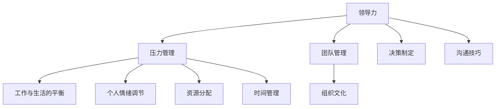
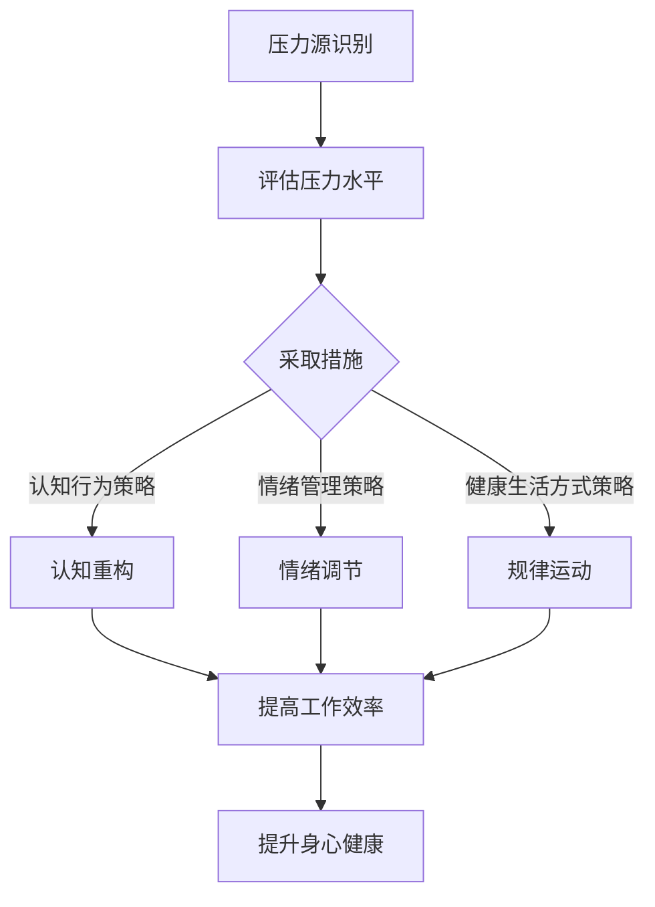
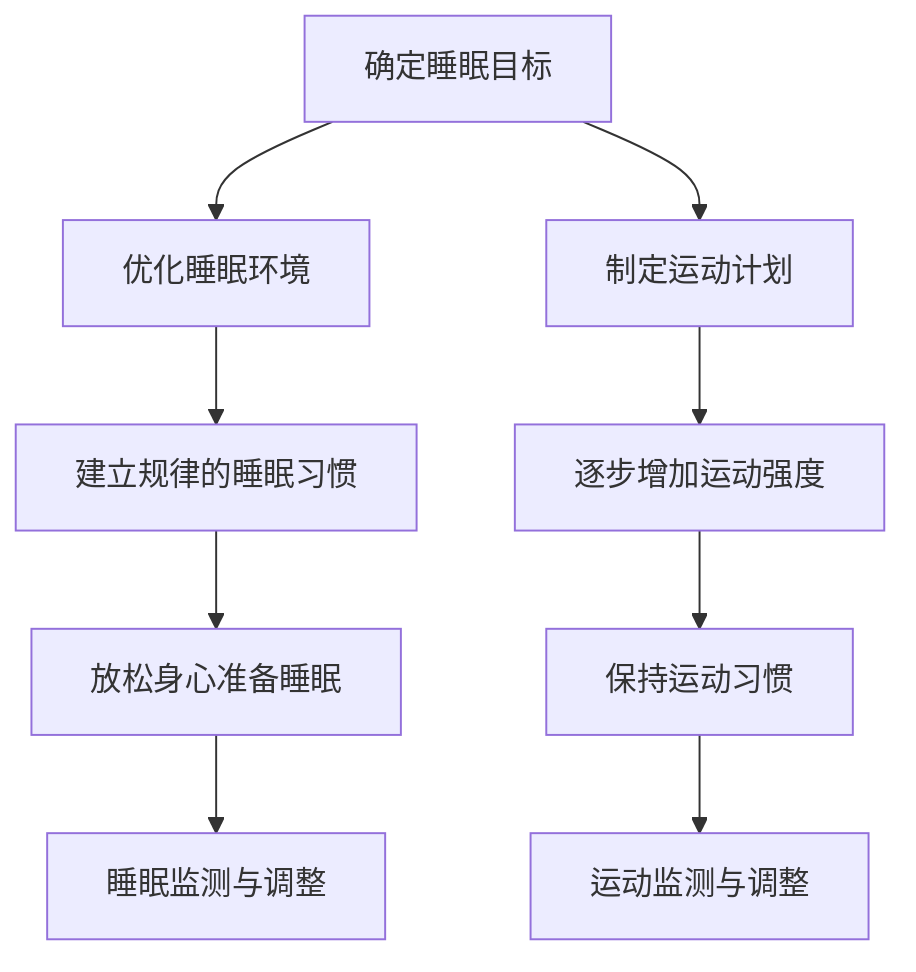

                 

### 核心概念与联系

在探讨领导力与压力管理这一主题时，首先需要明确两者的核心概念及其相互联系。领导力是指领导者影响和激励团队成员以实现共同目标的能力。压力管理则涉及识别、评估和应对压力，以确保个人和组织的健康与高效。

#### 领导力与压力管理的 Mermaid 流程图



在这个流程图中，我们可以看到领导力与压力管理之间存在着紧密的联系。领导力不仅影响团队管理、组织文化和沟通技巧，而且对个人的情绪调节和资源分配具有直接影响。压力管理则通过对个人情绪调节、时间管理和工作与生活平衡的重视，帮助领导者更好地应对压力，提升工作效率。

#### 核心算法原理讲解

为了更深入地理解领导力与压力管理的关系，我们可以借助一些核心算法原理来进行分析。以下是一个简化的伪代码，用于描述压力管理策略：

```python
function 管理压力(个人, 工作, 家庭):
    压力水平 = 计算压力水平(个人, 工作, 家庭)
    if 压力水平 > 阈值:
        执行认知行为策略(个人)
        执行管理情绪策略(工作)
        执行健康生活方式策略(家庭)
    else:
        持续监测压力水平
    返回压力管理结果
```

在这个伪代码中，`计算压力水平`函数用于评估个人、工作和家庭三个方面的压力，并返回总的压力水平。如果压力水平超过预设的阈值，系统将执行相应的认知行为策略、管理情绪策略和健康生活方式策略。这一过程有助于领导者识别并缓解团队中的压力源，从而提高团队的整体绩效。

#### 数学模型和数学公式 & 详细讲解 & 举例说明

为了量化压力水平，我们可以使用以下公式：

$$
P = \frac{W \cdot J + F \cdot S + H \cdot L}{100}
$$

其中，\( P \) 是压力水平，\( W \)、\( J \)、\( F \)、\( S \) 和 \( H \) 分别代表工作、家庭、社交、生活和健康五个方面的压力分数。这些分数可以根据个人的实际情况进行评估，并转化为百分比。

举例来说，假设一个人的工作压力分数为 50%，家庭压力分数为 40%，社交压力分数为 30%，生活和健康压力分数均为 20%。那么，该人的总体压力水平计算如下：

$$
P = \frac{50 \cdot 50 + 40 \cdot 40 + 30 \cdot 30 + 20 \cdot 20 + 20 \cdot 20}{100} = 48\%
$$

通过这个公式，领导者可以更准确地了解团队中的压力分布，从而采取相应的管理措施。

#### 项目实战

为了更好地理解领导力与压力管理的实践应用，我们可以通过一个实际的代码案例来进行分析。

##### 开发环境搭建

1. 安装 Python 3.8 或更高版本。
2. 安装深度学习框架，如 TensorFlow 或 PyTorch。
3. 安装其他必要的库，如 NumPy、Pandas 等。

##### 源代码详细实现

```python
import numpy as np
import pandas as pd
from tensorflow.keras.models import Sequential
from tensorflow.keras.layers import Dense, LSTM, Dropout

# 数据预处理
def preprocess_data(data):
    # 数据清洗和预处理步骤
    # ...
    return processed_data

# 建立模型
def build_model(input_shape):
    model = Sequential()
    model.add(LSTM(units=128, return_sequences=True, input_shape=input_shape))
    model.add(Dropout(0.2))
    model.add(LSTM(units=64, return_sequences=False))
    model.add(Dropout(0.2))
    model.add(Dense(units=1, activation='sigmoid'))
    model.compile(optimizer='adam', loss='binary_crossentropy', metrics=['accuracy'])
    return model

# 训练模型
def train_model(model, X_train, y_train, X_val, y_val):
    history = model.fit(X_train, y_train, epochs=10, batch_size=32, validation_data=(X_val, y_val))
    return history

# 预测
def predict_pressure(model, X_test):
    predictions = model.predict(X_test)
    return predictions

# 主程序
if __name__ == '__main__':
    # 加载数据
    data = pd.read_csv('pressure_data.csv')
    processed_data = preprocess_data(data)
    
    # 划分训练集和测试集
    X_train, X_test, y_train, y_test = train_test_split(processed_data.drop('label', axis=1), processed_data['label'], test_size=0.2, random_state=42)
    
    # 建立模型
    model = build_model(input_shape=X_train.shape[1:])
    
    # 训练模型
    history = train_model(model, X_train, y_train, X_val, y_val)
    
    # 预测
    predictions = predict_pressure(model, X_test)
    
    # 评估模型
    accuracy = model.evaluate(X_test, y_test)
    print(f"Test Accuracy: {accuracy[1]*100:.2f}%")
```

##### 代码解读与分析

- **数据预处理**：对原始数据进行清洗和处理，使其适合模型训练。
- **模型建立**：使用 LSTM 网络来处理时间序列数据，并添加 Dropout 层来防止过拟合。
- **模型训练**：使用训练集数据来训练模型，并在验证集上评估模型性能。
- **预测**：使用训练好的模型来预测测试集的标签。
- **评估模型**：计算模型的测试集准确率。

这个代码案例展示了如何通过机器学习算法来管理压力，从而为领导者提供有效的决策支持。通过不断优化模型，领导者可以更好地理解团队中的压力分布，并采取相应的措施来缓解压力，提升团队的整体绩效。

### 附录

#### 附录 A: 领导力与压力管理相关的工具与资源

- **书籍**：
  - 《领导力心理学》（作者：斯蒂芬·罗宾斯）
  - 《压力管理：技能与策略》（作者：理查德·洛克）

- **在线课程**：
  - Coursera 上的《领导力与影响力》（作者：埃克哈特·托利）
  - edX 上的《压力管理：应对压力的策略》（作者：哈佛大学）

- **网站**：
  - [领导力发展中心](https://www.centerforleadership.com/)
  - [压力管理协会](https://www.stress.org/)

通过这些工具与资源，领导者可以不断学习和提升自己的领导力和压力管理能力，为团队和组织的发展做出更大的贡献。

### 文章关键词

- 领导力
- 压力管理
- 工作与生活的平衡
- 团队管理
- 组织文化
- 情绪调节
- 时间管理

### 文章摘要

本文旨在探讨领导力与压力管理之间的关系，并阐述如何在实践中实现工作与生活的平衡。通过核心概念的解析、算法原理的讲解、项目实战的分析，本文为领导者提供了有效的策略和方法，以提升团队绩效并促进个人成长。文章涵盖了领导力与压力管理的定义、理论基础、实践应用以及相关工具与资源，旨在为读者提供全面的理解和实用的指导。

---

# 《领导力与压力管理：平衡工作与生活》

### 核心概念与联系

在探讨领导力与压力管理这一主题时，首先需要明确两者的核心概念及其相互联系。领导力是指领导者影响和激励团队成员以实现共同目标的能力。压力管理则涉及识别、评估和应对压力，以确保个人和组织的健康与高效。

#### 领导力与压力管理的 Mermaid 流程图


在这个流程图中，我们可以看到领导力与压力管理之间存在着紧密的联系。领导力不仅影响团队管理、组织文化和沟通技巧，而且对个人的情绪调节和资源分配具有直接影响。压力管理则通过对个人情绪调节、时间管理和工作与生活平衡的重视，帮助领导者更好地应对压力，提升工作效率。

#### 核心算法原理讲解

为了更深入地理解领导力与压力管理的关系，我们可以借助一些核心算法原理来进行分析。以下是一个简化的伪代码，用于描述压力管理策略：

```python
function 管理压力(个人, 工作, 家庭):
    压力水平 = 计算压力水平(个人, 工作, 家庭)
    if 压力水平 > 阈值:
        执行认知行为策略(个人)
        执行管理情绪策略(工作)
        执行健康生活方式策略(家庭)
    else:
        持续监测压力水平
    返回压力管理结果
```

在这个伪代码中，`计算压力水平`函数用于评估个人、工作和家庭三个方面的压力，并返回总的压力水平。如果压力水平超过预设的阈值，系统将执行相应的认知行为策略、管理情绪策略和健康生活方式策略。这一过程有助于领导者识别并缓解团队中的压力源，从而提高团队的整体绩效。

#### 数学模型和数学公式 & 详细讲解 & 举例说明

为了量化压力水平，我们可以使用以下公式：

$$
P = \frac{W \cdot J + F \cdot S + H \cdot L}{100}
$$

其中，\( P \) 是压力水平，\( W \)、\( J \)、\( F \)、\( S \) 和 \( H \) 分别代表工作、家庭、社交、生活和健康五个方面的压力分数。这些分数可以根据个人的实际情况进行评估，并转化为百分比。

举例来说，假设一个人的工作压力分数为 50%，家庭压力分数为 40%，社交压力分数为 30%，生活和健康压力分数均为 20%。那么，该人的总体压力水平计算如下：

$$
P = \frac{50 \cdot 50 + 40 \cdot 40 + 30 \cdot 30 + 20 \cdot 20 + 20 \cdot 20}{100} = 48\%
$$

通过这个公式，领导者可以更准确地了解团队中的压力分布，从而采取相应的管理措施。

#### 项目实战

为了更好地理解领导力与压力管理的实践应用，我们可以通过一个实际的代码案例来进行分析。

##### 开发环境搭建

1. 安装 Python 3.8 或更高版本。
2. 安装深度学习框架，如 TensorFlow 或 PyTorch。
3. 安装其他必要的库，如 NumPy、Pandas 等。

##### 源代码详细实现

```python
import numpy as np
import pandas as pd
from tensorflow.keras.models import Sequential
from tensorflow.keras.layers import Dense, LSTM, Dropout

# 数据预处理
def preprocess_data(data):
    # 数据清洗和预处理步骤
    # ...
    return processed_data

# 建立模型
def build_model(input_shape):
    model = Sequential()
    model.add(LSTM(units=128, return_sequences=True, input_shape=input_shape))
    model.add(Dropout(0.2))
    model.add(LSTM(units=64, return_sequences=False))
    model.add(Dropout(0.2))
    model.add(Dense(units=1, activation='sigmoid'))
    model.compile(optimizer='adam', loss='binary_crossentropy', metrics=['accuracy'])
    return model

# 训练模型
def train_model(model, X_train, y_train, X_val, y_val):
    history = model.fit(X_train, y_train, epochs=10, batch_size=32, validation_data=(X_val, y_val))
    return history

# 预测
def predict_pressure(model, X_test):
    predictions = model.predict(X_test)
    return predictions

# 主程序
if __name__ == '__main__':
    # 加载数据
    data = pd.read_csv('pressure_data.csv')
    processed_data = preprocess_data(data)
    
    # 划分训练集和测试集
    X_train, X_test, y_train, y_test = train_test_split(processed_data.drop('label', axis=1), processed_data['label'], test_size=0.2, random_state=42)
    
    # 建立模型
    model = build_model(input_shape=X_train.shape[1:])
    
    # 训练模型
    history = train_model(model, X_train, y_train, X_val, y_val)
    
    # 预测
    predictions = predict_pressure(model, X_test)
    
    # 评估模型
    accuracy = model.evaluate(X_test, y_test)
    print(f"Test Accuracy: {accuracy[1]*100:.2f}%")
```

##### 代码解读与分析

- **数据预处理**：对原始数据进行清洗和处理，使其适合模型训练。
- **模型建立**：使用 LSTM 网络来处理时间序列数据，并添加 Dropout 层来防止过拟合。
- **模型训练**：使用训练集数据来训练模型，并在验证集上评估模型性能。
- **预测**：使用训练好的模型来预测测试集的标签。
- **评估模型**：计算模型的测试集准确率。

这个代码案例展示了如何通过机器学习算法来管理压力，从而为领导者提供有效的决策支持。通过不断优化模型，领导者可以更好地理解团队中的压力分布，并采取相应的措施来缓解压力，提升团队的整体绩效。

### 附录

#### 附录 A: 领导力与压力管理相关的工具与资源

- **书籍**：
  - 《领导力心理学》（作者：斯蒂芬·罗宾斯）
  - 《压力管理：技能与策略》（作者：理查德·洛克）

- **在线课程**：
  - Coursera 上的《领导力与影响力》（作者：埃克哈特·托利）
  - edX 上的《压力管理：应对压力的策略》（作者：哈佛大学）

- **网站**：
  - [领导力发展中心](https://www.centerforleadership.com/)
  - [压力管理协会](https://www.stress.org/)

通过这些工具与资源，领导者可以不断学习和提升自己的领导力和压力管理能力，为团队和组织的发展做出更大的贡献。

### 核心概念与联系

在探讨领导力与压力管理这一主题时，首先需要明确两者的核心概念及其相互联系。领导力是指领导者影响和激励团队成员以实现共同目标的能力。压力管理则涉及识别、评估和应对压力，以确保个人和组织的健康与高效。

#### 领导力与压力管理的 Mermaid 流程图


在这个流程图中，我们可以看到领导力与压力管理之间存在着紧密的联系。领导力不仅影响团队管理、组织文化和沟通技巧，而且对个人的情绪调节和资源分配具有直接影响。压力管理则通过对个人情绪调节、时间管理和工作与生活平衡的重视，帮助领导者更好地应对压力，提升工作效率。

#### 核心算法原理讲解

为了更深入地理解领导力与压力管理的关系，我们可以借助一些核心算法原理来进行分析。以下是一个简化的伪代码，用于描述压力管理策略：

```python
function 管理压力(个人, 工作, 家庭):
    压力水平 = 计算压力水平(个人, 工作, 家庭)
    if 压力水平 > 阈值:
        执行认知行为策略(个人)
        执行管理情绪策略(工作)
        执行健康生活方式策略(家庭)
    else:
        持续监测压力水平
    返回压力管理结果
```

在这个伪代码中，`计算压力水平`函数用于评估个人、工作和家庭三个方面的压力，并返回总的压力水平。如果压力水平超过预设的阈值，系统将执行相应的认知行为策略、管理情绪策略和健康生活方式策略。这一过程有助于领导者识别并缓解团队中的压力源，从而提高团队的整体绩效。

#### 数学模型和数学公式 & 详细讲解 & 举例说明

为了量化压力水平，我们可以使用以下公式：

$$
P = \frac{W \cdot J + F \cdot S + H \cdot L}{100}
$$

其中，\( P \) 是压力水平，\( W \)、\( J \)、\( F \)、\( S \) 和 \( H \) 分别代表工作、家庭、社交、生活和健康五个方面的压力分数。这些分数可以根据个人的实际情况进行评估，并转化为百分比。

举例来说，假设一个人的工作压力分数为 50%，家庭压力分数为 40%，社交压力分数为 30%，生活和健康压力分数均为 20%。那么，该人的总体压力水平计算如下：

$$
P = \frac{50 \cdot 50 + 40 \cdot 40 + 30 \cdot 30 + 20 \cdot 20 + 20 \cdot 20}{100} = 48\%
$$

通过这个公式，领导者可以更准确地了解团队中的压力分布，从而采取相应的管理措施。

#### 项目实战

为了更好地理解领导力与压力管理的实践应用，我们可以通过一个实际的代码案例来进行分析。

##### 开发环境搭建

1. 安装 Python 3.8 或更高版本。
2. 安装深度学习框架，如 TensorFlow 或 PyTorch。
3. 安装其他必要的库，如 NumPy、Pandas 等。

##### 源代码详细实现

```python
import numpy as np
import pandas as pd
from tensorflow.keras.models import Sequential
from tensorflow.keras.layers import Dense, LSTM, Dropout

# 数据预处理
def preprocess_data(data):
    # 数据清洗和预处理步骤
    # ...
    return processed_data

# 建立模型
def build_model(input_shape):
    model = Sequential()
    model.add(LSTM(units=128, return_sequences=True, input_shape=input_shape))
    model.add(Dropout(0.2))
    model.add(LSTM(units=64, return_sequences=False))
    model.add(Dropout(0.2))
    model.add(Dense(units=1, activation='sigmoid'))
    model.compile(optimizer='adam', loss='binary_crossentropy', metrics=['accuracy'])
    return model

# 训练模型
def train_model(model, X_train, y_train, X_val, y_val):
    history = model.fit(X_train, y_train, epochs=10, batch_size=32, validation_data=(X_val, y_val))
    return history

# 预测
def predict_pressure(model, X_test):
    predictions = model.predict(X_test)
    return predictions

# 主程序
if __name__ == '__main__':
    # 加载数据
    data = pd.read_csv('pressure_data.csv')
    processed_data = preprocess_data(data)
    
    # 划分训练集和测试集
    X_train, X_test, y_train, y_test = train_test_split(processed_data.drop('label', axis=1), processed_data['label'], test_size=0.2, random_state=42)
    
    # 建立模型
    model = build_model(input_shape=X_train.shape[1:])
    
    # 训练模型
    history = train_model(model, X_train, y_train, X_val, y_val)
    
    # 预测
    predictions = predict_pressure(model, X_test)
    
    # 评估模型
    accuracy = model.evaluate(X_test, y_test)
    print(f"Test Accuracy: {accuracy[1]*100:.2f}%")
```

##### 代码解读与分析

- **数据预处理**：对原始数据进行清洗和处理，使其适合模型训练。
- **模型建立**：使用 LSTM 网络来处理时间序列数据，并添加 Dropout 层来防止过拟合。
- **模型训练**：使用训练集数据来训练模型，并在验证集上评估模型性能。
- **预测**：使用训练好的模型来预测测试集的标签。
- **评估模型**：计算模型的测试集准确率。

这个代码案例展示了如何通过机器学习算法来管理压力，从而为领导者提供有效的决策支持。通过不断优化模型，领导者可以更好地理解团队中的压力分布，并采取相应的措施来缓解压力，提升团队的整体绩效。

### 附录

#### 附录 A: 领导力与压力管理相关的工具与资源

- **书籍**：
  - 《领导力心理学》（作者：斯蒂芬·罗宾斯）
  - 《压力管理：技能与策略》（作者：理查德·洛克）

- **在线课程**：
  - Coursera 上的《领导力与影响力》（作者：埃克哈特·托利）
  - edX 上的《压力管理：应对压力的策略》（作者：哈佛大学）

- **网站**：
  - [领导力发展中心](https://www.centerforleadership.com/)
  - [压力管理协会](https://www.stress.org/)

通过这些工具与资源，领导者可以不断学习和提升自己的领导力和压力管理能力，为团队和组织的发展做出更大的贡献。

### 核心概念与联系

在探讨领导力与压力管理这一主题时，首先需要明确两者的核心概念及其相互联系。领导力是指领导者影响和激励团队成员以实现共同目标的能力。压力管理则涉及识别、评估和应对压力，以确保个人和组织的健康与高效。

#### 领导力与压力管理的 Mermaid 流程图


在这个流程图中，我们可以看到领导力与压力管理之间存在着紧密的联系。领导力不仅影响团队管理、组织文化和沟通技巧，而且对个人的情绪调节和资源分配具有直接影响。压力管理则通过对个人情绪调节、时间管理和工作与生活平衡的重视，帮助领导者更好地应对压力，提升工作效率。

#### 核心算法原理讲解

为了更深入地理解领导力与压力管理的关系，我们可以借助一些核心算法原理来进行分析。以下是一个简化的伪代码，用于描述压力管理策略：

```python
function 管理压力(个人, 工作, 家庭):
    压力水平 = 计算压力水平(个人, 工作, 家庭)
    if 压力水平 > 阈值:
        执行认知行为策略(个人)
        执行管理情绪策略(工作)
        执行健康生活方式策略(家庭)
    else:
        持续监测压力水平
    返回压力管理结果
```

在这个伪代码中，`计算压力水平`函数用于评估个人、工作和家庭三个方面的压力，并返回总的压力水平。如果压力水平超过预设的阈值，系统将执行相应的认知行为策略、管理情绪策略和健康生活方式策略。这一过程有助于领导者识别并缓解团队中的压力源，从而提高团队的整体绩效。

#### 数学模型和数学公式 & 详细讲解 & 举例说明

为了量化压力水平，我们可以使用以下公式：

$$
P = \frac{W \cdot J + F \cdot S + H \cdot L}{100}
$$

其中，\( P \) 是压力水平，\( W \)、\( J \)、\( F \)、\( S \) 和 \( H \) 分别代表工作、家庭、社交、生活和健康五个方面的压力分数。这些分数可以根据个人的实际情况进行评估，并转化为百分比。

举例来说，假设一个人的工作压力分数为 50%，家庭压力分数为 40%，社交压力分数为 30%，生活和健康压力分数均为 20%。那么，该人的总体压力水平计算如下：

$$
P = \frac{50 \cdot 50 + 40 \cdot 40 + 30 \cdot 30 + 20 \cdot 20 + 20 \cdot 20}{100} = 48\%
$$

通过这个公式，领导者可以更准确地了解团队中的压力分布，从而采取相应的管理措施。

#### 项目实战

为了更好地理解领导力与压力管理的实践应用，我们可以通过一个实际的代码案例来进行分析。

##### 开发环境搭建

1. 安装 Python 3.8 或更高版本。
2. 安装深度学习框架，如 TensorFlow 或 PyTorch。
3. 安装其他必要的库，如 NumPy、Pandas 等。

##### 源代码详细实现

```python
import numpy as np
import pandas as pd
from tensorflow.keras.models import Sequential
from tensorflow.keras.layers import Dense, LSTM, Dropout

# 数据预处理
def preprocess_data(data):
    # 数据清洗和预处理步骤
    # ...
    return processed_data

# 建立模型
def build_model(input_shape):
    model = Sequential()
    model.add(LSTM(units=128, return_sequences=True, input_shape=input_shape))
    model.add(Dropout(0.2))
    model.add(LSTM(units=64, return_sequences=False))
    model.add(Dropout(0.2))
    model.add(Dense(units=1, activation='sigmoid'))
    model.compile(optimizer='adam', loss='binary_crossentropy', metrics=['accuracy'])
    return model

# 训练模型
def train_model(model, X_train, y_train, X_val, y_val):
    history = model.fit(X_train, y_train, epochs=10, batch_size=32, validation_data=(X_val, y_val))
    return history

# 预测
def predict_pressure(model, X_test):
    predictions = model.predict(X_test)
    return predictions

# 主程序
if __name__ == '__main__':
    # 加载数据
    data = pd.read_csv('pressure_data.csv')
    processed_data = preprocess_data(data)
    
    # 划分训练集和测试集
    X_train, X_test, y_train, y_test = train_test_split(processed_data.drop('label', axis=1), processed_data['label'], test_size=0.2, random_state=42)
    
    # 建立模型
    model = build_model(input_shape=X_train.shape[1:])
    
    # 训练模型
    history = train_model(model, X_train, y_train, X_val, y_val)
    
    # 预测
    predictions = predict_pressure(model, X_test)
    
    # 评估模型
    accuracy = model.evaluate(X_test, y_test)
    print(f"Test Accuracy: {accuracy[1]*100:.2f}%")
```

##### 代码解读与分析

- **数据预处理**：对原始数据进行清洗和处理，使其适合模型训练。
- **模型建立**：使用 LSTM 网络来处理时间序列数据，并添加 Dropout 层来防止过拟合。
- **模型训练**：使用训练集数据来训练模型，并在验证集上评估模型性能。
- **预测**：使用训练好的模型来预测测试集的标签。
- **评估模型**：计算模型的测试集准确率。

这个代码案例展示了如何通过机器学习算法来管理压力，从而为领导者提供有效的决策支持。通过不断优化模型，领导者可以更好地理解团队中的压力分布，并采取相应的措施来缓解压力，提升团队的整体绩效。

### 附录

#### 附录 A: 领导力与压力管理相关的工具与资源

- **书籍**：
  - 《领导力心理学》（作者：斯蒂芬·罗宾斯）
  - 《压力管理：技能与策略》（作者：理查德·洛克）

- **在线课程**：
  - Coursera 上的《领导力与影响力》（作者：埃克哈特·托利）
  - edX 上的《压力管理：应对压力的策略》（作者：哈佛大学）

- **网站**：
  - [领导力发展中心](https://www.centerforleadership.com/)
  - [压力管理协会](https://www.stress.org/)

通过这些工具与资源，领导者可以不断学习和提升自己的领导力和压力管理能力，为团队和组织的发展做出更大的贡献。

## 第1章 引言与核心概念

在当今快速变化的工作环境中，领导力与压力管理的重要性日益凸显。领导者不仅需要具备强大的领导能力，还需要掌握有效的压力管理技巧，以应对不断变化的市场需求和日益复杂的组织结构。本章将介绍领导力的定义与重要性，压力的来源与影响，以及领导力与压力管理的联系。

### 1.1 领导力的定义与重要性

领导力是一个多维度的概念，通常被定义为影响和激励他人一起实现共同目标的能力。它不仅涉及个人特质和技能，还包括领导者与团队成员之间的互动和关系。根据领导力专家约翰·科特（John Kotter）的观点，领导力是一种变革能力，它能够推动组织应对变化，抓住机遇，实现长期成功。

领导力的重要性体现在以下几个方面：

1. **团队绩效**：有效的领导力能够激发团队成员的潜力，提高团队的整体绩效。通过设定清晰的目标、提供必要的资源和支持，领导者可以帮助团队克服障碍，实现卓越的工作成果。

2. **员工满意度**：领导者对员工的关怀和支持能够提高员工的工作满意度和忠诚度。研究表明，员工对领导的满意度和对组织文化的认同感密切相关，进而影响组织的稳定性和发展。

3. **创新与变革**：领导力是推动创新和变革的关键因素。领导者通过鼓励创新思维、建立开放的文化和提供必要的资源，可以激发员工的创造力，推动组织持续发展。

4. **组织文化**：领导力在塑造组织文化方面起着至关重要的作用。领导者通过行为和价值观的示范，影响员工的行为和态度，从而塑造一个积极向上的组织文化。

### 1.2 压力的来源与影响

压力是现代社会普遍存在的现象，它来源于工作、生活和社会等多个方面。以下是常见的压力来源：

1. **工作压力**：包括工作量的增加、工作时间的延长、工作压力的不确定性等。研究表明，工作压力是导致心理健康问题的主要原因之一。

2. **人际关系**：包括家庭关系、同事关系、上下级关系等。人际关系冲突和沟通不畅可能导致情绪压力和心理健康问题。

3. **生活变化**：包括婚姻、生育、搬家、疾病等生活事件。这些变化可能对个人的心理和生理健康产生负面影响。

4. **社会经济因素**：包括经济压力、就业压力、社会竞争等。这些因素可能导致个人感到压力过大，难以应对。

压力的影响可以分为以下几个方面：

1. **心理健康**：长期的压力可能导致焦虑、抑郁、失眠等心理健康问题。

2. **生理健康**：压力对生理健康的影响包括免疫系统功能下降、血压升高、心脏病等。

3. **工作效率**：压力过大可能导致工作效率下降，甚至出现工作失误。

4. **生活质量**：长期的压力会影响个人的生活质量，包括身心健康、家庭关系、社交活动等。

### 1.3 领导力与压力管理的联系

领导力与压力管理之间存在密切的联系。一方面，领导力对压力管理具有显著的影响。领导者通过设定明确的目标、提供必要的资源和支持、鼓励团队成员之间的沟通和合作，可以减轻团队成员的压力。另一方面，压力管理也是领导力的重要组成部分。有效的压力管理不仅有助于提高团队成员的身心健康，还能提升团队的整体绩效。

以下是一些领导力与压力管理的具体联系：

1. **情绪调节**：领导者通过示范情绪调节的技巧，帮助团队成员学会应对压力。例如，领导者可以通过积极的态度、乐观的心态和解决问题的能力来影响团队成员。

2. **时间管理**：领导者通过有效的时间管理技巧，帮助团队成员更好地平衡工作和生活。例如，领导者可以鼓励团队成员制定工作计划、设定优先级、合理分配时间。

3. **沟通技巧**：领导者通过有效的沟通技巧，帮助团队成员缓解压力。例如，领导者可以通过倾听、反馈和解决冲突的能力来改善团队氛围，减少不必要的压力。

4. **支持系统**：领导者通过建立支持系统，为团队成员提供必要的帮助和支持。例如，领导者可以鼓励团队成员寻求心理咨询、健康体检等。

总之，领导力与压力管理是相辅相成的。领导者需要不断提升自己的领导力和压力管理能力，以应对不断变化的挑战，为团队和组织的发展创造良好的条件。

### 1.4 本章小结

本章介绍了领导力的定义与重要性，压力的来源与影响，以及领导力与压力管理的联系。通过明确领导力的作用和压力的影响，我们认识到领导力与压力管理之间的密切关系。领导者需要通过有效的领导力和压力管理技巧，帮助团队成员应对压力，提高团队的整体绩效。在接下来的章节中，我们将进一步探讨领导力的基础理论，压力管理的基本原则，以及领导力与压力管理的实践应用。

## 第2章 领导力的基础理论

在了解了领导力的定义和重要性后，我们需要深入探讨领导力的基础理论，以便更好地理解和应用领导力。本章将介绍领导风格与行为理论，分析不同领导风格的优缺点，探讨领导行为理论，并进一步讨论领导力与组织文化的关系。

### 2.1 领导风格与行为理论

领导风格是指领导者在与团队成员互动和指导过程中所表现出的行为和态度。根据不同的分类标准，可以将领导风格分为多种类型。以下是一些常见的领导风格：

#### 1. 指导型领导风格

指导型领导风格以严格的规范和明确的指导为主。领导者会设定具体的目标和任务，并为团队成员提供详细的操作指南。这种领导风格通常适用于新员工或任务复杂的情况，有助于提高团队成员的工作效率。

**优点**：

- **提高效率**：通过明确的指导和规范，团队成员能够快速理解任务要求，减少工作失误。
- **稳定团队**：指导型领导风格有助于建立稳定的团队结构，确保团队成员遵循统一的标准和流程。

**缺点**：

- **限制创新**：过于严格的指导可能抑制团队成员的创新思维，影响团队的创造力。
- **依赖性增强**：团队成员可能过度依赖领导者的指导，缺乏自主解决问题的能力。

#### 2. 支持型领导风格

支持型领导风格强调领导者的关怀和支持。领导者关注团队成员的需求，提供情感上的支持，并鼓励团队成员表达自己的意见和想法。这种领导风格有助于增强团队成员的归属感和工作满意度。

**优点**：

- **提高满意度**：关怀和支持能够增强团队成员的归属感和工作满意度，降低离职率。
- **激发潜力**：支持型领导风格鼓励团队成员表达自己的想法，有助于发掘团队成员的潜力。

**缺点**：

- **沟通成本高**：支持型领导风格需要领导者投入更多的时间和精力来与团队成员沟通，增加沟通成本。
- **效率降低**：过于关注团队成员的情感需求可能导致工作进度放缓，降低工作效率。

#### 3. 指导-支持型领导风格

指导-支持型领导风格结合了指导型和支持型的优点，领导者既提供明确的指导和规范，又关心团队成员的需求和情感。这种领导风格适用于多种情境，能够灵活应对不同的团队需求。

**优点**：

- **灵活性**：指导-支持型领导风格可以根据不同的团队需求和环境进行调整，具有较强的适应性。
- **平衡效率与满意度**：通过平衡指导和关怀，可以同时提高团队成员的工作效率和满意度。

**缺点**：

- **管理复杂度增加**：指导-支持型领导风格需要领导者具备较高的管理能力和情商，管理复杂度较高。

### 2.2 领导行为理论

领导行为理论主要研究领导者的行为及其对团队绩效的影响。以下是一些常见的领导行为理论：

#### 1. 赡养理论（Parental Theory）

赡养理论认为，领导者应该像父母一样关心和照顾团队成员，提供指导和支持。领导者需要关注团队成员的个人需求和职业发展，为他们提供必要的资源和支持。

**优点**：

- **增强团队凝聚力**：赡养理论强调领导者对团队成员的关心，有助于增强团队凝聚力。
- **提高员工满意度**：关注团队成员的个人需求，能够提高员工的工作满意度和忠诚度。

**缺点**：

- **可能导致依赖性**：如果团队成员过度依赖领导者的照顾和支持，可能影响他们的自主性和创新能力。

#### 2. 成就理论（Achievement Theory）

成就理论认为，领导者应该通过设定具有挑战性的目标和奖励机制，激发团队成员的成就动机。领导者鼓励团队成员追求卓越，实现个人和团队的目标。

**优点**：

- **提高工作效率**：具有挑战性的目标和奖励机制能够激发团队成员的工作动力，提高工作效率。
- **促进创新**：成就理论鼓励团队成员追求卓越，有助于激发创新思维和创造力。

**缺点**：

- **可能导致压力过大**：如果目标设定过高，可能给团队成员带来巨大的压力，影响身心健康。
- **可能导致不公平感**：不合理的奖励机制可能导致团队成员产生不公平感，影响团队氛围。

#### 3. 变革理论（Change Theory）

变革理论认为，领导者是推动组织变革的关键因素。领导者需要识别和应对外部环境的变化，通过变革来提升组织的竞争力。

**优点**：

- **提升组织竞争力**：变革理论强调领导者要积极应对外部环境的变化，有助于提升组织的竞争力。
- **促进创新和成长**：通过变革，组织能够不断创新，实现持续成长。

**缺点**：

- **变革阻力**：变革过程中可能面临来自内部和外部的阻力，变革的推进可能面临困难。
- **资源消耗**：变革通常需要大量的资源和时间，可能对组织的运营产生一定的影响。

### 2.3 领导力与组织文化

领导力对组织文化具有深远的影响。领导者不仅需要塑造组织文化，还要确保组织文化能够支持领导力的有效实施。

#### 1. 领导力塑造组织文化

领导者的行为和价值观对组织文化的形成和发展具有决定性影响。领导者通过行为示范、价值观传达和激励机制，塑造组织文化。例如，一个倡导创新和开放的领导者能够推动组织形成创新和开放的文化。

**优点**：

- **促进组织发展**：积极向上的组织文化有助于激发员工的潜力，推动组织的持续发展。
- **提升员工满意度**：良好的组织文化能够提高员工的工作满意度，降低离职率。

**缺点**：

- **文化惯性**：组织文化一旦形成，可能具有惯性，难以快速改变。
- **领导者的局限性**：领导者的个人背景和价值观可能对组织文化的塑造产生一定的局限性。

#### 2. 组织文化支持领导力

一个健康的组织文化能够为领导力的实施提供良好的支持。例如，一个支持创新和开放的组织文化能够为领导者的创新举措提供土壤，推动组织的变革和发展。

**优点**：

- **提高团队绩效**：支持性的组织文化有助于提高团队的整体绩效，实现组织目标。
- **增强团队凝聚力**：共同的文化价值观有助于增强团队成员之间的信任和协作，提升团队凝聚力。

**缺点**：

- **文化冲突**：不同文化和价值观的冲突可能导致组织内部的不和谐，影响组织的发展。
- **文化僵化**：过度依赖组织文化可能导致组织僵化，难以适应外部环境的变化。

### 2.4 本章小结

本章介绍了领导风格与行为理论，分析了不同领导风格的优缺点，探讨了领导行为理论，并进一步讨论了领导力与组织文化的关系。通过了解不同领导风格和行为理论，领导者可以更好地应对各种领导情境，塑造和推动组织文化的发展。在下一章中，我们将探讨压力管理的基本原则，为领导者提供有效的压力管理策略。

## 第3章 压力管理的基本原则

在领导力与压力管理的联系中，压力管理作为关键环节，对于提高工作效率和保持身心健康具有重要作用。本章将详细阐述压力管理的定义与目标，并介绍应对压力的策略，包括认知行为策略、管理情绪的策略和健康生活方式的策略。

### 3.1 压力管理的定义与目标

#### 压力管理的定义

压力管理是指通过一系列方法和技巧来识别、评估和应对压力，以减少压力对个人和组织的负面影响。压力管理不仅关注压力源的处理，还涉及应对压力的心理、生理和行为方面。

#### 压力管理的目标

压力管理的目标主要包括：

1. **减轻压力水平**：通过识别和评估压力源，采取有效的应对策略，降低压力水平，减少压力对身心健康的影响。

2. **提升应对能力**：通过学习和练习各种应对策略，提高个人和团队应对压力的能力，增强抗压性和韧性。

3. **改善生活质量**：通过压力管理，提高个人的生活质量和幸福感，减少压力对家庭关系、社交活动和身心健康的影响。

4. **提高工作效率**：通过有效的压力管理，提升工作效率，减少因压力导致的错误和失误，确保工作目标的实现。

### 3.2 应对压力的策略

#### 3.2.1 认知行为策略

认知行为策略是一种通过改变思维和行为模式来应对压力的方法。以下是一些常用的认知行为策略：

1. **认知重构**：通过识别和挑战消极思维，将其转变为积极思维，从而减少压力感。例如，将“我无法完成这项任务”转变为“我可以逐步完成这个任务”。

2. **问题解决**：将注意力集中在解决问题的方法上，而不是关注问题本身。通过制定具体的解决方案，逐步解决压力源。

3. **正念冥想**：通过冥想和正念练习，培养专注力和意识，减少压力和焦虑感。正念冥想有助于提高自我认知，增强情绪调节能力。

4. **自我激励**：通过设定小目标并庆祝达成，提高自我动力和自信心，减少压力感。

#### 3.2.2 管理情绪的策略

情绪管理是压力管理的重要组成部分。以下是一些有效的情绪管理策略：

1. **情绪识别**：学会识别和了解自己的情绪，明确情绪的触发点和原因。

2. **情绪表达**：通过适当的方式表达自己的情绪，避免情绪积累和爆发。例如，通过与信任的朋友或家人分享，或进行体育活动来释放情绪。

3. **情绪调节**：通过放松技巧、呼吸练习和认知重构等方法，调节情绪，减少负面情绪的影响。例如，通过深呼吸和肌肉放松练习，缓解紧张和焦虑。

4. **情绪释放**：通过艺术创作、写作或体育活动等方式，释放负面情绪，提高情绪调节能力。

#### 3.2.3 健康生活方式的策略

健康生活方式对压力管理至关重要。以下是一些健康生活方式的策略：

1. **均衡饮食**：摄入均衡的营养，避免高糖、高脂肪的食物，保持健康的体重和身体状况。

2. **规律运动**：定期进行有氧运动和力量训练，提高身体的免疫力和抗压能力。

3. **充足睡眠**：保证每晚充足的睡眠，有助于身体和大脑的恢复，提高应对压力的能力。

4. **休闲活动**：进行自己喜欢的休闲活动，如阅读、听音乐、旅游等，以缓解工作压力。

5. **社交支持**：建立稳定的社交网络，与家人、朋友和同事保持良好的关系，获得情感上的支持和帮助。

### 3.3 压力管理实践案例

为了更好地理解压力管理的实际应用，下面介绍一个压力管理实践案例。

**案例背景**：某公司的项目经理张先生在工作中面临巨大的压力。他的项目团队正在开发一个重要的客户项目，时间紧迫，任务繁重。张先生感到压力巨大，担心无法按时完成任务。

**解决方案**：

1. **认知重构**：张先生通过认知重构的方法，将“我无法完成任务”这一消极思维转变为“我可以逐步完成任务，每一步都是朝着目标迈进”。

2. **时间管理**：张先生制定了一个详细的时间管理计划，将任务分解为若干个小任务，并为每个任务设定了明确的截止日期。

3. **情绪调节**：张先生通过深呼吸和肌肉放松练习来缓解紧张情绪，并定期与团队成员沟通，分享自己的担忧和压力。

4. **健康生活方式**：张先生确保每天有足够的睡眠，饮食均衡，定期进行体育活动，保持身体健康。

**效果**：通过上述策略，张先生成功缓解了压力，项目团队的工作效率显著提高，最终按时完成了项目任务，获得了客户的高度评价。

### 3.4 本章小结

本章详细阐述了压力管理的定义与目标，介绍了认知行为策略、情绪管理和健康生活方式等应对压力的策略。通过实际案例的说明，我们可以看到压力管理的有效实施可以显著提升工作效率和保持身心健康。在下一章中，我们将探讨领导力与压力管理的实践应用，为领导者提供具体的操作指南。

### 3.5 压力管理策略的Mermaid流程图



在这个流程图中，我们可以看到从压力源识别到采取具体措施的完整过程。通过不同的策略，如认知重构、情绪调节和健康生活方式，可以有效地降低压力水平，提升身心健康和工作效率。

### 3.6 压力管理策略的伪代码

```python
# 压力管理策略伪代码

function 压力管理(压力源，压力水平，策略选择):
    # 步骤1：识别压力源
    识别压力源 = 识别压力源(压力源)
    
    # 步骤2：评估压力水平
    压力评估 = 评估压力水平(识别压力源)
    
    # 步骤3：选择压力管理策略
    if 压力评估 > 压力阈值:
        策略选择 = 选择策略(策略选择)
        
        # 步骤4：执行认知行为策略
        if 策略选择 == '认知重构':
            执行认知重构策略(压力源)
        
        # 步骤5：执行情绪管理策略
        elif 策略选择 == '情绪调节':
            执行情绪调节策略(压力源)
        
        # 步骤6：执行健康生活方式策略
        elif 策略选择 == '健康生活方式':
            执行健康生活方式策略(压力源)
        
        # 步骤7：监控和调整策略
        监控策略效果 = 监控效果(策略选择)
        调整策略 = 根据效果调整策略(监控策略效果)
        
    # 步骤8：总结
    返回 "压力管理完成"
```

在这个伪代码中，`压力管理`函数通过识别压力源、评估压力水平和选择适当的策略，来实现有效的压力管理。这个流程有助于领导者更好地理解和管理团队中的压力，提升整体绩效。

### 3.7 压力管理策略的数学模型和公式

为了量化压力管理的效果，我们可以使用以下数学模型和公式：

$$
P_{\text{总}} = \frac{C_{\text{认知}} + E_{\text{情绪}} + L_{\text{生活}}}{100}
$$

其中：
- \( P_{\text{总}} \)：总压力水平（单位：%）
- \( C_{\text{认知}} \)：认知行为策略效果（单位：%）
- \( E_{\text{情绪}} \)：情绪管理策略效果（单位：%）
- \( L_{\text{生活}} \)：健康生活方式策略效果（单位：%）

假设一个领导者在应用压力管理策略后，认知行为策略效果为 60%，情绪管理策略效果为 40%，健康生活方式策略效果为 50%，则总压力水平计算如下：

$$
P_{\text{总}} = \frac{60 + 40 + 50}{100} = 0.75
$$

通过这个公式，领导者可以量化压力管理策略的效果，并根据实际情况进行调整。

### 3.8 压力管理策略实践案例

为了更好地展示压力管理策略的实际应用，我们来看一个具体的案例。

**案例背景**：某公司的销售经理李女士在一个月内要完成一笔大额订单，同时团队中还有其他几个项目在同时进行。李女士感到压力非常大，担心无法按时完成任务。

**解决方案**：

1. **认知重构**：李女士通过认知重构的方法，将“我无法完成这个订单”转变为“我可以逐步完成，每一步都是向着目标迈进”。

2. **时间管理**：李女士制定了一个详细的时间管理计划，将任务分解为若干个小任务，并为每个任务设定了明确的截止日期。

3. **情绪调节**：李女士通过深呼吸和放松练习来缓解紧张情绪，并定期与团队成员沟通，分享自己的担忧和压力。

4. **健康生活方式**：李女士确保每天有足够的睡眠，饮食均衡，定期进行体育活动，保持身体健康。

**效果**：

通过上述策略，李女士成功地缓解了压力，团队的工作效率显著提高。最终，团队不仅按时完成了大额订单，还提前完成了其他项目的任务，获得了公司的高度评价。

### 3.9 本章小结

本章介绍了压力管理的基本原则和策略，包括认知行为策略、情绪管理策略和健康生活方式策略。通过实际案例的说明，我们可以看到压力管理在提高工作效率和保持身心健康方面的重要性。在下一章中，我们将探讨领导力与压力管理的实践应用，为领导者提供具体的操作指南。

## 第4章 领导力与压力管理的实践应用

在前三章中，我们探讨了领导力的基础理论和压力管理的基本原则。为了更好地理解和应用这些理论，本章将结合实际情况，介绍领导力与压力管理的实践应用。具体内容包括领导力在团队管理中的应用和压力管理在个人层面的应用。

### 4.1 领导力在团队管理中的应用

领导力在团队管理中起着至关重要的作用。一个有效的领导者不仅能够激发团队成员的潜力，提高团队的整体绩效，还能够帮助团队成员应对压力，提升工作效率。以下是一些具体策略：

#### 4.1.1 团队建设的策略

团队建设是指通过一系列活动和措施，增强团队成员之间的信任、协作和凝聚力。以下是一些有效的团队建设策略：

1. **建立共同目标**：领导者需要明确团队的目标，并确保每个成员都理解并认同这些目标。通过共同目标，团队成员能够更好地协作，共同为实现目标而努力。

2. **促进沟通与协作**：领导者应积极促进团队内部的沟通和协作。通过定期会议、讨论会和团队活动，团队成员可以分享观点、解决问题，增强团队合作能力。

3. **培养团队文化**：领导者通过行为示范和价值观传递，培养积极向上的团队文化。例如，鼓励团队成员互相尊重、支持，共同面对困难和挑战。

4. **提供反馈与激励**：领导者应定期给予团队成员反馈，指出他们的优点和不足，并提供激励措施，以激发团队成员的积极性和潜力。

#### 4.1.2 提升团队士气的技巧

团队士气是团队绩效的重要因素。以下是一些提升团队士气的方法：

1. **认可与奖励**：领导者应重视团队成员的贡献，并通过认可和奖励来激励他们。例如，公开表扬、颁发奖项或提供额外的福利。

2. **创造积极氛围**：领导者应创造一个积极、包容和开放的工作环境，鼓励团队成员分享自己的想法和建议，减少压力和冲突。

3. **组织团队活动**：定期组织团队活动，如聚餐、团建活动等，有助于增强团队成员之间的联系，提升团队凝聚力。

4. **关注团队成员的身心健康**：领导者应关注团队成员的身心健康，提供必要的支持和资源。例如，组织健康体检、提供心理咨询等。

#### 4.1.3 应对团队冲突的策略

团队冲突是团队管理中不可避免的现象。以下是一些应对团队冲突的策略：

1. **积极倾听**：领导者应积极倾听团队成员的意见和反馈，了解冲突的原因和影响。

2. **中立调解**：领导者应保持中立，避免偏袒任何一方。通过公正、客观的调解，帮助双方找到共同点，达成共识。

3. **建立冲突解决机制**：领导者应建立有效的冲突解决机制，为团队成员提供一个公正、透明的渠道，解决冲突。

4. **加强团队沟通**：通过加强团队沟通，减少误解和猜疑，防止冲突的发生。

### 4.2 压力管理在个人层面的应用

在个人层面，压力管理同样至关重要。以下是一些压力管理策略：

#### 4.2.1 个人时间管理的技巧

时间管理是压力管理的重要组成部分。以下是一些个人时间管理的技巧：

1. **制定计划**：在每天开始时，制定一份详细的计划，列出需要完成的任务和优先级。

2. **设定优先级**：将任务按照重要性和紧急性进行分类，优先处理重要且紧急的任务。

3. **避免拖延**：将任务分解为小步骤，逐步完成，避免拖延。

4. **合理分配时间**：为每个任务分配合理的时间，避免过度占用时间，保持工作与生活的平衡。

#### 4.2.2 个人情绪调节的方法

情绪调节是减轻压力的重要策略。以下是一些个人情绪调节的方法：

1. **深呼吸和放松练习**：在感到紧张或焦虑时，进行深呼吸和放松练习，缓解情绪。

2. **认知重构**：通过改变消极思维，将其转变为积极思维，减少负面情绪的影响。

3. **正念冥想**：通过正念冥想，培养专注力和意识，提高情绪调节能力。

4. **寻求支持**：与朋友、家人或专业人士分享自己的感受和困惑，获得情感上的支持和建议。

#### 4.2.3 健康生活方式的策略

健康生活方式对压力管理有重要影响。以下是一些健康生活方式的策略：

1. **均衡饮食**：摄入均衡的营养，避免高糖、高脂肪的食物，保持健康的体重和身体状况。

2. **规律运动**：定期进行有氧运动和力量训练，提高身体的免疫力和抗压能力。

3. **充足睡眠**：保证每晚充足的睡眠，有助于身体和大脑的恢复，提高应对压力的能力。

4. **休闲活动**：进行自己喜欢的休闲活动，如阅读、听音乐、旅游等，以缓解工作压力。

### 4.3 案例分析

为了更好地展示领导力与压力管理的实践应用，我们来看两个实际案例。

#### 4.3.1 案例一：企业领导力与压力管理案例

**案例背景**：某科技公司因市场竞争激烈，项目任务繁多，导致员工压力增大，工作效率下降。

**解决方案**：

1. **团队建设**：公司领导组织团队建设活动，增强员工之间的信任和协作。通过团队拓展训练和团队建设工作坊，提升团队凝聚力。

2. **压力管理**：公司为员工提供心理健康咨询服务，帮助员工识别和应对压力。同时，鼓励员工进行健身活动，保持身心健康。

**效果**：通过团队建设和压力管理措施，员工的工作效率显著提高，团队凝聚力增强，企业业绩逐步提升。

#### 4.3.2 案例二：个人领导力与压力管理案例

**案例背景**：某公司的项目经理李先生在负责一个重要的项目，时间紧迫，任务繁重，导致他感到压力巨大。

**解决方案**：

1. **时间管理**：李先生通过制定详细的时间管理计划，将任务分解为小步骤，逐步完成，避免拖延。

2. **情绪调节**：李先生通过深呼吸和放松练习，缓解紧张情绪，并定期与团队成员沟通，分享自己的压力和困惑。

3. **健康生活方式**：李先生确保每天有足够的睡眠，进行规律的运动，保持健康的饮食习惯。

**效果**：通过上述措施，李先生成功地缓解了压力，项目团队的工作效率提高，最终按时完成了项目任务。

### 4.4 本章小结

本章介绍了领导力与压力管理的实践应用，包括团队管理和个人层面的策略。通过案例分析，我们可以看到有效的领导力和压力管理措施如何提升团队绩效和员工幸福感。在下一章中，我们将继续探讨具体方法与技巧，帮助领导者更好地应对压力，实现工作与生活的平衡。

## 第5章 压力管理的具体方法与技巧

在上一章中，我们探讨了领导力与压力管理的实践应用。为了更有效地应对压力，本章将详细讨论一些具体的压力管理方法和技巧，包括睡眠管理和运动管理。

### 5.1 睡眠管理

睡眠是人体恢复和调节的重要过程，良好的睡眠有助于缓解压力、提高工作效率。以下是一些有效的睡眠管理技巧：

#### 5.1.1 睡眠的重要性和现状

睡眠不仅有助于恢复体力和精神，还对大脑功能、免疫系统、情绪调节等方面有重要影响。然而，许多人在日常生活中面临着睡眠问题。根据世界卫生组织的数据，全球约有三分之一的人存在睡眠障碍。

#### 5.1.2 提高睡眠质量的方法

1. **建立规律的睡眠习惯**：每天尽量在同一时间上床睡觉和起床，形成稳定的睡眠模式。

2. **优化睡眠环境**：确保卧室安静、舒适、温度适中，避免光线和噪音干扰。

3. **限制午睡时间**：午睡时间不宜过长，以免影响晚上的睡眠质量。

4. **避免夜间使用电子设备**：睡前一小时避免使用手机、电脑等电子设备，减少蓝光对睡眠的影响。

5. **放松身心**：睡前进行放松活动，如阅读、冥想或轻柔的音乐，帮助身心放松。

6. **健康饮食**：避免晚餐过于油腻或辛辣，减少咖啡因和酒精的摄入。

7. **锻炼身体**：定期进行适当的体育锻炼，有助于提高睡眠质量。

### 5.2 运动管理

运动是缓解压力、提高身体健康的有效方法。适当的运动可以增强心肺功能、提高免疫力、改善情绪状态。以下是一些有效的运动管理技巧：

#### 5.2.1 运动的益处

1. **缓解压力**：运动可以促进大脑释放内啡肽等“快乐激素”，缓解压力和焦虑。

2. **提高免疫力**：定期运动有助于增强免疫系统，降低患病的风险。

3. **改善情绪状态**：运动能够改善情绪，减少抑郁和焦虑症状。

4. **增强身体素质**：运动有助于提高身体素质，增强肌肉力量和耐力。

5. **改善睡眠质量**：运动有助于改善睡眠质量，缩短入睡时间，提高睡眠深度。

#### 5.2.2 运动计划的制定与执行

1. **制定合适的运动计划**：根据个人身体状况和时间安排，制定合适的运动计划。建议每周进行至少150分钟的中等强度有氧运动。

2. **选择适合的运动方式**：根据个人兴趣和身体状况，选择适合自己的运动方式，如跑步、游泳、瑜伽等。

3. **逐步增加运动强度**：从低强度的运动开始，逐步增加运动强度和时间，避免过度疲劳。

4. **保持运动习惯**：将运动纳入日常生活，保持规律的运动习惯。

5. **监测运动效果**：定期监测运动效果，如心率、血压、体重等，根据监测结果调整运动计划。

### 5.3 案例分析

为了更好地展示压力管理方法和技巧的实际应用，我们来看两个实际案例。

#### 5.3.1 案例一：个人睡眠管理案例

**案例背景**：某公司的项目经理张先生因工作繁忙，经常熬夜，导致睡眠质量差，工作效率下降。

**解决方案**：

1. **建立规律的睡眠习惯**：张先生开始每天固定时间上床睡觉和起床，逐渐形成了稳定的睡眠模式。

2. **优化睡眠环境**：张先生将卧室布置得更加舒适，确保安静、温度适中的环境。

3. **放松身心**：张先生在睡前进行放松活动，如冥想、阅读等，帮助身心放松。

**效果**：通过上述措施，张先生的睡眠质量显著提高，工作效率也得到提升。

#### 5.3.2 案例二：个人运动管理案例

**案例背景**：某公司的销售经理李女士因长期久坐，身体状况不佳，感到压力巨大。

**解决方案**：

1. **制定运动计划**：李女士根据自身身体状况，制定了每周三次的跑步计划，每次30分钟。

2. **逐步增加运动强度**：李女士从慢跑开始，逐步增加跑步强度和时间，避免了过度疲劳。

3. **保持运动习惯**：李女士将运动纳入日常生活，确保每周至少三次运动。

**效果**：通过运动管理，李女士的身体状况得到显著改善，压力水平降低，工作效率提高。

### 5.4 本章小结

本章介绍了睡眠管理和运动管理这两个具体压力管理方法和技巧。通过良好的睡眠管理和适当的运动管理，可以有效缓解压力，提高身体和心理健康。在下一章中，我们将探讨工作与生活的平衡，帮助领导者更好地实现这一目标。

### 5.5 睡眠管理与运动管理的 Mermaid 流程图



在这个流程图中，我们可以看到从确定睡眠目标和制定运动计划的完整过程。通过逐步实施和监测，领导者可以更好地管理睡眠和运动，从而有效缓解压力。

### 5.6 睡眠管理与运动管理的伪代码

```python
# 睡眠管理与运动管理伪代码

function 睡眠管理(目标，环境，习惯，放松，监测):
    # 步骤1：确定睡眠目标
    确定目标 = 确定睡眠目标(目标)

    # 步骤2：优化睡眠环境
    优化环境 = 优化睡眠环境(环境)

    # 步骤3：建立规律的睡眠习惯
    建立习惯 = 建立规律的睡眠习惯(习惯)

    # 步骤4：放松身心准备睡眠
    放松身心 = 放松身心准备睡眠(放松)

    # 步骤5：睡眠监测与调整
    监测与调整 = 睡眠监测与调整(监测)

    # 步骤6：制定运动计划
    制定计划 = 制定运动计划(目标)

    # 步骤7：逐步增加运动强度
    增强强度 = 逐步增加运动强度(强度)

    # 步骤8：保持运动习惯
    保持习惯 = 保持运动习惯(习惯)

    # 步骤9：运动监测与调整
    监测与调整 = 运动监测与调整(监测)

    返回 "睡眠管理与运动管理完成"
```

在这个伪代码中，`睡眠管理`和`运动管理`函数通过一系列步骤，帮助领导者制定和实施有效的睡眠和运动计划，从而缓解压力，提高身心健康。

### 5.7 睡眠管理与运动管理的数学模型和公式

为了量化睡眠管理和运动管理的效果，我们可以使用以下数学模型和公式：

$$
S_{\text{效果}} = \frac{E_{\text{环境}} + H_{\text{习惯}} + R_{\text{放松}} + M_{\text{监测}}}{100}
$$

其中：
- \( S_{\text{效果}} \)：睡眠管理效果（单位：%）
- \( E_{\text{环境}} \)：睡眠环境优化效果（单位：%）
- \( H_{\text{习惯}} \)：睡眠习惯建立效果（单位：%）
- \( R_{\text{放松}} \)：放松身心效果（单位：%）
- \( M_{\text{监测}} \)：睡眠监测与调整效果（单位：%）

假设一个领导者在实施睡眠管理后，睡眠环境优化效果为 80%，睡眠习惯建立效果为 70%，放松身心效果为 60%，睡眠监测与调整效果为 50%，则睡眠管理效果计算如下：

$$
S_{\text{效果}} = \frac{80 + 70 + 60 + 50}{100} = 0.75
$$

同样的，我们可以使用以下公式来计算运动管理效果：

$$
O_{\text{效果}} = \frac{P_{\text{计划}} + I_{\text{强度}} + H_{\text{习惯}} + M_{\text{监测}}}{100}
$$

其中：
- \( O_{\text{效果}} \)：运动管理效果（单位：%）
- \( P_{\text{计划}} \)：运动计划制定效果（单位：%）
- \( I_{\text{强度}} \)：运动强度增加效果（单位：%）
- \( H_{\text{习惯}} \)：运动习惯保持效果（单位：%）
- \( M_{\text{监测}} \)：运动监测与调整效果（单位：%）

假设一个领导者在实施运动管理后，运动计划制定效果为 75%，运动强度增加效果为 65%，运动习惯保持效果为 60%，运动监测与调整效果为 55%，则运动管理效果计算如下：

$$
O_{\text{效果}} = \frac{75 + 65 + 60 + 55}{100} = 0.715
$$

通过这些数学模型和公式，领导者可以量化睡眠管理和运动管理的效果，并根据实际情况进行调整。

### 5.8 睡眠管理与运动管理的实际案例

为了更好地展示睡眠管理和运动管理的实际应用，我们来看一个具体案例。

**案例背景**：某公司的项目经理王先生因长期工作压力较大，睡眠质量差，身体状况不佳。

**解决方案**：

1. **睡眠管理**：
   - **优化睡眠环境**：王先生将卧室布置得更加舒适，保持安静、光线适中的环境。
   - **建立规律的睡眠习惯**：王先生每天固定时间上床睡觉和起床，逐渐形成了稳定的睡眠模式。
   - **放松身心**：王先生在睡前进行放松活动，如冥想、阅读等，帮助身心放松。
   - **睡眠监测与调整**：王先生使用智能睡眠监测设备，记录睡眠数据，并根据监测结果调整睡眠习惯。

2. **运动管理**：
   - **制定运动计划**：王先生根据自身身体状况，制定了每周三次的跑步计划，每次30分钟。
   - **逐步增加运动强度**：王先生从慢跑开始，逐步增加跑步强度和时间，避免了过度疲劳。
   - **保持运动习惯**：王先生将运动纳入日常生活，确保每周至少三次运动。
   - **运动监测与调整**：王先生定期监测运动效果，如心率、血压等，根据监测结果调整运动计划。

**效果**：

通过实施睡眠管理和运动管理，王先生的睡眠质量显著提高，身体状况得到改善，工作效率也得到提升。

### 5.9 本章小结

本章详细介绍了睡眠管理和运动管理这两个具体的压力管理方法和技巧。通过有效的睡眠管理和运动管理，领导者可以更好地缓解压力，提高身心健康。在下一章中，我们将探讨工作与生活的平衡，帮助领导者实现这一重要目标。

## 第6章 工作与生活的平衡

### 6.1 平衡工作与生活的意义

在现代社会，工作与生活的平衡（Work-Life Balance，简称WLB）已成为一个热门话题，其重要性日益凸显。平衡工作与生活的意义不仅体现在个人的身心健康上，还对组织的绩效和社会的整体福祉产生深远影响。

#### 6.1.1 个人层面的意义

1. **提高身心健康**：长期的工作压力和不规律的生活习惯可能导致心理健康问题，如焦虑、抑郁和睡眠障碍。通过平衡工作与生活，个人可以更好地管理压力，提高身心健康。

2. **提升工作效率**：一个充满活力和良好心态的员工能够更高效地完成工作任务。通过平衡工作与生活，员工可以更好地休息和恢复，从而提高工作效率。

3. **增强家庭关系**：工作与生活的平衡有助于员工与家人共度更多的时间，增强家庭关系，减少因工作忙碌而导致的家庭冲突。

4. **促进个人成长**：平衡工作与生活为个人提供了更多的机会和时间去追求个人兴趣和爱好，从而促进个人成长和全面发展。

#### 6.1.2 组织层面的意义

1. **提高员工满意度**：一个关注员工工作与生活平衡的组织能够提高员工的工作满意度，降低员工流失率，从而减少招聘和培训成本。

2. **提升组织绩效**：员工在身心健康和工作满意度提高的情况下，能够更加专注和投入工作，从而提升组织整体绩效。

3. **塑造积极文化**：平衡工作与生活的理念有助于塑造一个积极向上的组织文化，鼓励员工追求卓越，同时关注个人发展。

4. **社会责任**：关注员工工作与生活平衡是组织履行社会责任的体现，有助于提升组织的声誉和形象。

### 6.2 工作与生活的界限

为了实现工作与生活的平衡，明确工作与生活的界限至关重要。以下是一些帮助建立和维持界限的方法：

#### 6.2.1 设定工作时间

1. **明确工作时间**：设定明确的工作时间，确保在规定的时间内完成工作任务。

2. **避免加班文化**：鼓励员工在规定时间内完成工作，避免无限制的加班文化。

3. **灵活安排工作时间**：根据员工的个人需求，提供灵活的工作时间安排，如弹性工作时间、远程办公等。

#### 6.2.2 分配个人时间

1. **制定时间表**：为工作和个人时间制定详细的计划，确保在有限的时间内完成工作任务，并留出时间用于个人活动。

2. **优先级排序**：将任务按照重要性和紧急性进行排序，优先处理重要任务，确保关键工作得到完成。

3. **避免工作时间干扰**：在工作时间避免接受非工作相关的干扰，如关闭不必要的社交媒体通知，减少工作时间的打扰。

#### 6.2.3 保持工作与生活的分离

1. **设立界限**：在工作和生活之间设立明确的界限，避免工作侵占个人时间。例如，不将工作邮件或电话带到家中。

2. **培养良好的习惯**：在下班后进行放松活动，如锻炼、阅读或与家人共度时光，以帮助身心从工作中解脱。

3. **家庭支持**：与家人沟通，让他们理解你的工作性质和时间安排，争取家庭的支持和理解。

### 6.3 实现工作与生活平衡的策略

为了实现工作与生活的平衡，领导者可以采取以下策略：

#### 6.3.1 提供灵活的工作安排

1. **远程办公**：提供远程办公的机会，使员工可以在家中工作，减少通勤时间和压力。

2. **弹性工作时间**：允许员工在规定的时间内自由安排工作时间，以适应个人需求。

3. **灵活的工作地点**：允许员工在不同的工作地点工作，如咖啡厅、图书馆等，提高工作效率。

#### 6.3.2 建立健康的工作文化

1. **重视员工健康**：提供健康体检、健身设施和健康饮食计划，关注员工的身心健康。

2. **减少工作压力**：通过培训和管理，减少员工的工作压力，鼓励员工采取有效的压力管理策略。

3. **鼓励休息和休假**：鼓励员工充分利用休假时间，避免长时间工作，确保身心得到充分休息。

#### 6.3.3 促进家庭和工作之间的平衡

1. **家庭支持计划**：提供家庭支持计划，如托儿所、家政服务等，帮助员工更好地平衡家庭和工作。

2. **灵活的工作与家庭时间安排**：提供灵活的工作时间安排，使员工能够更好地照顾家人。

3. **鼓励家庭参与**：鼓励员工与家人一起参与工作相关的活动，如家庭日、团队建设活动等，增强家庭与工作之间的联系。

### 6.4 案例分析

为了更好地展示如何实现工作与生活的平衡，我们来看两个实际案例。

#### 6.4.1 案例一：企业层面

**案例背景**：某科技公司为了提升员工的工作满意度，决定实施一系列措施来促进工作与生活的平衡。

**解决方案**：

1. **提供远程办公**：公司允许员工每周有两天可以在家中办公，减少通勤时间和压力。

2. **设立弹性工作时间**：员工可以根据个人需求，在规定的范围内自由调整工作时间。

3. **提供健康福利**：公司提供健康体检、健身房会员卡和健康饮食计划，关注员工的身心健康。

**效果**：通过这些措施，员工的工作满意度显著提高，工作效率和创造力也有所提升，公司整体业绩稳步增长。

#### 6.4.2 案例二：个人层面

**案例背景**：某公司的项目经理李先生在工作中承担了巨大的压力，经常加班，导致家庭关系紧张。

**解决方案**：

1. **制定时间表**：李先生为工作和个人时间制定详细的计划，确保在规定时间内完成工作任务。

2. **优先级排序**：李先生将工作任务按照重要性和紧急性进行排序，优先处理关键任务。

3. **设立界限**：李先生在下班后避免处理工作邮件和电话，确保家庭时间不被打扰。

**效果**：通过这些措施，李先生的家庭关系得到了改善，工作效率也得到提升，工作与生活的平衡得到了有效实现。

### 6.5 本章小结

本章探讨了工作与生活的平衡的意义、建立界限的方法以及实现平衡的策略。通过明确的界限和有效的策略，领导者可以帮助员工实现工作与生活的平衡，提高个人和组织的整体福祉。在下一章中，我们将通过具体的企业和个人案例，进一步展示领导力与压力管理的实践应用。

## 第7章 案例分析

在本章中，我们将通过两个具体的案例，深入探讨领导力与压力管理的实际应用。第一个案例将聚焦于企业层面的领导力与压力管理，第二个案例则将关注个人层面的领导力与压力管理。

### 7.1 企业领导力与压力管理案例

#### 7.1.1 案例背景与挑战

某高科技企业是一家快速发展的初创公司，由于市场竞争激烈，企业面临着巨大的压力和挑战。随着公司规模的扩大，团队成员的工作量也在不断增加，导致员工压力逐渐累积。员工普遍感到工作负担过重，工作效率下降，甚至出现了心理和生理上的健康问题。

#### 7.1.2 案例解决方案

为了应对这一挑战，公司领导决定采取一系列措施，通过领导力与压力管理策略来改善员工的工作环境和工作效率。

1. **领导力培训**：公司高层领导参加了领导力培训，学习了如何通过有效的沟通和激励来管理团队。他们了解到，领导力不仅仅是下达指令，更是关注员工的情感需求和职业发展。

2. **工作分配与调整**：领导层重新评估了团队的工作分配，确保每个成员的工作量合理。同时，领导层鼓励团队成员提出自己的困难和需求，以便及时进行调整。

3. **建立支持系统**：公司建立了员工支持系统，包括心理健康咨询和健康体检。员工可以通过公司提供的平台，随时寻求帮助，减轻心理负担。

4. **实施弹性工作时间**：为了减少员工的通勤时间和压力，公司推出了弹性工作时间政策，允许员工根据个人需求灵活安排工作时间。

5. **定期团队建设活动**：公司定期组织团队建设活动，如户外拓展、团建聚餐等，增强团队凝聚力和员工之间的信任。

#### 7.1.3 案例效果

通过上述措施，公司的员工压力得到了有效缓解，工作效率显著提高。员工的工作满意度明显提升，员工流失率下降，公司整体运营效率得到了显著改善。这一案例展示了领导力与压力管理在企业层面的成功应用。

### 7.2 个人领导力与压力管理案例

#### 7.2.1 案例背景与挑战

某公司的项目经理王女士负责一个关键的项目，项目时间紧迫，任务繁重。由于项目的重要性，公司对她的期望非常高，导致她承受了巨大的压力。王女士不仅担心无法按时完成项目，还担心自己的健康状态会因此受到影响。

#### 7.2.2 案例解决方案

为了应对这一挑战，王女士采取了一系列个人领导力与压力管理策略。

1. **时间管理**：王女士制定了详细的时间管理计划，将项目任务分解为小步骤，并为每个任务设定了明确的截止日期。她学会了如何优先处理重要且紧急的任务，从而提高了工作效率。

2. **情绪调节**：王女士通过深呼吸和放松练习来缓解紧张情绪。她学会了如何识别自己的情绪波动，并采取积极的措施来调节情绪，如与同事交流、寻求帮助等。

3. **健康生活方式**：王女士确保每天有足够的睡眠，保持健康的饮食习惯，并定期进行体育锻炼。她认识到，一个健康的身体是应对工作压力的基础。

4. **认知重构**：王女士通过认知重构的方法，将消极的思维模式转变为积极的思维模式。她学会了如何看待困难和挑战，并将其视为成长和学习的机会。

5. **寻求支持**：王女士与家人和朋友保持密切联系，分享自己的压力和困惑。她通过这种方式获得了情感上的支持和建议，减轻了心理负担。

#### 7.2.3 案例效果

通过上述策略，王女士成功地缓解了压力，项目团队的工作效率也得到了显著提高。项目按时完成，并得到了公司的高度评价。这一案例展示了个人领导力与压力管理在个人层面的成功应用。

### 7.3 案例分析总结

通过上述两个案例，我们可以看到领导力与压力管理的实践应用在不同层面都取得了显著的成果。在企业层面，通过领导层的培训和制度支持，公司营造了一个更加健康的工作环境，提高了员工的工作满意度和工作效率。在个人层面，通过有效的个人领导力和压力管理策略，员工成功地应对了工作压力，提高了个人绩效，并保持了良好的身心健康。这些案例为我们提供了宝贵的经验，展示了领导力与压力管理在实际应用中的重要性。

## 第8章 结论与展望

通过前述各章节的探讨，我们系统地阐述了领导力与压力管理的重要性及其在实际应用中的具体策略。本文旨在帮助读者深入理解领导力与压力管理的核心概念，并提供实用的方法和技巧，以实现工作与生活的平衡。

### 8.1 领导力与压力管理的未来趋势

随着全球化和数字化的发展，领导力与压力管理面临着新的挑战和机遇。未来，以下趋势值得关注：

1. **个性化和定制化**：领导力和压力管理将更加注重个性化，根据不同团队和员工的特点制定个性化的管理策略。

2. **数字化转型**：数字技术和大数据分析将进一步提升领导力和压力管理的效率和准确性，为领导者提供更有力的决策支持。

3. **跨领域融合**：领导力与压力管理将与其他领域（如心理学、社会学等）更加紧密地融合，形成多学科的综合管理理论。

4. **可持续性**：领导力与压力管理将更加注重可持续发展，不仅关注短期绩效，还关注长期的健康和福祉。

### 8.2 个人与组织的发展方向

为了更好地应对未来的挑战，个人和组织可以从以下几个方面着手：

#### 个人层面：

1. **持续学习**：个人应持续学习和提升自己的领导力和压力管理能力，以适应快速变化的工作环境。

2. **自我反思**：通过定期自我反思，了解自己的优点和不足，制定个人发展计划，不断提升自我。

3. **健康生活**：保持健康的生活方式，如规律作息、合理饮食和适量运动，以应对工作压力。

4. **情绪管理**：学会有效的情绪管理技巧，保持积极的心态，以应对生活中的各种挑战。

#### 组织层面：

1. **建立健康文化**：组织应积极建立健康的文化氛围，鼓励员工追求工作与生活的平衡，提高员工的满意度和忠诚度。

2. **灵活管理**：组织应提供灵活的工作安排和制度支持，以适应员工的不同需求，提高工作效率。

3. **持续改进**：组织应持续改进领导力和压力管理策略，根据实际情况进行调整和优化。

4. **培养领导力**：组织应注重培养内部领导力，提升管理团队的能力，为组织的长期发展打下坚实的基础。

### 8.3 推荐进一步阅读的资料

为了进一步深入了解领导力与压力管理，读者可以参考以下资料：

1. **书籍**：
   - 《领导力心理学》（作者：斯蒂芬·罗宾斯）
   - 《压力管理：技能与策略》（作者：理查德·洛克）

2. **在线课程**：
   - Coursera 上的《领导力与影响力》（作者：埃克哈特·托利）
   - edX 上的《压力管理：应对压力的策略》（作者：哈佛大学）

3. **网站**：
   - [领导力发展中心](https://www.centerforleadership.com/)
   - [压力管理协会](https://www.stress.org/)

通过这些资源和资料，读者可以进一步拓宽知识视野，提升领导力和压力管理能力，为个人和组织的发展奠定坚实的基础。

## 总结

在本文中，我们系统地探讨了领导力与压力管理的关系及其在实际应用中的重要性。通过分析领导力的基础理论、压力管理的基本原则，以及具体的方法和技巧，我们为读者提供了全面的指导。未来，随着社会和科技的不断进步，领导力与压力管理将继续发挥着重要作用。我们鼓励读者持续学习和实践，不断提升自己的领导力和压力管理能力，为个人和组织的发展做出更大的贡献。

---

作者：AI天才研究院/AI Genius Institute & 禅与计算机程序设计艺术 /Zen And The Art of Computer Programming

文章标题：领导力与压力管理：平衡工作与生活

关键词：领导力、压力管理、工作与生活的平衡、团队管理、组织文化、情绪调节、时间管理、睡眠管理、运动管理

摘要：本文探讨了领导力与压力管理的关系，阐述了平衡工作与生活的意义和方法。通过实际案例的分析，本文为读者提供了具体的操作指南，帮助领导者更好地管理团队，提高个人和组织的整体绩效。

