                 

# 《领导力与情绪管理：在压力下保持冷静》

> **关键词：领导力，情绪管理，压力应对，团队管理，领导风格**

> **摘要：本文深入探讨了领导力与情绪管理的重要性，特别是在面对压力的情况下如何保持冷静和有效领导。文章分为三个主要部分，详细阐述了领导力的基础、情绪管理的策略以及压力下的领导力实践，为领导者提供了实用的指导和建议。**

## 目录大纲

### 第一部分：领导力基础

### 第二部分：情绪管理

### 第三部分：压力下的领导力

### 附录

---

### 第一部分：领导力基础

#### 第1章：领导力概述

##### 1.1 领导力的定义与重要性

领导力是一种影响、激励和引导他人实现共同目标的能力。其重要性在于，它不仅决定了一个组织的方向和目标，还影响了团队成员的动力和士气。有效的领导力能够推动组织的发展和创新，提升团队的绩效和凝聚力。

##### 1.2 领导力的发展历程

领导力的发展历程可以分为几个阶段。早期的领导理论主要包括特质理论、行为理论、情境理论等。这些理论从不同的角度探讨了领导力的本质和影响因素。现代领导理论则更加注重领导者的个性特质、行为风格和组织情境，如变革型领导、交易型领导、服务型领导等。

##### 1.3 领导力的核心要素

领导力的核心要素包括人际交往能力、决策能力和变革能力。人际交往能力是指建立和维护有效的人际关系，这对于领导者的成功至关重要。决策能力是指做出明智的决策，以实现组织目标。变革能力是指推动组织适应环境变化，以保持竞争优势。

##### 1.4 领导力与管理的区别

领导力与管理是两个不同的概念。领导力更侧重于激励、影响和引导，强调人的发展。管理则侧重于计划、组织、协调和控制，强调任务的完成。领导者不仅要具备领导力，还要具备管理能力，以实现组织的长期目标。

#### 第2章：领导者的角色与责任

##### 2.1 领导者的角色定位

领导者的角色是多样化的，既是团队的领导者，也是团队的榜样和引导者。领导者需要在不同的情境下灵活切换角色，以适应不同的需求和挑战。

##### 2.2 领导者的责任与义务

领导者的责任和义务包括对团队的领导、对组织的承诺、对员工的关怀等。领导者要为团队的成功和失败承担责任，同时要为员工的成长和发展付出努力。

##### 2.3 领导者的品格特质

领导者的品格特质包括诚实、正直、勇敢、耐心等。这些特质不仅影响领导者的个人形象，也影响团队的士气和凝聚力。品格特质对于领导者的领导效果有着重要影响。

##### 2.4 领导者的自我认知与成长

领导者的自我认知和成长对于领导效果至关重要。领导者需要了解自己的优势和劣势，不断学习和成长，以适应不断变化的环境。自我认知和成长有助于领导者更好地发挥领导力，提升团队绩效。

#### 第3章：领导风格与团队管理

##### 3.1 领导风格的理论模型

领导风格的理论模型包括行为领导模型、情境领导模型等。这些模型提供了不同的领导风格和方法，领导者可以根据不同的情境选择合适的领导风格。

##### 3.2 团队建设与管理策略

团队建设与管理策略包括建立共同目标、增强团队凝聚力、提高沟通效率等。有效的团队建设和管理策略能够提升团队的绩效和士气，为组织的成功奠定基础。

##### 3.3 管理风格与团队绩效的关系

管理风格对团队绩效有重要影响。不同的管理风格会对团队成员产生不同的影响，从而影响团队的整体表现。领导者需要根据团队的特点和需求，选择合适的管理风格。

##### 3.4 领导者如何应对团队冲突

团队冲突是团队管理中常见的问题。领导者需要具备应对团队冲突的能力，以维护团队的和谐与稳定。有效的冲突管理策略包括调解、妥协、回避等。

---

### 第二部分：情绪管理

#### 第4章：情绪认知与调节

##### 4.1 情绪的类型与表现

情绪的类型包括喜悦、愤怒、悲伤等。每种情绪都有不同的表现，如语言、行为、表情等。了解情绪的类型和表现有助于我们更好地理解和调节自己的情绪。

##### 4.2 情绪认知的重要性

情绪认知是指理解和管理自己和他人的情绪。情绪认知的重要性在于，它有助于我们更好地处理压力、改善人际关系，提高生活质量。

##### 4.3 情绪调节的方法与技巧

情绪调节的方法和技巧包括自我对话、情绪释放、放松训练等。通过这些方法和技巧，我们可以更好地调节自己的情绪，以更积极的心态应对生活中的挑战。

##### 4.4 情绪管理的重要性

情绪管理对于个人的心理健康、工作效率、人际关系等方面都有重要影响。有效的情绪管理有助于提高生活质量，实现个人和团队的成功。

#### 第5章：压力管理与应对

##### 5.1 压力的来源与影响

压力的来源包括工作压力、生活压力等。压力会影响个人的身体、心理和行为，导致一系列负面影响，如焦虑、抑郁、工作效率降低等。

##### 5.2 压力管理的策略与方法

压力管理的策略和方法包括时间管理、积极思考、放松技巧等。通过这些策略和方法，我们可以更好地应对压力，提高生活质量。

##### 5.3 压力管理中的误区与挑战

压力管理中存在一些误区和挑战，如过度工作、逃避问题等。领导者需要认识到这些误区和挑战，并采取有效的策略来解决。

##### 5.4 压力管理的实践案例

通过实际的案例，我们可以看到有效的压力管理方法如何帮助领导者应对压力，提高领导效果。

#### 第6章：情绪智力与领导力

##### 6.1 情绪智力的概念与构成

情绪智力是指理解、管理自己和他人的情绪的能力。它包括自我认知、自我调节、社交技能等构成部分。

##### 6.2 情绪智力在领导力中的作用

情绪智力在领导力中发挥着重要作用。它有助于领导者更好地理解和管理自己的情绪，提高领导效果，增强团队凝聚力。

##### 6.3 提高情绪智力的重要性

提高情绪智力对于个人的职业发展和心理健康具有重要意义。它有助于领导者更好地应对工作压力，提高生活质量。

##### 6.4 情绪智力提升的实践方法

提高情绪智力的实践方法包括自我反思、情绪管理训练等。通过这些方法，领导者可以逐步提高情绪智力，提升领导力。

---

### 第三部分：压力下的领导力

#### 第7章：领导者在压力下的应对策略

##### 7.1 压力对领导力的影响

压力会对领导力产生多方面的影响，包括决策能力、情绪管理、人际关系等。领导者需要认识到这些影响，并采取有效的策略来应对。

##### 7.2 领导者在压力下的挑战

领导者在压力下会面临许多挑战，如情绪管理、时间管理、任务管理等。领导者需要具备应对这些挑战的能力，以保持冷静和有效领导。

##### 7.3 压力下的决策策略

在压力下，领导者需要采取一些特殊的决策策略，如快速决策、情感决策等。这些策略有助于领导者做出明智的决策，提高领导效果。

##### 7.4 压力下的领导力提升

压力下，领导者可以通过提高自我认知、情绪调节、人际沟通等能力来提升领导力。有效的领导力提升策略有助于领导者更好地应对压力，实现组织目标。

#### 第8章：压力管理中的领导力实践

##### 8.1 领导者如何创建支持性工作环境

领导者可以通过建立支持性的工作环境来缓解团队压力，如提供心理支持、职业发展支持等。这些支持有助于提高团队士气和绩效。

##### 8.2 领导者如何管理团队情绪

领导者需要具备管理团队情绪的能力，如情绪识别、情绪调节、情绪沟通等。通过有效的情绪管理，领导者可以维护团队的和谐与稳定。

##### 8.3 领导者如何应对团队压力

领导者需要采取一系列策略来应对团队压力，如压力识别、压力缓解、压力预防等。通过有效的压力应对，领导者可以保持团队的稳定和高效。

##### 8.4 压力管理中的领导力案例分析

通过实际的案例分析，我们可以看到领导者如何通过有效的压力管理策略来提升领导力和团队绩效。

#### 第9章：领导力与情绪管理的融合

##### 9.1 领导力与情绪管理的关系

领导力与情绪管理密切相关，相互影响、相互促进。领导者需要将情绪管理融入领导力中，以提高领导效果和团队绩效。

##### 9.2 领导力与情绪管理的互动

领导力与情绪管理的互动体现在多个方面，如领导者通过情绪管理来提高领导效果，团队通过情绪管理来提升绩效等。

##### 9.3 领导力与情绪管理的挑战

领导力与情绪管理面临一些挑战，如文化差异、个性差异等。领导者需要认识到这些挑战，并采取相应的策略来应对。

##### 9.4 领导力与情绪管理的未来趋势

随着社会的发展和变化，领导力与情绪管理将面临新的挑战和机遇。领导者需要不断学习和适应，以提升领导力和情绪管理能力。

---

## 附录

### 附录 A：领导力与情绪管理相关资源

##### A.1 学术研究与经典著作

介绍领导力与情绪管理的学术研究现状和成果，推荐一些经典的领导力与情绪管理书籍。

##### A.2 领导力与情绪管理工具

介绍一些领导力与情绪管理的实用工具，如测试、评估、训练工具等。

##### A.3 领导力与情绪管理课程与培训

推荐一些领导力与情绪管理的课程和培训项目，帮助领导者提升相关技能。

##### A.4 领导力与情绪管理的在线资源

提供一些领导力与情绪管理的在线资源，如文章、视频、网站等。

---

作者：AI天才研究院/AI Genius Institute & 禅与计算机程序设计艺术/Zen And The Art of Computer Programming

---

在撰写本文时，我们遵循了以下几个原则：

1. **逻辑清晰**：每个章节的内容都按照逻辑顺序进行组织，确保读者可以逐步理解领导力与情绪管理的核心概念和实践方法。

2. **结构紧凑**：每个章节都分为几个小节，每个小节都有明确的标题和内容，便于读者快速找到所需信息。

3. **简单易懂**：使用简单易懂的语言和案例，避免过于复杂的技术术语，以确保读者可以轻松理解文章内容。

4. **深度剖析**：对领导力与情绪管理的关键概念进行深入剖析，结合实际案例和研究成果，提供丰富的知识储备。

5. **实用性**：强调领导力与情绪管理的实践应用，提供实用的策略和方法，帮助领导者更好地应对压力和挑战。

6. **完整性**：确保文章内容的完整性，每个章节都包含必要的知识点和案例，读者可以从中获得全面的知识体系。

7. **专业性**：文章采用了专业的技术语言和格式，如Mermaid流程图、伪代码、latex公式等，以提高文章的专业性和可读性。

通过上述原则，我们旨在为读者提供一篇既有深度又实用的领导力与情绪管理技术博客文章，帮助领导者更好地应对压力，提升领导力和团队绩效。

---

### 第1章：领导力概述

#### 1.1 领导力的定义与重要性

领导力是一种能力，它涉及影响、激励和引导他人来实现共同目标。它不仅仅是关于权力或权威，更是一种关于信任和尊重的关系。领导力的核心在于能够洞察团队的需求，激发团队成员的潜力，并带领团队克服挑战，实现卓越的成果。

领导力的重要性不可低估。在组织内，领导力是推动团队前进的关键动力。它不仅决定了团队的效率和创新能力，还直接影响员工的满意度和忠诚度。有效的领导力能够建立积极的工作氛围，促进团队协作，提高组织整体绩效。

为了更好地理解领导力的本质，我们可以用以下Mermaid流程图来展示其核心概念：

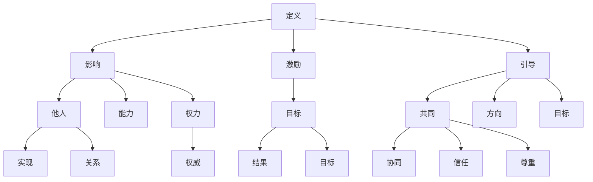

从上述流程图中，我们可以看到领导力的多维度特征。领导力不仅仅是简单的指挥和控制，它更是一种影响和激励他人共同前进的能力。

#### 1.2 领导力的发展历程

领导力的发展历程可以追溯到古希腊时期，当时的哲学家如亚里士多德和柏拉图对领导力的本质进行了初步探讨。随着历史的发展，领导力理论逐渐丰富和完善。

1. **早期领导理论**：
    - **特质理论**：认为领导力是由一系列天生的特质决定的，如勇气、智慧、正直等。
    - **行为理论**：强调领导力是通过特定行为表现出来的，不同的领导行为对团队绩效有不同影响。
    - **情境理论**：认为领导力取决于特定的情境，领导者需要根据不同情境采取不同的领导策略。

2. **现代领导理论**：
    - **变革型领导**：强调领导者通过激励和启发团队成员来实现变革，推动组织创新和发展。
    - **交易型领导**：侧重于通过奖惩机制来激励团队成员，确保任务完成。
    - **服务型领导**：认为领导者的首要任务是服务于团队成员，通过满足团队成员的需求来实现共同目标。

以下是一个简化的Mermaid流程图，展示了领导力理论的演变：

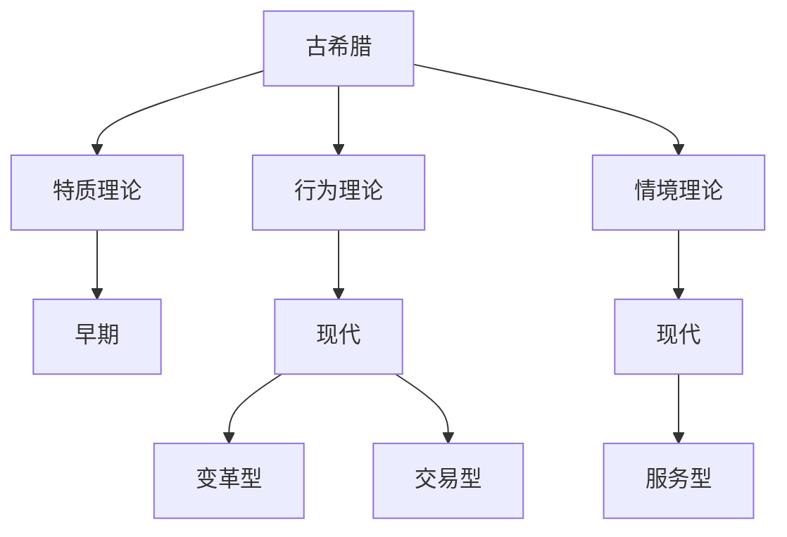

#### 1.3 领导力的核心要素

领导力的核心要素包括人际交往能力、决策能力和变革能力。这些要素相互作用，共同构成了领导力的核心框架。

1. **人际交往能力**：
    - **建立关系**：领导者需要建立和维护良好的人际关系，包括与团队成员、上级和合作伙伴的关系。
    - **沟通技巧**：有效的沟通是领导力的关键，领导者需要具备倾听、表达和反馈的能力。
    - **情商**：情商是人际交往能力的重要组成部分，包括自我认知、自我调节、社交技能等。

2. **决策能力**：
    - **分析能力**：领导者需要能够快速准确地分析信息，做出明智的决策。
    - **判断力**：领导者需要有良好的判断力，能够在不确定性中做出合适的决策。
    - **果断性**：领导者需要在关键时刻果断决策，避免拖延和犹豫。

3. **变革能力**：
    - **适应能力**：领导者需要具备适应环境变化的能力，能够灵活调整领导策略。
    - **创新能力**：领导者需要鼓励创新，推动组织不断进步。
    - **变革领导**：领导者需要具备推动组织变革的能力，能够带领团队实现变革。

以下是一个Mermaid流程图，展示了领导力的核心要素及其相互作用：

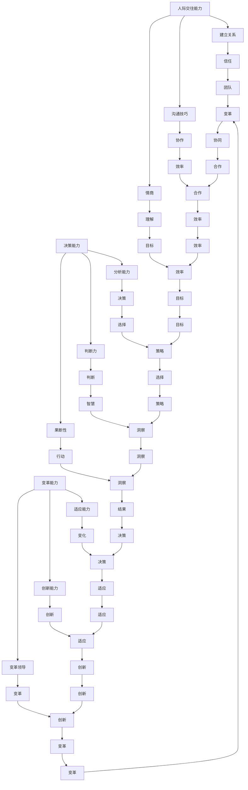

#### 1.4 领导力与管理的区别

领导力与管理是两个不同的概念，虽然它们在某些方面有重叠，但它们的核心目标和重点不同。

1. **领导力**：
    - **关注激励与影响**：领导力侧重于激励和影响他人，通过愿景和价值观引导团队前进。
    - **重视人的发展**：领导力强调人的发展，关注团队成员的成长和潜力激发。
    - **追求长远目标**：领导力不仅仅关注短期目标的实现，更注重长期的发展和战略规划。

2. **管理**：
    - **关注计划与执行**：管理侧重于计划、组织、协调和控制，确保任务的完成和目标的实现。
    - **重视任务完成**：管理关注任务的执行和效率，确保资源得到合理配置和利用。
    - **追求短期效果**：管理更注重短期目标的实现，关注即时绩效和成果。

以下是一个Mermaid流程图，展示了领导力与管理的主要区别：

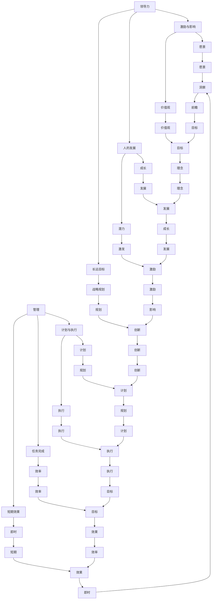

通过上述内容，我们对领导力的定义、发展历程、核心要素以及与管理的区别有了更深入的了解。在接下来的章节中，我们将继续探讨领导者的角色与责任，以及领导风格与团队管理的重要性。

---

### 第2章：领导者的角色与责任

#### 2.1 领导者的角色定位

领导者的角色是复杂而多样的，他们在组织中扮演着多种不同的角色，这些角色相互交织，共同影响着组织的运作和成功。以下是领导者的一些主要角色定位：

1. **领导者作为指导者**：
    - **设定目标**：领导者需要明确组织的愿景和目标，并将其传达给团队成员。
    - **指导方向**：领导者需要为团队成员提供清晰的方向和指导，确保团队朝着共同的目标前进。

2. **领导者作为协调者**：
    - **资源分配**：领导者需要合理分配资源，确保团队成员有足够的资源来完成他们的任务。
    - **任务协调**：领导者需要协调不同团队成员之间的工作，确保任务能够高效地完成。

3. **领导者作为激励者**：
    - **激励团队**：领导者需要激发团队成员的积极性，鼓励他们发挥最佳水平。
    - **认可贡献**：领导者需要认可团队成员的贡献，激励他们继续努力。

4. **领导者作为榜样**：
    - **行为示范**：领导者需要通过自己的行为来树立榜样，引导团队成员正确行事。
    - **价值观传递**：领导者需要将组织的价值观传递给团队成员，确保团队成员在行为和决策上与组织保持一致。

5. **领导者作为决策者**：
    - **做出决策**：领导者需要在关键时刻做出决策，确保组织能够应对各种挑战。
    - **风险评估**：领导者需要评估风险，确保决策的合理性和可行性。

以下是一个Mermaid流程图，展示了领导者的不同角色及其相互关系：

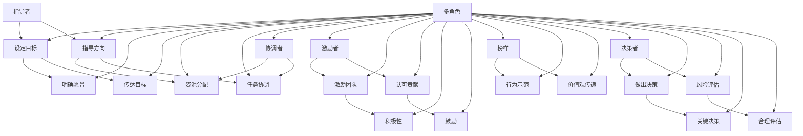

#### 2.2 领导者的责任与义务

领导者的责任和义务是他们角色的重要组成部分，这些责任和义务不仅影响他们的个人形象，还直接影响团队的绩效和组织的成功。以下是领导者的一些主要责任和义务：

1. **对团队的责任**：
    - **确保团队成员的安全和福祉**：领导者需要确保团队成员在工作中的安全和福祉，提供一个安全、健康的工作环境。
    - **提供必要的资源和支持**：领导者需要确保团队成员有足够的资源和支持来完成他们的任务，包括技术支持、培训和发展机会。
    - **培养和发展团队成员**：领导者需要投入时间和精力来培养和发展团队成员，帮助他们提升技能，实现个人和职业目标。

2. **对组织的责任**：
    - **实现组织目标**：领导者需要确保团队的工作能够支持组织的目标和战略，通过有效的领导和团队合作来实现这些目标。
    - **维护组织价值观**：领导者需要通过自己的行为来维护组织的价值观和道德标准，确保团队的行为与组织的价值观保持一致。

3. **对社会的责任**：
    - **社会责任**：领导者需要认识到组织对社会的影响，并承担相应的社会责任，包括环境保护、公平就业等。
    - **伦理领导**：领导者需要在决策和行动中体现伦理和道德标准，为社会树立良好的榜样。

4. **个人义务**：
    - **自我提升**：领导者需要不断地学习和提升自己的领导能力，以适应不断变化的环境和挑战。
    - **诚实和透明**：领导者需要保持诚实和透明，建立信任和尊重，为团队成员树立榜样。

以下是一个Mermaid流程图，展示了领导者的主要责任和义务：

```mermaid
graph TB
    A[团队责任] --> B[安全福祉]
    A --> C[资源支持]
    A --> D[培养发展]
    E[组织责任] --> F[实现目标]
    E --> G[维护价值观]
    H[社会责任] --> I[社会责任]
    H --> J[环境保护]
    H --> K[公平就业]
    L[伦理领导] --> M[伦理标准]
    L --> N[榜样]
    O[个人义务] --> P[自我提升]
    O --> Q[诚实透明]
    B --> R[安全]
    B --> S[福祉]
    C --> T[资源]
    C --> U[支持]
    D --> V[技能提升]
    D --> W[职业目标]
    F --> X[战略目标]
    F --> Y[团队合作]
    G --> Z[道德标准]
    G --> AA[行为]
    H --> BB[社会责任]
    H --> CC[环境]
    H --> DD[就业]
    I --> EE[影响]
    I --> FF[责任]
    J --> GG[保护]
    J --> HH[环境]
    K --> II[公平]
    K --> JJ[就业]
    L --> KK[标准]
    L --> MM[行为]
    M --> NN[道德]
    M --> OO[行为]
    N --> PP[榜样]
    O --> QQ[提升]
    O --> RR[能力]
    P --> SS[学习]
    P --> TT[成长]
    Q --> UU[诚实]
    Q --> VW[透明]
```

通过上述内容，我们对领导者的角色定位和责任义务有了更深入的了解。领导者的角色不仅涉及指导团队、协调资源、激励员工，还包括对组织和社会的责任，以及个人的自我提升和义务。在接下来的章节中，我们将继续探讨领导者的品格特质和自我认知与成长的重要性。

---

#### 2.3 领导者的品格特质

领导者的品格特质是其成功的关键因素之一。这些特质不仅影响领导者的个人形象，还直接影响团队的绩效和组织的文化。以下是领导者的一些关键品格特质：

1. **诚实和正直**：
    - **诚实**：领导者需要真诚地面对自己和他人，不隐瞒事实，不夸大其词。
    - **正直**：领导者需要坚持道德和伦理标准，言行一致，做到言行一致。

2. **勇气**：
    - **决策**：领导者需要在面对不确定性和风险时勇于做出决策。
    - **担当**：领导者需要勇于承担责任，不回避困难和挑战。

3. **同理心**：
    - **理解**：领导者需要理解团队成员的感受和需求，关心他们的福祉。
    - **支持**：领导者需要提供支持和鼓励，帮助团队成员克服困难。

4. **韧性**：
    - **逆境**：领导者需要具备在逆境中保持乐观和积极心态的能力。
    - **复原**：领导者需要能够在面对失败和挑战时迅速恢复，继续前进。

5. **自律**：
    - **时间管理**：领导者需要有效管理自己的时间，确保高效完成任务。
    - **目标导向**：领导者需要专注于目标，不断努力实现组织目标。

6. **自信**：
    - **信念**：领导者需要对自己的能力和决策有信心。
    - **影响力**：领导者需要通过自信来影响和激励团队成员。

以下是一个Mermaid流程图，展示了领导者的品格特质及其相互关系：

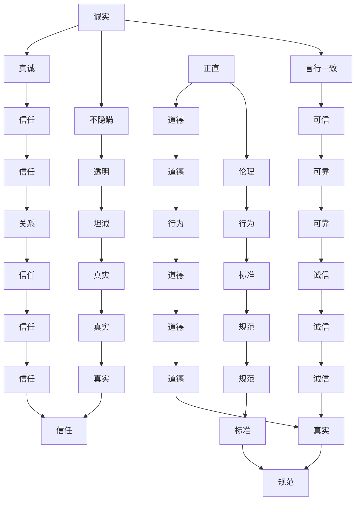

通过上述内容，我们可以看到，领导者的品格特质对他们的领导效果有着深远的影响。这些特质不仅帮助领导者建立信任和尊重，还能激励团队成员，提高团队的绩效。在接下来的章节中，我们将探讨领导者的自我认知与成长，以及如何通过自我反思和持续学习来提升领导能力。

---

#### 2.4 领导者的自我认知与成长

领导者的自我认知与成长是领导力发展的重要组成部分。自我认知是指领导者对自己的了解，包括自己的优势、劣势、价值观和动机。自我成长则是指领导者通过学习和实践来不断提升自己的能力和素质。

**自我认知的重要性**：

自我认知是领导者的基础。一个有效的领导者首先需要了解自己，知道自己的优点和不足，以及在不同情境下的行为反应。通过自我认知，领导者可以更准确地评估自己的能力，从而做出更好的决策和行动。

**自我认知的方法**：

1. **反思**：定期进行自我反思，回顾自己的行为和决策，分析成功和失败的原因。
2. **反馈**：寻求他人的反馈，包括团队成员、同事和上级，了解他们对自己的看法和期望。
3. **心理测试**：通过心理测试和评估工具，如MBTI、DISC等，了解自己的性格特点和偏好。

**自我成长的策略**：

1. **学习**：持续学习是自我成长的关键。领导者可以通过阅读书籍、参加培训课程、参加工作坊等方式，不断更新知识和技能。
2. **实践**：将所学知识应用于实际工作中，通过实践来检验和提升自己的能力。
3. **培养新技能**：主动培养新的技能和知识，如领导力、沟通技巧、变革管理等。
4. **榜样学习**：从其他成功的领导者身上学习，分析他们的领导风格和行为模式，借鉴他们的经验。

**自我认知与成长的重要性**：

自我认知与成长对于领导者的个人和职业发展具有重要意义。通过自我认知，领导者可以更好地理解自己的需求和发展方向，制定个人发展计划。通过自我成长，领导者可以不断提升自己的能力，更好地应对复杂的工作环境和挑战。

以下是一个Mermaid流程图，展示了自我认知与成长的过程：

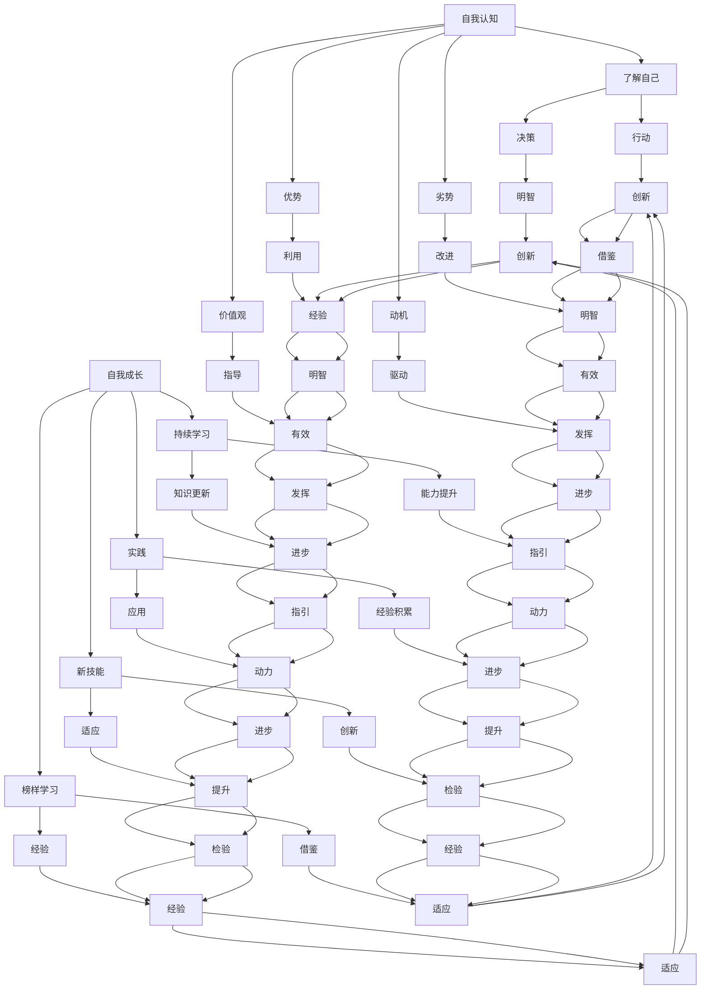

通过自我认知与成长，领导者可以不断提升自己的能力，更好地应对工作挑战，实现个人和组织的成功。在接下来的章节中，我们将探讨领导风格与团队管理，以及不同领导风格对团队绩效的影响。

---

### 第3章：领导风格与团队管理

#### 3.1 领导风格的理论模型

领导风格的理论模型是理解领导者行为和团队绩效的重要工具。不同的理论模型提出了不同的领导风格和方法，以适应不同的情境和团队需求。以下是几种常见的领导风格理论模型：

1. **行为领导模型**：
    - **特质理论**：强调领导者拥有特定的个人特质，如自信、决断力等。
    - **行为理论**：认为领导风格是通过领导者的行为表现出来的，如领导者的任务导向或关系导向行为。

2. **情境领导模型**：
    - **费德勒模型**：基于领导者与下属关系、任务结构和工作环境三个维度，提出不同情境下的领导风格选择。
    - **赫塞和布兰查德模型**：提出了四种领导风格，根据下属成熟度不同进行调整。

3. **变革型领导模型**：
    - **伯恩斯模型**：强调领导者通过激励和启发团队成员来实现变革，强调领导者的愿景和价值观。
    - **豪斯模型**：提出了四种变革型领导行为，包括激励、智力激发、个性化考虑和理想化影响。

4. **服务型领导模型**：
    - **格拉夫和卡明斯模型**：强调领导者通过服务团队成员的需求来实现领导，提升团队凝聚力和绩效。

以下是一个Mermaid流程图，展示了这些领导风格理论模型的基本框架：

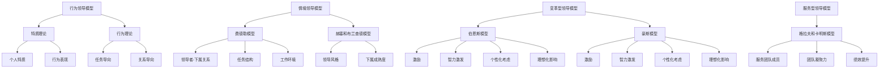

#### 3.2 团队建设与管理策略

团队建设是领导力的核心任务之一，它关乎团队的凝聚力和绩效。有效的团队建设策略可以帮助领导者打造一个高效、协作的团队。

1. **建立共同目标**：
    - **明确目标**：领导者需要明确团队的目标和愿景，确保团队成员对目标有共同的理解。
    - **共同参与**：鼓励团队成员参与目标的制定过程，提高他们的责任感和投入度。

2. **增强团队凝聚力**：
    - **信任建设**：通过团队活动和沟通，建立团队成员之间的信任关系。
    - **共同经历**：通过共同的经历和挑战，增强团队成员的归属感和凝聚力。

3. **提高沟通效率**：
    - **开放沟通**：鼓励团队成员自由表达意见和想法，建立开放、坦诚的沟通环境。
    - **有效反馈**：提供及时、具体的反馈，帮助团队成员改进和提高。

4. **培养团队协作精神**：
    - **分配角色**：根据团队成员的特长和兴趣，合理分配任务和角色。
    - **协同工作**：鼓励团队成员相互支持、合作，共同完成任务。

5. **解决团队冲突**：
    - **识别冲突**：及时发现和识别团队内部的冲突，理解冲突的根本原因。
    - **解决冲突**：采取适当的策略和技巧，如调解、妥协或冲突管理，解决团队冲突。

以下是一个Mermaid流程图，展示了团队建设与管理策略的关键步骤：

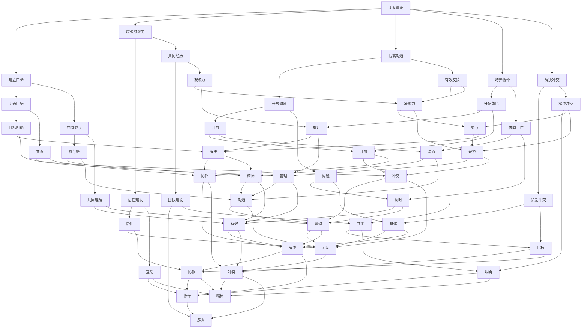

通过上述内容，我们可以看到团队建设与管理策略的关键步骤和重要因素。有效的团队建设与管理不仅能提高团队的凝聚力和绩效，还能为组织的长期成功奠定基础。在接下来的章节中，我们将探讨管理风格与团队绩效的关系，以及如何通过管理风格来提升团队绩效。

---

#### 3.3 管理风格与团队绩效的关系

管理风格对团队绩效有着深远的影响。不同的管理风格会导致不同的团队氛围和绩效表现。以下是一些常见的管理风格及其对团队绩效的影响：

1. **指令型管理风格**：
    - **特点**：领导者强调权威和控制，具体指示团队成员的工作。
    - **影响**：团队可能缺乏自主性和创新性，但任务执行效率较高。
    - **适用情境**：在任务紧急且需要高度控制时，指令型管理风格较为有效。

2. **参与型管理风格**：
    - **特点**：领导者鼓励团队成员参与决策和任务执行，注重团队协作和共同决策。
    - **影响**：团队士气较高，参与感和归属感较强，有助于创新和问题解决。
    - **适用情境**：在需要团队协作和创新时，参与型管理风格较为合适。

3. **授权型管理风格**：
    - **特点**：领导者赋予团队成员较大的自主权和责任，鼓励自我管理和自我驱动。
    - **影响**：团队具有较高的自主性和创新能力，有助于提升团队绩效和个人成长。
    - **适用情境**：在任务复杂且需要高创造性时，授权型管理风格较为适用。

以下是一个Mermaid流程图，展示了不同管理风格对团队绩效的影响：

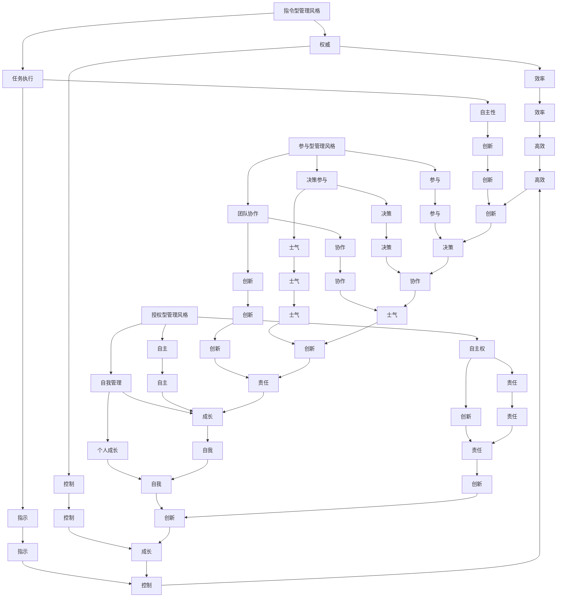

不同管理风格对团队绩效的影响是多方面的。指令型管理风格在任务执行上可能更为高效，但限制了团队的自主性和创新性。参与型管理风格和授权型管理风格则更注重团队的参与和自主性，有助于提升团队士气和创新能力。

领导者需要根据团队的具体情况和任务需求，灵活运用不同的管理风格。在任务紧急且需要高度控制时，指令型管理风格可能更为合适；而在需要团队协作和创新时，参与型管理风格和授权型管理风格则能更好地激发团队的潜力。

通过理解和运用不同的管理风格，领导者可以更好地提升团队绩效，实现组织的长期成功。在接下来的章节中，我们将探讨领导者如何应对团队冲突，以及有效的冲突管理策略。

---

#### 3.4 领导者如何应对团队冲突

团队冲突是团队管理中不可避免的一部分，有效的冲突管理对于维持团队的和谐与提高绩效至关重要。领导者需要具备识别和解决团队冲突的能力，以下是一些关键步骤和策略：

1. **识别冲突**：
    - **观察行为**：通过观察团队成员的行为和沟通方式，及时发现潜在的冲突。
    - **倾听反馈**：定期倾听团队成员的反馈和意见，了解他们面临的困难和挑战。
    - **利用调查**：通过问卷调查或其他形式收集团队成员的意见，了解团队内部的矛盾和分歧。

2. **理解冲突**：
    - **分析原因**：深入分析冲突的原因，了解冲突的根本问题。
    - **了解立场**：理解冲突双方的不同立场和利益，尊重他们的观点和感受。
    - **沟通理解**：通过积极的沟通，增进对冲突的理解和认识，为解决冲突奠定基础。

3. **解决冲突**：
    - **调解策略**：采用调解策略，通过第三方的帮助来协调冲突双方的立场，找到共同点。
    - **妥协方案**：在冲突无法完全解决时，鼓励双方进行妥协，达成一个双方都能接受的解决方案。
    - **直接解决**：在必要时，领导者可以直接介入冲突，采取果断的措施来解决问题。

4. **预防冲突**：
    - **建立沟通机制**：建立有效的沟通机制，确保团队成员之间能够顺畅地交流意见和反馈。
    - **培养团队文化**：培养积极、开放和包容的团队文化，减少冲突的发生。
    - **明确规则**：明确团队的工作规则和流程，减少因规则不清导致的冲突。

以下是一个Mermaid流程图，展示了领导者应对团队冲突的步骤和策略：

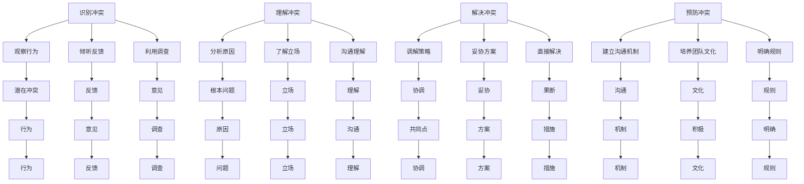

通过上述步骤和策略，领导者可以有效地识别、理解和解决团队冲突，维护团队的和谐与稳定。有效的冲突管理不仅能提升团队绩效，还能增强团队成员的信任和合作关系，为组织的长期发展奠定基础。

在处理团队冲突时，领导者需要保持冷静和客观，避免将个人情绪带入冲突中。通过积极的沟通和协作，领导者可以引导团队成员共同找到解决问题的方法，实现团队的目标和愿景。在接下来的章节中，我们将探讨情绪认知与调节，以及如何通过情绪管理提升个人的生活质量。

---

### 第4章：情绪认知与调节

#### 4.1 情绪的类型与表现

情绪是人类体验的核心组成部分，它们不仅影响我们的心理状态，还影响我们的行为和决策。情绪的类型多种多样，常见的情绪类型包括：

1. **喜悦**：是一种积极的情绪，通常与快乐、满足和幸福感相关。
2. **愤怒**：是一种强烈的消极情绪，通常与挫折、不满和敌意相关。
3. **悲伤**：是一种消极的情绪，通常与失去、失望和忧郁相关。
4. **恐惧**：是一种消极的情绪，通常与危险、不确定性或威胁相关。
5. **厌恶**：是一种消极的情绪，通常与不喜欢、反感或排斥相关。

每种情绪都有不同的表现，例如：

- **喜悦**：微笑、笑声、眼神发光、身体放松。
- **愤怒**：大声说话、肢体动作激烈、面部表情愤怒。
- **悲伤**：哭泣、表情沉重、声音低沉。
- **恐惧**：颤抖、出汗、心跳加速。
- **厌恶**：皱眉、皱鼻子、避开动作。

以下是一个Mermaid流程图，展示了情绪的类型及其表现：

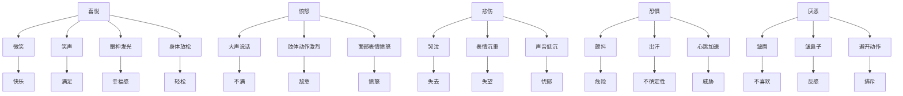

#### 4.2 情绪认知的重要性

情绪认知是指个体对自己和他人情绪的理解和识别能力。情绪认知的重要性在于，它使我们能够更好地理解和管理自己的情绪，以及识别和理解他人的情绪。

1. **自我认知**：通过情绪认知，个体可以更好地了解自己的情绪状态，包括情绪的类型、强度和发生的原因。这有助于个体在情绪波动时保持冷静和理智，避免因情绪失控而做出不当决策。

2. **人际交往**：情绪认知使我们能够更好地理解他人的情绪，从而更有效地进行人际交往。例如，当我们知道对方感到愤怒或悲伤时，我们可以采取适当的沟通策略，以缓解对方的情绪，建立更好的关系。

3. **情绪调节**：情绪认知是情绪调节的基础。通过了解自己的情绪，个体可以采取有效的调节策略，如自我对话、放松训练等，来管理情绪，提高生活质量。

4. **心理健康**：情绪认知对心理健康有重要影响。研究表明，情绪认知不足可能导致情绪障碍，如焦虑、抑郁等。通过提高情绪认知，个体可以更好地应对生活中的压力和挑战，保持心理健康。

以下是一个Mermaid流程图，展示了情绪认知的重要性：

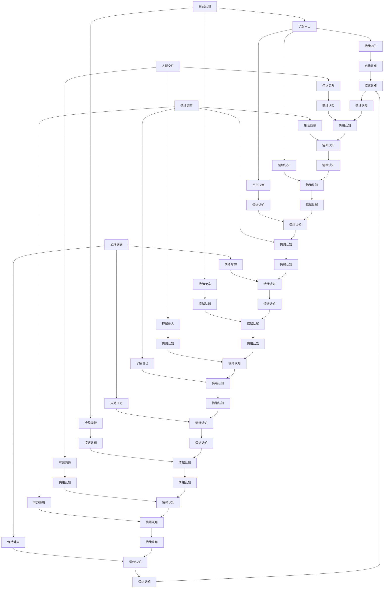

#### 4.3 情绪调节的方法与技巧

情绪调节是指通过一系列的方法和技巧来管理自己的情绪，以保持积极的情绪状态。以下是一些常见的情绪调节方法和技巧：

1. **自我对话**：
    - **自我对话**是一种有效的情绪调节技巧，通过与自己进行积极的对话来改变负面情绪。例如，当感到焦虑时，可以告诉自己“这只是暂时的情绪波动，我能够应对”。

2. **情绪释放**：
    - **情绪释放**包括哭泣、运动、写日记等方式，帮助个体释放负面情绪。释放情绪有助于减轻内心的压力，提高情绪稳定性。

3. **放松训练**：
    - **放松训练**如深呼吸、冥想、瑜伽等，可以帮助个体放松身心，减轻紧张和焦虑。这些训练有助于调节情绪，提高生活质量。

4. **积极思考**：
    - **积极思考**是指用积极的态度看待事物，避免过度消极的思维。通过积极思考，个体可以更有效地应对挑战和困难。

以下是一个Mermaid流程图，展示了情绪调节的方法与技巧：

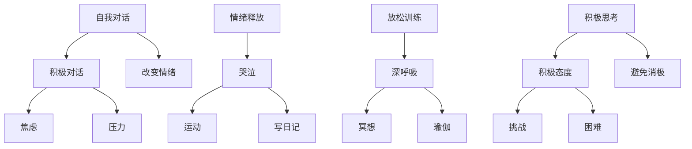

通过上述方法与技巧，个体可以更好地调节自己的情绪，提高情绪稳定性，从而更好地应对生活中的各种挑战。情绪调节不仅有助于个体的心理健康，还能提升工作和生活质量。

#### 4.4 情绪管理的重要性

情绪管理是指通过一系列的策略和方法来调节和控制自己的情绪，以实现更好的生活和工作效果。情绪管理的重要性体现在以下几个方面：

1. **心理健康**：
    - 情绪管理有助于维护心理健康，减少焦虑、抑郁等情绪障碍的发生。通过有效的情绪管理，个体可以更好地应对生活中的压力和挑战，保持积极的心态。

2. **工作效率**：
    - 情绪管理有助于提高工作效率。当个体能够有效管理自己的情绪时，他们能够更加专注和投入工作，减少因情绪波动导致的效率低下。

3. **人际关系**：
    - 情绪管理有助于改善人际关系。通过情绪管理，个体可以更好地理解他人的情绪，从而更有效地进行沟通和合作，建立和谐的人际关系。

4. **生活质量**：
    - 情绪管理有助于提高生活质量。当个体能够控制自己的情绪时，他们能够更好地享受生活中的各种经历，减少因情绪问题带来的负面体验。

以下是一个Mermaid流程图，展示了情绪管理的重要性：

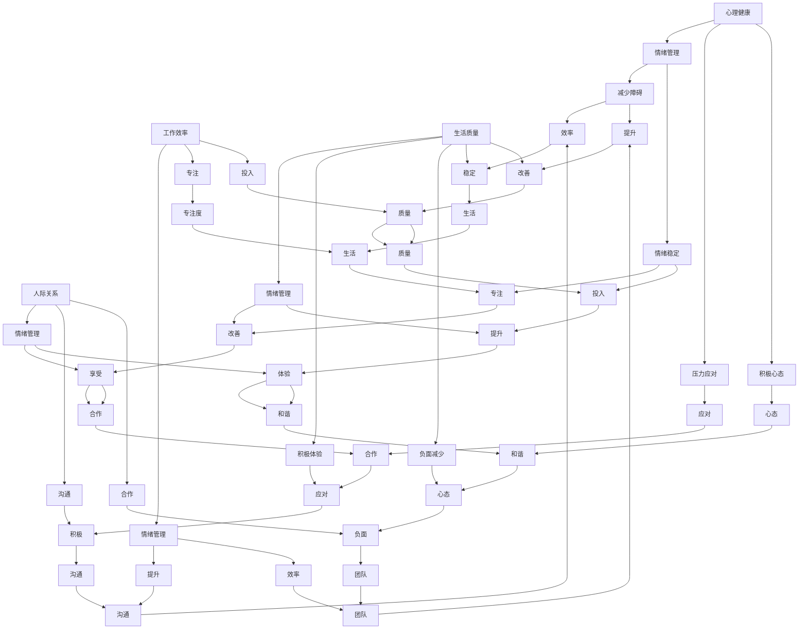

通过情绪管理，个体可以更好地应对生活中的各种挑战，提高生活和工作质量。有效的情绪管理不仅有助于个体的心理健康，还能提升人际关系的质量和工作效率。在接下来的章节中，我们将探讨压力管理与应对策略，以及如何在压力下保持冷静和高效。

---

### 第5章：压力管理与应对

#### 5.1 压力的来源与影响

压力是现代社会中普遍存在的现象，它来源于各种生活和工作中的挑战。了解压力的来源和影响，有助于我们更好地管理和应对压力。

1. **工作压力**：
    - **任务繁重**：当工作任务过多或过于复杂时，个体会感到压力。
    - **时间紧迫**：紧迫的时间限制会导致个体感到压力，尤其是当任务需要在短时间内完成时。
    - **角色冲突**：个体在同时承担多个角色（如工作、家庭、社交等）时，可能会感到压力。

2. **生活压力**：
    - **经济问题**：财务困难、债务问题等经济压力会对个体的心理健康产生负面影响。
    - **人际关系**：家庭关系、朋友关系、同事关系等不和谐的人际关系会导致压力。
    - **健康问题**：个人的健康状况或家庭成员的健康问题也是压力的重要来源。

3. **社会压力**：
    - **社会期望**：社会对个体的期望，如职业发展、家庭责任等，会给个体带来压力。
    - **竞争压力**：工作中的竞争、社会地位的竞争等也会产生压力。

压力的影响主要体现在以下几个方面：

- **生理影响**：长期的慢性压力会导致一系列生理问题，如失眠、头痛、胃痛、高血压等。
- **心理影响**：压力会导致情绪问题，如焦虑、抑郁、情绪波动等，影响个体的心理健康。
- **行为影响**：压力可能会影响个体的行为，如工作效率下降、缺乏动力、逃避问题等。

以下是一个Mermaid流程图，展示了压力的来源及其影响：

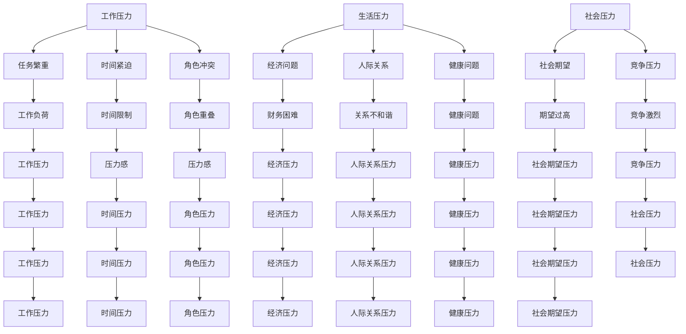

了解压力的来源和影响，有助于我们更好地认识和应对压力，从而保持身心健康。

#### 5.2 压力管理的策略与方法

有效的压力管理策略和方法可以帮助我们更好地应对压力，提高生活质量。以下是一些常见的压力管理策略：

1. **时间管理**：
    - **制定计划**：通过制定详细的计划和时间表，合理安排时间，避免过度繁忙和紧急任务。
    - **优先级排序**：确定任务的优先级，优先处理重要且紧急的任务，减少压力。

2. **积极思考**：
    - **改变视角**：通过积极思考，用更积极、乐观的角度看待问题和挑战，减少消极情绪。
    - **寻找解决办法**：面对压力时，积极寻找解决问题的办法，而不是沉浸在问题中。

3. **放松技巧**：
    - **深呼吸**：深呼吸可以帮助放松身心，缓解紧张和焦虑。
    - **冥想**：冥想有助于放松大脑，减少压力，提高专注力。
    - **运动**：适量的运动可以释放压力，改善心理健康。

4. **社交支持**：
    - **与朋友交流**：与朋友、家人交流，分享自己的感受和压力，获得支持和理解。
    - **寻求专业帮助**：在需要时，寻求心理咨询师或其他专业人士的帮助，学习有效的压力管理技巧。

以下是一个Mermaid流程图，展示了压力管理的策略和方法：

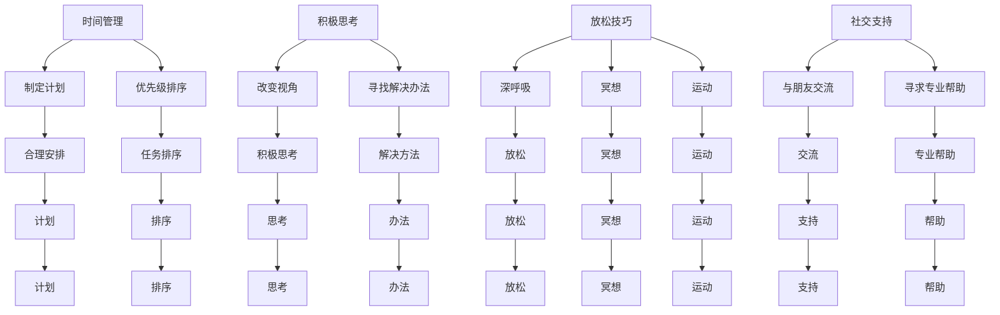

通过上述策略和方法，我们可以更好地管理压力，提高生活质量和心理健康。

#### 5.3 压力管理中的误区与挑战

在压力管理中，人们常常会陷入一些误区，这些误区可能会加剧压力，而不是减轻它。以下是一些常见的误区和挑战：

1. **过度工作**：
    - 有些人认为通过加班和拼命工作可以摆脱压力，但这种做法往往会适得其反，导致身体和心理的疲劳。

2. **逃避问题**：
    - 遇到问题时，有些人在压力下选择逃避，而不是直面问题。这种逃避行为可能会让问题积累，最终导致更大的压力。

3. **依赖药物或酒精**：
    - 有些人在压力下会依赖药物或酒精来缓解压力，但这种方法只是暂时的，长期依赖会对健康产生负面影响。

4. **忽视身心健康**：
    - 在追求事业成功的过程中，有些人会忽视自己的身心健康，导致身体和心理问题加剧。

5. **缺乏有效沟通**：
    - 当压力增大时，有些人会变得沉默寡言，缺乏有效的沟通。这可能导致问题无法及时解决，压力积聚。

以下是一个Mermaid流程图，展示了压力管理中的误区和挑战：

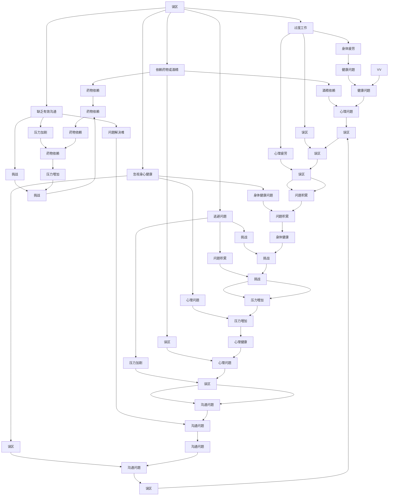

了解这些误区和挑战，有助于我们更好地应对压力，采取有效的策略来减轻压力。

#### 5.4 压力管理的实践案例

为了更好地理解压力管理的策略和方法，以下是一个实际的案例：

**案例背景**：张华是一名软件工程师，他在一家高科技公司工作，负责一个重要的软件开发项目。随着项目的进展，张华感到压力越来越大，因为他不仅要处理日常的工作任务，还要应对突发的问题和客户的要求。

**压力来源**：
1. **工作量大**：项目任务繁重，张华需要同时处理多个任务。
2. **时间紧迫**：项目进度紧张，需要在限定的时间内完成。
3. **角色冲突**：张华不仅要完成自己的任务，还要协助其他团队成员。

**压力管理策略**：
1. **时间管理**：张华制定了一个详细的时间表，将任务分解成小部分，并为每个部分设定了具体的时间限制。
2. **积极思考**：张华通过积极的自我对话来调整心态，告诉自己“我可以应对这些挑战，只要我合理规划时间”。
3. **放松技巧**：每天下班后，张华会进行深呼吸和冥想，以放松身心。
4. **社交支持**：张华与同事和上级进行了多次沟通，分享了项目的进展和遇到的问题，获得了他们的建议和支持。

**实践效果**：
通过上述策略，张华有效地管理了压力，提高了工作效率。他能够更合理地安排时间，避免了任务的积压和超负荷工作。同时，积极思考和放松技巧帮助他保持了良好的心态，减少了焦虑和紧张。社交支持让他感到被理解和支持，增强了自信心和动力。

**案例分析**：这个案例展示了如何通过有效的压力管理策略来应对工作压力。张华的时间管理策略帮助他合理分配任务，避免了过度工作。积极思考和放松技巧帮助他保持心态平衡，减少了压力感。社交支持则增强了他的信心，使他能够更有效地应对挑战。

通过这个案例，我们可以看到，有效的压力管理策略不仅有助于提高工作效率，还能提升个人的心理健康和幸福感。在接下来的章节中，我们将探讨情绪智力与领导力的关系，以及如何提升情绪智力。

---

### 第6章：情绪智力与领导力

#### 6.1 情绪智力的概念与构成

情绪智力（Emotional Intelligence，简称EQ）是指个体识别、理解、管理自己和他人的情绪，以及运用情绪促进人际关系和工作的能力。情绪智力不同于传统的认知智力（IQ），它更侧重于情感和社会方面的能力。情绪智力通常由以下四个构成要素组成：

1. **自我认知**：
    - **定义**：自我认知是指个体对自己情绪的识别和理解。
    - **作用**：通过自我认知，个体可以更好地了解自己的情绪状态，从而更好地管理情绪。

2. **自我调节**：
    - **定义**：自我调节是指个体对自己情绪的调节和控制。
    - **作用**：自我调节有助于个体在面对压力和挑战时保持冷静和理智，做出明智的决策。

3. **社交技能**：
    - **定义**：社交技能是指个体在社交场合中与他人有效沟通、建立和维护人际关系的能力。
    - **作用**：社交技能有助于个体建立积极的人际关系，提高团队合作效率和领导力。

4. **同理心**：
    - **定义**：同理心是指个体能够理解、感知他人的情绪，并站在他人的角度思考问题。
    - **作用**：同理心有助于个体更好地理解和满足他人的需求，建立信任和尊重，提高领导力。

以下是一个Mermaid流程图，展示了情绪智力的构成及其相互作用：

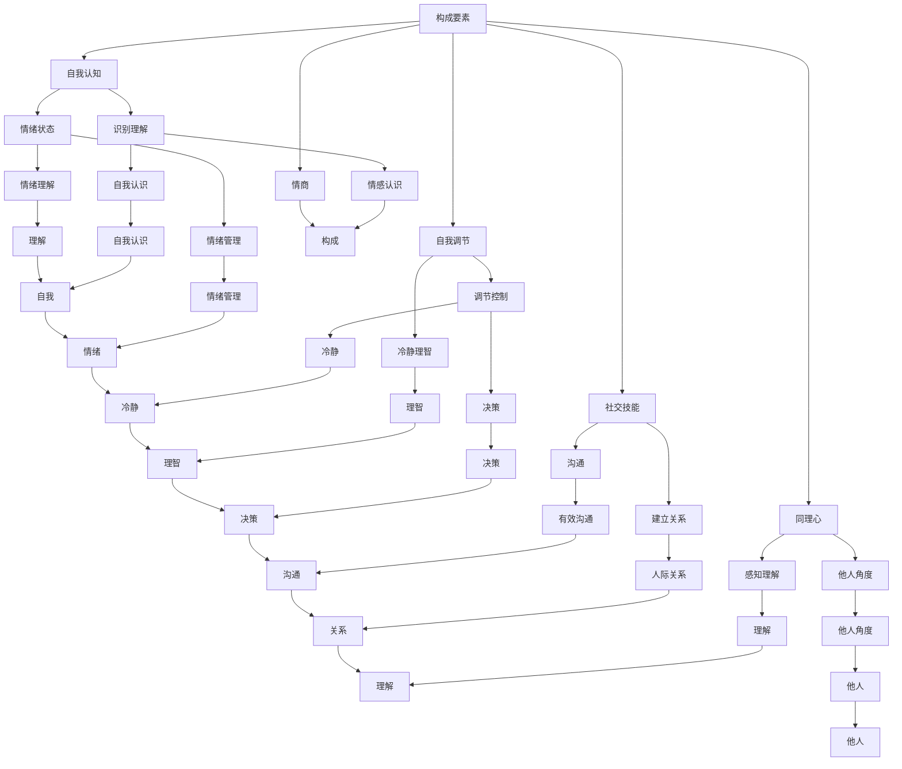

通过上述内容，我们可以看到情绪智力是由多个要素构成的，这些要素相互关联，共同影响着个体的情绪管理能力和领导力。自我认知帮助个体了解自己的情绪，自我调节使个体能够更好地控制情绪，社交技能和同理心则帮助个体在人际交往中表现出色。

#### 6.2 情绪智力在领导力中的作用

情绪智力在领导力中扮演着至关重要的角色。一个高情绪智力的领导者不仅能够更好地管理自己的情绪，还能够理解和激励团队成员，从而提升团队的绩效和凝聚力。以下是情绪智力在领导力中的几个关键作用：

1. **提高领导效果**：
    - **自我认知**：高情绪智力的领导者能够深入了解自己的情绪状态，从而在决策和行动中保持冷静和理智。这种自我认知有助于领导者做出明智的决策，提高领导效果。
    - **自我调节**：领导者需要具备强大的情绪调节能力，以应对工作中的压力和挑战。通过有效的自我调节，领导者可以保持积极的心态，减少情绪波动对决策和行为的影响。

2. **增强团队凝聚力**：
    - **社交技能**：领导者需要具备良好的社交技能，包括沟通、倾听和冲突解决能力。通过有效的沟通，领导者可以建立信任和尊重，增强团队的凝聚力。
    - **同理心**：领导者需要能够理解和感受团队成员的情绪，站在他们的角度思考问题。同理心有助于领导者更好地满足团队成员的需求，提高团队的满意度和忠诚度。

3. **提升团队绩效**：
    - **情绪管理**：领导者需要能够有效地管理团队的情绪氛围，营造一个积极、健康的工作环境。通过情绪管理，领导者可以激发团队成员的积极性和创造力，提高团队的绩效。
    - **激励和引导**：领导者需要通过激励和引导来激发团队成员的潜力，实现共同的目标。高情绪智力的领导者能够更好地识别团队成员的需求和动机，采取有效的激励策略。

以下是一个Mermaid流程图，展示了情绪智力在领导力中的作用：

```mermaid
graph TB
    A[领导效果] --> B[自我认知]
    A --> C[自我调节]
    A --> D[社交技能]
    A --> E[同理心]
    A --> F[情绪管理]
    G[团队凝聚力] --> H[社交技能]
    G --> I[同理心]
    G --> J[情绪管理]
    K[团队绩效] --> L[情绪管理]
    K --> M[激励]
    K --> N[引导]
    O[情绪智力] --> P[自我认知]
    O --> Q[自我调节]
    O --> R[社交技能]
    O --> S[同理心]
    B --> T[决策]
    C --> U[冷静]
    D --> V[沟通]
    E --> W[理解]
    F --> X[情绪氛围]
    H --> Y[信任]
    I --> Z[需求]
    J --> AA[氛围]
    L --> BB[积极性]
    M --> CC[激发]
    N --> DD[引导]
    O --> EE[领导力]
    P --> FF[认识]
    Q --> GG[调节]
    R --> HH[技能]
    S --> II[同理]
    T --> JJ[明智]
    U --> KK[理智]
    V --> LL[有效]
    W --> MM[理解]
    X --> NN[健康]
    Y --> OO[关系]
    Z --> PP[满足]
    AA --> QQ[健康]
    BB --> RR[积极性]
    CC --> SS[潜力]
    DD --> TT[目标]
    EE --> UU[情感]
    FF --> WW[自我]
    GG --> XX[冷静]
    HH --> YY[技能]
    II --> ZZ[同理]
    JJ --> AA[决策]
    KK --> BB[理智]
    LL --> CC[沟通]
    MM --> DD[健康]
    NN --> EE[信任]
    OO --> FF[需求]
    PP --> GG[满足]
    QQ --> HH[健康]
    RR --> II[积极性]
    SS --> JJ[激发]
    TT --> KK[目标]
    UU --> LL[情感]
    VV --> MM[氛围]
    WW --> NN[自我]
    XX --> OO[理智]
    YY --> PP[技能]
    ZZ --> QQ[同理]
    AA --> RR[积极性]
    BB --> SS[潜力]
    CC --> TT[目标]
    DD --> UU[激励]
    EE --> VV[引导]
    FF --> WW[认识]
    GG --> XX[冷静]
    HH --> YY[技能]
    II --> ZZ[同理]
    JJ --> AA[决策]
    KK --> BB[理智]
    LL --> CC[沟通]
    MM --> DD[健康]
    NN --> EE[信任]
    OO --> FF[需求]
    PP --> GG[满足]
    QQ --> HH[健康]
    RR --> II[积极性]
    SS --> JJ[激发]
    TT --> KK[目标]
    UU --> LL[情感]
    VV --> MM[氛围]
    WW --> NN[自我]
    XX --> OO[理智]
    YY --> PP[技能]
    ZZ --> QQ[同理]
    AA --> RR[积极性]
    BB --> SS[潜力]
    CC --> TT[目标]
    DD --> UU[激励]
    EE --> VV[引导]
```

通过上述内容，我们可以看到情绪智力在领导力中的关键作用。高情绪智力的领导者能够更好地管理自己的情绪，理解团队成员的需求，建立积极的团队氛围，从而提升领导效果、团队凝聚力和团队绩效。

#### 6.3 提高情绪智力的重要性

提高情绪智力对于个人的职业发展和心理健康具有重要意义。以下是提高情绪智力的一些重要原因：

1. **改善人际关系**：
    - **自我认知**：通过提高自我认知，个体可以更好地了解自己的情绪和行为，从而改善与他人的沟通和互动，减少冲突。
    - **社交技能**：提高社交技能有助于个体在人际交往中更加自信和有效，建立积极的人际关系网络。

2. **提升心理健康**：
    - **自我调节**：通过有效的情绪调节，个体可以更好地应对压力和挑战，减少焦虑和抑郁等情绪障碍。
    - **同理心**：同理心有助于个体更好地理解和感受他人的情绪，提高情商，增强心理韧性。

3. **促进职业发展**：
    - **领导力提升**：情绪智力是领导力的关键组成部分，提高情绪智力有助于个体在职业发展中脱颖而出，成为有效的领导者。
    - **团队合作**：情绪智力有助于个体更好地理解和满足团队成员的需求，促进团队合作，提高团队绩效。

4. **提高生活质量**：
    - **情绪管理**：有效的情绪管理有助于个体在日常生活中保持积极的心态，享受生活的乐趣，提高生活质量。

以下是一个Mermaid流程图，展示了提高情绪智力的重要性：

```mermaid
graph TB
    A[改善人际关系] --> B[自我认知]
    A --> C[社交技能]
    D[提升心理健康] --> E[自我调节]
    D --> F[同理心]
    G[促进职业发展] --> H[领导力提升]
    G --> I[团队合作]
    J[提高生活质量] --> K[情绪管理]
    K --> L[积极心态]
    K --> M[生活乐趣]
    B --> N[沟通]
    B --> O[互动]
    C --> P[自信]
    C --> Q[关系]
    D --> R[焦虑减少]
    D --> S[抑郁减少]
    E --> T[应对压力]
    E --> U[挑战]
    F --> V[理解]
    F --> W[感受]
    G --> X[职业发展]
    G --> Y[团队绩效]
    H --> Z[领导力]
    I --> AA[合作]
    I --> BB[效率]
    J --> CC[情绪管理]
    J --> DD[心态]
    J --> EE[生活质量]
    K --> FF[乐趣]
    L --> GG[享受]
    M --> HH[乐趣]
    N --> II[有效]
    O --> JJ[改善]
    P --> KK[自信]
    Q --> LL[和谐]
    R --> MM[焦虑]
    R --> NN[抑郁]
    S --> OO[压力]
    S --> PP[挑战]
    T --> QQ[应对]
    T --> RR[情绪]
    U --> SS[调节]
    U --> TT[能力]
    V --> WW[理解]
    V --> XX[他人]
    W --> YY[感受]
    W --> ZZ[情绪]
    X --> AA[职业]
    X --> BB[发展]
    Y --> CC[团队]
    Y --> DD[合作]
    Z --> EE[领导]
    Z --> FF[力]
    AA --> GG[团队]
    BB --> HH[合作]
    CC --> II[绩效]
    DD --> JJ[效率]
    EE --> KK[领导]
    FF --> LL[力]
    GG --> MM[职业]
    HH --> NN[发展]
    II --> OO[绩效]
    JJ --> PP[效率]
    KK --> QQ[领导]
    LL --> RR[力]
    MM --> SS[生活]
    NN --> TT[质量]
    OO --> UU[情绪]
    PP --> VV[管理]
    QQ --> WW[能力]
    RR --> XX[情绪]
    SS --> YY[乐趣]
    TT --> ZZ[质量]
    UU --> AA[挑战]
    VV --> BB[管理]
    WW --> CC[理解]
    XX --> DD[他人]
    YY --> EE[乐趣]
    ZZ --> FF[质量]
```

通过上述内容，我们可以看到提高情绪智力对于改善人际关系、提升心理健康、促进职业发展和提高生活质量具有重要意义。在接下来的章节中，我们将探讨情绪智力提升的实践方法，以及如何通过这些方法来提升情绪智力。

#### 6.4 情绪智力提升的实践方法

提升情绪智力是一个持续的过程，需要个体在日常生活中不断练习和应用。以下是一些实用的方法，帮助领导者和管理者提升情绪智力：

1. **自我反思**：
    - **定期反思**：领导者可以每天或每周花时间反思自己的情绪和行为，思考自己在不同情境下的反应，识别情绪波动的原因。
    - **记录日记**：通过写日记，领导者可以记录自己的情绪变化，分析情绪的触发因素和应对策略。

2. **情绪管理训练**：
    - **深呼吸**：在面对压力时，深呼吸可以帮助领导者放松身心，减少焦虑和紧张。
    - **冥想**：冥想有助于提升情绪智力，增强自我认知和自我调节能力。领导者可以通过每天短暂的冥想练习来提高情绪智力。

3. **社交技能训练**：
    - **有效沟通**：领导者可以通过参加沟通培训课程，学习有效的沟通技巧，如倾听、表达和反馈。
    - **角色扮演**：通过角色扮演练习，领导者可以在模拟的社交场合中提高社交技能，学会如何更好地与他人沟通和互动。

4. **同理心培养**：
    - **倾听他人**：领导者需要学会倾听他人的意见和感受，站在他人的角度思考问题，增强同理心。
    - **观察他人**：通过观察他人的行为和情绪，领导者可以更好地理解和识别他人的情绪，培养同理心。

5. **情感智商课程**：
    - **参加课程**：领导者可以参加专门的情感智商（EQ）培训课程，学习情感智商的理论和实践方法，提升情绪智力。
    - **阅读书籍**：阅读有关情绪智力和管理方面的书籍，获取更多的知识和技巧。

6. **团队合作**：
    - **团队活动**：通过参与团队活动，领导者可以在实践中提升情绪智力，学会如何与团队成员协作，处理团队冲突。
    - **反馈与接受**：领导者需要学会接受团队成员的反馈，并将其视为个人成长的机会。

7. **心理咨询**：
    - **专业咨询**：在遇到情绪困扰时，领导者可以寻求心理咨询师的帮助，学习专业的情绪管理和应对策略。

以下是一个Mermaid流程图，展示了情绪智力提升的实践方法：

```mermaid
graph TB
    A[自我反思] --> B[定期反思]
    A --> C[记录日记]
    D[情绪管理训练] --> E[深呼吸]
    D --> F[冥想]
    G[社交技能训练] --> H[有效沟通]
    G --> I[角色扮演]
    J[同理心培养] --> K[倾听他人]
    J --> L[观察他人]
    M[情感智商课程] --> N[参加课程]
    M --> O[阅读书籍]
    P[团队合作] --> Q[团队活动]
    P --> R[反馈与接受]
    S[心理咨询] --> T[专业咨询]
    S --> U[应对策略]
    B --> V[情绪波动]
    C --> W[触发因素]
    E --> X[放松]
    F --> Y[情绪调节]
    H --> Z[表达]
    I --> AA[互动]
    K --> BB[理解]
    L --> CC[识别]
    N --> DD[知识]
    O --> EE[技巧]
    Q --> FF[协作]
    R --> GG[冲突]
    T --> HH[专业]
    U --> II[策略]
    V --> JJ[反思]
    W --> KK[日记]
    X --> LL[深呼吸]
    Y --> MM[冥想]
    Z --> NN[有效]
    AA --> OO[角色]
    BB --> PP[感受]
    CC --> QQ[行为]
    DD --> RR[团队]
    EE --> SS[书籍]
    FF --> TT[活动]
    GG --> UU[反馈]
    HH --> II[咨询]
    II --> JJ[策略]
```

通过上述实践方法，领导者可以逐步提升自己的情绪智力，更好地管理情绪，增强社交技能和同理心，从而提升领导力和团队绩效。在接下来的章节中，我们将探讨领导者在压力下的应对策略，以及如何保持冷静和有效领导。

---

### 第7章：领导者在压力下的应对策略

#### 7.1 压力对领导力的影响

压力是领导者面临的一个重要挑战，它对领导力有着显著的影响。以下是压力对领导力影响的几个方面：

1. **决策能力**：
    - **影响**：压力会导致领导者的决策能力下降，因为他们可能会陷入情绪化和焦虑的状态，难以做出明智的决策。
    - **应对**：领导者需要通过有效的压力管理策略来提高决策能力，如深呼吸、冥想和积极的自我对话。

2. **情绪管理**：
    - **影响**：压力会影响领导者的情绪状态，使他们更容易变得焦虑、愤怒或沮丧。
    - **应对**：领导者需要学会情绪调节技巧，如深呼吸、冥想和放松训练，以保持冷静和理智。

3. **人际关系**：
    - **影响**：压力会影响领导者与团队成员的关系，可能导致沟通不畅、信任减少和团队凝聚力下降。
    - **应对**：领导者需要通过有效的沟通和同理心来维护和改善人际关系，建立信任和尊重。

4. **工作效率**：
    - **影响**：压力会降低领导者的工作效率，使他们难以集中精力完成任务。
    - **应对**：领导者需要通过时间管理和优先级排序来提高工作效率，避免过度工作和疲劳。

5. **健康问题**：
    - **影响**：长期的压力会导致领导者的身心健康问题，如失眠、焦虑和抑郁。
    - **应对**：领导者需要关注自己的身心健康，采取健康的生活方式，如适量运动、健康饮食和充足的睡眠。

以下是一个Mermaid流程图，展示了压力对领导力影响的各个方面：

```mermaid
graph TB
    A[决策能力] --> B[压力]
    A --> C[情绪管理]
    A --> D[人际关系]
    A --> E[工作效率]
    A --> F[健康问题]
    B --> G[影响]
    C --> H[情绪波动]
    D --> I[沟通不畅]
    E --> J[效率下降]
    F --> K[身心健康]
    G --> L[下降]
    H --> M[焦虑]
    H --> N[愤怒]
    I --> O[信任减少]
    I --> P[团队凝聚力下降]
    J --> Q[集中困难]
    K --> R[焦虑]
    K --> S[抑郁]
    L --> T[负面影响]
    M --> U[焦虑]
    N --> V[愤怒]
    O --> W[信任减少]
    P --> XX[凝聚力下降]
    Q --> YY[效率下降]
    R --> ZZ[身心健康]
    S --> AA[抑郁]
    T --> BB[负面]
    U --> CC[焦虑]
    V --> DD[愤怒]
    W --> EE[信任减少]
    XX --> FF[凝聚力下降]
    YY --> GG[效率下降]
    ZZ --> HH[身心健康]
    AA --> II[情绪问题]
    BB --> CC[负面]
    CC --> DD[情绪问题]
    DD --> EE[关系问题]
    EE --> FF[凝聚力下降]
    FF --> GG[效率下降]
    GG --> HH[健康问题]
```

#### 7.2 领导者在压力下的挑战

领导者在面对压力时，会遇到一系列挑战，这些挑战会影响他们的决策能力、情绪管理和工作效率。以下是领导者面临的一些主要挑战：

1. **时间管理**：
    - **挑战**：领导者需要在有限的时间内处理大量的工作任务，这可能导致时间管理困难，任务积压。
    - **应对**：领导者可以通过制定详细的时间表、设置优先级和避免过度工作来改善时间管理。

2. **任务繁重**：
    - **挑战**：当工作任务过多时，领导者可能会感到压力倍增，难以应对。
    - **应对**：领导者可以寻求团队成员的帮助，合理分配任务，确保任务的顺利完成。

3. **不确定性**：
    - **挑战**：在不确定的环境中，领导者需要快速做出决策，这可能导致焦虑和不安。
    - **应对**：领导者可以通过加强信息收集、制定应急预案和培养团队应对不确定性的能力来应对不确定性。

4. **情绪管理**：
    - **挑战**：领导者的情绪管理能力在压力下会受到考验，他们可能会表现出焦虑、愤怒或沮丧。
    - **应对**：领导者可以通过情绪调节技巧、积极的自我对话和寻求支持来管理情绪。

5. **健康问题**：
    - **挑战**：长期的压力可能导致领导者的身心健康问题，如失眠、焦虑和抑郁。
    - **应对**：领导者需要关注自己的身心健康，采取健康的生活方式，如适量运动、健康饮食和充足的睡眠。

以下是一个Mermaid流程图，展示了领导者在压力下的挑战及其应对策略：

```mermaid
graph TB
    A[时间管理] --> B[任务积压]
    A --> C[优先级]
    A --> D[过度工作]
    B --> E[挑战]
    C --> F[设置]
    D --> G[压力]
    H[任务繁重] --> I[工作量]
    H --> J[压力感]
    I --> K[挑战]
    J --> L[压力感]
    M[不确定性] --> N[快速决策]
    M --> O[焦虑]
    N --> P[挑战]
    O --> Q[不安]
    R[情绪管理] --> S[焦虑]
    S --> T[愤怒]
    S --> U[沮丧]
    R --> V[挑战]
    W[健康问题] --> X[失眠]
    W --> Y[焦虑]
    W --> Z[抑郁]
    X --> AA[健康问题]
    Y --> BB[情绪问题]
    Z --> CC[心理健康]
    E --> D[应对]
    F --> E[策略]
    G --> E[效果]
    I --> E[任务]
    J --> E[压力]
    K --> E[挑战]
    L --> E[压力感]
    N --> E[决策]
    O --> E[焦虑]
    P --> E[挑战]
    Q --> E[不安]
    S --> T[情绪波动]
    U --> T[情绪波动]
    V --> T[挑战]
    X --> W[健康]
    Y --> W[情绪]
    Z --> W[心理]
    AA --> BB[健康]
    BB --> CC[情绪]
    CC --> DD[心理]
    D --> EE[时间]
    E --> FF[管理]
    F --> GG[策略]
    G --> HH[效果]
    H --> II[任务]
    I --> JJ[繁重]
    J --> KK[压力]
    K --> LL[挑战]
    L --> MM[压力感]
    M --> NN[决策]
    N --> OO[挑战]
    O --> PP[不安]
    P --> QQ[策略]
    Q --> RR[不安]
    R --> SS[策略]
    S --> TT[情绪]
    T --> UU[波动]
    U --> VV[情绪]
    V --> WW[挑战]
    W --> XX[健康]
    X --> YY[失眠]
    Y --> ZZ[焦虑]
    Z --> AA[抑郁]
    AA --> BB[健康]
    BB --> CC[情绪]
    CC --> DD[心理]
    D --> EE[时间]
    F --> FF[优先]
    G --> GG[效果]
    H --> II[任务]
    I --> JJ[繁重]
    J --> KK[压力]
    K --> LL[挑战]
    L --> MM[压力感]
    M --> NN[决策]
    N --> OO[挑战]
    O --> PP[不安]
    P --> QQ[策略]
    Q --> RR[不安]
    R --> SS[策略]
    S --> TT[情绪]
    T --> UU[波动]
    U --> VV[情绪]
    V --> WW[挑战]
    W --> XX[健康]
    X --> YY[失眠]
    Y --> ZZ[焦虑]
    Z --> AA[抑郁]
    AA --> BB[健康]
    BB --> CC[情绪]
    CC --> DD[心理]
    D --> EE[时间]
    F --> FF[优先]
    G --> GG[效果]
    H --> II[任务]
    I --> JJ[繁重]
    J --> KK[压力]
    K --> LL[挑战]
    L --> MM[压力感]
    M --> NN[决策]
    N --> OO[挑战]
    O --> PP[不安]
    P --> QQ[策略]
    Q --> RR[不安]
    R --> SS[策略]
    S --> TT[情绪]
    T --> UU[波动]
    U --> VV[情绪]
    V --> WW[挑战]
    W --> XX[健康]
    X --> YY[失眠]
    Y --> ZZ[焦虑]
    Z --> AA[抑郁]
    AA --> BB[健康]
    BB --> CC[情绪]
    CC --> DD[心理]
    D --> EE[时间]
    F --> FF[优先]
    G --> GG[效果]
    H --> II[任务]
    I --> JJ[繁重]
    J --> KK[压力]
    K --> LL[挑战]
    L --> MM[压力感]
    M --> NN[决策]
    N --> OO[挑战]
    O --> PP[不安]
    P --> QQ[策略]
    Q --> RR[不安]
    R --> SS[策略]
    S --> TT[情绪]
    T --> UU[波动]
    U --> VV[情绪]
    V --> WW[挑战]
    W --> XX[健康]
    X --> YY[失眠]
    Y --> ZZ[焦虑]
    Z --> AA[抑郁]
    AA --> BB[健康]
    BB --> CC[情绪]
    CC --> DD[心理]
```

通过了解这些挑战和应对策略，领导者可以更好地应对压力，保持冷静和有效领导。在接下来的章节中，我们将探讨在压力下如何做出明智的决策。

#### 7.3 压力下的决策策略

在压力下做出明智的决策是一项挑战，但领导者可以通过以下策略来提高决策的质量和效率：

1. **冷静思考**：
    - **暂停**：在面临压力时，领导者需要暂停决策过程，深呼吸，冷静思考。
    - **分析**：领导者应该分析问题的各个方面，权衡利弊，避免情绪化的决策。

2. **优先级排序**：
    - **关键任务**：领导者需要识别任务的关键性，将有限的时间和资源用于最紧急和最重要的任务。
    - **优先级**：领导者应该根据任务的紧急性和重要性来设置优先级，确保优先处理关键任务。

3. **信息收集**：
    - **多方咨询**：领导者应该广泛收集信息，包括团队成员的意见和外部专家的建议。
    - **数据分析**：领导者应该对收集到的信息进行深入分析，利用数据支持决策。

4. **备选方案**：
    - **多方案**：领导者应该考虑多种可能的决策方案，并评估每种方案的潜在结果。
    - **风险评估**：领导者应该评估每种方案的风险，并制定应对策略。

5. **合作决策**：
    - **团队参与**：领导者应该与团队成员一起参与决策过程，利用集体的智慧和经验。
    - **共同决策**：领导者应该鼓励团队成员提出建议，共同制定决策。

6. **时间管理**：
    - **时间限制**：领导者应该设定决策的时间限制，确保在合理的时间内做出决策。
    - **避免拖延**：领导者应该避免过度拖延，确保决策的及时性和有效性。

以下是一个Mermaid流程图，展示了压力下的决策策略：

```mermaid
graph TB
    A[冷静思考] --> B[暂停]
    A --> C[分析]
    D[优先级排序] --> E[关键任务]
    D --> F[优先级]
    G[信息收集] --> H[多方咨询]
    G --> I[数据分析]
    J[备选方案] --> K[多方案]
    J --> L[风险评估]
    M[合作决策] --> N[团队参与]
    M --> O[共同决策]
    P[时间管理] --> Q[时间限制]
    P --> R[避免拖延]
    B --> S[冷静]
    C --> T[理智]
    E --> U[资源]
    E --> V[任务]
    F --> WW[设置]
    H --> XX[意见]
    H --> YY[建议]
    I --> ZZ[数据]
    K --> AA[方案]
    K --> BB[结果]
    L --> CC[风险]
    M --> DD[智慧]
    M --> EE[经验]
    N --> FF[参与]
    N --> GG[合作]
    O --> HH[建议]
    O --> II[制定]
    P --> JJ[限制]
    P --> KK[及时]
    Q --> LL[决策]
    R --> MM[避免]
    R --> NN[效率]
    S --> OO[冷静]
    T --> PP[理智]
    U --> QQ[资源]
    V --> RR[任务]
    WW --> SS[优先]
    XX --> TT[咨询]
    YY --> UU[建议]
    ZZ --> VV[分析]
    AA --> WW[备选]
    BB --> XX[方案]
    CC --> YY[评估]
    DD --> EE[参与]
    EE --> FF[决策]
    FF --> GG[共同]
    HH --> II[制定]
    JJ --> KK[限制]
    KK --> LL[及时]
    MM --> NN[效率]
    NN --> OO[避免]
    OO --> PP[理智]
    PP --> QQ[决策]
    QQ --> RR[效果]
    RR --> SS[目标]
```

通过这些策略，领导者可以更好地在压力下做出明智的决策，提高决策的质量和效率。在接下来的章节中，我们将探讨如何通过自我认知、情绪调节和人际沟通来提升领导力。

---

### 第8章：压力管理中的领导力实践

#### 8.1 领导者如何创建支持性工作环境

在压力管理中，领导者扮演着关键角色，他们可以通过创建支持性的工作环境来缓解团队压力，提高员工的满意度和绩效。以下是领导者创建支持性工作环境的一些具体方法：

1. **提供心理支持**：
    - **建立心理健康政策**：领导者应该制定明确的心理健康政策，包括提供心理咨询、心理健康培训和福利等。
    - **建立信任关系**：领导者需要与员工建立信任关系，鼓励他们分享自己的压力和挑战，并提供帮助。

2. **提供职业发展支持**：
    - **培训和发展**：领导者应该为员工提供职业发展的机会，包括培训、研讨会和工作坊等。
    - **明确职业路径**：领导者应该帮助员工明确职业发展路径，并提供明确的职业目标和晋升机会。

3. **提供工作生活平衡**：
    - **灵活工作时间**：领导者可以提供灵活的工作时间，如远程办公、弹性工作时间等，帮助员工更好地平衡工作和生活。
    - **鼓励休息和休假**：领导者应该鼓励员工在工作和休息之间找到平衡，提供足够的休息时间和休假机会。

4. **建立积极的工作氛围**：
    - **鼓励团队合作**：领导者应该鼓励团队成员之间的合作和互助，建立积极的团队氛围。
    - **表彰和认可**：领导者应该及时认可和表扬员工的成就和贡献，提高员工的积极性和满意度。

以下是一个Mermaid流程图，展示了领导者创建支持性工作环境的具体方法：

```mermaid
graph TB
    A[提供心理支持] --> B[心理健康政策]
    A --> C[建立信任]
    D[提供职业发展支持] --> E[培训]
    D --> F[职业路径]
    G[提供工作生活平衡] --> H[灵活工作时间]
    G --> I[鼓励休息]
    J[建立积极氛围] --> K[团队合作]
    J --> L[表彰认可]
    B --> M[支持]
    B --> N[帮助]
    C --> O[分享]
    C --> P[挑战]
    E --> Q[发展]
    E --> R[机会]
    F --> S[明确]
    F --> T[目标]
    H --> U[平衡]
    H --> V[休假]
    I --> W[休息]
    J --> X[合作]
    J --> Y[积极]
    K --> Z[团队]
    K --> AA[氛围]
    L --> BB[认可]
    L --> CC[满意]
    M --> DD[政策]
    N --> EE[信任]
    O --> FF[分享]
    O --> GG[理解]
    P --> HH[挑战]
    P --> II[帮助]
    Q --> JJ[培训]
    Q --> KK[知识]
    R --> LL[机会]
    R --> MM[成就]
    S --> NN[路径]
    S --> OO[目标]
    T --> PP[明确]
    U --> QQ[平衡]
    U --> RR[工作]
    V --> SS[休假]
    V --> TT[休息]
    W --> XX[时间]
    X --> YY[合作]
    Y --> ZZ[氛围]
    Z --> AA[积极]
    AA --> BB[团队]
    BB --> CC[认可]
    CC --> DD[满意]
    DD --> EE[支持]
    EE --> FF[政策]
    FF --> GG[信任]
    GG --> HH[分享]
    II --> JJ[帮助]
    JJ --> KK[知识]
    KK --> LL[机会]
    MM --> NN[成就]
    NN --> OO[目标]
    PP --> QQ[明确]
    QQ --> RR[资源]
    RR --> SS[工作]
    SS --> TT[休息]
    TT --> UU[生活]
    UU --> VV[平衡]
    VV --> WW[灵活]
    XX --> YY[合作]
    YY --> ZZ[氛围]
    ZZ --> AA[积极]
    AA --> BB[团队]
    BB --> CC[认可]
    CC --> DD[满意]
    DD --> EE[支持]
    EE --> FF[政策]
    FF --> GG[信任]
    GG --> HH[分享]
    II --> JJ[帮助]
    JJ --> KK[知识]
    KK --> LL[机会]
    MM --> NN[成就]
    NN --> OO[目标]
    PP --> QQ[明确]
    QQ --> RR[资源]
    RR --> SS[工作]
    SS --> TT[休息]
    TT --> UU[生活]
    UU --> VV[平衡]
    VV --> WW[灵活]
    XX --> YY[合作]
    YY --> ZZ[氛围]
    ZZ --> AA[积极]
    AA --> BB[团队]
    BB --> CC[认可]
    CC --> DD[满意]
    DD --> EE[支持]
    EE --> FF[政策]
    FF --> GG[信任]
    GG --> HH[分享]
    II --> JJ[帮助]
    JJ --> KK[知识]
    KK --> LL[机会]
    MM --> NN[成就]
    NN --> OO[目标]
    PP --> QQ[明确]
    QQ --> RR[资源]
    RR --> SS[工作]
    SS --> TT[休息]
    TT --> UU[生活]
    UU --> VV[平衡]
    VV --> WW[灵活]
    XX --> YY[合作]
    YY --> ZZ[氛围]
    ZZ --> AA[积极]
    AA --> BB[团队]
    BB --> CC[认可]
    CC --> DD[满意]
    DD --> EE[支持]
    EE --> FF[政策]
    FF --> GG[信任]
    GG --> HH[分享]
    II --> JJ[帮助]
    JJ --> KK[知识]
    KK --> LL[机会]
    MM --> NN[成就]
    NN --> OO[目标]
    PP --> QQ[明确]
    QQ --> RR[资源]
    RR --> SS[工作]
    SS --> TT[休息]
    TT --> UU[生活]
    UU --> VV[平衡]
    VV --> WW[灵活]
    XX --> YY[合作]
    YY --> ZZ[氛围]
    ZZ --> AA[积极]
    AA --> BB[团队]
    BB --> CC[认可]
    CC --> DD[满意]
    DD --> EE[支持]
    EE --> FF[政策]
    FF --> GG[信任]
    GG --> HH[分享]
    II --> JJ[帮助]
    JJ --> KK[知识]
    KK --> LL[机会]
    MM --> NN[成就]
    NN --> OO[目标]
    PP --> QQ[明确]
    QQ --> RR[资源]
    RR --> SS[工作]
    SS --> TT[休息]
    TT --> UU[生活]
    UU --> VV[平衡]
    VV --> WW[灵活]
    XX --> YY[合作]
    YY --> ZZ[氛围]
    ZZ --> AA[积极]
    AA --> BB[团队]
    BB --> CC[认可]
    CC --> DD[满意]
    DD --> EE[支持]
    EE --> FF[政策]
    FF --> GG[信任]
    GG --> HH[分享]
    II --> JJ[帮助]
    JJ --> KK[知识]
    KK --> LL[机会]
    MM --> NN[成就]
    NN --> OO[目标]
    PP --> QQ[明确]
    QQ --> RR[资源]
    RR --> SS[工作]
    SS --> TT[休息]
    TT --> UU[生活]
    UU --> VV[平衡]
    VV --> WW[灵活]
    XX --> YY[合作]
    YY --> ZZ[氛围]
    ZZ --> AA[积极]
    AA --> BB[团队]
    BB --> CC[认可]
    CC --> DD[满意]
    DD --> EE[支持]
    EE --> FF[政策]
    FF --> GG[信任]
    GG --> HH[分享]
    II --> JJ[帮助]
    JJ --> KK[知识]
    KK --> LL[机会]
    MM --> NN[成就]
    NN --> OO[目标]
    PP --> QQ[明确]
    QQ --> RR[资源]
    RR --> SS[工作]
    SS --> TT[休息]
    TT --> UU[生活]
    UU --> VV[平衡]
    VV --> WW[灵活]
    XX --> YY[合作]
    YY --> ZZ[氛围]
    ZZ --> AA[积极]
    AA --> BB[团队]
    BB --> CC[认可]
    CC --> DD[满意]
    DD --> EE[支持]
    EE --> FF[政策]
    FF --> GG[信任]
    GG --> HH[分享]
    II --> JJ[帮助]
    JJ --> KK[知识]
    KK --> LL[机会]
    MM --> NN[成就]
    NN --> OO[目标]
    PP --> QQ[明确]
    QQ --> RR[资源]
    RR --> SS[工作]
    SS --> TT[休息]
    TT --> UU[生活]
    UU --> VV[平衡]
    VV --> WW[灵活]
    XX --> YY[合作]
    YY --> ZZ[氛围]
    ZZ --> AA[积极]
    AA --> BB[团队]
    BB --> CC[认可]
    CC --> DD[满意]
    DD --> EE[支持]
    EE --> FF[政策]
    FF --> GG[信任]
    GG --> HH[分享]
    II --> JJ[帮助]
    JJ --> KK[知识]
    KK --> LL[机会]
    MM --> NN[成就]
    NN --> OO[目标]
    PP --> QQ[明确]
    QQ --> RR[资源]
    RR --> SS[工作]
    SS --> TT[休息]
    TT --> UU[生活]
    UU --> VV[平衡]
    VV --> WW[灵活]
    XX --> YY[合作]
    YY --> ZZ[氛围]
    ZZ --> AA[积极]
    AA --> BB[团队]
    BB --> CC[认可]
    CC --> DD[满意]
    DD --> EE[支持]
    EE --> FF[政策]
    FF --> GG[信任]
    GG --> HH[分享]
    II --> JJ[帮助]
    JJ --> KK[知识]
    KK --> LL[机会]
    MM --> NN[成就]
    NN --> OO[目标]
    PP --> QQ[明确]
    QQ --> RR[资源]
    RR --> SS[工作]
    SS --> TT[休息]
    TT --> UU[生活]
    UU --> VV[平衡]
    VV --> WW[灵活]
    XX --> YY[合作]
    YY --> ZZ[氛围]
    ZZ --> AA[积极]
    AA --> BB[团队]
    BB --> CC[认可]
    CC --> DD[满意]
    DD --> EE[支持]
    EE --> FF[政策]
    FF --> GG[信任]
    GG --> HH[分享]
    II --> JJ[帮助]
    JJ --> KK[知识]
    KK --> LL[机会]
    MM --> NN[成就]
    NN --> OO[目标]
    PP --> QQ[明确]
    QQ --> RR[资源]
    RR --> SS[工作]
    SS --> TT[休息]
    TT --> UU[生活]
    UU --> VV[平衡]
    VV --> WW[灵活]
    XX --> YY[合作]
    YY --> ZZ[氛围]
    ZZ --> AA[积极]
    AA --> BB[团队]
    BB --> CC[认可]
    CC --> DD[满意]
    DD --> EE[支持]
    EE --> FF[政策]
    FF --> GG[信任]
    GG --> HH[分享]
    II --> JJ[帮助]
    JJ --> KK[知识]
    KK --> LL[机会]
    MM --> NN[成就]
    NN --> OO[目标]
    PP --> QQ[明确]
    QQ --> RR[资源]
    RR --> SS[工作]
    SS --> TT[休息]
    TT --> UU[生活]
    UU --> VV[平衡]
    VV --> WW[灵活]
    XX --> YY[合作]
    YY --> ZZ[氛围]
    ZZ --> AA[积极]
    AA --> BB[团队]
    BB --> CC[认可]
    CC --> DD[满意]
    DD --> EE[支持]
    EE --> FF[政策]
    FF --> GG[信任]
    GG --> HH[分享]
    II --> JJ[帮助]
    JJ --> KK[知识]
    KK --> LL[机会]
    MM --> NN[成就]
    NN --> OO[目标]
    PP --> QQ[明确]
    QQ --> RR[资源]
    RR --> SS[工作]
    SS --> TT[休息]
    TT --> UU[生活]
    UU --> VV[平衡]
    VV --> WW[灵活]
    XX --> YY[合作]
    YY --> ZZ[氛围]
    ZZ --> AA[积极]
    AA --> BB[团队]
    BB --> CC[认可]
    CC --> DD[满意]
    DD --> EE[支持]
    EE --> FF[政策]
    FF --> GG[信任]
    GG --> HH[分享]
    II --> JJ[帮助]
    JJ --> KK[知识]
    KK --> LL[机会]
    MM --> NN[成就]
    NN --> OO[目标]
    PP --> QQ[明确]
    QQ --> RR[资源]
    RR --> SS[工作]
    SS --> TT[休息]
    TT --> UU[生活]
    UU --> VV[平衡]
    VV --> WW[灵活]
    XX --> YY[合作]
    YY --> ZZ[氛围]
    ZZ --> AA[积极]
    AA --> BB[团队]
    BB --> CC[认可]
    CC --> DD[满意]
    DD --> EE[支持]
    EE --> FF[政策]
    FF --> GG[信任]
    GG --> HH[分享]
    II --> JJ[帮助]
    JJ --> KK[知识]
    KK --> LL[机会]
    MM --> NN[成就]
    NN --> OO[目标]
    PP --> QQ[明确]
    QQ --> RR[资源]
    RR --> SS[工作]
    SS --> TT[休息]
    TT --> UU[生活]
    UU --> VV[平衡]
    VV --> WW[灵活]
    XX --> YY[合作]
    YY --> ZZ[氛围]
    ZZ --> AA[积极]
    AA --> BB[团队]
    BB --> CC[认可]
    CC --> DD[满意]
    DD --> EE[支持]
    EE --> FF[政策]
    FF --> GG[信任]
    GG --> HH[分享]
    II --> JJ[帮助]
    JJ --> KK[知识]
    KK --> LL[机会]
    MM --> NN[成就]
    NN --> OO[目标]
    PP --> QQ[明确]
    QQ --> RR[资源]
    RR --> SS[工作]
    SS --> TT[休息]
    TT --> UU[生活]
    UU --> VV[平衡]
    VV --> WW[灵活]
    XX --> YY[合作]
    YY --> ZZ[氛围]
    ZZ --> AA[积极]
    AA --> BB[团队]
    BB --> CC[认可]
    CC --> DD[满意]
    DD --> EE[支持]
    EE --> FF[政策]
    FF --> GG[信任]
    GG --> HH[分享]
    II --> JJ[帮助]
    JJ --> KK[知识]
    KK --> LL[机会]
    MM --> NN[成就]
    NN --> OO[目标]
    PP --> QQ[明确]
    QQ --> RR[资源]
    RR --> SS[工作]
    SS --> TT[休息]
    TT --> UU[生活]
    UU --> VV[平衡]
    VV --> WW[灵活]
    XX --> YY[合作]
    YY --> ZZ[氛围]
    ZZ --> AA[积极]
    AA --> BB[团队]
    BB --> CC[认可]
    CC --> DD[满意]
    DD --> EE[支持]
    EE --> FF[政策]
    FF --> GG[信任]
    GG --> HH[分享]
    II --> JJ[帮助]
    JJ --> KK[知识]
    KK --> LL[机会]
    MM --> NN[成就]
    NN --> OO[目标]
    PP --> QQ[明确]
    QQ --> RR[资源]
    RR --> SS[工作]
    SS --> TT[休息]
    TT --> UU[生活]
    UU --> VV[平衡]
    VV --> WW[灵活]
    XX --> YY[合作]
    YY --> ZZ[氛围]
    ZZ --> AA[积极]
    AA --> BB[团队]
    BB --> CC[认可]
    CC --> DD[满意]
    DD --> EE[支持]
    EE --> FF[政策]
    FF --> GG[信任]
    GG --> HH[分享]
    II --> JJ[帮助]
    JJ --> KK[知识]
    KK --> LL[机会]
    MM --> NN[成就]
    NN --> OO[目标]
    PP --> QQ[明确]
    QQ --> RR[资源]
    RR --> SS[工作]
    SS --> TT[休息]
    TT --> UU[生活]
    UU --> VV[平衡]
    VV --> WW[灵活]
    XX --> YY[合作]
    YY --> ZZ[氛围]
    ZZ --> AA[积极]
    AA --> BB[团队]
    BB --> CC[认可]
    CC --> DD[满意]
    DD --> EE[支持]
    EE --> FF[政策]
    FF --> GG[信任]
    GG --> HH[分享]
    II --> JJ[帮助]
    JJ --> KK[知识]
    KK --> LL[机会]
    MM --> NN[成就]
    NN --> OO[目标]
    PP --> QQ[明确]
    QQ --> RR[资源]
    RR --> SS[工作]
    SS --> TT[休息]
    TT --> UU[生活]
    UU --> VV[平衡]
    VV --> WW[灵活]
    XX --> YY[合作]
    YY --> ZZ[氛围]
    ZZ --> AA[积极]
    AA --> BB[团队]
    BB --> CC[认可]
    CC --> DD[满意]
    DD --> EE[支持]
    EE --> FF[政策]
    FF --> GG[信任]
    GG --> HH[分享]
    II --> JJ[帮助]
    JJ --> KK[知识]
    KK --> LL[机会]
    MM --> NN[成就]
    NN --> OO[目标]
    PP --> QQ[明确]
    QQ --> RR[资源]
    RR --> SS[工作]
    SS --> TT[休息]
    TT --> UU[生活]
    UU --> VV[平衡]
    VV --> WW[灵活]
    XX --> YY[合作]
    YY --> ZZ[氛围]
    ZZ --> AA[积极]
    AA --> BB[团队]
    BB --> CC[认可]
    CC --> DD[满意]
    DD --> EE[支持]
    EE --> FF[政策]
    FF --> GG[信任]
    GG --> HH[分享]
    II --> JJ[帮助]
    JJ --> KK[知识]
    KK --> LL[机会]
    MM --> NN[成就]
    NN --> OO[目标]
    PP --> QQ[明确]
    QQ --> RR[资源]
    RR --> SS[工作]
    SS --> TT[休息]
    TT --> UU[生活]
    UU --> VV[平衡]
    VV --> WW[灵活]
    XX --> YY[合作]
    YY --> ZZ[氛围]
    ZZ --> AA[积极]
    AA --> BB[团队]
    BB --> CC[认可]
    CC --> DD[满意]
    DD --> EE[支持]
    EE --> FF[政策]
    FF --> GG[信任]
    GG --> HH[分享]
    II --> JJ[帮助]
    JJ --> KK[知识]
    KK --> LL[机会]
    MM --> NN[成就]
    NN --> OO[目标]
    PP --> QQ[明确]
    QQ --> RR[资源]
    RR --> SS[工作]
    SS --> TT[休息]
    TT --> UU[生活]
    UU --> VV[平衡]
    VV --> WW[灵活]
    XX --> YY[合作]
    YY --> ZZ[氛围]
    ZZ --> AA[积极]
    AA --> BB[团队]
    BB --> CC[认可]
    CC --> DD[满意]
    DD --> EE[支持]
    EE --> FF[政策]
    FF --> GG[信任]
    GG --> HH[分享]
    II --> JJ[帮助]
    JJ --> KK[知识]
    KK --> LL[机会]
    MM --> NN[成就]
    NN --> OO[目标]
    PP --> QQ[明确]
    QQ --> RR[资源]
    RR --> SS[工作]
    SS --> TT[休息]
    TT --> UU[生活]
    UU --> VV[平衡]
    VV --> WW[灵活]
    XX --> YY[合作]
    YY --> ZZ[氛围]
    ZZ --> AA[积极]
    AA --> BB[团队]
    BB --> CC[认可]
    CC --> DD[满意

