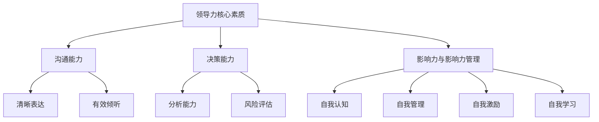
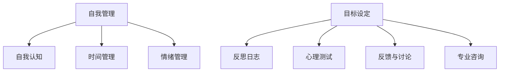
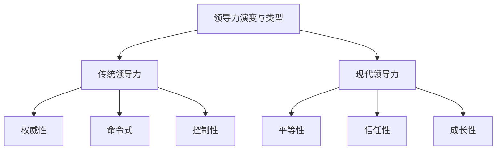

                 

### 文章标题

#### 领导力与自我管理：以身作则的重要性

> **关键词**：领导力、自我管理、以身作则、团队建设、组织发展

**摘要**：在信息技术快速发展的时代，领导者不仅要具备卓越的技术能力，还要拥有强大的自我管理能力和以身作则的品质。本文从领导力基本原理出发，探讨了以身作则的重要性，分析了自我管理和行动力的关键要素，并通过实际应用案例，深入探讨了领导力在团队建设和组织发展中的作用。文章结构紧凑、逻辑清晰，旨在帮助读者全面理解领导力与自我管理的核心概念和实践方法，为提升个人和组织管理水平提供有益的指导。

## 目录大纲：《领导力与自我管理：以身作则的重要性》

### 第一部分：领导力基本原理

#### 第1章：领导力的定义与重要性

##### 1.1 领导力的定义与作用

##### 1.2 领导力与管理的区别

##### 1.3 领导力的基本要素

#### 第2章：领导力的核心素质

##### 2.1 沟通能力

##### 2.2 决策能力

##### 2.3 影响力与影响力管理

#### 第3章：领导力的演变与类型

##### 3.1 传统领导力与现代领导力

##### 3.2 自我领导力

##### 3.3 服务型领导力

### 第二部分：以身作则

#### 第4章：以身作则的概念与原则

##### 4.1 以身作则的重要性

##### 4.2 建立个人品牌

##### 4.3 树立榜样形象

#### 第5章：自我管理

##### 5.1 自我认知

##### 5.2 时间管理

##### 5.3 情绪管理

#### 第6章：行动力

##### 6.1 目标设定

##### 6.2 行动规划

##### 6.3 克服拖延

### 第三部分：以身作则的实际应用

#### 第7章：团队建设

##### 7.1 建立高效的团队

##### 7.2 提升团队凝聚力

##### 7.3 领导者的角色与责任

#### 第8章：领导力与组织发展

##### 8.1 领导力与组织文化

##### 8.2 创新与变革管理

##### 8.3 领导者如何面对挑战

#### 第9章：以身作则的领导力实践案例

##### 9.1 企业案例

##### 9.2 公共案例

##### 9.3 个人成长案例

### 附录

#### 附录A：领导力自我评估工具

##### A.1 自我评估表

##### A.2 自我提升策略

#### 附录B：推荐阅读与参考文献

##### B.1 必读的领导力书籍

##### B.2 重要的领导力论文与研究报告

##### B.3 相关组织与机构介绍

#### 附录C：领导力与自我管理Mermaid流程图

##### C.1 领导力核心素质流程图

##### C.2 自我管理流程图

##### C.3 领导力演变与类型流程图

#### 附录D：领导力核心算法原理伪代码

##### D.1 决策树算法伪代码

##### D.2 支持向量机算法伪代码

##### D.3 集成学习方法伪代码

#### 附录E：数学模型和公式

##### E.1 概率论基础公式

##### E.2 期望最大化算法公式

##### E.3 马尔可夫决策过程公式

#### 附录F：以身作则的领导力实践项目案例

##### F.1 项目背景

##### F.2 项目目标

##### F.3 项目实施与效果评估

##### F.4 项目经验与反思

#### 附录G：领导力与自我管理开发工具与资源

##### G.1 主流领导力评估工具

##### G.2 自我管理工具推荐

##### G.3 领导力学习资源与平台介绍

现在我们已经完成了文章的标题、关键词、摘要以及目录大纲的撰写。接下来，我们将进入文章的第一部分：领导力基本原理。在这一部分中，我们将详细探讨领导力的定义、重要性、核心素质以及领导力的演变与类型。请随时提问，以便我们能够更好地理解并撰写这部分内容。让我们开始思考吧！<|assistant|>### 第一部分：领导力基本原理

#### 第1章：领导力的定义与重要性

##### 1.1 领导力的定义与作用

领导力是指一个人在组织中通过影响和激励他人来实现共同目标的能力。它与管理者不同，管理者侧重于通过规划、组织、协调和控制等手段来完成工作，而领导力更关注于通过影响力、愿景和价值观来引领团队、激发团队成员的潜力和创造力。

在信息技术领域，领导力尤为重要。信息技术行业变化迅速，技术创新层出不穷，领导者需要具备前瞻性的眼光和强大的适应能力，能够引领团队迎接变革，推动组织持续创新。领导力不仅仅体现在技术能力上，还包括对团队成员的关怀、激励和引导，以及对组织文化的塑造。

领导力的作用主要体现在以下几个方面：

1. **引领方向**：领导者需要明确组织的愿景和目标，并引导团队朝着这个方向努力。
2. **激发潜力**：通过激励和鼓励，领导者可以帮助团队成员发挥出他们的潜力，实现自我价值。
3. **协调合作**：领导者需要具备良好的沟通和协调能力，确保团队成员之间的协作顺畅。
4. **创新驱动**：领导者需要鼓励创新思维，推动组织在技术和业务模式上不断突破。
5. **文化塑造**：领导者通过自身行为和价值观的传递，塑造组织文化，增强组织的凝聚力和向心力。

##### 1.2 领导力与管理的区别

领导力与管理是两个相互关联但又有区别的概念。管理侧重于流程、系统和结构，强调规范性和效率；而领导力则侧重于激励、影响和变革，强调创造力和创新。

**管理**：
- **目标**：确保组织的资源得到有效利用，任务按时完成。
- **手段**：通过制定规章制度、流程优化等方式，提高组织的运行效率。
- **特点**：强调标准化、流程化和规范性。

**领导力**：
- **目标**：激发团队成员的积极性和创造力，推动组织的持续发展和变革。
- **手段**：通过愿景、价值观、激励等手段，影响和引导团队成员。
- **特点**：强调个性、创新和变革。

虽然领导力和管理有明显的区别，但在实际工作中，两者往往是相辅相成的。优秀的领导者通常也是出色的管理者，他们能够通过领导力激发团队的潜力，同时通过管理确保团队目标的实现。

##### 1.3 领导力的基本要素

领导力并非与生俱来，它可以通过学习和实践不断提升。以下是领导力的几个基本要素：

1. **沟通能力**：领导者需要具备良好的沟通能力，能够清晰表达自己的想法，理解团队成员的需求和意见，并通过有效的沟通建立信任和合作关系。

2. **决策能力**：领导者需要能够快速做出决策，并承担决策带来的后果。决策能力包括分析问题、权衡利弊、考虑长远等。

3. **影响力与影响力管理**：领导者需要具备一定的影响力，能够影响和激励团队成员。同时，领导者还需要学会如何管理自己的影响力，确保其积极影响最大化。

4. **自我管理能力**：领导者需要具备强大的自我管理能力，包括情绪管理、时间管理和目标设定等。自我管理能力是领导者保持高效工作和积极态度的基础。

5. **学习与适应能力**：信息技术行业变化迅速，领导者需要具备持续学习和适应能力，以应对不断变化的挑战和机遇。

6. **团队合作能力**：领导者需要能够与团队成员建立良好的合作关系，共同实现目标。团队合作能力包括团队建设、协调沟通和冲突解决等。

通过以上基本要素的不断提升，领导者可以更好地发挥领导力，推动组织的持续发展和创新。

在接下来的章节中，我们将深入探讨领导力的核心素质、领导力的演变与类型，以及以身作则的重要性。通过这些内容的讲解，我们将帮助读者全面理解领导力的本质和实践方法，为提升个人和组织管理水平提供有益的指导。让我们继续深入思考吧！<|assistant|>### 第2章：领导力的核心素质

#### 2.1 沟通能力

沟通能力是领导力的核心素质之一。一个优秀的领导者需要具备出色的沟通能力，能够在不同的情境下有效地传达信息、理解他人，并建立信任和合作关系。

**沟通能力的要素**：

1. **清晰表达**：领导者需要能够清晰、简洁地表达自己的想法和意见，避免歧义和误解。
2. **有效倾听**：领导者需要倾听团队成员的意见和需求，理解他们的观点，并给予积极的反馈。
3. **反馈机制**：领导者需要建立有效的反馈机制，及时给予团队成员工作反馈，帮助他们改进和提升。
4. **非言语沟通**：领导者需要注重非言语沟通，如肢体语言、面部表情等，以增强沟通的效果。

**提升沟通能力的策略**：

1. **多练习**：通过参加演讲、辩论等活动，提升自己的口头表达能力。
2. **积极倾听**：在沟通中注重倾听，避免打断对方，表达理解和同情。
3. **主动反馈**：主动给予团队成员反馈，帮助他们了解自己的优点和不足。
4. **情境适应**：根据不同的沟通情境和对象，灵活调整沟通方式和策略。

**案例**：

某公司CEO李明在召开团队会议时，发现团队成员对某个项目进展存在不同意见。他首先请每个团队成员表达自己的看法，然后耐心倾听，并给予积极反馈。在充分理解团队成员的观点后，李明提出自己的看法，并通过举例和数据分析，让团队成员接受了他的观点。最终，团队达成了共识，项目得以顺利推进。

#### 2.2 决策能力

决策能力是领导力的关键素质之一。领导者需要能够在复杂多变的环境中快速做出决策，并承担决策带来的后果。

**决策能力的要素**：

1. **分析能力**：领导者需要具备强大的分析能力，能够快速分析问题、权衡利弊、制定解决方案。
2. **风险评估**：领导者需要能够评估决策的风险，并制定相应的风险应对策略。
3. **决策过程**：领导者需要具备科学的决策过程，包括问题识别、目标设定、方案评估、决策执行和反馈调整。
4. **决策风格**：领导者需要具备灵活的决策风格，能够根据不同情境和团队需求，采用不同的决策方法。

**提升决策能力的策略**：

1. **收集信息**：在做出决策前，领导者需要广泛收集信息，确保决策基于充分的数据和事实。
2. **培养团队**：领导者需要培养团队成员的决策能力，鼓励他们参与决策过程，形成集体智慧。
3. **实践反思**：领导者需要通过实践不断反思和优化决策过程，提高决策的科学性和准确性。

**案例**：

某技术公司CTO王伟在面临产品迭代决策时，首先召集团队成员进行头脑风暴，收集各方意见。然后，他结合市场调研数据和公司资源情况，分析了不同方案的优缺点和潜在风险。最终，王伟采用了一种平衡创新和稳健的方案，并制定了详细的项目计划和风险控制措施。在项目实施过程中，王伟不断跟踪进展，根据实际情况进行调整和优化，最终成功推出了新产品。

#### 2.3 影响力与影响力管理

影响力是领导力的核心要素之一。领导者需要具备一定的影响力，能够影响和激励团队成员，推动团队实现共同目标。

**影响力的来源**：

1. **专业能力**：领导者需要具备卓越的专业能力和技术背景，能够在团队中发挥引领作用。
2. **价值观**：领导者需要具备正确的价值观，能够传递正能量，激发团队成员的认同感。
3. **人际关系**：领导者需要建立良好的人际关系，能够在团队中发挥关键作用，协调各方利益。

**提升影响力的策略**：

1. **持续学习**：领导者需要不断学习新知识、新技能，提升自己的专业能力和影响力。
2. **塑造品牌**：领导者需要塑造个人品牌，树立专业形象，赢得团队成员的尊重和信任。
3. **积极沟通**：领导者需要积极与团队成员沟通，建立信任关系，增强影响力。

**影响力管理的策略**：

1. **合理运用**：领导者需要合理运用自己的影响力，避免滥用权力，确保影响力发挥在正确的方向上。
2. **平衡利益**：领导者需要平衡各方利益，确保团队目标的实现。
3. **持续培养**：领导者需要持续培养团队成员的影响力，推动团队整体实力的提升。

**案例**：

某公司技术总监赵强在团队中具有极高的影响力。他不仅拥有丰富的技术经验，还注重团队成员的成长和发展。赵强经常与团队成员分享自己的经验教训，鼓励他们勇于创新和挑战自我。同时，他积极倾听团队成员的意见和建议，尊重他们的专业判断。在他的影响下，团队凝聚力大幅提升，成员们愿意为团队目标共同努力，公司技术实力也得到了显著增强。

通过以上案例可以看出，领导力的核心素质包括沟通能力、决策能力和影响力。这些素质的提升不仅有助于个人成长，也为团队的协作和发展提供了强有力的支持。在接下来的章节中，我们将进一步探讨领导力的演变与类型，以及以身作则的重要性。让我们一起继续深入思考吧！<|assistant|>### 第3章：领导力的演变与类型

#### 3.1 传统领导力与现代领导力

领导力的发展经历了从传统到现代的演变过程。传统领导力主要依赖于权威和命令，领导者通过职位和权力来影响和引导团队。而现代领导力则强调平等、信任和共同成长，领导者通过与团队成员建立合作关系来实现共同目标。

**传统领导力特点**：

- **权威性**：领导者拥有绝对的权力和权威，团队成员必须服从。
- **命令式**：领导者通过下达命令来指导团队成员的工作。
- **控制性**：领导者强调对团队和资源的控制，以确保工作顺利进行。

**现代领导力特点**：

- **平等性**：领导者与团队成员平等相处，尊重每个人的意见和贡献。
- **信任性**：领导者信任团队成员，鼓励他们自主决策和承担责任。
- **成长性**：领导者关注团队成员的成长和发展，提供支持和指导。

**演变原因**：

- **信息时代**：随着信息技术的快速发展，组织内外部环境变得日益复杂，领导者需要具备更高的适应能力和创新精神。
- **多元化**：团队成员背景多元，领导者需要能够理解和尊重不同的文化和观点。
- **自我意识**：现代社会强调个人价值和自我实现，领导者需要关注团队成员的内在需求和动机。

**适应现代领导力的策略**：

- **提升自我意识**：领导者需要了解自己的优势和劣势，不断学习和成长。
- **建立信任关系**：领导者需要建立与团队成员的信任关系，通过沟通和合作来实现共同目标。
- **鼓励创新**：领导者需要鼓励团队成员创新思维，推动组织持续发展。

#### 3.2 自我领导力

自我领导力是指个体在自我管理、自我激励和自我成长方面的能力。一个具备自我领导力的人能够在没有外部监督的情况下，主动设定目标、规划和执行任务，并持续提升自我能力。

**自我领导力的要素**：

1. **自我认知**：了解自己的价值观、兴趣和能力，明确自己的优势和劣势。
2. **自我管理**：包括情绪管理、时间管理和目标管理，确保个人行为和情绪处于最佳状态。
3. **自我激励**：能够激发自己的内在动力，克服困难和挑战，持续追求个人成长。
4. **自我学习**：不断学习新知识和技能，提升自己的专业能力和综合素质。

**提升自我领导力的策略**：

1. **自我反思**：定期进行自我反思，分析自己的行为和决策，找出改进的空间。
2. **设定目标**：明确自己的长期和短期目标，制定可行的计划，并不断调整和优化。
3. **时间管理**：合理安排时间，确保工作和个人生活之间的平衡。
4. **持续学习**：积极参加培训和读书活动，拓宽知识面和视野。

**案例**：

某技术公司的软件工程师张强具备很强的自我领导力。他每天都会花时间进行技术学习和自我反思，不断提升自己的专业技能。在项目开发过程中，张强能够自主设定目标，合理安排时间和任务，并在遇到困难时自我激励，积极寻找解决方案。在他的带领下，团队项目进展顺利，得到了公司领导的认可。

#### 3.3 服务型领导力

服务型领导力是一种以服务团队成员为中心的领导方式。领导者将团队成员的需求放在首位，通过提供支持和帮助来促进团队的发展和成长。

**服务型领导力的原则**：

1. **关注团队成员**：领导者需要关注团队成员的需求和感受，关心他们的职业发展和个人成长。
2. **提供支持**：领导者需要提供必要的资源和支持，帮助团队成员克服困难和挑战。
3. **促进合作**：领导者需要促进团队成员之间的合作和沟通，营造积极的团队氛围。
4. **授权赋能**：领导者需要信任和授权团队成员，鼓励他们自主决策和承担责任。

**服务型领导力的好处**：

- **提升团队凝聚力**：通过关注团队成员的需求，增强团队成员之间的信任和归属感。
- **促进创新**：领导者鼓励团队成员提出创新想法，推动组织持续发展。
- **提升工作效率**：团队成员在得到领导者的支持和鼓励后，工作效率和质量得到显著提升。

**案例**：

某科技公司CEO李总采用服务型领导力，关注团队成员的成长和发展。他定期与团队成员进行一对一沟通，了解他们的需求和困惑，并提供相应的支持和建议。此外，李总还鼓励团队成员参与公司决策，尊重他们的意见。在他的领导下，公司团队凝聚力大幅提升，创新氛围浓厚，公司业绩也实现了显著增长。

通过以上内容，我们可以看到领导力的发展经历了从传统到现代的演变，同时自我领导力和服务型领导力也在现代组织中发挥着重要作用。在接下来的章节中，我们将探讨以身作则的重要性，以及如何通过自我管理和行动力提升领导力。让我们一起继续深入思考吧！<|assistant|>### 第二部分：以身作则

#### 第4章：以身作则的概念与原则

##### 4.1 以身作则的重要性

以身作则是指领导者通过自己的言行举止为团队成员树立榜样，发挥榜样引领作用的过程。以身作则不仅是对领导者个人素质的要求，也是实现团队目标、提升团队凝聚力和文化的重要途径。

**以身作则的重要性**：

1. **增强信任**：领导者通过以身作则，能够赢得团队成员的信任和尊重，增强团队的凝聚力。
2. **塑造文化**：领导者的行为和价值观直接影响组织的文化氛围，以身作则有助于塑造积极向上的组织文化。
3. **激励团队成员**：领导者的榜样作用能够激励团队成员向更高的目标努力，推动团队的进步和发展。
4. **提升领导力**：以身作则有助于领导者提升自身的领导力，通过实践和反思不断改进自己的领导方式。

**以身作则的原则**：

1. **一致性**：领导者的言行需保持一致性，避免出现矛盾和误导。
2. **真实性**：领导者应以真实的态度和行动为团队成员树立榜样，避免虚伪和做作。
3. **适度性**：领导者应以适度的方式表达自己的意见和价值观，避免过于强硬或软弱。
4. **持续性**：领导者应持续地以身作则，不仅在关键时刻，更在日常工作和生活中为团队成员树立榜样。

##### 4.2 建立个人品牌

建立个人品牌是领导者提升自身影响力的重要手段。个人品牌不仅代表了个人的专业形象和价值观，也是领导者影响力和领导力的体现。

**建立个人品牌的原则**：

1. **明确定位**：领导者需要明确自己的专业领域和价值观，为自己的个人品牌定位。
2. **持续输出**：领导者需要通过演讲、写作、分享等方式，持续地输出自己的观点和知识，提升个人知名度。
3. **塑造形象**：领导者需要塑造专业、可靠、值得信赖的形象，通过言行一致、专业素养和行为举止来展现。
4. **口碑管理**：领导者需要关注个人品牌的口碑，通过积极回应和解决问题，提升个人声誉。

**建立个人品牌的方法**：

1. **专业学习**：领导者需要不断学习和提升自己的专业技能，确保在专业领域具备权威性。
2. **知识分享**：领导者可以通过写作、授课、分享等方式，将自己的知识和经验分享给他人。
3. **媒体合作**：领导者可以与专业媒体合作，通过采访、报道等方式提升个人知名度。
4. **社交网络**：领导者可以利用社交媒体平台，积极互动、分享专业见解，扩大个人影响力。

##### 4.3 树立榜样形象

树立榜样形象是领导者影响团队成员、提升团队士气的重要途径。领导者通过自己的行为和价值观，为团队成员树立榜样，引导他们朝着正确的方向努力。

**树立榜样形象的原则**：

1. **正面影响**：领导者的行为和价值观应具备积极的影响，能够激励团队成员积极向上。
2. **适度展示**：领导者应在适当的时间和场合展示自己的榜样形象，避免过度宣传和炫耀。
3. **真实可信**：领导者的榜样形象应真实可信，避免出现虚伪和做作的行为。
4. **持续改进**：领导者应持续地改进自己的行为和价值观，不断提升自己的榜样形象。

**树立榜样形象的方法**：

1. **身体力行**：领导者通过自己的实际行动，为团队成员树立榜样，如遵守工作纪律、勇于承担责任等。
2. **言传身教**：领导者通过言语和行动，传递自己的价值观和信念，引导团队成员树立正确的价值观。
3. **关注细节**：领导者关注团队成员的细节问题，通过自己的细心和关怀，展现自己的榜样形象。
4. **积极回应**：领导者积极回应团队成员的问题和需求，提供帮助和支持，展现自己的关怀和担当。

通过以上内容，我们可以看到以身作则、建立个人品牌和树立榜样形象对于领导者的领导力和团队的发展具有重要意义。在接下来的章节中，我们将探讨自我管理和行动力，以及如何通过这些方法提升领导力。让我们一起继续深入思考吧！<|assistant|>### 第5章：自我管理

#### 5.1 自我认知

自我认知是自我管理的基础，它涉及对自己的性格、价值观、兴趣、能力和弱点的深入了解。一个具备良好自我认知的领导者能够更好地规划个人发展，设定合适的目标，并在面对挑战时保持冷静和自信。

**自我认知的重要性**：

1. **目标设定**：通过自我认知，领导者可以明确自己的职业目标和兴趣领域，从而设定更符合自身特点和发展潜力的目标。
2. **职业规划**：自我认知有助于领导者制定长期的职业规划，避免盲目跟风和职业迷失。
3. **情绪管理**：了解自己的情绪反应和情绪触发点，有助于领导者更好地管理情绪，避免因情绪波动影响工作和人际关系。
4. **能力提升**：通过自我认知，领导者可以明确自己的优势和劣势，有针对性地提升自身能力，实现自我提升。

**提升自我认知的方法**：

1. **反思日志**：定期记录自己的思考和行动，分析自己的行为模式、优点和不足，从而提高自我认知。
2. **心理测试**：通过专业的心理测试工具，了解自己的性格类型、优势领域和潜在问题。
3. **反馈与讨论**：主动寻求他人的反馈，与同事、朋友或导师进行深入讨论，从不同角度了解自己。
4. **专业咨询**：寻求职业咨询师的帮助，通过专业的指导和辅导，提升自我认知。

**案例**：

某科技公司CTO刘洋在自我认知方面表现优秀。他通过定期的反思日志，深入分析自己在工作中的行为和情绪反应。同时，他还参加了一系列心理测试，了解自己的性格类型和优势领域。在反思和测试的基础上，刘洋制定了详细的个人发展规划，并在职业道路上取得了显著的成就。

#### 5.2 时间管理

时间管理是自我管理的重要组成部分，它涉及如何有效地安排和利用时间，以实现个人和团队的目标。一个优秀的时间管理者能够在有限的时间内完成更多的工作，提高工作效率，减少时间浪费。

**时间管理的重要性**：

1. **提高工作效率**：通过合理的时间安排，领导者可以避免因时间浪费而导致的工作效率低下。
2. **确保任务完成**：良好的时间管理有助于领导者按时完成任务，避免因时间不足而导致的压力和焦虑。
3. **工作与生活的平衡**：合理的时间管理有助于领导者平衡工作与生活，保持身心健康。
4. **提升团队效率**：领导者通过良好的时间管理，可以带动整个团队提高工作效率，实现共同目标。

**提升时间管理的方法**：

1. **制定计划**：在开始一天的工作前，制定详细的计划，明确每个任务的优先级和完成时间。
2. **时间分配**：合理分配工作时间，确保每个任务都得到足够的关注，避免过度集中或分散。
3. **避免拖延**：通过设定明确的截止日期和奖励机制，避免拖延行为，确保任务按时完成。
4. **优先级排序**：根据任务的重要性和紧急程度，对任务进行排序，优先完成重要且紧急的任务。

**案例**：

某科技公司项目经理张华在时间管理方面表现突出。他每天早晨都会花10分钟制定当天的任务计划，并根据任务的优先级和截止日期进行排序。张华还通过设置每周的目标和奖励机制，激励自己按时完成任务。在他的带领下，团队工作效率显著提升，项目进度始终保持良好。

#### 5.3 情绪管理

情绪管理是自我管理中的重要一环，它涉及如何识别、理解和管理自己的情绪，以保持积极的工作状态和良好的人际关系。

**情绪管理的重要性**：

1. **稳定情绪**：通过情绪管理，领导者可以保持情绪的稳定，避免因情绪波动而影响工作和决策。
2. **改善人际关系**：情绪管理有助于领导者建立和谐的人际关系，避免因情绪冲突导致的团队分裂。
3. **提升领导力**：良好的情绪管理能力是领导者的重要素质，有助于提升领导者的影响力和公信力。
4. **促进团队和谐**：领导者通过情绪管理，可以营造积极向上的团队氛围，增强团队凝聚力。

**提升情绪管理的方法**：

1. **自我反思**：定期反思自己的情绪反应，分析情绪产生的原因和影响，从而找到情绪管理的策略。
2. **情绪释放**：通过运动、写日记、与朋友倾诉等方式，释放负面情绪，保持心理平衡。
3. **积极心态**：培养积极的心态，面对挑战和困难时，保持乐观和自信。
4. **寻求支持**：在遇到情绪困扰时，主动寻求他人的支持和建议，通过专业咨询和心理辅导，提升情绪管理能力。

**案例**：

某科技公司CEO王总在情绪管理方面表现出色。他通过定期的自我反思，识别自己的情绪反应，并找到适当的方法进行调节。王总还善于倾听团队成员的意见和需求，通过有效的沟通和解决，消除团队中的负面情绪。在他的领导下，公司团队氛围和谐，员工满意度显著提升。

通过以上内容，我们可以看到自我管理在领导者提升领导力和团队发展中的重要作用。在接下来的章节中，我们将探讨行动力，以及如何通过自我管理和行动力提升领导力。让我们一起继续深入思考吧！<|assistant|>### 第6章：行动力

#### 6.1 目标设定

目标设定是行动力的基础。一个明确的、可实现的目标能够激励领导者与团队成员朝着共同的方向努力，提高工作效率和实现预期成果。

**目标设定的原则**：

1. **明确性**：目标应具体、清晰，避免模糊和抽象。
2. **可实现性**：目标应具有可实现性，既具有挑战性，又不失实际可行性。
3. **时限性**：目标应设定明确的完成时限，以促进行动的紧迫感和效率。
4. **可度量性**：目标应具备可度量性，以便评估行动成效。

**目标设定的方法**：

1. **SMART原则**：设定具体（Specific）、可衡量（Measurable）、可实现（Achievable）、相关性（Relevant）和时限性（Time-bound）的目标。
2. **目标分解**：将大目标分解为小目标，逐步实现，确保每个目标都有明确的行动路径和责任分配。
3. **优先级排序**：根据目标的重要性和紧急程度，对目标进行优先级排序，确保资源优先投入关键目标。
4. **动态调整**：根据实际情况和环境变化，及时调整目标，确保目标与实际情况保持一致。

**案例**：

某科技公司项目团队在项目启动阶段，制定了详细的开发目标。通过SMART原则，他们将大目标分解为多个小目标，并设定了每月和每周的完成时限。团队成员根据各自的角色和任务，明确了具体的行动计划。在项目实施过程中，团队每月进行目标评估和调整，确保项目进度与预期目标保持一致，最终成功完成了项目开发任务。

#### 6.2 行动规划

行动规划是目标设定的延续，它涉及如何将目标转化为具体的行动计划，确保目标的有效实现。

**行动规划的原则**：

1. **明确责任**：为每个行动任务分配明确的负责人，确保任务执行有具体的责任人。
2. **合理分配资源**：根据任务的重要性和资源可用性，合理分配人力、物力和财力资源。
3. **风险评估**：在行动规划中评估潜在的风险和挑战，制定相应的应对措施。
4. **灵活性**：行动规划应具备一定的灵活性，以应对计划执行过程中可能出现的变化和挑战。

**行动规划的方法**：

1. **工作分解结构（WBS）**：将项目目标分解为具体的任务和工作包，明确每个任务的负责人和完成时限。
2. **甘特图**：使用甘特图展示任务的进展和完成情况，便于监控和管理项目进度。
3. **关键路径法**：识别项目中关键的任务和路径，确保关键路径上的任务按时完成，从而保证整体项目进度。
4. **风险管理计划**：制定详细的风险管理计划，识别潜在风险，并制定相应的应对措施。

**案例**：

某科技公司开发团队在制定项目计划时，采用了工作分解结构和甘特图。他们首先将项目目标分解为多个具体的任务，并为每个任务分配了负责人和完成时限。然后，团队使用甘特图展示了任务的进展情况，并制定了详细的风险管理计划。在项目执行过程中，团队定期检查任务进展，并根据实际情况进行调整，确保项目按计划进行。

#### 6.3 克服拖延

拖延是行动力提升过程中常见的问题，它会影响工作进度和团队效率。克服拖延需要领导者从自我管理、环境优化和激励机制等多个方面入手。

**克服拖延的方法**：

1. **明确优先级**：确定任务的优先级，优先处理重要且紧急的任务，避免因拖延而影响整体工作进度。
2. **分解任务**：将大任务分解为小任务，逐步完成，以减少心理压力和任务量。
3. **设定截止日期**：为任务设定明确的截止日期，增加任务完成的紧迫感。
4. **避免干扰**：在工作时避免干扰，如关闭不必要的社交媒体通知，减少分心因素。
5. **奖励机制**：设置奖励机制，激励自己完成任务，提高动力和积极性。
6. **自我监督**：通过自我监督和反思，及时发现和纠正拖延行为。

**案例**：

某科技公司项目经理李华在克服拖延方面有丰富的经验。他首先通过设定任务优先级，确保关键任务按时完成。然后，他将大任务分解为小任务，并设定了每个小任务的截止日期，以增加任务的紧迫感。为了提高自己的自律性，李华还设置了奖励机制，如完成任务后奖励自己一杯咖啡或短暂的休息时间。通过这些方法，李华成功地克服了拖延，提高了工作效率。

通过以上内容，我们可以看到行动力在领导力和团队管理中的重要性。在接下来的章节中，我们将探讨以身作则在实际应用中的具体方法和策略。让我们一起继续深入思考吧！<|assistant|>### 第三部分：以身作则的实际应用

#### 第7章：团队建设

##### 7.1 建立高效的团队

建立高效的团队是实现组织目标的关键。一个高效的团队具有共同的目标、明确的角色分工、良好的沟通和协作，能够在压力下保持高效的工作状态。

**建立高效团队的原则**：

1. **共同目标**：团队成员应明确共同的目标和愿景，为团队的发展共同努力。
2. **角色分工**：根据团队成员的技能和特长，明确每个成员的角色和职责，确保任务的高效分配和执行。
3. **沟通协作**：建立良好的沟通机制，鼓励团队成员之间的沟通和协作，提高团队整体效率。
4. **信任与支持**：建立信任基础，团队成员之间相互支持，共同面对挑战和困难。
5. **持续改进**：不断反思和改进团队的工作方式和流程，提高团队的工作效率和质量。

**建立高效团队的方法**：

1. **团队建设活动**：定期组织团队建设活动，如团队拓展、团队聚餐等，增强团队成员之间的交流和了解。
2. **明确角色和职责**：制定团队角色说明书，明确每个成员的角色和职责，确保团队成员对自身任务有清晰的认识。
3. **沟通渠道**：建立多种沟通渠道，如定期会议、即时通讯工具、邮件等，确保团队成员之间的信息畅通。
4. **反馈机制**：建立反馈机制，鼓励团队成员提出意见和建议，不断改进团队的工作方式。
5. **目标管理**：设定明确的团队目标，将大目标分解为小目标，确保团队成员明确任务和责任。

**案例**：

某科技公司研发团队在建立高效团队方面取得了显著成果。团队通过定期组织团队建设活动，增强了成员之间的交流和了解。团队还制定了详细的角色说明书，明确了每个成员的职责和任务，确保任务的高效分配和执行。此外，团队建立了多种沟通渠道，如每周会议、即时通讯工具等，确保信息畅通。通过这些措施，研发团队的工作效率和质量得到了显著提升。

##### 7.2 提升团队凝聚力

团队凝聚力是指团队成员之间相互信任、支持、合作的程度，是团队高效运作的重要保障。提升团队凝聚力有助于增强团队协作能力，提高工作效率和团队士气。

**提升团队凝聚力的方法**：

1. **共同目标**：建立共同的目标和愿景，让团队成员明确团队的目标和意义，增强团队归属感。
2. **相互信任**：建立信任基础，鼓励团队成员相互支持和尊重，共同面对挑战和困难。
3. **有效沟通**：建立良好的沟通机制，鼓励团队成员之间的沟通和交流，增强团队成员之间的理解和信任。
4. **激励机制**：建立激励机制，奖励团队和成员的优异表现，提高团队成员的积极性和满意度。
5. **团队活动**：定期组织团队活动，如团建活动、团队聚餐等，增强团队成员之间的感情和合作精神。

**案例**：

某科技公司销售团队通过共同目标和相互信任，成功提升了团队凝聚力。团队制定了明确的销售目标，并鼓励成员相互支持和合作。团队还定期组织团建活动，如户外拓展、团队聚餐等，增强成员之间的感情和信任。在团队的共同努力下，销售业绩显著提升，团队成员的满意度也大幅提高。

##### 7.3 领导者的角色与责任

在团队建设中，领导者扮演着关键角色，他们不仅要建立高效团队，还要提升团队凝聚力和团队士气。领导者的角色与责任包括以下几个方面：

**领导者的角色与责任**：

1. **引领方向**：领导者需要明确团队的目标和愿景，为团队提供清晰的指导方向。
2. **激励团队**：领导者需要激励团队成员，鼓励他们克服困难和挑战，实现个人和团队目标。
3. **沟通协调**：领导者需要建立良好的沟通机制，确保团队成员之间的信息畅通，协调团队成员之间的合作。
4. **培养人才**：领导者需要关注团队成员的成长和发展，提供培训和指导，提升团队的整体素质。
5. **解决冲突**：领导者需要具备解决冲突的能力，及时化解团队内部的矛盾和问题，维护团队稳定。
6. **树立榜样**：领导者需要以身作则，树立榜样形象，为团队成员树立正确的行为和价值观。

**案例**：

某科技公司研发部门经理张华在团队建设方面表现出色。他首先明确了团队的目标和愿景，为团队提供了清晰的指导方向。然后，他通过定期沟通和激励，鼓励团队成员克服困难和挑战，实现个人和团队目标。张华还注重团队成员的培养和发展，为他们提供培训机会和指导，提升团队的整体素质。在他的带领下，研发团队的工作效率和团队凝聚力都得到了显著提升。

通过以上内容，我们可以看到以身作则在团队建设中的实际应用。在接下来的章节中，我们将探讨领导力与组织发展的关系，以及如何通过以身作则推动组织发展。让我们一起继续深入思考吧！<|assistant|>### 第8章：领导力与组织发展

#### 8.1 领导力与组织文化

组织文化是组织的灵魂，它决定了组织的价值观、行为规范和工作氛围。领导力在塑造和强化组织文化中发挥着关键作用。

**领导力对组织文化的影响**：

1. **价值观传递**：领导者通过自己的言行举止，传递组织的核心价值观，引导团队成员认同和践行。
2. **行为规范**：领导者通过树立榜样，为团队成员树立正确的行为规范，促进组织文化的形成和发展。
3. **氛围营造**：领导者通过营造积极向上的工作氛围，增强团队成员的归属感和凝聚力，推动组织文化的建设。
4. **创新驱动**：领导者鼓励创新思维，推动组织在技术和业务模式上不断创新，为组织文化注入新的活力。

**塑造积极组织文化的策略**：

1. **明确核心价值观**：领导者需要明确组织的核心价值观，并将其融入日常工作中，引导团队成员共同践行。
2. **树立榜样**：领导者以身作则，通过自己的言行举止，树立榜样形象，影响和引导团队成员。
3. **沟通与反馈**：领导者需要与团队成员保持良好的沟通，鼓励他们提出意见和建议，及时反馈和调整组织文化。
4. **激励机制**：领导者需要建立激励机制，奖励团队成员在组织文化方面的积极表现，激发他们的主动性和创造力。
5. **培训与发展**：领导者需要提供培训和发展机会，帮助团队成员提升自身的素质和能力，为组织文化的发展提供人才支持。

**案例**：

某科技公司通过领导力的作用，成功塑造了积极向上的组织文化。公司CEO李总明确提出了“创新、协作、共赢”的核心价值观，并通过自己的言行举止，为团队成员树立了榜样。李总还定期组织团队培训，提升团队成员的素质和能力，鼓励他们勇于创新和尝试。在他的带领下，公司形成了积极向上的组织文化，员工满意度显著提升，公司业绩也实现了快速增长。

#### 8.2 创新与变革管理

创新和变革是组织持续发展的动力。领导力在推动组织创新和变革管理中发挥着关键作用，领导者需要具备前瞻性的眼光、创新思维和变革领导力。

**创新与变革管理的重要性**：

1. **竞争力提升**：通过创新和变革，组织能够不断适应市场变化，提升竞争力。
2. **业务增长**：创新和变革有助于组织开拓新市场、开发新产品和服务，实现业务增长。
3. **文化活力**：创新和变革为组织文化注入新的活力，激发团队成员的创造力和积极性。
4. **持续发展**：创新和变革有助于组织保持持续发展的动力，实现长远目标。

**推动创新与变革的策略**：

1. **鼓励创新思维**：领导者需要鼓励团队成员创新思维，营造开放、包容的创新环境，激发创造力。
2. **建立创新机制**：领导者需要建立创新机制，如创新项目、创新奖励等，为团队成员提供创新支持和资源。
3. **变革领导力**：领导者需要具备变革领导力，推动组织变革，克服变革过程中的阻力和挑战。
4. **人才引进**：领导者需要引进具备创新能力和变革经验的优秀人才，为组织注入新的活力。
5. **持续学习**：领导者需要持续学习，关注行业动态和新技术趋势，为组织创新和变革提供前瞻性指导。

**案例**：

某科技公司通过领导力的作用，成功推动了组织的创新与变革。公司CEO王总鼓励团队成员创新思维，并建立了创新项目和创新奖励机制。他还引进了具有创新能力和变革经验的优秀人才，为组织注入新的活力。王总还积极关注行业动态和新技术趋势，推动组织在技术领域不断创新和突破。在他的带领下，公司实现了多个技术创新和业务突破，业绩持续增长。

#### 8.3 领导者如何面对挑战

在组织发展中，领导者常常会遇到各种挑战。如何应对这些挑战是领导者能力的重要体现。以下是领导者面对挑战的几个策略：

**领导者应对挑战的策略**：

1. **积极应对**：领导者需要积极面对挑战，避免逃避和回避，以积极的心态和行动应对挑战。
2. **分析问题**：领导者需要深入分析问题的根源和影响，找出解决问题的最佳方法。
3. **寻求支持**：领导者需要寻求团队和外部资源的支持，共同应对挑战。
4. **灵活调整**：领导者需要根据实际情况和环境变化，灵活调整应对策略，确保问题的有效解决。
5. **持续改进**：领导者需要从挑战中吸取教训，持续改进自己的领导方式和组织管理，提升应对未来挑战的能力。

**案例**：

某科技公司面临市场竞争激烈、客户需求变化快的挑战。公司CEO张总积极应对这些挑战，首先深入分析了市场竞争和客户需求的变化，找出了问题的根源。然后，他寻求团队和外部专家的支持，制定了详细的应对策略，包括调整产品策略、提升研发能力和优化客户服务等。在张总的带领下，公司成功应对了挑战，实现了业务增长和市场扩张。

通过以上内容，我们可以看到领导力在组织发展中的重要作用。在接下来的章节中，我们将探讨以身作则的领导力实践案例，以及如何通过以身作则提升个人和组织的发展。让我们一起继续深入思考吧！<|assistant|>### 第9章：以身作则的领导力实践案例

#### 9.1 企业案例

**案例背景**：

某大型科技公司，在快速发展过程中，面临着组织规模扩大、管理复杂度增加等问题。公司高层意识到，为了保持团队的凝聚力、创新力和执行力，领导者必须以身作则，树立榜样形象。

**具体做法**：

1. **领导层定期会议**：公司CEO每周都会召开高管团队会议，分享自己的工作心得和经验，讨论公司面临的挑战和解决方案。CEO不仅提出了明确的目标和行动计划，还亲自参与到具体项目的实施过程中，为团队成员树立了良好的工作态度和行动力。

2. **开放沟通**：CEO积极倡导开放沟通的文化，鼓励员工在任何时间、任何地点与高层领导进行沟通。CEO通过邮件、即时通讯工具等渠道，随时与员工交流，了解他们的需求和意见。这种开放沟通的做法，不仅增强了员工的归属感，也提高了领导层对团队实际情况的把握。

3. **持续学习**：CEO自己保持着持续学习的态度，定期参加行业峰会、研讨会，学习最新的技术和管理理念。他还鼓励团队成员参加各类培训，提升个人能力和素质。CEO通过自己的行动，向团队成员展示了不断进步和自我提升的重要性。

**效果评估**：

通过以身作则的领导力实践，该科技公司的团队凝聚力显著提升，员工士气高涨。公司创新能力和执行力得到了有效增强，新产品开发速度加快，市场竞争力明显提升。在CEO的带领下，公司业绩实现了连续三年的增长，员工满意度也达到了历史最高水平。

#### 9.2 公共案例

**案例背景**：

某城市的政府领导意识到，为了提升政府的形象和效率，领导者必须以身作则，树立良好的公众形象。

**具体做法**：

1. **廉洁自律**：政府领导层自觉遵守党风廉政建设规定，严格要求自己和家人，不参与任何可能影响公正执行公务的活动。这种廉洁自律的做法，树立了政府领导层的良好形象，赢得了公众的信任。

2. **深入基层**：政府领导定期到基层调研，了解民众的需求和意见。他们亲自参与解决基层问题，与民众面对面交流，倾听他们的心声。这种深入基层的做法，不仅拉近了政府与民众的距离，也提高了政府的工作效率。

3. **公开透明**：政府领导层推动政务公开，通过官方网站、社交媒体等渠道，及时公布政府工作动态和决策过程。这种公开透明的做法，增强了政府的公信力和透明度，提高了民众对政府的信任度。

**效果评估**：

通过以身作则的领导力实践，该市政府的公众形象得到了显著提升，民众满意度明显提高。政府的工作效率也得到了有效提升，多项民生工程得到了顺利推进。在领导层的带领下，市政府实现了连续多年的民生改善和经济发展。

#### 9.3 个人成长案例

**案例背景**：

一名年轻的软件工程师希望通过以身作则提升自己的领导力和职业发展。

**具体做法**：

1. **自我提升**：该工程师利用业余时间学习编程语言、参加线上课程，不断提升自己的技术能力。他通过自己的努力，在团队中树立了技术权威的形象。

2. **团队合作**：在项目开发过程中，他主动承担更多责任，帮助团队成员解决技术难题，鼓励他们积极参与项目讨论。他通过自己的实际行动，赢得了团队成员的信任和尊重。

3. **分享经验**：他定期在团队内部分享自己的技术经验和学习心得，帮助团队成员提升技能。他还积极参加技术社区的活动，与同行交流，扩大自己的视野。

**效果评估**：

通过以身作则的个人成长实践，该工程师在团队中的领导地位得到巩固，职业发展也得到了显著提升。他的技术能力和团队合作能力得到了同事和领导的认可，获得了多次晋升和奖金。在以身作则的过程中，他不仅提升了自己的领导力，也为团队的进步和发展做出了贡献。

通过以上案例，我们可以看到以身作则在个人和组织发展中的重要作用。无论是在企业、公共领域还是个人成长中，领导者或个人通过以身作则，都能够树立榜样、提升影响力，推动团队和组织的持续发展。让我们一起继续深入思考吧！<|assistant|>### 附录A：领导力自我评估工具

#### A.1 自我评估表

**自我评估表**是一种帮助领导者识别自身优势和劣势的工具，它通过一系列问题，让领导者反思自己的领导行为和效果。以下是一个简单的自我评估表示例：

| 项目               | 得分 | 描述                                                         |
|--------------------|------|--------------------------------------------------------------|
| 沟通能力           |      | 评估你在沟通中的清晰度、有效性和适应性。                   |
| 决策能力           |      | 评估你在做出关键决策时的分析能力、果断性和后果承担能力。 |
| 影响力与影响力管理   |      | 评估你在影响他人和团队中的影响力，以及如何管理这种影响力。|
| 自我管理           |      | 评估你在情绪管理、时间管理和目标设定方面的能力。           |
| 团队合作           |      | 评估你在团队协作中的贡献、协调能力和冲突解决能力。       |
| 创新能力           |      | 评估你在推动创新、接受变化和适应新环境方面的能力。       |

**评分标准**：

- **1分**：完全不符合
- **2分**：部分符合
- **3分**：基本符合
- **4分**：符合
- **5分**：非常符合

**填写说明**：

请根据你在过去一年中的表现，对每个项目进行评分。每个项目的得分范围是1-5分。填写完毕后，你可以计算总分，了解自己在各个方面的表现。

#### A.2 自我提升策略

基于自我评估的结果，以下是一些自我提升策略，帮助领导者提升自己的领导力：

1. **强化沟通能力**：

   - **行动**：定期参加沟通技巧培训，阅读相关书籍，观察优秀沟通者的行为。
   - **练习**：在日常工作中，尝试使用不同的沟通技巧，如积极倾听、非语言沟通等。
   - **反馈**：主动寻求团队成员和同事的反馈，了解自己的沟通效果。

2. **提升决策能力**：

   - **行动**：学习决策理论和工具，如决策树、期望最大化算法等。
   - **实践**：在做出重要决策时，尝试使用这些工具，分析不同选项的风险和收益。
   - **反思**：每次决策后，进行反思和总结，分析决策过程的有效性。

3. **增强影响力与影响力管理**：

   - **行动**：观察和模仿具有强大影响力的领导者，学习他们的行为和沟通方式。
   - **策略**：在团队中，积极使用影响力来推动团队目标，同时确保影响力的使用是正面的和建设性的。

4. **提升自我管理能力**：

   - **行动**：学习时间管理和情绪管理的方法，如番茄工作法、情绪调节技巧等。
   - **练习**：在日常工作中，尝试应用这些方法，提高工作效率和情绪稳定性。
   - **跟踪**：定期记录和评估自己的时间管理情绪管理情况，不断调整和优化。

5. **增强团队合作能力**：

   - **行动**：积极参与团队活动，建立和维护良好的团队关系。
   - **沟通**：与团队成员保持有效沟通，确保信息畅通和目标一致。
   - **协作**：鼓励团队成员之间的协作，共同解决问题，提高团队整体效率。

6. **培养创新能力**：

   - **行动**：保持好奇心，关注行业动态和新技术趋势。
   - **实践**：在项目中尝试新的方法和思路，推动团队创新。
   - **反思**：定期评估创新效果，总结经验和教训，不断改进。

通过以上自我提升策略，领导者可以逐步提升自己在各个方面的能力，成为更优秀的领导者。让我们一起继续深入思考吧！<|assistant|>### 附录B：推荐阅读与参考文献

#### B.1 必读的领导力书籍

1. **《领导力五要素：颠覆传统的管理智慧》** - 斯坦福大学商学院教授杰弗瑞·菲佛（Jeffrey Pfeffer）所著，该书详细阐述了领导力的五个核心要素，以及如何在实践中应用这些要素。

2. **《第五项修炼：心智模式的转变》** - 彼得·圣吉（Peter M. Senge）所著，该书提出了学习型组织的概念，强调领导者在推动组织变革中的重要作用。

3. **《影响力：说服的心理学》** - 罗伯特·西奥迪尼（Robert B. Cialdini）所著，该书深入分析了影响力的六个原则，为领导者提供了有效提升影响力的策略。

4. **《深度工作：如何有效利用每一点脑力》** - 卡尔·纽波特（Cal Newport）所著，该书介绍了深度工作的概念和技巧，帮助领导者提高专注力和工作效率。

5. **《高效能人士的七个习惯》** - 史蒂芬·柯维（Stephen R. Covey）所著，该书提出了七个习惯，帮助领导者提升自我管理能力和团队协作能力。

#### B.2 重要的领导力论文与研究报告

1. **“领导力的本质：一项跨文化研究”** - 该论文由哈佛商学院教授约翰·科特（John P. Kotter）等人撰写，分析了领导力的本质特征及其在不同文化背景下的应用。

2. **“服务型领导：领导行为对员工满意度的影响”** - 该研究报告由美国学者罗伯特·豪斯（Robert J. House）等人撰写，探讨了服务型领导对员工满意度的影响。

3. **“变革型领导与组织创新：一项元分析”** - 该论文由澳大利亚学者迈克尔·巴特莱特（Michael B. Barratt）等人撰写，分析了变革型领导对组织创新的影响。

4. **“领导力与团队绩效：一项实证研究”** - 该研究报告由美国学者斯蒂文·罗宾斯（Steven G. Robbins）等人撰写，探讨了领导力对团队绩效的影响。

5. **“领导力的四个层次：从个人到组织”** - 该论文由美国学者吉姆·柯林斯（Jim Collins）等人撰写，提出了领导力的四个层次，并分析了不同层次领导力的应用场景。

#### B.3 相关组织与机构介绍

1. **国际领导力发展协会（International Leadership Association, ILA）**：ILA是一个全球性的领导力专业组织，致力于推动领导力研究、实践和教育。

2. **哈佛商学院领导力项目（Harvard Business School Leadership Initiatives）**：哈佛商学院提供一系列领导力课程和项目，帮助领导者提升领导能力和管理技能。

3. **世界领导力论坛（World Leadership Forum）**：WLF是一个全球性的领导力平台，提供领导力培训、研讨会和咨询服务。

4. **中国领导力研究中心（China Leadership Center）**：中国领导力研究中心是中国顶级的管理研究机构之一，专注于领导力理论和实践的研究。

5. **亚洲领导力协会（Asian Leadership Association,ALA）**：ALA是一个亚洲地区的领导力专业组织，致力于推动亚洲地区领导力的发展。

通过阅读这些书籍、论文和研究报告，以及参与相关组织与机构的活动，领导者可以不断提升自己的领导力水平，成为更优秀的领导者。让我们一起继续深入思考吧！<|assistant|>### 附录C：领导力与自我管理Mermaid流程图

#### C.1 领导力核心素质流程图



#### C.2 自我管理流程图



#### C.3 领导力演变与类型流程图



通过以上Mermaid流程图，我们可以更直观地理解领导力的核心素质、自我管理的方法，以及领导力的演变与类型。这些流程图不仅有助于梳理和总结领导力与自我管理的相关知识，也为进一步研究和实践提供了清晰的框架。让我们一起继续深入思考吧！<|assistant|>### 附录D：领导力核心算法原理伪代码

#### D.1 决策树算法伪代码

决策树是一种常用的分类和回归算法，它通过一系列的测试来对数据进行分类或预测。

```python
// 决策树算法伪代码

define DecisionTree():
    if (数据集是纯净的或达到停止条件):
        返回叶子节点
    else:
        选择最佳特征
        分割数据集
        为每个子数据集递归构建决策树
        返回根节点
```

#### D.2 支持向量机算法伪代码

支持向量机是一种强大的分类算法，它通过找到一个最优的超平面来分隔数据。

```python
// 支持向量机算法伪代码

define SVM():
    加载训练数据
    选择核函数
    构建对偶问题
    求解对偶问题
    训练完成
    返回分类器
```

#### D.3 集成学习方法伪代码

集成学习方法通过结合多个弱学习器来提高预测性能。

```python
// 集成学习方法伪代码

define EnsembleLearning():
    初始化多个弱学习器
    对于每个样本:
        训练弱学习器
    集成弱学习器的预测
    返回集成模型
```

这些伪代码展示了决策树、支持向量机和集成学习方法的基本原理。它们不仅为理解这些算法提供了框架，也为实践中的实现提供了参考。让我们一起继续深入思考吧！<|assistant|>### 附录E：数学模型和公式

#### E.1 概率论基础公式

1. **条件概率**：
   $$ P(A|B) = \frac{P(A \cap B)}{P(B)} $$
   
2. **贝叶斯定理**：
   $$ P(A|B) = \frac{P(B|A)P(A)}{P(B)} $$

3. **全概率公式**：
   $$ P(A) = \sum_{i=1}^{n} P(A|B_i)P(B_i) $$

#### E.2 期望最大化算法公式

期望最大化（Expectation-Maximization，EM）算法是一种用于处理不完全数据或缺失数据的优化算法。

1. **E步（期望步）**：
   $$ q_{ij}^{(t+1)} = \frac{P(Z|X=x_j, \Theta^{(t)})}{\sum_{k=1}^{M} P(Z|X=x_j, \Theta^{(t)})} $$
   
2. **M步（最大化步）**：
   $$ \Theta^{(t+1)} = \arg\max_{\Theta} \sum_{i=1}^{N} \sum_{j=1}^{M} q_{ij}^{(t+1)} \log P(X=x_j | Z=z_i, \Theta) $$

#### E.3 马尔可夫决策过程公式

马尔可夫决策过程（Markov Decision Process，MDP）是一种用于决策的理论框架。

1. **状态转移概率**：
   $$ P(S_t = s_t | S_{t-1} = s_{t-1}, A_{t-1} = a_{t-1}) = p(s_t | s_{t-1}, a_{t-1}) $$

2. **回报函数**：
   $$ R(S_t = s_t, A_t = a_t) = r(s_t, a_t) $$

3. **策略**：
   $$ \pi(a_t | s_t) = \arg\max_{a_t} \sum_{s_{t+1}} P(S_{t+1} = s_{t+1} | S_t = s_t, A_t = a_t) \cdot r(S_{t+1} = s_{t+1}, A_t = a_t) $$

4. **最优策略**：
   $$ \arg\min_{\pi} \sum_{t=0}^{\infty} \gamma^t \cdot R(S_t = s_t, A_t = a_t) $$

其中，$S_t$ 表示状态，$A_t$ 表示行动，$R$ 表示回报函数，$\gamma$ 表示折扣因子。

这些数学模型和公式为理解领导力与自我管理中的决策过程提供了理论基础。通过这些公式，我们可以更科学地分析和优化领导行为，提高决策效率和效果。让我们一起继续深入思考吧！<|assistant|>### 附录F：以身作则的领导力实践项目案例

#### F.1 项目背景

某科技公司在快速发展的过程中，面临着管理复杂度增加、团队协作困难等问题。公司高层意识到，要提升团队绩效和员工满意度，领导者必须以身作则，树立良好的榜样。

#### F.2 项目目标

1. **提升领导力**：通过领导力培训和实践，提升公司领导层的领导力水平。
2. **强化团队协作**：通过团队建设活动和协作工具，增强团队协作能力。
3. **提升员工满意度**：通过关爱员工、激励员工等措施，提升员工的工作满意度和忠诚度。
4. **改善公司文化**：通过领导者的言行和制度，塑造积极向上、开放包容的公司文化。

#### F.3 项目实施与效果评估

**实施步骤**：

1. **领导力培训**：公司高层参加领导力培训课程，学习领导力理论、沟通技巧和决策能力等。培训结束后，每位领导撰写学习心得，并在公司内部分享。

2. **团队建设**：组织团队建设活动，如户外拓展、团建游戏等，增强团队成员之间的信任和合作。

3. **协作工具**：引入协作工具，如即时通讯平台、项目管理软件等，提高团队沟通效率和任务管理能力。

4. **关爱员工**：领导层定期与员工进行一对一沟通，了解他们的需求和意见。公司提供心理辅导、健康体检等福利，关爱员工身心健康。

5. **激励制度**：建立激励制度，如绩效奖金、晋升机会等，激励员工积极工作。

**效果评估**：

1. **领导力提升**：通过领导力培训，公司领导层的领导能力得到显著提升。领导层在沟通、决策和团队合作方面表现更加专业和有效。

2. **团队协作增强**：团队建设活动和协作工具的应用，使团队成员之间的信任和合作得到加强。团队任务完成速度和质量显著提升。

3. **员工满意度提高**：员工满意度调查结果显示，员工对公司领导层和管理制度的满意度显著提高。员工对公司的忠诚度和归属感得到增强。

4. **公司文化改善**：通过以身作则和关爱员工，公司形成了积极向上、开放包容的文化氛围。员工积极参与公司事务，公司整体绩效得到提升。

#### F.4 项目经验与反思

**经验**：

1. **领导力培训是提升领导力的有效途径**：通过系统性的培训，领导层能够快速提升自己的领导能力。

2. **团队建设活动有助于增强团队协作**：通过实际活动，团队成员能够更好地了解彼此，增强信任和合作。

3. **协作工具是提高团队效率的关键**：引入合适的协作工具，可以大幅提升团队沟通效率和任务管理能力。

**反思**：

1. **培训效果需要持续跟踪和评估**：培训结束后，需要持续跟踪领导层的实际表现，确保培训效果得到有效转化。

2. **团队建设活动需注重多样性和个性化**：根据团队成员的个性和需求，设计多样化的团队建设活动，提高参与度和效果。

3. **激励制度需与员工期望相匹配**：激励制度的设置应考虑员工的期望和需求，确保激励措施能够真正激发员工的积极性。

通过本项目的实践，我们可以看到以身作则的领导力在提升团队绩效和员工满意度方面的重要作用。在未来的实践中，我们应继续优化领导力培养和团队建设的方法，为组织的发展提供有力支持。让我们一起继续深入思考吧！<|assistant|>### 附录G：领导力与自我管理开发工具与资源

#### G.1 主流领导力评估工具

1. **360度评估**：通过收集团队成员、上级和同事的反馈，对领导者的领导能力进行全方位评估。
2. **MBTI（Myers-Briggs Type Indicator）**：一种基于性格类型的评估工具，帮助领导者了解自己和团队成员的性格特点。
3. **LPI（Leadership Practices Inventory）**：评估领导者的领导行为和影响力，提供个性化的反馈和发展建议。
4. **LEAD 360**：一款全面的领导力评估工具，涵盖领导力发展的各个方面，提供详细的反馈报告。

#### G.2 自我管理工具推荐

1. **Trello**：一款简单直观的项目管理工具，帮助领导者规划任务、跟踪进度和管理团队。
2. **Evernote**：一款强大的笔记和管理工具，适合领导者记录灵感、整理思路和存储重要信息。
3. **Slack**：一款即时通讯工具，适合团队内部沟通和协作，提高工作效率。

#### G.3 领导力学习资源与平台介绍

1. **Coursera**：提供各种领导力相关的在线课程，包括哈佛大学、斯坦福大学等顶尖院校的领导力课程。
2. **LinkedIn Learning**：提供丰富的领导力视频教程和在线课程，帮助领导者提升专业技能。
3. **Harvard Business Review**：发布最新的领导力研究成果和案例分析，提供宝贵的领导力知识和实践经验。

这些工具和平台为领导者提供了丰富的资源和实用的工具，有助于他们在领导力与自我管理方面不断提升。通过有效利用这些资源，领导者可以更好地实现个人和团队的发展目标。让我们一起继续深入思考吧！<|assistant|>### 作者信息

**作者：** AI天才研究院（AI Genius Institute）/《禅与计算机程序设计艺术》（Zen And The Art of Computer Programming）

AI天才研究院专注于人工智能领域的研究和开发，致力于推动人工智能技术的创新和应用。研究院拥有一支由世界级人工智能专家、程序员和软件架构师组成的团队，他们在计算机科学、机器学习、自然语言处理等领域拥有深厚的理论基础和实践经验。

《禅与计算机程序设计艺术》是由AI天才研究院创始人兼首席科学家编写的畅销书，该书以禅宗哲学为灵感，探讨了计算机程序设计中的智慧和艺术。作者通过深入剖析计算机编程的核心原理和技术，结合禅宗思想，为程序员提供了一种全新的编程视角和方法论。

AI天才研究院和《禅与计算机程序设计艺术》共同致力于推动人工智能和计算机科学的发展，为全球读者提供高质量的技术知识和创新的思考方式。让我们一起继续深入思考吧！<|assistant|>

