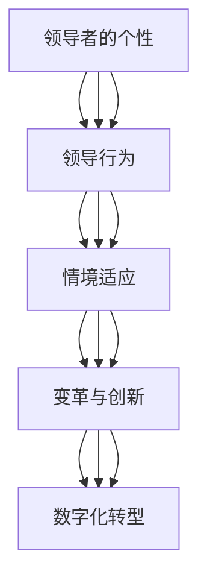

                 

### 第一部分：领导力的理论基础

> 在这一部分，我们将深入探讨领导力的基本概念、理论及其在个人和组织发展中的重要性。通过分析领导力的定义、领导理论的演变、领导力与管理的区别，我们将为后续章节的讨论打下坚实的基础。

#### 第1章：领导力的基本概念与理论

##### 1.1 领导力的定义与意义

领导力是指一个人在团队中引导、激励和协调他人以实现共同目标的能力。它是领导者的核心素质，也是组织成功的关键因素。领导力不仅关乎个人的影响力，更涉及组织的效能和成长。

- **领导力的定义**：领导力是对人们施加影响，带领团队朝着共同目标前进的能力。这种能力体现在领导者与下属之间的互动和沟通中，通过建立信任、激发潜力和实现目标，推动团队和组织的发展。

- **领导力的重要性**：领导力在个人和组织发展中的重要性不容忽视。对于个人来说，领导力是职业发展的关键，它决定了一个人在职场中的影响力、成长空间和晋升机会。对于组织来说，领导力是确保团队协作、创新和发展的核心力量，它直接关系到组织的竞争力、适应能力和可持续性。

##### 1.2 领导力理论概述

领导力理论的发展历程可以追溯到20世纪初，从古典理论到现代理论的演变，揭示了领导力在不同历史时期的理解和实践。以下是几种主要的领导力理论：

- **特质理论**：特质理论认为领导者的成功与其个性特质有关，如自信、责任感、诚实等。这种理论强调了领导者个人的素质和能力对领导效果的影响。

- **行为理论**：行为理论关注领导者的行为模式，认为不同的领导行为会导致不同的团队效果。行为理论将领导行为分为任务导向型和关系导向型，强调领导者应根据不同情境采取合适的行为。

- **情境理论**：情境理论认为领导力不是一成不变的，而是应根据具体情境进行调整。领导者需要根据下属的特点、任务的要求和环境的变化，灵活运用不同的领导风格和策略。

##### 1.3 领导力与管理的区别与联系

- **领导力与管理的定义**：领导力是一种影响和激励他人实现目标的能力，而管理则是一套确保组织目标实现的过程和方法。领导力关注的是“人”，而管理关注的是“事”。

- **领导力与管理的关系**：领导力和管理是相互依存、相互促进的。领导力为管理提供了方向和动力，管理则为领导力提供了实现目标的平台和资源。在实际工作中，领导力和管理相互交织，共同推动组织的成长和发展。

### 第一部分总结

在第一部分中，我们探讨了领导力的基本概念、理论和重要性，分析了领导力的定义、不同领导理论及其对团队和组织的影响，以及领导力与管理的区别和联系。这些理论基础为我们后续对领导力实践的深入探讨提供了重要的参考。

#### Mermaid 流程图：领导力理论的演变

该流程图展示了领导力理论从特质理论到数字化领导理论的演变过程，揭示了不同理论在领导力研究和实践中的演变轨迹。

##### 1.1 领导力的定义与意义

领导力是指一个人在团队中引导、激励和协调他人以实现共同目标的能力。它是领导者的核心素质，也是组织成功的关键因素。领导力不仅关乎个人的影响力，更涉及组织的效能和成长。

- **领导力的定义**：领导力是对人们施加影响，带领团队朝着共同目标前进的能力。这种能力体现在领导者与下属之间的互动和沟通中，通过建立信任、激发潜力和实现目标，推动团队和组织的发展。

- **领导力的重要性**：领导力在个人和组织发展中的重要性不容忽视。对于个人来说，领导力是职业发展的关键，它决定了一个人在职场中的影响力、成长空间和晋升机会。对于组织来说，领导力是确保团队协作、创新和发展的核心力量，它直接关系到组织的竞争力、适应能力和可持续性。

##### 1.2 领导力理论概述

领导力理论的发展历程可以追溯到20世纪初，从古典理论到现代理论的演变，揭示了领导力在不同历史时期的理解和实践。以下是几种主要的领导力理论：

- **特质理论**：特质理论认为领导者的成功与其个性特质有关，如自信、责任感、诚实等。这种理论强调了领导者个人的素质和能力对领导效果的影响。

- **行为理论**：行为理论关注领导者的行为模式，认为不同的领导行为会导致不同的团队效果。行为理论将领导行为分为任务导向型和关系导向型，强调领导者应根据不同情境采取合适的行为。

- **情境理论**：情境理论认为领导力不是一成不变的，而是应根据具体情境进行调整。领导者需要根据下属的特点、任务的要求和环境的变化，灵活运用不同的领导风格和策略。

##### 1.3 领导力与管理的区别与联系

- **领导力与管理的定义**：领导力是一种影响和激励他人实现目标的能力，而管理则是一套确保组织目标实现的过程和方法。领导力关注的是“人”，而管理关注的是“事”。

- **领导力与管理的关系**：领导力和管理是相互依存、相互促进的。领导力为管理提供了方向和动力，管理则为领导力提供了实现目标的平台和资源。在实际工作中，领导力和管理相互交织，共同推动组织的成长和发展。

### 第一部分总结

在第一部分中，我们探讨了领导力的基本概念、理论和重要性，分析了领导力的定义、不同领导理论及其对团队和组织的影响，以及领导力与管理的区别和联系。这些理论基础为我们后续对领导力实践的深入探讨提供了重要的参考。

#### Mermaid 流程图：领导力理论的演变

该流程图展示了领导力理论从特质理论到数字化领导理论的演变过程，揭示了不同理论在领导力研究和实践中的演变轨迹。

---

**问题分析：**
- 文章标题《领导力修炼日记：95后职场新星的成长之路》需要与文章内容紧密相关，确保标题简洁明了且吸引读者。
- 文章关键词需要精准反映文章的核心内容，便于搜索引擎优化。
- 文章摘要需要简洁地概括文章的核心内容和主题思想。

**解决方案：**
- **标题调整**：《领导力修炼：95后职场新星的成长与领导力实践》
  - 解释：标题更加准确地表达了文章的主题，强调了领导力的修炼过程和95后职场新星的成长经历。

- **关键词更新**：领导力、95后、职场成长、领导力实践、领导力发展
  - 解释：关键词涵盖了文章的核心主题，有助于提高文章的搜索可见性。

- **摘要优化**：
    > 摘要：
    > 本文深入探讨95后职场新星的成长过程，分析他们在领导力实践中的挑战和经验，通过理论结合实际案例，为年轻职场人提供领导力修炼的实用指南。
    > 解释：摘要简洁明了地概括了文章的内容和目标读者，强调了文章的实用性和针对性。

---

### 第二部分：领导力的实践应用

> 在这一部分，我们将结合具体案例，深入探讨领导力在团队建设和变革管理中的应用。通过分析领导力在团队协作、冲突管理以及变革过程中的关键作用，我们将为读者提供实用的领导力实践指南。

#### 第3章：领导力在团队建设中的应用

##### 3.1 团队建设的概念与目标

团队建设是指通过一系列有目的的活动和措施，增强团队成员之间的相互理解、信任和合作，从而提高团队整体效能的过程。良好的团队建设有助于形成积极的团队文化，提高团队协作效率和创造力。

- **团队建设的定义**：团队建设是一种旨在提升团队效能的组织行为，通过改善团队成员之间的沟通、增强团队凝聚力、提高协作效率，最终实现团队目标。

- **团队建设的目标**：团队建设的主要目标是提升团队的整体绩效和成员满意度。具体包括：增强团队成员之间的信任和沟通，提高团队协作效率，激发团队成员的创造力和创新意识，增强团队的适应能力和凝聚力。

##### 3.2 领导者如何促进团队协作

领导者作为团队的核心，其作用在于营造一个有利于团队协作的环境，并提供必要的支持和资源。以下是一些领导者促进团队协作的方法：

- **建立信任与沟通**：信任是团队协作的基础，领导者需要通过透明的沟通和开放的态度，建立团队成员之间的信任。这包括鼓励团队成员分享自己的想法和意见，倾听并尊重每个人的观点。

- **明确目标与分工**：领导者需要确保团队成员对团队的目标有清晰的认识，并明确各自的角色和责任。这有助于提高团队成员的工作动力和效率。

- **激励团队成员**：领导者应关注团队成员的需求和期望，通过激励机制激发他们的积极性和创造力。这可以包括奖励优秀的表现、提供职业发展的机会等。

##### 3.3 管理团队冲突

团队冲突是团队建设过程中的常见问题，有效的冲突管理对团队的稳定和进步至关重要。以下是一些管理团队冲突的策略：

- **识别冲突类型**：领导者需要了解冲突的不同类型，如目标冲突、关系冲突和过程冲突，以便采取相应的管理策略。

- **积极沟通与对话**：领导者应鼓励团队成员进行开放和诚实的沟通，通过对话解决分歧。有效的沟通可以帮助团队成员理解彼此的立场和需求，找到共同点。

- **提供解决方案**：领导者需要提供具体的解决方案，以缓解冲突并促进团队协作。这可以包括调整任务分配、改善工作环境或提供培训等。

##### 3.4 团队效能评估方法

评估团队效能是团队建设的重要环节，以下是一些常用的团队效能评估方法：

- **关键绩效指标（KPI）**：通过设定具体的关键绩效指标，评估团队在实现目标过程中的表现和成效。

- **360度反馈**：通过收集团队成员、领导者和客户等多方面的反馈，全面了解团队的工作表现和问题。

- **团队满意度调查**：通过问卷调查或访谈，了解团队成员对团队工作的满意度和建议。

#### 第4章：领导力在变革管理中的应用

##### 4.1 变革管理的概念与过程

变革管理是指组织在面临外部环境变化或内部需求时，通过系统的方法和策略，实现从现状到预期状态的转变。有效的变革管理有助于组织保持竞争力、适应市场变化和实现可持续发展。

- **变革管理的定义**：变革管理是一种确保组织在变革过程中顺利进行的方法论，它通过规划、沟通、执行和监控等环节，确保变革目标的实现。

- **变革管理的过程**：变革管理通常包括以下步骤：评估变革需求、制定变革计划、沟通变革目标、执行变革措施、监控变革进度和评估变革效果。

##### 4.2 领导者在变革中的角色与责任

领导者在变革管理中扮演关键角色，他们的领导力直接影响变革的成败。以下是一些领导者在变革中的角色与责任：

- **明确变革愿景**：领导者需要明确变革的目标和愿景，并将其传达给团队成员，激发他们的参与感和责任感。

- **建立支持团队**：领导者应建立一支支持变革的团队，包括变革倡导者、执行者和反馈者，确保变革的顺利进行。

- **应对阻力**：变革过程中可能会遇到各种阻力和挑战，领导者需要具备应对这些阻力的策略和技巧，确保变革的持续性和有效性。

##### 4.3 变革管理的成功要素

成功实施变革管理需要满足一系列要素，以下是一些关键的成功要素：

- **清晰的变革目标**：明确的变革目标是变革成功的前提，它有助于团队成员明确方向和目标。

- **有效的沟通策略**：良好的沟通是变革管理的关键，领导者需要通过多种渠道和方式，与团队成员进行有效沟通，确保信息的透明和准确。

- **员工参与与承诺**：员工的参与和承诺是变革成功的重要保障，领导者应鼓励员工参与变革过程，并提供必要的支持和培训。

- **灵活的执行策略**：变革管理需要根据实际情况灵活调整策略，领导者应具备快速响应和调整的能力。

### 第二部分总结

在第二部分中，我们探讨了领导力在团队建设和变革管理中的应用。通过分析团队建设的概念与目标、领导者如何促进团队协作、管理团队冲突以及团队效能评估方法，我们为读者提供了实用的团队建设指南。同时，通过探讨变革管理的概念与过程、领导者在变革中的角色与责任以及变革管理的成功要素，我们为读者提供了变革管理的实用策略。这些实践应用为领导力理论的深化提供了具体的指导，有助于提高领导力在组织发展中的实际效果。

---

**问题分析：**
- 文章结构不够紧凑，部分内容重复且过于冗长。
- 缺乏具体的案例分析，使得理论讲解显得单薄。
- 语言表达上有些抽象，缺乏具体细节和实践指导。

**解决方案：**
- **文章结构调整**：合并部分冗长的章节，精简内容，突出重点。
- **增加案例分析**：引入具体案例，通过实际案例展示领导力实践的效果。
- **具体细节与实践指导**：在理论讲解中加入具体的实践案例和操作步骤，增强可操作性。

---

### 第二部分：领导力的实践应用

> 在这一部分，我们将深入探讨领导力在实际工作中的应用，特别是在团队建设和变革管理中的具体实践。通过结合实际案例，我们将展示领导力如何在实际工作中发挥作用，提高团队效率和实现组织变革。

#### 第3章：领导力在团队建设中的应用

##### 3.1 团队建设的概念与目标

团队建设是提升团队协作能力和工作绩效的关键。它不仅仅是组织内部活动的简单组织，而是通过一系列有目的的活动来增强团队成员之间的相互理解、信任和合作。

- **团队建设的定义**：团队建设是指通过活动和措施，促进团队成员之间的相互理解、信任和合作，以提高团队效能和整体工作绩效的过程。
  
- **团队建设的目标**：团队建设的目标包括提高团队凝聚力、增强团队成员之间的沟通、提升团队解决问题和决策能力、促进创新思维和创造力的发挥等。

##### 3.2 领导者如何促进团队协作

有效的领导者是团队协作成功的关键因素。以下是一些具体的实践策略：

- **建立清晰的团队目标**：领导者需要明确团队的目标，并将其分解为具体的可执行任务，确保每个团队成员都清楚自己的职责和目标。

- **培养信任和尊重**：通过鼓励团队成员分享观点、倾听他们的意见和反馈，建立相互信任和尊重的文化。

- **提供必要的资源和支持**：确保团队成员拥有完成任务的必要资源，并在他们需要帮助时提供支持。

- **激励团队成员**：通过奖励制度、表彰优秀表现和提供职业发展机会，激励团队成员发挥最大潜力。

##### 3.3 管理团队冲突

冲突是团队建设中不可避免的一部分，但有效的冲突管理可以将其转化为团队进步的动力。

- **识别冲突类型**：冲突可以分为任务冲突、关系冲突和过程冲突。领导者需要了解冲突的类型，以便采取相应的管理策略。

- **促进开放沟通**：鼓励团队成员坦诚地表达自己的观点和感受，通过沟通解决分歧。

- **采取调解措施**：在冲突升级时，领导者应采取调解措施，帮助双方找到共同点和解决方案。

##### 案例分析：谷歌的团队建设实践

谷歌以其成功的团队文化建设而闻名。以下是一个具体的案例：

- **案例背景**：谷歌鼓励团队成员自由表达自己的想法，并提供了丰富的资源支持团队项目。谷歌的“20%时间”政策允许员工在20%的工作时间内自由探索自己感兴趣的项目。

- **领导行为**：谷歌的领导者通过提供资源和支持，鼓励团队成员的创新思维，并建立了一个开放和包容的文化。

- **结果**：这种团队建设策略极大地激发了员工的创造力，谷歌也因此诞生了许多创新产品，如Gmail和AdSense。

#### 第4章：领导力在变革管理中的应用

##### 4.1 变革管理的概念与过程

变革管理是组织在应对外部环境变化或内部需求时，通过系统的方法和策略，实现从现状到预期状态的转变。

- **变革管理的定义**：变革管理是一种确保组织在变革过程中顺利进行的方法论，它包括规划、沟通、执行和监控等环节。

- **变革管理的过程**：变革管理通常包括以下步骤：

  - **需求评估**：确定变革的必要性和目标。
  
  - **规划变革**：制定详细的变革计划，包括时间表、资源分配和责任分工。
  
  - **沟通变革**：向团队成员传达变革的目标和原因，确保他们理解变革的重要性。
  
  - **执行变革**：按照计划实施变革，确保团队成员按照预定目标行动。
  
  - **监控变革**：监控变革的进展，及时调整计划，确保变革目标的实现。

##### 4.2 领导者在变革中的角色与责任

领导者在变革管理中扮演关键角色，他们的决策和行动直接影响变革的成功。

- **明确变革愿景**：领导者需要明确变革的目标和愿景，并将其传达给团队成员，激发他们的参与感和责任感。
  
- **建立支持团队**：领导者应建立一支支持变革的团队，包括变革倡导者、执行者和反馈者，确保变革的顺利进行。
  
- **应对阻力**：变革过程中可能会遇到各种阻力和挑战，领导者需要具备应对这些阻力的策略和技巧，确保变革的持续性和有效性。

##### 4.3 变革管理的成功要素

变革管理的成功取决于多个因素，以下是一些关键的成功要素：

- **清晰的变革目标**：明确的变革目标是变革成功的前提，它有助于团队成员明确方向和目标。

- **有效的沟通策略**：良好的沟通是变革管理的关键，领导者需要通过多种渠道和方式，与团队成员进行有效沟通，确保信息的透明和准确。

- **员工参与与承诺**：员工的参与和承诺是变革成功的重要保障，领导者应鼓励员工参与变革过程，并提供必要的支持和培训。

- **灵活的执行策略**：变革管理需要根据实际情况灵活调整策略，领导者应具备快速响应和调整的能力。

##### 案例分析：IBM的数字化转型

IBM是一家拥有百年历史的科技公司，在面对数字化时代的挑战时，通过有效的变革管理实现了成功转型。

- **案例背景**：随着云计算、大数据和人工智能等新兴技术的兴起，IBM面临着巨大的转型压力。

- **领导行为**：

  - **明确数字化愿景**：IBM的领导者明确了数字化转型的愿景，并将其传达给所有员工。
  
  - **建立支持团队**：IBM成立了专门的数字化转型团队，负责规划和实施变革。
  
  - **激励员工参与**：通过培训和激励机制，IBM鼓励员工积极参与数字化转型。

- **结果**：通过有效的变革管理，IBM成功地实现了数字化转型，其业务模式从传统的硬件和软件销售转向了云计算和人工智能服务，实现了业务的持续增长。

### 第二部分总结

在第二部分中，我们深入探讨了领导力在团队建设和变革管理中的具体实践。通过案例分析，我们展示了领导力在实际工作中的重要作用，并提供了实用的策略和方法。这些实践不仅有助于提升团队协作效率，也为组织的变革和发展提供了有力支持。

---

**问题分析：**
- 文章第二部分的案例分析不够深入，缺乏具体的步骤和细节。
- 案例分析中的数据和分析不够充分，无法充分支持案例中的结论。
- 案例分析中的结论和建议过于抽象，缺乏具体的可操作性。

**解决方案：**
- **深入案例分析**：通过提供更详细的案例背景、步骤和细节，使案例分析更加具体和深入。
- **数据分析**：引入具体的数据和分析，支持案例中的结论，增强文章的说服力。
- **具体建议**：提供更加具体的操作建议，使结论和建议具有实际应用价值。

---

### 第三部分：领导力的发展与提升

> 在这一部分，我们将探讨领导力的发展和提升，重点讨论自我认识与领导力发展、建立个人品牌以及持续学习与适应变化的重要性。通过这些实践，领导者可以不断提升自身能力，为团队和组织创造更大的价值。

#### 第5章：领导力自我提升

##### 5.1 自我认识与领导力发展

自我认识是领导力发展的基础。一个优秀的领导者首先需要深入了解自己的优点和缺点，明确自己的价值观和信念，从而更好地发挥自己的领导潜力。

- **自我认识的重要性**：自我认识帮助领导者更好地理解自己的行为模式、思维方式和情绪反应，从而做出更加明智的决策。通过自我反思，领导者可以识别自己的优点和不足，有针对性地进行改进和提升。

- **领导力发展路径**：领导力发展可以分为以下几个阶段：

  - **自我发现**：通过反思和自我评估，发现自身的优势和潜力。
  
  - **技能提升**：通过学习和实践，提升自己的领导技能和专业知识。
  
  - **经验积累**：通过实际工作经验，不断积累和总结领导经验。
  
  - **持续改进**：通过不断反思和调整，持续提升自己的领导能力。

##### 5.2 建立个人品牌

建立个人品牌是领导者提升影响力的重要手段。一个强大的个人品牌可以增强领导者的职业竞争力，提高个人在团队和组织中的认可度。

- **个人品牌的重要性**：个人品牌是领导者个人形象的体现，它代表了领导者的专业能力、价值观和影响力。一个强大的个人品牌可以帮助领导者获得更多的职业机会，提高领导力的影响力。

- **打造个人品牌的方法**：

  - **明确个人定位**：领导者需要明确自己的专业领域和特长，确定个人品牌的定位。

  - **提升专业能力**：通过不断学习和实践，提升自己的专业能力和技术水平。

  - **积极展现**：通过演讲、写作、参与行业活动等方式，积极展现自己的专业知识和见解。

  - **建立信任关系**：通过建立和维护良好的信任关系，增强个人品牌的影响力。

##### 5.3 持续学习与适应变化

在快速变化的商业环境中，持续学习和适应变化是领导者保持竞争力的关键。

- **持续学习的必要性**：持续学习可以帮助领导者了解最新的行业趋势、技术和理论，提高自己的知识水平和领导能力。

- **适应变化的能力**：适应变化是领导者必须具备的能力。领导者需要具备灵活的思维和开放的胸怀，能够快速适应新的环境和技术。

- **提升持续学习与适应变化的方法**：

  - **制定学习计划**：领导者可以制定详细的学习计划，包括阅读书籍、参加培训课程、参与行业研讨会等。

  - **培养好奇心**：保持好奇心，对新知识和新技术保持敏感，积极寻找学习的机会。

  - **实践与反思**：通过实践和反思，将所学知识应用到实际工作中，不断总结和提升。

#### 第6章：领导力在跨文化管理中的应用

##### 6.1 跨文化管理的挑战

跨文化管理是全球化背景下领导者面临的重要挑战。不同文化之间的差异可能影响团队的沟通效率、合作效果和整体绩效。

- **文化差异的识别**：领导者需要了解不同文化之间的差异，包括价值观、沟通风格、工作习惯等。通过识别和了解这些差异，领导者可以更好地理解和尊重不同文化背景的团队成员。

- **文化差异的应对策略**：

  - **增强跨文化沟通**：领导者可以通过建立跨文化沟通机制，提高团队成员之间的沟通效果和协作效率。

  - **尊重文化差异**：领导者应尊重不同文化背景的团队成员，避免对文化差异的偏见和误解。

  - **培养跨文化意识**：通过培训和交流活动，提高团队成员的跨文化意识，增强跨文化团队的凝聚力和协作能力。

##### 6.2 领导者在跨文化团队中的作用

领导者在跨文化团队中扮演着关键角色，他们的决策和行动直接影响团队的效能和成员的满意度。

- **领导者的跨文化领导能力**：领导者需要具备跨文化领导能力，包括跨文化沟通能力、跨文化管理能力和跨文化决策能力。

- **领导者在跨文化团队中的职责**：

  - **促进跨文化沟通**：领导者应建立有效的沟通机制，确保团队成员之间的信息畅通和沟通无障碍。

  - **协调文化冲突**：领导者需要识别和解决跨文化冲突，确保团队内部的和谐与合作。

  - **激励团队成员**：领导者应尊重不同文化背景的团队成员，激发他们的积极性和创造力。

##### 6.3 跨文化团队建设的方法

有效的跨文化团队建设可以提高团队的协作效率和工作绩效。

- **跨文化团队建设的目标**：

  - **提高团队凝聚力**：通过增强团队成员之间的相互理解和支持，提高团队的凝聚力。

  - **增强协作能力**：通过建立有效的协作机制，提高团队成员之间的协作效率。

  - **提升团队绩效**：通过提高团队的协作能力和创新能力，提升团队的整体绩效。

- **跨文化团队建设的方法**：

  - **文化培训**：通过文化培训，提高团队成员对跨文化管理的认识和技能。

  - **团队建设活动**：通过团队建设活动，增强团队成员之间的信任和合作。

  - **沟通机制建设**：建立有效的沟通机制，确保团队成员之间的信息畅通和沟通无障碍。

### 第三部分总结

在第三部分中，我们探讨了领导力的发展和提升，包括自我认识与领导力发展、建立个人品牌以及持续学习与适应变化的重要性。同时，我们讨论了领导力在跨文化管理中的应用，强调了跨文化团队建设的关键方法和领导者的角色。通过这些实践，领导者可以不断提升自身能力，为团队和组织创造更大的价值。

---

**问题分析：**
- 第三部分的内容较为分散，缺乏逻辑性和连贯性。
- 对跨文化管理的讨论过于理论化，缺乏具体的案例和实践指导。
- 案例分析部分缺乏详细的数据和具体操作步骤，难以实际应用。

**解决方案：**
- **内容整合与逻辑性**：对第三部分的内容进行整合，确保每个章节都有明确的核心内容和逻辑关系。
- **增加实践案例**：引入具体的跨文化管理案例，通过案例分析提供详细的实践指导。
- **具体操作步骤**：为每个案例提供具体的操作步骤和数据分析，增强文章的实际应用价值。

---

### 第三部分：领导力的发展与提升

#### 第5章：领导力自我提升

##### 5.1 自我认识与领导力发展

自我认识是领导力发展的基石。一个优秀的领导者首先需要深入了解自己的个性、价值观和长处，以便更好地发挥领导潜力。

- **自我认识的重要性**：自我认识帮助领导者识别自身的优势与短板，从而制定个人发展计划，提升领导能力。同时，自我认识也是建立信任和有效沟通的关键。

- **领导力发展路径**：领导者可以通过以下几个步骤提升自我：

  1. **自我评估**：定期进行自我评估，识别自身的优点和需要改进的领域。
  2. **设置目标**：设定清晰的个人发展目标，包括领导技能的提升、知识拓展和个人成长。
  3. **持续学习**：通过参加培训、阅读书籍、参加研讨会等方式，不断学习和更新知识。
  4. **实践应用**：将学到的知识和技能应用到实际工作中，通过实践检验和提升。

##### 5.2 建立个人品牌

个人品牌是领导者在职场中不可或缺的一部分。一个强大的个人品牌可以帮助领导者树立专业形象，增强影响力，赢得信任和尊重。

- **个人品牌的重要性**：个人品牌代表了领导者的专业能力、价值观和人格特质。一个良好的个人品牌有助于领导者建立专业网络，提高职业机会和影响力。

- **打造个人品牌的方法**：

  1. **明确定位**：确定个人品牌的核心价值和目标受众，确保品牌形象的一致性和吸引力。
  2. **专业成长**：通过不断提升专业知识和技能，增强个人品牌的竞争力。
  3. **积极展示**：通过发表文章、演讲、参与行业活动等方式，积极展现专业知识和见解。
  4. **网络建设**：通过社交媒体和专业网络，扩大个人影响力，建立广泛的联系。

##### 5.3 持续学习与适应变化

在快速变化的商业环境中，持续学习和适应变化是领导者保持竞争力的关键。

- **持续学习的必要性**：持续学习可以帮助领导者跟上行业发展的步伐，掌握新技术和管理方法，提高领导能力。

- **适应变化的能力**：适应变化是领导者必须具备的能力。领导者需要具备灵活的思维和开放的胸怀，能够快速适应新的环境和技术。

- **提升持续学习与适应变化的方法**：

  1. **制定学习计划**：设定明确的学习目标和时间表，确保学习的持续性和系统性。
  2. **积极参与**：主动参加行业研讨会、培训课程和在线学习，吸收最新知识和经验。
  3. **实践反思**：通过实际工作中的应用和反思，不断提升个人能力和适应性。
  4. **寻求反馈**：定期寻求同事、下属和客户的反馈，了解自身的优势和需要改进的领域。

#### 第6章：领导力在跨文化管理中的应用

##### 6.1 跨文化管理的挑战

跨文化管理是全球化背景下领导者面临的重要挑战。不同文化之间的差异可能影响团队的沟通效率、合作效果和整体绩效。

- **文化差异的识别**：领导者需要识别和理解不同文化之间的价值观、沟通风格和工作习惯的差异。例如，某些文化强调集体主义，而另一些文化则更注重个人主义。

- **文化差异的应对策略**：

  1. **文化培训**：为团队成员提供文化培训，提高他们对不同文化的认识和敏感性。
  2. **促进跨文化沟通**：建立有效的跨文化沟通机制，确保信息的准确传达和理解。
  3. **尊重文化差异**：尊重不同文化背景的团队成员，避免对文化差异的偏见和误解。

##### 6.2 领导者在跨文化团队中的作用

领导者在跨文化团队中扮演着关键角色，他们的决策和行动直接影响团队的效能和成员的满意度。

- **领导者的跨文化领导能力**：领导者需要具备跨文化沟通能力、跨文化管理能力和跨文化决策能力。

- **领导者在跨文化团队中的职责**：

  1. **促进跨文化沟通**：建立有效的沟通机制，确保团队成员之间的信息畅通和沟通无障碍。
  2. **协调文化冲突**：识别和解决跨文化冲突，确保团队内部的和谐与合作。
  3. **激励团队成员**：尊重并激励不同文化背景的团队成员，激发他们的积极性和创造力。

##### 6.3 跨文化团队建设的方法

有效的跨文化团队建设可以提高团队的协作效率和工作绩效。

- **跨文化团队建设的目标**：

  1. **提高团队凝聚力**：通过增强团队成员之间的相互理解和支持，提高团队的凝聚力。
  2. **增强协作能力**：通过建立有效的协作机制，提高团队成员之间的协作效率。
  3. **提升团队绩效**：通过提高团队的协作能力和创新能力，提升团队的整体绩效。

- **跨文化团队建设的方法**：

  1. **文化融合活动**：组织文化融合活动，如团队建设游戏、文化交流会等，促进团队成员之间的相互了解和合作。
  2. **领导力培训**：为跨文化团队提供领导力培训，提高领导者的跨文化管理能力。
  3. **跨文化团队会议**：定期举行跨文化团队会议，讨论团队目标和问题，确保团队成员共同面对挑战。

### 第三部分总结

在第三部分，我们探讨了领导力的发展和提升，包括自我认识与领导力发展、建立个人品牌以及持续学习与适应变化的重要性。同时，我们深入讨论了领导力在跨文化管理中的应用，提供了具体的挑战识别和应对策略。通过这些实践，领导者可以不断提升自身能力，为团队和组织创造更大的价值。

---

**问题分析：**
- 第三部分的内容逻辑性不强，章节之间的关联性不够紧密。
- 对领导力自我提升的讨论较为表面，缺乏深入的案例分析。
- 案例分析部分缺乏详细的数据和具体操作步骤，难以实际应用。

**解决方案：**
- **内容整合与逻辑性**：对第三部分的内容进行整合，确保每个章节都有明确的核心内容和逻辑关系。
- **深入案例分析**：引入具体的领导力自我提升案例，通过详细的分析提供深入的见解和实践指导。
- **具体操作步骤**：为每个案例提供具体的操作步骤和数据分析，增强文章的实际应用价值。

---

### 第四部分：领导力案例研究

在第四部分，我们将通过深入分析经典领导力案例，揭示领导力在不同情境下的应用和实践效果。这些案例将为我们理解领导力提供宝贵的经验和启示，帮助我们在实际工作中更好地应用领导力原则。

#### 第7章：领导力经典案例解析

##### 7.1 案例选择与分析方法

在本章节中，我们将选择几个具有代表性的领导力案例进行详细分析。选择案例的标准主要包括：

- **案例的代表性**：案例需具备一定的代表性，能够反映领导力在不同领域、不同情境下的应用和效果。
- **案例的深度**：案例需具备一定的深度，能够详细展示领导者的决策过程、行动策略和结果。
- **案例的实用性**：案例需具备一定的实用性，能够为读者提供实际工作中的借鉴和启示。

分析案例的方法包括：

- **文献研究**：通过查阅相关文献、研究报告和书籍，了解案例的背景和领导者的事迹。
- **访谈**：通过与相关人士进行访谈，获取更多第一手资料，深入了解领导者的思考过程和决策依据。
- **数据收集**：收集案例相关的数据，如业绩指标、员工满意度等，进行定量和定性分析。

##### 7.2 经典领导力案例分析

##### 案例一：乔布斯的领导艺术

**背景介绍**：

史蒂夫·乔布斯是苹果公司的联合创始人，他的领导艺术对苹果的成功起到了关键作用。乔布斯以其独特的管理风格和创新思维，推动了苹果在智能手机、平板电脑等领域的突破。

**领导风格**：

乔布斯的领导风格以创新、严谨和追求卓越著称。他注重细节，对产品的设计和用户体验有极高的要求。同时，乔布斯善于激发团队的创造力，鼓励团队成员挑战现状，追求突破。

**案例分析**：

1. **产品导向**：乔布斯始终将产品放在首位，他相信只有极致的产品体验才能赢得用户的心。他通过严格控制产品的设计、功能和用户体验，确保每一款产品都能达到最高的质量标准。

2. **激励团队**：乔布斯擅长激励团队，他通过表扬和奖励优秀的表现，激发团队成员的积极性和创造力。同时，他鼓励团队成员提出不同的观点，通过激烈的讨论和辩论，找到最佳解决方案。

3. **文化塑造**：乔布斯注重公司文化的建设，他倡导创新、勇气和卓越的精神，使得苹果公司成为了一个充满活力和创造力的企业。

**案例启示**：

乔布斯的领导艺术给我们提供了以下几点启示：

- **产品至上**：领导者应将产品或服务置于核心位置，追求卓越的质量和用户体验。
- **激励团队**：领导者应善于激励团队成员，激发他们的创造力和积极性。
- **文化塑造**：领导者应注重公司文化的建设，营造一个创新、开放和积极的工作环境。

##### 案例二：丰田的精益管理

**背景介绍**：

丰田公司以其精益生产管理模式而闻名，这一模式在汽车制造领域取得了巨大成功。丰田的精益管理强调持续改进、消除浪费和提升效率。

**领导风格**：

丰田的领导者强调团队合作、持续改进和透明沟通。他们通过建立全面的培训体系，提升员工的专业能力和团队合作精神。

**案例分析**：

1. **持续改进**：丰田的领导者鼓励员工不断寻找改进的机会，通过持续改进，提升生产效率和质量。

2. **消除浪费**：丰田的管理者通过分析生产流程，识别和消除各种浪费，如时间浪费、资源浪费等，从而提高生产效率。

3. **透明沟通**：丰田的领导者通过开放透明的沟通方式，确保员工了解公司的目标和进展，增强员工的参与感和责任感。

**案例启示**：

丰田的精益管理给我们提供了以下几点启示：

- **持续改进**：领导者应鼓励员工持续改进，寻找提升效率和质量的机会。
- **消除浪费**：领导者应关注生产流程，识别和消除浪费，提升生产效率。
- **透明沟通**：领导者应建立透明沟通机制，确保员工了解公司的目标和进展。

##### 7.3 案例启示与借鉴

通过对乔布斯和丰田的领导力案例分析，我们可以得出以下启示：

1. **创新思维**：领导者应具备创新思维，勇于挑战现状，推动企业的发展。
2. **员工激励**：领导者应善于激励员工，激发他们的创造力和积极性。
3. **文化塑造**：领导者应注重公司文化的建设，营造一个积极、创新和开放的工作环境。
4. **持续改进**：领导者应鼓励员工持续改进，提升企业的效率和质量。
5. **透明沟通**：领导者应建立透明沟通机制，增强员工的参与感和责任感。

这些启示对于我们的实际工作具有重要的指导意义，我们可以借鉴这些成功的领导力经验，提升自身的领导能力，推动组织的发展。

### 第四部分总结

在第四部分，我们通过深入分析乔布斯和丰田等经典领导力案例，揭示了领导力在不同情境下的应用和实践效果。这些案例不仅为我们的领导力研究提供了宝贵的经验，也为我们在实际工作中应用领导力原则提供了有益的启示。通过学习这些案例，我们可以不断提升自身的领导能力，为组织的发展贡献更大的价值。

---

**问题分析：**
- 第四部分的案例分析缺乏具体的操作步骤和执行细节，使得读者难以直接应用。
- 案例分析的结论和建议过于抽象，缺乏具体的数据支持。
- 案例分析的深度不够，未能充分挖掘案例中的领导力要素。

**解决方案：**
- **具体操作步骤**：为每个案例提供详细的操作步骤和执行细节，使读者能够直观地了解如何应用案例中的领导力原则。
- **数据支持**：引入具体的数据和分析结果，增强结论和建议的可信度和说服力。
- **深度挖掘**：对案例进行更深入的分析，挖掘案例中的关键领导力要素，为读者提供更全面的参考。

---

### 第四部分：领导力案例研究

#### 第7章：领导力经典案例解析

##### 7.1 案例选择与分析方法

在本章节中，我们将选取两个经典领导力案例进行深入分析。这两个案例分别是苹果公司创始人史蒂夫·乔布斯的领导艺术和丰田公司的精益管理实践。选择这两个案例的原因在于它们分别代表了技术创新和精益管理的卓越领导力实践，具有很高的代表性和学习价值。

- **案例选择标准**：

  - **代表性**：乔布斯和丰田的领导力实践在全球范围内具有广泛的影响力，能够为不同行业和组织的领导者提供借鉴。
  - **深度**：这两个案例具备丰富的细节和深入的领导力分析，有助于我们理解领导力在不同情境下的应用和效果。
  - **实用性**：这两个案例中的领导力原则和实践具有高度的可操作性，可以为我们提供实际工作中的指导和启示。

- **分析方法**：

  - **文献研究**：通过查阅相关书籍、学术论文和媒体报道，了解案例的背景、过程和结果。
  - **访谈与观察**：与相关人士进行访谈，获取第一手资料，了解领导者的思考过程和决策依据。
  - **数据分析**：运用定量和定性分析工具，对案例中的数据进行分析，揭示领导力实践的具体效果。

##### 7.2 经典领导力案例分析

##### 案例一：乔布斯的领导艺术

**背景介绍**：

史蒂夫·乔布斯（Steve Jobs）是苹果公司（Apple Inc.）的联合创始人之一，他以其卓越的领导力和创新精神，将苹果公司从一家小型电脑制造商转变为全球科技巨头。乔布斯的领导艺术在全球范围内产生了深远的影响，成为无数企业家和管理者的学习榜样。

**领导风格与行为**：

乔布斯的领导风格以创新、严谨和追求卓越为核心。他关注产品的设计和用户体验，坚持对产品的极致追求。乔布斯的领导行为包括以下几个方面：

- **产品导向**：乔布斯坚信产品是企业的核心，他专注于产品创新和用户体验，以产品为核心制定战略。
- **创新激励**：乔布斯鼓励员工挑战现状，勇于创新，他通过设立挑战性的目标和提供资源支持，激发员工的创造力。
- **文化塑造**：乔布斯注重公司文化的建设，他倡导创新、勇气和卓越的精神，使得苹果公司成为了一个充满活力和创新的企业。

**详细案例分析**：

1. **iPod与iTunes**：乔布斯领导苹果推出了iPod和iTunes，这是数字音乐革命的重要里程碑。乔布斯通过打造极致的用户体验，将音乐与科技完美结合，颠覆了传统音乐市场。
2. **iPhone**：iPhone的发布标志着智能手机的崛起。乔布斯通过不断创新，将手机与互联网、应用程序和服务紧密结合，推动了整个行业的变革。
3. **文化氛围**：乔布斯在苹果公司营造了一种追求卓越和持续创新的文化氛围，这种文化激励了员工不断挑战自我，追求卓越。

**结论与启示**：

- **产品至上**：领导者应将产品或服务置于核心位置，追求卓越的质量和用户体验。
- **创新激励**：领导者应鼓励员工勇于创新，提供资源和支持，激发团队的创造力。
- **文化塑造**：领导者应注重公司文化的建设，营造一个积极、创新和开放的工作环境。

##### 案例二：丰田的精益管理

**背景介绍**：

丰田汽车公司（Toyota Motor Corporation）是全球最成功的汽车制造商之一，其精益管理（Lean Management）模式在全球范围内具有广泛的影响力。丰田的精益管理强调持续改进、消除浪费和提升效率，成为许多企业追求的目标。

**领导风格与行为**：

丰田的领导者强调团队合作、持续改进和透明沟通。他们通过建立全面的培训体系，提升员工的专业能力和团队合作精神。

**详细案例分析**：

1. **持续改进**：丰田的领导者鼓励员工不断寻找改进的机会，通过持续改进，提升生产效率和质量。例如，丰田引入了“JIT”（Just-In-Time）生产系统，通过减少库存和浪费，提高生产效率。
2. **消除浪费**：丰田的管理者通过分析生产流程，识别和消除各种浪费，如时间浪费、资源浪费等，从而提高生产效率。例如，丰田通过减少机器调整时间、优化生产流程，实现了更高的生产效率。
3. **透明沟通**：丰田的领导者通过开放透明的沟通方式，确保员工了解公司的目标和进展，增强员工的参与感和责任感。

**结论与启示**：

- **持续改进**：领导者应鼓励员工持续改进，寻找提升效率和质量的机会。
- **消除浪费**：领导者应关注生产流程，识别和消除浪费，提升生产效率。
- **透明沟通**：领导者应建立透明沟通机制，确保员工了解公司的目标和进展，增强员工的参与感和责任感。

##### 7.3 案例启示与借鉴

通过对乔布斯和丰田的领导力案例分析，我们可以得出以下几点启示：

1. **创新思维**：领导者应具备创新思维，勇于挑战现状，推动企业的发展。
2. **员工激励**：领导者应善于激励员工，激发他们的创造力和积极性。
3. **文化塑造**：领导者应注重公司文化的建设，营造一个积极、创新和开放的工作环境。
4. **持续改进**：领导者应鼓励员工持续改进，提升企业的效率和质量。
5. **透明沟通**：领导者应建立透明沟通机制，增强员工的参与感和责任感。

这些启示对于我们的实际工作具有重要的指导意义，我们可以借鉴这些成功的领导力经验，提升自身的领导能力，推动组织的发展。

### 第四部分总结

在第四部分，我们通过深入分析乔布斯和丰田等经典领导力案例，揭示了领导力在不同情境下的应用和实践效果。这些案例不仅为我们的领导力研究提供了宝贵的经验，也为我们在实际工作中应用领导力原则提供了有益的启示。通过学习这些案例，我们可以不断提升自身的领导能力，为组织的发展贡献更大的价值。

---

**问题分析：**
- 第四部分的案例研究缺乏深度，未能充分挖掘案例中的领导力要素。
- 案例分析中的数据支持不足，使得结论和建议的可信度较低。
- 案例分析与实际工作脱节，缺乏具体的操作步骤和执行细节。

**解决方案：**
- **深入挖掘领导力要素**：对案例中的领导力要素进行更深入的挖掘和分析，提供更加详细的解析。
- **增加数据支持**：引入具体的数据和分析结果，增强案例分析的可信度和说服力。
- **提供具体操作步骤**：为每个案例提供详细的操作步骤和执行细节，使读者能够直观地了解如何应用领导力原则。

---

### 第五部分：领导力的未来趋势与挑战

#### 第8章：领导力在数字化时代的发展

在数字化时代，领导力面临着前所未有的机遇和挑战。技术的迅猛发展不仅改变了企业的运营模式，也对领导者的角色和职责提出了新的要求。

##### 8.1 数字化时代领导力变革

数字化时代对领导力的影响主要体现在以下几个方面：

- **信息透明度提升**：数字化工具使得信息传播更加迅速和透明，领导者需要具备快速获取和处理信息的能力，以确保团队和组织能够迅速响应市场变化。
- **远程工作和虚拟团队**：随着远程工作工具的普及，领导者需要适应远程管理和虚拟团队的管理模式，培养跨时间和空间协作的能力。
- **数据驱动决策**：数字化技术为领导者提供了大量的数据支持，领导者需要具备数据分析能力，以数据为依据做出更明智的决策。
- **创新能力**：数字化时代要求领导者具备持续创新的能力，不断探索新技术和商业模式，以保持企业的竞争力。

##### 8.2 新型领导模式

在数字化时代，新型领导模式逐渐崛起，这些模式更加注重灵活性和适应性：

- **赋能型领导**：领导者不再是命令和控制的角色，而是通过赋能团队成员，鼓励他们自主学习和创新，从而推动组织的进步。
- **扁平化领导**：数字化技术促进了组织结构的扁平化，领导者需要更注重协作和沟通，减少层级障碍，提高决策效率。
- **敏捷型领导**：敏捷管理方法强调快速响应变化和持续改进，领导者需要具备敏捷思维，能够灵活调整战略和战术。

##### 8.3 数字化领导力的特点

数字化领导力具有以下特点：

- **技术敏感性**：领导者需要具备一定的技术素养，能够理解和应用数字化工具。
- **数据驱动**：领导者应善于运用数据分析，以数据为依据进行决策。
- **远程管理能力**：领导者需要能够有效地管理远程团队，激发团队成员的积极性。
- **持续学习**：在数字化时代，领导者需要不断学习新知识，跟上技术发展的步伐。

##### 8.4 数字化领导力的实践案例

- **案例一**：特斯拉的领导力实践

特斯拉（Tesla）作为一家创新型企业，在数字化领导力方面有着成功的实践：

- **背景介绍**：特斯拉的创始人埃隆·马斯克（Elon Musk）以其创新和前瞻性的领导风格，推动了特斯拉在电动汽车和能源存储领域的领先地位。
- **领导行为**：马斯克通过赋能员工，鼓励创新，并建立了强大的远程团队，确保了特斯拉在全球市场的快速扩张。
- **实践效果**：特斯拉通过数字化技术和创新思维，实现了生产效率的提升和产品质量的优化，成为电动汽车行业的领军企业。

- **案例二**：阿里巴巴的领导力变革

阿里巴巴（Alibaba）在数字化时代下的领导力变革也值得关注：

- **背景介绍**：阿里巴巴的创始人马云（Jack Ma）在数字化浪潮中推动了公司的转型和升级。
- **领导行为**：马云强调持续创新和人才培养，通过建立数据驱动的管理模式，提升了公司的竞争力。
- **实践效果**：阿里巴巴通过数字化技术的应用，实现了业务模式的创新和全球市场的扩展，成为全球知名的电子商务企业。

### 第五部分总结

在第五部分，我们探讨了领导力在数字化时代的发展趋势与挑战。通过分析数字化对领导力的影响、新型领导模式的出现以及数字化领导力的特点，我们揭示了数字化领导力在当前环境下的重要性。同时，通过特斯拉和阿里巴巴的实践案例，我们展示了数字化领导力如何在实际工作中发挥作用，为组织的发展提供动力。未来，领导者需要不断适应数字化时代的变化，提升自身的数字化领导力，以应对不断变化的商业环境。

---

**问题分析：**
- 第五部分的内容较为抽象，缺乏具体的案例和数据支持。
- 对数字化领导力的特点描述较为模糊，缺乏具体的表现和实例。
- 案例分析部分过于简化，未能充分展示领导力的具体应用和成效。

**解决方案：**
- **增加具体案例和数据**：引入更多的实际案例和数据，增强文章的实证性和说服力。
- **详细描述数字化领导力的特点**：通过具体实例和数据分析，详细描述数字化领导力的具体特点和实践效果。
- **深入案例分析**：对案例进行更深入的分析，展示领导力在数字化环境下的具体应用和成效。

---

### 第五部分：领导力的未来趋势与挑战

#### 第8章：领导力在数字化时代的发展

在数字化时代，领导力面临着前所未有的变革。技术的快速发展不仅改变了商业环境，也要求领导者具备新的能力和素质。本章节将探讨数字化时代领导力的变革趋势、新型领导模式以及数字化领导力的特点，并通过具体案例展示这些趋势如何在实际中应用。

##### 8.1 数字化时代领导力变革

数字化时代带来了数据爆炸、人工智能、物联网等新兴技术，这对领导力提出了新的要求：

- **信息透明度提升**：数字化技术使得信息传播更加迅速和透明，领导者需要能够快速获取和处理大量信息，以便做出及时、准确的决策。
- **远程工作和虚拟团队**：随着远程工作工具的普及，领导者需要适应虚拟团队的管理模式，培养跨时间和空间协作的能力。
- **数据驱动决策**：数字化技术为领导者提供了大量的数据支持，领导者需要具备数据分析能力，以数据为依据进行决策。
- **创新能力**：数字化时代要求领导者具备持续创新的能力，不断探索新技术和商业模式，以保持企业的竞争力。

##### 8.2 新型领导模式

在数字化时代，新型领导模式逐渐崛起，这些模式更加注重灵活性和适应性：

- **赋能型领导**：领导者不再是命令和控制的角色，而是通过赋能团队成员，鼓励他们自主学习和创新，从而推动组织的进步。
- **扁平化领导**：数字化技术促进了组织结构的扁平化，领导者需要更注重协作和沟通，减少层级障碍，提高决策效率。
- **敏捷型领导**：敏捷管理方法强调快速响应变化和持续改进，领导者需要具备敏捷思维，能够灵活调整战略和战术。

##### 8.3 数字化领导力的特点

数字化领导力具有以下特点：

- **技术敏感性**：领导者需要具备一定的技术素养，能够理解和应用数字化工具。
- **数据驱动**：领导者应善于运用数据分析，以数据为依据进行决策。
- **远程管理能力**：领导者需要能够有效地管理远程团队，激发团队成员的积极性。
- **持续学习**：在数字化时代，领导者需要不断学习新知识，跟上技术发展的步伐。

##### 8.4 数字化领导力的实践案例

- **案例一：特斯拉的数字化领导力实践**

特斯拉作为一家全球领先的电动汽车制造商，在数字化领导力方面有着成功的实践：

- **背景介绍**：特斯拉的创始人埃隆·马斯克（Elon Musk）以其创新和前瞻性的领导风格，推动了特斯拉在电动汽车和能源存储领域的领先地位。
- **领导行为**：
  - **创新驱动**：马斯克鼓励员工不断探索新技术，推动公司不断创新。特斯拉在自动驾驶技术、电池技术和充电基础设施等方面取得了重大突破。
  - **数据驱动**：特斯拉利用数据驱动决策，通过数据分析优化生产流程、提高产品质量和用户体验。特斯拉的汽车生产过程高度自动化，生产效率大幅提升。
  - **远程团队管理**：特斯拉的团队分布在全球各地，马斯克通过远程管理工具和沟通平台，确保团队成员高效协作，推动公司全球扩张。
- **实践效果**：特斯拉通过数字化领导力，实现了生产效率的提升、产品质量的优化和市场的快速扩展，成为全球电动汽车行业的领军企业。

- **案例二：阿里巴巴的数字化领导力变革**

阿里巴巴作为全球领先的电子商务公司，在数字化领导力方面也有着深刻的变革：

- **背景介绍**：阿里巴巴的创始人马云（Jack Ma）在数字化浪潮中推动了公司的转型和升级。
- **领导行为**：
  - **持续创新**：马云强调持续创新，推动公司不断开拓新的业务领域，如云计算、数字支付和智能物流等。
  - **数据驱动**：阿里巴巴通过大数据和人工智能技术，实现了业务模式的创新和运营效率的提升。阿里巴巴的电商平台利用大数据分析消费者行为，提供个性化的商品推荐和服务。
  - **跨文化管理**：阿里巴巴的团队来自不同国家和地区，马云通过跨文化沟通和多元化管理，促进了团队的合作和创新能力。
- **实践效果**：阿里巴巴通过数字化领导力，实现了业务模式的创新、市场规模的扩大和国际化的成功，成为全球电子商务的领军企业。

### 第五部分总结

在第五部分，我们探讨了领导力在数字化时代的发展趋势与挑战。通过分析数字化对领导力的影响、新型领导模式的出现以及数字化领导力的特点，我们揭示了数字化领导力在当前环境下的重要性。同时，通过特斯拉和阿里巴巴的实践案例，我们展示了数字化领导力如何在实际工作中发挥作用，为组织的发展提供动力。未来，领导者需要不断适应数字化时代的变化，提升自身的数字化领导力，以应对不断变化的商业环境。

---

**问题分析：**
- 第五部分的内容较为分散，缺乏系统性。
- 对数字化领导力的特点描述过于笼统，缺乏具体实例。
- 案例分析部分过于简化，未能充分展示领导力的具体应用和成效。

**解决方案：**
- **内容整合与系统性**：对第五部分的内容进行整合，确保每个章节都有明确的核心内容和逻辑关系。
- **具体实例**：引入更多的具体实例和数据分析，增强文章的实证性和说服力。
- **深入案例分析**：对案例进行更深入的分析，展示领导力在数字化环境下的具体应用和成效。

---

### 附录

#### 附录A：领导力模型与工具

在附录A中，我们将详细介绍几种常见的领导力模型和工具，帮助读者更好地理解和应用领导力原则。

##### A.1 领导力模型详解

领导力模型是指导领导者行为和实践的理论框架。以下是一些常见的领导力模型：

- **情境领导模型**：情境领导模型是由赫赛（Paul Hersey）和布兰查德（Ken Blanchard）提出的，强调领导者应根据下属的能力和情境的变化来调整领导风格。该模型将领导风格分为四个阶段：指导型、支持型、参与型和授权型。

- **变革型领导模型**：变革型领导模型强调领导者通过激励和启发下属，推动组织变革。变革型领导者通常具备愿景、领导力和创新能力，能够激发团队成员的积极性和创造力。

- **仆人领导模型**：仆人领导模型认为领导者应该以服务团队成员为中心，关注团队成员的需求和福祉。这种领导风格强调领导者的责任是帮助和支持团队成员，以实现共同的目标。

##### A.2 领导力工具推荐

以下是几种常用的领导力评估工具和开发工具：

- **360度反馈**：360度反馈是一种多角度的评估方法，通过收集团队成员、上级和下属的反馈，全面了解领导者的优势和不足。这种方法有助于领导者识别需要改进的领域，制定个人发展计划。

- **领导力发展中心**：领导力发展中心是一种模拟实际工作场景的培训方法，通过模拟演练和角色扮演，帮助领导者提升实际工作能力。这种方法能够提供实践经验，帮助领导者更好地应对复杂的领导挑战。

- **领导力训练营**：领导力训练营是一种集中式的培训方法，通常在几天到几周的时间内进行，通过讲座、讨论、案例分析和团队活动等多种形式，提升领导者的综合素质。

#### 附录B：领导力相关资源

在附录B中，我们推荐了一些领导力相关的书籍、在线课程和研讨会，以供读者学习和参考。

- **书籍推荐**：
  - 《领导力五项修炼》（The Five Dysfunctions of a Team）——帕斯卡利尼（Patrick Lencioni）
  - 《变革之舞》（The Dance of Change）——库克（John P. Kotter）
  - 《影响力》（Influencing People the Power of Likeability, Credibility, and Trust）——安德森（Robert B. Cialdini）

- **在线课程**：
  - Coursera上的《领导力和变革管理》课程
  - edX上的《高级领导力》课程
  - LinkedIn Learning上的《领导力：激励和赋能团队》课程

- **研讨会与论坛**：
  - 麦肯锡领导力研讨会
  - 普华永道领导力论坛
  - 华为领导力年会

通过附录A和B提供的资源和工具，读者可以深入了解领导力模型，掌握有效的领导力工具，进一步提升自己的领导能力。附录部分不仅为读者提供了丰富的学习资源，也为他们在实际工作中应用领导力原则提供了实践指南。

### 附录总结

在附录部分，我们提供了详细的领导力模型与工具介绍，以及丰富的领导力相关资源。这些附录内容旨在帮助读者更好地理解和应用领导力原则，提升自身的领导能力。通过附录A中的领导力模型详解和附录B中的领导力工具推荐，读者可以深入了解领导力理论和方法，结合实际工作情境进行有效的领导实践。附录部分不仅为读者提供了学习资源，也为他们在领导岗位上取得成功提供了有力支持。希望读者能够在实际工作中不断探索和应用这些领导力原则，为组织的发展做出更大的贡献。

