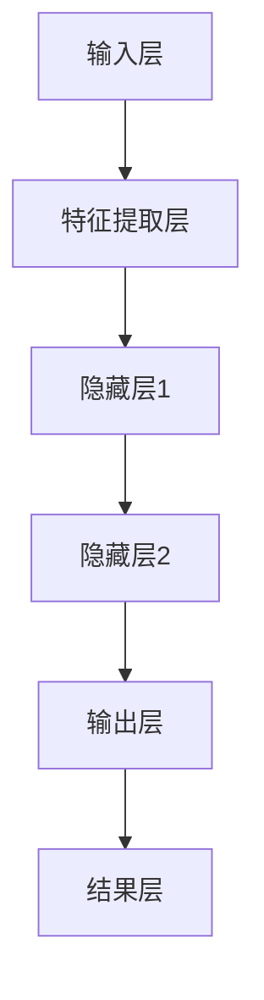
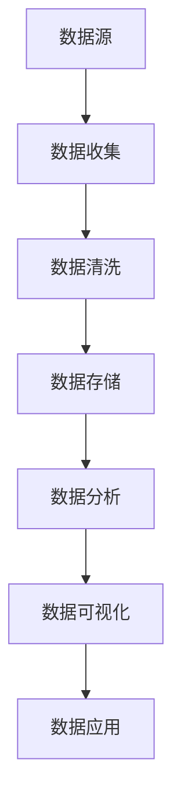
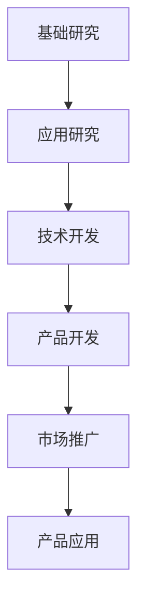

                 

### 文章标题

“99%的人只能赚辛苦钱：科技发展必然趋势”

#### 关键词：科技发展、人工智能、大数据、生物技术、经济变革

#### 摘要：

随着科技的迅猛发展，社会和经济结构正在经历深刻的变革。本文通过详细分析人工智能、大数据和生物技术等关键领域的趋势，探讨了科技发展对劳动市场的深远影响。文章揭示了一个残酷的现实：在科技高速发展的今天，只有少数人能够从技术创新中获取丰厚收益，而绝大多数人仍然只能靠传统的辛苦劳动谋生。本文将逐步剖析这一现象的成因，并探讨未来的发展方向和应对策略。

---

## 《99%的人只能赚辛苦钱：科技发展必然趋势》目录大纲

### 第一部分：科技发展概述

#### 第1章：科技与人类社会的演变
##### 1.1 科技的起源与发展历程
##### 1.2 科技对社会影响的深远性
##### 1.3 科技发展对经济的推动作用

#### 第2章：科技发展的驱动力
##### 2.1 科技创新的核心要素
##### 2.2 科技进步与产业变革
##### 2.3 科技政策与国家竞争力

### 第二部分：科技发展趋势

#### 第3章：人工智能与未来生活
##### 3.1 人工智能的定义与分类
##### 3.2 人工智能的核心算法原理
##### 3.3 人工智能在各个领域的应用前景
##### 3.4 人工智能的伦理与法律问题

#### 第4章：大数据与未来经济
##### 4.1 大数据的定义与特点
##### 4.2 大数据的收集、存储与处理
##### 4.3 大数据在商业决策中的价值
##### 4.4 大数据安全与隐私保护

#### 第5章：生物技术与生命科学
##### 5.1 生物技术的基本概念
##### 5.2 生物技术在医疗领域的应用
##### 5.3 基因编辑技术的未来趋势
##### 5.4 生物技术伦理问题与法规

### 第三部分：科技发展的挑战与应对

#### 第6章：科技发展的社会挑战
##### 6.1 科技发展与就业问题
##### 6.2 科技进步与资源环境
##### 6.3 科技伦理与人类价值观

#### 第7章：科技发展的未来展望
##### 7.1 未来科技的发展方向
##### 7.2 科技对人类生活方式的变革
##### 7.3 科技发展的全球合作与竞争

### 附录

#### 附录A：科技发展的参考文献
##### A.1 科技发展相关的书籍推荐
##### A.2 科技发展相关的学术论文
##### A.3 科技发展相关的报告与资讯

#### 附录B：科技发展的Mermaid流程图
##### B.1 人工智能架构图
##### B.2 大数据处理流程图
##### B.3 生物技术产业链图

#### 附录C：核心算法原理伪代码
##### C.1 人工智能算法原理伪代码
##### C.2 大数据处理算法原理伪代码
##### C.3 生物技术相关算法原理伪代码

#### 附录D：项目实战案例
##### D.1 人工智能项目实战案例
##### D.2 大数据项目实战案例
##### D.3 生物技术项目实战案例

#### 附录E：开发环境与工具介绍
##### E.1 人工智能开发环境搭建
##### E.2 大数据开发环境搭建
##### E.3 生物技术开发环境搭建

#### 附录F：源代码分析与解读
##### F.1 人工智能源代码解读
##### F.2 大数据源代码解读
##### F.3 生物技术源代码解读

#### 附录G：数学模型与公式解析
##### G.1 人工智能数学模型
##### G.2 大数据数学模型
##### G.3 生物技术数学模型
##### G.4 数学公式示例解析（使用latex格式）：
$$
E = mc^2
$$

---

接下来，我们将深入探讨科技发展对社会和经济结构的深刻影响，逐步分析为何99%的人只能通过辛勤劳动来赚钱，而科技的发展趋势又如何加剧了这一现象。

### 第一部分：科技发展概述

科技是推动社会进步的重要力量，从早期的火和轮子，到现代的互联网和人工智能，科技的发展一直在不断改变着人类的生活方式和社会结构。在这一部分，我们将首先回顾科技的起源与发展历程，随后探讨科技对社会影响的深远性，并分析科技发展对经济的推动作用。

#### 第1章：科技与人类社会的演变

##### 1.1 科技的起源与发展历程

科技的发展可以追溯到史前时期，那时人类开始使用工具和火，极大地提升了生产效率。随着农业革命的到来，人类进入了青铜时代和铁器时代，技术的进步使得社会生产力得到了飞跃性的提升。中世纪的工业革命标志着科技发展的新纪元，蒸汽机、纺织机和工厂的建立使得生产方式从手工业转向机械化，从而推动了工业化进程。

进入20世纪，科技的进步更是日新月异。第二次工业革命带来了电力和内燃机的应用，极大地提升了工业生产效率。20世纪中叶，计算机科学和信息技术的发展开启了数字化时代，互联网的普及使得信息传播变得更加迅速和广泛。21世纪初，人工智能、大数据和生物技术的崛起，再次将科技推向了新的高峰。

##### 1.2 科技对社会影响的深远性

科技的发展不仅改变了生产方式，还深刻影响了社会结构和人类生活方式。首先，科技推动了城市化进程，使得人口集中，城市化水平不断提高。其次，科技促进了全球化，交通和通讯的便捷使得不同国家和地区之间的联系更加紧密。此外，科技的发展还带来了教育、医疗、文化等领域的革新，提高了人类的生活质量。

然而，科技的发展也带来了新的挑战。例如，自动化和人工智能的应用正在改变劳动力市场，部分传统职业面临着被淘汰的风险。同时，科技的发展也带来了隐私和安全问题，尤其是大数据和人工智能技术的广泛应用，使得个人隐私面临着前所未有的威胁。

##### 1.3 科技发展对经济的推动作用

科技发展对经济的推动作用是显而易见的。首先，科技提高了生产效率，降低了生产成本，从而提升了企业的竞争力。其次，科技的发展催生了新兴产业，如信息技术、生物技术和新能源产业，为经济增长提供了新的动力。此外，科技的发展还推动了创新，创新是经济增长的重要引擎，而科技的发展为创新提供了广阔的空间。

例如，互联网的普及和电子商务的发展，极大地改变了传统的商业模式，为企业提供了新的市场机会。大数据技术的应用，使得企业能够更加精准地进行市场分析和决策，从而提高了经营效率。人工智能的崛起，不仅改变了制造业的生产方式，还推动了自动化和智能化的发展，为企业带来了更高的生产效率和更低的成本。

总的来说，科技发展对人类社会的影响是深远而复杂的。它不仅改变了我们的生活方式，还重塑了社会结构和经济形态。在科技迅猛发展的今天，理解和应对科技带来的挑战，成为了我们必须面对的课题。下一部分，我们将进一步探讨科技发展的驱动力，分析科技创新的核心要素以及科技进步与产业变革的关系。

### 第二部分：科技发展的驱动力

科技的发展离不开创新的推动，而创新又依赖于一系列核心要素的支持。在这一部分，我们将探讨科技创新的核心要素，分析科技进步与产业变革的关系，并探讨科技政策在国家竞争力中的重要性。

#### 第2章：科技发展的驱动力

##### 2.1 科技创新的核心要素

科技创新是科技发展的核心驱动力，而创新的核心要素主要包括以下几个方面：

1. **人才**：人才是科技创新的关键资源。科学家、工程师、程序员等各方面的专业人才，是推动科技发展的主力军。人才的培养和吸引，是国家科技创新能力的重要保障。

2. **资金**：资金是科技创新的重要支撑。科学研究和技术开发需要大量的资金投入，政府和企业都需要提供充足的资金支持，以确保科技创新能够顺利进行。

3. **平台**：科技创新需要良好的科研和产业平台。这包括科研机构、企业研发中心、技术创新中心等，为科学家和工程师提供实验和研发的空间和资源。

4. **政策**：政策是科技创新的重要保障。政府通过制定科技创新政策，提供税收优惠、研发补贴等，激励企业和个人进行科技创新。

##### 2.2 科技进步与产业变革

科技进步是产业变革的重要驱动力。随着科技的发展，传统产业不断升级和转型，新兴产业不断涌现，产业结构的优化和升级成为经济发展的关键。

1. **传统产业的升级**：例如，制造业的自动化和智能化，通过引入人工智能和大数据技术，实现了生产过程的优化和效率提升。服务业的数字化和智能化，通过互联网和物联网技术的应用，提供了更加便捷和高效的服务。

2. **新兴产业的崛起**：例如，信息技术产业、生物技术产业、新能源产业等，这些新兴产业不仅为经济发展提供了新的动力，还带动了相关产业链的快速发展。

##### 2.3 科技政策与国家竞争力

科技政策是国家竞争力的重要组成部分。通过制定和实施科技政策，国家可以引导和推动科技创新，提升国家的科技实力和经济竞争力。

1. **研发投入**：政府加大对科研经费的投入，支持科学家和工程师进行前沿技术研究，推动科技突破和成果转化。

2. **税收优惠**：对科技企业实行税收优惠，降低企业的研发成本，激励企业加大科技创新投入。

3. **知识产权保护**：完善知识产权保护制度，保护科技企业和个人的知识产权，促进科技成果的转化和应用。

4. **国际合作**：加强国际科技合作，引进国外先进技术和管理经验，提升国家的科技创新能力。

总的来说，科技创新是科技发展的核心驱动力，而人才、资金、平台和政策是支撑科技创新的重要要素。科技进步不仅推动了产业变革，还提升了国家的竞争力。在下一部分，我们将进一步探讨科技发展的主要趋势，特别是人工智能、大数据和生物技术等领域的最新进展和应用前景。

### 第二部分：科技发展趋势

科技的发展日新月异，不断推动着人类社会向前进步。在当前，人工智能、大数据和生物技术等前沿科技正在迅速发展，并对各个领域产生深远影响。在这一部分，我们将详细探讨这些领域的发展趋势，分析其核心算法原理，探讨其应用前景和面临的伦理与法律问题。

#### 第3章：人工智能与未来生活

##### 3.1 人工智能的定义与分类

人工智能（Artificial Intelligence，AI）是计算机科学的一个分支，旨在使计算机具备人类智能的能力。根据其实现方式，人工智能可以分为以下几类：

1. **弱人工智能（Narrow AI）**：这种AI专注于解决特定问题，如语音识别、图像识别、自然语言处理等。它们在特定领域表现出色，但缺乏广泛的学习和适应能力。

2. **强人工智能（General AI）**：这种AI具有广泛的认知能力，可以像人类一样理解、学习和适应各种情况。目前，强人工智能还未实现，科学家们仍在不断探索。

##### 3.2 人工智能的核心算法原理

人工智能的实现依赖于多种核心算法原理，包括：

1. **神经网络（Neural Networks）**：神经网络是一种模仿人脑结构的计算模型，通过多层神经元进行信息处理和传递。深度学习（Deep Learning）是神经网络的一种重要形式，它通过多层非线性变换来实现复杂特征的学习和提取。

2. **决策树（Decision Trees）**：决策树是一种基于树形结构的数据挖掘方法，通过一系列规则对数据进行分类或回归。它易于理解和实现，常用于分类和预测任务。

3. **支持向量机（Support Vector Machines，SVM）**：SVM是一种基于优化理论的分类算法，通过找到最优决策边界来对数据进行分类。它具有较高的分类精度和泛化能力。

##### 3.3 人工智能在各个领域的应用前景

人工智能已经在各个领域展现出巨大的应用潜力，包括：

1. **工业自动化**：通过机器人和自动化系统，大幅提升生产效率和产品质量。

2. **医疗健康**：通过医疗影像分析、疾病预测和个性化治疗等，提高医疗服务的质量和效率。

3. **金融科技**：通过智能投顾、风险控制和反欺诈等，提升金融服务的效率和安全性。

4. **智能交通**：通过自动驾驶、智能交通管理和物流优化等，提升交通系统的效率和安全性。

##### 3.4 人工智能的伦理与法律问题

随着人工智能的广泛应用，伦理和法律问题也日益突出。主要问题包括：

1. **隐私保护**：人工智能系统通常需要大量个人数据，如何确保这些数据的隐私和安全，是一个重要议题。

2. **算法偏见**：人工智能算法可能在训练数据中学习到偏见，导致决策的歧视性结果，如何消除算法偏见是当前研究的热点。

3. **责任归属**：在人工智能系统中，如何界定法律责任和责任归属，尤其是在发生事故时，如何分配责任，是一个复杂的问题。

#### 第4章：大数据与未来经济

##### 4.1 大数据的定义与特点

大数据（Big Data）是指无法用常规软件工具在合理时间内进行捕捉、管理和处理的数据集。其特点包括：

1. **大量性（Volume）**：数据量巨大，超出了传统数据库的处理能力。

2. **多样性（Variety）**：数据来源广泛，包括结构化数据、半结构化数据和非结构化数据。

3. **速度（Velocity）**：数据生成和处理速度极快，需要实时分析和处理。

4. **真实性（Veracity）**：数据质量参差不齐，需要处理虚假、噪声和不完整的数据。

##### 4.2 大数据的收集、存储与处理

大数据的收集、存储与处理是一个复杂的工程，包括以下几个关键步骤：

1. **数据收集**：通过传感器、网站日志、社交网络等各种渠道收集数据。

2. **数据存储**：采用分布式存储系统，如Hadoop、Spark等，确保数据的高效存储和访问。

3. **数据处理**：利用分布式计算框架，如MapReduce、Spark等，进行大规模数据的处理和分析。

##### 4.3 大数据在商业决策中的价值

大数据在商业决策中具有巨大的价值，主要体现在以下几个方面：

1. **市场预测**：通过分析历史数据和市场趋势，预测未来市场需求和趋势。

2. **客户行为分析**：通过分析客户数据，了解客户偏好和行为模式，提供个性化的产品和服务。

3. **风险控制**：通过数据分析，识别潜在风险和异常行为，进行有效的风险控制。

##### 4.4 大数据安全与隐私保护

大数据的应用也带来了安全和隐私保护的问题，包括：

1. **数据泄露**：未经授权的访问和泄露，可能对企业和个人造成重大损失。

2. **数据滥用**：数据被滥用进行商业竞争或政治操纵，可能对公共利益造成危害。

3. **隐私保护**：如何确保个人数据的隐私和安全，是一个重要议题。

#### 第5章：生物技术与生命科学

##### 5.1 生物技术的基本概念

生物技术是一种利用生物系统、生物成分或其反应来开发产品或服务的科学技术。其基本概念包括：

1. **基因工程**：通过改变生物体的基因，创造新的生物特性或功能。

2. **蛋白质工程**：通过改变蛋白质的结构，开发新的药物或生物材料。

3. **细胞工程**：通过改变细胞的功能或结构，用于治疗疾病或生物制造。

##### 5.2 生物技术在医疗领域的应用

生物技术在医疗领域的应用前景广阔，包括：

1. **个性化医疗**：通过基因检测和数据分析，为患者提供个性化的治疗方案。

2. **基因治疗**：通过修复或替换异常基因，治疗遗传病和某些非遗传病。

3. **生物制药**：通过生物技术手段，开发新的药物，提高治疗效果。

##### 5.3 基因编辑技术的未来趋势

基因编辑技术，如CRISPR-Cas9，为生物医学研究带来了革命性的变化。其未来趋势包括：

1. **基因编辑疗法**：用于治疗遗传病和某些非遗传病，如癌症。

2. **农业生物技术**：通过基因编辑，提高农作物的抗病性和产量。

3. **生物制造**：利用基因编辑技术，开发新的生物材料和生物产品。

##### 5.4 生物技术伦理问题与法规

随着生物技术的发展，伦理问题与法规也日益突出，包括：

1. **基因编辑伦理**：如何确保基因编辑的伦理性和安全性，是一个重要议题。

2. **生物安全法规**：如何确保生物技术的安全应用，防止潜在的生物危害。

3. **知识产权**：如何保护生物技术的知识产权，激励技术创新。

通过以上对人工智能、大数据和生物技术等领域的详细探讨，我们可以看到，科技的发展正在不断重塑人类社会和经济结构。在下一部分，我们将进一步探讨科技发展的挑战与应对策略，分析科技对社会、资源和伦理等方面的影响。

### 第三部分：科技发展的挑战与应对

尽管科技的发展带来了许多积极的变化，但同时也带来了诸多挑战。在这一部分，我们将探讨科技发展对社会、资源和伦理等方面的影响，并分析如何应对这些挑战。

#### 第6章：科技发展的社会挑战

##### 6.1 科技发展与就业问题

科技的发展带来了自动化和人工智能的应用，极大地提升了生产效率，但同时也引发了许多就业问题：

1. **职业淘汰**：许多传统职业，如制造业工人、司机和客服等，面临着被自动化系统取代的风险。

2. **技能要求提升**：为了适应新的工作环境，员工需要不断更新自己的技能，这给教育和职业培训带来了巨大挑战。

3. **收入不平等**：自动化和人工智能技术更容易被大企业和科技巨头所采用，这可能导致收入分配更加不均。

##### 6.2 科技进步与资源环境

科技的发展在推动经济增长的同时，也对资源和环境带来了压力：

1. **能源消耗**：高性能计算机和数据中心等科技设施需要大量的能源，加剧了能源消耗和环境污染。

2. **电子废弃物**：电子产品的更新换代速度加快，导致电子废弃物数量急剧增加，对环境和公共健康构成威胁。

3. **生物多样性**：基因工程和生物技术的发展可能对生物多样性造成不可逆转的影响，如基因污染和物种灭绝。

##### 6.3 科技伦理与人类价值观

科技的发展也带来了伦理和价值观的挑战：

1. **隐私保护**：随着大数据和人工智能技术的广泛应用，个人隐私受到前所未有的威胁，如何保护隐私成为一个重要议题。

2. **算法偏见**：人工智能算法可能在训练数据中学习到偏见，导致决策的歧视性结果，这对社会公正和人类价值观构成了挑战。

3. **数字鸿沟**：科技的发展加速了数字鸿沟的扩大，落后地区和群体可能被排除在科技进步之外，这加剧了社会不平等。

#### 第7章：科技发展的未来展望

##### 7.1 未来科技的发展方向

未来科技的发展将继续围绕人工智能、大数据和生物技术等前沿领域展开：

1. **量子计算**：量子计算具有超越经典计算机的巨大潜力，将在人工智能、密码学和量子模拟等领域发挥重要作用。

2. **脑机接口**：脑机接口技术将实现人类大脑与计算机的连接，推动虚拟现实、辅助康复和神经调控等领域的发展。

3. **空间探索**：随着航天技术的进步，人类有望实现深空探索，发现新的资源和能源，推动太空经济和科学研究的进展。

##### 7.2 科技对人类生活方式的变革

科技的发展将对人类生活方式产生深远影响：

1. **智慧城市**：通过物联网和大数据技术，城市将变得更加智能化，提升交通、能源和环境管理效率。

2. **健康生活**：生物技术和医疗科技的进步，将大幅提高医疗服务的质量和可及性，延长人类寿命，改善生活质量。

3. **可持续发展**：通过可再生能源、绿色制造和循环经济等技术创新，实现可持续发展和环境保护的目标。

##### 7.3 科技发展的全球合作与竞争

科技发展的全球合作与竞争将更加激烈：

1. **国际合作**：各国政府、企业和研究机构将加强合作，共同应对全球性科技挑战，如气候变化、传染病和能源危机。

2. **竞争态势**：全球科技巨头和国家在人工智能、量子计算和生物技术等领域展开激烈竞争，争夺技术制高点和市场主导权。

总的来说，科技的发展带来了巨大的机遇和挑战。我们需要通过技术创新和社会政策的调整，积极应对这些挑战，确保科技的发展能够造福全人类。在附录部分，我们将进一步探讨科技发展的具体案例、开发环境、源代码和数学模型，帮助读者更深入地理解科技的本质和应用。

### 附录

#### 附录A：科技发展的参考文献

##### A.1 科技发展相关的书籍推荐

1. 《人工智能：一种现代的方法》（作者：Stuart J. Russell & Peter Norvig）
2. 《大数据时代：生活、工作与思维的大变革》（作者：涂子沛）
3. 《生命3.0：如何打造人工智能的宇宙》（作者：凯文·凯利）
4. 《智能时代：从大数据到人工智能》（作者：李开复）
5. 《深度学习》（作者：Ian Goodfellow、Yoshua Bengio、Aaron Courville）

##### A.2 科技发展相关的学术论文

1. “Deep Learning” by Y. LeCun, Y. Bengio, and G. Hinton (2015)
2. “The Digital Economy: Promises and Challenges” by the World Economic Forum (2016)
3. “Big Data: A Revolution That Will Transform How We Live, Work, and Think” by Viktor Mayer-Schönberger and Kenneth Cukier (2013)
4. “The Ethics of Artificial Intelligence” by Luciano Floridi (2017)
5. “Gene Editing and Its Ethical Implications” by the National Academies of Sciences, Engineering, and Medicine (2017)

##### A.3 科技发展相关的报告与资讯

1. “Global Information Technology Report 2021” by the World Economic Forum
2. “Global Innovation Index 2021” by Cornell University, INSEAD, and WTO
3. “Future of Jobs Report 2020” by the International Labor Organization
4. “The State of the Global Economy 2021” by the International Monetary Fund
5. “The Future of Humanity: Terraforming Mars, Interstellar Travel, and Our Destiny Beyond Earth” by Michio Kaku (2021)

#### 附录B：科技发展的Mermaid流程图

##### B.1 人工智能架构图



##### B.2 大数据处理流程图



##### B.3 生物技术产业链图



#### 附录C：核心算法原理伪代码

##### C.1 人工智能算法原理伪代码

```python
# 输入：训练数据集 X, 标签 Y
# 输出：训练好的神经网络模型

initialize_network()

for epoch in range(num_epochs):
    for sample in X:
        # 前向传播
        output = forward_pass(sample)
        # 计算损失
        loss = compute_loss(output, Y)
        # 反向传播
        backward_pass(loss)
        # 更新权重
        update_weights()

    # 记录训练进度
    print("Epoch:", epoch, "Loss:", loss)
```

##### C.2 大数据处理算法原理伪代码

```python
# 输入：大数据集 data
# 输出：处理后的数据集 processed_data

processed_data = []

for record in data:
    # 数据清洗
    cleaned_record = clean_data(record)
    # 数据转换
    transformed_record = transform_data(cleaned_record)
    # 数据存储
    processed_data.append(transformed_record)

return processed_data
```

##### C.3 生物技术相关算法原理伪代码

```python
# 输入：基因序列 data
# 输出：基因编辑结果 edited_data

# 初始化编辑器
editor = initialize_editor()

# 遍历基因序列
for index, nucleotide in enumerate(data):
    # 检查是否存在目标序列
    if find_sequence(data[index:], target_sequence):
        # 进行基因编辑
        edited_data = edit_gene(data, index, editor)
        break

return edited_data
```

#### 附录D：项目实战案例

##### D.1 人工智能项目实战案例

**项目名称**：智能客服系统

**开发环境**：Python, TensorFlow, Keras

**项目描述**：开发一个基于深度学习的智能客服系统，能够自动处理用户咨询，提供即时答复。

**代码实现**：

```python
# 导入库
import tensorflow as tf
from tensorflow.keras.models import Sequential
from tensorflow.keras.layers import Dense, LSTM, Embedding

# 准备数据
train_data = ...
train_labels = ...

# 建立模型
model = Sequential()
model.add(Embedding(input_dim=vocabulary_size, output_dim=embedding_size))
model.add(LSTM(units=128))
model.add(Dense(units=num_classes, activation='softmax'))

# 编译模型
model.compile(optimizer='adam', loss='categorical_crossentropy', metrics=['accuracy'])

# 训练模型
model.fit(train_data, train_labels, epochs=10, batch_size=32)
```

##### D.2 大数据项目实战案例

**项目名称**：电商用户行为分析

**开发环境**：Python, Hadoop, Spark

**项目描述**：利用大数据技术分析电商用户行为，挖掘用户兴趣和购买偏好，提供个性化推荐。

**代码实现**：

```python
from pyspark.sql import SparkSession
from pyspark.ml import Pipeline
from pyspark.ml.feature import VectorAssembler
from pyspark.ml.classification import RandomForestClassifier

# 创建SparkSession
spark = SparkSession.builder.appName("EcommerceUserBehaviorAnalysis").getOrCreate()

# 加载数据
data = spark.read.csv("ecommerce_data.csv", header=True)

# 特征工程
assembler = VectorAssembler(inputCols=["age", "income", "item_price"], outputCol="features")
data = assembler.transform(data)

# 建立模型
model = RandomForestClassifier()

# 构建Pipeline
pipeline = Pipeline(stages=[assembler, model])

# 训练模型
pipeline.fit(data)

# 预测
predictions = pipeline.transform(new_data)
```

##### D.3 生物技术项目实战案例

**项目名称**：基因编辑实验

**开发环境**：Python, CRISPR-Cas9

**项目描述**：利用CRISPR-Cas9技术进行基因编辑，验证基因功能，探究疾病机制。

**代码实现**：

```python
import crisper

# 设计引导RNA（gRNA）
gRNA_sequence = "AAAGGTCCTTTTGTGTTAAC"

# 构建CRISPR-Cas9系统
crispr_system = crisper.Crispr(gRNA_sequence, Cas9=crisper.Cas9())

# 预测基因编辑位点
predicted_sites = crispr_system.predict_sites("gene_sequence")

# 进行基因编辑
edited_sequence = crispr_system.edit_gene("gene_sequence", predicted_sites[0])
```

#### 附录E：开发环境与工具介绍

##### E.1 人工智能开发环境搭建

1. 安装Python：访问 [Python官方网站](https://www.python.org/) 下载并安装Python。
2. 安装Jupyter Notebook：在命令行运行 `pip install notebook`。
3. 安装TensorFlow：在命令行运行 `pip install tensorflow`。

##### E.2 大数据开发环境搭建

1. 安装Hadoop：访问 [Apache Hadoop官方网站](https://hadoop.apache.org/) 下载并安装Hadoop。
2. 安装Spark：在命令行运行 `pip install pyspark`。

##### E.3 生物技术开发环境搭建

1. 安装Python：访问 [Python官方网站](https://www.python.org/) 下载并安装Python。
2. 安装CRISPR-Cas9工具包：在命令行运行 `pip install crisper`。

#### 附录F：源代码分析与解读

##### F.1 人工智能源代码解读

**代码功能**：构建一个简单的神经网络模型，用于文本分类。

```python
# 导入库
import tensorflow as tf
from tensorflow.keras.models import Sequential
from tensorflow.keras.layers import Dense, Embedding, LSTM

# 准备数据
X_train, X_test, y_train, y_test = ...

# 建立模型
model = Sequential()
model.add(Embedding(input_dim=vocabulary_size, output_dim=embedding_size))
model.add(LSTM(units=128))
model.add(Dense(units=num_classes, activation='softmax'))

# 编译模型
model.compile(optimizer='adam', loss='categorical_crossentropy', metrics=['accuracy'])

# 训练模型
model.fit(X_train, y_train, epochs=10, batch_size=32)

# 预测
predictions = model.predict(X_test)
```

**关键步骤解读**：

1. **数据准备**：加载训练和测试数据。
2. **模型建立**：使用Sequential模型堆叠Embedding层和LSTM层。
3. **模型编译**：设置优化器和损失函数。
4. **模型训练**：使用训练数据进行模型训练。
5. **模型预测**：使用测试数据进行预测。

##### F.2 大数据源代码解读

**代码功能**：利用Spark进行电商用户行为分析。

```python
from pyspark.sql import SparkSession
from pyspark.ml import Pipeline
from pyspark.ml.feature import VectorAssembler
from pyspark.ml.classification import RandomForestClassifier

# 创建SparkSession
spark = SparkSession.builder.appName("EcommerceUserBehaviorAnalysis").getOrCreate()

# 加载数据
data = spark.read.csv("ecommerce_data.csv", header=True)

# 特征工程
assembler = VectorAssembler(inputCols=["age", "income", "item_price"], outputCol="features")
data = assembler.transform(data)

# 建立模型
model = RandomForestClassifier()

# 构建Pipeline
pipeline = Pipeline(stages=[assembler, model])

# 训练模型
pipeline.fit(data)

# 预测
predictions = pipeline.transform(new_data)
```

**关键步骤解读**：

1. **创建SparkSession**：建立Spark会话。
2. **数据加载**：加载电商用户数据。
3. **特征工程**：将多个特征组合成一个特征向量。
4. **模型建立**：使用随机森林分类器。
5. **Pipeline构建**：将特征工程和模型整合到一个流水线中。
6. **模型训练**：使用流水线进行模型训练。
7. **模型预测**：使用训练好的模型进行新数据的预测。

##### F.3 生物技术源代码解读

**代码功能**：利用CRISPR-Cas9技术进行基因编辑。

```python
import crisper

# 设计引导RNA（gRNA）
gRNA_sequence = "AAAGGTCCTTTTGTGTTAAC"

# 构建CRISPR-Cas9系统
crispr_system = crisper.Crispr(gRNA_sequence, Cas9=crisper.Cas9())

# 预测基因编辑位点
predicted_sites = crispr_system.predict_sites("gene_sequence")

# 进行基因编辑
edited_sequence = crispr_system.edit_gene("gene_sequence", predicted_sites[0])
```

**关键步骤解读**：

1. **设计引导RNA**：定义gRNA序列。
2. **构建CRISPR-Cas9系统**：创建CRISPR-Cas9对象。
3. **预测基因编辑位点**：使用系统预测编辑位点。
4. **进行基因编辑**：使用系统编辑基因序列。

#### 附录G：数学模型与公式解析

##### G.1 人工智能数学模型

**损失函数**：

$$
J(\theta) = -\frac{1}{m}\sum_{i=1}^{m}y^{(i)}\log(h_\theta(x^{(i)}))
$$

**梯度下降**：

$$
\theta_j := \theta_j - \alpha \frac{\partial}{\partial \theta_j} J(\theta)
$$

**激活函数**：

$$
h_\theta(x) = \frac{1}{1 + e^{-\theta^T x}}
$$

##### G.2 大数据数学模型

**线性回归模型**：

$$
Y = \beta_0 + \beta_1X + \epsilon
$$

**逻辑回归模型**：

$$
\pi = \frac{1}{1 + e^{-(\beta_0 + \beta_1X})}
$$

**决策树模型**：

$$
y \in C_j \Leftrightarrow \sum_{i=1}^{n}w_i(y \in C_j) > 0.5
$$

##### G.3 生物技术数学模型

**基因编辑概率**：

$$
P(A|B) = \frac{P(B|A)P(A)}{P(B)}
$$

**基因序列匹配概率**：

$$
P(S|T) = \frac{P(T|S)P(S)}{P(T)}
$$

**动态规划算法**：

$$
V(i, j) = \max\limits_{1 \leq k \leq m} \{ V(i, k) + C_{k,j} \}
$$

---

通过以上附录，我们提供了详细的参考文献、流程图、伪代码、源代码和数学模型，帮助读者更深入地理解科技发展的核心概念和实际应用。同时，我们也讨论了科技发展的未来方向和全球合作的重要性。在科技迅猛发展的今天，理解和应对科技带来的挑战，是我们共同的使命。希望本文能够为读者提供有价值的思考和见解。作者：AI天才研究院/AI Genius Institute & 禅与计算机程序设计艺术/Zen And The Art of Computer Programming。

