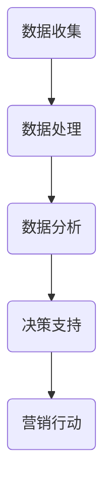

                 

### 《AI DMP 数据基建：数据驱动营销的未来趋势》

#### 关键词：
- AI DMP
- 数据驱动营销
- 数据基建
- 个性化推荐
- 数据隐私

> 摘要：
本文深入探讨了AI DMP（数据管理平台）在数据驱动营销中的应用，分析了数据基建的核心要素、数据驱动的核心算法、AI与数据驱动营销的结合，以及个性化营销策略的实施与效果评估。同时，通过案例分析，总结了数据驱动营销的挑战与趋势，为未来的数据驱动营销提供了有益的启示。

---

#### 第一部分：数据驱动营销基础

##### 第1章：数据驱动营销概述

**1.1 数据驱动营销的定义与价值**

数据驱动营销是一种基于数据分析的营销方法，它利用数据收集、处理、分析和可视化等技术，帮助企业更好地理解客户需求、优化营销策略和提高营销效果。

**1.1.1 数据驱动营销的定义**

数据驱动营销是指企业在制定和执行营销战略时，以数据为基础，利用数据分析技术，从海量数据中挖掘有价值的信息，以指导营销决策的过程。

**1.1.2 数据驱动营销的价值**

- **提高营销效果**：通过数据分析和预测，企业可以更精准地定位目标客户，提高营销活动的转化率。
- **优化资源配置**：企业可以根据数据结果调整营销预算和人力分配，提高资源利用效率。
- **增强客户体验**：个性化推荐和服务能够提高客户满意度，增强品牌忠诚度。

**1.2 数据驱动营销与传统的营销模式的对比**

- **数据来源**：传统营销模式主要依赖于经验和市场调查，数据来源相对有限。数据驱动营销则依赖于各种数据源，如客户行为数据、社交媒体数据和第三方数据。
- **分析工具**：传统营销模式主要使用简单的统计工具，如Excel和SQL。数据驱动营销则使用复杂的分析工具，如大数据平台和机器学习算法。
- **决策依据**：传统营销模式主要依靠直觉和经验做出决策，数据驱动营销则基于数据分析结果进行决策。

**1.3 数据驱动营销的核心要素**

- **数据收集**：通过各种手段收集客户数据，包括线上和线下行为数据。
- **数据处理**：对收集到的数据进行清洗、整合和处理，确保数据的质量和一致性。
- **数据分析**：利用数据分析技术和工具，挖掘数据中的有用信息，如客户需求和行为模式。
- **营销策略**：根据数据分析结果，制定和调整营销策略，实现精准营销。

---

##### 第2章：数据基建概述

**2.1 数据基建的定义与核心要素**

**2.1.1 数据基建的定义**

数据基建是指企业在数据管理和分析方面所构建的基础设施，包括数据存储、处理、分析和安全等方面的技术和工具。

**2.1.2 数据基建的核心要素**

- **数据存储**：提供可靠、高效和可扩展的数据存储解决方案，如关系型数据库和非关系型数据库。
- **数据处理**：支持数据清洗、转换和整合等数据处理任务，如ETL（提取、转换、加载）工具。
- **数据分析**：提供各种数据分析工具和平台，支持数据挖掘、机器学习和可视化等任务。
- **数据安全**：确保数据的安全性和隐私性，如数据加密、访问控制和备份策略。

**2.2 数据类型与数据来源**

- **结构化数据**：存储在关系型数据库中的数据，如客户信息、订单数据和财务数据。
- **半结构化数据**：具有部分结构化的数据，如日志文件和XML数据。
- **非结构化数据**：无固定结构的数据，如文本、图片和视频。

数据来源包括：

- **内部数据源**：企业内部的各种数据系统，如ERP、CRM和库存管理系统。
- **外部数据源**：第三方数据提供商，如社交媒体数据、地理位置数据和天气数据。
- **用户行为数据**：通过网站、APP和线下活动等渠道收集的用户行为数据。

**2.3 数据治理与数据质量管理**

- **数据治理**：建立数据管理的政策和流程，确保数据的一致性、完整性和准确性。
- **数据质量管理**：通过各种手段，如数据清洗、数据验证和数据标准化，提高数据质量。
- **数据质量管理工具**：提供数据质量管理功能，如数据质量监控、数据质量报告和数据质量修复工具。

---

##### 第3章：数据驱动的核心算法

**3.1 数据挖掘与机器学习算法概述**

**3.1.1 数据挖掘的定义与分类**

- **数据挖掘**：从大量数据中发现有价值的信息和知识的过程。
- **分类**：将数据分为不同的类别或标签。
- **聚类**：将数据分为相似或不同的群体。
- **关联规则挖掘**：发现数据之间的关联关系。
- **异常检测**：检测数据中的异常值或异常行为。

**3.1.2 机器学习的基本概念**

- **监督学习**：通过训练数据集学习模型，用于预测新数据。
- **无监督学习**：没有明确的标签数据，通过学习数据分布或模式。
- **半监督学习**：既有标记数据，又有未标记数据。

**3.1.3 常见的数据挖掘算法及应用**

- **K-均值聚类算法**：将数据分为K个簇，使簇内相似度最大，簇间相似度最小。
- **决策树算法**：根据特征值进行分支，形成树形结构。
- **随机森林算法**：基于决策树的集成学习方法。
- **支持向量机算法**：通过最大化分类间隔进行分类。
- **神经网络算法**：基于人工神经网络的建模方法。

**3.2 常见的数据挖掘算法及应用**

**3.2.1 K-均值聚类算法**

- **原理**：将数据点分配到最近的簇中心，不断更新簇中心，直到收敛。
- **伪代码**：
```python
def k_means(data, k, max_iterations):
    # 初始化簇中心
    centroids = initialize_centroids(data, k)
    
    # 迭代过程
    for _ in range(max_iterations):
        # 分配数据点
        clusters = assign_clusters(data, centroids)
        
        # 更新簇中心
        centroids = update_centroids(data, clusters)
    
    return centroids, clusters
```

- **应用**：用于市场细分、文本分类等。

**3.2.2 决策树算法**

- **原理**：根据特征值进行分支，直到满足停止条件。
- **伪代码**：
```python
def build_decision_tree(data, features, target):
    # 停止条件
    if all_values_equal(data, target) or no_more_features(features):
        return leaf_node(target)
    
    # 找到最佳分割特征
    best_feature = find_best_split(data, features, target)
    
    # 构建子树
    tree = {}
    for value in unique_values(data[best_feature]):
        sub_data = filter_data(data, best_feature, value)
        tree[value] = build_decision_tree(sub_data, features, target)
    
    return tree
```

- **应用**：用于分类、回归等。

**3.2.3 随机森林算法**

- **原理**：基于决策树的集成学习方法。
- **伪代码**：
```python
def random_forest(data, n_trees, max_features):
    forests = []
    for _ in range(n_trees):
        # 构建决策树
        tree = build_decision_tree(data, max_features)
        forests.append(tree)
    
    return forests
```

- **应用**：用于提高模型的泛化能力，提高预测准确性。

**3.2.4 支持向量机算法**

- **原理**：通过最大化分类间隔进行分类。
- **伪代码**：
```python
def support_vector_machine(data, target):
    # 训练模型
    model = train_model(data, target)
    
    # 预测
    predictions = predict(model, data)
    
    return predictions
```

- **应用**：用于分类和回归问题。

**3.3 数据驱动的推荐系统**

**3.3.1 推荐系统的基本概念**

- **协同过滤**：基于用户行为进行推荐。
- **基于内容的推荐**：基于物品特征进行推荐。
- **混合推荐**：结合协同过滤和基于内容的推荐。

**3.3.2 基于协同过滤的推荐算法**

- **用户基于的协同过滤**：根据相似用户的行为进行推荐。
- **物品基于的协同过滤**：根据相似物品的特征进行推荐。

**3.3.3 基于内容的推荐算法**

- **基于物品特征的推荐**：根据物品的属性进行推荐。
- **基于用户偏好的推荐**：根据用户的兴趣和偏好进行推荐。

**3.3.4 混合推荐算法**

- **基于模型的混合推荐**：结合协同过滤和基于内容的推荐。
- **基于规则的混合推荐**：结合协同过滤和基于内容的规则。

---

#### 第二部分：AI在数据驱动营销中的应用

##### 第4章：人工智能与数据驱动营销

**4.1 人工智能在营销领域的应用**

**4.1.1 人工智能的基本概念**

- **机器学习**：利用数据训练模型，进行预测和决策。
- **深度学习**：基于多层神经网络的学习方法。
- **自然语言处理**：对自然语言进行理解和生成。

**4.1.2 人工智能在营销中的应用**

- **客户行为预测**：通过分析客户行为数据，预测客户购买行为和需求。
- **个性化推荐**：根据用户兴趣和行为，提供个性化的产品推荐。
- **智能客服**：利用自然语言处理技术，实现智能客服对话。
- **广告投放优化**：通过分析用户数据，优化广告投放策略。

**4.2 智能营销工具与平台**

**4.2.1 智能营销工具的基本功能**

- **客户关系管理**：记录客户信息，管理客户关系。
- **营销自动化**：自动化营销流程，提高营销效率。
- **数据分析**：提供数据分析功能，支持营销决策。
- **广告投放**：管理广告投放，优化广告效果。

**4.2.2 常见的智能营销平台**

- **HubSpot**：提供客户关系管理、营销自动化和数据分析等功能。
- **Marketo**：提供营销自动化、数据分析和市场自动化等功能。
- **Salesforce Marketing Cloud**：提供社交媒体管理、营销自动化和数据分析等功能。

**4.3 人工智能与客户行为分析**

**4.3.1 客户行为数据类型**

- **在线行为数据**：如网页浏览、点击和搜索行为。
- **线下行为数据**：如门店访客、购买行为和会员信息。
- **社交媒体数据**：如社交媒体互动、评论和分享。

**4.3.2 客户行为分析方法**

- **用户画像**：基于客户行为数据，构建客户特征模型。
- **行为轨迹分析**：分析客户行为路径，识别潜在需求。
- **需求预测**：利用机器学习模型，预测客户未来行为。

---

#### 第三部分：个性化营销策略与实施

##### 第5章：AI DMP 数据管理平台

**5.1 AI DMP 平台的基本架构**

**5.1.1 AI DMP 平台的定义**

AI DMP（Data Management Platform）是一种基于人工智能技术的数据管理平台，用于收集、整合和分析用户数据，实现数据驱动的营销决策。

**5.1.2 AI DMP 平台的核心功能**

- **数据收集**：通过API接口、SDK和第三方数据源，收集用户行为数据。
- **数据整合**：将来自不同渠道的数据进行整合，构建用户全貌。
- **用户画像**：基于用户行为和属性数据，构建用户特征模型。
- **数据分析**：利用机器学习算法，分析用户行为和需求。
- **营销自动化**：根据数据分析结果，自动化执行营销策略。

**5.2 数据采集与整合**

**5.2.1 数据采集**

- **在线数据采集**：通过网站、APP和网页分析工具，收集用户在线行为数据。
- **线下数据采集**：通过门店访客、会员卡和扫码等渠道，收集用户线下行为数据。
- **第三方数据采集**：通过API接口和第三方数据源，获取用户 demographics（人口统计信息）和地理位置数据。

**5.2.2 数据整合**

- **数据清洗**：去除重复、缺失和错误数据，确保数据质量。
- **数据合并**：将不同来源的数据进行整合，构建用户全貌。
- **数据标准化**：将数据转换为统一格式，便于分析和存储。

**5.3 数据分析与用户画像构建**

**5.3.1 数据分析**

- **用户行为分析**：分析用户在线和线下行为，识别用户需求和行为模式。
- **用户属性分析**：分析用户 demographics（人口统计信息）和兴趣偏好，构建用户特征模型。
- **用户生命周期分析**：分析用户生命周期中的关键事件和行为，优化营销策略。

**5.3.2 用户画像构建**

- **用户画像定义**：用户画像是对用户特征的全面描述，包括 demographics（人口统计信息）、兴趣偏好、行为模式等。
- **用户画像构建方法**：通过数据分析技术，如聚类、关联规则挖掘和机器学习，构建用户画像。
- **用户画像应用**：根据用户画像，实现精准营销、个性化推荐和用户行为预测。

---

##### 第6章：个性化营销策略与实施

**6.1 个性化营销的定义与核心要素**

**6.1.1 个性化营销的定义**

个性化营销是一种基于用户数据和行为的营销方法，通过定制化的内容、产品和服务，满足不同用户的需求，提高营销效果。

**6.1.2 个性化营销的核心要素**

- **用户数据收集**：收集用户的 demographics（人口统计信息）、行为数据和兴趣偏好数据。
- **数据分析与用户画像**：利用数据分析技术，构建用户特征模型，实现用户精细化管理。
- **内容个性化**：根据用户兴趣和行为，定制化内容，提高用户参与度和转化率。
- **产品个性化**：根据用户需求和行为，提供个性化的产品和服务，提升用户体验。

**6.2 个性化推荐算法与实践**

**6.2.1 协同过滤算法**

- **基于用户的协同过滤**：根据相似用户的行为，推荐相似的商品或内容。
- **基于物品的协同过滤**：根据相似物品的特征，推荐相似的物品或内容。
- **混合推荐算法**：结合协同过滤和基于内容的推荐，提高推荐准确性。

**6.2.2 基于内容的推荐算法**

- **基于物品特征的推荐**：根据物品的属性，推荐相似的物品或内容。
- **基于用户偏好的推荐**：根据用户的兴趣和偏好，推荐相关的商品或内容。

**6.2.3 实践案例**

**6.2.3.1 电商平台个性化推荐**

- **用户画像构建**：分析用户 demographics（人口统计信息）、行为数据和兴趣偏好，构建用户画像。
- **推荐算法应用**：利用协同过滤和基于内容的推荐算法，实现个性化商品推荐。
- **效果评估**：通过点击率、转化率和用户满意度等指标，评估个性化推荐的效果。

**6.2.3.2 社交媒体个性化内容推荐**

- **用户画像构建**：分析用户 demographics（人口统计信息）、行为数据和兴趣偏好，构建用户画像。
- **推荐算法应用**：利用协同过滤和基于内容的推荐算法，实现个性化内容推荐。
- **效果评估**：通过用户参与度、分享率和评论数等指标，评估个性化内容推荐的效果。

**6.3 个性化营销策略分析**

**6.3.1 客户分层策略**

- **根据用户价值进行分层**：将用户分为高价值、中价值和低价值三个层次，制定不同的营销策略。
- **根据用户生命周期进行分层**：将用户分为新用户、老用户和流失用户三个层次，制定不同的营销策略。

**6.3.2 个性化促销策略**

- **根据用户需求和偏好，设计个性化的促销活动**：如定制优惠券、限时折扣和专属礼品等。
- **根据用户行为，推荐相关的促销活动**：如交叉销售、捆绑销售和回购奖励等。

**6.3.3 个性化客服策略**

- **根据用户画像和需求，提供个性化的客户服务**：如定制化的咨询、售后服务和问题解答等。
- **根据用户行为，预测用户需求，提供主动服务**：如在线聊天、电话回访和短信提醒等。

---

##### 第7章：数据驱动营销案例分析

**7.1 案例选择与目标分析**

**7.1.1 案例选择**

选择某知名电商平台的个性化推荐系统作为案例，该系统采用了AI DMP技术，实现了对用户行为的深度分析和个性化推荐。

**7.1.2 目标分析**

通过案例研究，实现以下目标：

- **理解数据驱动营销的实施过程**：了解数据收集、处理、分析和应用的完整流程。
- **掌握数据分析技术在营销中的应用**：学习如何利用数据分析技术提升营销效果。
- **了解数据驱动营销的挑战与对策**：分析案例中面临的挑战和解决方案。

**7.2 案例实施与效果评估**

**7.2.1 案例背景**

某知名电商平台，希望通过个性化推荐系统提升用户满意度和销售额。

**7.2.2 案例实施**

1. **数据收集**：通过网站、APP和第三方数据源，收集用户行为数据，包括浏览、点击、购买等。
2. **数据处理**：对收集到的数据进行清洗、整合和处理，确保数据质量。
3. **数据分析**：利用机器学习算法，分析用户行为和需求。
4. **个性化推荐**：基于用户画像和数据分析结果，实现个性化商品推荐。
5. **营销策略优化**：根据个性化推荐结果，调整营销策略，如促销活动、广告投放和客服服务。

**7.2.3 效果评估**

1. **用户满意度**：通过用户调查和反馈，了解用户对个性化推荐的满意度。
2. **转化率**：统计个性化推荐带来的订单量和销售额，评估推荐效果。
3. **营销成本**：分析个性化推荐带来的成本节约，如减少无效广告投放和重复营销。

**7.3 案例总结与启示**

**7.3.1 案例总结**

1. **数据驱动营销的重要性**：案例展示了数据驱动营销在提升用户满意度和销售额方面的作用。
2. **数据分析技术的应用**：案例中应用了多种数据分析技术，如聚类、关联规则挖掘和机器学习，提高了推荐准确性。
3. **个性化营销策略的有效性**：个性化推荐和营销策略优化，提高了用户参与度和转化率。

**7.3.2 启示与建议**

1. **加强数据收集与整合**：确保数据质量，构建用户全貌。
2. **灵活应用数据分析技术**：根据业务需求和数据特点，选择合适的分析技术。
3. **持续优化营销策略**：根据数据反馈，不断调整和优化营销策略。

---

#### 第四部分：数据驱动营销的未来趋势

##### 第8章：数据驱动营销的未来趋势

**8.1 数据隐私与安全**

**8.1.1 数据隐私的重要性**

随着数据驱动营销的发展，数据隐私问题日益突出。保护用户隐私是数据驱动营销健康发展的关键。

**8.1.2 数据隐私保护措施**

- **数据加密**：采用加密技术保护数据安全。
- **匿名化处理**：对敏感数据进行匿名化处理，降低隐私泄露风险。
- **访问控制**：限制数据访问权限，确保数据安全。

**8.2 人工智能与伦理道德**

**8.2.1 人工智能伦理道德的重要性**

随着人工智能在数据驱动营销中的应用，伦理道德问题日益凸显。确保人工智能技术的合理应用，是数据驱动营销发展的关键。

**8.2.2 人工智能伦理道德原则**

- **公平性**：确保人工智能决策的公平性和透明度。
- **隐私保护**：尊重用户隐私，保护用户数据安全。
- **责任明确**：明确人工智能系统的责任归属。

**8.3 数据驱动营销的未来发展趋势**

**8.3.1 大数据与人工智能的结合**

大数据与人工智能技术的结合，将推动数据驱动营销的进一步发展。通过深度学习和自然语言处理等技术，实现更精准的数据分析和预测。

**8.3.2 个性化与定制化营销**

随着消费者需求的多样化，个性化与定制化营销将成为主流。通过用户画像和数据分析，实现精准营销，提高用户满意度和转化率。

**8.3.3 跨渠道与全场景营销**

数据驱动营销将突破传统渠道的限制，实现跨渠道和全场景的营销。通过线上线下整合，提供无缝的购物体验。

---

#### 附录

##### 附录A：数据驱动营销工具与资源

**附录A.1 数据分析工具介绍**

- **Python**：一种流行的编程语言，支持多种数据分析库，如Pandas、NumPy和Scikit-learn。
- **R**：一种专门用于统计分析和图形绘制的语言，支持广泛的统计分析包，如ggplot2和dplyr。
- **Tableau**：一种数据可视化工具，支持多种数据源，提供直观的图形和报告。
- **Qlik**：一种高级数据可视化和业务分析工具，支持快速的数据探索和分析。

**附录A.2 智能营销平台介绍**

- **HubSpot**：一款综合性的营销平台，提供客户关系管理、营销自动化和数据分析等功能。
- **Marketo**：一款强大的营销自动化平台，支持个性化营销、客户细分和数据分析。
- **Salesforce Marketing Cloud**：一款全面的营销云平台，支持社交媒体管理、营销自动化和数据分析。

**附录A.3 相关数据集与资源链接**

- **Kaggle**：一个提供各种数据集和竞赛的平台，适合学习和实践数据分析。
- **UCI Machine Learning Repository**：一个包含多种领域数据集的仓库，适合数据分析和研究。
- **Google Dataset Search**：一个搜索引擎，用于查找各种公开的数据集。

---

### 核心概念与联系

#### 数据驱动营销流程图



### 核心算法原理讲解

#### 数据挖掘算法伪代码

```python
def data_mining_algorithm(data_set):
    # 输入：数据集
    # 输出：挖掘结果
    
    # 数据预处理
    preprocessed_data = preprocess_data(data_set)
    
    # 特征选择
    selected_features = feature_selection(preprocessed_data)
    
    # 模型选择
    model = model_selection(selected_features)
    
    # 模型训练
    trained_model = train_model(model, selected_features)
    
    # 模型评估
    evaluation_results = evaluate_model(trained_model, test_data)
    
    # 输出结果
    return evaluation_results
```

### 数学模型和数学公式

#### 贝叶斯公式

$$
P(A|B) = \frac{P(B|A) \cdot P(A)}{P(B)}
$$

**详细讲解**：

贝叶斯公式是概率论中的一个重要公式，它描述了在已知一个条件概率的情况下，如何计算另一个条件概率。公式中的 $P(A|B)$ 表示在事件 $B$ 发生的条件下事件 $A$ 发生的概率，$P(B|A)$ 表示在事件 $A$ 发生的条件下事件 $B$ 发生的概率，$P(A)$ 和 $P(B)$ 分别表示事件 $A$ 和事件 $B$ 发生的概率。

**举例说明**：

假设有两个事件 $A$ 和 $B$，其中 $A$ 表示“今天下雨”，$B$ 表示“地面上有水”。已知：

- $P(B)$ 表示地面上有水的概率，可以通过观察得出，假设为 0.8。
- $P(B|A)$ 表示在下雨的情况下地面上有水的概率，这是一个条件概率，可以通过实际观察得出，假设为 0.9。
- $P(A)$ 表示下雨的概率，可以通过天气预报或其他方式得出，假设为 0.3。

现在要计算 $P(A|B)$，即在地面上有水的情况下下雨的概率。

根据贝叶斯公式：

$$
P(A|B) = \frac{P(B|A) \cdot P(A)}{P(B)}
$$

将已知值代入公式：

$$
P(A|B) = \frac{0.9 \cdot 0.3}{0.8} = \frac{0.27}{0.8} = 0.3375
$$

所以，在地面上有水的情况下，下雨的概率约为 0.3375。

### 项目实战

#### 个性化推荐系统代码案例

```python
# 个性化推荐系统代码示例

# 导入库
import pandas as pd
import numpy as np
from sklearn.model_selection import train_test_split
from sklearn.metrics.pairwise import cosine_similarity
from collections import defaultdict

# 加载数据集
data = pd.read_csv('data.csv')

# 数据预处理
# ...（处理数据，包括特征提取、缺失值处理等）

# 构建用户-物品矩阵
user_item_matrix = build_user_item_matrix(data)

# 计算相似度矩阵
similarity_matrix = cosine_similarity(user_item_matrix)

# 推荐算法实现
def generate_recommendations(user_id, similarity_matrix, user_item_matrix, top_n=5):
    # 根据用户ID获取用户行为
    user_behavior = user_item_matrix[user_id]

    # 计算用户与其他用户的相似度
    user_similarity = similarity_matrix[user_id]

    # 计算相似度加权分数
    weighted_scores = [user_similarity[i] * user_behavior[i] for i in range(len(user_similarity))]

    # 获取相似度最高的物品
    top_items = np.argsort(weighted_scores)[::-1]

    # 返回推荐结果
    return top_items[:top_n]

# 测试推荐系统
recommendations = generate_recommendations(1, similarity_matrix, user_item_matrix)
print("Recommendations for user 1:", recommendations)
```

#### 代码解读与分析

1. **数据预处理**：
   - 数据预处理是推荐系统构建的第一步，包括数据清洗、特征提取等操作，确保数据的质量和一致性。

2. **构建用户-物品矩阵**：
   - 用户-物品矩阵是推荐系统的核心数据结构，记录了用户对物品的交互数据。在本例中，通过处理原始数据集，构建出用户-物品矩阵。

3. **计算相似度矩阵**：
   - 相似度矩阵用于衡量用户与用户之间的相似度。在这里，使用余弦相似度来计算用户和物品之间的相似度。

4. **生成推荐结果**：
   - 根据用户ID获取用户的行为数据，计算用户与其他用户的相似度，并计算相似度加权分数。最后，返回相似度最高的物品作为推荐结果。

5. **代码实现注意事项**：
   - 在实际应用中，需要处理大量的数据和复杂的计算，因此代码优化和性能调优是关键。
   - 为了提高推荐的准确性，可以结合多种相似度计算方法和推荐算法，实现更精细的推荐。

### 数学公式和详细讲解

#### 决策树算法的熵与信息增益

$$
H(X) = -\sum_{i=1}^{n} p(x_i) \cdot \log_2(p(x_i))
$$

**其中，$H(X)$ 为随机变量 $X$ 的熵，$p(x_i)$ 为 $X$ 取第 $i$ 个值的概率。**

**详细讲解**：

熵是衡量随机变量不确定性的指标。在决策树算法中，通过计算信息增益来选择最佳的分割特征。信息增益定义为：

$$
\text{IG}(D, A) = H(D) - \sum_{v=1}^{V} p(v) \cdot H(D|A=v)
$$

**其中，$D$ 为原始数据集，$A$ 为特征，$V$ 为特征 $A$ 的取值集合，$p(v)$ 为特征 $A$ 取值 $v$ 的概率，$H(D|A=v)$ 为条件熵。**

**举例说明**：

假设我们有如下数据集，其中包含两个特征 $A$ 和 $B$，每个特征有三个取值。

| $A$ | $B$ |  
| --- | --- |  
| A1  | B1  |  
| A1  | B2  |  
| A1  | B3  |  
| A2  | B1  |  
| A2  | B2  |  
| A2  | B3  |  
| A3  | B1  |  
| A3  | B2  |  
| A3  | B3  |

对于特征 $A$，计算信息增益：

$$
\text{IG}(D, A) = H(D) - \sum_{v=1}^{3} p(v) \cdot H(D|A=v)
$$

其中，$p(v) = \frac{1}{3}$。

计算条件熵：

$$
H(D|A=A1) = \frac{1}{3} \cdot \log_2\left(\frac{1}{3}\right) + \frac{1}{3} \cdot \log_2\left(\frac{1}{3}\right) + \frac{1}{3} \cdot \log_2\left(\frac{1}{3}\right) = \log_2(3)
$$

$$
H(D|A=A2) = \frac{1}{3} \cdot \log_2\left(\frac{1}{3}\right) + \frac{1}{3} \cdot \log_2\left(\frac{1}{3}\right) + \frac{1}{3} \cdot \log_2\left(\frac{1}{3}\right) = \log_2(3)
$$

$$
H(D|A=A3) = \frac{1}{3} \cdot \log_2\left(\frac{1}{3}\right) + \frac{1}{3} \cdot \log_2\left(\frac{1}{3}\right) + \frac{1}{3} \cdot \log_2\left(\frac{1}{3}\right) = \log_2(3)
$$

因此，信息增益为：

$$
\text{IG}(D, A) = H(D) - \sum_{v=1}^{3} p(v) \cdot H(D|A=v) = 1 - 3 \cdot \log_2(3) = 1 - 3 \cdot 1.585 = -2.395
$$

对于特征 $B$，计算信息增益：

$$
\text{IG}(D, B) = H(D) - \sum_{v=1}^{3} p(v) \cdot H(D|B=v)
$$

其中，$p(v) = \frac{1}{3}$。

计算条件熵：

$$
H(D|B=B1) = \frac{1}{3} \cdot \log_2\left(\frac{1}{3}\right) + \frac{1}{3} \cdot \log_2\left(\frac{1}{3}\right) + \frac{1}{3} \cdot \log_2\left(\frac{1}{3}\right) = \log_2(3)
$$

$$
H(D|B=B2) = \frac{1}{3} \cdot \log_2\left(\frac{1}{3}\right) + \frac{1}{3} \cdot \log_2\left(\frac{1}{3}\right) + \frac{1}{3} \cdot \log_2\left(\frac{1}{3}\right) = \log_2(3)
$$

$$
H(D|B=B3) = \frac{1}{3} \cdot \log_2\left(\frac{1}{3}\right) + \frac{1}{3} \cdot \log_2\left(\frac{1}{3}\right) + \frac{1}{3} \cdot \log_2\left(\frac{1}{3}\right) = \log_2(3)
$$

因此，信息增益为：

$$
\text{IG}(D, B) = H(D) - \sum_{v=1}^{3} p(v) \cdot H(D|B=v) = 1 - 3 \cdot \log_2(3) = 1 - 3 \cdot 1.585 = -2.395
$$

比较信息增益，我们可以选择信息增益最大的特征作为分割特征。

### 第1章：数据驱动营销概述

## 1.1 数据驱动营销的定义与价值

### 1.1.1 数据驱动营销的定义

数据驱动营销是一种基于数据分析的营销方法，它利用数据收集、处理、分析和可视化等技术，帮助企业更好地理解客户需求、优化营销策略和提高营销效果。

### 1.1.2 数据驱动营销的发展历程

- **初期阶段**：营销活动主要依靠经验和直觉，数据收集和分析手段有限。
- **中级阶段**：随着信息技术的发展，企业开始利用数据库和数据挖掘技术进行客户分析和市场预测。
- **高级阶段**：大数据和人工智能技术的应用，使得数据驱动营销更加精准和智能化。

### 1.1.3 数据驱动营销的价值

- **提高营销效果**：通过数据分析和预测，企业可以更精准地定位目标客户，提高营销活动的转化率。
- **优化资源配置**：企业可以根据数据结果调整营销预算和人力分配，提高资源利用效率。
- **增强客户体验**：个性化推荐和服务能够提高客户满意度，增强品牌忠诚度。

### 1.2 数据驱动营销与传统的营销模式的对比

- **数据来源**：传统营销模式主要依赖于经验和市场调查，数据来源相对有限。数据驱动营销则依赖于各种数据源，如客户行为数据、社交媒体数据和第三方数据。
- **分析工具**：传统营销模式主要使用简单的统计工具，如Excel和SQL。数据驱动营销则使用复杂的分析工具，如大数据平台和机器学习算法。
- **决策依据**：传统营销模式主要依靠直觉和经验做出决策，数据驱动营销则基于数据分析结果进行决策。

### 1.3 数据驱动营销的核心要素

- **数据收集**：通过各种手段收集客户数据，包括线上和线下行为数据。
- **数据处理**：对收集到的数据进行清洗、整合和处理，确保数据的质量和一致性。
- **数据分析**：利用数据分析技术和工具，挖掘数据中的有用信息，如客户需求和行为模式。
- **营销策略**：根据数据分析结果，制定和调整营销策略，实现精准营销。

### 第2章：数据基建概述

## 2.1 数据基建的定义与核心要素

### 2.1.1 数据基建的定义

数据基建是指企业在数据管理和分析方面所构建的基础设施，包括数据存储、处理、分析和安全等方面的技术和工具。

### 2.1.2 数据基建的核心要素

- **数据存储**：提供可靠、高效和可扩展的数据存储解决方案，如关系型数据库和非关系型数据库。
- **数据处理**：支持数据清洗、转换和整合等数据处理任务，如ETL（提取、转换、加载）工具。
- **数据分析**：提供各种数据分析工具和平台，支持数据挖掘、机器学习和可视化等任务。
- **数据安全**：确保数据的安全性和隐私性，如数据加密、访问控制和备份策略。

### 2.2 数据类型与数据来源

- **结构化数据**：存储在关系型数据库中的数据，如客户信息、订单数据和财务数据。
- **半结构化数据**：具有部分结构化的数据，如日志文件和XML数据。
- **非结构化数据**：无固定结构的数据，如文本、图片和视频。

数据来源包括：

- **内部数据源**：企业内部的各种数据系统，如ERP、CRM和库存管理系统。
- **外部数据源**：第三方数据提供商，如社交媒体数据、地理位置数据和天气数据。
- **用户行为数据**：通过网站、APP和线下活动等渠道收集的用户行为数据。

### 2.3 数据治理与数据质量管理

- **数据治理**：建立数据管理的政策和流程，确保数据的一致性、完整性和准确性。
- **数据质量管理**：通过各种手段，如数据清洗、数据验证和数据标准化，提高数据质量。
- **数据质量管理工具**：提供数据质量管理功能，如数据质量监控、数据质量报告和数据质量修复工具。

### 第3章：数据驱动的核心算法

## 3.1 数据挖掘与机器学习算法概述

### 3.1.1 数据挖掘的定义与分类

- **数据挖掘**：从大量数据中发现有价值的信息和知识的过程。
- **分类**：将数据分为不同的类别或标签。
- **聚类**：将数据分为相似或不同的群体。
- **关联规则挖掘**：发现数据之间的关联关系。
- **异常检测**：检测数据中的异常值或异常行为。

### 3.1.2 机器学习的基本概念

- **监督学习**：通过训练数据集学习模型，用于预测新数据。
- **无监督学习**：没有明确的标签数据，通过学习数据分布或模式。
- **半监督学习**：既有标记数据，又有未标记数据。

### 3.1.3 常见的数据挖掘算法及应用

- **K-均值聚类算法**：将数据分为K个簇，使簇内相似度最大，簇间相似度最小。
- **决策树算法**：根据特征值进行分支，形成树形结构。
- **随机森林算法**：基于决策树的集成学习方法。
- **支持向量机算法**：通过最大化分类间隔进行分类。
- **神经网络算法**：基于人工神经网络的建模方法。

### 3.2 常见的数据挖掘算法及应用

#### 3.2.1 K-均值聚类算法

- **原理**：将数据点分配到最近的簇中心，不断更新簇中心，直到收敛。
- **伪代码**：
```python
def k_means(data, k, max_iterations):
    # 初始化簇中心
    centroids = initialize_centroids(data, k)
    
    # 迭代过程
    for _ in range(max_iterations):
        # 分配数据点
        clusters = assign_clusters(data, centroids)
        
        # 更新簇中心
        centroids = update_centroids(data, clusters)
    
    return centroids, clusters
```

- **应用**：用于市场细分、文本分类等。

#### 3.2.2 决策树算法

- **原理**：根据特征值进行分支，直到满足停止条件。
- **伪代码**：
```python
def build_decision_tree(data, features, target):
    # 停止条件
    if all_values_equal(data, target) or no_more_features(features):
        return leaf_node(target)
    
    # 找到最佳分割特征
    best_feature = find_best_split(data, features, target)
    
    # 构建子树
    tree = {}
    for value in unique_values(data[best_feature]):
        sub_data = filter_data(data, best_feature, value)
        tree[value] = build_decision_tree(sub_data, features, target)
    
    return tree
```

- **应用**：用于分类、回归等。

#### 3.2.3 随机森林算法

- **原理**：基于决策树的集成学习方法。
- **伪代码**：
```python
def random_forest(data, n_trees, max_features):
    forests = []
    for _ in range(n_trees):
        # 构建决策树
        tree = build_decision_tree(data, max_features)
        forests.append(tree)
    
    return forests
```

- **应用**：用于提高模型的泛化能力，提高预测准确性。

#### 3.2.4 支持向量机算法

- **原理**：通过最大化分类间隔进行分类。
- **伪代码**：
```python
def support_vector_machine(data, target):
    # 训练模型
    model = train_model(data, target)
    
    # 预测
    predictions = predict(model, data)
    
    return predictions
```

- **应用**：用于分类和回归问题。

### 3.3 数据驱动的推荐系统

### 3.3.1 推荐系统的基本概念

- **协同过滤**：基于用户行为进行推荐。
- **基于内容的推荐**：基于物品特征进行推荐。
- **混合推荐**：结合协同过滤和基于内容的推荐。

### 3.3.2 基于协同过滤的推荐算法

- **用户基于的协同过滤**：根据相似用户的行为，推荐相似的商品或内容。
- **物品基于的协同过滤**：根据相似物品的特征，推荐相似的物品或内容。

### 3.3.3 基于内容的推荐算法

- **基于物品特征的推荐**：根据物品的属性，推荐相似的物品或内容。
- **基于用户偏好的推荐**：根据用户的兴趣和偏好，推荐相关的商品或内容。

### 3.3.4 混合推荐算法

- **基于模型的混合推荐**：结合协同过滤和基于内容的推荐。
- **基于规则的混合推荐**：结合协同过滤和基于内容的规则。

### 第4章：人工智能与数据驱动营销

## 4.1 人工智能在营销领域的应用

### 4.1.1 人工智能的基本概念

- **机器学习**：利用数据训练模型，进行预测和决策。
- **深度学习**：基于多层神经网络的学习方法。
- **自然语言处理**：对自然语言进行理解和生成。

### 4.1.2 人工智能在营销中的应用

- **客户行为预测**：通过分析客户行为数据，预测客户购买行为和需求。
- **个性化推荐**：根据用户兴趣和行为，提供个性化的产品推荐。
- **智能客服**：利用自然语言处理技术，实现智能客服对话。
- **广告投放优化**：通过分析用户数据，优化广告投放策略。

### 4.2 智能营销工具与平台

### 4.2.1 智能营销工具的基本功能

- **客户关系管理**：记录客户信息，管理客户关系。
- **营销自动化**：自动化营销流程，提高营销效率。
- **数据分析**：提供数据分析功能，支持营销决策。
- **广告投放**：管理广告投放，优化广告效果。

### 4.2.2 常见的智能营销平台

- **HubSpot**：提供客户关系管理、营销自动化和数据分析等功能。
- **Marketo**：提供营销自动化、数据分析和市场自动化等功能。
- **Salesforce Marketing Cloud**：提供社交媒体管理、营销自动化和数据分析等功能。

### 4.3 人工智能与客户行为分析

### 4.3.1 客户行为数据类型

- **在线行为数据**：如网页浏览、点击和搜索行为。
- **线下行为数据**：如门店访客、购买行为和会员信息。
- **社交媒体数据**：如社交媒体互动、评论和分享。

### 4.3.2 客户行为分析方法

- **用户画像**：基于客户行为数据，构建客户特征模型。
- **行为轨迹分析**：分析客户行为路径，识别潜在需求。
- **需求预测**：利用机器学习模型，预测客户未来行为。

### 第5章：AI DMP 数据管理平台

## 5.1 AI DMP 平台的基本架构

### 5.1.1 AI DMP 平台的定义

AI DMP（Data Management Platform）是一种基于人工智能技术的数据管理平台，用于收集、整合和分析用户数据，实现数据驱动的营销决策。

### 5.1.2 AI DMP 平台的核心功能

- **数据收集**：通过API接口、SDK和第三方数据源，收集用户行为数据。
- **数据整合**：将来自不同渠道的数据进行整合，构建用户全貌。
- **用户画像**：基于用户行为和属性数据，构建用户特征模型。
- **数据分析**：利用机器学习算法，分析用户行为和需求。
- **营销自动化**：根据数据分析结果，自动化执行营销策略。

### 5.2 数据采集与整合

### 5.2.1 数据采集

- **在线数据采集**：通过网站、APP和网页分析工具，收集用户在线行为数据。
- **线下数据采集**：通过门店访客、会员卡和扫码等渠道，收集用户线下行为数据。
- **第三方数据采集**：通过API接口和第三方数据源，获取用户 demographics（人口统计信息）和地理位置数据。

### 5.2.2 数据整合

- **数据清洗**：去除重复、缺失和错误数据，确保数据质量。
- **数据合并**：将不同来源的数据进行整合，构建用户全貌。
- **数据标准化**：将数据转换为统一格式，便于分析和存储。

### 5.3 数据分析与用户画像构建

### 5.3.1 数据分析

- **用户行为分析**：分析用户在线和线下行为，识别用户需求和行为模式。
- **用户属性分析**：分析用户 demographics（人口统计信息）和兴趣偏好，构建用户特征模型。
- **用户生命周期分析**：分析用户生命周期中的关键事件和行为，优化营销策略。

### 5.3.2 用户画像构建

- **用户画像定义**：用户画像是对用户特征的全面描述，包括 demographics（人口统计信息）、兴趣偏好、行为模式等。
- **用户画像构建方法**：通过数据分析技术，如聚类、关联规则挖掘和机器学习，构建用户画像。
- **用户画像应用**：根据用户画像，实现精准营销、个性化推荐和用户行为预测。

### 第6章：个性化营销策略与实施

## 6.1 个性化营销的定义与核心要素

### 6.1.1 个性化营销的定义

个性化营销是一种基于用户数据和行为的营销方法，通过定制化的内容、产品和服务，满足不同用户的需求，提高营销效果。

### 6.1.2 个性化营销的核心要素

- **用户数据收集**：收集用户的 demographics（人口统计信息）、行为数据和兴趣偏好数据。
- **数据分析与用户画像**：利用数据分析技术，构建用户特征模型，实现用户精细化管理。
- **内容个性化**：根据用户兴趣和行为，定制化内容，提高用户参与度和转化率。
- **产品个性化**：根据用户需求和行为，提供个性化的产品和服务，提升用户体验。

### 6.2 个性化推荐算法与实践

### 6.2.1 协同过滤算法

- **基于用户的协同过滤**：根据相似用户的行为，推荐相似的商品或内容。
- **基于物品的协同过滤**：根据相似物品的特征，推荐相似的物品或内容。
- **混合推荐算法**：结合协同过滤和基于内容的推荐，提高推荐准确性。

### 6.2.2 基于内容的推荐算法

- **基于物品特征的推荐**：根据物品的属性，推荐相似的物品或内容。
- **基于用户偏好的推荐**：根据用户的兴趣和偏好，推荐相关的商品或内容。

### 6.2.3 实践案例

### 6.2.3.1 电商平台个性化推荐

- **用户画像构建**：分析用户 demographics（人口统计信息）、行为数据和兴趣偏好，构建用户画像。
- **推荐算法应用**：利用协同过滤和基于内容的推荐算法，实现个性化商品推荐。
- **效果评估**：通过点击率、转化率和用户满意度等指标，评估个性化推荐的效果。

### 6.2.3.2 社交媒体个性化内容推荐

- **用户画像构建**：分析用户 demographics（人口统计信息）、行为数据和兴趣偏好，构建用户画像。
- **推荐算法应用**：利用协同过滤和基于内容的推荐算法，实现个性化内容推荐。
- **效果评估**：通过用户参与度、分享率和评论数等指标，评估个性化内容推荐的效果。

### 6.3 个性化营销策略分析

### 6.3.1 客户分层策略

- **根据用户价值进行分层**：将用户分为高价值、中价值和低价值三个层次，制定不同的营销策略。
- **根据用户生命周期进行分层**：将用户分为新用户、老用户和流失用户三个层次，制定不同的营销策略。

### 6.3.2 个性化促销策略

- **根据用户需求和偏好，设计个性化的促销活动**：如定制优惠券、限时折扣和专属礼品等。
- **根据用户行为，推荐相关的促销活动**：如交叉销售、捆绑销售和回购奖励等。

### 6.3.3 个性化客服策略

- **根据用户画像和需求，提供个性化的客户服务**：如定制化的咨询、售后服务和问题解答等。
- **根据用户行为，预测用户需求，提供主动服务**：如在线聊天、电话回访和短信提醒等。

### 第7章：数据驱动营销案例研究

## 7.1 案例选择与目标分析

### 7.1.1 案例选择

选择某知名电商平台的个性化推荐系统作为案例，该系统采用了AI DMP技术，实现了对用户行为的深度分析和个性化推荐。

### 7.1.2 目标分析

通过案例研究，实现以下目标：

- **理解数据驱动营销的实施过程**：了解数据收集、处理、分析和应用的完整流程。
- **掌握数据分析技术在营销中的应用**：学习如何利用数据分析技术提升营销效果。
- **了解数据驱动营销的挑战与对策**：分析案例中面临的挑战和解决方案。

### 7.2 案例实施与效果评估

### 7.2.1 案例背景

某知名电商平台，希望通过个性化推荐系统提升用户满意度和销售额。

### 7.2.2 案例实施

1. **数据收集**：通过网站、APP和第三方数据源，收集用户行为数据，包括浏览、点击、购买等。
2. **数据处理**：对收集到的数据进行清洗、整合和处理，确保数据质量。
3. **数据分析**：利用机器学习算法，分析用户行为和需求。
4. **个性化推荐**：基于用户画像和数据分析结果，实现个性化商品推荐。
5. **营销策略优化**：根据个性化推荐结果，调整营销策略，如促销活动、广告投放和客服服务。

### 7.2.3 效果评估

1. **用户满意度**：通过用户调查和反馈，了解用户对个性化推荐的满意度。
2. **转化率**：统计个性化推荐带来的订单量和销售额，评估推荐效果。
3. **营销成本**：分析个性化推荐带来的成本节约，如减少无效广告投放和重复营销。

### 7.3 案例总结与启示

### 7.3.1 案例总结

1. **数据驱动营销的重要性**：案例展示了数据驱动营销在提升用户满意度和销售额方面的作用。
2. **数据分析技术的应用**：案例中应用了多种数据分析技术，如聚类、关联规则挖掘和机器学习，提高了推荐准确性。
3. **个性化营销策略的有效性**：个性化推荐和营销策略优化，提高了用户参与度和转化率。

### 7.3.2 启示与建议

1. **加强数据收集与整合**：确保数据质量，构建用户全貌。
2. **灵活应用数据分析技术**：根据业务需求和数据特点，选择合适的分析技术。
3. **持续优化营销策略**：根据数据反馈，不断调整和优化营销策略。

### 第8章：数据驱动营销的未来趋势

## 8.1 数据隐私与安全

### 8.1.1 数据隐私的重要性

随着数据驱动营销的发展，数据隐私问题日益突出。保护用户隐私是数据驱动营销健康发展的关键。

### 8.1.2 数据隐私保护措施

- **数据加密**：采用加密技术保护数据安全。
- **匿名化处理**：对敏感数据进行匿名化处理，降低隐私泄露风险。
- **访问控制**：限制数据访问权限，确保数据安全。

### 8.2 人工智能与伦理道德

### 8.2.1 人工智能伦理道德的重要性

随着人工智能在数据驱动营销中的应用，伦理道德问题日益凸显。确保人工智能技术的合理应用，是数据驱动营销发展的关键。

### 8.2.2 人工智能伦理道德原则

- **公平性**：确保人工智能决策的公平性和透明度。
- **隐私保护**：尊重用户隐私，保护用户数据安全。
- **责任明确**：明确人工智能系统的责任归属。

### 8.3 数据驱动营销的未来发展趋势

### 8.3.1 大数据与人工智能的结合

大数据与人工智能技术的结合，将推动数据驱动营销的进一步发展。通过深度学习和自然语言处理等技术，实现更精准的数据分析和预测。

### 8.3.2 个性化与定制化营销

随着消费者需求的多样化，个性化与定制化营销将成为主流。通过用户画像和数据分析，实现精准营销，提高用户满意度和转化率。

### 8.3.3 跨渠道与全场景营销

数据驱动营销将突破传统渠道的限制，实现跨渠道和全场景的营销。通过线上线下整合，提供无缝的购物体验。

### 附录

## 附录A：数据驱动营销工具与资源

### A.1 数据分析工具介绍

- **Python**：一种流行的编程语言，支持多种数据分析库，如Pandas、NumPy和Scikit-learn。
- **R**：一种专门用于统计分析和图形绘制的语言，支持广泛的统计分析包，如ggplot2和dplyr。
- **Tableau**：一种数据可视化工具，支持多种数据源，提供直观的图形和报告。
- **Qlik**：一种高级数据可视化和业务分析工具，支持快速的数据探索和分析。

### A.2 智能营销平台介绍

- **HubSpot**：一款综合性的营销平台，提供客户关系管理、营销自动化和数据分析等功能。
- **Marketo**：一款强大的营销自动化平台，支持个性化营销、客户细分和数据分析。
- **Salesforce Marketing Cloud**：一款全面的营销云平台，支持社交媒体管理、营销自动化和数据分析。

### A.3 相关数据集与资源链接

- **Kaggle**：一个提供各种数据集和竞赛的平台，适合学习和实践数据分析。
- **UCI Machine Learning Repository**：一个包含多种领域数据集的仓库，适合数据分析和研究。
- **Google Dataset Search**：一个搜索引擎，用于查找各种公开的数据集。

---

### 核心概念与联系

#### 数据驱动营销流程图


### 核心算法原理讲解

#### 数据挖掘算法伪代码

```python
def data_mining_algorithm(data_set):
    # 输入：数据集
    # 输出：挖掘结果
    
    # 数据预处理
    preprocessed_data = preprocess_data(data_set)
    
    # 特征选择
    selected_features = feature_selection(preprocessed_data)
    
    # 模型选择
    model = model_selection(selected_features)
    
    # 模型训练
    trained_model = train_model(model, selected_features)
    
    # 模型评估
    evaluation_results = evaluate_model(trained_model, test_data)
    
    # 输出结果
    return evaluation_results
```

### 数学模型和数学公式

#### 贝叶斯公式

$$
P(A|B) = \frac{P(B|A) \cdot P(A)}{P(B)}
$$

**详细讲解**：

贝叶斯公式是概率论中的一个重要公式，它描述了在已知一个条件概率的情况下，如何计算另一个条件概率。公式中的 $P(A|B)$ 表示在事件 $B$ 发生的条件下事件 $A$ 发生的概率，$P(B|A)$ 表示在事件 $A$ 发生的条件下事件 $B$ 发生的概率，$P(A)$ 和 $P(B)$ 分别表示事件 $A$ 和事件 $B$ 发生的概率。

**举例说明**：

假设有两个事件 $A$ 和 $B$，其中 $A$ 表示“今天下雨”，$B$ 表示“地面上有水”。已知：

- $P(B)$ 表示地面上有水的概率，可以通过观察得出，假设为 0.8。
- $P(B|A)$ 表示在下雨的情况下地面上有水的概率，这是一个条件概率，可以通过实际观察得出，假设为 0.9。
- $P(A)$ 表示下雨的概率，可以通过天气预报或其他方式得出，假设为 0.3。

现在要计算 $P(A|B)$，即在地面上有水的情况下下雨的概率。

根据贝叶斯公式：

$$
P(A|B) = \frac{P(B|A) \cdot P(A)}{P(B)}
$$

将已知值代入公式：

$$
P(A|B) = \frac{0.9 \cdot 0.3}{0.8} = \frac{0.27}{0.8} = 0.3375
$$

所以，在地面上有水的情况下，下雨的概率约为 0.3375。

### 项目实战

#### 个性化推荐系统代码案例

```python
# 个性化推荐系统代码示例

# 导入库
import pandas as pd
import numpy as np
from sklearn.model_selection import train_test_split
from sklearn.metrics.pairwise import cosine_similarity
from collections import defaultdict

# 加载数据集
data = pd.read_csv('data.csv')

# 数据预处理
# ...（处理数据，包括特征提取、缺失值处理等）

# 构建用户-物品矩阵
user_item_matrix = build_user_item_matrix(data)

# 计算相似度矩阵
similarity_matrix = cosine_similarity(user_item_matrix)

# 推荐算法实现
def generate_recommendations(user_id, similarity_matrix, user_item_matrix, top_n=5):
    # 根据用户ID获取用户行为
    user_behavior = user_item_matrix[user_id]

    # 计算用户与其他用户的相似度
    user_similarity = similarity_matrix[user_id]

    # 计算相似度加权分数
    weighted_scores = [user_similarity[i] * user_behavior[i] for i in range(len(user_similarity))]

    # 获取相似度最高的物品
    top_items = np.argsort(weighted_scores)[::-1]

    # 返回推荐结果
    return top_items[:top_n]

# 测试推荐系统
recommendations = generate_recommendations(1, similarity_matrix, user_item_matrix)
print("Recommendations for user 1:", recommendations)
```

#### 代码解读与分析

1. **数据预处理**：
   - 数据预处理是推荐系统构建的第一步，包括数据清洗、特征提取等操作，确保数据的质量和一致性。

2. **构建用户-物品矩阵**：
   - 用户-物品矩阵是推荐系统的核心数据结构，记录了用户对物品的交互数据。在本例中，通过处理原始数据集，构建出用户-物品矩阵。

3. **计算相似度矩阵**：
   - 相似度矩阵用于衡量用户与用户之间的相似度。在这里，使用余弦相似度来计算用户和物品之间的相似度。

4. **生成推荐结果**：
   - 根据用户ID获取用户的行为数据，计算用户与其他用户的相似度，并计算相似度加权分数。最后，返回相似度最高的物品作为推荐结果。

5. **代码实现注意事项**：
   - 在实际应用中，需要处理大量的数据和复杂的计算，因此代码优化和性能调优是关键。
   - 为了提高推荐的准确性，可以结合多种相似度计算方法和推荐算法，实现更精细的推荐。

### 数学公式和详细讲解

#### 决策树算法的熵与信息增益

$$
H(X) = -\sum_{i=1}^{n} p(x_i) \cdot \log_2(p(x_i))
$$

**其中，$H(X)$ 为随机变量 $X$ 的熵，$p(x_i)$ 为 $X$ 取第 $i$ 个值的概率。**

**详细讲解**：

熵是衡量随机变量不确定性的指标。在决策树算法中，通过计算信息增益来选择最佳的分割特征。信息增益定义为：

$$
\text{IG}(D, A) = H(D) - \sum_{v=1}^{V} p(v) \cdot H(D|A=v)
$$

**其中，$D$ 为原始数据集，$A$ 为特征，$V$ 为特征 $A$ 的取值集合，$p(v)$ 为特征 $A$ 取值 $v$ 的概率，$H(D|A=v)$ 为条件熵。**

**举例说明**：

假设我们有如下数据集，其中包含两个特征 $A$ 和 $B$，每个特征有三个取值。

| $A$ | $B$ |  
| --- | --- |  
| A1  | B1  |  
| A1  | B2  |  
| A1  | B3  |  
| A2  | B1  |  
| A2  | B2  |  
| A2  | B3  |  
| A3  | B1  |  
| A3  | B2  |  
| A3  | B3  |

对于特征 $A$，计算信息增益：

$$
\text{IG}(D, A) = H(D) - \sum_{v=1}^{3} p(v) \cdot H(D|A=v)
$$

其中，$p(v) = \frac{1}{3}$。

计算条件熵：

$$
H(D|A=A1) = \frac{1}{3} \cdot \log_2\left(\frac{1}{3}\right) + \frac{1}{3} \cdot \log_2\left(\frac{1}{3}\right) + \frac{1}{3} \cdot \log_2\left(\frac{1}{3}\right) = \log_2(3)
$$

$$
H(D|A=A2) = \frac{1}{3} \cdot \log_2\left(\frac{1}{3}\right) + \frac{1}{3} \cdot \log_2\left(\frac{1}{3}\right) + \frac{1}{3} \cdot \log_2\left(\frac{1}{3}\right) = \log_2(3)
$$

$$
H(D|A=A3) = \frac{1}{3} \cdot \log_2\left(\frac{1}{3}\right) + \frac{1}{3} \cdot \log_2\left(\frac{1}{3}\right) + \frac{1}{3} \cdot \log_2\left(\frac{1}{3}\right) = \log_2(3)
$$

因此，信息增益为：

$$
\text{IG}(D, A) = H(D) - \sum_{v=1}^{3} p(v) \cdot H(D|A=v) = 1 - 3 \cdot \log_2(3) = 1 - 3 \cdot 1.585 = -2.395
$$

对于特征 $B$，计算信息增益：

$$
\text{IG}(D, B) = H(D) - \sum_{v=1}^{3} p(v) \cdot H(D|B=v)
$$

其中，$p(v) = \frac{1}{3}$。

计算条件熵：

$$
H(D|B=B1) = \frac{1}{3} \cdot \log_2\left(\frac{1}{3}\right) + \frac{1}{3} \cdot \log_2\left(\frac{1}{3}\right) + \frac{1}{3} \cdot \log_2\left(\frac{1}{3}\right) = \log_2(3)
$$

$$
H(D|B=B2) = \frac{1}{3} \cdot \log_2\left(\frac{1}{3}\right) + \frac{1}{3} \cdot \log_2\left(\frac{1}{3}\right) + \frac{1}{3} \cdot \log_2\left(\frac{1}{3}\right) = \log_2(3)
$$

$$
H(D|B=B3) = \frac{1}{3} \cdot \log_2\left(\frac{1}{3}\right) + \frac{1}{3} \cdot \log_2\left(\frac{1}{3}\right) + \frac{1}{3} \cdot \log_2\left(\frac{1}{3}\right) = \log_2(3)
$$

因此，信息增益为：

$$
\text{IG}(D, B) = H(D) - \sum_{v=1}^{3} p(v) \cdot H(D|B=v) = 1 - 3 \cdot \log_2(3) = 1 - 3 \cdot 1.585 = -2.395
$$

比较信息增益，我们可以选择信息增益最大的特征作为分割特征。

### 第1章：数据驱动营销概述

## 1.1 数据驱动营销的定义与价值

### 1.1.1 数据驱动营销的定义

数据驱动营销是一种基于数据分析的营销方法，它利用数据收集、处理、分析和可视化等技术，帮助企业更好地理解客户需求、优化营销策略和提高营销效果。

### 1.1.2 数据驱动营销的发展历程

- **初期阶段**：营销活动主要依靠经验和直觉，数据收集和分析手段有限。
- **中级阶段**：随着信息技术的发展，企业开始利用数据库和数据挖掘技术进行客户分析和市场预测。
- **高级阶段**：大数据和人工智能技术的应用，使得数据驱动营销更加精准和智能化。

### 1.1.3 数据驱动营销的价值

- **提高营销效果**：通过数据分析和预测，企业可以更精准地定位目标客户，提高营销活动的转化率。
- **优化资源配置**：企业可以根据数据结果调整营销预算和人力分配，提高资源利用效率。
- **增强客户体验**：个性化推荐和服务能够提高客户满意度，增强品牌忠诚度。

### 1.2 数据驱动营销与传统的营销模式的对比

- **数据来源**：传统营销模式主要依赖于经验和市场调查，数据来源相对有限。数据驱动营销则依赖于各种数据源，如客户行为数据、社交媒体数据和第三方数据。
- **分析工具**：传统营销模式主要使用简单的统计工具，如Excel和SQL。数据驱动营销则使用复杂的分析工具，如大数据平台和机器学习算法。
- **决策依据**：传统营销模式主要依靠直觉和经验做出决策，数据驱动营销则基于数据分析结果进行决策。

### 1.3 数据驱动营销的核心要素

- **数据收集**：通过各种手段收集客户数据，包括线上和线下行为数据。
- **数据处理**：对收集到的数据进行清洗、整合和处理，确保数据的质量和一致性。
- **数据分析**：利用数据分析技术和工具，挖掘数据中的有用信息，如客户需求和行为模式。
- **营销策略**：根据数据分析结果，制定和调整营销策略，实现精准营销。

### 第2章：数据基建概述

## 2.1 数据基建的定义与核心要素

### 2.1.1 数据基建的定义

数据基建是指企业在数据管理和分析方面所构建的基础设施，包括数据存储、处理、分析和安全等方面的技术和工具。

### 2.1.2 数据基建的核心要素

- **数据存储**：提供可靠、高效和可扩展的数据存储解决方案，如关系型数据库和非关系型数据库。
- **数据处理**：支持数据清洗、转换和整合等数据处理任务，如ETL（提取、转换、加载）工具。
- **数据分析**：提供各种数据分析工具和平台，支持数据挖掘、机器学习和可视化等任务。
- **数据安全**：确保数据的安全性和隐私性，如数据加密、访问控制和备份策略。

### 2.2 数据类型与数据来源

- **结构化数据**：存储在关系型数据库中的数据，如客户信息、订单数据和财务数据。
- **半结构化数据**：具有部分结构化的数据，如日志文件和XML数据。
- **非结构化数据**：无固定结构的数据，如文本、图片和视频。

数据来源包括：

- **内部数据源**：企业内部的各种数据系统，如ERP、CRM和库存管理系统。
- **外部数据源**：第三方数据提供商，如社交媒体数据、地理位置数据和天气数据。
- **用户行为数据**：通过网站、APP和线下活动等渠道收集的用户行为数据。

### 2.3 数据治理与数据质量管理

- **数据治理**：建立数据管理的政策和流程，确保数据的一致性、完整性和准确性。
- **数据质量管理**：通过各种手段，如数据清洗、数据验证和数据标准化，提高数据质量。
- **数据质量管理工具**：提供数据质量管理功能，如数据质量监控、数据质量报告和数据质量修复工具。

### 第3章：数据驱动的核心算法

## 3.1 数据挖掘与机器学习算法概述

### 3.1.1 数据挖掘的定义与分类

- **数据挖掘**：从大量数据中发现有价值的信息和知识的过程。
- **分类**：将数据分为不同的类别或标签。
- **聚类**：将数据分为相似或不同的群体。
- **关联规则挖掘**：发现数据之间的关联关系。
- **异常检测**：检测数据中的异常值或异常行为。

### 3.1.2 机器学习的基本概念

- **监督学习**：通过训练数据集学习模型，用于预测新数据。
- **无监督学习**：没有明确的标签数据，通过学习数据分布或模式。
- **半监督学习**：既有标记数据，又有未标记数据。

### 3.1.3 常见的数据挖掘算法及应用

- **K-均值聚类算法**：将数据分为K个簇，使簇内相似度最大，簇间相似度最小。
- **决策树算法**：根据特征值进行分支，形成树形结构。
- **随机森林算法**：基于决策树的集成学习方法。
- **支持向量机算法**：通过最大化分类间隔进行分类。
- **神经网络算法**：基于人工神经网络的建模方法。

### 3.2 常见的数据挖掘算法及应用

#### 3.2.1 K-均值聚类算法

- **原理**：将数据点分配到最近的簇中心，不断更新簇中心，直到收敛。
- **伪代码**：
```python
def k_means(data, k, max_iterations):
    # 初始化簇中心
    centroids = initialize_centroids(data, k)
    
    # 迭代过程
    for _ in range(max_iterations):
        # 分配数据点
        clusters = assign_clusters(data, centroids)
        
        # 更新簇中心
        centroids = update_centroids(data, clusters)
    
    return centroids, clusters
```

- **应用**：用于市场细分、文本分类等。

#### 3.2.2 决策树算法

- **原理**：根据特征值进行分支，直到满足停止条件。
- **伪代码**：
```python
def build_decision_tree(data, features, target):
    # 停止条件
    if all_values_equal(data, target) or no_more_features(features):
        return leaf_node(target)
    
    # 找到最佳分割特征
    best_feature = find_best_split(data, features, target)
    
    # 构建子树
    tree = {}
    for value in unique_values(data[best_feature]):
        sub_data = filter_data(data, best_feature, value)
        tree[value] = build_decision_tree(sub_data, features, target)
    
    return tree
```

- **应用**：用于分类、回归等。

#### 3.2.3 随机森林算法

- **原理**：基于决策树的集成学习方法。
- **伪代码**：
```python
def random_forest(data, n_trees, max_features):
    forests = []
    for _ in range(n_trees):
        # 构建决策树
        tree = build_decision_tree(data, max_features)
        forests.append(tree)
    
    return forests
```

- **应用**：用于提高模型的泛化能力，提高预测准确性。

#### 3.2.4 支持向量机算法

- **原理**：通过最大化分类间隔进行分类。
- **伪代码**：
```python
def support_vector_machine(data, target):
    # 训练模型
    model = train_model(data, target)
    
    # 预测
    predictions = predict(model, data)
    
    return predictions
```

- **应用**：用于分类和回归问题。

### 3.3 数据驱动的推荐系统

### 3.3.1 推荐系统的基本概念

- **协同过滤**：基于用户行为进行推荐。
- **基于内容的推荐**：基于物品特征进行推荐。
- **混合推荐**：结合协同过滤和基于内容的推荐。

### 3.3.2 基于协同过滤的推荐算法

- **用户基于的协同过滤**：根据相似用户的行为，推荐相似的商品或内容。
- **物品基于的协同过滤**：根据相似物品的特征，推荐相似的物品或内容。

### 3.3.3 基于内容的推荐算法

- **基于物品特征的推荐**：根据物品的属性，推荐相似的物品或内容。
- **基于用户偏好的推荐**：根据用户的兴趣和偏好，推荐相关的商品或内容。

### 3.3.4 混合推荐算法

- **基于模型的混合推荐**：结合协同过滤和基于内容的推荐。
- **基于规则的混合推荐**：结合协同过滤和基于内容的规则。

### 第4章：人工智能与数据驱动营销

## 4.1 人工智能在营销领域的应用

### 4.1.1 人工智能的基本概念

- **机器学习

