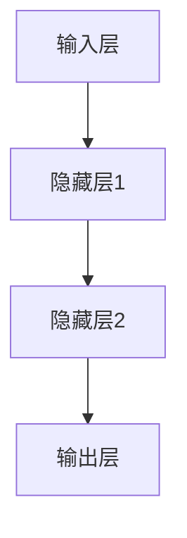

                 

# 《AI大模型创业：如何利用人才优势？》

> 关键词：AI大模型，创业，人才优势，技术应用，风险控制，案例分析

> 摘要：本文旨在探讨AI大模型创业中如何充分利用人才优势，从基础概念、架构设计、创业实践、风险管理到案例分析，为创业者提供全方位的指导。通过深入研究AI大模型的核心技术、创业团队的人才布局以及实际创业项目的操作，帮助创业者找到成功之路。

## 目录大纲

- 第一部分：AI大模型的基础知识
  - 第1章：AI大模型概述
    - 1.1 AI大模型的概念与类型
    - 1.2 AI大模型的发展历程
    - 1.3 AI大模型的核心技术
  - 第2章：AI大模型的架构与设计
    - 2.1 AI大模型的架构
    - 2.2 AI大模型的设计原则
    - 2.3 AI大模型的训练与优化
- 第二部分：AI大模型创业实践
  - 第3章：创业团队的人才布局
    - 3.1 创业团队的人才结构
    - 3.2 人才优势的利用
  - 第4章：AI大模型创业项目的启动
    - 4.1 项目策划
    - 4.2 技术选型
    - 4.3 团队协作
  - 第5章：AI大模型创业项目的运营
    - 5.1 产品开发
    - 5.2 市场推广
    - 5.3 用户服务
  - 第6章：AI大模型创业项目的风险管理
    - 6.1 风险识别
    - 6.2 风险评估
    - 6.3 风险应对
- 第三部分：AI大模型创业案例分析
  - 第7章：AI大模型创业案例分析
    - 7.1 案例一：公司A的成功经验
    - 7.2 案例二：公司B的失败教训
    - 7.3 案例三：公司C的持续发展
- 附录
  - 附录A：AI大模型相关资源
  - 附录B：AI大模型开发工具介绍

### 第一部分：AI大模型的基础知识

#### 第1章：AI大模型概述

### 1.1 AI大模型的概念与类型

#### 1.1.1 AI大模型的概念

AI大模型是指那些具有强大的数据处理能力、能够自主学习并完成复杂任务的深度学习模型。这些模型通常具有以下特点：

- **参数规模大**：拥有数亿至数十亿个参数。
- **计算量大**：需要强大的计算资源进行训练和推理。
- **自适应性强**：能够通过大规模数据自我优化。

AI大模型通常可以分为以下几种类型：

- **神经网络模型**：包括卷积神经网络（CNN）、循环神经网络（RNN）和变压器模型（Transformer）等。
- **自然语言处理模型**：如GPT、BERT等。
- **计算机视觉模型**：如YOLO、SSD等。
- **其他领域模型**：如图像生成对抗网络（GAN）、推荐系统等。

### 1.1.2 AI大模型的类型

AI大模型主要分为以下几种类型：

- **神经网络模型**：神经网络模型是AI大模型的核心，其基本结构包括输入层、隐藏层和输出层。神经网络通过层层处理输入数据，最终得到输出结果。以下是神经网络的基本结构：

  ```mermaid
  graph TD
  A[输入层] --> B[隐藏层1]
  B --> C[隐藏层2]
  C --> D[输出层]
  ```

- **自然语言处理模型**：自然语言处理模型主要用于处理和生成文本数据，如机器翻译、文本分类、问答系统等。常见的自然语言处理模型有GPT、BERT等。

- **计算机视觉模型**：计算机视觉模型主要用于图像和视频数据的处理，如目标检测、图像分类等。常见的计算机视觉模型有YOLO、SSD等。

- **其他领域模型**：除了上述模型外，AI大模型还广泛应用于推荐系统、语音识别等领域。如图像生成对抗网络（GAN）可以用于生成逼真的图像，推荐系统可以根据用户行为预测用户兴趣。

#### 1.1.3 AI大模型的应用场景

AI大模型的应用场景非常广泛，以下列举了一些典型的应用场景：

- **智能客服**：利用AI大模型进行自然语言处理，实现智能客服系统，提高客户服务质量。
- **医疗诊断**：利用AI大模型对医疗数据进行分析，实现疾病预测和诊断，提高医疗水平。
- **金融风控**：利用AI大模型进行数据挖掘和分析，实现金融风险控制和投资预测。
- **自动驾驶**：利用AI大模型进行图像和语音数据的处理，实现自动驾驶和智能驾驶辅助系统。
- **教育个性化**：利用AI大模型对学生学习行为进行分析，实现个性化教育和学习路径推荐。

#### 1.1.4 AI大模型的优势与挑战

AI大模型的优势：

- **强大的数据处理能力**：AI大模型能够处理海量数据，进行复杂的数据分析和预测。
- **自我优化能力**：AI大模型能够通过大规模数据自我优化，提高模型性能。
- **广泛应用性**：AI大模型可以应用于各个领域，实现智能化和自动化。

AI大模型的挑战：

- **计算资源需求**：AI大模型需要大量的计算资源进行训练和推理，对硬件设备要求较高。
- **数据隐私和安全**：AI大模型需要处理大量敏感数据，存在数据隐私和安全问题。
- **算法透明性**：AI大模型的工作原理较为复杂，缺乏算法透明性，可能导致误判和偏见。

### 1.2 AI大模型的发展历程

#### 1.2.1 AI大模型的发展历程

AI大模型的发展历程可以追溯到20世纪80年代的神经网络研究。从早期的简单网络结构到2000年代的深度学习，再到近年来的AI大模型，其发展经历了以下几个阶段：

- **1980s：神经网络的研究起步**：在20世纪80年代，神经网络研究得到了广泛关注，但受限于计算能力和算法复杂性，神经网络的应用受到限制。
- **1990s：深度学习的兴起**：在20世纪90年代，深度学习得到了快速发展，提出了卷积神经网络（CNN）等具有强大表示能力的神经网络模型。
- **2006-2012：深度学习在图像识别等领域取得突破**：在2006年，深度学习算法在ImageNet图像识别挑战赛中取得了突破性成果，标志着深度学习的崛起。
- **2014-2018：AI大模型的崛起**：在2014年，谷歌提出了Transformer模型，开启了AI大模型的时代。随后的几年，GPT、BERT等AI大模型相继问世，并在各个领域取得了显著成果。
- **2019-至今：AI大模型在各领域的广泛应用**：AI大模型在自然语言处理、计算机视觉、推荐系统等领域得到了广泛应用，推动了人工智能技术的发展。

#### 1.2.2 当前主流的AI大模型

当前主流的AI大模型包括以下几个：

- **GPT系列**：GPT（Generative Pre-trained Transformer）是一种基于Transformer架构的预训练语言模型，具有强大的自然语言处理能力。
- **BERT系列**：BERT（Bidirectional Encoder Representations from Transformers）是一种双向的Transformer模型，广泛应用于自然语言处理任务。
- **Turing系列**：Turing是一种基于自监督学习的神经网络模型，具有强大的图像和语言理解能力。
- **ViT系列**：ViT（Vision Transformer）是一种基于Transformer架构的计算机视觉模型，可以处理大规模的图像数据。

### 1.3 AI大模型的核心技术

#### 1.3.1 神经网络

神经网络是AI大模型的基础，其基本结构包括输入层、隐藏层和输出层。神经网络通过层层处理输入数据，最终得到输出结果。以下是神经网络的基本结构：



神经网络的训练过程主要包括以下几个步骤：

1. **初始化参数**：初始化神经网络中的权重和偏置。
2. **前向传播**：输入数据经过神经网络，通过每一层的非线性变换，最终得到输出结果。
3. **反向传播**：计算输出结果与真实值的误差，通过反向传播算法更新网络参数。
4. **优化算法**：使用梯度下降等优化算法，不断更新网络参数，减小误差。

#### 1.3.2 深度学习

深度学习是AI大模型的核心技术之一，其核心思想是通过多层神经网络对数据进行处理，从而实现对复杂任务的自动学习和预测。深度学习的关键在于网络结构的复杂度和数据的规模。

深度学习的基本过程包括以下几个步骤：

1. **数据预处理**：对输入数据进行预处理，如归一化、缩放等。
2. **模型设计**：设计合适的神经网络结构，包括输入层、隐藏层和输出层。
3. **模型训练**：使用大量数据进行模型训练，通过反向传播算法不断优化网络参数。
4. **模型评估**：使用验证集对模型进行评估，调整模型参数，提高模型性能。

#### 1.3.3 自然语言处理

自然语言处理是AI大模型在语言领域的应用，主要包括文本分类、情感分析、机器翻译等任务。自然语言处理的核心技术包括词嵌入、序列模型和注意力机制。

1. **词嵌入**：词嵌入是将词汇映射到高维空间的过程，常用的词嵌入方法有Word2Vec、GloVe等。
2. **序列模型**：序列模型用于处理序列数据，如文本和语音。常见的序列模型有RNN、LSTM、GRU等。
3. **注意力机制**：注意力机制可以用于模型的不同部分之间建立关联，提高模型对数据的理解和处理能力。常见的注意力机制有自注意力（Self-Attention）和交叉注意力（Cross-Attention）。

### 1.4 AI大模型在企业中的应用前景

#### 1.4.1 AI大模型的潜在应用领域

AI大模型在企业中的应用前景广阔，主要包括以下几个方面：

- **智能客服**：利用AI大模型进行自然语言处理，实现智能客服系统，提高客户服务质量。
- **供应链管理**：利用AI大模型对供应链数据进行分析，优化供应链管理，降低成本。
- **风险管理**：利用AI大模型进行数据挖掘和分析，实现金融风险控制和投资预测。
- **医疗诊断**：利用AI大模型对医疗数据进行分析，实现疾病预测和诊断，提高医疗水平。
- **自动驾驶**：利用AI大模型进行图像和语音数据的处理，实现自动驾驶和智能驾驶辅助系统。
- **教育个性化**：利用AI大模型对学生学习行为进行分析，实现个性化教育和学习路径推荐。

#### 1.4.2 企业采用AI大模型的优势

企业采用AI大模型具有以下优势：

- **提高效率**：AI大模型能够快速处理大量数据，提高业务效率。
- **降低成本**：AI大模型能够替代部分人工操作，降低人力成本。
- **增强决策**：AI大模型能够提供数据支持，帮助决策者做出更准确的决策。
- **创新业务**：AI大模型可以为企业带来新的业务模式和商业模式。

#### 1.4.3 AI大模型应用的挑战与机遇

AI大模型在企业中的应用面临以下挑战：

- **数据隐私和安全**：如何保障数据隐私和安全是一个重要问题。
- **算法透明性和公正性**：如何保证算法的透明性和公正性，避免歧视和偏见。
- **计算资源需求**：如何获得足够的计算资源进行模型训练和推理。

同时，AI大模型在企业中的应用也带来了机遇：

- **商业模式创新**：AI大模型可以为企业带来新的商业机会和商业模式。
- **产业链升级**：AI大模型可以推动产业链的升级和优化，提高产业链的竞争力。
- **智能化转型**：AI大模型可以帮助企业实现智能化转型，提高企业的核心竞争力。

### 1.5 AI大模型在创业中的角色与挑战

#### 1.5.1 AI大模型在创业中的角色

AI大模型在创业中扮演着关键角色，主要体现在以下几个方面：

- **核心技术驱动**：AI大模型是创业项目的核心技术，可以为企业提供强大的数据分析和处理能力。
- **业务创新引擎**：AI大模型可以为企业带来新的业务模式和商业模式，推动企业创新。
- **竞争优势**：AI大模型可以帮助企业建立竞争优势，提高市场竞争力。

#### 1.5.2 AI大模型创业中的挑战

AI大模型创业面临以下挑战：

- **技术门槛**：AI大模型涉及大量的技术和算法，创业者需要具备深厚的专业知识。
- **计算资源**：AI大模型需要大量的计算资源进行训练和推理，创业者需要解决计算资源的问题。
- **数据隐私**：AI大模型处理的数据可能涉及用户隐私，创业者需要保障数据隐私和安全。
- **市场不确定性**：AI大模型在市场中的应用前景不确定，创业者需要面对市场的挑战。

### 1.6 总结

本章主要介绍了AI大模型的基础知识，包括其概念、类型、发展历程、核心技术、应用前景以及在创业中的角色和挑战。通过本章的学习，读者可以了解AI大模型的基本概念和原理，为后续章节的深入学习打下基础。

在下一章中，我们将进一步探讨AI大模型的架构与设计，分析其设计原则和训练与优化方法，帮助创业者更好地理解和应用AI大模型。

## 第2章：AI大模型的架构与设计

AI大模型的架构与设计是确保其能够高效处理海量数据、实现复杂任务的关键。本章将详细阐述AI大模型的架构设计原则、架构组成以及训练与优化方法。

### 2.1 AI大模型的架构

AI大模型的架构通常包括以下三个主要部分：数据输入层、神经网络层和输出层。

#### 2.1.1 数据输入层

数据输入层是AI大模型架构的基础部分，其主要功能是接收和处理输入数据。在数据输入层，数据通常会被进行预处理，如数据清洗、归一化、缩放等操作，以便为神经网络层提供适合的训练数据。

数据输入层的组成包括：

- **数据源**：数据输入层的数据来源可以是各种数据集，如文本、图像、音频等。
- **数据预处理模块**：用于对输入数据进行清洗、归一化和特征提取等操作。
- **数据缓存**：用于缓存预处理后的数据，以便快速访问和重复利用。

#### 2.1.2 神经网络层

神经网络层是AI大模型的核心部分，其主要功能是通过多层神经网络对输入数据进行处理和变换。神经网络层通常包括多个隐藏层，每一层都对输入数据进行非线性变换，从而提取出更高层次的特征。

神经网络层的组成包括：

- **输入层**：接收预处理后的数据，并将其传递给第一个隐藏层。
- **隐藏层**：对输入数据进行处理和变换，提取特征信息。
- **输出层**：根据隐藏层的输出，生成最终的结果。

#### 2.1.3 输出层

输出层是AI大模型架构的最后一层，其主要功能是根据神经网络层的输出生成最终的结果。输出层的结构取决于具体的任务类型，如分类任务通常使用softmax激活函数，回归任务则使用线性激活函数。

输出层的组成包括：

- **激活函数**：用于对隐藏层的输出进行非线性变换，如softmax、ReLU等。
- **输出层神经元**：根据激活函数的输出，生成最终的结果。

### 2.2 AI大模型的设计原则

AI大模型的设计原则是为了确保模型能够高效地处理数据、适应不同的应用场景。以下是AI大模型设计的主要原则：

#### 2.2.1 可扩展性

可扩展性是AI大模型设计的重要原则，确保模型能够适应不同的数据规模和应用场景。可扩展性包括以下几个方面：

- **硬件扩展**：模型设计时需要考虑硬件资源的扩展性，如支持分布式训练和推理。
- **数据扩展**：模型设计时需要考虑数据量的扩展性，如支持增量学习和迁移学习。

#### 2.2.2 灵活性

灵活性是指AI大模型能够适应不同的任务和应用场景，灵活调整模型结构和参数。灵活性包括以下几个方面：

- **模型结构**：设计时需要考虑模型结构的灵活性，如支持不同的神经网络架构。
- **参数调整**：设计时需要考虑参数调整的灵活性，如支持动态调整学习率和正则化参数。

#### 2.2.3 高效性

高效性是指AI大模型能够在有限的计算资源下，快速地完成训练和推理任务。高效性包括以下几个方面：

- **算法优化**：设计时需要考虑算法的优化，如使用高效的优化算法和并行计算。
- **硬件优化**：设计时需要考虑硬件的优化，如使用GPU加速训练和推理。

### 2.3 AI大模型的训练与优化

AI大模型的训练与优化是确保模型性能的关键步骤。以下是AI大模型训练与优化的一些常见方法：

#### 2.3.1 训练过程

AI大模型的训练过程通常包括以下几个步骤：

1. **初始化参数**：随机初始化模型的参数，包括权重和偏置。
2. **前向传播**：输入数据经过模型，通过每一层的非线性变换，生成输出结果。
3. **计算损失**：计算输出结果与真实值的差异，得到损失函数的值。
4. **反向传播**：计算损失函数关于模型参数的梯度，并通过梯度下降等优化算法更新参数。
5. **迭代更新**：重复上述步骤，不断迭代更新模型参数，直到满足停止条件。

#### 2.3.2 优化方法

AI大模型的优化方法主要包括以下几种：

1. **梯度下降**：通过计算损失函数关于模型参数的梯度，沿着梯度方向更新参数，以最小化损失函数。
2. **动量法**：在梯度下降的基础上，引入一个动量项，以加快收敛速度。
3. **Adam优化器**：结合了梯度下降和动量法的优点，自适应地调整学习率。

#### 2.3.3 超参数调优

超参数调优是影响模型性能的重要因素。以下是超参数调优的一些常用方法：

1. **网格搜索**：遍历所有可能的超参数组合，选择最优的组合。
2. **贝叶斯优化**：基于贝叶斯统计模型，自动寻找最优的超参数组合。
3. **随机搜索**：随机选择超参数组合，通过迭代优化找到最优的组合。

### 2.4 AI大模型的评估与测试

AI大模型的评估与测试是确保模型性能和可靠性的关键步骤。以下是AI大模型评估与测试的一些常用方法：

#### 2.4.1 评估指标

AI大模型的评估指标主要包括以下几种：

1. **准确率**：分类任务的评估指标，表示模型正确分类的样本数占总样本数的比例。
2. **召回率**：分类任务的评估指标，表示模型正确分类的样本数占实际正类样本数的比例。
3. **F1分数**：综合准确率和召回率的评估指标，表示模型分类效果的平衡性。
4. **精确率**：分类任务的评估指标，表示模型正确分类的样本数占预测正类样本数的比例。

#### 2.4.2 测试集划分

AI大模型的测试集划分是确保模型评估结果可靠性的关键。常用的测试集划分方法包括：

1. **交叉验证**：将数据集划分为多个子集，每次使用一个子集作为测试集，其余子集作为训练集，重复多次，计算平均评估指标。
2. **时间序列划分**：根据时间顺序将数据集划分为训练集和测试集，避免训练集和测试集之间的时间偏差。

### 2.5 总结

本章详细介绍了AI大模型的架构与设计，包括数据输入层、神经网络层和输出层的组成，以及设计原则、训练与优化方法、评估与测试方法。通过本章的学习，读者可以深入理解AI大模型的设计原理和实现方法，为后续章节的AI大模型创业实践打下基础。

在下一章中，我们将探讨创业团队在AI大模型创业中的角色和任务，以及如何充分利用人才优势，为创业项目的成功奠定基础。

## 第3章：创业团队的人才布局

在AI大模型创业中，团队的人才布局至关重要。合理的团队人才结构可以充分发挥人才的优势，提高项目的成功几率。本章将探讨创业团队的人才结构、关键人才类型以及如何充分利用人才优势。

### 3.1 创业团队的人才结构

创业团队的人才结构应当多样化，以涵盖AI大模型项目所需的各个关键领域。以下是一个典型的创业团队人才结构：

#### 3.1.1 技术人才

技术人才是AI大模型创业团队的核心力量，负责模型开发、算法优化和系统维护等工作。技术人才可以分为以下几类：

- **深度学习专家**：负责AI大模型的设计和实现，精通深度学习算法和模型结构。
- **数据科学家**：负责数据分析和预处理，使用统计学方法和机器学习算法提取数据中的有用信息。
- **软件开发工程师**：负责AI大模型的软件开发和系统集成，确保模型在实际应用中的稳定性和可靠性。

#### 3.1.2 产品人才

产品人才负责产品规划和设计，确保AI大模型能够满足市场需求并实现商业化。产品人才可以分为以下几类：

- **产品经理**：负责产品的整体规划和管理，制定产品路线图，协调团队成员的工作。
- **用户体验设计师**：负责产品的用户体验设计，确保产品界面友好、易用。
- **市场分析师**：负责市场调研和用户需求分析，提供市场数据支持，指导产品方向。

#### 3.1.3 市场人才

市场人才负责市场推广、客户拓展和业务发展，确保AI大模型项目能够获得市场认可和用户支持。市场人才可以分为以下几类：

- **市场营销经理**：负责制定市场营销策略，提升产品知名度和市场份额。
- **销售经理**：负责客户拓展和销售业绩，建立和维护客户关系。
- **品牌经理**：负责品牌建设和市场推广，提升企业形象和品牌价值。

### 3.2 关键人才类型

在AI大模型创业中，以下几种关键人才类型对于项目的成功至关重要：

#### 3.2.1 技术领袖

技术领袖是创业团队的核心人物，通常具备深厚的专业知识和技术背景，能够带领团队攻克技术难题。技术领袖还需要具备良好的沟通能力和领导力，确保团队能够高效协作。

#### 3.2.2 商业天才

商业天才具备敏锐的市场洞察力和商业敏感性，能够把握市场机会，制定切实可行的商业计划。商业天才还需要具备良好的谈判和沟通能力，能够与投资者、合作伙伴和客户建立良好的关系。

#### 3.2.3 创新者

创新者是团队中的创意源泉，擅长提出新颖的想法和解决方案。创新者需要具备强烈的好奇心和探索精神，能够不断推动团队进行技术创新和产品改进。

#### 3.2.4 执行者

执行者是团队的执行者，负责将计划付诸实践。执行者需要具备严谨的工作态度和高效的工作能力，能够确保项目按时按质完成。

### 3.3 人才优势的利用

创业团队要充分利用人才优势，实现以下目标：

#### 3.3.1 技术优势的发挥

技术优势是AI大模型创业团队的核心竞争力，团队需要发挥以下技术优势：

- **技术创新**：不断进行技术创新，开发出具有竞争力的AI大模型。
- **技术积累**：积累丰富的技术经验和知识，提高团队的技术水平。
- **技术转移**：将技术优势转化为实际应用，推动项目进展。

#### 3.3.2 产品优势的打造

产品优势是AI大模型创业项目的核心竞争力，团队需要打造以下产品优势：

- **产品创新**：开发出具有创新性和差异化的产品，满足市场需求。
- **用户体验**：提升用户体验，确保产品易于使用和操作。
- **产品迭代**：根据用户反馈和市场变化，不断优化和迭代产品。

#### 3.3.3 市场优势的拓展

市场优势是AI大模型创业项目的市场竞争力，团队需要拓展以下市场优势：

- **市场调研**：进行深入的市场调研，了解市场需求和竞争状况。
- **营销策略**：制定有效的市场营销策略，提升产品知名度和市场份额。
- **客户拓展**：积极拓展客户资源，建立稳定的客户关系。

### 3.4 总结

本章探讨了创业团队在AI大模型创业中的角色和任务，以及如何充分利用人才优势。通过合理的人才布局和充分发挥人才优势，创业团队可以更好地应对市场挑战，提高项目成功几率。

在下一章中，我们将探讨AI大模型创业项目的启动过程，包括项目策划、技术选型和团队协作等方面的内容。

## 第4章：AI大模型创业项目的启动

AI大模型创业项目的启动是创业过程的关键环节，涉及项目策划、技术选型、团队协作等多个方面。本章将详细探讨这些关键步骤，为创业者提供实用的指导。

### 4.1 项目策划

项目策划是AI大模型创业项目的第一步，也是最重要的一步。一个良好的项目策划可以为后续工作提供明确的方向和目标。以下是项目策划的主要内容：

#### 4.1.1 项目目标

明确项目目标是项目策划的首要任务。项目目标应具体、明确，包括长期目标和短期目标。长期目标可以是开发一款具有市场竞争力的人工智能产品，而短期目标可以是完成一个可验证的模型原型。

#### 4.1.2 项目计划

项目计划应详细描述项目的时间表、预算和资源需求。时间表应包括关键里程碑和交付物，如原型开发、模型训练、产品发布等。预算应包括人力成本、硬件设备、软件开发等各项支出。资源需求应明确所需的计算资源、数据资源等。

#### 4.1.3 风险评估

在项目策划阶段，应进行风险评估，识别可能遇到的风险，并制定相应的应对措施。风险评估可以包括技术风险、市场风险、财务风险等。技术风险可能来源于算法复杂性、计算资源不足等；市场风险可能来源于市场需求变化、竞争加剧等；财务风险可能来源于资金不足、成本超支等。

#### 4.1.4 团队组建

项目策划阶段还需要考虑团队组建。根据项目需求，确定所需的人才类型和数量，并制定招聘计划和培训计划。组建一个高效、专业的团队对于项目的成功至关重要。

### 4.2 技术选型

技术选型是AI大模型创业项目的重要环节，选择合适的技术栈和工具可以提高项目开发效率，确保模型性能和稳定性。以下是技术选型的主要内容：

#### 4.2.1 硬件选型

硬件选型包括服务器、GPU、存储等设备。根据项目需求和预算，选择适合的硬件配置。例如，对于大规模的AI大模型训练，需要选择具有较高计算能力的GPU服务器。此外，还需要考虑存储设备的容量和性能，确保数据存储和读取速度。

#### 4.2.2 软件选型

软件选型包括深度学习框架、编程语言、开发工具等。深度学习框架如TensorFlow、PyTorch等，具有较高的灵活性和性能。编程语言如Python，由于其简洁性和丰富的库支持，是AI大模型开发的首选。开发工具如Jupyter Notebook、Docker等，可以提高开发效率和团队协作。

#### 4.2.3 算法选型

算法选型是AI大模型创业项目的核心技术选择。根据项目需求和业务场景，选择合适的算法和模型结构。例如，对于自然语言处理任务，可以选择GPT、BERT等预训练模型；对于计算机视觉任务，可以选择ResNet、YOLO等模型。此外，还需要考虑算法的复杂度、性能和可扩展性。

### 4.3 团队协作

团队协作是AI大模型创业项目成功的关键。一个高效、协同的团队可以充分发挥每个成员的优势，提高项目开发效率。以下是团队协作的主要内容：

#### 4.3.1 团队管理

团队管理包括人员安排、任务分配、进度跟踪等。项目经理或团队负责人应明确每个成员的职责和任务，确保项目按计划进行。同时，应建立有效的沟通机制，确保团队成员之间的信息共享和协同工作。

#### 4.3.2 项目管理

项目管理是确保项目按时、按质完成的重要环节。项目经理应制定详细的项目计划，包括时间表、预算和资源需求，并定期跟踪项目进度。此外，还应建立风险管理机制，及时识别和应对潜在风险。

#### 4.3.3 技术协作

技术协作是AI大模型创业项目的核心。团队成员应相互学习、交流，共同解决技术难题。技术负责人应组织定期的技术分享和讨论，提高团队的整体技术水平。

### 4.4 总结

本章详细探讨了AI大模型创业项目的启动过程，包括项目策划、技术选型和团队协作等方面。通过科学的项目策划、合理的技术选型和高效的团队协作，创业者可以更好地启动AI大模型创业项目，为项目的成功奠定基础。

在下一章中，我们将探讨AI大模型创业项目的运营过程，包括产品开发、市场推广和用户服务等方面。

## 第5章：AI大模型创业项目的运营

AI大模型创业项目的运营是确保项目长期成功的关键环节。在这个阶段，创业者需要关注产品开发、市场推广和用户服务，确保项目能够持续发展。以下是AI大模型创业项目运营的主要内容。

### 5.1 产品开发

产品开发是AI大模型创业项目的核心环节，涉及模型训练、产品设计和迭代优化。以下是产品开发的几个关键步骤：

#### 5.1.1 模型训练

模型训练是产品开发的基础，需要根据业务需求选择合适的算法和模型结构。创业者应确保模型训练的数据质量，并进行数据预处理和清洗。在模型训练过程中，需要不断调整超参数，优化模型性能。常用的模型训练方法包括梯度下降、随机梯度下降和Adam优化器等。

#### 5.1.2 产品设计

产品设计是产品开发的重要环节，需要满足用户需求和业务场景。创业者应与用户和业务团队密切合作，了解用户需求，设计用户界面和交互体验。在产品设计过程中，需要考虑产品的可扩展性和可维护性，确保产品能够适应未来的需求变化。

#### 5.1.3 产品迭代

产品迭代是持续优化产品的过程，需要根据用户反馈和市场需求不断优化产品功能。创业者应建立敏捷开发流程，快速响应市场变化，推出新功能或改进现有功能。同时，应进行持续的技术创新，提升产品竞争力。

### 5.2 市场推广

市场推广是AI大模型创业项目获取用户和市场份额的关键步骤。以下是市场推广的几个关键环节：

#### 5.2.1 市场调研

市场调研是了解市场需求和竞争状况的重要手段。创业者应定期进行市场调研，收集用户需求、竞争对手信息和市场趋势。市场调研可以帮助创业者制定合适的市场营销策略，提高产品竞争力。

#### 5.2.2 营销策略

营销策略是获取用户和市场份额的重要手段。创业者应根据市场调研结果，制定合适的市场营销策略。常见的营销策略包括广告投放、社交媒体推广、内容营销和公关活动等。创业者应结合自身资源和优势，选择合适的营销渠道和方式。

#### 5.2.3 品牌建设

品牌建设是提高产品知名度和认可度的重要手段。创业者应建立独特的品牌形象，通过视觉设计、品牌口号和品牌故事等，传达品牌的核心价值观和优势。品牌建设有助于树立企业在市场中的地位，提高用户的品牌忠诚度。

### 5.3 用户服务

用户服务是AI大模型创业项目长期成功的关键。以下是用户服务的几个关键步骤：

#### 5.3.1 用户需求分析

用户需求分析是了解用户需求和满意度的重要手段。创业者应定期收集用户反馈，通过调查问卷、用户访谈等方式，了解用户对产品的使用体验和需求。用户需求分析可以帮助创业者优化产品功能和提高用户满意度。

#### 5.3.2 用户服务策略

用户服务策略是确保用户满意和忠诚的重要手段。创业者应根据用户需求，制定合适的用户服务策略。常见的用户服务策略包括客户支持、售后服务和用户社区等。客户支持可以通过电话、在线聊天等方式，为用户提供技术支持和咨询。售后服务可以包括产品保修、升级服务等。用户社区可以促进用户之间的交流和互动，提高用户满意度。

#### 5.3.3 用户满意度评估

用户满意度评估是衡量用户服务效果的重要手段。创业者应定期进行用户满意度调查，评估用户对产品的满意度和忠诚度。用户满意度评估可以帮助创业者了解产品优势和不足，制定改进措施，提高用户满意度。

### 5.4 总结

本章详细探讨了AI大模型创业项目的运营过程，包括产品开发、市场推广和用户服务等方面。通过科学的产品开发、有效的市场推广和优质的用户服务，创业者可以确保项目的长期成功。在下一章中，我们将探讨AI大模型创业项目的风险管理，帮助创业者应对潜在风险，确保项目的稳健发展。

## 第6章：AI大模型创业项目的风险管理

AI大模型创业项目面临着多种风险，包括技术风险、市场风险和财务风险等。有效的风险管理是确保项目成功的关键。本章将详细介绍风险识别、风险评估和风险应对策略，帮助创业者应对各种潜在风险。

### 6.1 风险识别

风险识别是风险管理的基础，旨在识别项目中可能出现的各种风险。以下是AI大模型创业项目中常见的一些风险：

#### 6.1.1 技术风险

技术风险包括算法复杂度、计算资源不足、数据质量等问题。例如，AI大模型可能由于算法复杂度高而难以训练，或者在训练过程中出现梯度消失或爆炸等问题。此外，数据质量差可能导致模型性能下降。

#### 6.1.2 市场风险

市场风险包括市场需求变化、竞争加剧、用户接受度低等问题。例如，市场需求变化可能导致项目无法找到合适的商业方向；竞争加剧可能使项目在市场上难以立足；用户接受度低可能导致项目难以获得用户支持。

#### 6.1.3 财务风险

财务风险包括资金不足、成本超支、收益不稳定等问题。例如，资金不足可能导致项目无法按时完成；成本超支可能导致项目收益减少；收益不稳定可能影响项目的可持续发展。

#### 6.1.4 法律风险

法律风险包括数据隐私、知识产权保护等问题。例如，未经用户同意收集和处理用户数据可能违反数据隐私法规；未经授权使用他人的知识产权可能侵犯他人的合法权益。

### 6.2 风险评估

风险评估是确定风险严重程度和优先级的过程。以下是一些常用的风险评估方法：

#### 6.2.1 概率-影响分析

概率-影响分析（Probability-Impact Analysis）是一种简单而有效的方法，用于评估风险的严重程度。该方法通过计算风险的概率和影响，确定风险的优先级。以下是一个简单的概率-影响分析示例：

| 风险 | 概率 | 影响 | 得分（概率*影响） |
| ---- | ---- | ---- | --------------- |
| 技术风险 | 0.4  | 4    | 1.6             |
| 市场风险 | 0.3  | 3    | 0.9             |
| 财务风险 | 0.2  | 5    | 1.0             |
| 法律风险 | 0.1  | 6    | 0.6             |

根据得分，技术风险具有最高的优先级，其次是财务风险和市场风险。

#### 6.2.2 SWOT分析

SWOT分析（Strengths, Weaknesses, Opportunities, Threats）是一种用于评估项目内部优势、劣势和外部机会、威胁的方法。以下是一个简单的SWOT分析示例：

| 类别 | 内容 | 说明 |
| ---- | ---- | ---- |
| 优势 | 技术领先 | 公司在AI大模型技术方面具有优势 |
| 劣势 | 资金不足 | 公司资金有限，可能影响项目进度 |
| 机会 | 市场需求大 | AI大模型市场需求旺盛 |
| 威胁 | 竞争激烈 | 市场上存在多家竞争对手 |

通过SWOT分析，公司可以更好地了解自身优势和劣势，抓住市场机会，应对外部威胁。

### 6.3 风险应对策略

风险应对策略是针对识别和评估的风险，制定相应的应对措施。以下是一些常用的风险应对策略：

#### 6.3.1 风险预防

风险预防是降低风险发生的概率和影响。以下是一些常见风险预防措施：

- **技术预防**：提前进行算法验证和测试，确保模型稳定可靠。
- **市场预防**：进行市场调研，了解市场需求和竞争状况，制定有针对性的市场营销策略。
- **财务预防**：合理规划资金使用，确保项目有足够的资金支持。
- **法律预防**：遵守相关法律法规，确保数据隐私和知识产权保护。

#### 6.3.2 风险应对

风险应对是在风险发生时采取的措施，以降低风险的影响。以下是一些常见风险应对策略：

- **技术应对**：在算法出现问题时，及时调整模型结构和参数，优化模型性能。
- **市场应对**：在市场需求变化时，调整产品定位和功能，满足市场需求。
- **财务应对**：在资金不足时，通过融资、节省成本等方式，确保项目资金充足。
- **法律应对**：在法律问题出现时，通过法律咨询、协商解决等方式，确保公司合规运营。

#### 6.3.3 风险转移

风险转移是将风险转移给其他方，以降低自身的风险。以下是一些常见风险转移策略：

- **保险**：购买保险，将风险转移给保险公司。
- **外包**：将部分技术或业务外包，将风险转移给外包方。
- **合作**：与其他公司合作，共同承担风险。

### 6.4 总结

本章详细介绍了AI大模型创业项目的风险管理，包括风险识别、风险评估和风险应对策略。通过科学的风险管理，创业者可以更好地应对项目中的各种潜在风险，确保项目的稳健发展。在下一章中，我们将通过案例分析，进一步探讨AI大模型创业项目的成功经验和失败教训。

### 第7章：AI大模型创业案例分析

通过分析AI大模型创业的成功和失败案例，我们可以深入了解创业过程中可能遇到的问题和解决方案，为未来的创业者提供宝贵的经验和教训。

#### 7.1 案例一：公司A的成功经验

**公司背景**：公司A成立于2018年，专注于利用AI大模型进行图像识别和自动驾驶技术的研发。

**创业过程**：

- **项目策划**：公司A在创业初期明确了以自动驾驶技术为主要研究方向，并制定了详细的研发计划和商业战略。
- **技术选型**：公司A选择了TensorFlow作为深度学习框架，并采购了高性能GPU服务器，确保模型训练和推理的效率。
- **团队协作**：公司A组建了一支由深度学习专家、自动驾驶工程师和产品经理组成的高效团队，确保项目进度和质量。

**成功经验**：

- **技术创新**：公司A通过不断的技术创新，成功开发出了高精度的自动驾驶模型，并在多项自动驾驶测试中取得了优异成绩。
- **市场拓展**：公司A积极拓展市场，与多家汽车制造企业建立了合作关系，实现了产品的商业化应用。
- **资本运作**：公司A通过多次融资，获得了足够的资金支持，确保了项目的持续发展。

#### 7.2 案例二：公司B的失败教训

**公司背景**：公司B成立于2019年，专注于利用AI大模型进行医疗诊断和疾病预测。

**创业过程**：

- **项目策划**：公司B在创业初期过于乐观地估计了AI大模型在医疗领域的应用前景，缺乏详细的项目计划和风险评估。
- **技术选型**：公司B选择了开源深度学习框架，但由于缺乏专业的技术团队，模型开发进展缓慢。
- **团队协作**：公司B的团队成员结构不合理，缺乏医疗专家和产品经理，导致项目进展受阻。

**失败原因**：

- **技术问题**：公司B的AI大模型在医疗数据上的表现不佳，缺乏实用性和可靠性，导致用户接受度低。
- **市场问题**：公司B在市场推广方面缺乏有效的策略，难以吸引客户。
- **团队问题**：公司B的团队结构不合理，缺乏专业人才，导致项目进度和质量无法保证。

#### 7.3 案例三：公司C的持续发展

**公司背景**：公司C成立于2020年，专注于利用AI大模型进行智能客服和客户服务优化。

**创业过程**：

- **项目策划**：公司C在创业初期制定了详细的项目计划和商业策略，明确了以智能客服为主要研究方向。
- **技术选型**：公司C选择了PyTorch作为深度学习框架，并建立了专业的技术团队进行模型开发和优化。
- **团队协作**：公司C组建了一支由AI专家、客服工程师和产品经理组成的高效团队，确保项目顺利进行。

**持续发展的策略**：

- **技术创新**：公司C通过不断的技术创新，开发了多种智能客服模型，提高了客户服务效率和用户满意度。
- **市场拓展**：公司C积极拓展市场，与多家企业建立了合作关系，实现了业务的持续增长。
- **用户服务**：公司C重视用户服务，建立了完善的客户服务体系，及时解决用户问题和反馈，提高了用户满意度。

### 7.4 案例分析总结

通过以上案例分析，我们可以得出以下结论：

- **技术创新**：技术创新是AI大模型创业成功的关键，创业者需要不断探索和开发新的算法和模型，提高产品的竞争力。
- **市场拓展**：市场拓展是创业项目成功的重要保障，创业者需要深入了解市场需求，制定有效的市场推广策略，提高产品的市场占有率。
- **团队协作**：团队协作是创业项目成功的基础，创业者需要组建一支高效、专业的团队，确保项目顺利进行。
- **风险管理**：风险管理是创业项目成功的必要条件，创业者需要识别和应对各种潜在风险，确保项目的稳健发展。

通过学习这些成功经验和失败教训，创业者可以更好地规划自己的创业项目，提高项目的成功几率。

## 附录

### 附录A：AI大模型相关资源

#### A.1 研究论文

- 《Deep Learning for Natural Language Processing》
- 《BERT: Pre-training of Deep Bidirectional Transformers for Language Understanding》
- 《GPT-3: Language Models are few-shot learners》

#### A.2 开源项目

- TensorFlow
- PyTorch
- Keras

#### A.3 学习资源

- Coursera《深度学习》
- edX《机器学习基础》
- Udacity《深度学习工程师纳米学位》

### 附录B：AI大模型开发工具介绍

#### B.1 TensorFlow

TensorFlow是由谷歌开发的开源深度学习框架，具有以下特点：

- **灵活性强**：支持多种编程语言，如Python、C++等。
- **功能丰富**：提供丰富的API和工具，支持多种深度学习应用。
- **社区活跃**：拥有庞大的开发者和用户社区，提供大量的教程和资源。

#### B.2 PyTorch

PyTorch是由Facebook开发的开源深度学习框架，具有以下特点：

- **简洁易用**：基于Python编程语言，具有简洁的代码风格。
- **动态计算图**：支持动态计算图，方便调试和优化。
- **性能优秀**：在多个深度学习竞赛中取得优异成绩，性能优秀。

#### B.3 Keras

Keras是建立在TensorFlow和Theano之上的深度学习库，具有以下特点：

- **高度模块化**：支持多种神经网络架构，如卷积神经网络、循环神经网络等。
- **易用性强**：提供简单易用的API，降低深度学习门槛。
- **兼容性强**：支持多种深度学习框架，如TensorFlow、Theano等。

### 附录C：AI大模型创业建议

#### C.1 技术创新

- **紧跟技术前沿**：关注最新的研究成果和算法，不断进行技术创新。
- **积累技术优势**：通过自主研发和合作，积累丰富的技术经验和知识。

#### C.2 市场拓展

- **深入了解市场需求**：进行市场调研，了解用户需求和竞争对手情况。
- **制定有效的市场策略**：根据市场调研结果，制定有针对性的市场推广策略。

#### C.3 团队协作

- **组建高效团队**：根据项目需求，组建一支高效、专业的团队。
- **加强团队协作**：建立有效的沟通机制，确保团队成员之间的信息共享和协同工作。

#### C.4 风险管理

- **识别和应对风险**：定期进行风险评估，识别潜在风险，并制定相应的应对措施。
- **建立风险管理机制**：建立完善的风险管理机制，确保项目稳健发展。

### 附录D：常见问题解答

#### Q：AI大模型创业需要哪些技能？

A：AI大模型创业需要以下技能：

- **深度学习知识**：了解神经网络、深度学习算法和模型结构。
- **编程技能**：熟练掌握Python等编程语言，熟悉常用深度学习框架。
- **数据分析能力**：具备数据预处理、特征提取和数据分析能力。
- **项目管理和沟通能力**：能够有效管理和协调项目团队，确保项目顺利进行。

#### Q：AI大模型创业有哪些常见挑战？

A：AI大模型创业常见的挑战包括：

- **技术复杂性**：AI大模型涉及复杂的技术，需要不断学习和实践。
- **数据隐私和安全**：处理大量敏感数据，需要保障数据隐私和安全。
- **市场竞争**：AI大模型市场竞争激烈，需要不断创新和优化。
- **资金和资源**：AI大模型创业需要大量资金和资源支持，需要合理规划和利用。

## 结束语

AI大模型创业是一个充满挑战但前景广阔的领域。通过本文的探讨，我们了解了AI大模型的基础知识、架构设计、创业实践、风险管理和案例分析。我们认识到，充分利用人才优势、科学规划项目、有效管理风险是创业成功的关键。希望本文能为即将踏上AI大模型创业之路的创业者提供有益的参考和启示。让我们共同努力，为AI大模型的创新应用和产业发展贡献自己的力量。

