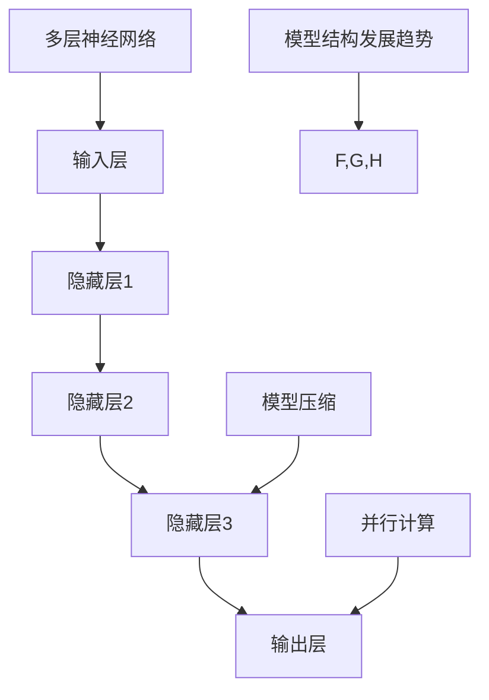

                 

# AI大模型创业：如何利用资本优势？

> **关键词**：AI大模型、创业、资本优势、技术突破、商业模式创新、市场定位、融资策略、项目开发、项目运营、估值方法、未来展望、社会影响、伦理问题

> **摘要**：本文将深入探讨AI大模型创业的资本优势，分析AI大模型的基本概念、核心技术、创业策略与规划、创业实践、项目开发与运营、融资与估值方法，以及未来展望与挑战。通过国内外成功案例，为AI大模型创业提供宝贵的经验和策略。

### 《AI大模型创业：如何利用资本优势？》目录大纲

#### 第一部分：AI大模型与创业基础

**第1章：AI大模型概述与创业机遇**
- 1.1 AI大模型的概念与分类
- 1.2 AI大模型的发展历程与现状
- 1.3 创业中的AI大模型应用场景
- 1.4 AI大模型带来的创业机遇

**第2章：AI大模型的核心技术**
- 2.1 人工智能与机器学习基础
  - 2.1.1 神经网络与深度学习
  - 2.1.2 机器学习算法与应用
- 2.2 AI大模型架构解析
  - 2.2.1 模型结构与发展趋势
  - 2.2.2 模型训练与优化
- 2.3 大规模数据处理技术
  - 2.3.1 数据采集与存储
  - 2.3.2 数据清洗与预处理

**第3章：AI大模型创业策略与规划**
- 3.1 创业公司资本需求分析
  - 3.1.1 资本结构分析
  - 3.1.2 资本来源渠道
- 3.2 创业路线规划
  - 3.2.1 创业团队建设
  - 3.2.2 市场定位与竞争策略
- 3.3 融资策略与执行
  - 3.3.1 股权融资
  - 3.3.2 债务融资

#### 第二部分：AI大模型创业实践

**第4章：AI大模型创业案例分析**
- 4.1 国内外成功AI大模型创业案例分析
- 4.2 AI大模型创业常见问题与解决方案

**第5章：AI大模型创业项目开发**
- 5.1 创业项目开发流程
- 5.2 开发工具与环境搭建

**第6章：AI大模型创业项目运营**
- 6.1 项目上线与推广
- 6.2 用户分析与运营策略

**第7章：AI大模型创业融资与估值**
- 7.1 融资策略与执行
- 7.2 企业估值方法
- 7.3 资本退出与投资回报

**第8章：未来展望与挑战**
- 8.1 AI大模型创业未来趋势
- 8.2 创业过程中的法律与合规问题
- 8.3 AI大模型创业中的社会影响与伦理问题

#### 附录

**附录A：AI大模型创业资源汇总**

### 第1章: AI大模型概述与创业机遇

#### 1.1 AI大模型的概念与分类

AI大模型，是指利用机器学习和深度学习技术，通过海量的数据训练，构建的具有高复杂度和强能力的人工智能模型。根据应用领域和任务类型，AI大模型可以分为以下几类：

1. **自然语言处理（NLP）大模型**：如GPT、BERT等，它们在文本生成、机器翻译、问答系统等方面有广泛应用。
2. **计算机视觉（CV）大模型**：如ResNet、Inception等，它们在图像识别、目标检测、视频分析等方面有广泛应用。
3. **音频处理大模型**：如WaveNet、Tacotron等，它们在语音合成、音乐生成、语音识别等方面有广泛应用。
4. **强化学习大模型**：如Deep Q-Network（DQN）、Proximal Policy Optimization（PPO）等，它们在游戏AI、自动驾驶、推荐系统等方面有广泛应用。

这些大模型在医疗、金融、教育、制造等多个行业都有着广泛的应用。

#### 1.2 AI大模型的发展历程与现状

AI大模型的发展可以追溯到20世纪80年代的专家系统。随着计算能力的提升和海量数据的积累，特别是深度学习技术的突破，AI大模型在21世纪得到了迅猛发展。当前，AI大模型已经广泛应用于各个领域，如自动驾驶、智能客服、图像识别等。

#### 1.3 创业中的AI大模型应用场景

AI大模型在创业中的应用场景非常广泛，以下是一些典型的应用：

1. **智能医疗**：通过AI大模型进行疾病预测、药物研发、影像诊断等。
2. **智能金融**：利用AI大模型进行风险评估、欺诈检测、投资策略优化等。
3. **智能教育**：提供个性化教学、学习路径规划、智能测评等服务。
4. **智能工业**：实现生产流程优化、设备故障预测、供应链管理提升等。

#### 1.4 AI大模型带来的创业机遇

AI大模型的出现，为创业带来了前所未有的机遇：

1. **技术创新**：创业公司可以通过研发和优化AI大模型，实现技术突破，形成核心竞争力。
2. **商业模式创新**：利用AI大模型，创业公司可以提供全新的服务模式，创造巨大的商业价值。
3. **市场拓展**：AI大模型可以帮助创业公司快速进入新市场，实现业务扩展。

#### 1.5 AI大模型创业案例分析

**案例一：公司名称：OpenAI**

OpenAI是一家知名的人工智能研究公司，成立于2015年，其主要使命是推动人工智能的发展，使其有益于人类。OpenAI开发的GPT-3大模型在自然语言处理领域取得了显著的成果，成为许多创业公司的技术基础。

**成功原因**：

1. **技术创新**：OpenAI在深度学习技术上有深厚积累，其GPT-3模型参数量达到了1750亿，远超其他模型。
2. **市场定位**：OpenAI专注于自然语言处理领域，为创业公司提供强大的技术支持，市场前景广阔。
3. **资本支持**：OpenAI获得了大量资本支持，为其研发和推广提供了充足的资源。

**案例二：公司名称：DeepMind**

DeepMind是一家总部位于英国的人工智能公司，成立于2010年，其研发的AlphaGo大模型在围棋领域取得了突破性成果，击败了世界冠军李世石。DeepMind的成功为AI大模型创业提供了宝贵的经验。

**成功原因**：

1. **技术创新**：DeepMind在深度学习和强化学习领域有深厚积累，其AlphaGo模型成功将两者结合。
2. **市场需求**：围棋作为一项高端运动，其市场需求较高，DeepMind的成功吸引了大量关注。
3. **资本支持**：DeepMind获得了谷歌等大公司的资本支持，为其研发和推广提供了强有力的保障。

#### 1.6 创业公司的AI大模型需求

创业公司在AI大模型方面的需求主要体现在以下几个方面：

1. **技术需求**：创业公司需要利用AI大模型实现技术创新，提升产品竞争力。
2. **市场需求**：创业公司需要根据市场需求选择合适的AI大模型，满足用户需求。
3. **资本需求**：创业公司需要充足的资本支持，用于研发和推广AI大模型。

#### 1.7 AI大模型创业的优势与挑战

**优势**：

1. **技术领先**：AI大模型创业公司可以利用最新技术，实现技术突破。
2. **市场前景**：AI大模型在多个领域有广泛应用，市场前景广阔。
3. **资本优势**：AI大模型创业公司容易获得资本支持，有助于快速发展。

**挑战**：

1. **技术风险**：AI大模型研发难度大，存在技术风险。
2. **市场竞争**：AI大模型创业公司面临激烈的市场竞争。
3. **人才需求**：AI大模型创业公司需要大量技术人才，人才招聘困难。

### 第2章: AI大模型的核心技术

#### 2.1 人工智能与机器学习基础

人工智能（AI）是计算机科学的一个分支，旨在创建智能体（agent），这些智能体能够像人类一样感知环境、理解和学习，并做出决策。机器学习（ML）是AI的一个子领域，它专注于开发算法，使得计算机系统能够从数据中学习，进行预测和决策。

##### 2.1.1 神经网络与深度学习

神经网络（NN）是模仿人脑神经元连接的一种计算模型。深度学习（DL）是神经网络的一种特殊形式，其核心思想是通过多层神经网络对数据进行复杂非线性变换，从而提取更高级别的特征。

**神经网络的工作原理**：

1. **输入层**：接收输入数据。
2. **隐藏层**：对输入数据进行特征提取和变换。
3. **输出层**：根据隐藏层的输出进行预测或分类。

**深度学习的优势**：

1. **自动特征提取**：深度学习模型能够自动从原始数据中提取有意义的特征，减少人工特征工程的需求。
2. **强大的表达能力**：深度学习模型能够学习复杂的函数关系，适用于各种复杂任务。

**神经网络与深度学习的关系**：

深度学习是神经网络的发展，通过增加网络的层数，使得模型能够学习更复杂的特征表示。

##### 2.1.2 机器学习算法与应用

机器学习算法可以分为监督学习、无监督学习和强化学习。

**监督学习**：

监督学习是最常见的一种机器学习任务，其目标是通过已标记的训练数据来训练模型，使其能够对未知数据进行预测或分类。常见的监督学习算法包括：

1. **线性回归**：用于预测连续值输出。
2. **逻辑回归**：用于预测概率或二分类输出。
3. **决策树**：基于树的结构进行分类或回归。
4. **支持向量机（SVM）**：通过寻找最优超平面进行分类。

**无监督学习**：

无监督学习的目标是从未标记的数据中提取结构或模式。常见的无监督学习算法包括：

1. **聚类**：将相似的数据点分为不同的组。
2. **降维**：减少数据维度，保持数据的内在结构。
3. **生成对抗网络（GAN）**：通过生成器和判别器的对抗训练生成数据。

**强化学习**：

强化学习是一种通过交互环境来学习最优策略的机器学习方法。其核心是智能体（agent）在环境中采取行动，根据环境的反馈（奖励或惩罚）来不断调整策略，以实现长期目标。

**机器学习算法在AI大模型中的应用**：

1. **数据预处理**：使用降维、数据增强等技术来预处理数据，提高模型训练效果。
2. **特征提取**：利用深度学习算法自动提取数据中的特征，用于后续任务。
3. **模型训练与优化**：通过监督学习、无监督学习和强化学习算法训练和优化大模型，提高模型的性能。

#### 2.2 AI大模型架构解析

##### 2.2.1 模型结构与发展趋势

AI大模型的模型结构通常包含输入层、隐藏层和输出层。随着计算能力的提升，大模型的层数和参数量不断增加，如GPT-3有1750亿个参数。

**模型结构发展趋势**：

1. **多层神经网络**：通过增加层数，使得模型能够学习更复杂的特征。
2. **并行计算**：利用GPU、TPU等硬件加速模型训练和推理。
3. **模型压缩**：通过剪枝、量化等技术减小模型体积，降低计算成本。

##### 2.2.2 模型训练与优化

模型训练是指通过大量数据调整模型参数，使其达到预期性能的过程。优化算法如梯度下降、Adam优化器等，用于加速模型的收敛。

**模型训练过程**：

1. **数据准备**：收集和清洗大量数据，将其分为训练集、验证集和测试集。
2. **模型初始化**：随机初始化模型参数。
3. **前向传播**：输入数据通过模型计算得到输出。
4. **计算损失**：计算输出与真实标签之间的误差。
5. **反向传播**：根据误差调整模型参数。
6. **评估与优化**：在验证集上评估模型性能，根据性能调整模型结构和超参数。

**优化算法**：

1. **梯度下降**：根据误差梯度调整模型参数，以减少损失。
   $$
   \theta_{t+1} = \theta_{t} - \alpha \cdot \nabla_{\theta} J(\theta)
   $$
   其中，$\theta$为模型参数，$J(\theta)$为损失函数，$\alpha$为学习率。

2. **Adam优化器**：结合了梯度下降和动量方法的优点，提高收敛速度和稳定性。

##### 2.2.3 模型结构与发展趋势的Mermaid流程图

以下是AI大模型结构与发展趋势的Mermaid流程图：



#### 2.3 大规模数据处理技术

##### 2.3.1 数据采集与存储

数据采集是指从各种来源获取数据，如网络爬虫、传感器等。数据存储通常采用分布式存储系统，如HDFS、Cassandra等。

**数据采集方法**：

1. **网络爬虫**：通过爬取网站内容，获取结构化数据。
2. **传感器**：从物联网设备中收集实时数据。
3. **数据库**：从现有的数据库中获取数据。

**数据存储技术**：

1. **关系型数据库**：如MySQL、PostgreSQL等，适用于结构化数据存储。
2. **分布式存储系统**：如HDFS、Cassandra等，适用于海量非结构化数据存储。
3. **数据湖**：将结构化和非结构化数据存储在一个统一的平台，便于数据整合和分析。

##### 2.3.2 数据清洗与预处理

数据清洗是指去除重复数据、错误数据和缺失值，以确保数据质量。预处理包括数据标准化、归一化、特征工程等，以优化模型的训练效果。

**数据清洗方法**：

1. **去除重复数据**：通过去重算法，去除重复的记录。
2. **填充缺失值**：通过插值、均值填充等方法，填充缺失的数据。
3. **纠正错误数据**：通过数据验证、清洗规则等方法，纠正错误的数据。

**数据预处理方法**：

1. **数据标准化**：通过归一化、标准化等方法，将不同量纲的数据转换为同一量纲。
2. **特征工程**：通过特征提取、特征选择等方法，提取有意义的特征，提高模型性能。

#### 2.4 AI大模型核心技术的总结

AI大模型的核心技术包括：

1. **人工智能与机器学习基础**：神经网络与深度学习、机器学习算法与应用。
2. **模型结构与发展趋势**：多层神经网络、并行计算、模型压缩。
3. **模型训练与优化**：数据准备、模型初始化、前向传播、计算损失、反向传播、评估与优化。
4. **大规模数据处理技术**：数据采集与存储、数据清洗与预处理。

这些核心技术相互关联，共同推动AI大模型的发展，为创业公司提供强大的技术支持。

### 第3章: AI大模型创业策略与规划

#### 3.1 创业公司资本需求分析

创业公司在不同发展阶段有不同类型的资本需求，这些需求包括但不限于：

- **种子期**：公司成立初期，需要资金用于市场调研、产品研发、团队搭建等。
- **天使轮**：产品原型初步完成，需要资金进行市场推广和扩大团队规模。
- **A轮**：产品初步上线，需要资金进行市场推广、扩大用户基础和提升产品功能。
- **B轮及以后**：公司逐步成熟，需要资金进行产品研发、市场拓展和国际化战略。

##### 3.1.1 资本结构分析

创业公司的资本结构通常包括股权融资和债务融资：

- **股权融资**：公司出让部分股权以换取资金，常见的股权融资方式有天使轮、A轮、B轮等。股权融资的优点是可以为公司提供长期稳定的资金支持，同时有助于引入战略投资者和管理经验。缺点是公司创始人会失去部分控制权，且股权融资通常估值较高。
- **债务融资**：公司通过借款来获取资金，常见的债务融资方式有银行贷款、债券等。债务融资的优点是可以降低公司成本，保持股权结构不变。缺点是需要按时还款，存在财务风险。

##### 3.1.2 资本来源渠道

创业公司的资本来源渠道多样，主要包括：

- **天使投资人**：通常是指个人投资者，对创业项目进行早期投资。
- **风险投资公司**：专门投资于创业公司的专业机构，通常在项目的成长期和扩张期进行投资。
- **银行贷款**：通过银行提供的贷款来获取资金，适用于成熟度较高的创业公司。
- **众筹**：通过互联网平台向公众募集资金，适用于市场前景良好但缺乏资金支持的初创项目。
- **政府补贴与支持**：许多国家和地区提供各种形式的政府补贴和税收优惠，以支持创业项目。

##### 3.2 创业路线规划

创业公司的成功离不开详细的路线规划，以下是一些关键的步骤：

- **市场调研**：了解市场需求、竞争态势和用户痛点，为产品定位和商业策略提供依据。
- **产品开发**：根据市场调研结果，开发符合市场需求的产品。
- **市场推广**：通过多种渠道进行市场推广，提升品牌知名度。
- **团队建设**：搭建高效的团队，确保公司顺利运营。
- **融资规划**：根据公司发展阶段和资金需求，制定合理的融资规划。

##### 3.2.1 创业团队建设

创业团队是公司成功的关键，团队成员应具备以下能力：

- **技术团队**：包括软件开发、数据科学、人工智能等专业人才，负责技术核心的研发。
- **市场团队**：包括市场营销、产品经理、销售等专业人才，负责市场推广和销售工作。
- **管理团队**：包括CEO、CFO、COO等高层管理人员，负责公司的战略规划、运营管理和财务监控。

##### 3.2.2 市场定位与竞争策略

市场定位是创业公司的重要策略，以下是一些关键步骤：

- **目标市场**：明确公司的目标市场，包括目标用户群体、市场规模和竞争对手。
- **产品定位**：根据目标市场，确定产品的特点和优势，以满足用户需求。
- **竞争策略**：分析竞争对手的产品、市场定位和策略，制定相应的竞争策略。

常见的竞争策略包括：

- **差异化策略**：通过提供独特的产品或服务，区分于竞争对手。
- **低成本策略**：通过降低成本，提供更具竞争力的价格。
- **专注策略**：在特定的细分市场深耕，提供专业化的服务。

##### 3.3 融资策略与执行

创业公司的融资策略应根据公司的实际情况和市场需求制定，以下是一些常见的融资策略：

- **股权融资**：通过出让股权来获取资金，适用于公司的早期和成长期。
- **债务融资**：通过借款来获取资金，适用于公司需要大量资金投入的研发阶段。
- **混合融资**：结合股权融资和债务融资，根据公司的资金需求和风险承受能力进行选择。

##### 3.3.1 股权融资

股权融资的基本流程包括：

- **项目策划与可行性研究**：明确公司的发展方向、市场前景和融资需求。
- **商业计划书撰写**：详细介绍公司的业务模式、市场策略、财务预测等。
- **寻找投资者**：通过个人投资者、风险投资公司、众筹平台等渠道寻找合适的投资者。
- **尽职调查**：投资者对公司进行全面的调查，评估公司的真实情况和潜在风险。
- **谈判与签约**：双方就融资额度、股权比例、股东权益等达成一致后，签订投资协议。
- **融资到位与股权交割**：投资者将资金注入公司，公司交割股权。

##### 3.3.2 债务融资

债务融资的基本流程包括：

- **项目融资需求分析**：明确公司的融资需求，包括融资额度、还款期限、资金用途等。
- **寻找借款机构**：通过银行、信托公司、私募基金等渠道寻找合适的借款机构。
- **融资申请与审批**：提交融资申请，借款机构进行审批。
- **合同签订**：双方就借款额度、利率、还款方式、担保措施等达成一致后，签订借款合同。
- **借款到位与资金使用**：借款机构将资金注入公司，公司按照合同规定使用资金。
- **还款与风险管理**：公司按照合同规定按时还款，同时进行风险管理，确保借款安全。

##### 3.4 创业公司资本需求与融资策略的总结

创业公司的资本需求与融资策略应紧密结合，以下是一些关键点：

- **明确资金需求**：根据公司的发展阶段和业务需求，明确具体的资金需求。
- **选择合适的融资渠道**：根据公司的实际情况和市场需求，选择合适的融资渠道。
- **制定合理的融资计划**：制定详细的融资计划，包括融资额度、融资方式、还款计划等。
- **注重风险控制**：在融资过程中，注重风险控制，确保公司的长期稳定发展。

### 第4章: AI大模型创业案例分析

#### 4.1 国内外成功AI大模型创业案例分析

##### 4.1.1 国内案例：百度深度学习平台

**公司名称**：百度

**成功原因**：

1. **技术优势**：百度在深度学习技术方面有深厚积累，其深度学习平台PaddlePaddle广泛应用于多个领域。
2. **市场定位**：百度深度学习平台聚焦于国内市场，为国内企业提供强大的技术支持。
3. **资本支持**：百度作为国内知名互联网公司，获得了大量的资本支持。

**市场表现**：

百度深度学习平台在国内市场取得了显著的成功，广泛应用于图像识别、自然语言处理、推荐系统等领域，成为国内AI大模型创业的重要基础。

##### 4.1.2 国际案例：OpenAI

**公司名称**：OpenAI

**成功原因**：

1. **技术创新**：OpenAI在深度学习领域有深厚积累，其GPT-3模型在自然语言处理领域取得了突破性成果。
2. **市场定位**：OpenAI专注于自然语言处理领域，为全球企业提供技术支持。
3. **资本支持**：OpenAI获得了微软等大公司的巨额投资，为其研发和推广提供了充足的资源。

**市场表现**：

OpenAI的GPT-3模型在全球范围内取得了巨大的成功，广泛应用于文本生成、机器翻译、问答系统等领域，成为AI大模型创业的重要参考。

##### 4.1.3 国内案例：依图科技

**公司名称**：依图科技

**成功原因**：

1. **技术优势**：依图科技在计算机视觉领域有深厚积累，其AI大模型在图像识别、目标检测、视频分析等领域有广泛应用。
2. **市场定位**：依图科技聚焦于医疗、金融、安防等领域，为国内企业提供技术支持。
3. **资本支持**：依图科技获得了华为等大公司的投资，为其研发和推广提供了强有力的支持。

**市场表现**：

依图科技的AI大模型在医疗、金融、安防等领域取得了显著的成功，广泛应用于临床诊断、智能安防、金融风控等领域，成为国内AI大模型创业的佼佼者。

##### 4.1.4 国际案例：DeepMind

**公司名称**：DeepMind

**成功原因**：

1. **技术创新**：DeepMind在深度学习和强化学习领域有深厚积累，其AlphaGo模型在围棋领域取得了突破性成果。
2. **市场定位**：DeepMind专注于游戏AI、自动驾驶、推荐系统等领域，为全球企业提供技术支持。
3. **资本支持**：DeepMind获得了谷歌等大公司的巨额投资，为其研发和推广提供了充足的资源。

**市场表现**：

DeepMind的AI大模型在游戏AI、自动驾驶、推荐系统等领域取得了巨大的成功，广泛应用于游戏开发、自动驾驶汽车、电子商务等领域，成为国际AI大模型创业的典范。

##### 4.1.5 总结

国内外的AI大模型创业案例展示了成功的多方面因素，包括技术创新、市场定位和资本支持等。通过这些案例，我们可以看到AI大模型创业的巨大潜力，同时也认识到创业过程中面临的挑战。

#### 4.2 AI大模型创业常见问题与解决方案

##### 4.2.1 技术瓶颈

**问题描述**：

AI大模型创业过程中，技术瓶颈是一个常见问题。技术瓶颈可能导致模型性能提升缓慢，影响业务发展。

**解决方案**：

1. **加大研发投入**：增加研发人员数量和研发资金投入，提升技术能力。
2. **外部合作**：与其他技术领先的企业或研究机构进行合作，共享技术资源和经验。
3. **持续学习**：鼓励团队成员不断学习新知识、新技术，提升整体技术水平。

##### 4.2.2 市场接受度

**问题描述**：

AI大模型产品在市场推广过程中，可能面临用户接受度低的问题，影响业务增长。

**解决方案**：

1. **市场调研**：深入了解用户需求，开发符合用户期望的产品。
2. **用户体验**：优化产品界面和交互体验，提升用户满意度。
3. **品牌推广**：通过广告宣传、社交媒体推广等方式，提高品牌知名度。

##### 4.2.3 数据隐私

**问题描述**：

AI大模型在数据处理过程中，可能涉及用户隐私问题，引发法律和伦理争议。

**解决方案**：

1. **数据加密**：采用先进的加密技术，保护用户数据安全。
2. **隐私保护法规**：严格遵守相关隐私保护法规，确保用户隐私。
3. **透明化运营**：公开数据使用政策，增强用户信任。

##### 4.2.4 融资困难

**问题描述**：

AI大模型创业公司可能面临融资困难，影响公司发展。

**解决方案**：

1. **优化商业计划**：完善商业计划书，提升项目的可行性和吸引力。
2. **拓宽融资渠道**：寻求银行贷款、政府补贴等多种融资方式。
3. **优化财务状况**：提高公司的盈利能力和财务状况，增强投资者信心。

##### 4.2.5 人才短缺

**问题描述**：

AI大模型创业公司可能面临技术人才短缺的问题，影响项目进度。

**解决方案**：

1. **内部培养**：通过内部培训和人才培养计划，提升现有员工技术水平。
2. **外部招聘**：通过招聘平台、校园招聘等多种渠道，吸引优秀人才。
3. **合作培养**：与高校和研究机构合作，共同培养技术人才。

#### 4.3 总结

AI大模型创业过程中，面临多种问题和挑战。通过深入分析这些问题，并提出相应的解决方案，可以帮助创业公司更好地应对挑战，实现持续发展。

### 第5章: AI大模型创业项目开发

#### 5.1 创业项目开发流程

创业项目开发流程是创业公司成功的关键环节，它包括需求分析、系统设计、开发、测试和部署等多个阶段。以下是对这些阶段的详细解释：

##### 5.1.1 需求分析

需求分析是项目开发的第一步，它涉及对用户需求和市场需求的深入了解。在此阶段，创业公司需要：

- **用户调研**：通过问卷调查、用户访谈、市场研究等方式，收集用户的需求和反馈。
- **需求文档编写**：根据调研结果，编写详细的需求文档，明确产品的功能、性能、用户界面等要求。
- **需求评审**：组织内部团队和关键利益相关者进行需求评审，确保需求的合理性和可行性。

##### 5.1.2 系统设计

系统设计是需求分析之后的重要阶段，它包括系统架构设计、数据库设计、接口设计等。在此阶段，创业公司需要：

- **系统架构设计**：确定系统的总体架构，包括前端、后端、数据库等组件，以及它们之间的交互关系。
- **数据库设计**：设计数据库的结构，包括表、索引、关系等，确保数据的完整性和一致性。
- **接口设计**：设计系统内部的接口和外部接口，确保数据传输的效率和安全性。

##### 5.1.3 开发

开发阶段是将设计转化为实际代码的过程。在此阶段，创业公司需要：

- **代码编写**：根据系统设计文档，编写前端和后端的代码，实现产品的功能。
- **模块测试**：对开发完成的模块进行单元测试和集成测试，确保模块的功能和性能符合要求。
- **代码审查**：组织代码审查会议，对代码进行审查，确保代码的质量和规范性。

##### 5.1.4 测试

测试阶段是确保产品稳定性和可靠性的关键环节。在此阶段，创业公司需要：

- **功能测试**：对产品的功能进行测试，确保所有功能都能正常工作。
- **性能测试**：对产品的性能进行测试，确保产品能够在预期的工作负载下稳定运行。
- **兼容性测试**：确保产品在不同操作系统、浏览器和设备上都能正常工作。

##### 5.1.5 部署

部署阶段是将产品部署到生产环境的过程。在此阶段，创业公司需要：

- **环境搭建**：搭建产品运行的环境，包括服务器、数据库、网络等。
- **上线测试**：对部署后的产品进行上线测试，确保产品在真实环境下能正常运行。
- **上线发布**：将产品正式上线，对用户开放使用。

#### 5.2 开发工具与环境搭建

开发工具与环境搭建是创业项目开发的重要基础。以下是一些常用的开发工具和环境搭建方法：

##### 5.2.1 常用深度学习框架

深度学习框架是开发AI大模型的核心工具，以下是一些常用的深度学习框架：

- **TensorFlow**：由Google开发，支持多种编程语言，具有丰富的API和生态系统。
- **PyTorch**：由Facebook开发，支持动态计算图，易于调试和优化。
- **Keras**：基于TensorFlow和Theano，提供简单的API，用于快速构建和训练深度学习模型。

##### 5.2.2 环境搭建

环境搭建包括安装深度学习框架、配置GPU等。以下是一个基本的深度学习环境搭建步骤：

1. **安装Python**：Python是深度学习开发的主要编程语言，需要安装Python环境和pip包管理器。

2. **安装深度学习框架**：通过pip命令安装TensorFlow、PyTorch等深度学习框架。

3. **配置GPU支持**：对于使用GPU进行深度学习训练，需要安装CUDA和cuDNN，并配置环境变量。

4. **安装其他依赖库**：安装常见的依赖库，如NumPy、Pandas、Scikit-learn等，用于数据处理和模型评估。

#### 5.3 代码实际案例

以下是使用TensorFlow框架进行AI大模型训练的代码实际案例：

```python
import tensorflow as tf
from tensorflow.keras import layers
from tensorflow.keras.models import Sequential

# 创建模型
model = Sequential([
    layers.Dense(128, activation='relu', input_shape=(784,)),
    layers.Dense(10, activation='softmax')
])

# 编译模型
model.compile(optimizer='adam',
              loss='sparse_categorical_crossentropy',
              metrics=['accuracy'])

# 准备数据
mnist = tf.keras.datasets.mnist
(x_train, y_train), (x_test, y_test) = mnist.load_data()
x_train, x_test = x_train / 255.0, x_test / 255.0

# 训练模型
model.fit(x_train, y_train, epochs=5)

# 测试模型
test_loss, test_acc = model.evaluate(x_test, y_test, verbose=2)
print('\nTest accuracy:', test_acc)
```

#### 5.4 代码解读与分析

以下是代码的详细解读：

1. **创建模型**：使用`Sequential`创建一个线性堆叠的模型，其中包括一个输入层和一个输出层。

2. **编译模型**：设置优化器（`optimizer`）、损失函数（`loss`）和评价指标（`metrics`）。

3. **准备数据**：使用`tf.keras.datasets.mnist`加载MNIST数据集，并对数据集进行归一化处理。

4. **训练模型**：使用`model.fit`方法进行模型训练，设置训练轮数（`epochs`）。

5. **测试模型**：使用`model.evaluate`方法对模型进行测试，输出测试准确率。

#### 5.5 源代码详细实现

以下是使用PyTorch框架进行AI大模型训练的源代码实现：

```python
import torch
import torch.nn as nn
import torch.optim as optim

# 创建模型
class Net(nn.Module):
    def __init__(self):
        super(Net, self).__init__()
        self.conv1 = nn.Conv2d(1, 6, 3)
        self.conv2 = nn.Conv2d(6, 16, 3)
        self.fc1 = nn.Linear(16 * 6 * 6, 120)
        self.fc2 = nn.Linear(120, 84)
        self.fc3 = nn.Linear(84, 10)

    def forward(self, x):
        x = nn.functional.max_pool2d(self.conv1(x), 2)
        x = nn.functional.relu(x)
        x = nn.functional.max_pool2d(self.conv2(x), 2)
        x = nn.functional.relu(x)
        x = x.view(-1, 16 * 6 * 6)
        x = nn.functional.relu(self.fc1(x))
        x = nn.functional.relu(self.fc2(x))
        x = self.fc3(x)
        return x

# 初始化模型和优化器
model = Net()
optimizer = optim.Adam(model.parameters(), lr=0.001)

# 准备数据
train_loader = ... # 初始化训练数据加载器
test_loader = ... # 初始化测试数据加载器

# 模型训练
for epoch in range(num_epochs):
    model.train()
    for data, target in train_loader:
        optimizer.zero_grad()
        output = model(data)
        loss = nn.functional.cross_entropy(output, target)
        loss.backward()
        optimizer.step()

    model.eval()
    with torch.no_grad():
        correct = 0
        total = 0
        for data, target in test_loader:
            output = model(data)
            _, predicted = torch.max(output.data, 1)
            total += target.size(0)
            correct += (predicted == target).sum().item()
    print(f'Epoch {epoch+1}/{num_epochs}, Accuracy: {100 * correct / total}%')
```

#### 5.6 源代码详细解读

以下是代码的详细解读：

1. **创建模型**：定义一个继承自`nn.Module`的`Net`类，包括两个卷积层、两个全连接层和一个输出层。

2. **初始化模型和优化器**：初始化模型和优化器，使用`Adam`优化器。

3. **准备数据**：初始化训练数据和测试数据加载器。

4. **模型训练**：使用`model.train()`进入训练模式，对数据进行前向传播、计算损失、反向传播和参数更新。

5. **模型评估**：使用`model.eval()`进入评估模式，计算测试准确率。

#### 5.7 代码解读与分析

通过以上代码解读，我们可以看到AI大模型训练的基本流程：

1. **模型创建**：根据任务需求，设计合适的模型结构。
2. **数据准备**：准备训练数据和测试数据，并进行预处理。
3. **模型训练**：使用优化算法对模型参数进行调整，以最小化损失函数。
4. **模型评估**：在测试集上评估模型性能，以验证模型的有效性。

### 第6章: AI大模型创业项目运营

#### 6.1 项目上线与推广

AI大模型创业项目的上线与推广是确保产品成功的重要环节。以下是对项目上线与推广的详细解释：

##### 6.1.1 上线策略与流程

项目上线策略包括：

- **内部测试**：在产品上线前，进行充分的内部测试，确保产品的稳定性和安全性。
- **小范围上线**：选择合适的时间和小范围的用户群体进行产品上线，收集用户反馈。
- **正式上线**：根据用户反馈，对产品进行优化，然后进行正式上线。

项目上线流程包括：

1. **准备上线**：完成产品开发、测试和优化，准备上线所需的环境和资源。
2. **通知用户**：通过邮件、短信、社交媒体等方式，通知用户产品即将上线。
3. **上线测试**：在上线前进行最终测试，确保产品能够正常运行。
4. **正式上线**：在确定产品稳定后，进行正式上线，对用户开放使用。

##### 6.1.2 推广渠道与策略

AI大模型创业项目的推广策略包括：

- **搜索引擎优化（SEO）**：通过优化网站内容和结构，提高在搜索引擎中的排名。
- **社交媒体推广**：利用社交媒体平台，如微博、微信、Twitter等，进行产品推广。
- **内容营销**：发布高质量的内容，如博客、视频、案例研究等，吸引潜在用户。
- **合作伙伴推广**：与相关行业的合作伙伴合作，共同推广产品。
- **广告投放**：通过搜索引擎广告、社交媒体广告等，直接向潜在用户推广产品。

推广策略的选择应结合产品的特点和市场需求，制定合适的推广方案。

#### 6.2 用户分析与运营策略

用户分析是了解用户行为和需求的重要手段，以下是对用户分析与运营策略的详细解释：

##### 6.2.1 用户画像与需求分析

用户画像是对用户特征的描述，包括年龄、性别、职业、地域、行为习惯等。通过用户画像，创业公司可以：

- **了解用户需求**：根据用户画像，分析用户的需求和偏好，优化产品功能和服务。
- **精准营销**：根据用户画像，制定精准的营销策略，提高营销效果。

需求分析包括：

- **市场调研**：通过问卷调查、用户访谈、焦点小组等方式，收集用户的需求和反馈。
- **数据分析**：通过用户行为数据，分析用户的点击、转化、留存等指标，了解用户的行为模式。

##### 6.2.2 用户反馈与迭代

用户反馈是产品改进的重要依据，以下是对用户反馈与迭代的详细解释：

- **用户反馈收集**：通过在线反馈表、用户访谈、社交媒体等方式，收集用户的反馈。
- **反馈分析**：对收集到的用户反馈进行分析，识别用户的主要需求和问题。
- **产品迭代**：根据用户反馈，对产品进行改进和优化，提高用户体验。

迭代过程包括：

1. **需求分析**：分析用户反馈，确定产品改进的方向。
2. **设计**：根据需求分析结果，设计新的功能和改进方案。
3. **开发**：开发新的功能和改进方案，进行内部测试。
4. **测试**：对开发完成的功能和改进方案进行测试，确保其稳定性和性能。
5. **上线**：将改进的功能和方案上线，对用户开放使用。
6. **反馈收集**：收集用户对新功能的反馈，进行下一轮迭代。

通过不断迭代，创业公司可以持续优化产品，提高用户满意度。

#### 6.3 项目运营策略与实施

项目运营策略是确保产品持续发展的重要手段，以下是对项目运营策略与实施的详细解释：

##### 6.3.1 用户增长策略

用户增长策略包括：

- **激活用户**：通过营销活动、优惠券等方式，吸引新用户注册和使用产品。
- **留存用户**：通过用户反馈、产品优化等方式，提高用户留存率。
- **转化用户**：通过营销策略、用户互动等方式，提高用户转化率。

##### 6.3.2 营销策略

营销策略包括：

- **内容营销**：通过发布高质量的内容，如博客、视频、案例研究等，吸引潜在用户。
- **社交媒体营销**：利用社交媒体平台，如微博、微信、Twitter等，进行产品推广。
- **广告营销**：通过搜索引擎广告、社交媒体广告等，直接向潜在用户推广产品。

##### 6.3.3 服务与支持

服务与支持策略包括：

- **客服体系**：建立完善的客服体系，提供及时、专业的用户服务。
- **在线帮助**：提供在线帮助文档、FAQ等，帮助用户解决问题。
- **用户社区**：建立用户社区，鼓励用户互动、分享经验，提高用户满意度。

##### 6.3.4 数据分析与优化

数据分析与优化策略包括：

- **用户行为分析**：通过用户行为数据，分析用户的行为模式，优化产品功能和用户体验。
- **转化率分析**：通过转化率数据，分析用户的转化路径和影响因素，优化营销策略。
- **性能优化**：通过性能测试和监控，优化产品的性能和稳定性。

通过以上策略的实施，创业公司可以确保项目的稳定运营，实现持续增长。

### 第7章: AI大模型创业融资与估值

#### 7.1 融资策略与执行

AI大模型创业公司在融资过程中需要制定合理的融资策略，以确保融资过程的顺利进行。以下是融资策略与执行的具体步骤：

##### 7.1.1 股权融资

股权融资是AI大模型创业公司常用的融资方式。以下是股权融资的具体步骤：

1. **项目策划与可行性研究**：创业公司需要对项目进行详细的策划和可行性研究，明确项目的目标、市场前景、竞争优势等。

2. **商业计划书撰写**：撰写详细的商业计划书，包括项目的市场分析、产品定位、营销策略、团队介绍、财务预测等。商业计划书是吸引投资者的重要材料。

3. **寻找投资者**：通过天使投资人、风险投资公司、股权众筹等渠道寻找合适的投资者。可以通过线上线下渠道，如创业大赛、投资峰会、投资平台等，扩大寻找范围。

4. **尽职调查**：投资者对创业公司进行尽职调查，包括公司财务、团队背景、技术能力、市场状况等，以评估项目的真实性和潜在风险。

5. **谈判与签约**：双方就融资额度、股权比例、股东权益等达成一致后，签订投资协议。

6. **融资到位与股权交割**：投资者将资金注入创业公司，公司交割股权，完成融资过程。

##### 7.1.2 债务融资

债务融资是指创业公司通过借款来获取资金。以下是债务融资的具体步骤：

1. **项目融资需求分析**：创业公司需要分析项目的融资需求，包括融资额度、还款期限、资金用途等。

2. **寻找借款机构**：通过银行、信托公司、私募基金等渠道寻找合适的借款机构。

3. **融资申请与审批**：提交融资申请，借款机构进行审批。

4. **合同签订**：双方就借款额度、利率、还款方式、担保措施等达成一致后，签订借款合同。

5. **借款到位与资金使用**：借款机构将资金注入创业公司，公司按照合同规定使用资金。

6. **还款与风险管理**：创业公司按照合同规定按时还款，同时进行风险管理，确保借款安全。

##### 7.1.3 融资策略的选择

创业公司需要根据自身情况和市场环境选择合适的融资策略：

- **种子期**：通常采用股权融资，吸引天使投资人或风险投资公司。
- **天使轮**：继续采用股权融资，扩大团队规模，完善产品。
- **A轮**：采用股权融资，引入风险投资公司，加速市场推广。
- **B轮及以后**：采用股权融资和债务融资相结合，满足资金需求和降低财务风险。

#### 7.2 企业估值方法

企业估值是融资过程中的重要环节，它直接影响到创业公司的股权价值和投资者的投资回报。以下是几种常见的企业估值方法：

##### 7.2.1 传统估值方法

1. **成本法**：根据创业公司的资产成本和运营成本进行估值，计算公式为：

   $$
   企业价值 = 资产总值 - 负债总值
   $$

2. **市场法**：参考同行业类似企业的交易价格进行估值，计算公式为：

   $$
   企业价值 = 同行业类似企业交易价格 \times 市场调整系数
   $$

3. **收益法**：根据创业公司的预期收益进行估值，计算公式为：

   $$
   企业价值 = 预期收益 \times 收益折现率
   $$

##### 7.2.2 AI行业估值特点

AI行业具有以下估值特点：

1. **高成长性**：AI行业处于快速发展期，具有巨大的增长潜力。
2. **技术驱动**：AI行业的估值很大程度上取决于技术创新能力和知识产权。
3. **高风险性**：AI行业的技术和市场风险较大，影响估值稳定性。

#### 7.3 资本退出与投资回报

资本退出是指投资者将资金从创业公司撤出，实现投资回报。以下是几种常见的资本退出方式：

##### 7.3.1 股权转让

股权转让是指股东之间进行股权转让，实现资本退出。以下是股权转让的步骤：

1. **寻找买家**：通过投资平台、私募市场等渠道寻找合适的买家。
2. **谈判与签约**：双方就转让价格、股权比例等达成一致后，签订股权转让协议。
3. **股权交割**：完成股权交割，投资者将资金转入创业公司账户。

##### 7.3.2 并购

并购是指创业公司被其他企业收购，实现资本退出。以下是并购的步骤：

1. **寻找买家**：通过投资平台、私募市场等渠道寻找合适的买家。
2. **谈判与签约**：双方就并购价格、股权比例等达成一致后，签订并购协议。
3. **并购交割**：完成并购交割，投资者将资金转入创业公司账户。

##### 7.3.3 IPO上市

IPO上市是指创业公司通过在证券交易所上市，实现资本退出。以下是IPO上市的步骤：

1. **上市策划**：聘请投资银行、律师、会计师等专业团队，进行上市策划。
2. **招股说明书撰写**：撰写详细的招股说明书，包括公司概况、业务模式、财务状况等。
3. **股票发行与定价**：确定股票发行数量、发行价格等。
4. **上市交易**：在证券交易所上市，投资者购买股票。

#### 7.4 投资回报分析

投资回报分析是评估投资者投资回报的重要指标。以下是投资回报分析的几个关键方面：

1. **财务回报**：计算投资者的财务回报，包括投资回报率、收益率等。
2. **非财务回报**：评估投资者的非财务回报，包括创业经验、品牌影响力、人脉资源等。

#### 7.5 融资与估值的总结

融资与估值是AI大模型创业公司发展的重要环节。合理的融资策略和准确的估值方法，有助于创业公司获取充足的资金支持，实现快速发展。通过资本退出，投资者可以实现投资回报，进一步推动AI大模型创业的发展。

### 第8章: 未来展望与挑战

#### 8.1 AI大模型创业未来趋势

随着人工智能技术的不断进步，AI大模型创业将呈现以下趋势：

1. **技术突破**：深度学习和神经网络技术将不断进步，大模型的参数量和能力将进一步提升。
2. **应用领域扩大**：AI大模型将在更多领域得到应用，如医疗、金融、教育、制造等。
3. **商业模式创新**：AI大模型创业公司将探索更多创新的商业模式，提供更个性化的服务。
4. **市场竞争加剧**：随着AI大模型技术的普及，市场竞争将更加激烈，创业公司需要不断提升自身竞争力。

#### 8.2 创业过程中的法律与合规问题

在AI大模型创业过程中，法律与合规问题至关重要。以下是一些需要关注的法律与合规问题：

1. **数据保护与隐私法规**：创业公司需要遵守数据保护与隐私法规，确保用户数据安全。
2. **知识产权保护**：创业公司需要保护自身的技术和产品知识产权，防止侵权和抄袭。
3. **反垄断法规**：创业公司需要遵守反垄断法规，避免垄断行为。
4. **劳动法规**：创业公司需要遵守劳动法规，确保员工的合法权益。

#### 8.3 AI大模型创业中的社会影响与伦理问题

AI大模型创业不仅带来了技术上的突破，同时也引发了社会影响与伦理问题。以下是一些需要关注的社会影响与伦理问题：

1. **就业影响**：AI大模型可能替代部分传统职业，引发就业问题。
2. **数据隐私**：AI大模型处理大量用户数据，可能引发隐私泄露问题。
3. **算法偏见**：AI大模型可能因为训练数据的不公平，导致算法偏见。
4. **伦理道德**：AI大模型在医疗、司法等领域的应用可能涉及伦理道德问题。

#### 8.4 未来展望与挑战的总结

AI大模型创业具有巨大的潜力，同时也面临诸多挑战。通过深入分析未来趋势、法律与合规问题、社会影响与伦理问题，创业公司可以更好地应对挑战，抓住机遇，实现持续发展。

### 附录

#### 附录A: AI大模型创业资源汇总

以下是AI大模型创业过程中常用的资源汇总：

- **深度学习框架与工具**：TensorFlow、PyTorch、Keras等。
- **创业指南与案例分析**：创业家、创业邦、venturebeat等。
- **行业报告与市场数据来源**：CBInsights、Statista、MarketsandMarkets等。

### 伪代码与数学模型

#### 第5章: AI大模型创业项目开发

以下是AI大模型创业项目开发过程中的伪代码示例：

```python
# 伪代码：AI大模型训练与优化

# 初始化模型
model = initialize_model()

# 设置优化器
optimizer = initialize_optimizer()

# 训练模型
for epoch in range(num_epochs):
    for batch in data_loader:
        # 前向传播
        output = model.forward(batch['input'])
        
        # 计算损失
        loss = loss_function(output, batch['target'])
        
        # 反向传播
        model.backward(loss)
        
        # 更新参数
        optimizer.update_parameters()

# 评估模型
model.eval(data_loader)

# 输出模型性能指标
print(f"Test Accuracy: {model.accuracy}")
```

以下是AI大模型创业项目开发过程中的数学模型示例：

$$
\text{损失函数} = \frac{1}{2} \sum_{i=1}^{N} (\hat{y}_i - y_i)^2
$$

其中，$N$为样本数量，$\hat{y}_i$为模型预测值，$y_i$为真实标签。

### 代码实际案例

#### 第5章: AI大模型创业项目开发

以下是使用TensorFlow框架进行AI大模型训练的代码实际案例：

```python
import tensorflow as tf
from tensorflow.keras.layers import Dense, Flatten, Conv2D
from tensorflow.keras.models import Sequential
from tensorflow.keras.optimizers import Adam
from tensorflow.keras.losses import SparseCategoricalCrossentropy
from tensorflow.keras.metrics import SparseCategoricalAccuracy

# 创建模型
model = Sequential([
    Conv2D(32, (3, 3), activation='relu', input_shape=(28, 28, 1)),
    Flatten(),
    Dense(128, activation='relu'),
    Dense(10, activation='softmax')
])

# 编译模型
model.compile(optimizer=Adam(learning_rate=0.001),
              loss=SparseCategoricalCrossentropy(),
              metrics=[SparseCategoricalAccuracy()])

# 准备数据
(x_train, y_train), (x_test, y_test) = tf.keras.datasets.mnist.load_data()
x_train = x_train / 255.0
x_test = x_test / 255.0
x_train = x_train[..., tf.newaxis]
x_test = x_test[..., tf.newaxis]

# 训练模型
model.fit(x_train, y_train, epochs=5, validation_data=(x_test, y_test))

# 评估模型
test_loss, test_acc = model.evaluate(x_test, y_test, verbose=2)
print(f"Test accuracy: {test_acc}")
```

#### 代码解读与分析

1. **创建模型**：使用`Sequential`创建一个线性堆叠的模型，其中包括一个卷积层、一个展平层、一个全连接层和一个输出层。

2. **编译模型**：设置优化器（`Adam`）、损失函数（`SparseCategoricalCrossentropy`）和评价指标（`SparseCategoricalAccuracy`）。

3. **准备数据**：使用`tf.keras.datasets.mnist.load_data()`加载MNIST数据集，并对数据进行归一化处理。

4. **训练模型**：使用`model.fit()`方法进行模型训练，设置训练轮数（`epochs`）和验证数据。

5. **评估模型**：使用`model.evaluate()`方法对模型进行评估，输出测试准确率。

### 第7章: AI大模型创业融资与估值

#### 7.1.1 股权融资

股权融资是AI大模型创业公司常用的融资方式。以下是股权融资的基本流程：

1. **项目策划与可行性研究**：创业公司需要对项目进行详细的策划和可行性研究，明确项目的目标、市场前景、竞争优势等。

2. **商业计划书撰写**：撰写详细的商业计划书，包括项目的市场分析、产品定位、营销策略、团队介绍、财务预测等。商业计划书是吸引投资者的重要材料。

3. **寻找投资者**：通过天使投资人、风险投资公司、股权众筹等渠道寻找合适的投资者。可以通过线上线下渠道，如创业大赛、投资峰会、投资平台等，扩大寻找范围。

4. **尽职调查**：投资者对创业公司进行尽职调查，包括公司财务、团队背景、技术能力、市场状况等，以评估项目的真实性和潜在风险。

5. **谈判与签约**：双方就融资额度、股权比例、股东权益等达成一致后，签订投资协议。

6. **融资到位与股权交割**：投资者将资金注入创业公司，公司交割股权，完成融资过程。

#### 7.1.2 债务融资

债务融资是指创业公司通过借款来获取资金。以下是债务融资的基本流程：

1. **项目融资需求分析**：创业公司需要分析项目的融资需求，包括融资额度、还款期限、资金用途等。

2. **寻找借款机构**：通过银行、信托公司、私募基金等渠道寻找合适的借款机构。

3. **融资申请与审批**：提交融资申请，借款机构进行审批。

4. **合同签订**：双方就借款额度、利率、还款方式、担保措施等达成一致后，签订借款合同。

5. **借款到位与资金使用**：借款机构将资金注入创业公司，公司按照合同规定使用资金。

6. **还款与风险管理**：创业公司按照合同规定按时还款，同时进行风险管理，确保借款安全。

#### 7.2 企业估值方法

企业估值是融资过程中的重要环节，它直接影响到创业公司的股权价值和投资者的投资回报。以下是几种常见的企业估值方法：

##### 7.2.1 传统估值方法

1. **成本法**：根据创业公司的资产成本和运营成本进行估值，计算公式为：

   $$
   企业价值 = 资产总值 - 负债总值
   $$

2. **市场法**：参考同行业类似企业的交易价格进行估值，计算公式为：

   $$
   企业价值 = 同行业类似企业交易价格 \times 市场调整系数
   $$

3. **收益法**：根据创业公司的预期收益进行估值，计算公式为：

   $$
   企业价值 = 预期收益 \times 收益折现率
   $$

##### 7.2.2 AI行业估值特点

AI行业具有以下估值特点：

1. **高成长性**：AI行业处于快速发展期，具有巨大的增长潜力。

2. **技术驱动**：AI行业的估值很大程度上取决于技术创新能力和知识产权。

3. **高风险性**：AI行业的技术和市场风险较大，影响估值稳定性。

#### 7.3 资本退出与投资回报

资本退出是指投资者将资金从创业公司撤出，实现投资回报。以下是几种常见的资本退出方式：

##### 7.3.1 股权转让

股权转让是指股东之间进行股权转让，实现资本退出。以下是股权转让的步骤：

1. **寻找买家**：通过投资平台、私募市场等渠道寻找合适的买家。

2. **谈判与签约**：双方就转让价格、股权比例等达成一致后，签订股权转让协议。

3. **股权交割**：完成股权交割，投资者将资金转入创业公司账户。

##### 7.3.2 并购

并购是指创业公司被其他企业收购，实现资本退出。以下是并购的步骤：

1. **寻找买家**：通过投资平台、私募市场等渠道寻找合适的买家。

2. **谈判与签约**：双方就并购价格、股权比例等达成一致后，签订并购协议。

3. **并购交割**：完成并购交割，投资者将资金转入创业公司账户。

##### 7.3.3 IPO上市

IPO上市是指创业公司通过在证券交易所上市，实现资本退出。以下是IPO上市的步骤：

1. **上市策划**：聘请投资银行、律师、会计师等专业团队，进行上市策划。

2. **招股说明书撰写**：撰写详细的招股说明书，包括公司概况、业务模式、财务状况等。

3. **股票发行与定价**：确定股票发行数量、发行价格等。

4. **上市交易**：在证券交易所上市，投资者购买股票。

#### 7.4 投资回报分析

投资回报分析是评估投资者投资回报的重要指标。以下是投资回报分析的几个关键方面：

1. **财务回报**：计算投资者的财务回报，包括投资回报率、收益率等。

2. **非财务回报**：评估投资者的非财务回报，包括创业经验、品牌影响力、人脉资源等。

### 第8章: 未来展望与挑战

#### 8.1 AI大模型创业未来趋势

AI大模型创业的未来趋势将受到技术发展、市场需求和资本投入等多方面因素的影响。以下是未来AI大模型创业可能呈现的一些趋势：

1. **技术不断进步**：随着计算能力的提升和算法的优化，AI大模型将变得更加高效和强大，能够解决更加复杂的问题。

2. **应用领域扩展**：AI大模型的应用将不再局限于特定的领域，如自然语言处理、计算机视觉等，而是向更多垂直行业扩展，如医疗、金融、教育、零售等。

3. **商业模式创新**：AI大模型将推动商业模式的创新，使得企业能够提供更加个性化和高效的服务，同时降低成本。

4. **竞争加剧**：随着AI大模型技术的普及，市场竞争将更加激烈，创业公司需要不断创新和优化，以保持竞争力。

5. **国际合作**：AI大模型创业公司将更加注重国际合作，通过全球范围内的资源和市场合作，实现更大的发展。

#### 8.2 创业过程中的法律与合规问题

在AI大模型创业过程中，法律与合规问题至关重要，以下是一些需要特别关注的法律与合规问题：

1. **数据保护与隐私**：AI大模型通常涉及大量用户数据的处理，必须严格遵守数据保护法规，如欧盟的《通用数据保护条例》（GDPR）。

2. **知识产权**：创业公司需要保护自己的知识产权，包括专利、商标和版权，同时也要尊重他人的知识产权。

3. **行业规范**：不同行业可能有其特定的规范和标准，创业公司需要遵守相关法规和标准，如金融行业的反洗钱法规、医疗行业的临床研究法规等。

4. **伦理与社会责任**：随着AI技术的应用日益广泛，创业公司需要考虑AI对社会的影响，确保其产品的设计和使用不会造成不公平或损害社会利益。

#### 8.3 AI大模型创业中的社会影响与伦理问题

AI大模型创业不仅带来了技术创新，还引发了诸多社会影响与伦理问题，以下是一些关键点：

1. **就业影响**：AI大模型可能替代一些传统职业，导致就业结构的改变。创业公司需要考虑如何平衡自动化与就业机会。

2. **数据隐私**：AI大模型处理的数据可能包括敏感信息，如何确保这些数据的安全和隐私是一个重要问题。

3. **算法偏见**：AI大模型可能因为训练数据的不公平或算法设计的问题，导致偏见和歧视。创业公司需要采取措施确保算法的公平性。

4. **伦理道德**：AI大模型在医疗、司法等领域的应用可能涉及伦理道德问题，如生命伦理、隐私保护等。

#### 8.4 未来展望与挑战的总结

AI大模型创业具有巨大的潜力，但也面临诸多挑战。创业公司需要不断探索技术、商业模式和社会影响，确保在快速发展的同时，能够合规运营并承担社会责任。

### 附录A: AI大模型创业资源汇总

以下是AI大模型创业过程中可能需要用到的资源汇总：

- **深度学习框架与工具**：TensorFlow、PyTorch、Keras、MXNet等。
- **AI研究论文与文献**：arXiv、NeurIPS、ICML、JMLR等。
- **AI行业报告与市场数据**：CBInsights、IDC、Gartner、Mckinsey等。
- **创业指南与案例分析**：创业邦、创业家、创业研究杂志等。
- **法律与合规资源**：法律顾问、合规咨询、法规数据库等。
- **AI伦理与社会责任**：AI联盟、人工智能伦理委员会、伦理研究论文等。

### 伪代码与数学模型

以下是AI大模型训练过程中的伪代码示例：

```python
# 伪代码：AI大模型训练过程

initialize_model() # 初始化模型

for epoch in range(num_epochs):
    for batch in data_loader:
        optimizer.zero_grad() # 清空梯度
        output = model(batch['input']) # 前向传播
        loss = compute_loss(output, batch['target']) # 计算损失
        loss.backward() # 反向传播
        optimizer.step() # 更新参数

    print(f"Epoch {epoch+1}/{num_epochs}, Loss: {loss.item()}")
```

以下是AI大模型训练过程中的数学模型示例：

$$
\text{损失函数} = \frac{1}{2} \sum_{i=1}^{N} (\hat{y}_i - y_i)^2
$$

其中，$\hat{y}_i$为模型预测值，$y_i$为真实标签，$N$为样本数量。

### 代码实际案例

以下是使用TensorFlow框架进行AI大模型训练的代码实际案例：

```python
import tensorflow as tf
from tensorflow.keras.layers import Dense, Flatten
from tensorflow.keras.models import Sequential
from tensorflow.keras.optimizers import Adam

# 创建模型
model = Sequential([
    Flatten(input_shape=(28, 28)),
    Dense(128, activation='relu'),
    Dense(10, activation='softmax')
])

# 编译模型
model.compile(optimizer=Adam(learning_rate=0.001),
              loss='sparse_categorical_crossentropy',
              metrics=['accuracy'])

# 准备数据
mnist = tf.keras.datasets.mnist
(train_images, train_labels), (test_images, test_labels) = mnist.load_data()
train_images, test_images = train_images / 255.0, test_images / 255.0

# 训练模型
model.fit(train_images, train_labels, epochs=5, validation_split=0.2)

# 评估模型
test_loss, test_acc = model.evaluate(test_images, test_labels)
print(f"Test accuracy: {test_acc}")
```

#### 代码解读与分析

1. **创建模型**：使用`Sequential`创建一个线性堆叠的模型，其中包括一个展平层、一个全连接层和一个输出层。

2. **编译模型**：设置优化器（`Adam`）、损失函数（`sparse_categorical_crossentropy`）和评价指标（`accuracy`）。

3. **准备数据**：使用`tf.keras.datasets.mnist.load_data()`加载MNIST数据集，并对数据进行归一化处理。

4. **训练模型**：使用`model.fit()`方法进行模型训练，设置训练轮数（`epochs`）和验证数据。

5. **评估模型**：使用`model.evaluate()`方法对模型进行评估，输出测试准确率。

### 第7章: AI大模型创业融资与估值

#### 7.1.1 股权融资

股权融资是AI大模型创业公司常用的融资方式。以下是股权融资的基本流程：

1. **项目策划与可行性研究**：创业公司需要对项目进行详细的策划和可行性研究，明确项目的目标、市场前景、竞争优势等。

2. **商业计划书撰写**：撰写详细的商业计划书，包括项目的市场分析、产品定位、营销策略、团队介绍、财务预测等。商业计划书是吸引投资者的重要材料。

3. **寻找投资者**：通过天使投资人、风险投资公司、股权众筹等渠道寻找合适的投资者。可以通过线上线下渠道，如创业大赛、投资峰会、投资平台等，扩大寻找范围。

4. **尽职调查**：投资者对创业公司进行尽职调查，包括公司财务、团队背景、技术能力、市场状况等，以评估项目的真实性和潜在风险。

5. **谈判与签约**：双方就融资额度、股权比例、股东权益等达成一致后，签订投资协议。

6. **融资到位与股权交割**：投资者将资金注入创业公司，公司交割股权，完成融资过程。

#### 7.1.2 债务融资

债务融资是指创业公司通过借款来获取资金。以下是债务融资的基本流程：

1. **项目融资需求分析**：创业公司需要分析项目的融资需求，包括融资额度、还款期限、资金用途等。

2. **寻找借款机构**：通过银行、信托公司、私募基金等渠道寻找合适的借款机构。

3. **融资申请与审批**：提交融资申请，借款机构进行审批。

4. **合同签订**：双方就借款额度、利率、还款方式、担保措施等达成一致后，签订借款合同。

5. **借款到位与资金使用**：借款机构将资金注入创业公司，公司按照合同规定使用资金。

6. **还款与风险管理**：创业公司按照合同规定按时还款，同时进行风险管理，确保借款安全。

#### 7.2 企业估值方法

企业估值是融资过程中的重要环节，它直接影响到创业公司的股权价值和投资者的投资回报。以下是几种常见的企业估值方法：

##### 7.2.1 传统估值方法

1. **成本法**：根据创业公司的资产成本和运营成本进行估值，计算公式为：

   $$
   企业价值 = 资产总值 - 负债总值
   $$

2. **市场法**：参考同行业类似企业的交易价格进行估值，计算公式为：

   $$
   企业价值 = 同行业类似企业交易价格 \times 市场调整系数
   $$

3. **收益法**：根据创业公司的预期收益进行估值，计算公式为：

   $$
   企业价值 = 预期收益 \times 收益折现率
   $$

##### 7.2.2 AI行业估值特点

AI行业具有以下估值特点：

1. **高成长性**：AI行业处于快速发展期，具有巨大的增长潜力。

2. **技术驱动**：AI行业的估值很大程度上取决于技术创新能力和知识产权。

3. **高风险性**：AI行业的技术和市场风险较大，影响估值稳定性。

#### 7.3 资本退出与投资回报

资本退出是指投资者将资金从创业公司撤出，实现投资回报。以下是几种常见的资本退出方式：

##### 7.3.1 股权转让

股权转让是指股东之间进行股权转让，实现资本退出。以下是股权转让的步骤：

1. **寻找买家**：通过投资平台、私募市场等渠道寻找合适的买家。

2. **谈判与签约**：双方就转让价格、股权比例等达成一致后，签订股权转让协议。

3. **股权交割**：完成股权交割，投资者将资金转入创业公司账户。

##### 7.3.2 并购

并购是指创业公司被其他企业收购，实现资本退出。以下是并购的步骤：

1. **寻找买家**：通过投资平台、私募市场等渠道寻找合适的买家。

2. **谈判与签约**：双方就并购价格、股权比例等达成一致后，签订并购协议。

3. **并购交割**：完成并购交割，投资者将资金转入创业公司账户。

##### 7.3.3 IPO上市

IPO上市是指创业公司通过在证券交易所上市，实现资本退出。以下是IPO上市的步骤：

1. **上市策划**：聘请投资银行、律师、会计师等专业团队，进行上市策划。

2. **招股说明书撰写**：撰写详细的招股说明书，包括公司概况、业务模式、财务状况等。

3. **股票发行与定价**：确定股票发行数量、发行价格等。

4. **上市交易**：在证券交易所上市，投资者购买股票。

#### 7.4 投资回报分析

投资回报分析是评估投资者投资回报的重要指标。以下是投资回报分析的几个关键方面：

1. **财务回报**：计算投资者的财务回报，包括投资回报率、收益率等。

2. **非财务回报**：评估投资者的非财务回报，包括创业经验、品牌影响力、人脉资源等。

### 第8章: 未来展望与挑战

#### 8.1 AI大模型创业未来趋势

未来，AI大模型创业将呈现以下趋势：

1. **技术进步**：随着计算能力的提升和算法的优化，AI大模型将变得更加高效和强大，能够解决更加复杂的问题。

2. **应用领域扩展**：AI大模型的应用将不再局限于特定的领域，如自然语言处理、计算机视觉等，而是向更多垂直行业扩展，如医疗、金融、教育、零售等。

3. **商业模式创新**：AI大模型将推动商业模式的创新，使得企业能够提供更加个性化和高效的服务，同时降低成本。

4. **竞争加剧**：随着AI大模型技术的普及，市场竞争将更加激烈，创业公司需要不断创新和优化，以保持竞争力。

5. **国际合作**：AI大模型创业公司将更加注重国际合作，通过全球范围内的资源和市场合作，实现更大的发展。

#### 8.2 创业过程中的法律与合规问题

在AI大模型创业过程中，法律与合规问题至关重要。以下是一些需要特别关注的法律与合规问题：

1. **数据保护与隐私**：AI大模型通常涉及大量用户数据的处理，必须严格遵守数据保护法规，如欧盟的《通用数据保护条例》（GDPR）。

2. **知识产权**：创业公司需要保护自己的知识产权，包括专利、商标和版权，同时也要尊重他人的知识产权。

3. **行业规范**：不同行业可能有其特定的规范和标准，创业公司需要遵守相关法规和标准，如金融行业的反洗钱法规、医疗行业的临床研究法规等。

4. **伦理与社会责任**：随着AI技术的应用日益广泛，创业公司需要考虑AI对社会的影响，确保其产品的设计和使用不会造成不公平或损害社会利益。

#### 8.3 AI大模型创业中的社会影响与伦理问题

AI大模型创业不仅带来了技术创新，还引发了诸多社会影响与伦理问题，以下是一些关键点：

1. **就业影响**：AI大模型可能替代一些传统职业，导致就业结构的改变。创业公司需要考虑如何平衡自动化与就业机会。

2. **数据隐私**：AI大模型处理的数据可能包括敏感信息，如何确保这些数据的安全和隐私是一个重要问题。

3. **算法偏见**：AI大模型可能因为训练数据的不公平或算法设计的问题，导致偏见和歧视。创业公司需要采取措施确保算法的公平性。

4. **伦理道德**：AI大模型在医疗、司法等领域的应用可能涉及伦理道德问题，如生命伦理、隐私保护等。

#### 8.4 未来展望与挑战的总结

AI大模型创业具有巨大的潜力，但也面临诸多挑战。创业公司需要不断探索技术、商业模式和社会影响，确保在快速发展的同时，能够合规运营并承担社会责任。未来，AI大模型创业的成功将取决于如何平衡技术创新和社会责任，以及如何在激烈的市场竞争中脱颖而出。

