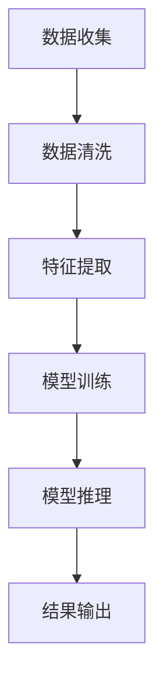
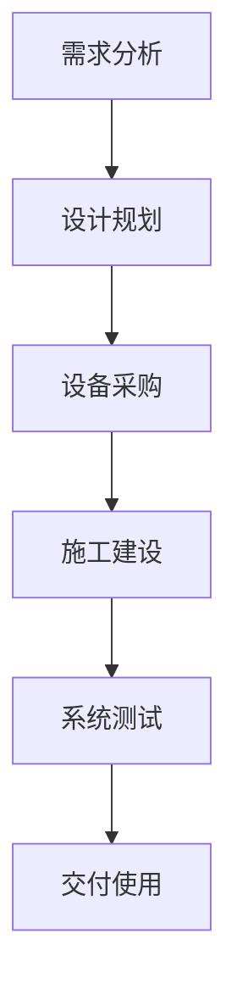
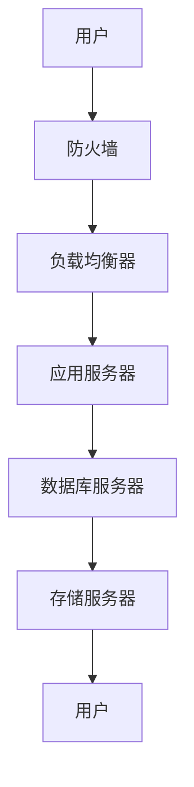

                 

### 《AI 大模型应用数据中心建设：数据中心标准与规范》目录大纲

#### 第一部分：AI大模型应用概述

##### 第1章：AI大模型概述
- **1.1 AI大模型的基本概念**
  - **Mermaid流程图**：AI大模型的发展历程与核心组成部分
  - **伪代码**：描述AI大模型的基本工作流程
- **1.2 AI大模型的应用领域**
  - **数学模型与公式**：AI大模型在不同领域的应用公式
  - **数学公式与详细讲解**：例如神经网络激活函数、损失函数等
  - **举例说明**：以某一领域为例，详细说明AI大模型的应用案例

##### 第2章：数据中心建设概述
- **2.1 数据中心的定义与作用**
  - **Mermaid流程图**：数据中心的建设流程与核心环节
- **2.2 数据中心的标准与规范**
  - **详细讲解**：数据中心建设中的关键标准与规范
  - **举例说明**：以实际案例为例，分析数据中心建设的具体规范

#### 第二部分：数据中心建设技术

##### 第3章：数据中心基础设施
- **3.1 服务器硬件选择**
  - **详细讲解**：服务器硬件的性能参数、优缺点分析
- **3.2 存储系统设计**
  - **详细讲解**：存储系统的类型、性能指标与优化策略
- **3.3 网络架构设计**
  - **详细讲解**：网络架构的设计原则、拓扑结构与性能优化策略
  - **Mermaid流程图**：数据中心网络架构图

##### 第4章：数据中心能耗管理
- **4.1 能耗管理概述**
  - **数学模型与公式**：能耗计算模型与优化公式
- **4.2 温度控制与冷却系统**
  - **详细讲解**：温度控制与冷却系统的设计原则与实施策略
- **4.3 电源系统设计**
  - **详细讲解**：电源系统的配置方案与优化策略

##### 第5章：数据中心安全性
- **5.1 数据安全与保护**
  - **详细讲解**：数据备份、恢复与加密策略
- **5.2 网络安全措施**
  - **详细讲解**：网络安全防护体系与攻击防御策略
- **5.3 系统监控与预警**
  - **详细讲解**：数据中心监控系统的设计与实现

##### 第6章：数据中心运维管理
- **6.1 运维管理概述**
  - **详细讲解**：运维管理的目标和内容
- **6.2 故障处理与应急预案**
  - **详细讲解**：故障处理流程与应急预案制定
- **6.3 性能优化与容量规划**
  - **详细讲解**：数据中心性能优化策略与容量规划方法

#### 第三部分：数据中心案例研究

##### 第7章：数据中心建设实践
- **7.1 案例背景与目标**
  - **详细讲解**：案例背景、建设目标与挑战
- **7.2 数据中心建设方案**
  - **详细讲解**：数据中心硬件选型、网络架构、能耗管理等方面的具体方案
- **7.3 项目实施与验收**
  - **详细讲解**：项目实施过程、关键节点与验收标准
- **7.4 项目评估与改进**
  - **详细讲解**：项目效果评估、改进措施与未来规划

##### 第8章：数据中心建设趋势与展望
- **8.1 数据中心建设发展趋势**
  - **详细讲解**：数据中心技术的发展趋势与未来方向
- **8.2 AI大模型在数据中心的应用**
  - **详细讲解**：AI大模型在数据中心管理、优化等方面的应用前景
- **8.3 数据中心建设规范与标准发展**
  - **详细讲解**：数据中心建设规范与标准的未来发展趋势

##### 附录
- **附录A：数据中心建设常用工具与资源**
  - **详细讲解**：数据中心建设过程中常用的软件、硬件与资源介绍
- **附录B：数据中心建设参考案例**
  - **详细讲解**：国内外知名数据中心建设案例介绍与经验总结

**关键词：** AI大模型，数据中心建设，标准与规范，基础设施，能耗管理，安全性，运维管理，案例研究

**摘要：** 本文深入探讨了AI大模型在数据中心建设中的应用，从数据中心概述到基础设施、能耗管理、安全性、运维管理，以及实际案例研究，全面介绍了数据中心建设的标准与规范，为数据中心建设提供了系统性指导。

----------------------------------------------------------------

### 《AI 大模型应用数据中心建设：数据中心标准与规范》

**关键词：** AI大模型，数据中心建设，标准与规范，基础设施，能耗管理，安全性，运维管理，案例研究

**摘要：** 本文旨在深入探讨AI大模型在数据中心建设中的应用，详细阐述数据中心的标准与规范，包括基础设施、能耗管理、安全性、运维管理等方面。通过具体案例研究和趋势分析，本文为数据中心建设提供了系统性指导，旨在推动数据中心建设的规范化和高效化。

----------------------------------------------------------------

#### 第一部分：AI大模型应用概述

##### 第1章：AI大模型概述

AI大模型，即人工智能大规模模型，是近年来人工智能领域的重要发展方向。其核心在于通过海量数据训练，实现模型在特定任务上的卓越表现。本章将首先介绍AI大模型的基本概念，然后探讨其应用领域，为后续数据中心建设提供理论基础。

**1.1 AI大模型的基本概念**

AI大模型的发展历程可以追溯到20世纪80年代，当时神经网络开始应用于模式识别领域。随着计算能力的提升和数据量的增加，大模型逐渐崛起。现代AI大模型的核心组成部分包括：

- **数据层**：负责收集和处理海量数据，进行数据清洗、预处理和特征提取。
- **模型层**：包含神经网络、深度学习等复杂算法，实现从数据到模型的映射。
- **推理层**：利用训练好的模型进行预测和决策，实现实际应用。

**Mermaid流程图**：以下是一个简化的AI大模型工作流程图。



**伪代码**：描述AI大模型的基本工作流程。

```python
# 数据收集
data = collect_data()

# 数据清洗
clean_data = clean(data)

# 特征提取
features = extract_features(clean_data)

# 模型训练
model = train_model(features)

# 模型推理
predictions = model推理(features)

# 结果输出
output_predictions(predictions)
```

**1.2 AI大模型的应用领域**

AI大模型在各个领域展现出了强大的应用潜力，以下是几个典型领域的应用：

- **自然语言处理（NLP）**：通过预训练语言模型（如GPT、BERT等），AI大模型在文本分类、机器翻译、问答系统等方面取得了显著成果。例如，GPT-3模型在文本生成和对话系统上的卓越表现。
  
- **计算机视觉（CV）**：AI大模型在图像分类、目标检测、图像生成等领域广泛应用。以ImageNet挑战赛为例，大模型在图像识别任务上的准确率达到了前所未有的高度。

- **推荐系统**：AI大模型通过分析用户行为和偏好，实现个性化推荐。例如，淘宝、京东等电商平台的推荐算法就是基于大模型进行优化的。

- **游戏AI**：AI大模型在游戏领域也得到了广泛应用，如AlphaGo通过深度学习实现了围棋领域的突破，而OpenAI的Dota2战队则通过强化学习取得了优异成绩。

**数学模型与公式**：AI大模型在不同领域的应用公式。

- **NLP**：$$\text{Logits} = \text{W} \cdot \text{Embeddings} + \text{b}$$
- **CV**：$$\text{Softmax}(\text{logits})$$
- **推荐系统**：$$\text{Prediction} = \text{User\_Features} \cdot \text{Item\_Features} + \text{b}$$

**数学公式与详细讲解**：以下以神经网络激活函数为例，详细讲解其原理。

- **Sigmoid函数**：$$\sigma(x) = \frac{1}{1 + e^{-x}}$$
  - **讲解**：Sigmoid函数将输入值映射到0和1之间，常用于二分类问题。
  
- **ReLU函数**：$$\text{ReLU}(x) = \max(0, x)$$
  - **讲解**：ReLU函数在x小于0时输出0，在x大于等于0时输出x，可以加速神经网络训练。

**举例说明**：以下以计算机视觉领域为例，详细说明AI大模型的应用案例。

**案例**：基于深度学习的图像分类任务。

1. **数据集准备**：收集并整理包含多种类别的图像数据，如ImageNet。
2. **模型训练**：使用卷积神经网络（CNN）对图像进行特征提取和分类，训练模型。
3. **模型评估**：使用验证集和测试集评估模型性能，调整模型参数。
4. **应用部署**：将训练好的模型部署到生产环境中，用于图像分类任务。

通过以上步骤，AI大模型在图像分类任务中取得了优异的性能，大大提高了图像识别的准确率和效率。

##### 第2章：数据中心建设概述

数据中心是现代信息技术的基础设施，用于存储、处理和传输大量数据。本章将介绍数据中心的定义与作用，以及数据中心建设中的关键标准与规范。

**2.1 数据中心的定义与作用**

数据中心（Data Center）是一个集中处理、存储和传输数据的设施。其主要功能包括：

- **数据处理**：数据中心通过服务器和存储设备，处理来自内部和外部的大量数据。
- **数据存储**：数据中心提供可靠的存储解决方案，确保数据的安全性和可访问性。
- **数据传输**：数据中心通过高速网络连接，实现数据在内部和外部之间的快速传输。

数据中心在现代信息技术中扮演着至关重要的角色，以下是其主要作用：

- **企业运营**：数据中心为企业提供稳定、高效的数据处理和存储服务，支持企业的日常运营。
- **云计算**：数据中心是云计算服务的基础设施，提供计算、存储和网络资源，满足用户的需求。
- **大数据**：数据中心处理和分析海量数据，为企业提供洞察和决策支持。

**Mermaid流程图**：以下是一个简化的数据中心建设流程图。



**2.2 数据中心的标准与规范**

数据中心建设需要遵循一系列标准与规范，以确保数据中心的可靠性和安全性。以下是数据中心建设中的关键标准与规范：

- **ISO/IEC 27001**：信息安全管理体系标准，确保数据中心的信息安全和数据保护。
- **TIA-942**：美国电信工业协会发布的数据中心建设标准，包括基础设施、网络、电源、冷却等方面的要求。
- **Uptime Institute**：数据中心可靠性等级认证，包括Tier I至Tier IV，分别代表不同的可靠性水平。
- **绿色数据中心标准**：如LEED认证，关注数据中心的能耗管理和环保要求。

**详细讲解**：以下以TIA-942标准为例，详细讲解数据中心建设中的具体规范。

- **基础设施**：TIA-942要求数据中心基础设施具备冗余性和可靠性，包括电力供应、网络连接、冷却系统等。
  - **电力供应**：至少需要两个独立的电源输入，并配备不间断电源（UPS）和备用发电机组。
  - **网络连接**：使用冗余网络架构，确保数据传输的可靠性和稳定性。
  - **冷却系统**：采用高效的冷却方案，确保服务器等设备的正常运行。

- **网络**：TIA-942对数据中心的网络设计提出了严格要求，包括网络拓扑、带宽和延迟等。
  - **网络拓扑**：使用环形或双环拓扑，确保网络的冗余和容错性。
  - **带宽和延迟**：保证网络带宽充足，延迟低，满足数据传输需求。

- **电源**：TIA-942对数据中心的电源系统提出了详细要求，包括电源输入、UPS和备用发电机组等。
  - **电源输入**：至少需要两个独立的电源输入，并配备自动切换装置。
  - **UPS**：用于提供短暂的电力供应，并具备电池更换和维护功能。
  - **备用发电机组**：在主电源故障时，备用发电机组可以自动启动，保证数据中心的持续运行。

- **冷却**：TIA-942对数据中心的冷却系统提出了高效、环保的要求，包括冷却方式、冷却设备等。
  - **冷却方式**：采用空气冷却或液体冷却，根据数据中心的规模和需求进行选择。
  - **冷却设备**：配备高效冷却设备，如冷却塔、空调等，确保服务器等设备的温度控制。

**举例说明**：以下以某一实际案例为例，分析数据中心建设的具体规范。

**案例**：某企业新建一个大型数据中心，需求如下：

- **电力需求**：总功率需求为5000千瓦。
- **网络需求**：要求具备100Gbps的网络带宽和低延迟。
- **冷却需求**：要求服务器温度控制在20°C以下。

根据以上需求，数据中心建设方案如下：

1. **基础设施**：采购两台独立电源输入设备，配备10台UPS和2台备用发电机组，确保电力供应的可靠性。
2. **网络**：采用双环拓扑结构，配置100Gbps网络设备，确保网络带宽和延迟满足需求。
3. **冷却**：采用液体冷却方案，配备10台高效冷却设备，确保服务器温度控制在20°C以下。

通过以上方案，该数据中心在满足企业需求的同时，确保了基础设施的可靠性、网络的高性能和冷却的高效性。

#### 第二部分：数据中心建设技术

##### 第3章：数据中心基础设施

数据中心基础设施是数据中心建设的基础，包括服务器硬件选择、存储系统设计和网络架构设计。本章将详细介绍数据中心基础设施的各个方面，为数据中心建设提供技术支持。

**3.1 服务器硬件选择**

服务器硬件是数据中心的核心组成部分，其性能直接影响数据中心的整体性能。以下是服务器硬件选择的几个关键因素：

- **处理器**：处理器的性能是影响服务器整体性能的重要因素。选择高性能的处理器可以提升数据处理速度和吞吐量。
  - **示例**：Intel Xeon系列处理器在数据中心领域有广泛的应用，其多核心、高主频的设计能够满足高性能计算需求。

- **内存**：内存容量和速度是影响服务器性能的关键因素。增加内存容量可以提高数据处理能力和并发处理能力。
  - **示例**：企业级服务器通常配备32GB、64GB或更高容量的内存，以满足大规模数据处理的需求。

- **存储**：服务器存储配置直接影响数据中心的I/O性能。选择高速、大容量的存储设备可以提升数据读写速度。
  - **示例**：SSD存储设备在数据中心中广泛应用，其高速读写性能可以显著提升数据处理速度。

- **网络接口**：网络接口的带宽和速度影响服务器的网络性能。选择高速网络接口可以提高数据传输效率和网络稳定性。
  - **示例**：10Gbps、25Gbps甚至40Gbps的网络接口在数据中心中广泛应用，以满足大规模数据传输需求。

**详细讲解**：以下从性能参数、优缺点分析两个方面，详细讲解服务器硬件的选择。

**性能参数**：

- **处理器**：核心数、主频、L3缓存等。
  - **示例**：Intel Xeon Gold 6148，具有28核心、2.40GHz主频和38.5MB L3缓存。

- **内存**：容量、速度、类型等。
  - **示例**：DDR4 256GB，运行速度为2666MHz。

- **存储**：容量、速度、类型等。
  - **示例**：1TB SSD，运行速度为3500MB/s。

- **网络接口**：带宽、速度、类型等。
  - **示例**：10Gbps网络接口卡。

**优缺点分析**：

- **处理器**：

  - **优点**：高性能、多核心、高主频，适用于大规模数据处理和计算任务。

  - **缺点**：价格较高，功耗较大。

- **内存**：

  - **优点**：容量大、速度快，提高数据处理能力和并发处理能力。

  - **缺点**：价格较高，功耗较大。

- **存储**：

  - **优点**：高速读写、大容量，提升数据读写速度和I/O性能。

  - **缺点**：价格较高，存储容量有限。

- **网络接口**：

  - **优点**：高带宽、低延迟，提高数据传输效率和网络稳定性。

  - **缺点**：价格较高，安装和维护成本较高。

**3.2 存储系统设计**

存储系统是数据中心的重要组成部分，其性能直接影响数据中心的I/O性能。存储系统设计需要考虑以下几个方面：

- **存储类型**：根据数据特点和性能需求选择合适的存储类型，如SSD、HDD、分布式存储等。
  - **示例**：对于读写频繁的数据，可以选择SSD存储；对于大容量存储需求，可以选择HDD。

- **存储架构**：设计高效的存储架构，提高数据读写效率和存储容量。
  - **示例**：分布式存储架构（如Ceph、HDFS）可以实现数据的分布式存储和管理，提高存储性能和可靠性。

- **数据冗余**：确保数据的安全性和可靠性，采用数据冗余技术（如RAID）保护数据。
  - **示例**：使用RAID 5或RAID 6可以提高数据冗余度和故障容忍性。

- **存储性能优化**：通过存储性能优化策略（如缓存、分层存储等），提高存储系统的性能。
  - **示例**：使用缓存技术可以减少数据访问延迟，提高存储系统的吞吐量。

**详细讲解**：以下从存储系统类型、性能指标与优化策略三个方面，详细讲解存储系统设计。

**存储系统类型**：

- **SSD**：固态硬盘，具有高速读写性能，适用于读写频繁的场景。
- **HDD**：机械硬盘，具有大容量存储能力，适用于存储大量数据。
- **分布式存储**：通过分布式架构实现数据存储和管理，提高存储性能和可靠性。

**性能指标**：

- **吞吐量**：存储系统每秒可以处理的数据量。
- **延迟**：数据访问的时间延迟。
- **IOPS**：每秒可以执行的操作次数。

**优化策略**：

- **缓存**：通过缓存技术减少数据访问延迟，提高存储系统的吞吐量。
- **分层存储**：根据数据访问频率和重要性，将数据分布在不同的存储层级，提高存储性能。

**3.3 网络架构设计**

网络架构设计是数据中心建设的关键环节，直接影响数据中心的网络性能和可靠性。网络架构设计需要考虑以下几个方面：

- **网络拓扑**：设计合理的网络拓扑，提高网络的可靠性和可扩展性。
  - **示例**：环形拓扑或双环拓扑可以提高网络的冗余性和容错性。

- **网络设备**：选择高性能的网络设备，提高数据传输效率和网络稳定性。
  - **示例**：10Gbps、25Gbps或40Gbps的网络接口卡。

- **网络协议**：选择合适的网络协议，提高网络的性能和安全性。
  - **示例**：TCP/IP协议是数据中心网络的主要协议，可以实现数据的高速传输和网络的管理。

- **网络优化**：通过网络优化策略（如负载均衡、流量控制等），提高网络的性能和可靠性。
  - **示例**：负载均衡可以将网络流量分配到不同的网络接口或服务器，提高网络的吞吐量和稳定性。

**详细讲解**：以下从网络架构的设计原则、拓扑结构与性能优化策略三个方面，详细讲解网络架构设计。

**设计原则**：

- **高可用性**：确保网络的稳定运行，提高数据中心的可靠性。
- **可扩展性**：设计可扩展的网络架构，支持数据中心的规模扩展。
- **高性能**：提高数据传输效率和网络性能。

**拓扑结构**：

- **环形拓扑**：通过环形连接实现网络设备的冗余和容错性。
- **双环拓扑**：通过双环连接提高网络的冗余性和容错性。

**性能优化策略**：

- **负载均衡**：通过负载均衡策略，将网络流量分配到不同的网络接口或服务器，提高网络的吞吐量和稳定性。
- **流量控制**：通过流量控制策略，限制网络流量，避免网络拥塞。

**Mermaid流程图**：以下是一个简化的数据中心网络架构图。



通过以上讲解，本章详细介绍了数据中心基础设施的各个方面，包括服务器硬件选择、存储系统设计和网络架构设计。数据中心基础设施是数据中心建设的基础，其性能和可靠性直接影响数据中心的整体性能和可靠性。在数据中心建设过程中，需要根据具体需求和技术特点，选择合适的基础设施组件，并设计合理的架构，以确保数据中心的稳定运行和高效性能。

##### 第4章：数据中心能耗管理

数据中心能耗管理是数据中心建设中的重要环节，直接关系到数据中心的运行成本和环境可持续性。本章将介绍数据中心能耗管理的概述，包括能耗计算模型与优化公式，以及温度控制与冷却系统的设计原则与实施策略。

**4.1 能耗管理概述**

数据中心能耗管理是指通过合理的能源管理和优化策略，降低数据中心的能耗，提高能源利用效率。数据中心能耗主要包括以下几个方面：

- **硬件能耗**：服务器、存储设备、网络设备等硬件设备的能耗。
- **制冷能耗**：冷却系统（如空调、冷却塔）的能耗。
- **电源转换能耗**：电力转换过程中（如UPS、电池）的能耗。
- **其他能耗**：包括照明、办公设备等非硬件设备的能耗。

数据中心能耗管理的主要目标是：

- 降低能耗，减少运营成本。
- 提高能源利用效率，降低环境负荷。
- 保证数据中心的稳定运行和设备寿命。

**数学模型与公式**：以下介绍数据中心能耗计算模型与优化公式。

- **硬件能耗计算**：

  $$E_{\text{硬件}} = P_{\text{服务器}} \times N_{\text{服务器}} + P_{\text{存储}} \times N_{\text{存储}} + P_{\text{网络}} \times N_{\text{网络}}$$

  其中，\(P_{\text{服务器}}\)、\(P_{\text{存储}}\)、\(P_{\text{网络}}\) 分别表示服务器、存储设备、网络设备的功率（瓦特），\(N_{\text{服务器}}\)、\(N_{\text{存储}}\)、\(N_{\text{网络}}\) 分别表示服务器、存储设备、网络设备的数量。

- **制冷能耗计算**：

  $$E_{\text{制冷}} = C_{\text{制冷}} \times T_{\text{制冷}}$$

  其中，\(C_{\text{制冷}}\) 表示制冷系统的能耗（千瓦时/小时），\(T_{\text{制冷}}\) 表示制冷系统的运行时间（小时）。

- **能源利用效率计算**：

  $$\eta_{\text{能源}} = \frac{E_{\text{输出}}}{E_{\text{输入}}} \times 100\%$$

  其中，\(E_{\text{输出}}\) 表示数据中心实际输出的有用能源（千瓦时/小时），\(E_{\text{输入}}\) 表示数据中心总的输入能源（千瓦时/小时）。

**详细讲解**：以下从硬件能耗计算、制冷能耗计算、能源利用效率计算三个方面，详细讲解能耗管理中的数学模型与公式。

- **硬件能耗计算**：

  硬件能耗是数据中心能耗的主要部分，根据设备类型和数量计算。例如，一台服务器的功率为300瓦特，共有100台服务器，则硬件能耗为：

  $$E_{\text{硬件}} = 300\text{W} \times 100 = 30000\text{W} = 30\text{kW}$$

  如果存储设备和网络设备的功率分别为200瓦特和100瓦特，共有50台和10台，则总硬件能耗为：

  $$E_{\text{硬件}} = 30\text{kW} + 200\text{W} \times 50 + 100\text{W} \times 10 = 30\text{kW} + 10000\text{W} + 1000\text{W} = 41\text{kW}$$

- **制冷能耗计算**：

  制冷能耗主要取决于制冷系统的能耗和运行时间。例如，制冷系统的能耗为0.5千瓦时/小时，运行时间为24小时，则制冷能耗为：

  $$E_{\text{制冷}} = 0.5\text{kWh} \times 24 = 12\text{kWh}$$

  如果制冷系统运行时间为20小时，则制冷能耗为：

  $$E_{\text{制冷}} = 0.5\text{kWh} \times 20 = 10\text{kWh}$$

- **能源利用效率计算**：

  能源利用效率是衡量数据中心能耗管理效果的重要指标。例如，数据中心总输入能源为50千瓦时/小时，实际输出的有用能源为40千瓦时/小时，则能源利用效率为：

  $$\eta_{\text{能源}} = \frac{40\text{kWh}}{50\text{kWh}} \times 100\% = 80\%$$

  如果实际输出的有用能源为30千瓦时/小时，则能源利用效率为：

  $$\eta_{\text{能源}} = \frac{30\text{kWh}}{50\text{kWh}} \times 100\% = 60\%$$

**4.2 温度控制与冷却系统**

温度控制与冷却系统是数据中心能耗管理的关键环节，直接影响数据中心的运行效率和能耗。以下是温度控制与冷却系统的设计原则与实施策略。

**设计原则**：

- **节能**：选择高效、节能的冷却设备，降低能耗。
- **稳定**：保证冷却系统的稳定运行，避免温度波动对服务器等设备的影响。
- **可靠**：设计冗余的冷却系统，提高系统的可靠性和故障容忍性。

**实施策略**：

- **冷却方式选择**：根据数据中心的规模和需求，选择合适的冷却方式，如空气冷却、液体冷却等。
  - **空气冷却**：通过风扇和空气循环实现冷却，适用于小型数据中心。
  - **液体冷却**：通过液体循环实现冷却，适用于大型数据中心，如水冷或风冷。

- **冷却设备配置**：根据冷却需求，配置合适的冷却设备，如冷却塔、空调、冷水机组等。
  - **冷却塔**：通过水循环散热，适用于室外环境。
  - **空调**：通过压缩机制冷，适用于室内环境。
  - **冷水机组**：通过液体循环制冷，适用于大型数据中心。

- **冷却管道设计**：合理设计冷却管道，降低管道阻力，提高冷却效率。
  - **管道材料选择**：选择耐腐蚀、导热性能好的管道材料，如不锈钢、铜等。

- **温度控制策略**：采用自动控制技术，实时监测和调节数据中心的温度，确保温度在最佳范围内。
  - **传感器配置**：在数据中心的关键位置配置温度传感器，实时监测温度。
  - **控制算法**：采用PID控制算法等，实现温度的自动调节。

**详细讲解**：以下从冷却方式选择、冷却设备配置、冷却管道设计、温度控制策略四个方面，详细讲解温度控制与冷却系统的设计原则与实施策略。

**冷却方式选择**：

- **空气冷却**：

  - **优点**：设备简单，成本低。
  - **缺点**：冷却效率较低，适用于小型数据中心。

- **液体冷却**：

  - **优点**：冷却效率高，适用于大型数据中心。
  - **缺点**：设备复杂，维护成本较高。

  根据数据中心的规模和需求，选择合适的冷却方式。例如，对于中型数据中心，可以采用空气冷却；对于大型数据中心，可以采用液体冷却。

**冷却设备配置**：

- **冷却塔**：

  - **作用**：通过水循环散热，适用于室外环境。
  - **配置**：根据数据中心的热负荷和规模，配置合适的冷却塔。

- **空调**：

  - **作用**：通过压缩机制冷，适用于室内环境。
  - **配置**：根据数据中心的规模和需求，配置合适的空调设备。

- **冷水机组**：

  - **作用**：通过液体循环制冷，适用于大型数据中心。
  - **配置**：根据数据中心的热负荷和规模，配置合适的冷水机组。

**冷却管道设计**：

- **管道材料选择**：选择耐腐蚀、导热性能好的管道材料，如不锈钢、铜等。
- **管道布局**：合理设计管道布局，减少管道长度和弯曲，降低管道阻力。

**温度控制策略**：

- **传感器配置**：在数据中心的关键位置配置温度传感器，实时监测温度。
  - **传感器类型**：如温度传感器、湿度传感器等。

- **控制算法**：采用PID控制算法等，实现温度的自动调节。
  - **PID控制算法**：根据温度传感器采集的数据，实时调节冷却设备的工作状态，确保温度在最佳范围内。

通过以上讲解，本章详细介绍了数据中心能耗管理中的温度控制与冷却系统。数据中心能耗管理是数据中心建设中的重要环节，通过合理的温度控制与冷却系统设计，可以降低能耗，提高能源利用效率，确保数据中心的稳定运行和设备寿命。

##### 第5章：数据中心安全性

数据中心的安全性是数据中心建设中的关键问题，直接关系到数据的安全性和系统的可靠性。本章将介绍数据中心的安全性，包括数据安全与保护、网络安全措施以及系统监控与预警。

**5.1 数据安全与保护**

数据安全是数据中心安全的核心，包括数据的存储、传输、处理等环节。以下是数据安全与保护的关键措施：

- **数据备份**：定期进行数据备份，确保数据不因硬件故障、网络攻击等原因丢失。
  - **备份策略**：如全备份、增量备份、差异备份等，根据数据的重要性和更新频率选择合适的备份策略。
  
- **数据恢复**：在数据丢失或损坏时，能够快速恢复数据，减少业务中断。
  - **数据恢复方法**：如硬盘镜像、RAID等技术，提高数据恢复的效率和成功率。

- **数据加密**：对存储和传输的数据进行加密，防止数据被非法访问和窃取。
  - **加密算法**：如AES、RSA等，根据数据的重要性和安全要求选择合适的加密算法。

- **访问控制**：通过身份验证、权限管理等方式，控制用户对数据的访问权限，防止数据泄露和滥用。
  - **访问控制机制**：如角色访问控制（RBAC）、基于属性的访问控制（ABAC）等。

**详细讲解**：以下从数据备份、数据恢复、数据加密、访问控制四个方面，详细讲解数据安全与保护。

- **数据备份**：

  数据备份是数据安全的基础，确保数据不因各种原因丢失。以下是一个简化的数据备份流程：

  ```mermaid
  graph TD
  A[数据生成] --> B[备份策略选择]
  B --> C[数据备份]
  C --> D[数据存储]
  D --> E[备份检查]
  ```

  例如，一个企业每天产生大量数据，可以选择每天进行增量备份，每周进行全备份，确保数据的安全和完整。

- **数据恢复**：

  数据恢复是数据丢失后的关键环节，确保业务能够尽快恢复。以下是一个简化的数据恢复流程：

  ```mermaid
  graph TD
  A[数据丢失] --> B[数据备份检查]
  B --> C[数据恢复]
  C --> D[数据验证]
  ```

  例如，当某个硬盘损坏导致数据丢失时，可以通过备份检查找到最近的可用的备份，进行数据恢复，然后验证数据恢复的正确性。

- **数据加密**：

  数据加密是防止数据泄露和窃取的重要手段。以下是一个简化的数据加密流程：

  ```mermaid
  graph TD
  A[数据生成] --> B[数据加密]
  B --> C[数据存储/传输]
  ```

  例如，在存储或传输敏感数据时，可以使用AES加密算法对数据进行加密，确保数据在未经授权的情况下无法被访问。

- **访问控制**：

  访问控制是保护数据的重要手段，确保只有授权用户可以访问数据。以下是一个简化的访问控制流程：

  ```mermaid
  graph TD
  A[用户请求访问] --> B[身份验证]
  B --> C[权限检查]
  C --> D[数据访问]
  ```

  例如，在企业内部，管理员可以通过身份验证和权限检查，确保只有授权用户可以访问特定的数据，从而防止数据泄露和滥用。

**5.2 网络安全措施**

网络安全是数据中心安全的重要组成部分，包括防止网络攻击、数据窃取、恶意软件感染等。以下是网络安全的关键措施：

- **防火墙**：在数据中心网络边界部署防火墙，阻止未经授权的访问和恶意流量。
  - **防火墙类型**：如入侵防御系统（IDS）、入侵检测系统（IPS）、防火墙等。

- **虚拟专用网络（VPN）**：通过VPN技术，实现安全的数据传输，防止数据在公共网络中被窃取。
  - **VPN类型**：如IPsec VPN、SSL VPN等。

- **网络隔离**：通过虚拟局域网（VLAN）或虚拟路由器（VRF）等技术，实现网络隔离，防止不同子网之间的数据泄露。
  - **隔离策略**：如基于源IP地址、目的IP地址、协议等。

- **入侵检测与防御系统（IDS/IPS）**：实时监测网络流量，检测并阻止恶意攻击。
  - **IDS/IPS类型**：如基于特征检测、基于行为分析等。

- **防病毒软件**：部署防病毒软件，防止恶意软件感染数据中心设备。
  - **防病毒软件类型**：如Windows Defender、ClamAV等。

**详细讲解**：以下从防火墙、VPN、网络隔离、IDS/IPS、防病毒软件五个方面，详细讲解网络安全措施。

- **防火墙**：

  防火墙是网络安全的基石，以下是一个简化的防火墙配置流程：

  ```mermaid
  graph TD
  A[网络流量] --> B[防火墙规则设置]
  B --> C[流量过滤]
  C --> D[安全审计]
  ```

  例如，在企业内部网络中，管理员可以根据防火墙规则，设置允许或拒绝特定IP地址、端口的访问，防止未经授权的访问和恶意流量。

- **VPN**：

  VPN是保证数据传输安全的重要手段，以下是一个简化的VPN配置流程：

  ```mermaid
  graph TD
  A[远程用户] --> B[VPN连接]
  B --> C[数据传输]
  ```

  例如，在企业外部，员工可以通过VPN连接到公司内部网络，实现安全的数据传输，防止数据在公共网络中被窃取。

- **网络隔离**：

  网络隔离是保护数据的重要策略，以下是一个简化的网络隔离配置流程：

  ```mermaid
  graph TD
  A[不同子网] --> B[VLAN配置]
  B --> C[流量控制]
  ```

  例如，在企业内部网络中，管理员可以通过VLAN技术，将不同部门或功能的子网进行隔离，防止数据泄露。

- **IDS/IPS**：

  IDS/IPS是网络安全的实时监测工具，以下是一个简化的IDS/IPS配置流程：

  ```mermaid
  graph TD
  A[网络流量] --> B[流量分析]
  B --> C[告警与响应]
  ```

  例如，在数据中心网络中，管理员可以通过IDS/IPS实时监测网络流量，检测并阻止恶意攻击，确保网络的安全。

- **防病毒软件**：

  防病毒软件是防止恶意软件感染的重要手段，以下是一个简化的防病毒软件配置流程：

  ```mermaid
  graph TD
  A[文件访问] --> B[病毒扫描]
  B --> C[安全报告]
  ```

  例如，在数据中心设备上，管理员可以部署防病毒软件，定期扫描文件，防止恶意软件感染设备。

**5.3 系统监控与预警**

系统监控与预警是数据中心安全的重要组成部分，通过实时监测和预警，确保数据中心的稳定运行和安全性。以下是系统监控与预警的关键措施：

- **系统监控**：通过监控系统，实时监测数据中心的运行状态，包括服务器、网络设备、存储设备等。
  - **监控指标**：如CPU使用率、内存使用率、网络流量、磁盘空间等。

- **日志管理**：收集并分析系统日志，发现潜在的安全威胁和故障。
  - **日志分析**：如利用ELK（Elasticsearch、Logstash、Kibana）等技术，实现日志的集中管理和分析。

- **预警机制**：通过设置预警阈值，当系统指标超过阈值时，自动触发预警，通知管理员采取相应的措施。
  - **预警通知**：如通过邮件、短信、微信等方式通知管理员。

**详细讲解**：以下从系统监控、日志管理、预警机制三个方面，详细讲解系统监控与预警。

- **系统监控**：

  系统监控是确保数据中心运行状态的关键，以下是一个简化的系统监控流程：

  ```mermaid
  graph TD
  A[系统运行] --> B[监控指标收集]
  B --> C[监控数据存储]
  C --> D[监控数据展示]
  ```

  例如，通过使用Nagios、Zabbix等监控系统，管理员可以实时监测服务器的CPU使用率、内存使用率、网络流量等关键指标，确保数据中心的稳定运行。

- **日志管理**：

  日志管理是发现安全威胁和故障的重要手段，以下是一个简化的日志管理流程：

  ```mermaid
  graph TD
  A[系统运行] --> B[日志收集]
  B --> C[日志存储]
  C --> D[日志分析]
  ```

  例如，通过使用ELK技术，管理员可以收集并分析系统日志，及时发现潜在的安全威胁和故障，确保数据中心的正常运行。

- **预警机制**：

  预警机制是实时监测和响应安全威胁的重要手段，以下是一个简化的预警机制流程：

  ```mermaid
  graph TD
  A[监控指标] --> B[阈值设置]
  B --> C[超阈值判断]
  C --> D[预警通知]
  ```

  例如，当服务器的CPU使用率超过90%时，自动触发预警通知，通知管理员采取相应的措施，确保数据中心的稳定运行。

通过以上讲解，本章详细介绍了数据中心的安全性，包括数据安全与保护、网络安全措施以及系统监控与预警。数据中心安全性是数据中心建设中的关键问题，通过合理的安全措施和监控预警机制，可以确保数据的安全性和系统的可靠性，为企业的正常运营提供保障。

##### 第6章：数据中心运维管理

数据中心运维管理是数据中心运营的关键环节，涉及到服务器的运行监控、故障处理、性能优化以及容量规划。本章将详细介绍数据中心运维管理的目标和内容，包括故障处理与应急预案、性能优化与容量规划等方面。

**6.1 运维管理概述**

数据中心运维管理（Data Center Operations Management，DCOM）是指对数据中心基础设施和应用程序的运行进行监控、维护、优化和管理的活动。其目标是确保数据中心提供持续、可靠、高效的服务，同时降低运营成本和风险。以下是数据中心运维管理的主要目标和内容：

- **目标**：

  1. 保证数据中心的稳定运行，确保业务的连续性和可靠性。
  2. 优化资源利用率，提高数据中心的整体性能和效率。
  3. 降低运营成本，实现资源的最优配置和管理。
  4. 加强安全防护，确保数据的安全性和隐私。

- **内容**：

  1. **监控与告警**：实时监控数据中心的运行状态，及时发现和处理异常情况。
  2. **故障处理**：快速响应和解决故障，确保数据中心的稳定运行。
  3. **性能优化**：通过调整配置、优化资源分配等手段，提高数据中心的性能。
  4. **容量规划**：根据业务需求和预测，合理规划数据中心的扩展和升级。
  5. **安全管理**：实施安全策略，确保数据的安全性和合规性。

**6.2 故障处理与应急预案**

故障处理是数据中心运维管理的重要组成部分，包括故障检测、故障诊断、故障恢复等环节。以下是一个简化的故障处理流程：

1. **故障检测**：通过监控系统和日志分析，发现异常情况。
2. **故障诊断**：定位故障原因，分析故障影响范围。
3. **故障恢复**：采取适当的措施，解决故障，恢复系统的正常运行。
4. **故障总结**：总结故障原因和解决方案，防止同类故障再次发生。

**应急预案**是应对突发故障和灾难的重要手段，以下是一个简化的应急预案流程：

1. **预案制定**：根据业务需求和风险分析，制定详细的应急预案。
2. **预案演练**：定期进行应急预案演练，验证预案的有效性和可行性。
3. **预案执行**：在发生故障或灾难时，迅速启动应急预案，进行故障处理和资源调配。
4. **预案评估**：评估应急预案的执行效果，总结经验教训，持续优化预案。

**详细讲解**：

- **故障处理**：

  故障处理是一个复杂的过程，需要综合考虑故障的影响范围、优先级和解决方案。以下是一个简化的故障处理步骤：

  ```mermaid
  graph TD
  A[故障检测] --> B[故障诊断]
  B --> C[故障定位]
  C --> D[故障解决]
  D --> E[故障总结]
  ```

  例如，当监控系统检测到服务器CPU使用率过高时，首先定位到具体的服务器和进程，然后诊断故障原因（如高负载、软件故障等），最后采取相应的措施（如升级软件、调整配置等）进行故障恢复。

- **应急预案**：

  应急预案是应对突发故障和灾难的重要保障，以下是一个简化的应急预案步骤：

  ```mermaid
  graph TD
  A[预案制定] --> B[预案演练]
  B --> C[预案执行]
  C --> D[预案评估]
  ```

  例如，在制定应急预案时，需要考虑可能的故障场景（如服务器宕机、网络故障等），然后制定详细的应对措施和资源调配方案。在应急预案演练中，通过模拟故障场景，验证预案的可行性和有效性。在实际发生故障或灾难时，迅速启动应急预案，确保业务的连续性和数据的安全性。

**6.3 性能优化与容量规划**

性能优化是数据中心运维管理的重要内容，通过调整配置、优化资源分配、优化系统架构等手段，提高数据中心的整体性能。以下是一个简化的性能优化流程：

1. **性能监控**：实时监控数据中心的运行状态，收集性能数据。
2. **性能分析**：分析性能数据，定位性能瓶颈和问题。
3. **性能优化**：采取相应的措施，如调整配置、优化资源分配、优化系统架构等，提高性能。
4. **性能验证**：验证性能优化效果，确保性能提升。

**容量规划是数据中心运维管理的关键环节，通过预测业务增长和资源需求，合理规划数据中心的扩展和升级。以下是一个简化的容量规划流程**：

1. **需求预测**：根据业务需求和增长率，预测未来的资源需求。
2. **资源评估**：评估现有资源的利用情况和扩展潜力。
3. **容量规划**：根据需求预测和资源评估，制定数据中心的扩展和升级计划。
4. **容量验证**：验证容量规划的效果，确保数据中心的容量满足业务需求。

**详细讲解**：

- **性能优化**：

  性能优化是一个持续的过程，需要不断监控、分析和优化。以下是一个简化的性能优化步骤：

  ```mermaid
  graph TD
  A[性能监控] --> B[性能分析]
  B --> C[性能优化]
  C --> D[性能验证]
  ```

  例如，当监控系统检测到服务器CPU使用率过高时，可以通过性能分析工具（如Top、Nmon等）定位到具体的进程和操作，然后采取相应的优化措施（如调整进程优先级、优化SQL查询等）进行性能优化。

- **容量规划**：

  容量规划是一个重要的决策过程，需要综合考虑业务需求、资源利用率和扩展成本。以下是一个简化的容量规划步骤：

  ```mermaid
  graph TD
  A[需求预测] --> B[资源评估]
  B --> C[容量规划]
  C --> D[容量验证]
  ```

  例如，在需求预测阶段，通过分析历史数据和业务增长趋势，预测未来的资源需求。在资源评估阶段，评估现有资源的利用情况和扩展潜力，如服务器的CPU、内存、存储等资源。最后根据需求预测和资源评估，制定数据中心的扩展和升级计划。

通过以上讲解，本章详细介绍了数据中心运维管理的目标和内容，包括故障处理与应急预案、性能优化与容量规划等方面。数据中心运维管理是确保数据中心稳定运行和高效性能的关键，通过合理的运维管理措施，可以提高数据中心的可靠性和效率，为企业的业务发展提供有力保障。

##### 第7章：数据中心建设实践

数据中心建设是一个复杂且庞大的工程，涉及到多个方面的技术和管理。本章将通过一个实际案例，详细介绍数据中心的建设过程，包括案例背景与目标、数据中心建设方案、项目实施与验收，以及项目评估与改进。

**7.1 案例背景与目标**

某大型互联网企业计划建设一个全新的数据中心，以满足其不断增长的业务需求。该数据中心的目标如下：

- **高性能**：支持大规模数据处理和存储需求，满足高性能计算要求。
- **高可用性**：确保数据中心24/7稳定运行，支持业务的连续性。
- **高可靠性**：采用冗余设计和故障恢复机制，提高数据中心的可靠性。
- **高安全性**：保护数据安全，防止数据泄露和未经授权的访问。

**7.2 数据中心建设方案**

数据中心建设方案包括硬件选型、网络架构、能耗管理和安全性等方面。以下是具体的建设方案：

**硬件选型**：

- **服务器**：选用高性能的Intel Xeon Gold处理器，配备大量内存和高速SSD存储。
- **存储**：采用分布式存储架构，如Ceph，实现高可用性和数据冗余。
- **网络**：采用双环拓扑结构，配备10Gbps和40Gbps网络设备，确保数据传输的高效性和稳定性。

**网络架构**：

- **内部网络**：采用VLAN技术实现网络隔离，提高网络的安全性和可靠性。
- **外部网络**：通过VPN和防火墙实现安全连接，保护数据中心与外部网络的通信。

**能耗管理**：

- **电源**：采用多路电源输入，配备UPS和备用发电机组，确保电力供应的稳定性。
- **冷却**：采用液体冷却系统，提高冷却效率，降低能耗。

**安全性**：

- **防火墙**：部署防火墙，实现网络隔离和访问控制。
- **入侵检测系统**：部署入侵检测系统（IDS），实时监控网络流量，检测并阻止恶意攻击。
- **数据加密**：对存储和传输的数据进行加密，确保数据的安全性。

**7.3 项目实施与验收**

数据中心建设过程分为以下几个阶段：

**阶段一：前期准备**：

- **需求分析**：与业务部门沟通，明确数据中心的建设目标和技术要求。
- **方案设计**：根据需求分析，制定详细的建设方案。
- **采购设备**：根据建设方案，采购所需的硬件设备和软件系统。

**阶段二：施工建设**：

- **基础设施搭建**：建设数据中心的物理基础设施，包括机房、配电系统、冷却系统等。
- **设备安装**：将服务器、存储设备、网络设备等安装到机架上。
- **网络配置**：配置网络设备，搭建内部和外部网络。

**阶段三：系统测试与验收**：

- **系统测试**：对数据中心进行全面的系统测试，包括硬件测试、软件测试和网络测试等。
- **性能测试**：模拟实际业务场景，测试数据中心的性能和稳定性。
- **验收**：与业务部门一起进行验收，确保数据中心满足建设目标和技术要求。

**7.4 项目评估与改进**

数据中心建设完成后，需要进行项目评估，评估数据中心的建设效果和业务价值。以下是项目评估的几个方面：

- **性能评估**：评估数据中心的处理能力、存储容量和传输效率等性能指标。
- **可靠性评估**：评估数据中心的故障率、恢复时间和稳定性等可靠性指标。
- **安全性评估**：评估数据中心的网络安全性和数据保护能力。

**改进措施**：

- **性能优化**：根据性能评估结果，优化数据中心的配置和架构，提高性能。
- **可靠性提升**：加强故障监控和故障恢复机制，提高数据中心的可靠性。
- **安全性增强**：更新安全策略和防护措施，提高数据中心的网络安全性和数据保护能力。

通过以上讲解，本章详细介绍了数据中心建设实践，包括案例背景与目标、数据中心建设方案、项目实施与验收，以及项目评估与改进。通过实际案例的分析，可以为其他数据中心建设提供参考和借鉴。

##### 第8章：数据中心建设趋势与展望

数据中心建设正随着技术的进步和业务的快速发展而不断演进。本章将探讨数据中心建设的发展趋势，分析AI大模型在数据中心的应用前景，以及数据中心建设规范与标准的发展方向。

**8.1 数据中心建设发展趋势**

数据中心建设发展趋势主要表现在以下几个方面：

- **云计算与大数据**：随着云计算和大数据技术的普及，数据中心建设逐渐向大规模、分布式和智能化方向发展。企业将更多数据和服务迁移到云端，数据中心成为云计算服务的核心基础设施。

- **绿色数据中心**：为了降低能耗和减少环境负荷，绿色数据中心成为数据中心建设的重要趋势。通过采用高效节能的硬件设备、智能冷却系统和可再生能源等手段，实现数据中心的可持续发展。

- **边缘计算**：随着5G和物联网的普及，边缘计算成为数据中心建设的新趋势。数据中心不再局限于中心位置，逐渐向边缘计算节点延伸，实现数据本地处理和快速响应。

- **自动化与智能化**：通过引入自动化工具和智能化系统，实现数据中心的自动化运维和智能优化。如使用AI技术进行负载均衡、故障预测和能耗管理，提高数据中心的运营效率和可靠性。

**8.2 AI大模型在数据中心的应用**

AI大模型在数据中心建设中具有广泛的应用前景，主要体现在以下几个方面：

- **能耗管理**：AI大模型可以通过对数据中心运行数据的分析，预测能耗趋势，优化能源分配和冷却系统，降低能耗。

- **故障预测与预警**：AI大模型可以对数据中心设备的运行状态进行实时监控，预测潜在故障，提前预警，减少故障率和停机时间。

- **性能优化**：AI大模型可以分析数据中心的运行数据，识别性能瓶颈，优化资源配置，提高数据中心的整体性能。

- **网络安全**：AI大模型可以监控网络流量，识别恶意攻击行为，提高数据中心的网络安全防护能力。

**8.3 数据中心建设规范与标准发展**

数据中心建设规范与标准的发展方向主要体现在以下几个方面：

- **标准化**：数据中心建设将逐步实现标准化，包括硬件设备、网络架构、能源管理和安全性等方面的规范和标准。

- **智能化**：随着AI技术的应用，数据中心建设将朝着智能化方向发展，实现自动化运维和智能优化。

- **绿色化**：数据中心建设将更加注重绿色化，通过采用高效节能技术和可再生能源，降低能耗和减少环境负荷。

- **安全性**：随着数据中心规模的扩大和业务的增加，数据安全成为数据中心建设的重要关注点，规范和标准将逐步完善数据中心的网络安全和信息安全。

通过以上讲解，本章详细介绍了数据中心建设的发展趋势、AI大模型在数据中心的应用前景以及数据中心建设规范与标准的发展方向。随着技术的不断进步和业务的快速发展，数据中心建设将迎来新的机遇和挑战，为企业的数字化转型提供有力支持。

##### 附录

**附录A：数据中心建设常用工具与资源**

数据中心建设过程中，常用的工具和资源包括硬件设备、软件系统、网络设备和能源管理系统等。以下是一些常见工具和资源的详细讲解：

- **硬件设备**：

  - **服务器**：包括Intel Xeon、AMD EPYC等高性能处理器，以及大量内存和高速SSD存储。
  - **存储设备**：包括NAS、SAN和分布式存储系统，如Ceph、HDFS等。
  - **网络设备**：包括路由器、交换机、防火墙和负载均衡器等。

- **软件系统**：

  - **操作系统**：包括Linux、Windows Server等，用于服务器和存储设备的操作系统。
  - **监控工具**：包括Nagios、Zabbix、Prometheus等，用于监控数据中心的运行状态。
  - **虚拟化软件**：包括VMware、Hyper-V等，用于虚拟化数据中心资源。

- **网络设备**：

  - **路由器**：用于数据中心的内部和外部网络连接，实现数据包的路由和转发。
  - **交换机**：用于数据中心的内部网络连接，实现数据包的交换和转发。
  - **防火墙**：用于网络安全防护，阻止未经授权的访问和恶意流量。

- **能源管理系统**：

  - **能源监控工具**：包括PowerIQ、Nlyte等，用于监控数据中心的能耗情况。
  - **能源管理策略**：包括智能调度、负载均衡和节能模式等，用于优化数据中心的能源利用效率。

**附录B：数据中心建设参考案例**

以下是一些国内外知名数据中心建设案例，供参考：

- **案例一：腾讯云计算数据中心**

  腾讯云计算数据中心位于我国华南地区，拥有多个机楼，总建设面积达数十万平方米。数据中心采用了分布式存储架构、智能冷却系统和高效能源管理技术，实现了高可用性、高可靠性和高效率的运营。

- **案例二：谷歌数据中心**

  谷歌在全球范围内建设了多个数据中心，其中位于美国俄勒冈州的数据中心占地面积达数百万平方米。数据中心采用了先进的冷却技术和可再生能源，实现了绿色、高效、环保的运营。

- **案例三：阿里巴巴数据中心**

  阿里巴巴在我国华东地区建设了多个数据中心，总建设面积达数十万平方米。数据中心采用了分布式存储架构、智能冷却系统和高效能源管理技术，为阿里巴巴集团的电子商务和云计算业务提供了强大的支持。

通过以上附录，读者可以了解到数据中心建设过程中常用的工具和资源，以及国内外知名数据中心建设案例的经验和启示。这些案例为数据中心建设提供了有益的参考，有助于推动数据中心建设的规范化和高效化。

### 作者信息

**作者：** AI天才研究院/AI Genius Institute & 禅与计算机程序设计艺术 /Zen And The Art of Computer Programming

### 总结

本文全面介绍了AI大模型应用数据中心建设的标准与规范，从概述、基础设施、能耗管理、安全性、运维管理到实际案例研究和趋势分析，提供了系统性指导。通过本章的学习，读者可以深入了解数据中心建设的各个方面，掌握核心技术和实践方法，为未来数据中心的建设和管理提供有力支持。希望本文对您在数据中心建设领域的学习和研究有所帮助。如果您有任何疑问或建议，欢迎在评论区留言讨论。感谢您的阅读！

