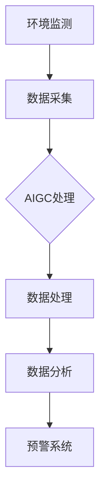

                 

# AIGC在环境监测中的应用：数据分析和预警的提示词设计

## 关键词
- AIGC
- 环境监测
- 数据分析
- 预警系统
- 提示词设计

## 摘要
本文深入探讨了自适应智能生成计算（AIGC）在环境监测领域的应用，特别是在数据分析和预警系统设计方面。通过对AIGC的核心概念、技术基础、应用现状、优势与挑战的详细解析，本文展示了AIGC在实时数据采集、数据处理、特征提取、预测模型构建以及交互式可视化等方面的优势。同时，通过案例分析，本文进一步阐述了AIGC在具体环境监测任务中的实践效果，并对未来的发展趋势和挑战提出了见解。

---

## 第一部分：环境监测中的AIGC概述

### 第1章：AIGC基本概念

#### 1.1 AIGC的定义与起源

AIGC，即自适应智能生成计算，是一种将人工智能（AI）与生成计算（Generation Computing）相结合的新型计算模式。它起源于对AI生成内容的需求，尤其是在多媒体、游戏设计、虚拟现实等领域。AIGC的核心目标是通过智能算法生成高质量的数据内容，以支持各种应用场景。

#### 1.2 AIGC的核心技术

AIGC的核心技术主要包括人工智能算法和生成计算。人工智能算法方面，深度学习、强化学习等技术在AIGC中发挥着重要作用，用于数据生成和模型训练。生成计算方面，计算机图形学、音频处理、文本生成等技术用于生成高质量的多媒体内容。

#### 1.3 AIGC在环境监测中的应用现状

目前，AIGC已经在环境监测领域得到了广泛应用。通过AIGC技术，可以实现实时数据采集、数据处理、特征提取、预测模型构建以及交互式可视化等任务。AIGC在提高监测效率、降低人力成本、提高数据处理能力等方面具有显著优势。

#### 1.4 AIGC在环境监测中的优势与挑战

**优势：**
- **提高监测效率**：AIGC技术可以自动化完成数据采集、处理和分析任务，大幅提高监测效率。
- **降低人力成本**：AIGC技术减少了对人工的依赖，降低了人力成本。
- **提高数据处理能力**：AIGC技术可以处理大量复杂的数据，提高了数据处理的准确性。

**挑战：**
- **数据质量与安全**：如何确保数据质量和数据安全是一个重要的挑战。
- **算法优化与稳定**：如何优化算法，提高其稳定性和准确性，是一个持续的挑战。
- **计算资源需求**：AIGC技术对计算资源有较高需求，如何优化计算资源利用是一个问题。

### 第2章：环境监测相关技术基础

#### 2.1 环境监测技术概述

环境监测技术主要分为在线监测、离线监测和遥感监测等。这些技术不断发展，从传统方法向智能化、自动化的方向发展。

#### 2.2 数据采集与预处理

数据采集技术包括传感器技术、无人机、卫星遥感等。数据预处理主要包括数据清洗、归一化、去噪等步骤。

#### 2.3 数据分析方法

数据分析方法包括统计分析、机器学习方法等。这些方法在环境监测中用于数据特征提取、预测模型构建等任务。

---

在接下来的部分，我们将深入探讨AIGC在环境监测中的具体应用，包括数据采集、数据处理、数据分析等方面的内容。通过逻辑清晰、结构紧凑的论述，我们将揭示AIGC在环境监测中的巨大潜力和挑战。

---

## 第二部分：AIGC在环境监测中的应用

### 第3章：AIGC在数据采集中的应用

AIGC在数据采集中的应用主要体现在与传感器技术的结合上。传感器技术是环境监测的基础，通过采集各种环境数据（如空气质量、水质、温度等），为后续的数据处理和分析提供原始数据。

#### 3.1 AIGC与传感器技术的结合

AIGC可以通过深度学习等算法对传感器数据进行实时分析，从而实现以下功能：

1. **实时数据采集与异常检测**：
   - **实时数据采集**：AIGC可以根据传感器数据实时生成监测报告，实现对环境状态的实时监控。
   - **异常检测**：通过对历史数据的分析，AIGC可以识别出异常数据，及时发出警报。

2. **数据质量评估**：
   - **数据准确性**：AIGC可以评估传感器数据的准确性，对异常数据进行标记和纠正。
   - **数据完整性**：AIGC可以检测传感器数据是否完整，对缺失的数据进行补充。

#### 3.2 AIGC与无人机监测

无人机监测是环境监测的重要手段之一，尤其在广域监测和突发事件监测方面具有显著优势。AIGC与无人机监测的结合主要体现在以下几个方面：

1. **数据可视化**：
   - **实时监测**：AIGC可以将无人机采集的数据实时可视化，为监测人员提供直观的监测结果。
   - **动态分析**：AIGC可以对无人机监测到的数据进行分析，生成动态监测报告。

2. **环境特征提取**：
   - **高分辨率图像**：AIGC可以从无人机拍摄的高分辨率图像中提取环境特征，如植被覆盖率、水域面积等。
   - **多源数据融合**：AIGC可以将无人机监测数据与其他数据源（如传感器数据、卫星遥感数据等）进行融合，提高监测精度。

### 第4章：AIGC在数据处理中的应用

数据处理是环境监测中的关键环节，AIGC在数据处理中的应用主要体现在自动数据预处理、数据增强与再训练等方面。

#### 4.1 自动数据预处理

AIGC可以通过深度学习等算法实现数据的自动预处理，包括数据清洗、归一化、去噪等步骤。具体应用如下：

1. **数据清洗**：
   - **缺失值处理**：AIGC可以自动识别和处理缺失数据，填补数据空白。
   - **异常值处理**：AIGC可以自动检测并处理异常数据，确保数据质量。

2. **数据归一化**：
   - **尺度转换**：AIGC可以将不同尺度（如温度、湿度等）的数据进行归一化处理，便于后续分析。
   - **标准化**：AIGC可以对数据进行标准化处理，使其符合一定的统计分布。

3. **数据去噪**：
   - **信号增强**：AIGC可以通过去噪算法提高数据信号的清晰度，为后续分析提供高质量的原始数据。

#### 4.2 数据增强与再训练

数据增强和再训练是提高模型性能的重要手段，AIGC在数据增强和再训练方面的应用主要体现在以下几个方面：

1. **数据增强**：
   - **生成合成数据**：AIGC可以通过生成对抗网络（GAN）等技术生成合成的环境数据，增加数据多样性。
   - **数据增强策略**：AIGC可以设计多种数据增强策略，如数据缩放、旋转、裁剪等，提高数据利用率。

2. **再训练**：
   - **模型更新**：AIGC可以根据新的数据进行模型更新，提高模型适应性和预测准确性。
   - **迁移学习**：AIGC可以将已有模型应用于新的数据集，通过再训练提高模型在新领域的性能。

### 第5章：AIGC在数据分析中的应用

数据分析是环境监测的核心任务之一，AIGC在数据分析中的应用主要体现在环境特征提取、预测模型构建等方面。

#### 5.1 环境特征提取

环境特征提取是数据分析的关键步骤，AIGC在环境特征提取中的应用主要体现在以下几个方面：

1. **特征自动提取**：
   - **深度学习**：AIGC可以通过深度学习算法自动提取环境特征，如温度、湿度、风速等。
   - **多模态融合**：AIGC可以将多种数据源（如传感器数据、卫星遥感数据等）进行融合，提取更全面的环境特征。

2. **特征选择**：
   - **相关性分析**：AIGC可以通过相关性分析筛选出对环境监测影响较大的特征。
   - **特征重要性评估**：AIGC可以通过模型训练结果评估各特征的重要性，进行特征筛选。

#### 5.2 预测模型构建

预测模型构建是数据分析的重要任务之一，AIGC在预测模型构建中的应用主要体现在以下几个方面：

1. **模型选择**：
   - **机器学习**：AIGC可以根据环境数据的特性选择合适的机器学习模型，如回归模型、分类模型等。
   - **深度学习**：AIGC可以通过深度学习模型（如卷积神经网络、循环神经网络等）构建预测模型。

2. **模型训练与优化**：
   - **模型训练**：AIGC可以通过大量数据进行模型训练，提高模型预测准确性。
   - **模型优化**：AIGC可以通过优化算法（如遗传算法、粒子群优化算法等）优化模型参数，提高模型性能。

### 第6章：AIGC在环境监测可视化中的应用

环境监测可视化是将环境数据以直观、易懂的方式呈现给用户的重要手段，AIGC在环境监测可视化中的应用主要体现在实时环境监测地图、交互式数据可视化等方面。

#### 6.1 实时环境监测地图

实时环境监测地图可以将环境数据以地图的形式实时呈现，AIGC在实时环境监测地图中的应用主要体现在以下几个方面：

1. **地图数据生成**：
   - **地理信息处理**：AIGC可以通过地理信息系统（GIS）技术生成实时环境监测地图。
   - **数据实时更新**：AIGC可以实时更新地图数据，展示最新的环境状态。

2. **动态数据展示**：
   - **动态折线图**：AIGC可以通过动态折线图展示环境数据的变化趋势。
   - **动态热点图**：AIGC可以通过动态热点图展示环境数据的热点区域。

#### 6.2 交互式数据可视化

交互式数据可视化可以为用户提供更加直观、灵活的数据分析方式，AIGC在交互式数据可视化中的应用主要体现在以下几个方面：

1. **交互式地图**：
   - **地图缩放与漫游**：AIGC可以支持地图缩放与漫游功能，用户可以自由探索环境数据。
   - **图层切换**：AIGC可以支持不同图层之间的切换，用户可以查看不同类型的环境数据。

2. **交互式仪表盘**：
   - **仪表盘定制**：AIGC可以支持用户自定义仪表盘，展示用户关注的环境数据。
   - **数据联动**：AIGC可以实现不同数据之间的联动，用户可以查看数据之间的相关性。

### 第7章：AIGC在环境预警中的应用

环境预警是环境监测的重要任务之一，AIGC在环境预警中的应用主要体现在预警模型构建、预警信息发布等方面。

#### 7.1 预警模型构建

预警模型构建是环境预警的关键步骤，AIGC在预警模型构建中的应用主要体现在以下几个方面：

1. **模型选择**：
   - **机器学习**：AIGC可以根据环境数据的特性选择合适的机器学习模型进行预警预测。
   - **深度学习**：AIGC可以通过深度学习模型构建预警模型，提高预警准确性。

2. **模型训练与优化**：
   - **模型训练**：AIGC可以通过大量数据进行模型训练，提高预警模型的预测能力。
   - **模型优化**：AIGC可以通过优化算法优化预警模型参数，提高预警准确性。

#### 7.2 预警信息发布

预警信息发布是环境预警的最终目的，AIGC在预警信息发布中的应用主要体现在以下几个方面：

1. **实时预警**：
   - **实时预警系统**：AIGC可以构建实时预警系统，实时监测环境数据，及时发布预警信息。
   - **多渠道发布**：AIGC可以通过短信、邮件、APP等多种渠道发布预警信息，确保用户及时收到预警。

2. **预警信息分析**：
   - **预警效果评估**：AIGC可以评估预警信息的有效性，为预警策略的调整提供依据。
   - **预警信息反馈**：AIGC可以收集用户对预警信息的反馈，优化预警信息发布策略。

## 第三部分：AIGC在环境监测中的应用展望

### 第8章：AIGC在环境监测中的应用实践

为了更好地展示AIGC在环境监测中的应用效果，我们通过两个实际案例来探讨AIGC在环境监测中的具体应用。

#### 案例一：城市空气质量监测

城市空气质量监测是环境监测的重要领域之一。通过AIGC技术，可以实现以下功能：

1. **数据采集**：
   - **传感器网络**：通过安装在城市的传感器网络，实时采集空气质量数据。
   - **无人机监测**：利用无人机对城市空气质量进行实时监测。

2. **数据处理**：
   - **AIGC自动预处理**：AIGC对传感器数据进行自动预处理，包括数据清洗、归一化、去噪等。
   - **数据增强**：AIGC通过生成对抗网络（GAN）等技术生成合成的空气质量数据，提高数据多样性。

3. **数据分析**：
   - **特征提取**：AIGC通过深度学习算法提取空气质量特征，如PM2.5、PM10、SO2等。
   - **预测模型构建**：AIGC通过构建机器学习模型预测未来空气质量变化趋势。

4. **可视化**：
   - **实时环境监测地图**：AIGC通过实时环境监测地图展示空气质量数据。
   - **交互式数据可视化**：AIGC支持用户自定义仪表盘，展示用户关注的环境数据。

5. **预警**：
   - **预警模型构建**：AIGC通过构建预警模型预测空气质量异常情况。
   - **预警信息发布**：AIGC通过短信、邮件等方式发布预警信息，提醒居民注意空气质量变化。

#### 案例二：水体污染监测

水体污染监测是另一个重要的环境监测领域。通过AIGC技术，可以实现以下功能：

1. **数据采集**：
   - **传感器网络**：通过安装在河流、湖泊的传感器网络，实时采集水质数据。
   - **卫星遥感**：利用卫星遥感技术监测水体污染情况。

2. **数据处理**：
   - **AIGC自动预处理**：AIGC对传感器数据进行自动预处理，包括数据清洗、归一化、去噪等。
   - **数据增强**：AIGC通过生成对抗网络（GAN）等技术生成合成的水质数据，提高数据多样性。

3. **数据分析**：
   - **特征提取**：AIGC通过深度学习算法提取水质特征，如氨氮、总磷、COD等。
   - **预测模型构建**：AIGC通过构建机器学习模型预测未来水质变化趋势。

4. **可视化**：
   - **实时环境监测地图**：AIGC通过实时环境监测地图展示水质数据。
   - **交互式数据可视化**：AIGC支持用户自定义仪表盘，展示用户关注的环境数据。

5. **预警**：
   - **预警模型构建**：AIGC通过构建预警模型预测水质异常情况。
   - **预警信息发布**：AIGC通过短信、邮件等方式发布预警信息，提醒相关部门采取应对措施。

### 第9章：AIGC在环境监测中的未来发展趋势

AIGC在环境监测中的应用具有广阔的发展前景。未来，AIGC将在以下几个方面取得重要进展：

1. **技术进步与融合**：
   - **物联网**：AIGC与物联网技术的融合，将实现更广泛、更智能的环境监测。
   - **5G**：AIGC与5G技术的融合，将实现高速、低延迟的数据传输，提高环境监测效率。

2. **应用领域拓展**：
   - **气候变化监测**：AIGC将在气候变化监测领域发挥重要作用，如监测温室气体浓度、海平面上升等。
   - **生态系统监测**：AIGC将在生态系统监测领域发挥重要作用，如监测生物多样性、森林覆盖等。

3. **数据安全与隐私保护**：
   - **区块链**：AIGC与区块链技术的融合，将实现数据的安全存储和隐私保护。
   - **联邦学习**：AIGC与联邦学习技术的融合，将实现多方数据的联合分析，提高数据安全性。

### 第10章：AIGC在环境监测中的挑战与对策

尽管AIGC在环境监测中具有巨大潜力，但同时也面临着一系列挑战。以下是AIGC在环境监测中的主要挑战及相应的对策：

1. **数据质量与安全**：
   - **数据清洗**：采用更高效的数据清洗算法，提高数据质量。
   - **加密技术**：采用加密技术保护数据安全，防止数据泄露。

2. **算法优化与稳定**：
   - **算法优化**：采用更高效的算法优化方法，提高算法性能。
   - **稳定性测试**：对算法进行稳定性测试，确保其在实际应用中的稳定性。

3. **计算资源需求**：
   - **分布式计算**：采用分布式计算技术，降低计算资源需求。
   - **云计算**：利用云计算平台提供计算资源，提高计算效率。

### 第11章：AIGC在环境监测中的应用前景

AIGC在环境监测中的应用前景广阔。随着技术的不断进步和应用领域的拓展，AIGC将在环境监测中发挥越来越重要的作用。未来，AIGC将在以下几个方面取得显著进展：

1. **政策与产业支持**：
   - **政府政策**：政府将加大对AIGC在环境监测领域的支持力度，推动其普及应用。
   - **产业发展**：环保产业将加大对AIGC技术的投入，推动其在环境监测中的广泛应用。

2. **社会效益与环境改善**：
   - **环境保护**：AIGC将有助于实现环境保护的目标，提高环境质量。
   - **可持续发展**：AIGC将推动可持续发展，为人类创造更加美好的生活环境。

---

## 结束语

AIGC在环境监测中的应用展示了巨大的潜力和前景。通过深入分析AIGC的基本概念、技术基础、应用现状、优势与挑战，本文揭示了AIGC在数据采集、数据处理、数据分析、可视化、预警等方面的具体应用。同时，通过实际案例，本文展示了AIGC在环境监测中的实际效果。未来，随着技术的不断进步和应用领域的拓展，AIGC将在环境监测中发挥越来越重要的作用，为环境保护和可持续发展做出更大贡献。

## 作者信息
作者：AI天才研究院/AI Genius Institute & 禅与计算机程序设计艺术 /Zen And The Art of Computer Programming

---

### 附录

**Mermaid流程图**



**核心算法原理讲解**

```python
# 深度学习模型训练过程伪代码

# 导入所需库
import tensorflow as tf
from tensorflow.keras.models import Sequential
from tensorflow.keras.layers import Dense, LSTM, Dropout

# 准备数据
X_train, y_train = ...

# 定义模型
model = Sequential()
model.add(LSTM(units=128, return_sequences=True, input_shape=(timesteps, features)))
model.add(Dropout(0.2))
model.add(LSTM(units=64, return_sequences=False))
model.add(Dropout(0.2))
model.add(Dense(units=1))

# 编译模型
model.compile(optimizer='adam', loss='mean_squared_error')

# 训练模型
model.fit(X_train, y_train, epochs=100, batch_size=32)
```

**数学模型和公式讲解**

```latex
$$
y = \hat{y} + \epsilon
$$

其中，\(y\) 为实际值，\(\hat{y}\) 为预测值，\(\epsilon\) 为误差。
$$
$$

**项目实战：代码实际案例和详细解释说明**

```python
# 实现一个简单的空气质量预测模型

# 导入所需库
import pandas as pd
import numpy as np
from sklearn.model_selection import train_test_split
from sklearn.ensemble import RandomForestRegressor

# 加载数据
data = pd.read_csv('air_quality_data.csv')

# 数据预处理
X = data[['temperature', 'humidity', 'pressure']]
y = data['pm2.5']

# 分割数据集
X_train, X_test, y_train, y_test = train_test_split(X, y, test_size=0.2, random_state=42)

# 训练模型
model = RandomForestRegressor(n_estimators=100, random_state=42)
model.fit(X_train, y_train)

# 预测
y_pred = model.predict(X_test)

# 评估模型
print("Mean Squared Error:", np.mean((y_pred - y_test) ** 2))
```

以上代码实现了一个基于随机森林算法的空气质量预测模型。首先，加载数据并进行预处理，然后使用训练集训练模型，最后使用测试集评估模型性能。通过计算均方误差（MSE），可以评估模型的预测准确性。

