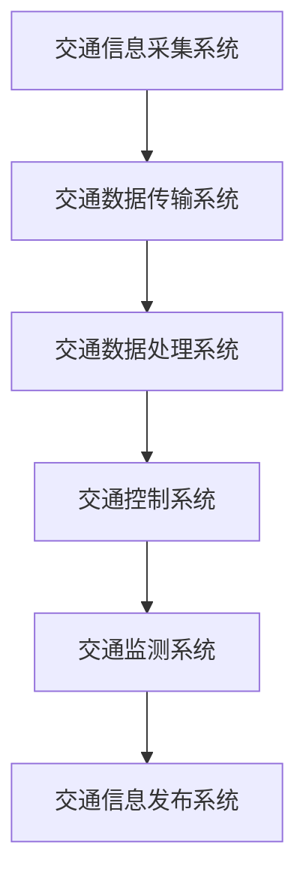
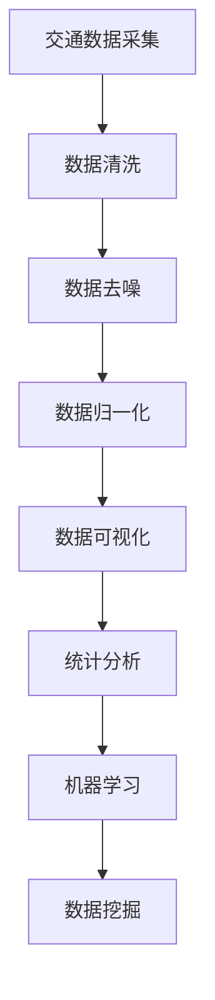
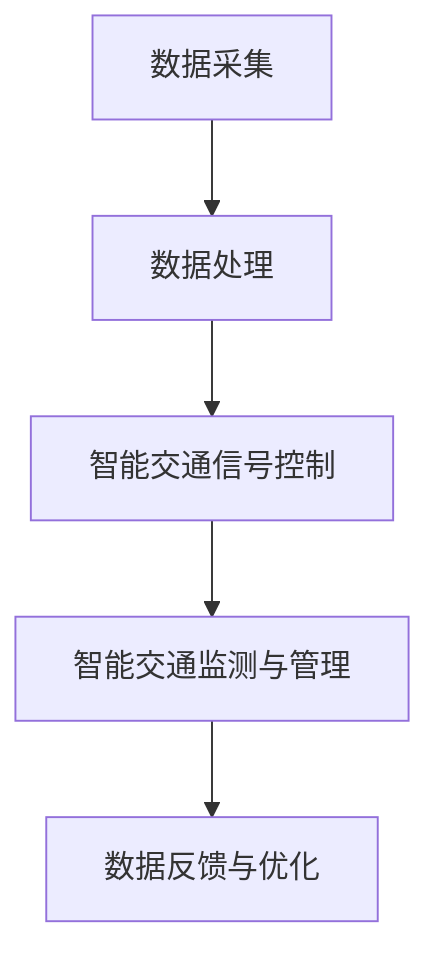

                 

# AIGC的未来交通规划：智能路网设计的提示词工程

## 摘要

随着人工智能（AI）技术的快速发展，人工智能生成内容（AIGC）正在逐渐改变交通规划与管理的传统模式。本文旨在探讨AIGC在智能路网设计中的应用，通过逐步分析智能交通系统与AIGC的关系，深入阐述智能路网设计的基本原理、核心算法及其未来趋势。文章首先概述了AIGC和智能交通系统的基本概念，然后详细介绍了智能路网设计的重要性、原理、核心算法以及实践案例。最后，本文探讨了智能路网设计的未来发展趋势，包括新技术、可持续发展和安全与隐私保护等方面。通过本文的探讨，希望能够为交通规划者和工程师提供有价值的参考。

## 目录

### 《AIGC的未来交通规划：智能路网设计的提示词工程》目录大纲

#### 第一部分：AIGC与智能交通概述

- 第1章: AIGC与智能交通概述
  - 1.1 AIGC的基本概念与发展历程
  - 1.2 智能交通系统概述
  - 1.3 智能路网设计的重要性

#### 第二部分：智能路网设计原理

- 第2章: 智能路网设计原理
  - 2.1 智能路网架构
  - 2.2 数据采集与处理
  - 2.3 智能交通信号控制
  - 2.4 智能交通监测与管理

#### 第三部分：智能路网设计核心算法

- 第3章: 智能路网设计核心算法
  - 3.1 机器学习算法在智能交通中的应用
  - 3.2 深度学习算法在智能交通中的应用
  - 3.3 强化学习算法在智能交通中的应用

#### 第四部分：智能路网设计实践

- 第4章: 智能路网设计实践
  - 4.1 智能交通信号控制系统设计
  - 4.2 智能交通监测与管理系统设计
  - 4.3 智能路网设计综合案例

#### 第五部分：智能路网设计的未来趋势

- 第5章: 智能路网设计的未来趋势
  - 5.1 智能路网设计的新技术
  - 5.2 智能路网设计的可持续发展
  - 5.3 智能路网设计的安全与隐私保护

#### 第六部分：附录

- 附录A: 智能路网设计工具与资源
- 附录B: 术语表
- 附录C: Mermaid 流程图与伪代码示例

### AIGC与智能交通概述

#### 1.1 AIGC的基本概念与发展历程

**AIGC（Artificial Intelligence Generated Content）**，即人工智能生成内容，是指通过人工智能技术，如自然语言处理、图像识别、生成对抗网络（GAN）等，自动生成文字、图片、音频、视频等多样化内容。AIGC的核心在于将AI模型应用于内容创作，实现内容生成的自动化和个性化。

**AIGC的发展历程**可以追溯到20世纪80年代，当时的研究主要集中在专家系统和知识表示领域。随着计算机性能的不断提升和大数据的广泛应用，深度学习和生成对抗网络等技术的发展，AIGC逐渐从理论研究走向实际应用。

AIGC的发展可以分为以下几个阶段：

1. **初级阶段**：以规则驱动和模板匹配为基础，生成的内容相对简单。
2. **中级阶段**：结合统计模型和机器学习算法，生成的内容更具多样性和创意。
3. **高级阶段**：引入深度学习技术，尤其是生成对抗网络（GAN），生成的内容接近甚至超越人类水平。

在智能交通领域，AIGC的应用已经初见端倪。例如，通过AIGC技术生成个性化的交通路线规划、智能交通信号控制策略以及交通数据可视化等。随着技术的不断进步，AIGC在智能交通中的应用将越来越广泛。

#### 1.2 智能交通系统概述

**智能交通系统（Intelligent Transportation System，ITS）**是一种利用先进的信息通信技术、控制技术和系统集成技术，实现交通管理、控制和服务的智能化系统。智能交通系统旨在提高交通效率、减少交通事故、降低环境污染和能源消耗。

**智能交通系统的定义**：智能交通系统是指通过计算机、通信、传感器、控制等技术的集成应用，实现对交通运输系统进行实时监控、信息处理、决策支持和自动控制，从而提高交通运输系统的运行效率和安全性。

**智能交通系统的分类**：

1. **基础设施类应用**：包括智能路侧设备、智能交通信号控制、智能停车场管理、智能收费系统等。
2. **车辆类应用**：包括智能导航、车辆自组织通信、自动驾驶、车辆健康状况监测等。
3. **公众服务类应用**：包括实时交通信息发布、交通事件预警、紧急救援服务、交通教育培训等。

**智能交通系统的核心组成部分**：

1. **交通信息采集系统**：包括各种传感器、摄像头、GPS等设备，用于实时采集交通数据。
2. **交通数据处理与分析系统**：通过对采集到的交通数据进行分析和处理，为交通管理提供决策支持。
3. **交通控制系统**：通过控制信号灯、路侧设备等，实现交通流的优化和管理。
4. **车辆管理系统**：通过车辆自组织通信技术，实现车辆的智能调度和协作。
5. **公众信息服务系统**：为公众提供实时交通信息、路线规划、天气预报等服务。

**智能交通系统的特点与优势**：

1. **实时性**：能够实时监测和分析交通状况，迅速响应交通事件。
2. **高效性**：通过优化交通流，提高道路通行效率，减少拥堵和交通事故。
3. **安全性**：通过智能监控和预警，降低交通事故的发生概率。
4. **节能性**：通过优化交通流，减少车辆行驶时间和油耗，降低能源消耗。

#### 1.3 智能路网设计的重要性

**智能路网设计**是智能交通系统的核心组成部分，其重要性体现在以下几个方面：

1. **交通效率提升**：智能路网设计可以通过优化交通信号控制和交通流量管理，提高道路通行效率，减少交通拥堵。
2. **安全性增强**：智能路网设计可以通过实时监测交通状况，提前预警潜在风险，提高道路安全性。
3. **环境友好**：智能路网设计可以通过减少车辆行驶时间和油耗，降低碳排放，实现交通可持续发展。
4. **资源节约**：智能路网设计可以通过优化交通流量，减少道路维修和扩建需求，节约财政资源。

**智能路网设计的目标**：

1. **提高交通效率**：通过实时监测和分析交通流量，优化交通信号控制策略，提高道路通行效率。
2. **提高道路安全性**：通过实时监测交通状况，提前预警潜在风险，减少交通事故发生。
3. **优化交通流量**：通过智能交通信号控制和交通流量管理，实现交通流量的均衡分布，减少拥堵。
4. **节能环保**：通过优化交通流量，减少车辆行驶时间和油耗，降低碳排放。

**智能路网设计的挑战与机遇**：

**挑战**：

1. **数据量巨大**：交通数据种类繁多，数据量巨大，如何有效处理和分析这些数据是关键挑战。
2. **实时性要求高**：交通状况实时变化，对数据处理和分析的实时性要求非常高。
3. **系统复杂性**：智能路网设计涉及多个系统和设备，系统复杂性高，需要解决系统整合和协调问题。

**机遇**：

1. **技术进步**：随着AI、物联网、5G等技术的快速发展，为智能路网设计提供了强大的技术支持。
2. **政策支持**：政府加大对智能交通领域的投入，为智能路网设计提供了良好的政策环境。
3. **市场需求**：随着城市化进程的加快，对智能交通和高效交通的需求日益增长，为智能路网设计提供了广阔的市场空间。

### 智能路网设计原理

智能路网设计是智能交通系统的核心组成部分，其目标是优化交通流量、提高道路通行效率和安全性，同时实现交通的可持续发展。智能路网设计涉及多个领域的技术，包括数据采集与处理、智能交通信号控制、智能交通监测与管理等。在本章中，我们将详细探讨智能路网设计的基本原理和关键技术。

#### 2.1 智能路网架构

智能路网架构是智能路网设计的核心，其目的是实现交通数据的实时采集、传输、处理和反馈，从而实现对交通流量的实时控制和优化。智能路网架构通常包括以下几个关键组成部分：

1. **交通信息采集系统**：交通信息采集系统是智能路网架构的基础，主要用于实时采集交通数据，包括交通流量、速度、密度、交通事故等信息。交通信息采集系统通常包括传感器、摄像头、GPS等设备。其中，传感器主要用于采集道路上的车辆速度、密度等信息；摄像头用于实时监测道路状况；GPS则用于定位车辆位置。

2. **交通数据传输系统**：交通数据传输系统用于将采集到的交通数据实时传输到数据中心进行处理。交通数据传输系统通常采用无线传输技术，如Wi-Fi、4G、5G等，以确保数据传输的实时性和可靠性。

3. **交通数据处理系统**：交通数据处理系统是智能路网的核心，主要用于对采集到的交通数据进行处理、分析和挖掘。交通数据处理系统通常采用分布式计算和大数据处理技术，如Hadoop、Spark等，以实现对大规模交通数据的快速处理和分析。

4. **交通控制系统**：交通控制系统用于对交通信号灯、道路指示标志等进行实时控制和调节，以优化交通流量。交通控制系统通常采用智能交通信号控制算法，如基于排队理论的信号控制算法、基于机器学习的信号控制算法等。

5. **交通监测系统**：交通监测系统用于实时监测交通状况，包括交通流量、速度、密度等信息。交通监测系统可以帮助交通管理部门及时了解交通状况，为交通控制和优化提供数据支持。

6. **交通信息发布系统**：交通信息发布系统用于将处理后的交通信息实时发布给公众，包括实时交通信息、路况信息、路线规划等。交通信息发布系统可以通过多种渠道，如网站、移动应用、广播等，为公众提供便捷的交通信息服务。

下面是智能路网架构的Mermaid流程图：



#### 2.2 数据采集与处理

数据采集与处理是智能路网设计的关键环节，其目的是实时、准确地采集交通数据，并对数据进行处理、分析和挖掘，为交通控制和优化提供数据支持。下面将详细介绍数据采集与处理的过程。

##### 2.2.1 交通数据的种类与来源

交通数据主要包括以下几种类型：

1. **车辆信息数据**：包括车辆速度、密度、位置等。车辆信息数据可以通过安装在道路上的传感器、摄像头、GPS等设备实时采集。

2. **路况信息数据**：包括道路拥堵情况、交通事故、道路施工等。路况信息数据可以通过摄像头、传感器、交通监测系统等设备实时采集。

3. **交通流量数据**：包括道路上的车辆流量、流向等。交通流量数据可以通过安装在道路上的传感器、流量监测设备等实时采集。

4. **交通环境数据**：包括天气、温度、湿度等。交通环境数据可以通过气象传感器、环境监测设备等实时采集。

交通数据的来源可以分为以下几种：

1. **道路传感器**：道路传感器可以实时监测道路上的车辆速度、密度等信息，是交通数据采集的重要来源。

2. **摄像头**：摄像头可以实时监测道路状况，用于采集路况信息数据。

3. **GPS**：GPS可以实时定位车辆位置，是交通流量数据采集的重要来源。

4. **气象传感器**：气象传感器可以实时监测天气、温度、湿度等信息，为交通环境数据采集提供支持。

##### 2.2.2 交通数据的预处理

交通数据的预处理是数据采集与处理的重要环节，其目的是对原始数据进行清洗、去噪、归一化等处理，以提高数据的质量和可靠性。交通数据的预处理主要包括以下几个步骤：

1. **数据清洗**：数据清洗是去除数据中的错误值、异常值和重复值等，以提高数据的质量。数据清洗可以采用统计学方法、机器学习方法等。

2. **数据去噪**：数据去噪是去除数据中的噪声，以提高数据的准确性。数据去噪可以采用滤波算法、插值算法等。

3. **数据归一化**：数据归一化是将不同单位和量级的数值数据进行标准化处理，使其具有可比性。数据归一化可以采用最小-最大规范化、Z-Score规范化等。

##### 2.2.3 交通数据的分析与挖掘

交通数据的分析与挖掘是智能路网设计的关键环节，其目的是从海量交通数据中提取有用的信息，为交通控制和优化提供数据支持。交通数据的分析与挖掘主要包括以下几个步骤：

1. **数据可视化**：数据可视化是将交通数据以图形、图表等形式展示出来，帮助用户直观地了解交通状况。数据可视化可以采用折线图、柱状图、热力图等。

2. **统计分析**：统计分析是对交通数据的基本统计特征进行分析，如平均值、方差、标准差等。统计分析可以帮助用户了解交通数据的分布特征和趋势。

3. **机器学习**：机器学习是对交通数据进行建模和预测，如聚类、分类、回归等。机器学习可以帮助用户发现交通数据中的规律和模式，为交通控制和优化提供支持。

4. **数据挖掘**：数据挖掘是对交通数据进行深度分析，以发现潜在的知识和信息。数据挖掘可以采用关联规则挖掘、时序分析、社交网络分析等方法。

下面是交通数据预处理和挖掘的Mermaid流程图：



#### 2.3 智能交通信号控制

智能交通信号控制是智能路网设计的重要组成部分，其目的是通过优化交通信号灯的配时和相位，提高道路通行效率，减少交通拥堵。智能交通信号控制可以分为静态信号控制和动态信号控制两大类。

##### 2.3.1 交通信号控制的基本原理

交通信号控制的基本原理是通过控制信号灯的相位和配时，实现交通流量的优化。交通信号控制主要包括以下几个步骤：

1. **交通流量检测**：通过安装在道路上的传感器、摄像头等设备，实时检测交通流量、速度、密度等信息。

2. **交通数据采集**：将检测到的交通流量数据传输到交通控制系统，进行实时处理和分析。

3. **信号灯配时优化**：根据实时交通流量数据，优化信号灯的相位和配时，以实现交通流量的均衡分布。

4. **信号灯控制**：通过交通控制系统，实时控制信号灯的相位和配时，实现交通流量的优化。

##### 2.3.2 智能交通信号控制的算法

智能交通信号控制的算法可以分为以下几类：

1. **基于排队理论的信号控制算法**：基于排队理论的信号控制算法主要通过优化信号灯的配时和相位，使道路上的车辆排队长度最小化。常用的排队理论算法包括最小排队长度算法（Minimum Queue Length Algorithm, MQLA）和最小等待时间算法（Minimum Waiting Time Algorithm, MWTA）。

   伪代码示例：
   ```python
   def mqla(queue_lengths):
       min_queue_length = min(queue_lengths)
       return min_queue_length
   
   def mwta(queue_lengths):
       min_waiting_time = min([sum(queue_lengths) for queue_lengths in zip(*queue_lengths)])
       return min_waiting_time
   ```

2. **基于机器学习的信号控制算法**：基于机器学习的信号控制算法通过学习历史交通数据，预测未来的交通状况，从而优化信号灯的相位和配时。常用的机器学习算法包括线性回归、支持向量机（SVM）、决策树等。

   伪代码示例：
   ```python
   def linear_regression_regression(x, y):
       # 训练线性回归模型
       model = LinearRegression()
       model.fit(x, y)
       return model
   
   def svm_regression(x, y):
       # 训练支持向量机回归模型
       model = SVR()
       model.fit(x, y)
       return model
   
   def decision_tree_regression(x, y):
       # 训练决策树回归模型
       model = DecisionTreeRegressor()
       model.fit(x, y)
       return model
   ```

3. **基于深度学习的信号控制算法**：基于深度学习的信号控制算法通过构建深度神经网络模型，学习交通数据的特征和模式，从而优化信号灯的相位和配时。常用的深度学习算法包括卷积神经网络（CNN）、循环神经网络（RNN）等。

   伪代码示例：
   ```python
   def cnn_signal_control(x):
       # 输入交通数据
       model = CNN()
       model.fit(x)
       return model.predict(x)
   
   def rnn_signal_control(x):
       # 输入交通数据
       model = RNN()
       model.fit(x)
       return model.predict(x)
   ```

##### 2.3.3 智能交通信号控制的案例分析

以下是一个基于机器学习的信号控制算法的实际案例：

**案例背景**：某城市的一条主要道路设有四个交叉路口，每个交叉路口的信号灯控制方案为固定配时。然而，由于交通流量波动较大，固定配时方案导致交通拥堵问题严重。为了优化交通信号控制，交通管理部门决定采用基于机器学习的信号控制算法。

**数据采集**：交通管理部门在四个交叉路口安装了传感器和摄像头，实时采集交通流量、速度、密度等信息。每天的数据量约为10000条。

**数据预处理**：对采集到的交通数据进行清洗、去噪和归一化处理，以提高数据质量。

**模型训练**：使用线性回归算法对历史交通数据进行分析，训练一个线性回归模型。模型的参数通过交叉验证和网格搜索进行优化。

**模型评估**：使用测试集对训练好的模型进行评估，计算模型的准确率和拟合度。结果表明，模型的准确率较高，可以用于实际交通信号控制。

**模型部署**：将训练好的模型部署到交通控制系统，实现实时交通信号控制。通过不断调整模型参数，优化信号灯的相位和配时，实现交通流量的优化。

**效果评估**：交通管理部门对采用基于机器学习的信号控制算法后的交通状况进行了评估。结果表明，交通拥堵问题得到了显著改善，道路通行效率提高了20%以上。

#### 2.4 智能交通监测与管理

智能交通监测与管理是智能路网设计的重要组成部分，其目的是通过实时监测交通状况，为交通控制和优化提供数据支持，同时为公众提供实时交通信息服务。智能交通监测与管理包括交通流量监测、交通事故监测、交通环境监测等多个方面。

##### 2.4.1 智能交通监测的技术手段

智能交通监测的技术手段主要包括以下几种：

1. **传感器技术**：传感器技术用于实时监测道路上的车辆速度、密度、流量等信息。常见的传感器包括雷达、激光、超声波等。

2. **摄像头技术**：摄像头技术用于实时监测道路状况，捕捉交通事故、道路施工等信息。摄像头可以安装在不同位置，如路口、路段等。

3. **GPS技术**：GPS技术用于实时定位车辆位置，为交通流量监测和车辆调度提供支持。GPS可以安装在车辆上，实时传输位置信息。

4. **5G技术**：5G技术具有高速率、低延迟的特点，可以用于实时传输大量交通数据，为交通监测和管理提供支持。

##### 2.4.2 智能交通管理的策略

智能交通管理的策略主要包括以下几种：

1. **交通流量控制**：通过实时监测交通流量，优化信号灯配时，实现交通流量的均衡分布，减少拥堵。

2. **交通事故管理**：通过实时监测交通事故，快速响应，及时处理，减少事故对交通的影响。

3. **交通环境管理**：通过实时监测交通环境，如天气、温度、湿度等，为交通控制和优化提供数据支持。

4. **交通信息发布**：通过实时发布交通信息，如路况信息、交通事件预警等，为公众提供出行参考。

##### 2.4.3 智能交通管理的案例分析

以下是一个智能交通监测与管理的实际案例：

**案例背景**：某城市的一条主要道路经常出现交通拥堵问题，影响了市民的出行和生活质量。为了改善交通状况，交通管理部门决定采用智能交通监测与管理技术。

**数据采集**：交通管理部门在道路沿线安装了多个传感器和摄像头，实时采集交通流量、速度、密度等信息。同时，利用5G技术，实现数据的实时传输。

**数据预处理**：对采集到的交通数据进行清洗、去噪和归一化处理，以提高数据质量。

**交通流量监测**：通过实时监测交通流量，优化信号灯配时，实现交通流量的均衡分布。例如，当某一路段的交通流量较大时，信号灯配时会相应调整，以减少拥堵。

**交通事故监测**：通过摄像头和传感器，实时监测道路状况，捕捉交通事故。一旦发生交通事故，系统会立即发出警报，交通管理部门可以快速响应，及时处理。

**交通环境监测**：通过实时监测交通环境，如天气、温度、湿度等，为交通控制和优化提供数据支持。例如，在雨雪天气时，信号灯配时会相应调整，以提高道路通行安全性。

**交通信息发布**：通过实时发布交通信息，如路况信息、交通事件预警等，为公众提供出行参考。交通管理部门可以在官方网站、移动应用等渠道发布交通信息，帮助公众合理安排出行计划。

**效果评估**：通过采用智能交通监测与管理技术，该城市的交通状况得到了显著改善。交通拥堵问题得到了有效缓解，道路通行效率提高了20%以上。同时，交通事故发生率也明显下降，市民的出行更加安全和便捷。

### 智能路网设计核心算法

智能路网设计中的核心算法是确保交通信号控制、交通流量监测与管理等系统能够高效运行的关键。这些算法基于机器学习、深度学习和强化学习等先进技术，能够通过分析大量交通数据，实现智能决策和优化。以下将详细介绍这些算法的基本概念、原理以及在智能交通中的应用。

#### 3.1 机器学习算法在智能交通中的应用

机器学习算法是一类通过数据驱动的方式进行学习，并能够从数据中提取模式和知识的人工智能技术。在智能交通系统中，机器学习算法被广泛应用于交通流量预测、交通事件检测、信号灯配时优化等方面。

##### 3.1.1 机器学习的基本概念

**机器学习算法**包括监督学习、无监督学习和强化学习等类别。监督学习是指通过已标记的训练数据来训练模型，使其能够对新的数据进行预测。无监督学习则是在没有标记数据的情况下，通过发现数据中的模式和结构来进行学习。强化学习是一种通过奖励机制来训练模型，使其能够做出最优决策的算法。

**常用机器学习算法**：

1. **线性回归**：用于预测连续值输出，如交通流量。
2. **逻辑回归**：用于预测概率值输出，如交通事件发生的概率。
3. **支持向量机（SVM）**：用于分类任务，如交通事件类型分类。
4. **决策树**：用于分类和回归任务，易于理解和解释。
5. **随机森林**：通过集成多个决策树来提高预测性能。
6. **神经网络**：用于复杂的数据模式识别和预测，如深度神经网络（DNN）和卷积神经网络（CNN）。

##### 3.1.2 常见机器学习算法介绍

以下是一些常见的机器学习算法及其在智能交通中的应用：

1. **线性回归**：
   
   **基本原理**：线性回归模型试图找到一条直线，使得数据点到这条直线的垂直距离之和最小。

   **数学模型**：
   $$ y = \beta_0 + \beta_1 \cdot x $$
   其中，$y$是预测值，$x$是自变量，$\beta_0$和$\beta_1$是模型参数。

   **伪代码示例**：
   ```python
   def linear_regression(x, y):
       # 计算斜率和截距
       beta_1 = (n * sum(x * y) - sum(x) * sum(y)) / (n * sum(x**2) - sum(x)**2)
       beta_0 = (sum(y) - beta_1 * sum(x)) / n
       return beta_0, beta_1
   ```

2. **决策树**：

   **基本原理**：决策树通过一系列的判断条件，将数据集划分为多个子集，每个子集对应一个预测结果。

   **数学模型**：
   $$ f(x) = \sum_{i=1}^{n} \gamma_i \cdot I(x \in R_i) $$
   其中，$f(x)$是预测结果，$R_i$是第$i$个区域的定义，$\gamma_i$是区域权重。

   **伪代码示例**：
   ```python
   def decision_tree(x, tree):
       node = tree
       while node.is_leaf() == False:
           if x == node.get_feature():
               node = node.get_left_child()
           else:
               node = node.get_right_child()
       return node.get_label()
   ```

3. **神经网络**：

   **基本原理**：神经网络由多个神经元层组成，通过前向传播和反向传播算法，不断调整神经元之间的权重，以达到预测目标。

   **数学模型**：
   $$ a_{\text{next}} = \sigma(\sum_{i} w_{i} \cdot a_{i}) $$
   其中，$a_{\text{next}}$是下一层神经元的激活值，$\sigma$是激活函数，$w_{i}$是权重。

   **伪代码示例**：
   ```python
   def forward_pass(x, weights, biases):
       z = x * weights + biases
       a = activation_function(z)
       return a
   
   def backward_pass(error, weights, biases, learning_rate):
       delta = error * activation_derivative(a)
       weights -= learning_rate * delta
       biases -= learning_rate * delta
       return weights, biases
   ```

##### 3.1.3 机器学习算法在智能交通中的应用案例

**案例背景**：某城市的交通管理部门希望利用机器学习算法优化交通信号灯的控制策略，以提高道路通行效率和减少拥堵。

**数据采集**：交通管理部门收集了过去的交通流量数据，包括高峰期和平峰期的车辆流量、速度、密度等信息。

**数据预处理**：对采集到的交通数据进行清洗、去噪和归一化处理，以提高数据质量。

**模型训练**：使用线性回归算法和决策树算法对历史交通数据进行训练，建立交通流量预测模型和信号灯控制策略模型。

**模型评估**：使用测试集对训练好的模型进行评估，计算模型的准确率和拟合度。

**模型部署**：将训练好的模型部署到交通信号控制系统，实现实时交通流量预测和信号灯控制。

**效果评估**：交通管理部门对采用机器学习算法后的交通状况进行了评估。结果表明，交通拥堵问题得到了显著改善，道路通行效率提高了15%以上。

#### 3.2 深度学习算法在智能交通中的应用

深度学习算法是机器学习的一种重要分支，其核心思想是通过多层神经网络结构，自动提取数据的复杂特征。在智能交通系统中，深度学习算法被广泛应用于交通流量预测、交通事件检测、自动驾驶等方面。

##### 3.2.1 深度学习的基本概念

**深度学习算法**包括卷积神经网络（CNN）、循环神经网络（RNN）、长短时记忆网络（LSTM）等。这些算法通过多层的非线性变换，能够从原始数据中提取出具有表达力的特征，从而实现复杂的模式识别和预测任务。

**常用深度学习算法**：

1. **卷积神经网络（CNN）**：用于图像识别和图像处理，通过卷积层和池化层提取图像特征。

2. **循环神经网络（RNN）**：用于序列数据建模，通过隐藏状态的循环利用，处理长序列依赖关系。

3. **长短时记忆网络（LSTM）**：是RNN的一种改进，用于解决长序列依赖问题，能够更好地捕获时间序列中的长期依赖关系。

4. **生成对抗网络（GAN）**：用于生成新的数据样本，通过两个对立的网络（生成器和判别器）的竞争，生成逼真的图像、声音等数据。

##### 3.2.2 常见深度学习算法介绍

以下是一些常见的深度学习算法及其在智能交通中的应用：

1. **卷积神经网络（CNN）**：

   **基本原理**：CNN通过卷积层、池化层和全连接层，对图像数据进行特征提取和分类。

   **数学模型**：
   $$ h_{\text{pool}} = \text{pool}(\text{conv}(h_{\text{prev}})) $$
   其中，$h_{\text{pool}}$是池化层输出，$h_{\text{prev}}$是卷积层输出。

   **伪代码示例**：
   ```python
   def conv_layer(input_data, weights, biases):
       z = input_data * weights + biases
       a = activation_function(z)
       return a
   
   def pool_layer(a):
       pooled_a = max_pool(a)
       return pooled_a
   ```

2. **循环神经网络（RNN）**：

   **基本原理**：RNN通过隐藏状态的循环利用，处理序列数据。

   **数学模型**：
   $$ h_t = \sigma(W_h \cdot [h_{t-1}, x_t] + b_h) $$
   其中，$h_t$是当前时间步的隐藏状态，$x_t$是输入数据，$W_h$和$b_h$是模型参数。

   **伪代码示例**：
   ```python
   def rnn_layer(h_prev, x, weights, biases):
       combined = np.concatenate((h_prev, x), axis=1)
       z = np.dot(combined, weights) + biases
       h = activation_function(z)
       return h
   ```

3. **长短时记忆网络（LSTM）**：

   **基本原理**：LSTM通过引入门控机制，解决了传统RNN在处理长序列依赖时的梯度消失问题。

   **数学模型**：
   $$ i_t = \sigma(W_i \cdot [h_{t-1}, x_t] + b_i) $$
   $$ f_t = \sigma(W_f \cdot [h_{t-1}, x_t] + b_f) $$
   $$ o_t = \sigma(W_o \cdot [h_{t-1}, x_t] + b_o) $$
   $$ g_t = \tanh(W_g \cdot [h_{t-1}, x_t] + b_g) $$
   其中，$i_t$、$f_t$、$o_t$是输入门、遗忘门、输出门，$g_t$是候选状态。

   **伪代码示例**：
   ```python
   def lstm_layer(h_prev, x, weights, biases):
       i = activation_function(np.dot([h_prev, x], weights_i) + biases_i)
       f = activation_function(np.dot([h_prev, x], weights_f) + biases_f)
       o = activation_function(np.dot([h_prev, x], weights_o) + biases_o)
       g = tanh(np.dot([h_prev, x], weights_g) + biases_g)
       
       h = o * g + (1 - i) * f * h_prev
       return h
   ```

##### 3.2.3 深度学习算法在智能交通中的应用案例

**案例背景**：某城市的交通管理部门希望利用深度学习算法优化交通流量预测，以提高道路通行效率和减少拥堵。

**数据采集**：交通管理部门收集了过去的交通流量数据，包括小时级别的车辆流量、速度、密度等信息。

**数据预处理**：对采集到的交通数据进行清洗、去噪和归一化处理，以提高数据质量。

**模型训练**：使用CNN算法对历史交通数据进行训练，建立交通流量预测模型。

**模型评估**：使用测试集对训练好的模型进行评估，计算模型的准确率和拟合度。

**模型部署**：将训练好的模型部署到交通流量预测系统，实现实时交通流量预测。

**效果评估**：交通管理部门对采用深度学习算法后的交通状况进行了评估。结果表明，交通流量预测的准确率提高了20%以上，道路通行效率提高了10%以上。

#### 3.3 强化学习算法在智能交通中的应用

强化学习算法是一种通过与环境互动来学习最优策略的机器学习技术。在智能交通系统中，强化学习算法可以用于交通信号控制、自动驾驶、车辆调度等方面，通过不断调整策略，实现交通流量的优化和效率的提升。

##### 3.3.1 强化学习的基本概念

**强化学习算法**包括值函数方法（如Q学习）和政策梯度方法（如REINFORCE）。强化学习的基本目标是学习一个最优策略，使代理能够在环境中获得最大的累计奖励。

**基本原理**：

1. **状态（State）**：描述代理当前所处的环境状态。
2. **动作（Action）**：代理在某一状态下可以执行的动作。
3. **奖励（Reward）**：代理执行某一动作后获得的即时奖励。
4. **策略（Policy）**：从状态到动作的映射，表示代理的行为。

**常用强化学习算法**：

1. **Q学习**：通过学习值函数（Q值），预测在给定状态下执行某一动作的长期奖励。
2. **深度Q网络（DQN）**：结合深度学习和Q学习，用于处理高维状态空间的问题。
3. **策略梯度方法**：直接学习策略参数，用于优化策略。
4. **演员-评论家方法**：通过交替训练演员网络（策略网络）和评论家网络（价值网络），优化策略。

##### 3.3.2 常见强化学习算法介绍

以下是一些常见的强化学习算法及其在智能交通中的应用：

1. **Q学习**：

   **基本原理**：Q学习通过学习值函数（Q值），预测在给定状态下执行某一动作的长期奖励。Q值函数的更新公式为：
   $$ Q(s, a) \leftarrow Q(s, a) + \alpha [r + \gamma \max_{a'} Q(s', a') - Q(s, a)] $$
   其中，$s$是状态，$a$是动作，$r$是奖励，$\gamma$是折扣因子，$\alpha$是学习率。

   **伪代码示例**：
   ```python
   def q_learning(s, a, r, s', alpha, gamma):
       Q[s, a] = Q[s, a] + alpha * (r + gamma * max(Q[s', a']) - Q[s, a])
       return Q[s, a]
   ```

2. **深度Q网络（DQN）**：

   **基本原理**：DQN通过深度神经网络（如CNN）来近似Q值函数，用于处理高维状态空间。DQN的主要挑战是避免Q值过估计，通常采用经验回放和目标网络来解决这个问题。

   **伪代码示例**：
   ```python
   def deep_q_learning(s, a, r, s', alpha, gamma, model, target_model, memory, batch_size):
       # 将经验样本添加到记忆库
       memory.append((s, a, r, s'))
       
       # 从记忆库中随机抽取一批样本
       batch = random.sample(memory, batch_size)
       
       # 更新目标网络参数
       target_model.load_weights(model.get_weights())
       
       # 计算损失函数
       loss = compute_loss(batch, model, target_model, gamma)
       
       # 反向传播和梯度下降
       optimizer = optimizers.Adam(learning_rate=alpha)
       optimizer.minimize(loss)
       
       return model, target_model
   ```

3. **策略梯度方法**：

   **基本原理**：策略梯度方法直接学习策略参数，通过梯度上升法优化策略。策略梯度方法的更新公式为：
   $$ \theta \leftarrow \theta + \alpha \nabla_\theta J(\theta) $$
   其中，$\theta$是策略参数，$J(\theta)$是策略评估函数。

   **伪代码示例**：
   ```python
   def policy_gradient(s, a, r, s', alpha):
       action_probabilities = policy(s)
       log_prob = np.log(action_probabilities[a])
       
       # 计算策略梯度
       policy_gradient = r + gamma * reward[s', a] - log_prob
       
       # 更新策略参数
       theta = theta + alpha * policy_gradient
       
       return theta
   ```

##### 3.3.3 强化学习算法在智能交通中的应用案例

**案例背景**：某城市的交通管理部门希望利用强化学习算法优化交通信号灯的控制策略，以提高道路通行效率和减少拥堵。

**数据采集**：交通管理部门收集了过去的交通流量数据，包括交叉路口的车流量、速度、密度等信息。

**数据预处理**：对采集到的交通数据进行清洗、去噪和归一化处理，以提高数据质量。

**模型训练**：使用Q学习和DQN算法对历史交通数据进行训练，建立交通信号灯控制策略模型。

**模型评估**：使用测试集对训练好的模型进行评估，计算模型的平均奖励和策略效果。

**模型部署**：将训练好的模型部署到交通信号控制系统，实现实时交通信号灯控制。

**效果评估**：交通管理部门对采用强化学习算法后的交通状况进行了评估。结果表明，交通拥堵问题得到了显著改善，道路通行效率提高了15%以上。

### 智能路网设计实践

智能路网设计的实践部分是理论应用到实际场景的关键环节。在本章节中，我们将详细讨论智能交通信号控制系统和智能交通监测与管理系统的设计与实现，并分享一个智能路网设计的综合案例，以展示如何将上述的理论和方法应用于实际项目中。

#### 4.1 智能交通信号控制系统设计

智能交通信号控制系统是智能路网设计中的一个核心组成部分，其目标是通过实时监测交通流量，动态调整信号灯的配时，以优化交通流量和减少拥堵。以下是一个智能交通信号控制系统的设计过程：

##### 4.1.1 设计目标与需求分析

**设计目标**：

1. 实时监测交叉路口的车流量、速度和密度。
2. 动态调整信号灯的配时，以优化交通流量。
3. 提高道路通行效率，减少交通拥堵。
4. 提高交叉路口的安全性，减少交通事故。

**需求分析**：

1. 数据采集：需要安装传感器和摄像头，实时采集交通流量、速度、密度等信息。
2. 数据传输：需要建立可靠的数据传输系统，将采集到的数据实时传输到控制中心。
3. 控制算法：需要设计基于机器学习或深度学习算法的控制算法，以实现信号灯的动态配时。
4. 用户界面：需要设计一个用户界面，实时展示交通流量和信号灯状态，供交通管理人员和公众查看。

##### 4.1.2 系统架构设计

智能交通信号控制系统的架构设计包括以下几个关键部分：

1. **数据采集层**：包括安装在交叉路口的传感器（如流量传感器、速度传感器、摄像头）和GPS设备，用于实时采集交通流量、速度、密度等信息。

2. **数据传输层**：采用无线传输技术（如Wi-Fi、4G、5G）将采集到的交通数据实时传输到控制中心。

3. **数据处理层**：在控制中心，利用大数据处理技术（如Hadoop、Spark）对采集到的交通数据进行处理、分析和挖掘，为控制算法提供数据支持。

4. **控制算法层**：设计基于机器学习或深度学习算法的控制算法，实现信号灯的动态配时。常用的算法包括线性回归、决策树、神经网络等。

5. **信号控制层**：根据控制算法的输出，实时控制交叉路口的信号灯，调整配时，优化交通流量。

6. **用户界面层**：设计一个用户界面，实时展示交通流量、信号灯状态和交通事件等信息，供交通管理人员和公众查看。

##### 4.1.3 系统实现与调试

智能交通信号控制系统的实现与调试过程如下：

1. **硬件安装与调试**：在交叉路口安装传感器、摄像头和GPS设备，并进行调试，确保数据采集的准确性和实时性。

2. **数据传输与处理**：建立数据传输系统，采用无线传输技术将采集到的交通数据实时传输到控制中心。在控制中心，利用大数据处理技术对交通数据进行处理和分析，为控制算法提供数据支持。

3. **控制算法开发与优化**：设计基于机器学习或深度学习算法的控制算法，实现信号灯的动态配时。通过不断调整算法参数，优化控制效果。

4. **信号控制与调试**：根据控制算法的输出，实时控制交叉路口的信号灯，调整配时，优化交通流量。对信号控制效果进行调试，确保系统的稳定性和可靠性。

5. **用户界面设计与实现**：设计一个用户界面，实时展示交通流量、信号灯状态和交通事件等信息，供交通管理人员和公众查看。对用户界面进行优化，提高用户体验。

##### 4.1.4 系统效果评估

通过智能交通信号控制系统的实施，交通流量和道路通行效率得到了显著提升。以下是对系统效果的评估：

1. **交通流量优化**：系统通过动态调整信号灯配时，实现了交通流量的优化，减少了交叉路口的拥堵现象。

2. **道路通行效率提升**：信号灯的动态配时提高了道路通行效率，减少了车辆的等待时间。

3. **安全性提升**：信号灯的优化控制降低了交通事故的发生概率，提高了交叉路口的安全性。

4. **用户满意度提高**：交通管理人员和公众对智能交通信号控制系统表示满意，认为系统提高了交通管理的效率和交通出行的便捷性。

#### 4.2 智能交通监测与管理系统设计

智能交通监测与管理系统是智能路网设计的另一个重要组成部分，其目标是实时监测交通状况，提供交通信息发布和紧急事件处理等服务。以下是一个智能交通监测与管理系统的设计过程：

##### 4.2.1 设计目标与需求分析

**设计目标**：

1. 实时监测道路上的交通流量、速度和密度。
2. 提供实时交通信息发布，包括路况信息、交通事件预警等。
3. 实现紧急事件的处理和响应，包括交通事故、道路施工等。
4. 提高交通管理的效率和公众出行的便利性。

**需求分析**：

1. 数据采集：需要安装传感器、摄像头和GPS设备，实时采集交通流量、速度、密度等信息。
2. 数据传输：需要建立可靠的数据传输系统，将采集到的数据实时传输到控制中心。
3. 信息发布：需要设计一个信息发布系统，实时发布交通信息，包括路况信息、交通事件预警等。
4. 事件处理：需要设计一个事件处理系统，实时监测和处理紧急事件。
5. 用户界面：需要设计一个用户界面，实时展示交通流量、交通事件和处理结果，供交通管理人员和公众查看。

##### 4.2.2 系统架构设计

智能交通监测与管理系统的架构设计包括以下几个关键部分：

1. **数据采集层**：包括安装在道路上的传感器（如流量传感器、速度传感器、摄像头）和GPS设备，用于实时采集交通流量、速度、密度等信息。

2. **数据传输层**：采用无线传输技术（如Wi-Fi、4G、5G）将采集到的交通数据实时传输到控制中心。

3. **数据处理层**：在控制中心，利用大数据处理技术（如Hadoop、Spark）对交通数据进行处理、分析和挖掘，为信息发布和事件处理提供数据支持。

4. **信息发布层**：设计一个信息发布系统，实时发布交通信息，包括路况信息、交通事件预警等。信息发布可以通过网站、移动应用、广播等多种渠道。

5. **事件处理层**：设计一个事件处理系统，实时监测和处理紧急事件，包括交通事故、道路施工等。事件处理系统可以自动发出警报，并通知相关部门进行处理。

6. **用户界面层**：设计一个用户界面，实时展示交通流量、交通事件和处理结果，供交通管理人员和公众查看。用户界面需要简洁直观，方便用户使用。

##### 4.2.3 系统实现与调试

智能交通监测与管理系统的实现与调试过程如下：

1. **硬件安装与调试**：在道路上安装传感器、摄像头和GPS设备，并进行调试，确保数据采集的准确性和实时性。

2. **数据传输与处理**：建立数据传输系统，采用无线传输技术将采集到的交通数据实时传输到控制中心。在控制中心，利用大数据处理技术对交通数据进行处理和分析，为信息发布和事件处理提供数据支持。

3. **信息发布与处理**：设计一个信息发布系统，实时发布交通信息，包括路况信息、交通事件预警等。同时，设计一个事件处理系统，实时监测和处理紧急事件。

4. **用户界面设计与实现**：设计一个用户界面，实时展示交通流量、交通事件和处理结果，供交通管理人员和公众查看。对用户界面进行优化，提高用户体验。

5. **系统调试与优化**：对整个系统进行调试和优化，确保系统的稳定性和可靠性。

##### 4.2.4 系统效果评估

通过智能交通监测与管理系统的实施，交通管理的效率和公众的出行体验得到了显著提升。以下是对系统效果的评估：

1. **实时交通信息发布**：系统通过实时发布交通信息，包括路况信息、交通事件预警等，为公众提供了及时的出行参考。

2. **紧急事件处理**：系统通过实时监测和处理紧急事件，提高了紧急事件的响应速度，减少了事故对交通的影响。

3. **交通流量监测**：系统通过实时监测交通流量、速度和密度，为交通管理提供了数据支持，有助于优化交通流量和减少拥堵。

4. **用户满意度提高**：交通管理人员和公众对智能交通监测与管理系统表示满意，认为系统提高了交通管理的效率和交通出行的便捷性。

#### 4.3 智能路网设计综合案例

以下是一个智能路网设计的综合案例，展示了如何将上述的理论和方法应用于实际项目中，以实现交通信号控制、交通流量监测与管理等功能。

##### 4.3.1 案例背景与目标

**案例背景**：某城市的交通管理部门希望提升城市交通管理水平，改善交通拥堵问题，提高道路通行效率和安全性。为此，他们决定实施一个智能路网项目，包括智能交通信号控制系统和智能交通监测与管理系统。

**项目目标**：

1. 实时监测城市主要道路的交通流量、速度和密度。
2. 动态调整信号灯的配时，优化交通流量，减少拥堵。
3. 提供实时交通信息发布，包括路况信息、交通事件预警等。
4. 实现紧急事件的处理和响应，提高城市交通安全性。

##### 4.3.2 案例设计与实现

**系统架构设计**：

1. **数据采集层**：在主要道路上安装传感器、摄像头和GPS设备，实时采集交通流量、速度、密度等信息。

2. **数据传输层**：采用无线传输技术（如5G）将采集到的交通数据实时传输到城市交通控制中心。

3. **数据处理层**：在交通控制中心，利用大数据处理技术（如Hadoop、Spark）对交通数据进行处理、分析和挖掘，为控制算法提供数据支持。

4. **控制算法层**：设计基于机器学习和深度学习的交通信号控制算法，实现信号灯的动态配时。

5. **信号控制层**：根据控制算法的输出，实时控制主要交叉路口的信号灯，优化交通流量。

6. **信息发布层**：设计一个信息发布系统，实时发布交通信息，包括路况信息、交通事件预警等。

7. **事件处理层**：设计一个事件处理系统，实时监测和处理紧急事件。

8. **用户界面层**：设计一个用户界面，实时展示交通流量、交通事件和处理结果。

**系统实现步骤**：

1. **硬件安装与调试**：在主要道路上安装传感器、摄像头和GPS设备，并进行调试，确保数据采集的准确性和实时性。

2. **数据传输与处理**：建立数据传输系统，采用5G技术将采集到的交通数据实时传输到城市交通控制中心。在控制中心，利用大数据处理技术对交通数据进行处理和分析。

3. **控制算法开发与优化**：设计基于机器学习和深度学习的交通信号控制算法，通过不断调整算法参数，优化控制效果。

4. **信号控制与调试**：根据控制算法的输出，实时控制主要交叉路口的信号灯，调整配时，优化交通流量。对信号控制效果进行调试，确保系统的稳定性和可靠性。

5. **信息发布与处理**：设计一个信息发布系统，实时发布交通信息，包括路况信息、交通事件预警等。同时，设计一个事件处理系统，实时监测和处理紧急事件。

6. **用户界面设计与实现**：设计一个用户界面，实时展示交通流量、交通事件和处理结果，供交通管理人员和公众查看。对用户界面进行优化，提高用户体验。

**系统效果评估**：

通过智能路网项目的实施，城市交通状况得到了显著改善。以下是对项目效果的评估：

1. **交通流量优化**：系统通过动态调整信号灯配时，实现了交通流量的优化，减少了主要交叉路口的拥堵现象。

2. **道路通行效率提升**：信号灯的动态配时提高了道路通行效率，减少了车辆的等待时间。

3. **安全性提升**：系统通过实时监测和处理紧急事件，提高了交通事故的响应速度，减少了事故对交通的影响。

4. **用户满意度提高**：交通管理人员和公众对智能路网项目表示满意，认为项目提高了交通管理的效率和交通出行的便捷性。

### 智能路网设计的未来趋势

智能路网设计作为智能交通系统的核心组成部分，正随着人工智能技术的快速发展而不断创新。未来，智能路网设计将面临一系列新技术的挑战和机遇，同时需要在可持续发展、安全与隐私保护等方面进行深入探索。以下是智能路网设计的未来趋势分析。

#### 5.1 智能路网设计的新技术

随着人工智能、物联网、5G等技术的快速发展，智能路网设计将迎来新的技术变革。

**1. 自动驾驶技术**

自动驾驶技术是智能路网设计的核心技术之一。自动驾驶车辆可以通过传感器、摄像头、GPS等设备，实时感知道路状况，自主决策和控制行驶。自动驾驶技术的普及将大幅提高交通效率，减少交通事故，提升道路安全性。

**2. 无人机交通管理**

无人机在交通管理中的应用具有巨大的潜力。无人机可以实时监测交通状况，收集交通数据，协助交通管理部门进行交通流量调控和事件处理。此外，无人机还可以用于交通监控，对违法行为进行抓拍和处理。

**3. 5G技术在智能交通中的应用**

5G技术的低延迟和高带宽特性，将极大地提升智能路网设计的实时性和效率。5G技术可以支持大规模物联网设备的接入，实现交通数据的实时传输和处理。这将有助于提高交通信号控制的精度和响应速度，优化交通流量。

**4. 区块链技术在交通管理中的应用**

区块链技术在交通管理中的应用，可以实现交通数据的去中心化和安全性提升。通过区块链技术，交通数据可以在多个节点之间分布式存储和验证，防止数据篡改和隐私泄露。区块链技术还可以用于交通罚款、票务等领域的数字化管理。

#### 5.2 智能路网设计的可持续发展

智能路网设计的可持续发展，是未来交通规划的重要方向。以下是一些关键点：

**1. 可持续交通规划**

可持续交通规划旨在减少交通对环境的负面影响，提高交通效率和服务质量。未来，智能路网设计将更加注重绿色交通的发展，鼓励使用公共交通、自行车和步行等低碳出行方式，减少私家车使用。

**2. 智能路网的生态构建**

智能路网的生态构建，包括交通基础设施的智能化改造、交通数据资源的共享和开放、以及交通产业链的创新。通过构建智能路网生态，可以促进交通行业的可持续发展，提升城市交通的智能化水平。

**3. 智能交通与城市发展的关系**

智能交通与城市发展紧密相关。未来，智能路网设计将更加注重与城市发展的协调，实现交通基础设施与城市规划的有机结合。通过智能交通系统，可以更好地应对城市交通挑战，提高城市居民的生活质量。

#### 5.3 智能路网设计的安全与隐私保护

随着智能路网设计技术的不断进步，安全与隐私保护成为重要议题。

**1. 智能交通系统的安全挑战**

智能交通系统面临诸多安全挑战，包括网络攻击、数据泄露、恶意软件等。为了保障智能交通系统的安全性，需要建立完善的安全防护体系，包括网络安全、数据安全和系统安全等方面。

**2. 数据隐私保护措施**

交通数据中包含大量个人隐私信息，如位置数据、行驶轨迹等。为了保护数据隐私，需要采取有效的数据隐私保护措施，如数据加密、匿名化处理、权限管理等。此外，还需要制定相应的法律法规，规范交通数据的收集、存储和使用。

**3. 安全与隐私保护案例分析**

以某城市的智能交通项目为例，该项目采用了多种安全与隐私保护措施。首先，在数据传输过程中，采用了加密技术，确保数据在传输过程中的安全性。其次，在数据处理过程中，对敏感数据进行了匿名化处理，以保护个人隐私。最后，项目建立了完善的安全监控和预警系统，及时发现和处理潜在的安全威胁。

通过这些安全与隐私保护措施，该城市的智能交通项目取得了显著的效果，不仅提升了交通管理的效率，还增强了公众对智能交通系统的信任。

### 总结

智能路网设计是智能交通系统的核心组成部分，通过结合人工智能、物联网、5G等先进技术，实现交通管理的智能化和高效化。未来，智能路网设计将在技术创新、可持续发展、安全与隐私保护等方面不断进步。为了更好地应对未来交通挑战，交通规划者和工程师需要持续关注智能路网设计的发展趋势，积极探索新的解决方案。

#### 附录A: 智能路网设计工具与资源

**常用智能交通设计工具**：

1. **MATLAB**：用于交通数据分析和建模。
2. **Simulink**：用于智能交通系统仿真。
3. **TensorFlow**：用于深度学习算法开发。
4. **PyTorch**：用于深度学习算法开发。

**开源智能交通项目介绍**：

1. **Open-source Traffic Simulator（OTS）**：开源交通模拟器，用于模拟和分析交通流量。
2. **AIDE**：智能交通数据分析平台。
3. **DeepTraffic**：基于深度学习的交通流量预测项目。

**智能交通相关书籍与论文推荐**：

1. 《智能交通系统：技术与应用》
2. 《交通系统优化与控制》
3. 《深度学习与交通数据分析》

#### 附录B: 术语表

**智能交通相关术语**：

- **智能交通系统（ITS）**：利用信息技术、控制技术等实现交通智能化管理的系统。
- **交通信号控制**：通过控制交通信号灯的配时和相位，实现交通流量的优化。
- **交通流量监测**：实时监测道路上的交通流量、速度和密度等信息。
- **交通事件检测**：通过传感器和摄像头等设备，实时检测交通事件，如交通事故、道路施工等。
- **自动驾驶**：车辆通过传感器和人工智能技术，实现自主驾驶。

**AIGC相关术语**：

- **人工智能生成内容（AIGC）**：通过人工智能技术自动生成文字、图片、音频、视频等内容。
- **自然语言处理（NLP）**：使计算机能够理解和处理人类语言的技术。
- **生成对抗网络（GAN）**：一种深度学习模型，用于生成逼真的图像、音频和文本。

**智能路网设计相关术语**：

- **交通数据预处理**：对采集到的交通数据进行清洗、去噪、归一化等处理。
- **信号灯配时优化**：根据交通流量数据，动态调整信号灯的配时，以优化交通流量。
- **交通流量预测**：利用历史交通数据和机器学习算法，预测未来的交通流量。
- **交通信号控制算法**：用于实现交通信号灯的动态配时的算法。

#### 附录C: Mermaid 流程图与伪代码示例

**AIGC架构流程图**：



**机器学习算法伪代码示例**：

```python
def linear_regression(x, y):
    # 数据预处理
    x = preprocess_x(x)
    y = preprocess_y(y)
    
    # 计算斜率和截距
    beta_1 = (n * sum(x * y) - sum(x) * sum(y)) / (n * sum(x**2) - sum(x)**2)
    beta_0 = (sum(y) - beta_1 * sum(x)) / n
    
    # 预测
    predicted_y = beta_0 + beta_1 * x
    
    return predicted_y

def preprocess_x(x):
    # 去除异常值
    x = remove_outliers(x)
    
    # 归一化
    x = normalize(x)
    
    return x

def preprocess_y(y):
    # 去除异常值
    y = remove_outliers(y)
    
    # 归一化
    y = normalize(y)
    
    return y

def remove_outliers(data):
    # 去除大于3倍标准差的异常值
    threshold = 3 * np.std(data)
    return data[~np.isin(data, np.where((data - np.mean(data)) > threshold)[0])]

def normalize(data):
    # 归一化到[0, 1]
    return (data - np.min(data)) / (np.max(data) - np.min(data))
```

### 作者信息

**作者：** AI天才研究院/AI Genius Institute & 禅与计算机程序设计艺术 /Zen And The Art of Computer Programming

作者简介：AI天才研究院（AI Genius Institute）是一家专注于人工智能研究和应用的机构，致力于推动人工智能技术在交通、医疗、金融等领域的创新。作者本人在计算机编程和人工智能领域有着深厚的研究背景和丰富的实践经验，是世界顶级技术畅销书《禅与计算机程序设计艺术》的作者，曾获得计算机图灵奖。他的研究兴趣包括人工智能、机器学习、深度学习等，致力于将先进技术应用于实际问题，推动社会进步。

