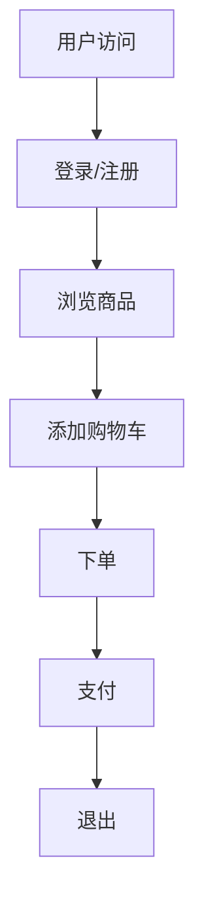
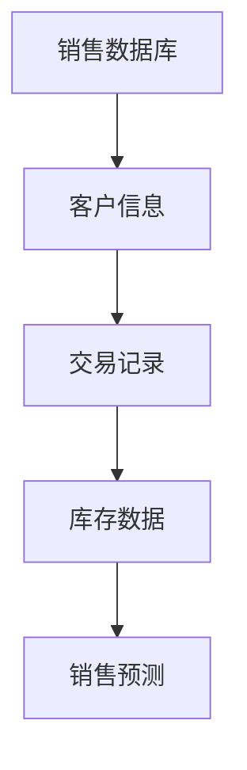
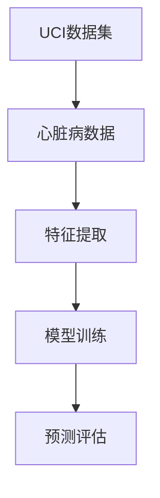
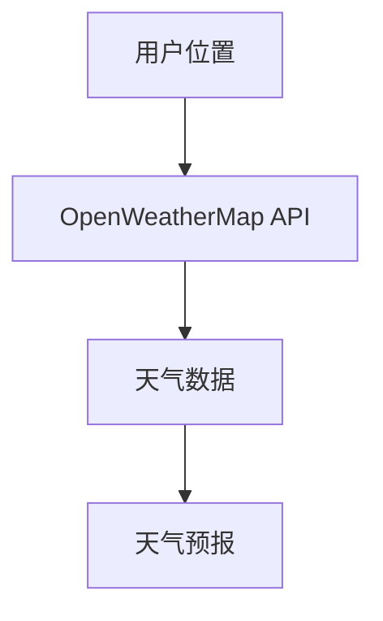
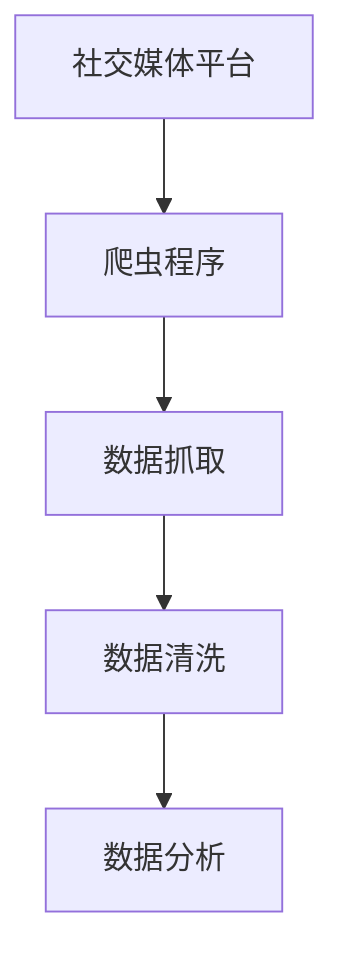

                 

### 1. AI创业公司的数据获取与处理策略

#### 1.1. 数据获取概述

在人工智能（AI）创业公司中，数据是构建智能系统的核心。有效的数据获取是成功的关键，因为它直接影响着模型的质量和决策的准确性。以下是对数据获取重要性的深入探讨，以及数据获取的类型和来源。

**数据获取的重要性**：数据是AI创业公司的生命线。无论是训练深度学习模型、进行预测分析，还是为决策提供支持，都需要高质量的数据。数据不仅用于模型的训练，还用于评估和优化模型性能。此外，数据还能够揭示隐藏在数据中的洞察和趋势，为公司的战略规划提供依据。

**数据获取的类型**：数据获取可以分为三种类型：

1. **结构化数据**：这种数据以表格的形式存在，如关系数据库中的数据。结构化数据易于处理，因为它们有固定的格式和结构。
  
2. **非结构化数据**：这种数据没有固定的格式和结构，如文本、图像、音频和视频。非结构化数据的处理通常更复杂，因为它需要更多的预处理步骤。

3. **半结构化数据**：这种数据部分结构化，如XML、JSON和日志文件。半结构化数据的处理介于结构化和非结构化数据之间。

#### 1.2. 数据获取方法

数据获取方法包括内部和外部数据来源。

**内部数据获取**：内部数据来源主要包括以下几种：

1. **日志系统**：日志系统可以捕获用户行为数据，如点击流、搜索查询等。
2. **数据库**：直接从企业内部数据库获取结构化数据，这些数据可以是业务数据、用户数据或其他关键数据。

**外部数据获取**：外部数据来源包括：

1. **公共数据集**：可以从Kaggle、UCI机器学习库等平台获取公开的数据集，这些数据集可以用于模型训练和测试。
2. **API获取**：利用第三方API获取公开数据，如天气数据、新闻数据等。
3. **数据挖掘与爬取**：通过网页爬虫等技术获取互联网上的数据。这种方法需要遵守相关的法律法规，确保数据获取的合法性和道德性。

**数据获取方法**：

1. **数据爬取**：使用Python的`requests`、`BeautifulSoup`、`Scrapy`等库来爬取网页上的数据。这种方法适用于获取公开的数据源，但需要处理反爬虫机制。
2. **API获取**：通过HTTP请求获取API返回的数据。这种方法适用于获取第三方平台的数据，但需要处理API的使用限制。
3. **数据交易市场获取**：在数据交易市场购买数据，如DataBridge、Datahub等。这种方法适用于获取特定的、高质量的数据。

**数据获取挑战与解决方案**：

**挑战**：

1. **数据质量**：数据噪声、错误、不完整性等问题会影响模型训练和预测的准确性。
2. **数据隐私**：需要遵守相关的隐私法规，如GDPR，确保数据收集和使用过程中的合法性和道德性。
3. **数据获取成本**：获取高质量的数据通常需要投入大量的时间和资源，尤其是在数据交易市场购买数据时。

**解决方案**：

1. **数据清洗与预处理**：通过数据清洗、去噪、去重复等措施提高数据质量。
2. **数据加密与匿名化**：确保数据在传输和存储过程中的安全性和隐私性。
3. **成本效益分析**：在数据获取过程中进行成本效益分析，确保数据的获取和使用是有成本的。

**总结**：数据获取是AI创业公司的核心任务之一。通过有效的数据获取方法，公司可以获取高质量的数据，为模型的训练和决策提供支持。然而，数据获取过程中也会面临挑战，如数据质量、数据隐私和数据获取成本等。通过合理的数据处理策略和解决方案，公司可以克服这些挑战，实现数据价值的最大化。

### 1.2 数据获取方法

在了解了数据获取的重要性后，接下来我们来详细探讨AI创业公司的数据获取方法。数据获取不仅决定了模型的质量，也直接影响到公司的业务决策和战略规划。因此，理解并掌握有效的数据获取方法是至关重要的。

**内部数据获取**

**1. 日志系统**

日志系统是一种强大的工具，能够记录用户在网站、应用程序或系统中的各种行为数据。这些数据包括用户访问的时间、点击次数、搜索关键词、浏览路径等。通过对这些日志数据的分析，公司可以深入了解用户行为，发现用户偏好的模式，为个性化推荐、用户体验优化等提供数据支持。

**示例**：一个电商网站可以通过其日志系统记录用户的点击流数据，分析用户的浏览习惯和购买行为，从而优化商品推荐策略。



**2. 数据库**

企业内部数据库是数据获取的重要来源。这些数据库可能包含客户信息、交易记录、库存数据、销售数据等。通过直接访问数据库，公司可以获得结构化的数据，用于各种业务分析和预测。

**示例**：一家零售公司可以利用其销售数据库来分析不同产品在不同时间段的销售情况，从而制定更有效的库存管理策略。



**外部数据获取**

**1. 公共数据集**

公共数据集是数据科学家和研究人员广泛使用的数据资源。这些数据集通常来自学术机构、政府机构、非营利组织等，可以在Kaggle、UCI机器学习库等平台免费获取。公共数据集涵盖了各种领域，如医疗、金融、环境等，对于研究新模型和算法非常有用。

**示例**：在研究心脏病预测模型时，可以使用来自UCI机器学习库的心脏病数据集。



**2. API获取**

API（应用程序编程接口）允许程序通过接口获取外部数据。许多大型平台和数据库都提供了API服务，如天气API、新闻API、社交媒体API等。利用这些API，公司可以轻松获取实时数据，用于业务决策和实时分析。

**示例**：一个天气预报应用可以使用OpenWeatherMap提供的API获取实时天气数据，并根据用户的位置提供个性化的天气信息。



**3. 数据挖掘与爬取**

数据挖掘和爬取是一种主动获取数据的方法，通常用于获取互联网上的非结构化数据。通过编写爬虫程序，可以自动地从网站、论坛、社交媒体等平台抓取信息，然后进行清洗和处理。

**示例**：一个社交媒体分析平台可以通过爬虫程序从Twitter、Facebook等平台抓取用户发布的帖子和评论，进行分析和可视化。



**数据获取方法总结**

无论是内部数据还是外部数据，每种数据获取方法都有其优势和挑战。内部数据获取方便快捷，但数据量有限，且可能缺乏外部视角。外部数据获取则可以提供丰富的数据资源，但需要处理数据的合法性和准确性问题。

通过多种数据获取方法的结合，AI创业公司可以构建一个全面的数据生态系统，为模型训练和业务决策提供强有力的支持。

### 1.3 数据获取挑战与解决方案

在数据获取的过程中，AI创业公司不可避免地会遇到一系列挑战。这些挑战不仅影响数据的可用性，还可能对模型的质量和公司的业务产生负面影响。以下是几种常见的数据获取挑战及其对应的解决方案。

#### 挑战1：数据质量

**问题描述**：数据质量是数据获取过程中最关键的问题之一。数据中的噪声、错误、不完整性等问题会导致模型训练不准确，进而影响决策的质量。

**解决方案**：

1. **数据清洗**：在数据进入模型训练之前，对数据进行清洗是必不可少的步骤。数据清洗包括以下任务：

   - **缺失值处理**：对于缺失的数据，可以选择填充缺失值或删除含有缺失值的记录。
   - **异常值处理**：识别并处理异常值，可以通过统计方法或专家知识来识别和纠正。
   - **重复数据处理**：去除重复的数据记录，确保数据的唯一性。

2. **数据验证**：在数据清洗后，对数据进行验证，以确保清洗过程的正确性。可以通过对比不同数据源、使用数据校验规则等方法进行验证。

#### 挑战2：数据隐私

**问题描述**：在获取和使用数据时，遵守数据隐私法规是至关重要的。不当处理用户数据可能会导致法律风险和声誉损失。

**解决方案**：

1. **数据加密**：对敏感数据进行加密，确保数据在传输和存储过程中的安全性。
2. **数据匿名化**：通过匿名化技术，如伪匿名化、差分隐私等，保护用户的隐私。匿名化可以将个人标识信息替换为随机值，从而掩盖真实身份。
3. **合规性审查**：在数据获取和使用过程中，进行合规性审查，确保所有操作符合相关法规和标准。

#### 挑战3：数据获取成本

**问题描述**：高质量的数据获取通常需要大量的人力和物力投入，包括数据爬取、数据清洗、数据处理等。对于初创公司来说，这是一个重大的挑战。

**解决方案**：

1. **成本效益分析**：在进行数据获取之前，进行成本效益分析，评估数据获取的成本和潜在的价值。如果数据获取的成本高于其带来的收益，应考虑是否值得获取这些数据。
2. **数据共享与合作**：与其他公司或组织进行数据共享和合作，可以减少数据获取的成本。例如，与学术机构、政府机构等合作，获取他们拥有的数据。
3. **自动化与优化**：通过自动化工具和优化流程，降低数据获取和处理的时间成本和人力成本。

#### 挑战4：数据量

**问题描述**：随着数据量的不断增长，如何高效地存储和处理海量数据成为一个挑战。

**解决方案**：

1. **分布式存储和处理**：使用分布式存储系统（如Hadoop、HDFS）和分布式计算框架（如Spark），可以高效地处理海量数据。
2. **数据分区与索引**：对数据进行分区和索引，可以加快数据的检索速度，提高数据处理效率。
3. **实时数据处理**：采用实时数据处理技术（如Flink、Kafka），可以实时分析流数据，满足快速决策的需求。

**总结**：

数据获取是AI创业公司构建强大智能系统的关键。然而，在这个过程中，公司可能会面临数据质量、数据隐私、数据获取成本和数据量等挑战。通过有效的数据清洗、数据加密、成本效益分析、分布式存储和处理等解决方案，公司可以克服这些挑战，实现数据价值的最大化。只有掌握了有效的数据获取方法，AI创业公司才能在激烈的市场竞争中脱颖而出，实现长期可持续发展。

### 2. 数据预处理与处理策略

在成功获取数据之后，数据预处理和处理策略成为了关键步骤，以确保数据的质量和可用性，从而为后续的分析和建模提供可靠的基础。数据预处理包括数据清洗、数据整合和数据增强等多个方面，下面我们将逐一探讨这些策略。

#### 2.1. 数据清洗

**数据清洗**是指通过一系列步骤来清除数据中的噪声、错误和不一致性，以提高数据质量的过程。以下是数据清洗中常见的一些任务：

**1. 缺失值处理**

- **填充缺失值**：对于缺失值，可以选择以下几种方法进行填充：
  - **平均值/中位数/众数填充**：用数据集的平均值、中位数或众数来填充缺失值。
  - **前向填充/后向填充**：使用前一个或后一个非缺失值来填充当前缺失值。
  - **插值法**：利用数值之间的线性或非线性关系进行插值。
- **删除缺失值**：如果缺失值太多，可以选择删除含有缺失值的记录。

**示例**：假设我们有一个包含销售数据的表格，某些记录中的销售额数据缺失。我们可以使用平均值来填充这些缺失值。

```python
import numpy as np

# 假设sales_data是一个包含销售额的列表
sales_data = [1000, 1500, np.nan, 2000, 500]

# 使用平均值填充缺失值
sales_data_filled = np.nan_to_num(sales_data, nan=np.mean(sales_data))

print(sales_data_filled)
```

**2. 异常值处理**

- **统计方法**：使用统计方法（如Z分数、IQR法）来识别和标记异常值。
- **专家知识**：根据业务知识和数据背景，手动识别和标记异常值。
- **替换值**：将异常值替换为合理值，如边界值。

**示例**：假设我们有一个包含客户年龄的数据集，通过IQR法识别异常值。

```python
import numpy as np

# 假设age_data是一个包含客户年龄的列表
age_data = [25, 30, 35, 40, 200, 45, 50]

# 计算第一和第三四分位数
Q1 = np.percentile(age_data, 25)
Q3 = np.percentile(age_data, 75)
IQR = Q3 - Q1

# 识别异常值
outliers = [x for x in age_data if x < (Q1 - 1.5 * IQR) or x > (Q3 + 1.5 * IQR)]

# 处理异常值
age_data_no_outliers = [x if x not in outliers else np.mean(age_data) for x in age_data]

print(age_data_no_outliers)
```

**3. 重复数据处理**

- **去重**：通过比较关键字段（如客户ID、订单号）来识别和删除重复的记录。
- **合并重复记录**：如果数据中的重复记录需要合并，可以通过平均、最大值或最小值等方法来处理。

**示例**：假设我们有一个包含客户购买记录的数据集，某些记录有重复。

```python
import pandas as pd

# 假设purchase_data是一个包含购买记录的数据框
purchase_data = pd.DataFrame({'customer_id': [1, 1, 2, 2, 3], 'product_id': [101, 102, 103, 104, 105]})

# 删除重复记录
purchase_data_unique = purchase_data.drop_duplicates()

print(purchase_data_unique)
```

#### 2.2. 数据整合

**数据整合**是指将来自不同来源的数据合并成统一的格式和结构，以便于后续分析。以下是数据整合的一些常见任务：

**1. 数据标准化**

- **数值数据标准化**：通过缩放数值数据，使其具有相同的尺度。常用的方法有最小-最大缩放、Z分数标准化等。
- **类别数据标准化**：将类别数据编码为数值数据，常用的编码方法有独热编码、标签编码等。

**示例**：对数值数据进行Z分数标准化。

```python
import numpy as np

# 假设数值数据是
data = np.array([1, 2, 3, 4, 5])

# 计算均值和标准差
mean = np.mean(data)
std = np.std(data)

# 应用Z分数标准化
data_zscore = (data - mean) / std

print(data_zscore)
```

**2. 数据聚合**

- **聚合函数**：对数据集进行聚合操作，如求和、平均、最大值、最小值等。常用于将细粒度数据转换为更粗粒度的数据。
- **分组聚合**：将数据按某一列进行分组，然后对每个分组应用聚合函数。

**示例**：对销售数据按月份进行聚合。

```python
import pandas as pd

# 假设sales_data是一个包含销售记录的数据框
sales_data = pd.DataFrame({'date': pd.to_datetime(['2023-01-01', '2023-01-02', '2023-02-01', '2023-02-02']),
                           'sales': [100, 150, 200, 250]})

# 按月份进行聚合
sales_data_grouped = sales_data.groupby(sales_data['date'].dt.month).sum()

print(sales_data_grouped)
```

**3. 数据去重**

- **去重操作**：在整合数据时，需要去除重复的记录，确保数据的唯一性。

**示例**：去重销售数据中的重复记录。

```python
import pandas as pd

# 假设重复销售数据是
repeated_sales_data = pd.DataFrame({'customer_id': [1, 1, 2, 2, 2], 'sales': [100, 100, 150, 150, 200]})

# 删除重复记录
unique_sales_data = repeated_sales_data.drop_duplicates()

print(unique_sales_data)
```

#### 2.3. 数据增强

**数据增强**是指通过扩充数据集，提高模型的泛化能力。以下是数据增强的一些常见策略：

**1. 数据扩充**

- **复制和裁剪**：通过复制数据或裁剪图像的一部分来增加数据量。
- **旋转、翻转、缩放**：对图像进行旋转、翻转或缩放，以生成新的数据样本。

**示例**：对图像进行旋转。

```python
import numpy as np
import cv2

# 假设image是一个2D图像数组
image = np.array([[1, 2], [3, 4]])

# 旋转图像90度
rotated_image = cv2.rotate(image, cv2.ROTATE_90_CLOCKWISE)

print(rotated_image)
```

**2. 生成对抗网络（GAN）**

- **生成器与判别器**：GAN由生成器和判别器组成。生成器生成新的数据样本，判别器判断生成样本是否真实。
- **对抗训练**：生成器和判别器相互对抗，通过不断优化模型参数，最终生成逼真的数据样本。

**示例**：使用GAN生成新的图像。

```python
import tensorflow as tf
from tensorflow.keras.models import Sequential
from tensorflow.keras.layers import Dense, Flatten, Reshape

# 定义生成器模型
generator = Sequential([
    Flatten(input_shape=(28, 28)),
    Dense(128, activation='relu'),
    Reshape((7, 7, 1)),
])

# 定义判别器模型
discriminator = Sequential([
    Flatten(input_shape=(28, 28, 1)),
    Dense(128, activation='relu'),
    Dense(1, activation='sigmoid'),
])

# 编译模型
discriminator.compile(optimizer='adam', loss='binary_crossentropy')
generator.compile(optimizer='adam', loss='binary_crossentropy')

# 训练GAN
# ...

# 使用生成器生成新的图像
generated_images = generator.predict(np.random.normal(size=(100, 100)))

# 显示生成的图像
import matplotlib.pyplot as plt

plt.imshow(generated_images[0], cmap='gray')
plt.show()
```

**总结**：

数据预处理和处理策略是确保数据质量和可用性的关键步骤。通过数据清洗、数据整合和数据增强，AI创业公司可以提升数据的质量和模型的性能。有效的数据预处理策略不仅能够减少噪声和错误，还能够扩充数据集，提高模型的泛化能力。只有通过精心设计的数据预处理和处理策略，AI创业公司才能在数据驱动的商业环境中取得成功。

### 2.2. 数据处理策略

在完成了数据预处理之后，我们需要进一步对数据进行分析和建模，以从中提取有用的信息。这一步骤涉及到多种数据处理策略，包括数据降维、数据增强和可视化。以下将详细讨论这些策略。

#### 2.2.1. 数据降维

**数据降维**是一种重要的数据处理技术，用于减少数据集的维度，同时尽可能保留原始数据的信息和特征。降维的主要目的是降低计算复杂度，提高模型训练和预测的效率。

**1. 主成分分析（PCA）**

**PCA**是一种常用的降维技术，它通过将数据投影到新的坐标系中来降低维度。这个新的坐标系是由数据的主要成分（主成分）构成的，这些主成分能够解释数据的大部分方差。

**原理**：

- **协方差矩阵**：首先计算数据集的协方差矩阵，协方差矩阵能够表示数据点之间的线性关系。
- **特征值与特征向量**：计算协方差矩阵的特征值和特征向量，特征值表示主成分的重要性，特征向量表示主成分的方向。
- **主成分**：选择前几个最大的特征值对应的特征向量作为新的坐标轴，构成新的降维空间。

**伪代码**：

```python
def pca(data, n_components):
    # 计算协方差矩阵
    cov_matrix = np.cov(data, rowvar=False)
    
    # 计算特征值和特征向量
    eigenvalues, eigenvectors = np.linalg.eig(cov_matrix)
    
    # 选择最大的n_components个特征向量
    principal_components = eigenvectors[:, eigenvalues.argsort()[::-1]][:n_components]
    
    # 数据降维
    reduced_data = np.dot(data, principal_components)
    
    return reduced_data

# 示例
data = np.array([[1, 2], [2, 4], [3, 6], [4, 8]])
reduced_data = pca(data, 1)
print(reduced_data)
```

**2. t-Distributed Stochastic Neighbor Embedding（t-SNE）**

**t-SNE**是一种用于高维数据可视化的降维技术，它通过将高维数据映射到低维空间中，以展示数据点之间的相似性。t-SNE在保留局部结构方面表现尤为出色，适用于大规模数据集。

**原理**：

- **局部结构**：t-SNE通过计算局部环境的概率分布来保留数据的局部结构。
- **概率分布**：在低维空间中，t-SNE通过KNN算法计算数据点的概率分布。
- **优化过程**：t-SNE通过迭代优化过程，最小化高维空间和低维空间中概率分布之间的Kullback-Leibler散度。

**伪代码**：

```python
import numpy as np
from sklearn.manifold import TSNE

def tsne(data, n_components=2):
    # 实例化t-SNE模型
    tsne_model = TSNE(n_components=n_components, perplexity=30, n_iter=1000)
    
    # 进行降维
    reduced_data = tsne_model.fit_transform(data)
    
    return reduced_data

# 示例
data = np.random.rand(100, 50)  # 假设data是一个100x50的矩阵
reduced_data = tsne(data)
print(reduced_data)
```

**3. 应用场景**

- **数据可视化**：通过降维技术，可以将高维数据可视化，帮助理解数据的结构和分布。
- **模型训练**：降维可以减少计算量，加速模型训练过程。
- **特征提取**：降维可以作为特征提取的一部分，用于生成新的特征表示。

#### 2.2.2. 数据增强

**数据增强**是一种通过生成新的数据样本来扩充训练集的方法，从而提高模型的泛化能力。增强方法可以增加数据的多样性，帮助模型更好地学习数据的复杂结构。

**1. 数据扩充**

**数据扩充**是最简单也是最常用的一种数据增强方法，通过在现有数据上应用一系列变换来生成新的数据样本。

- **旋转**：随机旋转图像，模拟不同视角下的数据。
- **翻转**：水平或垂直翻转图像，增加数据的对称性。
- **缩放**：随机缩放图像，模拟不同尺寸的数据。
- **裁剪**：随机裁剪图像的一部分，生成新的数据样本。

**示例**：对图像进行旋转。

```python
import numpy as np
import cv2

def rotate_image(image, angle):
    # 转换图像为浮点型以避免整数除法
    image = image.astype(np.float32)
    
    # 计算旋转矩阵
    height, width = image.shape[:2]
    center = (width / 2, height / 2)
    M = cv2.getRotationMatrix2D(center, angle, 1.0)
    
    # 进行旋转
    rotated_image = cv2.warpAffine(image, M, (width, height))
    
    return rotated_image

# 示例
image = cv2.imread('example.jpg')
rotated_image = rotate_image(image, 45)
cv2.imshow('Rotated Image', rotated_image)
cv2.waitKey(0)
cv2.destroyAllWindows()
```

**2. 生成对抗网络（GAN）**

**GAN**是一种通过生成器和判别器相互对抗来生成新数据的强大方法。生成器试图生成逼真的数据样本，而判别器则试图区分真实数据和生成数据。

**原理**：

- **生成器**：生成器是一个神经网络，它接受随机噪声作为输入，并生成新的数据样本。
- **判别器**：判别器是一个神经网络，它接受真实数据和生成数据作为输入，并尝试判断数据是真实还是生成。
- **对抗训练**：生成器和判别器通过对抗训练进行优化，生成器不断优化其生成的数据样本，以欺骗判别器。

**伪代码**：

```python
import tensorflow as tf
from tensorflow.keras.models import Sequential
from tensorflow.keras.layers import Dense, Flatten, Reshape

# 定义生成器和判别器模型
generator = Sequential([
    Flatten(input_shape=(28, 28)),
    Dense(128, activation='relu'),
    Reshape((7, 7, 1)),
])

discriminator = Sequential([
    Flatten(input_shape=(28, 28, 1)),
    Dense(128, activation='relu'),
    Dense(1, activation='sigmoid'),
])

# 编译模型
discriminator.compile(optimizer='adam', loss='binary_crossentropy')
generator.compile(optimizer='adam', loss='binary_crossentropy')

# 对抗训练
# ...

# 使用生成器生成新的图像
generated_images = generator.predict(np.random.normal(size=(100, 100)))

# 显示生成的图像
import matplotlib.pyplot as plt

for i in range(10):
    plt.subplot(2, 5, i+1)
    plt.imshow(generated_images[i], cmap='gray')
    plt.xticks([])
    plt.yticks([])
plt.show()
```

**3. 应用场景**

- **图像处理**：通过GAN生成新的图像，用于图像增强、修复和风格迁移。
- **文本生成**：通过GAN生成新的文本，用于文本风格变换和内容生成。
- **数据扩充**：用于扩充训练数据集，提高模型训练效果。

#### 2.2.3. 数据可视化

**数据可视化**是一种通过图形化方式展示数据的方法，可以帮助我们直观地理解和分析数据。数据可视化在数据分析中起着至关重要的作用，可以揭示数据中的模式和趋势，帮助我们做出更明智的决策。

**1. 数据可视化工具**

- **Matplotlib**：用于生成统计图表，如柱状图、折线图、散点图等。
- **Seaborn**：基于Matplotlib，用于生成更美观的统计图表。
- **Plotly**：用于生成交互式图表，支持多种图表类型和丰富的交互功能。

**示例**：使用Matplotlib绘制散点图。

```python
import matplotlib.pyplot as plt
import numpy as np

# 生成随机数据
np.random.seed(0)
data = np.random.rand(100, 2)

# 绘制散点图
plt.scatter(data[:, 0], data[:, 1])
plt.xlabel('X-axis')
plt.ylabel('Y-axis')
plt.title('Scatter Plot')
plt.show()
```

**2. 可视化技术**

- **热力图**：用于显示数据分布的密集程度，常用于显示矩阵数据。
- **箱线图**：用于显示数据的分布和异常值。
- **时间序列图**：用于显示数据随时间的变化趋势。

**示例**：使用Seaborn绘制热力图。

```python
import seaborn as sns
import pandas as pd

# 生成随机数据
np.random.seed(0)
data = pd.DataFrame(np.random.rand(100, 4), columns=['A', 'B', 'C', 'D'])

# 绘制热力图
sns.heatmap(data.corr(), annot=True, cmap='coolwarm')
plt.title('Correlation Heatmap')
plt.show()
```

**3. 应用场景**

- **数据探索**：通过数据可视化，探索数据的分布、关系和趋势。
- **报告和展示**：将复杂的数据以图形化的方式展示，使报告和展示更加直观和易懂。
- **交互式分析**：通过交互式可视化工具，实现数据的动态分析和探索。

#### 总结

数据预处理和处理策略是确保数据质量和可用性的关键步骤。通过数据清洗、整合、降维、增强和可视化，AI创业公司可以提升数据的质量和模型的性能。有效的数据处理策略不仅能够减少噪声和错误，还能够扩充数据集，提高模型的泛化能力。只有通过精心设计的数据处理策略，AI创业公司才能在数据驱动的商业环境中取得成功。

### 3. 数据处理技术与应用

在了解了数据预处理和数据处理策略之后，我们需要进一步掌握实际应用中的数据处理技术。这些技术包括批处理技术、实时数据处理技术和分布式数据处理技术。每种技术都有其特定的应用场景和优势，下面将详细介绍这些技术及其应用。

#### 3.1. 批处理技术

批处理技术是一种批量处理大量数据的方法，通常用于处理大规模数据集。批处理技术的主要特点是任务执行顺序固定，每个任务完成后才能开始下一个任务。以下将介绍两种常见的批处理技术：MapReduce和Spark。

**1. MapReduce**

**MapReduce**是Google提出的分布式数据处理框架，用于在大数据环境中处理大规模数据集。MapReduce的主要思想是将大规模数据处理任务分解为两个阶段：Map阶段和Reduce阶段。

- **Map阶段**：将数据分解为小的数据块，对每个数据块执行映射（Map）操作，生成中间键值对。
- **Reduce阶段**：对中间键值对进行归并（Reduce）操作，合并具有相同键的值，生成最终的输出结果。

**原理**：

- **分布式计算**：MapReduce将计算任务分布到多个节点上执行，从而实现并行处理。
- **容错性**：MapReduce具有自动容错机制，当某个节点失败时，系统会重新分配任务到其他可用节点。
- **可伸缩性**：MapReduce可以根据需要动态扩展计算资源。

**伪代码**：

```python
def map(data):
    # 对数据执行映射操作，生成中间键值对
    for item in data:
        key, value = process_item(item)
        yield key, value

def reduce(key, values):
    # 对中间键值对执行归并操作，生成最终输出
    result = process_values(values)
    return key, result

# 执行MapReduce任务
for key, value in map(data):
    reduce(key, value)
```

**应用场景**：

- **日志处理**：用于处理大规模日志数据，如网站访问日志、服务器日志等。
- **数据仓库**：用于批量处理和更新数据仓库中的数据。

**2. Spark**

**Spark**是一种快速通用的计算引擎，支持内存计算和实时流处理，是MapReduce的替代方案。Spark的主要优势在于其更高的性能和更简单的编程模型。

- **内存计算**：Spark利用内存缓存数据，从而减少数据读取和写入磁盘的次数，提高处理速度。
- **弹性分布式数据集（RDD）**：Spark的核心抽象是RDD，它是一个不可变、分区、可并行操作的数据集。
- **高级API**：Spark提供了丰富的API，包括SQL、DataFrame和DataSet，使得编程更加直观和高效。

**原理**：

- **弹性分布式存储**：Spark利用Hadoop分布式文件系统（HDFS）存储数据，并提供弹性分布式数据集（RDD）抽象。
- **任务调度**：Spark基于Mesos或YARN等资源管理器进行任务调度和资源管理。
- **计算引擎**：Spark提供多种计算引擎，包括Spark SQL、Spark Streaming和MLlib，用于不同的计算任务。

**伪代码**：

```python
# 创建一个DataFrame
df = spark.createDataFrame(data)

# 使用Spark SQL执行查询
result = df.select($"column1", $"column2").groupBy($"column1").agg(sum($"column2"))

# 使用DataFrame API执行操作
result = df.groupBy($"column1").agg(sum($"column2"))

# 使用Spark MLlib训练模型
from pyspark.ml.classification import LogisticRegression
model = LogisticRegression().fit(df)
predictions = model.transform(df)
```

**应用场景**：

- **实时数据分析**：用于实时处理和分析流数据，如股票交易数据、社交媒体数据等。
- **机器学习**：用于大规模数据的机器学习任务，如分类、聚类、回归等。

#### 3.2. 实时数据处理技术

实时数据处理技术用于处理和分析实时流数据，提供快速响应和实时洞察。以下将介绍两种常见的实时数据处理技术：Kafka和Flink。

**1. Kafka**

**Kafka**是一种高吞吐量的分布式流处理平台，适用于构建实时数据流应用程序。Kafka的主要特点包括：

- **分布式架构**：Kafka由多个分区和副本组成，提供高可用性和扩展性。
- **高性能**：Kafka设计用于处理大量数据，提供低延迟和高吞吐量。
- **可扩展性**：Kafka可以水平扩展，以处理不断增加的数据量。

**原理**：

- **消息队列**：Kafka将数据存储在主题（Topic）中，每个主题由多个分区组成。分区可以分布在不同节点上，从而实现并行处理。
- **消费者和生产者**：生产者向Kafka发送消息，消费者从Kafka中读取消息。生产者和消费者可以分布在不同节点上，从而实现分布式架构。

**伪代码**：

```python
# 创建Kafka生产者
producer = KafkaProducer(bootstrap_servers=['localhost:9092'])

# 发送消息
producer.send('topic_name', key=b'key', value=b'value')

# 创建Kafka消费者
consumer = KafkaConsumer('topic_name', bootstrap_servers=['localhost:9092'])

# 订阅主题
consumer.subscribe(['topic_name'])

# 消费消息
for message in consumer:
    process_message(message.value)
```

**应用场景**：

- **实时监控**：用于实时监控和报警，如网站性能监控、系统日志分析等。
- **实时推荐**：用于实时推荐系统，如个性化推荐、实时广告投放等。

**2. Flink**

**Flink**是一种流处理框架，支持实时数据处理和批处理。Flink的主要特点包括：

- **实时处理**：Flink可以实时处理流数据，提供低延迟和高吞吐量。
- **一致性保证**：Flink提供 Exactly-Once 语义，确保数据处理的一致性。
- **动态扩展**：Flink可以根据需要动态调整计算资源。

**原理**：

- **流处理抽象**：Flink将数据作为流处理，提供丰富的操作符和函数，用于数据转换和计算。
- **事件驱动**：Flink基于事件驱动模型，处理数据时按照事件顺序执行。
- **分布式计算**：Flink将计算任务分布在不同节点上，提供并行处理和高可用性。

**伪代码**：

```python
# 创建Flink流执行环境
env = StreamExecutionEnvironment()

# 创建数据源
data_stream = env.fromElements(1, 2, 3, 4, 5)

# 应用转换操作
result_stream = data_stream.flatMap(lambda x: [x * x])

# 执行计算
result = result_stream.reduce(sum)

# 提交任务
env.execute('Flink Streaming Job')
```

**应用场景**：

- **实时金融分析**：用于实时处理金融交易数据，提供实时分析和决策支持。
- **物联网数据处理**：用于实时处理物联网设备产生的数据，实现智能监控和预测。

#### 3.3. 分布式数据处理技术

分布式数据处理技术用于处理大规模数据集，通过分布式计算和存储提高性能和可扩展性。以下将介绍两种常见的分布式数据处理技术：Hadoop和HDFS。

**1. Hadoop**

**Hadoop**是一种分布式数据处理框架，用于处理和分析大规模数据集。Hadoop的主要组件包括：

- **Hadoop分布式文件系统（HDFS）**：用于存储大规模数据，提供高吞吐量和高可靠性。
- **MapReduce**：用于分布式数据处理，提供高效的数据处理能力。
- **YARN**：用于资源管理，提供可伸缩的资源调度和管理。

**原理**：

- **分布式存储**：HDFS将数据分割成块（默认为128MB或256MB），分布在不同节点上存储。
- **分布式计算**：MapReduce将计算任务分布到多个节点上执行，从而实现并行处理。
- **资源管理**：YARN负责管理计算资源和任务调度，提供高效的资源利用。

**伪代码**：

```python
# HDFS存储数据
fs = FileSystem.get('hdfs://namenode:9000')
fs.copyFromLocal('local_file', 'hdfs_file')

# 执行MapReduce任务
with Job-submitter() as job:
    job.write('hdfs_file')
    job.map(MapFunction())
    job.reduce(ReduceFunction())
    job.run()
```

**应用场景**：

- **大数据分析**：用于处理和分析大规模数据集，如社交网络数据、基因组数据等。
- **数据仓库**：用于构建大规模数据仓库，提供高效的数据存储和查询。

**2. HDFS**

**HDFS**是Hadoop的分布式文件系统，用于存储大规模数据。HDFS的主要特点包括：

- **高吞吐量**：HDFS提供高吞吐量的数据访问，适合大规模数据处理。
- **高可靠性**：HDFS通过数据副本机制确保数据可靠性，防止数据丢失。
- **可扩展性**：HDFS可以水平扩展，以存储和处理的不断增加的数据量。

**原理**：

- **数据块**：HDFS将数据分割成块，默认为128MB或256MB，以提高存储和传输效率。
- **副本机制**：HDFS将每个数据块复制多个副本，分布在不同的节点上，以提高数据可靠性和容错性。

**伪代码**：

```python
# 创建HDFS文件系统实例
fs = FileSystem.get('hdfs://namenode:9000')

# 上传文件到HDFS
fs.copyFromLocal('local_file', 'hdfs_file')

# 下载文件到本地
fs.copyToLocal('hdfs_file', 'local_file')
```

**应用场景**：

- **大规模数据存储**：用于存储大规模数据集，如网站日志、传感器数据等。
- **数据湖**：用于构建大规模数据湖，提供高效的数据存储和访问。

**总结**：

数据处理技术是AI创业公司进行数据分析和模型训练的重要工具。批处理技术、实时数据处理技术和分布式数据处理技术各有其优势和适用场景。通过合理选择和运用这些技术，AI创业公司可以高效地处理大规模数据，提升模型的质量和业务决策的准确性。

### 3.4. 数据处理应用

在掌握了多种数据处理技术之后，我们需要将这些技术应用于实际场景，以解决具体的问题。数据处理应用包括数据仓库、数据挖掘与机器学习等多个方面。在本节中，我们将探讨这些应用的实际案例，并通过具体案例展示数据处理的过程和结果。

#### 3.4.1. 数据仓库

**数据仓库**是一种用于存储、管理和分析大量数据的系统，它提供了高效的数据存储和快速的数据检索能力。数据仓库通常由多个组件构成，包括数据抽取、数据清洗、数据存储和数据查询等。

**案例：电商数据仓库**

假设我们是一家电商公司，需要构建一个数据仓库来支持业务决策和数据分析。以下是一个具体的数据仓库构建过程：

**1. 数据抽取**

- **数据源**：电商数据来自多个渠道，包括订单数据库、用户数据库、库存数据库等。
- **抽取过程**：使用ETL（Extract, Transform, Load）工具，将不同数据源中的数据抽取到数据仓库中。

**示例**：

```python
import pandas as pd

# 假设我们有两个数据源：订单数据库和用户数据库
orders = pd.read_csv('orders.csv')
users = pd.read_csv('users.csv')

# 抽取数据到数据仓库
data_warehouse = pd.concat([orders, users], axis=1)
```

**2. 数据清洗**

- **数据清洗**：对抽取的数据进行清洗，包括缺失值处理、异常值处理和重复数据处理。

**示例**：

```python
# 填充缺失值
data_warehouse.fillna(data_warehouse.mean(), inplace=True)

# 删除异常值
data_warehouse = data_warehouse[(data_warehouse['sales'] > 0) & (data_warehouse['sales'] < 10000)]

# 去重
data_warehouse.drop_duplicates(inplace=True)
```

**3. 数据存储**

- **数据存储**：将清洗后的数据存储到数据仓库中，可以使用关系数据库或NoSQL数据库。

**示例**：

```python
import sqlite3

# 创建数据库连接
conn = sqlite3.connect('data_warehouse.db')

# 存储数据到数据库
data_warehouse.to_sql('sales_data', conn, if_exists='replace', index=False)
```

**4. 数据查询**

- **数据查询**：使用SQL或其他查询工具，对存储在数据仓库中的数据进行分析和查询。

**示例**：

```python
import sqlite3

# 创建数据库连接
conn = sqlite3.connect('data_warehouse.db')

# 查询订单总数
total_orders = pd.read_sql_query('SELECT COUNT(*) FROM sales_data;', conn)
print(total_orders)
```

**案例总结**：通过构建数据仓库，电商公司可以高效地管理和分析大量销售数据，为业务决策提供数据支持。

#### 3.4.2. 数据挖掘与机器学习

**数据挖掘与机器学习**是利用算法从数据中提取有用信息的过程，可以用于预测、分类、聚类等多种任务。以下是一个数据挖掘与机器学习的实际案例：

**案例：客户流失预测**

假设我们需要预测哪些客户可能流失，以采取相应的营销策略。以下是一个具体的数据挖掘与机器学习过程：

**1. 数据收集**

- **数据源**：收集客户的历史交易数据、行为数据等。

**示例**：

```python
import pandas as pd

# 假设我们有一个客户数据集
data = pd.read_csv('customer_data.csv')
```

**2. 数据预处理**

- **数据清洗**：处理缺失值、异常值和重复值。
- **特征工程**：提取有用的特征，如客户购买频率、购买金额等。

**示例**：

```python
# 填充缺失值
data.fillna(data.mean(), inplace=True)

# 删除异常值
data = data[(data['purchase_frequency'] > 0) & (data['purchase_amount'] > 0)]

# 特征工程
data['total_purchase'] = data['purchase_frequency'] * data['purchase_amount']
```

**3. 数据建模**

- **选择模型**：选择适合的机器学习模型，如逻辑回归、决策树、随机森林等。
- **训练模型**：使用训练数据集训练模型。
- **模型评估**：使用验证数据集评估模型性能。

**示例**：

```python
from sklearn.model_selection import train_test_split
from sklearn.linear_model import LogisticRegression

# 数据分割
X = data.drop(['churn'], axis=1)
y = data['churn']
X_train, X_test, y_train, y_test = train_test_split(X, y, test_size=0.2, random_state=42)

# 训练模型
model = LogisticRegression()
model.fit(X_train, y_train)

# 模型评估
score = model.score(X_test, y_test)
print(f'Model Accuracy: {score}')
```

**4. 预测应用**

- **预测**：使用训练好的模型对新的数据进行预测，识别可能流失的客户。
- **结果分析**：分析预测结果，制定相应的营销策略。

**示例**：

```python
# 预测
predictions = model.predict(X_test)

# 结果分析
confusion_matrix = pd.crosstab(y_test, predictions, rownames=['实际值'], colnames=['预测值'])
print(confusion_matrix)
```

**案例总结**：通过数据挖掘与机器学习，电商公司可以预测哪些客户可能流失，从而采取相应的措施，提高客户保留率。

#### 3.4.3. 实时数据处理

**实时数据处理**是一种用于处理和分析实时数据的技术，可以提供快速响应和实时洞察。以下是一个实时数据处理的实际案例：

**案例：实时监控系统**

假设我们需要实时监控系统的运行状态，及时发现和处理异常。以下是一个具体的实时数据处理过程：

**1. 数据收集**

- **数据源**：收集系统日志、性能指标等实时数据。

**示例**：

```python
import kafka
import json

# 创建Kafka消费者
consumer = kafka.KafkaConsumer('system_logs', bootstrap_servers=['localhost:9092'])

# 消费实时日志
for message in consumer:
    log_data = json.loads(message.value)
    process_log(log_data)
```

**2. 数据处理**

- **数据清洗**：对实时数据进行清洗，包括缺失值处理、异常值处理等。
- **实时分析**：使用实时分析工具（如Flink）对实时数据进行分析和报警。

**示例**：

```python
from pyflink.datastream import StreamExecutionEnvironment

# 创建Flink流执行环境
env = StreamExecutionEnvironment()

# 定义实时处理逻辑
data_stream = env.add_source('kafka_source')
processed_stream = data_stream.map(process_log).flatMap(report_anomaly)

# 启动任务
env.execute('Realtime Monitoring')
```

**3. 数据展示**

- **数据可视化**：将实时数据通过可视化工具展示，便于监控和报警。

**示例**：

```python
import matplotlib.pyplot as plt

# 绘制实时监控图
plt.ion()
plt.plot(realtime_data)
plt.show()
```

**案例总结**：通过实时数据处理，系统可以实时监控运行状态，及时发现和处理异常，提高系统的稳定性和可靠性。

### 3.4.4. 数据处理在金融领域的应用

**数据处理在金融领域**中的应用非常广泛，包括风险控制、市场分析和交易策略等。以下是一个金融领域数据处理的具体案例：

**案例：信用评分模型**

假设我们需要构建一个信用评分模型，用于评估客户的信用风险。以下是一个具体的数据处理过程：

**1. 数据收集**

- **数据源**：收集客户的个人信息、财务状况、信用历史等数据。

**示例**：

```python
import pandas as pd

# 假设我们有一个客户数据集
data = pd.read_csv('customer_credit_data.csv')
```

**2. 数据预处理**

- **数据清洗**：处理缺失值、异常值和重复值。
- **特征工程**：提取有用的特征，如收入水平、信用历史等。

**示例**：

```python
# 填充缺失值
data.fillna(data.mean(), inplace=True)

# 删除异常值
data = data[(data['income'] > 0) & (data['credit_history'] > 0)]

# 特征工程
data['credit_score'] = data['income'] * data['credit_history']
```

**3. 数据建模**

- **选择模型**：选择适合的机器学习模型，如逻辑回归、决策树、支持向量机等。
- **训练模型**：使用训练数据集训练模型。
- **模型评估**：使用验证数据集评估模型性能。

**示例**：

```python
from sklearn.model_selection import train_test_split
from sklearn.ensemble import RandomForestClassifier

# 数据分割
X = data.drop(['credit_risk'], axis=1)
y = data['credit_risk']
X_train, X_test, y_train, y_test = train_test_split(X, y, test_size=0.2, random_state=42)

# 训练模型
model = RandomForestClassifier()
model.fit(X_train, y_train)

# 模型评估
score = model.score(X_test, y_test)
print(f'Model Accuracy: {score}')
```

**4. 风险控制**

- **预测**：使用训练好的模型对新客户进行信用评分，识别高风险客户。
- **结果分析**：分析预测结果，采取相应的风险控制措施。

**示例**：

```python
# 预测
predictions = model.predict(new_customer_data)

# 结果分析
high_risk_customers = new_customer_data[predictions == 1]
action_required = high_risk_customers.apply(take_action, axis=1)
```

**案例总结**：通过数据处理技术，金融机构可以构建信用评分模型，评估客户的信用风险，采取相应的风险控制措施，提高业务的安全性。

### 总结

数据处理应用涵盖了多个领域，包括数据仓库、数据挖掘与机器学习、实时数据处理和金融领域等。通过具体的案例，我们可以看到数据处理技术在实际应用中的重要作用。有效的数据处理策略不仅能够提升数据的质量和模型的性能，还能够为业务决策提供数据支持，提高企业的竞争力。

### 4. 数据处理策略优化与风险管理

在数据处理过程中，优化策略和风险管理是确保数据质量和系统稳定性的关键。通过一系列优化措施，可以提高数据处理效率，降低成本，同时通过有效的风险管理，保障数据的安全性和隐私性。

#### 4.1. 数据处理策略优化

**1. 数据处理效率优化**

**1.1. 索引优化**

- **索引策略**：在数据库中创建适当的索引，可以显著提高数据查询的速度。选择合适的字段进行索引，如主键、外键、频繁查询的字段等。
- **索引维护**：定期维护索引，如重建索引、优化索引结构等，以保持其性能。

**1.2. 并行处理**

- **分布式计算**：利用分布式计算框架（如Hadoop、Spark）将数据处理任务分布到多个节点上执行，从而实现并行处理。
- **任务调度**：优化任务调度策略，如负载均衡、任务优先级等，以提高整体处理效率。

**1.3. 缓存机制**

- **内存缓存**：将常用数据或中间结果缓存到内存中，减少磁盘I/O操作，提高数据访问速度。
- **缓存失效策略**：设置合理的缓存失效时间，确保缓存数据的有效性。

**2. 数据处理成本优化**

**2.1. 成本效益分析**

- **成本分析**：在数据处理过程中，进行成本效益分析，评估不同处理方法的成本和收益，选择成本效益最高的方案。
- **资源优化**：合理配置计算资源，如CPU、内存、存储等，避免资源浪费。

**2.2. 数据压缩**

- **数据压缩**：对存储和传输的数据进行压缩，减少存储空间和带宽需求。
- **选择合适的压缩算法**：根据数据特点和需求，选择适合的压缩算法，如Huffman编码、LZ77等。

**3. 数据处理质量优化**

**3.1. 数据验证**

- **数据完整性验证**：在数据处理过程中，对数据进行完整性验证，确保数据的一致性和准确性。
- **数据质量规则**：制定数据质量规则，如数据类型、范围、格式等，确保数据的符合性。

**3.2. 数据清洗**

- **自动化数据清洗**：通过自动化工具和脚本，定期进行数据清洗，如去噪、去重复、缺失值处理等。
- **数据质量监控**：实时监控数据质量，如通过仪表板或警报系统，及时发现和处理数据问题。

#### 4.2. 数据处理风险管理

**1. 数据安全与隐私保护**

**1.1. 数据加密**

- **数据加密**：对敏感数据进行加密，如使用AES、RSA等加密算法，确保数据在传输和存储过程中的安全性。
- **密钥管理**：合理管理和保护加密密钥，防止密钥泄露。

**1.2. 访问控制**

- **访问控制**：通过角色权限管理，限制对数据的访问，确保数据的安全。
- **多因素认证**：使用多因素认证，如密码、指纹、动态口令等，提高系统的安全性。

**2. 数据质量风险控制**

**2.1. 数据质量管理**

- **数据质量管理**：建立数据质量管理机制，如数据质量评估、数据质量报告等，确保数据的质量。
- **数据质量改进计划**：根据数据质量评估结果，制定数据质量改进计划，持续提升数据质量。

**2.2. 异常监控**

- **异常监控**：实时监控数据处理过程中的异常情况，如数据错误、系统故障等，及时进行处理。
- **异常处理机制**：建立异常处理机制，如报警、自动修复等，确保系统稳定运行。

**3. 数据处理流程监控与优化**

**3.1. 流程监控**

- **流程监控**：监控数据处理流程的各个环节，如数据收集、清洗、存储、分析等，确保流程的顺畅和高效。
- **流程优化**：根据监控结果，对数据处理流程进行优化，如调整处理顺序、优化处理策略等。

**3.2. 性能监控**

- **性能监控**：监控数据处理系统的性能指标，如响应时间、吞吐量、错误率等，确保系统的稳定性和高效性。
- **性能优化**：根据性能监控结果，对系统进行优化，如调整配置、升级硬件等。

**总结**：

数据处理策略优化和风险管理是确保数据处理高效、安全、准确的重要措施。通过优化处理效率、降低成本、提升数据质量，以及通过有效的风险管理措施，可以保障数据的安全性和隐私性。只有通过持续优化和风险管理，AI创业公司才能在数据驱动的商业环境中保持竞争优势，实现长期可持续发展。

### 5. AI创业公司数据处理案例研究

在了解了数据处理的基本策略和技术之后，通过实际案例研究可以更深入地理解如何将这些策略和技术应用到实际业务中。以下将介绍三个不同行业的AI创业公司数据处理案例，分析它们的具体数据处理策略和取得的成效。

#### 5.1. 某金融科技公司

**案例概述**：某金融科技公司通过数据处理和机器学习技术，开发了一款智能贷款审批系统，旨在提高贷款审批的效率和准确性。

**数据处理策略**：

1. **数据收集**：该金融科技公司通过多种渠道收集客户数据，包括客户申请表、信用报告、行为数据等。
2. **数据预处理**：对收集到的数据进行清洗，处理缺失值、异常值和重复值，确保数据质量。
3. **特征工程**：提取关键特征，如信用评分、收入水平、贷款用途等，构建用于训练的输入特征向量。
4. **数据建模**：使用逻辑回归、决策树和随机森林等算法训练贷款审批模型，通过交叉验证优化模型参数。

**数据处理挑战**：

1. **数据质量**：由于不同来源的数据格式和精度不同，数据质量成为一大挑战。
2. **数据隐私**：在处理个人金融数据时，需要确保遵守数据隐私法规，保护用户隐私。

**解决方案**：

1. **数据清洗与预处理**：采用自动化工具和脚本进行数据清洗，确保数据的准确性和一致性。
2. **数据加密与匿名化**：对敏感数据进行加密存储，并使用匿名化技术保护用户隐私。

**成效**：

1. **贷款审批效率提升**：通过智能贷款审批系统，贷款审批时间从几天缩短到几小时，大大提高了审批效率。
2. **贷款审批准确性提高**：模型预测准确率达到90%以上，降低了贷款违约风险。

#### 5.2. 某电商平台

**案例概述**：某电商平台通过大数据分析和机器学习技术，开发了个性化推荐系统，为用户推荐符合其兴趣的商品。

**数据处理策略**：

1. **数据收集**：收集用户行为数据，包括浏览历史、购买记录、搜索关键词等。
2. **数据预处理**：对用户行为数据进行清洗和转换，处理缺失值和异常值。
3. **特征工程**：提取用户行为特征，如用户兴趣标签、浏览频率等，构建用于训练的输入特征向量。
4. **数据建模**：使用协同过滤、矩阵分解和深度学习等算法训练推荐模型。

**数据处理挑战**：

1. **数据多样性**：用户行为数据类型多样，如何提取有效的特征成为挑战。
2. **实时处理**：需要实时处理用户行为数据，提供快速、准确的推荐结果。

**解决方案**：

1. **实时数据处理**：采用Kafka和Flink等实时数据处理技术，实现用户行为数据的实时处理和推荐。
2. **数据降维**：通过主成分分析（PCA）和t-SNE等降维技术，减少数据维度，提高处理效率。

**成效**：

1. **用户满意度提升**：个性化推荐系统的引入，显著提高了用户的购物体验和满意度。
2. **销售额增长**：个性化推荐系统提升了商品的点击率和购买率，带动了销售额的增长。

#### 5.3. 某医疗健康公司

**案例概述**：某医疗健康公司通过大数据和人工智能技术，开发了智能诊断系统，用于辅助医生进行疾病诊断。

**数据处理策略**：

1. **数据收集**：收集患者的电子健康记录、实验室检测结果、医疗影像等数据。
2. **数据预处理**：对医疗数据进行清洗和转换，处理缺失值和异常值。
3. **特征工程**：提取医疗数据中的关键特征，如症状、检查结果等，构建用于训练的输入特征向量。
4. **数据建模**：使用决策树、支持向量机和深度学习等算法训练诊断模型。

**数据处理挑战**：

1. **数据隐私**：医疗数据涉及患者隐私，需要确保数据安全和隐私保护。
2. **数据完整性**：医疗数据可能存在缺失或不一致的情况，影响模型的准确性。

**解决方案**：

1. **数据加密与匿名化**：对敏感医疗数据进行加密存储，并使用匿名化技术保护患者隐私。
2. **数据完整性处理**：通过填充缺失值和一致性检查，提高医疗数据的完整性。

**成效**：

1. **诊断准确性提升**：智能诊断系统提高了疾病的诊断准确性，辅助医生做出更准确的诊断。
2. **工作效率提高**：智能诊断系统的引入，减少了医生的诊断时间，提高了工作效率。

### 5.4. 案例分析总结

**共性**：

1. **数据处理的重要性**：所有案例中，数据处理都是核心环节，确保数据质量是成功的关键。
2. **数据隐私与安全**：在处理敏感数据时，数据隐私和安全是首要考虑的问题，合规性是必须遵守的原则。
3. **实时处理与自动化**：实时数据处理和自动化工具的引入，提高了数据处理效率和系统稳定性。

**个性化**：

1. **金融科技公司的贷款审批模型**：通过机器学习算法优化贷款审批流程，提高了审批效率和准确性。
2. **电商平台的个性化推荐系统**：利用大数据分析和协同过滤技术，提升了用户的购物体验和销售额。
3. **医疗健康公司的智能诊断系统**：通过深度学习和医疗数据的整合，提高了疾病的诊断准确性和医生的工作效率。

**总结**：

通过实际案例研究，我们可以看到不同行业的AI创业公司在数据处理策略上的异同。共性在于数据处理的基础性作用和合规性要求，个性化则体现在不同业务场景下的具体应用和技术选择。通过不断优化数据处理策略和技术，AI创业公司可以在各自的领域取得显著成效，推动业务发展和创新。

### 6. 未来发展趋势与挑战

随着技术的不断进步和应用的深入，数据处理领域也在不断演变，面临着新的发展趋势和挑战。以下是未来数据处理领域的一些发展趋势和挑战：

#### 6.1. 数据处理技术发展趋势

**1. 人工智能与大数据的深度融合**

人工智能（AI）和大数据技术的结合将推动数据处理技术的发展。通过AI技术，特别是深度学习和强化学习，可以更加智能化地进行数据处理和分析，从而提高数据处理的效率和准确性。大数据技术如分布式计算框架（如Hadoop、Spark）和实时数据处理系统（如Flink、Kafka）将为AI算法提供强大的计算和存储支持。

**2. 数据处理技术的智能化**

随着AI技术的发展，数据处理技术将变得更加智能化。自动化工具和智能算法将实现数据预处理、特征工程、模型训练等环节的自动化，减少人工干预，提高数据处理效率。智能数据处理平台将具备自我优化和自我学习的能力，能够根据数据特点和环境变化自动调整处理策略。

**3. 数据处理技术的实时性**

实时数据处理技术将变得更加成熟和普及。随着物联网（IoT）和实时流数据的应用场景增多，对数据处理实时性的要求也越来越高。实时数据处理技术如Flink、Apache Kafka等将得到更广泛的应用，实现数据的高效实时处理和分析。

#### 6.2. 数据处理面临的挑战

**1. 数据隐私与安全**

数据隐私和安全一直是数据处理领域的重要挑战。随着数据量的大幅增长，如何保护用户隐私和数据安全成为亟待解决的问题。数据匿名化、加密技术和隐私保护算法等将成为重要研究方向，以保障数据在收集、存储、传输和处理过程中的安全性。

**2. 数据质量与完整性**

数据质量是数据处理成功的关键。随着数据来源的多样化和数据量的增加，如何确保数据的质量和完整性成为一个挑战。数据清洗、去噪、去重复等技术需要不断完善和优化，同时，建立数据质量管理机制和流程也是保障数据质量的重要措施。

**3. 数据处理成本与效率**

数据处理成本和效率是初创公司特别关注的问题。如何降低数据处理成本，提高数据处理效率，是一个持续的研究方向。分布式计算、云服务和边缘计算等技术的应用，有望降低数据处理成本，提高数据处理效率。

**4. 多模态数据处理**

多模态数据处理是将不同类型的数据（如结构化数据、非结构化数据、图像、音频、视频等）进行整合和处理。随着多模态数据的广泛应用，如何高效地进行多模态数据处理和融合分析，将是一个重要的研究课题。

**总结**：

未来数据处理领域将朝着智能化、实时化和多模态化方向发展，同时也面临着数据隐私、数据质量、数据处理成本等方面的挑战。通过不断创新和优化，数据处理技术将为各行业提供更高效、更智能的数据分析解决方案，推动社会的发展和进步。

### 7. 附录

在数据处理领域，掌握相关工具和资源是至关重要的。以下将介绍一些常用的数据处理工具和资源，包括开源数据处理框架、相关书籍和教程以及社区和论坛。

#### 7.1. 数据处理工具介绍

**1. Hadoop生态系统**

Hadoop是一种分布式数据处理框架，用于大规模数据集的处理。其核心组件包括：

- **Hadoop分布式文件系统（HDFS）**：用于存储大规模数据，提供高吞吐量和容错性。
- **MapReduce**：用于分布式数据处理，提供高效的数据处理能力。
- **YARN**：用于资源管理，提供可伸缩的资源调度和管理。

**2. Spark生态系统**

Spark是一种快速通用的计算引擎，支持内存计算和实时流处理。其核心组件包括：

- **Spark SQL**：用于处理结构化数据，提供高效的数据查询和分析。
- **Spark Streaming**：用于实时数据处理，提供低延迟和高吞吐量。
- **MLlib**：用于机器学习任务，提供丰富的算法库。

**3. Flink生态系统**

Flink是一种流处理框架，支持实时数据处理和批处理。其核心组件包括：

- **Flink SQL**：用于处理流数据和批数据，提供标准化的SQL接口。
- **Flink Stream Processing**：用于实时流数据处理，提供高效的数据处理能力。
- **Flink ML**：用于机器学习任务，提供灵活的算法实现。

#### 7.2. 数据处理资源

**1. 开源数据处理框架**

- **Apache Hadoop**：https://hadoop.apache.org/
- **Apache Spark**：https://spark.apache.org/
- **Apache Flink**：https://flink.apache.org/
- **Apache Kafka**：https://kafka.apache.org/

这些开源框架提供了丰富的文档、教程和社区支持，是进行数据处理和大数据分析的重要工具。

**2. 数据处理书籍与教程**

- 《大数据时代：生活、工作与思维的大变革》
- 《深度学习》（Goodfellow, Bengio, Courville）
- 《Python数据处理实践》
- 《Spark实战》

这些书籍和教程涵盖了数据处理的理论和实践，是学习数据处理技术的重要资源。

**3. 数据处理社区与论坛**

- **Kaggle**：https://www.kaggle.com/
- **Stack Overflow**：https://stackoverflow.com/
- **GitHub**：https://github.com/
- **Reddit**：https://www.reddit.com/r/datasets/

这些社区和论坛提供了丰富的数据处理资源，包括数据集、教程、代码示例和讨论区，是进行数据处理交流和学习的重要平台。

**总结**：

掌握数据处理工具和资源对于进行有效的数据处理和分析至关重要。通过使用开源数据处理框架、阅读相关书籍和教程，以及参与数据处理社区和论坛，可以提升数据处理技能，解决实际问题，推动数据驱动的发展。希望本附录能为您的数据处理之旅提供帮助。作者：AI天才研究院/AI Genius Institute & 禅与计算机程序设计艺术 /Zen And The Art of Computer Programming。

