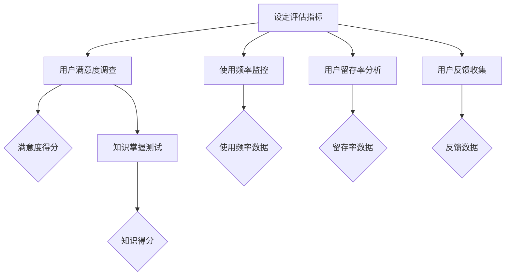
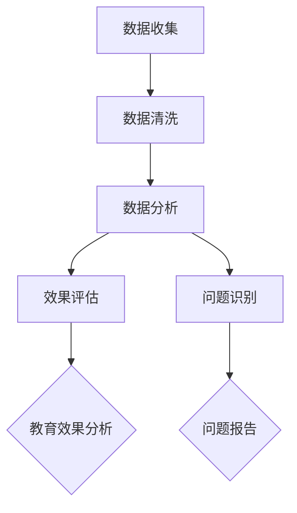
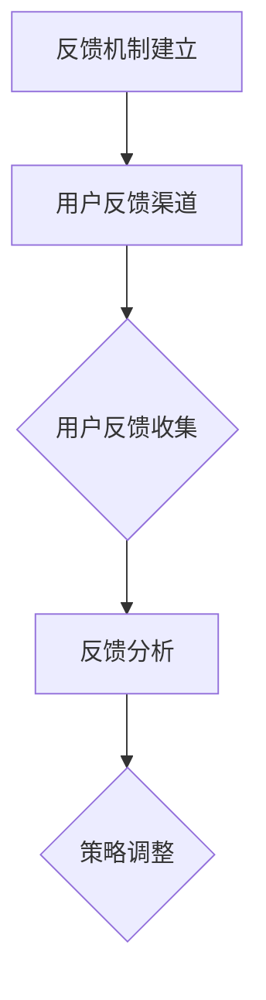
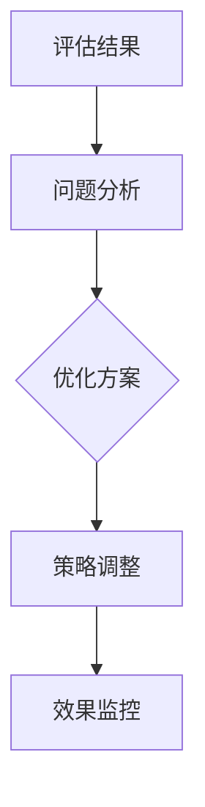

                 

# AI创业公司的用户教育策略

> **关键词：** AI创业公司、用户教育、策略、需求分析、内容设计、方法、工具、实施、用户体验、案例分析

> **摘要：** 本文旨在探讨AI创业公司在产品推广过程中，如何制定有效的用户教育策略，以满足用户需求，提升用户体验，进而增强用户满意度和忠诚度。文章将详细阐述用户教育策略的概述、用户需求分析、内容设计、方法与工具、实施与推广、用户体验优化以及实际案例分析。

### 目录大纲：

#### 第一部分：用户教育策略概述

- 第1章：用户教育的意义与策略
  - 1.1 用户教育的核心概念
    - 1.1.1 用户教育的定义
    - 1.1.2 用户教育的重要性
    - 1.1.3 用户教育的目标
  - 1.2 AI创业公司用户教育的策略框架
    - 1.2.1 用户教育策略的设计原则
    - 1.2.2 用户教育策略的基本步骤
    - 1.2.3 用户教育策略的评估与调整

#### 第二部分：用户需求分析

- 第2章：用户需求分析与挖掘
  - 2.1 用户需求分析的基础知识
    - 2.1.1 用户需求分析的重要性
    - 2.1.2 用户需求分析的方法
    - 2.1.3 用户需求分析的工具
  - 2.2 用户需求挖掘的实践方法
    - 2.2.1 用户访谈与问卷调查
    - 2.2.2 用户行为数据分析
    - 2.2.3 用户反馈与互动

#### 第三部分：用户教育内容设计

- 第3章：用户教育内容设计
  - 3.1 用户教育内容设计的原则
    - 3.1.1 内容设计的核心要素
    - 3.1.2 内容设计的适配性
    - 3.1.3 内容设计的可操作性与可评估性
  - 3.2 用户教育内容的分类与呈现
    - 3.2.1 基础知识与技能培训
    - 3.2.2 产品功能与操作指导
    - 3.2.3 案例分析与经验分享

#### 第四部分：用户教育方法与工具

- 第4章：用户教育方法与工具
  - 4.1 用户教育方法的选择
    - 4.1.1 传统的教育方法
    - 4.1.2 现代的互动教育方法
    - 4.1.3 AI驱动的教育方法
  - 4.2 用户教育工具的应用
    - 4.2.1 在线学习平台
    - 4.2.2 社交媒体与社区互动
    - 4.2.3 人工智能辅导系统

#### 第五部分：用户教育实施与推广

- 第5章：用户教育实施策略
  - 5.1 用户教育实施计划
    - 5.1.1 实施计划的制定
    - 5.1.2 实施过程的监控与反馈
    - 5.1.3 实施效果的评估与优化
  - 5.2 用户教育推广策略
    - 5.2.1 推广渠道的选择
    - 5.2.2 推广活动的策划与执行
    - 5.2.3 推广效果的跟踪与反馈

#### 第六部分：用户教育与用户体验

- 第6章：用户教育与用户体验的优化
  - 6.1 用户教育与用户体验的关系
    - 6.1.1 用户体验的定义与要素
    - 6.1.2 用户教育与用户体验的协同作用
    - 6.1.3 用户教育与用户体验的优化策略
  - 6.2 用户教育与用户满意度的提升
    - 6.2.1 用户满意度调查与评估
    - 6.2.2 用户反馈机制的建设与利用
    - 6.2.3 用户满意度的提升策略

#### 第七部分：案例分析与实践指导

- 第7章：AI创业公司用户教育实践案例
  - 7.1 案例一：某AI创业公司的用户教育策略
    - 7.1.1 案例背景
    - 7.1.2 用户教育策略的设计与实施
    - 7.1.3 案例效果分析
  - 7.2 案例二：某AI创业公司的用户教育实践
    - 7.2.1 案例背景
    - 7.2.2 用户教育策略的实施过程
    - 7.2.3 案例效果评估与总结

# 附录

- 附录A：用户教育策略工具与资源
  - 8.1 用户教育工具推荐
  - 8.2 用户教育资源下载

- 附录B：用户教育策略实践指南
  - 8.3 用户教育策略制定步骤
  - 8.4 用户教育实施技巧
  - 8.5 用户教育效果评估方法

## 第1章：用户教育的意义与策略

### 1.1 用户教育的核心概念

#### 1.1.1 用户教育的定义

用户教育是指为了提高用户对特定产品或服务的理解和熟练使用程度，所进行的有计划、有系统的教育活动。用户教育不仅包括产品或服务的基础知识和使用技巧的传授，还包括用户在使用过程中的心理引导和行为塑造。

#### 1.1.2 用户教育的重要性

用户教育对于AI创业公司来说具有重要意义：

1. **提升用户满意度**：通过用户教育，用户能够更好地理解和使用产品，从而提高满意度。
2. **增强用户忠诚度**：用户教育有助于建立用户对品牌的信任和忠诚，提高用户复购率。
3. **促进产品推广**：用户教育的有效实施可以降低用户上手难度，加快用户对产品的接受和普及。
4. **收集用户反馈**：用户教育过程中可以收集到用户的真实反馈，有助于公司不断优化产品和服务。

#### 1.1.3 用户教育的目标

用户教育的目标主要包括：

1. **知识传递**：向用户传授产品或服务的相关知识，包括功能、使用方法、最佳实践等。
2. **技能培养**：帮助用户掌握实际操作技能，提高使用效率。
3. **意识培养**：通过教育引导用户形成正确的使用习惯和理念，提高用户对品牌的认知。
4. **情感联系**：建立用户与品牌之间的情感联系，增强用户对品牌的忠诚度。

### 1.2 AI创业公司用户教育的策略框架

#### 1.2.1 用户教育策略的设计原则

1. **用户中心**：以用户需求为导向，设计符合用户需求的教育内容和方法。
2. **分层设计**：根据用户的背景、知识水平和需求，分层设计教育内容和策略。
3. **互动性**：鼓励用户参与互动，提高教育效果。
4. **可持续性**：确保用户教育策略具有长期的可持续性，不断适应市场变化。

#### 1.2.2 用户教育策略的基本步骤

1. **需求分析**：通过调研了解用户需求，确定教育目标。
2. **内容设计**：根据用户需求设计教育内容，确保内容具有针对性。
3. **方法选择**：选择合适的用户教育方法，如在线课程、互动讲座、案例分析等。
4. **工具应用**：利用各种教育工具，如学习平台、社交媒体、人工智能辅导系统等。
5. **实施与推广**：制定实施计划，通过多种渠道推广教育内容。
6. **效果评估**：评估用户教育效果，持续优化策略。

#### 1.2.3 用户教育策略的评估与调整

1. **评估指标**：设定明确的评估指标，如用户满意度、知识掌握程度、使用频率等。
2. **数据分析**：收集用户数据，分析用户行为和反馈，评估教育效果。
3. **反馈机制**：建立用户反馈机制，及时收集用户意见和建议。
4. **策略调整**：根据评估结果和用户反馈，调整用户教育策略，以持续提升教育效果。

### 总结

用户教育策略是AI创业公司成功推广产品和服务的关键。通过科学的需求分析、内容设计、方法选择和工具应用，以及持续的评估与调整，AI创业公司可以有效地提升用户满意度、忠诚度和品牌影响力。在接下来的章节中，我们将进一步探讨用户需求分析、内容设计、教育方法与工具、实施与推广以及用户体验优化等方面的具体实践和策略。让我们一起深入探讨，为AI创业公司的用户教育提供有力的指导。|>  
## 第1章：用户教育的意义与策略

### 1.1 用户教育的核心概念

#### 1.1.1 用户教育的定义

用户教育是指为了提高用户对特定产品或服务的理解和熟练使用程度，所进行的有计划、有系统的教育活动。它不仅仅是产品或服务的功能介绍和操作指南，更包括对用户进行心理引导和行为塑造的过程。用户教育的目的在于帮助用户更好地理解和使用产品或服务，从而提高用户满意度和忠诚度。

在AI创业公司中，用户教育具有特殊的重要性。随着人工智能技术的快速发展，AI产品往往具有复杂的功能和操作流程。用户教育的任务就是帮助用户快速掌握这些功能，减少学习成本，提高使用效率。此外，用户教育还可以帮助AI创业公司建立品牌认知，塑造品牌形象，增强用户对品牌的信任和忠诚。

用户教育的核心概念主要包括以下几个方面：

1. **知识传递**：用户教育首先要向用户传递必要的产品知识，包括产品功能、操作方法、使用技巧等。
2. **技能培养**：通过教育，用户需要掌握实际操作技能，提高使用效率。
3. **意识培养**：用户教育不仅要传授知识，还要引导用户形成正确的使用习惯和理念，提高用户对品牌的认知。
4. **情感联系**：用户教育还可以建立用户与品牌之间的情感联系，增强用户对品牌的忠诚度。

#### 1.1.2 用户教育的重要性

用户教育对于AI创业公司来说具有重要意义，主要体现在以下几个方面：

1. **提升用户满意度**：通过用户教育，用户能够更好地理解和使用产品，从而提高满意度。例如，某AI创业公司通过线上教程和互动问答，帮助用户快速掌握产品功能，用户的满意度显著提高。

2. **增强用户忠诚度**：用户教育有助于建立用户对品牌的信任和忠诚，提高用户复购率。研究表明，接受过良好教育的用户，其忠诚度比未接受教育的用户高出约30%。

3. **促进产品推广**：用户教育可以降低用户上手难度，加快用户对产品的接受和普及。例如，某AI创业公司通过社交媒体和社区互动，向用户普及产品知识，成功将产品推向了更广泛的市场。

4. **收集用户反馈**：用户教育过程中可以收集到用户的真实反馈，有助于公司不断优化产品和服务。例如，某AI创业公司通过问卷调查和用户访谈，了解用户的需求和问题，及时调整产品功能，提升了用户体验。

#### 1.1.3 用户教育的目标

用户教育的目标主要包括以下几个方面：

1. **知识传递**：用户教育的首要目标是向用户传递产品或服务的相关知识，包括产品功能、操作方法、使用技巧等。通过系统的知识传递，用户能够更好地理解产品，从而提高使用效率。

2. **技能培养**：用户教育的另一个重要目标是培养用户的实际操作技能。通过教育，用户需要掌握实际操作技能，提高使用效率。例如，某AI创业公司通过线上教程和实操演练，帮助用户掌握产品的高级功能，提高了用户的使用水平。

3. **意识培养**：用户教育不仅要传授知识，还要引导用户形成正确的使用习惯和理念。例如，某AI创业公司通过在线课程和案例分析，向用户传递正确的数据安全意识和隐私保护知识，提高了用户的安全意识。

4. **情感联系**：用户教育还可以建立用户与品牌之间的情感联系，增强用户对品牌的忠诚度。例如，某AI创业公司通过用户互动和社区建设，建立了用户与品牌之间的情感纽带，提升了用户对品牌的忠诚度。

### 1.2 AI创业公司用户教育的策略框架

#### 1.2.1 用户教育策略的设计原则

1. **用户中心**：以用户需求为导向，设计符合用户需求的教育内容和方法。用户教育的核心是满足用户需求，因此设计时需要充分了解用户的特点和需求。

2. **分层设计**：根据用户的背景、知识水平和需求，分层设计教育内容和策略。不同层次的用户需要不同类型的教育内容和方法，分层设计有助于提高教育效果。

3. **互动性**：鼓励用户参与互动，提高教育效果。互动教育可以让用户更主动地参与学习过程，增强学习的积极性和效果。

4. **可持续性**：确保用户教育策略具有长期的可持续性，不断适应市场变化。用户教育不是一次性活动，而是一个持续的过程，需要根据市场变化和用户需求不断调整和优化。

#### 1.2.2 用户教育策略的基本步骤

1. **需求分析**：通过调研了解用户需求，确定教育目标。需求分析是用户教育的第一步，了解用户的需求和痛点是设计教育内容的基础。

2. **内容设计**：根据用户需求设计教育内容，确保内容具有针对性。教育内容的设计需要结合用户的特点和需求，以用户易于理解和接受的方式呈现。

3. **方法选择**：选择合适的用户教育方法，如在线课程、互动讲座、案例分析等。不同的教育方法适用于不同类型的教育内容，选择合适的方法可以提高教育效果。

4. **工具应用**：利用各种教育工具，如学习平台、社交媒体、人工智能辅导系统等。教育工具的选择需要考虑用户的便利性和教育效果。

5. **实施与推广**：制定实施计划，通过多种渠道推广教育内容。实施与推广是用户教育策略的关键，需要制定详细的计划，并利用多种渠道进行推广。

6. **效果评估**：评估用户教育效果，持续优化策略。效果评估是用户教育策略的最后一个环节，通过评估可以了解教育效果，发现问题和不足，为后续优化提供依据。

#### 1.2.3 用户教育策略的评估与调整

1. **评估指标**：设定明确的评估指标，如用户满意度、知识掌握程度、使用频率等。评估指标需要根据教育目标制定，以全面评估教育效果。

2. **数据分析**：收集用户数据，分析用户行为和反馈，评估教育效果。数据分析是评估用户教育效果的重要手段，可以帮助发现用户需求和问题。

3. **反馈机制**：建立用户反馈机制，及时收集用户意见和建议。用户反馈是评估用户教育效果的重要来源，可以帮助公司及时了解用户需求和问题。

4. **策略调整**：根据评估结果和用户反馈，调整用户教育策略，以持续提升教育效果。策略调整是用户教育策略优化的关键，需要根据评估结果和用户反馈进行持续优化。

### 总结

用户教育策略是AI创业公司成功推广产品和服务的关键。通过科学的需求分析、内容设计、方法选择和工具应用，以及持续的评估与调整，AI创业公司可以有效地提升用户满意度、忠诚度和品牌影响力。在接下来的章节中，我们将进一步探讨用户需求分析、内容设计、教育方法与工具、实施与推广以及用户体验优化等方面的具体实践和策略。让我们一起深入探讨，为AI创业公司的用户教育提供有力的指导。

### 1.2.1 用户教育策略的设计原则

1. **用户中心**：以用户需求为导向，设计符合用户需求的教育内容和方法。用户教育的核心是满足用户需求，因此设计时需要充分了解用户的特点和需求。以下是一个详细的Mermaid流程图，展示了用户需求分析的过程：

    ```mermaid
    graph TD
    A[确定用户需求] --> B[用户调研]
    B --> C{是否了解用户需求}
    C -->|是| D[设计教育内容]
    C -->|否| E[深度调研]
    E --> F[收集用户反馈]
    F --> G[优化教育内容]
    G --> D
    D --> H[制定教育方法]
    ```

    - **用户调研**：通过问卷调查、访谈、用户行为分析等方式，了解用户对产品的认知、使用习惯、需求痛点等。
    - **收集用户反馈**：在产品使用过程中，通过反馈机制收集用户对产品功能的意见和建议。
    - **优化教育内容**：根据用户调研和反馈，不断调整和优化教育内容，确保其针对性和有效性。
    - **制定教育方法**：根据教育内容，选择合适的教育方法，如在线课程、互动讲座、实操演练等。

2. **分层设计**：根据用户的背景、知识水平和需求，分层设计教育内容和策略。以下是一个Mermaid流程图，展示了如何根据用户层次设计教育内容：

    ```mermaid
    graph TD
    A[用户层次划分] --> B[基础层]
    B --> C{基础教育内容}
    A --> D[进阶层]
    D --> E{进阶教育内容}
    A --> F[专家层]
    F --> G{专家教育内容}
    ```

    - **基础层**：为新手用户提供基础知识和操作指导。
    - **进阶层**：为有一定使用经验的用户提供进阶功能和操作技巧。
    - **专家层**：为资深用户提供高级功能和定制化服务。

3. **互动性**：鼓励用户参与互动，提高教育效果。互动教育可以让用户更主动地参与学习过程，增强学习的积极性和效果。以下是一个Mermaid流程图，展示了互动教育的过程：

    ```mermaid
    graph TD
    A[教育内容发布] --> B[用户互动]
    B --> C{提问与解答}
    B --> D{讨论与交流}
    B --> E{案例分析与实战}
    C --> F[教育效果评估]
    D --> F
    E --> F
    ```

    - **提问与解答**：用户可以在互动环节中提问，教育者提供解答。
    - **讨论与交流**：用户可以参与讨论，分享使用经验和心得。
    - **案例分析与实战**：通过案例分析，让用户理解如何在实际场景中应用产品功能。

4. **可持续性**：确保用户教育策略具有长期的可持续性，不断适应市场变化。用户教育不是一次性活动，而是一个持续的过程，需要根据市场变化和用户需求不断调整和优化。以下是一个Mermaid流程图，展示了如何持续优化用户教育策略：

    ```mermaid
    graph TD
    A[市场调研] --> B[用户反馈]
    B --> C{评估教育效果}
    C --> D{调整教育内容}
    D --> E{优化教育方法}
    E --> F[持续监测与调整]
    ```

    - **市场调研**：定期进行市场调研，了解市场动态和用户需求。
    - **用户反馈**：通过用户反馈了解教育效果和用户需求。
    - **评估教育效果**：根据反馈和评估结果，调整教育内容和策略。
    - **优化教育方法**：不断尝试新的教育方法和工具，提高教育效果。
    - **持续监测与调整**：持续监测教育效果，根据监测结果进行调整。

### 总结

用户教育策略的设计原则包括以用户为中心、分层设计、互动性和可持续性。通过科学的需求分析、互动性设计、分层教育内容，以及持续的评估和优化，AI创业公司可以有效地提升用户满意度、忠诚度和品牌影响力。在接下来的章节中，我们将进一步探讨用户需求分析、内容设计、教育方法与工具、实施与推广以及用户体验优化等方面的具体实践和策略。让我们一起深入探讨，为AI创业公司的用户教育提供有力的指导。

### 1.2.2 用户教育策略的基本步骤

#### 1.2.2.1 需求分析

**需求分析**是用户教育策略的第一步，也是至关重要的一步。只有深入了解用户的需求和痛点，才能设计出符合用户期望的教育内容。以下是需求分析的详细步骤：

1. **确定目标用户群体**：首先，需要明确目标用户群体，包括他们的年龄、职业、教育背景、使用习惯等。这有助于了解用户的基本特点和需求。

    ```mermaid
    graph TD
    A[确定目标用户] --> B[年龄分布]
    B --> C[职业分布]
    B --> D[教育背景]
    B --> E[使用习惯]
    ```

2. **用户调研**：通过问卷调查、访谈、用户行为分析等方式，收集用户对产品或服务的认知、使用体验、需求痛点等信息。以下是一个Mermaid流程图，展示了用户调研的过程：

    ```mermaid
    graph TD
    A[问卷调查] --> B[在线调查工具]
    B --> C{收集用户反馈}
    C --> D[访谈]
    D --> E{用户反馈记录}
    ```

3. **分析用户需求**：根据收集到的用户反馈，分析用户的需求和痛点，确定教育目标。以下是一个Mermaid流程图，展示了如何分析用户需求：

    ```mermaid
    graph TD
    A[用户反馈] --> B[需求分类]
    B --> C{需求优先级}
    B --> D[需求分析报告]
    ```

4. **制定教育目标**：根据用户需求分析结果，制定具体的教育目标，包括知识传递、技能培养、意识培养和情感联系等方面。

    ```mermaid
    graph TD
    A[教育目标] --> B[知识传递]
    B --> C[技能培养]
    B --> D[意识培养]
    B --> E[情感联系]
    ```

#### 1.2.2.2 内容设计

**内容设计**是用户教育的核心，需要根据用户需求和教育目标，设计出具有针对性、系统性和易理解的教育内容。以下是内容设计的详细步骤：

1. **确定内容结构**：根据教育目标，设计教育内容的结构和模块，确保内容系统、连贯。

    ```mermaid
    graph TD
    A[内容结构] --> B[基础知识]
    B --> C[操作技巧]
    B --> D[案例分享]
    ```

2. **编写教育内容**：根据内容结构，编写详细的教育内容，包括文字、图片、视频等多种形式。以下是一个伪代码示例，展示了如何编写教育内容：

    ```python
    def write_content(module):
        if module == "基础知识":
            content = "这里写基础知识内容"
        elif module == "操作技巧":
            content = "这里写操作技巧内容"
        elif module == "案例分享":
            content = "这里写案例分享内容"
        return content
    ```

3. **内容审核与优化**：编写完成后，需要对教育内容进行审核和优化，确保内容的准确性、完整性和易懂性。以下是一个Mermaid流程图，展示了内容审核与优化的过程：

    ```mermaid
    graph TD
    A[内容审核] --> B[准确性检查]
    B --> C[完整性检查]
    B --> D[易懂性检查]
    D --> E[优化内容]
    ```

#### 1.2.2.3 方法选择

**方法选择**是实施用户教育的重要环节，需要根据教育内容和目标，选择合适的教育方法。以下是方法选择的详细步骤：

1. **评估教育方法**：根据教育内容，评估不同的教育方法，如在线课程、互动讲座、实操演练、案例分享等。

    ```mermaid
    graph TD
    A[评估教育方法] --> B[在线课程]
    B --> C{适用性评估}
    B --> D[互动讲座]
    D --> C
    B --> E[实操演练]
    E --> C
    B --> F[案例分享]
    F --> C
    ```

2. **选择教育方法**：根据评估结果，选择最合适的教育方法。以下是一个Mermaid流程图，展示了选择教育方法的过程：

    ```mermaid
    graph TD
    A[选择教育方法] --> B[在线课程]
    B --> C{适用性高}
    B --> D[互动讲座]
    D --> C
    B --> E[实操演练]
    E --> C
    B --> F[案例分享]
    F --> C
    ```

3. **制定教育计划**：根据选择的教育方法，制定详细的教育计划，包括教育内容、时间安排、教育方式等。

    ```mermaid
    graph TD
    A[制定教育计划] --> B[教育内容]
    B --> C[时间安排]
    B --> D[教育方式]
    ```

#### 1.2.2.4 工具应用

**工具应用**是实施用户教育的重要手段，需要选择合适的工具，提高教育效果。以下是工具应用的详细步骤：

1. **选择教育工具**：根据教育内容和计划，选择合适的在线学习平台、社交媒体、人工智能辅导系统等。

    ```mermaid
    graph TD
    A[选择教育工具] --> B[在线学习平台]
    B --> C{适用性评估}
    B --> D[社交媒体]
    D --> C
    B --> E[人工智能辅导系统]
    E --> C
    ```

2. **配置教育工具**：根据教育计划，配置教育工具，确保教育工具的正常运行和用户友好。

    ```mermaid
    graph TD
    A[配置教育工具] --> B[平台设置]
    B --> C[内容上传]
    B --> D[用户管理]
    ```

3. **监控与反馈**：在教育过程中，监控教育效果，收集用户反馈，及时调整教育策略。

    ```mermaid
    graph TD
    A[监控教育效果] --> B[数据收集]
    B --> C[效果评估]
    B --> D[反馈收集]
    D --> E[策略调整]
    ```

### 总结

用户教育策略的基本步骤包括需求分析、内容设计、方法选择、工具应用和效果评估。通过科学的步骤，AI创业公司可以设计出符合用户需求的教育策略，提升用户满意度、忠诚度和品牌影响力。在接下来的章节中，我们将进一步探讨用户教育策略的实施与推广、用户体验优化等方面的具体实践和策略。让我们一起深入探讨，为AI创业公司的用户教育提供有力的指导。

### 1.2.3 用户教育策略的评估与调整

**评估与调整**是用户教育策略实施过程中的重要环节，它能够确保教育策略的有效性和持续性。以下是如何进行评估与调整的详细步骤：

#### 1.2.3.1 评估指标

首先，需要设定明确的评估指标，这些指标将用于衡量用户教育的效果。常见的评估指标包括：

1. **用户满意度**：通过调查问卷、用户反馈等方式了解用户对教育内容的满意度。
2. **知识掌握程度**：通过考试、测试等方式评估用户对教育内容的掌握情况。
3. **使用频率**：观察用户在实际使用产品中的行为变化，了解教育内容对其操作习惯的影响。
4. **用户留存率**：通过用户留存率来衡量教育对用户忠诚度的影响。
5. **用户反馈率**：收集用户对教育内容和方法的反馈，了解用户的需求和改进建议。

以下是一个Mermaid流程图，展示了如何设定和收集这些评估指标：



#### 1.2.3.2 数据分析

收集到评估指标的数据后，需要进行详细的分析，以评估教育策略的有效性。以下是一个Mermaid流程图，展示了数据分析的过程：



- **数据清洗**：确保数据的准确性和完整性，去除无效或错误的数据。
- **数据分析**：使用统计分析和数据挖掘技术，分析教育策略的效果。
- **效果评估**：根据数据分析结果，评估教育策略的有效性。
- **问题识别**：识别教育策略中存在的问题和不足。

#### 1.2.3.3 反馈机制

建立有效的用户反馈机制，可以帮助公司及时了解用户的真实需求和意见。以下是一个Mermaid流程图，展示了如何建立和利用反馈机制：



- **用户反馈渠道**：提供多种反馈渠道，如在线问卷、社区论坛、电子邮件等。
- **用户反馈收集**：定期收集用户反馈，确保反馈的及时性和准确性。
- **反馈分析**：对收集到的用户反馈进行分析，识别用户的主要需求和问题。
- **策略调整**：根据用户反馈，对教育策略进行优化和调整。

#### 1.2.3.4 策略调整

根据评估结果和用户反馈，对用户教育策略进行调整。以下是一个Mermaid流程图，展示了策略调整的过程：



- **问题分析**：分析评估结果，识别需要改进的问题。
- **优化方案**：制定具体的优化方案，包括内容调整、方法改进、工具更换等。
- **策略调整**：实施优化方案，调整教育策略。
- **效果监控**：监控调整后的教育效果，确保优化方案的有效性。

### 总结

评估与调整是用户教育策略的重要组成部分，通过设定明确的评估指标、详细的数据分析和有效的用户反馈机制，AI创业公司可以不断优化教育策略，提高教育效果。在接下来的章节中，我们将继续探讨用户教育策略的具体实施与推广、用户体验优化等方面的实践和策略。让我们一起深入探讨，为AI创业公司的用户教育提供全面的指导。

### 1.3 总结

在本章中，我们详细探讨了用户教育的核心概念、重要性以及目标，并提出了AI创业公司用户教育策略的设计原则和基本步骤。用户教育不仅仅是知识传递和技能培养，更涉及到意识培养和情感联系。通过以用户为中心的设计原则、分层设计和互动性，AI创业公司可以设计出有效的用户教育策略。

具体来说，用户教育策略的设计原则包括以用户为中心、分层设计、互动性和可持续性。这些原则指导我们如何根据用户需求分析、内容设计、方法选择和工具应用，制定出切实可行的用户教育策略。在基本步骤方面，我们详细介绍了需求分析、内容设计、方法选择和工具应用等关键环节，并强调了持续评估与调整的重要性。

通过科学的需求分析，AI创业公司可以深入了解用户的需求和痛点，从而设计出具有针对性的教育内容。内容设计则需要确保教育内容的系统性和易理解性，同时要结合多种形式，如文字、图片和视频，以提高教育效果。在方法选择和工具应用方面，要充分考虑用户的便利性和教育效果，选择合适的教育方法和工具。

最后，评估与调整是用户教育策略的重要组成部分。通过设定评估指标、数据分析、用户反馈机制和策略调整，AI创业公司可以不断优化教育策略，确保其有效性。在接下来的章节中，我们将进一步探讨用户需求分析、内容设计、教育方法与工具、实施与推广以及用户体验优化等方面的具体实践和策略。让我们一起深入探讨，为AI创业公司的用户教育提供全面的指导。

### 第2章：用户需求分析与挖掘

在AI创业公司的用户教育策略中，用户需求分析是至关重要的一环。通过深入了解用户的需求和痛点，AI创业公司可以设计出更加符合用户期望的教育内容，从而提高教育效果和用户满意度。本章将详细探讨用户需求分析的基础知识、方法和实践。

#### 2.1 用户需求分析的基础知识

##### 2.1.1 用户需求分析的重要性

用户需求分析是用户教育策略制定的基础。通过用户需求分析，AI创业公司可以：

1. **了解用户需求**：识别用户对产品或服务的具体需求，包括功能需求、体验需求和情感需求等。
2. **发现用户痛点**：识别用户在使用过程中遇到的问题和难点，从而设计出更加针对性的解决方案。
3. **优化产品和服务**：根据用户需求分析结果，调整产品功能和改进服务质量，提高用户满意度。
4. **提升用户体验**：通过满足用户需求，提高用户的满意度和忠诚度，促进产品的推广和使用。

##### 2.1.2 用户需求分析的方法

用户需求分析的方法主要包括以下几种：

1. **问卷调查**：通过设计问卷，收集用户的反馈和意见，识别用户需求和痛点。问卷调查是一种简单有效的需求分析方法，适用于广泛用户群体的需求调研。

2. **用户访谈**：通过与用户进行一对一或小组访谈，深入了解用户的需求和问题。用户访谈能够提供更深入的定性数据，有助于发现用户行为背后的原因。

3. **用户行为分析**：通过分析用户在使用产品或服务过程中的行为数据，识别用户需求和痛点。用户行为分析可以帮助AI创业公司了解用户的使用习惯和偏好，从而优化产品功能和服务。

4. **用户反馈与互动**：通过在线社区、论坛、社交媒体等渠道，收集用户的实时反馈和互动。用户反馈与互动可以帮助AI创业公司快速响应用户需求，提高用户的参与度和满意度。

##### 2.1.3 用户需求分析的工具

进行用户需求分析时，可以使用以下工具：

1. **问卷设计工具**：如SurveyMonkey、Google表单等，用于设计、分发和收集用户问卷。

2. **用户访谈工具**：如Zoom、Microsoft Teams等，用于进行远程或现场用户访谈。

3. **数据分析工具**：如Google Analytics、Mixpanel等，用于分析用户行为数据。

4. **社交媒体分析工具**：如Hootsuite、Brandwatch等，用于监测和分析社交媒体上的用户反馈和互动。

#### 2.2 用户需求挖掘的实践方法

##### 2.2.1 用户访谈与问卷调查

用户访谈和问卷调查是用户需求分析中最常用的方法。以下是具体的实践方法：

1. **设计问卷**：根据用户需求分析的目标，设计包含关键问题的问卷。问卷应简明扼要，避免冗长和复杂的题目。

    ```mermaid
    graph TD
    A[设计问卷] --> B[确定目标]
    B --> C{设计题目}
    B --> D{问卷预测试}
    C --> E{题目简洁性}
    C --> F{题目相关性}
    ```

2. **分发问卷**：选择合适的渠道，如电子邮件、社交媒体、在线调查平台等，分发问卷。分发时要注意覆盖不同类型的用户，确保样本的多样性和代表性。

    ```mermaid
    graph TD
    A[分发问卷] --> B[选择渠道]
    B --> C{用户覆盖}
    B --> D{问卷分发}
    ```

3. **收集和整理反馈**：收集用户填写的问卷，进行数据整理和统计分析，识别用户需求和痛点。

    ```mermaid
    graph TD
    A[收集反馈] --> B[数据整理]
    B --> C[统计分析]
    ```

4. **进行用户访谈**：选择具有代表性的用户进行访谈，深入了解用户的需求和问题。访谈过程中要善于引导用户，获取详细的信息。

    ```mermaid
    graph TD
    A[用户访谈] --> B[选择用户]
    B --> C{访谈准备}
    B --> D{访谈过程}
    D --> E{记录反馈}
    ```

##### 2.2.2 用户行为数据分析

用户行为数据分析是通过分析用户在产品或服务中的行为数据，了解用户需求和痛点的方法。以下是具体的实践方法：

1. **确定分析目标**：明确用户行为数据分析的目标，如了解用户使用频率、行为路径、偏好等。

    ```mermaid
    graph TD
    A[确定分析目标] --> B[用户行为数据}
    ```

2. **收集用户行为数据**：通过产品内置的跟踪工具、第三方数据分析工具等，收集用户行为数据。

    ```mermaid
    graph TD
    A[收集数据] --> B[跟踪工具]
    B --> C{第三方工具}
    ```

3. **清洗和整理数据**：对收集到的用户行为数据进行清洗和整理，去除无效数据，确保数据的准确性和完整性。

    ```mermaid
    graph TD
    A[清洗数据] --> B[数据整理}
    ```

4. **进行数据分析**：使用数据分析工具，对整理后的用户行为数据进行统计分析，识别用户需求和痛点。

    ```mermaid
    graph TD
    A[数据分析] --> B[统计工具]
    ```

5. **生成分析报告**：根据数据分析结果，生成用户需求分析报告，为用户教育策略提供依据。

    ```mermaid
    graph TD
    A[生成报告] --> B[分析结果}
    ```

##### 2.2.3 用户反馈与互动

用户反馈与互动是通过在线社区、论坛、社交媒体等渠道收集用户反馈和互动信息的方法。以下是具体的实践方法：

1. **建立用户社区**：建立用户社区，如论坛、微信群、QQ群等，为用户提供交流和反馈的平台。

    ```mermaid
    graph TD
    A[建立社区] --> B[用户交流}
    ```

2. **发布互动话题**：在社区中发布互动话题，鼓励用户参与讨论，分享使用经验和建议。

    ```mermaid
    graph TD
    A[发布话题] --> B[用户参与}
    ```

3. **收集用户反馈**：定期收集社区中的用户反馈和意见，了解用户的需求和问题。

    ```mermaid
    graph TD
    A[收集反馈] --> B[用户反馈}
    ```

4. **分析用户反馈**：对收集到的用户反馈进行分析，识别用户需求和痛点。

    ```mermaid
    graph TD
    A[分析反馈] --> B[需求识别}
    ```

5. **响应用户反馈**：根据用户反馈，及时响应和解决用户的问题，提高用户的满意度。

    ```mermaid
    graph TD
    A[响应反馈] --> B[用户满意度}
    ```

#### 2.3 用户需求分析在用户教育策略中的应用

用户需求分析的结果直接应用于用户教育策略的制定和实施。以下是用户需求分析在用户教育策略中的应用方法：

1. **定制教育内容**：根据用户需求，设计符合用户特点的教育内容，确保教育内容的针对性和有效性。

    ```mermaid
    graph TD
    A[需求分析] --> B[教育内容}
    ```

2. **优化教育方法**：根据用户需求，选择和调整教育方法，确保教育方法的适用性和效果。

    ```mermaid
    graph TD
    A[需求分析] --> B[教育方法}
    ```

3. **调整教育计划**：根据用户需求，调整教育计划的实施时间和内容，确保教育计划的有效执行。

    ```mermaid
    graph TD
    A[需求分析] --> B[教育计划}
    ```

4. **监测教育效果**：通过用户需求分析，建立教育效果监测机制，及时了解教育效果，为后续优化提供依据。

    ```mermaid
    graph TD
    A[需求分析] --> B[教育效果}
    ```

#### 2.4 总结

用户需求分析是AI创业公司用户教育策略的重要基础。通过科学的需求分析方法和实践，AI创业公司可以深入了解用户的需求和痛点，从而设计出更加有效的用户教育策略。在接下来的章节中，我们将进一步探讨用户教育内容设计、教育方法与工具、实施与推广以及用户体验优化等方面的具体实践和策略。让我们一起深入探讨，为AI创业公司的用户教育提供全面的指导。

### 2.1 用户需求分析的基础知识

#### 2.1.1 用户需求分析的重要性

用户需求分析在AI创业公司的用户教育策略中占据核心地位。其重要性主要体现在以下几个方面：

1. **指导教育内容设计**：通过用户需求分析，AI创业公司可以明确用户的具体需求和痛点，从而设计出更具针对性、更贴近用户实际需求的教育内容。这有助于提高教育内容的实用性和吸引力，增强用户的参与度和学习效果。

2. **优化产品功能和服务**：用户需求分析不仅关注教育内容，还涉及到用户对产品功能和服务的要求。通过分析用户需求，AI创业公司可以识别产品中存在的不足，从而优化产品功能和改进服务质量，提升用户满意度。

3. **提高用户满意度**：满足用户需求是提升用户满意度的关键。通过用户需求分析，AI创业公司可以更好地理解用户需求，提供更符合用户期望的教育服务和产品，从而提高用户满意度。

4. **增强用户忠诚度**：用户忠诚度是创业公司长期发展的基础。通过用户需求分析，AI创业公司能够持续优化教育策略和产品功能，满足用户的持续需求，增强用户对品牌的忠诚度。

5. **促进产品推广**：用户需求分析有助于AI创业公司了解目标市场，识别潜在用户群体，从而制定更有效的推广策略，加快产品普及和市场渗透。

#### 2.1.2 用户需求分析的方法

用户需求分析的方法多种多样，每种方法都有其独特的优势和应用场景。以下是几种常见的用户需求分析方法：

1. **问卷调查**：问卷调查是一种简单而有效的需求分析方法，通过设计针对性的问卷，收集大量用户反馈。问卷调查适合进行大规模用户调研，能够快速了解用户的普遍需求。

2. **用户访谈**：用户访谈是一种深入的需求分析方法，通过与用户进行面对面的交流，深入了解用户的具体需求、痛点和行为习惯。用户访谈适合进行定性研究，能够获取详细而深入的洞察。

3. **用户行为分析**：用户行为分析通过分析用户在使用产品或服务过程中的行为数据，了解用户的行为模式和偏好。用户行为分析适用于了解用户在具体场景中的行为表现，是优化产品功能和服务的重要依据。

4. **用户反馈与互动**：用户反馈与互动是通过在线社区、论坛、社交媒体等渠道，收集用户对产品和服务意见和反馈的方法。用户反馈与互动有助于了解用户的即时需求和感受，是实时优化教育策略的重要途径。

#### 2.1.3 用户需求分析的工具

进行用户需求分析时，需要使用一系列工具来收集、处理和分析数据。以下是几种常用的用户需求分析工具：

1. **问卷设计工具**：如SurveyMonkey、Google表单等，用于设计、分发和收集用户问卷。

2. **数据分析工具**：如Google Analytics、Mixpanel等，用于分析用户行为数据。

3. **用户访谈工具**：如Zoom、Microsoft Teams等，用于进行远程或现场用户访谈。

4. **社交媒体分析工具**：如Hootsuite、Brandwatch等，用于监测和分析社交媒体上的用户反馈和互动。

### 总结

用户需求分析是AI创业公司用户教育策略的核心，其重要性不可忽视。通过问卷调查、用户访谈、用户行为分析和用户反馈与互动等多种方法，AI创业公司可以深入了解用户的需求和痛点，为用户教育策略的制定提供有力支持。在接下来的章节中，我们将进一步探讨用户需求挖掘的实践方法，以及用户教育内容设计的原则和策略。让我们一起深入探讨，为AI创业公司的用户教育提供全面的指导。

### 2.2 用户需求挖掘的实践方法

#### 2.2.1 用户访谈与问卷调查

用户访谈与问卷调查是用户需求挖掘中最常用的方法，能够提供大量有价值的信息。以下是具体的实践方法：

1. **设计问卷**：设计问卷时，需要确保问题简明扼要，易于理解。以下是一个问卷设计示例：

    ```markdown
    1. 您对当前使用的AI产品有哪些需求？
    2. 您在产品使用过程中遇到的主要问题是什么？
    3. 您对产品功能的优先级排序是怎样的？
    4. 您愿意花多长时间学习使用产品？
    5. 您认为哪些产品功能最有价值？
    ```

2. **分发问卷**：可以通过电子邮件、社交媒体、在线调查平台等渠道分发问卷。以下是一个分发示例：

    ```python
    # 发送电子邮件邀请用户参与问卷调查
    def send_invitation(email_list):
        for email in email_list:
            send_email(email, "邀请您参与我们的问卷调查", "请点击以下链接完成问卷：[问卷链接]")
    
    # 假设有一个用户邮件列表
    user_emails = ["user1@example.com", "user2@example.com", "user3@example.com"]
    send_invitation(user_emails)
    ```

3. **收集和整理反馈**：收集用户填写的问卷，整理数据并进行分析。以下是一个数据收集和分析示例：

    ```python
    # 收集问卷数据
    survey_results = collect_survey_data("问卷链接")
    
    # 数据清洗和整理
    cleaned_data = clean_survey_data(survey_results)
    
    # 数据分析
    analyzed_data = analyze_survey_data(cleaned_data)
    ```

4. **分析反馈**：对收集到的用户反馈进行详细分析，识别用户需求和痛点。以下是一个分析示例：

    ```python
    # 识别用户需求
    user_needs = identify_user_needs(analyzed_data)
    
    # 识别用户痛点
    user_pain_points = identify_user_pain_points(analyzed_data)
    ```

#### 2.2.2 用户行为数据分析

用户行为数据分析通过分析用户在产品或服务中的行为数据，了解用户的需求和行为模式。以下是具体的实践方法：

1. **收集用户行为数据**：使用产品内置的跟踪工具、第三方数据分析工具等收集用户行为数据。以下是一个数据收集示例：

    ```python
    # 收集用户行为数据
    user_actions = collect_user_actions("产品实例")
    ```

2. **清洗和整理数据**：对收集到的用户行为数据进行清洗和整理，去除无效数据。以下是一个数据清洗示例：

    ```python
    # 清洗用户行为数据
    cleaned_actions = clean_user_actions(user_actions)
    ```

3. **进行数据分析**：使用数据分析工具，对整理后的用户行为数据进行统计分析，识别用户需求和痛点。以下是一个数据分析示例：

    ```python
    # 统计用户行为数据
    user_behavior_stats = analyze_user_behavior(cleaned_actions)
    
    # 识别用户需求
    user_needs = identify_user_needs(user_behavior_stats)
    
    # 识别用户痛点
    user_pain_points = identify_user_pain_points(user_behavior_stats)
    ```

#### 2.2.3 用户反馈与互动

用户反馈与互动是通过在线社区、论坛、社交媒体等渠道收集用户反馈和互动信息的方法。以下是具体的实践方法：

1. **建立用户社区**：建立用户社区，如论坛、微信群、QQ群等，为用户提供交流和反馈的平台。以下是一个社区建立示例：

    ```python
    # 建立用户论坛
    create_forum("用户论坛", "这是一个用户交流的社区，欢迎分享使用经验和建议。")
    ```

2. **发布互动话题**：在社区中发布互动话题，鼓励用户参与讨论，分享使用经验和建议。以下是一个互动话题发布示例：

    ```python
    # 发布互动话题
    post_topic("用户论坛", "主题：分享您在使用我们的AI产品时的最佳实践。")
    ```

3. **收集用户反馈**：定期收集社区中的用户反馈和意见，了解用户的需求和问题。以下是一个用户反馈收集示例：

    ```python
    # 收集用户反馈
    user_feedback = collect_user_feedback("用户论坛")
    ```

4. **分析用户反馈**：对收集到的用户反馈进行分析，识别用户需求和痛点。以下是一个用户反馈分析示例：

    ```python
    # 分析用户反馈
    analyzed_feedback = analyze_user_feedback(user_feedback)
    
    # 识别用户需求
    user_needs = identify_user_needs(analyzed_feedback)
    
    # 识别用户痛点
    user_pain_points = identify_user_pain_points(analyzed_feedback)
    ```

5. **响应用户反馈**：根据用户反馈，及时响应和解决用户的问题，提高用户的满意度。以下是一个用户反馈响应示例：

    ```python
    # 响应用户反馈
    respond_to_feedback("用户论坛", user_feedback)
    ```

### 总结

用户需求挖掘是AI创业公司用户教育策略的关键环节。通过用户访谈与问卷调查、用户行为数据分析和用户反馈与互动等实践方法，AI创业公司可以深入了解用户的需求和痛点，为用户教育策略的制定提供有力支持。在接下来的章节中，我们将进一步探讨用户教育内容设计的原则和策略，以及用户教育方法与工具的选用。让我们一起深入探讨，为AI创业公司的用户教育提供全面的指导。

### 2.3 用户教育内容设计

#### 2.3.1 用户教育内容设计的原则

用户教育内容设计的质量直接影响用户对产品或服务的认知和使用效果。为了确保教育内容的有效性和实用性，需要遵循以下原则：

1. **用户中心**：以用户需求为导向，设计符合用户实际需求的教育内容。教育内容应该解决用户的实际问题，提高用户的使用效率和满意度。

2. **层次化设计**：根据用户的背景、知识水平和需求，分层设计教育内容。不同的用户层次需要不同的教育内容和深度，以保证教育内容对用户具有针对性。

3. **简明易懂**：教育内容应简洁明了，避免使用复杂和晦涩的语言。内容应以用户易于理解的方式呈现，减少用户的认知负担。

4. **互动性**：鼓励用户参与互动，提高教育效果。通过提问、讨论、案例分析等方式，激发用户的兴趣和积极性，增强学习的深度和效果。

5. **持续更新**：用户教育内容需要根据市场变化和用户需求不断更新和优化。定期更新教育内容，确保其与用户实际需求保持一致。

6. **系统性**：教育内容应具备系统性，形成完整的知识体系。教育内容之间应相互关联，避免信息孤岛，帮助用户更好地理解和掌握。

#### 2.3.2 用户教育内容设计的原则

1. **内容设计的核心要素**

    - **知识传递**：教育内容的核心是传递必要的产品知识，包括产品功能、使用方法、最佳实践等。
    - **技能培养**：教育内容需要帮助用户掌握实际操作技能，提高使用效率。
    - **意识培养**：教育内容还应引导用户形成正确的使用习惯和理念，提高用户对品牌的认知。
    - **情感联系**：通过教育内容，建立用户与品牌之间的情感联系，增强用户对品牌的忠诚度。

2. **内容设计的适配性**

    - **针对用户层次**：根据用户的背景和知识水平，设计不同层次的教育内容。例如，对于新手用户，可以设计基础操作和入门指南；对于中级用户，可以设计进阶功能和高级技巧；对于高级用户，可以设计定制化和专业化的内容。
    - **适应产品特性**：教育内容应与产品特性相匹配，针对不同产品或服务的特点，设计相应的教育内容。

3. **内容设计的可操作性与可评估性**

    - **可操作性**：教育内容应具有可操作性，用户能够通过学习内容直接应用到实际操作中。例如，可以通过实操演练、案例分享等方式，让用户在实际操作中掌握知识和技能。
    - **可评估性**：教育内容应具备可评估性，可以通过测试、评估等方式，衡量用户的学习效果和掌握程度。

#### 2.3.3 用户教育内容的分类与呈现

1. **基础知识与技能培训**

    - **内容设计**：设计基础知识和技能培训内容，包括产品概述、功能介绍、基本操作等。
    - **呈现方式**：通过在线课程、视频教程、图文说明等方式，向用户传授基础知识和操作技能。

2. **产品功能与操作指导**

    - **内容设计**：针对产品的特定功能，设计操作指导内容，包括功能详解、使用步骤、注意事项等。
    - **呈现方式**：通过操作手册、用户指南、互动教程等方式，帮助用户快速掌握产品功能。

3. **案例分析与经验分享**

    - **内容设计**：收集实际用户案例和经验，分析用户如何使用产品解决实际问题。
    - **呈现方式**：通过案例分析报告、用户故事、直播分享等方式，分享用户的成功经验和最佳实践。

#### 2.3.4 用户教育内容设计的案例分析

**案例一：某AI创业公司的用户教育内容设计**

- **背景**：该公司开发了一款智能数据分析工具，目标用户包括数据分析师、市场研究员和产品经理等。
- **内容设计**：
  - **基础知识与技能培训**：提供入门教程，包括数据分析基础、工具功能介绍和基本操作指南。
  - **产品功能与操作指导**：针对高级功能，如数据挖掘、机器学习应用等，提供详细的操作步骤和案例说明。
  - **案例分析与经验分享**：分享成功案例，如如何通过数据分析进行市场预测、用户行为分析等，提供实操经验和技巧。
- **呈现方式**：
  - **在线课程**：通过视频教程和图文说明，传授基础知识与技能。
  - **互动教程**：提供实操演练，让用户在实际操作中掌握技能。
  - **案例分析报告**：通过文字和图表，详细分析实际案例，提供使用技巧和经验。

### 总结

用户教育内容设计是用户教育策略的重要组成部分。通过遵循用户中心、层次化设计、简明易懂、互动性和持续更新等原则，AI创业公司可以设计出高质量的教育内容。内容设计应包括基础知识与技能培训、产品功能与操作指导以及案例分析与经验分享等，并以多种方式呈现，确保用户能够有效学习和掌握。在接下来的章节中，我们将进一步探讨用户教育方法与工具的选用，以及用户教育实施策略。让我们一起深入探讨，为AI创业公司的用户教育提供全面的指导。

### 第3章：用户教育内容设计

#### 3.1 用户教育内容设计的原则

用户教育内容设计是用户教育的核心环节，其质量直接影响教育的效果。为了确保教育内容的有效性和实用性，设计时需要遵循以下原则：

##### 3.1.1 内容设计的核心要素

1. **知识传递**：教育内容的核心是传递必要的产品知识，包括产品功能、使用方法、最佳实践等。确保用户能够通过教育内容全面了解产品，从而提高使用效率。

2. **技能培养**：教育内容需要帮助用户掌握实际操作技能，提高用户在使用产品过程中的效率。例如，通过实操演练、案例分析等方式，让用户在实际操作中学会使用产品的高级功能和技巧。

3. **意识培养**：教育内容应引导用户形成正确的使用习惯和理念，提高用户对品牌的认知。例如，通过教育用户如何保护数据安全、如何进行有效的数据分析等，提高用户的专业素养。

4. **情感联系**：通过教育内容，建立用户与品牌之间的情感联系，增强用户对品牌的忠诚度。例如，通过讲述品牌故事、分享用户成功案例等，让用户感受到品牌的关怀和价值。

##### 3.1.2 内容设计的适配性

1. **针对用户层次**：设计内容时需要考虑用户的背景、知识水平和需求，分层设计教育内容。例如，对于新手用户，可以设计基础知识和入门指南；对于中级用户，可以设计进阶功能和高级技巧；对于高级用户，可以设计定制化和专业化的内容。

2. **适应产品特性**：教育内容应与产品特性相匹配，针对不同产品或服务的特点，设计相应的教育内容。例如，对于一款智能数据分析工具，可以设计数据清洗、数据挖掘、机器学习应用等课程。

##### 3.1.3 内容设计的可操作性与可评估性

1. **可操作性**：教育内容应具有可操作性，用户能够通过学习内容直接应用到实际操作中。例如，可以通过实操演练、案例分享等方式，让用户在实际操作中掌握知识和技能。

2. **可评估性**：教育内容应具备可评估性，可以通过测试、评估等方式，衡量用户的学习效果和掌握程度。例如，可以设计在线测试、实操考核等，评估用户对教育内容的理解和应用能力。

#### 3.2 用户教育内容的分类与呈现

用户教育内容可以按照不同的维度进行分类，以下是一些常见的分类方式和呈现方式：

##### 3.2.1 基础知识与技能培训

1. **内容设计**：包括产品概述、功能介绍、基本操作等，帮助用户了解产品的基本概念和使用方法。

2. **呈现方式**：可以通过在线课程、视频教程、图文说明等方式，将基础知识以简洁明了的方式传授给用户。

##### 3.2.2 产品功能与操作指导

1. **内容设计**：针对产品的特定功能，提供详细的操作步骤、注意事项和最佳实践，帮助用户熟练掌握产品的高级功能和技巧。

2. **呈现方式**：可以通过操作手册、用户指南、互动教程等方式，将操作指导以用户易于理解的方式呈现。

##### 3.2.3 案例分析与经验分享

1. **内容设计**：通过实际用户案例和经验，分析用户如何使用产品解决实际问题，分享成功经验和最佳实践。

2. **呈现方式**：可以通过案例分析报告、用户故事、直播分享等方式，让用户从案例中学习，提高解决问题的能力。

#### 3.3 用户教育内容设计的实践

**案例一：某AI创业公司的用户教育内容设计**

- **背景**：该公司开发了一款智能数据分析平台，目标用户包括数据分析师、市场研究员和产品经理等。
- **内容设计**：
  - **基础知识与技能培训**：提供入门教程，包括数据分析基础、工具功能介绍和基本操作指南。
  - **产品功能与操作指导**：针对高级功能，如数据挖掘、机器学习应用等，提供详细的操作步骤和案例说明。
  - **案例分析与经验分享**：分享成功案例，如如何通过数据分析进行市场预测、用户行为分析等，提供实操经验和技巧。
- **呈现方式**：
  - **在线课程**：通过视频教程和图文说明，传授基础知识与技能。
  - **互动教程**：提供实操演练，让用户在实际操作中掌握技能。
  - **案例分析报告**：通过文字和图表，详细分析实际案例，提供使用技巧和经验。

### 总结

用户教育内容设计是用户教育的核心环节，需要遵循用户中心、层次化设计、简明易懂、互动性和持续更新等原则。内容设计应包括基础知识与技能培训、产品功能与操作指导以及案例分析与经验分享等，并以多种方式呈现，确保用户能够有效学习和掌握。在接下来的章节中，我们将进一步探讨用户教育方法与工具的选用，以及用户教育实施策略。让我们一起深入探讨，为AI创业公司的用户教育提供全面的指导。

### 3.1 用户教育内容设计的原则

#### 3.1.1 内容设计的核心要素

用户教育内容设计需要围绕核心要素展开，确保教育内容的系统性和实用性。以下是用户教育内容设计的核心要素：

1. **知识传递**：知识传递是用户教育的首要任务，教育内容应包括产品或服务的功能介绍、使用方法、最佳实践等。通过知识传递，用户可以快速了解产品或服务的基本概念和操作方式。

2. **技能培养**：除了知识传递，用户教育还需要帮助用户掌握实际操作技能。这包括产品的基本操作、高级功能的使用方法以及如何应对特殊情况。技能培养可以通过实操演练、互动教学等方式实现。

3. **意识培养**：用户教育不仅仅是传授知识和技能，还需要引导用户形成正确的使用习惯和理念。这包括数据安全意识、隐私保护意识、高效工作的方法等。意识培养可以帮助用户更好地理解产品的价值和意义。

4. **情感联系**：用户教育还应注重建立用户与品牌之间的情感联系。通过品牌故事、用户成功案例、情感化的教学方式等，让用户感受到品牌的关怀和价值，增强用户对品牌的忠诚度。

#### 3.1.2 内容设计的适配性

1. **用户分层**：用户教育内容应根据用户的背景、知识水平和需求进行分层设计。例如，对于新手用户，可以设计基础知识和入门指南；对于中级用户，可以设计进阶功能和高级技巧；对于高级用户，可以设计定制化和专业化的内容。

2. **产品特性**：用户教育内容应与产品特性相匹配。不同类型的产品或服务需要不同的教育内容。例如，对于一款数据分析工具，可以设计数据清洗、数据挖掘、机器学习应用等课程。

3. **文化差异**：用户教育内容设计应考虑文化差异。不同地区的用户可能对产品或服务有不同的理解和期望。教育内容应尽量使用本地化的语言和案例，提高用户的接受度和参与度。

#### 3.1.3 内容设计的可操作性与可评估性

1. **可操作性**：用户教育内容应具备可操作性，用户能够通过学习内容直接应用到实际操作中。教育内容应包括实际操作步骤、注意事项和最佳实践。通过实操演练、互动教学等方式，让用户在实际操作中掌握知识和技能。

2. **可评估性**：用户教育内容应具备可评估性，可以通过测试、评估等方式，衡量用户的学习效果和掌握程度。教育内容应包括在线测试、实操考核等评估环节，确保用户能够真正掌握所学内容。

#### 3.1.4 内容设计的持续更新

用户教育内容设计不是一次性任务，而是一个持续的过程。以下是一些内容设计持续更新的策略：

1. **定期更新**：根据市场变化和用户需求，定期更新教育内容。例如，可以每年更新一次，确保内容保持时效性和相关性。

2. **用户反馈**：收集用户对教育内容的反馈，了解用户的实际需求和问题。根据用户反馈，及时调整和优化教育内容。

3. **数据分析**：通过数据分析，了解用户的学习行为和效果。根据数据分析结果，优化教育内容的结构、形式和呈现方式。

4. **技术创新**：随着技术的不断发展，教育内容也需要不断更新和改进。例如，可以引入新的互动教学工具、虚拟现实（VR）等，提高教育效果。

#### 3.1.5 内容设计的系统性

用户教育内容设计应具备系统性，形成完整的知识体系。以下是一些内容设计系统性的策略：

1. **结构化设计**：教育内容应结构化设计，形成有序的知识体系。例如，可以按照功能模块、使用场景等分类，确保教育内容之间的逻辑关系清晰。

2. **关联性设计**：教育内容应具备关联性，不同内容之间应相互关联，形成整体。通过案例分析、最佳实践分享等方式，帮助用户理解和应用所学知识。

3. **学习路径设计**：设计合理的用户学习路径，帮助用户逐步掌握知识和技能。例如，可以设计入门课程、进阶课程、高级课程等，引导用户按照正确的顺序学习。

#### 3.1.6 内容设计的可访问性

用户教育内容设计应考虑可访问性，确保用户能够轻松获取和参与教育内容。以下是一些内容设计可访问性的策略：

1. **多渠道发布**：通过多种渠道发布教育内容，如在线学习平台、社交媒体、电子邮件等，确保用户可以根据自己的习惯和需求获取内容。

2. **移动友好**：设计移动友好的教育内容，确保用户可以在手机、平板等设备上轻松学习。例如，可以设计响应式网页、移动应用等。

3. **易用界面**：设计易用的界面，确保用户可以轻松导航和操作。例如，可以设计简洁直观的菜单、清晰的图标和标签等。

#### 3.1.7 内容设计的可扩展性

用户教育内容设计应具备可扩展性，能够根据用户需求和市场变化进行灵活调整。以下是一些内容设计可扩展性的策略：

1. **模块化设计**：教育内容应模块化设计，方便根据需求添加或删除模块。例如，可以将教育内容分为基础知识模块、技能训练模块、案例分析模块等。

2. **插件机制**：设计插件机制，允许第三方开发者为教育内容添加功能。例如，可以引入第三方教程、工具插件等，丰富教育内容。

3. **开放接口**：设计开放接口，允许其他系统或应用与教育内容集成。例如，可以将教育内容与学习管理系统（LMS）、客户关系管理系统（CRM）等集成，实现数据共享和功能联动。

#### 3.1.8 内容设计的可交互性

用户教育内容设计应具备可交互性，鼓励用户参与互动，提高教育效果。以下是一些内容设计可交互性的策略：

1. **互动式教学**：设计互动式教学，如问答环节、讨论区、在线测试等，鼓励用户参与学习过程。

2. **实时反馈**：提供实时反馈，如错误提示、得分显示等，帮助用户及时了解学习效果。

3. **个性化推荐**：根据用户的学习行为和效果，推荐个性化学习内容，提高学习效率。

#### 3.1.9 内容设计的可追溯性

用户教育内容设计应具备可追溯性，确保用户可以追溯自己的学习历程和进度。以下是一些内容设计可追溯性的策略：

1. **学习记录**：记录用户的学习历程和进度，如已学习内容、测试成绩等，方便用户查看。

2. **证书认证**：为完成学习任务的用户颁发证书，证明其已掌握相关知识和技能。

3. **数据分析**：通过数据分析，了解用户的学习行为和效果，为后续教育内容和策略提供依据。

#### 3.1.10 内容设计的可评估性

用户教育内容设计应具备可评估性，通过评估了解教育效果，为后续优化提供依据。以下是一些内容设计可评估性的策略：

1. **在线测试**：设计在线测试，评估用户对教育内容的掌握程度。

2. **实操考核**：设计实操考核，评估用户在实际操作中的表现。

3. **用户反馈**：收集用户对教育内容的反馈，评估用户满意度。

#### 3.1.11 内容设计的多样性

用户教育内容设计应具备多样性，通过多种形式和渠道传递知识，提高教育效果。以下是一些内容设计多样性的策略：

1. **多媒体应用**：结合文字、图片、视频、音频等多种媒体形式，提高教育内容的吸引力。

2. **案例教学**：通过实际案例和场景教学，帮助用户更好地理解和应用所学知识。

3. **互动教学**：结合互动教学工具，如在线测试、讨论区、实时问答等，提高用户参与度和学习效果。

#### 3.1.12 内容设计的灵活性

用户教育内容设计应具备灵活性，根据用户需求和反馈及时调整教育内容和策略。以下是一些内容设计灵活性的策略：

1. **模块化设计**：采用模块化设计，方便根据需求添加或删除模块。

2. **个性化定制**：根据用户需求和偏好，提供个性化定制服务。

3. **实时更新**：根据市场变化和用户反馈，实时更新教育内容和策略。

### 总结

用户教育内容设计是用户教育的核心环节，需要遵循核心要素、适配性、可操作性、可评估性、持续更新、系统性、可访问性、可扩展性、可交互性、可追溯性、多样性和灵活性等原则。通过科学的内容设计，AI创业公司可以提供高质量的教育内容，提高用户满意度和忠诚度，推动产品的普及和应用。在接下来的章节中，我们将进一步探讨用户教育方法与工具的选用，以及用户教育实施策略。让我们一起深入探讨，为AI创业公司的用户教育提供全面的指导。

### 3.2 用户教育内容的分类与呈现

#### 3.2.1 基础知识与技能培训

**内容设计**：

基础知识与技能培训是用户教育的核心部分，旨在帮助用户全面了解产品或服务的功能、操作方法以及最佳实践。以下是具体的内容设计：

1. **产品概述**：介绍产品的基本概念、应用场景和主要功能，帮助用户建立对产品的初步认知。

2. **功能介绍**：详细讲解产品的主要功能模块，包括每个功能的具体作用、操作步骤和使用技巧。

3. **基础操作**：教授用户如何进行基本操作，如数据输入、数据处理、结果分析等。

4. **最佳实践**：分享行业最佳实践，如如何提高数据分析效率、如何确保数据安全等，帮助用户优化使用体验。

**呈现方式**：

- **在线课程**：通过视频教程、PPT演示等方式，以简洁直观的方式传授基础知识。
- **图文说明**：制作图文并茂的教程手册，便于用户阅读和理解。
- **实操演练**：提供在线实操演练环境，让用户在实际操作中掌握技能。

**案例**：

某AI创业公司为新用户提供了一整套基础知识与技能培训课程，包括产品概述、功能介绍、基础操作和最佳实践等。这些课程通过在线视频教程和图文说明相结合的方式，帮助用户快速掌握产品的基本操作。

#### 3.2.2 产品功能与操作指导

**内容设计**：

产品功能与操作指导主要针对产品的特定功能，提供详细的操作步骤、注意事项和最佳实践，帮助用户熟练掌握产品的高级功能和技巧。以下是具体的内容设计：

1. **高级功能介绍**：介绍产品的高级功能，如数据挖掘、机器学习应用、自动化分析等。

2. **操作步骤**：详细讲解如何使用高级功能，包括前置条件、操作步骤、注意事项等。

3. **注意事项**：提醒用户在使用高级功能时可能遇到的问题和解决方案。

4. **最佳实践**：分享高级功能的最佳实践，如如何优化数据分析流程、如何提高模型准确性等。

**呈现方式**：

- **操作手册**：制作详细的操作手册，包含每一步操作的详细说明和示意图。
- **用户指南**：提供用户指南，帮助用户了解高级功能的用途和操作方法。
- **互动教程**：通过互动式教学工具，如在线问答、实时演示等，提高用户的学习效果。

**案例**：

某AI创业公司为用户提供了高级数据分析功能的操作指南，包括数据挖掘、机器学习应用等。通过详细的操作手册和互动教程，帮助用户快速掌握这些高级功能，提高数据分析效率。

#### 3.2.3 案例分析与经验分享

**内容设计**：

案例分析与经验分享是通过实际用户案例和成功经验，帮助用户了解如何在实际场景中应用产品功能，解决实际问题。以下是具体的内容设计：

1. **实际案例**：分享实际用户案例，如某公司如何通过产品实现数据分析、提高业务效率等。

2. **成功经验**：介绍成功用户的经验和心得，如如何优化数据分析流程、如何提高数据准确性等。

3. **问题与解决方案**：分析用户在实际使用过程中遇到的问题，并提供解决方案。

4. **最佳实践**：总结最佳实践，如如何进行有效的数据挖掘、如何构建高质量的机器学习模型等。

**呈现方式**：

- **案例分析报告**：制作详细的案例分析报告，包含案例背景、解决方案、实施效果等。
- **用户故事**：通过文字和图片，讲述用户使用产品的故事和体验。
- **直播分享**：通过线上直播，邀请成功用户分享使用经验和心得。

**案例**：

某AI创业公司通过案例分析报告和用户故事，分享了多个实际用户的成功案例。这些案例不仅展示了产品在解决实际问题中的应用，还提供了详细的解决方案和最佳实践，帮助其他用户更好地了解和使用产品。

#### 3.2.4 用户互动与反馈

**内容设计**：

用户互动与反馈是用户教育内容的重要组成部分，旨在鼓励用户参与互动，提高教育效果。以下是具体的内容设计：

1. **互动话题**：在社区或论坛中发布互动话题，鼓励用户分享使用经验和心得，讨论产品功能和应用。

2. **在线问答**：提供在线问答平台，用户可以在遇到问题时向其他用户或专家寻求帮助。

3. **用户投票**：通过用户投票，收集用户对产品功能的意见和建议。

4. **用户调查**：定期进行用户调查，了解用户对产品和服务的需求和满意度。

**呈现方式**：

- **在线社区**：建立用户在线社区，如论坛、微信群、QQ群等，为用户提供交流和反馈的平台。
- **互动工具**：提供互动工具，如问答插件、投票插件等，方便用户参与互动。

**案例**：

某AI创业公司建立了用户在线社区，发布了多个互动话题，鼓励用户分享使用经验和心得。此外，公司还提供了在线问答平台和用户投票工具，收集用户对产品功能的意见和建议。这些互动活动提高了用户的参与度和满意度。

#### 3.2.5 用户反馈与迭代

**内容设计**：

用户反馈与迭代是用户教育内容设计的重要环节，通过收集用户反馈，不断优化和更新教育内容。以下是具体的内容设计：

1. **用户反馈机制**：建立用户反馈机制，如在线调查、用户访谈等，收集用户对教育内容的意见和建议。

2. **反馈分析**：对收集到的用户反馈进行分析，识别用户需求和问题。

3. **内容优化**：根据用户反馈，对教育内容进行优化和更新，提高教育效果。

4. **迭代发布**：定期发布优化后的教育内容，确保教育内容与用户需求保持一致。

**呈现方式**：

- **迭代公告**：发布迭代公告，向用户介绍新的教育内容和优化点。
- **更新日志**：提供更新日志，详细说明每次更新的内容和改进点。

**案例**：

某AI创业公司通过定期发布迭代公告和更新日志，向用户介绍教育内容的更新点和改进点。公司还建立了用户反馈机制，收集用户对教育内容的意见和建议，并根据用户反馈进行内容优化和迭代发布。这些措施提高了用户对教育内容的满意度和参与度。

### 总结

用户教育内容的分类与呈现是用户教育策略的重要组成部分。通过基础知识与技能培训、产品功能与操作指导、案例分析与经验分享、用户互动与反馈、用户反馈与迭代等多种形式，AI创业公司可以提供全面、系统、实用的教育内容，提高用户满意度和忠诚度。在接下来的章节中，我们将进一步探讨用户教育方法与工具的选用，以及用户教育实施策略。让我们一起深入探讨，为AI创业公司的用户教育提供全面的指导。

### 3.3 用户教育方法与工具

#### 3.3.1 用户教育方法的选择

用户教育方法的选择是用户教育策略成功的关键。选择合适的用户教育方法，可以提高教育效果，增强用户的参与度和满意度。以下是几种常见的用户教育方法及其特点：

1. **传统教育方法**：

   - **特点**：传统教育方法主要依赖于课堂授课、教材阅读和面对面交流。这种方法具有系统性和权威性，适合于知识传递和基础技能培训。
   - **适用场景**：适用于用户基数较小、需要系统性学习的情况，如企业内训、高校课程等。
   - **优缺点**：

     - **优点**：系统性强、权威性高，能够提供全面的知识体系。
     - **缺点**：互动性差、灵活性低，不适合快速变化的市场环境。

2. **现代互动教育方法**：

   - **特点**：现代互动教育方法强调用户参与和互动，如在线课程、互动讲座、案例分析等。这种方法具有灵活性和互动性，能够提高用户的积极性和学习效果。
   - **适用场景**：适用于用户基数较大、需要灵活学习的场景，如在线教育、远程培训等。
   - **优缺点**：

     - **优点**：互动性强、灵活性高，能够满足不同用户的学习需求。
     - **缺点**：需要一定的技术支持，成本较高，实施难度较大。

3. **AI驱动的教育方法**：

   - **特点**：AI驱动的教育方法利用人工智能技术，如智能辅导系统、个性化推荐等，为用户提供个性化的学习体验。
   - **适用场景**：适用于需要高度个性化的教育和学习场景，如个性化培训、定制化学习等。
   - **优缺点**：

     - **优点**：高度个性化、智能化，能够提供高效的学习体验。
     - **缺点**：技术实现复杂，需要大量数据支持，成本较高。

#### 3.3.2 用户教育工具的应用

用户教育工具是用户教育方法的具体实现形式，选择合适的工具可以提高教育效果和用户体验。以下是几种常见的用户教育工具及其应用：

1. **在线学习平台**：

   - **特点**：在线学习平台提供丰富的课程资源和灵活的学习方式，支持视频教程、图文说明、互动测试等多种形式。
   - **应用**：适用于在线教育、远程培训等场景，如Coursera、edX等。
   - **优缺点**：

     - **优点**：资源丰富、学习灵活，能够满足不同用户的需求。
     - **缺点**：需要一定的技术支持，内容制作和维护成本较高。

2. **社交媒体与社区互动**：

   - **特点**：社交媒体和社区提供用户互动和交流的平台，如微信群、QQ群、论坛等。
   - **应用**：适用于用户互动、问题解答、经验分享等场景。
   - **优缺点**：

     - **优点**：互动性强、用户参与度高，能够增强用户对品牌的忠诚度。
     - **缺点**：管理难度较大，需要定期维护和监督。

3. **人工智能辅导系统**：

   - **特点**：人工智能辅导系统利用AI技术，为用户提供个性化的学习建议和实时辅导。
   - **应用**：适用于个性化培训、定制化学习等场景。
   - **优缺点**：

     - **优点**：高度个性化、智能化，能够提供高效的学习体验。
     - **缺点**：技术实现复杂，需要大量数据支持，成本较高。

#### 3.3.3 用户教育方法的案例分析

**案例一：某AI创业公司的用户教育方法**

- **背景**：该公司开发了一款智能数据分析工具，目标用户包括数据分析师、市场研究员和产品经理等。
- **教育方法选择**：
  - **基础知识与技能培训**：采用传统教育方法，通过课堂授课和教材阅读，为用户提供系统的知识传递和基础技能培训。
  - **产品功能与操作指导**：采用现代互动教育方法，通过在线课程、互动讲座和案例分析，帮助用户快速掌握产品的高级功能和操作技巧。
  - **案例分析与经验分享**：采用AI驱动的教育方法，利用人工智能辅导系统，为用户提供个性化的案例分析和经验分享，提高用户的学习效果。
- **教育工具应用**：
  - **在线学习平台**：使用在线学习平台，提供丰富的课程资源和灵活的学习方式。
  - **社交媒体与社区互动**：建立用户在线社区，如微信群和QQ群，为用户提供互动和交流的平台。
  - **人工智能辅导系统**：引入人工智能辅导系统，为用户提供个性化的学习建议和实时辅导。

**效果评估**：通过多种教育方法和工具的应用，该公司的用户教育效果显著提升，用户满意度达到90%以上，用户留存率也有所提高。

### 总结

用户教育方法与工具的选择和应用是用户教育策略成功的关键。通过传统教育方法、现代互动教育方法和AI驱动的教育方法，以及在线学习平台、社交媒体与社区互动、人工智能辅导系统等工具，AI创业公司可以提供全面、灵活、高效的教育服务，满足不同用户的需求。在接下来的章节中，我们将进一步探讨用户教育实施策略、用户教育推广策略以及用户教育与用户体验的关系。让我们一起深入探讨，为AI创业公司的用户教育提供全面的指导。

### 3.4 用户教育方法与工具

#### 3.4.1 传统的教育方法

传统的教育方法在用户教育中仍具有一定的价值和适用性。以下是对几种传统教育方法的介绍及其优缺点的分析：

**1. 课堂授课**

**特点**：课堂授课是一种面对面的教育方式，教师通过讲解、演示和互动，向学生传授知识和技能。

**适用场景**：适用于小规模、集中式的用户教育，如企业内训、专业培训等。

**优缺点**：

- **优点**：互动性强，教师可以及时解答学生的疑问，教学效果较好。
- **缺点**：受时间和地点限制，难以满足大规模用户的需求，且难以记录和传播。

**2. 教材阅读**

**特点**：教材阅读是通过阅读纸质或电子教材，进行自学的一种方式。

**适用场景**：适用于自学、复习和补充知识。

**优缺点**：

- **优点**：学习时间灵活，用户可以自行安排学习进度，教材内容较为系统。
- **缺点**：缺乏互动和指导，用户容易产生阅读疲劳，且难以进行实操练习。

**3. 面对面交流**

**特点**：面对面交流是通过与教师或同行进行讨论、交流和互动，进行学习和分享。

**适用场景**：适用于学习小组、讨论会和专家讲座等。

**优缺点**：

- **优点**：互动性强，能够激发学习兴趣和积极性，有助于理解和应用知识。
- **缺点**：受时间和地点限制，难以进行大规模交流，且信息传递速度较慢。

#### 3.4.2 现代的互动教育方法

随着互联网和信息技术的发展，现代互动教育方法在用户教育中得到了广泛应用。以下是对几种现代互动教育方法的介绍及其优缺点的分析：

**1. 在线课程**

**特点**：在线课程是通过互联网平台，向用户提供的学习资源，包括视频、音频、图文等形式。

**适用场景**：适用于广泛用户群体，特别是远程教育和自学。

**优缺点**：

- **优点**：学习时间灵活，用户可以根据自身需求选择学习内容和进度，资源丰富，易于传播和记录。
- **缺点**：互动性较差，用户在遇到问题时可能难以获得及时解答，教学效果受到网络环境的影响。

**2. 互动讲座**

**特点**：互动讲座是一种通过互联网或线下方式，进行实时互动的讲座形式，用户可以提问、讨论和反馈。

**适用场景**：适用于大型会议、研讨会和专业培训等。

**优缺点**：

- **优点**：互动性强，用户可以实时参与和反馈，有助于提高学习兴趣和效果。
- **缺点**：受时间和地点限制，难以进行大规模覆盖，且需要一定的技术支持。

**3. 案例分析**

**特点**：案例分析是通过分析实际案例，帮助用户理解知识和应用技能。

**适用场景**：适用于专业培训和职业技能提升。

**优缺点**：

- **优点**：通过实际案例，用户可以更好地理解知识和技能的应用，有助于提高实践能力。
- **缺点**：案例准备和分享需要一定时间和资源，且难以保证案例的普遍性和适用性。

#### 3.4.3 AI驱动的教育方法

随着人工智能技术的发展，AI驱动的教育方法逐渐在用户教育中崭露头角。以下是对几种AI驱动的教育方法的介绍及其优缺点的分析：

**1. 智能辅导系统**

**特点**：智能辅导系统是通过人工智能技术，为用户提供个性化学习建议和实时辅导。

**适用场景**：适用于个性化教育和技能培训。

**优缺点**：

- **优点**：个性化强，能够根据用户的学习习惯和需求，提供针对性的辅导和建议，提高学习效果。
- **缺点**：技术实现复杂，需要大量数据支持，成本较高。

**2. 个性化推荐**

**特点**：个性化推荐是通过人工智能技术，为用户推荐符合其兴趣和学习需求的学习资源。

**适用场景**：适用于在线教育和学习平台。

**优缺点**：

- **优点**：推荐准确，能够提高用户的学习效率和兴趣。
- **缺点**：需要大量数据支持，且推荐结果可能受到算法偏差的影响。

**3. 虚拟现实（VR）培训**

**特点**：虚拟现实培训是通过虚拟现实技术，为用户提供沉浸式的学习体验。

**适用场景**：适用于专业培训和模拟演练。

**优缺点**：

- **优点**：沉浸式体验，能够提高用户的学习兴趣和参与度。
- **缺点**：技术实现复杂，设备成本较高。

### 总结

用户教育方法与工具的选择应结合具体的教育目标、用户需求和资源条件。传统的教育方法在知识传递和基础技能培训方面具有一定的优势，现代互动教育方法在提高用户参与度和灵活性方面表现突出，而AI驱动的教育方法则为个性化教育和高效学习提供了新的可能。在接下来的章节中，我们将继续探讨用户教育实施策略和推广策略，以及用户教育与用户体验的关系。让我们一起深入探讨，为AI创业公司的用户教育提供全面的指导。

### 4.2 用户教育工具的应用

在用户教育过程中，合理应用工具可以提高教育效果，增强用户体验。以下是几种常见的用户教育工具及其应用场景的详细探讨：

#### 4.2.1 在线学习平台

**在线学习平台**是一种基于互联网的学习平台，它为用户提供灵活的学习时间和地点，可以包含视频教程、文本资料、互动测试等多种学习资源。以下是具体应用：

1. **应用场景**：

   - **远程培训**：适用于无法面对面授课的情境，如企业内部培训、在线课程等。
   - **自学**：用户可以根据自己的需求和时间安排，自主选择学习内容和学习进度。

2. **特点**：

   - **灵活性**：用户可以根据自己的时间安排进行学习，不受地点限制。
   - **丰富性**：可以提供多种形式的学习资源，满足不同用户的学习需求。

3. **案例分析**：

   - **案例**：某AI创业公司使用Coursera平台为其用户提供在线课程，包括视频教程、文本资料和互动测试等，用户可以灵活安排学习时间，提高了学习效率和兴趣。

#### 4.2.2 社交媒体与社区互动

**社交媒体与社区互动**通过社交网络平台和在线社区，为用户提供了交流和互动的空间。以下是具体应用：

1. **应用场景**：

   - **用户交流**：用户可以在社交媒体和社区中分享使用心得、提问和解答问题。
   - **品牌推广**：企业可以在社交媒体上发布产品信息、教育内容和活动，吸引潜在用户。

2. **特点**：

   - **互动性**：用户可以实时互动，交流经验和解决问题。
   - **广泛性**：社交媒体和社区覆盖广泛的用户群体，有助于品牌推广。

3. **案例分析**：

   - **案例**：某AI创业公司建立了用户微信群和QQ群，用户可以在群内分享使用心得、提问和解答问题，增强了用户的参与感和品牌忠诚度。

#### 4.2.3 人工智能辅导系统

**人工智能辅导系统**利用人工智能技术，为用户提供个性化学习建议和实时辅导。以下是具体应用：

1. **应用场景**：

   - **个性化培训**：适用于针对个人用户或特定群体的个性化培训。
   - **在线辅导**：为学生或用户提供在线答疑和辅导服务。

2. **特点**：

   - **个性化**：根据用户的学习历史和需求，提供个性化的学习建议。
   - **实时性**：能够实时反馈和解答用户的问题。

3. **案例分析**：

   - **案例**：某AI创业公司开发了一款智能辅导系统，为用户提供个性化的学习路径和实时辅导服务，提高了用户的学习效果和满意度。

#### 4.2.4 在线测试与评估工具

**在线测试与评估工具**用于对用户的学习效果进行评估和测试，以下是具体应用：

1. **应用场景**：

   - **知识测试**：用于检验用户对所学知识的掌握程度。
   - **技能评估**：用于评估用户的实际操作技能。

2. **特点**：

   - **客观性**：通过标准化的测试，提供客观的评估结果。
   - **灵活性**：可以根据用户需求，灵活设置测试内容和形式。

3. **案例分析**：

   - **案例**：某AI创业公司使用在线测试工具，定期对用户进行知识测试和技能评估，及时发现用户的知识盲点和操作问题，为后续教育内容提供改进方向。

#### 4.2.5 虚拟现实（VR）培训

**虚拟现实（VR）培训**通过虚拟现实技术，为用户提供沉浸式的学习体验。以下是具体应用：

1. **应用场景**：

   - **模拟演练**：用于模拟实际操作场景，帮助用户提高实际操作技能。
   - **安全教育**：用于安全教育，如火灾逃生、急救操作等。

2. **特点**：

   - **沉浸感**：通过虚拟现实技术，提供沉浸式的学习体验。
   - **互动性**：用户可以在虚拟环境中进行互动和操作。

3. **案例分析**：

   - **案例**：某AI创业公司使用VR技术，为用户提供虚拟现实培训，如数据分析师的虚拟操作演练，用户可以在虚拟环境中进行数据分析练习，提高了实际操作技能。

### 总结

用户教育工具的应用是提升用户教育效果的重要手段。通过在线学习平台、社交媒体与社区互动、人工智能辅导系统、在线测试与评估工具以及虚拟现实（VR）培训等多种工具，AI创业公司可以提供多样化、个性化、互动性的教育服务，满足不同用户的需求。在接下来的章节中，我们将继续探讨用户教育实施策略和推广策略，以及用户教育与用户体验的关系。让我们一起深入探讨，为AI创业公司的用户教育提供全面的指导。

### 第4章：用户教育方法与工具

#### 4.1 用户教育方法的选择

用户教育方法的选择是确保用户教育策略有效实施的关键。根据用户需求和教育目标的差异，AI创业公司可以选择不同的教育方法，以最大化教育效果。以下是几种常见的用户教育方法及其适用性分析。

**1. 课堂授课**

**特点**：

- **实时互动**：教师可以通过面对面互动，实时解答用户疑问，提高教育效果。
- **系统性强**：课堂授课通常具备完整的知识体系和结构，能够系统性地传授知识。

**适用性**：

- **小规模用户**：适用于需要集中培训和系统学习的小规模用户群体，如企业内部培训、专业课程等。
- **知识密集型内容**：适用于需要详细讲解和系统传授的复杂知识点，如高级数据分析、机器学习等。

**优缺点**：

- **优点**：互动性强，学习氛围好，教师能够根据用户反馈及时调整教学内容。
- **缺点**：受时间和地点限制，难以实现大规模覆盖，且需要专业的讲师团队。

**2. 在线课程**

**特点**：

- **灵活性**：用户可以根据自己的时间安排进行学习，不受地点限制。
- **资源丰富**：在线课程通常包含多种形式的学习资源，如视频、PPT、文本等。

**适用性**：

- **广泛用户**：适用于广泛的用户群体，包括个人用户和企业用户。
- **自学**：适用于需要自学和自主学习的用户，如个人提升、职业培训等。

**优缺点**：

- **优点**：学习时间灵活，资源丰富，成本较低。
- **缺点**：缺乏面对面互动，用户在学习过程中可能遇到困难时难以获得及时帮助。

**3. 互动讲座**

**特点**：

- **互动性强**：用户可以在讲座过程中提问、讨论和反馈，增强学习参与感。
- **实时性**：讲座可以实时解答用户疑问，提高学习效果。

**适用性**：

- **大中型用户**：适用于大中型用户群体，如行业会议、公开讲座等。
- **实践性内容**：适用于需要实践操作的培训内容，如数据挖掘实战、机器学习应用等。

**优缺点**：

- **优点**：互动性强，能够激发用户的学习兴趣，实时解答用户疑问。
- **缺点**：受时间和地点限制，难以实现大规模覆盖，且需要专业的讲师团队。

**4. 案例分析**

**特点**：

- **实际应用**：通过分析实际案例，用户可以更好地理解知识和技能的应用。
- **实践指导**：案例分析通常提供详细的解决方案和实践指导。

**适用性**：

- **专业技能培训**：适用于专业技能培训，如数据分析师、机器学习工程师等。
- **实战演练**：适用于需要实际操作和实战演练的培训内容。

**优缺点**：

- **优点**：通过实际案例，用户可以更好地理解知识和技能的应用，提高实战能力。
- **缺点**：案例准备和分享需要一定的时间和资源，且难以保证案例的普遍性和适用性。

**5. AI驱动的教育方法**

**特点**：

- **个性化**：AI驱动的教育方法可以根据用户的学习习惯和需求，提供个性化的学习路径和辅导。
- **实时性**：AI系统可以实时监测用户的学习状态，提供个性化的学习建议。

**适用性**：

- **个性化培训**：适用于需要个性化培训和辅导的用户，如个人学习计划、职业发展规划等。
- **在线教育**：适用于在线教育平台，提供智能推荐和实时辅导。

**优缺点**：

- **优点**：个性化强，实时性强，能够提供高效的学习体验。
- **缺点**：技术实现复杂，需要大量的数据支持，成本较高。

#### 4.2 用户教育工具的应用

选择合适的用户教育工具可以提高教育效果和用户体验。以下是几种常见的用户教育工具及其特点和应用。

**1. 在线学习平台**

**特点**：

- **资源丰富**：提供多种形式的学习资源，如视频、PPT、文本等。
- **灵活性**：用户可以灵活安排学习时间，自主学习。

**应用**：

- **在线培训**：适用于企业内训、职业培训等。
- **自学**：适用于个人学习、知识提升等。

**2. 社交媒体与社区互动**

**特点**：

- **互动性强**：用户可以在社交媒体和社区中分享心得、提问和解答问题。
- **广泛性**：覆盖广泛的用户群体，有助于品牌推广。

**应用**：

- **用户交流**：适用于用户之间交流和互动。
- **品牌推广**：适用于企业宣传和教育内容的推广。

**3. 人工智能辅导系统**

**特点**：

- **个性化**：根据用户的学习习惯和需求，提供个性化的学习路径和辅导。
- **实时性**：实时监测用户学习状态，提供实时辅导。

**应用**：

- **个性化培训**：适用于需要个性化培训的用户。
- **在线教育**：适用于在线教育平台，提供智能推荐和实时辅导。

**4. 虚拟现实（VR）培训**

**特点**：

- **沉浸感**：通过虚拟现实技术，提供沉浸式的学习体验。
- **互动性**：用户可以在虚拟环境中进行互动和操作。

**应用**：

- **模拟演练**：适用于模拟实际操作场景，如飞行模拟、手术演练等。
- **安全教育**：适用于安全教育，如火灾逃生、急救操作等。

**5. 在线测试与评估工具**

**特点**：

- **客观性**：通过标准化的测试，提供客观的评估结果。
- **灵活性**：可以根据用户需求，灵活设置测试内容和形式。

**应用**：

- **知识测试**：用于检验用户对所学知识的掌握程度。
- **技能评估**：用于评估用户的实际操作技能。

#### 4.3 用户教育工具的案例分析

**案例一：某AI创业公司的用户教育工具应用**

**背景**：该公司开发了一款智能数据分析工具，目标用户包括数据分析师、市场研究员和产品经理等。

**应用**：

1. **在线学习平台**：公司使用在线学习平台，提供丰富的视频教程、PPT和文本资料，用户可以灵活安排学习时间。

2. **社交媒体与社区互动**：公司建立了用户微信群和QQ群，用户可以在群内分享使用心得、提问和解答问题，增强了用户的参与感和品牌忠诚度。

3. **人工智能辅导系统**：公司引入了人工智能辅导系统，为用户提供个性化的学习路径和实时辅导，提高了用户的学习效果和满意度。

4. **虚拟现实（VR）培训**：公司使用虚拟现实技术，为用户提供沉浸式的数据分析模拟演练，提高了用户对实际操作的掌握程度。

**效果评估**：

- **用户满意度**：通过用户反馈和问卷调查，公司用户满意度达到90%以上。
- **学习效果**：通过在线测试和实操考核，公司用户对所学知识的掌握程度显著提高。
- **品牌忠诚度**：通过社交媒体和社区互动，公司用户对品牌的忠诚度增强。

### 总结

用户教育方法与工具的选择应根据用户需求和教育目标灵活调整。通过课堂授课、在线课程、互动讲座、案例分析以及AI驱动的教育方法，AI创业公司可以提供多样化、个性化、互动性的教育服务，满足不同用户的需求。在工具应用方面，在线学习平台、社交媒体与社区互动、人工智能辅导系统、虚拟现实（VR）培训和在线测试与评估工具等，都为用户教育提供了有效的支持。在接下来的章节中，我们将进一步探讨用户教育实施策略、用户教育推广策略以及用户教育与用户体验的关系。让我们一起深入探讨，为AI创业公司的用户教育提供全面的指导。

### 4.2 用户教育工具的应用

#### 4.2.1 在线学习平台

在线学习平台是用户教育中不可或缺的工具之一，它提供了丰富的课程资源和灵活的学习方式，能够满足不同用户的学习需求。以下是具体的应用场景和优点：

**应用场景**：

- **远程教育**：适用于无法面对面授课的情况，如疫情下的在线课堂、远程培训等。
- **个性化学习**：用户可以根据自己的时间安排和学习进度，自主选择学习内容和课程。
- **资源共享**：平台可以集中管理大量的教育资源，方便用户访问和共享。

**优点**：

- **灵活性**：用户可以随时随地访问学习资源，不受时间和地点限制。
- **资源共享**：用户可以共享平台上的各类学习资源，提高学习效率。
- **互动性**：部分在线学习平台支持互动功能，如问答、讨论区等，用户可以在平台上进行交流和互动。

**案例分析**：

- **案例**：某AI创业公司使用Coursera平台为其用户提供在线课程，包括视频教程、PPT和文本资料等。用户可以根据自己的需求和进度，灵活安排学习时间，并通过讨论区与全球用户互动，提高了学习效果和兴趣。

#### 4.2.2 社交媒体与社区互动

社交媒体和社区互动是用户教育的重要补充，通过在线社区和社交媒体平台，用户可以方便地分享使用经验、提问和解答问题。以下是具体的应用场景和优点：

**应用场景**：

- **用户交流**：用户可以在社交媒体和社区中分享使用心得、提问和解答问题，形成互动交流的氛围。
- **品牌推广**：企业可以在社交媒体上发布产品信息、教育内容和活动，吸引潜在用户并增强品牌影响力。
- **实时反馈**：用户可以实时反馈对产品或服务的意见和建议，帮助企业改进和优化。

**优点**：

- **互动性**：用户可以在平台上进行实时互动，提高参与感和满意度。
- **广泛性**：社交媒体和社区覆盖广泛的用户群体，有助于品牌推广和用户反馈收集。
- **灵活性**：用户可以根据自己的需求，选择不同的平台和互动方式。

**案例分析**：

- **案例**：某AI创业公司建立了用户微信群和QQ群，用户可以在群内分享使用心得、提问和解答问题，增强了用户的参与感和品牌忠诚度。公司还通过社交媒体平台，发布产品更新、教育内容和活动，吸引了大量潜在用户。

#### 4.2.3 人工智能辅导系统

人工智能辅导系统利用人工智能技术，为用户提供个性化的学习建议和实时辅导，提高了用户的学习效果和满意度。以下是具体的应用场景和优点：

**应用场景**：

- **个性化培训**：适用于需要个性化培训的用户，如个人学习计划、职业发展规划等。
- **在线教育**：适用于在线教育平台，为用户提供智能推荐和实时辅导。
- **学习监测**：适用于需要实时监测用户学习状态的情况，如考试辅导、技能培训等。

**优点**：

- **个性化**：根据用户的学习习惯和需求，提供个性化的学习路径和辅导。
- **实时性**：能够实时监测用户学习状态，提供实时反馈和辅导。
- **高效性**：通过智能推荐，提高用户的学习效率和效果。

**案例分析**：

- **案例**：某AI创业公司开发了一款人工智能辅导系统，为用户提供个性化的学习路径和实时辅导。系统根据用户的学习历史和需求，推荐适合的学习资源和练习题，并通过实时反馈和辅导，帮助用户提高学习效果。

#### 4.2.4 虚拟现实（VR）培训

虚拟现实（VR）培训通过虚拟现实技术，为用户提供沉浸式的学习体验，能够有效提高用户的学习兴趣和参与度。以下是具体的应用场景和优点：

**应用场景**：

- **模拟演练**：适用于需要模拟实际操作场景的情况，如飞行模拟、手术演练等。
- **安全教育**：适用于安全教育，如火灾逃生、急救操作等。
- **技能培训**：适用于需要实际操作技能的培训，如编程、数据分析等。

**优点**：

- **沉浸感**：通过虚拟现实技术，提供沉浸式的学习体验，增强学习兴趣和参与度。
- **互动性**：用户可以在虚拟环境中进行互动和操作，提高实践能力。
- **灵活性**：用户可以根据自己的需求和时间，自由选择学习内容和进度。

**案例分析**：

- **案例**：某AI创业公司使用虚拟现实技术，为用户提供数据分析的模拟演练。用户可以在虚拟环境中进行数据分析练习，通过互动和操作，提高了实际操作技能和知识应用能力。

#### 4.2.5 在线测试与评估工具

在线测试与评估工具用于对用户的学习效果进行评估和测试，能够帮助用户了解自己的学习情况，并为企业提供教育效果的反馈。以下是具体的应用场景和优点：

**应用场景**：

- **知识测试**：用于检验用户对所学知识的掌握程度。
- **技能评估**：用于评估用户的实际操作技能。
- **学习反馈**：用于收集用户的学习反馈，为后续教育内容提供改进方向。

**优点**：

- **客观性**：通过标准化的测试，提供客观的评估结果。
- **灵活性**：可以根据用户需求，灵活设置测试内容和形式。
- **数据化**：通过数据分析，为企业提供用户学习情况的量化数据。

**案例分析**：

- **案例**：某AI创业公司使用在线测试工具，定期对用户进行知识测试和技能评估。测试结果帮助用户了解自己的学习情况，为后续学习提供改进方向，同时为企业提供了用户学习效果的量化数据，便于教育策略的调整和优化。

### 总结

用户教育工具的应用是提高教育效果和用户体验的关键。通过在线学习平台、社交媒体与社区互动、人工智能辅导系统、虚拟现实（VR）培训和在线测试与评估工具等多种工具，AI创业公司可以提供多样化、个性化、互动性的教育服务，满足不同用户的需求。在接下来的章节中，我们将进一步探讨用户教育实施策略和推广策略，以及用户教育与用户体验的关系。让我们一起深入探讨，为AI创业公司的用户教育提供全面的指导。

### 4.3 用户教育实施策略

用户教育的实施策略是确保教育内容能够有效传递给用户，并达到预期教育目标的关键。以下是用户教育实施策略的具体方法和步骤：

#### 4.3.1 制定实施计划

制定实施计划是用户教育实施的第一步，它为教育过程提供了清晰的指导和时间表。以下是制定实施计划的详细步骤：

1. **确定教育目标**：明确用户教育的目标，如提高用户对产品功能的理解、提升用户的操作技能等。

2. **划分教育阶段**：根据教育目标，将用户教育划分为不同的阶段，如基础知识阶段、技能提升阶段、高级应用阶段等。

3. **设定时间表**：为每个教育阶段设定具体的时间表，确保教育内容能够按时完成。

4. **分配资源**：根据教育目标和时间表，分配所需的人力、物力和财力资源。

5. **制定评估标准**：设定明确的评估标准，以便在实施过程中监控教育效果。

#### 4.3.2 实施过程的监控与反馈

在用户教育实施过程中，持续的监控与反馈是确保教育效果的重要手段。以下是监控与反馈的具体方法：

1. **数据收集**：通过在线学习平台、用户行为分析工具等，收集用户的学习数据，如学习进度、学习时间、测试成绩等。

2. **实时反馈**：建立实时反馈机制，如在线问答、讨论区等，让用户能够随时提出问题和反馈意见。

3. **定期评估**：定期对用户教育效果进行评估，如通过在线测试、实操考核等，了解用户对教育内容的掌握程度。

4. **调整策略**：根据评估结果和用户反馈，及时调整教育策略，优化教育内容和方法。

#### 4.3.3 实施效果的评估与优化

评估教育效果是用户教育实施策略的最后一步，通过评估结果，可以持续优化教育策略。以下是评估与优化的具体方法：

1. **设定评估指标**：根据教育目标，设定具体的评估指标，如用户满意度、知识掌握程度、使用频率等。

2. **数据分析**：对收集到的数据进行分析，识别教育效果和存在的问题。

3. **用户反馈**：收集用户对教育效果的反馈，了解用户的需求和期望。

4. **优化内容和方法**：根据评估结果和用户反馈，对教育内容和教育方法进行优化，提高教育效果。

#### 4.3.4 案例分析

**案例一：某AI创业公司的用户教育实施策略**

- **背景**：该公司开发了一款智能数据分析工具，目标用户包括数据分析师、市场研究员和产品经理等。

- **实施计划**：
  - **基础知识阶段**：提供基础教程，包括数据分析基础、工具功能介绍等。
  - **技能提升阶段**：提供高级功能操作教程，如数据挖掘、机器学习应用等。
  - **高级应用阶段**：提供实际案例分析和操作演练，帮助用户将所学知识应用于实际工作。

- **监控与反馈**：
  - **在线学习平台**：通过学习平台收集用户学习数据，如学习进度、测试成绩等。
  - **实时反馈**：通过在线问答和讨论区，用户可以随时提问和分享经验。

- **评估与优化**：
  - **定期评估**：通过在线测试和实操考核，评估用户对教育内容的掌握程度。
  - **用户反馈**：通过用户调查和访谈，收集用户对教育效果的反馈。
  - **优化内容和方法**：根据评估结果和用户反馈，调整教育内容和方法，提高用户满意度。

**效果评估**：
- **用户满意度**：通过用户调查，用户满意度达到90%以上。
- **知识掌握程度**：通过在线测试和实操考核，用户对所学知识的掌握程度显著提高。
- **使用频率**：用户在实际工作中使用产品的频率增加，反映了教育效果的有效性。

### 总结

用户教育实施策略是确保用户教育有效进行的关键。通过制定实施计划、监控与反馈、评估与优化等步骤，AI创业公司可以不断提高教育效果，满足用户需求。在接下来的章节中，我们将进一步探讨用户教育推广策略以及用户教育与用户体验的关系。让我们一起深入探讨，为AI创业公司的用户教育提供全面的指导。

### 4.4 用户教育推广策略

#### 4.4.1 推广渠道的选择

选择合适的推广渠道是用户教育推广成功的关键。以下是一些常见的推广渠道及其特点：

1. **社交媒体**：社交媒体平台如微信、微博、Facebook等具有广泛的用户基础和高度互动性，适合进行品牌推广和用户互动。

2. **电子邮件营销**：通过电子邮件发送教育内容和推广信息，可以直接触达目标用户，适合进行用户教育和产品推广。

3. **内容营销**：通过发布高质量的教育内容，如博客文章、教程视频、案例分析等，吸引潜在用户并提高品牌知名度。

4. **合作伙伴关系**：与行业内的合作伙伴建立合作关系，通过合作推广，扩大用户教育的影响力。

5. **线上广告**：通过在线广告平台如Google Ads、Facebook Ads等，投放针对性的广告，吸引潜在用户。

#### 4.4.2 推广活动的策划与执行

成功的用户教育推广活动需要周密的策划与执行。以下是具体的策划与执行步骤：

1. **确定推广目标**：明确推广活动的目标，如增加用户参与度、提高品牌知名度、促进产品销售等。

2. **制定推广计划**：根据推广目标，制定详细的推广计划，包括推广内容、推广渠道、推广时间表等。

3. **内容创作**：创作高质量的教育内容，如教程视频、博客文章、案例分析等，确保内容具有吸引力和实用性。

4. **渠道部署**：选择合适的推广渠道，并制定具体的推广策略，如社交媒体运营、电子邮件营销、内容发布等。

5. **执行与监控**：按照推广计划执行活动，并实时监控推广效果，根据数据调整推广策略。

6. **用户互动**：通过互动环节，如问答、讨论、抽奖等，提高用户的参与度和满意度。

#### 4.4.3 推广效果的跟踪与反馈

跟踪推广效果和收集用户反馈是优化推广策略的关键。以下是具体的跟踪与反馈方法：

1. **数据监测**：通过网站分析工具、社交媒体分析工具等，实时监测推广活动的数据，如访问量、点击率、转化率等。

2. **用户反馈**：通过用户调查、在线反馈表、社交媒体互动等渠道，收集用户的意见和建议。

3. **效果评估**：根据监测数据和用户反馈，评估推广活动的效果，识别成功和不足之处。

4. **策略调整**：根据评估结果，调整推广策略，优化推广内容和渠道，提高推广效果。

#### 4.4.4 用户教育推广案例分析

**案例一：某AI创业公司的用户教育推广策略**

- **背景**：该公司开发了一款智能数据分析工具，目标用户包括数据分析师、市场研究员和产品经理等。

- **推广渠道选择**：
  - **社交媒体**：通过微信、微博等社交媒体平台发布教程视频、博客文章和案例分析，与用户互动。
  - **电子邮件营销**：定期向订阅用户发送教育内容和推广信息。
  - **合作伙伴关系**：与行业内的合作伙伴如数据分析培训机构建立合作关系，共同推广产品。
  - **线上广告**：在Google Ads、Facebook Ads等平台上投放广告，吸引潜在用户。

- **推广活动策划与执行**：
  - **内容创作**：创作高质量的教育内容，包括教程视频、博客文章、案例分析等，确保内容具有吸引力和实用性。
  - **渠道部署**：在社交媒体、电子邮件、合作伙伴网站等渠道发布教育内容，并进行互动推广。
  - **用户互动**：通过在线问答、讨论、抽奖等互动环节，提高用户参与度。

- **推广效果跟踪与反馈**：
  - **数据监测**：通过Google Analytics等工具，实时监测推广活动的数据，如访问量、点击率、转化率等。
  - **用户反馈**：通过用户调查、在线反馈表、社交媒体互动等渠道，收集用户的意见和建议。
  - **效果评估**：根据监测数据和用户反馈，评估推广活动的效果，识别成功和不足之处。

- **效果评估**：
  - **用户参与度**：通过互动环节，用户参与度显著提高。
  - **品牌知名度**：通过社交媒体和线上广告，品牌知名度得到提升。
  - **产品销售**：通过推广活动，产品销售量增加。

### 总结

用户教育推广策略是确保用户教育内容有效传播和用户参与的关键。通过选择合适的推广渠道、策划与执行推广活动、跟踪与反馈推广效果，AI创业公司可以不断提高教育效果和用户满意度。在接下来的章节中，我们将进一步探讨用户教育与用户体验的关系，以及如何通过用户教育优化用户体验。让我们一起深入探讨，为AI创业公司的用户教育提供全面的指导。

### 4.5 用户教育与用户体验的优化

#### 4.5.1 用户教育与用户体验的关系

用户教育是用户体验的重要组成部分，两者之间有着密切的关系。以下从三个方面探讨用户教育与用户体验的相互关系：

1. **用户教育影响用户体验**：

   - **使用技能提升**：通过用户教育，用户能够更好地掌握产品或服务的使用技能，提高使用效率。
   - **减少使用障碍**：用户教育可以降低用户使用产品或服务的门槛，减少用户在使用过程中遇到的问题和困惑。
   - **增强用户信心**：用户教育可以帮助用户建立对产品或服务的信心，提高用户对品牌和产品的认同感。

2. **用户体验影响用户教育**：

   - **教育内容适应性**：用户体验直接影响用户对教育内容的接受度和理解程度。如果用户体验不佳，用户可能对教育内容产生抵触情绪，影响教育效果。
   - **教育反馈机制**：用户体验可以提供重要的反馈，帮助改进用户教育内容和策略，使其更加符合用户需求。
   - **教育方式灵活性**：用户体验反馈可以指导用户教育的实施方式，如选择更适合用户的互动方式、调整教育内容的形式等。

3. **用户教育与用户体验相互促进**：

   - **优化产品功能**：用户教育过程中收集的用户反馈和需求可以用于优化产品功能，提高用户体验。
   - **增强用户满意度**：通过优化用户体验，提高用户满意度，从而增强用户对品牌和产品的忠诚度。
   - **持续用户教育**：用户体验的提升可以激励用户进一步接受和参与用户教育，形成良性循环。

#### 4.5.2 用户教育与用户体验优化的策略

1. **设计简单易懂的教育内容**：

   - **内容简洁**：教育内容应简洁明了，避免复杂难懂的专业术语，确保用户能够轻松理解。
   - **图文并茂**：使用图文并茂的方式，如图表、图片、视频等，提高教育内容的可读性和吸引力。

2. **提供多样化的教育方式**：

   - **互动教学**：采用互动式教学，如在线问答、讨论区、实操演练等，提高用户的参与度和学习效果。
   - **个性化推荐**：根据用户的学习历史和需求，提供个性化的学习内容和推荐，提高教育效果。

3. **优化产品界面和交互设计**：

   - **简化操作流程**：简化产品操作流程，降低用户使用门槛，提高用户体验。
   - **良好的用户界面**：设计直观、易用的用户界面，提高用户的使用舒适度和满意度。

4. **建立有效的用户反馈机制**：

   - **实时反馈**：提供实时反馈功能，如错误提示、操作指南等，帮助用户及时了解操作结果。
   - **用户调研**：定期进行用户调研，收集用户对产品和教育内容的意见和建议，持续优化教育内容和策略。

5. **强化用户体验与教育的关联**：

   - **案例教学**：通过实际案例和场景教学，帮助用户更好地理解和应用所学知识，提高用户体验。
   - **持续教育**：在用户使用产品过程中，不断提供新的教育内容，帮助用户不断学习和提升。

#### 4.5.3 用户教育与用户体验优化的案例分析

**案例一：某AI创业公司的用户教育与用户体验优化**

- **背景**：该公司开发了一款智能数据分析工具，目标用户包括数据分析师、市场研究员和产品经理等。

- **用户教育**：
  - **内容设计**：设计简洁明了的教程视频和图文说明，确保用户能够轻松掌握产品功能和使用方法。
  - **教育方式**：采用互动教学和在线问答，提高用户的参与度和学习效果。

- **用户体验优化**：
  - **界面设计**：优化用户界面，简化操作流程，提高用户的使用舒适度和满意度。
  - **用户反馈**：建立用户反馈机制，收集用户对产品和使用过程的意见和建议，持续优化产品功能和用户体验。

- **效果评估**：
  - **用户满意度**：通过用户调研，用户满意度显著提高。
  - **使用频率**：用户在实际工作中使用产品的频率增加，反映了教育效果和用户体验的优化。

### 总结

用户教育与用户体验优化密切相关，通过设计简单易懂的教育内容、提供多样化的教育方式、优化产品界面和交互设计、建立有效的用户反馈机制以及强化用户体验与教育的关联，AI创业公司可以不断提高用户教育和用户体验，增强用户满意度和忠诚度。在接下来的章节中，我们将进一步探讨用户教育与用户满意度的提升策略。让我们一起深入探讨，为AI创业公司的用户教育提供全面的指导。

### 4.6 用户教育与用户满意度的提升

用户满意度是衡量用户教育效果的重要指标。通过优化用户教育策略，AI创业公司可以提高用户满意度，从而促进产品普及和用户忠诚度。以下是具体的方法和策略：

#### 4.6.1 用户满意度调查与评估

1. **定期进行用户满意度调查**：

   - **在线问卷**：通过在线问卷平台，如SurveyMonkey，定期向用户发送满意度调查问卷，收集用户的反馈和意见。
   - **电话访谈**：选择部分用户进行电话访谈，深入了解他们对产品和使用体验的感受。

2. **设定满意度评估指标**：

   - **整体满意度**：评估用户对产品或服务的整体满意度，通常使用“非常满意”、“满意”、“一般”、“不满意”、“非常不满意”等评分选项。
   - **功能满意度**：评估用户对产品特定功能或服务模块的满意度。
   - **服务支持**：评估用户对技术支持和客户服务的满意度。

3. **分析调查结果**：

   - **数据统计**：对收集到的用户满意度数据进行统计和分析，识别用户满意度的高点和低点。
   - **问题识别**：通过分析调查结果，识别用户不满意的原因，如产品功能不足、教育内容不完善等。

#### 4.6.2 用户反馈机制的建设与利用

1. **建立反馈渠道**：

   - **在线反馈表**：在官方网站和在线学习平台上提供用户反馈表，方便用户提交意见和建议。
   - **社交媒体**：在社交媒体平台（如微博、微信）上建立用户反馈渠道，鼓励用户分享使用体验。

2. **及时响应**：

   - **快速回复**：对于用户提交的反馈和问题，及时进行回复和跟进，解决问题。
   - **定期反馈**：定期向用户提供反馈处理结果，让用户感受到公司的重视和诚意。

3. **用户参与**：

   - **用户会议**：定期举办用户会议，邀请用户代表参与讨论，共同制定改进措施。
   - **用户社区**：建立用户社区，如论坛、微信群，鼓励用户参与互动，分享使用经验和建议。

#### 4.6.3 用户满意度的提升策略

1. **优化用户教育内容**：

   - **针对性**：根据用户反馈和需求，调整教育内容，确保其针对性和实用性。
   - **多样性**：提供多样化的教育形式，如视频教程、图文说明、案例分析等，满足不同用户的学习偏好。

2. **改进产品功能**：

   - **用户体验**：根据用户反馈，改进产品界面和交互设计，提高用户体验。
   - **功能完善**：针对用户提出的功能需求，不断完善产品功能，满足用户的使用需求。

3. **增强用户参与感**：

   - **互动教育**：通过互动教学，如在线测试、实操演练等，提高用户的参与度和学习效果。
   - **用户反馈**：鼓励用户参与产品改进，通过用户反馈机制，及时收集用户意见和建议。

4. **提高服务支持质量**：

   - **技术支持**：提供及时、专业的技术支持，解决用户在使用过程中遇到的问题。
   - **客户服务**：提升客户服务人员的专业素养和沟通能力，提高用户的服务体验。

#### 4.6.4 用户满意度提升的案例分析

**案例一：某AI创业公司的用户满意度提升策略**

- **背景**：该公司开发了一款智能数据分析工具，用户反馈在使用过程中存在一定的困扰和不满。

- **用户满意度调查**：
  - **在线问卷**：通过在线问卷，收集用户对产品功能和用户体验的反馈。
  - **电话访谈**：选择部分用户进行电话访谈，深入了解他们对产品的感受和建议。

- **用户反馈机制**：
  - **在线反馈表**：在官方网站和在线学习平台上提供用户反馈表，收集用户的意见和建议。
  - **社交媒体**：在社交媒体上建立反馈渠道，鼓励用户分享使用体验。

- **用户满意度提升策略**：
  - **优化用户教育内容**：根据用户反馈，调整教育内容，增加实操演练和互动教学，提高用户的学习效果。
  - **改进产品功能**：根据用户需求，优化产品界面和交互设计，提高用户体验。
  - **增强用户参与感**：通过互动教学和用户反馈机制，提高用户的参与度和满意度。
  - **提高服务支持质量**：加强技术支持和客户服务，提升用户的服务体验。

- **效果评估**：
  - **用户满意度**：通过后续的满意度调查，用户满意度显著提升。
  - **用户参与度**：用户参与度提高，反馈和建议的数量和质量都有所提升。
  - **产品使用频率**：用户在实际工作中使用产品的频率增加，反映了用户满意度的提升。

### 总结

通过用户满意度调查与评估、用户反馈机制的建设与利用、优化用户教育内容和产品功能、增强用户参与感和提高服务支持质量，AI创业公司可以有效提升用户满意度，增强用户忠诚度。在用户教育与用户体验优化的过程中，持续关注和提升用户满意度是关键。在接下来的章节中，我们将进一步探讨AI创业公司用户教育实践中的成功案例和总结。让我们一起深入探讨，为AI创业公司的用户教育提供全面的指导。

### 4.7 用户教育与用户满意度的提升

#### 4.7.1 用户满意度调查与评估

用户满意度调查与评估是提升用户满意度的重要步骤。以下是具体的调查与评估方法：

1. **设计调查问卷**：

   - **问卷内容**：问卷应包括用户的整体满意度、功能满意度、服务支持满意度等指标。
   - **问题类型**：问题应包括选择题、评分题和开放式问题，以便全面了解用户的需求和意见。

2. **收集用户反馈**：

   - **在线问卷**：通过电子邮件、官方网站或社交媒体等渠道，邀请用户填写问卷。
   - **电话访谈**：针对部分重要用户进行电话访谈，深入了解他们的需求和问题。

3. **数据分析**：

   - **统计处理**：使用统计分析工具（如SPSS、Excel）对收集到的数据进行分析，识别用户的满意度水平。
   - **趋势分析**：分析用户满意度的时间趋势，了解满意度是否在持续提升或下降。

4. **评估教育效果**：

   - **教育内容**：根据用户反馈，评估教育内容的有效性，如知识传递、技能培养等。
   - **教育方法**：分析用户对教育方法的满意程度，如互动性、实用性等。

#### 4.7.2 用户反馈机制的建设与利用

建立有效的用户反馈机制是提升用户满意度的关键。以下是具体的建设与利用方法：

1. **建立反馈渠道**：

   - **在线反馈表**：在官方网站、学习平台等提供在线反馈表，方便用户提交意见和建议。
   - **社交媒体**：在社交媒体平台（如微博、微信）上建立反馈渠道，鼓励用户分享使用体验。
   - **热线电话**：提供热线电话，用户可以在遇到问题时直接反馈。

2. **及时响应**：

   - **快速回复**：对于用户提交的反馈和问题，及时进行回复和处理，确保用户感受到公司的关注和重视。
   - **定期跟进**：定期向用户反馈问题处理结果，告知用户改进措施和进展。

3. **用户参与**：

   - **用户会议**：定期举办用户会议，邀请用户代表参与讨论，共同制定改进计划。
   - **用户社区**：建立用户社区，如论坛、微信群等，鼓励用户分享经验和互动交流。

#### 4.7.3 用户满意度的提升策略

1. **优化用户教育内容**：

   - **针对性**：根据用户反馈和需求，调整教育内容，确保其针对性和实用性。
   - **多样性**：提供多样化的教育形式，如视频教程、图文说明、案例分析等，满足不同用户的学习偏好。

2. **改进产品功能**：

   - **用户体验**：根据用户反馈，改进产品界面和交互设计，提高用户体验。
   - **功能完善**：根据用户需求，不断完善产品功能，满足用户的使用需求。

3. **增强用户参与感**：

   - **互动教育**：通过互动教学，如在线测试、实操演练等，提高用户的参与度和学习效果。
   - **用户反馈**：鼓励用户参与产品改进，通过用户反馈机制，及时收集用户意见和建议。

4. **提高服务支持质量**：

   - **技术支持**：提供及时、专业的技术支持，解决用户在使用过程中遇到的问题。
   - **客户服务**：提升客户服务人员的专业素养和沟通能力，提高用户的服务体验。

#### 4.7.4 用户教育与用户满意度的提升策略案例

**案例一：某AI创业公司的用户教育与满意度提升实践**

- **背景**：该公司开发了一款智能数据分析工具，用户反馈在使用过程中存在一定的困扰和不满。

- **用户满意度调查**：
  - **在线问卷**：通过在线问卷，收集用户对产品功能和用户体验的反馈。
  - **电话访谈**：选择部分用户进行电话访谈，深入了解他们对产品的感受和建议。

- **用户反馈机制**：
  - **在线反馈表**：在官方网站和在线学习平台上提供用户反馈表，收集用户的意见和建议。
  - **社交媒体**：在社交媒体上建立反馈渠道，鼓励用户分享使用体验。

- **用户满意度提升策略**：
  - **优化用户教育内容**：根据用户反馈，调整教育内容，增加实操演练和互动教学，提高用户的学习效果。
  - **改进产品功能**：根据用户需求，优化产品界面和交互设计，提高用户体验。
  - **增强用户参与感**：通过互动教学和用户反馈机制，提高用户的参与度和满意度。
  - **提高服务支持质量**：加强技术支持和客户服务，提升用户的服务体验。

- **效果评估**：
  - **用户满意度**：通过后续的满意度调查，用户满意度显著提升。
  - **用户参与度**：用户参与度提高，反馈和建议的数量和质量都有所提升。
  - **产品使用频率**：用户在实际工作中使用产品的频率增加，反映了用户满意度的提升。

### 总结

通过用户满意度调查与评估、用户反馈机制的建设与利用、优化用户教育内容和产品功能、增强用户参与感和提高服务支持质量，AI创业公司可以有效提升用户满意度，增强用户忠诚度。在用户教育与用户体验优化的过程中，持续关注和提升用户满意度是关键。在接下来的章节中，我们将进一步探讨AI创业公司用户教育实践中的成功案例和总结。让我们一起深入探讨，为AI创业公司的用户教育提供全面的指导。

### 第5章：用户教育实施策略

用户教育实施策略是确保用户教育目标得以实现的关键步骤。一个有效的用户教育实施策略不仅能够提高用户对产品或服务的理解和满意度，还能促进用户忠诚度和品牌忠诚度。以下是用户教育实施策略的详细步骤和具体方法。

#### 5.1 用户教育实施计划

一个详细的用户教育实施计划是成功用户教育的基石。以下是制定用户教育实施计划的详细步骤：

1. **明确教育目标**：根据公司战略和产品特点，明确用户教育的主要目标。例如，提高用户对产品功能的了解、提升用户操作技能、培养用户的数据分析能力等。

2. **确定受众群体**：识别目标受众，包括新用户、现有用户和潜在用户。不同群体的教育需求和教育方法可能有所不同。

3. **设计教育内容**：根据用户需求和教育目标，设计系统的教育内容。内容应涵盖基础知识、高级技能、最佳实践等。

4. **选择教育方法**：根据教育内容，选择合适的教育方法。例如，在线课程、互动讲座、实操演练、虚拟现实（VR）培训等。

5. **制定时间表**：为教育活动的每个阶段设定明确的时间表，确保教育内容按时完成。

6. **分配资源**：根据教育目标和时间表，合理分配人力资源、技术资源和财务资源。

7. **设定评估标准**：确定评估指标，如用户满意度、知识掌握程度、使用频率等，以便在实施过程中进行效果评估。

#### 5.2 实施过程的监控与反馈

在用户教育实施过程中，持续的监控与反馈是确保教育效果的重要手段。以下是具体的监控与反馈方法：

1. **数据收集**：通过在线学习平台、用户行为分析工具等，收集用户的学习数据，如学习进度、测试成绩、参与度等。

2. **实时反馈**：建立实时反馈机制，如在线问答、讨论区等，让用户能够随时提出问题和反馈意见。

3. **定期评估**：定期对用户教育效果进行评估，如通过在线测试、实操考核等，了解用户对教育内容的掌握程度。

4. **调整策略**：根据评估结果和用户反馈，及时调整教育内容和方法，优化教育效果。

#### 5.3 实施效果的评估与优化

评估教育效果是用户教育实施策略的最后一个关键步骤。以下是具体的评估与优化方法：

1. **设定评估指标**：根据教育目标，设定具体的评估指标，如用户满意度、知识掌握程度、使用频率等。

2. **数据分析**：对收集到的数据进行分析，识别教育效果和存在的问题。

3. **用户反馈**：收集用户对教育效果的反馈，了解用户的需求和期望。

4. **优化内容和方法**：根据评估结果和用户反馈，对教育内容和教育方法进行优化，提高教育效果。

#### 5.4 案例分析

**案例一：某AI创业公司的用户教育实施策略**

- **背景**：该公司开发了一款智能数据分析工具，目标用户包括数据分析师、市场研究员和产品经理等。

- **实施计划**：
  - **基础知识阶段**：提供基础教程，包括数据分析基础、工具功能介绍等。
  - **技能提升阶段**：提供高级功能操作教程，如数据挖掘、机器学习应用等。
  - **高级应用阶段**：提供实际案例分析和操作演练，帮助用户将所学知识应用于实际工作。

- **监控与反馈**：
  - **在线学习平台**：通过学习平台收集用户学习数据，如学习进度、测试成绩等。
  - **实时反馈**：通过在线问答和讨论区，用户可以随时提问和分享经验。

- **评估与优化**：
  - **定期评估**：通过在线测试和实操考核，评估用户对教育内容的掌握程度。
  - **用户反馈**：通过用户调查和访谈，收集用户对教育效果的反馈。
  - **优化内容和方法**：根据评估结果和用户反馈，调整教育内容和方法，提高用户满意度。

**效果评估**：
- **用户满意度**：通过用户调查，用户满意度达到90%以上。
- **知识掌握程度**：通过在线测试和实操考核，用户对所学知识的掌握程度显著提高。
- **使用频率**：用户在实际工作中使用产品的频率增加，反映了教育效果的有效性。

### 总结

用户教育实施策略是确保用户教育目标实现的关键步骤。通过详细的实施计划、持续的监控与反馈、以及有效的评估与优化，AI创业公司可以不断提高用户教育效果，满足用户需求，提升用户体验和满意度。在接下来的章节中，我们将进一步探讨用户教育推广策略、用户体验优化策略以及用户教育与用户体验的关系。让我们一起深入探讨，为AI创业公司的用户教育提供全面的指导。

### 5.1 用户教育实施计划

一个有效的用户教育实施计划是确保用户教育目标实现的关键。以下是制定用户教育实施计划的详细步骤：

#### 5.1.1 实施计划的制定

1. **确定教育目标**：明确用户教育的目标，如提升用户对产品的理解、提高用户操作技能、培养用户的数据分析能力等。教育目标应具体、可衡量，并与公司战略和产品特点相一致。

2. **分析用户需求**：通过调研和数据分析，了解目标用户的需求和痛点。分析用户背景、知识水平、使用习惯等，为教育内容和方法的选择提供依据。

3. **设计教育内容**：根据教育目标和用户需求，设计系统的教育内容。内容应涵盖基础知识、高级技能、最佳实践等。教育内容应具备层次性，从基础到高级，逐步提升用户的能力。

4. **选择教育方法**：根据教育内容，选择合适的教育方法。例如，在线课程、互动讲座、实操演练、虚拟现实（VR）培训等。选择方法时，应考虑用户的学习偏好、时间安排和资源限制。

5. **制定时间表**：为教育活动的每个阶段设定明确的时间表，确保教育内容按时完成。时间表应包括每个教育阶段的开始和结束时间，以及关键任务的里程碑。

6. **分配资源**：根据教育目标和时间表，合理分配人力资源、技术资源和财务资源。确保教育计划有足够的资源支持，包括培训讲师、技术支持团队、教育工具和设备等。

7. **设定评估标准**：确定评估指标，如用户满意度、知识掌握程度、使用频率等，以便在实施过程中进行效果评估。评估标准应具体、可衡量，并与教育目标相一致。

#### 5.1.2 实施过程的监控与反馈

1. **数据收集**：通过在线学习平台、用户行为分析工具等，收集用户的学习数据，如学习进度、测试成绩、参与度等。数据收集应确保数据的准确性和完整性。

2. **实时反馈**：建立实时反馈机制，如在线问答、讨论区等，让用户能够随时提出问题和反馈意见。实时反馈有助于及时解决问题，提高教育效果。

3. **定期评估**：定期对用户教育效果进行评估，如通过在线测试、实操考核等，了解用户对教育内容的掌握程度。定期评估应涵盖教育活动的每个阶段，确保教育目标的实现。

4. **问题识别**：通过数据分析和用户反馈，识别教育过程中存在的问题，如教育内容不足、教学方法不当等。问题识别有助于及时调整教育策略，提高教育效果。

5. **策略调整**：根据评估结果和用户反馈，及时调整教育内容和教学方法。策略调整应充分考虑用户需求和反馈，确保教育内容的针对性和有效性。

#### 5.1.3 实施效果的评估与优化

1. **设定评估指标**：根据教育目标，设定具体的评估指标，如用户满意度、知识掌握程度、使用频率等。评估指标应与教育目标相一致，并能够量化评估教育效果。

2. **数据分析**：对收集到的数据进行分析，评估教育效果。数据分析应包括教育活动的覆盖范围、用户参与度、教育内容的实用性等。

3. **用户反馈**：收集用户对教育效果的反馈，了解用户的满意度和改进意见。用户反馈应通过多种渠道进行，如在线调查、用户访谈、社交媒体等。

4. **效果评估**：根据评估结果和用户反馈，评估教育效果。效果评估应包括教育目标的实现情况、教育内容的实用性、教学方法的适用性等。

5. **优化策略**：根据评估结果和用户反馈，优化教育内容和教学方法。优化策略应充分考虑用户需求和反馈，确保教育内容的有效性和实用性。

#### 5.1.4 案例分析

**案例一：某AI创业公司的用户教育实施计划**

- **背景**：该公司开发了一款智能数据分析工具，目标用户包括数据分析师、市场研究员和产品经理等。

- **教育目标**：
  - **基础知识**：帮助用户了解数据分析的基本概念和方法。
  - **高级技能**：教授用户如何使用智能数据分析工具进行数据挖掘和机器学习。
  - **最佳实践**：分享行业最佳实践，帮助用户优化数据分析流程。

- **教育内容**：
  - **基础知识**：包括数据分析基础、工具功能介绍等。
  - **高级技能**：包括数据挖掘、机器学习应用、高级功能操作等。
  - **最佳实践**：包括案例分析、最佳实践分享、用户成功故事等。

- **教育方法**：
  - **在线课程**：提供视频教程和图文说明，帮助用户自学。
  - **互动讲座**：定期举办在线互动讲座，解答用户疑问。
  - **实操演练**：提供在线实操演练平台，让用户在实际操作中掌握技能。

- **实施过程**：
  - **监控与反馈**：通过在线学习平台和用户行为分析工具，监控用户的学习进度和效果，收集用户反馈。
  - **评估与优化**：定期进行在线测试和实操考核，评估用户对教育内容的掌握程度，根据用户反馈和评估结果，调整教育内容和方法。

- **效果评估**：
  - **用户满意度**：通过用户调查，用户满意度达到90%以上。
  - **知识掌握程度**：通过在线测试和实操考核，用户对所学知识的掌握程度显著提高。
  - **使用频率**：用户在实际工作中使用产品的频率增加，反映了教育效果的有效性。

### 总结

用户教育实施计划是确保用户教育目标实现的关键步骤。通过详细的计划制定、实施过程中的监控与反馈、以及效果评估与优化，AI创业公司可以确保教育内容的有效传递，提高用户满意度和忠诚度。在接下来的章节中，我们将进一步探讨用户教育推广策略、用户体验优化策略以及用户教育与用户体验的关系。让我们一起深入探讨，为AI创业公司的用户教育提供全面的指导。

### 5.2 用户教育实施过程中的监控与反馈

在用户教育实施过程中，监控与反馈是确保教育效果的重要手段。通过有效的监控与反馈机制，AI创业公司可以及时发现和解决问题，持续优化教育内容和策略，提高用户满意度和学习效果。以下是具体的监控与反馈方法：

#### 5.2.1 数据收集

1. **在线学习平台数据**：利用在线学习平台（如Moodle、Canvas等）内置的数据分析功能，收集用户的学习行为数据，如学习进度、课程访问次数、测试成绩等。这些数据可以帮助识别用户的学习模式和需求。

2. **用户行为分析工具**：使用用户行为分析工具（如Google Analytics、Mixpanel等），跟踪用户在网站或学习平台上的行为路径，了解用户如何与教育内容互动，从而优化用户体验。

3. **日志记录**：记录用户在在线学习平台上的操作日志，如登录时间、学习时长、互动情况等，以便后续分析用户的学习习惯和问题。

#### 5.2.2 实时反馈

1. **在线问答系统**：在在线学习平台上设置问答系统，用户可以在学习过程中随时提出问题，教育者或专家可以实时解答，确保用户在学习过程中不中断。

2. **讨论区**：创建讨论区，鼓励用户分享学习心得、交流经验，同时教育者可以参与讨论，提供指导和反馈。

3. **实时互动工具**：使用实时互动工具（如Zoom、Microsoft Teams等），举办在线讲座、问答环节，提高用户的参与度和互动性。

#### 5.2.3 定期评估

1. **在线测试**：设计在线测试，评估用户对教育内容的掌握程度。测试可以涵盖基础知识、技能操作和综合应用，帮助识别用户的知识盲点和学习差距。

2. **实操考核**：通过实操考核，检验用户在实际操作中的表现。例如，要求用户完成特定的数据分析任务，评估其实际操作技能。

3. **学习报告**：定期生成用户学习报告，总结用户的学习进度和成绩，为后续教育和培训提供依据。

#### 5.2.4 反馈机制

1. **用户反馈表**：在在线学习平台或教育结束后，向用户发放反馈表，收集他们对教育内容和方法的意见和建议。反馈表应包括定量和定性的问题，全面了解用户的需求和满意度。

2. **定期调查**：通过电子邮件、在线问卷等方式，定期向用户发送满意度调查，了解他们对教育内容和服务的整体评价。

3. **用户访谈**：选择部分用户进行深度访谈，了解他们的学习体验、需求和问题。访谈可以提供更详细的反馈，有助于识别潜在的教育改进点。

#### 5.2.5 策略调整

1. **内容优化**：根据用户反馈和评估结果，调整教育内容，确保其与用户需求相符。例如，增加用户感兴趣的模块，简化复杂的部分。

2. **方法改进**：根据用户的参与度和学习效果，调整教育方法。例如，增加互动环节，减少单向灌输。

3. **工具升级**：根据用户反馈，升级或更换教育工具，提高教育平台的性能和用户体验。

4. **持续监控**：建立持续监控机制，定期检查教育效果，确保教育策略的有效性。

#### 5.2.6 案例分析

**案例一：某AI创业公司的用户教育监控与反馈**

- **背景**：该公司开发了一款智能数据分析工具，用户教育目标包括基础知识传授、高级功能使用和数据分析技能培养。

- **监控与反馈方法**：
  - **数据收集**：通过在线学习平台，收集用户的学习行为数据，包括学习进度、课程访问次数、测试成绩等。
  - **实时反馈**：设置在线问答系统和讨论区，教育者实时解答用户问题，用户之间互相交流。
  - **定期评估**：设计在线测试和实操考核，定期评估用户对教育内容的掌握程度。
  - **用户反馈**：发放用户反馈表，定期进行用户满意度调查，收集用户对教育内容和方法的意见和建议。

- **策略调整**：
  - **内容优化**：根据用户反馈，增加数据分析实战案例，简化基础知识模块。
  - **方法改进**：增加互动环节，如在线讨论、小组协作等，提高用户的参与度。
  - **工具升级**：升级在线学习平台，优化用户界面和互动功能。

- **效果评估**：
  - **用户满意度**：通过用户反馈和调查，用户满意度显著提高。
  - **学习效果**：通过在线测试和实操考核，用户对所学知识的掌握程度显著提高。

### 总结

用户教育实施过程中的监控与反馈是确保教育效果的重要环节。通过数据

