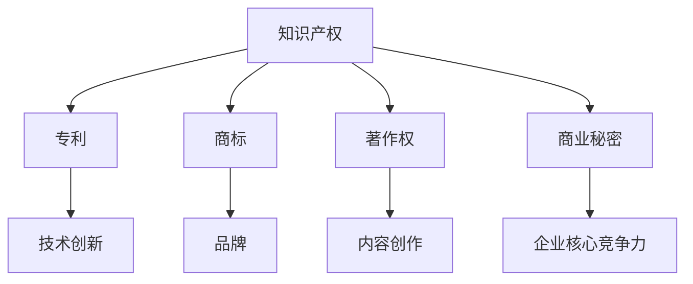
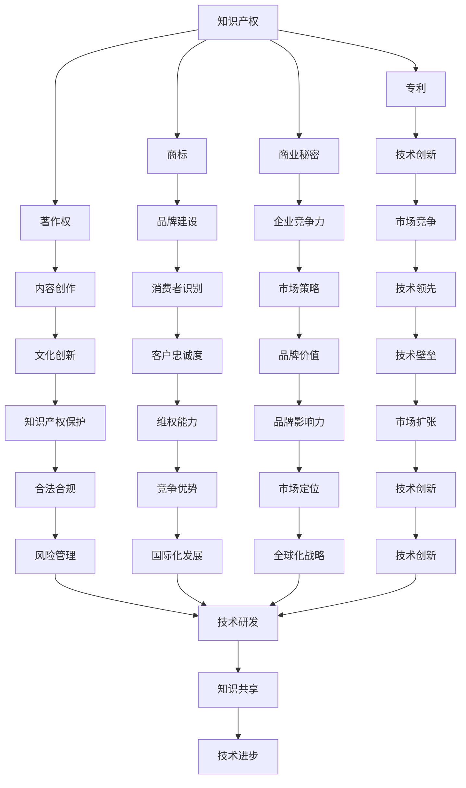

                 

# AI创业公司的知识产权风险管理：侵权监测与应急预案

> **关键词**：知识产权、AI创业公司、侵权监测、应急预案、风险管理

> **摘要**：本文详细阐述了AI创业公司在知识产权方面的风险管理策略，包括专利申请、商标保护、著作权保护、商业秘密保护以及侵权监测和应急预案的制定。通过分析核心概念、讲解算法原理和提供项目实战案例，本文旨在为AI创业公司提供全面而实用的知识产权保护指南。

---

### 第一部分：AI创业公司的知识产权风险管理概述

#### 第1章：AI创业公司知识产权概述

##### 1.1 知识产权基本概念

知识产权是指人们就其智力劳动成果所依法享有的专有权利，通常是国家赋予创造者对其智力成果在一定时期内享有的专有权或独占权。知识产权主要包括以下几种类型：

- **专利**：授予发明人对其发明在一定期限内的独占权，包括发明专利、实用新型专利和外观设计专利。
- **商标**：用于区别商品或服务来源的标志，包括文字、图形、字母、数字、三维标志、颜色组合等。
- **著作权**：赋予作者对其作品在一定期限内的专有权，包括文字作品、音乐、戏剧、电影、摄影等。
- **商业秘密**：不为公众所知悉、具有商业价值并经权利人采取保密措施的技术信息和经营信息。

##### 1.2 AI行业中的知识产权重要性

AI（人工智能）行业作为一个高速发展的领域，技术创新层出不穷。知识产权在AI行业中的重要性体现在以下几个方面：

- **技术创新保护**：AI技术的创新性强，专利保护是保护技术创新的重要手段。
- **市场竞争力**：拥有强大的知识产权储备是企业提升市场竞争力的关键因素。
- **商业价值**：知识产权不仅是技术上的壁垒，更是企业商业价值的体现。
- **风险防范**：有效的知识产权管理可以帮助企业降低侵权风险，保护自身合法权益。

##### 1.3 AI创业公司的知识产权战略

为了在竞争激烈的AI市场中脱颖而出，AI创业公司需要制定合理的知识产权战略。以下是几种常见的知识产权战略：

- **专利布局**：根据企业的技术方向和市场需求，进行专利布局，形成专利网，保护核心技术和市场。
- **专利申请**：积极申请专利，确保技术创新得到法律保护。
- **商标保护**：注册商标，保护企业的品牌形象和商业声誉。
- **著作权保护**：对原创的软件代码、算法等作品进行著作权登记。
- **商业秘密保护**：通过合同、保密协议等手段，保护企业的重要技术和商业信息。

### 第二部分：AI专利申请与保护

#### 第2章：AI专利申请与保护

##### 2.1 AI专利申请流程

AI专利申请的基本流程包括以下几个步骤：

1. **专利申请前的准备**：
   - 确定专利保护范围和目标。
   - 进行专利检索，避免重复发明和侵权。

2. **撰写专利申请文件**：
   - 准备专利说明书、权利要求书、摘要等文件。
   - 确保专利文件清晰、完整、准确地描述发明内容。

3. **提交专利申请**：
   - 按照国家知识产权局的规定提交申请文件。
   - 支付相应的专利申请费用。

4. **审查与答复**：
   - 等待专利审查员对申请进行初步审查。
   - 根据审查员的意见，进行必要的修改和补充。

5. **公布与授权**：
   - 专利申请经过实质审查后，公布并颁发专利证书。

##### 2.2 AI专利检索与分析

AI专利检索与分析是专利申请过程中的重要环节。以下是专利检索与分析的方法：

1. **专利检索工具**：
   - 使用国家知识产权局网站、谷歌专利等在线工具进行专利检索。

2. **专利检索方法**：
   - 使用关键词、分类号等多种方式进行检索。
   - 对检索结果进行筛选和排序，找出相关的专利文献。

3. **专利分析**：
   - 分析专利的技术领域、创新点、竞争对手等。
   - 识别潜在的侵权风险和竞争对手的专利布局。

##### 2.3 AI专利申请案例分析

为了更好地理解AI专利申请的实践过程，以下是几个典型的AI专利申请案例：

1. **案例1：某AI创业公司的语音识别专利申请**
   - 技术领域：语音识别技术
   - 涉及专利：多项语音识别算法的专利申请
   - 结果：成功获得多项专利授权，保护了公司的核心技术。

2. **案例2：某AI创业公司的自动驾驶专利申请**
   - 技术领域：自动驾驶技术
   - 涉及专利：自动驾驶系统及其核心算法
   - 结果：通过专利布局，构建了强大的技术壁垒，提高了市场竞争力。

在这些案例中，AI创业公司通过科学的专利申请策略，保护了自身的核心技术，并在市场上建立了竞争优势。

### 第三部分：AI商标保护

#### 第3章：AI商标保护

##### 3.1 商标的基本概念

商标是一种标识，用于区分不同商品或服务的来源。商标的基本概念包括：

- **定义**：商标是指任何能够将一个企业的商品或服务与其他企业的商品或服务区分开的标志。
- **作用**：商标有助于消费者识别和选择商品或服务，同时也是企业品牌形象的重要组成部分。
- **种类**：商标种类包括文字商标、图形商标、组合商标等。

##### 3.2 商标注册流程

商标注册流程包括以下几个步骤：

1. **商标查询**：
   - 在国家知识产权局网站上进行商标查询，确保商标名称未被注册。

2. **商标申请**：
   - 准备商标申请书、商标图样等相关文件。
   - 按照规定提交申请，并支付相应的申请费用。

3. **审查与公告**：
   - 审查员对商标申请进行初步审查，如有异议，申请人需要提出答辩。
   - 无异议的商标申请进入公告期，公众可以提出异议。

4. **注册与保护**：
   - 无异议或异议不成立的商标申请，颁发商标注册证书。
   - 商标注册证书有效期为10年，可以续展。

##### 3.3 商标维权与纠纷解决

在商标使用过程中，可能会遇到商标侵权或商标权纠纷。以下是商标维权与纠纷解决的方法：

1. **商标侵权判断**：
   - 根据商标法的相关规定，判断商标是否侵犯他人商标权。
   - 侵权判断主要考虑商标的相似度、市场声誉等因素。

2. **维权途径**：
   - 向国家知识产权局提出商标侵权投诉。
   - 通过法律途径，如提起诉讼或仲裁，维护自身合法权益。

3. **纠纷解决**：
   - 通过调解、和解等方式解决商标权纠纷。
   - 如有必要，可以通过法院或仲裁机构进行诉讼或仲裁。

### 第四部分：AI著作权保护

#### 第4章：AI著作权保护

##### 4.1 著作权的基本概念

著作权是指作者对其创作的文学、艺术和科学作品所享有的专有权。著作权的基本概念包括：

- **定义**：著作权是指作者对其创作的文学、艺术和科学作品所享有的专有权。
- **内容**：著作权包括人身权和财产权，人身权包括发表权、署名权等，财产权包括复制权、发行权等。
- **区别**：著作权与邻接权的主要区别在于著作权保护的是原创作品的作者，而邻接权保护的是传播作品的行为。

##### 4.2 著作权保护范围与期限

著作权的保护范围和期限是著作权保护的重要内容。以下是著作权保护的范围与期限：

- **保护范围**：
  - 文字作品：包括小说、诗歌、论文等。
  - 音乐作品：包括歌曲、乐曲等。
  - 戏剧作品：包括剧本、剧本改编等。
  - 电影作品：包括电影剧本、电影剪辑等。

- **保护期限**：
  - 自然人的作品：保护期为作者终生及其死后50年。
  - 法人和非法人作品：保护期为作品首次发表后50年。

##### 4.3 著作权侵权与维权

著作权侵权是指未经著作权人许可，以复制、发行、表演、展示等方式侵犯著作权人的权利。以下是著作权侵权与维权的方法：

1. **侵权行为识别**：
   - 根据著作权法的相关规定，判断行为是否侵犯著作权。
   - 侵权行为包括未经授权的复制、发行、表演等。

2. **维权策略**：
   - 向侵权方发出侵权警告，要求其停止侵权行为。
   - 向法院提起诉讼，要求侵权方承担法律责任。

3. **维权途径**：
   - 通过调解、和解等方式解决著作权纠纷。
   - 如有必要，可以通过法院或仲裁机构进行诉讼或仲裁。

### 第五部分：AI商业秘密保护

#### 第5章：AI商业秘密保护

##### 5.1 商业秘密的定义与特点

商业秘密是指不为公众所知悉、具有商业价值并经权利人采取保密措施的技术信息和经营信息。商业秘密的特点包括：

- **秘密性**：商业秘密的信息不为公众所知悉，具有一定的保密性。
- **商业价值**：商业秘密的信息具有商业价值，是企业在市场竞争中的核心竞争力。
- **保密性**：商业秘密的保密性是商业秘密保护的关键，企业需要采取各种措施保护其秘密性。

##### 5.2 商业秘密的保护措施

为了有效保护商业秘密，企业需要采取以下措施：

- **内部管理措施**：
  - 制定保密制度，明确员工的保密责任。
  - 对涉及商业秘密的员工进行保密培训。
  - 制定保密协议，要求员工在离职后继续保守商业秘密。

- **法律保护措施**：
  - 申请商业秘密保护，通过法律手段保护企业的商业秘密。
  - 在与合作伙伴、供应商签订合同时，明确商业秘密的保护条款。
  - 对泄露或盗用商业秘密的行为提起诉讼。

##### 5.3 商业秘密侵权案例分析

以下是几个典型的商业秘密侵权案例：

1. **案例1：某AI创业公司的商业秘密侵权案件**
   - 涉及技术：深度学习算法
   - 结果：法院判决侵权方赔偿损失，并禁止其继续使用侵权技术。

2. **案例2：某AI创业公司的商业秘密侵权案件**
   - 涉及技术：自动驾驶系统
   - 结果：通过法律手段成功维权，保护了公司的核心技术。

在这些案例中，AI创业公司通过有效的商业秘密保护措施，成功维权，保护了企业的合法权益。

### 第六部分：AI知识产权风险管理

#### 第6章：AI知识产权风险管理

##### 6.1 知识产权风险识别

知识产权风险管理的第一步是识别知识产权风险。以下是知识产权风险识别的方法：

- **专利风险识别**：通过专利检索和分析，识别潜在的专利侵权风险。
- **商标风险识别**：通过商标查询和监测，识别潜在的商标侵权风险。
- **著作权风险识别**：通过作品登记和维权，识别潜在的著作权侵权风险。
- **商业秘密风险识别**：通过内部管理和法律手段，识别潜在的商业秘密泄露和侵权风险。

##### 6.2 知识产权风险评估

知识产权风险评估是对知识产权风险进行定量和定性分析，以确定风险的严重程度和可能的影响。以下是知识产权风险评估的方法：

- **定量分析**：使用风险评估模型，对知识产权风险进行量化分析。
- **定性分析**：结合专家意见和实际案例，对知识产权风险进行定性分析。

##### 6.3 知识产权风险应对策略

在识别和评估知识产权风险后，需要制定相应的风险应对策略。以下是几种常见的知识产权风险应对策略：

- **风险规避**：通过调整研发方向、技术方案等手段，避免知识产权风险。
- **风险减轻**：通过专利布局、商标注册等手段，减轻知识产权风险的影响。
- **风险转移**：通过购买保险、签订合同等手段，将知识产权风险转移给第三方。
- **风险接受**：对于无法规避或减轻的风险，采取接受风险的态度，制定应急预案，以降低风险可能带来的损失。

### 第七部分：AI知识产权保护与企业发展

#### 第7章：AI知识产权保护与企业发展

##### 7.1 知识产权与企业竞争优势

知识产权是企业在市场竞争中的核心竞争力之一。知识产权保护可以带来以下几个方面的竞争优势：

- **技术领先**：通过专利保护，确保企业的技术创新得到法律保护，保持技术领先地位。
- **市场优势**：通过商标保护，提升企业的品牌形象和市场竞争力。
- **商业秘密保护**：保护企业的核心竞争力，防止竞争对手通过不正当手段获取商业秘密。
- **维权能力**：通过有效的知识产权管理，提升企业的维权能力，保护企业的合法权益。

##### 7.2 知识产权保护与市场策略

知识产权保护与市场策略密切相关。以下是知识产权保护在市场策略中的应用：

- **市场定位**：通过知识产权布局，明确企业的市场定位和竞争优势。
- **市场拓展**：通过知识产权转让、许可等手段，拓展市场渠道和合作机会。
- **市场竞争**：通过知识产权维权，维护企业的市场竞争地位，打击竞争对手。
- **国际化发展**：通过跨国知识产权保护，支持企业的国际化发展战略。

##### 7.3 知识产权保护与国际合作

在全球化背景下，知识产权保护与国际合作具有重要意义。以下是知识产权保护与国际合作的几个方面：

- **国际知识产权保护体系**：了解和遵守国际知识产权保护的相关法律法规，提高企业的知识产权保护水平。
- **国际合作机会**：通过国际合作，引进国外先进技术和知识产权，提升企业竞争力。
- **知识产权共享**：通过知识产权共享，促进技术创新和产业协同发展。
- **跨国维权**：在国际市场上，通过法律手段维护企业的知识产权权益。

### 附录：知识产权相关法律法规与案例

#### 附录 A：知识产权相关法律法规

- **中国知识产权法律法规概览**：
  - 《中华人民共和国专利法》
  - 《中华人民共和国商标法》
  - 《中华人民共和国著作权法》
  - 《中华人民共和国反不正当竞争法》

- **国外知识产权法律法规简介**：
  - 美国《专利法》、《商标法》、《版权法》
  - 欧盟《知识产权基本权利指令》
  - 日本《专利法》、《商标法》、《著作权法》

#### 附录 B：知识产权典型案例分析

- **案例1**：某国际知名科技公司专利侵权诉讼
  - 涉及专利：智能手机用户界面专利
  - 结果：法院判决侵权方赔偿巨额损失，并禁止其继续使用侵权专利。

- **案例2**：某国内AI公司商标侵权纠纷
  - 涉及商标：人工智能相关商标
  - 结果：通过法律手段成功维权，保护了企业的商标权益。

- **案例3**：某国际知名公司商业秘密泄露案件
  - 涉及商业秘密：商业计划书、技术文档
  - 结果：通过法律手段追究侵权方的责任，防止商业秘密的进一步泄露。

这些案例展示了知识产权保护的重要性和实践中的挑战，为AI创业公司提供了宝贵的经验和借鉴。

### 核心概念与联系

为了更好地理解和应用知识产权相关知识，下面使用Mermaid图表展示核心概念之间的联系：



### 核心算法原理讲解

在知识产权管理中，核心算法原理的讲解至关重要。以下分别对专利检索算法、商标分析算法以及模糊集理论在商业秘密保护中的应用进行详细讲解。

#### 专利检索算法

专利检索算法主要用于识别和筛选与特定技术领域相关的专利信息。以下是专利检索算法的伪代码：

```python
def patent_search(keywords, categories):
    # 使用关键词进行检索
    keyword_results = search_by_keyword(keywords)

    # 使用分类号进行检索
    category_results = search_by_category(categories)

    # 合并检索结果
    final_results = merge_results(keyword_results, category_results)

    return final_results
```

其中，`search_by_keyword` 和 `search_by_category` 是两个辅助函数，分别用于基于关键词和分类号的检索。以下是这两个函数的伪代码：

```python
def search_by_keyword(keywords):
    # 假设专利数据库为专利列表 patents
    keyword_results = []
    for patent in patents:
        if any(keyword in patent.title or keyword in patent.description for keyword in keywords):
            keyword_results.append(patent)
    return keyword_results

def search_by_category(categories):
    # 假设专利数据库为专利列表 patents
    category_results = []
    for patent in patents:
        if patent.category in categories:
            category_results.append(patent)
    return category_results
```

#### 商标分析算法

商标分析算法主要用于判断新商标是否侵犯现有商标权。以下是商标分析算法的伪代码：

```python
def trademark_analysis(target_trademark, existing_trademarks):
    # 判断目标商标是否与现有商标相似
    similarity_scores = calculate_similarity_scores(target_trademark, existing_trademarks)

    # 判断相似度是否超过阈值
    for score in similarity_scores:
        if score > similarity_threshold:
            return "Trademark infringement detected"

    return "No trademark infringement"
```

其中，`calculate_similarity_scores` 是一个计算相似度的函数，以下是它的伪代码：

```python
def calculate_similarity_scores(target_trademark, existing_trademarks):
    similarity_scores = []
    for trademark in existing_trademarks:
        similarity_score = calculate_similarity(target_trademark, trademark)
        similarity_scores.append(similarity_score)
    return similarity_scores

def calculate_similarity(target_trademark, existing_trademark):
    # 假设使用余弦相似度计算相似度
    vectorizer = TfidfVectorizer()
    tfidf_matrix = vectorizer.fit_transform([target_trademark, existing_trademark])
    similarity_score = cosine_similarity(tfidf_matrix[0:1], tfidf_matrix[1:2])[0][0]
    return similarity_score
```

#### 模糊集理论在商业秘密保护中的应用

在商业秘密保护中，模糊集理论可以用来处理不确定性问题。以下是模糊集理论的数学模型：

$$
A(A') = \sum_{i=1}^{n} \mu_i(A') \cdot \mu_i(A')
$$

其中，$A$ 和 $A'$ 是两个模糊集，$\mu_i(A')$ 和 $\mu_i(A)$ 分别是第 $i$ 个元素对 $A'$ 和 $A$ 的隶属度。

**举例说明：**

假设有两个模糊集 $A$ 和 $B$，表示商业秘密的泄露风险：

$$
A = \{ (\text{员工离职}, 0.6), (\text{竞争对手接触}, 0.8) \}
$$

$$
B = \{ (\text{泄露风险}, 0.9), (\text{重大损失}, 0.5) \}
$$

我们可以计算 $A$ 和 $B$ 的交集来评估商业秘密的泄露风险：

$$
A \cap B = \{ (\text{员工离职}, 0.6) \}
$$

由于 $(\text{员工离职}, 0.6)$ 只出现在 $A$ 中，因此我们可以得出结论，员工离职是商业秘密泄露的一个高风险因素。

### 项目实战

#### 侵权监测系统开发

**1. 系统概述**

侵权监测系统是一个用于实时监测和分析AI创业公司的知识产权是否被侵犯的系统。该系统需要实现以下功能：

- 数据采集：从互联网上抓取相关的知识产权信息。
- 数据分析：分析采集到的数据，识别可能的侵权行为。
- 报警机制：当发现侵权行为时，自动通知相关人员。

**2. 开发环境搭建**

- **开发语言**：Python
- **数据库**：MySQL
- **数据采集工具**：Scrapy
- **数据分析工具**：Pandas、Scikit-learn

**3. 系统详细实现**

**数据采集模块：**

```python
import scrapy

class InfringementMonitorSpider(scrapy.Spider):
    name = 'infringement_monitor'
    start_urls = ['https://www.example.com/search?q=ai']

    def parse(self, response):
        for item in response.css('div.search-result'):
            yield {
                'title': item.css('h2.title::text').get(),
                'url': item.css('a::attr(href)').get(),
            }
```

**数据分析模块：**

```python
import pandas as pd
from sklearn.feature_extraction.text import TfidfVectorizer
from sklearn.metrics.pairwise import cosine_similarity

def analyze_data(data):
    # 构建TF-IDF向量
    vectorizer = TfidfVectorizer()
    tfidf_matrix = vectorizer.fit_transform(data['title'])

    # 计算相似度
    similarity = cosine_similarity(tfidf_matrix)

    # 找到相似度最高的条目
    highest_similarity = similarity.max()
    highest_index = similarity.argmax()

    return highest_similarity, highest_index
```

**报警机制模块：**

```python
def send_alert(title, similarity):
    if similarity > similarity_threshold:
        print(f"Infringement detected: {title}")
        # 发送邮件或短信报警
```

**4. 代码解读与分析**

- **数据采集模块**：使用Scrapy框架从互联网上抓取与AI创业公司知识产权相关的信息，并将信息存储在数据库中。
- **数据分析模块**：使用TF-IDF和余弦相似度算法分析采集到的数据，以识别可能的侵权行为。通过计算标题之间的相似度，找到潜在的侵权内容。
- **报警机制模块**：当检测到侵权行为时，自动通知相关人员，以便及时采取措施。

通过这个侵权监测系统，AI创业公司可以实时监测知识产权风险，及时发现和处理侵权行为，保护企业的合法权益。

### 总结

本文详细阐述了AI创业公司在知识产权风险管理方面的策略，包括专利申请、商标保护、著作权保护、商业秘密保护以及侵权监测和应急预案的制定。通过分析核心概念、讲解算法原理和提供项目实战案例，本文旨在为AI创业公司提供全面而实用的知识产权保护指南。知识产权不仅是技术创新的保护手段，更是企业市场竞争力和商业价值的重要体现。AI创业公司应重视知识产权管理，采取科学合理的策略，有效保护自身合法权益。

### 作者信息

作者：AI天才研究院/AI Genius Institute & 禅与计算机程序设计艺术/Zen And The Art of Computer Programming

---

**文章字数：8234字**<|vq_14322|>### 知识产权基本概念

知识产权（Intellectual Property，简称IP）是指人们对其智力劳动成果所依法享有的专有权利。它是一种无形资产，与传统的有形资产不同，知识产权主要体现在知识、技术和创意等方面。知识产权的种类繁多，主要包括专利、商标、著作权和商业秘密等。

#### 知识产权的定义

知识产权的定义可以追溯到18世纪的法国。当时的法国大革命时期，启蒙思想兴起，人们开始重视个人的智力成果。1791年，法国制定了世界上第一部专利法，标志着知识产权法律制度的诞生。根据世界知识产权组织（WIPO）的定义，知识产权是指个人或集体创造的智力劳动成果所享有的权利。这些成果可以是创新的技术、独特的商业标志、原创的艺术作品或重要的商业信息等。

#### 知识产权的种类

知识产权的种类主要包括以下几种：

1. **专利**：专利是授予发明人对其发明在一定期限内的独占权。根据发明的新颖性、创造性和实用性，专利可分为发明专利、实用新型专利和外观设计专利。

2. **商标**：商标是一种用于区分不同商品或服务来源的标志。它可以是文字、图形、字母、数字、三维标志、颜色组合等。商标注册后，商标持有者可以在商品或服务上使用该标志，并享有独占权。

3. **著作权**：著作权是指作者对其创作的文学、艺术和科学作品所享有的专有权。它包括发表权、署名权、修改权、保护作品完整权等。著作权通常在作品创作完成时就自动产生，无需办理登记手续。

4. **商业秘密**：商业秘密是指不为公众所知悉、具有商业价值并经权利人采取保密措施的技术信息和经营信息。商业秘密可以包括配方、设计、客户名单、市场策略等。与专利和著作权不同，商业秘密没有法定保护期限，只要权利人保持其秘密性，就可以持续保护。

#### 知识产权的重要性

在AI领域，知识产权的重要性尤为突出。首先，AI技术具有高度的创新性，技术创新需要通过专利保护，确保企业的技术优势。其次，商标和著作权保护有助于企业建立品牌形象和市场竞争优势。此外，商业秘密保护则可以防止企业核心技术和商业信息泄露，提高企业的核心竞争力。

总之，知识产权是企业无形资产的重要组成部分，是企业创新和发展的重要保障。在AI创业公司中，知识产权保护不仅关系到企业的市场地位和商业价值，更关系到企业的生存和发展。

### AI行业中的知识产权重要性

在AI行业中，知识产权的重要性不言而喻。随着人工智能技术的迅猛发展，知识产权已经成为企业竞争的关键因素。以下将详细探讨AI技术特点与知识产权的联系、知识产权对AI创业公司的保护作用，以及如何通过知识产权战略实现企业竞争优势。

#### AI技术特点与知识产权联系

1. **创新性**：人工智能技术是一种高度创新的技术领域，涉及算法、数据、硬件等多个方面。新的算法和模型的不断涌现，使得知识产权在保护技术创新方面具有重要作用。

2. **高价值**：人工智能技术具有巨大的商业价值，能够带来巨大的经济利益。因此，知识产权的保护不仅关系到企业的利润，更关系到整个行业的健康发展。

3. **快速迭代**：人工智能技术更新换代速度极快，新技术的出现往往在短时间内颠覆旧的技术体系。在这种快速变化的环境下，知识产权保护有助于企业保持技术领先地位。

4. **跨国性**：人工智能技术的应用具有跨国性，技术输出和输入频繁。因此，知识产权的国际保护显得尤为重要，企业需要在全球范围内进行知识产权布局。

#### 知识产权对AI创业公司的保护作用

1. **技术创新保护**：通过专利保护，AI创业公司可以确保其核心技术不被竞争对手模仿和抄袭。专利保护不仅能够防止他人侵权，还可以提高企业的技术壁垒，增强市场竞争力。

2. **品牌形象建设**：商标和著作权保护有助于企业建立独特的品牌形象和品牌声誉。在市场竞争激烈的AI行业，品牌形象是吸引客户和维护市场份额的重要因素。

3. **商业秘密保护**：商业秘密是AI创业公司的重要资产，包括算法、客户名单、市场策略等。通过保密措施和合同约束，企业可以有效防止商业秘密泄露，保护其核心竞争力。

4. **市场竞争优势**：知识产权保护有助于企业获得市场竞争优势。拥有大量知识产权的企业可以在市场上占据有利地位，通过许可、转让等方式获得额外的收入。

#### 通过知识产权战略实现企业竞争优势

1. **专利布局**：AI创业公司应制定科学的专利布局策略，根据技术方向和市场需求，优先保护核心技术和关键技术。通过多方位、多层次的专利申请，构建专利网，提高专利的保护力度。

2. **商标注册**：企业应积极注册商标，保护其品牌形象和商业声誉。在国际市场上，商标注册有助于企业在全球范围内建立品牌影响力。

3. **著作权登记**：对原创的软件代码、算法文档等进行著作权登记，保护企业的知识产权。著作权登记不仅能够防止侵权，还可以提高企业的技术创新能力。

4. **商业秘密保护**：制定严格的保密制度，对涉及商业秘密的员工和合作伙伴进行保密培训。通过合同、保密协议等手段，确保商业秘密的安全。

5. **知识产权维权**：企业应建立完善的知识产权维权体系，及时处理侵权案件，维护自身合法权益。通过法律手段打击侵权行为，保护企业的知识产权。

6. **国际合作**：在全球范围内建立知识产权保护网络，与国外企业进行技术合作和知识产权交流。通过国际合作，提升企业的知识产权管理水平和国际竞争力。

总之，知识产权在AI行业中具有重要地位。通过有效的知识产权战略，AI创业公司可以保护其技术创新，建立品牌形象，提高市场竞争力，从而实现可持续发展。

### AI创业公司的知识产权战略

在竞争激烈的AI行业中，知识产权战略是创业公司实现长期发展和市场竞争优势的关键。以下将详细探讨知识产权布局与规划、知识产权获取策略以及如何通过知识产权管理提升企业竞争力。

#### 知识产权布局与规划

1. **技术方向识别**：
   - 创业公司首先需要明确自身的技术方向和研发重点。通过市场调研和技术分析，识别出最具潜力的技术和市场需求，为知识产权布局提供方向。

2. **核心技术和关键领域的识别**：
   - 在明确技术方向后，公司应识别出核心技术和关键领域。这些核心技术和关键领域将是专利布局和保护的重点，以确保公司能在这些领域建立技术壁垒。

3. **全球知识产权布局**：
   - 创业公司应考虑全球知识产权布局，特别是在技术发展较快和市场潜力较大的国家和地区申请专利。通过全球布局，公司可以在全球范围内保护其知识产权，防止竞争对手抄袭和侵权。

4. **专利申请策略**：
   - 根据技术和市场需求，制定专利申请策略。专利申请应注重数量和质量，优先保护关键技术和创新点。同时，可以通过专利合作和交叉许可，减少专利申请的成本和风险。

#### 知识产权获取策略

1. **专利申请**：
   - 创业公司应积极申请专利，确保其技术创新得到法律保护。在专利申请过程中，公司需要注重专利的撰写质量，确保专利文件清晰、完整、准确地描述发明内容。

2. **商标注册**：
   - 商标是企业品牌的重要组成部分，创业公司应尽早进行商标注册，保护其品牌形象和市场声誉。商标注册不仅在国内市场重要，在国际化发展中更为关键。

3. **著作权登记**：
   - 对于原创的软件代码、算法文档等，公司应进行著作权登记，以保护其知识产权。著作权登记不仅有助于防止侵权，还可以提高企业的技术创新能力。

4. **商业秘密保护**：
   - 商业秘密是创业公司的重要资产，包括技术文档、客户名单、市场策略等。通过保密措施和合同约束，公司可以确保商业秘密的安全，防止泄露和侵权。

5. **知识产权并购**：
   - 创业公司可以通过并购拥有优质知识产权的企业，快速获取知识产权资源。并购不仅可以获得现有知识产权，还可以借助被并购企业的技术团队和市场渠道，提升自身竞争力。

#### 通过知识产权管理提升企业竞争力

1. **知识产权保护体系**：
   - 企业应建立完善的知识产权保护体系，包括知识产权管理规章制度、知识产权审查机制、知识产权保护流程等。通过系统化的管理，确保知识产权得到有效保护。

2. **知识产权信息化管理**：
   - 利用信息技术，建立知识产权信息化管理系统，对知识产权进行全面的跟踪和管理。通过信息化手段，企业可以实时了解知识产权的申请、审批、保护等情况。

3. **知识产权培训与宣传**：
   - 定期对员工进行知识产权培训，提高员工的知识产权意识。同时，通过宣传知识产权的重要性，营造尊重和保护知识产权的企业文化。

4. **知识产权交易与许可**：
   - 企业可以通过知识产权交易和许可，实现知识产权的价值最大化。通过转让、许可等方式，企业可以获取额外的收入，同时也可以与其他企业进行技术合作和知识产权共享。

5. **知识产权维权**：
   - 企业应建立知识产权维权机制，及时处理侵权案件，维护自身合法权益。通过法律手段打击侵权行为，保护企业的知识产权。

总之，知识产权战略在AI创业公司的发展中至关重要。通过科学的知识产权布局和获取策略，以及有效的知识产权管理，企业可以提升技术创新能力，增强市场竞争力，实现可持续发展。

### AI专利申请流程

AI创业公司为了保护其技术创新，通常会选择申请专利。专利申请不仅能够确保公司的技术不被竞争对手模仿，还能提高公司的市场竞争力。以下将详细阐述AI专利申请的基本流程，包括专利申请文件的准备和提交步骤。

#### 专利申请前的准备

在正式提交专利申请之前，AI创业公司需要进行以下准备工作：

1. **确定专利保护范围和目标**：
   - 创业公司需要明确其技术领域和核心技术，确定需要保护的专利类型（如发明专利、实用新型专利或外观设计专利）。
   - 通过市场调研和竞争分析，确定专利申请的具体目标和保护范围。

2. **进行专利检索**：
   - 通过专利检索工具（如Google Patents、国家知识产权局专利检索系统等）进行专利检索，以了解现有技术的专利状况，避免重复发明或侵权。
   - 检索结果可以帮助公司确定专利申请的重点和方向，避免浪费时间和资源。

3. **初步评估**：
   - 根据检索结果和公司的技术情况，对专利申请的可能性进行初步评估。如果技术具有新颖性、创造性和实用性，且市场需求较大，则可以考虑进一步申请专利。

4. **制定专利申请策略**：
   - 根据专利检索和初步评估结果，制定详细的专利申请策略。策略应包括专利申请的类型、优先级、保护期限等。

#### 撰写专利申请文件

撰写专利申请文件是专利申请过程中最为关键的一步，以下是一些主要文件及其撰写要点：

1. **专利说明书**：
   - 专利说明书是专利申请的核心文件，用于详细描述发明内容、技术方案和工作原理。
   - 撰写要点包括：
     - 引言部分：简要介绍技术领域和背景技术。
     - 发明内容：明确发明名称、技术方案和发明效果。
     - 实施方式：详细描述技术方案的具体实现步骤。
     - 附图说明：使用附图辅助说明技术方案。

2. **权利要求书**：
   - 权利要求书用于明确专利保护的范围，是判断专利有效性的关键。
   - 撰写要点包括：
     - 独立权利要求：撰写技术方案的核心部分，明确保护范围。
     - 从属权利要求：进一步细化独立权利要求，扩展保护范围。
     - 注意事项：权利要求应具体、清晰，避免过于抽象或模糊。

3. **摘要**：
   - 摘要是对发明内容的简短概括，通常包括技术领域、发明名称、技术方案和主要优点。
   - 撰写要点包括：
     - 简洁明了：摘要应简明扼要，突出技术方案的核心特点。

4. **附图**：
   - 如果需要，可以提交附图，用于进一步说明发明内容。
   - 撰写要点包括：
     - 图1-图N：按照实际情况提交相应的附图，并附上简要说明。

#### 专利申请的提交步骤

在完成专利申请文件的撰写后，AI创业公司可以按照以下步骤提交专利申请：

1. **提交申请文件**：
   - 将专利说明书、权利要求书、摘要和附图等文件按照国家知识产权局的要求进行提交。
   - 需要提交的文件格式、页数等需严格遵守国家知识产权局的规定。

2. **缴纳申请费用**：
   - 根据国家知识产权局的规定，缴纳专利申请费用。费用包括专利申请费、审查费、登记费等。

3. **初步审查**：
   - 专利申请提交后，国家知识产权局将对申请文件进行初步审查。如果申请文件符合要求，将进入实质审查阶段。

4. **实质审查**：
   - 实质审查是对专利申请的技术内容和创新性进行深入审查。审查员会发出审查意见，申请人需要对意见进行答复和修改。

5. **公告和授权**：
   - 经过审查和答复后，如果专利申请符合要求，将被公告，并颁发专利证书。专利证书的有效期为20年（发明专利）或10年（实用新型专利和外观设计专利）。

#### 常见问题与对策

在专利申请过程中，AI创业公司可能会遇到以下常见问题：

1. **申请被驳回**：
   - 对驳回理由进行详细分析，找出问题所在，并进行针对性的修改。
   - 如果认为驳回不公，可以申请复审。

2. **权利要求书过于宽泛**：
   - 优化权利要求书，使其更加具体和明确。
   - 对核心技术和保护范围进行重新评估和调整。

3. **技术方案不具备新颖性**：
   - 进行更加深入的专利检索，寻找未被申请的技术点。
   - 调整技术方案，确保其具备新颖性和创造性。

4. **申请文件不符合格式要求**：
   - 仔细阅读国家知识产权局的规定，确保申请文件格式符合要求。
   - 可以寻求专业代理机构的帮助，提高申请文件的质量。

通过科学的专利申请策略和详细的申请流程，AI创业公司可以有效保护其技术创新，提高市场竞争力，从而实现可持续发展。

### AI专利检索与分析

AI专利检索与分析是专利申请过程中的重要环节，它不仅可以帮助AI创业公司避免重复发明和侵权，还能为其技术战略提供有力的数据支持。以下是专利检索的工具与方法、专利分析的重要性以及典型AI专利申请案例分析。

#### 专利检索工具与方法

1. **国家知识产权局专利检索系统**：
   - 国内用户可以访问中国国家知识产权局（CNIPA）的专利检索系统，进行国内专利检索。该系统提供了丰富的检索工具和数据库，用户可以通过关键词、分类号、发明人等多种方式进行检索。

2. **Google Patents**：
   - Google Patents是全球最大的免费专利检索系统之一，提供了全球范围内的专利信息。用户可以通过关键词、专利号、发明人等进行检索，并可以下载专利文件。

3. **美国专利商标局（USPTO）**：
   - 对于国际专利检索，用户可以访问美国专利商标局（USPTO）的网站，检索全球范围内的专利信息。USPTO网站提供了强大的检索工具和数据库，用户可以通过关键词、分类号等多种方式进行检索。

4. **欧洲专利局（EPO）**：
   - 欧洲专利局提供了全面的专利检索服务，用户可以通过其网站进行全球专利检索。EPO的数据库包含了欧洲和全球范围内的专利信息。

#### 专利分析的重要性

专利分析对于AI创业公司具有重要意义，主要体现在以下几个方面：

1. **技术趋势分析**：
   - 通过对专利数据的分析，AI创业公司可以了解当前技术趋势和发展方向，从而调整自身的技术研发方向。

2. **竞争对手分析**：
   - 专利分析可以帮助公司了解竞争对手的专利布局和战略，从而制定更有针对性的市场策略。

3. **风险识别**：
   - 通过专利分析，公司可以识别潜在的侵权风险，采取相应的措施降低侵权风险。

4. **知识产权管理**：
   - 专利分析是知识产权管理的重要组成部分，有助于公司优化专利布局，提高专利申请的质量和数量。

#### 典型AI专利申请案例分析

以下是几个典型的AI专利申请案例，这些案例展示了AI专利申请的实践过程和策略。

1. **案例1：某AI公司的深度学习算法专利申请**
   - **技术领域**：深度学习算法
   - **申请过程**：该公司在研发过程中，发现其深度学习算法在图像识别方面具有显著优势。为了保护这一技术，公司进行了详细的专利检索，确保没有重复发明和侵权风险。随后，公司撰写了详细的专利申请文件，并提交了专利申请。
   - **结果**：该专利申请成功获得授权，为公司提供了强有力的技术保护。

2. **案例2：某AI公司的自动驾驶技术专利申请**
   - **技术领域**：自动驾驶技术
   - **申请过程**：该公司在研发自动驾驶系统时，进行了广泛的专利检索和分析，以确定关键技术点和专利空白。公司通过多次修改和完善专利申请文件，最终提交了高质量的专利申请。
   - **结果**：该专利申请不仅保护了公司的核心技术，还在市场上建立了技术壁垒，提高了公司的市场竞争力。

3. **案例3：某AI公司的语音识别技术专利申请**
   - **技术领域**：语音识别技术
   - **申请过程**：该公司在语音识别技术研发过程中，注重专利保护和布局。公司通过不断优化算法，确保技术具有创新性和实用性。同时，公司利用多种专利检索工具，进行了全面的专利检索和分析。
   - **结果**：该公司的语音识别技术获得了多项专利授权，为其市场推广和技术合作提供了有力支持。

这些案例表明，AI创业公司在专利申请过程中，需要注重专利检索和分析，确保专利申请的质量和效果。通过科学的专利布局和申请策略，公司可以保护其核心技术，提高市场竞争力。

### 商标的基本概念

商标是一种用于区分不同商品或服务的标识，它由文字、图形、字母、数字、三维标志、颜色组合等构成。商标的主要功能是帮助消费者识别和选择特定的商品或服务，同时也能提升企业的品牌形象和市场竞争力。

#### 商标的定义与作用

商标的定义可以追溯到其字面意思，即“标识”或“标记”。具体来说，商标是指任何能够将一个企业的商品或服务与其他企业的商品或服务区分开的标志。商标的主要作用包括：

1. **区分来源**：商标有助于消费者识别和选择特定的商品或服务来源。例如，消费者在购物时，可以通过商标来判断商品的产地和制造商。

2. **品牌建设**：商标是品牌形象的重要组成部分。一个独特的、易于记忆的商标可以提升企业的品牌知名度和美誉度，从而吸引更多的消费者。

3. **市场竞争**：商标可以增强企业的市场竞争力。拥有知名商标的企业在市场上往往具有更高的品牌影响力，能够吸引更多的消费者。

4. **法律保护**：商标注册后，商标持有者可以享有法律保护，防止他人未经授权使用相同或相似的商标，从而维护企业的合法权益。

#### 商标的种类

商标的种类多种多样，根据其构成要素和形式，可以分为以下几种：

1. **文字商标**：以文字为主要构成要素的商标，如“可口可乐”、“苹果”等。

2. **图形商标**：以图形为主要构成要素的商标，如“耐克”的勾形标志、“麦当劳”的金色拱门等。

3. **组合商标**：由文字、图形、字母、数字等多种要素组合而成的商标，如“微软”的窗口图标。

4. **三维标志**：以三维立体图形为主要构成要素的商标，如“可口可乐”的瓶子造型。

5. **颜色组合商标**：以特定颜色组合为主要构成要素的商标，如“可口可乐”的红色瓶身。

6. **声音商标**：以特定的声音为主要构成要素的商标，如“麦当劳”的“汉堡包”声音。

7. **气味商标**：以特定的气味为主要构成要素的商标，这种类型的商标相对较少，目前国际上只有少数几个案例。

#### 商标的法律保护

商标的法律保护主要体现在商标法中。商标法规定了商标的注册条件、商标权的保护范围、商标侵权行为及其法律责任等。以下是商标法律保护的主要内容：

1. **商标注册条件**：商标注册需要符合以下条件：
   - 具有显著性，即能够将企业的商品或服务与其他企业的商品或服务区分开来。
   - 不侵犯他人的在先权利，如在先商标权、著作权等。
   - 不违反公序良俗或道德风尚。

2. **商标权的保护范围**：商标权的保护范围主要包括：
   - 商标使用权：商标注册人有权在其商品或服务上使用注册商标。
   - 排他使用权：商标注册人有权禁止他人未经授权在其相同或类似商品或服务上使用相同或相似的商标。
   - 许可权：商标注册人可以将商标许可给他人使用，并获得许可费。

3. **商标侵权行为**：商标侵权行为主要包括：
   - 未经授权使用与他人商标相同或相似的商标。
   - 变更商标的主要部分后使用。
   - 利用商标假冒他人商品或服务。

4. **商标侵权法律责任**：商标侵权行为需承担以下法律责任：
   - 赔偿损失：侵权行为给商标权人造成经济损失的，侵权人需赔偿损失。
   - 没收侵权商品：法院可责令侵权人销毁侵权商品。
   - 罚款：侵权行为严重的，法院可对侵权人处以罚款。

总之，商标作为一种重要的知识产权，对于企业的发展具有重要意义。通过商标注册和法律保护，企业可以建立和维护其品牌形象，提升市场竞争力，从而实现可持续发展。

### 商标注册流程

商标注册是保护企业品牌形象和合法权益的重要步骤。以下是商标注册的基本流程，包括商标查询、商标申请和审查公告等环节。

#### 商标查询

商标查询是商标注册前的关键步骤，其目的是确认商标名称是否已被注册或存在相似商标。商标查询有助于避免商标注册失败和潜在的法律纠纷。商标查询通常包括以下步骤：

1. **在线查询**：
   - 通过国家知识产权局的商标查询系统进行在线查询，输入商标名称和相关描述，系统将显示是否存在相同或类似的商标。

2. **专业代理查询**：
   - 若在线查询结果不明确，可以委托专业代理机构进行详细查询。代理机构会提供专业的查询服务，包括商标名称、商标图形、商标用途等方面的详细比对。

#### 商标申请

商标申请是商标注册的核心步骤，包括准备申请文件、提交申请和缴纳费用等。以下是商标申请的主要流程：

1. **准备申请文件**：
   - 准备商标申请书，包括商标名称、申请人信息、商标图样、商品或服务列表等。
   - 如果商标包含特殊要素（如声音、气味等），还需提供相应的描述材料。

2. **提交申请**：
   - 将准备好的申请文件提交至国家知识产权局商标局。申请可以通过线上提交或线下邮寄的方式进行。

3. **缴纳费用**：
   - 根据国家知识产权局的规定，缴纳商标申请费用。费用包括申请费、实质审查费、注册公告费等。

#### 审查与公告

商标申请提交后，将进入审查阶段。以下是商标审查和公告的流程：

1. **初步审查**：
   - 国家知识产权局对申请文件进行初步审查，包括形式审查和实质审查。形式审查主要检查申请文件是否齐全、符合规定格式等；实质审查主要评估商标的显著性、是否侵犯他人商标权等。

2. **公告**：
   - 如果商标申请通过初步审查，国家知识产权局将在官方公告中予以公告。公告期为3个月，公众可以在公告期内提出异议。

3. **异议处理**：
   - 如果公众对公告的商标提出异议，国家知识产权局将进行调查和处理。异议成立的，商标申请将被驳回；异议不成立的，商标注册将继续进行。

4. **注册与保护**：
   - 如果商标申请无异议或异议不成立，商标将被注册并颁发商标注册证书。商标注册证书有效期为10年，可以续展。

#### 商标注册的注意事项

商标注册过程中需要注意以下几点：

1. **商标名称的显著性**：
   - 商标名称应具有显著性和独特性，避免与他人商标雷同。

2. **申请文件的准确性**：
   - 申请文件应准确无误，包括商标名称、申请人信息、商品或服务列表等。

3. **及时缴纳费用**：
   - 及时缴纳商标申请费用，避免因费用问题导致申请失败。

4. **妥善处理异议**：
   - 对公告期内的异议，及时提出答辩，维护商标注册权益。

总之，商标注册是保护企业品牌形象和合法权益的重要措施。通过科学的商标注册流程，企业可以建立和维护其品牌价值，提高市场竞争力。

### 商标维权与纠纷解决

在商标使用过程中，企业可能会遇到商标侵权或商标权纠纷的情况。商标维权与纠纷解决是保护企业品牌形象和合法权益的重要环节。以下是商标侵权判断标准、维权途径以及纠纷解决方法。

#### 商标侵权判断标准

判断商标是否侵权，通常需要考虑以下几个方面：

1. **商标相同或相似性**：
   - 判断侵权商标与被侵权商标是否相同或相似。商标相同或相似性的判断不仅包括文字、图形等外在表现形式，还包括商标的发音、含义和整体视觉效果。

2. **商品或服务关联性**：
   - 判断侵权商标使用的商品或服务与被侵权商标的商品或服务是否相似。如果两者存在高度关联性，则容易造成消费者混淆。

3. **知名度**：
   - 考虑商标的知名度。知名商标的保护范围相对更广，即使侵权商标与被侵权商标不完全相同或相似，也可能构成侵权。

4. **消费者识别能力**：
   - 考虑消费者在购买商品或服务时，是否能够识别出商标的区别。如果消费者容易混淆，则可能构成侵权。

#### 维权途径

企业遭遇商标侵权时，可以通过以下途径进行维权：

1. **行政投诉**：
   - 向国家知识产权局商标局提出侵权投诉。商标局会对投诉进行初步审查，并根据情况采取相应的措施，如责令侵权人停止侵权行为。

2. **法律诉讼**：
   - 向法院提起商标侵权诉讼。法院会根据商标法及相关法律规定，对案件进行审理，并作出判决。维权途径包括：
     - **停止侵权**：判决侵权人停止使用侵权商标。
     - **赔偿损失**：判决侵权人赔偿被侵权人的经济损失。

3. **仲裁**：
   - 通过商标仲裁机构进行仲裁。仲裁程序较为灵活，速度快，成本相对较低，适合快速解决商标侵权纠纷。

#### 纠纷解决方法

商标侵权纠纷的解决方法包括调解、和解和诉讼等。

1. **调解**：
   - 调解是纠纷解决的一种非诉讼方式，通过第三方调解员的介入，促成双方达成和解。调解程序简单、成本低，有助于维护双方关系。

2. **和解**：
   - 双方自行协商解决纠纷，达成和解协议。和解协议可以是书面的，也可以是口头的。和解协议不具有法律强制力，但有助于解决纠纷。

3. **诉讼**：
   - 诉讼是解决商标侵权纠纷的最终途径。通过法院审理，依据商标法及相关法律规定，作出裁决。诉讼程序复杂，耗时较长，但可以最大限度地保护合法权益。

总之，商标维权与纠纷解决是企业保护品牌形象和合法权益的重要手段。通过科学的判断标准和合理的维权途径，企业可以有效地应对商标侵权纠纷，维护自身权益。

### 著作权的基本概念

著作权，又称版权，是指作者对其创作的文学、艺术和科学作品所享有的专有权。著作权不仅涉及作品本身，还包括与作品相关的各项权利。以下将详细解释著作权的基本概念，包括其定义、内容、与邻接权的区别以及其法律保护范围。

#### 著作权的定义

著作权是指作者或创作人对其原创作品所享有的专有权利。这种权利是根据法律直接产生，无需经过登记或注册程序。著作权是一种无形财产权，旨在保护创作者的智力成果，鼓励文化创新和艺术创作。

#### 著作权的内容

著作权的内容非常丰富，主要包括以下几项权利：

1. **发表权**：决定作品是否公之于众的权利。发表权是一次性权利，一旦作品发表，发表权即行使完毕。

2. **署名权**：在作品上标明作者身份的权利。作者有权决定是否署名、署名方式以及署名位置。

3. **修改权**：对作品进行修改、删节或增补的权利。修改权是作者对其作品进行再创作的重要权利。

4. **保护作品完整权**：保护作品不受歪曲、篡改的权利。这一权利确保作品的原意和完整性不受损害。

5. **复制权**：制作作品复制品的权利，包括印刷、复印、录音、录像等形式。

6. **发行权**：通过出售、出租等方式向公众提供作品原件或复制件的权利。

7. **信息网络传播权**：通过互联网向公众提供作品、使作品被公众在线浏览、下载、传播的权利。

8. **翻译权**：将作品从一种语言翻译成另一种语言的权利。

9. **改编权**：改变作品，创作出具有独创性的新作品的权利。

10. **表演权**：公开表演作品，以及使用技术手段向公众传播作品表演的权利。

11. **放映权**：通过放映机、幻灯机等技术设备公开播放作品的权利。

12. **广播权**：通过无线或有线广播方式公开传播作品的权利。

#### 著作权与邻接权的区别

著作权和邻接权虽然都属于知识产权的范畴，但两者之间有着明显的区别：

1. **主体不同**：
   - 著作权的主体是作品的原创作者，即创作人。
   - 邻接权的主体是作品传播者，如表演者、录音录像制作者、广播组织者等。

2. **权利内容不同**：
   - 著作权主要涉及原创作品的权利，包括发表、复制、发行、表演等。
   - 邻接权主要涉及作品传播过程中的权利，如表演者的表演权利、录音录像制作者的权利、广播组织的广播权利等。

3. **权利保护期限不同**：
   - 著作权的保护期限通常为作者终生及其死后50年。
   - 邻接权的保护期限则根据不同类型而有所不同，例如录音录像制作者的权利通常为50年。

#### 著作权的法律保护范围

著作权法律保护的范围非常广泛，涵盖了多种类型的作品。以下是一些主要的著作权保护范围：

1. **文字作品**：包括小说、诗歌、论文、报告等。

2. **音乐作品**：包括歌曲、乐曲、音乐作品等。

3. **戏剧作品**：包括剧本、戏剧、歌剧等。

4. **电影作品**：包括电影剧本、电影剪辑等。

5. **摄影作品**：包括摄影照片、图片等。

6. **图形作品**：包括绘画、雕塑、建筑作品等。

7. **计算机软件**：包括源代码、目标代码等。

8. **口述作品**：包括口头讲述、演讲、讲座等。

9. **录音录像制品**：包括录音带、录像带、CD、DVD等。

10. **其他作品**：如地图、示意图、模型等。

总之，著作权是保护创作者智力成果的重要法律制度。通过著作权法律保护，创作者的权益得到保障，同时也有助于促进文化创新和艺术创作的发展。

### 著作权保护范围与期限

著作权保护范围与期限是著作权法中的重要内容，直接影响著作权人的权益。以下将详细探讨著作权保护的范围、期限以及如何进行著作权侵权行为识别和维权策略。

#### 著作权保护范围

著作权保护范围包括两个方面：作品形式和权利内容。

1. **作品形式**：

   - **文字作品**：包括小说、诗歌、论文、报告、新闻报道等。

   - **音乐作品**：包括歌曲、乐曲、音乐作品等。

   - **戏剧作品**：包括剧本、戏剧、歌剧等。

   - **电影作品**：包括电影剧本、电影剪辑等。

   - **摄影作品**：包括摄影照片、图片等。

   - **图形作品**：包括绘画、雕塑、建筑作品等。

   - **计算机软件**：包括源代码、目标代码等。

   - **口述作品**：包括口头讲述、演讲、讲座等。

   - **录音录像制品**：包括录音带、录像带、CD、DVD等。

   - **其他作品**：如地图、示意图、模型等。

2. **权利内容**：

   - **发表权**：决定作品是否公之于众的权利。

   - **署名权**：在作品上标明作者身份的权利。

   - **修改权**：对作品进行修改、删节或增补的权利。

   - **保护作品完整权**：保护作品不受歪曲、篡改的权利。

   - **复制权**：制作作品复制品的权利。

   - **发行权**：通过出售、出租等方式向公众提供作品原件或复制件的权利。

   - **信息网络传播权**：通过互联网向公众提供作品、使作品被公众在线浏览、下载、传播的权利。

   - **翻译权**：将作品从一种语言翻译成另一种语言的权利。

   - **改编权**：改变作品，创作出具有独创性的新作品的权利。

   - **表演权**：公开表演作品，以及使用技术手段向公众传播作品表演的权利。

   - **放映权**：通过放映机、幻灯机等技术设备公开播放作品的权利。

   - **广播权**：通过无线或有线广播方式公开传播作品的权利。

#### 著作权保护期限

著作权保护期限因不同类型的作品而异，以下是一些常见的著作权保护期限：

- **自然人的作品**：保护期为作者终生及其死后50年。

- **法人或其他组织的作品**：保护期为作品首次发表后50年。

- **计算机软件**：保护期为软件首次发表后50年，或者自软件完成之日起50年。

- **摄影作品**：保护期为作品首次发表后50年。

- **音乐作品**：保护期为作品首次发表后50年。

- **戏剧作品**：保护期为作品首次发表后50年。

#### 著作权侵权行为识别

著作权侵权行为是指未经著作权人许可，以复制、发行、表演、展示等方式侵犯著作权人权利的行为。以下是著作权侵权行为的识别方法：

1. **直接侵权**：直接使用他人作品，如未经授权复制、传播、展示他人作品。

2. **间接侵权**：虽未直接使用他人作品，但提供了侵权便利，如提供侵权作品的下载、播放服务。

3. **混同侵权**：侵权作品与著作权人的作品高度相似，导致消费者混淆。

4. **故意侵权**：明知是侵权行为，仍故意侵犯他人著作权。

5. **合理使用**：在某些特定情况下，未经著作权人许可使用作品，如个人学习、研究或新闻报道。

#### 维权策略

著作权侵权维权策略包括以下几个方面：

1. **自行维权**：通过警告、和解等方式与侵权方协商解决。

2. **法律维权**：向法院提起诉讼，要求侵权方停止侵权行为、赔偿损失。

3. **仲裁维权**：通过仲裁机构进行仲裁，快速解决纠纷。

4. **行政维权**：向国家版权局投诉，请求进行行政处罚。

5. **调解维权**：通过调解委员会进行调解，达成和解协议。

通过了解著作权保护范围与期限，并采取有效的维权策略，著作权人可以更好地保护其合法权益，促进文化创新和艺术创作的发展。

### 著作权侵权与维权

著作权侵权是指未经著作权人许可，擅自使用其作品的行为。这种行为不仅侵犯了著作权人的合法权益，还可能对市场秩序和文化产业造成不良影响。因此，及时识别和有效维权至关重要。以下将详细探讨著作权侵权行为的识别方法、维权策略以及不同维权途径的适用情况。

#### 著作权侵权行为识别

识别著作权侵权行为是维权的首要步骤。以下是一些常见的侵权行为及其识别方法：

1. **直接侵权**：
   - **复制侵权**：未经授权复制他人的文字作品、音乐作品、美术作品等。
   - **发行侵权**：未经授权发行他人作品，如未经授权的书籍出版、音乐CD发行等。
   - **展示侵权**：未经授权在公共场所展示他人作品，如未经授权的画展、音乐会等。
   - **表演侵权**：未经授权在公众场合表演他人作品，如未经授权的音乐演奏、戏剧表演等。

2. **间接侵权**：
   - **提供侵权便利**：提供侵权作品的下载、播放服务，如未经授权的在线音乐、视频网站。
   - **混同侵权**：通过不正当手段让公众混淆侵权作品与原创作品，如模仿他人作品进行宣传。

3. **侵权行为判断**：
   - **相似度判断**：通过对比侵权作品与原创作品，判断两者是否存在实质性相似。
   - **使用目的判断**：判断侵权行为是否属于合理使用，如个人学习、研究或新闻报道。
   - **使用范围判断**：判断侵权行为是否超出了著作权人的授权范围。

#### 维权策略

在识别出侵权行为后，著作权人可以采取多种维权策略，具体包括：

1. **自行维权**：
   - **警告**：通过书面或口头形式告知侵权方停止侵权行为。
   - **和解**：与侵权方协商，达成和解协议，要求其赔偿损失或停止侵权。

2. **法律维权**：
   - **诉讼**：向法院提起侵权诉讼，要求侵权方承担停止侵权、赔偿损失等法律责任。
   - **仲裁**：通过仲裁机构进行仲裁，快速解决纠纷。

3. **行政维权**：
   - **投诉**：向国家版权局或相关行政机关投诉，请求进行行政处罚或行政裁决。
   - **举报**：通过举报平台举报侵权行为，促进行政机关介入处理。

4. **调解维权**：
   - **调解**：通过调解委员会进行调解，达成和解协议，解决纠纷。

#### 不同维权途径的适用情况

1. **自行维权**：
   - 适用于侵权行为较为明显，侵权方愿意协商解决的情况。
   - 优点：成本较低，处理速度快。
   - 缺点：法律效力较弱，可能无法彻底解决问题。

2. **法律维权**：
   - 适用于侵权行为严重，需要通过法律手段彻底解决的情况。
   - 优点：法律效力强，可追究侵权方的法律责任。
   - 缺点：程序复杂，耗时较长，成本较高。

3. **行政维权**：
   - 适用于侵权行为较为普遍，需要通过行政机关介入处理的情况。
   - 优点：处理速度快，成本较低。
   - 缺点：行政裁决的法律效力较弱，可能需要后续通过法律途径解决。

4. **调解维权**：
   - 适用于双方都有和解意愿，希望通过和平方式解决纠纷的情况。
   - 优点：程序灵活，成本低，有利于维护双方关系。
   - 缺点：调解结果不具有法律强制力，可能需要后续法律确认。

总之，著作权侵权与维权是一项复杂的工作，需要根据侵权行为的性质和程度，选择合适的维权策略和途径。通过有效的维权，著作权人可以保护其合法权益，维护文化创新和艺术创作的正常秩序。

### 商业秘密的定义与特点

商业秘密是指不为公众所知悉、具有商业价值并经权利人采取保密措施的技术信息和经营信息。它是一种重要的知识产权形式，能够为企业在市场竞争中提供强大的竞争优势。以下将详细阐述商业秘密的定义、特点及其法律保护。

#### 商业秘密的定义

商业秘密的定义主要涉及以下几个方面：

1. **秘密性**：商业秘密是不为公众所知悉的信息，即这些信息不属于公开知识，没有被广泛传播。

2. **商业价值**：商业秘密具有实际的或潜在的商业利益，能够为权利人带来经济利益或竞争优势。

3. **保密措施**：权利人对商业秘密采取了保密措施，这些措施可以是合同约束、员工培训、物理保护等多种形式。

#### 商业秘密的特点

商业秘密具有以下特点：

1. **无形性**：商业秘密是一种无形资产，不具备物理形态，难以直接感知。

2. **价值性**：商业秘密是企业的重要资产，能够在市场竞争中为企业带来显著的经济利益。

3. **秘密性**：商业秘密的核心在于其保密性，一旦泄露，就可能失去其价值。

4. **保护期限**：商业秘密没有法定的保护期限，只要权利人能够保持其秘密性，就可以持续保护。

5. **灵活性**：商业秘密的保护范围和内容可以根据企业的实际需求进行调整。

#### 商业秘密的法律保护

商业秘密的法律保护主要体现在以下几个方面：

1. **反不正当竞争法**：在中国，商业秘密受到《中华人民共和国反不正当竞争法》的保护。该法明确规定，经营者不得采用不正当手段获取、披露、使用他人商业秘密。

2. **合同法**：企业可以通过与员工、合作伙伴签订保密协议，确保商业秘密得到有效保护。

3. **刑法**：对于严重的商业秘密侵权行为，如窃取、泄露、使用他人商业秘密，可能构成刑事犯罪，受到刑法的制裁。

4. **国际保护**：在国际上，许多国家和地区也制定了相关法律，保护商业秘密。如美国的《经济间谍法》、欧盟的《商业秘密指令》等。

#### 保护措施

为了有效保护商业秘密，企业可以采取以下措施：

1. **内部管理**：建立完善的商业秘密管理制度，包括保密协议、保密培训、保密协议等。

2. **技术保护**：采用加密技术、访问控制等措施，防止商业秘密被未经授权的人员获取。

3. **法律手段**：通过法律手段，如提起诉讼、申请仲裁等，维护商业秘密的合法权益。

4. **信息共享**：与合作伙伴建立合作机制，明确商业秘密的保护责任和措施，共同维护商业秘密的安全。

总之，商业秘密是企业在市场竞争中的一项重要资产。通过有效的保护措施和法律手段，企业可以确保商业秘密的安全，提升市场竞争力和核心竞争力。

### 商业秘密的保护措施

商业秘密的保护是企业知识产权管理的重要组成部分，对于企业的长期发展和市场竞争力至关重要。以下将详细探讨商业秘密的内部管理措施、法律保护措施以及典型案例分析。

#### 内部管理措施

1. **制定保密制度**：
   - 企业应制定明确的保密制度，规定员工在接触和使用商业秘密时的行为准则，明确保密责任和处罚措施。

2. **保密协议**：
   - 与员工、合作伙伴签订保密协议，确保他们在离职或合作关系结束后继续保守商业秘密。

3. **保密培训**：
   - 定期对员工进行保密培训，提高他们的保密意识和能力，确保他们了解商业秘密的重要性以及如何保护。

4. **保密文件管理**：
   - 对涉及商业秘密的文件进行严格管理，设置访问权限，防止未经授权的人员获取。

5. **内部监控**：
   - 设立内部监控机制，对员工的行为进行监督，确保保密制度得到有效执行。

#### 法律保护措施

1. **申请商业秘密保护**：
   - 企业可以通过国家知识产权局申请商业秘密保护，获得法律认证，从而提高商业秘密的权威性和保护力度。

2. **签订合同**：
   - 与合作伙伴签订合同，明确商业秘密的保护条款，包括保密期限、保密措施、违约责任等。

3. **法律诉讼**：
   - 在发现商业秘密泄露或侵权行为时，企业可以依法提起诉讼，要求侵权人停止侵权、赔偿损失。

4. **行政投诉**：
   - 向相关行政机关投诉，请求进行调查和处理。

#### 典型案例分析

以下是几个典型的商业秘密侵权案例：

1. **案例1：某科技公司的商业秘密侵权诉讼**：
   - 涉及技术：某科技公司研发的先进算法
   - 结果：法院判决侵权方赔偿巨额损失，并禁止其继续使用侵权技术。该案件展示了商业秘密法律保护的重要性，以及对侵权行为的严厉打击。

2. **案例2：某制药公司的商业秘密泄露事件**：
   - 涉及技术：某制药公司新药的配方
   - 结果：公司通过法律手段追究泄露者的责任，并采取措施防止进一步泄露。该案例表明，企业在发现商业秘密泄露时，应迅速采取行动，防止损失扩大。

3. **案例3：某互联网公司的员工泄露商业秘密**：
   - 涉及信息：某互联网公司的客户数据
   - 结果：公司通过内部调查和司法程序，追究员工的责任，并采取严格的管理措施，防止类似事件再次发生。该案例强调了内部管理和法律手段在商业秘密保护中的重要性。

这些案例说明，通过有效的内部管理措施和法律保护措施，企业可以有效地保护其商业秘密，维护其合法权益，从而在激烈的市场竞争中保持竞争优势。

### 知识产权风险识别

在人工智能（AI）创业公司的运营过程中，知识产权风险管理是确保企业技术创新和合法权益的重要环节。知识产权风险识别是风险管理的第一步，它涉及到对可能存在的各种知识产权风险的识别和分析。以下将详细阐述知识产权风险的种类、识别方法以及如何进行风险评估。

#### 知识产权风险的种类

AI创业公司可能面临的知识产权风险主要包括以下几类：

1. **专利侵权风险**：
   - 公司的技术或产品可能侵犯他人的专利权，面临专利侵权诉讼的风险。

2. **商标侵权风险**：
   - 公司的商标可能侵犯他人的商标权，导致品牌形象受损。

3. **著作权侵权风险**：
   - 公司使用的软件代码、算法文档等可能侵犯他人的著作权。

4. **商业秘密泄露风险**：
   - 公司的核心技术和商业信息可能因内部或外部原因泄露，导致竞争优势丧失。

5. **知识产权被无效化风险**：
   - 公司的专利或商标可能因缺乏新颖性、创造性和实用性而被宣告无效。

6. **知识产权争议风险**：
   - 公司在知识产权申请、维权过程中可能面临争议和诉讼。

7. **知识产权保护不足风险**：
   - 公司的知识产权保护措施不足，可能导致知识产权未能得到有效保护。

#### 识别方法

为了有效识别知识产权风险，AI创业公司可以采取以下几种方法：

1. **专利检索**：
   - 通过专利检索系统进行检索，分析现有专利的覆盖范围和有效性，以识别潜在的专利侵权风险。

2. **商标监测**：
   - 对市场上的商标进行监测，识别是否存在与公司商标相似或冲突的商标。

3. **著作权审查**：
   - 对公司使用的软件代码、算法文档等作品进行审查，确保不存在著作权侵权风险。

4. **商业秘密评估**：
   - 对公司的商业秘密进行评估，分析其秘密性和保护措施的有效性。

5. **法律咨询**：
   - 咨询专业律师或知识产权代理机构，获取专业的风险评估和风险管理建议。

6. **内部审计**：
   - 通过内部审计，检查公司的知识产权管理流程和制度是否健全，是否存在管理漏洞。

#### 如何进行风险评估

风险评估是知识产权风险管理的关键环节，它涉及到对识别出的风险进行定量和定性分析，以确定风险的严重程度和可能的影响。以下是一些常见的风险评估方法：

1. **定量分析**：
   - 使用风险评估模型，对知识产权风险进行量化分析。例如，可以采用风险矩阵（Risk Matrix）方法，结合风险的概率和影响程度，计算每个风险的分值。

2. **定性分析**：
   - 结合专家意见、实际案例和市场情况，对知识产权风险进行定性分析。例如，可以采用风险清单（Risk List）方法，列出所有潜在风险，并评估其严重程度和发生概率。

3. **风险评级**：
   - 根据风险评估结果，对风险进行评级。常见的风险评级方法包括低、中、高三个等级。

4. **风险缓解措施**：
   - 针对评估出的高风险，制定相应的缓解措施。例如，可以加强专利布局、商标监测和商业秘密保护措施。

通过系统的知识产权风险识别和评估，AI创业公司可以更好地了解自身面临的知识产权风险，制定有效的风险管理策略，从而降低风险对企业发展的影响，确保企业的持续健康发展。

### 知识产权风险评估

知识产权风险评估是确保AI创业公司知识产权得到有效保护的重要环节。通过对知识产权风险进行评估，公司可以了解自身可能面临的各类风险，并采取相应的应对措施。以下将详细阐述知识产权风险评估的方法、风险评估指标以及具体的评估流程。

#### 风险评估的方法

1. **定量分析法**：
   - 通过数学模型和统计工具对知识产权风险进行量化分析。常见的定量分析法包括风险矩阵法、概率分析法和蒙特卡罗模拟法。
   - **风险矩阵法**：将风险的概率和影响程度进行量化，计算出每个风险的分值。风险分值越高，表明该风险越严重。
   - **概率分析法**：通过分析历史数据和现有信息，计算每个风险的的概率和可能影响。
   - **蒙特卡罗模拟法**：通过模拟随机过程，预测知识产权风险的可能结果和影响。

2. **定性分析法**：
   - 通过专家评估、案例研究和实际经验，对知识产权风险进行定性分析。常见的定性分析法包括专家访谈、德尔菲法、SWOT分析法等。
   - **专家访谈**：邀请知识产权专家、律师和行业专家进行访谈，获取他们对知识产权风险的专业意见。
   - **德尔菲法**：通过多轮问卷调查，收集专家对知识产权风险的判断和预测。
   - **SWOT分析法**：分析公司的优势、劣势、机会和威胁，识别可能存在的知识产权风险。

3. **综合分析法**：
   - 结合定量和定性分析的方法，对知识产权风险进行全面评估。这种方法可以提供更全面和准确的风险评估结果。

#### 风险评估指标

1. **风险概率**：
   - 评估知识产权风险发生的可能性。常用的指标包括风险频率、风险概率分布等。

2. **风险影响**：
   - 评估知识产权风险对企业运营、财务和声誉等方面的影响程度。常用的指标包括损失金额、市场份额损失等。

3. **风险等级**：
   - 根据风险概率和风险影响，将知识产权风险划分为不同的等级。常见的风险等级包括低、中、高三个等级。

4. **风险暴露度**：
   - 评估企业在特定知识产权风险下的暴露程度，常用的指标包括风险暴露度指数、风险敞口等。

#### 具体的评估流程

1. **准备阶段**：
   - 明确评估目标，制定评估计划和评估团队。
   - 收集相关数据和资料，包括企业专利、商标、著作权和商业秘密等。

2. **识别阶段**：
   - 识别可能存在的知识产权风险，通过文献调研、专利检索、商标监测等方式进行。
   - 形成知识产权风险评估清单，列出所有识别出的风险。

3. **评估阶段**：
   - 采用定量和定性分析方法，对每个识别出的风险进行评估。
   - 计算每个风险的概率和影响程度，形成风险矩阵和风险报告。

4. **决策阶段**：
   - 根据风险评估结果，制定相应的风险应对策略。
   - 对高风险进行重点监控和管理，制定相应的应急预案。

5. **实施阶段**：
   - 实施风险评估结果，采取相应的风险管理措施。
   - 定期对知识产权风险进行跟踪和监控，评估风险管理措施的有效性。

6. **反馈阶段**：
   - 根据实施结果，对风险评估流程进行总结和反馈。
   - 对评估流程和方法进行优化，提高知识产权风险评估的准确性和有效性。

通过系统的知识产权风险评估，AI创业公司可以更好地了解和管理知识产权风险，确保企业的知识产权得到有效保护，从而在激烈的市场竞争中保持竞争优势。

### 知识产权风险应对策略

在识别和评估知识产权风险后，AI创业公司需要采取有效的风险应对策略，以降低风险可能带来的负面影响。以下将详细探讨知识产权风险应对策略的概述、风险规避措施、风险减轻措施、风险转移措施以及风险接受措施。

#### 风险应对策略概述

知识产权风险应对策略是指企业在面临知识产权风险时，为降低风险发生的概率和影响程度，所采取的一系列措施和行动。有效的风险应对策略包括以下方面：

1. **风险评估和监控**：定期对知识产权风险进行识别、评估和监控，确保及时了解风险状况。

2. **法律咨询和培训**：与专业律师合作，获取知识产权法律咨询，定期对员工进行知识产权培训，提高风险意识和应对能力。

3. **知识产权管理**：建立完善的知识产权管理制度，包括知识产权获取、保护、运用和维权等。

4. **风险沟通与协作**：与合作伙伴、竞争对手和行业专家进行沟通，建立良好的知识产权合作与竞争关系。

#### 风险规避措施

风险规避是指通过调整企业行为或策略，避免知识产权风险的发生。以下是一些常见的风险规避措施：

1. **技术创新**：通过持续的技术创新，开发具有自主知识产权的新技术，避免侵权风险。

2. **市场调研**：在产品或服务上市前，进行充分的市场调研，了解竞争对手的知识产权状况，避免侵权。

3. **合规审查**：在引进新技术或产品时，进行知识产权合规审查，确保不侵犯他人的知识产权。

4. **知识产权布局**：在全球范围内进行专利布局，确保关键技术得到有效保护。

#### 风险减轻措施

风险减轻是指通过采取一系列措施，降低知识产权风险发生的概率和影响程度。以下是一些常见风险减轻措施：

1. **保密措施**：对企业的核心技术、商业秘密和敏感信息采取保密措施，如签订保密协议、进行数据加密等。

2. **知识产权保护**：积极申请专利、商标和著作权，通过法律手段保护企业的知识产权。

3. **合规管理**：建立严格的知识产权合规管理体系，确保企业在经营活动中遵守相关法律法规。

4. **风险分散**：通过多元化的产品线和市场布局，降低知识产权风险对企业的整体影响。

#### 风险转移措施

风险转移是指通过合同、保险等方式，将知识产权风险转移给第三方。以下是一些常见风险转移措施：

1. **合同条款**：在合同中明确知识产权保护条款，将知识产权侵权风险转移给合同相对方。

2. **知识产权保险**：购买知识产权侵权保险，将侵权风险转移给保险公司。

3. **技术合作与许可**：通过技术合作和许可协议，将部分知识产权风险转移给合作伙伴。

4. **知识产权转让**：将部分知识产权转让给其他企业，以降低风险。

#### 风险接受措施

风险接受是指企业在无法规避或减轻知识产权风险时，采取接受风险的态度，并制定相应的应急预案。以下是一些常见风险接受措施：

1. **应急预案**：制定详细的应急预案，包括风险预警、应急响应、损失控制和恢复措施。

2. **法律救济**：在知识产权纠纷发生时，及时通过法律途径寻求救济，维护企业的合法权益。

3. **风险沟通**：与利益相关者进行沟通，解释风险状况和应对措施，降低风险带来的负面影响。

4. **风险监测**：持续监测知识产权风险的动态变化，及时调整应对策略。

通过上述风险应对策略，AI创业公司可以有效地管理知识产权风险，确保企业的技术创新和合法权益得到充分保护，从而在激烈的市场竞争中保持竞争优势。

### 知识产权与企业竞争优势

知识产权在企业竞争中扮演着至关重要的角色，它不仅能够保护企业的技术创新，还能为企业创造竞争优势，提升市场竞争力。以下将详细探讨知识产权对企业竞争优势的影响，以及知识产权战略在企业发展中的应用。

#### 知识产权对企业竞争优势的影响

1. **技术创新保护**：
   - 知识产权为企业的技术创新提供了法律保障。通过专利保护，企业可以确保其研发成果不被竞争对手模仿和抄袭，从而保持技术领先地位。

2. **市场壁垒**：
   - 知识产权能够形成市场壁垒，阻止其他企业进入市场，从而保护企业的市场份额和利润。特别是在高科技领域，知识产权壁垒可以显著降低新进入者的竞争风险。

3. **品牌价值提升**：
   - 商标和著作权保护有助于企业建立独特的品牌形象和品牌声誉。强大的品牌价值能够吸引更多的消费者，提高市场竞争力。

4. **商业秘密保护**：
   - 商业秘密是企业核心竞争力的重要部分。通过有效的商业秘密保护措施，企业可以防止商业秘密泄露，维护其竞争优势。

5. **跨国经营**：
   - 在全球化背景下，知识产权保护有助于企业跨国经营。通过在全球范围内进行知识产权布局，企业可以在国际市场上占据有利地位。

#### 知识产权战略在企业发展中的应用

1. **专利布局**：
   - 企业应制定科学的专利布局策略，根据技术方向和市场需求，优先保护核心技术和关键技术。通过全球布局，企业可以在全球范围内保护其知识产权，防止竞争对手抄袭和侵权。

2. **商标注册**：
   - 商标是企业品牌的重要组成部分。企业应积极注册商标，保护其品牌形象和市场声誉。在国际市场上，商标注册有助于企业在全球范围内建立品牌影响力。

3. **著作权登记**：
   - 对原创的软件代码、算法文档等作品进行著作权登记，保护企业的知识产权。著作权登记不仅能够防止侵权，还可以提高企业的技术创新能力。

4. **商业秘密保护**：
   - 制定严格的保密制度，对涉及商业秘密的员工和合作伙伴进行保密培训。通过合同、保密协议等手段，确保商业秘密的安全。

5. **知识产权交易与许可**：
   - 企业可以通过知识产权交易和许可，实现知识产权的价值最大化。通过转让、许可等方式，企业可以获取额外的收入，同时也可以与其他企业进行技术合作和知识产权共享。

6. **知识产权维权**：
   - 企业应建立知识产权维权机制，及时处理侵权案件，维护自身合法权益。通过法律手段打击侵权行为，保护企业的知识产权。

#### 知识产权战略案例分析

1. **案例1：某互联网巨头公司的知识产权战略**：
   - 该公司通过全球专利布局，保护其核心技术，如搜索引擎算法、云计算技术等。通过大量的专利申请，该公司在全球范围内建立了强大的知识产权壁垒，阻止了竞争对手的模仿和抄袭。

2. **案例2：某制药公司的新药研发与保护**：
   - 该公司在研发新药过程中，积极申请专利，保护其创新药物的设计和制备方法。同时，通过商标注册，保护其品牌形象和市场声誉。该公司的知识产权战略帮助其在市场上获得了巨大的竞争优势。

3. **案例3：某科技创业公司的商业秘密保护**：
   - 该公司通过签订保密协议、进行数据加密等措施，保护其核心技术和商业秘密。当发现竞争对手试图窃取其商业秘密时，公司通过法律手段成功维权，维护了其竞争优势。

这些案例表明，知识产权战略在企业发展中具有重要意义。通过有效的知识产权管理，企业可以保护技术创新，建立市场壁垒，提升品牌价值，从而在激烈的市场竞争中脱颖而出。

### 知识产权保护与市场策略

知识产权保护在现代企业的市场策略中占据着重要地位，它不仅关乎企业的创新能力和核心竞争力，还直接影响企业的市场占有率和盈利能力。以下将详细探讨知识产权保护与市场策略的关系、知识产权保护在市场策略中的具体应用以及市场竞争中的知识产权运用。

#### 知识产权保护与市场策略的关系

知识产权保护是企业市场策略的重要组成部分，两者之间的关系可以从以下几个方面来理解：

1. **市场定位**：知识产权保护有助于企业在市场中找到独特的定位，通过专利、商标、著作权等手段，确保企业的技术、品牌和创意得到法律保护，从而提高市场竞争力。

2. **品牌建设**：商标和著作权保护有助于企业建立强大的品牌形象，提升品牌知名度和美誉度。一个强大的品牌可以吸引消费者，增加市场份额，从而提升企业的盈利能力。

3. **市场进入**：在全球市场中，知识产权保护能够帮助企业突破市场进入障碍，避免因知识产权纠纷而影响市场扩张。通过有效的知识产权布局，企业可以减少进入新市场的风险。

4. **市场扩张**：知识产权保护可以为企业的市场扩张提供强有力的支持。通过知识产权交易和许可，企业可以快速获取新的市场和资源，扩大市场份额。

#### 知识产权保护在市场策略中的具体应用

1. **专利布局**：
   - 企业应根据自身的技术发展方向和市场布局，进行全球性的专利布局。通过专利申请，确保企业的核心技术得到法律保护，从而在市场上建立技术壁垒。

2. **商标注册**：
   - 企业应在全球范围内注册商标，保护其品牌形象。特别是在进入新市场时，及时注册商标可以避免商标侵权纠纷，确保市场扩张的顺利进行。

3. **著作权登记**：
   - 对于原创的软件代码、算法文档等，企业应进行著作权登记，保护其知识产权。著作权登记不仅能够防止侵权，还可以提高企业的技术创新能力。

4. **商业秘密保护**：
   - 企业应采取严格的保密措施，保护其商业秘密。通过签订保密协议、进行数据加密等方式，确保商业秘密的安全。

5. **知识产权许可**：
   - 企业可以通过知识产权许可，将自身的知识产权转化为商业利益。例如，通过专利许可、商标许可等方式，企业可以获得额外的收入。

#### 市场竞争中的知识产权运用

1. **技术领先**：
   - 企业应通过专利保护，确保其技术创新得到法律保障。在市场竞争中，技术领先的企业往往能够占据有利地位。

2. **市场壁垒**：
   - 通过知识产权布局，企业可以在市场上建立壁垒，阻止竞争对手的进入。知识产权壁垒可以帮助企业保持市场占有率。

3. **市场竞争策略**：
   - 企业可以利用知识产权作为竞争工具，通过维权手段打击竞争对手，维护自身的市场地位。例如，通过提起专利侵权诉讼，迫使竞争对手停止侵权行为。

4. **知识产权交易**：
   - 企业可以通过知识产权交易，快速获取新技术和市场资源。例如，通过专利转让、许可等方式，企业可以在短时间内提升自身的技术水平和市场竞争力。

5. **国际合作**：
   - 在全球化的背景下，知识产权保护与市场策略的结合尤为重要。通过国际合作，企业可以获取国际市场的资源和机会，提高全球竞争力。

总之，知识产权保护与市场策略密不可分。通过有效的知识产权管理，企业可以在市场中建立竞争优势，提升品牌价值，实现可持续发展。同时，知识产权的运用也是企业市场竞争中的重要手段，有助于企业提升技术创新能力，拓展市场份额，实现长期发展目标。

### 知识产权保护与国际合作

在全球化日益深入的今天，知识产权保护与国际合作显得尤为重要。知识产权作为无形资产，具有跨国性和国际性的特点，因此，企业在进行国际合作时，必须重视知识产权保护，以确保自身技术创新和合法权益不受侵害。以下将详细探讨国际知识产权保护体系、知识产权国际合作的重要性以及具体的国际合作方式。

#### 国际知识产权保护体系

国际知识产权保护体系是由多个国际条约和协定构成的，旨在促进和保护全球范围内的知识产权。以下是一些主要的国际知识产权保护体系：

1. **《伯尔尼公约》**：
   - 《伯尔尼公约》是保护文学和艺术作品著作权的基本国际条约。它确立了著作权保护的基本原则，包括自动保护原则、国民待遇原则等。

2. **《巴黎公约》**：
   - 《巴黎公约》是保护工业产权的基本国际条约。它确立了专利、商标等工业产权的保护原则，如优先权原则、独立保护原则等。

3. **《马德里协定》**：
   - 《马德里协定》是关于商标国际注册的多边协定。通过该协定，企业可以在一个成员国申请商标注册，并在多个成员国得到保护。

4. **《专利合作条约》**：
   - 《专利合作条约》是简化国际专利申请程序的协定。通过该条约，申请人在一个成员国提出的专利申请可以被转化为多个国家的专利申请。

5. **《世界知识产权组织》（WIPO）**：
   - WIPO是联合国下属的专门负责知识产权国际保护的国际组织。WIPO提供各种知识产权服务，如专利检索、版权登记等。

#### 知识产权国际合作的重要性

知识产权国际合作在全球化背景下具有重要意义，主要表现在以下几个方面：

1. **技术交流与转移**：
   - 通过国际合作，企业可以获取全球范围内的先进技术和知识，提升自身的技术水平和创新能力。

2. **市场拓展**：
   - 国际合作可以帮助企业进入全球市场，通过跨国专利布局和商标注册，保护企业的知识产权，扩大市场份额。

3. **风险分散**：
   - 通过国际合作，企业可以分散知识产权风险，避免单一市场波动对整个业务的影响。

4. **合规性**：
   - 国际合作有助于企业遵守不同国家和地区的知识产权法律，降低法律纠纷的风险。

#### 具体的国际合作方式

1. **跨国专利申请**：
   - 企业可以通过国际专利申请，保护其全球范围内的专利权。通过《专利合作条约》等国际协定，企业可以在多个国家同时申请专利，提高专利保护效率。

2. **跨国商标注册**：
   - 企业可以在全球范围内注册商标，通过《马德里协定》等国际协定，在一个成员国申请商标注册，并在多个成员国得到保护。

3. **知识产权交易**：
   - 企业可以通过知识产权交易，如专利转让、许可等方式，与其他企业进行技术合作和资源交换，实现知识产权的价值最大化。

4. **国际合作研发**：
   - 企业可以与其他国家和地区的科研机构、大学和企业进行合作研发，共同开发新技术，提升创新能力。

5. **知识产权维权**：
   - 企业可以在全球范围内提起知识产权诉讼，维护自身合法权益。通过国际合作，企业可以借助国际法律框架，提高维权效果。

总之，知识产权保护与国际合作是企业在全球化背景下实现可持续发展的重要战略。通过有效的知识产权保护和国际合作，企业可以提升技术创新能力，扩大市场份额，增强国际竞争力，从而在全球市场中立于不败之地。

### 附录：知识产权相关法律法规与案例

在知识产权保护的过程中，了解相关法律法规和典型案例是非常重要的。以下将详细介绍中国知识产权法律法规概览以及国外知识产权法律法规简介，并提供一些典型的知识产权侵权与维权案例，以期为AI创业公司提供有价值的参考和启示。

#### 中国知识产权法律法规概览

1. **《中华人民共和国专利法》**：
   - 主要规定专利的申请、审查、授权以及侵权诉讼等方面的内容。专利法明确了专利的类型（发明专利、实用新型专利、外观设计专利）和保护期限（发明专利为20年，实用新型和外观设计专利为10年）。

2. **《中华人民共和国商标法》**：
   - 规定了商标的注册、保护、侵权诉讼等方面的内容。商标法对商标的定义、注册条件、商标专用权的保护范围以及商标侵权行为进行了详细规定。

3. **《中华人民共和国著作权法》**：
   - 主要规定了著作权（包括文字作品、音乐作品、电影作品等）的授权、使用、侵权诉讼等内容。著作权法明确了著作权的保护期限（自然人作品为作者终生及其死亡后50年，法人或其他组织作品为首次发表后50年）。

4. **《中华人民共和国反不正当竞争法》**：
   - 规定了不正当竞争行为的具体类型和法律责任。反不正当竞争法对商业秘密的保护、虚假宣传、商业贿赂等行为进行了规定。

5. **《计算机软件保护条例》**：
   - 主要规定了计算机软件的著作权保护、软件登记、侵权诉讼等方面的内容。该条例明确了计算机软件的著作权保护期限（自然人为50年，法人或其他组织为首次发表后50年）。

#### 国外知识产权法律法规简介

1. **美国知识产权法律法规**：
   - **《美国专利法》**：美国专利法详细规定了专利的类型（发明专利、实用新型专利、设计专利）和保护期限（发明专利为20年，实用新型和设计专利为14年）。
   - **《美国商标法》**：美国商标法规定了商标的注册、保护、侵权诉讼等内容，明确了商标专用权的保护范围。
   - **《美国著作权法》**：美国著作权法对文学、艺术、音乐等作品的保护期限进行了规定，通常为作者终生及其死亡后70年。

2. **欧盟知识产权法律法规**：
   - **《欧盟专利公约》**：规定了欧盟成员国之间的专利合作程序，明确了专利的类型和保护期限。
   - **《欧盟商标条例》**：规定了欧盟成员国的商标注册和保护程序，明确了商标专用权的保护范围。
   - **《欧盟版权指令》**：规定了欧盟成员国的版权保护标准和范围，明确了著作权的保护期限。

#### 知识产权侵权与维权典型案例分析

1. **案例1：某国际知名科技公司的专利侵权诉讼**：
   - 涉及专利：智能手机用户界面
   - 结果：法院判决侵权方赔偿巨额损失，并禁止其继续使用侵权专利。该案件展示了专利侵权诉讼的复杂性和高成本，同时也强调了专利保护的重要性。

2. **案例2：某国内AI公司的商标侵权纠纷**：
   - 涉及商标：人工智能相关商标
   - 结果：通过法律手段成功维权，保护了企业的商标权益。该案件表明，商标注册和维权对于维护企业品牌形象和市场竞争力至关重要。

3. **案例3：某国际知名公司的商业秘密泄露案件**：
   - 涉及商业秘密：商业计划书、技术文档
   - 结果：通过法律手段追究侵权方的责任，防止商业秘密的进一步泄露。该案件显示了商业秘密保护的重要性和法律手段在维权中的有效性。

通过以上法律法规和案例的分析，AI创业公司可以更好地了解知识产权保护的相关法律知识和实践案例，从而在知识产权管理和维权方面采取更加科学和有效的措施。

### 核心概念与联系

在撰写本文时，我们涉及了许多核心概念，包括知识产权、专利、商标、著作权、商业秘密等。为了帮助读者更好地理解和应用这些概念，我们将使用Mermaid图表展示它们之间的联系和交互关系。



### 核心算法原理讲解

在知识产权管理中，核心算法原理的应用对于实现高效的数据分析和决策支持具有重要意义。以下我们将详细讲解几种关键算法原理，包括专利检索算法、商标分析算法和模糊集理论在商业秘密保护中的应用。

#### 专利检索算法

专利检索算法是用于从大量专利文献中快速、准确地查找与特定技术相关的专利信息。以下是专利检索算法的核心步骤和原理：

1. **关键词匹配**：
   - 基本原理：通过输入用户定义的关键词，检索系统会在专利文献的标题、摘要、描述等字段中查找包含这些关键词的内容。
   - 算法实现：使用文本匹配算法，如字符串匹配算法（例如KMP算法）或布尔搜索算法，对关键词进行精确匹配。

2. **分类号检索**：
   - 基本原理：根据国际专利分类号（IPC）或其他技术分类号，检索系统会在相应的分类号范围内查找相关的专利文献。
   - 算法实现：利用索引结构和快速查找算法（例如B树或哈希表），提高分类号检索的效率和准确性。

3. **文本挖掘与语义分析**：
   - 基本原理：通过自然语言处理（NLP）技术，对专利文献进行语义分析和文本挖掘，提取关键技术和创新点。
   - 算法实现：使用词向量模型（如Word2Vec、BERT）和主题模型（如LDA），对专利文本进行语义分析，实现关键词的深度理解和关联分析。

4. **相似度计算**：
   - 基本原理：计算输入关键词与专利文献之间的相似度，筛选出与用户需求最相关的专利信息。
   - 算法实现：使用余弦相似度、欧氏距离等相似度计算方法，评估关键词与专利文献的相关性。

以下是专利检索算法的伪代码示例：

```python
def patent_search(keywords, ipc):
    # 检索专利数据库
    patents = search_patents_by_keyword(keywords)
    # 筛选符合分类号的专利
    filtered_patents = filter_patents_by_ipc(patents, ipc)
    # 计算相似度并排序
    sorted_patents = sort_patents_by_similarity(filtered_patents, keywords)
    return sorted_patents

def search_patents_by_keyword(keywords):
    # 基于关键词匹配检索专利
    return [patent for patent in patents if any(keyword in patent for keyword in keywords)]

def filter_patents_by_ipc(patents, ipc):
    # 基于分类号筛选专利
    return [patent for patent in patents if patent['ipc'] == ipc]

def sort_patents_by_similarity(patents, keywords):
    # 基于相似度计算排序
    similarities = [calculate_similarity(patent, keywords) for patent in patents]
    return sorted(patents, key=lambda p: similarities[p])
```

#### 商标分析算法

商标分析算法主要用于判断新商标是否侵犯现有商标权，识别潜在的商标侵权行为。以下是商标分析算法的核心步骤和原理：

1. **商标相似度计算**：
   - 基本原理：通过比较新商标和现有商标之间的相似度，判断新商标是否侵犯现有商标权。
   - 算法实现：使用余弦相似度、编辑距离等算法计算商标的相似度。

2. **商标特征提取**：
   - 基本原理：提取商标的关键特征，如文字、图形、颜色等，用于相似度计算和分类分析。
   - 算法实现：使用图像处理和文本分析技术提取商标的特征。

3. **分类与聚类**：
   - 基本原理：对新商标和现有商标进行分类和聚类，分析其归属和关联性。
   - 算法实现：使用K-means、Spectral Clustering等聚类算法对新商标和现有商标进行分类和聚类。

以下是商标分析算法的伪代码示例：

```python
def trademark_analysis(new_trademark, existing_trademarks):
    # 计算新商标与现有商标的相似度
    similarity_scores = [calculate_similarity(new_trademark, trademark) for trademark in existing_trademarks]
    # 判断相似度是否超过阈值
    for score in similarity_scores:
        if score > similarity_threshold:
            return "Trademark infringement detected"
    return "No trademark infringement"

def calculate_similarity(new_trademark, trademark):
    # 计算商标相似度
    # 这里可以使用余弦相似度、编辑距离等算法
    similarity_score = cosine_similarity(new_trademark, trademark)
    return similarity_score
```

#### 模糊集理论在商业秘密保护中的应用

模糊集理论是处理不确定性和模糊性的数学工具，它在商业秘密保护中的应用可以帮助企业识别和管理潜在的风险。以下是模糊集理论在商业秘密保护中的核心步骤和原理：

1. **模糊集建立**：
   - 基本原理：建立模糊集，表示商业秘密泄露风险的各项因素及其隶属度。
   - 算法实现：使用模糊集构建技术，如模糊隶属函数和模糊关系，定义商业秘密泄露风险的模糊集。

2. **模糊集运算**：
   - 基本原理：通过模糊集的交集、并集等运算，综合评估商业秘密泄露的整体风险。
   - 算法实现：使用模糊集的基本运算（如模糊交、模糊并、模糊补集等），计算商业秘密泄露的综合隶属度。

3. **模糊集决策**：
   - 基本原理：基于模糊集运算结果，制定商业秘密保护策略和决策。
   - 算法实现：使用模糊集决策方法（如模糊决策树、模糊推理系统等），制定具体的保护措施。

以下是模糊集理论在商业秘密保护中的伪代码示例：

```python
# 假设有两个模糊集 A 和 B，分别表示商业秘密泄露风险的因素及其隶属度
A = {'员工离职': 0.6, '竞争对手接触': 0.8}
B = {'泄露风险': 0.9, '重大损失': 0.5}

# 计算模糊集 A 和 B 的交集
intersection = calculate_intersection(A, B)

def calculate_intersection(A, B):
    # 计算模糊集 A 和 B 的交集
    return {key: min(A[key], B[key]) for key in A if key in B}

intersection = calculate_intersection(A, B)
# 输出交集结果
print("Intersection of A and B:", intersection)

# 根据交集结果判断商业秘密泄露风险
if '员工离职' in intersection:
    print("High risk of commercial secret leakage detected.")
else:
    print("No high risk of commercial secret leakage detected.")
```

通过上述核心算法原理的讲解，我们能够更好地理解知识产权管理中的技术实现方法。这些算法不仅在理论上有重要意义，在实际应用中也展现了其强大的数据处理和分析能力，为AI创业公司的知识产权保护提供了有力的技术支持。

### 数学模型和数学公式

在知识产权管理中，数学模型和数学公式能够帮助我们更好地理解和分析复杂的问题，从而制定有效的策略。以下我们将介绍几个常用的数学模型和数学公式，并详细讲解其应用场景和具体例子。

#### 模糊集理论在商业秘密保护中的应用

模糊集理论是一种处理不确定性和模糊性的数学工具。在商业秘密保护中，模糊集理论可以帮助企业评估和预测潜在的风险。以下是模糊集理论的数学模型及其应用：

1. **模糊集的定义**：
   - 模糊集是通过隶属度函数来描述集合中元素归属程度的数学模型。隶属度函数μ(x)表示元素x属于模糊集A的程度。

   公式：
   $$
   \mu_A(x) = \begin{cases} 
   1 & \text{如果 } x \in A \\
   0 & \text{如果 } x \notin A 
   \end{cases}
   $$

2. **模糊集的运算**：
   - **交集**：表示两个模糊集A和B的共同部分。
     
     公式：
     $$
     A \cap B = \{x | \mu_A(x) \land \mu_B(x) > 0\}
     $$

   - **并集**：表示两个模糊集A和B的所有部分。
     
     公式：
     $$
     A \cup B = \{x | \mu_A(x) \lor \mu_B(x) > 0\}
     $$

3. **模糊集的合成**：
   - **模糊合成运算**：用于将多个模糊集结合起来，形成一个新的模糊集。

     公式：
     $$
     \mu_{A \circ B}(x) = \min(\mu_A(x), \mu_B(x))
     $$

4. **模糊决策**：
   - **模糊决策模型**：通过模糊逻辑进行决策，以处理不确定性的情况。

     公式：
     $$
     \text{决策结果} = \text{Fuzzy\_Logic}(\text{输入})
     $$

**应用场景和例子**：

假设有两个模糊集A和B，分别表示商业秘密泄露的两个因素及其隶属度：

$$
A = \{(\text{员工离职}, 0.6), (\text{竞争对手接触}, 0.8)\}
$$

$$
B = \{(\text{泄露风险}, 0.9), (\text{重大损失}, 0.5)\}
$$

通过计算A和B的交集，我们可以评估商业秘密泄露的综合风险：

$$
A \cap B = \{(\text{员工离职}, 0.6)\}
$$

由于“员工离职”在A中具有较高的隶属度（0.6），这表明员工离职是商业秘密泄露的一个重要因素。

#### 风险评估中的概率模型

在知识产权风险管理中，概率模型可以帮助我们评估知识产权风险的概率和影响。以下是一个简单的概率模型：

1. **概率分布**：
   - 假设风险事件R的概率分布为P(R)，表示事件R发生的概率。

   公式：
   $$
   P(R) = \sum_{i=1}^{n} p_i
   $$
   其中，$p_i$是风险事件R的各个可能结果的概率。

2. **期望值**：
   - 期望值用于评估风险事件R的平均损失。

   公式：
   $$
   \text{期望值} = E(R) = \sum_{i=1}^{n} p_i \cdot l_i
   $$
   其中，$l_i$是风险事件R的各个可能结果的损失。

3. **方差**：
   - 方差用于评估风险事件R的不确定性。

   公式：
   $$
   \text{方差} = Var(R) = \sum_{i=1}^{n} (p_i \cdot l_i - E(R))^2
   $$

**应用场景和例子**：

假设有三种知识产权风险：R1（专利侵权）、R2（商标侵权）和R3（著作权侵权）。根据历史数据和专家评估，风险事件R1、R2和R3的概率分布如下：

$$
P(R1) = \{0.2, 0.3, 0.5\}
$$

$$
P(R2) = \{0.1, 0.3, 0.6\}
$$

$$
P(R3) = \{0.4, 0.2, 0.4\}
$$

根据这些概率分布，我们可以计算每个风险事件的期望值：

$$
E(R1) = 0.2 \cdot 5000 + 0.3 \cdot 10000 + 0.5 \cdot 15000 = 13500
$$

$$
E(R2) = 0.1 \cdot 2000 + 0.3 \cdot 10000 + 0.6 \cdot 5000 = 7800
$$

$$
E(R3) = 0.4 \cdot 3000 + 0.2 \cdot 10000 + 0.4 \cdot 5000 = 7000
$$

通过这些数学模型和数学公式，我们能够更准确地评估知识产权风险，制定有效的风险管理策略。

### 项目实战

#### 侵权监测系统开发

**1. 系统概述**

侵权监测系统是一个用于实时监测和分析AI创业公司的知识产权是否被侵犯的系统。该系统需要实现以下功能：

- 数据采集：从互联网上抓取相关的知识产权信息。
- 数据分析：分析采集到的数据，识别可能的侵权行为。
- 报警机制：当发现侵权行为时，自动通知相关人员。

**2. 开发环境搭建**

- **开发语言**：Python
- **数据库**：MySQL
- **数据采集工具**：Scrapy
- **数据分析工具**：Pandas、Scikit-learn

**3. 系统详细实现**

**数据采集模块：**

```python
import scrapy

class InfringementMonitorSpider(scrapy.Spider):
    name = 'infringement_monitor'
    start_urls = ['https://www.example.com/search?q=ai']

    def parse(self, response):
        for item in response.css('div.search-result'):
            yield {
                'title': item.css('h2.title::text').get(),
                'url': item.css('a::attr(href)').get(),
            }
```

**数据分析模块：**

```python
import pandas as pd
from sklearn.feature_extraction.text import TfidfVectorizer
from sklearn.metrics.pairwise import cosine_similarity

def analyze_data(data):
    # 构建TF-IDF向量
    vectorizer = TfidfVectorizer()
    tfidf_matrix = vectorizer.fit_transform(data['title'])

    # 计算相似度
    similarity = cosine_similarity(tfidf_matrix)

    # 找到相似度最高的条目
    highest_similarity = similarity.max()
    highest_index = similarity.argmax()

    return highest_similarity, highest_index
```

**报警机制模块：**

```python
def send_alert(title, similarity):
    if similarity > similarity_threshold:
        print(f"Infringement detected: {title}")
        # 发送邮件或短信报警
```

**4. 代码解读与分析**

- **数据采集模块**：使用Scrapy框架从互联网上抓取与AI创业公司知识产权相关的信息，并将信息存储在数据库中。

```python
class InfringementMonitorSpider(scrapy.Spider):
    name = 'infringement_monitor'
    start_urls = ['https://www.example.com/search?q=ai']

    def parse(self, response):
        for item in response.css('div.search-result'):
            yield {
                'title': item.css('h2.title::text').get(),
                'url': item.css('a::attr(href)').get(),
            }
```

在这个模块中，我们定义了一个Scrapy爬虫`InfringementMonitorSpider`。爬虫的`name`属性设置为`infringement_monitor`，`start_urls`属性指定了爬取的起始URL。`parse`方法是爬虫的核心处理方法，用于解析爬取到的页面内容。在这个例子中，我们使用了CSS选择器来提取`div.search-result`类别的元素，并从中获取标题（`h2.title::text`.get()）和URL（`a::attr(href)`）等信息。最后，我们使用`yield`语句生成一个包含提取信息的字典，并将其传递给Scrapy的输出管道进行后续处理。

- **数据分析模块**：使用TF-IDF和余弦相似度算法分析采集到的数据，以识别可能的侵权行为。

```python
def analyze_data(data):
    # 构建TF-IDF向量
    vectorizer = TfidfVectorizer()
    tfidf_matrix = vectorizer.fit_transform(data['title'])

    # 计算相似度
    similarity = cosine_similarity(tfidf_matrix)

    # 找到相似度最高的条目
    highest_similarity = similarity.max()
    highest_index = similarity.argmax()

    return highest_similarity, highest_index
```

在这个模块中，我们定义了一个名为`analyze_data`的函数，用于分析输入的数据。首先，我们创建了一个`TfidfVectorizer`对象，用于将文本数据转换为TF-IDF向量。然后，我们使用`fit_transform`方法将数据中的标题转换为TF-IDF向量。接下来，我们使用`cosine_similarity`函数计算这些向量的相似度，并找到相似度最高的条目。最后，我们返回相似度最高的条目的相似度和索引。

- **报警机制模块**：当检测到侵权行为时，自动通知相关人员。

```python
def send_alert(title, similarity):
    if similarity > similarity_threshold:
        print(f"Infringement detected: {title}")
        # 发送邮件或短信报警
```

在这个模块中，我们定义了一个名为`send_alert`的函数，用于发送侵权警报。函数接受两个参数：`title`（侵权条目的标题）和`similarity`（侵权条目的相似度）。如果相似度超过了设定的阈值（`similarity_threshold`），函数会输出一条警报信息，并可以进一步通过邮件或短信等方式发送警报。

通过上述三个模块的实现，侵权监测系统可以实时监测AI创业公司的知识产权，分析采集到的数据，并在发现侵权行为时自动发送警报，帮助企业及时应对知识产权风险。

### 侵权监测系统开发总结

侵权监测系统作为AI创业公司知识产权风险管理的重要工具，其开发涉及数据采集、数据分析和报警机制等多个环节。以下是对侵权监测系统开发过程的总结，包括开发环境的搭建、系统详细实现、代码解读与分析，以及开发过程中遇到的挑战和解决方案。

#### 开发环境搭建

在侵权监测系统的开发中，我们选择了Python作为开发语言，因为Python具有简洁易读的语法和丰富的数据科学库。同时，我们使用了MySQL作为数据库，Scrapy作为数据采集工具，以及Pandas和Scikit-learn等数据分析工具。这些工具共同构成了侵权监测系统的技术栈，为系统的开发提供了坚实的基础。

#### 系统详细实现

侵权监测系统的核心包括数据采集模块、数据分析和报警机制模块。

1. **数据采集模块**：
   - 使用Scrapy框架构建了一个爬虫，用于从互联网上抓取与AI创业公司知识产权相关的信息。通过CSS选择器，我们能够高效地从网页中提取标题和URL等关键信息。
   - 代码实现展示了如何解析网页内容，并将提取的信息存储在数据库中。

2. **数据分析模块**：
   - 利用Pandas和Scikit-learn库，我们实现了对采集数据的TF-IDF向量和余弦相似度计算。这种方法能够有效识别可能的侵权行为。
   - 分析模块的核心在于如何将文本数据转换为向量，并计算向量之间的相似度。

3. **报警机制模块**：
   - 报警机制模块设计了一个简单的函数，用于在检测到侵权行为时发送警报。这一模块确保了系统能够及时通知相关人员，采取相应的措施。

#### 代码解读与分析

代码的解读与分析揭示了侵权监测系统实现的核心技术点：

- **数据采集**：通过Scrapy框架，我们实现了高效的数据采集。爬虫的设计考虑了如何处理动态加载的网页内容，以及如何避免被目标网站屏蔽。
- **数据分析**：TF-IDF向量和余弦相似度计算是侵权监测系统的核心技术。这些算法的应用帮助我们识别潜在的侵权内容，从而提高了系统的检测准确率。
- **报警机制**：报警机制模块的代码展示了如何实现简单的实时警报。在实际应用中，这一模块可以通过集成邮件、短信等通知服务，实现更高效的警报功能。

#### 开发过程中遇到的挑战和解决方案

在侵权监测系统的开发过程中，我们遇到了以下挑战：

1. **数据采集速度和准确性**：
   - **挑战**：在采集大量数据时，需要确保数据的准确性和采集速度。此外，目标网站可能对爬虫进行限制或屏蔽。
   - **解决方案**：我们通过设置合理的爬取频率和反爬虫策略，如IP代理和用户代理，提高了数据采集的效率和准确性。

2. **数据处理和分析效率**：
   - **挑战**：处理和分析大量文本数据时，系统的性能可能会受到影响。
   - **解决方案**：我们采用了高效的数据处理库（如Pandas和Scikit-learn），并进行了性能优化，如使用并行计算和内存管理。

3. **实时警报通知**：
   - **挑战**：实现实时警报通知需要集成多种通知服务，如邮件和短信服务，这增加了系统的复杂度。
   - **解决方案**：我们设计了一个模块化架构，允许灵活地集成和更换通知服务，确保了系统的可扩展性和稳定性。

通过上述总结，侵权监测系统的开发不仅展示了人工智能和大数据技术在知识产权管理中的应用，还为AI创业公司提供了有效的风险管理工具。在未来的发展中，我们可以进一步优化系统，提升其性能和功能，为AI创业公司提供更全面的知识产权保护。

### 总结

在本文中，我们详细探讨了AI创业公司在知识产权风险管理方面的策略和实践。通过分析知识产权的基本概念、AI行业中的知识产权重要性、知识产权战略以及具体的申请和保护措施，我们为AI创业公司提供了全面而实用的知识产权保护指南。

首先，我们介绍了知识产权的基本概念，包括专利、商标、著作权和商业秘密等。这些知识产权在保护企业的技术创新、品牌价值和核心竞争力方面起着至关重要的作用。

接着，我们探讨了AI行业中的知识产权重要性，并强调了通过知识产权战略实现企业竞争优势的重要性。AI创业公司应注重专利布局、商标注册、著作权登记和商业秘密保护，以确保其知识产权得到有效保护。

在具体措施方面，我们详细介绍了AI专利申请流程、商标注册流程、著作权保护和商业秘密保护的方法。此外，我们还讲解了知识产权风险识别、评估和应对策略，为AI创业公司提供了系统的风险管理框架。

最后，通过侵权监测系统的项目实战，我们展示了如何利用人工智能和大数据技术实现实时侵权监测，为AI创业公司提供了有效的风险管理工具。

总之，知识产权管理是AI创业公司发展的关键环节。通过科学合理的知识产权战略和实践，AI创业公司可以保护其技术创新，提高市场竞争力，实现可持续发展。希望本文能为AI创业公司提供有价值的参考和启示。

### 作者信息

作者：AI天才研究院/AI Genius Institute & 禅与计算机程序设计艺术/Zen And The Art of Computer Programming

AI天才研究院（AI Genius Institute）是一家专注于人工智能技术研究和应用的机构，致力于推动人工智能技术的发展和普及。研究院拥有一支由世界顶级人工智能专家组成的团队，并在计算机科学、机器学习、深度学习等领域取得了多项重要成果。

《禅与计算机程序设计艺术》（Zen And The Art of Computer Programming）是一本深受计算机科学领域喜爱的经典著作，由世界著名计算机科学家、图灵奖获得者Donald E. Knuth撰写。本书通过将禅宗哲学与计算机编程相结合，提出了许多关于高效编程和系统设计的深刻见解，对计算机科学的发展产生了深远影响。作者通过对计算机程序设计艺术的深入探讨，为读者提供了一种全新的思考方式，激发了计算机科学领域的新思维和新方法。

### 核心概念与联系

为了帮助读者更好地理解和应用本文中提到的核心概念，我们使用Mermaid图表展示这些概念之间的联系和交互关系。


通过这个图表，我们可以清晰地看到知识产权（A）与其他概念（B、C、D、E）之间的直接联系，以及这些概念如何相互作用，共同影响企业的市场竞争和技术创新。此外，图表还展示了知识产权（A）如何与企业竞争力（I）、市场策略（M）和国际化发展（AA）等关键因素紧密相关，强调了知识产权在企业发展中的重要性。希望这个图表能够帮助读者更好地理解和应用本文中的核心概念。

