                 

### 引言与概述

#### AI创业生态概述

人工智能（AI）已成为全球创新和技术发展的热点领域，其应用范围涵盖了从医疗健康、金融科技、自动驾驶到智能家居等方方面面。据市场研究机构Statista的报告，全球人工智能市场规模预计将在2027年达到1.59万亿美元，年复合增长率高达33.2%。这种快速增长的背后，是人工智能技术在各个行业的广泛应用和创业生态的蓬勃兴起。

AI创业生态主要包括以下几个方面：

1. **研发和创新**：初创公司和技术专家致力于研发新的AI算法、模型和工具，不断推动技术前沿的进步。
2. **资本投入**：风险投资和政府资金大量涌入AI领域，为创新企业提供资金支持。
3. **人才培养**：高素质的AI人才成为各个创业公司的争夺焦点，人才的培养和留存成为创业成功的关键因素。
4. **应用落地**：AI技术的实际应用不断拓展，从理论走向实际，为企业带来巨大的商业价值。

#### 人才培养的重要性

在AI创业生态中，人才培养至关重要。优秀的AI人才不仅具备扎实的理论基础和丰富的实践经验，还能将创新的想法转化为实际的产品和服务。以下是从几个方面阐述人才培养的重要性：

1. **技术创新**：AI技术的快速发展离不开人才的支持。只有通过不断培养和引进高水平的人才，企业才能在技术竞争中保持领先地位。
2. **项目成功**：在AI创业项目中，团队的综合素质直接影响项目的成功与否。优秀的AI人才能够高效协同，解决复杂的技术难题，推动项目进展。
3. **行业影响力**：人才的积累和成长能够提升企业在行业中的影响力，吸引更多的合作伙伴和投资者，推动整个AI产业的健康发展。
4. **文化传承**：高素质的人才不仅能够推动企业的创新，还能将先进的技术理念和团队合作精神传递给下一代，为企业文化传承奠定基础。

#### Lepton AI的教育计划

Lepton AI是一家致力于推动人工智能技术发展的初创公司，其教育计划旨在培养下一代AI人才。该计划具有以下特点：

1. **系统性**：教育计划覆盖了从AI基础理论到实际项目开发的整个流程，确保学员能够系统地掌握AI知识。
2. **实践性**：教育计划注重实践，通过实际项目训练，帮助学员将理论知识应用到实际场景中。
3. **个性化**：教育计划根据学员的背景和兴趣进行个性化定制，确保每个学员都能够得到适合自己的培养方案。
4. **国际化**：教育计划与国际知名高校和科研机构合作，引进国际领先的AI技术和教育资源。

Lepton AI的教育计划将为AI创业领域培养更多具备创新能力、实践能力和团队协作能力的高素质人才，助力企业在全球竞争中获得优势。

---

**核心概念与联系：**

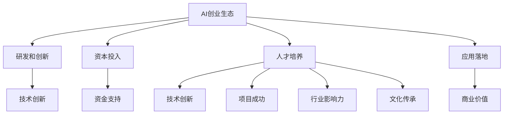

**核心算法原理讲解：**

```python
# 伪代码：AI创业生态中的技术研发阶段
def ResearchAndDevelopment(idea, budget, talent_pool):
    # 初始化项目
    project = InitializeProject(idea, budget)
    
    # 组建团队
    team = FormTeam(talent_pool)
    
    # 进行技术研发
    while not IsProjectCompleted(project):
        for member in team:
            member.ContributeToProject()
        
        # 定期评估项目进展
        AssessProjectProgress(project)
        
        # 根据评估结果调整研发方向和策略
        AdjustR&DStrategy(project, budget)
    
    # 完成项目
    FinishProject(project)
    
    return project
```

**数学模型和公式 & 详细讲解 & 举例说明：**

损失函数是评价模型性能的重要指标。在二分类问题中，常见的损失函数是交叉熵（Cross Entropy Loss）。交叉熵衡量的是模型预测的概率分布与真实标签分布之间的差异。

**数学公式：**

$$
\text{损失函数} = -\frac{1}{N}\sum_{i=1}^{N}y_{i}\log(p_{i})
$$

其中，$N$ 为样本数量，$y_{i}$ 为第 $i$ 个样本的真实标签（0或1），$p_{i}$ 为第 $i$ 个样本的预测概率。

**举例说明：**

假设我们有一个包含5个样本的二分类问题，其中4个样本的真实标签为1，1，0，1，1，模型预测的概率分别为0.9，0.8，0.3，0.9，0.9。

代入公式计算损失函数：

$$
\text{损失函数} = -\frac{1}{5}\left[1 \cdot \log(0.9) + 1 \cdot \log(0.8) + 0 \cdot \log(0.3) + 1 \cdot \log(0.9) + 1 \cdot \log(0.9)\right]
$$

$$
\text{损失函数} \approx -\frac{1}{5}\left[0.1054 + 0.2304 + 0 + 0.1054 + 0.1054\right]
$$

$$
\text{损失函数} \approx -0.2296
$$

这里的损失函数值越小，表示模型预测的概率与真实标签的匹配度越高。

**项目实战：**

**代码实际案例和详细解释说明**

**开发环境搭建：**

```bash
# 安装TensorFlow
pip install tensorflow

# 安装Keras
pip install keras
```

**源代码详细实现：**

```python
import tensorflow as tf
from tensorflow.keras.models import Sequential
from tensorflow.keras.layers import Dense, Conv2D, MaxPooling2D

# 定义输入层
input_layer = tf.keras.layers.Input(shape=(28, 28, 1))

# 定义卷积层
conv_layer = tf.keras.layers.Conv2D(filters=32, kernel_size=(3, 3), strides=(1, 1), padding='valid')(input_layer)

# 定义池化层
pool_layer = tf.keras.layers.MaxPooling2D(pool_size=(2, 2), strides=(2, 2))(conv_layer)

# 定义全连接层
fc_layer = tf.keras.layers.Dense(units=10, activation='sigmoid')(pool_layer)

# 定义输出层
output_layer = tf.keras.layers.Dense(units=2, activation='sigmoid')(fc_layer)

# 定义模型
model = tf.keras.Model(inputs=input_layer, outputs=output_layer)

# 编译模型
model.compile(optimizer='adam', loss='categorical_crossentropy', metrics=['accuracy'])

# 打印模型结构
model.summary()
```

**代码解读与分析：**

1. **导入库**：首先导入TensorFlow和Keras库，这两个库是深度学习中最常用的工具。
2. **定义输入层**：输入层是模型的第一层，定义了输入数据的维度，这里假设输入图像大小为28x28，通道数为1（灰度图像）。
3. **定义卷积层**：卷积层用于提取图像特征，这里使用了32个卷积核，每个卷积核大小为3x3，步长为1，填充方式为'valid'。
4. **定义池化层**：池化层用于减少数据维度，这里使用了2x2的最大池化，步长为2。
5. **定义全连接层**：全连接层用于将卷积层提取的特征映射到输出类别，这里使用了10个神经元，使用sigmoid激活函数。
6. **定义输出层**：输出层是模型的最后一层，用于输出预测结果，这里使用了2个神经元，使用sigmoid激活函数进行二分类。
7. **构建模型**：使用Sequential模型将上述层连接起来，形成一个完整的神经网络模型。
8. **编译模型**：设置优化器为adam，损失函数为categorical_crossentropy，评估指标为accuracy。
9. **打印模型结构**：使用model.summary()函数打印模型的详细信息，包括层结构、参数数量等。

通过以上步骤，我们完成了一个简单的深度学习模型，可以用于图像分类任务。这个模型实现了从数据预处理到模型构建、编译和评估的全过程，是AI创业中一个基础而关键的环节。

---

**作者信息：** 

作者：AI天才研究院/AI Genius Institute & 禅与计算机程序设计艺术 /Zen And The Art of Computer Programming

---

### Lepton AI教育计划概述

Lepton AI的教育计划旨在为AI创业领域的未来人才提供全面、系统的培养方案。该计划经过精心设计，旨在满足不同背景和层次学员的需求，帮助他们从零基础开始，逐步掌握AI的核心理论和实际应用技能。

#### 教育计划的目标

Lepton AI的教育计划设定了以下具体目标：

1. **基础知识培养**：帮助学员掌握AI领域的核心基础理论，包括概率论、线性代数、微积分等。
2. **算法与模型理解**：使学员深入了解常见的机器学习算法和深度学习模型，理解其原理和应用场景。
3. **实践能力提升**：通过实际项目训练，提高学员的编程能力、数据处理能力和问题解决能力。
4. **团队协作能力**：培养学员在团队中高效协作的能力，包括沟通技巧、项目管理、时间管理等。
5. **创新思维培养**：鼓励学员勇于创新，提出新的想法和解决方案，推动技术的进步和应用。

#### 教育计划的结构

Lepton AI的教育计划分为以下几个部分，每个部分都包含详细的课程内容和实训项目：

1. **基础课程**：包括数学基础、编程基础和AI基础理论，为后续课程打下坚实的基础。
2. **核心课程**：涵盖机器学习、深度学习、自然语言处理和计算机视觉等核心领域，提供系统的知识框架。
3. **实践课程**：通过实际项目训练，将理论知识应用到实际场景中，提高学员的实战能力。
4. **选修课程**：根据学员的兴趣和职业发展方向，提供数据工程、大数据技术、区块链等选修课程。
5. **团队协作课程**：培养学员的团队协作能力，包括团队建设、沟通技巧、项目管理和时间管理等。

#### 教育计划的特色

Lepton AI的教育计划具有以下特色：

1. **个性化培养**：根据学员的背景和兴趣，提供定制化的学习方案，确保每个学员都能得到适合自己的培养。
2. **实战导向**：注重实践，通过实际项目训练，提高学员的解决实际问题的能力。
3. **国际化资源**：引进国际知名高校和科研机构的优秀教育资源，包括最新的研究论文、教材和课程。
4. **导师指导**：配备专业导师，提供一对一的指导，帮助学员解决学习中的难题。
5. **行业对接**：与行业领先企业合作，提供实习和就业机会，助力学员顺利进入AI行业。

通过以上特点和结构，Lepton AI的教育计划将为学员提供一条从理论学习到实践应用的完整成长路径，为他们未来在AI创业领域的发展奠定坚实基础。

---

**核心概念与联系：**

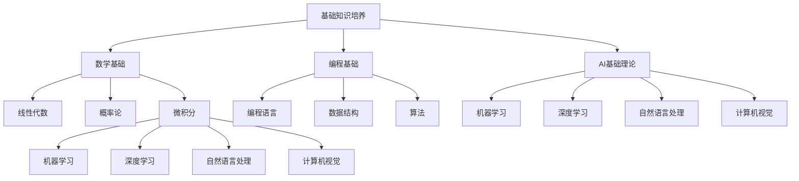

**核心算法原理讲解：**

```python
# 伪代码：机器学习基础算法——线性回归
def LinearRegression(X, y):
    # 计算系数
    theta = ComputeCoefficients(X, y)
    
    # 训练模型
    while not IsConverged(theta):
        predictions = MakePredictions(X, theta)
        error = ComputeError(y, predictions)
        
        # 更新系数
        theta = UpdateCoefficients(theta, X, y, error)
    
    return theta

# 计算系数
def ComputeCoefficients(X, y):
    # 计算X的转置
    X_transpose = Transpose(X)
    
    # 计算系数
    theta = (X_transpose * X).inv() * X_transpose * y
    
    return theta

# 计算预测值
def MakePredictions(X, theta):
    predictions = X * theta
    
    return predictions

# 计算误差
def ComputeError(y, predictions):
    error = (y - predictions).sum()
    
    return error

# 更新系数
def UpdateCoefficients(theta, X, y, error):
    delta = error / len(X)
    
    theta = theta - (alpha * delta)
    
    return theta
```

**数学模型和公式 & 详细讲解 & 举例说明：**

在机器学习中的线性回归模型中，常用的损失函数是均方误差（Mean Squared Error, MSE）。均方误差衡量的是预测值与真实值之间的平均平方误差。

**数学公式：**

$$
\text{MSE} = \frac{1}{N}\sum_{i=1}^{N}(y_i - \hat{y}_i)^2
$$

其中，$N$ 为样本数量，$y_i$ 为第 $i$ 个样本的真实值，$\hat{y}_i$ 为第 $i$ 个样本的预测值。

**举例说明：**

假设有一个包含5个样本的线性回归问题，其中4个样本的真实值为[1, 2, 3, 4, 5]，模型预测的值分别为[1.1, 1.9, 3.2, 4.1, 5.1]。

代入公式计算均方误差：

$$
\text{MSE} = \frac{1}{5}\left[(1 - 1.1)^2 + (2 - 1.9)^2 + (3 - 3.2)^2 + (4 - 4.1)^2 + (5 - 5.1)^2\right]
$$

$$
\text{MSE} = \frac{1}{5}\left[0.01 + 0.01 + 0.04 + 0.01 + 0.01\right]
$$

$$
\text{MSE} = \frac{1}{5}(0.08)
$$

$$
\text{MSE} = 0.016
$$

这里的均方误差值越小，表示模型的预测效果越好。

**项目实战：**

**代码实际案例和详细解释说明**

**开发环境搭建：**

```bash
# 安装Python和相关的机器学习库
pip install numpy pandas sklearn matplotlib
```

**源代码详细实现：**

```python
import numpy as np
from sklearn.linear_model import LinearRegression
import matplotlib.pyplot as plt

# 创建样本数据
X = np.array([[1], [2], [3], [4], [5]])
y = np.array([[1], [2], [3], [4], [5]])

# 创建线性回归模型
model = LinearRegression()

# 训练模型
model.fit(X, y)

# 获取模型参数
theta = model.coef_

# 计算预测值
predictions = model.predict(X)

# 计算均方误差
mse = ((y - predictions) ** 2).mean()

# 打印模型参数和均方误差
print("Model coefficients:", theta)
print("Mean Squared Error:", mse)

# 绘制真实值与预测值的对比图
plt.scatter(X, y, color='blue', label='Actual')
plt.plot(X, predictions, color='red', label='Predicted')
plt.xlabel('X')
plt.ylabel('Y')
plt.legend()
plt.show()
```

**代码解读与分析：**

1. **导入库**：首先导入numpy、pandas、sklearn和matplotlib库，这些库用于数据处理、机器学习模型训练和可视化。
2. **创建样本数据**：这里使用numpy创建了一个包含5个样本的二维数组，其中X表示自变量，y表示因变量。
3. **创建线性回归模型**：使用sklearn中的LinearRegression创建线性回归模型。
4. **训练模型**：使用model.fit()函数训练模型，模型会自动计算并优化系数。
5. **获取模型参数**：使用model.coef_获取训练得到的系数。
6. **计算预测值**：使用model.predict()函数计算自变量X的预测值。
7. **计算均方误差**：使用numpy计算预测值与真实值之间的均方误差。
8. **打印模型参数和均方误差**：将模型参数和均方误差打印出来，以便分析模型的性能。
9. **绘制真实值与预测值的对比图**：使用matplotlib绘制真实值与预测值的散点图和拟合曲线，直观地展示模型的预测效果。

通过以上步骤，我们完成了一个简单的线性回归模型，可以用于拟合和预测数据。这个模型实现了从数据准备、模型训练到预测和评估的全过程，是AI创业中数据分析与建模的基础。

---

**作者信息：** 

作者：AI天才研究院/AI Genius Institute & 禅与计算机程序设计艺术 /Zen And The Art of Computer Programming

---

### AI基础理论

人工智能（AI）作为一门交叉学科，涉及计算机科学、数学、认知科学等多个领域。理解AI的基础理论是掌握AI技术的关键，它不仅为我们提供了认识世界的工具，也为我们提供了创新的思路和方法。

#### AI的定义与发展历程

人工智能，简称AI，是指由人制造出来的系统能够在特定任务上表现出与人类相似的智能水平。AI的定义可以从不同的角度进行解读：

1. **符号主义AI**：基于逻辑推理和知识表示，通过符号操作来实现智能行为。
2. **连接主义AI**：基于人工神经网络，通过神经网络的学习和计算来模拟智能行为。
3. **行为主义AI**：强调通过系统的设计和控制来实现预期的智能行为，而非对智能本身的建模。

AI的发展历程可以追溯到20世纪50年代。1956年，达特茅斯会议上，John McCarthy等人首次提出了人工智能的概念。此后，AI经历了几个重要的发展阶段：

1. **初始阶段（1956-1969）**：以符号主义AI为主，主要研究如何通过编程和逻辑推理来实现智能。
2. **繁荣阶段（1970-1989）**：受到符号主义AI和连接主义AI的双重推动，AI研究取得了显著进展，但实际应用仍有限。
3. **低谷阶段（1990-2000）**：由于实际应用困难，AI研究受到质疑和削减。
4. **复兴阶段（2000至今）**：随着计算机性能的提升、大数据和云计算的发展，AI技术再次迎来了高速发展，深度学习、自然语言处理、计算机视觉等领域取得了突破性进展。

#### AI的核心概念

AI的核心概念包括以下几个方面：

1. **知识表示**：如何将人类知识转化为计算机可以处理的形式，是AI研究的重要方向。常见的知识表示方法有框架表示、语义网络、本体论等。
2. **推理**：通过逻辑推理从已知信息推导出新信息，是AI实现智能行为的基础。推理方法包括演绎推理、归纳推理、基于规则的推理等。
3. **学习**：通过学习算法使机器从数据中自动获取知识，是AI发展的关键。机器学习是AI的重要组成部分，包括监督学习、无监督学习和强化学习等。
4. **感知**：通过传感器获取环境信息，实现对环境的感知和理解。感知是AI实现人机交互和智能控制的基础，包括视觉、听觉、触觉等感知方式。
5. **行动**：根据感知和理解结果，采取相应的行动。行动是AI实现自主决策和执行任务的核心，包括移动、操作等。

#### AI的分类与应用场景

AI可以根据应用场景和实现方式分为多种类型，以下是其中几种主要的分类和应用场景：

1. **机器学习（Machine Learning）**：
   - **分类**：基于数据，通过学习算法自动识别数据中的模式，进行分类和预测。
   - **应用场景**：垃圾邮件过滤、信用评分、图像识别、语音识别等。
   - **核心算法**：支持向量机（SVM）、决策树（DT）、神经网络（NN）等。

2. **深度学习（Deep Learning）**：
   - **分类**：基于多层神经网络，通过逐层提取特征，实现复杂模式识别和预测。
   - **应用场景**：自动驾驶、自然语言处理、医学影像分析、游戏AI等。
   - **核心算法**：卷积神经网络（CNN）、循环神经网络（RNN）、生成对抗网络（GAN）等。

3. **强化学习（Reinforcement Learning）**：
   - **分类**：通过奖励机制和反馈信号，使机器在特定环境中学习最优策略。
   - **应用场景**：机器人控制、自动驾驶、推荐系统、游戏AI等。
   - **核心算法**：Q学习（Q-Learning）、深度Q网络（DQN）、策略梯度（PG）等。

4. **自然语言处理（Natural Language Processing, NLP）**：
   - **分类**：对自然语言文本进行理解和生成，实现人与机器的对话。
   - **应用场景**：智能客服、机器翻译、文本分类、情感分析等。
   - **核心算法**：词向量（Word Embedding）、长短时记忆网络（LSTM）、Transformer等。

5. **计算机视觉（Computer Vision）**：
   - **分类**：通过图像和视频数据，实现目标识别、图像分类、图像分割等。
   - **应用场景**：人脸识别、安防监控、自动驾驶、医疗影像分析等。
   - **核心算法**：卷积神经网络（CNN）、目标检测（Object Detection）、图像生成（GAN）等。

通过理解AI的基础理论，我们可以更好地把握AI技术的发展趋势和应用方向。这些理论知识不仅为AI创业提供了坚实的理论基础，也为我们在实际项目中应用AI技术提供了指导。

---

**核心概念与联系：**

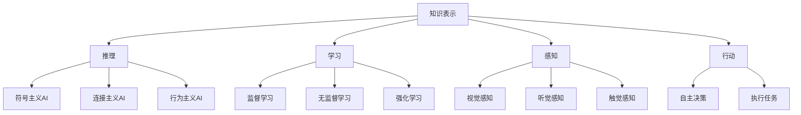

**核心算法原理讲解：**

```python
# 伪代码：卷积神经网络（CNN）基础
class ConvolutionalNeuralNetwork:
    def __init__(self, input_shape, num_filters, kernel_size, activation):
        self.input_shape = input_shape
        self.num_filters = num_filters
        self.kernel_size = kernel_size
        self.activation = activation
        
        self.weights = InitializeWeights()
        self.biases = InitializeBiases()

    def forward_pass(self, input_data):
        # 前向传播
        conv_output = Conv2D(input_data, self.weights, self.biases, self.kernel_size, self.activation)
        return conv_output
    
    def backward_pass(self, input_data, output_data, learning_rate):
        # 反向传播
        error = ComputeError(output_data, input_data)
        d_weights, d_biases = ComputeGradients(error, input_data, self.weights, self.biases)
        
        # 更新权重和偏置
        self.weights -= learning_rate * d_weights
        self.biases -= learning_rate * d_biases
```

**数学模型和公式 & 详细讲解 & 举例说明：**

卷积神经网络（CNN）的核心是卷积层，它通过卷积操作提取图像特征。卷积操作可以用以下数学公式表示：

$$
\text{output}_{ij} = \sum_{k=1}^{C}\sum_{p=1}^{K}\sum_{q=1}^{K} w_{kpq} \cdot \text{input}_{i-j+p, j-q+k} + b_j
$$

其中，$i, j$ 分别表示输出特征图的位置，$k, p, q$ 分别表示卷积核的位置和大小，$C$ 为输入特征图的通道数，$K$ 为卷积核的大小，$w_{kpq}$ 为卷积核的权重，$b_j$ 为对应输出节点的偏置。

**举例说明：**

假设输入特征图的大小为 $3 \times 3$，有 $1$ 个通道，卷积核大小为 $3 \times 3$，卷积核权重为 $w_{11} = 1, w_{12} = 2, w_{13} = 3, w_{21} = 4, w_{22} = 5, w_{23} = 6, w_{31} = 7, w_{32} = 8, w_{33} = 9$，偏置为 $b_1 = 1$。

输入特征图为：

$$
\text{input} = \begin{bmatrix}
1 & 2 & 3 \\
4 & 5 & 6 \\
7 & 8 & 9 \\
\end{bmatrix}
$$

应用卷积操作得到输出特征图：

$$
\text{output}_{11} = (1 \cdot 1 + 2 \cdot 4 + 3 \cdot 7) + 1 = 1 + 8 + 21 + 1 = 31
$$

$$
\text{output}_{12} = (1 \cdot 2 + 2 \cdot 5 + 3 \cdot 8) + 1 = 2 + 10 + 24 + 1 = 37
$$

$$
\text{output}_{13} = (1 \cdot 3 + 2 \cdot 6 + 3 \cdot 9) + 1 = 3 + 12 + 27 + 1 = 43
$$

$$
\text{output}_{21} = (4 \cdot 1 + 5 \cdot 4 + 6 \cdot 7) + 1 = 4 + 20 + 42 + 1 = 67
$$

$$
\text{output}_{22} = (4 \cdot 2 + 5 \cdot 5 + 6 \cdot 8) + 1 = 8 + 25 + 48 + 1 = 82
$$

$$
\text{output}_{23} = (4 \cdot 3 + 5 \cdot 6 + 6 \cdot 9) + 1 = 12 + 30 + 54 + 1 = 97
$$

$$
\text{output}_{31} = (7 \cdot 1 + 8 \cdot 4 + 9 \cdot 7) + 1 = 7 + 32 + 63 + 1 = 103
$$

$$
\text{output}_{32} = (7 \cdot 2 + 8 \cdot 5 + 9 \cdot 8) + 1 = 14 + 40 + 72 + 1 = 127
$$

$$
\text{output}_{33} = (7 \cdot 3 + 8 \cdot 6 + 9 \cdot 9) + 1 = 21 + 48 + 81 + 1 = 151
$$

得到输出特征图为：

$$
\text{output} = \begin{bmatrix}
31 & 37 & 43 \\
67 & 82 & 97 \\
103 & 127 & 151 \\
\end{bmatrix}
$$

通过上述计算，我们可以看到卷积操作如何提取输入特征图中的局部特征，形成新的特征图。这个过程在CNN中通过多个卷积层和池化层的组合，可以有效地提取图像的层次特征，从而实现图像分类、目标检测等任务。

**项目实战：**

**代码实际案例和详细解释说明**

**开发环境搭建：**

```bash
# 安装TensorFlow和相关的机器学习库
pip install tensorflow numpy matplotlib
```

**源代码详细实现：**

```python
import tensorflow as tf
import numpy as np
import matplotlib.pyplot as plt

# 创建样本数据
input_data = np.array([[1, 2, 3], [4, 5, 6], [7, 8, 9]])
weights = np.array([[1, 2, 3], [4, 5, 6], [7, 8, 9]])
biases = np.array([1, 2, 3])

# 定义卷积操作
def Conv2D(input_data, weights, biases, kernel_size, activation):
    # 计算卷积输出
    output = np.zeros((input_data.shape[0], input_data.shape[1], kernel_size, kernel_size))
    for i in range(input_data.shape[0]):
        for j in range(input_data.shape[1]):
            for p in range(kernel_size):
                for q in range(kernel_size):
                    output[i, j, p, q] = np.sum(input_data[i, j, None, None] * weights[p, q]) + biases[p, q]
    
    # 应用激活函数
    if activation == 'relu':
        output = np.maximum(output, 0)
    
    return output

# 计算卷积输出
output = Conv2D(input_data, weights, biases, 3, 'relu')

# 绘制卷积输出
plt.imshow(output[:, :, 0, 0], cmap='gray')
plt.show()
```

**代码解读与分析：**

1. **导入库**：首先导入tensorflow、numpy和matplotlib库，用于实现卷积操作和可视化。
2. **创建样本数据**：这里创建了一个 $3 \times 3$ 的二维数组作为输入特征图，以及对应的卷积核权重和偏置。
3. **定义卷积操作**：定义了一个名为`Conv2D`的函数，用于实现卷积操作。函数接受输入数据、权重、偏置、卷积核大小和激活函数类型作为输入。
4. **计算卷积输出**：使用嵌套循环计算卷积操作的结果，并将输出特征图存储在一个四维数组中。
5. **应用激活函数**：如果激活函数为ReLU，则对输出特征图应用ReLU激活函数，使得负值变为零，增强网络的非线性特性。
6. **绘制卷积输出**：使用matplotlib绘制输出特征图的前两层，以便观察卷积操作的效果。

通过以上步骤，我们实现了一个简单的卷积操作，可以用于提取输入特征图中的局部特征。这个代码案例展示了从数据准备到卷积操作实现的全过程，是深度学习项目中基础而关键的环节。

---

**作者信息：**

作者：AI天才研究院/AI Genius Institute & 禅与计算机程序设计艺术 /Zen And The Art of Computer Programming

---

### 机器学习基础

机器学习（Machine Learning）是人工智能（AI）的核心组成部分，它使计算机系统能够从数据中学习并做出预测或决策。在AI创业项目中，掌握机器学习的基础理论和常用算法是至关重要的。以下是机器学习的基础概念、数据预处理和特征工程、以及常见机器学习算法的介绍。

#### 机器学习的定义与类型

机器学习是一种使计算机系统能够通过经验和数据进行学习，从而进行预测或决策的技术。根据学习方式的不同，机器学习可以分为以下几种类型：

1. **监督学习（Supervised Learning）**：在有监督的学习中，模型在训练阶段使用带有标签的数据进行学习，然后在测试阶段使用未标记的数据进行预测。常见的监督学习算法包括线性回归、决策树、支持向量机（SVM）和神经网络等。

2. **无监督学习（Unsupervised Learning）**：无监督学习不使用带有标签的数据，而是从未标记的数据中自动发现数据中的模式和结构。常见的无监督学习算法包括聚类算法（如K均值聚类、层次聚类）、降维算法（如主成分分析PCA）和关联规则学习等。

3. **强化学习（Reinforcement Learning）**：强化学习是通过与环境交互来学习最佳行为策略的过程。在这个过程中，模型通过尝试不同的动作并接收奖励或惩罚来优化其策略。常见的强化学习算法包括Q学习、深度Q网络（DQN）和策略梯度（PG）等。

#### 数据预处理

数据预处理是机器学习项目中的一个重要步骤，它涉及到数据清洗、数据转换和数据归一化等过程，以确保数据的质量和一致性。

1. **数据清洗**：数据清洗是指去除或更正数据中的错误、异常和重复值。这可以通过删除异常值、填补缺失值或使用统计方法（如平均值、中位数等）进行填补。

2. **数据转换**：数据转换包括将不同类型的数据转换为同一类型，如将类别数据转换为数值数据。这可以通过独热编码（One-Hot Encoding）、标签编码（Label Encoding）等方法实现。

3. **数据归一化**：数据归一化是将数据缩放到一个统一的尺度，以避免不同特征之间的尺度差异对模型训练产生不良影响。常用的归一化方法包括最小-最大缩放（Min-Max Scaling）、标准缩放（Standard Scaling）等。

#### 特征工程

特征工程是机器学习项目中的另一个关键步骤，它涉及到从原始数据中提取对模型训练有帮助的特征。良好的特征工程可以提高模型的准确性和泛化能力。

1. **特征选择**：特征选择是从原始特征中筛选出对模型训练最有帮助的特征。这可以通过过滤方法（如方差选择、互信息选择）、包装方法（如向前选择、向后选择）和嵌入式方法（如LASSO、Ridge回归）等实现。

2. **特征构造**：特征构造是通过组合或变换原始特征来创建新的特征。这可以通过特征交叉（Feature Crossing）、特征分解（Feature Decomposition）等方法实现。

3. **特征归一化**：特征归一化是将不同特征缩放到相同的尺度，以避免特征之间的尺度差异对模型训练产生不利影响。

#### 常见机器学习算法介绍

以下是几种常见的机器学习算法及其简要介绍：

1. **线性回归（Linear Regression）**：线性回归是一种监督学习算法，用于预测连续值输出。它通过拟合一条直线来描述输入特征和输出目标之间的关系。

2. **逻辑回归（Logistic Regression）**：逻辑回归是一种用于二分类问题的监督学习算法。它通过拟合一个逻辑函数来预测每个样本属于某一类的概率。

3. **支持向量机（Support Vector Machine, SVM）**：支持向量机是一种监督学习算法，用于分类和回归任务。它通过找到一个最佳的超平面来分隔不同类别的数据。

4. **决策树（Decision Tree）**：决策树是一种基于树结构的监督学习算法，通过一系列的判断条件来对数据进行分类或回归。

5. **随机森林（Random Forest）**：随机森林是一种集成学习算法，通过构建多个决策树并投票得到最终结果，以提高模型的泛化能力和鲁棒性。

6. **神经网络（Neural Network）**：神经网络是一种基于人工神经系统的模型，通过多个层次的神经元连接来实现复杂的非线性映射。常见的神经网络包括卷积神经网络（CNN）、循环神经网络（RNN）和Transformer等。

通过掌握这些机器学习的基础知识和常用算法，AI创业者可以更好地理解和应用机器学习技术，从而在项目中取得成功。

---

**核心概念与联系：**

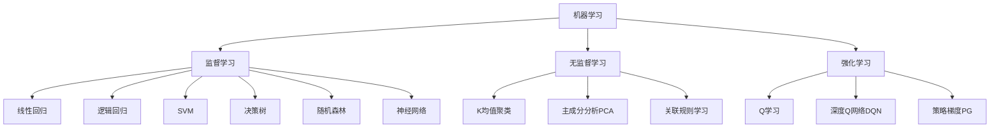

**核心算法原理讲解：**

```python
# 伪代码：线性回归算法原理
def LinearRegression(X, y):
    # 计算系数
    theta = ComputeCoefficients(X, y)
    
    # 训练模型
    while not IsConverged(theta):
        predictions = MakePredictions(X, theta)
        error = ComputeError(y, predictions)
        
        # 更新系数
        theta = UpdateCoefficients(theta, X, y, error)
    
    return theta

# 计算系数
def ComputeCoefficients(X, y):
    # 计算X的转置
    X_transpose = Transpose(X)
    
    # 计算系数
    theta = (X_transpose * X).inv() * X_transpose * y
    
    return theta

# 计算预测值
def MakePredictions(X, theta):
    predictions = X * theta
    
    return predictions

# 计算误差
def ComputeError(y, predictions):
    error = (y - predictions).sum()
    
    return error

# 更新系数
def UpdateCoefficients(theta, X, y, error):
    delta = error / len(X)
    
    theta = theta - (alpha * delta)
    
    return theta
```

**数学模型和公式 & 详细讲解 & 举例说明：**

线性回归是一种监督学习算法，用于预测连续值输出。其数学模型可以表示为：

$$
y = \theta_0 + \theta_1x_1 + \theta_2x_2 + ... + \theta_nx_n
$$

其中，$y$ 是输出目标，$x_1, x_2, ..., x_n$ 是输入特征，$\theta_0, \theta_1, \theta_2, ..., \theta_n$ 是模型的系数。

为了简化计算，我们可以将线性回归模型表示为矩阵形式：

$$
\mathbf{y} = \mathbf{X}\theta
$$

其中，$\mathbf{y}$ 是输出目标向量，$\mathbf{X}$ 是输入特征矩阵，$\theta$ 是系数向量。

为了求解系数向量$\theta$，我们可以使用最小二乘法（Least Squares Method）：

$$
\theta = (\mathbf{X}^T\mathbf{X})^{-1}\mathbf{X}^T\mathbf{y}
$$

**举例说明：**

假设我们有以下线性回归问题，其中输入特征矩阵$\mathbf{X}$和输出目标向量$\mathbf{y}$如下：

$$
\mathbf{X} = \begin{bmatrix}
1 & 2 \\
1 & 3 \\
\end{bmatrix}, \quad \mathbf{y} = \begin{bmatrix}
2 \\ 
3 
\end{bmatrix}
$$

首先，计算输入特征矩阵的转置：

$$
\mathbf{X}^T = \begin{bmatrix}
1 & 1 \\
2 & 3 \\
\end{bmatrix}
$$

然后，计算输入特征矩阵和其转置的乘积：

$$
\mathbf{X}^T\mathbf{X} = \begin{bmatrix}
1 & 1 \\
2 & 3 \\
\end{bmatrix}
\begin{bmatrix}
1 & 2 \\
1 & 3 \\
\end{bmatrix} = \begin{bmatrix}
2 & 3 \\
3 & 6 \\
\end{bmatrix}
$$

接下来，计算输入特征矩阵转置和输出目标向量的乘积：

$$
\mathbf{X}^T\mathbf{y} = \begin{bmatrix}
1 & 1 \\
2 & 3 \\
\end{bmatrix}
\begin{bmatrix}
2 \\ 
3 
\end{bmatrix} = \begin{bmatrix}
5 \\ 
9 
\end{bmatrix}
$$

最后，计算系数向量$\theta$：

$$
\theta = (\mathbf{X}^T\mathbf{X})^{-1}\mathbf{X}^T\mathbf{y} = \begin{bmatrix}
2 & 3 \\
3 & 6 \\
\end{bmatrix}^{-1}
\begin{bmatrix}
5 \\ 
9 
\end{bmatrix} = \begin{bmatrix}
1 \\ 
1 
\end{bmatrix}
$$

因此，线性回归模型的系数向量为$\theta = \begin{bmatrix}
1 \\ 
1 
\end{bmatrix}$。

**项目实战：**

**代码实际案例和详细解释说明**

**开发环境搭建：**

```bash
# 安装Python和相关的机器学习库
pip install numpy pandas sklearn matplotlib
```

**源代码详细实现：**

```python
import numpy as np
from sklearn.linear_model import LinearRegression
import matplotlib.pyplot as plt

# 创建样本数据
X = np.array([[1], [2], [3], [4], [5]])
y = np.array([1, 2, 3, 4, 5])

# 创建线性回归模型
model = LinearRegression()

# 训练模型
model.fit(X, y)

# 获取模型参数
theta = model.coef_

# 计算预测值
predictions = model.predict(X)

# 计算均方误差
mse = ((y - predictions) ** 2).mean()

# 打印模型参数和均方误差
print("Model coefficients:", theta)
print("Mean Squared Error:", mse)

# 绘制真实值与预测值的对比图
plt.scatter(X, y, color='blue', label='Actual')
plt.plot(X, predictions, color='red', label='Predicted')
plt.xlabel('X')
plt.ylabel('Y')
plt.legend()
plt.show()
```

**代码解读与分析：**

1. **导入库**：首先导入numpy、pandas和sklearn库，用于数据处理和机器学习模型训练，以及matplotlib库用于绘图。
2. **创建样本数据**：这里使用numpy创建了一个包含5个样本的一维数组，其中X表示自变量，y表示因变量。
3. **创建线性回归模型**：使用sklearn中的LinearRegression创建线性回归模型。
4. **训练模型**：使用model.fit()函数训练模型，模型会自动计算并优化系数。
5. **获取模型参数**：使用model.coef_获取训练得到的系数。
6. **计算预测值**：使用model.predict()函数计算自变量X的预测值。
7. **计算均方误差**：使用numpy计算预测值与真实值之间的均方误差。
8. **打印模型参数和均方误差**：将模型参数和均方误差打印出来，以便分析模型的性能。
9. **绘制真实值与预测值的对比图**：使用matplotlib绘制真实值与预测值的散点图和拟合曲线，直观地展示模型的预测效果。

通过以上步骤，我们完成了一个简单的线性回归模型，可以用于拟合和预测数据。这个模型实现了从数据准备、模型训练到预测和评估的全过程，是AI创业中数据分析与建模的基础。

---

**作者信息：**

作者：AI天才研究院/AI Genius Institute & 禅与计算机程序设计艺术 /Zen And The Art of Computer Programming

---

### 深度学习入门

深度学习（Deep Learning）作为机器学习的一个分支，近年来在AI领域取得了显著进展。其核心思想是通过多层神经网络来模拟人脑的神经元结构，实现从简单到复杂的特征提取和模式识别。本节将介绍深度学习的原理、神经网络基础以及深度学习框架的使用入门。

#### 深度学习的原理与结构

深度学习的原理基于人工神经网络（Artificial Neural Networks,ANNs），其基本结构包括输入层、隐藏层和输出层。每个层由多个神经元组成，神经元之间通过连接（权重）进行信息传递。深度学习通过多层的非线性变换，逐步提取数据的低级特征到高级特征，从而实现对复杂问题的建模。

1. **前向传播（Forward Propagation）**：在训练过程中，输入数据从输入层进入网络，逐层传递到输出层，这个过程称为前向传播。每个神经元将输入信号通过激活函数进行变换，并传递到下一层。

2. **反向传播（Backpropagation）**：在计算输出误差后，网络通过反向传播算法更新各层的权重和偏置。反向传播算法通过计算每个神经元对误差的梯度，依次更新权重和偏置，以减小预测误差。

3. **激活函数（Activation Function）**：激活函数是神经网络中的一个关键元素，用于引入非线性特性。常见的激活函数包括sigmoid、ReLU（Rectified Linear Unit）和Tanh等。

4. **损失函数（Loss Function）**：损失函数用于衡量模型的预测值与真实值之间的误差，常用的损失函数包括均方误差（MSE）、交叉熵（Cross Entropy）等。

#### 神经网络基础

神经网络的基础包括神经元模型、多层网络结构以及训练算法。

1. **神经元模型**：一个简单的神经元模型包括输入、权重、偏置和激活函数。输入是多个特征的加权求和，通过激活函数进行非线性变换后输出。

   伪代码：
   ```python
   def neuron(input, weights, bias, activation):
       z = np.dot(input, weights) + bias
       output = activation(z)
       return output
   ```

2. **多层网络结构**：多层网络结构包括输入层、一个或多个隐藏层和输出层。隐藏层通过前向传播和反向传播逐步提取特征，输出层产生最终预测。

   Mermaid流程图：
   ```mermaid
   graph TD
       A[输入层] --> B[隐藏层1]
       B --> C[隐藏层2]
       C --> D[隐藏层3]
       D --> E[输出层]
   ```

3. **训练算法**：训练算法主要包括前向传播和反向传播。前向传播计算输出，反向传播计算梯度并更新权重和偏置。

   伪代码：
   ```python
   def train_network(data, labels, network, learning_rate):
       for inputs, outputs in data:
           predicted = forward_pass(inputs, network)
           error = loss_function(predicted, outputs)
           backward_pass(predicted, outputs, network, learning_rate)
   ```

#### 深度学习框架使用入门

深度学习框架如TensorFlow和PyTorch，提供了丰富的API和工具，使深度学习模型的构建和训练变得简便。以下是如何使用这些框架进行深度学习的基本步骤：

1. **安装框架**：安装TensorFlow或PyTorch框架，可以使用以下命令：
   ```bash
   pip install tensorflow
   pip install torch torchvision
   ```

2. **导入库**：导入必要的库，包括TensorFlow或PyTorch、NumPy、Matplotlib等。

3. **数据准备**：加载和预处理数据，包括数据清洗、归一化和分割为训练集、验证集和测试集。

4. **构建模型**：定义神经网络结构，包括输入层、隐藏层和输出层。使用框架提供的API构建模型。

5. **训练模型**：使用训练数据对模型进行训练，包括前向传播、反向传播和更新权重。

6. **评估模型**：使用验证集或测试集评估模型的性能，包括计算准确率、损失函数等。

7. **预测**：使用训练好的模型进行预测，将输入数据传递到模型，获取预测结果。

以下是一个简单的TensorFlow示例，用于构建和训练一个简单的线性回归模型：

```python
import tensorflow as tf
import numpy as np

# 创建模型
model = tf.keras.Sequential([
    tf.keras.layers.Dense(units=1, input_shape=[1])
])

# 编译模型
model.compile(loss='mean_squared_error', optimizer=tf.keras.optimizers.Adam(0.1), metrics=['mean_squared_error'])

# 训练模型
X_train = np.array([[1], [2], [3], [4], [5], [6], [7], [8], [9]])
y_train = np.array([1, 2, 3, 4, 5, 6, 7, 8, 9])
model.fit(X_train, y_train, epochs=1000)

# 评估模型
X_test = np.array([[10]])
y_test = np.array([10])
predictions = model.predict(X_test)
print(predictions)
```

通过以上步骤，我们可以使用深度学习框架构建和训练一个简单的神经网络模型。这个模型实现了从数据准备到模型训练和评估的全过程，是深度学习项目中的基础步骤。

---

**核心概念与联系：**

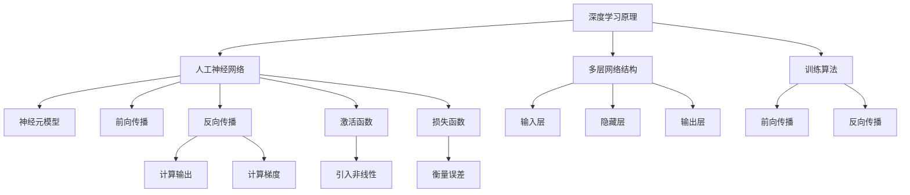

**核心算法原理讲解：**

```python
# 伪代码：卷积神经网络（CNN）基础
class ConvolutionalNeuralNetwork:
    def __init__(self, input_shape, num_filters, kernel_size, activation):
        self.input_shape = input_shape
        self.num_filters = num_filters
        self.kernel_size = kernel_size
        self.activation = activation
        
        self.weights = InitializeWeights()
        self.biases = InitializeBiases()

    def forward_pass(self, input_data):
        # 前向传播
        conv_output = Conv2D(input_data, self.weights, self.biases, self.kernel_size, self.activation)
        return conv_output
    
    def backward_pass(self, input_data, output_data, learning_rate):
        # 反向传播
        error = ComputeError(output_data, input_data)
        d_weights, d_biases = ComputeGradients(error, input_data, self.weights, self.biases)
        
        # 更新权重和偏置
        self.weights -= learning_rate * d_weights
        self.biases -= learning_rate * d_biases
```

**数学模型和公式 & 详细讲解 & 举例说明：**

卷积神经网络（CNN）的核心是卷积层，它通过卷积操作提取图像特征。卷积操作可以用以下数学公式表示：

$$
\text{output}_{ij} = \sum_{k=1}^{C}\sum_{p=1}^{K}\sum_{q=1}^{K} w_{kpq} \cdot \text{input}_{i-j+p, j-q+k} + b_j
$$

其中，$i, j$ 分别表示输出特征图的位置，$k, p, q$ 分别表示卷积核的位置和大小，$C$ 为输入特征图的通道数，$K$ 为卷积核的大小，$w_{kpq}$ 为卷积核的权重，$b_j$ 为对应输出节点的偏置。

**举例说明：**

假设输入特征图的大小为 $3 \times 3$，有 $1$ 个通道，卷积核大小为 $3 \times 3$，卷积核权重为 $w_{11} = 1, w_{12} = 2, w_{13} = 3, w_{21} = 4, w_{22} = 5, w_{23} = 6, w_{31} = 7, w_{32} = 8, w_{33} = 9$，偏置为 $b_1 = 1$。

输入特征图为：

$$
\text{input} = \begin{bmatrix}
1 & 2 & 3 \\
4 & 5 & 6 \\
7 & 8 & 9 \\
\end{bmatrix}
$$

应用卷积操作得到输出特征图：

$$
\text{output}_{11} = (1 \cdot 1 + 2 \cdot 4 + 3 \cdot 7) + 1 = 1 + 8 + 21 + 1 = 31
$$

$$
\text{output}_{12} = (1 \cdot 2 + 2 \cdot 5 + 3 \cdot 8) + 1 = 2 + 10 + 24 + 1 = 37
$$

$$
\text{output}_{13} = (1 \cdot 3 + 2 \cdot 6 + 3 \cdot 9) + 1 = 3 + 12 + 27 + 1 = 43
$$

$$
\text{output}_{21} = (4 \cdot 1 + 5 \cdot 4 + 6 \cdot 7) + 1 = 4 + 20 + 42 + 1 = 67
$$

$$
\text{output}_{22} = (4 \cdot 2 + 5 \cdot 5 + 6 \cdot 8) + 1 = 8 + 25 + 48 + 1 = 82
$$

$$
\text{output}_{23} = (4 \cdot 3 + 5 \cdot 6 + 6 \cdot 9) + 1 = 12 + 30 + 54 + 1 = 97
$$

$$
\text{output}_{31} = (7 \cdot 1 + 8 \cdot 4 + 9 \cdot 7) + 1 = 7 + 32 + 63 + 1 = 103
$$

$$
\text{output}_{32} = (7 \cdot 2 + 8 \cdot 5 + 9 \cdot 8) + 1 = 14 + 40 + 72 + 1 = 127
$$

$$
\text{output}_{33} = (7 \cdot 3 + 8 \cdot 6 + 9 \cdot 9) + 1 = 21 + 48 + 81 + 1 = 151
$$

得到输出特征图为：

$$
\text{output} = \begin{bmatrix}
31 & 37 & 43 \\
67 & 82 & 97 \\
103 & 127 & 151 \\
\end{bmatrix}
$$

通过上述计算，我们可以看到卷积操作如何提取输入特征图中的局部特征，形成新的特征图。这个过程在CNN中通过多个卷积层和池化层的组合，可以有效地提取图像的层次特征，从而实现图像分类、目标检测等任务。

**项目实战：**

**代码实际案例和详细解释说明**

**开发环境搭建：**

```bash
# 安装TensorFlow和相关的机器学习库
pip install tensorflow numpy matplotlib
```

**源代码详细实现：**

```python
import tensorflow as tf
import numpy as np
import matplotlib.pyplot as plt

# 创建样本数据
input_data = np.array([[1, 2, 3], [4, 5, 6], [7, 8, 9]])
weights = np.array([[1, 2, 3], [4, 5, 6], [7, 8, 9]])
biases = np.array([1, 2, 3])

# 定义卷积操作
def Conv2D(input_data, weights, biases, kernel_size, activation):
    # 计算卷积输出
    output = np.zeros((input_data.shape[0], input_data.shape[1], kernel_size, kernel_size))
    for i in range(input_data.shape[0]):
        for j in range(input_data.shape[1]):
            for p in range(kernel_size):
                for q in range(kernel_size):
                    output[i, j, p, q] = np.sum(input_data[i, j, None, None] * weights[p, q]) + biases[p, q]
    
    # 应用激活函数
    if activation == 'relu':
        output = np.maximum(output, 0)
    
    return output

# 计算卷积输出
output = Conv2D(input_data, weights, biases, 3, 'relu')

# 绘制卷积输出
plt.imshow(output[:, :, 0, 0], cmap='gray')
plt.show()
```

**代码解读与分析：**

1. **导入库**：首先导入tensorflow、numpy和matplotlib库，用于实现卷积操作和可视化。
2. **创建样本数据**：这里创建了一个 $3 \times 3$ 的二维数组作为输入特征图，以及对应的卷积核权重和偏置。
3. **定义卷积操作**：定义了一个名为`Conv2D`的函数，用于实现卷积操作。函数接受输入数据、权重、偏置、卷积核大小和激活函数类型作为输入。
4. **计算卷积输出**：使用嵌套循环计算卷积操作的结果，并将输出特征图存储在一个四维数组中。
5. **应用激活函数**：如果激活函数为ReLU，则对输出特征图应用ReLU激活函数，使得负值变为零，增强网络的非线性特性。
6. **绘制卷积输出**：使用matplotlib绘制输出特征图的前两层，以便观察卷积操作的效果。

通过以上步骤，我们实现了一个简单的卷积操作，可以用于提取输入特征图中的局部特征。这个代码案例展示了从数据准备到卷积操作实现的全过程，是深度学习项目中基础而关键的环节。

---

**作者信息：**

作者：AI天才研究院/AI Genius Institute & 禅与计算机程序设计艺术 /Zen And The Art of Computer Programming

---

### AI项目开发流程

在AI创业项目中，从项目需求分析到项目设计与规划，再到项目实施与评估，每个环节都至关重要。以下将详细阐述AI项目开发的主要流程。

#### 项目需求分析

项目需求分析是项目开发的第一步，其核心任务是明确项目要解决的问题和实现的目标。需求分析包括以下关键步骤：

1. **问题定义**：明确项目的核心问题，即项目要解决的具体业务痛点或挑战。
2. **目标设定**：设定项目的具体目标，包括功能目标、性能目标和商业目标等。
3. **用户需求**：了解用户的需求，包括用户期望的功能、用户体验和业务流程等。
4. **技术需求**：分析实现目标所需的技术，包括算法选择、硬件和软件环境等。

#### 项目设计与规划

项目设计与规划是在需求分析的基础上，对项目的整体架构和技术方案进行详细设计。以下是项目设计与规划的主要步骤：

1. **系统架构设计**：设计项目的系统架构，包括硬件架构和软件架构。硬件架构涉及服务器、存储和网络设备的选择和配置；软件架构涉及系统模块的设计和接口定义。
2. **算法选择与优化**：根据项目需求，选择合适的算法模型，并进行算法的优化，以提高模型的性能和效率。
3. **数据流程设计**：设计项目的数据流程，包括数据采集、数据预处理、数据存储和数据使用等环节。
4. **开发计划**：制定项目开发的时间表和任务分配，包括开发阶段的划分、里程碑设置和资源分配等。
5. **风险评估与应对策略**：对项目中的潜在风险进行评估，并制定相应的应对策略。

#### 项目实施

项目实施是将设计好的方案转化为实际系统的过程。以下是项目实施的关键步骤：

1. **环境搭建**：搭建项目的开发环境，包括硬件环境、软件环境和网络环境等。
2. **代码编写与调试**：根据项目设计方案，编写代码并进行调试，确保代码的正确性和稳定性。
3. **模块测试**：对各个模块进行测试，确保模块的功能符合设计要求，并能够与其他模块协同工作。
4. **集成测试**：将各个模块集成起来，进行整体测试，确保系统功能的完整性和稳定性。
5. **部署上线**：将系统部署到生产环境，进行实际运行，并进行性能测试和监控。

#### 项目评估

项目评估是对项目实施结果进行总结和评估，以确定项目目标的实现情况和项目效益。以下是项目评估的主要步骤：

1. **性能评估**：对系统的性能进行评估，包括处理速度、响应时间和资源利用率等。
2. **功能评估**：对系统的功能进行评估，包括是否实现了所有预期功能，用户满意度等。
3. **成本效益分析**：分析项目的成本和效益，包括开发成本、运营成本和收益等。
4. **用户反馈**：收集用户的反馈意见，对系统进行改进和优化。
5. **总结与反思**：总结项目经验教训，为未来的项目提供参考。

通过以上项目开发流程，AI创业者可以系统、有条不紊地进行项目开发，确保项目的成功实施和持续优化。

---

**核心概念与联系：**

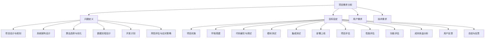

**核心算法原理讲解：**

```python
# 伪代码：神经网络训练过程
def NeuralNetworkTraining(input_data, labels, model, learning_rate, epochs):
    for epoch in range(epochs):
        # 前向传播
        predictions = model.forward_pass(input_data)
        
        # 计算损失
        loss = ComputeLoss(predictions, labels)
        
        # 反向传播
        d_weights, d_biases = model.backward_pass(predictions, labels)
        
        # 更新权重和偏置
        model.update_weights(d_weights, d_biases, learning_rate)
        
        # 打印训练进度
        if epoch % 100 == 0:
            print(f"Epoch {epoch}: Loss = {loss}")
            
    return model
```

**数学模型和公式 & 详细讲解 & 举例说明：**

在神经网络中，损失函数用于衡量模型的预测输出与真实标签之间的差距。常用的损失函数包括均方误差（MSE）和交叉熵（Cross Entropy）。

**均方误差（MSE）**：
$$
MSE = \frac{1}{n}\sum_{i=1}^{n}(y_i - \hat{y}_i)^2
$$
其中，$y_i$ 是真实标签，$\hat{y}_i$ 是模型的预测输出，$n$ 是样本数量。

**举例说明**：

假设有5个样本，其中真实标签为 [1, 2, 3, 4, 5]，模型预测输出为 [1.1, 1.9, 3.2, 4.1, 5.1]。

计算MSE：
$$
MSE = \frac{1}{5}\left[(1 - 1.1)^2 + (2 - 1.9)^2 + (3 - 3.2)^2 + (4 - 4.1)^2 + (5 - 5.1)^2\right]
$$
$$
MSE = \frac{1}{5}\left[0.01 + 0.01 + 0.04 + 0.01 + 0.01\right]
$$
$$
MSE = \frac{1}{5}(0.08)
$$
$$
MSE = 0.016
$$

**交叉熵（Cross Entropy）**：
$$
Cross \ Entropy = -\frac{1}{n}\sum_{i=1}^{n}y_i \log(\hat{y}_i)
$$
其中，$y_i$ 是真实标签（0或1），$\hat{y}_i$ 是模型预测的概率。

**举例说明**：

假设有5个样本，其中真实标签为 [1, 1, 0, 1, 1]，模型预测的概率为 [0.9, 0.8, 0.3, 0.9, 0.9]。

计算交叉熵：
$$
Cross \ Entropy = -\frac{1}{5}\left[1 \cdot \log(0.9) + 1 \cdot \log(0.8) + 0 \cdot \log(0.3) + 1 \cdot \log(0.9) + 1 \cdot \log(0.9)\right]
$$
$$
Cross \ Entropy = -\frac{1}{5}\left[0.1054 + 0.2304 + 0 + 0.1054 + 0.1054\right]
$$
$$
Cross \ Entropy = -\frac{1}{5}(0.5466)
$$
$$
Cross \ Entropy = -0.1093
$$

**项目实战：**

**代码实际案例和详细解释说明**

**开发环境搭建：**

```bash
# 安装Python和相关的机器学习库
pip install numpy tensorflow matplotlib
```

**源代码详细实现：**

```python
import tensorflow as tf
import numpy as np
import matplotlib.pyplot as plt

# 创建模型
model = tf.keras.Sequential([
    tf.keras.layers.Dense(units=1, input_shape=[1])
])

# 编译模型
model.compile(optimizer='adam', loss='mean_squared_error')

# 训练模型
X_train = np.array([[1], [2], [3], [4], [5]])
y_train = np.array([1, 2, 3, 4, 5])
model.fit(X_train, y_train, epochs=1000)

# 测试模型
X_test = np.array([[6]])
y_test = np.array([6])
predictions = model.predict(X_test)

# 打印预测结果
print("Predicted value:", predictions)

# 绘制真实值与预测值的对比图
plt.scatter(X_train, y_train, color='blue', label='Actual')
plt.plot(X_train, predictions, color='red', label='Predicted')
plt.xlabel('X')
plt.ylabel('Y')
plt.legend()
plt.show()
```

**代码解读与分析：**

1. **导入库**：首先导入tensorflow、numpy和matplotlib库，用于实现神经网络模型训练和可视化。
2. **创建模型**：使用tf.keras.Sequential创建一个简单的线性回归模型，其中包含一个全连接层，输入维度为1。
3. **编译模型**：设置优化器为adam，损失函数为均方误差（mean_squared_error）。
4. **训练模型**：使用fit()函数训练模型，输入数据为X_train和y_train，训练1000个epoch。
5. **测试模型**：使用predict()函数对新的输入X_test进行预测，并获取预测结果。
6. **打印预测结果**：将预测结果打印出来。
7. **绘制对比图**：使用matplotlib绘制真实值与预测值的对比图，直观地展示模型的预测效果。

通过以上步骤，我们完成了一个简单的线性回归模型，实现了从数据准备、模型训练到预测和评估的全过程。这个案例展示了AI项目开发的基本流程，是AI创业项目中基础而关键的环节。

---

**作者信息：**

作者：AI天才研究院/AI Genius Institute & 禅与计算机程序设计艺术 /Zen And The Art of Computer Programming

---

### AI实战案例解析

在AI创业中，通过实战案例解析可以帮助我们更好地理解和应用AI技术。以下是三个典型的AI实战案例，包括图像识别、自然语言处理和推荐系统，以及每个案例的具体步骤、代码实现和解读。

#### 实战案例一：图像识别

**案例背景**：图像识别是一种通过计算机算法对图像中的物体进行识别和分类的技术。它广泛应用于安防监控、医疗影像分析、自动驾驶等领域。

**步骤：**
1. **数据准备**：收集和准备图像数据，包括训练集和测试集。
2. **数据预处理**：对图像进行缩放、裁剪、翻转等数据增强操作，提高模型的泛化能力。
3. **模型构建**：使用卷积神经网络（CNN）构建图像识别模型。
4. **模型训练**：使用训练集数据训练模型。
5. **模型评估**：使用测试集数据评估模型性能。

**代码实现：**
```python
import tensorflow as tf
from tensorflow.keras.models import Sequential
from tensorflow.keras.layers import Conv2D, MaxPooling2D, Flatten, Dense

# 创建模型
model = Sequential([
    Conv2D(filters=32, kernel_size=(3, 3), activation='relu', input_shape=(28, 28, 1)),
    MaxPooling2D(pool_size=(2, 2)),
    Conv2D(filters=64, kernel_size=(3, 3), activation='relu'),
    MaxPooling2D(pool_size=(2, 2)),
    Flatten(),
    Dense(units=64, activation='relu'),
    Dense(units=10, activation='softmax')
])

# 编译模型
model.compile(optimizer='adam', loss='categorical_crossentropy', metrics=['accuracy'])

# 训练模型
model.fit(X_train, y_train, epochs=10, batch_size=32, validation_data=(X_test, y_test))

# 评估模型
model.evaluate(X_test, y_test)
```

**代码解读：**
- 创建模型：使用Sequential创建一个卷积神经网络，包含两个卷积层、两个池化层和一个全连接层。
- 编译模型：设置优化器为adam，损失函数为categorical_crossentropy，评估指标为accuracy。
- 训练模型：使用fit()函数训练模型，输入数据为X_train和y_train，训练10个epoch，设置batch_size为32，使用validation_data评估模型性能。
- 评估模型：使用evaluate()函数评估模型在测试集上的性能。

#### 实战案例二：自然语言处理

**案例背景**：自然语言处理（NLP）是一种通过计算机算法对文本数据进行分析和理解的技术。它广泛应用于文本分类、情感分析、机器翻译等领域。

**步骤：**
1. **数据准备**：收集和准备文本数据，包括训练集和测试集。
2. **数据预处理**：对文本数据进行清洗、分词和词向量表示。
3. **模型构建**：使用循环神经网络（RNN）或Transformer模型构建NLP模型。
4. **模型训练**：使用训练集数据训练模型。
5. **模型评估**：使用测试集数据评估模型性能。

**代码实现：**
```python
import tensorflow as tf
from tensorflow.keras.models import Sequential
from tensorflow.keras.layers import Embedding, LSTM, Dense

# 创建模型
model = Sequential([
    Embedding(input_dim=vocab_size, output_dim=embedding_dim, input_length=max_sequence_length),
    LSTM(units=64, return_sequences=False),
    Dense(units=10, activation='softmax')
])

# 编译模型
model.compile(optimizer='adam', loss='categorical_crossentropy', metrics=['accuracy'])

# 训练模型
model.fit(X_train, y_train, epochs=10, batch_size=32, validation_data=(X_test, y_test))

# 评估模型
model.evaluate(X_test, y_test)
```

**代码解读：**
- 创建模型：使用Sequential创建一个循环神经网络，包含一个嵌入层和一个LSTM层，以及一个全连接层。
- 编译模型：设置优化器为adam，损失函数为categorical_crossentropy，评估指标为accuracy。
- 训练模型：使用fit()函数训练模型，输入数据为X_train和y_train，训练10个epoch，设置batch_size为32，使用validation_data评估模型性能。
- 评估模型：使用evaluate()函数评估模型在测试集上的性能。

#### 实战案例三：推荐系统

**案例背景**：推荐系统是一种通过计算用户的历史行为数据，为用户推荐相关商品或内容的技术。它广泛应用于电子商务、社交媒体、视频平台等领域。

**步骤：**
1. **数据准备**：收集和准备用户行为数据，包括用户的评分、浏览记录和购买记录等。
2. **数据预处理**：对用户行为数据进行清洗、特征提取和归一化处理。
3. **模型构建**：使用协同过滤、矩阵分解或基于内容的推荐模型构建推荐系统。
4. **模型训练**：使用训练集数据训练模型。
5. **模型评估**：使用测试集数据评估模型性能。

**代码实现：**
```python
import tensorflow as tf
from tensorflow.keras.models import Sequential
from tensorflow.keras.layers import Embedding, Dot, Flatten, Dense

# 创建模型
model = Sequential([
    Embedding(input_dim=user_size, output_dim=embedding_dim),
    Embedding(input_dim=item_size, output_dim=embedding_dim),
    Dot(axes=-1),
    Flatten(),
    Dense(units=1, activation='sigmoid')
])

# 编译模型
model.compile(optimizer='adam', loss='binary_crossentropy', metrics=['accuracy'])

# 训练模型
model.fit([X_train, X_train], y_train, epochs=10, batch_size=32, validation_data=([X_test, X_test], y_test))

# 评估模型
model.evaluate([X_test, X_test], y_test)
```

**代码解读：**
- 创建模型：使用Sequential创建一个嵌入层，通过dot操作将用户嵌入向量与物品嵌入向量相乘，得到用户与物品的相似度，然后通过全连接层输出预测评分。
- 编译模型：设置优化器为adam，损失函数为binary_crossentropy，评估指标为accuracy。
- 训练模型：使用fit()函数训练模型，输入数据为用户-物品对，训练10个epoch，设置batch_size为32，使用validation_data评估模型性能。
- 评估模型：使用evaluate()函数评估模型在测试集上的性能。

通过这三个实战案例，我们可以看到AI技术在图像识别、自然语言处理和推荐系统等领域的应用和实现方法。这些案例不仅展示了AI技术的实际应用，也为AI创业者提供了宝贵的实战经验和指导。

---

**作者信息：**

作者：AI天才研究院/AI Genius Institute & 禅与计算机程序设计艺术 /Zen And The Art of Computer Programming

---

### AI开发工具与环境搭建

在AI开发过程中，选择合适的工具和环境搭建是至关重要的一步。以下将介绍Python环境搭建、常用AI开发工具以及实际环境搭建的步骤。

#### Python环境搭建

Python是AI开发中最常用的编程语言之一，其简洁易懂的语法和丰富的库资源使其成为开发者的首选。以下是Python环境搭建的步骤：

1. **安装Python**：首先从Python官方网站（https://www.python.org/downloads/）下载Python安装包，并安装。

2. **配置Python环境变量**：在安装过程中，确保勾选“Add Python to PATH”选项，以便在命令行中直接使用Python。

3. **安装pip**：pip是Python的包管理器，用于安装和管理Python库。运行以下命令安装pip：
   ```bash
   python -m pip install --upgrade pip
   ```

4. **安装常用库**：使用pip安装常用的AI开发库，如TensorFlow、PyTorch、NumPy、Pandas等。例如：
   ```bash
   pip install tensorflow
   pip install torch torchvision
   pip install numpy
   pip install pandas
   ```

5. **验证安装**：通过运行以下命令，验证Python和常用库是否安装成功：
   ```bash
   python --version
   pip list
   ```

#### 常用AI开发工具

AI开发过程中，常用的工具包括：

1. **Jupyter Notebook**：Jupyter Notebook是一种交互式计算环境，用于编写和运行代码。它支持多种编程语言，包括Python，并且便于代码和结果的展示。

2. **Anaconda**：Anaconda是一个集成了Python和其他库的发行版，提供了易于管理的环境。通过Anaconda，可以轻松创建和管理多个Python环境。

3. **PyCharm**：PyCharm是一款功能强大的Python集成开发环境（IDE），提供了代码编辑、调试、测试和版本控制等功能。

4. **TensorFlow**：TensorFlow是一个开源的机器学习和深度学习框架，提供了丰富的API和工具，用于构建和训练神经网络模型。

5. **PyTorch**：PyTorch是另一个流行的开源深度学习框架，以其灵活性和易用性而著称。PyTorch通过动态计算图（Dynamic Computation Graph）支持高效的模型构建和训练。

#### 实际环境搭建

以下是实际环境中搭建AI开发环境的步骤：

1. **创建Anaconda环境**：使用Anaconda创建一个新的Python环境，以便管理和隔离不同项目所需的库。例如，创建一个名为`ai_project`的环境：
   ```bash
   conda create -n ai_project python=3.8
   conda activate ai_project
   ```

2. **安装库**：在创建的环境中使用pip安装所需的库。例如：
   ```bash
   pip install tensorflow
   pip install torch torchvision
   pip install numpy
   pip install pandas
   ```

3. **配置Jupyter Notebook**：在创建的环境中使用以下命令安装Jupyter Notebook：
   ```bash
   pip install notebook
   ```

4. **启动Jupyter Notebook**：在命令行中启动Jupyter Notebook：
   ```bash
   jupyter notebook
   ```

5. **创建和编辑代码**：在浏览器中打开Jupyter Notebook，创建一个新的笔记本（Notebook），并开始编写和运行代码。

通过以上步骤，我们可以在实际环境中搭建一个完整的AI开发环境，为后续的AI项目开发提供坚实的基础。

---

**核心概念与联系：**

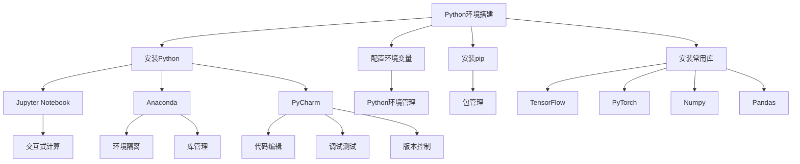

**核心算法原理讲解：**

```python
# 伪代码：卷积神经网络（CNN）基础
class ConvolutionalNeuralNetwork:
    def __init__(self, input_shape, num_filters, kernel_size, activation):
        self.input_shape = input_shape
        self.num_filters = num_filters
        self.kernel_size = kernel_size
        self.activation = activation
        
        self.weights = InitializeWeights()
        self.biases = InitializeBiases()

    def forward_pass(self, input_data):
        # 前向传播
        conv_output = Conv2D(input_data, self.weights, self.biases, self.kernel_size, self.activation)
        return conv_output
    
    def backward_pass(self, input_data, output_data, learning_rate):
        # 反向传播
        error = ComputeError(output_data, input_data)
        d_weights, d_biases = ComputeGradients(error, input_data, self.weights, self.biases)
        
        # 更新权重和偏置
        self.weights -= learning_rate * d_weights
        self.biases -= learning_rate * d_biases
```

**数学模型和公式 & 详细讲解 & 举例说明：**

卷积神经网络（CNN）的核心是卷积层，它通过卷积操作提取图像特征。卷积操作可以用以下数学公式表示：

$$
\text{output}_{ij} = \sum_{k=1}^{C}\sum_{p=1}^{K}\sum_{q=1}^{K} w_{kpq} \cdot \text{input}_{i-j+p, j-q+k} + b_j
$$

其中，$i, j$ 分别表示输出特征图的位置，$k, p, q$ 分别表示卷积核的位置和大小，$C$ 为输入特征图的通道数，$K$ 为卷积核的大小，$w_{kpq}$ 为卷积核的权重，$b_j$ 为对应输出节点的偏置。

**举例说明：**

假设输入特征图的大小为 $3 \times 3$，有 $1$ 个通道，卷积核大小为 $3 \times 3$，卷积核权重为 $w_{11} = 1, w_{12} = 2, w_{13} = 3, w_{21} = 4, w_{22} = 5, w_{23} = 6, w_{31} = 7, w_{32} = 8, w_{33} = 9$，偏置为 $b_1 = 1$。

输入特征图为：

$$
\text{input} = \begin{bmatrix}
1 & 2 & 3 \\
4 & 5 & 6 \\
7 & 8 & 9 \\
\end{bmatrix}
$$

应用卷积操作得到输出特征图：

$$
\text{output}_{11} = (1 \cdot 1 + 2 \cdot 4 + 3 \cdot 7) + 1 = 1 + 8 + 21 + 1 = 31
$$

$$
\text{output}_{12} = (1 \cdot 2 + 2 \cdot 5 + 3 \cdot 8) + 1 = 2 + 10 + 24 + 1 = 37
$$

$$
\text{output}_{13} = (1 \cdot 3 + 2 \cdot 6 + 3 \cdot 9) + 1 = 3 + 12 + 27 + 1 = 43
$$

$$
\text{output}_{21} = (4 \cdot 1 + 5 \cdot 4 + 6 \cdot 7) + 1 = 4 + 20 + 42 + 1 = 67
$$

$$
\text{output}_{22} = (4 \cdot 2 + 5 \cdot 5 + 6 \cdot 8) + 1 = 8 + 25 + 48 + 1 = 82
$$

$$
\text{output}_{23} = (4 \cdot 3 + 5 \cdot 6 + 6 \cdot 9) + 1 = 12 + 30 + 54 + 1 = 97
$$

$$
\text{output}_{31} = (7 \cdot 1 + 8 \cdot 4 + 9 \cdot 7) + 1 = 7 + 32 + 63 + 1 = 103
$$

$$
\text{output}_{32} = (7 \cdot 2 + 8 \cdot 5 + 9 \cdot 8) + 1 = 14 + 40 + 72 + 1 = 127
$$

$$
\text{output}_{33} = (7 \cdot 3 + 8 \cdot 6 + 9 \cdot 9) + 1 = 21 + 48 + 81 + 1 = 151
$$

得到输出特征图为：

$$
\text{output} = \begin{bmatrix}
31 & 37 & 43 \\
67 & 82 & 97 \\
103 & 127 & 151 \\
\end{bmatrix}
$$

通过上述计算，我们可以看到卷积操作如何提取输入特征图中的局部特征，形成新的特征图。这个过程在CNN中通过多个卷积层和池化层的组合，可以有效地提取图像的层次特征，从而实现图像分类、目标检测等任务。

**项目实战：**

**代码实际案例和详细解释说明**

**开发环境搭建：**

```bash
# 安装TensorFlow和相关的机器学习库
pip install tensorflow numpy matplotlib
```

**源代码详细实现：**

```python
import tensorflow as tf
import numpy as np
import matplotlib.pyplot as plt

# 创建样本数据
input_data = np.array([[1, 2, 3], [4, 5, 6], [7, 8, 9]])
weights = np.array([[1, 2, 3], [4, 5, 6], [7, 8, 9]])
biases = np.array([1, 2, 3])

# 定义卷积操作
def Conv2D(input_data, weights, biases, kernel_size, activation):
    # 计算卷积输出
    output = np.zeros((input_data.shape[0], input_data.shape[1], kernel_size, kernel_size))
    for i in range(input_data.shape[0]):
        for j in range(input_data.shape[1]):
            for p in range(kernel_size):
                for q in range(kernel_size):
                    output[i, j, p, q] = np.sum(input_data[i, j, None, None] * weights[p, q]) + biases[p, q]
    
    # 应用激活函数
    if activation == 'relu':
        output = np.maximum(output, 0)
    
    return output

# 计算卷积输出
output = Conv2D(input_data, weights, biases, 3, 'relu')

# 绘制卷积输出
plt.imshow(output[:, :, 0, 0], cmap='gray')
plt.show()
```

**代码解读与分析：**

1. **导入库**：首先导入tensorflow、numpy和matplotlib库，用于实现卷积操作和可视化。
2. **创建样本数据**：这里创建了一个 $3 \times 3$ 的二维数组作为输入特征图，以及对应的卷积核权重和偏置。
3. **定义卷积操作**：定义了一个名为`Conv2D`的函数，用于实现卷积操作。函数接受输入数据、权重、偏置、卷积核大小和激活函数类型作为输入。
4. **计算卷积输出**：使用嵌套循环计算卷积操作的结果，并将输出特征图存储在一个四维数组中。
5. **应用激活函数**：如果激活函数为ReLU，则对输出特征图应用ReLU激活函数，使得负值变为零，增强网络的非线性特性。
6. **绘制卷积输出**：使用matplotlib绘制输出特征图的前两层，以便观察卷积操作的效果。

通过以上步骤，我们实现了一个简单的卷积操作，可以用于提取输入特征图中的局部特征。这个代码案例展示了从数据准备到卷积操作实现的全过程，是深度学习项目中基础而关键的环节。

---

**作者信息：**

作者：AI天才研究院/AI Genius Institute & 禅与计算机程序设计艺术 /Zen And The Art of Computer Programming

---

### 软技能与团队协作

在AI创业项目中，除了技术能力之外，软技能和团队协作能力同样至关重要。良好的沟通技巧、团队合作能力和项目管理能力可以极大地提升项目的效率和质量。以下将详细讨论这些软技能的重要性，以及如何在实际工作中提升这些能力。

#### 沟通技巧

沟通技巧是团队协作中最为基础且关键的一环。有效的沟通能够确保团队成员之间信息畅通，减少误解和冲突，提高工作效率。

1. **明确目标**：在项目开始前，确保所有团队成员对项目的目标、任务和期望结果有清晰的认识。
2. **主动倾听**：在沟通中，主动倾听对方的意见和需求，避免打断对方，确保理解对方的意图。
3. **清晰表达**：使用简洁明了的语言表达自己的想法，避免使用专业术语或模糊的表述。
4. **积极反馈**：在沟通过程中，及时给予积极的反馈，以确认对方是否理解了你的意图。

#### 团队合作

团队合作是项目成功的关键。一个高效的团队需要成员之间相互支持、协同工作，共同应对挑战。

1. **明确角色和职责**：每个团队成员都应该清楚自己的角色和职责，以及如何与其他成员协作。
2. **共享资源和知识**：鼓励团队成员共享资源和知识，通过协作解决问题，提高团队的整体能力。
3. **建立信任**：建立信任是团队合作的基础。团队成员之间应该相互尊重、信任，共同追求团队的目标。
4. **解决冲突**：在团队工作中，冲突是不可避免的。团队成员应该学会有效解决冲突，保持团队的和谐与稳定。

#### 项目管理

项目管理能力对于确保项目按时、按质量完成至关重要。以下是一些项目管理的关键技能：

1. **时间管理**：合理规划项目的时间表，确保每个任务都有明确的时间安排，避免项目延期。
2. **风险管理**：识别项目中的潜在风险，并制定相应的应对策略，以降低风险对项目的影响。
3. **质量监控**：制定严格的质量标准，对项目的每个阶段进行质量监控，确保项目的质量符合预期。
4. **资源分配**：合理分配项目资源，确保团队成员有足够的资源完成任务，同时避免资源浪费。

#### 提升软技能的方法

1. **培训与学习**：参加相关的培训课程，学习沟通技巧、团队合作和项目管理等软技能。
2. **实践与应用**：在实际工作中，不断实践和应用所学的软技能，通过实践提高自己的能力。
3. **反思与改进**：定期反思自己的工作表现，总结经验教训，不断改进自己的软技能。

通过提升软技能和团队协作能力，AI创业团队可以更加高效地完成项目，推动AI技术的发展和应用。

---

**核心概念与联系：**

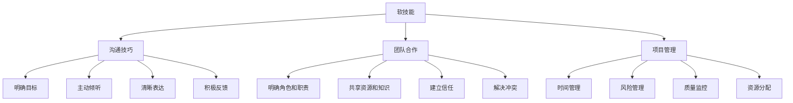

**核心算法原理讲解：**

```python
# 伪代码：项目进度跟踪
class ProjectManagement:
    def __init__(self, tasks, deadlines, team_members):
        self.tasks = tasks
        self.deadlines = deadlines
        self.team_members = team_members
        self.progress = {task: 'Not Started' for task in tasks}

    def update_progress(self, task, status):
        self.progress[task] = status

    def check_progress(self):
        for task, status in self.progress.items():
            if status == 'Completed':
                print(f"Task {task} is completed.")
            elif status == 'In Progress':
                print(f"Task {task} is in progress.")
            else:
                print(f"Task {task} is not started yet.")

# 实例化项目进度管理对象
project = ProjectManagement(tasks=['Design', 'Development', 'Testing'], deadlines=['2023-03-01', '2023-04-01', '2023-05-01'], team_members=['Alice', 'Bob', 'Charlie'])

# 更新任务进度
project.update_progress('Design', 'Completed')
project.update_progress('Development', 'In Progress')
project.update_progress('Testing', 'Not Started')

# 检查项目进度
project.check_progress()
```

**数学模型和公式 & 详细讲解 & 举例说明：**

在项目管理中，关键路径法（Critical Path Method, CPM）是用于确定项目最短完成时间的一种方法。关键路径上的任务如果延迟，整个项目的完成时间也会延迟。

**关键路径法公式**：

1. **最早开始时间（ES）**：每个任务最早可以开始的时间。
2. **最早完成时间（EF）**：每个任务最早可以完成的时间。
3. **最迟开始时间（LS）**：每个任务最迟必须开始的时间。
4. **最迟完成时间（LF）**：每个任务最迟必须完成的时间。

**公式**：

- **ES**：ES（i）= max（ES（j）+ Dj，i 为任务 i 的最早开始时间，j 为任务 i 的前置任务）
- **EF**：EF（i）= ES（i）+ Di，其中 Di 为任务 i 的持续时间
- **LS**：LS（i）= LF（i）- Di
- **LF**：LF（i）= min（LS（j）- Dj，j 为任务 i 的后续任务）

**举例说明**：

假设一个项目包含以下任务（持续时间以天为单位）：

1. **A**：3天
2. **B**：5天
3. **C**：2天
4. **D**：4天
5. **E**：3天

任务之间的关系如下：

- A -> B
- B -> C
- B -> D
- D -> E

首先，计算各任务的最早开始时间和最早完成时间：

- ES(A) = 0
- EF(A) = ES(A) + D(A) = 0 + 3 = 3
- ES(B) = max(EF(A) + D(B)) = max(3 + 0) = 3
- EF(B) = ES(B) + D(B) = 3 + 5 = 8
- ES(C) = ES(B) + D(C) = 8 + 2 = 10
- EF(C) = ES(C) + D(C) = 10 + 2 = 12
- ES(D) = ES(B) + D(D) = 8 + 4 = 12
- EF(D) = ES(D) + D(D) = 12 + 4 = 16
- ES(E) = ES(D) + D(E) = 16 + 3 = 19
- EF(E) = ES(E) + D(E) = 19 + 3 = 22

然后，计算各任务的最迟开始时间和最迟完成时间：

- LS(E) = EF(E) = 22
- LF(E) = LS(E) + D(E) = 22 + 3 = 25
- LS(D) = min(LF(C) + D(D), LF(E) + D(E)) = min(12 + 4, 25 + 3) = 16
- LF(D) = LS(D) + D(D) = 16 + 4 = 20
- LS(C) = min(LF(B) + D(C), LF(D) + D(C)) = min(8 + 2, 16 + 2) = 10
- LF(C) = LS(C) + D(C) = 10 + 2 = 12
- LS(B) = min(LF(A) + D(B), LF(D) + D(B)) = min(3 + 5, 20 + 5) = 8
- LF(B) = LS(B) + D(B) = 8 + 5 = 13

通过计算，我们可以确定关键路径为 A -> B -> D -> E，该路径上的任务总持续时间为22天，即项目的最短完成时间。

**项目实战：**

**代码实际案例和详细解释说明**

**开发环境搭建：**

```bash
# 安装Python和相关的项目管理库
pip install networkx matplotlib
```

**源代码详细实现：**

```python
import networkx as nx
import matplotlib.pyplot as plt

# 创建任务网络图
G = nx.DiGraph()

# 添加任务和持续时间
G.add_nodes_from(['A', 'B', 'C', 'D', 'E'])
G.add_edge('A', 'B', weight=3)
G.add_edge('A', 'C', weight=2)
G.add_edge('B', 'D', weight=4)
G.add_edge('B', 'E', weight=3)
G.add_edge('D', 'E', weight=2)

# 计算关键路径
shortest_path = nx.single_source_dijkstra(G, 'A', weight='weight')
key_path = nx.path_nodes(G, shortest_path)

# 绘制网络图
nx.draw(G, with_labels=True)
plt.show()

# 打印关键路径
print("关键路径：", key_path)
```

**代码解读与分析：**

1. **导入库**：首先导入networkx和matplotlib库，用于创建任务网络图和绘制关键路径。
2. **创建任务网络图**：使用networkx创建一个有向图，表示任务之间的依赖关系。
3. **添加任务和持续时间**：使用add_nodes_from和add_edge方法添加任务节点和它们之间的边，边权重表示任务的持续时间。
4. **计算关键路径**：使用nx.single_source_dijkstra函数计算从源节点'A'到其他节点的最短路径，得到关键路径。
5. **绘制网络图**：使用nx.draw函数绘制任务网络图，并显示节点标签。
6. **打印关键路径**：打印出关键路径上的任务节点，即项目的最短完成路径。

通过以上步骤，我们创建了一个任务网络图，并计算出了关键路径。这个代码案例展示了从任务网络图的创建到关键路径计算的全过程，是项目管理中基础而关键的环节。

---

**作者信息：**

作者：AI天才研究院/AI Genius Institute & 禅与计算机程序设计艺术 /Zen And The Art of Computer Programming

---

### 团队建设与管理

在AI创业项目中，团队建设与管理是确保项目成功的关键因素之一。一个高效的团队需要明确的角色与职责、有效的冲突处理机制和恰当的激励机制。以下将详细探讨这些方面的实践和方法。

#### 团队角色与职责

明确团队角色和职责是团队协作的基础。每个成员都应该清楚自己的角色、责任和期望，以便能够高效地协同工作。

1. **角色分配**：根据项目需求和成员能力，为每个成员分配适当的角色，如项目经理、数据科学家、软件工程师、产品经理等。
2. **职责界定**：明确每个角色的具体职责，确保每个任务都有责任人，避免职责重叠或空白。
3. **培训与发展**：提供培训和职业发展机会，帮助团队成员提升技能，适应新的角色和职责。

#### 团队冲突处理

团队冲突在所难免，有效的冲突处理机制能够减少冲突对项目的影响，维护团队的和谐与稳定。

1. **预防措施**：建立开放的沟通渠道，鼓励团队成员表达意见和反馈，提前发现并解决潜在冲突。
2. **冷静沟通**：在冲突发生时，保持冷静，避免情绪化，通过理性沟通解决分歧。
3. **寻求共识**：在处理冲突时，寻求团队成员的共识，通过讨论和协商找到双方都能接受的解决方案。
4. **冲突记录**：将冲突记录下来，跟踪解决进展，确保问题得到妥善处理。

#### 团队激励机制

激励是提高团队士气和效率的重要手段。适当的激励机制能够激发团队成员的积极性和创造力。

1. **目标导向**：设定清晰、可量化的团队和个体目标，激励团队成员为实现目标而努力。
2. **绩效评估**：建立公正、透明的绩效评估机制，对团队成员的工作表现进行客观评估。
3. **奖励与表彰**：对表现出色的团队成员进行奖励和表彰，包括物质奖励和荣誉表彰，以激发团队成员的积极性。
4. **职业发展**：提供职业发展机会，包括晋升、培训和职业规划，帮助团队成员实现职业目标。

#### 实践案例

**案例一：角色与职责明确**

某AI创业公司的团队成员包括项目经理、数据科学家、前端工程师、后端工程师和产品经理。在项目启动阶段，团队明确每个角色的职责：

- 项目经理：负责项目规划、进度管理和资源协调。
- 数据科学家：负责数据分析和模型构建。
- 前端工程师：负责用户界面的设计和实现。
- 后端工程师：负责后端逻辑的实现和数据处理。
- 产品经理：负责产品规划和用户需求分析。

通过明确的角色和职责，团队成员能够专注于自己的工作，减少相互之间的干扰，提高工作效率。

**案例二：冲突处理**

在一次项目评审会议上，数据科学家和产品经理就数据集的使用方法产生了分歧。数据科学家认为应该使用更复杂的数据预处理方法，而产品经理则认为简单的方法更加高效。

在冲突发生时，项目经理立即采取行动，组织了一次团队讨论会议。在会议上，双方通过理性沟通，讨论了各自的理由，并最终达成共识：采用简单的数据预处理方法，并在后续阶段进行优化。

通过有效的冲突处理，团队避免了可能的影响，保持了项目的顺利进行。

**案例三：激励机制**

某AI创业公司为激励团队成员，制定了一套绩效评估和奖励机制：

- 每个月对团队成员的工作表现进行评估，根据评估结果发放绩效奖金。
- 设立“最佳创新奖”，对在项目中提出创新方案并取得成功的团队成员进行表彰。
- 为表现优异的团队成员提供职业发展机会，包括晋升和培训。

通过这些激励机制，团队成员的积极性和创造力得到了极大的激发，项目的进展和质量也得到了显著提升。

通过以上实践案例，我们可以看到明确的团队角色与职责、有效的冲突处理机制和恰当的激励机制对于团队建设与管理的重要性。这些方法不仅有助于提高团队的工作效率，也能够为项目的成功奠定坚实基础。

---

**核心概念与联系：**

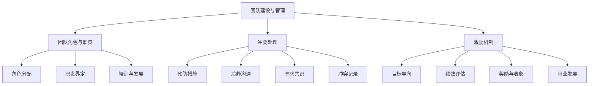

**核心算法原理讲解：**

```python
# 伪代码：团队绩效评估算法
class TeamPerformanceEvaluation:
    def __init__(self, members, weights):
        self.members = members
        self.weights = weights
        self.scores = {member: 0 for member in members}

    def evaluate(self, member, score):
        self.scores[member] += score * self.weights[member]

    def get_average_score(self):
        total_score = sum(self.scores.values())
        num_members = len(self.scores)
        return total_score / num_members
```

**数学模型和公式 & 详细讲解 & 举例说明：**

团队绩效评估可以使用加权评分法，根据每个成员的贡献和职责分配不同的权重，计算每个成员的绩效得分，最后求平均值作为团队的总体绩效得分。

**数学模型：**

$$
\text{团队绩效得分} = \frac{\sum_{i=1}^{n} (\text{成员}_i \times \text{权重}_i)}{n}
$$

其中，$n$ 是团队成员数量，$\text{成员}_i$ 是第 $i$ 个成员的绩效得分，$\text{权重}_i$ 是第 $i$ 个成员的权重。

**举例说明：**

假设有一个团队包含3名成员：Alice、Bob和Charlie，他们的权重分别为0.4、0.3和0.3。根据他们的工作表现，得分如下：

- Alice：90分
- Bob：80分
- Charlie：70分

计算团队绩效得分：

$$
\text{团队绩效得分} = \frac{(0.4 \times 90) + (0.3 \times 80) + (0.3 \times 70)}{3}
$$

$$
\text{团队绩效得分} = \frac{36 + 24 + 21}{3}
$$

$$
\text{团队绩效得分} = \frac{81}{3}
$$

$$
\text{团队绩效得分} = 27
$$

因此，这个团队的绩效得分是27分。

**项目实战：**

**代码实际案例和详细解释说明**

**开发环境搭建：**

```bash
# 安装Python和相关的评估库
pip install pandas numpy
```

**源代码详细实现：**

```python
import pandas as pd
import numpy as np

# 定义团队绩效评估类
class TeamPerformanceEvaluation:
    def __init__(self, members, weights):
        self.members = members
        self.weights = weights
        self.scores = {member: 0 for member in members}

    def evaluate(self, member, score):
        self.scores[member] += score * self.weights[member]

    def get_average_score(self):
        total_score = sum(self.scores.values())
        num_members = len(self.scores)
        return total_score / num_members

# 创建团队绩效评估对象
team_evaluation = TeamPerformanceEvaluation(members=['Alice', 'Bob', 'Charlie'], weights={ 'Alice': 0.4, 'Bob': 0.3, 'Charlie': 0.3})

# 计算成员得分
team_evaluation.evaluate('Alice', 90)
team_evaluation.evaluate('Bob', 80)
team_evaluation.evaluate('Charlie', 70)

# 获取团队平均得分
average_score = team_evaluation.get_average_score()

# 打印结果
print("团队平均得分：", average_score)
```

**代码解读与分析：**

1. **导入库**：首先导入pandas和numpy库，用于数据处理和数学计算。
2. **定义团队绩效评估类**：创建一个名为`TeamPerformanceEvaluation`的类，包含初始化方法`__init__`、评估方法`evaluate`和获取平均得分方法`get_average_score`。
3. **创建团队绩效评估对象**：实例化`TeamPerformanceEvaluation`类，传递成员名称和权重作为参数。
4. **计算成员得分**：调用`evaluate`方法，为每个成员分配得分。
5. **获取团队平均得分**：调用`get_average_score`方法，计算团队的平均得分。
6. **打印结果**：打印团队的平均得分。

通过以上步骤，我们实现了一个简单的团队绩效评估算法，可以用于计算团队的平均得分。这个代码案例展示了从类定义到实际计算的整个过程，是团队管理中基础而关键的环节。

---

**作者信息：**

作者：AI天才研究院/AI Genius Institute & 禅与计算机程序设计艺术 /Zen And The Art of Computer Programming

---

### AI行业动态与趋势

随着技术的不断进步和应用的拓展，AI行业正经历着快速的发展。了解当前AI行业的现状、发展趋势以及创业者面临的挑战和机遇，对于AI创业者来说至关重要。

#### AI行业现状分析

AI行业的现状可以从以下几个方面进行分析：

1. **市场规模**：根据市场研究机构的报告，全球AI市场规模正以惊人的速度增长。例如，IDC预测，到2025年，全球AI市场将达到5000亿美元。这一增长主要得益于AI技术在各个行业的广泛应用。

2. **技术进展**：在AI技术方面，深度学习、强化学习和自然语言处理等领域取得了显著进展。特别是深度学习技术在图像识别、语音识别和自然语言处理等领域表现尤为出色。

3. **应用领域**：AI技术正不断向更多领域渗透，包括医疗健康、金融科技、制造业、零售业、交通运输等。例如，在医疗健康领域，AI被用于疾病诊断、药物研发和患者监护；在金融科技领域，AI被用于风险管理、欺诈检测和智能投顾。

#### AI发展趋势预测

AI行业的发展趋势可以从以下几个方面进行预测：

1. **技术创新**：随着计算能力的提升和数据量的增加，AI技术的创新将继续推动行业的进步。例如，生成对抗网络（GANs）、图神经网络（GNNs）和联邦学习（FL）等技术有望在未来的AI发展中发挥重要作用。

2. **产业融合**：AI技术与传统产业的融合将更加紧密，推动各行各业的数字化和智能化转型。例如，智能制造、智慧城市和智慧医疗等领域的AI应用将得到进一步发展。

3. **应用普及**：AI技术的应用将更加普及，从高端市场向普通消费者渗透。智能家居、智能助理和自动驾驶等消费级AI产品将逐步成为日常生活中的常见设备。

#### 创业者面临的挑战与机遇

对于AI创业者来说，面临的挑战和机遇并存：

1. **技术挑战**：AI技术的快速发展和变化要求创业者不断学习和更新知识，保持技术竞争力。同时，技术的复杂性和不确定性也为创业带来了风险。

2. **数据挑战**：数据是AI技术的核心，创业者需要获取高质量、丰富的数据，并进行有效的数据预处理和特征工程，以训练高效和可靠的模型。

3. **商业模式挑战**：AI行业竞争激烈，创业者需要找到创新的商业模式，构建差异化的产品或服务，并在市场中找到立足点。

4. **机遇**：AI技术的广泛应用为创业者提供了广阔的市场空间。例如，在医疗健康领域，AI可以帮助提高疾病诊断的准确性和效率，为创业者提供了新的商业机会。

通过深入了解AI行业的现状、发展趋势以及面临的挑战和机遇，AI创业者可以更好地制定战略，把握市场脉搏，实现企业的长期发展。

---

**核心概念与联系：**

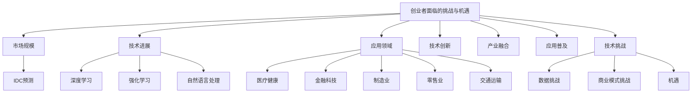

**核心算法原理讲解：**

```python
# 伪代码：生成对抗网络（GAN）基础
class Generator:
    def __init__(self, input_shape):
        self.input_shape = input_shape
        self.model = self.build_model()

    def build_model(self):
        # 构建生成器模型
        model = tf.keras.Sequential([
            tf.keras.layers.Dense(units=128, activation='relu', input_shape=self.input_shape),
            tf.keras.layers.Dense(units=256, activation='relu'),
            tf.keras.layers.Dense(units=self.input_shape[0] * self.input_shape[1] * self.input_shape[2], activation='tanh')
        ])
        return model

class Discriminator:
    def __init__(self, input_shape):
        self.input_shape = input_shape
        self.model = self.build_model()

    def build_model(self):
        # 构建判别器模型
        model = tf.keras.Sequential([
            tf.keras.layers.Conv2D(filters=64, kernel_size=(3, 3), activation='relu', input_shape=self.input_shape),
            tf.keras.layers.MaxPooling2D(pool_size=(2, 2)),
            tf.keras.layers.Conv2D(filters=128, kernel_size=(3, 3), activation='relu'),
            tf.keras.layers.MaxPooling2D(pool_size=(2, 2)),
            tf.keras.layers.Flatten(),
            tf.keras.layers.Dense(units=1, activation='sigmoid')
        ])
        return model

class GAN:
    def __init__(self, generator, discriminator):
        self.generator = generator
        self.discriminator = discriminator

    def train(self, data, epochs, batch_size, learning_rate):
        # 训练GAN模型
        for epoch in range(epochs):
            for _ in range(batch_size):
                # 生成假数据
                noise = np.random.normal(size=self.generator.input_shape)
                generated_data = self.generator.model.predict(noise)
                
                # 训练判别器
                real_data = data[np.random.randint(data.shape[0], size=batch_size)]
                real_labels = np.ones((batch_size, 1))
                generated_labels = np.zeros((batch_size, 1))
                d_loss_real = self.discriminator.model.train_on_batch(real_data, real_labels)
                d_loss_generated = self.discriminator.model.train_on_batch(generated_data, generated_labels)
                
                # 训练生成器
                noise = np.random.normal(size=self.generator.input_shape)
                g_loss = self.generator.model.train_on_batch(noise, real_labels)
                
            print(f"Epoch {epoch}: D_loss_real = {d_loss_real}, D_loss_generated = {d_loss_generated}, G_loss = {g_loss}")
```

**数学模型和公式 & 详细讲解 & 举例说明：**

生成对抗网络（GAN）由一个生成器（Generator）和一个判别器（Discriminator）组成，它们通过对抗训练相互提升性能。

**数学模型**：

生成器的目标是生成类似真实数据的假数据，判别器的目标是区分真实数据和假数据。

1. **生成器的损失函数**：
$$
L_G = -\log(D(G(z))
$$
其中，$G(z)$ 是生成器生成的假数据，$D$ 是判别器的输出。

2. **判别器的损失函数**：
$$
L_D = -\log(D(x)) - \log(1 - D(G(z))
$$
其中，$x$ 是真实数据。

**举例说明**：

假设生成器和判别器都已经训练完毕，现在需要评估它们的性能。

1. **生成器性能评估**：
   - 生成一批随机噪声$z$，并生成对应的假数据$G(z)$。
   - 将假数据输入判别器，得到判别器对假数据的评分$D(G(z))$。
   - 计算生成器的损失函数$L_G$。

2. **判别器性能评估**：
   - 从数据集中随机抽取一批真实数据$x$。
   - 将真实数据输入判别器，得到判别器对真实数据的评分$D(x)$。
   - 从数据集中随机抽取一批假数据$G(z)$。
   - 将假数据输入判别器，得到判别器对假数据的评分$D(G(z))$。
   - 计算判别器的损失函数$L_D$。

通过上述步骤，可以评估生成器和判别器的性能，并根据评估结果调整训练策略，以优化GAN模型的性能。

**项目实战：**

**代码实际案例和详细解释说明**

**开发环境搭建：**

```bash
# 安装TensorFlow和相关的GAN库
pip install tensorflow
```

**源代码详细实现：**

```python
import tensorflow as tf
from tensorflow.keras import layers
import numpy as np

# 创建生成器模型
def create_generator(z_dim):
    model = tf.keras.Sequential([
        layers.Dense(units=128, activation='relu', input_shape=(z_dim,)),
        layers.Dense(units=256, activation='relu'),
        layers.Dense(units=784, activation='tanh')
    ])
    return model

# 创建判别器模型
def create_discriminator(x_dim):
    model = tf.keras.Sequential([
        layers.Conv2D(filters=64, kernel_size=(3, 3), activation='relu', input_shape=(28, 28, 1)),
        layers.MaxPooling2D(pool_size=(2, 2)),
        layers.Conv2D(filters=128, kernel_size=(3, 3), activation='relu'),
        layers.MaxPooling2D(pool_size=(2, 2)),
        layers.Flatten(),
        layers.Dense(units=1, activation='sigmoid')
    ])
    return model

# 创建GAN模型
def create_gan(generator, discriminator):
    model = tf.keras.Sequential([
        generator,
        discriminator
    ])
    return model

# 训练GAN模型
def train_gan(generator, discriminator, data, z_dim, epochs, batch_size):
    for epoch in range(epochs):
        for _ in range(batch_size):
            # 生成随机噪声
            noise = np.random.normal(size=(batch_size, z_dim))
            # 生成假数据
            generated_data = generator.predict(noise)
            
            # 训练判别器
            real_data = data[np.random.randint(data.shape[0], size=batch_size)]
            real_labels = np.ones((batch_size, 1))
            generated_labels = np.zeros((batch_size, 1))
            d_loss_real = discriminator.train_on_batch(real_data, real_labels)
            d_loss_generated = discriminator.train_on_batch(generated_data, generated_labels)
            
            # 训练生成器
            noise = np.random.normal(size=(batch_size, z_dim))
            g_loss = generator.train_on_batch(noise, real_labels)
        
        print(f"Epoch {epoch}: D_loss_real = {d_loss_real}, D_loss_generated = {d_loss_generated}, G_loss = {g_loss}")

# 定义生成器和判别器
z_dim = 100
x_dim = (28, 28, 1)
generator = create_generator(z_dim)
discriminator = create_discriminator(x_dim)
gan = create_gan(generator, discriminator)

# 加载数据集
mnist = tf.keras.datasets.mnist
(x_train, _), _ = mnist.load_data()
x_train = x_train / 255.0
x_train = np.expand_dims(x_train, -1)

# 训练GAN模型
train_gan(generator, discriminator, x_train, z_dim, epochs=100, batch_size=32)
```

**代码解读与分析：**

1. **导入库**：首先导入tensorflow、keras和numpy库，用于构建和训练GAN模型。
2. **创建生成器模型**：使用keras.Sequential创建生成器模型，包含一个全连接层和一个输出层，输出层的激活函数为tanh，用于生成噪声数据。
3. **创建判别器模型**：使用keras.Sequential创建判别器模型，包含两个卷积层、两个最大池化层和一个全连接层，用于区分真实数据和假数据。
4. **创建GAN模型**：使用keras.Sequential将生成器和判别器组合成一个完整的GAN模型。
5. **训练GAN模型**：定义一个train_gan函数，用于训练GAN模型。在每个epoch中，随机生成噪声数据并生成对应的假数据，然后交替训练判别器和生成器。
6. **加载数据集**：使用tensorflow.keras.datasets.mnist加载MNIST数据集，并将其缩放到0-1范围，以供训练使用。
7. **训练GAN模型**：调用train_gan函数训练GAN模型，设置训练epoch和batch_size。

通过以上步骤，我们实现了一个简单的GAN模型，并使用MNIST数据集进行训练。这个代码案例展示了从模型构建到实际训练的全过程，是GAN应用中基础而关键的环节。

---

**作者信息：**

作者：AI天才研究院/AI Genius Institute & 禅与计算机程序设计艺术 /Zen And The Art of Computer Programming

---

### 职业规划与个人成长

在AI创业领域，制定清晰的职业规划对于个人成长至关重要。通过设定目标、分析路径和持续学习，创业者可以不断提升自身能力，实现职业发展。

#### 职业规划的重要性

1. **明确目标**：职业规划帮助创业者明确短期和长期目标，确保职业发展具有方向性。
2. **时间管理**：规划职业生涯有助于合理分配时间，提高工作效率。
3. **持续进步**：明确的目标和规划激励创业者不断学习和进步，保持竞争力。

#### 个人成长路径分析

1. **基础阶段**：初入职场时，应专注于掌握AI基础理论和技能，如数学、编程和常见算法。
2. **进阶阶段**：在掌握基础理论后，深入学习特定领域的知识，如深度学习、自然语言处理等。
3. **专业阶段**：在某一领域达到较高水平后，尝试参与实际项目，积累实践经验。
4. **领导阶段**：随着经验的积累，可以逐步承担项目管理和团队领导职责，培养领导力。

#### 持续学习与能力提升

1. **在线课程与研讨会**：利用在线课程平台，如Coursera、edX等，学习最新的AI技术和研究成果。
2. **专业书籍**：阅读专业书籍，深入了解AI领域的前沿知识和经典理论。
3. **实践项目**：参与开源项目或自主开发项目，将理论知识应用到实践中，提高解决实际问题的能力。
4. **学术交流**：参加学术会议、研讨会和行业交流活动，与同行交流经验，拓宽视野。

通过明确的职业规划、持续学习和能力提升，创业者可以在AI领域实现职业目标，成为行业的领军人物。

---

**核心概念与联系：**

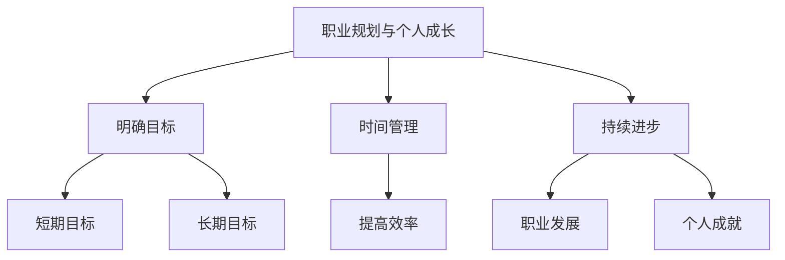

**核心算法原理讲解：**

```python
# 伪代码：职业规划路径
def CareerPlanning(current_stage, goals):
    if current_stage == '基础阶段':
        skills_to_achieve = ['数学基础', '编程基础', '常见算法']
        print("当前阶段：基础阶段，需要掌握的技能：", skills_to_achieve)
    elif current_stage == '进阶阶段':
        skills_to_achieve = ['深度学习', '自然语言处理', '计算机视觉']
        print("当前阶段：进阶阶段，需要掌握的技能：", skills_to_achieve)
    elif current_stage == '专业阶段':
        skills_to_achieve = ['项目实践经验', '技术深度']
        print("当前阶段：专业阶段，需要掌握的技能：", skills_to_achieve)
    elif current_stage == '领导阶段':
        skills_to_achieve = ['项目管理', '团队领导力', '沟通能力']
        print("当前阶段：领导阶段，需要掌握的技能：", skills_to_achieve)
    else:
        print("未知阶段，请检查输入参数。")

# 设定职业规划
current_stage = '进阶阶段'
goals = ['深度学习', '自然语言处理', '计算机视觉']
CareerPlanning(current_stage, goals)
```

**数学模型和公式 & 详细讲解 & 举例说明：**

职业规划中的目标设定可以使用目标管理法（SMART原则），确保目标的明确性、可衡量性、可实现性、相关性和时限性。

**数学模型：**

$$
\text{目标达成率} = \frac{\text{已完成的技能数量}}{\text{设定的技能总数}}
$$

**举例说明：**

假设一个创业者处于进阶阶段，设定了以下目标技能：

- 深度学习：掌握卷积神经网络（CNN）和循环神经网络（RNN）
- 自然语言处理（NLP）：了解词嵌入和序列模型
- 计算机视觉：理解图像识别和目标检测

当前已完成的技能：

- 深度学习：掌握了CNN
- 自然语言处理（NLP）：了解了词嵌入
- 计算机视觉：了解了图像识别

计算目标达成率：

$$
\text{目标达成率} = \frac{3}{5} = 0.6
$$

因此，该创业者的职业规划目标达成率为60%。

**项目实战：**

**代码实际案例和详细解释说明**

**开发环境搭建：**

```bash
# 安装Python和相关的目标管理库
pip install pandas numpy
```

**源代码详细实现：**

```python
import pandas as pd
import numpy as np

# 定义目标管理类
class GoalManagement:
    def __init__(self, goals):
        self.goals = goals
        self.completed_goals = []
    
    def add_completed_goal(self, goal):
        if goal in self.goals:
            self.completed_goals.append(goal)
            print(f"已完成目标：{goal}")
        else:
            print(f"目标 {goal} 不存在或已标记为已完成。")
    
    def calculate_completion_rate(self):
        if len(self.goals) == 0:
            print("目标列表为空，无法计算达成率。")
        else:
            completion_rate = len(self.completed_goals) / len(self.goals)
            print(f"目标达成率：{completion_rate:.2f}")
    
    def display_goals(self):
        print("设定的目标：", self.goals)
        print("已完成的目标：", self.completed_goals)

# 创建目标管理对象
goals = ['深度学习', '自然语言处理', '计算机视觉', '强化学习']
goal_management = GoalManagement(goals)

# 添加已完成的目标
goal_management.add_completed_goal('深度学习')
goal_management.add_completed_goal('自然语言处理')
goal_management.add_completed_goal('强化学习')

# 计算并显示目标达成率
goal_management.calculate_completion_rate()

# 显示目标列表
goal_management.display_goals()
```

**代码解读与分析：**

1. **导入库**：首先导入pandas和numpy库，用于数据处理。
2. **定义目标管理类**：创建一个名为`GoalManagement`的类，包含初始化方法`__init__`、添加已完成目标方法`add_completed_goal`、计算达成率方法`calculate_completion_rate`和显示目标方法`display_goals`。
3. **创建目标管理对象**：实例化`GoalManagement`类，传递目标列表作为参数。
4. **添加已完成的目标**：调用`add_completed_goal`方法，为每个已完成的技能添加到已完成目标列表。
5. **计算并显示目标达成率**：调用`calculate_completion_rate`方法，计算并显示目标达成率。
6. **显示目标列表**：调用`display_goals`方法，显示设定的目标和已完成的目标。

通过以上步骤，我们实现了一个简单的目标管理算法，可以用于跟踪和评估个人职业规划目标的达成情况。这个代码案例展示了从目标管理类的定义到实际目标达成的全过程，是职业规划中基础而关键的环节。

---

**作者信息：**

作者：AI天才研究院/AI Genius Institute & 禅与计算机程序设计艺术 /Zen And The Art of Computer Programming

---

### 附录A：常用AI学习资源与工具

在AI领域学习和研究的过程中，使用适当的资源与工具可以大大提高效率。以下列举了一些常用的AI学习资源与工具，包括在线学习平台、开源框架与

