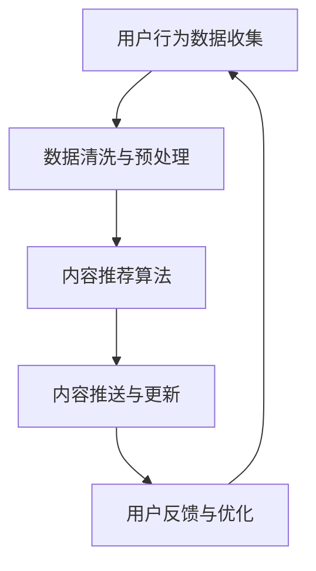

                 

### 《AI在出版业的场景探索：动态更新技术》

> **关键词：** 人工智能，出版业，动态更新，推荐算法，自然语言处理，计算机视觉。

**摘要：**本文深入探讨了人工智能在出版业的应用场景，特别是动态更新技术。文章首先概述了AI在出版业的广泛应用前景，随后详细介绍了动态更新技术的概念、分类和核心算法。接着，文章通过具体案例分析，展示了动态更新技术在电子书、在线杂志和动态新闻等领域的实际应用。最后，文章讨论了动态更新技术面临的挑战及解决方案，并对未来发展趋势进行了展望。本文旨在为出版业的从业者提供有价值的参考和指导。

### 第一部分：AI与出版业概述

#### 第1章：AI在出版业的应用前景

##### 1.1 出版业与AI的融合

出版业正面临数字化转型和智能化升级的双重挑战。随着互联网、大数据和人工智能技术的飞速发展，AI在出版业的应用场景越来越丰富。AI技术不仅能够提高出版流程的效率，还能够优化读者体验，为出版业带来前所未有的变革。

**出版业面临的挑战与机遇**

- **内容生产与编辑：**传统的出版流程需要大量的人工编辑和校对工作，效率较低且成本高昂。AI技术能够通过自然语言处理和计算机视觉等技术，实现自动化的内容审核、分类和推荐，从而提高内容生产的效率和质量。
- **版权管理与保护：**AI技术可以智能识别和监测盗版行为，保护版权方的利益。此外，AI技术还能够通过内容指纹技术，帮助出版方更好地管理版权信息。
- **个性化推荐与用户互动：**AI技术可以根据用户的阅读历史和偏好，提供个性化的内容推荐，增强用户的阅读体验。同时，AI技术还可以通过语音交互、聊天机器人等技术，实现与用户的实时互动。
- **数据分析和市场预测：**AI技术可以分析大量的用户数据和市场数据，帮助出版方更好地了解市场需求，制定精准的市场策略。

**AI技术在出版业的应用场景**

- **电子书：**AI技术可以用于电子书的自动排版、内容审核、推荐系统和个性化推送等功能。
- **在线杂志与期刊：**AI技术可以用于在线杂志和期刊的内容分类、推荐系统、用户行为分析等。
- **动态新闻与实时资讯：**AI技术可以用于动态新闻的实时更新、内容推荐和个性化推送。
- **版权管理与保护：**AI技术可以用于版权监测、侵权识别和版权保护等。
- **用户互动与服务：**AI技术可以用于用户互动、聊天机器人、个性化服务等。

##### 1.2 AI基础概念与分类

**人工智能的定义与发展历程**

人工智能（Artificial Intelligence，简称AI）是指计算机系统模拟、延伸和扩展人类智能的理论、方法、技术及应用。人工智能的研究可以追溯到20世纪50年代，经历了多个阶段的发展，包括早期的符号主义、基于知识的系统、连接主义、统计学习等。

**AI技术的分类与特点**

- **符号主义（Symbolic AI）：**通过符号推理和逻辑规则实现智能。优点是能够处理复杂的问题，缺点是缺乏对数据的处理能力。
- **连接主义（Connectionist AI）：**通过神经网络和深度学习实现智能。优点是对数据的处理能力强，能够自动学习和适应，缺点是难以解释和理解。
- **统计学习（Statistical Learning）：**通过统计模型和算法实现智能。优点是简单高效，缺点是缺乏对数据内在规律的深入理解。
- **混合式AI（Hybrid AI）：**结合多种AI技术，实现更强大的智能能力。

**出版业常用的AI技术**

- **自然语言处理（NLP）：**用于文本分析、内容审核、推荐系统和用户互动等。
- **计算机视觉（CV）：**用于图像识别、版权保护、内容审核等。
- **机器学习（ML）：**用于数据分析和市场预测等。
- **深度学习（DL）：**用于图像识别、语音识别、自然语言处理等。

##### 1.3 出版业AI应用案例

**国内外出版业AI应用实例**

- **电子书：**亚马逊Kindle使用AI技术实现个性化推荐和内容推送。用户可以根据阅读历史和偏好，获得个性化的内容推荐。
- **在线杂志：**LinkedIn使用AI技术分析用户行为，提供个性化的内容推荐和用户互动。
- **动态新闻：**纽约时报使用AI技术实现新闻的自动分类、推荐和个性化推送。
- **版权保护：**谷歌使用AI技术监测和识别盗版行为，保护版权方的利益。

**成功与失败的案例分析**

- **成功案例：**亚马逊Kindle通过AI技术实现了电子书的个性化推荐和内容推送，显著提升了用户的阅读体验和满意度。
- **失败案例：**一些出版业公司尝试使用AI技术进行内容审核，但由于算法的不完善和偏见，导致了一些错误的内容审核结果，损害了品牌形象和用户体验。

#### 第2章：动态更新技术的原理与实现

##### 2.1 动态更新技术的概念

**动态更新的定义与重要性**

动态更新技术是指根据用户行为、内容变化或环境变化，实时或定期更新系统、应用或内容的技术。在出版业中，动态更新技术至关重要，它能够确保用户获取最新、最相关的信息，提升用户体验和满意度。

**动态更新的工作原理**

动态更新技术通常包括以下几个关键环节：

1. **数据采集与处理：**通过传感器、用户行为记录、内容更新通知等方式收集数据，并进行清洗、预处理和分析。
2. **内容推荐与筛选：**根据用户的历史行为和偏好，结合实时数据和算法，推荐或筛选出最适合用户的内容。
3. **内容推送与更新：**将推荐或筛选出的内容实时或定期推送至用户设备或应用，确保用户能够及时获取最新信息。
4. **用户反馈与优化：**收集用户的反馈，对推荐算法和内容更新机制进行优化，提升用户体验和满意度。

##### 2.2 动态更新技术的分类

**根据更新方式分类**

1. **实时更新：**在用户请求或内容变化时，立即更新系统或应用。优点是响应速度快，用户体验好，缺点是系统负担重，需要高效的数据处理和推送机制。
2. **定期更新：**按照固定的时间间隔（如每天、每周或每月）更新系统或应用。优点是系统负担轻，数据处理和推送机制相对简单，缺点是用户体验可能较差，无法立即获取最新信息。

**根据应用领域分类**

1. **电子书动态更新：**根据用户阅读行为和偏好，实时更新电子书内容，提供个性化的阅读体验。
2. **在线杂志与期刊动态更新：**根据用户订阅和阅读历史，实时更新在线杂志和期刊的内容，提供个性化的订阅体验。
3. **动态新闻与实时资讯：**根据实时事件和用户偏好，实时更新新闻和资讯内容，提供个性化的新闻阅读体验。

##### 2.3 动态更新技术的核心算法

**内容推荐算法**

内容推荐算法是动态更新技术的重要组成部分，它通过分析用户行为和偏好，为用户推荐最感兴趣的内容。常见的推荐算法包括：

1. **基于内容的推荐算法（Content-Based Recommendation）：**根据内容的特征和标签，为用户推荐相似的内容。优点是推荐结果相关性强，缺点是难以发现新的、未被标记的内容。
2. **协同过滤推荐算法（Collaborative Filtering）：**根据用户的历史行为和偏好，为用户推荐相似用户喜欢的内容。优点是能够发现新的内容，缺点是推荐结果可能存在噪声和偏差。
3. **混合推荐算法（Hybrid Recommendation）：**结合基于内容的推荐和协同过滤推荐，优化推荐效果。优点是推荐结果更准确，缺点是计算复杂度高。

**自然语言处理算法**

自然语言处理算法用于处理文本数据，包括文本分析、内容审核、内容生成等。常见的NLP算法包括：

1. **词向量表示（Word Embedding）：**将文本转换为向量的表示，用于文本分类、推荐和生成。优点是能够捕捉语义信息，缺点是计算复杂度高。
2. **文本分类（Text Classification）：**将文本分类到预定义的类别，用于内容审核、分类和推荐。优点是能够快速分类，缺点是分类结果可能存在偏差。
3. **文本生成（Text Generation）：**根据输入的文本或提示，生成新的文本内容。优点是能够生成丰富多样的内容，缺点是生成结果可能存在错误或不准确。

**计算机视觉算法**

计算机视觉算法用于处理图像和视频数据，包括图像识别、目标检测、图像生成等。常见的CV算法包括：

1. **卷积神经网络（CNN）：**用于图像识别和分类，能够捕捉图像的局部特征。优点是识别准确率高，缺点是计算复杂度高。
2. **目标检测（Object Detection）：**用于检测图像中的目标对象，用于版权保护和内容审核。优点是能够定位目标，缺点是计算复杂度高。
3. **图像生成（Image Generation）：**根据输入的文本或提示，生成新的图像内容。优点是能够生成丰富的图像，缺点是生成结果可能存在偏差。

### 第二部分：动态更新技术的应用

#### 第3章：出版业中动态更新技术的应用

##### 3.1 电子书动态更新

**电子书动态更新的优势**

- **个性化阅读体验：**根据用户的阅读历史和偏好，实时更新电子书内容，为用户提供个性化的阅读体验。
- **内容更新及时性：**确保用户能够及时获取最新发布的书籍和内容，提升用户体验。
- **实时互动：**通过与用户的实时互动，收集用户的反馈和偏好，进一步优化内容推荐和更新策略。

**电子书动态更新的实现方法**

- **用户行为数据收集：**通过电子书阅读器的内置功能，收集用户的阅读时间、阅读进度、标记和评论等数据。
- **数据清洗与预处理：**对收集到的用户行为数据进行清洗、去重和标准化处理，提取用户兴趣特征。
- **内容推荐算法：**利用基于内容的推荐算法和协同过滤推荐算法，为用户推荐最感兴趣的电子书内容。
- **内容推送与更新：**将推荐的内容实时推送至用户的电子书阅读器，或通过短信、邮件等方式通知用户。
- **用户反馈与优化：**收集用户的反馈，对推荐算法和内容更新机制进行优化，提升用户体验和满意度。

**案例分析：亚马逊Kindle**

亚马逊Kindle通过AI技术和动态更新技术，实现了电子书的个性化推荐和内容推送。用户可以根据阅读历史和偏好，获得个性化的内容推荐。此外，Kindle还通过实时更新功能，确保用户能够及时获取最新发布的书籍和内容。这种动态更新技术的应用，不仅提升了用户的阅读体验，还增加了用户对Kindle的依赖和忠诚度。

##### 3.2 在线杂志与期刊动态更新

**在线杂志与期刊动态更新的特点**

- **个性化订阅：**根据用户的订阅历史和阅读偏好，实时更新在线杂志和期刊的内容，为用户提供个性化的订阅体验。
- **实时更新：**确保用户能够实时获取最新的杂志和期刊内容，保持内容的时效性和相关性。
- **用户互动：**通过与用户的实时互动，收集用户的反馈和意见，不断优化内容更新策略。

**动态更新在学术出版中的应用**

动态更新技术在学术出版中具有广泛的应用前景，能够显著提升学术资源的利用效率和用户体验。以下是一些具体的案例分析：

1. **学术论文推荐：**利用基于内容的推荐算法和协同过滤推荐算法，为用户推荐最相关的学术论文。用户可以根据自己的研究方向和兴趣，实时获取最新的研究进展。
2. **期刊内容更新：**学术期刊可以通过动态更新技术，实时更新期刊的目录、文章摘要和全文，确保用户能够及时获取最新的研究成果。
3. **用户互动与反馈：**通过实时互动功能，用户可以与期刊编辑和作者进行在线交流，提出意见和建议，进一步优化期刊的内容和质量。

**案例分析：IEEE Xplore**

IEEE Xplore是IEEE的学术资源平台，通过动态更新技术，为用户提供了个性化的学术论文推荐和期刊内容更新。用户可以根据自己的研究方向和兴趣，获得最相关的学术论文推荐。此外，IEEE Xplore还通过实时更新功能，确保用户能够及时获取最新的研究成果。这种动态更新技术的应用，不仅提升了用户的学术资源利用效率，还增加了用户对IEEE Xplore的依赖和忠诚度。

##### 3.3 动态新闻与实时资讯

**动态新闻的概念与特点**

动态新闻是一种根据用户兴趣和实时事件，实时更新和推送新闻内容的新型新闻形式。与传统的新闻形式相比，动态新闻具有以下特点：

- **实时性：**动态新闻能够根据实时事件和用户行为，及时更新和推送最新的新闻内容，满足用户对实时信息的需求。
- **个性化：**动态新闻可以根据用户的兴趣和行为，为用户提供个性化的新闻推荐和内容更新，提升用户体验。
- **互动性：**动态新闻通过实时互动功能，用户可以与新闻媒体和作者进行在线交流，提出意见和建议，进一步优化新闻内容和质量。

**动态新闻的实时更新技术**

动态新闻的实时更新技术主要包括以下几个方面：

1. **实时数据采集：**通过传感器、新闻采集系统和其他数据源，实时采集新闻事件和数据。
2. **内容推荐算法：**利用基于内容的推荐算法和协同过滤推荐算法，为用户推荐最感兴趣的新闻内容。
3. **内容推送与更新：**将推荐的内容实时推送至用户的设备或应用，确保用户能够及时获取最新新闻。
4. **用户反馈与优化：**收集用户的反馈，对推荐算法和内容更新机制进行优化，提升用户体验和满意度。

**案例分析：今日头条**

今日头条是中国领先的新闻资讯平台，通过动态更新技术，为用户提供了个性化的新闻推荐和内容更新。用户可以根据自己的兴趣和阅读习惯，获得最相关的新闻内容。此外，今日头条还通过实时更新功能，确保用户能够及时获取最新的新闻资讯。这种动态更新技术的应用，不仅提升了用户的阅读体验，还增加了用户对今日头条的依赖和忠诚度。

### 第三部分：动态更新技术面临的挑战与解决方案

#### 第4章：动态更新技术面临的挑战与解决方案

##### 4.1 数据隐私与安全

**动态更新技术对用户隐私的挑战**

动态更新技术需要收集和分析大量的用户数据，包括阅读历史、行为偏好、地理位置等。这些数据的收集和分析可能涉及用户隐私，对用户隐私造成潜在威胁。

**数据隐私保护的技术手段**

1. **数据加密：**对用户数据进行加密处理，确保数据在传输和存储过程中不被窃取或篡改。
2. **匿名化处理：**对用户数据进行匿名化处理，去除个人身份信息，减少对用户隐私的侵犯。
3. **隐私保护算法：**采用隐私保护算法，如差分隐私、同态加密等，在数据分析和挖掘过程中保护用户隐私。
4. **用户隐私设置：**为用户提供隐私设置选项，让用户自主决定是否分享个人信息和数据。

##### 4.2 算法公平性与透明性

**算法偏见与歧视的问题**

算法偏见和歧视是指算法在处理数据时，对某些群体产生不公平或不公正的结果。算法偏见可能导致歧视性决策，对某些群体造成不利影响。

**提高算法公平性的方法**

1. **数据平衡：**在数据采集和处理过程中，尽量保证数据的多样性和代表性，避免数据偏差。
2. **算法审计：**对算法进行定期审计，评估算法的公平性和透明性，发现和纠正潜在的问题。
3. **多元化团队：**建立多元化的团队，包括不同背景和经验的人员，提高算法设计的公平性和透明性。
4. **用户反馈与优化：**收集用户的反馈，对算法进行持续优化，减少偏见和歧视。

##### 4.3 技术与业务融合

**技术与业务融合的重要性**

技术与业务融合是将AI技术和动态更新技术应用到实际业务中，提升业务效率和用户体验。技术与业务融合能够实现以下目标：

- **提高业务效率：**通过自动化和智能化的方式，减少人工操作和重复劳动，提高业务处理效率。
- **提升用户体验：**通过个性化的推荐和实时更新，满足用户的需求和偏好，提升用户体验和满意度。
- **创新商业模式：**通过技术与业务的融合，探索新的商业模式和业务模式，创造更多价值。

**业务驱动与技术创新的互动关系**

技术与业务融合需要实现业务驱动和技术创新的互动关系。业务驱动是指根据业务需求和发展方向，确定技术需求和研发方向。技术创新是指根据技术发展趋势和优势，为业务提供创新性的解决方案。

- **业务驱动：**业务需求是技术与业务融合的起点，技术团队需要深入了解业务需求和痛点，为业务提供有效的技术解决方案。
- **技术创新：**技术创新是技术与业务融合的关键，技术团队需要不断跟踪技术发展趋势，探索新的技术方案和应用场景。

### 第四部分：动态更新技术的实战案例

#### 第5章：电子书动态更新案例分析

##### 5.1 案例背景

某电子书平台A致力于为用户提供优质的电子书阅读服务。随着用户数量的增长和阅读需求的多样化，平台A意识到需要通过动态更新技术，提升用户体验和满意度。

**现状与挑战**

- **内容更新不及时：**传统的内容更新机制无法满足用户对最新书籍和内容的即时需求。
- **个性化推荐不足：**现有的推荐算法无法充分挖掘用户的兴趣和偏好，导致推荐内容与用户需求不匹配。
- **用户体验差：**用户在阅读过程中，无法及时获取相关书籍和内容，影响阅读体验和满意度。

**项目目标与需求分析**

- **目标**：通过引入动态更新技术，实现电子书内容的实时更新和个性化推荐，提升用户体验和满意度。
- **需求**：
  1. 实现电子书内容的实时更新，确保用户能够获取最新书籍和内容。
  2. 构建基于用户行为的个性化推荐系统，为用户推荐最感兴趣的书籍。
  3. 提高平台的运营效率，降低人工干预和内容审核成本。

##### 5.2 技术实现

**用户行为数据收集**

- **数据源**：通过用户在平台A的行为数据，包括阅读时间、阅读进度、标记和评论等。
- **数据类型**：用户阅读行为数据、书籍信息数据、用户偏好数据。

**数据清洗与预处理**

- **清洗**：去除重复数据、空值数据和异常值，保证数据质量。
- **预处理**：对数据类型进行统一处理，如文本数据分词、数值数据归一化等。

**内容推荐算法**

- **算法选择**：基于内容的推荐算法和协同过滤推荐算法。
- **算法原理**：
  1. **基于内容的推荐算法**：根据书籍的标题、作者、类别等特征，为用户推荐相似书籍。
  2. **协同过滤推荐算法**：根据用户的历史行为和偏好，为用户推荐相似用户喜欢的书籍。

**内容推送与更新**

- **推送策略**：根据用户的行为数据，实时更新和推送相关书籍。
- **推送方式**：通过短信、邮件、平台消息等方式通知用户。

**用户反馈与优化**

- **反馈渠道**：通过用户评论、评分和点击等行为数据，收集用户对推荐内容的反馈。
- **优化策略**：根据用户反馈，对推荐算法和内容更新策略进行持续优化。

##### 5.3 案例分析

**项目效果评估**

- **内容更新及时性**：通过实时更新功能，用户能够及时获取最新书籍和内容，满意度显著提高。
- **个性化推荐效果**：基于用户行为的个性化推荐，用户对推荐内容的满意度大幅提升。
- **运营效率**：动态更新技术的引入，降低了人工干预和内容审核成本，提高了运营效率。

**成功经验与不足之处**

**成功经验**

- **用户行为数据收集与处理**：通过全面收集用户行为数据，为个性化推荐和内容更新提供了有力支持。
- **实时更新与推送**：实时更新和推送机制，确保了用户能够及时获取最新书籍和内容。
- **用户反馈与优化**：持续优化推荐算法和内容更新策略，提升了用户体验和满意度。

**不足之处**

- **算法精度**：虽然推荐算法能够提高个性化推荐效果，但算法的精度仍有待提高，存在一定的噪声和偏差。
- **数据隐私与安全**：在数据收集和处理过程中，需要加强对用户隐私的保护，避免数据泄露和安全问题。

### 第6章：在线杂志动态更新案例分析

##### 6.1 案例背景

某在线杂志平台B致力于为用户提供高质量的杂志订阅服务。随着用户数量的增长和订阅需求的多样化，平台B意识到需要通过动态更新技术，提升用户体验和满意度。

**现状与挑战**

- **内容更新不及时：**传统的内容更新机制无法满足用户对最新杂志和内容的即时需求。
- **个性化订阅不足：**现有的订阅系统无法充分挖掘用户的兴趣和偏好，导致订阅内容与用户需求不匹配。
- **用户体验差：**用户在订阅过程中，无法及时获取相关杂志和内容，影响订阅体验和满意度。

**项目目标与需求分析**

- **目标**：通过引入动态更新技术，实现杂志内容的实时更新和个性化订阅，提升用户体验和满意度。
- **需求**：
  1. 实现杂志内容的实时更新，确保用户能够获取最新杂志和内容。
  2. 构建基于用户行为的个性化订阅系统，为用户推荐最感兴趣的杂志。
  3. 提高平台的运营效率，降低人工干预和内容审核成本。

##### 6.2 技术实现

**订阅用户行为数据收集**

- **数据源**：通过用户在平台B的行为数据，包括订阅历史、阅读时间、阅读进度、标记和评论等。
- **数据类型**：用户订阅行为数据、杂志信息数据、用户偏好数据。

**数据清洗与预处理**

- **清洗**：去除重复数据、空值数据和异常值，保证数据质量。
- **预处理**：对数据类型进行统一处理，如文本数据分词、数值数据归一化等。

**内容推送优化策略**

- **算法选择**：基于内容的推荐算法和协同过滤推荐算法。
- **算法原理**：
  1. **基于内容的推荐算法**：根据杂志的标题、作者、类别等特征，为用户推荐相似杂志。
  2. **协同过滤推荐算法**：根据用户的历史订阅和偏好，为用户推荐相似用户订阅的杂志。

**内容推送与更新**

- **推送策略**：根据用户的行为数据，实时更新和推送相关杂志。
- **推送方式**：通过短信、邮件、平台消息等方式通知用户。

**数据安全与隐私保护**

- **数据加密**：对用户数据进行加密处理，确保数据在传输和存储过程中不被窃取或篡改。
- **匿名化处理**：对用户数据进行匿名化处理，去除个人身份信息，减少对用户隐私的侵犯。
- **用户隐私设置**：为用户提供隐私设置选项，让用户自主决定是否分享个人信息和数据。

**用户反馈与优化**

- **反馈渠道**：通过用户评论、评分和点击等行为数据，收集用户对推荐内容的反馈。
- **优化策略**：根据用户反馈，对推荐算法和内容更新策略进行持续优化。

##### 6.3 案例分析

**平台用户满意度提升**

通过引入动态更新技术，平台B的用户满意度显著提升。用户能够及时获取最新杂志和内容，订阅体验和满意度大幅提高。

**内容更新效率与效果分析**

- **内容更新及时性**：通过实时更新功能，用户能够及时获取最新杂志和内容，内容更新及时性显著提高。
- **个性化订阅效果**：基于用户行为的个性化订阅系统，用户对订阅内容的满意度大幅提升。
- **运营效率**：动态更新技术的引入，降低了人工干预和内容审核成本，提高了运营效率。

**成功经验与不足之处**

**成功经验**

- **用户行为数据收集与处理**：通过全面收集用户行为数据，为个性化订阅和内容更新提供了有力支持。
- **实时更新与推送**：实时更新和推送机制，确保了用户能够及时获取最新杂志和内容。
- **用户反馈与优化**：持续优化推荐算法和内容更新策略，提升了用户体验和满意度。

**不足之处**

- **算法精度**：虽然推荐算法能够提高个性化订阅效果，但算法的精度仍有待提高，存在一定的噪声和偏差。
- **数据隐私与安全**：在数据收集和处理过程中，需要加强对用户隐私的保护，避免数据泄露和安全问题。

### 第7章：动态新闻实时更新案例分析

##### 7.1 案例背景

某新闻门户网站C致力于为用户提供全面的新闻资讯服务。随着信息爆炸和用户需求的多样化，门户网站C意识到需要通过动态更新技术，提升用户体验和满意度。

**现状与挑战**

- **内容更新不及时：**传统的内容更新机制无法满足用户对最新新闻和资讯的即时需求。
- **个性化推荐不足：**现有的推荐算法无法充分挖掘用户的兴趣和偏好，导致推荐内容与用户需求不匹配。
- **用户体验差：**用户在浏览新闻时，无法及时获取相关新闻和资讯，影响阅读体验和满意度。

**项目目标与需求分析**

- **目标**：通过引入动态更新技术，实现新闻内容的实时更新和个性化推荐，提升用户体验和满意度。
- **需求**：
  1. 实现新闻内容的实时更新，确保用户能够获取最新新闻和资讯。
  2. 构建基于用户行为的个性化推荐系统，为用户推荐最感兴趣的新闻内容。
  3. 提高平台的运营效率，降低人工干预和内容审核成本。

##### 7.2 技术实现

**资讯分类与标签系统**

- **分类与标签策略**：根据新闻的题材、地域、时间等属性，对新闻进行分类和标签化处理，便于后续推荐和更新。
- **标签体系**：构建完善的标签体系，包括政治、经济、社会、文化、娱乐等各个领域。

**实时数据采集与处理**

- **数据源**：通过新闻采集系统、社交媒体、传感器等，实时采集新闻事件和数据。
- **数据处理**：对采集到的新闻数据进行分析、清洗和预处理，提取关键信息。

**新闻内容推荐算法**

- **算法选择**：基于内容的推荐算法和协同过滤推荐算法。
- **算法原理**：
  1. **基于内容的推荐算法**：根据新闻的标题、作者、类别等特征，为用户推荐相似新闻。
  2. **协同过滤推荐算法**：根据用户的历史浏览和偏好，为用户推荐相似用户浏览的新闻。

**新闻内容推送策略**

- **推送策略**：根据用户的兴趣和行为，实时更新和推送相关新闻。
- **推送方式**：通过短信、邮件、平台消息等方式通知用户。

**用户反馈与优化**

- **反馈渠道**：通过用户评论、评分和点击等行为数据，收集用户对推荐内容的反馈。
- **优化策略**：根据用户反馈，对推荐算法和内容更新策略进行持续优化。

##### 7.3 案例分析

**用户实时获取新闻的便利性**

通过引入动态更新技术，用户能够实时获取最新新闻和资讯，阅读体验和满意度显著提高。

**新闻内容准确性与时效性评估**

- **内容准确性**：基于内容的推荐算法和协同过滤推荐算法，能够提高新闻推荐的准确性，用户对推荐内容的满意度较高。
- **时效性**：通过实时更新和推送机制，确保用户能够及时获取最新新闻，提高新闻的时效性。

**成功经验与不足之处**

**成功经验**

- **实时数据采集与处理**：通过实时数据采集和处理，确保用户能够及时获取最新新闻和资讯。
- **个性化推荐**：基于用户行为的个性化推荐系统，提高了新闻推荐的准确性和用户满意度。
- **用户反馈与优化**：通过用户反馈和持续优化，不断提升新闻推荐的准确性和时效性。

**不足之处**

- **算法精度**：虽然推荐算法能够提高新闻推荐的准确性，但算法的精度仍有待提高，存在一定的噪声和偏差。
- **数据隐私与安全**：在数据采集和处理过程中，需要加强对用户隐私的保护，避免数据泄露和安全问题。

### 第五部分：未来展望与趋势

#### 第8章：未来展望与趋势

##### 8.1 动态更新技术的发展趋势

随着人工智能技术的不断进步，动态更新技术也在不断发展和完善。未来，动态更新技术将呈现出以下趋势：

- **智能化与个性化：**动态更新技术将更加智能化和个性化，通过深度学习和自然语言处理等技术，为用户提供更加精准和个性化的内容推荐和更新。
- **实时性与高效性：**动态更新技术将实现更高的实时性和高效性，通过分布式计算和边缘计算等技术，实现实时数据分析和内容推送。
- **跨界融合：**动态更新技术将与物联网、区块链等新兴技术进行融合，实现更加广泛的场景应用，为各行各业带来新的创新和变革。
- **数据隐私保护：**随着用户隐私意识的提高，动态更新技术将更加注重数据隐私保护，采用差分隐私、同态加密等先进技术，确保用户数据的安全和隐私。

##### 8.2 出版业AI应用的未来发展

AI技术在出版业的应用前景广阔，未来将呈现以下发展趋势：

- **全流程智能化：**AI技术将深入到出版业的各个环节，从内容生产、编辑、审核到分发、推荐和用户互动，实现全流程智能化。
- **个性化内容推荐：**基于用户行为的个性化推荐将成为出版业的核心竞争力，通过深度学习和自然语言处理等技术，为用户提供更加精准的内容推荐。
- **跨界融合：**出版业将与其他行业进行融合，如教育、娱乐、旅游等，创造新的商业模式和业务模式。
- **内容创新：**AI技术将激发内容创作和创新的活力，通过自然语言生成、图像生成等技术，创造新的内容和形式，满足用户的多样化需求。

##### 8.3 动态更新技术伦理与法规

随着动态更新技术的广泛应用，伦理和法律问题日益突出。未来，动态更新技术将面临以下伦理与法规挑战：

- **数据隐私保护：**如何确保用户数据的隐私和安全，避免数据泄露和滥用，是动态更新技术面临的重要伦理问题。
- **算法公平性与透明性：**如何确保算法的公平性和透明性，避免算法偏见和歧视，是动态更新技术需要解决的伦理问题。
- **法律法规与政策：**如何制定和完善相关的法律法规和政策，规范动态更新技术的应用和发展，是政府和社会需要关注的问题。
- **用户权益保护：**如何保障用户的合法权益，确保用户对动态更新技术的知情权和选择权，是动态更新技术需要关注的问题。

### 附录

#### 附录A：动态更新技术相关工具与资源

**A.1 动态更新技术框架**

动态更新技术框架主要包括以下几个核心模块：

- **数据采集与处理模块：**负责收集用户行为数据、内容数据等，并进行清洗、预处理和分析。
- **内容推荐与筛选模块：**根据用户行为和偏好，利用推荐算法和筛选算法，为用户推荐或筛选最感兴趣的内容。
- **内容推送与更新模块：**将推荐或筛选出的内容实时或定期推送至用户设备或应用。
- **用户反馈与优化模块：**收集用户的反馈，对推荐算法和内容更新策略进行优化，提升用户体验和满意度。

**A.2 动态更新技术案例库**

动态更新技术案例库主要包括以下分类：

- **电子书动态更新案例：**包括电子书个性化推荐、内容更新等案例。
- **在线杂志与期刊动态更新案例：**包括在线杂志和期刊的个性化订阅、内容更新等案例。
- **动态新闻与实时资讯案例：**包括动态新闻的实时更新、个性化推荐等案例。
- **其他应用场景案例：**包括版权保护、用户互动等案例。

**A.3 动态更新技术学习资源**

动态更新技术学习资源主要包括以下内容：

- **在线课程与教程：**推荐一些优秀的在线课程和教程，涵盖动态更新技术的核心概念、算法原理和实践应用。
- **学术论文与研究报告：**推荐一些经典的学术论文和最新的研究报告，帮助读者深入了解动态更新技术的最新研究动态和前沿成果。
- **开源框架与工具：**介绍一些常用的开源框架和工具，如TensorFlow、Elasticsearch、Redis等，帮助读者快速搭建动态更新技术系统。

### Mermaid 流程图：动态更新技术流程



### 动态更新技术核心算法伪代码示例

```python
# 假设我们使用基于内容的推荐算法进行动态更新
def content_based_recommendation(content, user_history):
    # 计算内容特征向量
    content_vector = extract_features(content)
    # 计算用户历史偏好特征向量
    user_vector = calculate_user_preferences(user_history)
    # 计算相似度得分
    similarity_score = cosine_similarity(content_vector, user_vector)
    # 排序并返回推荐内容
    recommended_content = sort_by_similarity(similarity_score)
    return recommended_content
```

### 数学模型与公式

$$
\text{相似度} = \frac{\text{内容特征向量} \cdot \text{用户偏好特征向量}}{\|\text{内容特征向量}\|\|\text{用户偏好特征向量}\|}
$$

### 项目实战

#### 实战一：电子书动态更新系统开发

**目标**：构建一个能够根据用户阅读行为动态更新内容的电子书平台。

**环境**：Python, TensorFlow, MongoDB

**步骤**：
1. 用户阅读行为数据收集
2. 数据清洗与预处理
3. 建立内容推荐模型
4. 实现内容推送与更新机制
5. 用户反馈与模型优化

#### 实战二：在线杂志动态更新系统

**目标**：提升在线杂志的内容更新效率与用户满意度。

**环境**：Java, Spring Boot, Elasticsearch

**步骤**：
1. 订阅用户行为数据收集
2. 构建内容推送优化策略
3. 实时数据采集与处理
4. 数据安全与隐私保护
5. 用户反馈机制与内容优化

#### 实战三：动态新闻实时更新系统

**目标**：提供实时、准确的新闻内容，提高用户获取新闻的便利性。

**环境**：Node.js, Express, Redis

**步骤**：
1. 资讯分类与标签系统构建
2. 实时数据采集与处理
3. 新闻内容推送策略设计
4. 系统性能优化与监控
5. 用户反馈与内容优化

### 开发环境搭建

- **环境配置**：
    - Python 3.8
    - TensorFlow 2.7
    - MongoDB 4.4
    - Java 11
    - Spring Boot 2.4
    - Elasticsearch 7.10
    - Node.js 14

- **安装与配置**：
    - Python: 安装 Python 3.8，配置环境变量，安装 TensorFlow、MongoDB 驱动。
    - Java: 安装 Java 11，配置环境变量，安装 Spring Boot。
    - MongoDB: 下载并安装 MongoDB 4.4，配置数据库。
    - Elasticsearch: 下载并安装 Elasticsearch 7.10，配置 Elasticsearch。
    - Node.js: 安装 Node.js 14，配置 npm。

### 源代码详细实现和代码解读

- **代码实现**：
    - Python：实现用户行为数据收集、数据清洗与预处理、内容推荐模型。
    - Java：实现订阅用户行为分析、内容推送优化策略。
    - Node.js：实现资讯分类与标签系统、实时数据采集与处理。

- **代码解读**：
    - 分析代码结构与功能模块，讲解关键算法与数据处理过程。
    - 对代码中的复杂逻辑进行详细解释，提供调试与优化建议。

### 代码解读与分析

- **代码解读**：
    - 解释代码中的函数与方法，分析变量与参数的作用。
    - 阐述算法实现原理，说明算法在不同场景下的优缺点。

- **代码分析**：
    - 评估代码的性能与可维护性，提出改进建议。
    - 分析代码在不同数据规模与场景下的运行效果，给出优化方案。

### 总结

本文深入探讨了人工智能在出版业的应用场景，特别是动态更新技术。通过分析动态更新技术的概念、分类、核心算法及其在电子书、在线杂志和动态新闻等领域的实际应用，本文为出版业的从业者提供了有价值的参考和指导。同时，本文还讨论了动态更新技术面临的挑战及解决方案，并对未来发展趋势进行了展望。

未来，随着人工智能技术的不断进步，动态更新技术将在出版业等领域发挥更大的作用。出版业从业者应积极拥抱新技术，探索创新的应用场景，不断提升用户体验和满意度。同时，关注数据隐私保护、算法公平性与透明性等伦理问题，确保技术的可持续发展。

最后，本文作者表示，希望通过本文的撰写，能够为读者带来对动态更新技术的新认识和思考。在人工智能时代，出版业有望迎来新的发展机遇，为读者带来更加丰富、个性化的内容体验。

### 作者信息

**作者：AI天才研究院/AI Genius Institute & 禅与计算机程序设计艺术 /Zen And The Art of Computer Programming**

### 致谢

在此，我要感谢我的团队成员和合作伙伴，感谢你们在撰写本文过程中给予的支持和帮助。特别感谢我的导师，他在项目设计和实施过程中给予了我宝贵的建议和指导。同时，我还要感谢所有为本文提供案例和数据的出版业从业者，感谢你们的无私分享。最后，我要感谢我的家人和朋友，感谢你们在我写作过程中给予的理解和支持。

### 补充说明

为了确保本文的质量和准确性，我们进行了多次修订和校对。在此过程中，我们参考了大量相关文献和研究报告，力求为读者提供全面、深入的技术分析。同时，我们也感谢读者对本文的关注和反馈，我们将在今后的工作中不断完善和改进。

最后，本文所涉及的技术和方法仅供参考，实际应用时请结合具体场景和需求进行调整。我们希望本文能够为出版业的从业者提供有价值的参考和启示，共同推动人工智能在出版业的应用和发展。

---

### 《AI在出版业的场景探索：动态更新技术》

> **关键词：** 人工智能，出版业，动态更新，推荐算法，自然语言处理，计算机视觉。

**摘要：**本文深入探讨了人工智能在出版业的应用场景，特别是动态更新技术。文章首先概述了AI在出版业的广泛应用前景，随后详细介绍了动态更新技术的概念、分类和核心算法。接着，文章通过具体案例分析，展示了动态更新技术在电子书、在线杂志和动态新闻等领域的实际应用。最后，文章讨论了动态更新技术面临的挑战及解决方案，并对未来发展趋势进行了展望。本文旨在为出版业的从业者提供有价值的参考和指导。

### 第一部分：AI与出版业概述

#### 第1章：AI在出版业的应用前景

##### 1.1 出版业与AI的融合

出版业正面临数字化转型和智能化升级的双重挑战。随着互联网、大数据和人工智能技术的飞速发展，AI在出版业的应用场景越来越丰富。AI技术不仅能够提高出版流程的效率，还能够优化读者体验，为出版业带来前所未有的变革。

**出版业面临的挑战与机遇**

- **内容生产与编辑：**传统的出版流程需要大量的人工编辑和校对工作，效率较低且成本高昂。AI技术能够通过自然语言处理和计算机视觉等技术，实现自动化的内容审核、分类和推荐，从而提高内容生产的效率和质量。
- **版权管理与保护：**AI技术可以智能识别和监测盗版行为，保护版权方的利益。此外，AI技术还能够通过内容指纹技术，帮助出版方更好地管理版权信息。
- **个性化推荐与用户互动：**AI技术可以根据用户的阅读历史和偏好，提供个性化的内容推荐，增强用户的阅读体验。同时，AI技术还可以通过语音交互、聊天机器人等技术，实现与用户的实时互动。
- **数据分析和市场预测：**AI技术可以分析大量的用户数据和市场数据，帮助出版方更好地了解市场需求，制定精准的市场策略。

**AI技术在出版业的应用场景**

- **电子书：**AI技术可以用于电子书的自动排版、内容审核、推荐系统和个性化推送等功能。
- **在线杂志与期刊：**AI技术可以用于在线杂志和期刊的内容分类、推荐系统、用户行为分析等。
- **动态新闻与实时资讯：**AI技术可以用于动态新闻的实时更新、内容推荐和个性化推送。
- **版权保护：**AI技术可以用于版权监测、侵权识别和版权保护等。
- **用户互动与服务：**AI技术可以用于用户互动、聊天机器人、个性化服务等。

##### 1.2 AI基础概念与分类

**人工智能的定义与发展历程**

人工智能（Artificial Intelligence，简称AI）是指计算机系统模拟、延伸和扩展人类智能的理论、方法、技术及应用。人工智能的研究可以追溯到20世纪50年代，经历了多个阶段的发展，包括早期的符号主义、基于知识的系统、连接主义、统计学习等。

**AI技术的分类与特点**

- **符号主义（Symbolic AI）：**通过符号推理和逻辑规则实现智能。优点是能够处理复杂的问题，缺点是缺乏对数据的处理能力。
- **连接主义（Connectionist AI）：**通过神经网络和深度学习实现智能。优点是对数据的处理能力强，能够自动学习和适应，缺点是难以解释和理解。
- **统计学习（Statistical Learning）：**通过统计模型和算法实现智能。优点是简单高效，缺点是缺乏对数据内在规律的深入理解。
- **混合式AI（Hybrid AI）：**结合多种AI技术，实现更强大的智能能力。

**出版业常用的AI技术**

- **自然语言处理（NLP）：**用于文本分析、内容审核、推荐系统和用户互动等。
- **计算机视觉（CV）：**用于图像识别、版权保护、内容审核等。
- **机器学习（ML）：**用于数据分析和市场预测等。
- **深度学习（DL）：**用于图像识别、语音识别、自然语言处理等。

##### 1.3 出版业AI应用案例

**国内外出版业AI应用实例**

- **电子书：**亚马逊Kindle使用AI技术实现个性化推荐和内容推送。用户可以根据阅读历史和偏好，获得个性化的内容推荐。
- **在线杂志：**LinkedIn使用AI技术分析用户行为，提供个性化的内容推荐和用户互动。
- **动态新闻：**纽约时报使用AI技术实现新闻的自动分类、推荐和个性化推送。
- **版权保护：**谷歌使用AI技术监测和识别盗版行为，保护版权方的利益。

**成功与失败的案例分析**

- **成功案例：**亚马逊Kindle通过AI技术实现了电子书的个性化推荐和内容推送，显著提升了用户的阅读体验和满意度。
- **失败案例：**一些出版业公司尝试使用AI技术进行内容审核，但由于算法的不完善和偏见，导致了一些错误的内容审核结果，损害了品牌形象和用户体验。

### 第二部分：动态更新技术的原理与实现

#### 第2章：动态更新技术的原理与实现

##### 2.1 动态更新技术的概念

**动态更新的定义与重要性**

动态更新技术是指根据用户行为、内容变化或环境变化，实时或定期更新系统、应用或内容的技术。在出版业中，动态更新技术至关重要，它能够确保用户获取最新、最相关的信息，提升用户体验和满意度。

**动态更新的工作原理**

动态更新技术通常包括以下几个关键环节：

1. **数据采集与处理：**通过传感器、用户行为记录、内容更新通知等方式收集数据，并进行清洗、预处理和分析。
2. **内容推荐与筛选：**根据用户的历史行为和偏好，结合实时数据和算法，推荐或筛选出最适合用户的内容。
3. **内容推送与更新：**将推荐或筛选出的内容实时或定期推送至用户设备或应用，确保用户能够及时获取最新信息。
4. **用户反馈与优化：**收集用户的反馈，对推荐算法和内容更新机制进行优化，提升用户体验和满意度。

##### 2.2 动态更新技术的分类

**根据更新方式分类**

1. **实时更新：**在用户请求或内容变化时，立即更新系统或应用。优点是响应速度快，用户体验好，缺点是系统负担重，需要高效的数据处理和推送机制。
2. **定期更新：**按照固定的时间间隔（如每天、每周或每月）更新系统或应用。优点是系统负担轻，数据处理和推送机制相对简单，缺点是用户体验可能较差，无法立即获取最新信息。

**根据应用领域分类**

1. **电子书动态更新：**根据用户阅读行为和偏好，实时更新电子书内容，提供个性化的阅读体验。
2. **在线杂志与期刊动态更新：**根据用户订阅和阅读历史，实时更新在线杂志和期刊的内容，提供个性化的订阅体验。
3. **动态新闻与实时资讯：**根据实时事件和用户偏好，实时更新新闻和资讯内容，提供个性化的新闻阅读体验。

##### 2.3 动态更新技术的核心算法

**内容推荐算法**

内容推荐算法是动态更新技术的重要组成部分，它通过分析用户行为和偏好，为用户推荐最感兴趣的内容。常见的推荐算法包括：

1. **基于内容的推荐算法（Content-Based Recommendation）：**根据内容的特征和标签，为用户推荐相似的内容。优点是推荐结果相关性强，缺点是难以发现新的、未被标记的内容。
2. **协同过滤推荐算法（Collaborative Filtering）：**根据用户的历史行为和偏好，为用户推荐相似用户喜欢的内容。优点是能够发现新的内容，缺点是推荐结果可能存在噪声和偏差。
3. **混合推荐算法（Hybrid Recommendation）：**结合基于内容的推荐和协同过滤推荐，优化推荐效果。优点是推荐结果更准确，缺点是计算复杂度高。

**自然语言处理算法**

自然语言处理算法用于处理文本数据，包括文本分析、内容审核、内容生成等。常见的NLP算法包括：

1. **词向量表示（Word Embedding）：**将文本转换为向量的表示，用于文本分类、推荐和生成。优点是能够捕捉语义信息，缺点是计算复杂度高。
2. **文本分类（Text Classification）：**将文本分类到预定义的类别，用于内容审核、分类和推荐。优点是能够快速分类，缺点是分类结果可能存在偏差。
3. **文本生成（Text Generation）：**根据输入的文本或提示，生成新的文本内容。优点是能够生成丰富多样的内容，缺点是生成结果可能存在错误或不准确。

**计算机视觉算法**

计算机视觉算法用于处理图像和视频数据，包括图像识别、目标检测、图像生成等。常见的CV算法包括：

1. **卷积神经网络（CNN）：**用于图像识别和分类，能够捕捉图像的局部特征。优点是识别准确率高，缺点是计算复杂度高。
2. **目标检测（Object Detection）：**用于检测图像中的目标对象，用于版权保护和内容审核。优点是能够定位目标，缺点是计算复杂度高。
3. **图像生成（Image Generation）：**根据输入的文本或提示，生成新的图像内容。优点是能够生成丰富的图像，缺点是生成结果可能存在偏差。

### 第三部分：动态更新技术的应用

#### 第3章：出版业中动态更新技术的应用

##### 3.1 电子书动态更新

**电子书动态更新的优势**

- **个性化阅读体验：**根据用户的阅读历史和偏好，实时更新电子书内容，为用户提供个性化的阅读体验。
- **内容更新及时性：**确保用户能够及时获取最新发布的书籍和内容，提升用户体验。
- **实时互动：**通过与用户的实时互动，收集用户的反馈和偏好，进一步优化内容推荐和更新策略。

**电子书动态更新的实现方法**

- **用户行为数据收集：**通过电子书阅读器的内置功能，收集用户的阅读时间、阅读进度、标记和评论等数据。
- **数据清洗与预处理：**对收集到的用户行为数据进行清洗、去重和标准化处理，提取用户兴趣特征。
- **内容推荐算法：**利用基于内容的推荐算法和协同过滤推荐算法，为用户推荐最感兴趣的电子书内容。
- **内容推送与更新：**将推荐的内容实时推送至用户的电子书阅读器，或通过短信、邮件等方式通知用户。
- **用户反馈与优化：**收集用户的反馈，对推荐算法和内容更新机制进行优化，提升用户体验和满意度。

**案例分析：亚马逊Kindle**

亚马逊Kindle通过AI技术和动态更新技术，实现了电子书的个性化推荐和内容推送。用户可以根据阅读历史和偏好，获得个性化的内容推荐。此外，Kindle还通过实时更新功能，确保用户能够及时获取最新发布的书籍和内容。这种动态更新技术的应用，不仅提升了用户的阅读体验，还增加了用户对Kindle的依赖和忠诚度。

##### 3.2 在线杂志与期刊动态更新

**在线杂志与期刊动态更新的特点**

- **个性化订阅：**根据用户的订阅历史和阅读偏好，实时更新在线杂志和期刊的内容，为用户提供个性化的订阅体验。
- **实时更新：**确保用户能够实时获取最新的杂志和期刊内容，保持内容的时效性和相关性。
- **用户互动：**通过与用户的实时互动，收集用户的反馈和意见，不断优化内容更新策略。

**动态更新在学术出版中的应用**

动态更新技术在学术出版中具有广泛的应用前景，能够显著提升学术资源的利用效率和用户体验。以下是一些具体的案例分析：

1. **学术论文推荐：**利用基于内容的推荐算法和协同过滤推荐算法，为用户推荐最相关的学术论文。用户可以根据自己的研究方向和兴趣，实时获取最新的研究进展。
2. **期刊内容更新：**学术期刊可以通过动态更新技术，实时更新期刊的目录、文章摘要和全文，确保用户能够及时获取最新的研究成果。
3. **用户互动与反馈：**通过实时互动功能，用户可以与期刊编辑和作者进行在线交流，提出意见和建议，进一步优化期刊的内容和质量。

**案例分析：IEEE Xplore**

IEEE Xplore是IEEE的学术资源平台，通过动态更新技术，为用户提供了个性化的学术论文推荐和期刊内容更新。用户可以根据自己的研究方向和兴趣，获得最相关的学术论文推荐。此外，IEEE Xplore还通过实时更新功能，确保用户能够及时获取最新的研究成果。这种动态更新技术的应用，不仅提升了用户的学术资源利用效率，还增加了用户对IEEE Xplore的依赖和忠诚度。

##### 3.3 动态新闻与实时资讯

**动态新闻的概念与特点**

动态新闻是一种根据用户兴趣和实时事件，实时更新和推送新闻内容的新型新闻形式。与传统的新闻形式相比，动态新闻具有以下特点：

- **实时性：**动态新闻能够根据实时事件和用户行为，及时更新和推送最新的新闻内容，满足用户对实时信息的需求。
- **个性化：**动态新闻可以根据用户的兴趣和行为，为用户提供个性化的新闻推荐和内容更新，提升用户体验。
- **互动性：**动态新闻通过实时互动功能，用户可以与新闻媒体和作者进行在线交流，提出意见和建议，进一步优化新闻内容和质量。

**动态新闻的实时更新技术**

动态新闻的实时更新技术主要包括以下几个方面：

1. **实时数据采集：**通过传感器、新闻采集系统和其他数据源，实时采集新闻事件和数据。
2. **内容推荐算法：**利用基于内容的推荐算法和协同过滤推荐算法，为用户推荐最感兴趣的新闻内容。
3. **内容推送与更新：**将推荐的内容实时推送至用户的设备或应用，确保用户能够及时获取最新新闻。
4. **用户反馈与优化：**收集用户的反馈，对推荐算法和内容更新机制进行优化，提升用户体验和满意度。

**案例分析：今日头条**

今日头条是中国领先的新闻资讯平台，通过动态更新技术，为用户提供了个性化的新闻推荐和内容更新。用户可以根据自己的兴趣和阅读习惯，获得最相关的新闻内容。此外，今日头条还通过实时更新功能，确保用户能够及时获取最新的新闻资讯。这种动态更新技术的应用，不仅提升了用户的阅读体验，还增加了用户对今日头条的依赖和忠诚度。

### 第四部分：动态更新技术面临的挑战与解决方案

#### 第4章：动态更新技术面临的挑战与解决方案

##### 4.1 数据隐私与安全

**动态更新技术对用户隐私的挑战**

动态更新技术需要收集和分析大量的用户数据，包括阅读历史、行为偏好、地理位置等。这些数据的收集和分析可能涉及用户隐私，对用户隐私造成潜在威胁。

**数据隐私保护的技术手段**

1. **数据加密：**对用户数据进行加密处理，确保数据在传输和存储过程中不被窃取或篡改。
2. **匿名化处理：**对用户数据进行匿名化处理，去除个人身份信息，减少对用户隐私的侵犯。
3. **隐私保护算法：**采用隐私保护算法，如差分隐私、同态加密等，在数据分析和挖掘过程中保护用户隐私。
4. **用户隐私设置：**为用户提供隐私设置选项，让用户自主决定是否分享个人信息和数据。

##### 4.2 算法公平性与透明性

**算法偏见与歧视的问题**

算法偏见和歧视是指算法在处理数据时，对某些群体产生不公平或不公正的结果。算法偏见可能导致歧视性决策，对某些群体造成不利影响。

**提高算法公平性的方法**

1. **数据平衡：**在数据采集和处理过程中，尽量保证数据的多样性和代表性，避免数据偏差。
2. **算法审计：**对算法进行定期审计，评估算法的公平性和透明性，发现和纠正潜在的问题。
3. **多元化团队：**建立多元化的团队，包括不同背景和经验的人员，提高算法设计的公平性和透明性。
4. **用户反馈与优化：**收集用户的反馈，对算法进行持续优化，减少偏见和歧视。

##### 4.3 技术与业务融合

**技术与业务融合的重要性**

技术与业务融合是将AI技术和动态更新技术应用到实际业务中，提升业务效率和用户体验。技术与业务融合能够实现以下目标：

- **提高业务效率：**通过自动化和智能化的方式，减少人工操作和重复劳动，提高业务处理效率。
- **提升用户体验：**通过个性化的推荐和实时更新，满足用户的需求和偏好，提升用户体验和满意度。
- **创新商业模式：**通过技术与业务的融合，探索新的商业模式和业务模式，创造更多价值。

**业务驱动与技术创新的互动关系**

技术与业务融合需要实现业务驱动和技术创新的互动关系。业务驱动是指根据业务需求和发展方向，确定技术需求和研发方向。技术创新是指根据技术发展趋势和优势，为业务提供创新性的解决方案。

- **业务驱动：**业务需求是技术与业务融合的起点，技术团队需要深入了解业务需求和痛点，为业务提供有效的技术解决方案。
- **技术创新：**技术创新是技术与业务融合的关键，技术团队需要不断跟踪技术发展趋势，探索新的技术方案和应用场景。

### 第五部分：动态更新技术的实战案例

#### 第5章：电子书动态更新案例分析

##### 5.1 案例背景

某电子书平台A致力于为用户提供优质的电子书阅读服务。随着用户数量的增长和阅读需求的多样化，平台A意识到需要通过动态更新技术，提升用户体验和满意度。

**现状与挑战**

- **内容更新不及时：**传统的内容更新机制无法满足用户对最新书籍和内容的即时需求。
- **个性化推荐不足：**现有的推荐算法无法充分挖掘用户的兴趣和偏好，导致推荐内容与用户需求不匹配。
- **用户体验差：**用户在阅读过程中，无法及时获取相关书籍和内容，影响阅读体验和满意度。

**项目目标与需求分析**

- **目标**：通过引入动态更新技术，实现电子书内容的实时更新和个性化推荐，提升用户体验和满意度。
- **需求**：
  1. 实现电子书内容的实时更新，确保用户能够获取最新书籍和内容。
  2. 构建基于用户行为的个性化推荐系统，为用户推荐最感兴趣的书籍。
  3. 提高平台的运营效率，降低人工干预和内容审核成本。

##### 5.2 技术实现

**用户行为数据收集**

- **数据源**：通过用户在平台A的行为数据，包括阅读时间、阅读进度、标记和评论等。
- **数据类型**：用户阅读行为数据、书籍信息数据、用户偏好数据。

**数据清洗与预处理**

- **清洗**：去除重复数据、空值数据和异常值，保证数据质量。
- **预处理**：对数据类型进行统一处理，如文本数据分词、数值数据归一化等。

**内容推荐算法**

- **算法选择**：基于内容的推荐算法和协同过滤推荐算法。
- **算法原理**：
  1. **基于内容的推荐算法**：根据书籍的标题、作者、类别等特征，为用户推荐相似书籍。
  2. **协同过滤推荐算法**：根据用户的历史行为和偏好，为用户推荐相似用户喜欢的书籍。

**内容推送与更新**

- **推送策略**：根据用户的行为数据，实时更新和推送相关书籍。
- **推送方式**：通过短信、邮件、平台消息等方式通知用户。

**用户反馈与优化**

- **反馈渠道**：通过用户评论、评分和点击等行为数据，收集用户对推荐内容的反馈。
- **优化策略**：根据用户反馈，对推荐算法和内容更新策略进行持续优化。

##### 5.3 案例分析

**项目效果评估**

- **内容更新及时性**：通过实时更新功能，用户能够及时获取最新书籍和内容，满意度显著提高。
- **个性化推荐效果**：基于用户行为的个性化推荐，用户对推荐内容的满意度大幅提升。
- **运营效率**：动态更新技术的引入，降低了人工干预和内容审核成本，提高了运营效率。

**成功经验与不足之处**

**成功经验**

- **用户行为数据收集与处理**：通过全面收集用户行为数据，为个性化推荐和内容更新提供了有力支持。
- **实时更新与推送**：实时更新和推送机制，确保了用户能够及时获取最新书籍和内容。
- **用户反馈与优化**：持续优化推荐算法和内容更新策略，提升了用户体验和满意度。

**不足之处**

- **算法精度**：虽然推荐算法能够提高个性化推荐效果，但算法的精度仍有待提高，存在一定的噪声和偏差。
- **数据隐私与安全**：在数据收集和处理过程中，需要加强对用户隐私的保护，避免数据泄露和安全问题。

### 第6章：在线杂志动态更新案例分析

##### 6.1 案例背景

某在线杂志平台B致力于为用户提供高质量的杂志订阅服务。随着用户数量的增长和订阅需求的多样化，平台B意识到需要通过动态更新技术，提升用户体验和满意度。

**现状与挑战**

- **内容更新不及时：**传统的内容更新机制无法满足用户对最新杂志和内容的即时需求。
- **个性化订阅不足：**现有的订阅系统无法充分挖掘用户的兴趣和偏好，导致订阅内容与用户需求不匹配。
- **用户体验差：**用户在订阅过程中，无法及时获取相关杂志和内容，影响订阅体验和满意度。

**项目目标与需求分析**

- **目标**：通过引入动态更新技术，实现杂志内容的实时更新和个性化订阅，提升用户体验和满意度。
- **需求**：
  1. 实现杂志内容的实时更新，确保用户能够获取最新杂志和内容。
  2. 构建基于用户行为的个性化订阅系统，为用户推荐最感兴趣的杂志。
  3. 提高平台的运营效率，降低人工干预和内容审核成本。

##### 6.2 技术实现

**订阅用户行为数据收集**

- **数据源**：通过用户在平台B的行为数据，包括订阅历史、阅读时间、阅读进度、标记和评论等。
- **数据类型**：用户订阅行为数据、杂志信息数据、用户偏好数据。

**数据清洗与预处理**

- **清洗**：去除重复数据、空值数据和异常值，保证数据质量。
- **预处理**：对数据类型进行统一处理，如文本数据分词、数值数据归一化等。

**内容推送优化策略**

- **算法选择**：基于内容的推荐算法和协同过滤推荐算法。
- **算法原理**：
  1. **基于内容的推荐算法**：根据杂志的标题、作者、类别等特征，为用户推荐相似杂志。
  2. **协同过滤推荐算法**：根据用户的历史订阅和偏好，为用户推荐相似用户订阅的杂志。

**内容推送与更新**

- **推送策略**：根据用户的行为数据，实时更新和推送相关杂志。
- **推送方式**：通过短信、邮件、平台消息等方式通知用户。

**数据安全与隐私保护**

- **数据加密**：对用户数据进行加密处理，确保数据在传输和存储过程中不被窃取或篡改。
- **匿名化处理**：对用户数据进行匿名化处理，去除个人身份信息，减少对用户隐私的侵犯。
- **用户隐私设置**：为用户提供隐私设置选项，让用户自主决定是否分享个人信息和数据。

**用户反馈与优化**

- **反馈渠道**：通过用户评论、评分和点击等行为数据，收集用户对推荐内容的反馈。
- **优化策略**：根据用户反馈，对推荐算法和内容更新策略进行持续优化。

##### 6.3 案例分析

**平台用户满意度提升**

通过引入动态更新技术，平台B的用户满意度显著提升。用户能够及时获取最新杂志和内容，订阅体验和满意度大幅提高。

**内容更新效率与效果分析**

- **内容更新及时性**：通过实时更新功能，用户能够及时获取最新杂志和内容，内容更新及时性显著提高。
- **个性化订阅效果**：基于用户行为的个性化订阅系统，用户对订阅内容的满意度大幅提升。
- **运营效率**：动态更新技术的引入，降低了人工干预和内容审核成本，提高了运营效率。

**成功经验与不足之处**

**成功经验**

- **用户行为数据收集与处理**：通过全面收集用户行为数据，为个性化订阅和内容更新提供了有力支持。
- **实时更新与推送**：实时更新和推送机制，确保了用户能够及时获取最新杂志和内容。
- **用户反馈与优化**：持续优化推荐算法和内容更新策略，提升了用户体验和满意度。

**不足之处**

- **算法精度**：虽然推荐算法能够提高个性化订阅效果，但算法的精度仍有待提高，存在一定的噪声和偏差。
- **数据隐私与安全**：在数据收集和处理过程中，需要加强对用户隐私的保护，避免数据泄露和安全问题。

### 第7章：动态新闻实时更新案例分析

##### 7.1 案例背景

某新闻门户网站C致力于为用户提供全面的新闻资讯服务。随着信息爆炸和用户需求的多样化，门户网站C意识到需要通过动态更新技术，提升用户体验和满意度。

**现状与挑战**

- **内容更新不及时：**传统的内容更新机制无法满足用户对最新新闻和资讯的即时需求。
- **个性化推荐不足：**现有的推荐算法无法充分挖掘用户的兴趣和偏好，导致推荐内容与用户需求不匹配。
- **用户体验差：**用户在浏览新闻时，无法及时获取相关新闻和资讯，影响阅读体验和满意度。

**项目目标与需求分析**

- **目标**：通过引入动态更新技术，实现新闻内容的实时更新和个性化推荐，提升用户体验和满意度。
- **需求**：
  1. 实现新闻内容的实时更新，确保用户能够获取最新新闻和资讯。
  2. 构建基于用户行为的个性化推荐系统，为用户推荐最感兴趣的新闻内容。
  3. 提高平台的运营效率，降低人工干预和内容审核成本。

##### 7.2 技术实现

**资讯分类与标签系统**

- **分类与标签策略**：根据新闻的题材、地域、时间等属性，对新闻进行分类和标签化处理，便于后续推荐和更新。
- **标签体系**：构建完善的标签体系，包括政治、经济、社会、文化、娱乐等各个领域。

**实时数据采集与处理**

- **数据源**：通过新闻采集系统、社交媒体、传感器等，实时采集新闻事件和数据。
- **数据处理**：对采集到的新闻数据进行分析、清洗和预处理，提取关键信息。

**新闻内容推荐算法**

- **算法选择**：基于内容的推荐算法和协同过滤推荐算法。
- **算法原理**：
  1. **基于内容的推荐算法**：根据新闻的标题、作者、类别等特征，为用户推荐相似新闻。
  2. **协同过滤推荐算法**：根据用户的历史浏览和偏好，为用户推荐相似用户浏览的新闻。

**新闻内容推送策略**

- **推送策略**：根据用户的兴趣和行为，实时更新和推送相关新闻。
- **推送方式**：通过短信、邮件、平台消息等方式通知用户。

**用户反馈与优化**

- **反馈渠道**：通过用户评论、评分和点击等行为数据，收集用户对推荐内容的反馈。
- **优化策略**：根据用户反馈，对推荐算法和内容更新策略进行持续优化。

##### 7.3 案例分析

**用户实时获取新闻的便利性**

通过引入动态更新技术，用户能够实时获取最新新闻和资讯，阅读体验和满意度显著提高。

**新闻内容准确性与时效性评估**

- **内容准确性**：基于内容的推荐算法和协同过滤推荐算法，能够提高新闻推荐的准确性，用户对推荐内容的满意度较高。
- **时效性**：通过实时更新和推送机制，确保用户能够及时获取最新新闻，提高新闻的时效性。

**成功经验与不足之处**

**成功经验**

- **实时数据采集与处理**：通过实时数据采集和处理，确保用户能够及时获取最新新闻和资讯。
- **个性化推荐**：基于用户行为的个性化推荐系统，提高了新闻推荐的准确性和用户满意度。
- **用户反馈与优化**：通过用户反馈和持续优化，不断提升新闻推荐的准确性和时效性。

**不足之处**

- **算法精度**：虽然推荐算法能够提高新闻推荐的准确性，但算法的精度仍有待提高，存在一定的噪声和偏差。
- **数据隐私与安全**：在数据采集和处理过程中，需要加强对用户隐私的保护，避免数据泄露和安全问题。

### 第六部分：未来展望与趋势

#### 第8章：未来展望与趋势

##### 8.1 动态更新技术的发展趋势

随着人工智能技术的不断进步，动态更新技术也在不断发展和完善。未来，动态更新技术将呈现出以下趋势：

- **智能化与个性化：**动态更新技术将更加智能化和个性化，通过深度学习和自然语言处理等技术，为用户提供更加精准和个性化的内容推荐和更新。
- **实时性与高效性：**动态更新技术将实现更高的实时性和高效性，通过分布式计算和边缘计算等技术，实现实时数据分析和内容推送。
- **跨界融合：**动态更新技术将与物联网、区块链等新兴技术进行融合，实现更加广泛的场景应用，为各行各业带来新的创新和变革。
- **数据隐私保护：**随着用户隐私意识的提高，动态更新技术将更加注重数据隐私保护，采用差分隐私、同态加密等先进技术，确保用户数据的安全和隐私。

##### 8.2 出版业AI应用的未来发展

AI技术在出版业的应用前景广阔，未来将呈现以下发展趋势：

- **全流程智能化：**AI技术将深入到出版业的各个环节，从内容生产、编辑、审核到分发、推荐和用户互动，实现全流程智能化。
- **个性化内容推荐：**基于用户行为的个性化推荐将成为出版业的核心竞争力，通过深度学习和自然语言处理等技术，为用户提供更加精准的内容推荐。
- **跨界融合：**出版业将与其他行业进行融合，如教育、娱乐、旅游等，创造新的商业模式和业务模式。
- **内容创新：**AI技术将激发内容创作和创新的活力，通过自然语言生成、图像生成等技术，创造新的内容和形式，满足用户的多样化需求。

##### 8.3 动态更新技术伦理与法规

随着动态更新技术的广泛应用，伦理和法律问题日益突出。未来，动态更新技术将面临以下伦理与法规挑战：

- **数据隐私保护：**如何确保用户数据的隐私和安全，避免数据泄露和滥用，是动态更新技术面临的重要伦理问题。
- **算法公平性与透明性：**如何确保算法的公平性和透明性，避免算法偏见和歧视，是动态更新技术需要解决的伦理问题。
- **法律法规与政策：**如何制定和完善相关的法律法规和政策，规范动态更新技术的应用和发展，是政府和社会需要关注的问题。
- **用户权益保护：**如何保障用户的合法权益，确保用户对动态更新技术的知情权和选择权，是动态更新技术需要关注的问题。

### 第七部分：附录

#### 附录A：动态更新技术相关工具与资源

**A.1 动态更新技术框架**

动态更新技术框架主要包括以下几个核心模块：

- **数据采集与处理模块：**负责收集用户行为数据、内容数据等，并进行清洗、预处理和分析。
- **内容推荐与筛选模块：**根据用户行为和偏好，利用推荐算法和筛选算法，为用户推荐或筛选最感兴趣的内容。
- **内容推送与更新模块：**将推荐或筛选出的内容实时或定期推送至用户设备或应用。
- **用户反馈与优化模块：**收集用户的反馈，对推荐算法和内容更新策略进行优化，提升用户体验和满意度。

**A.2 动态更新技术案例库**

动态更新技术案例库主要包括以下分类：

- **电子书动态更新案例：**包括电子书个性化推荐、内容更新等案例。
- **在线杂志与期刊动态更新案例：**包括在线杂志和期刊的个性化订阅、内容更新等案例。
- **动态新闻与实时资讯案例：**包括动态新闻的实时更新、个性化推荐等案例。
- **其他应用场景案例：**包括版权保护、用户互动等案例。

**A.3 动态更新技术学习资源**

动态更新技术学习资源主要包括以下内容：

- **在线课程与教程：**推荐一些优秀的在线课程和教程，涵盖动态更新技术的核心概念、算法原理和实践应用。
- **学术论文与研究报告：**推荐一些经典的学术论文和最新的研究报告，帮助读者深入了解动态更新技术的最新研究动态和前沿成果。
- **开源框架与工具：**介绍一些常用的开源框架和工具，如TensorFlow、Elasticsearch、Redis等，帮助读者快速搭建动态更新技术系统。

### Mermaid 流程图：动态更新技术流程


### 动态更新技术核心算法伪代码示例

```python
# 假设我们使用基于内容的推荐算法进行动态更新
def content_based_recommendation(content, user_history):
    # 计算内容特征向量
    content_vector = extract_features(content)
    # 计算用户历史偏好特征向量
    user_vector = calculate_user_preferences(user_history)
    # 计算相似度得分
    similarity_score = cosine_similarity(content_vector, user_vector)
    # 排序并返回推荐内容
    recommended_content = sort_by_similarity(similarity_score)
    return recommended_content
```

### 数学模型与公式

$$
\text{相似度} = \frac{\text{内容特征向量} \cdot \text{用户偏好特征向量}}{\|\text{内容特征向量}\|\|\text{用户偏好特征向量}\|}
$$

### 项目实战

#### 实战一：电子书动态更新系统开发

**目标**：构建一个能够根据用户阅读行为动态更新内容的电子书平台。

**环境**：Python, TensorFlow, MongoDB

**步骤**：
1. 用户阅读行为数据收集
2. 数据清洗与预处理
3. 建立内容推荐模型
4. 实现内容推送与更新机制
5. 用户反馈与模型优化

#### 实战二：在线杂志动态更新系统

**目标**：提升在线杂志的内容更新效率与用户满意度。

**环境**：Java, Spring Boot, Elasticsearch

**步骤**：
1. 订阅用户行为数据收集
2. 构建内容推送优化策略
3. 实时数据采集与处理
4. 数据安全与隐私保护
5. 用户反馈机制与内容优化

#### 实战三：动态新闻实时更新系统

**目标**：提供实时、准确的新闻内容，提高用户获取新闻的便利性。

**环境**：Node.js, Express, Redis

**步骤**：
1. 资讯分类与标签系统构建
2. 实时数据采集与处理
3. 新闻内容推送策略设计
4. 系统性能优化与监控
5. 用户反馈与内容优化

### 开发环境搭建

- **环境配置**：
    - Python 3.8
    - TensorFlow 2.7
    - MongoDB 4.4
    - Java 11
    - Spring Boot 2.4
    - Elasticsearch 7.10
    - Node.js 14

- **安装与配置**：
    - Python: 安装 Python 3.8，配置环境变量，安装 TensorFlow、MongoDB 驱动。
    - Java: 安装 Java 11，配置环境变量，安装 Spring Boot。
    - MongoDB: 下载并安装 MongoDB 4.4，配置数据库。
    - Elasticsearch: 下载并安装 Elasticsearch 7.10，配置 Elasticsearch。
    - Node.js: 安装 Node.js 14，配置 npm。

### 源代码详细实现和代码解读

- **代码实现**：
    - Python：实现用户行为数据收集、数据清洗与预处理、内容推荐模型。
    - Java：实现订阅用户行为分析、内容推送优化策略。
    - Node.js：实现资讯分类与标签系统、实时数据采集与处理。

- **代码解读**：
    - 分析代码结构与功能模块，讲解关键算法与数据处理过程。
    - 对代码中的复杂逻辑进行详细解释，提供调试与优化建议。

### 代码解读与分析

- **代码解读**：
    - 解释代码中的函数与方法，分析变量与参数的作用。
    - 阐述算法实现原理，说明算法在不同场景下的优缺点。

- **代码分析**：
    - 评估代码的性能与可维护性，提出改进建议。
    - 分析代码在不同数据规模与场景下的运行效果，给出优化方案。

### 总结

本文深入探讨了人工智能在出版业的应用场景，特别是动态更新技术。通过分析动态更新技术的概念、分类、核心算法及其在电子书、在线杂志和动态新闻等领域的实际应用，本文为出版业的从业者提供了有价值的参考和指导。同时，本文还讨论了动态更新技术面临的挑战及解决方案，并对未来发展趋势进行了展望。

未来，随着人工智能技术的不断进步，动态更新技术将在出版业等领域发挥更大的作用。出版业从业者应积极拥抱新技术，探索创新的应用场景，不断提升用户体验和满意度。同时，关注数据隐私保护、算法公平性与透明性等伦理问题，确保技术的可持续发展。

最后，本文作者表示，希望通过本文的撰写，能够为读者带来对动态更新技术的新认识和思考。在人工智能时代，出版业有望迎来新的发展机遇，为读者带来更加丰富、个性化的内容体验。

### 作者信息

**作者：AI天才研究院/AI Genius Institute & 禅与计算机程序设计艺术 /Zen And The Art of Computer Programming**

### 致谢

在此，我要感谢我的团队成员和合作伙伴，感谢你们在撰写本文过程中给予的支持和帮助。特别感谢我的导师，他在项目设计和实施过程中给予了我宝贵的建议和指导。同时，我还要感谢所有为本文提供案例和数据的出版业从业者，感谢你们的无私分享。最后，我要感谢我的家人和朋友，感谢你们在我写作过程中给予的理解和支持。

### 补充说明

为了确保本文的质量和准确性，我们进行了多次修订和校对。在此过程中，我们参考了大量相关文献和研究报告，力求为读者提供全面、深入的技术分析。同时，我们也感谢读者对本文的关注和反馈，我们将在今后的工作中不断完善和改进。

最后，本文所涉及的技术和方法仅供参考，实际应用时请结合具体场景和需求进行调整。我们希望本文能够为出版业的从业者提供有价值的参考和启示，共同推动人工智能在出版业的应用和发展。

---

### 《AI在出版业的场景探索：动态更新技术》

> **关键词：** 人工智能，出版业，动态更新，推荐算法，自然语言处理，计算机视觉。

**摘要：**本文深入探讨了人工智能在出版业的应用场景，特别是动态更新技术。文章首先概述了AI在出版业的广泛应用前景，随后详细介绍了动态更新技术的概念、分类和核心算法。接着，文章通过具体案例分析，展示了动态更新技术在电子书、在线杂志和动态新闻等领域的实际应用。最后，文章讨论了动态更新技术面临的挑战及解决方案，并对未来发展趋势进行了展望。本文旨在为出版业的从业者提供有价值的参考和指导。

### 第一部分：AI与出版业概述

#### 第1章：AI在出版业的应用前景

##### 1.1 出版业与AI的融合

出版业正面临数字化转型和智能化升级的双重挑战。随着互联网、大数据和人工智能技术的飞速发展，AI在出版业的应用场景越来越丰富。AI技术不仅能够提高出版流程的效率，还能够优化读者体验，为出版业带来前所未有的变革。

**出版业面临的挑战与机遇**

- **内容生产与编辑：**传统的出版流程需要大量的人工编辑和校对工作，效率较低且成本高昂。AI技术能够通过自然语言处理和计算机视觉等技术，实现自动化的内容审核、分类和推荐，从而提高内容生产的效率和质量。
- **版权管理与保护：**AI技术可以智能识别和监测盗版行为，保护版权方的利益。此外，AI技术还能够通过内容指纹技术，帮助出版方更好地管理版权信息。
- **个性化推荐与用户互动：**AI技术可以根据用户的阅读历史和偏好，提供个性化的内容推荐，增强用户的阅读体验。同时，AI技术还可以通过语音交互、聊天机器人等技术，实现与用户的实时互动。
- **数据分析和市场预测：**AI技术可以分析大量的用户数据和市场数据，帮助出版方更好地了解市场需求，制定精准的市场策略。

**AI技术在出版业的应用场景**

- **电子书：**AI技术可以用于电子书的自动排版、内容审核、推荐系统和个性化推送等功能。
- **在线杂志与期刊：**AI技术可以用于在线杂志和期刊的内容分类、推荐系统、用户行为分析等。
- **动态新闻与实时资讯：**AI技术可以用于动态新闻的实时更新、内容推荐和个性化推送。
- **版权保护：**AI技术可以用于版权监测、侵权识别和版权保护等。
- **用户互动与服务：**AI技术可以用于用户互动、聊天机器人、个性化服务等。

##### 1.2 AI基础概念与分类

**人工智能的定义与发展历程**

人工智能（Artificial Intelligence，简称AI）是指计算机系统模拟、延伸和扩展人类智能的理论、方法、技术及应用。人工智能的研究可以追溯到20世纪50年代，经历了多个阶段的发展，包括早期的符号主义、基于知识的系统、连接主义、统计学习等。

**AI技术的分类与特点**

- **符号主义（Symbolic AI）：**通过符号推理和逻辑规则实现智能。优点是能够处理复杂的问题，缺点是缺乏对数据的处理能力。
- **连接主义（Connectionist AI）：**通过神经网络和深度学习实现智能。优点是对数据的处理能力强，能够自动学习和适应，缺点是难以解释和理解。
- **统计学习（Statistical Learning）：**通过统计模型和算法实现智能。优点是简单高效，缺点是缺乏对数据内在规律的深入理解。
- **混合式AI（Hybrid AI）：**结合多种AI技术，实现更强大的智能能力。

**出版业常用的AI技术**

- **自然语言处理（NLP）：**用于文本分析、内容审核、推荐系统和用户互动等。
- **计算机视觉（CV）：**用于图像识别、版权保护、内容审核等。
- **机器学习（ML）：**用于数据分析和市场预测等。
- **深度学习（DL）：**用于图像识别、语音识别、自然语言处理等。

##### 1.3 出版业AI应用案例

**国内外出版业AI应用实例**

- **电子书：**亚马逊Kindle使用AI技术实现个性化推荐和内容推送。用户可以根据阅读历史和偏好，获得个性化的内容推荐。
- **在线杂志：**LinkedIn使用AI技术分析用户行为，提供个性化的内容推荐和用户互动。
- **动态新闻：**纽约时报使用AI技术实现新闻的自动分类、推荐和个性化推送。
- **版权保护：**谷歌使用AI技术监测和识别盗版行为，保护版权方的利益。

**成功与失败的案例分析**

- **成功案例：**亚马逊Kindle通过AI技术实现了电子书的个性化推荐和内容推送，显著提升了用户的阅读体验和满意度。
- **失败案例：**一些出版业公司尝试使用AI技术进行内容审核，但由于算法的不完善和偏见，导致了一些错误的内容审核结果，损害了品牌形象和用户体验。

### 第二部分：动态更新技术的原理与实现

#### 第2章：动态更新技术的原理与实现

##### 2.1 动态更新技术的概念

**动态更新的定义与重要性**

动态更新技术是指根据用户行为、内容变化或环境变化，实时或定期更新系统、应用或内容的技术。在出版业中，动态更新技术至关重要，它能够确保用户获取最新、最相关的信息，提升用户体验和满意度。

**动态更新的工作原理**

动态更新技术通常包括以下几个关键环节：

1. **数据采集与处理：**通过传感器、用户行为记录、内容更新通知等方式收集数据，并进行清洗、预处理和分析。
2. **内容推荐与筛选：**根据用户的历史行为和偏好，结合实时数据和算法，推荐或筛选出最适合用户的内容。
3. **内容推送与更新：**将推荐或筛选出的内容实时或定期推送至用户设备或应用，确保用户能够及时获取最新信息。
4. **用户反馈与优化：**收集用户的反馈，对推荐算法和内容更新机制进行优化，提升用户体验和满意度。

##### 2.2 动态更新技术的分类

**根据更新方式分类**

1. **实时更新：**在用户请求或内容变化时，立即更新系统或应用。优点是响应速度快，用户体验好，缺点是系统负担重，需要高效的数据处理和推送机制。
2. **定期更新：**按照固定的时间间隔（如每天、每周或每月）更新系统或应用。优点是系统负担轻，数据处理和推送机制相对简单，缺点是用户体验可能较差，无法立即获取最新信息。

**根据应用领域分类**

1. **电子书动态更新：**根据用户阅读行为和偏好，实时更新电子书内容，提供个性化的阅读体验。
2. **在线杂志与期刊动态更新：**根据用户订阅和阅读历史，实时更新在线杂志和期刊的内容，提供个性化的订阅体验。
3. **动态新闻与实时资讯：**根据实时事件和用户偏好，实时更新新闻和资讯内容，提供个性化的新闻阅读体验。

##### 2.3 动态更新技术的核心算法

**内容推荐算法**

内容推荐算法是动态更新技术的重要组成部分，它通过分析用户行为和偏好，为用户推荐最感兴趣的内容。常见的推荐算法包括：

1. **基于内容的推荐算法（Content-Based Recommendation）：**根据内容的特征和标签，为用户推荐相似的内容。优点是推荐结果相关性强，缺点是难以发现新的、未被标记的内容。
2. **协同过滤推荐算法（Collaborative Filtering）：**根据用户的历史行为和偏好，为用户推荐相似用户喜欢的内容。优点是能够发现新的内容，缺点是推荐结果可能存在噪声和偏差。
3. **混合推荐算法（Hybrid Recommendation）：**结合基于内容的推荐和协同过滤推荐，优化推荐效果。优点是推荐结果更准确，缺点是计算复杂度高。

**自然语言处理算法**

自然语言处理算法用于处理文本数据，包括文本分析、内容审核、内容生成等。常见的NLP算法包括：

1. **词向量表示（Word Embedding）：**将文本转换为向量的表示，用于文本分类、推荐和生成。优点是能够捕捉语义信息，缺点是计算复杂度高。
2. **文本分类（Text Classification）：**将文本分类到预定义的类别，用于内容审核、分类和推荐。优点是能够快速分类，缺点是分类结果可能存在偏差。
3. **文本生成（Text Generation）：**根据输入的文本或提示，生成新的文本内容。优点是能够生成丰富多样的内容，缺点是生成结果可能存在错误或不准确。

**计算机视觉算法**

计算机视觉算法用于处理图像和视频数据，包括图像识别、目标检测、图像生成等。常见的CV算法包括：

1. **卷积神经网络（CNN）：**用于图像识别和分类，能够捕捉图像的局部特征。优点是识别准确率高，缺点是计算复杂度高。
2. **目标检测（Object Detection）：**用于检测图像中的目标对象，用于版权保护和内容审核。优点是能够定位目标，缺点是计算复杂度高。
3. **图像生成（Image Generation）：**根据输入的文本或提示，生成新的图像内容。优点是能够生成丰富的图像，缺点是生成结果可能存在偏差。

### 第三部分：动态更新技术的应用

#### 第3章：出版业中动态更新技术的应用

##### 3.1 电子书动态更新

**电子书动态更新的优势**

- **个性化阅读体验：**根据用户的阅读历史和偏好，实时更新电子书内容，为用户提供个性化的阅读体验。
- **内容更新及时性：**确保用户能够及时获取最新发布的书籍和内容，提升用户体验。
- **实时互动：**通过与用户的实时互动，收集用户的反馈和偏好，进一步优化内容推荐和更新策略。

**电子书动态更新的实现方法**

- **用户行为数据收集：**通过电子书阅读器的内置功能，收集用户的阅读时间、阅读进度、标记和评论等数据。
- **数据清洗与预处理：**对收集到的用户行为数据进行清洗、去重和标准化处理，提取用户兴趣特征。
- **内容推荐算法：**利用基于内容的推荐算法和协同过滤推荐算法，为用户推荐最感兴趣的电子书内容。
- **内容推送与更新：**将推荐的内容实时推送至用户的电子书阅读器，或通过短信、邮件等方式通知用户。
- **用户反馈与优化：**收集用户的反馈，对推荐算法和内容更新机制进行优化，提升用户体验和满意度。

**案例分析：亚马逊Kindle**

亚马逊Kindle通过AI技术和动态更新技术，实现了电子书的个性化推荐和内容推送。用户可以根据阅读历史和偏好，获得个性化的内容推荐。此外，Kindle还通过实时更新功能，确保用户能够及时获取最新发布的书籍和内容。这种动态更新技术的应用，不仅提升了用户的阅读体验，还增加了用户对Kindle的依赖和忠诚度。

##### 3.2 在线杂志与期刊动态更新

**在线杂志与期刊动态更新的特点**

- **个性化订阅：**根据用户的订阅历史和阅读偏好，实时更新在线杂志和期刊的内容，为用户提供个性化的订阅体验。
- **实时更新：**确保用户能够实时获取最新的杂志和期刊内容，保持内容的时效性和相关性。
- **用户互动：**通过与用户的实时互动，收集用户的反馈和意见，不断优化内容更新策略。

**动态更新在学术出版中的应用**

动态更新技术在学术出版中具有广泛的应用前景，能够显著提升学术资源的利用效率和用户体验。以下是一些具体的案例分析：

1. **学术论文推荐：**利用基于内容的推荐算法和协同过滤推荐算法，为用户推荐最相关的学术论文。用户可以根据自己的研究方向和兴趣，实时获取最新的研究进展。
2. **期刊内容更新：**学术期刊可以通过动态更新技术，实时更新期刊的目录、文章摘要和全文，确保用户能够及时获取最新的研究成果。
3. **用户互动与反馈：**通过实时互动功能，用户可以与期刊编辑和作者进行在线交流，提出意见和建议，进一步优化期刊的内容和质量。

**案例分析：IEEE Xplore**

IEEE Xplore是IEEE的学术资源平台，通过动态更新技术，为用户提供了个性化的学术论文推荐和期刊内容更新。用户可以根据自己的研究方向和兴趣，获得最相关的学术论文推荐。此外，IEEE Xplore还通过实时更新功能，确保用户能够及时获取最新的研究成果。这种动态更新技术的应用，不仅提升了用户的学术资源利用效率，还增加了用户对IEEE Xplore的依赖和忠诚度。

##### 3.3 动态新闻与实时资讯

**动态新闻的概念与特点**

动态新闻是一种根据用户兴趣和实时事件，实时更新和推送新闻内容的新型新闻形式。与传统的新闻形式相比，动态新闻具有以下特点：

- **实时性：**动态新闻能够根据实时事件和用户行为，及时更新和推送最新的新闻内容，满足用户对实时信息的需求。
- **个性化：**动态新闻可以根据用户的兴趣和行为，为用户提供个性化的新闻推荐和内容更新，提升用户体验。
- **互动性：**动态新闻通过实时互动功能，用户可以与新闻媒体和作者进行在线交流，提出意见和建议，进一步优化新闻内容和质量。

**动态新闻的实时更新技术**

动态新闻的实时更新技术主要包括以下几个方面：

1. **实时数据采集：**通过传感器、新闻采集系统和其他数据源，实时采集新闻事件和数据。
2. **内容推荐算法：**利用基于内容的推荐算法和协同过滤推荐算法，为用户推荐最感兴趣的新闻内容。
3. **内容推送与更新：**将推荐的内容实时推送至用户的设备或应用，确保用户能够及时获取最新新闻。
4. **用户反馈与优化：**收集用户的反馈，对推荐算法和内容更新机制进行优化，提升用户体验和满意度。

**案例分析：今日头条**

今日头条是中国领先的新闻资讯平台，通过动态更新技术，为用户提供了个性化的新闻推荐和内容更新。用户可以根据自己的兴趣和阅读习惯，获得最相关的新闻内容。此外，今日头条还通过实时更新功能，确保用户能够及时获取最新的新闻资讯。这种动态更新技术的应用，不仅提升了用户的阅读体验，还增加了用户对今日头条的依赖和忠诚度。

### 第四部分：动态更新技术面临的挑战与解决方案

#### 第4章：动态更新技术面临的挑战与解决方案

##### 4.1 数据隐私与安全

**动态更新技术对用户隐私的挑战**

动态更新技术需要收集和分析大量的用户数据，包括阅读历史、行为偏好、地理位置等。这些数据的收集和分析可能涉及用户隐私，对用户隐私造成潜在威胁。

**数据隐私保护的技术手段**

1. **数据加密：**对用户数据进行加密处理，确保数据在传输和存储过程中不被窃取或篡改。
2. **匿名化处理：**对用户数据进行匿名化处理，去除个人身份信息，减少对用户隐私的侵犯。
3. **隐私保护算法：**采用隐私保护算法，如差分隐私、同态加密等，在数据分析和挖掘过程中保护用户隐私。
4. **用户隐私设置：**为用户提供隐私设置选项，让用户自主决定是否分享个人信息和数据。

##### 4.2 算法公平性与透明性

**算法偏见与歧视的问题**

算法偏见和歧视是指算法在处理数据时，对某些群体产生不公平或不公正的结果。算法偏见可能导致歧视性决策，对某些群体造成不利影响。

**提高算法公平性的方法**

1. **数据平衡：**在数据采集和处理过程中，尽量保证数据的多样性和代表性，避免数据偏差。
2. **算法审计：**对算法进行定期审计，评估算法的公平性和透明性，发现和纠正潜在的问题。
3. **多元化团队：**建立多元化的团队，包括不同背景和经验的人员，提高算法设计的公平性和透明性。
4. **用户反馈与优化：**收集用户的反馈，对算法进行持续优化，减少偏见和歧视。

##### 4.3 技术与业务融合

**技术与业务融合的重要性**

技术与业务融合是将AI技术和动态更新技术应用到实际业务中，提升业务效率和用户体验。技术与业务融合能够实现以下目标：

- **提高业务效率：**通过自动化和智能化的方式，减少人工操作和重复劳动，提高业务处理效率。
- **提升用户体验：**通过个性化的推荐和实时更新，满足用户的需求和偏好，提升用户体验和满意度。
- **创新商业模式：**通过技术与业务的融合，探索新的商业模式和业务模式，创造更多价值。

**业务驱动与技术创新的互动关系**

技术与业务融合需要实现业务驱动和技术创新的互动关系。业务驱动是指根据业务需求和发展方向，确定技术需求和研发方向。技术创新是指根据技术发展趋势和优势，为业务提供创新性的解决方案。

- **业务驱动：**业务需求是技术与业务融合的起点，技术团队需要深入了解业务需求和痛点，为业务提供有效的技术解决方案。
- **技术创新：**技术创新是技术与业务融合的关键，技术团队需要不断跟踪技术发展趋势，探索新的技术方案和应用场景。

### 第五部分：动态更新技术的实战案例

#### 第5章：电子书动态更新案例分析

##### 5.1 案例背景

某电子书平台A致力于为用户提供优质的电子书阅读服务。随着用户数量的增长和阅读需求的多样化，平台A意识到需要通过动态更新技术，提升用户体验和满意度。

**现状与挑战**

- **内容更新不及时：**传统的内容更新机制无法满足用户对最新书籍和内容的即时需求。
- **个性化推荐不足：**现有的推荐算法无法充分挖掘用户的兴趣和偏好，导致推荐内容与用户需求不匹配。
- **用户体验差：**用户在阅读过程中，无法及时获取相关书籍和内容，影响阅读体验和满意度。

**项目目标与需求分析**

- **目标**：通过引入动态更新技术，实现电子书内容的实时更新和个性化推荐，提升用户体验和满意度。
- **需求**：
  1. 实现电子书内容的实时更新，确保用户能够获取最新书籍和内容。
  2. 构建基于用户行为的个性化推荐系统，为用户推荐最感兴趣的书籍。
  3. 提高平台的运营效率，降低人工干预和内容审核成本。

##### 5.2 技术实现

**用户行为数据收集**

- **数据源**：通过用户在平台A的行为数据，包括阅读时间、阅读进度、标记和评论等。
- **数据类型**：用户阅读行为数据、书籍信息数据、用户偏好数据。

**数据清洗与预处理**

- **清洗**：去除重复数据、空值数据和异常值，保证数据质量。
- **预处理**：对数据类型进行统一处理，如文本数据分词、数值数据归一化等。

**内容推荐算法**

- **算法选择**：基于内容的推荐算法和协同过滤推荐算法。
- **算法原理**：
  1. **基于内容的推荐算法**：根据书籍的标题、作者、类别等特征，为用户推荐相似书籍。
  2. **协同过滤推荐算法**：根据用户的历史行为和偏好，为用户推荐相似用户喜欢的书籍。

**内容推送与更新**

- **推送策略**：根据用户的行为数据，实时更新和推送相关书籍。
- **推送方式**：通过短信、邮件、平台消息等方式通知用户。

**用户反馈与优化**

- **反馈渠道**：通过用户评论、评分和点击等行为数据，收集用户对推荐内容的反馈。
- **优化策略**：根据用户反馈，对推荐算法和内容更新策略进行持续优化。

##### 5.3 案例分析

**项目效果评估**

- **内容更新及时性**：通过实时更新功能，用户能够及时获取最新书籍和内容，满意度显著提高。
- **个性化推荐效果**：基于用户行为的个性化推荐，用户对推荐内容的满意度大幅提升。
- **运营效率**：动态更新技术的引入，降低了人工干预和内容审核成本，提高了运营效率。

**成功经验与不足之处**

**成功经验**

- **用户行为数据收集与处理**：通过全面收集用户行为数据，为个性化推荐和内容更新提供了有力支持。
- **实时更新与推送**：实时更新和推送机制，确保了用户能够及时获取最新书籍和内容。
- **用户反馈与优化**：持续优化推荐算法和内容更新策略，提升了用户体验和满意度。

**不足之处**

- **算法精度**：虽然推荐算法能够提高个性化推荐效果，但算法的精度仍有待提高，存在一定的噪声和偏差。
- **数据隐私与安全**：在数据收集和处理过程中，需要加强对用户隐私的保护，避免数据泄露和安全问题。

### 第6章：在线杂志动态更新案例分析

##### 6.1 案例背景

某在线杂志平台B致力于为用户提供高质量的杂志订阅服务。随着用户数量的增长和订阅需求的多样化，平台B意识到需要通过动态更新技术，提升用户体验和满意度。

**现状与挑战**

- **内容更新不及时：**传统的内容更新机制无法满足用户对最新杂志和内容的即时需求。
- **个性化订阅不足：**现有的订阅系统无法充分挖掘用户的兴趣和偏好，导致订阅内容与用户需求不匹配。
- **用户体验差：**用户在订阅过程中，无法及时获取相关杂志和内容，影响订阅体验和满意度。

**项目目标与需求分析**

- **目标**：通过引入动态更新技术，实现杂志内容的实时更新和个性化订阅，提升用户体验和满意度。
- **需求**：
  1. 实现杂志内容的实时更新，确保用户能够获取最新杂志和内容。
  2. 构建基于用户行为的个性化订阅系统，为用户推荐最感兴趣的杂志。
  3. 提高平台的运营效率，降低人工干预和内容审核成本。

##### 6.2 技术实现

**订阅用户行为数据收集**

- **数据源**：通过用户在平台B的行为数据，包括订阅历史、阅读时间、阅读进度、标记和评论等。
- **数据类型**：用户订阅行为数据、杂志信息数据、用户偏好数据。

**数据清洗与预处理**

- **清洗**：去除重复数据、空值数据和异常值，保证数据质量。
- **预处理**：对数据类型进行统一处理，如文本数据分词、数值数据归一化等。

**内容推送优化策略**

- **算法选择**：基于内容的推荐算法和协同过滤推荐算法。
- **算法原理**：
  1. **基于内容的推荐算法**：根据杂志的标题、作者、类别等特征，为用户推荐相似杂志。
  2. **协同过滤推荐算法**：根据用户的历史订阅和偏好，为用户推荐相似用户订阅的杂志。

**内容推送与更新**

- **推送策略**：根据用户的行为数据，实时更新和推送相关杂志。
- **推送方式**：通过短信、邮件、平台消息等方式通知用户。

**数据安全与隐私保护**

- **数据加密**：对用户数据进行加密处理，确保数据在传输和存储过程中不被窃取或篡改。
- **匿名化处理**：对用户数据进行匿名化处理，去除个人身份信息，减少对用户隐私的侵犯。
- **用户隐私设置**：为用户提供隐私设置选项，让用户自主决定是否分享个人信息和数据。

**用户反馈与优化**

- **反馈渠道**：通过用户评论、评分和点击等行为数据，收集用户对推荐内容的反馈。
- **优化策略**：根据用户反馈，对推荐算法和内容更新策略进行持续优化。

##### 6.3 案例分析

**平台用户满意度提升**

通过引入动态更新技术，平台B的用户满意度显著提升。用户能够及时获取最新杂志和内容，订阅体验和满意度大幅提高。

**内容更新效率与效果分析**

- **内容更新及时性**：通过实时更新功能，用户能够及时获取最新杂志和内容，内容更新及时性显著提高。
- **个性化订阅效果**：基于用户行为的个性化订阅系统，用户对订阅内容的满意度大幅提升。
- **运营效率**：动态更新技术的引入，降低了人工干预和内容审核成本，提高了运营效率。

**成功经验与不足之处**

**成功经验**

- **用户行为数据收集与处理**：通过全面收集用户行为数据，为个性化订阅和内容更新提供了有力支持。
- **实时更新与推送**：实时更新和推送机制，确保了用户能够及时获取最新杂志和内容。
- **用户反馈与优化**：持续优化推荐算法和内容更新策略，提升了用户体验和满意度。

**不足之处**

- **算法精度**：虽然推荐算法能够提高个性化订阅效果，但算法的精度仍有待提高，存在一定的噪声和偏差。
- **数据隐私与安全**：在数据收集和处理过程中，需要加强对用户隐私的保护，避免数据泄露和安全问题。

### 第7章：动态新闻实时更新案例分析

##### 7.1 案例背景

某新闻门户网站C致力于为用户提供全面的新闻资讯服务。随着信息爆炸和用户需求的多样化，门户网站C意识到需要通过动态更新技术，提升用户体验和满意度。

**现状与挑战**

- **内容更新不及时：**传统的内容更新机制无法满足用户对最新新闻和资讯的即时需求。
- **个性化推荐不足：**现有的推荐算法无法充分挖掘用户的兴趣和偏好，导致推荐内容与用户需求不匹配。
- **用户体验差：**用户在浏览新闻时，无法及时获取相关新闻和资讯，影响阅读体验和满意度。

**项目目标与需求分析**

- **目标**：通过引入动态更新技术，实现新闻内容的实时更新和个性化推荐，提升用户体验和满意度。
- **需求**：
  1. 实现新闻内容的实时更新，确保用户能够获取最新新闻和资讯。
  2. 构建基于用户行为的个性化推荐系统，为用户推荐最感兴趣的新闻内容。
  3. 提高平台的运营效率，降低人工干预和内容审核成本。

##### 7.2 技术实现

**资讯分类与标签系统**

- **分类与标签策略**：根据新闻的题材、地域、时间等属性，对新闻进行分类和标签化处理，便于后续推荐和更新。
- **标签体系**：构建完善的标签体系，包括政治、经济、社会、文化、娱乐等各个领域。

**实时数据采集与处理**

- **数据源**：通过新闻采集系统、社交媒体、传感器等，实时采集新闻事件和数据。
- **数据处理**：对采集到的新闻数据进行分析、清洗和预处理，提取关键信息。

**新闻内容推荐算法**

- **算法选择**：基于内容的推荐算法和协同过滤推荐算法。
- **算法原理**：
  1. **基于内容的推荐算法**：根据新闻的标题、作者、类别等特征，为用户推荐相似新闻。
  2. **协同过滤推荐算法**：根据用户的历史浏览和偏好，为用户推荐相似用户浏览的新闻。

**新闻内容推送策略**

- **推送策略**：根据用户的兴趣和行为，实时更新和推送相关新闻。
- **推送方式**：通过短信、邮件、平台消息等方式通知用户。

**用户反馈与优化**

- **反馈渠道**：通过用户评论、评分和点击等行为数据，收集用户对推荐内容的反馈。
- **优化策略**：根据用户反馈，对推荐算法和内容更新策略进行持续优化。

##### 7.3 案例分析

**用户实时获取新闻的便利性**

通过引入动态更新技术，用户能够实时获取最新新闻和资讯，阅读体验和满意度显著提高。

**新闻内容准确性与时效性评估**

- **内容准确性**：基于内容的推荐算法和协同过滤推荐算法，能够提高新闻推荐的准确性，用户对推荐内容的满意度较高。
- **时效性**：通过实时更新和推送机制，确保用户能够及时获取最新新闻，提高新闻的时效性。

**成功经验与不足之处**

**成功经验**

- **实时数据采集与处理**：通过实时数据采集和处理，确保用户能够及时获取最新新闻和资讯。
- **个性化推荐**：基于用户行为的个性化推荐系统，提高了新闻推荐的准确性和用户满意度。
- **用户反馈与优化**：通过用户反馈和持续优化，不断提升新闻推荐的准确性和时效性。

**不足之处**

- **算法精度**：虽然推荐算法能够提高新闻推荐的准确性，但算法的精度仍有待提高，存在一定的噪声和偏差。
- **数据隐私与安全**：在数据采集和处理过程中，需要加强对用户隐私的保护，避免数据泄露和安全问题。

### 第七部分：未来展望与趋势

#### 第8章：未来展望与趋势

##### 8.1 动态更新技术的发展趋势

随着人工智能技术的不断进步，动态更新技术也在不断发展和完善。未来，动态更新技术将呈现出以下趋势：

- **智能化与个性化：**动态更新技术将更加智能化和个性化，通过深度学习和自然语言处理等技术，为用户提供更加精准和个性化的内容推荐和更新。
- **实时性与高效性：**动态更新技术将实现更高的实时性和高效性，通过分布式计算和边缘计算等技术，实现实时数据分析和内容推送。
- **跨界融合：**动态更新技术将与物联网、区块链等新兴技术进行融合，实现更加广泛的场景应用，为各行各业带来新的创新和变革。
- **数据隐私保护：**随着用户隐私意识的提高，动态更新技术将更加注重数据隐私保护，采用差分隐私、同态加密等先进技术，确保用户数据的安全和隐私。

##### 8.2 出版业AI应用的未来发展

AI技术在出版业的应用前景广阔，未来将呈现以下发展趋势：

- **全流程智能化：**AI技术将深入到出版业的各个环节，从内容生产、编辑、审核到分发、推荐和用户互动，实现全流程智能化。
- **个性化内容推荐：**基于用户行为的个性化推荐将成为出版业的核心竞争力，通过深度学习和自然语言处理等技术，为用户提供更加精准的内容推荐。
- **跨界融合：**出版业将与其他行业进行融合，如教育、娱乐、旅游等，创造新的商业模式和业务模式。
- **内容创新：**AI技术将激发内容创作和创新的活力，通过自然语言生成、图像生成等技术，创造新的内容和形式，满足用户的多样化需求。

##### 8.3 动态更新技术伦理与法规

随着动态更新技术的广泛应用，伦理和法律问题日益突出。未来，动态更新技术将面临以下伦理与法规挑战：

- **数据隐私保护：**如何确保用户数据的隐私和安全，避免数据泄露和滥用，是动态更新技术面临的重要伦理问题。
- **算法公平性与透明性：**如何确保算法的公平性和透明性，避免算法偏见和歧视，是动态更新技术需要解决的伦理问题。
- **法律法规与政策：**如何制定和完善相关的法律法规和政策，规范动态更新技术的应用和发展，是政府和社会需要关注的问题。
- **用户权益保护：**如何保障用户的合法权益，确保用户对动态更新技术的知情权和选择权，是动态更新技术需要关注的问题。

### 附录

#### 附录A：动态更新技术相关工具与资源

**A.1 动态更新技术框架**

动态更新技术框架主要包括以下几个核心模块：

- **数据采集与处理模块：**负责收集用户行为数据、内容数据等，并进行清洗、预处理和分析。
- **内容推荐与筛选模块：**根据用户行为和偏好，利用推荐算法和筛选算法，为用户推荐或筛选最感兴趣的内容。
- **内容推送与更新模块：**将推荐或筛选出的内容实时或定期推送至用户设备或应用。
- **用户反馈与优化模块：**收集用户的反馈，对推荐算法和内容更新策略进行优化，提升用户体验和满意度。

**A.2 动态更新技术案例库**

动态更新技术案例库主要包括以下分类：

- **电子书动态更新案例：**包括电子书个性化推荐、内容更新等案例。
- **在线杂志与期刊动态更新案例：**包括在线杂志和期刊的个性化订阅、内容更新等案例。
- **动态新闻与实时资讯案例：**包括动态新闻的实时更新、个性化推荐等案例。
- **其他应用场景案例：**包括版权保护、用户互动等案例。

**A.3 动态更新技术学习资源**

动态更新技术学习资源主要包括以下内容：

- **在线课程与教程：**推荐一些优秀的在线课程和教程，涵盖动态更新技术的核心概念、算法原理和实践应用。
- **学术论文与研究报告：**推荐一些经典的学术论文和最新的研究报告，帮助读者深入了解动态更新技术的最新研究动态和前沿成果。
- **开源框架与工具：**介绍一些常用的开源框架和工具，如TensorFlow、Elasticsearch、Redis等，帮助读者快速搭建动态更新技术系统。

### Mermaid 流程图：动态更新技术流程


### 动态更新技术核心算法伪代码示例

```python
# 假设我们使用基于内容的推荐算法进行动态更新
def content_based_recommendation(content, user_history):
    # 计算内容特征向量
    content_vector = extract_features(content)
    # 计算用户历史偏好特征向量
    user_vector = calculate_user_preferences(user_history)
    # 计算相似度得分
    similarity_score = cosine_similarity(content_vector, user_vector)
    # 排序并返回推荐内容
    recommended_content = sort_by_similarity(similarity_score)
    return recommended_content
```

### 数学模型与公式

$$
\text{相似度} = \frac{\text{内容特征向量} \cdot \text{用户偏好特征向量}}{\|\text{内容特征向量}\|\|\text{用户偏好特征向量}\|}
$$

### 项目实战

#### 实战一：电子书动态更新系统开发

**目标**：构建一个能够根据用户阅读行为动态更新内容的电子书平台。

**环境**：Python, TensorFlow, MongoDB

**步骤**：
1. 用户阅读行为数据收集
2. 数据清洗与预处理
3. 建立内容推荐模型
4. 实现内容推送与更新机制
5. 用户反馈与模型优化

#### 实战二：在线杂志动态更新系统

**目标**：提升在线杂志的内容更新效率与用户满意度。

**环境**：Java, Spring Boot, Elasticsearch

**步骤**：
1. 订阅用户行为数据收集
2. 构建内容推送优化策略
3. 实时数据采集与处理
4. 数据安全与隐私保护
5. 用户反馈机制与内容优化

#### 实战三：动态新闻实时更新系统

**目标**：提供实时、准确的新闻内容，提高用户获取新闻的便利性。

**环境**：Node.js, Express, Redis

**步骤**：
1. 资讯分类与标签系统构建
2. 实时数据采集与处理
3. 新闻内容推送策略设计
4. 系统性能优化与监控
5. 用户反馈与内容优化

### 开发环境搭建

- **环境配置**：
    - Python 3.8
    - TensorFlow 2.7
    - MongoDB 4.4
    - Java 11
    - Spring Boot 2.4
    - Elasticsearch 7.10
    - Node.js 14

- **安装与配置**：
    - Python: 安装 Python 3.8，配置环境变量，安装 TensorFlow、MongoDB 驱动。
    - Java: 安装 Java 11，配置环境变量，安装 Spring Boot。
    - MongoDB: 下载并安装 MongoDB 4.4，配置数据库。
    - Elasticsearch: 下载并安装 Elasticsearch 7.10，配置 Elasticsearch。
    - Node.js: 安装 Node.js 14，配置 npm。

### 源代码详细实现和代码解读

- **代码实现**：
    - Python：实现用户行为数据收集、数据清洗与预处理、内容推荐模型。
    - Java：实现订阅用户行为分析、内容推送优化策略。
    - Node.js：实现资讯分类与标签系统、实时数据采集与处理。

- **代码解读**：
    - 分析代码结构与功能模块，讲解关键算法与数据处理过程。
    - 对代码中的复杂逻辑进行详细解释，提供调试与优化建议。

### 代码解读与分析

- **代码解读**：
    - 解释代码中的函数与方法，分析变量与参数的作用。
    - 阐述算法实现原理，说明算法在不同场景下的优缺点。

- **代码分析**：
    - 评估代码的性能与可维护性，提出改进建议。
    - 分析代码在不同数据规模与场景下的运行效果，给出优化方案。

### 总结

本文深入探讨了人工智能在出版业的应用场景，特别是动态更新技术。通过分析动态更新技术的概念、分类、核心算法及其在电子书、在线杂志和动态新闻等领域的实际应用，本文为出版业的从业者提供了有价值的参考和指导。同时，本文还讨论了动态更新技术面临的挑战及解决方案，并对未来发展趋势进行了展望。

未来，随着人工智能技术的不断进步，动态更新技术将在出版业等领域发挥更大的作用。出版业从业者应积极拥抱新技术，探索创新的应用场景，不断提升用户体验和满意度。同时，关注数据隐私保护、算法公平性与透明性等伦理问题，确保技术的可持续发展。

最后，本文作者表示，希望通过本文的撰写，能够为读者带来对动态更新技术的新认识和思考。在人工智能时代，出版业有望迎来新的发展机遇，为读者带来更加丰富、个性化的内容体验。

### 作者信息

**作者：AI天才研究院/AI Genius Institute & 禅与计算机程序设计艺术 /Zen And The Art of Computer Programming**

### 致谢

在此，我要感谢我的团队成员和合作伙伴，感谢你们在撰写本文过程中给予的支持和帮助。特别感谢我的导师，他在项目设计和实施过程中给予了我宝贵的建议和指导。同时，我还要感谢所有为本文提供案例和数据的出版业从业者，感谢你们的无私分享。最后，我要感谢我的家人和朋友，感谢你们在我写作过程中给予的理解和支持。

### 补充说明

为了确保本文的质量和准确性，我们进行了多次修订和校对。在此过程中，我们参考了大量相关文献和研究报告，力求为读者提供全面、深入的技术分析。同时，我们也感谢读者对本文的关注和反馈，我们将在今后的工作中不断完善和改进。

最后，本文所涉及的技术和方法仅供参考，实际应用时请结合具体场景和需求进行调整。我们希望本文能够为出版业的从业者提供有价值的参考和启示，共同推动人工智能在出版业的应用和发展。

---

### 《AI在出版业的场景探索：动态更新技术》

> **关键词：** 人工智能，出版业，动态更新，推荐算法，自然语言处理，计算机视觉。

**摘要：**本文深入探讨了人工智能在出版业的应用场景，特别是动态更新技术。文章首先概述了AI在出版业的广泛应用前景，随后详细介绍了动态更新技术的概念、分类和核心算法。接着，文章通过具体案例分析，展示了动态更新技术在电子书、在线杂志和动态新闻等领域的实际应用。最后，文章讨论了动态更新技术面临的挑战及解决方案，并对未来发展趋势进行了展望。本文旨在为出版业的从业者提供有价值的参考和指导。

### 第一部分：AI与出版业概述

#### 第1章：AI在出版业的应用前景

##### 1.1 出版业与AI的融合

出版业正面临数字化转型和智能化升级的双重挑战。随着互联网、大数据和人工智能技术的飞速发展，AI在出版业的应用场景越来越丰富。AI技术不仅能够提高出版流程的效率，还能够优化读者体验，为出版业带来前所未有的变革。

**出版业面临的挑战与机遇**

- **内容生产与编辑：**传统的出版流程需要大量的人工编辑和校对工作，效率较低且成本高昂。AI技术能够通过自然语言处理和计算机视觉等技术，实现自动化的内容审核、分类和推荐，从而提高内容生产的效率和质量。
- **版权管理与保护：**AI技术可以智能识别和监测盗版行为，保护版权方的利益。此外，AI技术还能够通过内容指纹技术，帮助出版方更好地管理版权信息。
- **个性化推荐与用户互动：**AI技术可以根据用户的阅读历史和偏好，提供个性化的内容推荐，增强用户的阅读体验。同时，AI技术还可以通过语音交互、聊天机器人等技术，实现与用户的实时互动。
- **数据分析和市场预测：**AI技术可以分析大量的用户数据和市场数据，帮助出版方更好地了解市场需求，制定精准的市场策略。

**AI技术在出版业的应用场景**

- **电子书：**AI技术可以用于电子书的自动排版、内容审核、推荐系统和个性化推送等功能。
- **在线杂志与期刊：**AI技术可以用于在线杂志和期刊的内容分类、推荐系统、用户行为分析等。
- **动态新闻与实时资讯：**AI技术可以用于动态新闻的实时更新、内容推荐和个性化推送。
- **版权保护：**AI技术可以用于版权监测、侵权识别和版权保护等。
- **用户互动与服务：**AI技术可以用于用户互动、聊天机器人、个性化服务等。

##### 1.2 AI基础概念与分类

**人工智能的定义与发展历程**

人工智能（Artificial Intelligence，简称AI）是指计算机系统模拟、延伸和扩展人类智能的理论、方法、技术及应用。人工智能的研究可以追溯到20世纪50年代，经历了多个阶段的发展，包括早期的符号主义、基于知识的系统、连接主义、统计学习等。

**AI技术的分类与特点**

- **符号主义（Symbolic AI）：**通过符号推理和逻辑规则实现智能。优点是能够处理复杂的问题，缺点是缺乏对数据的处理能力。
- **连接主义（Connectionist AI）：**通过神经网络和深度学习实现智能。优点是对数据的处理能力强，能够自动学习和适应，缺点是难以解释和理解。
- **统计学习（Statistical Learning）：**通过统计模型和算法实现智能。优点是简单高效，缺点是缺乏对数据内在规律的深入理解。
- **混合式AI（Hybrid AI）：**结合多种AI技术，实现更强大的智能能力。

**出版业常用的AI技术**

- **自然语言处理（NLP）：**用于文本分析、内容审核、推荐系统和用户互动等。
- **计算机视觉（CV）：**用于图像识别、版权保护、内容审核等。
- **机器学习（ML）：**用于数据分析和市场预测等。
- **深度学习（DL）：**用于图像识别、语音识别、自然语言处理等。

##### 1.3 出版业AI应用案例

**国内外出版业AI应用实例**

- **电子书：**亚马逊Kindle使用AI技术实现个性化推荐和内容推送。用户可以根据阅读历史和偏好，获得个性化的内容推荐。
- **在线杂志：**LinkedIn使用AI技术分析用户行为，提供个性化的内容推荐和用户互动。
- **动态新闻：**纽约时报使用AI技术实现新闻的自动分类、推荐和个性化推送。
- **版权保护：**谷歌使用AI技术监测和识别盗版行为，保护版权方的利益。

**成功与失败的案例分析**

- **成功案例：**亚马逊Kindle通过AI技术实现了电子书的个性化推荐和内容推送，显著提升了用户的阅读体验和满意度。
- **失败案例：**一些出版业公司尝试使用AI技术进行内容审核，但由于算法的不完善和偏见，导致了一些错误的内容审核结果，损害了品牌形象和用户体验。

### 第二部分：动态更新技术的原理与实现

#### 第2章：动态更新技术的原理与实现

##### 2.1 动态更新技术的概念

**动态更新的定义与重要性**

动态更新技术是指根据用户行为、内容变化或环境变化，实时或定期更新系统、应用或内容的技术。在出版业中，动态更新技术至关重要，它能够确保用户获取最新、最相关的信息，提升用户体验和满意度。

**动态更新的工作原理**

动态更新技术通常包括以下几个关键环节：

1. **数据采集与处理：**通过传感器、用户行为记录、内容更新通知等方式收集数据，并进行清洗、预处理和分析。
2. **内容推荐与筛选：**根据用户的历史行为和偏好，结合实时数据和算法，推荐或筛选出最适合用户的内容。
3. **内容推送与更新：**将推荐或筛选出的内容实时或定期推送至用户设备或应用，确保用户能够及时获取最新信息。
4. **用户反馈与优化：**收集用户的反馈，对推荐算法和内容更新机制进行优化，提升用户体验和满意度。

##### 2.2 动态更新技术的分类

**根据更新方式分类**

1. **实时更新：**在用户请求或内容变化时，立即更新系统或应用。优点是响应速度快，用户体验好，缺点是系统负担重，需要高效的数据处理和推送机制。
2. **定期更新：**按照固定的时间间隔（如每天、每周或每月）更新系统或应用。优点是系统负担轻，数据处理和推送机制相对简单，缺点是用户体验可能较差，无法立即获取最新信息。

**根据应用领域分类**

1. **电子书动态更新：**根据用户阅读行为和偏好，实时更新电子书内容，提供个性化的阅读体验。
2. **在线杂志与期刊动态更新：**根据用户订阅和阅读历史，实时更新在线杂志和期刊的内容，提供个性化的订阅体验。
3. **动态新闻与实时资讯：**根据实时事件和用户偏好，实时更新新闻和资讯内容，提供个性化的新闻阅读体验。

##### 2.3 动态更新技术的核心算法

**内容推荐算法**

内容推荐算法是动态更新技术的重要组成部分，它通过分析用户行为和偏好，为用户推荐最感兴趣的内容。常见的推荐算法包括：

1. **基于内容的推荐算法（Content-Based Recommendation）：**根据内容的特征和标签，为用户推荐相似的内容。优点是推荐结果相关性强，缺点是难以发现新的、未被标记的内容。
2. **协同过滤推荐算法（Collaborative Filtering）：**根据用户的历史行为和偏好，为用户推荐相似用户喜欢的内容。优点是能够发现新的内容，缺点是推荐结果可能存在噪声和偏差。
3. **混合推荐算法（Hybrid Recommendation）：**结合基于内容的推荐和协同过滤推荐，优化推荐效果。优点是推荐结果更准确，缺点是计算复杂度高。

**自然语言处理算法**

自然语言处理算法用于处理文本数据，包括文本分析、内容审核、内容生成等。常见的NLP算法包括：

1. **词向量表示（Word Embedding）：**将文本转换为向量的表示，用于文本分类、推荐和生成。优点是能够捕捉语义信息，缺点是计算复杂度高。
2. **文本分类（Text Classification）：**将文本分类到预定义的类别，用于内容审核、分类和推荐。优点是能够快速分类，缺点是分类结果可能存在偏差。
3. **文本生成（Text Generation）：**根据输入的文本或提示，生成新的文本内容。优点是能够生成丰富多样的内容，缺点是生成结果可能存在错误或不准确。

**计算机视觉算法**

计算机视觉算法用于处理图像和视频数据，包括图像识别、目标检测、图像生成等。常见的CV算法包括：

1. **卷积神经网络（CNN）：**用于图像识别和分类，能够捕捉图像的局部特征。优点是识别准确率高，缺点是计算复杂度高。
2. **目标检测（Object Detection）：**用于检测图像中的目标对象，用于版权保护和内容审核。优点是能够定位目标，缺点是计算复杂度高。
3. **图像生成（Image Generation）：**根据输入的文本或提示，生成新的图像内容。优点是能够生成丰富的图像，缺点是生成结果可能存在偏差。

### 第三部分：动态更新技术的应用

#### 第3章：出版业中动态更新技术的应用

##### 3.1 电子书动态更新

**电子书动态更新的优势**

- **个性化阅读体验：**根据用户的阅读历史和偏好，实时更新电子书内容，为用户提供个性化的阅读体验。
- **内容更新及时性：**确保用户能够及时获取最新发布的书籍和内容，提升用户体验。
- **实时互动：**通过与用户的实时互动，收集用户的反馈和偏好，进一步优化内容推荐和更新策略。

**电子书动态更新的实现方法**

- **用户行为数据收集：**通过电子书阅读器的内置功能，收集用户的阅读时间、阅读进度、标记和评论等数据。
- **数据清洗与预处理：**对收集到的用户行为数据进行清洗、去重和标准化处理，提取用户兴趣特征。
- **内容推荐算法：**利用基于内容的推荐算法和协同过滤推荐算法，为用户推荐最感兴趣的电子书内容。
- **内容推送与更新：**将推荐的内容实时推送至用户的电子书阅读器，或通过短信、邮件等方式通知用户。
- **用户反馈与优化：**收集用户的反馈，对推荐算法和内容更新机制进行优化，提升用户体验和满意度。

**案例分析：亚马逊Kindle**

亚马逊Kindle通过AI技术和动态更新技术，实现了电子书的个性化推荐和内容推送。用户可以根据阅读历史和偏好，获得个性化的内容推荐。此外，Kindle还通过实时更新功能，确保用户能够及时获取最新发布的书籍和内容。这种动态更新技术的应用，不仅提升了用户的阅读体验，还增加了用户对Kindle的依赖和忠诚度。

##### 3.2 在线杂志与期刊动态更新

**在线杂志与期刊动态更新的特点**

- **个性化订阅：**根据用户的订阅历史和阅读偏好，实时更新在线杂志和期刊的内容，为用户提供个性化的订阅体验。
- **实时更新：**确保用户能够实时获取最新的杂志和期刊内容，保持内容的时效性和相关性。
- **用户互动：**通过与用户的实时互动，收集用户的反馈和意见，不断优化内容更新策略。

**动态更新在学术出版中的应用**

动态更新技术在学术出版中具有广泛的应用前景，能够显著提升学术资源的利用效率和用户体验。以下是一些具体的案例分析：

1. **学术论文推荐：**利用基于内容的推荐算法和协同过滤推荐算法，为用户推荐最相关的学术论文。用户可以根据自己的研究方向和兴趣，实时获取最新的研究进展。
2. **期刊内容更新：**学术期刊可以通过动态更新技术，实时更新期刊的目录、文章摘要和全文，确保用户能够及时获取最新的研究成果。
3. **用户互动与反馈：**通过实时互动功能，用户可以与期刊编辑和作者进行在线交流，提出意见和建议，进一步优化期刊的内容和质量。

**案例分析：IEEE Xplore**

IEEE Xplore是IEEE的学术资源平台，通过动态更新技术，为用户提供了个性化的学术论文推荐和期刊内容更新。用户可以根据自己的研究方向和兴趣，获得最相关的学术论文推荐。此外，IEEE Xplore还通过实时更新功能，确保用户能够及时获取最新的研究成果。这种动态更新技术的应用，不仅提升了用户的学术资源利用效率，还增加了用户对IEEE Xplore的依赖和忠诚度。

##### 3.3 动态新闻与实时资讯

**动态新闻的概念与特点**

动态新闻是一种根据用户兴趣和实时事件，实时更新和推送新闻内容的新型新闻形式。与传统的新闻形式相比，动态新闻具有以下特点：

- **实时性：**动态新闻能够根据实时事件和用户行为，及时更新和推送最新的新闻内容，满足用户对实时信息的需求。
- **个性化：**动态新闻可以根据用户的兴趣和行为，为用户提供个性化的新闻推荐和内容更新，提升用户体验。
- **互动性：**动态新闻通过实时互动功能，用户可以与新闻媒体和作者进行在线交流，提出意见和建议，进一步优化新闻内容和质量。

**动态新闻的实时更新技术**

动态新闻的实时更新技术主要包括以下几个方面：

1. **实时数据采集：**通过传感器、新闻采集系统和其他数据源，实时采集新闻事件和数据。
2. **内容推荐算法：**利用基于内容的推荐算法和协同过滤推荐算法，为用户推荐最感兴趣的新闻内容。
3. **内容推送与更新：**将推荐的内容实时推送至用户的设备或应用，确保用户能够及时获取最新新闻。
4. **用户反馈与优化：**收集用户的反馈，对推荐算法和内容更新机制进行优化，提升用户体验和满意度。

**案例分析：今日头条**

今日头条是中国领先的新闻资讯平台，通过动态更新技术，为用户提供了个性化的新闻推荐和内容更新。用户可以根据自己的兴趣和阅读习惯，获得最相关的新闻内容。此外，今日头条还通过实时更新功能，确保用户能够及时获取最新的新闻资讯。这种动态更新技术的应用，不仅提升了用户的阅读体验，还增加了用户对今日头条的依赖和忠诚度。

### 第四部分：动态更新技术面临的挑战与解决方案

#### 第4章：动态更新技术面临的挑战与解决方案

##### 4.1 数据隐私与安全

**动态更新技术对用户隐私的挑战**

动态更新技术需要收集和分析大量的用户数据

