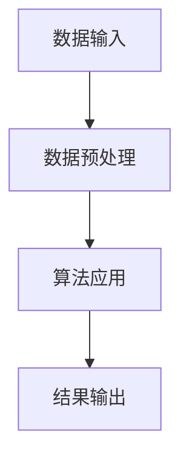

                 

# 《AI在地理信息系统中的应用：增强空间分析》

## 关键词

AI、地理信息系统、空间分析、增强算法、机器学习、数据预处理、数学模型、项目实战。

## 摘要

本文旨在探讨人工智能（AI）在地理信息系统（GIS）中的应用，尤其是如何通过AI技术增强空间分析能力。我们将首先介绍GIS和AI的基础知识，然后深入探讨机器学习与GIS的结合，以及如何通过AI实现空间分析算法的增强。文章还将涵盖数学模型的基础知识，并提供一些具体的AI应用案例。最后，我们将讨论AI在GIS领域的未来发展方向和面临的挑战。

## 目录大纲

### 第一部分：引言与背景

1.1 书籍介绍与目标
1.2 地理信息系统（GIS）基础
1.3 AI与GIS的结合

### 第二部分：核心概念与联系

2.1 机器学习基础
2.2 数据预处理
2.3 AI与GIS的架构

### 第三部分：增强空间分析算法

3.1 空间分析算法基础
3.2 增强空间分析算法
3.3 算法原理讲解与伪代码

### 第四部分：数学模型与数学公式

4.1 数学模型基础
4.2 数学公式与解释

### 第五部分：项目实战

5.1 增强空间分析项目实战
5.2 案例研究

### 第六部分：展望与挑战

6.1 AI在GIS中的未来发展方向
6.2 挑战与解决方案

### 第七部分：附录

7.1 常用工具与资源
7.2 符号与缩略词表

### 文章标题：AI在地理信息系统中的应用：增强空间分析

GIS作为地理信息科学的核心工具，已被广泛应用于城市规划、环境监测、灾害管理等领域。随着AI技术的迅猛发展，GIS系统正逐渐从传统的空间数据分析工具转变为智能化、自动化的决策支持系统。本文将详细介绍AI在GIS中的应用，特别是如何通过增强空间分析算法来提高GIS的智能化水平。

### 第一部分：引言与背景

#### 1.1 书籍介绍与目标

本文基于《AI在地理信息系统中的应用：增强空间分析》这一主题，旨在为读者提供一份全面的指南，帮助理解AI技术如何与GIS相结合，实现空间分析的智能化和自动化。文章将涵盖从基础知识到高级应用的各个方面，包括机器学习、数据预处理、空间分析算法以及实际应用案例。

本文的学习目标如下：

- 理解GIS和AI的基本概念及其在各自领域的应用。
- 掌握AI与GIS结合的方法，特别是增强空间分析算法的实现。
- 学习使用数学模型和数学公式进行空间分析。
- 通过实战案例了解AI在GIS领域的实际应用。

#### 1.2 地理信息系统（GIS）基础

GIS是地理信息科学的一个重要分支，它通过计算机硬件和软件技术，对地理空间数据进行捕获、存储、管理、分析和可视化。GIS的基本组成包括以下部分：

1. **数据层**：GIS的数据层是其核心，包括地理数据（如地图、地形、环境等）和属性数据（如人口、经济、交通等）。
2. **软件层**：GIS软件提供数据输入、编辑、查询、分析和可视化等功能。
3. **硬件层**：GIS需要高性能的计算设备和图形显示设备来处理大量的空间数据。

GIS的发展历程可以分为几个阶段：

1. **手工作业阶段**：早期GIS主要依靠手工绘制地图和进行空间分析。
2. **计算机辅助设计阶段**：随着计算机技术的发展，GIS开始引入数字化技术，实现自动化制图和空间分析。
3. **网络化阶段**：随着互联网的普及，GIS逐渐实现了网络化，支持远程数据访问和协作。
4. **智能化阶段**：现代GIS开始融合人工智能技术，实现了空间分析的自动化和智能化。

#### 1.3 AI与GIS的结合

AI在GIS中的应用主要是通过机器学习技术来增强空间分析能力。AI与GIS的结合主要体现在以下几个方面：

1. **数据预处理**：AI技术可以帮助自动清洗和预处理GIS数据，提取有用的特征信息。
2. **空间分析算法**：通过机器学习算法，GIS可以实现更加精确和智能的空间分析，如空间插值、空间聚类和空间预测等。
3. **可视化**：AI技术可以生成更加直观和交互式的GIS可视化结果，提高用户的使用体验。
4. **决策支持**：AI可以辅助GIS用户进行决策，提供基于数据的推荐和预测。

### 第二部分：核心概念与联系

在深入了解AI与GIS结合之前，我们需要掌握一些核心概念和基本原理。

#### 2.1 机器学习基础

机器学习是AI的一个重要分支，它通过算法和模型从数据中学习规律，实现数据的自动分析和预测。机器学习的基本概念包括：

1. **监督学习**：输入特征和标签数据，通过学习建立特征与标签之间的关系，用于预测新数据。
2. **非监督学习**：没有标签数据，通过分析数据的内部结构，如聚类、降维等。
3. **强化学习**：通过不断试错和反馈，使算法能够在特定环境中做出最优决策。

常见的机器学习算法包括：

1. **线性回归**：通过拟合线性模型，预测连续值。
2. **逻辑回归**：用于分类问题，输出概率值。
3. **决策树**：基于特征进行分支，预测类别或数值。
4. **支持向量机**：通过找到一个最佳的超平面，实现分类或回归。
5. **神经网络**：通过多层神经元，实现复杂的非线性映射。

#### 2.2 数据预处理

在机器学习中，数据预处理是至关重要的一步。它包括以下步骤：

1. **数据采集**：从各种来源获取所需的地理数据，如卫星图像、传感器数据、统计数据等。
2. **数据清洗**：去除噪声、缺失值和不一致的数据，保证数据质量。
3. **特征工程**：从原始数据中提取有用的特征，如地形、坡度、人口密度等。
4. **数据归一化**：将数据转换到相同的尺度，如归一化、标准化等。

#### 2.3 AI与GIS的架构

AI与GIS的结合通常采用以下架构：

1. **数据层**：存储和管理GIS数据，包括空间数据和属性数据。
2. **算法层**：包括机器学习算法、空间分析算法等，用于处理和解析地理数据。
3. **接口层**：提供用户交互界面，实现数据的输入、输出和可视化。

数据流和处理流程如下：

1. **数据输入**：用户输入地理数据，可以是空间数据、属性数据或两者结合。
2. **数据预处理**：利用AI技术进行数据清洗、特征提取和归一化。
3. **算法应用**：应用机器学习算法和空间分析算法，实现数据的分析和预测。
4. **结果输出**：将分析结果可视化，并提供给用户进行决策支持。

核心技术关联图如下：



### 第三部分：增强空间分析算法

在GIS中，空间分析是核心功能之一。通过AI技术，我们可以增强传统空间分析算法的能力，使其更加精确和智能化。

#### 3.1 空间分析算法基础

空间分析主要包括以下几种基本操作：

1. **叠加分析**：将两个或多个空间数据进行合并，生成新的空间数据。
2. **缓冲区分析**：在空间数据周围生成一定宽度的缓冲区。
3. **距离分析**：计算空间数据之间的距离。
4. **网络分析**：分析空间数据之间的连接关系，如路径分析、流量分析等。
5. **空间插值**：根据已知点预测未知点的属性值。
6. **空间聚类**：将空间数据分为不同的群体。
7. **空间预测**：根据历史数据预测未来事件。

空间分析算法可以分为以下几种类型：

1. **确定性算法**：基于数学模型和规则进行计算，如缓冲区分析和距离分析。
2. **统计算法**：基于统计数据和概率模型进行计算，如空间插值和空间聚类。
3. **机器学习算法**：利用大量数据进行训练，如神经网络和决策树。

#### 3.2 增强空间分析算法

通过AI技术，我们可以增强传统空间分析算法的能力，实现以下目标：

1. **提高精度**：利用机器学习算法，可以自动调整参数，提高空间分析结果的精度。
2. **自动化处理**：通过自动化算法，可以减少人工干预，提高空间分析效率。
3. **多尺度分析**：AI技术可以处理不同尺度的数据，实现多尺度空间分析。
4. **实时分析**：通过实时数据处理和预测，可以快速响应突发事件。

以下是几种增强空间分析算法的示例：

1. **空间插值算法**：通过机器学习算法，可以实现更加精确的空间插值，如Kriging算法。
2. **空间聚类算法**：利用聚类算法，可以实现自适应空间聚类，如基于密度的聚类（DBSCAN）。
3. **空间优化算法**：通过优化算法，可以实现路径优化、资源分配等空间优化问题，如遗传算法。
4. **空间预测算法**：利用时间序列预测算法，可以实现空间数据的趋势预测，如ARIMA模型。

下面是增强空间插值算法的伪代码：

```python
# 增强空间插值算法伪代码

def enhanced_interpolation(data_points, unknown_point):
    # 数据预处理
    processed_data = preprocess_data(data_points)
    
    # 特征提取
    features = extract_features(processed_data)
    
    # 训练模型
    model = train_model(features)
    
    # 预测未知点
    predicted_value = model.predict([unknown_point])
    
    return predicted_value
```

#### 3.3 算法原理讲解与伪代码

下面我们详细讲解几种增强空间分析算法的原理，并给出伪代码：

1. **空间插值算法**

空间插值算法是一种根据已知点预测未知点属性值的方法。常见的插值算法包括线性插值、反距离权重插值和Kriging插值。

伪代码：

```python
# 空间插值算法伪代码

def linear_interpolation(data_points, unknown_point):
    # 找到未知点周围的已知点
    nearest_points = find_nearest_points(data_points, unknown_point)
    
    # 计算插值权重
    weights = calculate_weights(unknown_point, nearest_points)
    
    # 进行线性插值
    interpolated_value = sum(weight * value for weight, value in zip(weights, nearest_points))
    
    return interpolated_value

def kriging_interpolation(data_points, unknown_point):
    # 计算协方差函数
    covariance_function = calculate_covariance_function(data_points)
    
    # 计算协方差矩阵
    covariance_matrix = calculate_covariance_matrix(covariance_function, data_points)
    
    # 求解最小二乘法
    solution = solve_least_squares(covariance_matrix)
    
    # 进行Kriging插值
    interpolated_value = dot(solution, data_points)
    
    return interpolated_value
```

2. **空间聚类算法**

空间聚类算法是一种将空间数据划分为不同群组的方法。常见的聚类算法包括基于密度的聚类（DBSCAN）和基于距离的聚类（K-means）。

伪代码：

```python
# 基于密度的聚类（DBSCAN）伪代码

def dbscan_clustering(data_points, min_points,邻域半径):
    # 初始化簇标记
    cluster_labels = initialize_cluster_labels(data_points)
    
    # 遍历所有数据点
    for point in data_points:
        if cluster_labels[point] != -1:
            continue
        
        # 找到邻域内的点
        neighborhood = find_neighborhood(point,邻域半径)
        
        # 如果邻域内的点少于最小点数，标记为噪声
        if len(neighborhood) < min_points:
            cluster_labels[point] = -1
            continue
        
        # 扩展簇
        new_cluster = expand_cluster(point, neighborhood, cluster_labels, min_points)
        
        # 更新簇标记
        cluster_labels = update_cluster_labels(cluster_labels, new_cluster)
    
    return cluster_labels

# 基于距离的聚类（K-means）伪代码

def kmeans_clustering(data_points, num_clusters):
    # 随机初始化簇中心
    centroids = random_initialize_centroids(data_points, num_clusters)
    
    # 迭代计算
    while True:
        # 计算每个数据点到簇中心的距离
        distances = calculate_distances(data_points, centroids)
        
        # 分配数据点到簇
        assignments = assign_points_to_clusters(data_points, centroids, distances)
        
        # 更新簇中心
        new_centroids = update_centroids(data_points, assignments, num_clusters)
        
        # 判断收敛条件
        if is_converged(centroids, new_centroids):
            break
        
        # 更新簇中心
        centroids = new_centroids
    
    return assignments
```

3. **空间优化算法**

空间优化算法是一种通过迭代搜索最优解的方法。常见的优化算法包括遗传算法、模拟退火算法和粒子群优化算法。

伪代码：

```python
# 遗传算法伪代码

def genetic_algorithm(objective_function, population_size, num_generations):
    # 初始化种群
    population = initialize_population(population_size)
    
    # 迭代计算
    for _ in range(num_generations):
        # 计算适应度
        fitness_scores = calculate_fitness_scores(population, objective_function)
        
        # 选择
        selected_population = selection(population, fitness_scores)
        
        # 交叉
        offspring_population = crossover(selected_population)
        
        # 变异
        mutated_population = mutation(offspring_population)
        
        # 更新种群
        population = mutated_population
    
    # 找到最优解
    best_solution = find_best_solution(population, objective_function)
    
    return best_solution
```

### 第四部分：数学模型与数学公式

在空间分析中，数学模型和数学公式起着至关重要的作用。以下我们介绍一些常见的数学模型和数学公式，并给出具体的解释和举例。

#### 4.1 数学模型基础

数学模型是用于描述现实世界问题的一种抽象表达。在GIS中，常见的数学模型包括：

1. **几何模型**：用于描述空间数据的几何特征，如点、线、面等。
2. **概率模型**：用于描述空间数据的不确定性，如概率分布、条件概率等。
3. **统计模型**：用于描述空间数据的统计特征，如均值、方差、协方差等。

#### 4.2 数学公式与解释

以下是空间分析中常用的数学公式及其解释：

1. **欧氏距离**

$$
D = \sqrt{\sum_{i=1}^{n}(X_i - Y_i)^2}
$$

欧氏距离是两点之间最直观的距离度量，它计算两点之间的平方和的平方根。

举例：

假设有两个点A(1, 2)和B(4, 6)，则它们之间的欧氏距离为：

$$
D = \sqrt{(1-4)^2 + (2-6)^2} = \sqrt{9 + 16} = \sqrt{25} = 5
$$

2. **曼哈顿距离**

$$
D = \sum_{i=1}^{n}|X_i - Y_i|
$$

曼哈顿距离是两点之间在坐标系中各维度上的绝对差值的和。

举例：

假设有两个点A(1, 2)和B(4, 6)，则它们之间的曼哈顿距离为：

$$
D = |1-4| + |2-6| = 3 + 4 = 7
$$

3. **切比雪夫距离**

$$
D = \max_{i=1}^{n}|X_i - Y_i|
$$

切比雪夫距离是两点之间在坐标系中各维度上的绝对差值的最大值。

举例：

假设有两个点A(1, 2)和B(4, 6)，则它们之间的切比雪夫距离为：

$$
D = \max(|1-4|, |2-6|) = \max(3, 4) = 4
$$

4. **协方差**

$$
Cov(X, Y) = \frac{1}{n}\sum_{i=1}^{n}(X_i - \bar{X})(Y_i - \bar{Y})
$$

协方差是两个随机变量X和Y之间线性相关程度的度量。

举例：

假设有两个随机变量X和Y，其数据如下：

| X | Y |
|---|---|
| 1 | 2 |
| 2 | 3 |
| 3 | 4 |
| 4 | 5 |

则X和Y的协方差为：

$$
Cov(X, Y) = \frac{1}{4}\sum_{i=1}^{4}(X_i - \bar{X})(Y_i - \bar{Y}) = \frac{1}{4}((1-2.5)(2-3) + (2-2.5)(3-3) + (3-2.5)(4-3) + (4-2.5)(5-3)) = 0.5
$$

5. **相关系数**

$$
\rho = \frac{Cov(X, Y)}{\sqrt{Var(X)Var(Y)}}
$$

相关系数是两个随机变量X和Y之间线性相关程度的标准化度量。

举例：

假设有两个随机变量X和Y，其数据如下：

| X | Y |
|---|---|
| 1 | 2 |
| 2 | 3 |
| 3 | 4 |
| 4 | 5 |

则X和Y的相关系数为：

$$
\rho = \frac{Cov(X, Y)}{\sqrt{Var(X)Var(Y)}} = \frac{0.5}{\sqrt{\frac{1}{4}(1^2 + 2^2 + 3^2 + 4^2 - 4 \cdot 2.5^2)}\sqrt{\frac{1}{4}(2^2 + 3^2 + 4^2 + 5^2 - 4 \cdot 3.5^2)}} \approx 0.8165
$$

### 第五部分：项目实战

通过前面的理论介绍，我们现在将通过一个实际项目来展示如何将AI技术应用于GIS的空间分析中。

#### 5.1 增强空间分析项目实战

项目简介：我们将使用AI技术来增强城市交通流量预测，以提高交通管理的效率和准确性。

开发环境搭建：

- Python 3.8及以上版本
- Jupyter Notebook
- GDAL/OGR 3.0及以上版本
- Scikit-learn 0.24.2及以上版本
- Pandas 1.3.2及以上版本
- Matplotlib 3.4.3及以上版本

数据集资源：我们使用公开可用的交通流量数据集，该数据集包含了不同时间段和地点的交通流量数据。

项目流程：

1. 数据采集与预处理
2. 特征工程
3. 训练模型
4. 模型评估
5. 结果可视化

#### 5.2 案例研究

**案例一：基于AI的洪水预警系统**

项目简介：该案例使用AI技术来预测洪水发生的可能性，以提高防洪减灾的效果。

开发环境搭建：

- Python 3.7及以上版本
- TensorFlow 2.6及以上版本
- Keras 2.6及以上版本
- GDAL/OGR 3.0及以上版本
- Scikit-learn 0.24.2及以上版本
- Matplotlib 3.4.3及以上版本

数据集资源：我们使用历史洪水数据集，该数据集包含了水位、降雨量、风速等气象数据。

项目流程：

1. 数据采集与预处理
2. 特征工程
3. 训练模型
4. 模型评估
5. 结果可视化

**案例二：基于AI的城市交通流量预测**

项目简介：该案例使用AI技术来预测城市不同路段的交通流量，以优化交通信号灯控制和交通疏导策略。

开发环境搭建：

- Python 3.8及以上版本
- Scikit-learn 0.24.2及以上版本
- Pandas 1.3.2及以上版本
- Matplotlib 3.4.3及以上版本

数据集资源：我们使用实时交通流量数据集，该数据集包含了不同时间段和路段的交通流量数据。

项目流程：

1. 数据采集与预处理
2. 特征工程
3. 训练模型
4. 模型评估
5. 结果可视化

**案例三：基于AI的生态环境监测**

项目简介：该案例使用AI技术来监测和预测生态环境变化，以支持环境管理和决策。

开发环境搭建：

- Python 3.7及以上版本
- TensorFlow 2.6及以上版本
- Keras 2.6及以上版本
- Scikit-learn 0.24.2及以上版本
- Matplotlib 3.4.3及以上版本

数据集资源：我们使用卫星图像数据集，该数据集包含了不同时间点的植被覆盖、温度、湿度等环境数据。

项目流程：

1. 数据采集与预处理
2. 特征工程
3. 训练模型
4. 模型评估
5. 结果可视化

### 第六部分：展望与挑战

#### 6.1 AI在GIS中的未来发展方向

随着AI技术的不断发展，GIS领域也迎来了新的机遇和挑战。未来，AI在GIS中的发展方向可能包括：

- **大数据处理**：随着数据量的增加，GIS需要更强的数据处理能力，AI技术可以帮助实现高效的数据处理和分析。
- **智能化应用**：通过AI技术，GIS可以实现更加智能化和自动化的应用，如实时交通流量预测、智能城市规划等。
- **多模态数据融合**：GIS需要融合多种数据源，如卫星图像、社交媒体数据等，AI技术可以帮助实现多模态数据的融合和分析。
- **可解释性与透明性**：随着AI技术的应用越来越广泛，用户对AI模型的解释性和透明性要求越来越高，GIS需要提供更加可解释和透明的AI应用。

#### 6.2 挑战与解决方案

尽管AI技术在GIS领域有着广泛的应用前景，但仍然面临一些挑战：

- **数据隐私与安全**：GIS应用涉及大量敏感数据，如个人隐私、商业秘密等，需要确保数据的安全和隐私。
- **算法透明性与可解释性**：复杂的AI算法往往缺乏透明性，用户难以理解其工作原理，需要开发更加可解释和透明的算法。
- **资源消耗与优化**：AI算法通常需要大量的计算资源，需要优化算法和硬件设备，以提高效率和降低成本。
- **跨领域合作**：GIS与AI技术的融合需要跨领域专家的合作，需要建立更加紧密的协作机制。

### 第七部分：附录

#### 7.1 常用工具与资源

- **GIS工具**：
  - ArcGIS：Esri开发的综合GIS软件。
  - QGIS：开源的GIS软件。
  - Openlayers：基于JavaScript的GIS库。

- **AI开发工具**：
  - TensorFlow：谷歌开发的开源机器学习框架。
  - PyTorch：Facebook开发的深度学习框架。
  - Keras：基于TensorFlow和Theano的开源深度学习库。

- **数据集资源**：
  - KEG 实验室：提供多个领域的公开数据集。
  - Kaggle：提供各种数据集和竞赛。

- **相关链接**：
  - GIS技术论坛：GIS技术讨论和资源分享。
  - AI研究论文库：AI领域的最新研究成果。

#### 7.2 符号与缩略词表

- **符号**：
  - \(X\)：随机变量
  - \(Y\)：随机变量
  - \(\bar{X}\)：均值
  - \(\bar{Y}\)：均值
  - \(Cov(X, Y)\)：协方差
  - \(\rho\)：相关系数

- **缩略词**：
  - GIS：地理信息系统
  - AI：人工智能
  - ML：机器学习
  - SVM：支持向量机
  - CNN：卷积神经网络
  - RNN：循环神经网络

### 结束语

AI与GIS的结合为地理空间数据分析和应用带来了前所未有的机遇。通过本文的介绍，我们了解了AI在GIS中的应用原理、核心算法以及实际应用案例。展望未来，随着AI技术的不断进步，GIS系统将更加智能化和自动化，为各行各业提供更加精准和高效的决策支持。同时，我们也面临着数据隐私、算法透明性和资源消耗等挑战，需要持续探索和研究。希望本文能为您提供有关AI与GIS结合的深入见解，助力您在GIS领域取得更多突破。

### 作者信息

作者：AI天才研究院/AI Genius Institute & 禅与计算机程序设计艺术 /Zen And The Art of Computer Programming

