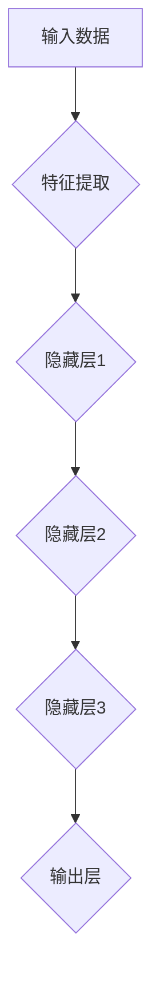
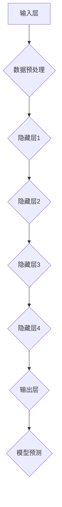

                 

## 1.1.1 AI大模型的概念

AI大模型（Large-scale Artificial Intelligence Model），简称LSAM，是一种拥有数十亿甚至数万亿参数的深度学习模型。它通过大规模数据训练，能够实现对复杂数据模式的捕捉和处理，从而在预测、分类、生成等任务中展现出卓越的性能。

AI大模型的核心思想是通过增加模型参数的规模和深度，提高模型的表达能力，使其能够自动地从数据中学习到更多的特征和规律。与传统的小规模模型相比，AI大模型具有以下几个显著特点：

1. **参数规模巨大**：AI大模型通常拥有数十亿甚至数万亿的参数，这使得模型可以捕捉到数据中的更多细节和复杂模式。

2. **计算资源需求高**：由于参数数量庞大，AI大模型在训练和推理阶段需要大量的计算资源，通常需要使用分布式计算和GPU加速。

3. **强大的泛化能力**：AI大模型通过大规模预训练，积累了丰富的知识，从而在新的任务和数据集上也能表现出较高的泛化能力。

4. **高效的数据处理能力**：AI大模型能够快速地处理大规模数据，提高了数据处理效率。

5. **自动特征提取**：AI大模型可以通过深度学习的方式自动从原始数据中提取高级特征，减轻了人工设计的负担。

### AI大模型与深度学习的关系

AI大模型是深度学习技术发展的重要成果，它与深度学习密切相关。深度学习是一种通过多层神经网络结构对数据进行建模的学习方法。而AI大模型则是深度学习在参数规模和计算资源上的扩展，它在深度学习的基础上，通过增加模型参数的数量和模型的深度，提高了模型的表达能力和处理能力。

深度学习的基本原理是通过多层神经元的连接，对输入数据进行层层提取特征，直到最终生成输出结果。在这个过程中，每一层的神经元都会对输入数据进行一些非线性变换，并通过反向传播算法不断调整权重，使模型能够更好地拟合训练数据。

而AI大模型则在此基础上，通过增加网络的深度和参数的数量，使得模型可以学习到更复杂的特征和模式。这种大规模参数和深层次的网络结构，使得AI大模型在处理大规模数据和高维度特征时，具有更高的效率和准确性。

### AI大模型的应用场景

AI大模型的应用场景非常广泛，几乎涵盖了所有需要复杂数据处理和模式识别的领域。以下是一些典型的应用场景：

1. **计算机视觉**：AI大模型在图像分类、目标检测、图像生成等领域有着广泛的应用。例如，通过使用AI大模型，可以实现高效的图像识别和分类，从而应用于安全监控、医疗诊断、自动驾驶等领域。

2. **自然语言处理**：AI大模型在文本分类、情感分析、机器翻译、文本生成等领域表现出色。例如，通过使用AI大模型，可以实现高效的文本分类和情感分析，从而应用于舆情监测、客户服务、智能助手等领域。

3. **语音识别**：AI大模型在语音识别、语音合成、语音增强等领域有着重要的应用。例如，通过使用AI大模型，可以实现高效的语音识别和语音合成，从而应用于智能音箱、语音助手、智能客服等领域。

4. **推荐系统**：AI大模型在推荐系统中的应用也非常广泛，通过学习用户的兴趣和行为，实现个性化的推荐。例如，通过使用AI大模型，可以实现高效的推荐系统，从而应用于电子商务、社交媒体、在线视频等领域。

### AI大模型的发展历程

AI大模型的发展历程可以分为以下几个阶段：

1. **早期的深度学习**：20世纪80年代至90年代，深度学习技术开始受到关注，但受限于计算资源和数据量，深度学习的发展较为缓慢。

2. **大数据时代的深度学习**：随着互联网和大数据技术的发展，大量数据成为深度学习模型训练的重要资源，深度学习技术开始取得显著进展。

3. **AI大模型的兴起**：2012年，AlexNet在ImageNet竞赛中取得了重大突破，标志着AI大模型的崛起。此后，随着计算资源的提升和数据量的增加，AI大模型在各个领域得到了广泛应用。

4. **现在的AI大模型**：当前的AI大模型已经达到了前所未有的规模和深度，它们在图像识别、自然语言处理、语音识别等领域都取得了显著的成果。

### 总结

AI大模型作为一种拥有大规模参数和深层次结构的深度学习模型，具有强大的数据处理能力和泛化能力。它的发展历程反映了深度学习技术的不断进步和突破。随着计算资源的提升和数据量的增加，AI大模型将继续在各个领域发挥作用，推动人工智能技术的发展。

### 关联概念与架构

为了更好地理解AI大模型，我们需要了解一些与之相关的重要概念和架构。

1. **神经网络**：神经网络是AI大模型的基础，它由多个神经元（节点）组成，每个神经元通过权重与其他神经元相连。神经网络通过层层传递信息，实现对数据的特征提取和模式识别。

2. **深度学习**：深度学习是神经网络的一种扩展，它通过增加网络的深度（层数），提高了模型的表达能力和计算能力。深度学习模型通常由多个隐藏层组成，每层都对输入数据进行特征提取和转换。

3. **卷积神经网络（CNN）**：卷积神经网络是一种专门用于处理图像数据的深度学习模型，它通过卷积操作提取图像中的空间特征。

4. **循环神经网络（RNN）**：循环神经网络是一种用于处理序列数据的深度学习模型，它通过循环结构保持对之前信息的记忆。

5. **Transformer模型**：Transformer模型是一种基于自注意力机制的深度学习模型，它在自然语言处理任务中表现出色，是当前AI大模型发展的一个重要方向。

### Mermaid 流程图

下面是一个简单的Mermaid流程图，展示了神经网络的基本架构：



在这个流程图中，A表示输入数据，经过特征提取（B）后，数据被传递到隐藏层1（C），然后依次传递到隐藏层2（D）和隐藏层3（E），最后在输出层（F）生成预测结果。

### 关键算法

AI大模型的关键算法包括：

1. **反向传播算法（Backpropagation）**：反向传播算法是一种用于训练神经网络的优化算法，它通过计算损失函数关于模型参数的梯度，来更新模型参数，以最小化损失函数。

2. **梯度下降算法（Gradient Descent）**：梯度下降算法是一种用于优化目标函数的迭代算法，它通过不断调整参数，使得损失函数值逐步减小。

3. **卷积算法（Convolution）**：卷积算法是一种用于特征提取的数学操作，它通过在输入数据上滑动卷积核，生成特征图。

4. **自注意力机制（Self-Attention）**：自注意力机制是一种用于处理序列数据的机制，它通过计算序列中每个元素与其他元素的相关性，来生成加权特征。

### 伪代码

下面是一个简单的反向传播算法的伪代码：

```plaintext
// 前向传播
for each layer l from input to hidden layers:
    z[l] = Activation(W[l] * a[l-1] + b[l])

a[hidden] = Activation(z[hidden])

// 反向传播
for each layer l from output to input layers:
    delta[l] = (Activation' (z[l]) * (z[l] - y))

delta[hidden] = (Activation' (z[hidden]) * (z[hidden] - y))

// 更新参数
for each layer l from hidden to input layers:
    dW[l] = dot(delta[l], a[l-1].T)
    db[l] = dot(delta[l], 1)

W[l] = W[l] - learning_rate * dW[l]
b[l] = b[l] - learning_rate * db[l]
```

在这个伪代码中，`Activation`表示激活函数，`Activation'`表示激活函数的导数，`W`和`b`分别是权重和偏置，`a`是激活值，`delta`是误差梯度。

### 数学模型

AI大模型的数学模型主要包括以下几个部分：

1. **输入层到隐藏层的映射**：

   $$z[l] = \sigma(W[l] \cdot a[l-1] + b[l])$$

   其中，$\sigma$表示激活函数，$W[l]$是权重矩阵，$a[l-1]$是前一层的激活值，$b[l]$是偏置向量。

2. **隐藏层到输出层的映射**：

   $$y = \sigma(W[output] \cdot a[hidden] + b[output])$$

   其中，$y$是输出值，$W[output]$是输出层的权重矩阵，$a[hidden]$是隐藏层的激活值，$b[output]$是输出层的偏置向量。

3. **损失函数**：

   $$J = \frac{1}{2} \sum_{i=1}^{n} (\hat{y}_i - y_i)^2$$

   其中，$J$是损失函数，$\hat{y}_i$是模型的预测值，$y_i$是实际的输出值。

4. **反向传播误差计算**：

   $$\delta[l] = \sigma'(z[l]) \cdot (z[l] - y)$$

   其中，$\sigma'$是激活函数的导数，$z[l]$是当前层的激活值，$y$是实际的输出值。

### 示例说明

假设我们有一个简单的神经网络，包含一个输入层、一个隐藏层和一个输出层。输入层有3个神经元，隐藏层有5个神经元，输出层有2个神经元。激活函数使用ReLU函数。

1. **前向传播**：

   输入数据$x = [1, 2, 3]$，隐藏层的权重$W[h] = [w_{11}, w_{12}, ..., w_{15}]$，输出层的权重$W[o] = [w_{21}, w_{22}, ..., w_{24}]$。

   首先计算隐藏层的激活值：
   $$z[h] = ReLU(W[h] \cdot x + b[h])$$

   然后计算输出层的激活值：
   $$z[o] = ReLU(W[o] \cdot z[h] + b[o])$$

2. **反向传播**：

   假设实际的输出值$y = [0.9, 1.1]$，预测的输出值$\hat{y} = z[o]$。

   首先计算输出层的误差：
   $$delta[o] = (z[o] - y) \cdot ReLU'(z[o])$$

   然后计算隐藏层的误差：
   $$delta[h] = (W[o] \cdot delta[o]) \cdot ReLU'(z[h])$$

3. **参数更新**：

   使用学习率$\alpha = 0.01$，更新权重和偏置：
   $$W[h] = W[h] - \alpha \cdot (delta[h] \cdot x^T)$$
   $$W[o] = W[o] - \alpha \cdot (delta[o] \cdot z[h]^T)$$
   $$b[h] = b[h] - \alpha \cdot delta[h]$$
   $$b[o] = b[o] - \alpha \cdot delta[o]$$

通过以上步骤，我们完成了神经网络的一次前向传播和反向传播。这个过程会重复多次，直到模型的损失函数值达到最小。

## 1.1.2 AI大模型的核心特点

AI大模型以其独特的技术特性，在深度学习和人工智能领域中占据着重要地位。以下是AI大模型的核心特点：

1. **高计算能力**：AI大模型通常拥有数十亿甚至数万亿的参数，这意味着在训练和推理过程中需要大量的计算资源。为了满足这一需求，AI大模型通常依赖于高性能计算设备，如GPU和TPU，以及分布式计算技术，以加速模型的训练和推理过程。

2. **高效数据处理**：AI大模型能够处理大规模数据集，这意味着它可以快速地从大量数据中学习到模式。这种高效的数据处理能力主要得益于深度学习中的批处理（Batch Processing）技术，它允许模型在多个数据样本上同时进行训练，从而提高数据处理的速度。

3. **强泛化能力**：AI大模型通过大规模预训练和迁移学习，能够将学到的知识迁移到新的任务和数据集上，从而具有强大的泛化能力。这种能力使得AI大模型在不同领域和任务中都能表现出色，而无需针对每个任务进行重新训练。

4. **强大的特征表达能力**：AI大模型能够自动地从原始数据中提取高级特征，这使得它在处理复杂任务时具有显著的优势。传统机器学习方法通常需要手动设计特征，而AI大模型通过其复杂的网络结构，能够自动地学习到有用的特征，从而简化了特征工程过程。

5. **高可解释性**：尽管AI大模型通常被称为“黑盒”模型，但一些最新的研究正在尝试提高模型的可解释性，使其决策过程更加透明和可理解。例如，通过可视化技术、决策树嵌入和注意力机制，研究人员正在努力揭示AI大模型内部的运作机制。

### 高计算能力

AI大模型的高计算能力是其在处理大规模数据和高维度特征时的重要保障。为了实现这一能力，AI大模型通常采用以下技术：

1. **并行计算**：通过分布式计算，将模型训练任务分解为多个子任务，并在多个计算节点上同时进行计算，从而大大提高计算速度。

2. **GPU加速**：GPU（图形处理单元）具有高度并行计算的能力，这使得它非常适合用于深度学习模型的训练。许多AI大模型都依赖于GPU来加速计算。

3. **TPU加速**：TPU（张量处理单元）是专门为深度学习任务设计的硬件加速器，它具有极高的计算性能，能够显著提高AI大模型的训练速度。

4. **优化算法**：通过改进训练算法，如Adam优化器和SGD（随机梯度下降）算法的变种，可以进一步提高模型的训练效率。

### 高效数据处理

AI大模型的高效数据处理能力使其能够快速地处理大规模数据集，从而在实时分析和决策中发挥重要作用。以下是实现高效数据处理的几个关键步骤：

1. **数据预处理**：在训练前对数据进行清洗、归一化和特征提取，以提高数据质量和模型的训练效率。

2. **批处理**：将数据分成多个批次，每次处理一批数据，从而在减少内存消耗的同时，提高模型的训练速度。

3. **流水线处理**：通过构建数据处理流水线，将数据从输入层到输出层进行高效传输和处理，从而优化数据处理流程。

4. **数据增强**：通过数据增强技术，如旋转、缩放、裁剪等，生成更多的训练样本，提高模型的泛化能力。

### 强泛化能力

AI大模型的强泛化能力是其成功应用的关键因素之一。以下是一些实现强泛化能力的技术：

1. **迁移学习**：通过在大规模数据集上预训练模型，然后将模型迁移到新的任务和数据集上，从而提高模型的泛化能力。

2. **多任务学习**：通过同时训练多个任务，使得模型可以共享知识，从而提高模型的泛化能力。

3. **元学习**：通过训练模型来学习如何快速适应新的任务和数据集，从而实现高效的泛化。

4. **注意力机制**：通过注意力机制，模型可以自动关注数据中的关键信息，从而提高模型的泛化能力。

### 强大的特征表达能力

AI大模型强大的特征表达能力是其处理复杂任务的重要保障。以下是一些实现这一能力的技术：

1. **深度网络结构**：通过增加网络深度，模型可以学习到更加抽象和复杂的特征。

2. **卷积神经网络（CNN）**：CNN通过卷积操作和池化操作，可以有效地提取图像中的局部特征。

3. **循环神经网络（RNN）**：RNN通过循环结构，可以有效地处理序列数据，提取时间序列特征。

4. **Transformer模型**：Transformer模型通过自注意力机制，可以捕捉数据中的长距离依赖关系，从而提高特征表达能力。

### 高可解释性

尽管AI大模型在处理复杂任务时表现出色，但其“黑盒”特性使得其决策过程难以解释。为了提高AI大模型的可解释性，研究人员采用了以下几种技术：

1. **决策树嵌入**：将深度学习模型嵌入到决策树中，使得模型的决策过程更加透明。

2. **可视化技术**：通过可视化技术，如热力图和决策路径图，可以直观地展示模型的学习过程和决策逻辑。

3. **注意力机制**：通过注意力机制，可以直观地展示模型关注的数据区域和特征。

4. **解释性模型**：开发专门的可解释性模型，如LIME和SHAP，可以提供对模型决策的详细解释。

### 总结

AI大模型以其高计算能力、高效数据处理、强泛化能力、强大的特征表达能力和高可解释性，在深度学习和人工智能领域中发挥着重要作用。通过结合多种技术和方法，AI大模型可以应对复杂的数据处理任务，并在各个领域取得突破性进展。

## 1.1.3 AI大模型与传统AI模型的区别

AI大模型与传统AI模型在多个方面存在显著差异，这些差异主要体现在参数数量、计算复杂度、数据处理能力、应用场景和训练时间等方面。

### 参数数量

传统AI模型通常拥有数百或数千个参数，而AI大模型则可以拥有数十亿甚至数万亿个参数。这种参数规模的差异导致了模型结构和性能上的显著区别。传统模型由于参数数量有限，往往只能捕捉数据中的简单关系，而AI大模型则能够处理更加复杂和高度抽象的特征，从而在处理复杂数据集时表现出更高的准确性。

### 计算复杂度

由于AI大模型的参数数量庞大，其计算复杂度也显著高于传统AI模型。传统模型通常可以在较短的时间内完成训练和推理，而AI大模型则需要更长的训练时间，甚至可能需要数天或数周。此外，AI大模型在推理阶段也需要更多的计算资源，这使得它们在实时应用中可能不如传统模型高效。

### 数据处理能力

传统AI模型通常在处理小规模数据集时表现出色，而AI大模型则更适用于处理大规模数据集。AI大模型能够高效地处理大量的数据，并从中提取复杂的模式和特征。这使得AI大模型在图像识别、自然语言处理和推荐系统等需要处理大量数据的应用场景中具有显著优势。

### 应用场景

传统AI模型通常针对特定的应用场景进行优化，例如金融领域的信用评分、医疗领域的疾病诊断等。而AI大模型由于具有更强的泛化能力，可以在多个领域和任务上应用，例如自动驾驶、智能客服、医疗诊断、金融风控等。AI大模型的应用范围更广，且能够适应不同的数据类型和任务需求。

### 训练时间

传统AI模型的训练时间较短，可以在几个小时甚至几分钟内完成。而AI大模型的训练时间通常以天或周计算，这主要是因为其庞大的参数规模和复杂的网络结构。为了加速训练过程，AI大模型通常采用分布式计算和GPU加速等技术。

### 综合比较

AI大模型与传统AI模型在参数数量、计算复杂度、数据处理能力、应用场景和训练时间等方面存在显著差异。AI大模型由于其大规模参数和深度网络结构，能够处理更加复杂和高度抽象的特征，从而在多个领域和任务上表现出色。然而，这也带来了计算资源需求高、训练时间长等挑战。

### 总结

AI大模型与传统AI模型在多个方面存在显著差异，这些差异体现了AI大模型在处理复杂数据和高维度特征时的优势。尽管AI大模型在计算复杂度和训练时间上存在一定挑战，但其在数据处理能力和应用范围上的优势，使其在深度学习和人工智能领域发挥着越来越重要的作用。

## 1.2 AI大模型的架构与组成部分

AI大模型的架构设计是其在复杂任务中表现出色的基础，其组成部分和核心算法共同决定了模型的能力和效率。以下是对AI大模型架构的详细解析。

### 1.2.1 AI大模型的架构设计

AI大模型的架构通常采用深度神经网络（Deep Neural Network, DNN）的结构，其核心设计思想是通过多个层次的神经元连接，实现对输入数据的逐层特征提取和抽象。AI大模型的架构设计主要包括以下几个关键部分：

1. **输入层（Input Layer）**：输入层接收外部数据输入，这些数据可以是图像、文本、音频等不同类型的数据。输入层的主要作用是将原始数据转换成神经网络可以处理的格式。

2. **隐藏层（Hidden Layers）**：隐藏层是神经网络的核心部分，包含多个层次。每一层隐藏层都会对输入数据进行特征提取和转换，提取到更加抽象和复杂的特征。隐藏层的数量和每个层的神经元数量会影响模型的表达能力和训练效果。

3. **输出层（Output Layer）**：输出层产生模型的预测结果，这些结果可以是分类标签、文本、数值等。输出层的设计取决于具体的应用场景，如二分类、多分类、回归等。

4. **神经元（Neurons）**：神经元是神经网络的基本单元，每个神经元都通过权重与其他神经元相连，并执行线性变换和激活函数操作。神经元的激活函数通常是非线性函数，如ReLU、Sigmoid和Tanh，以引入非线性特性。

5. **权重（Weights）**：权重是连接神经元之间的参数，决定了神经网络的输入输出关系。在训练过程中，通过优化算法调整权重，使模型能够更好地拟合训练数据。

6. **偏置（Bias）**：偏置是每个神经元的额外参数，它在训练过程中也不断调整，以改善模型的表现。

### 1.2.2 AI大模型的组成部分

AI大模型的组成部分主要包括数据预处理模块、模型训练模块、模型评估模块和应用模块，以下是对每个组成部分的详细说明：

1. **数据预处理模块**：数据预处理是模型训练的重要步骤，它包括数据清洗、归一化、编码、特征提取等。数据预处理模块的主要作用是确保输入数据的质量和一致性，从而提高模型的训练效果。

2. **模型训练模块**：模型训练是AI大模型的核心环节，通过使用大量的训练数据和优化算法，调整模型的权重和偏置，使模型能够更好地拟合训练数据。常见的训练算法包括梯度下降（Gradient Descent）及其变种，如随机梯度下降（SGD）和Adam优化器。

3. **模型评估模块**：模型评估是验证模型性能的重要步骤，通过在测试数据集上评估模型的预测准确性、召回率、F1分数等指标，可以评估模型的泛化能力。常见的评估方法包括交叉验证、A/B测试和在线评估。

4. **应用模块**：模型部署和应用是将训练好的模型应用于实际任务的关键步骤。应用模块包括模型部署、模型解释和实时更新等。模型部署可以将模型部署到服务器、云端或边缘设备上，以提供实时服务。

### 1.2.3 AI大模型的核心算法

AI大模型的核心算法是实现其高性能和强泛化能力的关键。以下介绍几个重要的核心算法：

1. **反向传播算法（Backpropagation）**：反向传播算法是训练神经网络的基本算法，它通过计算损失函数关于模型参数的梯度，并使用梯度下降算法更新参数，以最小化损失函数。反向传播算法包括前向传播和后向传播两个步骤。

2. **梯度下降算法（Gradient Descent）**：梯度下降算法是一种优化算法，用于调整模型参数以最小化损失函数。常见的梯度下降算法包括批量梯度下降（Batch Gradient Descent）、随机梯度下降（Stochastic Gradient Descent）和Adam优化器。

3. **迁移学习（Transfer Learning）**：迁移学习是一种通过在大规模数据集上预训练模型，然后将模型迁移到新的任务和数据集上的技术。迁移学习可以提高模型的泛化能力和训练效率。

4. **自注意力机制（Self-Attention）**：自注意力机制是一种用于处理序列数据的机制，它通过计算序列中每个元素与其他元素的相关性，生成加权特征。自注意力机制在自然语言处理和计算机视觉领域得到了广泛应用。

5. **卷积神经网络（Convolutional Neural Networks, CNN）**：卷积神经网络是一种专门用于处理图像数据的神经网络，它通过卷积操作提取图像中的局部特征。CNN在计算机视觉领域取得了显著的成果。

6. **循环神经网络（Recurrent Neural Networks, RNN）**：循环神经网络是一种用于处理序列数据的神经网络，它通过循环结构保持对之前信息的记忆。RNN在语音识别、自然语言处理和时间序列预测等领域表现出色。

7. **Transformer模型**：Transformer模型是一种基于自注意力机制的深度学习模型，它在自然语言处理任务中表现出色。Transformer模型通过多头自注意力机制和位置编码，实现了高效的特征提取和序列建模。

### 总结

AI大模型的架构设计包括输入层、隐藏层和输出层，通过神经元、权重和偏置等组成部分实现特征提取和模式识别。AI大模型的核心算法如反向传播算法、梯度下降算法和迁移学习等，进一步提升了模型的能力和效率。通过理解AI大模型的架构和组成部分，可以更好地设计和优化深度学习模型，以应对复杂的数据处理任务。

### Mermaid 流程图

为了更好地理解AI大模型的架构和组成部分，我们可以使用Mermaid流程图来展示其基本架构。以下是AI大模型的简单流程图：



在这个流程图中，A表示输入层，B表示数据预处理模块，C、D、E、F表示隐藏层，G表示输出层，H表示模型预测结果。

### 伪代码

接下来，我们通过伪代码来详细展示AI大模型的核心算法，包括前向传播和反向传播过程。

```plaintext
// 前向传播
// 输入：x (输入数据)，W (权重矩阵)，b (偏置向量)， Activation (激活函数)
for layer in 1 to L:  // L 表示隐藏层数
    z[layer] = x[layer-1] * W[layer] + b[layer]  // z表示激活值
    a[layer] = Activation(z[layer])  // a表示激活后的值

// 反向传播
// 输入：a (激活值)，z (激活值)，W (权重矩阵)， b (偏置向量)， ActivationPrime (激活函数的导数)
delta[L] = (a[L] - y) * ActivationPrime(z[L])  // y表示真实标签
for layer in L-1 down to 1:
    z[layer] = z[layer+1] * W[layer+1] * ActivationPrime(z[layer+1])
    delta[layer] = z[layer] * ActivationPrime(z[layer])

// 更新权重和偏置
for layer in 1 to L:
    dW[layer] = delta[layer] * a[layer-1]
    db[layer] = delta[layer]
    W[layer] = W[layer] - learning_rate * dW[layer]
    b[layer] = b[layer] - learning_rate * db[layer]
```

在这个伪代码中，`x`表示输入数据，`W`表示权重矩阵，`b`表示偏置向量，`Activation`表示激活函数，`ActivationPrime`表示激活函数的导数，`a`表示激活值，`z`表示激活值，`delta`表示误差梯度，`dW`和`db`分别表示权重的梯度。

### 数学模型

AI大模型的数学模型主要包括输入层到隐藏层的映射、隐藏层到输出层的映射、损失函数以及反向传播误差计算等部分。

1. **输入层到隐藏层的映射**：

   $$z[l] = \sigma(W[l] \cdot a[l-1] + b[l])$$
   
   其中，$\sigma$表示激活函数，$W[l]$是权重矩阵，$a[l-1]$是前一层的激活值，$b[l]$是偏置向量。

2. **隐藏层到输出层的映射**：

   $$y = \sigma(W[output] \cdot a[hidden] + b[output])$$

   其中，$y$是输出值，$W[output]$是输出层的权重矩阵，$a[hidden]$是隐藏层的激活值，$b[output]$是输出层的偏置向量。

3. **损失函数**：

   $$J = \frac{1}{2} \sum_{i=1}^{n} (\hat{y}_i - y_i)^2$$

   其中，$J$是损失函数，$\hat{y}_i$是模型的预测值，$y_i$是实际的输出值。

4. **反向传播误差计算**：

   $$\delta[l] = \sigma'(z[l]) \cdot (z[l] - y)$$

   其中，$\sigma'$是激活函数的导数，$z[l]$是当前层的激活值，$y$是实际的输出值。

### 示例说明

假设我们有一个简单的神经网络，包含一个输入层、一个隐藏层和一个输出层。输入层有3个神经元，隐藏层有5个神经元，输出层有2个神经元。激活函数使用ReLU函数。

1. **前向传播**：

   输入数据$x = [1, 2, 3]$，隐藏层的权重$W[h] = [w_{11}, w_{12}, ..., w_{15}]$，输出层的权重$W[o] = [w_{21}, w_{22}, ..., w_{24}]$。

   首先计算隐藏层的激活值：
   $$z[h] = ReLU(W[h] \cdot x + b[h])$$

   然后计算输出层的激活值：
   $$z[o] = ReLU(W[o] \cdot z[h] + b[o])$$

2. **反向传播**：

   假设实际的输出值$y = [0.9, 1.1]$，预测的输出值$\hat{y} = z[o]$。

   首先计算输出层的误差：
   $$delta[o] = (z[o] - y) \cdot ReLU'(z[o])$$

   然后计算隐藏层的误差：
   $$delta[h] = (W[o] \cdot delta[o]) \cdot ReLU'(z[h])$$

3. **参数更新**：

   使用学习率$\alpha = 0.01$，更新权重和偏置：
   $$W[h] = W[h] - \alpha \cdot (delta[h] \cdot x^T)$$
   $$W[o] = W[o] - \alpha \cdot (delta[o] \cdot z[h]^T)$$
   $$b[h] = b[h] - \alpha \cdot delta[h]$$
   $$b[o] = b[o] - \alpha \cdot delta[o]$$

通过以上步骤，我们完成了神经网络的一次前向传播和反向传播。这个过程会重复多次，直到模型的损失函数值达到最小。

## 1.3 AI大模型的发展历程与趋势

AI大模型的发展历程可以分为几个重要阶段，每个阶段都标志着技术上的重大突破和进步。从早期的深度学习模型到当今的AI大模型，这一演变过程不仅展现了技术的前沿发展，也揭示了行业趋势的变化。

### 1.3.1 AI大模型的发展历程

1. **早期的深度学习（1980s-2000s）**：

   在20世纪80年代，神经网络（Neural Networks）的概念被提出，但受限于计算资源和数据量，深度学习的发展较为缓慢。1986年，Rumelhart, Hinton和Williams提出了反向传播算法（Backpropagation），这是一个革命性的突破，使得神经网络可以有效地训练多层网络。

2. **深度学习的复兴（2006年-2012年）**：

   2006年，Hinton等人提出了深度信念网络（Deep Belief Networks），使得深度学习重新受到关注。2012年，Alex Krizhevsky使用AlexNet在ImageNet竞赛中取得了重大突破，使深度学习开始在计算机视觉领域崭露头角。

3. **AI大模型的崛起（2012年至今）**：

   随着计算资源的提升和数据量的爆炸式增长，AI大模型开始崭露头角。2014年，Google的Inception模型在ImageNet竞赛中再次取得了领先成绩。2017年，Google的Transformer模型在自然语言处理领域取得了革命性的进展。

4. **当前的发展趋势（2020年至今）**：

   当前，AI大模型在多个领域继续取得突破，如自动驾驶、智能医疗、金融科技等。随着模型规模的不断扩大，如何优化计算效率和提升模型的可解释性成为研究的热点。

### 1.3.2 AI大模型的发展趋势

1. **模型规模不断扩大**：

   AI大模型的参数规模正在快速增长，从数百万到数十亿甚至数万亿。这种趋势源于模型在大规模数据集上的预训练，以及多任务学习和迁移学习的需求。

2. **计算资源需求增加**：

   随着模型规模的增大，AI大模型对计算资源的需求也在增加。这推动了专用硬件（如TPU和GPU）的发展，以及分布式计算和云计算技术的普及。

3. **多模态数据处理**：

   AI大模型开始处理多种类型的数据，如图像、文本、音频等，实现多模态数据融合和交互。这种趋势使得AI大模型在复杂任务中表现出更高的性能。

4. **模型的可解释性和公平性**：

   为了提高AI大模型的透明性和可解释性，研究人员正在开发各种方法，如可视化技术、决策树嵌入和注意力机制。同时，确保AI大模型在决策过程中公平、无偏见也是一个重要的研究方向。

5. **强化学习与AI大模型的结合**：

   强化学习（Reinforcement Learning）与AI大模型的结合成为研究的热点，这种结合使得AI大模型可以更好地处理具有不确定性和动态变化的复杂环境。

6. **人工智能伦理和法规**：

   随着AI大模型的广泛应用，伦理和法规问题日益突出。如何确保AI大模型的安全、隐私和公平性成为政府和行业关注的焦点。

### 1.3.3 未来AI大模型的发展方向

1. **更高效的计算和优化算法**：

   未来，AI大模型将依赖于更高效的计算和优化算法，如混合精度训练、增量学习和模型剪枝技术，以降低计算成本和提高训练效率。

2. **个性化模型和个性化服务**：

   未来的AI大模型将更加注重个性化服务，通过个性化模型和个性化算法，为用户提供更定制化的解决方案。

3. **跨领域应用**：

   随着技术的成熟，AI大模型将在更多领域得到应用，如智能制造、精准医疗、智慧城市等，实现跨领域的深度融合。

4. **边缘计算和分布式AI**：

   边缘计算和分布式AI技术的发展将使得AI大模型可以在边缘设备上运行，降低延迟和提高实时性。

5. **自动化和智能化**：

   未来，AI大模型将进一步推动自动化和智能化的发展，如自动驾驶、智能客服、自动化生产等，改变生产和生活方式。

### 总结

AI大模型的发展历程展示了深度学习技术的不断进步和突破。随着模型规模的不断扩大和计算资源的提升，AI大模型在各个领域展现出了强大的潜力。未来，AI大模型将继续在个性化、跨领域应用、边缘计算和智能化等方面发挥重要作用，推动人工智能技术的进一步发展。

## 2.1 AI大模型创业的机遇与挑战

AI大模型在近年来已经成为人工智能领域的一个重要研究方向，其在各种应用场景中展现出的强大能力，为创业者带来了前所未有的机遇。然而，与此同时，也伴随着一系列挑战。以下将详细分析AI大模型创业的机遇与挑战，并提供相应的应对策略。

### 2.1.1 AI大模型创业的机遇

1. **市场需求的激增**：

   随着人工智能技术的不断发展，越来越多的行业开始重视AI大模型的应用。例如，在医疗领域，AI大模型可以帮助诊断疾病、个性化治疗方案制定；在金融领域，AI大模型可以用于风险控制、智能投顾；在零售领域，AI大模型可以用于商品推荐、库存管理。这种多样化的需求为AI大模型创业公司提供了广阔的市场空间。

2. **技术创新的推动**：

   AI大模型的崛起离不开技术创新的支持，包括深度学习算法、分布式计算、GPU加速等。这些技术创新不仅提升了AI大模型的性能和效率，也为创业公司提供了丰富的技术工具和资源。通过不断探索和引进新技术，创业公司可以快速提升自身的技术实力和市场竞争力。

3. **资本市场的支持**：

   人工智能是当前全球资本市场的热门投资领域，AI大模型更是受到资本的青睐。无论是风险投资、股权融资还是政府基金，都对AI大模型创业公司提供了大量的资金支持。这为创业公司提供了充足的资金来推动技术研发、市场开拓和团队建设。

4. **数据资源的积累**：

   随着互联网和物联网的发展，大量数据被生成和收集。这些数据不仅为AI大模型的研究提供了丰富的素材，也为创业公司提供了宝贵的数据资源。通过合理利用这些数据，创业公司可以开发出更加精准和高效的AI大模型产品。

### 2.1.2 AI大模型创业的挑战

1. **计算资源需求**：

   AI大模型需要大量的计算资源进行训练和推理。这包括高性能的CPU、GPU和TPU等硬件设备，以及分布式计算和云计算平台。对于创业公司来说，获取和维持这些计算资源是一项巨大的挑战。此外，高昂的计算成本也可能成为创业公司面临的财务压力。

2. **数据隐私和安全**：

   AI大模型在处理数据时，需要确保用户数据的隐私和安全。随着数据隐私法规的日益严格，创业公司需要投入大量资源来确保数据安全，如采用加密技术、访问控制措施等。数据泄露和隐私侵犯不仅可能导致公司声誉受损，还可能面临法律诉讼和罚款。

3. **算法公平性和透明性**：

   AI大模型在决策过程中可能存在偏见和歧视，这要求创业公司在设计和训练模型时，充分考虑算法的公平性和透明性。如何确保模型在不同群体中的表现一致，避免偏见和歧视，是创业公司需要面对的重要问题。

4. **人才短缺**：

   AI大模型的发展需要大量专业人才，包括深度学习研究员、数据科学家、软件工程师等。然而，全球范围内AI人才的供给不足，尤其是顶尖人才稀缺。创业公司需要通过多种途径吸引和留住优秀人才，如提供有竞争力的薪酬、良好的工作环境和职业发展机会。

### 2.1.3 应对创业挑战的策略

1. **计算资源优化**：

   创业公司可以通过以下策略来优化计算资源：

   - **分布式计算**：利用分布式计算技术，将模型训练任务分解到多个计算节点上，以提高训练速度。
   - **GPU和TPU优化**：合理配置GPU和TPU资源，提高计算效率。
   - **云计算平台**：使用云计算平台，如Google Cloud、AWS和Azure等，根据实际需求动态调整计算资源。

2. **数据隐私和安全**：

   创业公司应采取以下措施确保数据隐私和安全：

   - **数据加密**：对敏感数据使用加密技术进行保护。
   - **访问控制**：实施严格的访问控制措施，确保只有授权人员才能访问数据。
   - **数据审计**：定期进行数据审计，确保数据的安全和合规。

3. **算法公平性和透明性**：

   创业公司可以通过以下策略来提高算法公平性和透明性：

   - **数据集多样性**：确保数据集的多样性，避免数据集中的偏见。
   - **算法解释**：开发算法解释工具，帮助用户理解模型的决策过程。
   - **算法测试**：在模型部署前进行全面的算法测试，确保模型在不同群体中的表现一致。

4. **人才招聘与培养**：

   创业公司应采取以下策略来吸引和留住优秀人才：

   - **有竞争力的薪酬**：提供有竞争力的薪酬和福利，吸引顶尖人才。
   - **职业发展机会**：为员工提供良好的职业发展路径，鼓励员工持续学习和成长。
   - **团队文化**：营造积极向上的团队文化，提升员工的工作满意度和归属感。

### 总结

AI大模型创业面临着诸多机遇与挑战。通过深入分析市场需求、技术创新、计算资源、数据隐私、算法公平性以及人才短缺等问题，创业公司可以制定相应的策略，抓住机遇，应对挑战，实现可持续发展。

## 2.2 AI大模型创业的商业模式

AI大模型创业的商业模式设计是创业者实现商业价值的关键。通过合理的商业模式设计，创业公司可以明确其收入模式、价值链分析以及与行业发展趋势的契合程度，从而在竞争激烈的市场中脱颖而出。以下是对AI大模型创业商业模式的详细分析。

### 2.2.1 AI大模型创业的商业模式设计

AI大模型创业的商业模式设计可以多样化，以适应不同的市场需求和行业环境。以下是几种常见的商业模式：

1. **B2B（企业对企业）模式**：

   B2B模式是指创业公司为企业提供定制化的AI大模型解决方案，如智能客服系统、自动化生产系统等。该模式的核心在于为客户提供高价值的服务，帮助企业提升效率和降低成本。

   - **收入模式**：创业公司通过提供技术支持和维护服务，收取年费或订阅费。
   - **价值链分析**：创业公司需要具备强大的技术研发能力和市场运营能力，以吸引和留住客户。

2. **B2C（企业对消费者）模式**：

   B2C模式是指创业公司直接向消费者提供基于AI大模型的应用服务，如智能推荐系统、个性化健康咨询等。该模式的核心在于提供便捷和个性化的用户体验。

   - **收入模式**：创业公司通过广告收入、付费订阅和产品销售等方式获取收入。
   - **价值链分析**：创业公司需要关注用户体验和用户数据的隐私保护，以提高用户满意度和忠诚度。

3. **平台模式**：

   平台模式是指创业公司建立AI大模型服务平台，为开发者提供工具和资源，促进AI大模型应用的开发和推广。

   - **收入模式**：创业公司通过平台服务费、广告收入和交易手续费等方式获取收入。
   - **价值链分析**：创业公司需要建立完善的生态系统，吸引开发者、企业和用户参与，以实现平台的可持续发展。

### 2.2.2 AI大模型创业的收入模式

AI大模型创业的收入模式多种多样，以下是一些常见的收入模式：

1. **服务收费**：

   服务收费是指创业公司为客户提供定制化的AI大模型服务，如预测分析、自动化决策等。客户按需支付费用，创业公司从中获得收入。

2. **产品销售**：

   产品销售是指创业公司将基于AI大模型的软件或硬件产品推向市场，如智能机器人、智能音箱等。通过产品销售，创业公司可以获得一次性收入。

3. **广告收入**：

   广告收入是指创业公司通过在AI大模型应用中投放广告，从广告主处获取收入。该模式适用于B2C模式，通过个性化广告提高广告效果。

4. **订阅模式**：

   订阅模式是指创业公司向用户提供按月或按年订阅的AI大模型服务，如个性化健康咨询、智能推荐系统等。用户通过支付订阅费用，享受创业公司提供的服务。

5. **交易平台收入**：

   交易平台收入是指创业公司通过建立AI大模型服务平台，向开发者收取平台服务费、交易手续费等。该模式适用于平台模式，通过提供技术支持和资源促进应用开发。

### 2.2.3 AI大模型创业的价值链分析

AI大模型创业的价值链分析包括数据采集、数据处理、模型开发、模型部署和应用等环节。以下是对每个环节的详细分析：

1. **数据采集**：

   数据采集是AI大模型创业的基础，创业公司需要通过各种渠道收集大量数据，包括用户行为数据、市场数据、行业数据等。数据的多样性和质量直接影响AI大模型的性能。

2. **数据处理**：

   数据处理包括数据清洗、归一化和特征提取等步骤。创业公司需要开发高效的数据处理流程，以提高数据利用率和模型性能。

3. **模型开发**：

   模型开发是AI大模型创业的核心，创业公司需要利用深度学习算法和自研技术，开发高效的AI大模型。在模型开发过程中，需要关注模型的可解释性和公平性。

4. **模型部署**：

   模型部署是将训练好的AI大模型部署到实际应用中，创业公司需要建立完善的模型部署和运维体系，确保模型的稳定运行。

5. **应用推广**：

   应用推广是AI大模型创业的关键，创业公司需要通过市场推广、合作伙伴关系和用户反馈，不断扩大市场占有率。

### 2.2.4 与行业发展趋势的契合

AI大模型创业需要与行业发展趋势紧密契合，以下是一些关键点：

1. **数字化转型**：

   随着数字化转型的推进，各行各业都在寻求通过AI技术提升业务效率和创新能力。创业公司可以通过提供AI大模型解决方案，助力企业数字化转型。

2. **云计算和大数据**：

   云计算和大数据技术的发展为AI大模型创业提供了丰富的数据资源和计算资源。创业公司可以利用云计算平台和大数据技术，提高AI大模型的性能和应用范围。

3. **物联网和边缘计算**：

   物联网和边缘计算的发展为AI大模型在实时数据处理和智能决策中的应用提供了新的机会。创业公司可以通过开发边缘计算模型，实现AI大模型在物联网设备上的应用。

4. **人工智能伦理和法规**：

   人工智能伦理和法规的发展要求创业公司在设计和应用AI大模型时，充分考虑伦理和法律问题。创业公司需要建立完善的合规体系，确保AI大模型的应用符合相关法规要求。

### 总结

AI大模型创业的商业模式设计需要充分考虑市场需求、技术发展趋势和行业环境。通过合理的商业模式设计和收入模式，创业公司可以抓住机遇，应对挑战，实现商业价值。

## 2.3 AI大模型创业的案例分析

为了更好地理解AI大模型创业的实际操作，以下将介绍两个典型的AI大模型创业案例，分析其成功的原因、失败的原因以及从中可以得出的启示。

### 2.3.1 成功案例一：OpenAI

**公司简介**：OpenAI是一家成立于2015年的美国人工智能研究公司，旨在推动人工智能的发展和应用。OpenAI以其强大的AI大模型研究而闻名，其最著名的项目之一是GPT-3（Generative Pre-trained Transformer 3），这是一个拥有1750亿参数的AI大模型，能够在多个任务上展现出强大的能力。

**成功原因**：

1. **技术创新**：OpenAI始终坚持技术创新，不断推出具有突破性的AI大模型，如GPT-3。这些模型在自然语言处理、文本生成、机器翻译等领域取得了显著成果。

2. **开源策略**：OpenAI采用开源策略，将GPT-3的API免费提供给开发者使用。这种策略不仅吸引了大量的用户和开发者，也推动了AI大模型技术的普及和应用。

3. **广泛合作**：OpenAI与多家科技公司和研究机构建立了合作关系，共同推动AI技术的发展。例如，它与微软合作，在Azure云平台上提供GPT-3的服务。

4. **资本支持**：OpenAI获得了大量资本支持，包括微软、特斯拉等科技巨头。这些资金为OpenAI的研发和运营提供了强有力的保障。

**启示**：

- **技术创新是核心**：AI大模型创业需要持续的技术创新，不断推出具有突破性的产品。
- **开源策略有助于推广**：通过开源，可以吸引更多的开发者和使用者，加速技术的普及。
- **合作是推动发展的关键**：与行业领先企业和研究机构建立合作关系，可以共享资源，共同推动技术进步。
- **资本支持是保障**：充足的资本支持是AI大模型创业的重要保障，有助于技术研发和市场拓展。

### 2.3.2 失败案例二：WOT（Web of Trust）

**公司简介**：WOT（Web of Trust）是一家成立于2006年的网络安全公司，最初提供基于AI的大规模网络监测和评估服务。然而，由于多种原因，WOT在2016年宣布破产。

**失败原因**：

1. **市场定位模糊**：WOT在创业初期未能明确其市场定位，同时提供多种服务，导致客户难以理解其核心价值。

2. **技术不足**：尽管WOT基于AI大模型提供网络安全服务，但其技术未能及时跟进市场变化，难以满足客户需求。

3. **资金短缺**：由于市场定位模糊和技术不足，WOT未能获得足够的收入，导致资金短缺，无法维持正常运营。

4. **竞争激烈**：网络安全市场充满竞争，WOT在面对众多竞争对手时，未能找到有效的市场策略。

**启示**：

- **明确市场定位**：AI大模型创业需要明确其市场定位，提供具有明确价值的服务。
- **持续技术创新**：技术是AI大模型创业的核心，需要持续跟进市场变化，保持技术领先。
- **财务规划**：合理的财务规划是创业成功的重要保障，需要确保有足够的资金支持企业运营。
- **市场策略**：在竞争激烈的市场中，需要制定有效的市场策略，以应对竞争对手。

### 2.3.3 案例总结与启示

通过分析OpenAI和WOT的案例，我们可以得出以下启示：

- **技术创新**：技术创新是AI大模型创业的核心，持续的技术创新能够推动企业的长期发展。
- **市场定位**：明确的市场定位有助于企业集中资源，提供具有明确价值的服务。
- **资本支持**：充足的资本支持是确保企业持续发展的重要保障。
- **合作与竞争**：与行业领先企业和研究机构建立合作关系，可以共享资源，共同推动技术进步；同时，制定有效的市场策略，以应对激烈的市场竞争。

### 总结

成功案例和失败案例都为我们提供了宝贵的经验和启示。在AI大模型创业过程中，技术创新、市场定位、资本支持和市场策略都是关键因素。通过深入分析和总结这些案例，创业者可以更好地规划自己的创业道路，抓住机遇，应对挑战。

## 2.4 AI大模型创业的关键要素

AI大模型创业的成功不仅依赖于技术创新和商业模式设计，还需要在多个关键要素上做出精心规划和管理。以下是AI大模型创业的关键要素及其重要性：

### 2.4.1 人才招聘与培养

1. **重要性**：

   - **技术研发**：AI大模型创业的核心在于技术创新，因此需要招聘和培养具备深度学习、机器学习、数据工程等专业背景的顶尖人才。
   - **项目管理**：项目成功需要高效的项目管理，这要求团队中有具备项目管理经验的专业人士。
   - **市场运营**：市场运营人才有助于产品推广和品牌建设，提高市场知名度。

2. **具体措施**：

   - **招聘策略**：通过猎头、行业招聘网站、校园招聘等多种渠道吸引人才。
   - **培训与发展**：定期组织技术培训和职业发展课程，提升员工技能和职业素养。
   - **激励机制**：建立完善的绩效考核和激励机制，激励员工发挥最大潜力。

### 2.4.2 技术研发与创新

1. **重要性**：

   - **技术优势**：持续的技术研发和创新是AI大模型创业公司的核心竞争力，有助于保持市场领先地位。
   - **产品迭代**：技术创新能够推动产品的不断迭代和优化，满足市场需求。

2. **具体措施**：

   - **研发投入**：确保有足够的资金和资源投入技术研发，建立强大的研发团队。
   - **合作与交流**：与学术机构和行业领先企业建立合作关系，共享技术资源和研究成果。
   - **技术创新**：关注行业前沿技术，持续探索和引入新的算法、架构和工具。

### 2.4.3 资金筹集与运营管理

1. **重要性**：

   - **财务稳定**：充足的资金是保证公司正常运营和持续发展的基础。
   - **投资回报**：合理的资金筹集策略有助于提高投资回报率，实现可持续发展。

2. **具体措施**：

   - **融资渠道**：通过风险投资、股权融资、政府补贴等多种渠道筹集资金。
   - **资金规划**：制定详细的资金使用计划，确保资金使用的合理性和有效性。
   - **财务监控**：建立严格的财务监控体系，确保资金使用的透明度和合规性。

### 2.4.4 数据管理

1. **重要性**：

   - **数据质量**：高质量的数据是训练高效AI大模型的基础。
   - **数据安全**：数据安全是保护用户隐私和企业利益的关键。

2. **具体措施**：

   - **数据采集**：建立规范的数据采集和管理流程，确保数据的准确性和完整性。
   - **数据清洗**：定期进行数据清洗，去除冗余和错误数据，提高数据质量。
   - **数据加密**：采用加密技术保护敏感数据，防止数据泄露。

### 2.4.5 法规与伦理

1. **重要性**：

   - **合规性**：遵守相关法律法规是创业公司生存和发展的基础。
   - **伦理责任**：确保AI大模型的应用符合伦理标准，避免算法偏见和歧视。

2. **具体措施**：

   - **法律顾问**：聘请专业的法律顾问，确保公司行为符合相关法律法规。
   - **伦理培训**：为员工提供伦理培训，提高对伦理问题的认识和敏感性。
   - **透明性**：提高AI大模型的可解释性，使其决策过程更加透明和可信。

### 2.4.6 市场推广

1. **重要性**：

   - **品牌认知**：有效的市场推广有助于提高品牌认知度和市场占有率。
   - **用户反馈**：通过市场推广，可以收集用户反馈，用于产品优化和改进。

2. **具体措施**：

   - **市场营销**：制定全面的市场营销策略，包括线上和线下推广活动。
   - **合作伙伴关系**：与行业合作伙伴建立合作关系，共同推广产品。
   - **用户沟通**：积极与用户沟通，了解用户需求和反馈，提高用户满意度。

### 总结

AI大模型创业的成功不仅依赖于技术创新和商业模式设计，还需要在人才招聘与培养、技术研发与创新、资金筹集与运营管理、数据管理、法规与伦理以及市场推广等多个关键要素上做出精心规划和管理。通过全面考虑这些要素，创业公司可以更好地应对市场挑战，抓住机遇，实现可持续发展。

## 2.5 AI大模型创业的法律与伦理问题

在AI大模型创业的过程中，法律与伦理问题是不可忽视的关键因素。这些问题的处理不仅关乎企业的合规性，还直接影响到企业的声誉、用户信任和长远发展。以下将详细探讨AI大模型创业中可能面临的法律和伦理问题，并提出相应的应对策略。

### 2.5.1 AI大模型创业的法律问题

1. **数据隐私**：

   - **问题**：AI大模型在处理数据时，可能会涉及用户的个人信息，如何确保这些数据的安全和隐私是一个重要的法律问题。
   - **应对策略**：企业应遵守相关的数据保护法规，如《通用数据保护条例》（GDPR）和《加州消费者隐私法案》（CCPA）。采取数据加密、匿名化和访问控制等措施，确保用户数据的安全。
   - **示例**：例如，OpenAI在处理用户数据时，采用了严格的数据加密技术和访问控制措施，确保用户隐私得到保护。

2. **知识产权**：

   - **问题**：AI大模型创业中可能会涉及专利、商标和版权等知识产权问题，如何保护自己的知识产权，避免侵犯他人的知识产权是一个法律挑战。
   - **应对策略**：企业应进行全面的知识产权风险评估，确保其研发的技术和产品不侵犯他人的知识产权。同时，积极申请专利和版权，保护自己的创新成果。
   - **示例**：DeepMind在开发AI大模型时，注重知识产权保护，通过申请多项专利和版权，确保其技术不受侵犯。

3. **法律法规遵守**：

   - **问题**：不同国家和地区的法律法规可能存在差异，如何在全球化背景下遵守各国法律法规是一个挑战。
   - **应对策略**：企业应建立全球合规团队，了解各国法律法规，确保公司在全球范围内的运营合规。必要时寻求专业法律顾问的帮助。
   - **示例**：谷歌在运营全球业务时，成立了全球合规部门，确保其遵守各国的法律法规。

### 2.5.2 AI大模型创业的伦理问题

1. **算法偏见**：

   - **问题**：AI大模型可能会在训练过程中引入偏见，导致算法决策过程中出现性别、种族等方面的歧视。
   - **应对策略**：企业应确保数据集的多样性，避免数据偏见。同时，通过算法验证和审计，发现并纠正算法偏见。
   - **示例**：微软在其AI产品中，采用了算法偏见检测工具，确保其产品在决策过程中公平、无偏见。

2. **公平性**：

   - **问题**：AI大模型在应用过程中，可能会对某些群体产生不公平的影响，例如在招聘、贷款审批等方面。
   - **应对策略**：企业应设计算法时充分考虑公平性，确保算法对不同群体的影响一致。在产品发布前进行广泛的用户测试和反馈，确保其公平性。
   - **示例**：IBM在开发AI大模型时，注重算法的公平性，通过用户反馈和算法验证，确保其产品在不同群体中表现一致。

3. **道德责任**：

   - **问题**：AI大模型在决策过程中可能会产生意想不到的后果，如何确保其承担道德责任是一个重要问题。
   - **应对策略**：企业应建立透明的决策流程，确保AI大模型在决策过程中的透明性和可解释性。同时，建立应急机制，应对可能出现的道德问题。
   - **示例**：Google在其AI产品中，建立了伦理委员会，负责监督AI大模型的应用，确保其承担道德责任。

### 2.5.3 法律与伦理问题的应对策略

1. **法律法规遵守**：

   - **制定合规政策**：企业应制定详细的合规政策，确保所有员工了解并遵守相关法律法规。
   - **定期培训**：定期对员工进行法律法规培训，提高合规意识。
   - **外部审计**：定期聘请外部审计机构进行审计，确保公司的运营合规。

2. **伦理培训**：

   - **伦理课程**：为员工提供伦理课程，提高其对伦理问题的认识。
   - **内部讨论**：定期组织内部讨论，鼓励员工提出和解决伦理问题。
   - **透明决策**：确保决策过程的透明性，提高决策的可解释性。

3. **技术优化**：

   - **算法优化**：通过优化算法，减少偏见和歧视。
   - **模型验证**：建立模型验证机制，确保模型的公平性和准确性。
   - **持续监控**：对AI大模型进行持续监控，及时发现和纠正潜在问题。

### 总结

AI大模型创业的法律与伦理问题是企业必须面对的挑战。通过遵守法律法规、加强伦理培训和技术优化，企业可以确保其AI大模型的应用合规、公平和透明。这不仅有助于企业的长期发展，也有助于提升用户的信任和满意度。

## 3.1 未来行业发展趋势分析

未来行业的发展趋势将深刻影响AI大模型创业的机遇与挑战。以下分析全球和中国行业的发展趋势，以及这些趋势对AI大模型创业的影响。

### 3.1.1 全球行业发展趋势

1. **数字化**：

   全球各行各业都在加速数字化进程，以提升效率、降低成本和增强创新能力。数字化转型不仅涉及企业内部流程的优化，还涉及供应链管理、客户关系管理、市场推广等各个环节。AI大模型在数字化过程中发挥着重要作用，如通过智能预测、自动化决策和个性化推荐等，帮助企业实现数字化转型。

2. **智能化**：

   智能化是未来行业发展的核心趋势之一。随着AI技术的不断进步，越来越多的设备和系统开始实现智能化。例如，智能制造、智能物流、智能医疗等领域的快速发展，为AI大模型提供了广阔的应用场景。AI大模型在智能化转型中，不仅能够提升生产效率和医疗质量，还能优化资源分配和服务体验。

3. **云计算**：

   云计算技术的快速发展，为AI大模型提供了强大的计算和存储支持。通过云计算平台，企业可以灵活地调整计算资源，实现高效的数据处理和模型训练。此外，云计算还促进了AI大模型的共享和协作，使得更多的企业能够利用AI技术，提升业务竞争力。

4. **物联网**：

   物联网（IoT）技术的广泛应用，使得海量设备和传感器能够互联，实现实时数据采集和智能决策。AI大模型在物联网领域中的应用，如智能监控、智能交通、智能家居等，正在不断扩展。通过AI大模型，物联网设备可以更好地理解环境变化，提供个性化的服务和解决方案。

5. **人工智能伦理和法规**：

   随着AI技术的发展，伦理和法规问题日益突出。全球各国纷纷出台相关法律法规，规范AI技术的研究和应用。例如，数据隐私保护、算法公平性、透明性等成为监管的重点。AI大模型创业公司需要密切关注这些法规变化，确保其产品的合规性，以避免法律风险。

### 3.1.2 中国行业发展趋势

1. **新兴产业**：

   中国政府积极推动新兴产业的发展，如5G、人工智能、新能源等。这些产业为AI大模型创业提供了巨大的市场空间和发展机遇。例如，在5G时代，AI大模型可以应用于智能终端、智能网联汽车等领域；在新能源领域，AI大模型可以优化能源管理、提高能源利用效率。

2. **制造业智能化升级**：

   中国制造业正经历智能化升级，通过引入AI技术，提升生产效率和产品质量。AI大模型在智能制造中的应用，如设备故障预测、生产流程优化、供应链管理等，正在逐渐普及。这为AI大模型创业公司提供了丰富的应用场景和合作机会。

3. **数字化转型**：

   中国政府大力推动传统行业的数字化转型，鼓励企业通过数字化技术提升竞争力。AI大模型在数字化转型中发挥着关键作用，如通过数据分析、智能决策等，帮助企业优化业务流程、提高运营效率。

4. **政策和法规**：

   中国政府出台了一系列政策和法规，支持AI技术的发展和应用。例如，《新一代人工智能发展规划》明确了人工智能发展的目标和路径，为AI大模型创业提供了政策保障。同时，中国也加强了对数据隐私和安全、算法公平性等方面的监管，要求企业遵守相关法规。

### 3.1.3 行业发展趋势对AI大模型创业的影响

1. **市场机遇**：

   全球和中国行业的发展趋势，为AI大模型创业提供了广阔的市场空间。数字化转型、智能化升级和物联网应用等，都为AI大模型创造了大量的应用场景和需求。创业公司可以通过技术创新和商业模式创新，抓住这些市场机遇，实现快速发展。

2. **竞争压力**：

   行业发展趋势也带来了激烈的竞争压力。随着越来越多的企业进入AI领域，市场竞争愈发激烈。创业公司需要不断提升自身的技术能力和市场竞争力，以在竞争中脱颖而出。

3. **合作机会**：

   行业发展趋势为创业公司提供了广泛的合作机会。通过与行业领先企业、研究机构和政府部门的合作，创业公司可以共享资源、共担风险，共同推动技术进步和市场拓展。

4. **法规挑战**：

   随着AI技术的广泛应用，相关法规和伦理问题日益突出。创业公司需要密切关注法规变化，确保其产品的合规性，以避免法律风险。同时，创业公司也需要在产品设计过程中充分考虑伦理问题，提高产品的可解释性和透明性。

### 总结

未来行业的发展趋势为AI大模型创业带来了巨大的机遇和挑战。创业公司需要紧跟行业发展趋势，抓住市场机遇，同时应对竞争压力和法规挑战。通过技术创新、商业模式创新和合规经营，创业公司可以在AI大模型创业的道路上走得更远。

## 3.2 未来AI大模型创业的发展方向

未来AI大模型创业的发展方向将受到技术进步、市场需求和行业变化的共同影响。以下分析未来AI大模型创业的发展方向，探讨这些方向带来的新机遇和挑战。

### 3.2.1 未来AI大模型的发展方向

1. **更大规模的模型**：

   随着计算资源的不断提升，未来AI大模型将向更大规模发展。例如，谷歌的Megatron-Turing Universal Encoder（MTU）模型已经达到了1.75万亿参数。更大规模的模型将能够处理更复杂的任务，捕捉更细微的特征，从而提高模型的性能。

2. **更高效的算法和架构**：

   为了应对更大规模模型的需求，未来将出现更多高效的算法和架构。例如，基于Transformer的自注意力机制将继续发展，同时也会有新的结构设计，如多级Transformer、可扩展Transformer等，以优化模型的计算效率和存储需求。

3. **跨模态和多任务学习**：

   未来AI大模型将具备更强的跨模态和多任务学习能力。通过结合文本、图像、音频等多种数据类型，AI大模型可以实现更复杂的任务，如多模态交互、视频理解、实时翻译等。多任务学习将使得模型能够同时处理多个任务，提高资源的利用效率。

4. **可解释性和透明性**：

   随着AI大模型的应用越来越广泛，用户对模型的可解释性和透明性要求越来越高。未来将出现更多可解释性强的AI大模型，如基于决策树嵌入的可解释性模型、可视化注意力机制等，使得用户能够理解模型的决策过程。

5. **强化学习与AI大模型的结合**：

   强化学习（Reinforcement Learning，RL）与AI大模型的结合将成为未来的重要趋势。AI大模型可以提供强大的环境模型和策略评估能力，与RL相结合，可以实现更智能、更鲁棒的决策系统，如智能机器人、自动驾驶等。

### 3.2.2 AI大模型创业的新机遇

1. **智能医疗**：

   AI大模型在医疗领域的应用前景广阔，如疾病诊断、药物发现、个性化治疗等。未来，随着更多医疗数据的开放和医疗AI技术的进步，AI大模型将为医疗行业带来革命性的变化。

2. **金融科技**：

   金融行业对AI大模型的需求日益增长，如智能投顾、风险控制、反欺诈等。AI大模型可以提供更精准的风险评估和更高效的决策支持，为金融机构创造更多价值。

3. **自动驾驶**：

   自动驾驶技术的快速发展为AI大模型带来了巨大的机遇。通过AI大模型，自动驾驶系统能够实现更复杂的感知和决策，提高行驶安全性和效率。

4. **教育**：

   在线教育平台和智能学习系统的兴起，为AI大模型在教育领域的应用提供了广阔空间。AI大模型可以提供个性化学习路径、智能评测和教学辅助，提高教育质量和效果。

5. **智能城市**：

   智能城市建设需要大量的AI大模型支持，如交通管理、能源管理、环境监测等。AI大模型可以帮助城市更智能、更高效地运行，提升居民生活质量。

### 3.2.3 未来AI大模型创业的挑战

1. **计算资源需求**：

   AI大模型需要大量的计算资源进行训练和推理，这将对企业的IT基础设施提出更高要求。如何优化计算资源利用，降低计算成本，将成为一个重要的挑战。

2. **数据隐私和安全**：

   AI大模型在处理大量数据时，需要确保用户数据的安全和隐私。随着数据隐私法规的日益严格，企业需要投入更多资源来保障数据安全，如采用加密技术、建立数据安全管理制度等。

3. **算法公平性和透明性**：

   AI大模型的决策过程可能存在偏见和歧视，如何提高算法的公平性和透明性是一个重要挑战。企业需要在模型设计和训练过程中，充分考虑数据多样性、算法验证和用户反馈等因素。

4. **法律法规和伦理**：

   随着AI技术的广泛应用，相关法律法规和伦理问题日益突出。企业需要密切关注法规变化，确保其产品和服务符合法规要求，同时在设计过程中充分考虑伦理问题。

5. **技术竞争**：

   AI大模型创业市场竞争激烈，企业需要不断创新和提升技术，以保持竞争力。同时，如何保护自己的技术成果，避免技术被抄袭或侵权，也是一个重要挑战。

### 总结

未来AI大模型创业将面临新的机遇和挑战。随着技术的进步和市场需求的增长，AI大模型将在多个领域展现出巨大的潜力。然而，企业也需要应对计算资源需求、数据隐私安全、算法公平性、法律法规和伦理等问题，以确保可持续发展。通过技术创新和合规经营，企业可以抓住机遇，应对挑战，实现长期发展。

## 3.3 AI大模型创业的应对策略

在AI大模型创业过程中，面对不断变化的行业趋势和技术挑战，创业者需要制定一系列有效的应对策略，以确保企业能够在激烈的市场竞争中脱颖而出。以下将详细探讨短期、中期和长期的应对策略。

### 3.3.1 短期应对策略

1. **快速迭代产品**：

   在短期内，创业者应注重产品的快速迭代和优化，以满足市场需求和用户反馈。通过敏捷开发方法，企业可以更快地响应市场变化，提高产品的竞争力。

2. **提升技术能力**：

   短期内，创业者应加强技术研发，提升技术团队的实力。通过引进高端人才、合作高校和研究机构，企业可以迅速提升自身的技术水平。

3. **市场推广**：

   短期内的市场推广策略应以扩大品牌知名度和用户基础为目标。通过线上和线下多渠道推广，企业可以提高市场渗透率，增加用户粘性。

4. **资金筹集**：

   在短期内，创业者应积极寻求风险投资、政府补贴和其他资金来源，确保企业有足够的资金支持运营和发展。

### 3.3.2 中期应对策略

1. **商业模式优化**：

   中期内，创业者需要对商业模式进行深入分析，找出盈利点并优化收入结构。通过多元化收入模式，如订阅服务、广告收入、产品销售等，企业可以降低对单一收入来源的依赖。

2. **技术创新**：

   中期是技术创新的重要阶段，创业者应持续关注行业前沿技术，进行技术储备和创新。通过引入新技术和改进现有技术，企业可以保持技术领先地位。

3. **市场拓展**：

   在中期，创业者应逐步拓展市场，开拓新的应用领域和用户群体。通过市场调研和用户分析，企业可以制定有针对性的市场拓展策略。

4. **团队建设**：

   中期是团队建设的关键时期，创业者应注重培养和留住关键人才。通过提供有竞争力的薪酬和福利、职业发展机会和良好的工作环境，企业可以吸引和留住优秀人才。

### 3.3.3 长期应对策略

1. **可持续发展**：

   长期来看，创业者应关注企业的可持续发展。通过建立合理的公司治理结构、优化财务管理和风险控制，企业可以确保长期稳定发展。

2. **国际化战略**：

   长期目标是实现国际化发展。创业者应研究全球市场，制定国际化战略，进入新的市场，开拓国际业务。

3. **生态建设**：

   长期内，创业者应致力于构建生态体系，吸引更多合作伙伴加入。通过开放平台、合作共赢，企业可以构建强大的生态系统，实现资源整合和优势互补。

4. **社会责任**：

   长期发展过程中，企业应积极履行社会责任，如保护环境、支持公益等。这不仅可以提升企业形象，还可以增强企业的社会责任感和使命感。

### 总结

AI大模型创业的应对策略应涵盖短期、中期和长期。短期策略侧重于快速响应市场变化，中期策略关注技术创新和商业模式优化，长期策略则聚焦于可持续发展、国际化战略和生态建设。通过合理的策略规划，企业可以在AI大模型创业的道路上稳步前行，实现长期成功。

## 3.4 未来AI大模型创业的成功案例

在未来AI大模型创业的道路上，已有一些公司通过技术创新和商业模式的创新，成功地抓住了市场机遇。以下将介绍两个典型的成功案例，并从中总结出关键的成功因素和经验教训，为其他创业公司提供借鉴和启示。

### 3.4.1 成功案例一：OpenAI

**公司简介**：OpenAI成立于2015年，是一家专注于人工智能研究与应用的公司。其最著名的项目是GPT-3，这是一个拥有1750亿参数的AI大模型，在自然语言处理、文本生成、机器翻译等领域取得了显著的成果。

**成功因素**：

1. **技术创新**：OpenAI始终坚持技术创新，不断推出具有突破性的AI大模型，如GPT-3。这些模型在性能和功能上处于行业领先地位，吸引了大量用户和开发者。

2. **开源策略**：OpenAI采用开源策略，将GPT-3的API免费提供给开发者使用。这种策略不仅吸引了大量的用户和开发者，也推动了AI大模型技术的普及和应用。

3. **广泛合作**：OpenAI与多家科技公司和研究机构建立了合作关系，共同推动AI技术的发展。例如，它与微软合作，在Azure云平台上提供GPT-3的服务。

4. **资本支持**：OpenAI获得了大量资本支持，包括微软、特斯拉等科技巨头。这些资金为OpenAI的研发和运营提供了强有力的保障。

**经验教训**：

- **技术创新是核心**：持续的技术创新是公司成功的基石。
- **开源策略有助于推广**：通过开源，可以加速技术的普及和应用。
- **合作是推动发展的关键**：与行业领先企业和研究机构建立合作关系，可以共享资源，共同推动技术进步。
- **资本支持是保障**：充足的资本支持有助于企业的长期发展。

### 3.4.2 成功案例二：DeepMind

**公司简介**：DeepMind成立于2010年，是一家专注于人工智能研究的公司，由Demis Hassabis、Shane Legg和Mustafa Suleyman共同创立。其最著名的项目是AlphaGo，这是一个击败世界围棋冠军的AI大模型。

**成功因素**：

1. **技术创新**：DeepMind在AI大模型领域取得了显著的技术突破，特别是在强化学习方面。其自主研发的AlphaGo模型在围棋领域取得了革命性的成果。

2. **应用场景**：DeepMind将AI大模型应用于多个领域，如医疗、能源管理、游戏等。通过实际应用，DeepMind证明了AI大模型在不同领域的潜力。

3. **合作关系**：DeepMind与多家行业领先企业建立了合作关系，如谷歌。这些合作不仅为DeepMind提供了丰富的应用场景，也为其技术研发提供了支持。

4. **人才优势**：DeepMind拥有一支由顶尖科学家和工程师组成的团队，他们在AI大模型领域具有丰富的经验和深厚的技术积累。

**经验教训**：

- **技术创新是核心**：持续的技术创新是公司成功的基石。
- **应用场景多元化**：通过将AI大模型应用于多个领域，可以扩大其应用范围，提高市场竞争力。
- **合作关系**：与行业领先企业和研究机构建立合作关系，可以共享资源，共同推动技术进步。
- **人才优势**：拥有高素质的人才团队，是公司成功的重要因素。

### 总结

通过分析OpenAI和DeepMind的成功案例，我们可以得出以下结论：

- **技术创新**：持续的技术创新是公司成功的核心因素。
- **应用场景**：将AI大模型应用于多个领域，可以扩大其应用范围，提高市场竞争力。
- **合作关系**：与行业领先企业和研究机构建立合作关系，可以共享资源，共同推动技术进步。
- **人才优势**：拥有高素质的人才团队，是公司成功的重要因素。

这些成功因素和经验教训为其他AI大模型创业公司提供了宝贵的参考和启示，有助于他们在未来的创业道路上取得成功。

### 附录 A: AI大模型开发工具与资源

#### AI大模型开发工具

1. **TensorFlow**：
   - **概述**：TensorFlow是由Google开发的开源机器学习框架，适用于各种深度学习应用。
   - **特点**：支持多种编程语言，如Python、C++和Java，具有良好的社区支持和丰富的文档。
   - **使用指南**：[TensorFlow官方文档](https://www.tensorflow.org/tutorials)。

2. **PyTorch**：
   - **概述**：PyTorch是由Facebook开发的开源深度学习框架，以其灵活性和动态计算图而受到广泛欢迎。
   - **特点**：支持Python编程，易于调试，适合研究阶段和快速原型开发。
   - **使用指南**：[PyTorch官方文档](https://pytorch.org/tutorials/)。

3. **Keras**：
   - **概述**：Keras是一个高层次的深度学习API，基于TensorFlow和Theano构建，提供了更简洁的编程接口。
   - **特点**：易于使用，适合快速构建和实验深度学习模型。
   - **使用指南**：[Keras官方文档](https://keras.io/)。

4. **MXNet**：
   - **概述**：MXNet是Apache Software Foundation的一个开源深度学习框架，支持多种编程语言，如Python、R、Scala等。
   - **特点**：支持移动设备和嵌入式系统，具有良好的性能和灵活性。
   - **使用指南**：[MXNet官方文档](https://mxnet.apache.org/docs/stable/quickstart-python.html)。

#### 开源数据集资源

1. **ImageNet**：
   - **概述**：ImageNet是一个包含数百万张图像的数据集，用于图像识别和分类任务。
   - **用途**：广泛用于深度学习模型的训练和评估。
   - **获取方式**：[ImageNet数据集](http://www.image-net.org/）。

2. **CIFAR-10/100**：
   - **概述**：CIFAR-10和CIFAR-100是用于计算机视觉任务的小型数据集，包含32x32像素的彩色图像。
   - **用途**：常用于深度学习模型的训练和验证。
   - **获取方式**：[CIFAR-10/100数据集](https://www.cs.toronto.edu/~kriz/cifar.html)。

3. **COIL-20**：
   - **概述**：COIL-20是一个包含20个类别的图像数据集，每个类别有72张图片。
   - **用途**：用于图像分类和特征提取的研究。
   - **获取方式**：[COIL-20数据集](http://www-i2r2.a-star.edu.sg/real-world-coil100/)。

#### 在线学习平台

1. **Coursera**：
   - **概述**：Coursera是一个在线学习平台，提供各种AI和深度学习的课程。
   - **用途**：学习AI基础知识和最新技术。
   - **课程**：[深度学习课程](https://www.coursera.org/specializations/deeplearning)。

2. **edX**：
   - **概述**：edX是一个非营利性的在线学习平台，提供包括AI和深度学习在内的多个领域的课程。
   - **用途**：学习AI理论和实践技能。
   - **课程**：[深度学习课程](https://www.edx.org/course/deep-learning-ai)。

3. **Udacity**：
   - **概述**：Udacity是一个在线学习平台，提供各种AI和深度学习的纳米学位课程。
   - **用途**：深入掌握AI和深度学习的实战技能。
   - **课程**：[深度学习纳米学位](https://www.udacity.com/course/deep-learning-nanodegree--nd893)。

### 总结

AI大模型开发工具和资源的丰富为开发者提供了广阔的选择空间。通过合理选择和使用这些工具和资源，开发者可以更加高效地进行AI大模型的开发和研究，从而推动人工智能技术的进步和应用。

### 附录 B: AI大模型创业相关政策与法规

#### 各国关于AI大模型创业的相关政策

1. **美国**：
   - **概述**：美国在AI大模型创业方面采取了一系列政策支持措施，鼓励企业创新和应用AI技术。
   - **主要政策**：
     - **《美国人工智能倡议》**：该倡议旨在推动人工智能的研究、开发和应用，提出了一系列具体的行动计划。
     - **《国家人工智能战略》**：该战略明确了人工智能的发展目标，并提出了相关政策和措施，以促进人工智能的发展。

2. **欧盟**：
   - **概述**：欧盟对AI大模型创业持开放态度，并通过多项法规和政策来规范AI技术的应用。
   - **主要政策**：
     - **《人工智能法案》**：该法案旨在确保人工智能系统的透明性、可靠性和安全性，并对AI技术的应用进行监管。
     - **《通用数据保护条例》（GDPR）**：GDPR对个人数据的处理和保护做出了详细规定，对AI大模型创业公司提出了数据隐私保护的要求。

3. **中国**：
   - **概述**：中国政府高度重视人工智能的发展，通过一系列政策和措施来推动AI大模型创业。
   - **主要政策**：
     - **《新一代人工智能发展规划》**：该规划明确了人工智能发展的目标和路径，提出了多项政策措施，以推动人工智能产业的发展。
     - **《数据安全法》**：该法案对数据的收集、存储、处理、传输等环节进行了规范，对AI大模型创业公司的数据安全提出了要求。

#### 各国政策的影响

1. **美国**：
   - **影响**：美国的政策支持措施有助于企业创新和应用AI技术，促进了AI大模型创业的发展。
   - **挑战**：随着政策的逐步实施，AI大模型创业公司需要遵守相关法规，确保其产品和服务符合监管要求。

2. **欧盟**：
   - **影响**：欧盟的政策和法规为AI大模型创业公司提供了明确的监管框架，有助于提高AI技术的透明性和安全性。
   - **挑战**：欧盟的严格数据隐私保护要求可能对企业的数据处理和商业模式产生一定影响。

3. **中国**：
   - **影响**：中国的政策支持措施为AI大模型创业公司提供了良好的发展环境，推动了人工智能产业的快速发展。
   - **挑战**：随着政策的实施，AI大模型创业公司需要遵守相关的法规和规范，确保其产品的合法性和合规性。

#### 总结

各国关于AI大模型创业的相关政策和法规对行业的发展产生了重要影响。通过了解和遵守各国的政策法规，AI大模型创业公司可以确保其产品和服务的合规性，同时抓住市场机遇，推动技术创新和应用。

### 附录 C: AI大模型创业常见问题解答

#### 1. 如何筹集资金？

- **策略**：
  - **风险投资**：寻找愿意投资AI技术的风险投资公司，通过业务计划和模型演示争取投资。
  - **政府补贴**：关注政府提供的科技补贴和创新创业支持项目，申请相关资金。
  - **众筹**：通过Kickstarter、Indiegogo等众筹平台筹集资金，同时提高产品知名度。

- **建议**：
  - **准备充分**：在寻求投资前，准备好详尽的公司计划和财务预测。
  - **展示成果**：通过模型原型、演示和应用案例展示技术实力和商业潜力。

#### 2. 如何保护知识产权？

- **策略**：
  - **专利申请**：对创新技术和产品申请专利，确保技术不被抄袭。
  - **版权登记**：对软件代码、设计文档等进行版权登记，保护知识产权。
  - **保密协议**：与员工和合作伙伴签订保密协议，防止技术泄露。

- **建议**：
  - **提前规划**：在技术开发早期就考虑知识产权保护问题。
  - **专业咨询**：咨询专业律师，确保知识产权保护措施的有效性和合法性。

#### 3. 如何确保数据隐私和安全？

- **策略**：
  - **数据加密**：对存储和传输的数据进行加密，确保数据不被非法访问。
  - **访问控制**：实施严格的访问控制措施，仅允许授权人员访问敏感数据。
  - **安全审计**：定期进行安全审计，及时发现和修复安全漏洞。

- **建议**：
  - **合规性**：遵守相关数据保护法规，如GDPR和CCPA。
  - **透明性**：提高数据处理过程的透明度，增强用户信任。

#### 4. 如何处理算法偏见和歧视？

- **策略**：
  - **多样性数据集**：使用多样性数据集进行训练，避免数据偏见。
  - **算法验证**：对模型进行算法验证，确保在不同群体中的表现一致。
  - **用户反馈**：收集用户反馈，及时调整和优化模型。

- **建议**：
  - **透明性**：提高算法的可解释性，让用户了解模型的决策过程。
  - **多样性**：在团队中引入多样性，避免偏见和歧视。

#### 5. 如何应对技术竞争？

- **策略**：
  - **技术创新**：持续投入技术研发，保持技术领先。
  - **合作与联盟**：与行业领先企业合作，共享资源和市场机会。
  - **快速响应**：密切关注市场动态，快速响应市场需求和技术变化。

- **建议**：
  - **灵活性**：保持公司的灵活性和敏捷性，快速调整战略和产品方向。
  - **持续学习**：鼓励团队持续学习和创新，保持技术竞争力。

### 总结

AI大模型创业涉及多个方面的挑战和机遇，通过了解和应对这些问题，创业公司可以更好地规划和实施其发展战略，实现可持续发展。同时，充分利用各种资源和支持，有助于企业在竞争激烈的市场中脱颖而出。

