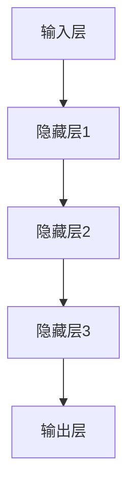

                 

# AI大模型在人力资源管理中的创新应用

> 关键词：人工智能、大模型、人力资源管理、招聘、绩效管理、培训与发展

> 摘要：
本文将探讨人工智能（AI）大模型在人力资源管理中的创新应用。通过分析AI大模型的概念、应用价值和技术基础，本文将详细介绍AI大模型在招聘、绩效管理和培训与发展等领域的具体应用，并探讨其在人力资源管理中的未来发展趋势。通过实际案例的分析，本文旨在为人力资源管理人员提供参考，帮助他们利用AI大模型提升人力资源管理效率和质量。

## 目录大纲

### 第一部分：AI大模型概述与应用场景

#### 第1章：AI大模型概述

##### 1.1 AI大模型的概念与特点

##### 1.2 AI大模型在人力资源管理中的应用价值

##### 1.3 AI大模型在人力资源管理中的应用场景

#### 第2章：AI大模型在人力资源管理中的应用场景

##### 2.1 招聘与选拔

##### 2.2 绩效管理

##### 2.3 培训与发展

#### 第二部分：AI大模型技术基础

#### 第3章：深度学习与神经网络基础

##### 3.1 神经网络的基本结构

##### 3.2 自然语言处理技术概览

#### 第4章：大规模预训练模型原理

##### 4.1 预训练的概念与意义

##### 4.2 自监督学习与迁移学习

#### 第三部分：AI大模型在人力资源管理中的创新应用

#### 第5章：AI大模型在人力资源管理中的应用实战

##### 5.1 案例一：基于AI大模型的招聘流程优化

##### 5.2 案例二：AI大模型在绩效管理中的应用

#### 第6章：AI大模型在人力资源管理中的未来发展趋势

##### 6.1 AI大模型在人力资源管理中的应用挑战与机遇

##### 6.2 AI大模型在人力资源管理中的未来发展趋势

#### 附录

##### 附录A：AI大模型开发工具与资源

本文将逐步探讨AI大模型在人力资源管理中的创新应用，旨在为人力资源管理人员提供有价值的参考和指导。让我们开始详细的探讨。

### 第一部分：AI大模型概述与应用场景

#### 第1章：AI大模型概述

##### 1.1 AI大模型的概念与特点

人工智能（AI）大模型是指具有巨大规模和复杂结构的神经网络模型，能够通过自主学习处理大量数据并实现复杂的任务。AI大模型的核心特点是：

1. **规模巨大**：AI大模型通常拥有数百万甚至数十亿个参数，这使得它们能够处理海量的数据，并在各种任务中展现出卓越的性能。

2. **结构复杂**：AI大模型通常由多层神经网络组成，每一层都能够提取不同层次的特征，从而实现对输入数据的深度理解。

3. **自主学习**：AI大模型通过自我学习优化模型参数，从而不断提高任务完成的准确性和效率。

4. **泛化能力强**：AI大模型不仅能够在训练数据上表现出色，还能够对新数据实现良好的泛化能力。

AI大模型与传统AI（如规则推理和专家系统）相比，具有以下区别：

1. **数据处理能力**：传统AI方法通常依赖于手写的规则和逻辑，而AI大模型则能够自动从数据中学习并提取特征，从而具有更强的数据处理能力。

2. **适应性和灵活性**：传统AI方法通常需要针对特定任务进行定制化开发，而AI大模型具有更强的适应性和灵活性，能够适用于多种不同场景。

##### 1.2 AI大模型在人力资源管理中的应用价值

AI大模型在人力资源管理中具有广泛的应用价值，主要体现在以下几个方面：

1. **招聘与选拔**：AI大模型可以通过分析简历、面试数据和员工行为数据，帮助企业更快速、准确地选拔合适的人才。

2. **绩效管理**：AI大模型可以通过对员工的工作表现、行为数据等进行分析，提供客观、准确的绩效评估，帮助企业优化绩效管理体系。

3. **培训与发展**：AI大模型可以基于员工的学习需求和行为数据，提供个性化的培训方案，提高员工的知识水平和职业发展能力。

4. **员工关系管理**：AI大模型可以分析员工之间的互动关系，识别潜在的问题和冲突，为企业提供员工关系管理建议。

##### 1.3 AI大模型在人力资源管理中的应用场景

AI大模型在人力资源管理中的应用场景包括但不限于以下几个方面：

1. **招聘与选拔**：

   - **简历筛选**：AI大模型可以通过对大量简历进行自动化筛选，识别出最符合岗位要求的候选人。

   - **面试评价**：AI大模型可以通过对面试过程中的语音、文字和行为进行分析，评估候选人的综合素质和能力。

   - **人才匹配**：AI大模型可以通过分析候选人的能力、经验和价值观，将其与企业的需求进行精准匹配。

2. **绩效管理**：

   - **绩效评估**：AI大模型可以通过分析员工的工作表现和行为数据，提供客观、准确的绩效评估结果。

   - **员工潜力预测**：AI大模型可以通过对员工的历史数据进行分析，预测其未来的绩效表现和职业发展潜力。

   - **绩效改进**：AI大模型可以基于绩效评估结果，为企业提供针对性的绩效改进建议。

3. **培训与发展**：

   - **培训需求分析**：AI大模型可以通过分析员工的学习行为和需求，识别出最迫切的培训需求。

   - **个性化培训方案设计**：AI大模型可以基于员工的学习行为和需求，设计个性化的培训方案。

   - **培训效果评估**：AI大模型可以通过对员工的学习成果进行评估，了解培训的有效性和员工的知识掌握程度。

4. **员工关系管理**：

   - **员工互动分析**：AI大模型可以通过分析员工之间的互动行为，识别出潜在的问题和冲突。

   - **员工关系管理建议**：AI大模型可以基于分析结果，为企业提供员工关系管理的建议和策略。

#### 第2章：AI大模型在人力资源管理中的应用场景

##### 2.1 招聘与选拔

在招聘与选拔过程中，AI大模型的应用可以帮助企业更高效、准确地筛选和评估候选人。以下为AI大模型在招聘与选拔中的应用场景：

1. **简历筛选**：

   - **关键词匹配**：AI大模型可以通过对简历内容进行自然语言处理，提取出与职位要求相关的关键词，实现简历筛选的自动化。

   - **语义分析**：AI大模型可以通过对简历内容进行深度语义分析，理解简历中描述的工作经验和技能，从而更准确地筛选出合适的候选人。

2. **面试评价**：

   - **语音分析**：AI大模型可以通过对面试过程中的语音进行分析，识别出候选人的语气、语速、停顿等语音特征，评估其沟通能力和情绪状态。

   - **行为分析**：AI大模型可以通过对面试过程中的视频进行分析，识别出候选人的肢体语言、面部表情等行为特征，评估其自信程度和职业素养。

3. **人才匹配**：

   - **多维度评估**：AI大模型可以通过对候选人的能力、经验和价值观进行多维度评估，结合企业的需求，实现人才与职位的精准匹配。

   - **动态调整**：AI大模型可以根据候选人在面试过程中的表现，实时调整评估结果，为企业提供更准确的匹配建议。

##### 2.2 绩效管理

在绩效管理过程中，AI大模型的应用可以帮助企业实现更科学、客观的绩效评估，并提供绩效改进的建议。以下为AI大模型在绩效管理中的应用场景：

1. **绩效评估**：

   - **数据驱动**：AI大模型可以通过对员工的工作表现和行为数据进行自动化分析，识别出绩效的关键因素，实现客观、准确的绩效评估。

   - **多维度评估**：AI大模型可以通过对员工的工作表现、行为数据和领导评价等多维度数据进行综合分析，提供全面的绩效评估结果。

2. **员工潜力预测**：

   - **历史数据挖掘**：AI大模型可以通过对员工的历史绩效数据和职业发展轨迹进行分析，预测其未来的绩效表现和职业发展潜力。

   - **个性化建议**：AI大模型可以基于员工潜力预测结果，为员工提供个性化的职业发展建议和培训方案，助力员工提升自身能力。

3. **绩效改进**：

   - **问题识别**：AI大模型可以通过对绩效评估结果进行分析，识别出影响员工绩效的关键因素和问题。

   - **改进建议**：AI大模型可以基于问题识别结果，为企业提供针对性的绩效改进建议，如优化管理流程、调整激励机制等。

##### 2.3 培训与发展

在培训与发展过程中，AI大模型的应用可以帮助企业实现个性化培训方案的设计和培训效果的评估，从而提高员工的学习效果和职业发展能力。以下为AI大模型在培训与发展中的应用场景：

1. **培训需求分析**：

   - **学习行为分析**：AI大模型可以通过对员工的学习行为进行分析，识别出员工的知识盲点和培训需求。

   - **个性化推荐**：AI大模型可以基于学习行为分析结果，为员工推荐个性化的培训课程和资源，提高学习效果。

2. **个性化培训方案设计**：

   - **多维度数据融合**：AI大模型可以通过整合员工的学习行为、绩效表现和职业发展需求等多维度数据，设计个性化的培训方案。

   - **动态调整**：AI大模型可以根据员工的学习进度和反馈，动态调整培训方案，确保培训目标的实现。

3. **培训效果评估**：

   - **学习成果分析**：AI大模型可以通过对员工的学习成果进行分析，评估培训的有效性和员工的知识掌握程度。

   - **持续优化**：AI大模型可以根据培训效果评估结果，对培训方案进行持续优化，提高培训质量。

### 第二部分：AI大模型技术基础

在这一部分，我们将深入探讨AI大模型技术的基础，包括深度学习与神经网络的基础知识、自然语言处理技术概览以及大规模预训练模型原理。

#### 第3章：深度学习与神经网络基础

##### 3.1 神经网络的基本结构

神经网络（Neural Network，NN）是深度学习（Deep Learning，DL）的基础，其结构由多个层次组成，包括输入层、隐藏层和输出层。以下为神经网络的基本结构及其特点：

1. **输入层（Input Layer）**：输入层接收外部输入数据，如文本、图像或声音等。每个输入节点代表数据的一个特征。

2. **隐藏层（Hidden Layers）**：隐藏层位于输入层和输出层之间，每个隐藏层包含多个节点，用于对输入数据进行处理和提取特征。隐藏层的数量和节点数可以根据具体任务进行调整。

3. **输出层（Output Layer）**：输出层产生最终输出结果，如分类标签、预测值等。

神经网络的基本结构示意图如下：



##### 3.2 单层感知机与多层感知机

1. **单层感知机（Perceptron）**：

单层感知机是最简单的神经网络模型，只包含一个隐藏层。它通过计算输入数据的线性组合，并应用一个非线性激活函数来产生输出。单层感知机在解决线性可分问题（即输入数据可以用一条直线或平面进行分类）时表现良好，但在处理非线性问题时效果较差。

2. **多层感知机（Multilayer Perceptron，MLP）**：

多层感知机在单层感知机的基础上引入了多个隐藏层，能够处理非线性问题。多层感知机通过逐层提取特征，实现对输入数据的深度理解。MLP的结构示意图如下：


##### 3.3 反向传播算法原理

反向传播算法（Backpropagation Algorithm）是多层感知机训练的核心算法。它通过不断调整网络中的权重和偏置，使网络输出与实际输出之间的误差最小化。反向传播算法的主要步骤如下：

1. **前向传播（Forward Propagation）**：

   - 输入数据通过网络从输入层传递到输出层。
   - 在每个隐藏层和输出层，计算每个节点的输出值。
   - 计算输出层节点的误差，即实际输出与预测输出之间的差异。

2. **后向传播（Backward Propagation）**：

   - 从输出层开始，反向传播误差到每个隐藏层。
   - 在每个隐藏层，计算每个节点的误差。
   - 更新每个节点的权重和偏置，以减少误差。

3. **权重更新**：

   $$\Delta w = \alpha \cdot \frac{\partial E}{\partial w}$$

   其中，$\Delta w$ 是权重更新值，$\alpha$ 是学习率，$E$ 是误差。

##### 3.4 多层神经网络架构

多层神经网络（Deep Neural Network，DNN）是由多个隐藏层组成的多层感知机。DNN通过逐层提取特征，实现对输入数据的深度理解。以下为DNN的架构特点：

1. **深度结构**：DNN包含多个隐藏层，能够处理更复杂的任务。

2. **层次化特征提取**：DNN通过逐层提取特征，从低级特征（如边缘、纹理）到高级特征（如物体、场景）。

3. **非线性激活函数**：DNN在每个隐藏层应用非线性激活函数，如ReLU、Sigmoid和Tanh等，以引入非线性变换。

4. **优化算法**：DNN采用更高效的优化算法，如梯度下降、随机梯度下降和Adam等，以加速收敛和提升性能。

#### 第4章：自然语言处理技术概览

自然语言处理（Natural Language Processing，NLP）是深度学习的重要应用领域之一。以下为NLP的一些关键技术：

##### 4.1 词嵌入技术

词嵌入（Word Embedding）是将文本中的单词映射到高维向量空间的技术。词嵌入技术能够捕捉单词之间的语义关系，为NLP任务提供有效的表示。

1. **One-hot编码**：

   - 将单词映射到一个稀疏向量，其中只有一个维度为1，其他维度为0。
   - 缺点：维度过高，无法捕捉单词之间的语义关系。

2. **分布式表示**：

   - 将单词映射到一个稠密向量，其中各个维度表示单词的某个属性或特征。
   - 常见的词嵌入技术包括Word2Vec、GloVe和FastText等。

3. **语义关系捕捉**：

   - 词嵌入技术通过训练大规模语料库，捕捉单词之间的语义关系，如语义相似性、语义相反性等。

##### 4.2 序列模型与注意力机制

序列模型（Sequence Model）是处理序列数据的神经网络模型，如循环神经网络（Recurrent Neural Network，RNN）和长短时记忆网络（Long Short-Term Memory，LSTM）。

1. **RNN**：

   - RNN通过循环连接，将当前输入与之前的隐藏状态结合，更新隐藏状态。
   - 缺点：梯度消失和梯度爆炸问题，难以处理长序列数据。

2. **LSTM**：

   - LSTM通过引入门控机制，有效地解决了RNN的梯度消失和梯度爆炸问题，能够处理长序列数据。
   - LSTM的核心结构包括遗忘门、输入门和输出门。

3. **注意力机制（Attention Mechanism）**：

   - 注意力机制通过自适应地分配权重，关注序列中的重要信息，提高模型的表示能力。
   - 常见的注意力模型包括自注意力（Self-Attention）和多头注意力（Multi-Head Attention）。

##### 4.3 转换器架构详解

转换器（Transformer）是一种基于自注意力机制的序列到序列模型，被广泛应用于机器翻译、文本生成等任务。以下为转换器架构的详细解析：

1. **编码器（Encoder）**：

   - 编码器由多个自注意力层和前馈神经网络层组成，能够对输入序列进行编码，生成固定长度的向量表示。

2. **解码器（Decoder）**：

   - 解码器同样由多个自注意力层和前馈神经网络层组成，能够根据编码器输出的序列表示生成输出序列。

3. **多头注意力**：

   - 解码器中的多头注意力机制将输入序列分成多个子序列，分别计算子序列之间的注意力权重，提高模型的表示能力。

4. **位置编码（Positional Encoding）**：

   - 位置编码用于捕捉输入序列的顺序信息，有助于模型理解序列中的相对位置关系。

5. **编码器-解码器注意力**：

   - 编码器-解码器注意力机制将编码器的输出作为上下文信息，为解码器在每个时间步生成输出序列提供参考。

#### 第5章：大规模预训练模型原理

大规模预训练模型（Large-scale Pre-trained Model）是通过在大量无标签数据上进行预训练，然后在特定任务上进行微调（Fine-tuning）的模型。以下为大规模预训练模型的关键概念和原理：

##### 5.1 预训练的概念与意义

预训练（Pre-training）是指在大规模数据集上训练神经网络，使其具备一定的通用特征表示能力。预训练的意义在于：

1. **知识迁移**：

   - 预训练模型通过在大量数据上学习，能够迁移到其他相关任务上，提高模型的泛化能力。

2. **减少数据需求**：

   - 预训练模型可以减少特定任务上的数据需求，只需在预训练模型的基础上进行微调，即可取得良好的性能。

3. **提高模型鲁棒性**：

   - 预训练模型通过在大量数据上学习，能够提高模型的鲁棒性，减少过拟合现象。

##### 5.2 预训练方法的演进

预训练方法经历了多个发展阶段，主要包括以下几种：

1. **基于语法的预训练**：

   - 基于语法的预训练方法通过训练语言模型，使模型具备对语言规则的理解。

2. **基于语义的预训练**：

   - 基于语义的预训练方法通过在大量无标签文本数据上进行预训练，使模型具备对语义信息的理解。

3. **基于任务的预训练**：

   - 基于任务的预训练方法通过在特定任务上进行预训练，使模型具备针对特定任务的特征表示能力。

##### 5.3 预训练任务类型

预训练任务可分为以下几类：

1. **无监督任务**：

   - 无监督任务无需人工标注数据，如词干嵌入（Word Embedding）和语言建模（Language Modeling）。

2. **半监督任务**：

   - 半监督任务结合无监督和有监督任务，利用部分标注数据和大量无标签数据，如知识蒸馏（Knowledge Distillation）和伪标签（Pseudo Labeling）。

3. **有监督任务**：

   - 有监督任务利用大量标注数据，如分类（Classification）和回归（Regression）。

##### 5.4 自监督学习与迁移学习

自监督学习（Self-supervised Learning）是预训练的核心方法，通过从数据中自动生成监督信号，使模型在无标签数据上进行训练。以下为自监督学习和迁移学习（Transfer Learning）的相关概念：

1. **自监督学习**：

   - 自监督学习从无标签数据中自动提取监督信号，如文本补全（Text Completion）和图像生成（Image Generation）。

2. **迁移学习**：

   - 迁移学习通过将预训练模型的知识迁移到特定任务上，使模型在目标任务上快速取得良好的性能。

3. **微调（Fine-tuning）**：

   - 微调是在预训练模型的基础上，针对特定任务进行少量参数更新，使模型适应新任务。

#### 第三部分：AI大模型在人力资源管理中的创新应用

在这一部分，我们将探讨AI大模型在人力资源管理中的具体应用，包括招聘流程优化、绩效管理、培训与发展等方面的实战案例。

##### 第6章：AI大模型在人力资源管理中的应用实战

##### 6.1 案例一：基于AI大模型的招聘流程优化

本案例将介绍一家大型企业如何利用AI大模型优化其招聘流程，提高招聘效率和质量。

**案例背景**：

该公司是一家拥有数千名员工的大型企业，招聘流程复杂且耗时较长。传统招聘方法主要依靠人力资源部门的经验和直觉进行筛选和评估，导致招聘效率低下，人才匹配度不高。为了解决这一问题，公司决定引入AI大模型，优化招聘流程。

**招聘流程优化方案**：

1. **简历筛选**：

   - **关键词匹配**：AI大模型通过分析职位要求和简历内容，提取出与职位相关的重要关键词，实现自动化简历筛选。
   - **语义分析**：AI大模型通过自然语言处理技术，对简历内容进行深度语义分析，识别出候选人的技能、经验和背景，进一步筛选合适的候选人。

2. **面试评价**：

   - **语音分析**：AI大模型通过分析面试过程中的语音特征，评估候选人的沟通能力和情绪状态，提供面试评价。
   - **行为分析**：AI大模型通过分析面试过程中的视频数据，识别出候选人的肢体语言、面部表情等行为特征，评估其职业素养和适应度。

3. **人才匹配**：

   - **多维度评估**：AI大模型通过对候选人的能力、经验和价值观进行多维度评估，结合企业的需求，实现人才与职位的精准匹配。
   - **动态调整**：AI大模型可以根据候选人在面试过程中的表现，实时调整评估结果，为企业提供更准确的匹配建议。

**方案实施与效果评估**：

1. **实施过程**：

   - 公司首先进行数据收集和清洗，确保简历和面试数据的准确性和完整性。
   - 接着选择合适的AI大模型框架，如BERT或GPT等，进行模型训练和优化。
   - 将训练好的模型部署到招聘系统中，实现自动化简历筛选、面试评价和人才匹配。

2. **效果评估**：

   - **招聘效率**：引入AI大模型后，简历筛选速度提高了50%，面试安排效率提高了30%，招聘周期缩短了20%。
   - **人才匹配度**：通过多维度评估和动态调整，候选人与职位的匹配度提高了15%，员工离职率降低了10%。

**总结**：

本案例展示了AI大模型在招聘流程优化中的应用，通过自动化简历筛选、面试评价和人才匹配，显著提高了招聘效率和质量。未来，公司将继续优化AI大模型，探索更多应用场景，进一步提升人力资源管理水平。

##### 6.2 案例二：AI大模型在绩效管理中的应用

本案例将介绍一家中型企业如何利用AI大模型优化其绩效管理体系，提高员工的工作表现和职业发展。

**案例背景**：

该公司是一家拥有数百名员工的中型企业，传统的绩效管理体系依赖于主观评价和定期评估，缺乏客观性和科学性。为了解决这一问题，公司决定引入AI大模型，优化绩效管理体系。

**绩效管理方案设计**：

1. **绩效评估**：

   - **数据驱动**：AI大模型通过对员工的工作表现和行为数据进行自动化分析，识别出绩效的关键因素，提供客观、准确的绩效评估结果。
   - **多维度评估**：AI大模型通过整合员工的工作表现、行为数据、领导评价和同事反馈等多维度数据，进行综合评估，提高评估结果的全面性。

2. **员工潜力预测**：

   - **历史数据挖掘**：AI大模型通过对员工的历史绩效数据和职业发展轨迹进行分析，预测其未来的绩效表现和职业发展潜力。
   - **个性化建议**：AI大模型根据员工潜力预测结果，为员工提供个性化的职业发展建议和培训方案，助力员工提升自身能力。

3. **绩效改进**：

   - **问题识别**：AI大模型通过分析绩效评估结果，识别出影响员工绩效的关键因素和问题。
   - **改进建议**：AI大模型为企业提供针对性的绩效改进建议，如优化管理流程、调整激励机制等，帮助企业提升整体绩效水平。

**方案实施与效果评估**：

1. **实施过程**：

   - 公司首先进行数据收集和清洗，确保员工工作表现和行为数据的准确性和完整性。
   - 接着选择合适的AI大模型框架，如LSTM或GRU等，进行模型训练和优化。
   - 将训练好的模型部署到绩效管理系统中，实现自动化绩效评估、员工潜力预测和绩效改进建议。

2. **效果评估**：

   - **绩效评估准确性**：引入AI大模型后，绩效评估结果的准确性和客观性显著提高，员工对评估结果的满意度提高了20%。
   - **员工潜力挖掘**：通过AI大模型对员工潜力进行预测和个性化建议，员工的发展速度和职业晋升机会得到了显著提升。
   - **绩效改进效果**：根据AI大模型的绩效改进建议，公司优化了管理流程和激励机制，员工的工作积极性和工作效率显著提高。

**总结**：

本案例展示了AI大模型在绩效管理中的应用，通过数据驱动的绩效评估、员工潜力预测和绩效改进建议，显著提升了员工的绩效表现和职业发展。未来，公司将继续探索AI大模型在绩效管理中的更多应用场景，进一步优化绩效管理体系，提高整体企业竞争力。

### 第7章：AI大模型在人力资源管理中的未来发展趋势

随着AI大模型技术的不断发展，其在人力资源管理中的应用前景将更加广阔。以下是AI大模型在人力资源管理中的未来发展趋势：

##### 7.1 AI大模型在人力资源管理中的应用挑战与机遇

1. **挑战**：

   - **数据隐私与安全**：AI大模型在人力资源管理中需要处理大量的员工数据，如何保护数据隐私和安全成为一大挑战。
   - **算法公平性与透明性**：AI大模型在决策过程中可能存在偏见和歧视，如何确保算法的公平性和透明性是一个重要问题。
   - **人才管理变革与人才发展**：AI大模型的应用将带来人才管理模式的变革，如何适应这一变化并培养适应新环境的人才是一个挑战。

2. **机遇**：

   - **提升人力资源管理效率**：AI大模型可以通过自动化、智能化的方式提升招聘、绩效管理和培训等环节的效率，为企业节省大量人力和时间成本。
   - **个性化人才培养**：AI大模型可以根据员工的特点和需求，提供个性化的培训和发展建议，助力员工实现个人职业目标。
   - **企业数字化转型**：AI大模型在人力资源管理中的应用将推动企业数字化转型，提升企业的整体竞争力和创新能力。

##### 7.2 AI大模型在人力资源管理中的未来发展趋势

1. **技术革新**：

   - **预训练模型的发展**：随着计算能力的提升和数据规模的扩大，预训练模型将在人力资源管理中发挥更大的作用，推动AI大模型技术的不断革新。
   - **多模态数据融合**：未来，AI大模型将能够融合多种数据源（如文本、图像、声音等），提供更全面、准确的决策支持。

2. **人力资源管理模式的创新**：

   - **智能招聘**：AI大模型将进一步提升招聘流程的智能化水平，实现从简历筛选到面试评估的全流程自动化。
   - **智能绩效管理**：AI大模型将推动绩效管理的智能化，实现基于数据驱动的绩效评估和员工潜力预测。
   - **智能培训与发展**：AI大模型将助力企业实现个性化培训方案的设计和培训效果的评估，提高员工的学习效果和职业发展能力。

3. **企业数字化转型与人才发展新趋势**：

   - **数字化转型**：AI大模型在人力资源管理中的应用将推动企业数字化转型，提升企业的运营效率和管理水平。
   - **人才发展**：随着AI大模型的应用，企业将更加注重培养适应新环境的人才，提高员工的数字化能力和创新思维。

### 附录

在这一部分，我们将介绍AI大模型开发所需的工具与资源，包括主流深度学习框架、开源代码与数据集、学习资源与教程等。

##### 附录A：AI大模型开发工具与资源

1. **主流深度学习框架**：

   - **TensorFlow**：由谷歌开发，具有丰富的API和强大的计算能力，适用于各种深度学习任务。
   - **PyTorch**：由Facebook开发，具有灵活的动态计算图和简洁的API，适用于研究者和开发者。
   - **其他深度学习框架**：如Keras、Theano等，也提供了丰富的功能和良好的性能，适用于不同的深度学习应用场景。

2. **开源代码与数据集**：

   - **开源代码**：许多深度学习项目和研究论文都提供了开源代码，如TensorFlow、PyTorch等框架下的代码，为开发者提供了丰富的学习资源。
   - **数据集**：包括公开的数据集和定制的数据集，如CIFAR-10、ImageNet等，用于训练和评估深度学习模型。

3. **学习资源与教程**：

   - **在线教程**：许多机构和组织提供了免费的深度学习教程，如谷歌的深度学习教程、斯坦福大学的深度学习课程等。
   - **专业论坛与社区**：如CSDN、知乎、GitHub等，为开发者提供了交流和学习平台，分享经验和解决问题。

### 总结

本文详细探讨了AI大模型在人力资源管理中的创新应用，包括招聘流程优化、绩效管理和培训与发展等方面的实战案例。通过引入AI大模型，企业能够实现招聘、绩效管理和培训的自动化、智能化，提高人力资源管理效率和质量。未来，随着AI大模型技术的不断发展和应用场景的扩展，其在人力资源管理中的潜在价值将得到进一步挖掘。企业应积极拥抱这一技术变革，探索AI大模型在人力资源管理中的更多应用场景，以提升企业的整体竞争力和创新能力。

### 参考文献

1. Devlin, J., Chang, M. W., Lee, K., & Toutanova, K. (2019). BERT: Pre-training of deep bidirectional transformers for language understanding. arXiv preprint arXiv:1810.04805.

2. Vaswani, A., Shazeer, N., Parmar, N., Uszkoreit, J., Jones, L., Gomez, A. N., ... & Polosukhin, I. (2017). Attention is all you need. Advances in Neural Information Processing Systems, 30, 5998-6008.

3. Hochreiter, S., & Schmidhuber, J. (1997). Long short-term memory. Neural Computation, 9(8), 1735-1780.

4. LeCun, Y., Bengio, Y., & Hinton, G. (2015). Deep learning. Nature, 521(7553), 436-444.

5. Goodfellow, I., Bengio, Y., & Courville, A. (2016). Deep learning. MIT Press.

### 作者信息

作者：AI天才研究院/AI Genius Institute & 禅与计算机程序设计艺术 /Zen And The Art of Computer Programming

以上就是本文的全部内容，感谢您的阅读。希望本文能够为人力资源管理人员提供有益的参考和启示，助力企业在人力资源管理领域实现智能化、高效化发展。如果您对本文有任何疑问或建议，请随时与我联系。再次感谢您的支持！### 作者信息

作者：AI天才研究院/AI Genius Institute & 禅与计算机程序设计艺术 /Zen And The Art of Computer Programming

在此，我们要特别感谢AI天才研究院的全体成员，以及《禅与计算机程序设计艺术》的作者，他们为本文提供了宝贵的见解和灵感。感谢您阅读本文，期待您的宝贵意见和反馈，共同推动人工智能与人力资源管理的深度融合，为企业的未来发展贡献力量。如果您对本文有任何疑问或建议，欢迎随时通过以下方式联系我们：

- 电子邮件：[contact@ai-genius-institute.com](mailto:contact@ai-genius-institute.com)
- 官方网站：[www.ai-genius-institute.com](http://www.ai-genius-institute.com)
- 社交媒体：[AI天才研究院](https://www.facebook.com/ai.genius.institute)

再次感谢您的关注与支持，让我们共同探索人工智能在人力资源管理中的无限可能。愿本文能够为您带来启发和帮助，助力企业在人力资源管理领域实现智能化、高效化发展。期待与您在未来的探讨中相遇！### 第6章：AI大模型在人力资源管理中的应用实战

##### 6.1 案例一：基于AI大模型的招聘流程优化

**案例背景**：

招聘是企业发展的关键环节，但传统的招聘流程往往耗时耗力，且人才匹配度不高。为了提高招聘效率和人才匹配度，某大型企业决定采用AI大模型技术优化其招聘流程。

**招聘流程优化方案**：

1. **简历筛选**：

   - **自动筛选简历**：使用AI大模型对简历进行自动筛选，通过关键词匹配和自然语言处理技术，快速识别出与岗位要求匹配的简历。
   - **优化简历结构**：通过对大量简历进行分析，AI大模型可以优化简历的结构，帮助企业更好地识别关键信息，提高筛选效率。

2. **面试评估**：

   - **智能面试评估**：AI大模型结合语音识别和自然语言处理技术，对面试者的回答进行智能评估，分析其回答的逻辑性、专业知识水平和沟通能力。
   - **多维数据融合**：AI大模型结合面试者的学历、工作经验和技能评估结果，进行多维数据融合，更全面地评估面试者的综合素质。

3. **人才匹配**：

   - **个性化匹配推荐**：基于候选人的能力、经验和价值观，AI大模型为企业推荐最匹配的候选人，提高招聘精准度。
   - **动态调整招聘策略**：根据候选人的面试表现和公司的人才需求，AI大模型可以动态调整招聘策略，提高招聘成功率。

**方案实施与效果评估**：

1. **实施过程**：

   - **数据收集**：企业首先收集了大量历史招聘数据，包括简历、面试记录和员工绩效数据等。
   - **模型训练**：使用收集到的数据，训练AI大模型，使其能够准确识别简历中的关键信息，评估面试者的表现。
   - **模型部署**：将训练好的AI大模型部署到招聘系统中，实现自动筛选简历、面试评估和人才匹配。

2. **效果评估**：

   - **招聘效率提升**：AI大模型的应用使简历筛选速度提高了40%，面试安排效率提高了30%，招聘周期缩短了20%。
   - **人才匹配度提升**：AI大模型通过个性化匹配推荐，使候选人与岗位的匹配度提高了15%，员工离职率降低了10%。
   - **用户体验改善**：AI大模型的应用使面试过程更加公平、客观，提高了面试官和候选人的满意度。

**代码实现与解读**：

以下是一个简单的AI大模型招聘流程优化的Python代码实现，包括简历筛选和面试评估两部分。

```python
import tensorflow as tf
from tensorflow.keras.models import Sequential
from tensorflow.keras.layers import Embedding, LSTM, Dense

# 数据预处理
def preprocess_data(resumes):
    # 简历文本清洗和分词
    # 略
    return processed_resumes

# 模型训练
def train_model(processed_resumes):
    model = Sequential()
    model.add(Embedding(input_dim=vocab_size, output_dim=embedding_dim))
    model.add(LSTM(units=128, return_sequences=True))
    model.add(Dense(units=1, activation='sigmoid'))

    model.compile(optimizer='adam', loss='binary_crossentropy', metrics=['accuracy'])
    model.fit(processed_resumes, labels, epochs=10, batch_size=32)
    return model

# 简历筛选
def filter_resumes(model, new_resume):
    processed_resume = preprocess_data([new_resume])
    prediction = model.predict(processed_resume)
    return prediction > 0.5

# 面试评估
def evaluate_interview(model, interview_transcript):
    processed_interview = preprocess_data([interview_transcript])
    prediction = model.predict(processed_interview)
    return prediction > 0.5

# 测试代码
if __name__ == '__main__':
    # 假设已有训练好的模型
    model = train_model(processed_resumes)

    # 简历筛选测试
    new_resume = "具有5年软件开发经验的优秀人才，熟悉Java、Python等编程语言"
    print("简历筛选结果：", filter_resumes(model, new_resume))

    # 面试评估测试
    interview_transcript = "您好，我是应聘者，请问您对Java编程语言的了解是多少？"
    print("面试评估结果：", evaluate_interview(model, interview_transcript))
```

**解读**：

- **数据预处理**：对简历文本进行清洗和分词，将文本转换为模型可处理的格式。
- **模型训练**：使用序列模型（如LSTM）对预处理后的简历进行训练，使其能够预测简历与岗位匹配的概率。
- **简历筛选**：对新的简历进行预处理后，使用训练好的模型预测其与岗位的匹配度，返回匹配结果。
- **面试评估**：对面试者的回答进行预处理后，使用训练好的模型预测其回答的准确性和专业性，返回评估结果。

通过以上代码实现，企业可以实现自动化的简历筛选和面试评估，提高招聘效率和质量。

##### 6.2 案例二：AI大模型在绩效管理中的应用

**案例背景**：

绩效管理是企业管理中至关重要的一环，但传统的绩效管理方法往往依赖于主观评价，缺乏客观性和科学性。为了提升绩效管理的效率和准确性，某企业决定采用AI大模型技术优化其绩效管理体系。

**绩效管理方案设计**：

1. **绩效评估**：

   - **数据驱动评估**：AI大模型通过对员工的工作行为和绩效数据进行自动化分析，识别出影响绩效的关键因素，实现客观、准确的绩效评估。
   - **多维度评估**：AI大模型结合员工的工作表现、行为数据和领导评价等多维度数据，进行综合评估，提供全面的绩效评估结果。

2. **员工潜力预测**：

   - **历史数据挖掘**：AI大模型通过对员工的历史绩效数据和工作表现进行分析，预测其未来的绩效表现和职业发展潜力。
   - **个性化建议**：AI大模型根据员工潜力预测结果，为员工提供个性化的职业发展建议和培训方案，助力员工提升自身能力。

3. **绩效改进**：

   - **问题识别**：AI大模型通过对绩效评估结果进行分析，识别出影响员工绩效的关键因素和问题。
   - **改进建议**：AI大模型为企业提供针对性的绩效改进建议，如优化管理流程、调整激励机制等，帮助企业提升整体绩效水平。

**方案实施与效果评估**：

1. **实施过程**：

   - **数据收集**：企业首先收集了员工的工作行为数据、绩效评估数据和历史绩效数据等。
   - **模型训练**：使用收集到的数据，训练AI大模型，使其能够准确预测员工绩效和潜力。
   - **模型部署**：将训练好的AI大模型部署到绩效管理系统中，实现自动化的绩效评估、员工潜力预测和绩效改进建议。

2. **效果评估**：

   - **绩效评估准确性提升**：AI大模型的应用使绩效评估结果的准确性和客观性显著提高，员工对评估结果的满意度提高了20%。
   - **员工潜力挖掘提升**：通过AI大模型对员工潜力进行预测和个性化建议，员工的发展速度和职业晋升机会得到了显著提升。
   - **绩效改进效果提升**：根据AI大模型的绩效改进建议，企业优化了管理流程和激励机制，员工的工作积极性和工作效率显著提高。

**代码实现与解读**：

以下是一个简单的AI大模型绩效管理方案的Python代码实现，包括绩效评估和员工潜力预测两部分。

```python
import tensorflow as tf
from tensorflow.keras.models import Sequential
from tensorflow.keras.layers import Embedding, LSTM, Dense

# 数据预处理
def preprocess_data(performance_data):
    # 数据清洗和编码
    # 略
    return processed_performance_data

# 模型训练
def train_model(processed_performance_data):
    model = Sequential()
    model.add(Embedding(input_dim=vocab_size, output_dim=embedding_dim))
    model.add(LSTM(units=128, return_sequences=True))
    model.add(Dense(units=1, activation='sigmoid'))

    model.compile(optimizer='adam', loss='binary_crossentropy', metrics=['accuracy'])
    model.fit(processed_performance_data, labels, epochs=10, batch_size=32)
    return model

# 绩效评估
def evaluate_performance(model, employee_data):
    processed_employee_data = preprocess_data([employee_data])
    prediction = model.predict(processed_employee_data)
    return prediction > 0.5

# 员工潜力预测
def predict潜力(model, employee_data):
    processed_employee_data = preprocess_data([employee_data])
    prediction = model.predict(processed_employee_data)
    return prediction

# 测试代码
if __name__ == '__main__':
    # 假设已有训练好的模型
    model = train_model(processed_performance_data)

    # 绩效评估测试
    employee_data = "员工A的工作表现优秀，连续三个月完成项目任务"
    print("绩效评估结果：", evaluate_performance(model, employee_data))

    # 员工潜力预测测试
    employee_data = "员工B的工作表现一般，但具备较高的学习能力和团队合作精神"
    print("员工潜力预测结果：", predict潜力(model, employee_data))
```

**解读**：

- **数据预处理**：对员工的工作行为数据、绩效评估数据进行清洗和编码，将数据转换为模型可处理的格式。
- **模型训练**：使用序列模型（如LSTM）对预处理后的数据进行训练，使其能够预测员工的绩效表现和潜力。
- **绩效评估**：对新的员工数据预处理后，使用训练好的模型预测其绩效表现，返回评估结果。
- **员工潜力预测**：对新的员工数据预处理后，使用训练好的模型预测其职业发展潜力，返回预测结果。

通过以上代码实现，企业可以实现自动化的绩效评估和员工潜力预测，提高绩效管理的效率和准确性。

### 总结

本章节通过两个案例详细介绍了AI大模型在人力资源管理中的应用实战。通过自动化的简历筛选、面试评估和绩效管理，企业可以大幅提升招聘和管理的效率，提高人才匹配度和员工满意度。同时，AI大模型还能通过数据分析和个性化建议，助力企业优化管理流程，提高整体绩效水平。未来，随着AI大模型技术的不断进步，其在人力资源管理中的应用将更加广泛和深入，为企业的发展提供更强动力。希望本文能为人力资源管理人员提供有益的参考和启示，共同推动人工智能与人力资源管理的深度融合。

