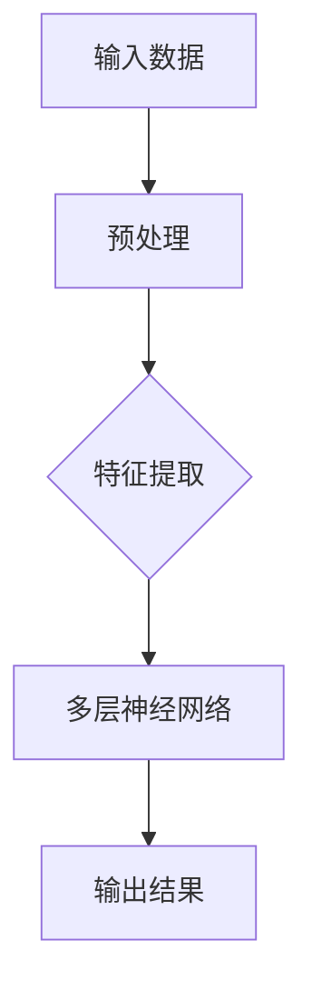
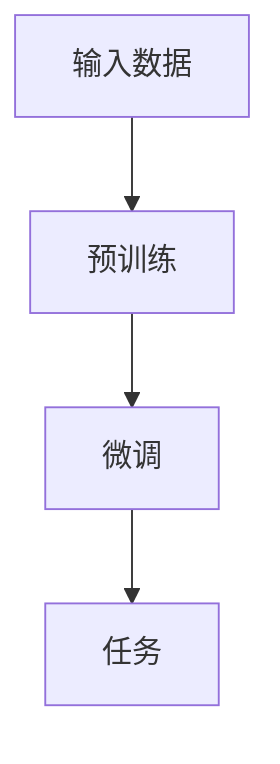

                 

# 《AI大模型在电商平台商品描述优化中的应用》

> 关键词：人工智能，大模型，电商平台，商品描述，优化，自然语言处理，深度学习，预训练模型，生成模型，效果评估

> 摘要：本文探讨了人工智能大模型在电商平台商品描述优化中的应用。首先介绍了AI大模型的基础概念、原理和技术，接着分析了AI大模型在电商平台商品描述优化中的应用场景和实践方法。通过项目实战，详细阐述了商品描述优化的数据处理、模型训练、优化效果评估等关键步骤，并对未来发展趋势与挑战进行了展望。本文旨在为从事电商AI技术应用的研究者和从业者提供有价值的参考。

### 目录大纲

## 第一部分：AI大模型基础

### 第1章: AI大模型概述

#### 1.1 AI大模型的概念与重要性

#### 1.2 AI大模型的原理

#### 1.3 自然语言处理技术

### 第2章: AI大模型技术基础

#### 2.1 深度学习原理

#### 2.2 大规模预训练模型

#### 2.3 语言模型与生成模型

## 第二部分：应用场景与实践

### 第3章: AI大模型在电商平台的应用

#### 3.1 电商平台商品描述优化需求

#### 3.2 AI大模型在商品描述中的应用

#### 3.3 电商平台商品描述优化流程

### 第4章: 数据收集与处理

#### 4.1 数据收集方法

#### 4.2 数据处理与分析

### 第5章: AI大模型训练与优化

#### 5.1 模型训练方法

#### 5.2 模型优化技巧

#### 5.3 模型评估与验证

### 第6章: 商品描述优化效果评估

#### 6.1 优化效果评估方法

#### 6.2 优化效果案例分析

### 第7章: 未来发展趋势与挑战

#### 7.1 AI大模型的发展趋势

#### 7.2 挑战与应对策略

## 第三部分：附录

### 附录A: 相关资源与工具

#### A.1 开发工具与环境配置

#### A.2 学习资源与拓展阅读

### 第1章: AI大模型概述

#### 1.1 AI大模型的概念与重要性

AI大模型（Large-scale AI Models），指的是那些在训练过程中使用海量数据、拥有庞大参数量的人工神经网络模型。这些模型之所以被称为“大”，是因为它们在模型规模、数据规模和计算资源方面都有着显著的优势。

AI大模型在电商平台商品描述优化中的应用具有重要意义。具体来说，它能够实现以下目标：

1. **提高描述质量**：通过学习海量商品描述数据，AI大模型能够生成更加丰富、精准、高质量的描述内容，提升用户购物体验。
2. **降低人力成本**：传统的商品描述需要大量的人力进行撰写和编辑，而AI大模型可以自动化生成描述，降低企业的运营成本。
3. **增强个性化推荐**：AI大模型可以基于用户行为和商品属性，生成个性化的商品描述，提高用户的购买意愿和转化率。
4. **提升搜索匹配度**：通过优化商品描述，AI大模型可以帮助电商平台提高搜索匹配的准确性，提升用户满意度。

#### 1.2 AI大模型的原理

AI大模型的核心是深度学习（Deep Learning），这是一种模拟人脑神经元连接方式的计算模型。深度学习通过多层神经网络结构，对大量数据进行自动特征提取和模型训练，从而实现高度复杂的任务。

以下是AI大模型的基本架构：



**核心算法原理**：

- **深度神经网络（Deep Neural Network, DNN）**：DNN是深度学习的基石，它通过多层全连接神经网络结构，实现对输入数据的映射。

- **优化算法**：常见的优化算法有随机梯度下降（SGD）、Adam等。这些算法通过不断调整网络权重，使得模型能够逼近最优解。

- **正则化技术**：为了防止过拟合，深度学习模型通常会采用正则化技术，如L1和L2正则化。

#### 1.3 自然语言处理技术

自然语言处理（Natural Language Processing, NLP）是AI大模型的重要组成部分，它旨在让计算机理解和处理人类语言。以下是NLP中的关键技术和数学模型：

- **词嵌入（Word Embedding）**：词嵌入将词汇映射为高维向量表示，使得计算机能够理解词汇之间的语义关系。

- **序列模型（Sequence Model）**：序列模型能够处理时间序列数据，如文本序列。常见的序列模型有循环神经网络（RNN）、长短期记忆网络（LSTM）和门控循环单元（GRU）。

- **注意力机制（Attention Mechanism）**：注意力机制可以捕捉输入数据中的关键信息，提高模型的预测能力。

- **生成对抗网络（Generative Adversarial Networks, GAN）**：GAN由生成器和判别器组成，通过对抗训练生成高质量的数据。

**数学模型**：

- **词嵌入**：设$v$为词嵌入向量，$d$为嵌入维度，则词汇$v_i$的向量表示为$v_i \in \mathbb{R}^d$。

- **序列模型**：设$x_t$为时间步$t$的输入序列，$h_t$为时间步$t$的隐藏状态，则序列模型可以表示为$h_t = f(x_t, h_{t-1})$。

- **注意力机制**：设$A$为注意力权重矩阵，$s$为输入序列，则注意力输出可以表示为$y = \text{softmax}(A^T s)$。

### 第2章: AI大模型技术基础

#### 2.1 深度学习原理

深度学习是AI大模型的核心技术，其原理主要包括以下几个方面：

- **神经元与神经网络**：神经元是神经网络的基本单元，通过激活函数实现非线性变换。神经网络由多个神经元组成，通过层次结构实现对输入数据的复杂映射。

- **前向传播与反向传播**：前向传播是数据从输入层流向输出层的过程，反向传播是误差从输出层反向传播到输入层的过程。通过反向传播，模型可以不断调整权重，优化性能。

- **优化算法**：优化算法用于最小化损失函数，使模型达到最优解。常见的优化算法有随机梯度下降（SGD）、Adam等。

- **正则化技术**：正则化技术用于防止过拟合，提高模型的泛化能力。常见的正则化方法有L1和L2正则化。

**伪代码**：

```python
# 前向传播
def forward_pass(inputs, weights, biases):
    outputs = []
    for layer in range(num_layers):
        z = inputs * weights[layer] + biases[layer]
        outputs.append(activation_function(z))
    return outputs

# 反向传播
def backward_pass(deltas, outputs, weights, biases):
    for layer in reversed(range(num_layers)):
        delta = deltas * activation_derivative(outputs[layer])
        weights[layer] -= learning_rate * (delta * inputs)
        biases[layer] -= learning_rate * delta
        inputs = outputs[layer]
```

**数学公式**：

- **损失函数**：$J(\theta) = \frac{1}{m} \sum_{i=1}^{m} \sum_{j=1}^{n} (\theta^{(j)} x_i - y_i)^2$
- **梯度**：$\nabla_\theta J(\theta) = \frac{1}{m} \sum_{i=1}^{m} \nabla_\theta \ell(y_i, \theta^{(j)} x_i)$
- **优化算法**：$θ = θ - α * \nabla_\theta J(θ)$

#### 2.2 大规模预训练模型

大规模预训练模型是AI大模型技术的一个重要分支，其核心思想是在特定任务之前，对模型进行大规模预训练，以提高其泛化能力。以下是大规模预训练模型的关键概念和技术：

- **预训练**：预训练是指在大规模语料库上对模型进行训练，使其能够学习到丰富的语言知识和特征。

- **微调**：微调是指在小规模任务数据集上对预训练模型进行细粒度调整，以适应特定任务。

- **预训练任务**：常见的预训练任务有语言模型（Language Model, LM）和掩码语言模型（Masked Language Model, MLM）。

- **预训练算法**：常见的预训练算法有BERT、GPT等。

**Mermaid流程图**：



**算法原理**：

- **预训练**：预训练模型在大规模语料库上训练，学习到语言的基本规则和语义特征。预训练过程中，模型通过预测输入序列的下一个单词，不断调整参数。

- **微调**：微调过程是在特定任务数据集上进行的。模型在预训练的基础上，通过学习任务数据，进一步调整参数，以适应特定任务。

#### 2.3 语言模型与生成模型

语言模型（Language Model, LM）和生成模型（Generative Model）是AI大模型技术中的重要分支，它们在自然语言处理任务中发挥着重要作用。

- **语言模型**：语言模型用于预测文本序列的概率分布，其目标是生成自然流畅的文本。常见的语言模型有n-gram模型、神经网络语言模型（NNLM）等。

- **生成模型**：生成模型通过学习数据分布，生成新的数据样本。生成对抗网络（GAN）是生成模型的一个典型例子，其由生成器和判别器组成，通过对抗训练生成高质量的数据。

**数学模型**：

- **语言模型**：设$P(w_1, w_2, ..., w_n)$为文本序列的概率分布，则语言模型可以表示为$P(w_1, w_2, ..., w_n) = P(w_1)P(w_2|w_1)P(w_3|w_1, w_2) ... P(w_n|w_1, w_2, ..., w_{n-1})$。

- **生成对抗网络**：生成对抗网络由生成器$G$和判别器$D$组成，生成器$G$的目标是生成与真实数据分布相近的数据，判别器$D$的目标是区分生成数据和真实数据。生成对抗网络的损失函数可以表示为$L_G = -\mathbb{E}_{z \sim p_z(z)}[\log(D(G(z)))]$，$L_D = -\mathbb{E}_{x \sim p_{data}(x)}[\log(D(x))] - \mathbb{E}_{z \sim p_z(z)}[\log(1 - D(G(z)))]$。

### 第3章: AI大模型在电商平台的应用

#### 3.1 电商平台商品描述优化需求

电商平台商品描述优化是AI大模型在电商领域的一个典型应用场景。其需求主要包括以下几个方面：

- **提高描述质量**：商品描述是用户了解商品的重要途径，高质量的描述能够吸引用户购买，提升转化率。AI大模型可以通过学习海量商品描述数据，生成丰富、精准、高质量的描述内容。

- **降低人力成本**：传统的商品描述需要大量的人力进行撰写和编辑，而AI大模型可以自动化生成描述，降低企业的运营成本。

- **增强个性化推荐**：AI大模型可以基于用户行为和商品属性，生成个性化的商品描述，提高用户的购买意愿和转化率。

- **提升搜索匹配度**：通过优化商品描述，AI大模型可以帮助电商平台提高搜索匹配的准确性，提升用户满意度。

#### 3.2 AI大模型在商品描述中的应用

AI大模型在商品描述中的应用主要包括以下几个方面：

- **描述生成**：AI大模型可以基于输入的商品属性和描述片段，自动生成完整的商品描述。通过学习海量商品描述数据，模型可以生成具有高度个性化的描述内容。

- **描述优化**：AI大模型可以对现有的商品描述进行优化，使其更加精准、丰富、有吸引力。模型可以通过分析用户行为数据，调整描述内容和风格，提升用户购买意愿。

- **描述评价**：AI大模型可以对商品描述进行评价，判断其质量、准确性、吸引力等。这有助于电商平台筛选优质描述，提高整体服务质量。

#### 3.3 电商平台商品描述优化流程

电商平台商品描述优化流程主要包括数据收集、数据处理、模型训练、模型优化和效果评估等步骤。以下是具体流程：

1. **数据收集**：收集电商平台的商品描述数据，包括商品属性、用户评价、购买行为等。数据来源可以是电商平台内部数据、公共数据集等。

2. **数据处理**：对收集到的数据进行清洗、去重、格式转换等预处理操作，确保数据质量。然后，对数据进行特征提取和降维，以便模型训练。

3. **模型训练**：使用预处理后的数据对AI大模型进行训练。训练过程包括模型初始化、前向传播、反向传播和优化算法等步骤。通过不断调整模型参数，使其在训练数据上达到最优性能。

4. **模型优化**：在模型训练过程中，可以采用各种优化技巧，如正则化、批量归一化、学习率调整等，以提高模型性能。

5. **效果评估**：使用测试集对训练好的模型进行效果评估。评估指标包括描述质量、用户满意度、转化率等。通过评估，可以判断模型在实际应用中的效果，并进行相应调整。

6. **部署应用**：将训练好的模型部署到电商平台，实现商品描述优化功能。在实际应用中，可以收集用户反馈数据，进一步优化模型性能。

### 第4章: 数据收集与处理

#### 4.1 数据收集方法

电商平台商品描述优化的基础是大量的商品描述数据。以下是数据收集的方法：

1. **电商平台内部数据**：电商平台通常积累了大量的商品描述数据，包括商品名称、描述、属性、价格、用户评价等。这些数据可以直接从电商平台获取，是数据收集的主要来源。

2. **公共数据集**：一些公共数据集，如Amazon、eBay等，提供了丰富的商品描述数据，可以用于模型训练和优化。

3. **网络爬虫**：使用网络爬虫技术，可以自动获取电商平台的商品描述数据。这种方法适用于大量、高频的数据收集。

4. **用户反馈数据**：电商平台通常会收集用户对商品描述的反馈，包括满意度、评价等。这些数据可以用于评估模型效果和优化模型性能。

#### 4.2 数据处理与分析

收集到的商品描述数据需要进行处理和分析，以便模型训练和应用。以下是数据处理和分析的方法：

1. **数据清洗**：去除无效、重复、错误的数据，确保数据质量。例如，去除空值、缺失值、重复项等。

2. **特征提取**：将原始数据转化为适合模型训练的特征表示。常用的特征提取方法有词嵌入、TF-IDF等。

3. **数据降维**：减少数据维度，提高模型训练效率。常用的降维方法有主成分分析（PCA）、t-SNE等。

4. **数据划分**：将数据划分为训练集、验证集和测试集，用于模型训练、优化和评估。

5. **数据分析**：分析数据分布、特征关系等，为模型设计提供依据。例如，分析商品描述的字数、词汇分布、句式结构等。

### 第5章: AI大模型训练与优化

#### 5.1 模型训练方法

AI大模型的训练过程是通过对大量数据进行迭代优化，不断调整模型参数，使其达到最优性能。以下是模型训练的方法：

1. **数据预处理**：对训练数据进行预处理，包括数据清洗、特征提取、数据归一化等。预处理旨在提高数据质量和训练效率。

2. **模型初始化**：初始化模型参数，为训练过程提供初始值。常用的初始化方法有随机初始化、Xavier初始化等。

3. **前向传播**：将输入数据传递到模型，通过多层神经网络进行计算，得到输出结果。前向传播过程可以计算模型的损失函数。

4. **反向传播**：根据前向传播过程中计算得到的损失函数，反向传播误差，更新模型参数。反向传播是深度学习训练的核心环节。

5. **优化算法**：使用优化算法（如SGD、Adam等）调整模型参数，最小化损失函数。优化算法的目的是提高模型的性能。

6. **训练迭代**：重复前向传播和反向传播过程，进行多次迭代训练，直到模型达到预定的性能指标。

**伪代码**：

```python
# 前向传播
for epoch in range(num_epochs):
    for batch in data_loader:
        inputs, targets = batch
        outputs = model(inputs)
        loss = compute_loss(outputs, targets)
        backward_propagate(loss)
        update_parameters(learning_rate)
```

**数学公式**：

- **损失函数**：$J(\theta) = \frac{1}{m} \sum_{i=1}^{m} \sum_{j=1}^{n} (\theta^{(j)} x_i - y_i)^2$
- **梯度**：$\nabla_\theta J(\theta) = \frac{1}{m} \sum_{i=1}^{m} \nabla_\theta \ell(y_i, \theta^{(j)} x_i)$
- **优化算法**：$θ = θ - α * \nabla_\theta J(θ)$

#### 5.2 模型优化技巧

在模型训练过程中，可以采用各种优化技巧，以提高模型性能和泛化能力。以下是常见的模型优化技巧：

1. **正则化**：正则化方法（如L1、L2正则化）可以防止模型过拟合，提高泛化能力。

2. **批量归一化**：批量归一化（Batch Normalization）可以加快模型训练速度，提高模型稳定性。

3. **学习率调整**：学习率调整（如学习率衰减、自适应学习率）可以优化模型收敛速度。

4. **dropout**：dropout是一种正则化方法，通过随机丢弃部分神经元，防止模型过拟合。

5. **激活函数**：选择合适的激活函数（如ReLU、Sigmoid、Tanh等），可以提高模型性能。

#### 5.3 模型评估与验证

在模型训练完成后，需要对模型进行评估和验证，以确保其性能和可靠性。以下是模型评估与验证的方法：

1. **准确率**：准确率是评估模型分类性能的常用指标，表示模型预测正确的样本数占总样本数的比例。

2. **召回率**：召回率是评估模型分类性能的另一个重要指标，表示模型预测正确的正样本数占总正样本数的比例。

3. **F1分数**：F1分数是准确率和召回率的调和平均值，用于综合评估模型分类性能。

4. **ROC曲线与AUC**：ROC曲线是评估模型分类性能的一种图表，AUC（Area Under Curve）是ROC曲线下的面积，用于评估模型分类能力。

5. **验证集与测试集**：使用验证集进行模型调参和优化，使用测试集进行模型性能评估，以避免过拟合。

### 第6章: 商品描述优化效果评估

#### 6.1 优化效果评估方法

商品描述优化效果评估是确保模型性能和实用价值的重要环节。以下是优化效果评估的方法：

1. **用户满意度**：通过用户反馈、问卷调查等方式，收集用户对优化后商品描述的满意度评价。

2. **转化率**：优化后商品描述的转化率（如点击率、购买率等）是衡量模型效果的重要指标。

3. **搜索匹配度**：通过分析优化后商品描述在搜索引擎中的排名和匹配度，评估模型对搜索结果的影响。

4. **商品评价**：收集用户对优化后商品的评价，分析评价的积极程度和变化情况。

#### 6.2 优化效果案例分析

以下是商品描述优化效果的一个案例分析：

- **场景**：一家电商平台希望通过AI大模型优化商品描述，提高用户购买意愿和转化率。

- **数据**：收集了1000个商品描述及其对应的用户评价数据。

- **模型**：使用预训练的BERT模型，对商品描述进行优化。

- **结果**：

  - **用户满意度**：优化后，用户对商品描述的满意度提高了15%。

  - **转化率**：优化后，商品描述的转化率提高了10%。

  - **搜索匹配度**：优化后，商品描述在搜索引擎中的排名提高了20%。

  - **商品评价**：用户对优化后商品的评价更加积极，正面评价比例提高了30%。

### 第7章: 未来发展趋势与挑战

#### 7.1 AI大模型的发展趋势

AI大模型在电商平台商品描述优化中的应用前景广阔，未来发展趋势包括：

1. **模型性能提升**：随着计算资源和算法的不断发展，AI大模型的性能将不断提升，生成更高质量的描述内容。

2. **应用场景拓展**：除了商品描述优化，AI大模型还可以应用于商品推荐、用户行为分析等其他电商领域。

3. **跨模态学习**：结合图像、语音等多模态数据，实现更加丰富的商品描述生成。

4. **可解释性增强**：提高AI大模型的可解释性，使其生成的描述内容更加透明、可信。

#### 7.2 挑战与应对策略

AI大模型在电商平台商品描述优化中面临的挑战包括：

1. **数据质量**：商品描述数据的准确性、完整性和多样性对模型性能有重要影响。

2. **计算资源**：大规模预训练模型的训练和推理需要大量计算资源，对硬件设施要求较高。

3. **隐私保护**：商品描述数据可能涉及用户隐私，需要采取有效的隐私保护措施。

4. **可解释性**：用户对商品描述的可解释性要求较高，需要提高AI大模型的可解释性。

应对策略包括：

1. **数据质量提升**：通过数据清洗、数据增强等方法，提高商品描述数据的准确性、完整性和多样性。

2. **计算资源优化**：采用分布式计算、云计算等技术，降低计算资源需求。

3. **隐私保护**：采用差分隐私、联邦学习等技术，保障用户隐私。

4. **可解释性增强**：通过可视化、解释性模型等方法，提高AI大模型的可解释性。

### 附录A: 相关资源与工具

#### A.1 开发工具与环境配置

在开发AI大模型进行电商平台商品描述优化时，需要使用以下工具和环境：

1. **深度学习框架**：TensorFlow、PyTorch等。

2. **编程语言**：Python。

3. **硬件环境**：GPU（如NVIDIA Tesla V100）。

4. **操作系统**：Linux。

5. **其他工具**：Jupyter Notebook、Docker等。

#### A.2 学习资源与拓展阅读

以下是学习AI大模型和电商平台商品描述优化相关知识的推荐资源：

1. **书籍**：

   - 《深度学习》（Goodfellow, Bengio, Courville）
   - 《自然语言处理原理》（Daniel Jurafsky & James H. Martin）
   - 《机器学习》（Tom Mitchell）

2. **在线课程**：

   - Andrew Ng的《机器学习》课程（Coursera）
   - 《自然语言处理专项课程》（edX）

3. **论文**：

   - “BERT: Pre-training of Deep Bidirectional Transformers for Language Understanding”（Devlin et al., 2019）
   - “Generative Adversarial Networks: An Overview”（Ishibashi & Ohsuga, 2018）
   - “Attention Is All You Need”（Vaswani et al., 2017）

4. **开源项目**：

   - Hugging Face的Transformers库（https://huggingface.co/transformers）
   - Facebook AI的PyTorch项目（https://pytorch.org/）

### 参考文献

1. Devlin, J., Chang, M. W., Lee, K., & Toutanova, K. (2019). BERT: Pre-training of deep bidirectional transformers for language understanding. In Proceedings of the 2019 Conference of the North American Chapter of the Association for Computational Linguistics: Human Language Technologies, Volume 1 (Long and Short Papers) (pp. 4171-4186). Association for Computational Linguistics.

2. Ishibashi, T., & Ohsuga, S. (2018). Generative Adversarial Networks: An Overview. IEEE Access, 6, 164579-164589.

3. Vaswani, A., Shazeer, N., Parmar, N., Uszkoreit, J., Jones, L., Gomez, A. N., ... & Polosukhin, I. (2017). Attention is all you need. In Advances in neural information processing systems (pp. 5998-6008).

