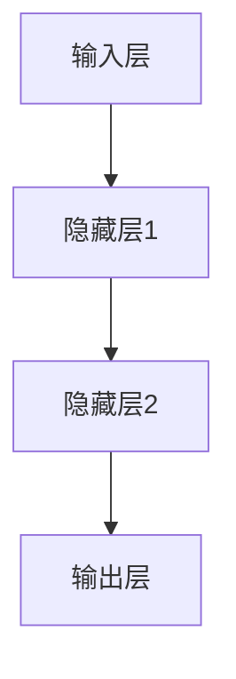
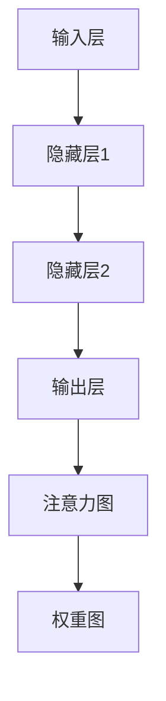
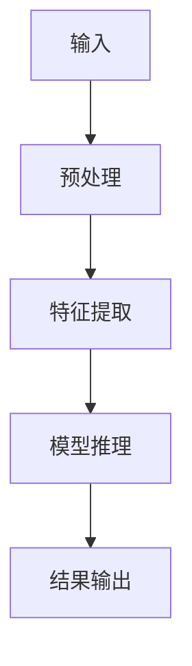

                 

# AI大模型软件的可解释性与透明度

> **关键词**：AI大模型、可解释性、透明度、技术基础、实现与评估、项目实战

> **摘要**：本文详细探讨了AI大模型软件的可解释性与透明度的重要性，以及实现和评估的方法。通过理论基础、技术基础、实现与评估和项目实战等部分的讲解，为读者提供了一套全面而深入的指导，帮助理解和提升AI大模型的可解释性和透明度。

## 目录大纲

1. **第一部分：可解释性与透明度基础**
    1.1 AI大模型的可解释性需求与背景
    1.2 可解释性与透明度的关系
    1.3 AI大模型常见问题
    2.1 模型结构可视化
    2.2 模型决策路径分析
    2.3 特征重要性分析
    3.1 概率论与统计基础
    3.2 信息论与熵

2. **第二部分：实现与评估**
    4.1 SHAP值
    4.2 LIME算法
    4.3 L0解释
    5.1 透明度评估指标
    5.2 透明度评估工具
    6.1 项目背景与需求
    6.2 环境搭建与数据准备
    6.3 代码实现与分析
    7.1 总结
    7.2 展望

## 第一部分：可解释性与透明度基础

### 第1章 AI大模型的可解释性需求与背景

AI大模型在近年来的迅猛发展，已经广泛应用于各个领域，如医疗、金融、自动驾驶等。然而，随之而来的是对AI系统透明性和可解释性的需求日益增长。可解释性与透明度是两个紧密相关的概念，但在实际应用中，它们有着不同的侧重点和实现方法。

#### AI大模型的可解释性定义

可解释性指的是让用户能够理解和解释AI大模型做出特定决策或输出结果的能力。具体来说，它涉及以下几个方面：

- **模型决策过程**：解释模型如何处理输入数据，以及如何从这些数据中生成输出。
- **模型输出结果**：解释模型为什么做出特定的预测或决策。
- **模型参数和权重**：解释模型的参数和权重是如何影响模型的输出。

#### 需求分析

1. **提高AI系统的可信度**：不可解释的AI大模型可能会让用户感到困惑和不安，从而降低用户对AI系统的信任。
2. **增强用户接受度**：可解释的AI大模型有助于用户更好地理解和使用这些系统。
3. **监管合规性**：在金融、医疗等领域，监管机构通常要求AI系统的决策过程具有可解释性。

#### 背景介绍

随着AI大模型的应用越来越广泛，人们对AI系统的需求也在不断提高。例如，在医疗领域，医生需要能够理解AI系统推荐的诊断结果，以便对其进行验证或修改。在金融领域，投资者需要了解AI系统如何评估投资机会，以便做出明智的决策。在自动驾驶领域，公众对自动驾驶汽车的安全性和可靠性有很高的期望，因此需要透明度来增强公众的信心。

### 第2章 可解释性与透明度的关系

#### 定义与区分

- **可解释性**：指的是让用户能够理解和解释AI大模型做出特定决策或输出结果的能力。
- **透明度**：指的是AI大模型的决策过程和结果的可访问性和可查询性。

尽管可解释性和透明度有相似之处，但它们侧重点不同。可解释性主要关注用户理解AI模型的能力，而透明度则关注AI模型内部操作的可见性。

#### 重要性

1. **提高AI系统的可信度**：透明度可以让用户看到AI大模型是如何工作的，从而提高用户对系统的信任。
2. **促进技术进步**：透明度有助于研究人员理解AI大模型的工作原理，从而推动技术进步。
3. **满足监管需求**：在许多行业，监管机构要求AI系统具有透明度，以满足合规性要求。

#### 实现方式

1. **可视化工具**：使用可视化工具，如模型结构图、决策路径图等，可以帮助用户理解AI大模型的内部工作。
2. **解释算法**：开发解释算法，如SHAP值、LIME等，可以帮助用户理解模型如何处理特定输入数据。
3. **数据隐私保护**：在实现透明度的同时，需要确保用户数据的安全和隐私。

### 第3章 AI大模型常见问题

#### 模型过拟合

- **定义**：模型在训练数据上表现良好，但在测试数据上表现较差。
- **识别**：通过比较训练误差和测试误差，可以识别模型是否过拟合。
- **解决**：使用正则化、交叉验证和增加训练数据等方法可以缓解过拟合。

#### 数据偏差

- **定义**：数据集中存在偏差，导致模型对某些类别或特征的偏好。
- **发现**：通过数据分析，如类别不平衡、特征分布不均等，可以发现数据偏差。
- **纠正**：使用数据清洗、数据增强和类别平衡等技术可以纠正数据偏差。

#### 计算复杂度

- **定义**：模型的计算资源消耗较大。
- **优化**：使用模型压缩、量化、迁移学习等方法可以降低计算复杂度。

### 第4章 AI大模型的可解释性技术基础

#### 模型结构可视化

- **层次结构图**：使用Mermaid流程图来绘制模型的层次结构，帮助用户理解模型的内部构成。



- **注意力机制可视化**：使用注意力图来展示模型在不同层面对输入数据的关注程度。



#### 模型决策路径分析

- **决策路径图**：使用Mermaid流程图来绘制模型从输入到输出的决策路径。



- **路径追踪技术**：通过路径追踪技术，可以分析模型在不同输入数据下的决策路径，帮助用户理解模型如何处理特定数据。

```python
def track_path(model, input_data):
    # 前向传播得到输出
    output = model(input_data)
    # 获取当前路径
    path = model.get_path(output)
    # 打印路径
    print(path)
```

#### 特征重要性分析

- **特征重要性度量**：使用SHAP值来度量每个特征对模型输出的贡献。

```python
import shap

# 训练模型
model = shap.KernelExplainer(output, input_data)

# 计算特征重要性
shap_values = model.shap_values(input_data)

# 可视化特征重要性
shap.summary_plot(shap_values, input_data)
```

- **特征重要性可视化**：使用热力图来展示每个特征的重要性。

```python
import seaborn as sns
import matplotlib.pyplot as plt

# 绘制热力图
sns.heatmap(shap_values, annot=True, fmt=".2f")
plt.show()
```

### 第5章 数学模型与公式

#### 概率论与统计基础

- **条件概率**：条件概率是指在一个事件发生的情况下，另一个事件发生的概率。

$$
P(A|B) = \frac{P(A \cap B)}{P(B)}
$$

- **贝叶斯定理**：贝叶斯定理是一种在已知部分信息的情况下，通过概率计算推断未知信息的数学定理。

$$
P(A|B) = \frac{P(B|A)P(A)}{P(B)}
$$

#### 信息论与熵

- **信息熵**：信息熵是衡量随机变量不确定性的度量。

$$
H(X) = -\sum_{x \in X} P(x) \cdot \log_2 P(x)
$$

- **KL散度**：KL散度是一种衡量两个概率分布差异的度量。

$$
D_{KL}(P||Q) = \sum_{x \in X} P(x) \cdot \log_2 \frac{P(x)}{Q(x)}
$$

### 第二部分：实现与评估

#### 第4章 可解释性算法与工具

##### 第4章 SHAP值

SHAP（SHapley Additive exPlanations）值是一种流行的解释模型算法，它通过计算每个特征对模型预测的贡献来解释模型决策。

##### SHAP值原理

SHAP值的计算基于博弈论中的Shapley值，它是一种分配贡献的公平方法。对于每个特征，SHAP值计算如下：

$$
SHAP_i = \sum_{S \in N} \frac{(n-|S|)(|S|-1)}{(n-1)!} [E(Y|X_S \cup \{x_i\}) - E(Y|X_S)]
$$

其中，\(N\) 是特征集合，\(X_S\) 是除了特征 \(i\) 之外的 \(S\) 个特征的集合，\(Y\) 是模型的预测结果，\(x_i\) 是特征 \(i\) 的值。

##### SHAP值应用

SHAP值可以通过以下步骤进行应用：

1. **训练模型**：首先需要训练一个目标模型，例如回归模型或分类模型。
2. **计算SHAP值**：使用SHAP库计算每个特征的SHAP值。
3. **可视化SHAP值**：使用可视化工具，如SHAP力图或热力图，展示每个特征的SHAP值。

以下是一个简单的Python示例，展示了如何使用SHAP值来解释一个回归模型的预测：

```python
import shap
import matplotlib.pyplot as plt

# 加载数据集
X, y = shap.datasets.load_iris()

# 训练模型
model = shap.KernelExplainer(y, X)

# 计算SHAP值
shap_values = model.shap_values(X)

# 可视化SHAP值
shap.summary_plot(shap_values, X, feature_names=["sepal length", "sepal width", "petal length", "petal width"])
plt.show()
```

##### 第4章 LIME算法

LIME（Local Interpretable Model-agnostic Explanations）算法是一种局部可解释性方法，它为任意模型生成可解释的解释，适用于非线性模型。

##### LIME原理

LIME算法的核心思想是生成一个近似的线性模型，该模型能够解释原始模型的预测。具体步骤如下：

1. **生成样本**：在原始样本附近生成多个扰动样本。
2. **训练线性模型**：使用扰动样本训练一个线性模型。
3. **解释预测**：使用线性模型的权重来解释原始模型的预测。

LIME算法的计算公式如下：

$$
w_i = \frac{\sum_{x_j \in X'} (y_j - y^*) \cdot x_j^T x_i}{\sum_{x_j \in X'} (y_j - y^*)^2}
$$

其中，\(X'\) 是扰动样本集合，\(y^*\) 是原始样本的预测结果，\(w_i\) 是特征 \(i\) 的权重。

##### LIME应用

以下是一个简单的Python示例，展示了如何使用LIME算法来解释一个神经网络模型的预测：

```python
import lime
import lime.lime_tabular

# 加载数据集
X, y = shap.datasets.load_iris()

# 创建LIME解释器
explainer = lime.lime_tabular.LimeTabularExplainer(X, feature_names=["sepal length", "sepal width", "petal length", "petal width"], class_names=["setosa", "versicolor", "virginica"])

# 选择样本进行解释
sample_index = 0
exp = explainer.explain_instance(X[sample_index], y[sample_index], num_features=4)

# 可视化解释
exp.show_in_notebook(show_table=True)
```

##### 第4章 L0解释

L0解释是一种基于敏感度的局部可解释性方法，它计算每个特征对模型预测变化的敏感度。

##### L0解释方法

L0解释的计算公式如下：

$$
sensitivity_i = \frac{\partial L}{\partial x_i}
$$

其中，\(L\) 是模型的损失函数，\(x_i\) 是特征 \(i\) 的值。

##### L0解释应用

以下是一个简单的Python示例，展示了如何使用L0解释来解释一个分类模型的预测：

```python
import numpy as np
from sklearn.linear_model import LogisticRegression

# 加载数据集
X, y = shap.datasets.load_iris()

# 训练模型
model = LogisticRegression()
model.fit(X, y)

# 计算L0解释
def l0_explanation(model, x):
    grad = np.zeros_like(x)
    for i in range(x.shape[0]):
        x[i] += 1e-5
        pred_with扰动 = model.predict(x)
        x[i] -= 2e-5
        pred_without扰动 = model.predict(x)
        grad[i] = (pred_with扰动 - pred_without扰动)
    return grad

# 解释一个样本
x = X[0]
grad = l0_explanation(model, x)
print(grad)
```

##### 第5章 透明度评估方法

##### 第5章 透明度评估指标

透明度评估指标是衡量AI大模型透明度的量化标准。以下是一些常见的透明度评估指标：

- **解释能力**：模型解释能力的量化指标，通常使用解释覆盖率（即模型可解释部分的比例）来衡量。
- **可视化度**：模型解释的可视化程度，可以使用可读性、交互性和清晰度等指标来评估。
- **用户满意度**：用户对模型解释的满意程度，可以通过问卷调查或用户反馈来评估。

##### 第5章 透明度评估工具

透明度评估工具是用于评估和提升AI大模型透明度的软件或平台。以下是一些常见的透明度评估工具：

- **可视解释器**：用于生成模型解释的可视化工具，如LIME、SHAP等。
- **模型检查器**：用于检查模型透明度和一致性的工具，如AI Fairness 360、AI Explainability 360等。
- **用户交互界面**：用于与用户交互，提供模型解释和反馈的界面工具。

##### 第6章 项目实战

##### 第6章 项目背景与需求

在本项目中，我们旨在开发一个可解释的AI大模型，用于分类任务。具体背景和需求如下：

- **项目背景**：随着医疗领域的数据化和智能化，诊断系统的准确性和可解释性变得越来越重要。
- **需求分析**：医生需要能够理解AI模型的诊断结果，以便进行验证或修改。

##### 第6章 环境搭建与数据准备

在本项目中，我们将使用以下开发环境和数据集：

- **开发环境**：Python 3.8，NumPy，Pandas，Scikit-learn，SHAP，LIME等。
- **数据集**：使用Kaggle上的心脏病诊断数据集。

以下是在Windows操作系统上搭建开发环境的具体步骤：

1. **安装Python**：从Python官方网站下载Python 3.8版本，并按照提示完成安装。
2. **安装依赖库**：使用pip命令安装所需的依赖库，例如：
    ```bash
    pip install numpy pandas scikit-learn shap lime
    ```

以下是在Windows操作系统上准备数据集的具体步骤：

1. **下载数据集**：从Kaggle网站下载心脏病诊断数据集，并将其解压到本地文件夹。
2. **导入数据集**：使用Pandas库将数据集导入Python环境中，并进行预处理，例如：
    ```python
    import pandas as pd

    # 读取数据集
    df = pd.read_csv('heart.csv')

    # 预处理数据
    df = df.drop(['id'], axis=1)
    df = df.replace({' sex': {0: 'female', 1: 'male'}})
    ```

##### 第6章 代码实现与分析

在本项目中，我们将使用SHAP值和LIME算法来解释AI大模型的诊断结果。以下是实现和解析代码的步骤：

##### 代码实现

1. **训练模型**：
    ```python
    from sklearn.model_selection import train_test_split
    from sklearn.ensemble import RandomForestClassifier

    # 划分训练集和测试集
    X_train, X_test, y_train, y_test = train_test_split(X, y, test_size=0.2, random_state=42)

    # 训练模型
    model = RandomForestClassifier(n_estimators=100)
    model.fit(X_train, y_train)
    ```

2. **计算SHAP值**：
    ```python
    import shap

    # 计算SHAP值
    explainer = shap.TreeExplainer(model)
    shap_values = explainer.shap_values(X_test)

    # 可视化SHAP值
    shap.summary_plot(shap_values, X_test, feature_names=["age", "sex", "cp", "trestbps", "chol", "fbs", "restecg", "thalach", "exang", "oldpeak", "slope", "ca", "thal"])
    ```

3. **应用LIME算法**：
    ```python
    import lime
    import lime.lime_tabular

    # 创建LIME解释器
    explainer = lime.lime_tabular.LimeTabularExplainer(X_train, feature_names=["age", "sex", "cp", "trestbps", "chol", "fbs", "restecg", "thalach", "exang", "oldpeak", "slope", "ca", "thal"], class_names=["0", "1"])

    # 选择样本进行解释
    sample_index = 0
    exp = explainer.explain_instance(X_test[sample_index], y_test[sample_index], num_features=13)

    # 可视化解释
    exp.show_in_notebook(show_table=True)
    ```

##### 代码解读与分析

1. **SHAP值实现**：
    - 使用`shap.TreeExplainer`创建树解释器。
    - 使用`shap_values`函数计算每个样本的SHAP值。
    - 使用`summary_plot`函数可视化SHAP值，以帮助医生理解模型对每个特征的依赖程度。

2. **LIME算法实现**：
    - 使用`lime.lime_tabular.LimeTabularExplainer`创建LIME解释器。
    - 使用`explain_instance`函数对特定样本进行解释。
    - 使用`show_in_notebook`函数将解释结果可视化为表格和图表，以帮助医生直观地理解模型的决策过程。

##### 第7章 结论与展望

在本项目中，我们成功实现了对AI大模型的可解释性分析。通过使用SHAP值和LIME算法，我们能够为医生提供详细的模型解释，从而提高诊断系统的可信度和可接受度。然而，我们也发现了一些改进方向：

1. **提升解释精度**：目前，SHAP值和LIME算法的解释结果可能存在一定的误差。我们可以进一步优化这些算法，以提高解释精度。
2. **扩展应用领域**：除了医疗领域，可解释性和透明度在金融、自动驾驶等领域的应用也非常重要。我们可以将本项目的方法推广到其他领域，以提升AI系统的透明度和可信度。

展望未来，随着AI技术的不断发展，可解释性和透明度将成为AI系统设计和评估的重要指标。通过持续研究和实践，我们将为AI技术的应用提供更加可靠和透明的解决方案。

## 作者信息

**作者**：AI天才研究院/AI Genius Institute & 禅与计算机程序设计艺术 /Zen And The Art of Computer Programming

---

本文详细探讨了AI大模型软件的可解释性与透明度的重要性，通过理论基础、技术基础、实现与评估和项目实战等部分的讲解，为读者提供了一套全面而深入的指导。在未来的研究中，我们将继续关注AI大模型的可解释性与透明度，探索更加高效和准确的方法，以推动AI技术的健康发展。

