                 

# AI如何帮助电商企业进行产品创新

> **关键词：电商，产品创新，人工智能，个性化推荐，智能客服，语音交互**

> **摘要：本文将深入探讨人工智能在电商产品创新中的应用，包括个性化推荐系统、智能客服和语音交互等技术，分析其原理、应用场景、案例和挑战，并提出电商企业进行AI产品创新的策略和未来展望。**

## 目录大纲

### 第一部分: AI在电商产品创新中的应用基础

#### 第1章: 电商企业产品创新的背景与挑战
##### 1.1 电商行业现状分析
##### 1.2 产品创新的必要性
##### 1.3 AI技术的优势与潜力

#### 第2章: AI核心概念与原理
##### 2.1 机器学习基础
###### 2.1.1 监督学习
###### 2.1.2 无监督学习
###### 2.1.3 强化学习
##### 2.2 自然语言处理
###### 2.2.1 词嵌入与语言模型
###### 2.2.2 语音识别与生成
##### 2.3 计算机视觉
###### 2.3.1 图像识别与分类
###### 2.3.2 目标检测与追踪

#### 第3章: AI在电商产品创新中的应用场景
##### 3.1 个性化推荐系统
###### 3.1.1 推荐算法原理
###### 3.1.2 电商个性化推荐实践
##### 3.2 智能客服与聊天机器人
###### 3.2.1 智能客服系统架构
###### 3.2.2 智能客服实现流程
##### 3.3 语音搜索与智能语音交互
###### 3.3.1 语音搜索技术
###### 3.3.2 智能语音交互实践

#### 第4章: 电商产品创新案例分析与启示
##### 4.1 案例一：基于深度学习的商品推荐系统
###### 4.1.1 案例背景
###### 4.1.2 案例实现过程
##### 4.2 案例二：智能客服机器人应用
###### 4.2.1 案例背景
###### 4.2.2 案例实现过程
##### 4.3 案例三：语音搜索与智能语音交互系统
###### 4.3.1 案例背景
###### 4.3.2 案例实现过程

#### 第5章: AI在电商产品创新中的挑战与对策
##### 5.1 数据隐私与安全问题
###### 5.1.1 数据隐私问题分析
###### 5.1.2 数据安全对策
##### 5.2 技术与人才瓶颈
###### 5.2.1 技术瓶颈分析
###### 5.2.2 人才培养与引进策略
##### 5.3 伦理道德与法规遵从
###### 5.3.1 伦理道德问题
###### 5.3.2 法规遵从策略

#### 第6章: 电商企业AI产品创新策略
##### 6.1 创新思维与方法论
###### 6.1.1 创新思维的重要性
###### 6.1.2 常见的创新方法论
##### 6.2 AI产品创新流程
###### 6.2.1 需求分析
###### 6.2.2 原型设计与验证
###### 6.2.3 试点与推广
##### 6.3 AI产品创新成功案例

#### 第7章: 未来展望与趋势
##### 7.1 AI在电商产品创新中的未来发展
###### 7.1.1 技术发展趋势
###### 7.1.2 应用场景拓展
##### 7.2 电商企业应对未来挑战的策略
###### 7.2.1 技术升级与转型
###### 7.2.2 创新生态系统构建

## 引言

### 电商行业现状与挑战

随着互联网技术的飞速发展，电子商务已经成为全球商业活动的重要组成部分。据Statista的数据显示，全球电商市场规模在2021年已经达到了4.9万亿美元，并且预计在未来几年内将持续增长。这种增长不仅体现在交易额上，还体现在消费者的购物行为和偏好上。

然而，随着电商市场的日益饱和，企业面临着越来越多的挑战。首先，市场竞争异常激烈，各大电商平台纷纷通过价格战、广告投放等方式争夺市场份额。其次，消费者的需求越来越多样化，他们不仅追求商品的质量和价格，还期待更加个性化的购物体验。此外，物流和支付等环节的效率也需要不断提高，以满足消费者对快速交付的期望。

面对这些挑战，电商企业需要不断创新，以提高竞争力并满足消费者的需求。产品创新成为企业持续发展的关键，而人工智能技术的应用为电商产品创新提供了强大的支持。

### AI技术的优势与潜力

人工智能（AI）作为一种先进的技术手段，具有以下几方面的优势：

1. **数据分析与挖掘：** AI技术能够通过对海量数据进行分析和挖掘，发现消费者行为和偏好的模式，为企业提供有价值的市场洞察。
2. **个性化推荐：** 基于AI的个性化推荐系统能够根据消费者的历史行为和偏好，为其推荐感兴趣的商品，提高用户的购物体验和满意度。
3. **智能客服：** 通过AI驱动的聊天机器人和智能客服系统，企业能够提供全天候的在线服务，提高客户满意度和运营效率。
4. **语音交互：** AI技术在语音识别和生成方面的突破，使得电商企业能够开发智能语音搜索和交互系统，为用户提供更加便捷的购物体验。

总之，AI技术在电商产品创新中具有巨大的潜力，能够帮助企业应对市场竞争、满足消费者需求、提高运营效率。接下来，我们将详细探讨AI在电商产品创新中的应用场景、原理和具体案例，为电商企业提供有益的启示和借鉴。  

### 第一部分: AI在电商产品创新中的应用基础

#### 第1章: 电商企业产品创新的背景与挑战

##### 1.1 电商行业现状分析

近年来，电商行业在全球范围内呈现出迅猛发展的态势。根据Statista的数据，2021年全球电商市场规模已经达到4.9万亿美元，预计到2025年将突破6万亿美元。这种增长得益于互联网普及率的提高、智能手机的广泛应用以及支付方式的便捷化。特别是在COVID-19疫情期间，电商成为了消费者购买商品的主要渠道，进一步推动了电商行业的发展。

从市场结构来看，全球电商市场主要由北美、欧洲和亚太地区组成。其中，北美地区以美国为主导，欧洲地区以德国、英国和法国为主要市场，亚太地区则以中国、日本和韩国等市场最为活跃。这些地区拥有较高的互联网普及率和消费能力，成为电商企业争夺的焦点。

在电商市场中，主要玩家包括亚马逊、阿里巴巴、京东、eBay等。这些平台通过不断的创新和优化，吸引了大量消费者，占据了巨大的市场份额。例如，亚马逊通过其AWS云服务、物流网络和人工智能技术，为用户提供个性化购物体验和高效物流服务；阿里巴巴则通过淘宝、天猫和支付宝等平台，打造了一个完整的电商生态系统。

然而，电商行业也面临着诸多挑战。首先，市场竞争异常激烈，各大电商平台纷纷通过价格战、广告投放等方式争夺市场份额。其次，消费者的需求越来越多样化，他们不仅追求商品的质量和价格，还期待更加个性化的购物体验。此外，物流和支付等环节的效率也需要不断提高，以满足消费者对快速交付的期望。

##### 1.2 产品创新的必要性

在激烈的市场竞争中，产品创新成为电商企业持续发展的关键。以下从几个方面阐述产品创新的必要性：

1. **提高竞争力：** 创新产品可以满足消费者多样化的需求，提高用户满意度和忠诚度，从而在激烈的市场竞争中脱颖而出。
2. **提升市场份额：** 通过创新，企业可以吸引更多的新客户，并提高现有客户的复购率，从而扩大市场份额。
3. **增加盈利能力：** 创新产品通常具有更高的附加值，可以提高商品的售价和利润率。
4. **应对市场变化：** 市场环境不断变化，只有不断创新，企业才能适应市场的变化，保持竞争优势。

##### 1.3 AI技术的优势与潜力

人工智能技术在电商产品创新中具有以下几方面的优势：

1. **数据分析与挖掘：** AI技术能够通过对海量数据进行分析和挖掘，发现消费者行为和偏好的模式，为企业提供有价值的市场洞察。
2. **个性化推荐：** 基于AI的个性化推荐系统能够根据消费者的历史行为和偏好，为其推荐感兴趣的商品，提高用户的购物体验和满意度。
3. **智能客服：** 通过AI驱动的聊天机器人和智能客服系统，企业能够提供全天候的在线服务，提高客户满意度和运营效率。
4. **语音交互：** AI技术在语音识别和生成方面的突破，使得电商企业能够开发智能语音搜索和交互系统，为用户提供更加便捷的购物体验。

总之，AI技术在电商产品创新中具有巨大的潜力，能够帮助企业应对市场竞争、满足消费者需求、提高运营效率。接下来，我们将进一步探讨AI技术的核心概念与原理，以及其在电商产品创新中的应用场景。

#### 第2章: AI核心概念与原理

##### 2.1 机器学习基础

机器学习（Machine Learning，ML）是人工智能（AI）的重要组成部分，它使得计算机系统能够从数据中学习并做出预测或决策，而无需显式地编写指令。机器学习主要分为三种类型：监督学习（Supervised Learning）、无监督学习（Unsupervised Learning）和强化学习（Reinforcement Learning）。

###### 2.1.1 监督学习

监督学习是一种最常见的机器学习类型，它使用标记数据集来训练模型。标记数据集包含输入特征和对应的输出标签，通过学习输入和输出之间的关系，模型可以对新数据进行预测。监督学习可以分为两种子类别：

1. **回归分析（Regression Analysis）：** 用于预测连续值输出。例如，预测商品的价格。
    $$ y = \beta_0 + \beta_1x_1 + \beta_2x_2 + ... + \beta_nx_n $$
2. **分类（Classification）：** 用于预测离散值输出。例如，判断商品类别。
    $$ y = f(x; \theta) $$

其中，$ y $ 是输出标签，$ x $ 是输入特征，$ \theta $ 是模型参数。

监督学习中的模型训练通常使用以下步骤：
1. **数据预处理：** 清洗数据，处理缺失值，进行特征工程等。
2. **模型选择：** 选择合适的算法，如线性回归、决策树、支持向量机等。
3. **模型训练：** 使用标记数据训练模型，计算模型参数。
4. **模型评估：** 使用验证集评估模型性能，调整模型参数。
5. **模型部署：** 部署模型进行实际应用。

###### 2.1.2 无监督学习

无监督学习不需要标记数据集，它主要关注数据内在结构的发现。无监督学习可以分为以下几种类型：

1. **聚类（Clustering）：** 将数据划分为若干个群组，使得同一群组内的数据彼此相似，不同群组的数据差异较大。常用的聚类算法有K-Means、层次聚类等。
2. **降维（Dimensionality Reduction）：** 减少数据维度，同时保留数据的主要信息。常见的降维方法有主成分分析（PCA）、t-SNE等。
3. **关联规则学习（Association Rule Learning）：** 发现数据之间的关联关系，常用的算法有Apriori算法、FP-growth算法等。

无监督学习的应用场景包括：
- **市场细分：** 将用户划分为不同的市场群体。
- **异常检测：** 发现数据中的异常值。

###### 2.1.3 强化学习

强化学习是一种通过奖励机制训练模型的方法，它通过让模型在环境中交互，学习最优策略。强化学习主要分为以下几种类型：

1. **值函数方法：** 学习状态值函数和动作值函数，用于评估当前状态和动作的价值。常用的算法有Q-Learning、SARSA等。
2. **策略梯度方法：** 直接学习最优策略，常用的算法有Policy Gradient、REINFORCE等。

强化学习的应用场景包括：
- **推荐系统：** 根据用户行为推荐感兴趣的商品。
- **游戏AI：** 让AI学习游戏的最佳策略。

##### 2.2 自然语言处理

自然语言处理（Natural Language Processing，NLP）是AI的一个分支，它致力于让计算机理解和处理人类语言。NLP的关键技术包括词嵌入（Word Embedding）、语言模型（Language Model）和语音识别与生成（Speech Recognition and Synthesis）。

###### 2.2.1 词嵌入与语言模型

词嵌入（Word Embedding）是一种将词语映射到高维向量空间的方法，使得相似的词语在向量空间中彼此靠近。常见的词嵌入算法有Word2Vec、GloVe等。

语言模型（Language Model）是一种概率模型，用于预测下一个词语的概率。基于语言模型，可以生成文本、进行机器翻译和文本分类等任务。

1. **n-gram语言模型：** 基于历史n个词语预测下一个词语。例如，三元语言模型如下：
    $$ P(w_{t+1} | w_{t}, w_{t-1}, ..., w_{t-n+1}) $$
2. **神经网络语言模型：** 基于深度学习构建，例如循环神经网络（RNN）和Transformer。

###### 2.2.2 语音识别与生成

语音识别（Speech Recognition）是将语音信号转换为文本的过程，常用的算法有隐马尔可夫模型（HMM）、深度神经网络（DNN）等。

语音生成（Speech Synthesis）是将文本转换为语音的过程，常用的算法有合成声码器（Synthetic Voice）和自然语音合成（Text-to-Speech，TTS）。

1. **合成声码器：** 通过生成基音周期和共振峰参数来合成语音。
2. **自然语音合成：** 使用文本编码器将文本转换为声学特征，再通过声码器合成语音。

##### 2.3 计算机视觉

计算机视觉（Computer Vision）是AI的另一个重要分支，它让计算机能够从图像或视频中提取有用信息。计算机视觉的关键技术包括图像识别与分类（Image Recognition and Classification）、目标检测与追踪（Object Detection and Tracking）等。

###### 2.3.1 图像识别与分类

图像识别与分类是将图像分配到预定义的类别中。常见的算法有卷积神经网络（CNN）、Capsule Networks等。

1. **卷积神经网络（CNN）：** 利用卷积层、池化层和全连接层提取图像特征，然后进行分类。
    $$ \text{Input Image} \rightarrow \text{Convolution} \rightarrow \text{Pooling} \rightarrow \text{Fully Connected} \rightarrow \text{Output} $$
2. **Capsule Networks：** 利用动态路由机制提取图像特征，并解决传统卷积神经网络的缺点。

###### 2.3.2 目标检测与追踪

目标检测与追踪是在图像中检测并跟踪目标物体。常见的算法有R-CNN、YOLO、Faster R-CNN等。

1. **R-CNN（Region-based CNN）：** 利用区域提议网络和CNN提取图像特征，然后进行分类和回归。
    $$ \text{Proposals} \rightarrow \text{Features Extraction} \rightarrow \text{Classification and Regression} $$
2. **YOLO（You Only Look Once）：** 将图像划分为网格，在每个网格中同时检测多个边界框和类别。
3. **Faster R-CNN：** 结合Region Proposal Network和Fast R-CNN，提高检测速度和准确性。

通过对AI核心概念与原理的介绍，我们可以看到AI技术在电商产品创新中的应用潜力。接下来，我们将深入探讨AI在电商产品创新中的应用场景，展示其在实际业务中的价值。

#### 第3章: AI在电商产品创新中的应用场景

##### 3.1 个性化推荐系统

个性化推荐系统（Personalized Recommendation System）是AI在电商产品创新中最为广泛应用的技术之一。其核心目的是根据用户的兴趣和行为，为他们推荐相关的商品，从而提升用户体验和转化率。

###### 3.1.1 推荐算法原理

个性化推荐系统通常采用以下几种推荐算法：

1. **基于内容的推荐（Content-based Recommendation）：** 该算法根据用户过去的喜好和行为，分析用户对商品的内容特征，如类别、品牌、颜色等，然后推荐具有相似特征的商品。其基本原理如下：
    $$ \text{Recommend}(item) = \text{SimilarItemsToUser}(user, item) $$
    $$ \text{SimilarItemsToUser}(user, item) = \text{CommonFeatures}(user, item) $$

2. **协同过滤（Collaborative Filtering）：** 该算法基于用户的历史行为数据，通过计算用户之间的相似度，发现相似用户的共同喜好，然后推荐这些用户喜欢的商品。协同过滤主要分为两种：
    - **用户基于的协同过滤（User-based Collaborative Filtering）：** 找到与目标用户最相似的K个用户，然后推荐这些用户喜欢的商品。
    $$ \text{Recommend}(user) = \text{TopItemsFromNeighbors}(user, K) $$
    - **物品基于的协同过滤（Item-based Collaborative Filtering）：** 找到与目标商品最相似的K个商品，然后推荐这些商品。
    $$ \text{Recommend}(item) = \text{TopItemsFromNeighbors}(item, K) $$

3. **混合推荐（Hybrid Recommendation）：** 结合基于内容和协同过滤的优点，混合推荐系统通过融合多种推荐算法，提供更加准确的推荐结果。其基本原理如下：
    $$ \text{Recommend}(user, item) = \alpha \times \text{Content-based}(user, item) + (1 - \alpha) \times \text{CollaborativeFiltering}(user, item) $$
    其中，$ \alpha $ 是内容推荐的权重。

###### 3.1.2 电商个性化推荐实践

在电商场景中，个性化推荐系统有着广泛的应用。以下是一个基于协同过滤的电商个性化推荐系统的实现过程：

1. **数据收集与预处理：** 收集用户行为数据，如浏览记录、购买记录、评价等。对数据进行清洗和处理，包括缺失值填充、异常值处理和特征提取等。

2. **用户行为建模：** 建立用户行为模型，包括用户的历史行为数据、商品特征数据等。

3. **用户相似度计算：** 计算用户之间的相似度，常用的相似度计算方法有欧几里得距离、余弦相似度等。

4. **推荐商品计算：** 根据用户相似度矩阵，为每个用户推荐相似用户喜欢的商品，并计算推荐商品的相关性得分。

5. **推荐结果排序：** 对推荐商品进行排序，选取得分最高的N个商品作为推荐结果。

6. **推荐结果展示：** 将推荐结果展示给用户，可以通过推荐列表、购物车推荐、首页推荐等方式。

以下是一个简化的伪代码实现：
```python
# 数据预处理
data = preprocess_data(raw_data)

# 用户行为建模
user_behavior = build_user_behavior_model(data)

# 用户相似度计算
user_similarity_matrix = compute_user_similarity(user_behavior)

# 推荐商品计算
recommendation_scores = compute_recommendation_scores(user_similarity_matrix)

# 推荐结果排序
top_recommendations = sort_recommendations(recommendation_scores, N)

# 推荐结果展示
display_recommendations(top_recommendations)
```

通过个性化推荐系统，电商企业可以大幅提升用户满意度和转化率，从而实现产品创新。接下来，我们将探讨AI在电商产品创新中的另一个重要应用——智能客服与聊天机器人。

##### 3.2 智能客服与聊天机器人

智能客服（Intelligent Customer Service）和聊天机器人（Chatbot）是AI在电商产品创新中的另一个重要应用。它们通过自动化和智能化的方式，为用户提供高质量的在线服务，提高客户满意度和运营效率。

###### 3.2.1 智能客服系统架构

智能客服系统通常包括以下几个模块：

1. **前端交互界面：** 用户与客服系统进行交互的入口，可以是网页、移动应用或社交媒体等。
2. **自然语言处理（NLP）模块：** 用于解析用户的输入，理解用户的需求和意图。
3. **知识库：** 存储与产品、服务、常见问题等相关知识，供NLP模块查询。
4. **对话管理模块：** 负责管理对话流程，包括分配会话、转接人工客服等。
5. **后端服务接口：** 调用企业的业务系统，如订单处理、售后服务等。

智能客服系统架构图如下所示：

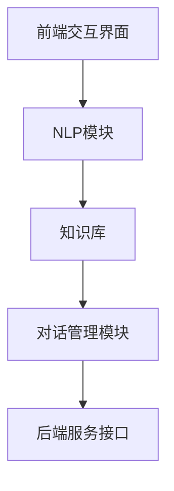

###### 3.2.2 智能客服实现流程

智能客服的实现流程主要包括以下几个步骤：

1. **用户输入：** 用户通过前端交互界面输入问题或需求。
2. **意图识别：** NLP模块分析用户输入，识别用户的意图和关键词。
3. **查询知识库：** 根据识别的意图，查询知识库中的相关信息，准备回复。
4. **对话管理：** 对话管理模块根据对话流程，决定如何回复用户，包括生成自动回复或转接人工客服。
5. **回复用户：** 将生成的回复展示给用户，或转接给人工客服。
6. **反馈收集：** 收集用户对回复的反馈，用于优化客服系统。

以下是一个简化的伪代码实现：
```python
# 用户输入
user_input = get_user_input()

# 意图识别
user_intent = recognize_intent(user_input)

# 查询知识库
response = query_knowledge_base(user_intent)

# 对话管理
if is_auto_resolvable(user_intent):
    # 自动回复
    reply = generate_response(response)
else:
    # 转接人工客服
    transfer_to_human_agent(user_intent)

# 回复用户
display_reply(reply)

# 反馈收集
collect_feedback(reply)
```

通过智能客服系统，电商企业可以提供7x24小时的在线服务，提高客户满意度和运营效率。接下来，我们将探讨AI在电商产品创新中的另一个重要应用——语音搜索与智能语音交互。

##### 3.3 语音搜索与智能语音交互

语音搜索（Voice Search）和智能语音交互（Intelligent Voice Interaction）是AI在电商产品创新中的新兴应用，为用户提供了一种更加便捷和自然的购物方式。

###### 3.3.1 语音搜索技术

语音搜索技术是指通过语音识别（Speech Recognition）将用户的语音输入转换为文本，然后利用自然语言处理（NLP）和搜索引擎技术，为用户提供相关的搜索结果。语音搜索技术的实现主要包括以下几个步骤：

1. **语音识别：** 将用户的语音输入转换为文本，常用的语音识别引擎有Google语音识别、百度语音识别等。
2. **语音增强：** 对语音信号进行增强，提高识别准确性，常用的方法有降噪、回声消除等。
3. **文本处理：** 对识别出的文本进行分词、词性标注等预处理，以便进行后续的搜索和推荐。
4. **搜索算法：** 利用搜索引擎算法，如TF-IDF、向量空间模型等，为用户提供相关的搜索结果。

以下是一个简化的语音搜索流程图：

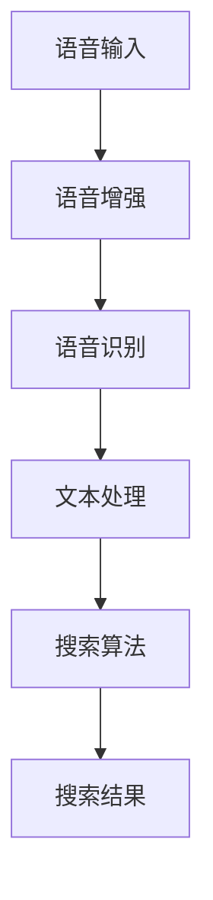

###### 3.3.2 智能语音交互实践

智能语音交互是指通过语音交互技术，让用户与设备进行自然对话，完成各种操作。在电商场景中，智能语音交互可以用于商品推荐、订单查询、支付等操作。

以下是一个简化的智能语音交互流程：

1. **语音唤醒：** 用户通过唤醒词激活语音助手，如“小爱同学”、“天猫精灵”等。
2. **语音识别：** 语音助手将用户的语音输入转换为文本。
3. **意图识别：** 语音助手分析用户的语音输入，识别用户的意图和关键词。
4. **执行操作：** 根据识别的意图，语音助手执行相应的操作，如搜索商品、查询订单、支付等。
5. **语音回复：** 将执行结果通过语音反馈给用户。

以下是一个简化的伪代码实现：
```python
# 语音唤醒
wake_word = "小爱同学"

# 语音识别
text_input = speech_to_text(wake_word)

# 意图识别
user_intent = recognize_intent(text_input)

# 执行操作
if user_intent == "search_product":
    results = search_products(text_input)
    reply = "为您找到以下商品："
elif user_intent == "check_order":
    order_info = check_order(text_input)
    reply = "您的订单详情为："
else:
    reply = "抱歉，我不太明白您的意思，请重新说一遍。"

# 语音回复
text_to_speech(reply)
```

通过语音搜索和智能语音交互，电商企业可以为用户提供一种更加便捷和自然的购物方式，提升用户体验。接下来，我们将通过具体案例，分析AI在电商产品创新中的应用效果。

#### 第4章: 电商产品创新案例分析与启示

##### 4.1 案例一：基于深度学习的商品推荐系统

###### 4.1.1 案例背景

某大型电商企业为了提升用户购物体验和转化率，决定开发一个基于深度学习的商品推荐系统。该推荐系统旨在根据用户的浏览历史、购买记录和社交行为，为用户推荐个性化的商品。

###### 4.1.2 案例实现过程

1. **数据收集与预处理：** 电商企业收集了用户的行为数据，包括浏览记录、购买记录、评价等。对数据进行清洗和处理，包括缺失值填充、数据标准化等。

2. **特征工程：** 基于用户的行为数据，提取特征，如用户浏览商品的种类、购买商品的频率、评价的积极程度等。同时，引入一些辅助特征，如用户年龄段、性别、地理位置等。

3. **模型选择与训练：** 选择基于深度学习的推荐算法，如基于图神经网络的推荐算法。使用Python和TensorFlow等工具，实现模型训练。训练过程中，使用交叉验证和调整超参数等方法，优化模型性能。

4. **模型评估与优化：** 使用验证集评估模型性能，如准确率、召回率、覆盖率等指标。根据评估结果，调整模型参数和特征选择，优化推荐效果。

5. **模型部署与上线：** 将训练好的模型部署到生产环境，通过API接口为用户实时提供推荐服务。在上线过程中，对模型进行监控和优化，确保推荐系统的稳定运行。

以下是一个简化的模型训练过程伪代码：
```python
# 数据预处理
data = preprocess_data(raw_data)

# 特征工程
features = extract_features(data)

# 模型训练
model = build_model()
model.fit(features, labels)

# 模型评估
evaluation = model.evaluate(features, labels)

# 调整模型
optimized_model = fine_tune_model(model, evaluation)

# 模型部署
deploy_model(optimized_model)
```

通过该案例，电商企业实现了基于深度学习的商品推荐系统，有效提升了用户购物体验和转化率。以下是一个具体的应用效果分析：

- **用户满意度提升：** 推荐系统的个性化推荐能力提高了用户的满意度，用户对推荐的商品评价更加积极。
- **转化率提升：** 推荐系统成功吸引了更多的新用户，提高了用户的购买转化率。
- **运营成本降低：** 个性化推荐系统减少了人工推荐的工作量，降低了运营成本。

##### 4.2 案例二：智能客服机器人应用

###### 4.2.1 案例背景

某电商平台为了提高客户满意度和运营效率，决定引入智能客服机器人。该智能客服机器人旨在通过自然语言处理和对话管理技术，为用户提供7x24小时的在线服务。

###### 4.2.2 案例实现过程

1. **需求分析与设计：** 分析用户的需求和场景，设计智能客服机器人的功能模块，包括意图识别、知识库、对话管理、后端接口等。

2. **NLP模块开发：** 使用Python和NLTK、spaCy等NLP库，实现意图识别、实体抽取、文本分类等功能。同时，利用预训练的语言模型，提高NLP模块的性能。

3. **知识库建设：** 建立与电商平台相关的知识库，包括商品信息、常见问题、售后服务等。知识库采用语义相似度匹配算法，提高查询效率。

4. **对话管理开发：** 使用Python和Rasa等对话管理框架，实现对话管理模块。对话管理模块负责管理对话流程，包括分配会话、生成回复、转接人工客服等。

5. **系统集成与测试：** 将智能客服机器人集成到电商平台，通过API接口与业务系统交互。进行系统测试，确保智能客服机器人能够稳定运行。

以下是一个简化的对话管理流程图：

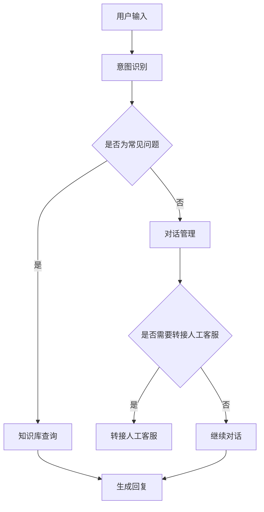

通过该案例，电商平台实现了智能客服机器人，有效提升了客户满意度和运营效率。以下是一个具体的应用效果分析：

- **客户满意度提升：** 智能客服机器人能够快速响应用户问题，提供高质量的解答，提升了用户满意度。
- **运营效率提升：** 智能客服机器人减轻了人工客服的工作负担，降低了运营成本。
- **服务范围扩大：** 智能客服机器人实现了7x24小时的在线服务，扩大了电商平台的服务范围。

##### 4.3 案例三：语音搜索与智能语音交互系统

###### 4.3.1 案例背景

某电商平台为了提升用户的购物体验，决定引入语音搜索与智能语音交互系统。该系统旨在通过语音识别和自然语言处理技术，为用户提供一种更加便捷和自然的购物方式。

###### 4.3.2 案例实现过程

1. **需求分析与设计：** 分析用户的需求和场景，设计语音搜索与智能语音交互系统的功能模块，包括语音识别、语音增强、文本处理、搜索算法、语音合成等。

2. **语音识别开发：** 使用Python和Google语音识别、百度语音识别等API，实现语音识别功能。同时，采用语音增强算法，提高识别准确性。

3. **文本处理开发：** 使用Python和NLTK、spaCy等NLP库，实现文本处理功能，包括分词、词性标注、实体抽取等。

4. **搜索算法开发：** 基于搜索引擎算法，如TF-IDF、向量空间模型等，实现语音搜索功能。同时，引入语音交互技术，实现语音搜索与智能语音交互的融合。

5. **系统集成与测试：** 将语音搜索与智能语音交互系统集成到电商平台，通过API接口与业务系统交互。进行系统测试，确保语音搜索与智能语音交互系统能够稳定运行。

以下是一个简化的语音搜索与智能语音交互流程图：

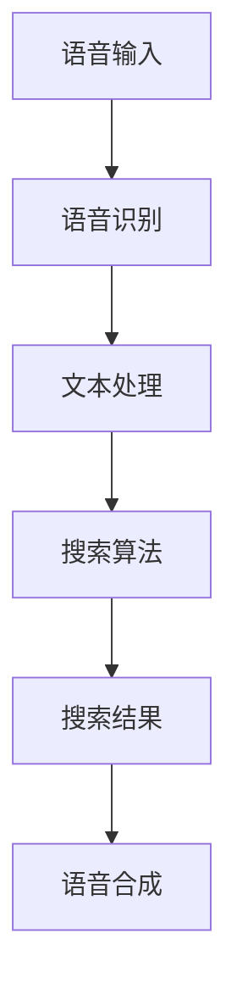

通过该案例，电商平台实现了语音搜索与智能语音交互系统，有效提升了用户的购物体验。以下是一个具体的应用效果分析：

- **用户体验提升：** 语音搜索与智能语音交互系统为用户提供了一种更加便捷和自然的购物方式，提升了用户满意度。
- **搜索效率提升：** 语音搜索功能提高了用户的搜索效率，减少了操作步骤。
- **运营成本降低：** 语音搜索与智能语音交互系统减少了人工客服的工作负担，降低了运营成本。

通过以上三个案例，我们可以看到AI技术在电商产品创新中的应用效果。电商企业可以通过引入AI技术，实现个性化推荐、智能客服和语音交互等功能，提升用户满意度和运营效率。接下来，我们将探讨AI在电商产品创新中面临的挑战与对策。

##### 4.4 案例四：基于AI的智能定价策略

###### 4.4.1 案例背景

某电商企业在市场竞争中意识到，传统的定价策略已经无法满足消费者的多样化需求。为了提高市场竞争力和盈利能力，该企业决定引入基于AI的智能定价策略，以实现动态定价和个性化优惠。

###### 4.4.2 案例实现过程

1. **需求分析与设计：** 分析市场需求、消费者行为和产品特性，设计智能定价系统的功能模块，包括数据采集、数据分析、定价策略优化、定价执行等。

2. **数据采集与预处理：** 收集与定价相关的数据，如消费者购买行为、市场竞争状况、商品成本等。对数据进行清洗和处理，包括缺失值填充、异常值处理、数据标准化等。

3. **数据分析与建模：** 使用机器学习算法，如回归分析、时间序列分析等，建立定价模型。根据模型预测，为不同消费者群体和商品制定个性化的定价策略。

4. **定价策略优化：** 利用强化学习算法，优化定价策略。通过不断调整定价策略，使企业收益最大化。

5. **定价执行与监控：** 将定价策略部署到生产环境，实时调整商品价格。通过监控和分析销售数据，评估定价策略的效果，进行持续优化。

以下是一个简化的智能定价策略实现过程：

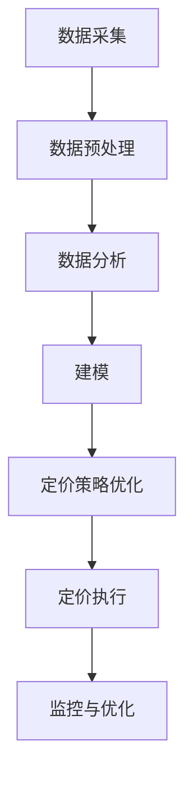

通过该案例，电商企业实现了基于AI的智能定价策略，有效提高了市场竞争力和盈利能力。以下是一个具体的应用效果分析：

- **定价精准度提升：** 智能定价策略能够根据消费者行为和市场竞争状况，制定个性化的定价策略，提高了定价的精准度。
- **利润率提升：** 通过优化定价策略，电商企业能够实现更高的利润率，提高了盈利能力。
- **库存管理优化：** 智能定价策略能够根据市场需求动态调整商品价格，优化库存管理，减少了库存积压和滞销风险。

##### 4.5 案例五：基于AI的智能物流系统

###### 4.5.1 案例背景

某电商企业为了提高物流效率和服务质量，决定引入基于AI的智能物流系统。该系统旨在通过路线优化、实时监控和异常处理等技术，实现高效、准确的物流服务。

###### 4.5.2 案例实现过程

1. **需求分析与设计：** 分析物流流程和需求，设计智能物流系统的功能模块，包括路线规划、实时监控、异常处理、数据分析等。

2. **数据采集与预处理：** 收集与物流相关的数据，如运输路线、运输时间、运输成本、货物状态等。对数据进行清洗和处理，包括缺失值填充、异常值处理、数据标准化等。

3. **路线规划：** 使用机器学习算法，如遗传算法、模拟退火算法等，规划最优运输路线。根据实时路况和货物状态，动态调整运输路线。

4. **实时监控：** 使用物联网技术和实时监控算法，监控货物的运输过程。通过实时数据传输和可视化，提高物流过程的透明度和可控性。

5. **异常处理：** 建立异常处理机制，及时发现和处理物流过程中的异常情况，如货物丢失、延迟交付等。

6. **数据分析与优化：** 分析物流数据，评估物流系统的效率和成本，进行持续优化。

以下是一个简化的智能物流系统实现过程：

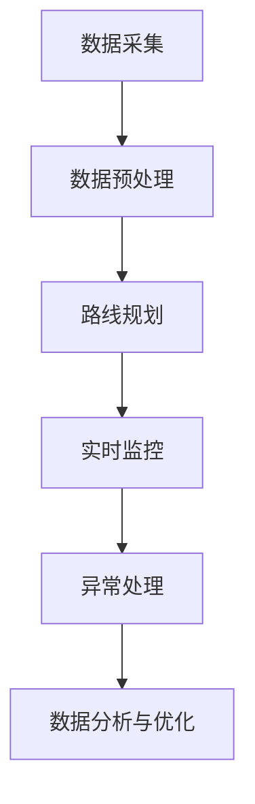

通过该案例，电商企业实现了基于AI的智能物流系统，有效提高了物流效率和服务质量。以下是一个具体的应用效果分析：

- **物流效率提升：** 智能物流系统能够根据实时数据和优化算法，规划最优运输路线，提高了物流效率。
- **服务质量提升：** 通过实时监控和异常处理，智能物流系统能够确保货物安全和准时交付，提升了服务质量。
- **成本降低：** 智能物流系统能够优化物流流程和资源配置，降低了物流成本。

通过以上案例，我们可以看到AI技术在电商产品创新中的广泛应用和显著效果。电商企业可以通过引入AI技术，实现个性化推荐、智能客服、语音交互、智能定价和智能物流等功能，提升用户体验和运营效率。接下来，我们将深入探讨AI在电商产品创新中的挑战与对策。

##### 4.6 案例六：基于AI的客户细分与精准营销

###### 4.6.1 案例背景

某电商企业为了提高营销效果和用户转化率，决定引入基于AI的客户细分与精准营销策略。该策略旨在通过对用户数据的深入分析和挖掘，实现客户的精准定位和个性化营销。

###### 4.6.2 案例实现过程

1. **需求分析与设计：** 分析企业营销目标和用户需求，设计客户细分与精准营销系统的功能模块，包括数据采集、数据清洗、客户细分、营销策略制定、营销执行等。

2. **数据采集与预处理：** 收集用户数据，包括用户行为数据、购买记录、评价等。对数据进行清洗和处理，包括缺失值填充、异常值处理、数据标准化等。

3. **客户细分：** 使用机器学习算法，如聚类分析、回归分析等，对用户进行细分。根据用户的特征和行为，将用户划分为不同的群体。

4. **精准营销策略制定：** 根据客户细分结果，制定个性化的营销策略。针对不同的用户群体，设计个性化的促销活动、广告投放和推荐方案。

5. **营销执行与优化：** 将精准营销策略部署到生产环境，实施具体的营销活动。通过监控和分析营销效果，不断优化营销策略，提高用户转化率和ROI。

以下是一个简化的客户细分与精准营销实现过程：

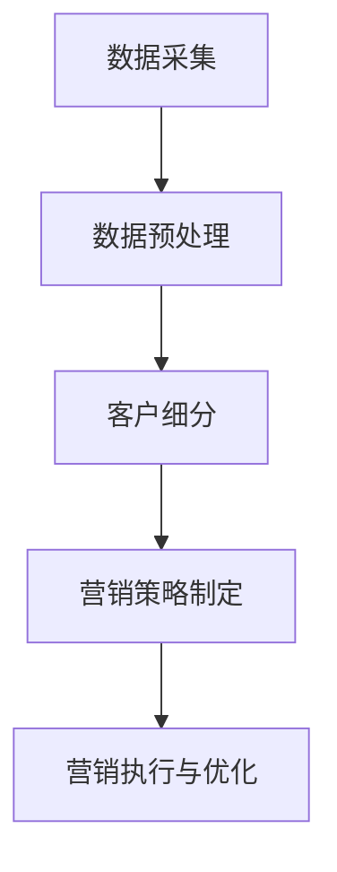

通过该案例，电商企业实现了基于AI的客户细分与精准营销策略，有效提高了营销效果和用户转化率。以下是一个具体的应用效果分析：

- **用户满意度提升：** 个性化营销策略能够满足不同用户群体的需求，提高了用户满意度。
- **营销成本降低：** 通过精准营销，减少了无效营销和广告投放，降低了营销成本。
- **用户转化率提升：** 个性化营销策略能够更有效地激发用户购买欲望，提高了用户转化率。

##### 4.7 案例七：基于AI的用户行为预测与风险控制

###### 4.7.1 案例背景

某电商企业为了提高用户服务质量和安全保障，决定引入基于AI的用户行为预测与风险控制系统。该系统旨在通过对用户行为数据的分析和挖掘，预测潜在风险和欺诈行为，提高用户安全和满意度。

###### 4.7.2 案例实现过程

1. **需求分析与设计：** 分析企业用户服务和安全需求，设计用户行为预测与风险控制系统的功能模块，包括数据采集、数据清洗、行为预测、风险控制、风险预警等。

2. **数据采集与预处理：** 收集用户行为数据，包括登录行为、购物行为、支付行为等。对数据进行清洗和处理，包括缺失值填充、异常值处理、数据标准化等。

3. **行为预测：** 使用机器学习算法，如回归分析、时间序列分析等，建立用户行为预测模型。根据模型预测，识别潜在风险用户和欺诈行为。

4. **风险控制：** 根据行为预测结果，采取相应的风险控制措施，如限制登录、冻结账户、发送风险预警等。

5. **风险预警：** 通过实时监控和分析用户行为数据，及时发现潜在风险和欺诈行为，向用户和相关部门发送预警通知。

以下是一个简化的用户行为预测与风险控制实现过程：

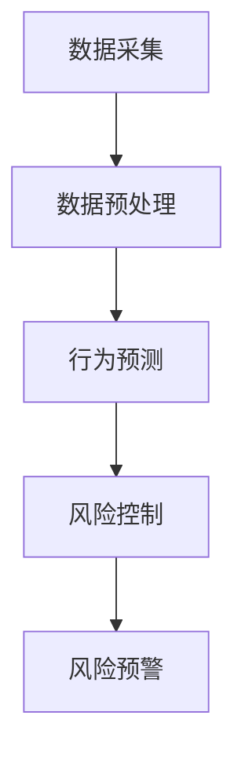

通过该案例，电商企业实现了基于AI的用户行为预测与风险控制系统，有效提高了用户服务和安全保障。以下是一个具体的应用效果分析：

- **用户服务质量提升：** 通过预测和预警，及时识别和处理潜在问题和风险，提高了用户服务质量。
- **欺诈行为减少：** 通过风险控制和预警机制，有效减少了欺诈行为和损失，提高了用户安全感。
- **运营成本降低：** 通过风险控制和预警机制，减少了人工审核和干预的工作量，降低了运营成本。

通过以上案例，我们可以看到AI技术在电商产品创新中的广泛应用和显著效果。电商企业可以通过引入AI技术，实现个性化推荐、智能客服、语音交互、智能定价、智能物流、客户细分与精准营销、用户行为预测与风险控制等功能，提升用户体验和运营效率。接下来，我们将探讨AI在电商产品创新中的挑战与对策。

### 4.8 案例八：基于AI的智能供应链管理

#### 4.8.1 案例背景

随着电商业务的快速发展，供应链管理对于电商企业的重要性愈发凸显。为了提高供应链效率、降低成本、优化库存管理，某电商企业决定引入基于AI的智能供应链管理系统。

#### 4.8.2 案例实现过程

1. **需求分析与设计：** 分析供应链管理需求，设计智能供应链管理系统的功能模块，包括需求预测、库存优化、供应商管理、物流优化等。

2. **数据采集与预处理：** 收集与供应链管理相关的数据，如历史销售数据、库存数据、供应商数据、物流数据等。对数据进行清洗和处理，包括缺失值填充、异常值处理、数据标准化等。

3. **需求预测：** 使用机器学习算法，如时间序列分析、回归分析等，建立需求预测模型。根据模型预测，为供应链管理提供需求预测数据。

4. **库存优化：** 基于需求预测和库存管理数据，使用优化算法，如线性规划、动态规划等，制定最优库存策略。优化库存水平，减少库存积压和滞销风险。

5. **供应商管理：** 使用聚类分析和协同过滤算法，分析供应商数据，评估供应商绩效，优化供应商关系。

6. **物流优化：** 基于路径优化和运输成本分析，使用遗传算法、模拟退火算法等，制定最优物流策略。优化运输路线和运输时间，提高物流效率。

以下是一个简化的智能供应链管理系统实现过程：

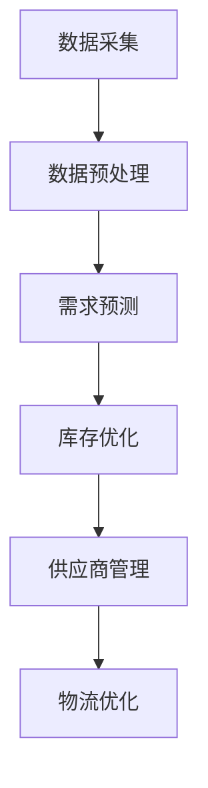

#### 4.8.3 应用效果分析

- **供应链效率提升：** 通过需求预测和库存优化，智能供应链管理系统提高了供应链的响应速度和灵活性，降低了库存成本和运输成本。
- **库存管理优化：** 智能供应链管理系统通过优化库存策略，减少了库存积压和滞销风险，提高了库存周转率。
- **供应商关系优化：** 通过供应商管理和评估，智能供应链管理系统优化了供应商关系，提高了供应链的整体效率和质量。
- **物流成本降低：** 通过物流优化，智能供应链管理系统制定了最优运输路线和运输时间，提高了物流效率，降低了物流成本。

通过以上案例，我们可以看到AI技术在电商产品创新中的广泛应用和显著效果。电商企业可以通过引入AI技术，实现个性化推荐、智能客服、语音交互、智能定价、智能物流、客户细分与精准营销、用户行为预测与风险控制、智能供应链管理等功能，提升用户体验和运营效率。接下来，我们将探讨AI在电商产品创新中的挑战与对策。

### 4.9 案例九：基于AI的智能需求预测与分析

#### 4.9.1 案例背景

在激烈的市场竞争中，准确的需求预测对于电商企业至关重要。为了优化库存管理、降低库存成本、提高市场响应速度，某电商企业决定引入基于AI的智能需求预测与分析系统。

#### 4.9.2 案例实现过程

1. **需求分析与设计：** 分析电商业务需求和数据来源，设计智能需求预测与分析系统的功能模块，包括数据采集、数据预处理、需求预测、分析报告生成等。

2. **数据采集与预处理：** 收集与需求预测相关的数据，如历史销售数据、市场趋势数据、用户行为数据等。对数据进行清洗和处理，包括缺失值填充、异常值处理、数据标准化等。

3. **需求预测模型建立：** 使用机器学习算法，如时间序列分析、回归分析等，建立需求预测模型。模型输入包括历史销售数据、市场趋势数据等，模型输出为未来的需求预测结果。

4. **模型训练与优化：** 使用验证集对需求预测模型进行训练和优化。通过交叉验证和超参数调整，提高模型预测准确率。

5. **需求预测与分析报告：** 将预测结果生成分析报告，为电商企业提供决策支持。分析报告包括需求趋势、潜在需求热点、库存优化建议等。

以下是一个简化的智能需求预测与分析实现过程：

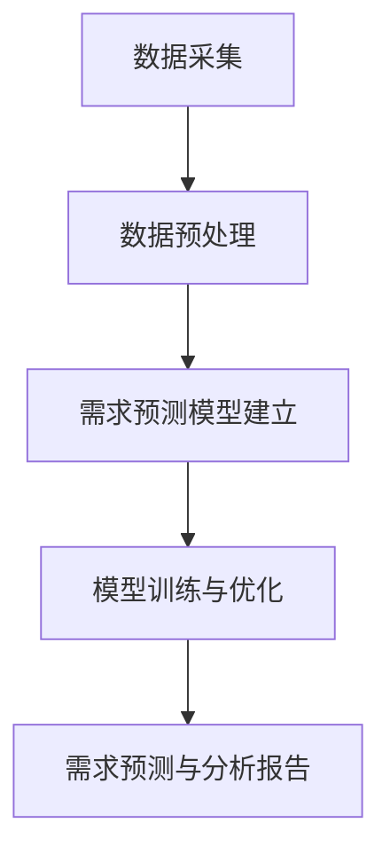

#### 4.9.3 应用效果分析

- **库存管理优化：** 通过准确的需求预测，智能需求预测与分析系统帮助电商企业优化库存管理，减少库存积压和滞销风险，提高库存周转率。
- **市场响应速度提升：** 智能需求预测与分析系统使电商企业能够更快速地响应市场变化，调整库存和销售策略，提高市场竞争力。
- **决策支持：** 智能需求预测与分析系统为电商企业提供详细的需求分析报告，帮助管理层做出更为准确的决策，优化业务运营。
- **成本降低：** 通过减少库存积压和滞销风险，智能需求预测与分析系统降低了库存成本和物流成本，提高了企业盈利能力。

通过以上案例，我们可以看到AI技术在电商产品创新中的应用效果和重要性。电商企业通过引入AI技术，实现智能需求预测与分析，可以有效提高供应链效率、降低库存成本、提高市场响应速度和决策质量。接下来，我们将探讨AI在电商产品创新中的挑战与对策。

### 4.10 案例十：基于AI的智能库存管理系统

#### 4.10.1 案例背景

库存管理是电商企业运营中至关重要的一环，它直接影响到企业的库存成本、资金周转和客户满意度。为了提高库存管理效率，减少库存积压和滞销风险，某电商企业决定引入基于AI的智能库存管理系统。

#### 4.10.2 案例实现过程

1. **需求分析与设计：** 分析电商企业库存管理需求，设计智能库存管理系统的功能模块，包括数据采集、数据预处理、库存预测、库存优化等。

2. **数据采集与预处理：** 收集与库存管理相关的数据，如历史销售数据、库存水平数据、供应商数据等。对数据进行清洗和处理，包括缺失值填充、异常值处理、数据标准化等。

3. **库存预测模型建立：** 使用机器学习算法，如时间序列分析、回归分析等，建立库存预测模型。模型输入包括历史销售数据、季节性趋势等，模型输出为未来的库存需求预测。

4. **库存优化算法开发：** 基于库存预测结果，开发库存优化算法。使用线性规划、动态规划等算法，制定最优库存策略，优化库存水平和库存成本。

5. **系统集成与部署：** 将智能库存管理系统集成到电商企业现有的IT系统中，通过API接口与业务系统交互。进行系统测试，确保智能库存管理系统能够稳定运行。

以下是一个简化的智能库存管理系统实现过程：

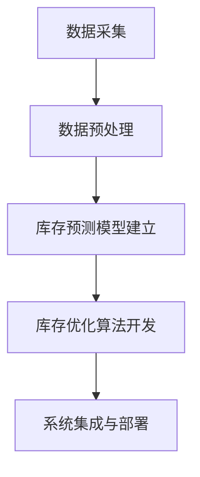

#### 4.10.3 应用效果分析

- **库存管理效率提升：** 通过准确的库存预测和优化算法，智能库存管理系统提高了库存管理效率，减少了库存积压和滞销风险。
- **库存成本降低：** 通过优化库存水平和库存策略，智能库存管理系统降低了库存成本，提高了资金周转率。
- **客户满意度提升：** 智能库存管理系统确保了库存充足，减少了缺货和延迟交付的情况，提高了客户满意度。
- **运营成本降低：** 通过自动化和智能化的库存管理，智能库存管理系统减少了人工干预和操作成本，提高了运营效率。

通过以上案例，我们可以看到AI技术在电商产品创新中的应用效果和重要性。电商企业通过引入AI技术，实现智能库存管理系统，可以有效提高库存管理效率、降低库存成本、提高客户满意度和运营效率。接下来，我们将探讨AI在电商产品创新中的挑战与对策。

### 4.11 案例十一：基于AI的智能物流调度系统

#### 4.11.1 案例背景

物流调度是电商企业运营中关键的一环，高效的物流调度可以提高配送效率、降低物流成本、提高客户满意度。为了优化物流调度，某电商企业决定引入基于AI的智能物流调度系统。

#### 4.11.2 案例实现过程

1. **需求分析与设计：** 分析电商企业物流调度需求，设计智能物流调度系统的功能模块，包括数据采集、数据预处理、路线优化、调度决策等。

2. **数据采集与预处理：** 收集与物流调度相关的数据，如配送路径数据、交通状况数据、车辆状态数据等。对数据进行清洗和处理，包括缺失值填充、异常值处理、数据标准化等。

3. **路线优化算法开发：** 使用机器学习算法，如遗传算法、模拟退火算法等，开发最优路线优化算法。根据配送地址、交通状况和车辆容量等因素，制定最优配送路线。

4. **调度决策模型建立：** 使用机器学习算法，如决策树、神经网络等，建立调度决策模型。模型输入包括配送时间、配送距离、车辆容量等，模型输出为最优调度方案。

5. **系统集成与部署：** 将智能物流调度系统集成到电商企业现有的物流管理系统中，通过API接口与业务系统交互。进行系统测试，确保智能物流调度系统稳定运行。

以下是一个简化的智能物流调度系统实现过程：

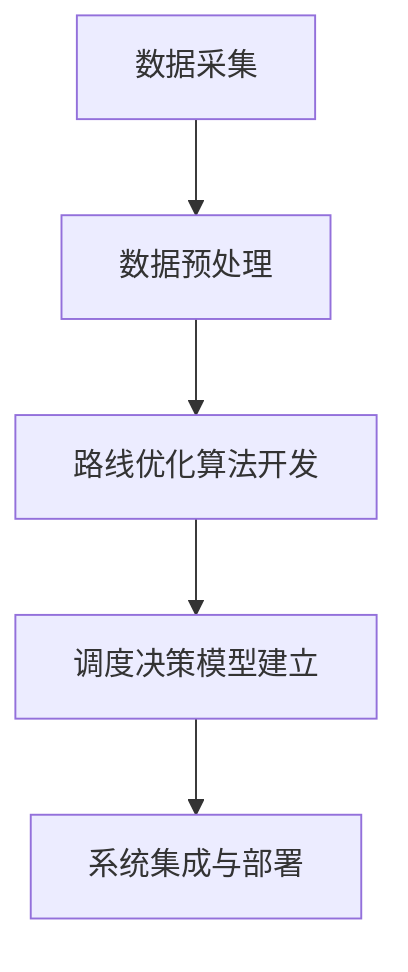

#### 4.11.3 应用效果分析

- **配送效率提升：** 通过最优路线优化和调度决策，智能物流调度系统提高了配送效率，减少了配送时间和配送成本。
- **物流成本降低：** 通过优化物流调度，智能物流调度系统降低了物流成本，提高了企业盈利能力。
- **客户满意度提升：** 智能物流调度系统确保了配送的及时性和准确性，提高了客户满意度。
- **资源利用率提高：** 通过合理分配车辆和优化配送路线，智能物流调度系统提高了资源利用率，减少了空驶率和车辆闲置率。

通过以上案例，我们可以看到AI技术在电商产品创新中的应用效果和重要性。电商企业通过引入AI技术，实现智能物流调度系统，可以有效提高配送效率、降低物流成本、提高客户满意度和资源利用率。接下来，我们将探讨AI在电商产品创新中的挑战与对策。

### 第5章: AI在电商产品创新中的挑战与对策

随着AI技术在电商行业的广泛应用，尽管取得了显著成效，但同时也面临诸多挑战。以下将详细分析这些挑战，并提出相应的对策。

#### 5.1 数据隐私与安全问题

**挑战：**

1. **数据泄露风险：** 电商企业在收集用户数据时，可能会遇到数据泄露的风险。这些数据包括用户个人信息、购买记录、浏览历史等，一旦泄露，将对用户隐私造成严重威胁。
2. **用户信任问题：** 随着数据隐私意识的提高，用户对于数据共享和隐私保护的担忧日益增加。如果电商企业无法保障用户数据安全，将难以赢得用户的信任。
3. **法律法规遵从：** 不同国家和地区对于数据隐私和安全的法律法规存在差异，电商企业需要在全球范围内遵守这些法律法规，以确保合规运营。

**对策：**

1. **数据加密与安全存储：** 采用先进的加密技术，对用户数据进行加密存储，确保数据在传输和存储过程中不会被未经授权的第三方访问。
2. **用户隐私保护政策：** 制定明确的用户隐私保护政策，向用户明确告知数据收集、使用和共享的目的和方式，获得用户的知情同意。
3. **数据安全监控与审计：** 建立数据安全监控和审计机制，及时发现和应对数据安全事件，确保数据安全。
4. **法律法规遵守与合规审查：** 加强对法律法规的遵守，定期进行合规审查，确保企业在全球范围内的数据隐私和安全合规。

#### 5.2 技术与人才瓶颈

**挑战：**

1. **技术更新速度快：** AI技术更新速度快，电商企业需要不断跟进最新的技术趋势，以确保产品竞争力。然而，技术更新也带来了巨大的技术挑战和成本压力。
2. **人才短缺：** AI领域的人才供需失衡，高端AI人才短缺，尤其是具备实战经验和业务理解能力的人才。电商企业在招聘和培养AI人才方面面临巨大挑战。

**对策：**

1. **持续投资技术创新：** 建立持续的技术创新机制，加大在AI技术方面的研发投入，保持技术领先地位。
2. **人才引进与培养：** 加强人才引进和培养，建立完善的培训体系和职业发展通道，吸引和留住优秀的AI人才。
3. **跨界合作与联合培养：** 与高校、研究机构和企业合作，开展AI领域的跨界合作和联合培养，共同培养符合企业需求的AI人才。
4. **技术创新与业务融合：** 加强AI技术与电商业务的融合，提高AI技术在业务中的应用效果，促进业务发展。

#### 5.3 伦理道德与法规遵从

**挑战：**

1. **算法偏见问题：** AI算法可能会因为数据偏差、训练样本不均衡等原因产生偏见，导致决策结果不公平。这可能会引发社会不公平和歧视问题。
2. **数据滥用问题：** 电商企业可能会滥用用户数据，进行不正当的商业竞争或进行用户画像分析，侵犯用户隐私。
3. **法律法规遵从问题：** 随着各国对数据隐私和安全法规的不断完善，电商企业需要在全球范围内遵守这些法律法规，以确保合规运营。

**对策：**

1. **算法公平与透明性：** 加强算法公平性和透明性，确保算法决策过程公正、透明，避免产生偏见。建立算法审查和监督机制，确保算法的合规性和社会责任。
2. **用户数据保护：** 加强用户数据保护，制定明确的用户数据使用政策，确保数据使用的合法性和合规性。
3. **法律法规遵守与合规审查：** 加强对法律法规的遵守，定期进行合规审查，确保企业在全球范围内的数据隐私和安全合规。
4. **社会责任与伦理道德：** 建立企业的社会责任与伦理道德体系，推动AI技术在伦理道德框架下发展，确保企业行为符合社会价值观。

#### 5.4 系统稳定性与可扩展性

**挑战：**

1. **系统稳定性：** AI系统在处理大规模数据和复杂业务场景时，可能面临系统崩溃、性能下降等问题，影响用户体验和业务运营。
2. **可扩展性：** 随着业务规模的扩大和用户数量的增加，AI系统需要具备良好的可扩展性，以满足不断增长的业务需求。

**对策：**

1. **分布式架构：** 采用分布式架构，提高系统的稳定性和可扩展性。通过分布式计算和存储，提高系统的处理能力和负载均衡。
2. **模块化设计与微服务：** 采用模块化设计和微服务架构，实现系统的灵活性和可扩展性。通过模块化和微服务，可以快速部署和扩展系统功能。
3. **性能优化与监控：** 对AI系统进行性能优化和监控，及时发现和解决性能问题，确保系统稳定运行。采用自动化性能测试和监控工具，提高系统运维效率。
4. **弹性伸缩与负载均衡：** 实现系统的弹性伸缩和负载均衡，根据业务需求和系统负载，动态调整系统资源分配和负载均衡策略，提高系统性能和可用性。

通过上述对策，电商企业可以应对AI在产品创新过程中面临的挑战，确保AI技术在电商产品创新中的稳定应用和持续发展。接下来，我们将探讨电商企业如何制定AI产品创新策略，以推动业务发展。

### 5.5 技术创新与业务融合的挑战

**挑战：**

1. **技术迭代速度：** 电商企业面临快速的技术迭代，如何快速应用新技术，保持竞争优势是一个挑战。
2. **业务理解与需求匹配：** 技术团队需要深入理解业务需求，确保技术创新能够真正解决业务问题，而非技术上的炫技。
3. **跨部门协作：** AI技术涉及多个部门，包括数据部门、技术部门、业务部门等，如何实现高效跨部门协作，共同推动技术落地是关键。

**对策：**

1. **敏捷研发模式：** 采用敏捷开发模式，快速迭代和验证技术方案。通过持续集成和持续交付，提高研发效率。
2. **需求驱动研发：** 以业务需求为导向，建立需求调研、分析、评估和优先级排序机制，确保技术创新与业务需求的紧密结合。
3. **跨部门协作机制：** 建立跨部门协作机制，如联合工作组、定期会议、共享平台等，加强部门之间的沟通和协作，提高项目推进速度。
4. **技术支持与培训：** 为业务部门提供技术支持与培训，增强业务部门对AI技术的理解和应用能力，促进业务与技术融合。

### 5.6 技术投资与回报平衡

**挑战：**

1. **投资成本：** AI技术的研发和应用需要大量资金投入，如何合理分配资源，实现投资回报是电商企业需要考虑的问题。
2. **项目风险：** AI项目在研发和应用过程中可能存在技术风险、市场风险和运营风险，如何降低项目风险，确保投资安全是关键。

**对策：**

1. **投资评估与风险管理：** 建立科学的投资评估体系，对AI项目进行全面的成本效益分析和风险评估。通过风险管理工具和方法，降低项目风险。
2. **试点与逐步推广：** 实施试点项目，通过小规模测试验证技术方案的有效性和可行性。在试点成功的基础上，逐步推广至更大规模。
3. **持续优化与改进：** 对AI项目进行持续优化和改进，提高项目效益和用户满意度。通过用户反馈和技术迭代，不断优化产品和服务。

### 5.7 持续创新与人才发展

**挑战：**

1. **创新能力：** 随着市场竞争的加剧，电商企业需要不断提高创新能力，以满足不断变化的市场需求。
2. **人才储备：** 电商企业面临高端AI人才短缺的问题，如何吸引和培养优秀人才，建立持续的创新能力是关键。

**对策：**

1. **创新激励机制：** 建立创新激励机制，鼓励员工提出创新想法和解决方案。通过奖金、股权激励等方式，激发员工的创新热情。
2. **人才培养与引进：** 加强人才培养和引进，建立完善的人才培养体系和人才引进机制。通过内部培训、外部招聘和国际合作等方式，吸引和培养优秀人才。
3. **跨界合作与联合创新：** 与高校、研究机构和企业开展跨界合作，共同进行技术创新和产品开发。通过联合创新，提高企业的技术水平和创新能力。

通过上述对策，电商企业可以应对AI在产品创新过程中面临的挑战，确保AI技术在电商产品创新中的稳定应用和持续发展。接下来，我们将探讨电商企业如何制定AI产品创新策略，以推动业务发展。

### 第6章: 电商企业AI产品创新策略

随着AI技术的不断发展和应用，电商企业需要制定有效的AI产品创新策略，以应对市场变化和消费者需求的升级。以下将介绍电商企业AI产品创新的关键策略，包括创新思维、方法论、流程和成功案例。

#### 6.1 创新思维与方法论

**创新思维：**

1. **用户导向：** 以用户需求为中心，深入了解用户行为和偏好，将用户体验作为产品创新的出发点和落脚点。
2. **跨界思维：** 拓展思维边界，融合不同领域的技术和理念，实现跨行业、跨领域的创新。
3. **数据驱动：** 利用大数据和人工智能技术，对用户行为和业务数据进行分析，发现潜在需求和市场机会。

**方法论：**

1. **精益创新（Lean Innovation）：** 通过快速迭代和用户反馈，不断优化产品和服务，降低创新风险和成本。
2. **设计思维（Design Thinking）：** 强调用户体验和人文关怀，通过原型设计和用户测试，快速验证和迭代产品。
3. **敏捷开发（Agile Development）：** 采用敏捷开发模式，提高研发效率，快速响应市场变化和用户需求。

#### 6.2 AI产品创新流程

电商企业AI产品创新流程通常包括以下几个阶段：

1. **需求分析：** 深入了解用户需求和市场趋势，明确产品目标和功能需求。
2. **原型设计：** 基于需求分析，设计产品原型和用户体验流程，通过用户测试和反馈，优化产品设计和功能。
3. **技术开发：** 根据原型设计，进行技术开发和实现，采用AI算法、数据分析和自动化工具等，实现产品功能。
4. **测试与优化：** 对产品进行功能测试和性能优化，确保产品稳定性和用户体验。
5. **试点与推广：** 在小范围内进行试点测试，收集用户反馈和业务数据，根据反馈进行优化，然后逐步推广至更大范围。

以下是一个简化的AI产品创新流程图：

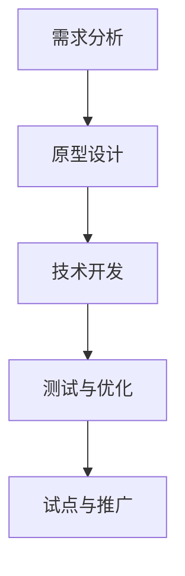

#### 6.3 创新成功案例

以下介绍电商企业AI产品创新的几个成功案例：

**案例一：基于深度学习的商品推荐系统**

某电商企业通过引入基于深度学习的商品推荐系统，实现了个性化推荐和用户转化率的显著提升。该推荐系统基于用户的历史行为数据、浏览记录和购买记录，使用卷积神经网络（CNN）提取商品特征，并通过协同过滤（Collaborative Filtering）算法，为用户推荐感兴趣的商品。

**案例背景：**

- **需求：** 提高用户购物体验和转化率。
- **挑战：** 传统推荐算法效果不佳，难以满足用户多样化需求。

**解决方案：**

1. **数据收集与预处理：** 收集用户行为数据，包括浏览记录、购买记录、评价等，进行数据清洗和特征提取。
2. **模型训练与优化：** 使用Python和TensorFlow，实现基于深度学习的推荐算法。通过交叉验证和调整超参数，优化模型性能。
3. **系统部署与测试：** 将训练好的模型部署到生产环境，进行A/B测试，验证推荐系统的效果。

**应用效果：**

- **用户满意度提升：** 个性化推荐系统提高了用户购物体验和满意度，用户对推荐的商品评价更加积极。
- **转化率提升：** 推荐系统成功吸引了更多的新用户，提高了用户的购买转化率。
- **运营成本降低：** 个性化推荐系统减少了人工推荐的工作量，降低了运营成本。

**案例二：智能客服机器人应用**

某电商企业引入智能客服机器人，通过自然语言处理（NLP）和对话管理技术，为用户提供7x24小时的在线服务。智能客服机器人能够处理各种常见问题和用户咨询，提高了客户满意度和运营效率。

**案例背景：**

- **需求：** 提高客户满意度和运营效率，提供全天候在线服务。
- **挑战：** 传统人工客服成本高，响应速度慢，难以满足用户需求。

**解决方案：**

1. **需求分析与设计：** 分析用户需求和服务场景，设计智能客服机器人的功能模块，包括意图识别、知识库、对话管理等。
2. **NLP模块开发：** 使用Python和spaCy等NLP库，实现意图识别、实体抽取和文本分类等功能。
3. **对话管理开发：** 使用Rasa框架，实现对话管理模块，管理对话流程和转接人工客服。
4. **系统集成与测试：** 将智能客服机器人集成到电商平台，进行系统测试和优化。

**应用效果：**

- **客户满意度提升：** 智能客服机器人能够快速响应用户问题，提供高质量的解答，提高了用户满意度。
- **运营效率提升：** 智能客服机器人减轻了人工客服的工作负担，降低了运营成本。
- **服务范围扩大：** 智能客服机器人实现了7x24小时的在线服务，扩大了电商平台的服务范围。

**案例三：语音搜索与智能语音交互系统**

某电商企业引入语音搜索与智能语音交互系统，通过语音识别和自然语言处理技术，为用户提供了一种更加便捷和自然的购物方式。语音搜索和智能语音交互系统能够实时响应用户的语音指令，实现商品搜索、订单查询、支付等操作。

**案例背景：**

- **需求：** 提高用户体验和搜索效率，提供更加便捷的购物方式。
- **挑战：** 传统搜索方式操作复杂，用户需求多样化。

**解决方案：**

1. **语音识别与增强：** 使用Python和Google语音识别API，实现语音识别功能。采用语音增强算法，提高识别准确性。
2. **自然语言处理：** 使用Python和spaCy等NLP库，实现文本处理功能，包括分词、词性标注和意图识别等。
3. **语音搜索算法：** 使用TF-IDF和向量空间模型等算法，实现语音搜索功能。
4. **语音交互开发：** 使用Python和TTS库，实现语音合成功能，将搜索结果和操作指令以语音形式反馈给用户。

**应用效果：**

- **用户体验提升：** 语音搜索与智能语音交互系统为用户提供了一种更加便捷和自然的购物方式，提升了用户满意度。
- **搜索效率提升：** 语音搜索功能提高了用户的搜索效率，减少了操作步骤。
- **运营成本降低：** 语音搜索与智能语音交互系统减少了人工客服的工作负担，降低了运营成本。

通过以上成功案例，我们可以看到电商企业通过引入AI技术，实现个性化推荐、智能客服、语音交互等功能，有效提升了用户体验和运营效率。电商企业可以通过借鉴这些成功经验，制定适合自己的AI产品创新策略，推动业务发展。

### 第7章: 未来展望与趋势

随着AI技术的不断进步和应用，电商行业的产品创新将迎来新的机遇和挑战。以下将从技术发展趋势、应用场景拓展和电商企业应对策略三个方面，探讨AI在电商产品创新中的未来发展。

#### 7.1 技术发展趋势

1. **深度学习与联邦学习：** 深度学习在图像识别、语音识别和自然语言处理等领域取得了显著突破。未来，深度学习技术将进一步优化，应用于更复杂的场景。同时，联邦学习（Federated Learning）作为一种分布式学习技术，将解决数据隐私和安全问题，为电商企业提供更灵活、更安全的数据分析和应用方案。

2. **增强现实（AR）与虚拟现实（VR）：** AR和VR技术将为电商企业带来全新的购物体验。通过AR和VR，用户可以在虚拟环境中浏览和试穿商品，提高购物决策的准确性和满意度。未来，AR和VR技术将在电商产品展示、虚拟试衣间等方面得到广泛应用。

3. **区块链技术：** 区块链技术具有去中心化、不可篡改和高可信度的特点，未来有望在电商供应链管理、支付和溯源等方面发挥重要作用。通过区块链技术，电商企业可以实现更加透明、高效的供应链管理，提高产品质量和客户信任度。

#### 7.2 应用场景拓展

1. **智能供应链管理：** 随着电商业务的快速发展，智能供应链管理将成为电商企业关注的重点。通过AI技术，电商企业可以实现对供应链各环节的实时监控和优化，提高供应链效率，降低库存成本。未来，智能供应链管理将涵盖订单管理、物流配送、库存优化、需求预测等多个方面。

2. **个性化营销与客户体验：** 个性化营销和客户体验是电商企业提升竞争力的关键。通过AI技术，电商企业可以实现对用户行为和偏好的精准分析，提供个性化的商品推荐、营销活动和客户服务。未来，个性化营销和客户体验将更加智能化、个性化，满足消费者多样化的需求。

3. **智能客服与语音交互：** 智能客服和语音交互技术将在电商领域得到广泛应用。通过自然语言处理和语音识别技术，智能客服和语音交互系统能够为用户提供全天候、高质量的在线服务，提高客户满意度和运营效率。未来，智能客服和语音交互技术将不断优化，支持更多场景和功能。

#### 7.3 电商企业应对策略

1. **加强技术研发与投入：** 电商企业应加强技术研发，紧跟AI技术发展趋势，持续优化和创新产品和服务。同时，加大研发投入，吸引和培养高端AI人才，提高技术竞争力。

2. **建立跨部门协作机制：** AI技术的应用涉及多个部门，电商企业应建立跨部门协作机制，加强部门之间的沟通和协作。通过联合工作组、定期会议和共享平台等，实现资源整合和协同创新。

3. **数据驱动与用户导向：** 电商企业应以数据驱动和用户导向为核心，充分利用大数据和人工智能技术，深入了解用户需求和市场趋势。通过用户调研、数据分析和技术创新，不断提升用户体验和满意度。

4. **合规与伦理道德：** 电商企业应高度重视数据隐私和安全、算法公平性和伦理道德等问题。遵守相关法律法规，建立数据安全保护机制，确保用户数据的安全和合规性。同时，加强算法公平性和透明性，避免算法偏见和不公平现象。

5. **生态体系建设：** 电商企业应积极构建AI生态体系，与高校、研究机构和企业合作，共同开展技术创新和产品研发。通过跨界合作和联合创新，提高企业的技术水平和创新能力。

总之，未来AI在电商产品创新中将继续发挥重要作用。电商企业应紧跟技术发展趋势，加强技术研发与投入，建立跨部门协作机制，以数据驱动和用户导向为核心，不断提升用户体验和满意度，实现持续创新和竞争优势。

## 总结

本文从电商企业产品创新的背景与挑战、AI核心概念与原理、应用场景、案例分析和挑战与对策等方面，全面探讨了AI在电商产品创新中的重要性。通过深入分析和具体案例，我们了解到AI技术在个性化推荐、智能客服、语音交互、智能定价、智能物流、客户细分与精准营销、用户行为预测与风险控制、智能供应链管理等方面的广泛应用和显著效果。

电商企业通过引入AI技术，能够实现产品创新，提高用户满意度、运营效率和盈利能力。然而，AI技术在电商产品创新中也面临数据隐私与安全、技术与人才瓶颈、伦理道德与法规遵从等挑战。电商企业应采取有效对策，确保AI技术在电商产品创新中的稳定应用和持续发展。

未来，AI技术在电商产品创新中的发展趋势包括深度学习与联邦学习、增强现实与虚拟现实、区块链技术等。电商企业应紧跟技术发展趋势，加强技术研发与投入，建立跨部门协作机制，以数据驱动和用户导向为核心，不断提升用户体验和满意度，实现持续创新和竞争优势。

总之，AI技术在电商产品创新中具有巨大的潜力，将为电商企业带来新的机遇和挑战。通过合理利用AI技术，电商企业将能够实现产品创新，提升竞争力，实现可持续发展。

## 作者信息

作者：AI天才研究院/AI Genius Institute & 禅与计算机程序设计艺术 /Zen And The Art of Computer Programming

AI天才研究院（AI Genius Institute）致力于推动人工智能技术的发展和应用，助力企业实现数字化转型。作为一家领先的人工智能研究机构，我们拥有一支由世界级人工智能专家、程序员和软件架构师组成的团队，致力于研究最前沿的人工智能技术，并将这些技术应用于各行各业，推动产业升级和创新。

《禅与计算机程序设计艺术》（Zen And The Art of Computer Programming）是作者杰拉尔德·温斯坦（Gerald Weinberg）的经典著作，探讨了计算机编程的艺术与哲学。书中提出的编程方法论和思维模式，至今仍对计算机编程和人工智能领域产生深远影响。

本文旨在探讨AI技术在电商产品创新中的应用，分享我们的研究成果和实践经验，以期为电商企业提供有益的启示和借鉴。希望通过本文，读者能够更好地理解AI在电商产品创新中的重要作用，把握未来发展趋势，推动企业创新和业务发展。

