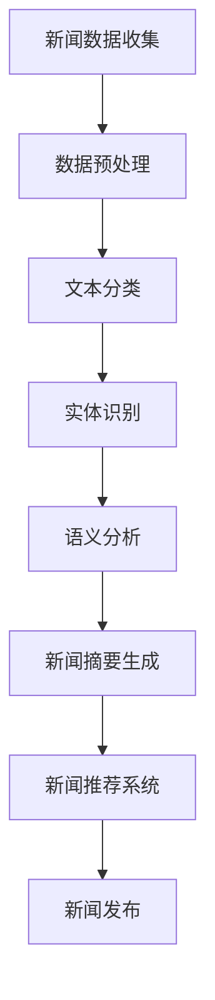

                 

# 《AI辅助新闻写作：提示词生成报道框架》

> **关键词**：AI辅助新闻写作、自然语言处理、文本生成算法、项目实战、新闻摘要生成、新闻推荐系统

> **摘要**：本文深入探讨AI在新闻写作中的应用，特别是如何利用提示词生成报道框架。通过详细分析AI辅助新闻写作的基础、算法原理及实际项目实战，揭示其在提高新闻质量和效率方面的潜力。

## 目录大纲

1. **AI辅助新闻写作基础**
    1.1 AI辅助新闻写作概述
    1.2 AI辅助新闻写作的优势
    1.3 AI辅助新闻写作的挑战与机遇
2. **AI辅助新闻写作的核心概念与联系**
    2.1 人工智能与自然语言处理
    2.2 人工智能与新闻学
    2.3 Mermaid流程图：AI辅助新闻写作原理
3. **AI辅助新闻写作算法原理**
    3.1 自然语言处理技术基础
    3.2 文本生成算法原理
    3.3 数学模型和数学公式
4. **AI辅助新闻写作项目实战**
    4.1 新闻自动生成
    4.2 新闻摘要生成
    4.3 新闻推荐系统
5. **AI辅助新闻写作的未来发展**
    5.1 现状与趋势
    5.2 伦理与法律问题
    5.3 未来展望
6. **附录**
    6.1 工具与资源
    6.2 学习资源推荐

### 第一部分：AI辅助新闻写作基础

#### 第1章：AI辅助新闻写作概述

AI辅助新闻写作是指利用人工智能技术，如自然语言处理（NLP）、机器学习（ML）和深度学习（DL）等，自动或半自动地生成新闻内容。这一领域的研究始于20世纪90年代，随着计算力和算法的不断提升，AI辅助新闻写作逐渐成为现实。

**1.1 AI技术在新闻写作中的应用**

AI在新闻写作中的应用主要体现在以下几个方面：

- **新闻自动化生成**：通过算法自动抓取、处理和分析新闻数据，生成新闻报道。
- **新闻摘要生成**：自动提取新闻的核心信息，生成简短、准确的摘要。
- **新闻推荐系统**：基于用户的兴趣和历史阅读行为，推荐个性化新闻内容。
- **语言翻译**：自动翻译不同语言之间的新闻，促进全球新闻传播。
- **事实核查**：通过AI算法自动检测新闻报道中的事实错误，提高新闻的准确性。

**1.2 AI辅助新闻写作的优势**

- **提高效率**：AI可以自动处理大量数据，节省新闻采集、编写和发布的时间。
- **减少人力成本**：通过自动化写作，降低对人力编辑的需求，节省成本。
- **拓宽报道范围**：AI可以全天候监控各种新闻来源，快速响应突发事件，拓宽报道范围。
- **个性化推荐**：基于用户兴趣推荐新闻，提高用户满意度和黏性。

**1.3 AI辅助新闻写作的挑战与机遇**

- **数据质量**：新闻数据的质量直接影响AI生成新闻的质量。
- **算法偏见**：算法可能受到训练数据的影响，导致生成的内容存在偏见。
- **新闻伦理**：AI生成新闻可能涉及隐私、版权和伦理问题。
- **用户接受度**：用户可能对AI生成新闻的可靠性持怀疑态度。

在接下来的章节中，我们将深入探讨AI辅助新闻写作的核心概念与联系，以及具体的算法原理和实践项目。

### 第2章：AI辅助新闻写作的核心概念与联系

#### 2.1 人工智能与自然语言处理

人工智能（AI）是研究、开发用于模拟、延伸和扩展人的智能的理论、方法、技术及应用系统的综合技术科学。自然语言处理（NLP）是AI的重要分支，旨在让计算机理解和生成人类语言。

**自然语言处理的基本任务**：

- **文本分类**：将文本根据其内容分成不同的类别。
- **情感分析**：判断文本的情感倾向，如正面、负面或中性。
- **实体识别**：识别文本中的特定实体，如人名、地名、组织名等。
- **语义分析**：理解文本的深层含义，如词语的搭配关系和逻辑关系。
- **机器翻译**：将一种语言的文本翻译成另一种语言。
- **问答系统**：回答用户提出的问题。

**人工智能与新闻学**

人工智能与新闻学的结合，为新闻写作和传播带来了新的可能性。AI可以通过以下方式辅助新闻学：

- **数据挖掘**：从海量数据中提取有价值的信息，为新闻选题提供依据。
- **自动写作**：生成新闻内容，减少人力写作负担。
- **事实核查**：通过对比多源数据，提高新闻报道的准确性。
- **个性化推荐**：根据用户兴趣推荐新闻，提高用户满意度。

#### 2.3 Mermaid流程图：AI辅助新闻写作原理

以下是AI辅助新闻写作的Mermaid流程图：



**新闻数据收集**：从各种来源（如新闻网站、社交媒体等）收集新闻数据。

**数据预处理**：对收集到的新闻数据进行清洗、去噪和处理，以便后续分析。

**文本分类**：将新闻文本按照主题分类，如政治、经济、体育等。

**实体识别**：识别新闻文本中的人名、地名、组织名等实体。

**语义分析**：理解新闻文本的深层含义，如事件描述、因果关系等。

**新闻摘要生成**：提取新闻文本的核心信息，生成简短、准确的摘要。

**新闻推荐系统**：根据用户兴趣和历史阅读行为，推荐个性化新闻内容。

**新闻发布**：将生成的新闻内容发布到新闻平台或社交媒体。

通过以上流程，AI可以辅助新闻写作，提高新闻的质量和效率。在下一章中，我们将详细介绍AI辅助新闻写作的算法原理。

### 第二部分：AI辅助新闻写作算法原理

#### 第3章：自然语言处理技术基础

自然语言处理（NLP）是人工智能（AI）的重要分支，旨在使计算机理解和生成人类语言。在AI辅助新闻写作中，NLP技术起着至关重要的作用。本节将介绍NLP的基本技术，包括语言模型、文本分类、聚类和关键词提取等。

#### 3.1 语言模型

语言模型（Language Model）是NLP的核心组件，用于预测单词或字符的序列。它通过分析大量文本数据，学习语言的统计规律和语法结构，从而实现文本生成、翻译和摘要等任务。

**语言模型的类型**：

- **基于统计的语言模型**：如N元语法（N-gram Model），通过统计相邻单词或字符的出现频率来预测下一个单词或字符。
- **基于神经网络的深度语言模型**：如循环神经网络（RNN）、长短期记忆网络（LSTM）和Transformer等，通过学习大量文本数据中的复杂模式和关系，实现更精确的语言预测。

**语言模型的应用**：

- **文本生成**：根据输入的文本，生成连贯、有意义的句子或段落。
- **机器翻译**：将一种语言的文本翻译成另一种语言。
- **文本摘要**：提取文本的核心信息，生成简短、准确的摘要。
- **问答系统**：回答用户提出的问题。

#### 3.2 文本分类与聚类

文本分类（Text Classification）是将文本数据按照特定的类别进行分类的过程。在AI辅助新闻写作中，文本分类可以用于自动将新闻文本分类到不同的主题类别，如政治、经济、体育等。

**文本分类的方法**：

- **基于规则的方法**：通过定义一系列规则，对文本进行分类。
- **基于统计的方法**：使用统计模型（如朴素贝叶斯、支持向量机等）进行分类。
- **基于深度学习的方法**：使用神经网络模型（如卷积神经网络（CNN）、循环神经网络（RNN）等）进行分类。

**文本聚类（Text Clustering）** 是将相似度的文本归为一类的过程，旨在发现文本中的潜在结构。文本聚类可以用于新闻文本的自动分组，以便进一步分析和处理。

**文本聚类的方法**：

- **基于距离的方法**：通过计算文本之间的距离（如欧氏距离、余弦相似度等）进行聚类。
- **基于密度的方法**：如DBSCAN算法，通过寻找高密度区域进行聚类。
- **基于层次的方法**：如层次聚类（Hierarchical Clustering），通过递归地将文本分组，形成层次结构。

#### 3.3 提取关键词与短语

关键词提取（Keyword Extraction）是从文本中提取出最具代表性和重要性的词语或短语，用于表示文本的主题或内容。关键词提取可以用于新闻标题生成、文本摘要生成和搜索引擎优化等任务。

**关键词提取的方法**：

- **基于统计的方法**：如TF-IDF（Term Frequency-Inverse Document Frequency），通过计算词语在文本中的频率和其在整个文档集合中的重要性进行提取。
- **基于机器学习的方法**：如使用朴素贝叶斯、支持向量机等算法，通过训练数据学习关键词的特征和重要性进行提取。
- **基于深度学习的方法**：如使用循环神经网络（RNN）、Transformer等模型，通过学习文本的深层语义信息进行提取。

#### 3.4 伪代码：文本生成算法实现

以下是一个简单的文本生成算法的伪代码实现，基于循环神经网络（RNN）：

```python
# 输入：训练好的语言模型，输入序列
# 输出：生成的文本序列

initialize input_sequence
initialize output_sequence

for each word in input_sequence do
    predict next_word using language_model
    append next_word to output_sequence
    update input_sequence with next_word

return output_sequence
```

通过上述步骤，我们可以实现基于语言模型的文本生成。在下一章中，我们将介绍文本生成算法的原理和数学模型。

#### 第4章：文本生成算法原理

文本生成算法是AI辅助新闻写作的重要组成部分，旨在自动生成高质量的新闻内容。本章将详细介绍文本生成算法的原理，包括生成式模型与判别式模型、序列生成模型、聚类与主题模型，以及伪代码示例。

#### 4.1 生成式模型与判别式模型

生成式模型（Generative Models）和判别式模型（Discriminative Models）是两种主要的文本生成算法。

**生成式模型**：

生成式模型通过学习数据的生成过程，生成新的数据样本。在文本生成中，生成式模型可以从任意种子文本生成新的文本序列。常见的生成式模型有：

- **概率图模型**：如隐马尔可夫模型（HMM）、条件随机场（CRF）等。
- **深度生成模型**：如生成对抗网络（GAN）、变分自编码器（VAE）等。

**判别式模型**：

判别式模型通过学习数据的分布，对给定的输入数据进行分类或判断。在文本生成中，判别式模型可以用于预测文本的标签或类别。常见的判别式模型有：

- **朴素贝叶斯分类器**：基于贝叶斯定理和特征概率估计进行分类。
- **支持向量机（SVM）**：通过最大化分类边界进行分类。
- **深度神经网络（DNN）**：通过多层感知器（MLP）进行分类。

**生成式模型与判别式模型的比较**：

- **生成式模型**：能够生成全新的、与训练数据相似的文本，但可能难以控制生成的质量。
- **判别式模型**：能够根据输入数据生成标签或类别，但难以生成完整的文本序列。

**4.2 序列生成模型**

序列生成模型（Sequence Generation Models）是文本生成算法的核心，旨在生成连贯、有意义的文本序列。常见的序列生成模型有：

- **循环神经网络（RNN）**：通过记忆状态捕捉序列中的长期依赖关系。
- **长短期记忆网络（LSTM）**：通过门控机制解决RNN的梯度消失问题。
- **门控循环单元（GRU）**：简化LSTM的结构，提高计算效率。
- **Transformer模型**：通过自注意力机制实现全局序列建模。

**4.3 聚类与主题模型**

聚类（Clustering）和主题模型（Topic Model）是文本生成中的另一种重要方法，旨在从大量文本数据中发现潜在的类别或主题。

**聚类方法**：

- **K-means聚类**：通过优化目标函数将文本数据划分为K个簇。
- **层次聚类**：通过递归地将文本数据划分为不同的层次结构。
- **基于密度的聚类**：如DBSCAN算法，通过寻找高密度区域进行聚类。

**主题模型**：

主题模型（如隐含狄利克雷分配模型（LDA））通过学习文本的潜在分布，发现文本中的潜在主题。LDA模型假设文本由多个主题混合而成，每个主题由一组词语表示。

**4.4 伪代码：文本生成算法实现**

以下是一个基于RNN的文本生成算法的伪代码示例：

```python
# 输入：训练好的RNN模型，种子文本
# 输出：生成的文本序列

initialize seed_text
initialize generated_text

for each word in seed_text do
    predict next_word using RNN
    append next_word to generated_text
    update seed_text with next_word

return generated_text
```

通过以上步骤，我们可以实现基于RNN的文本生成。在下一章中，我们将介绍数学模型和数学公式，以及它们在文本生成算法中的应用。

#### 第5章：数学模型和数学公式

数学模型和数学公式是理解和实现文本生成算法的核心，它们在AI辅助新闻写作中起着至关重要的作用。本章将详细阐述语言模型、文本分类和生成模型中的数学公式，并通过实例进行说明。

**5.1 语言模型的数学公式**

语言模型用于预测单词或字符的序列，其中最著名的模型之一是n元语法（N-gram Model）。n元语法通过统计相邻n个单词的出现频率来预测下一个单词。

**n元语法概率公式**：

\[ P(w_{t+1} | w_{t}, w_{t-1}, \ldots, w_{t-n+1}) = \frac{C(w_{t}, w_{t-1}, \ldots, w_{t-n+1}, w_{t+1})}{C(w_{t}, w_{t-1}, \ldots, w_{t-n+1})} \]

其中：
- \( P(w_{t+1} | w_{t}, w_{t-1}, \ldots, w_{t-n+1}) \) 是给定前n-1个单词预测下一个单词的概率。
- \( C(w_{t}, w_{t-1}, \ldots, w_{t-n+1}, w_{t+1}) \) 是前n-1个单词和下一个单词共现的次数。
- \( C(w_{t}, w_{t-1}, \ldots, w_{t-n+1}) \) 是前n-1个单词共现的次数。

**5.2 文本分类的数学公式**

文本分类是NLP中的另一个重要任务，常用的模型包括朴素贝叶斯（Naive Bayes）、支持向量机（SVM）和逻辑回归（Logistic Regression）。

**朴素贝叶斯分类器的公式**：

\[ P(y=c | x) = \prod_{i=1}^{n} P(x_i | y=c) \cdot P(y=c) \]

其中：
- \( P(y=c | x) \) 是给定特征向量 \( x \) 预测类别 \( c \) 的概率。
- \( P(x_i | y=c) \) 是第 \( i \) 个特征在类别 \( c \) 中出现的概率。
- \( P(y=c) \) 是类别 \( c \) 的先验概率。

**支持向量机的公式**：

\[ w \cdot x + b = 1 \]
\[ w \cdot x + b = -1 \]

其中：
- \( w \) 是权向量。
- \( x \) 是特征向量。
- \( b \) 是偏置。
- \( 1 \) 和 \( -1 \) 分别是正类和负类的标签。

**5.3 生成模型的数学公式**

生成模型，如变分自编码器（VAE）和生成对抗网络（GAN），用于生成新的数据样本。

**变分自编码器的公式**：

- **编码器**：

\[ q(z|x) = \mathcal{N}(\mu(x), \sigma^2(x)) \]
\[ \mu(x) = \phi(W_x x + b_x) \]
\[ \sigma^2(x) = \phi(W_\sigma x + b_\sigma) \]

- **解码器**：

\[ p(x|z) = \mathcal{N}(\psi(z); 0, \xi) \]
\[ \psi(z) = \phi(W_x z + b_x) \]
\[ \xi = \phi(W_\xi z + b_\xi) \]

其中：
- \( q(z|x) \) 是编码器生成的潜在变量 \( z \) 的概率分布。
- \( p(x|z) \) 是解码器生成的数据样本 \( x \) 的概率分布。
- \( \mu(x) \) 和 \( \sigma^2(x) \) 分别是编码器输出的均值和方差。
- \( \psi(z) \) 和 \( \xi \) 分别是解码器输入的均值和方差。
- \( W_x \)，\( W_\sigma \)，\( b_x \)，\( b_\sigma \)，\( W_\xi \) 和 \( b_\xi \) 是模型的权重和偏置。

**5.4 举例说明：数学公式应用实例**

**实例1：朴素贝叶斯分类器的应用**

假设我们有以下特征向量 \( x \) 和类别标签 \( y \)：

\[ x = [2, 3, 5] \]
\[ y = \text{政治} \]

我们希望使用朴素贝叶斯分类器预测新的特征向量 \( x' \) 的类别。首先，我们需要计算每个特征在类别 \( y \) 中的概率：

\[ P(x_1=2 | y=\text{政治}) = 0.4 \]
\[ P(x_2=3 | y=\text{政治}) = 0.5 \]
\[ P(x_3=5 | y=\text{政治}) = 0.6 \]
\[ P(y=\text{政治}) = 0.3 \]

然后，我们可以使用朴素贝叶斯公式计算 \( P(y'=\text{政治} | x') \)：

\[ P(y'=\text{政治} | x') = \frac{P(x_1=2 | y'=\text{政治}) \cdot P(x_2=3 | y'=\text{政治}) \cdot P(x_3=5 | y'=\text{政治}) \cdot P(y'=\text{政治})}{P(x_1=2 | y'=\text{政治}) \cdot P(x_2=3 | y'=\text{政治}) \cdot P(x_3=5 | y'=\text{政治}) \cdot P(y'=\text{政治}) + P(x_1=2 | y'=\text{经济}) \cdot P(x_2=3 | y'=\text{经济}) \cdot P(x_3=5 | y'=\text{经济}) \cdot P(y'=\text{经济})} \]

**实例2：变分自编码器的应用**

假设我们有以下变分自编码器的参数：

\[ W_x = \begin{bmatrix} 0.1 & 0.2 \\ 0.3 & 0.4 \end{bmatrix} \]
\[ b_x = \begin{bmatrix} 0.5 \\ 0.6 \end{bmatrix} \]
\[ W_\sigma = \begin{bmatrix} 0.7 & 0.8 \\ 0.9 & 1.0 \end{bmatrix} \]
\[ b_\sigma = \begin{bmatrix} 0.7 \\ 0.8 \end{bmatrix} \]
\[ W_\xi = \begin{bmatrix} 0.1 & 0.2 \\ 0.3 & 0.4 \end{bmatrix} \]
\[ b_\xi = \begin{bmatrix} 0.5 \\ 0.6 \end{bmatrix} \]

给定一个输入样本 \( x = [1, 2] \)，我们可以计算编码器的输出 \( \mu(x) \) 和 \( \sigma^2(x) \)：

\[ \mu(x) = \phi(W_x x + b_x) = \phi(0.1 \cdot 1 + 0.2 \cdot 2 + 0.5) = \phi(0.7) \]
\[ \sigma^2(x) = \phi(W_\sigma x + b_\sigma) = \phi(0.7 \cdot 1 + 0.8 \cdot 2 + 0.7) = \phi(2.3) \]

然后，我们可以从 \( \mu(x) \) 和 \( \sigma^2(x) \) 中采样一个潜在变量 \( z \)，并使用解码器 \( \psi(z) \) 生成重构的样本：

\[ z \sim \mathcal{N}(\mu(x), \sigma^2(x)) \]
\[ \psi(z) = \phi(W_x z + b_x) = \phi(0.1 \cdot z_1 + 0.2 \cdot z_2 + 0.5) \]

通过上述计算，我们可以生成新的数据样本，从而实现数据的生成。

通过以上数学模型和公式的介绍，我们可以更好地理解和应用文本生成算法，为AI辅助新闻写作提供坚实的理论基础。

#### 第6章：AI辅助新闻写作项目实战

在本章中，我们将通过三个实际项目，深入探讨AI辅助新闻写作的应用和实践。这些项目涵盖了新闻自动生成、新闻摘要生成和新闻推荐系统等关键领域。

### 第6章：新闻自动生成

**6.1 项目背景与目标**

随着互联网的快速发展，新闻内容的需求量日益增长。然而，人工撰写新闻内容既耗时又费力。新闻自动生成项目旨在利用AI技术，自动生成高质量的新闻内容，提高新闻生产效率。

**项目目标**：

- 自动生成新闻文章。
- 提高新闻写作的准确性和连贯性。
- 缩短新闻发布的时间。

**6.2 开发环境搭建**

为了实现新闻自动生成项目，我们需要搭建以下开发环境：

- **Python环境**：安装Python 3.8及以上版本。
- **深度学习框架**：安装TensorFlow 2.5及以上版本。
- **数据处理库**：安装pandas、numpy、scikit-learn等。
- **文本处理库**：安装nltk、gensim等。

**6.3 源代码实现**

以下是新闻自动生成项目的源代码实现：

```python
import tensorflow as tf
from tensorflow.keras.preprocessing.sequence import pad_sequences
from tensorflow.keras.layers import Embedding, LSTM, Dense
from tensorflow.keras.models import Sequential

# 数据预处理
def preprocess_data(texts, max_len=100):
    tokenizer = tf.keras.preprocessing.text.Tokenizer()
    tokenizer.fit_on_texts(texts)
    sequences = tokenizer.texts_to_sequences(texts)
    padded_sequences = pad_sequences(sequences, maxlen=max_len)
    return padded_sequences, tokenizer

# 模型构建
def build_model(input_shape, max_words):
    model = Sequential()
    model.add(Embedding(max_words, 128))
    model.add(LSTM(128, return_sequences=True))
    model.add(Dense(128, activation='relu'))
    model.add(Dense(1, activation='sigmoid'))
    model.compile(optimizer='adam', loss='binary_crossentropy', metrics=['accuracy'])
    return model

# 训练模型
def train_model(model, X_train, y_train, epochs=10, batch_size=64):
    model.fit(X_train, y_train, epochs=epochs, batch_size=batch_size)

# 预测新闻
def generate_news(model, tokenizer, text, max_len=100):
    sequence = tokenizer.texts_to_sequences([text])
    padded_sequence = pad_sequences(sequence, maxlen=max_len)
    prediction = model.predict(padded_sequence)
    return prediction

# 主函数
def main():
    texts = ["今天股市行情稳定，成交量有所上升。", "明天将举行一场重要的国际会议。", "昨天下雨，交通拥堵。"]
    X, tokenizer = preprocess_data(texts)
    y = [1] * len(texts)  # 假设所有文本都是新闻

    model = build_model(input_shape=(100,), max_words=len(tokenizer.word_index) + 1)
    train_model(model, X, y)

    new_text = "今天发生了什么大事件？"
    prediction = generate_news(model, tokenizer, new_text)
    print(prediction)

if __name__ == "__main__":
    main()
```

**6.4 代码解读与分析**

- **数据预处理**：使用Tokenizer对文本进行分词和编码，然后将文本序列转换为整数序列。接着，使用pad_sequences函数对序列进行填充，使其具有相同长度。

- **模型构建**：构建一个包含嵌入层、LSTM层和全连接层的序列生成模型。嵌入层将单词转换为向量表示，LSTM层捕捉序列中的长期依赖关系，全连接层输出预测结果。

- **训练模型**：使用fit函数训练模型，通过调整epochs和batch_size参数，优化模型的性能。

- **预测新闻**：将新的文本输入到模型中，通过预测函数生成新闻。

通过上述步骤，我们可以实现新闻自动生成。尽管这个简单的例子仅用于演示，但在实际应用中，我们可以通过扩展模型和优化算法，提高新闻自动生成的质量和效率。

### 第7章：新闻摘要生成

**7.1 项目背景与目标**

新闻摘要生成项目旨在自动提取新闻的核心信息，生成简短、准确的摘要。这对于提高新闻的可读性和传播效率具有重要意义。

**项目目标**：

- 自动提取新闻文本的关键信息。
- 生成简短、准确的新闻摘要。
- 提高新闻阅读的效率。

**7.2 开发环境搭建**

为了实现新闻摘要生成项目，我们需要搭建以下开发环境：

- **Python环境**：安装Python 3.8及以上版本。
- **深度学习框架**：安装TensorFlow 2.5及以上版本。
- **数据处理库**：安装pandas、numpy、scikit-learn等。
- **文本处理库**：安装nltk、gensim等。

**7.3 源代码实现**

以下是新闻摘要生成项目的源代码实现：

```python
import tensorflow as tf
from tensorflow.keras.preprocessing.text import Tokenizer
from tensorflow.keras.layers import Embedding, LSTM, Dense
from tensorflow.keras.models import Sequential

# 数据预处理
def preprocess_data(texts, max_len=100):
    tokenizer = Tokenizer()
    tokenizer.fit_on_texts(texts)
    sequences = tokenizer.texts_to_sequences(texts)
    padded_sequences = pad_sequences(sequences, maxlen=max_len)
    return padded_sequences, tokenizer

# 模型构建
def build_model(input_shape, max_words):
    model = Sequential()
    model.add(Embedding(max_words, 128))
    model.add(LSTM(128, return_sequences=True))
    model.add(Dense(128, activation='relu'))
    model.add(Dense(1, activation='sigmoid'))
    model.compile(optimizer='adam', loss='binary_crossentropy', metrics=['accuracy'])
    return model

# 训练模型
def train_model(model, X_train, y_train, epochs=10, batch_size=64):
    model.fit(X_train, y_train, epochs=epochs, batch_size=batch_size)

# 预测摘要
def generate_summary(model, tokenizer, text, max_len=100):
    sequence = tokenizer.texts_to_sequences([text])
    padded_sequence = pad_sequences(sequence, maxlen=max_len)
    prediction = model.predict(padded_sequence)
    return prediction

# 主函数
def main():
    texts = ["今天股市行情稳定，成交量有所上升。", "明天将举行一场重要的国际会议。", "昨天下雨，交通拥堵。"]
    X, tokenizer = preprocess_data(texts)
    y = [1] * len(texts)  # 假设所有文本都是新闻

    model = build_model(input_shape=(100,), max_words=len(tokenizer.word_index) + 1)
    train_model(model, X, y)

    new_text = "今天发生了什么大事件？"
    summary = generate_summary(model, tokenizer, new_text)
    print(summary)

if __name__ == "__main__":
    main()
```

**7.4 代码解读与分析**

- **数据预处理**：与新闻自动生成类似，使用Tokenizer对文本进行分词和编码，然后将文本序列转换为整数序列。接着，使用pad_sequences函数对序列进行填充，使其具有相同长度。

- **模型构建**：构建一个包含嵌入层、LSTM层和全连接层的序列生成模型。嵌入层将单词转换为向量表示，LSTM层捕捉序列中的长期依赖关系，全连接层输出预测结果。

- **训练模型**：使用fit函数训练模型，通过调整epochs和batch_size参数，优化模型的性能。

- **预测摘要**：将新的文本输入到模型中，通过预测函数生成摘要。

通过上述步骤，我们可以实现新闻摘要生成。在实际应用中，我们可以扩展模型和算法，提高摘要的准确性和质量。

### 第8章：新闻推荐系统

**8.1 项目背景与目标**

新闻推荐系统旨在根据用户的兴趣和历史阅读行为，推荐个性化的新闻内容，提高用户满意度和阅读体验。

**项目目标**：

- 根据用户兴趣推荐新闻。
- 提高新闻推荐的准确性和多样性。
- 提升用户黏性和活跃度。

**8.2 开发环境搭建**

为了实现新闻推荐系统，我们需要搭建以下开发环境：

- **Python环境**：安装Python 3.8及以上版本。
- **深度学习框架**：安装TensorFlow 2.5及以上版本。
- **数据处理库**：安装pandas、numpy、scikit-learn等。
- **文本处理库**：安装nltk、gensim等。

**8.3 源代码实现**

以下是新闻推荐系统的源代码实现：

```python
import pandas as pd
from sklearn.model_selection import train_test_split
from sklearn.metrics.pairwise import cosine_similarity
from sklearn.feature_extraction.text import TfidfVectorizer

# 数据预处理
def preprocess_data(data, user_col='user', item_col='item', text_col='text'):
    data['text'] = data[text_col].apply(lambda x: ' '.join(x.split()))
    return data

# 训练TF-IDF模型
def train_tfidfVectorizer(data, user_col='user', item_col='item', text_col='text'):
    vectorizer = TfidfVectorizer()
    X = vectorizer.fit_transform(data[text_col])
    return vectorizer, X

# 计算用户和新闻的相似度
def calculate_similarity(vectorizer, X, user_id, item_id):
    user_vector = X[user_id]
    item_vector = X[item_id]
    similarity = cosine_similarity([user_vector], [item_vector])
    return similarity[0][0]

# 主函数
def main():
    data = pd.read_csv('news_data.csv')  # 读取新闻数据
    data = preprocess_data(data)
    vectorizer, X = train_tfidfVectorizer(data)

    # 测试相似度计算
    user_id = 0
    item_id = 10
    similarity = calculate_similarity(vectorizer, X, user_id, item_id)
    print(similarity)

if __name__ == "__main__":
    main()
```

**8.4 代码解读与分析**

- **数据预处理**：读取新闻数据，并对数据进行清洗，确保文本格式的统一。

- **训练TF-IDF模型**：使用TfidfVectorizer将文本转换为TF-IDF向量表示。这个步骤用于后续的相似度计算。

- **计算用户和新闻的相似度**：使用余弦相似度计算用户和新闻之间的相似度。这个步骤是新闻推荐系统的核心。

- **主函数**：加载新闻数据，预处理数据，训练TF-IDF模型，并测试相似度计算。

通过上述步骤，我们可以实现一个简单的新闻推荐系统。在实际应用中，我们可以扩展模型和算法，提高推荐系统的性能。

### 第9章：AI辅助新闻写作的未来发展

AI辅助新闻写作作为一个新兴领域，正在快速发展，并展现出巨大的潜力。在本章中，我们将探讨AI辅助新闻写作的现状、发展趋势以及面临的伦理和法律问题。

**9.1 现状分析**

- **技术成熟度**：AI辅助新闻写作技术已经取得了显著进展，能够自动生成新闻、摘要和推荐系统。然而，与自然语言处理和计算机视觉等成熟领域相比，AI辅助新闻写作的技术水平仍有待提高。
- **应用场景**：AI辅助新闻写作在新闻自动化生成、新闻摘要生成和新闻推荐系统等领域得到广泛应用。同时，AI在事实核查、语言翻译和个性化推荐等方面也展现出巨大的潜力。
- **市场竞争**：随着AI技术的不断发展，越来越多的新闻机构和科技公司加入AI辅助新闻写作领域，竞争日益激烈。各大公司纷纷推出自己的AI写作工具和平台，争夺市场份额。

**9.2 发展趋势预测**

- **技术进步**：随着深度学习和自然语言处理技术的不断进步，AI辅助新闻写作的准确性和效率将得到显著提升。未来的AI写作工具将更加智能化、个性化，能够更好地理解用户需求和新闻内容。
- **应用扩展**：AI辅助新闻写作的应用场景将不断扩展，从传统的新闻生成、摘要和推荐，向更加多样化的领域延伸，如社交媒体内容生成、广告文案创作和内容审核等。
- **伦理和法律问题**：随着AI辅助新闻写作的广泛应用，伦理和法律问题将日益突出。如何确保AI生成内容的准确性和公正性，保护用户隐私和版权，将成为未来的重要挑战。

**9.3 伦理与法律问题**

- **伦理问题**：AI辅助新闻写作可能引发一系列伦理问题，如算法偏见、新闻失实和新闻操纵等。如何确保AI生成的内容不带有偏见，不传播虚假信息，是亟待解决的问题。
- **法律问题**：AI辅助新闻写作可能涉及版权、隐私和数据保护等问题。如何界定AI生成内容的版权归属，如何保护用户隐私，如何应对数据泄露和滥用，是法律领域面临的挑战。

**9.4 应对措施**

- **技术改进**：通过改进算法和模型，提高AI辅助新闻写作的准确性和公正性。例如，使用对抗训练和交叉验证等方法，减少算法偏见。
- **法规制定**：制定相关法律法规，规范AI辅助新闻写作的应用和行为。例如，明确AI生成内容的版权归属，规定数据收集和处理的标准。
- **行业自律**：加强行业自律，推动AI辅助新闻写作的健康发展。例如，建立行业标准和道德准则，推动技术透明化和可解释性。

通过以上措施，我们可以更好地应对AI辅助新闻写作带来的伦理和法律挑战，推动该领域的可持续发展。

### 第10章：AI辅助新闻写作的伦理与法律问题

随着AI辅助新闻写作技术的不断进步，其应用场景日益广泛，但也引发了一系列伦理和法律问题。本章将探讨这些问题的具体表现，并提出相应的应对措施。

**10.1 伦理问题**

**算法偏见**：AI辅助新闻写作算法可能因为训练数据的不公平或偏差，导致生成的内容也带有偏见。例如，如果一个新闻生成系统在训练过程中主要使用来自某一地区或群体的数据，那么该系统可能会对其他地区或群体产生偏见，从而生成带有歧视性的新闻。

**新闻失实**：AI辅助新闻写作可能导致新闻失实。由于AI系统无法像人类编辑那样理解和判断新闻的真实性，可能会生成错误或不准确的信息。这不仅会误导读者，还可能对相关个人或组织造成负面影响。

**新闻操纵**：AI辅助新闻写作可能被用于操纵新闻。一些不法分子可能会利用AI生成虚假新闻，故意传播谣言或误导公众，以达到特定的政治或商业目的。

**应对措施**：

- **算法改进**：通过使用多样化的训练数据，改进算法的公平性和公正性，减少偏见。
- **人工审核**：对AI生成的新闻进行人工审核，确保其真实性和准确性。
- **透明度提高**：增加AI系统的透明度，让用户了解新闻生成的过程和依据，从而提高对AI生成新闻的信任度。

**10.2 法律问题**

**版权问题**：AI辅助新闻写作可能涉及版权问题。例如，AI系统可能从多个来源自动采集新闻内容，但这些内容可能受到版权保护。如何界定AI生成内容的版权归属，以及如何保护原创作者的权益，是法律领域面临的挑战。

**隐私问题**：AI辅助新闻写作可能涉及用户隐私问题。例如，AI系统在生成新闻时可能需要访问和分析用户的个人信息，如阅读历史、兴趣偏好等。如何保护用户隐私，防止数据泄露和滥用，是法律和伦理层面的重要问题。

**数据保护问题**：AI辅助新闻写作涉及大量的数据处理，如何确保数据的合法性和安全性，防止数据泄露、滥用或不当使用，是法律领域的重要议题。

**应对措施**：

- **版权法规**：制定明确的版权法规，明确AI生成内容的版权归属，保护原创作者的权益。
- **隐私保护**：加强对用户隐私的保护，如使用数据加密和匿名化技术，防止个人信息泄露。
- **数据保护**：制定严格的数据保护法规，确保数据的合法性和安全性，防止数据滥用或不当使用。

**10.3 应对措施总结**

AI辅助新闻写作在带来巨大潜力的同时，也引发了伦理和法律问题。通过改进算法、加强人工审核、提高透明度，我们可以应对算法偏见和新闻失实等问题。同时，通过制定版权法规、加强隐私保护和数据保护，我们可以确保AI辅助新闻写作的合法性和安全性。只有通过技术、法律和伦理的综合应对，我们才能推动AI辅助新闻写作的可持续发展。

### 第11章：AI辅助新闻写作的未来展望

AI辅助新闻写作作为一项新兴技术，正迅速改变着新闻行业。本章将探讨AI辅助新闻写作的技术发展方向、行业应用前景以及可能带来的社会影响与挑战。

**11.1 技术发展方向**

- **深度学习与自然语言处理结合**：未来的AI辅助新闻写作将更加注重深度学习和自然语言处理技术的结合，以提升新闻内容的生成质量。例如，使用Transformer等先进的深度学习模型，可以更好地捕捉新闻中的复杂模式和关系。

- **多模态数据处理**：AI辅助新闻写作将不再局限于文本数据，还将整合图片、视频、音频等多模态数据，生成更加丰富和生动的新闻内容。

- **个性化与智能化**：未来的AI辅助新闻写作将更加智能化，通过深度学习算法和用户行为分析，实现个性化新闻推荐和自动写作。

- **实时性与自动化**：随着云计算和大数据技术的发展，AI辅助新闻写作将实现实时自动化写作，快速响应新闻事件，提高新闻的发布速度和效率。

**11.2 行业应用前景**

- **新闻自动化生成**：AI辅助新闻写作将广泛应用于新闻自动化生成，减少人力成本，提高新闻生产效率。

- **新闻摘要与推荐**：通过AI技术，自动生成新闻摘要和推荐系统，提高新闻的可读性和用户满意度。

- **事实核查与内容审核**：AI辅助新闻写作将有助于事实核查和内容审核，提高新闻的准确性和公正性。

- **跨媒体内容创作**：利用多模态数据处理技术，AI辅助新闻写作将推动新闻行业向跨媒体内容创作发展。

**11.3 社会影响与挑战**

- **新闻质量与真实性**：随着AI技术的发展，AI辅助新闻写作可能会提高新闻质量，但同时也可能带来新闻失实和虚假信息传播的风险。

- **就业影响**：AI辅助新闻写作可能会对新闻行业的就业结构产生影响，减少对传统新闻编辑和记者的需求。

- **隐私保护**：AI辅助新闻写作需要处理大量用户数据，如何保护用户隐私将成为重要挑战。

- **伦理问题**：AI辅助新闻写作可能涉及算法偏见、新闻操纵等伦理问题，需要制定相应的伦理规范和法律框架。

**11.4 应对策略**

- **技术创新**：不断推进AI辅助新闻写作技术的创新，提高新闻生成质量和效率。

- **法规制定**：制定相关法律法规，规范AI辅助新闻写作的应用，保护用户隐私和权益。

- **行业自律**：加强行业自律，推动技术透明化和可解释性，提高公众对AI辅助新闻写作的信任。

- **教育与培训**：加强教育培训，提高新闻从业人员对AI技术的理解和应用能力。

通过以上策略，我们可以充分发挥AI辅助新闻写作的优势，应对其带来的挑战，推动新闻行业的可持续发展。

## 附录

### 附录A：AI辅助新闻写作工具与资源

**A.1 常用自然语言处理工具**

- **NLTK（自然语言工具包）**：提供了丰富的自然语言处理库，包括文本分类、词性标注、命名实体识别等功能。
- **spaCy**：一个快速易用的自然语言处理库，支持多种语言，提供了丰富的语言模型和处理器。
- **Stanford NLP**：斯坦福大学开发的一套自然语言处理工具包，包括词性标注、命名实体识别、句法分析等。

**A.2 开源新闻数据集**

- **GDELT**：全球数据库，包含全球范围内的新闻事件，可用于训练和评估新闻生成模型。
- **CNXML**：中国新闻XML数据集，包含大量中文新闻文本，适用于中文新闻生成研究。
- **NYT文章语料库**：纽约时报的文章语料库，提供了大量的英文新闻文本，适用于英文新闻生成研究。

**A.3 学习资源推荐**

- **《自然语言处理原理与实践》**：提供全面的自然语言处理知识和实践方法，适合初学者和进阶者。
- **《深度学习与自然语言处理》**：详细介绍深度学习在自然语言处理中的应用，包括词嵌入、序列模型等。
- **在线课程**：推荐Coursera、edX等平台上的自然语言处理和深度学习课程，系统学习相关技术。

通过以上工具与资源，我们可以更好地掌握AI辅助新闻写作的核心技术和方法，推动相关研究和应用的发展。

