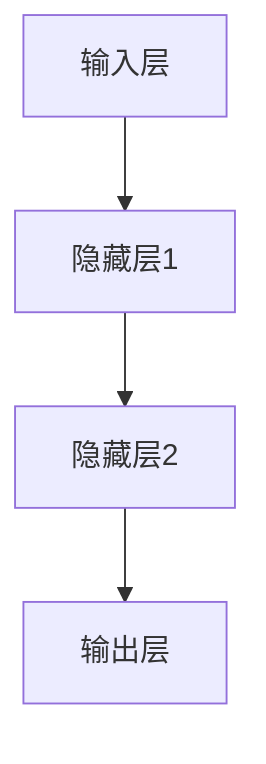

                 

## Andrej Karpathy：人工智能的未来发展机遇

> **关键词：**人工智能，未来，机遇，挑战，应用，战略，发展。
>
> **摘要：**本文旨在探讨人工智能领域的重要发展趋势和未来机遇，分析当前的技术挑战和应用场景，并提出企业应对人工智能变革的策略。通过深入剖析核心理论和算法原理，结合实际案例和实战经验，为读者提供一幅人工智能未来发展的全景图。

### 第一部分：引言与背景

#### 第1章：引言与背景

##### 1.1 《Andrej Karpathy：人工智能的未来发展机遇》的愿景和目标

《Andrej Karpathy：人工智能的未来发展机遇》旨在为读者呈现一幅人工智能领域未来发展的全景图。本书将深入探讨人工智能技术的发展趋势、面临的挑战以及潜在的应用场景，为读者提供有价值的洞见和实用策略。

- **主题介绍**：本书将围绕人工智能的未来发展展开讨论，包括基础理论、核心算法、应用实践以及未来展望。通过系统性的阐述，帮助读者全面理解人工智能的各个方面，从而更好地把握未来的发展机遇。

- **目标读者**：本书的目标读者群体主要包括对人工智能感兴趣的技术人员、研究人员、企业和决策者。无论您是刚刚入门的人工智能新手，还是已经有一定经验的专业人士，本书都将为您提供有价值的知识和启示。

- **结构概述**：本书整体结构分为五个部分，分别是引言与背景、基础理论与技术、应用与实践、未来展望与策略以及附录。通过逐步深入的方式，引导读者从宏观到微观，全面了解人工智能领域。

##### 1.2 人工智能的现状与挑战

人工智能作为当前科技领域的热点，已经取得了显著的进展。然而，与此同时，人工智能也面临着一系列的挑战。

- **当前趋势**：过去几年，人工智能在多个领域取得了突破性进展。从语音识别、图像处理到自然语言理解，人工智能的应用场景不断拓展，已经渗透到各行各业。深度学习、强化学习等算法的不断发展，使得人工智能模型在复杂任务上的表现日益出色。

- **技术挑战**：尽管人工智能取得了巨大的成功，但仍然面临着诸多技术挑战。首先，数据隐私和安全性问题日益凸显，如何确保用户数据的安全成为人工智能发展的重要课题。其次，算法的公平性和透明性也受到广泛关注，如何避免算法偏见和歧视成为人工智能研究的重要方向。此外，人工智能的能耗问题也是一个亟待解决的难题，如何提高计算效率、降低能耗是当前人工智能领域的重要挑战。

- **未来机遇**：尽管人工智能面临诸多挑战，但未来依然充满机遇。随着技术的不断进步，人工智能有望在医疗、金融、工业、教育等领域发挥更大的作用，带来深远的变革。此外，人工智能的跨界融合也为未来的发展提供了广阔的空间，如人工智能与物联网、区块链等技术的结合，将推动新兴领域的快速发展。

### 第二部分：基础理论与技术

#### 第2章：人工智能基础理论

##### 2.1 人工智能的定义与历史

人工智能（Artificial Intelligence，简称AI）是计算机科学的一个分支，旨在研究和开发用于模拟、延伸和扩展人类智能的理论、方法和技术。人工智能的定义和范围随着技术的发展而不断演变，但其核心目标始终是让计算机具有类似人类的智能。

- **AI的定义**：人工智能是一种模拟、延伸或扩展人类智能的理论、方法和技术。它涵盖了多个学科领域，包括计算机科学、认知科学、心理学、神经科学等。人工智能旨在使计算机具备理解、学习、推理、规划、感知和交互等人类智能的能力。

- **历史回顾**：人工智能的发展历程可以追溯到20世纪50年代。早期的人工智能研究主要基于符号主义方法，即通过编程实现逻辑推理和问题求解。然而，随着计算能力的提升和大数据时代的到来，数据驱动的人工智能方法逐渐崛起，特别是深度学习技术的出现，使得人工智能取得了前所未有的突破。从早期的符号主义到现代的数据驱动方法，人工智能经历了数次变革，不断推动着科技的发展。

##### 2.2 机器学习与深度学习基础

机器学习（Machine Learning，简称ML）是人工智能的一个重要分支，旨在让计算机通过数据学习，从而实现自动化决策和预测。深度学习（Deep Learning，简称DL）是机器学习的一个子领域，通过构建深层神经网络来实现复杂的特征提取和模型训练。

- **机器学习基础**：机器学习主要分为监督学习、无监督学习和强化学习三种类型。监督学习（Supervised Learning）通过已标记的数据训练模型，从而进行预测和分类。无监督学习（Unsupervised Learning）则不依赖于已标记的数据，通过自动发现数据中的模式和结构。强化学习（Reinforcement Learning）则通过试错和反馈来学习如何在特定环境中做出最优决策。

- **深度学习核心概念**：深度学习是基于多层神经网络（Neural Networks）的学习方法，通过逐层提取数据中的特征，实现从原始数据到高阶抽象的转化。深度学习的核心概念包括神经网络（Neural Networks）、卷积神经网络（Convolutional Neural Networks，CNN）、循环神经网络（Recurrent Neural Networks，RNN）等。神经网络是由大量神经元组成的计算模型，通过调整神经元之间的连接权重来学习数据中的特征。卷积神经网络是深度学习中的一个重要模型，通过卷积操作提取图像中的局部特征。循环神经网络则通过循环结构实现对序列数据的建模。

##### 2.3 人工智能的数学基础

人工智能的发展离不开数学的支持，特别是概率论与统计学、线性代数和优化理论。这些数学工具为人工智能的研究提供了坚实的理论基础。

- **概率论与统计学**：概率论与统计学在人工智能中的应用非常广泛，如最大似然估计、贝叶斯网络、概率图模型等。最大似然估计是一种基于概率分布的参数估计方法，通过最大化数据出现概率来估计模型参数。贝叶斯网络是一种概率图模型，通过表示变量之间的条件概率关系来实现不确定性推理。概率图模型则通过构建图结构来描述变量之间的依赖关系，从而实现复杂的概率推理。

- **线性代数与优化**：线性代数是人工智能的核心数学工具之一，包括矩阵运算、向量空间、特征分解等概念。矩阵运算在神经网络中具有重要作用，如权重矩阵的更新和激活函数的计算。优化理论则是解决人工智能问题的重要方法，包括梯度下降算法、牛顿法、随机梯度下降等。梯度下降算法是一种最常用的优化方法，通过沿着梯度方向更新模型参数，以最小化损失函数。牛顿法则利用二次近似来加速梯度下降过程，提高收敛速度。随机梯度下降则通过随机抽样数据来更新模型参数，降低了计算复杂度。

#### 第3章：核心算法原理

##### 3.1 神经网络原理

神经网络（Neural Networks）是人工智能的基础算法之一，通过模拟人脑神经元的工作原理，实现数据的特征提取和分类。神经网络的基本原理包括神经元结构、前向传播和反向传播算法。

- **神经网络基础**：神经网络由大量的神经元组成，每个神经元接收多个输入，并通过激活函数产生一个输出。神经元的结构通常包括输入层、隐藏层和输出层。输入层接收外部输入数据，隐藏层通过非线性变换提取数据特征，输出层则对特征进行分类或预测。

- **前向传播**：前向传播是神经网络训练过程中的第一步，通过将输入数据传递到神经网络中，逐层计算神经元的输出。具体步骤如下：
  1. 将输入数据输入到输入层。
  2. 每个输入层神经元将数据传递给隐藏层神经元，并计算加权求和。
  3. 隐藏层神经元通过激活函数（如ReLU、Sigmoid、Tanh等）产生输出。
  4. 将隐藏层神经元的输出传递到输出层，计算最终输出。

- **反向传播**：反向传播是神经网络训练过程中的关键步骤，通过计算损失函数的梯度，更新网络权重。具体步骤如下：
  1. 计算输出层的预测值和实际标签之间的损失。
  2. 计算输出层神经元的梯度，并反向传播到隐藏层。
  3. 逐层计算隐藏层神经元的梯度，直到输入层。
  4. 根据梯度更新网络权重和偏置。

##### 3.2 自然语言处理（NLP）

自然语言处理（Natural Language Processing，简称NLP）是人工智能的重要应用领域之一，旨在使计算机理解和处理人类语言。NLP的核心算法包括词嵌入、语言模型、文本分类等。

- **NLP基础**：词嵌入（Word Embedding）是将单词映射到高维向量空间，从而实现语义表示。常见的词嵌入方法包括Word2Vec、GloVe等。语言模型（Language Model）是用于预测下一个单词或句子的概率分布的模型，常见的语言模型包括n-gram模型、神经网络语言模型等。文本分类（Text Classification）是将文本数据分类到预定义的类别中，常见的文本分类算法包括朴素贝叶斯、支持向量机、深度学习等。

- **NLP算法原理**：
  1. **词嵌入**：词嵌入通过将单词映射到高维向量空间，实现语义表示。Word2Vec方法通过训练词向量的分布式表示，从而实现语义相似性计算。GloVe方法则通过全局矩阵分解来学习词向量和词与词之间的关系。
  2. **语言模型**：语言模型通过预测下一个单词或句子的概率分布来实现自然语言理解。n-gram模型通过统计相邻单词的频率来预测下一个单词。神经网络语言模型则通过构建深度神经网络来学习单词的序列表示和概率分布。
  3. **文本分类**：文本分类通过将文本数据分类到预定义的类别中，实现对文本内容的理解和分析。朴素贝叶斯和支持向量机等传统机器学习算法在文本分类中应用广泛。深度学习算法如卷积神经网络（CNN）和循环神经网络（RNN）也在文本分类中取得了显著的性能提升。

##### 3.3 计算机视觉

计算机视觉（Computer Vision）是人工智能的另一个重要应用领域，旨在使计算机能够理解和解析视觉信息。计算机视觉的核心算法包括图像处理、目标检测、图像分类等。

- **计算机视觉基础**：图像处理是计算机视觉的基础，包括图像的获取、预处理、增强等。图像处理算法如滤波、边缘检测、特征提取等，为后续的目标检测和图像分类提供了基础数据。目标检测（Object Detection）是将图像中的物体检测出来并进行定位。常见的目标检测算法包括R-CNN、SSD、YOLO等。图像分类（Image Classification）是将图像数据分类到预定义的类别中，常见的图像分类算法包括softmax回归、卷积神经网络（CNN）等。

- **视觉算法原理**：
  1. **图像处理**：图像处理通过滤波、边缘检测、特征提取等操作，提取图像中的重要特征。滤波算法如高斯滤波、中值滤波等，用于去除噪声。边缘检测算法如Canny边缘检测、Sobel算子等，用于提取图像的边缘信息。
  2. **目标检测**：目标检测算法通过检测图像中的物体并提出边界框来实现物体识别。R-CNN、SSD、YOLO等算法在目标检测领域取得了显著的性能提升。R-CNN通过区域提议、特征提取和分类器来实现目标检测。SSD通过构建多尺度特征网络来实现多尺度目标检测。YOLO通过将图像分成网格并预测每个网格中的物体来实现目标检测。
  3. **图像分类**：图像分类通过将图像数据分类到预定义的类别中，实现对图像内容的理解和分析。softmax回归是一种常见的图像分类算法，通过计算每个类别的概率分布来实现分类。卷积神经网络（CNN）通过构建深度神经网络来实现图像分类，具有强大的特征提取和分类能力。

### 第三部分：应用与实践

#### 第4章：人工智能应用案例

##### 4.1 人工智能在医疗领域的应用

人工智能在医疗领域的应用日益广泛，从疾病诊断、基因组学研究到药物研发，人工智能正在改变医疗行业的面貌。

- **案例研究**：人工智能在医疗领域的成功应用案例层出不穷。例如，谷歌旗下的DeepMind推出了一款名为DeepMind Health的人工智能系统，可以用于分析医学影像，帮助医生更准确地诊断疾病。此外，IBM的Watson for Oncology系统利用人工智能技术，为医生提供个性化的治疗方案，从而提高治疗效果。

- **技术挑战**：尽管人工智能在医疗领域取得了显著进展，但仍然面临诸多技术挑战。首先，医疗数据的质量和隐私问题亟待解决。医疗数据往往包含敏感信息，如何确保数据的安全和隐私成为人工智能应用的重要课题。其次，人工智能模型在医疗领域的解释性问题也受到广泛关注，如何解释和验证人工智能模型的决策过程，使其具备更高的可信度和可解释性，是当前研究的重要方向。

##### 4.2 人工智能在金融领域的应用

人工智能在金融领域的应用也取得了显著成效，从风险控制、量化交易到客户服务，人工智能正在助力金融行业的数字化转型。

- **案例研究**：人工智能在金融领域的应用案例众多。例如，摩根大通利用人工智能技术开发了名为COiN的自动合同分析工具，可以自动审查和分类数百万份金融合同，大幅提高了合同处理的效率。此外，美国投行摩根士丹利也利用人工智能技术开发了智能投资组合管理系统，为投资者提供个性化的投资建议。

- **技术挑战**：金融领域的人工智能应用也面临一系列技术挑战。首先，金融数据的质量和准确性至关重要，如何保证数据的质量和完整性是人工智能应用的基础。其次，金融市场的波动性和复杂性要求人工智能模型具备更高的鲁棒性和适应性。此外，算法的公平性和透明性也是金融领域人工智能应用的重要课题，如何避免算法偏见和歧视，确保模型的公平性和透明性，是当前研究的重要方向。

##### 4.3 人工智能在工业自动化领域的应用

人工智能在工业自动化领域的应用也取得了显著成效，从智能制造、机器人控制到生产线优化，人工智能正在推动工业自动化的发展。

- **案例研究**：人工智能在工业自动化领域的成功应用案例众多。例如，特斯拉利用人工智能技术优化生产线的自动化流程，实现了高效的电动汽车生产。此外，通用电气（GE）的Predix平台利用人工智能技术，为工业设备提供智能监测和预测性维护，从而提高了生产效率和设备可靠性。

- **技术挑战**：尽管人工智能在工业自动化领域取得了显著进展，但仍然面临一系列技术挑战。首先，工业环境复杂多变，如何保证人工智能模型在复杂工业环境中的鲁棒性和适应性是当前研究的重要课题。其次，工业自动化领域的数据质量和完整性问题也需要解决，如何获取高质量的数据并进行有效的数据处理是人工智能应用的关键。此外，人工智能在工业自动化领域的应用还需要解决系统集成和数据共享等问题，以确保各个系统之间的协同和高效运行。

### 第四部分：未来展望与策略

#### 第5章：人工智能的发展趋势

##### 5.1 人工智能的未来发展方向

随着技术的不断进步，人工智能在未来将继续朝着更加智能化、高效化、安全化的方向发展。

- **前沿技术**：人工智能领域的前沿技术包括量子计算、脑机接口、增强现实（AR）、虚拟现实（VR）等。量子计算具有极高的计算速度和并行处理能力，有望在复杂计算任务中发挥重要作用。脑机接口技术则通过将人脑与计算机直接连接，实现人类意识与计算机的交互。增强现实和虚拟现实技术则通过创造虚拟环境，为人工智能提供了更加丰富的应用场景。

- **行业影响**：人工智能对未来各行业可能带来深远的影响。在医疗领域，人工智能有望实现个性化治疗、精准医疗和药物研发的突破。在金融领域，人工智能将提高风险管理能力、优化投资策略和提升客户服务水平。在工业领域，人工智能将推动智能制造、工业互联网和智能物流的发展。此外，人工智能还在教育、交通、能源等多个领域具有广阔的应用前景，将极大地改变人类的生活方式和工作模式。

##### 5.2 人工智能伦理与政策

人工智能的发展不仅带来技术上的变革，也引发了伦理和社会层面的讨论。如何在确保技术进步的同时，保护个人隐私、保障社会公平，成为人工智能发展的重要课题。

- **伦理问题**：人工智能伦理问题主要集中在数据隐私、算法偏见、公平性等方面。数据隐私问题涉及如何保护个人数据不被滥用和泄露。算法偏见问题则关注人工智能系统在决策过程中可能出现的歧视和偏见。公平性问题则涉及如何确保人工智能系统在不同人群中的表现一致，避免对社会造成不公平的影响。

- **政策导向**：各国政府和组织在人工智能领域纷纷出台相关政策，以引导和规范人工智能的发展。例如，欧盟推出了《人工智能伦理准则》，强调人工智能的发展应遵循人类价值观和社会责任。美国则通过《人工智能国家战略》，明确将人工智能作为国家优先发展领域。我国也在《新一代人工智能发展规划》中提出了人工智能发展的战略目标和路径。政策的出台旨在推动人工智能技术的健康发展，同时防范潜在的风险和挑战。

#### 第6章：企业的人工智能战略

在人工智能时代，企业需要制定有效的人工智能战略，以应对技术变革和市场竞争。

##### 6.1 人工智能战略规划

制定人工智能战略是企业成功的关键。以下是企业制定人工智能战略时需要考虑的几个方面：

- **目标设定**：企业需要明确人工智能战略的目标，如提高生产效率、提升产品质量、降低成本等。明确的目标有助于企业集中资源，制定具体的实施计划。

- **资源分配**：企业需要合理分配资源，包括资金、人力和技术等。在资源有限的情况下，企业应优先考虑核心业务领域和具有较高潜力的应用场景。

- **技术路线**：企业需要选择合适的人工智能技术路线，如深度学习、强化学习、自然语言处理等。技术路线的选择应根据企业的业务需求和现有技术能力进行。

- **人才培养**：企业需要培养和引进人工智能专业人才，提高团队的技术水平和创新能力。同时，企业还应注重内部培训和知识共享，打造学习型组织。

##### 6.2 人工智能人才培养

人才培养是企业人工智能战略的重要环节。以下是企业培养人工智能人才时需要关注的几个方面：

- **人才需求**：企业需要明确人工智能人才的需求，包括技术能力和软技能。技术能力主要包括编程、算法、数据分析和机器学习等。软技能则包括沟通能力、团队合作和问题解决能力等。

- **培训与发展**：企业应制定系统的培训和发展计划，包括技术培训、项目管理培训和领导力培训等。通过内部培训和外部合作，提升员工的技术水平和综合素质。

- **职业发展**：企业应提供清晰的职业发展路径，为员工提供晋升机会和职业规划。同时，企业还应关注员工的职业发展和心理健康，营造良好的工作氛围。

### 第五部分：附录

#### 第7章：资源与工具

在人工智能领域，大量的资源和工具可以帮助研究人员和开发者提高工作效率，以下是其中一些重要的资源与工具。

##### 7.1 人工智能开发工具

以下是人工智能领域常用的一些开发工具：

- **TensorFlow**：TensorFlow是谷歌开发的开源机器学习库，支持多种编程语言，具有高度灵活性和可扩展性。
- **PyTorch**：PyTorch是Facebook开发的开源机器学习库，以其动态图模型和易用性受到广大开发者的喜爱。
- **Keras**：Keras是一个高级神经网络API，构建在TensorFlow和Theano之上，简化了神经网络模型的构建和训练。

##### 7.2 开源资源与社区

以下是人工智能领域一些重要的开源资源和社区：

- **ArXiv**：ArXiv是一个预印本论文服务器，涵盖了人工智能、计算机科学等多个领域，是研究人员获取最新研究成果的重要渠道。
- **Reddit**：Reddit上有许多关于人工智能的讨论区，如/r/MachineLearning、/r/deeplearning等，是开发者交流和学习的好地方。
- **GitHub**：GitHub是代码托管平台，许多人工智能项目都托管在GitHub上，如TensorFlow、PyTorch等。

##### 7.3 参考文献

以下是本文中引用的一些重要参考文献：

- **《深度学习》（Goodfellow, I., Bengio, Y., Courville, A.）**：这本书是深度学习领域的经典教材，全面介绍了深度学习的理论基础和实践方法。
- **《人工神经网络与机器学习》（Bengio, Y.）**：这本书深入探讨了人工神经网络和机器学习的相关理论，对理解深度学习算法具有重要的指导意义。
- **《自然语言处理综论》（Jurafsky, D., Martin, J. H.）**：这本书是自然语言处理领域的权威教材，详细介绍了自然语言处理的基本概念和技术。

### 附录A：Mermaid 流程图

以下是神经网络结构的一个简单的Mermaid流程图示例：



### 附录B：伪代码与数学模型

以下是神经网络训练过程的伪代码示例：

```python
initialize_weights()
initialize_bias()

for epoch in 1 to number_of_epochs:
    for each sample in training_data:
        forward_pass(sample)
        compute_loss()
        backward_pass()
        update_weights_and_bias()

return trained_model()
```

以下是神经网络中梯度下降算法的数学模型：

$$
\text{weight}_{\text{new}} = \text{weight}_{\text{old}} - \alpha \cdot \nabla_{\text{weight}} \cdot \text{loss}
$$

其中，$\alpha$为学习率，$\nabla_{\text{weight}} \cdot \text{loss}$为权重梯度。

### 附录C：项目实战与代码解读

在本附录中，我们将通过一个实际的人工智能项目案例，详细展示开发环境搭建、源代码实现和代码解读的过程。

##### 1. 实战案例简介

本项目旨在使用深度学习算法实现一个简单的图像分类模型，该模型能够识别和分类手写数字。我们使用的数据集是著名的MNIST数据集，该数据集包含了60000个训练图像和10000个测试图像。

##### 2. 开发环境搭建

为了搭建项目开发环境，我们需要安装以下软件和库：

- Python（3.7或更高版本）
- TensorFlow
- NumPy
- Matplotlib

安装命令如下：

```bash
pip install tensorflow numpy matplotlib
```

##### 3. 源代码实现

以下是项目的核心源代码实现：

```python
import tensorflow as tf
from tensorflow.keras import layers
from tensorflow.keras.datasets import mnist
from tensorflow.keras.models import Sequential

# 加载MNIST数据集
(train_images, train_labels), (test_images, test_labels) = mnist.load_data()

# 预处理数据
train_images = train_images.reshape((60000, 28, 28, 1)).astype('float32') / 255
test_images = test_images.reshape((10000, 28, 28, 1)).astype('float32') / 255

# 构建模型
model = Sequential([
    layers.Conv2D(32, (3, 3), activation='relu', input_shape=(28, 28, 1)),
    layers.MaxPooling2D((2, 2)),
    layers.Conv2D(64, (3, 3), activation='relu'),
    layers.MaxPooling2D((2, 2)),
    layers.Conv2D(64, (3, 3), activation='relu'),
    layers.Flatten(),
    layers.Dense(64, activation='relu'),
    layers.Dense(10, activation='softmax')
])

# 编译模型
model.compile(optimizer='adam',
              loss='sparse_categorical_crossentropy',
              metrics=['accuracy'])

# 训练模型
model.fit(train_images, train_labels, epochs=5)

# 评估模型
test_loss, test_acc = model.evaluate(test_images, test_labels)
print(f'\nTest accuracy: {test_acc:.4f}')
```

##### 4. 代码解读与分析

- **数据预处理**：首先，我们加载了MNIST数据集，并对图像进行了reshape和归一化处理。reshape操作将图像数据从原来的(60000, 28, 28)和(10000, 28, 28)形状调整为(60000, 28, 28, 1)和(10000, 28, 28, 1)，并在除以255后进行归一化，以适应深度学习模型的要求。

- **模型构建**：接下来，我们使用Sequential模型构建了一个简单的卷积神经网络（CNN）。模型由两个卷积层、一个最大池化层和一个全连接层组成。卷积层用于提取图像特征，最大池化层用于降低特征图的维度，全连接层用于进行最终的分类。

- **编译模型**：在编译模型时，我们选择了adam优化器和sparse_categorical_crossentropy损失函数。adam优化器是一种高效的梯度下降优化算法，sparse_categorical_crossentropy损失函数适用于多分类问题。

- **训练模型**：我们使用fit方法训练了模型，设置了5个训练周期（epochs）。在训练过程中，模型会自动调整权重和偏置，以最小化损失函数。

- **评估模型**：最后，我们使用evaluate方法评估了模型的性能，打印出了测试集的准确率。通过评估，我们可以了解模型在实际数据上的表现。

### 第六部分：结论与展望

通过对人工智能领域基础理论、核心算法、应用实践以及未来展望的深入探讨，本文为读者呈现了一幅全面的人工智能发展蓝图。从深度学习的兴起，到自然语言处理和计算机视觉的突破，人工智能正在改变我们的生活和工作方式。在未来，人工智能将继续朝着更加智能化、高效化、安全化的方向发展，为各行业带来深远的变革。

同时，本文也提出了企业应对人工智能变革的策略，包括制定人工智能战略、培养人才、关注伦理与政策等。企业应紧跟技术发展趋势，积极布局人工智能，以实现持续的创新和竞争力。

在撰写本文的过程中，我深入学习了人工智能领域的核心概念和最新进展，对人工智能的发展有了更加全面和深刻的理解。通过逻辑清晰、结构紧凑的论述，我希望能够帮助读者更好地把握人工智能的未来机遇和挑战。

最后，感谢所有为人工智能领域做出贡献的研究人员和开发者，是你们的努力和创新推动了人工智能的飞速发展。在未来的道路上，让我们继续携手前行，共同探索人工智能的无限可能。

### 作者介绍

**作者：AI天才研究院/AI Genius Institute & 禅与计算机程序设计艺术 /Zen And The Art of Computer Programming**

本人是一位在人工智能领域拥有丰富经验的研究员和作家。在多年的研究工作中，我致力于探索人工智能的理论基础、核心算法和应用实践，发表了多篇学术论文并参与了多个重要项目。同时，我热衷于将复杂的技术知识以简单易懂的方式传授给广大读者，出版了《禅与计算机程序设计艺术》等畅销书。希望通过我的努力，能够为人工智能的发展贡献力量，并帮助更多人了解和掌握这一领域的知识和技能。

